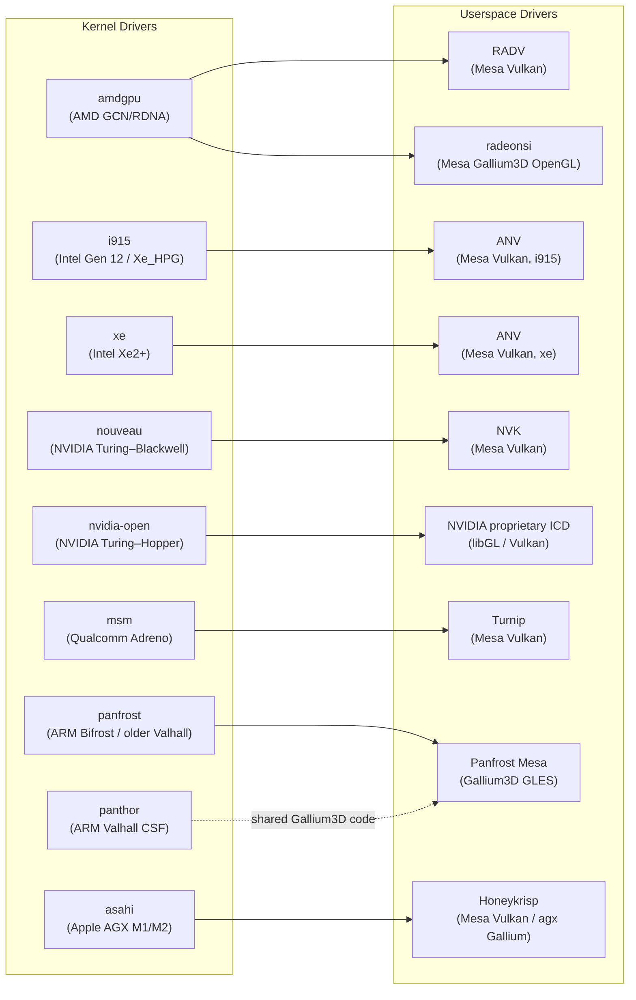

# Appendix D: GPU and Driver Capability Comparison

**Scope**: This appendix targets all three audiences—systems and driver developers, graphics application developers, and browser and web platform engineers. It provides a single-location reference answering "does my driver/hardware combination support this feature?" without requiring the reader to search across multiple chapters. Two structured tables cover the ten major kernel+userspace driver stacks treated in this book, and a cross-reference index maps each capability back to the chapters where it is explained in depth.

**Reference baseline**: Linux kernel 6.12 / Mesa 25.1 / reference date: June 2026.

---

## Table of Contents

- [How to Use This Appendix](#how-to-use-this-appendix)
- [Driver Stack Inventory](#driver-stack-inventory)
- [Table D.1 — Main Capability Matrix](#table-d1--main-capability-matrix)
  - [Band A: API Conformance](#band-a-api-conformance)
  - [Band B: Rendering Features](#band-b-rendering-features)
  - [Band C: Display and System Features](#band-c-display-and-system-features)
  - [Band D: Platform and Compute Features](#band-d-platform-and-compute-features)
- [Table D.1 Footnotes](#table-d1-footnotes)
- [Table D.2 — Hardware Video Codec Sub-Table](#table-d2--hardware-video-codec-sub-table)
- [Table D.2 Footnotes](#table-d2-footnotes)
- [Column Legend](#column-legend)
- [Cross-Reference Index](#cross-reference-index)
- [Maintenance Notes](#maintenance-notes)

---

## How to Use This Appendix

Each row in the main table (Table D.1) corresponds to a specific kernel driver and userspace driver pair. Two rows share the `amdgpu` kernel driver—one for the RADV Vulkan path and one for the radeonsi OpenGL/Gallium path—because the capability sets of those two userspace drivers differ meaningfully and readers choosing between Vulkan and OpenGL on the same AMD hardware need to compare them directly.

Cell status values follow a uniform convention throughout both tables:

- **Yes** — fully supported, no caveats at the reference baseline
- **Yes†** — supported, with a version or hardware qualification in the footnotes
- **Partial** — supported with a meaningful limitation; a brief parenthetical note explains the constraint
- **No** — not supported at the reference baseline
- **N/A** — the capability does not apply to this driver category (for example, Resizable BAR on a mobile or integrated GPU)

Footnote markers (†, ‡, §, ¶, **, ††, ‡‡, §§) are numbered within each table. The footnote text gives the minimum kernel and Mesa version at which the feature reached production quality and flags version-sensitive entries that should be re-verified before publication or a new edition.

The video codec table (Table D.2) is presented separately because per-codec support varies significantly across driver stacks and adding eight sub-columns to Table D.1 would make it unnavigable in print. Both tables cross-reference each other and the relevant chapters in the main body of the book.

---

## Driver Stack Inventory

The ten driver stacks covered are listed below with their kernel driver, userspace driver, hardware family, and minimum versions at which the table entries are considered reliable.

| # | Kernel Driver | Userspace Driver | Hardware Family | Min Kernel | Min Mesa |
|---|---------------|-----------------|-----------------|-----------|---------|
| 1 | `amdgpu` | RADV | AMD GCN4 / RDNA 1–4 (Navi 10 – Navi 4x) | 5.15 | 22.0 |
| 2 | `amdgpu` | radeonsi | AMD GCN2–RDNA 3 (Hawaii – Navi 3x) | 5.15 | 22.0 |
| 3 | `i915` | ANV | Intel Gen 12 (Tiger Lake) / Xe_HPG (Alchemist / Arc A-series) | 5.15 | 22.0 |
| 4 | `xe` | ANV | Intel Xe2 (Battlemage / Arc B-series) / Lunar Lake | 6.8 | 24.1 |
| 5 | `nouveau` | NVK | NVIDIA Turing / Ampere / Ada / Blackwell (GTX 16xx – RTX 50xx) | 6.6 | 24.1 |
| 6 | `nvidia-open` | NVIDIA prop. ICD | NVIDIA Turing / Ampere / Ada / Hopper | 6.1 | N/A |
| 7 | `msm` | Turnip | Qualcomm Adreno 6xx / 7xx | 6.1 | 23.3 |
| 8 | `panfrost` | Panfrost Mesa | ARM Bifrost (Mali-G31 – G76) / older Valhall | 5.15 | 22.0 |
| 9 | `panthor` | Panthor Mesa | ARM Valhall CSF (Mali-G310/G510/G610/G710/G720) | 6.10 | 24.1 |
| 10 | `asahi` | Honeykrisp | Apple M1 / M2 (AGX G13/G14) | 6.6 | 24.1 |

**Notes on row 6**: The `nvidia-open` kernel module is the open-source replacement for the legacy `nvidia.ko`, but the userspace driver (libGL, libEGL, Vulkan ICD) remains the closed proprietary NVIDIA driver. The kernel and userspace components are versioned together as a single driver package rather than independently like Mesa-based stacks.

**Notes on rows 8 and 9**: Panfrost and Panthor share the Panfrost Mesa Gallium3D userspace driver code but use different kernel drivers. Panfrost handles the older job-manager (JM) firmware model; Panthor handles the newer Command Stream Frontend (CSF) firmware model introduced with third-generation Valhall GPUs. They are separate rows because the capabilities differ, particularly for firmware offload and explicit sync.



---

## Table D.1 — Main Capability Matrix

The table below is divided into four column bands for readability. In print the table is rotated 90° (landscape); in digital editions it is horizontally scrollable. The column header abbreviations are expanded in the [Column Legend](#column-legend) section.

### Band A: API Conformance

| # | Driver Stack | VK Version | GL Version |
|---|-------------|-----------|-----------|
| 1 | amdgpu / RADV | **Vulkan 1.4†** (RDNA 1+, formally certified) | N/A (Zink over RADV) |
| 2 | amdgpu / radeonsi | Partial‡ (VK via Zink; native GL path below) | **OpenGL 4.6§** (GCN2+) |
| 3 | i915 / ANV | **Vulkan 1.4†** (Gen 12 / TGL+, DG2/Alch+) | N/A (Zink over ANV) |
| 4 | xe / ANV | **Vulkan 1.4†** (Xe2 / BMG / LNL) | N/A (Zink over ANV) |
| 5 | nouveau / NVK | **Vulkan 1.4¶** (Turing+; Maxwell/Pascal/Volta: conformant since Mesa 25.1) | N/A (Zink over NVK) |
| 6 | nvidia-open | **Vulkan 1.4** (Turing+, proprietary ICD) | **OpenGL 4.6** (proprietary) |
| 7 | msm / Turnip | **Vulkan 1.3** (Adreno 6xx+, Vulkan 1.4 in progress) | N/A (Zink over Turnip) |
| 8 | panfrost / Panfrost | No Vulkan | **OpenGL ES 3.1** (Bifrost G31–G76) |
| 9 | panthor / Panthor | No Vulkan (Vulkan via Zink, experimental) | **OpenGL ES 3.1** (Valhall CSF) |
| 10 | asahi / Honeykrisp | **Vulkan 1.3††** (M1/M2, first conformant on Apple silicon on any OS) | **OpenGL 2.1 / GLES 3.0** (agx Gallium) |

### Band B: Rendering Features

| # | Driver Stack | Ray Tracing (VK_KHR_ray_tracing_pipeline) | Mesh Shaders (VK_EXT_mesh_shader) |
|---|-------------|------------------------------------------|----------------------------------|
| 1 | amdgpu / RADV | **Yes†** (HW BVH: RDNA 2+; RDNA 1 software fallback via BVH build in shader) | **Yes‡‡** (RDNA 2+; amplification + mesh stages) |
| 2 | amdgpu / radeonsi | N/A (OpenGL path; no ray tracing extension in GL core) | N/A |
| 3 | i915 / ANV | **Yes†** (HW RT: DG2/Arc Alchemist+; no RT on integrated Tiger Lake) | **Yes** (DG2/Arc Alchemist+) |
| 4 | xe / ANV | **Yes†** (HW RT: Xe2 Battlemage+) | **Yes** (Xe2 Battlemage+) |
| 5 | nouveau / NVK | **Partial§§** (reverse-engineering ongoing; not yet exposed; Turing+ HW has RT cores) | **Partial** (Turing+ HW supports mesh; NVK driver work in progress) |
| 6 | nvidia-open | **Yes** (Turing+, proprietary ICD; RTX RT cores) | **Yes** (Turing+) |
| 7 | msm / Turnip | **Partial¶¶** (VK_KHR_ray_query merged Mesa 25.0 for Adreno 740+; full pipeline extension not yet) | **Partial** (Adreno 7xx mesh shaders in active development) |
| 8 | panfrost / Panfrost | No | No |
| 9 | panthor / Panthor | No | No |
| 10 | asahi / Honeykrisp | No | No |

### Band C: Display and System Features

| # | Driver Stack | Explicit Sync (wp_linux_drm_syncobj) | VRR Support | HDR Output | ReBAR |
|---|-------------|-------------------------------------|-------------|-----------|-------|
| 1 | amdgpu / RADV | **Yes†** (Mesa 24.1 / kernel 6.6+; DRM_SYNCOBJ export/import correct) | **Yes** (FreeSync / VRR via DCN display engine; DP Adaptive Sync + HDMI 2.1 VRR) | **Yes†** (HDR static metadata via KMS HDR_OUTPUT_METADATA; VK_EXT_hdr_metadata in RADV) | **Yes** (amdgpu_device_resize_fb_bar(); discrete RX 5000+) |
| 2 | amdgpu / radeonsi | **Yes†** (same kernel path as RADV; radeonsi exposes EGL sync) | **Yes** (same display engine as RADV) | **Yes†** (same KMS path; no Vulkan swapchain HDR on GL path) | **Yes** (same as RADV for discrete) |
| 3 | i915 / ANV | **Yes** (i915 DRM_SYNCOBJ + Mesa 24.1) | **Yes†** (DG2/Arc A-series; limited on integrated iGPU models) | **Partial†** (ANV exposes VK_EXT_hdr_metadata; full compositor HDR requires kernel 6.8+ with i915 display updates) | **Yes†** (Arc Alchemist discrete; N/A for iGPU) |
| 4 | xe / ANV | **Yes** (xe driver + Mesa 24.1) | **Yes** (Battlemage / LNL display engine) | **Partial†** (in active development; per-plane color pipeline kernel 6.12+) | **Yes** (Battlemage Arc B-series discrete) |
| 5 | nouveau / NVK | **Yes** (DRM_SYNCOBJ via nouveau KMS + NVK; Turing+) | **Partial†** (VRR requires GSP-RM path; Turing+ only) | **No** (nouveau display engine lacks HDR metadata programming; known limitation) | **Yes†** (nouveau with GSP-RM path; Turing+) |
| 6 | nvidia-open | **Yes** (primary motivation for open module; NVIDIA 555+ driver; EGL-Wayland library updated) | **Yes** (via nvidia-drm KMS properties; DP + HDMI 2.1 VRR) | **Partial†** (VK_EXT_hdr_metadata in 595.58.03+; DRM per-plane color pipeline preview driver required for full compositor HDR) | **Yes** (all supported discrete GPUs) |
| 7 | msm / Turnip | **Yes** (msm DRM_SYNCOBJ + Turnip) | **No** (mobile display engine; VRR not exposed in upstream MSM driver) | **No** | N/A (mobile SoC, no discrete VRAM) |
| 8 | panfrost / Panfrost | **Partial** (basic DRM_SYNCOBJ; explicit Wayland sync protocol support incomplete) | **No** | **No** | N/A (mobile/embedded, no discrete VRAM) |
| 9 | panthor / Panthor | **Yes†** (landed kernel 6.10 / Mesa 24.1; verify exact minimum at publication) | **No** | **No** | N/A (mobile/embedded, no discrete VRAM) |
| 10 | asahi / Honeykrisp | **Yes** (asahi DRM + Honeykrisp explicit sync) | **No** (Apple display engine; no VRR upstream yet) | **No** (AGX display engine; HDR pipeline not implemented) | N/A (SoC, unified memory; no PCIe BAR) |

### Band D: Platform and Compute Features

| # | Driver Stack | Open Firmware / Full OSS | GSP-RM / FW Offload | CUDA / OpenCL | Wayland Direct Scanout | DMA-BUF Import/Export |
|---|-------------|-------------------------|---------------------|---------------|----------------------|----------------------|
| 1 | amdgpu / RADV | **Partial†** (driver OSS; AMD binary firmware blobs required; libre-firmware covers some older GFX versions) | **Yes** (PSP + SMU + DMCUB firmware subsystems) | **Yes (ROCm)†** (HIP + OpenCL via ROCm; GFX9+ officially; RDNA2+ recommended) | **Yes** (DMA-BUF + format modifier negotiation; KMS direct scanout) | **Yes** (exporter + importer; explicit + implicit fence sharing) |
| 2 | amdgpu / radeonsi | **Partial†** (same firmware situation as RADV row) | **Yes** (same PSP/SMU as RADV row) | **Yes (ROCm)†** (same compute stack; radeonsi not the compute path) | **Yes** (same KMS path) | **Yes** (same as RADV row) |
| 3 | i915 / ANV | **Partial†** (i915 OSS; Intel GuC/HuC firmware required; firmware open-sourced on firmware.intel.com) | **Yes** (GuC for GPU scheduling; HuC for media authentication) | **Yes (oneAPI)†** (Intel Graphics Compute Runtime / Level Zero; OpenCL 3.0 conformant) | **Yes** | **Yes** (explicit + implicit) |
| 4 | xe / ANV | **Partial†** (xe OSS; GuC/HuC firmware required; same source as i915 firmware) | **Yes** (GuC dominant in xe; HuC for media) | **Yes (oneAPI)†** (same Intel compute runtime as i915) | **Yes** | **Yes** |
| 5 | nouveau / NVK | **Partial‡** (nouveau OSS; GSP-RM firmware signed by NVIDIA required for Turing+ GSP path; Ada/Blackwell require GSP) | **Partial‡** (GSP path available Turing+, mandatory Ada+; without GSP: limited clock/power management) | **Partial** (OpenCL via Zink compute / Clover; no CUDA; performance significantly below proprietary) | **Yes** (Turing+; requires GSP-RM path for correct fence export) | **Yes†** (explicit fences on Turing+ GSP path; older HW implicit only) |
| 6 | nvidia-open | **No** (kernel module OSS; GSP-RM firmware closed; userspace ICD fully closed) | **Yes** (GSP-RM dominant; all GPU subsystems managed via firmware coprocessor) | **Yes (CUDA + OpenCL)** (proprietary ICD; full CUDA ecosystem; OpenCL via CUDA runtime) | **Yes** (explicit sync mandatory; enabled in NVIDIA 555+ driver) | **Yes** (full explicit + implicit; DMA-BUF fd export/import correct) |
| 7 | msm / Turnip | **Partial†** (MSM driver OSS; Qualcomm GPU firmware required; firmware not open-sourced) | **Yes** (firmware ringbuffer; GPU scheduling via firmware) | **Partial** (OpenCL via Clover/Zink compute; no CUDA equivalent; conformance partial) | **Yes** (DMA-BUF + msm format modifiers) | **Yes** |
| 8 | panfrost / Panfrost | **Yes** (fully open; no firmware blob required; job-manager model) | **No** (job-manager model; no separate firmware coprocessor) | **No** (no conformant OpenCL/compute path upstream) | **Yes** (DMA-BUF import/export for display) | **Yes** |
| 9 | panthor / Panthor | **Partial†** (panthor driver OSS; ARM CSF firmware binary required; closed by ARM) | **Yes** (CSF firmware: panthor_fw.c; firmware handles command stream scheduling) | **No** (no conformant compute path; Zink compute experimental) | **Yes** | **Yes** |
| 10 | asahi / Honeykrisp | **Partial†** (asahi driver OSS; Apple AGX firmware extracted from macOS; not independently redistributable) | **Yes** (AGX firmware coprocessor; handles GPU command submission, power management) | **Partial** (OpenCL via Kazan/Zink compute; work in progress; no CUDA equivalent) | **Yes** | **Yes** |

---

## Table D.1 Footnotes

**Band A Footnotes:**

**†RADV Vulkan 1.4 conformance**: RADV achieved Vulkan 1.4 conformance with Mesa 25.0 (released February 2025). Formally certified in the Khronos conformance database. RDNA 1 (Navi 10, gfx1010) is included in the conformant hardware set. GCN4 (Polaris, gfx803) supports Vulkan via RADV but at Vulkan 1.2–1.3 level only at the reference baseline; verify the exact conformant version string for GCN4 at publication time. Source: [Khronos conformance database](https://www.khronos.org/conformance/adopters/conformant-products/vulkan); Mesa release notes for 25.0.

**‡radeonsi Vulkan**: radeonsi is a Gallium3D OpenGL driver. Its Vulkan exposure is through Zink (the Vulkan-over-OpenGL or OpenGL-over-Vulkan layer in Mesa), not a native Vulkan implementation. The OpenGL 4.6 rating is the native GL path. Source: [mesamatrix.net](https://mesamatrix.net/).

**§radeonsi OpenGL 4.6**: Requires GCN2 (Bonaire/Hawaii) or later and Mesa 20.0+. GCN1 (Southern Islands) was removed from Mesa; those GPUs have no modern driver support. OpenGL 4.6 is achieved via full Gallium3D Radeon driver with ARB_gl_spirv and ARB_spirv_extensions. Source: Mesa `src/gallium/drivers/radeonsi/`.

**†ANV Vulkan 1.4 (i915)**: ANV on i915 achieved Vulkan 1.4 conformance with Mesa 25.0. Tiger Lake (Gen 12, gfx1200) and later integrated GPUs are included. DG2/Arc Alchemist (Xe_HPG, gfx1270) has the most complete feature set. Alder Lake and Rocket Lake are included at Vulkan 1.3+. Source: Mesa 25.0 release notes; Khronos database.

**†ANV Vulkan 1.4 (xe)**: The `xe` kernel driver paired with ANV achieved Vulkan 1.4 conformance for Battlemage (Xe2, BMG, Arc B580/B570) with Mesa 25.1. Lunar Lake (LNL, Xe2 integrated) similarly covered. The `xe` driver was upstreamed in Linux 6.8 as the replacement for i915 on new Intel GPUs. Source: Mesa 25.1 release notes; Linux 6.8 changelog.

**¶NVK Vulkan 1.4**: NVK achieved Vulkan 1.4 conformance for Turing (RTX 20xx) and later with Mesa 25.0. In April 2025, conformance was extended to Maxwell (GTX 900), Pascal (GTX 10xx), and Volta (V100/Titan V) generations. Blackwell (RTX 50xx) support was added in late 2025 via the GSP-RM path. Kepler is supported in mesa but not conformant at the reference baseline. Source: [GamingOnLinux](https://www.gamingonlinux.com/2025/04/mesa-nvk-nvidia-vulkan-driver-now-vulkan-1-4-conformant-on-maxwell-pascal-and-volta-gpus/); Phoronix NVK status update November 2025.

**††Honeykrisp Vulkan 1.3**: Honeykrisp, derived from NVK (the Mesa NVIDIA Vulkan driver), achieved Vulkan 1.3 conformance for Apple M1 in June 2024. It is the first conformant Vulkan 1.3 implementation for Apple hardware on any operating system, with no portability waivers. M2 hardware (AGX G14) is also conformant. M3/M4 support was not upstream at the reference baseline; verify at publication time. Vulkan 1.4 conformance was in progress but not complete at the reference baseline. Source: [Asahi Linux blog](https://asahilinux.org/blog/); [Alyssa Rosenzweig's blog](https://alyssarosenzweig.ca/blog/vk13-on-the-m1-in-1-month.html).

**Band B Footnotes:**

**†RADV ray tracing**: Hardware BVH traversal and ray generation shaders are supported on RDNA 2 (Navi 21/23/24, gfx1030/1031/1032) and later. RDNA 1 (Navi 10/14, gfx1010/1012) lacks hardware BVH traversal units; RADV exposes `VK_KHR_ray_tracing_pipeline` on RDNA 1 using a software-emulated BVH traversal path (traversal loop in a shader). This is correct for conformance but delivers reduced performance. Stable from Mesa 22.3 for RDNA 2; RDNA 1 software path since Mesa 23.0. Mesa 26.0 includes Wave32 optimizations for all RDNA RT shaders. Source: `src/amd/vulkan/radv_pipeline_rt.c`; Mesa 26.0 release notes.

**‡‡RADV mesh shaders**: `VK_EXT_mesh_shader` (the promoted extension, not the NV_mesh_shader predecessor) is supported on RDNA 2 and later. RDNA 2 introduced the amplification stage hardware. Source: Mesa `docs/drivers/radv.rst`.

**†ANV ray tracing (i915)**: Ray tracing is supported only on DG2/Arc Alchemist (Xe_HPG) and later discrete GPUs. Intel integrated GPUs through Tiger Lake (Gen 12) do not have hardware ray tracing units. Source: `src/intel/vulkan/anv_device.c` device feature gates; Mesa ANV documentation.

**†ANV ray tracing (xe)**: Battlemage (Xe2, Arc B-series) has hardware ray tracing units. LNL integrated also has RT hardware. Source: Mesa xe/ANV driver source, `src/intel/vulkan/`.

**§§NVK ray tracing**: NVK is working toward ray tracing support as of the reference baseline. Turing (RTX 20xx) and later have hardware RT cores (BVH traversal units). Faith Ekstrand confirmed in a November 2025 status update that RT is in active reverse-engineering work but shader operation details are still being investigated. Not yet exposed in upstream Mesa at the reference baseline. Source: [Phoronix NVK status 2025](https://www.phoronix.com/news/NVK-Status-Update-2025).

**¶¶Turnip ray query**: `VK_KHR_ray_query` (inline ray queries, not the full pipeline extension) was merged for Adreno 740 (A740, Snapdragon 8 Gen 3) and newer in Mesa 25.0. The full `VK_KHR_ray_tracing_pipeline` extension (with standalone ray generation shaders) was not yet exposed at the reference baseline. Source: [Phoronix Turnip ray query](https://www.phoronix.com/news/Mesa-TURNIP-VK_KHR_ray_query); Mesa 25.0 release notes.

**Band C Footnotes:**

**†RADV explicit sync**: The `wp_linux_drm_syncobj` Wayland protocol requires the compositor, kernel driver, and Mesa driver to all support DRM sync objects. On `amdgpu` + RADV: kernel DRM_SYNCOBJ has been available since kernel 4.14; the Wayland explicit sync protocol (linux-drm-syncobj-v1) stabilised in wayland-protocols 1.34 (2024); RADV correct export/import of acquire/release sync points reached production quality in Mesa 24.1. Compositor support: Mutter 46+ (GNOME 46), KWin 6.1+, wlroots 0.18+ (merged August 2024). Source: wayland-protocols staging protocol XML; Mesa 24.1 release notes.

**†i915 VRR**: VRR (FreeSync / Adaptive Sync) is supported on Arc Alchemist (DG2) discrete GPUs with DisplayPort 1.4 and HDMI 2.1 ports. Intel integrated GPUs (TGL, ADL, RPL) have limited VRR support depending on the platform's display engine version and connector. Source: `drivers/gpu/drm/i915/display/` VRR property handling.

**†i915 HDR**: Intel ANV exposes `VK_EXT_hdr_metadata` via `src/vulkan/wsi/wsi_common.c` for Vulkan swapchain colour-space declarations. Full compositor HDR output (programming HDR_OUTPUT_METADATA on the KMS connector) requires the kernel's display colour management pipeline, which was significantly improved in kernel 6.8+ for Intel display hardware. Source: DRM `DRM_MODE_OBJECT_CONNECTOR HDR_OUTPUT_METADATA` property; `drivers/gpu/drm/i915/display/intel_hdmi.c`.

**†nouveau VRR**: VRR requires the GSP-RM path (Turing+) because clock management for variable refresh requires firmware cooperation. On older NVIDIA hardware without GSP, VRR cannot be implemented. Source: nouveau driver KMS display code; kernel 6.6 nouveau GSP path status.

**†nvidia-open HDR**: `VK_EXT_hdr_metadata` was added to the NVIDIA proprietary Vulkan ICD in driver version 595.58.03 (late 2025). Full compositor HDR on Wayland requires the DRM per-plane colour pipeline API, which reached the mainline kernel in 6.19; NVIDIA released a preview driver with colour pipeline API support. At the reference baseline (kernel 6.12), full HDR output requires a preview driver or distro-specific backport. Source: NVIDIA driver changelog; [Phoronix NVIDIA HDR coverage](https://www.phoronix.com/linux/NVIDIA).

**†Panthor explicit sync**: The `wp_linux_drm_syncobj` protocol for Panthor landed in kernel 6.10 (the same release that upstreamed the Panthor KMS/DRM driver) and Mesa 24.1. Conformance testing for Panthor ran on Linux 6.10.0-rc1 with Mesa 24.1.1, confirming kernel 6.10 + Mesa 24.1 as the minimum viable combination. The exact minimum versions should be re-verified at publication time. Source: Panthor DRM driver source `drivers/gpu/drm/panthor/panthor_gem.c`; Collabora "Taming the Panthor" conformance blog post (Mesa 24.1.1 on kernel 6.10.0-rc1); Phoronix coverage of Panthor Linux 6.10 upstreaming.

**Band D Footnotes:**

**†RADV open firmware**: The `amdgpu` kernel driver and RADV/radeonsi Mesa drivers are fully open source. AMD provides binary firmware blobs (PSP, SMU, GFX, SDMA, VCN microcode) that are required for full GPU functionality; these are distributed through the `linux-firmware` package. The `libre-firmware` project provides open re-implementations for some older GFX versions but not recent RDNA hardware. Source: `linux-firmware` tree on kernel.org; AMD firmware release notes.

**‡nouveau open firmware**: The nouveau open-source driver requires NVIDIA-signed GSP-RM firmware for Turing (RTX 20xx) and later GPUs. Without GSP firmware, the GPU operates with severely restricted clock speeds and no display support (reclocking is locked). On Ada Lovelace (RTX 40xx) and Blackwell (RTX 50xx), GSP-RM is mandatory; the driver will not initialise without the signed firmware blob. The firmware signing requirement means the firmware cannot be independently modified. Source: `drivers/gpu/drm/nouveau/nvkm/subdev/gsp/`; nouveau.freedesktop.org.

**†RADV ROCm compute**: ROCm (Radeon Open Compute) provides HIP (CUDA-compatible GPU programming) and OpenCL via the `rocm-opencl-runtime` stack. Official support targets GFX9 (Vega / CDNA, gfx906/gfx908/gfx90a) and RDNA 2 (gfx1030) and later. RDNA 1 (gfx1010) has unofficial support. GFX9 is being phased out of official ROCm support (gfx906 dropped in ROCm 6.4). RDNA 3 (gfx1100) is fully supported in ROCm 6.0+. RDNA 4 requires ROCm built from source or distribution-specific packages at the reference baseline. Source: [ROCm compatibility matrix](https://rocm.docs.amd.com/en/latest/compatibility/compatibility-matrix.html).

**†Intel oneAPI compute**: Intel Graphics Compute Runtime (NEO) provides OpenCL 3.0 and Level Zero/oneAPI support for Intel Gen 9 (Skylake) and later. The xe driver path enables Level Zero on Battlemage. Source: [Intel compute-runtime GitHub](https://github.com/intel/compute-runtime).

**‡NVK open firmware** (duplicate of Band D note for nouveau): see note ‡ above.

**†MSM open firmware**: The MSM DRM driver is fully open source, but Qualcomm GPU firmware (Adreno firmware blobs: `a6XX_sqe.fw`, `a7XX_sqe.fw`, etc.) is required and is distributed as proprietary binary in `linux-firmware`. Qualcomm has not open-sourced the GPU firmware. Source: `drivers/gpu/drm/msm/adreno/`; `linux-firmware/qcom/`.

**†Panthor open firmware**: The Panthor kernel driver is open source, but the ARM Mali CSF firmware binary (`mali_csffw.bin`) is required and distributed by ARM as a proprietary binary. ARM has not open-sourced the CSF firmware. This is a material difference from the older Panfrost driver (Bifrost/job-manager) which requires no firmware at all. Source: `drivers/gpu/drm/panthor/panthor_fw.c`; ARM firmware distribution.

**†Honeykrisp open firmware**: The `asahi` kernel driver and Honeykrisp Mesa driver are fully open source. However, Apple AGX firmware is extracted from macOS system files and is subject to Apple's software license; it is not independently redistributable. The Asahi Linux project provides tooling to extract the firmware from a user's own macOS installation. Source: asahi-installer documentation; `drivers/gpu/drm/asahi/`.

---

## Table D.2 — Hardware Video Codec Sub-Table

Hardware video decode and encode support varies significantly per driver and per codec. This table uses the VA-API profile names where the decode/encode path is exposed through VA-API, and notes stateless V4L2 paths where relevant.

**Reference**: VA-API profiles defined in `libva/va/va.h`. V4L2 stateless decoder API documented at [kernel.org media API](https://www.kernel.org/doc/html/latest/userspace-api/media/v4l/dev-stateless-decoder.html).

### Decode

| # | Driver Stack | H.264 Decode | H.265 / HEVC Decode | VP9 Decode | AV1 Decode |
|---|-------------|-------------|---------------------|-----------|-----------|
| 1 | amdgpu / RADV | **Yes** (VAProfileH264High; VCN 1.0+ / GCN4+) | **Yes** (VAProfileHEVCMain/Main10; VCN 1.0+) | **Yes** (VAProfileVP9Profile0/2; VCN 2.0+ / RDNA 1+) | **Yes†** (VAProfileAV1Profile0; VCN 3.0+ / RDNA 2+; RDNA 1 No) |
| 2 | amdgpu / radeonsi | **Yes** (same VCN hardware as RADV; VA-API through Mesa Gallium VA frontend) | **Yes** (same hardware) | **Yes** (same hardware) | **Yes†** (same VCN hardware; RDNA 2+ for AV1) |
| 3 | i915 / ANV | **Yes** (VAProfileH264High; Gen 7+; intel-media-driver) | **Yes** (VAProfileHEVCMain/Main10; Gen 9+) | **Yes** (VAProfileVP9Profile0; Gen 9+; Main10: Gen 11+) | **Yes†** (VAProfileAV1Profile0; Gen 12 / TGL+; DG2: AV1 Main 10-bit) |
| 4 | xe / ANV | **Yes** (VAProfileH264High; Xe2/BMG) | **Yes** (VAProfileHEVCMain10; Xe2) | **Yes** (Xe2) | **Yes** (VAProfileAV1Profile0; Xe2/BMG/LNL; Vulkan Video AV1 decode merged Mesa 25.2 dev) |
| 5 | nouveau / NVK | **No** (no VA-API decode path in NVK; VDPAU via legacy nouveau partially works on Kepler/Maxwell) | **No** (no VA-API) | **No** | **No** |
| 6 | nvidia-open | **Yes** (NVDEC via VA-API nvidia-vaapi-driver wrapper; H.264 Kepler+) | **Yes** (NVDEC; Maxwell+) | **Yes** (NVDEC; Pascal+) | **Yes†** (NVDEC AV1; Ampere GA10x and Ada / RTX 30xx+) |
| 7 | msm / Turnip | **Yes†** (V4L2 stateless H.264; Adreno 6xx+; userspace via GStreamer v4l2 codec) | **Yes†** (V4L2 stateless HEVC; Adreno 6xx+) | **Yes†** (V4L2 stateless VP9; Adreno 6xx+) | **Partial†** (AV1 decode: Adreno 7xx hardware; V4L2 kernel driver in progress; verify at publication) |
| 8 | panfrost / Panfrost | **No** (no video decode hardware in Bifrost GPU; separate VPU on SoC if present) | **No** | **No** | **No** |
| 9 | panthor / Panthor | **No** (same as Panfrost; Valhall CSF GPU has no integrated VPU) | **No** | **No** | **No** |
| 10 | asahi / Honeykrisp | **Partial†** (Apple ANE/VPU separate from GPU; no VA-API integration upstream; ffmpeg hwaccel work in progress) | **Partial†** (same ANE caveat) | **No** | **No** |

### Encode

| # | Driver Stack | H.264 Encode | H.265 / HEVC Encode | AV1 Encode |
|---|-------------|-------------|---------------------|-----------|
| 1 | amdgpu / RADV | **Yes** (VAEntrypointEncSlice; VAProfileH264High; VCN 1.0+ / GCN4+) | **Yes** (VAEntrypointEncSlice HEVC; VCN 2.0+ / RDNA 1+) | **Yes†** (VAProfileAV1Profile0 encode; VCN 4.0 / RDNA 3+ only; Mesa 24.1 adds AV1 LTR encode) |
| 2 | amdgpu / radeonsi | **Yes** (same VCN hardware; VA-API through radeonsi Gallium VA) | **Yes** (same hardware) | **Yes†** (same VCN 4.0 / RDNA 3+ restriction) |
| 3 | i915 / ANV | **Yes** (VAEntrypointEncSlice H.264; Gen 7+; intel-media-driver) | **Yes** (HEVC encode; Gen 9+) | **Yes†** (AV1 encode: Arc Alchemist DG2+ / AVC Gen 12.5+; not on pre-DG2 iGPU) |
| 4 | xe / ANV | **Yes** (H.264 encode; Xe2) | **Yes** (HEVC; Xe2) | **Yes** (AV1 encode; Xe2 / Battlemage) |
| 5 | nouveau / NVK | **No** (no NVENC path in NVK or nouveau) | **No** | **No** |
| 6 | nvidia-open | **Yes** (NVENC via VA-API nvidia-vaapi-driver; H.264 Kepler+) | **Yes** (NVENC HEVC; Maxwell+) | **Yes†** (NVENC AV1 encode: Ada Lovelace RTX 40xx+) |
| 7 | msm / Turnip | **Yes†** (V4L2 stateful H.264 encode; Adreno 6xx; Venus firmware VPU on some SoCs) | **Partial†** (HEVC encode; Adreno 7xx; kernel driver in progress) | **No** |
| 8 | panfrost / Panfrost | **No** | **No** | **No** |
| 9 | panthor / Panthor | **No** | **No** | **No** |
| 10 | asahi / Honeykrisp | **No** (no upstream VA-API encode path) | **No** | **No** |

---

## Table D.2 Footnotes

**†AV1 decode (AMD)**: AV1 decode requires VCN 3.0, which first appeared in RDNA 2 (Navi 21 / RX 6000 series). RDNA 1 (VCN 2.0) does not support AV1. VCN 3.0 handles AV1 8-bit and 10-bit in the `VAProfileAV1Profile0` profile. Source: Video Core Next Wikipedia; AMD VCN documentation; Mesa `src/gallium/drivers/radeonsi/si_uvd.c`.

**†AV1 decode (Intel Gen 12)**: Tiger Lake (Gen 12, integrated) supports AV1 decode at 8-bit. DG2/Arc Alchemist extends this to 10-bit. Earlier generations (Gen 11 and before) do not support AV1 decode. Source: `intel-media-driver` codec caps; Intel ARK database.

**†NVIDIA AV1 decode**: NVDEC AV1 decode was introduced with the Ampere architecture's GA10x die (RTX 3060 and above, but not GA102 in the RTX 3080/3090 Ampere series). Ada Lovelace (RTX 40xx) has AV1 decode in all models. Source: NVIDIA NVDEC capability matrix; nvidia-vaapi-driver README.

**†Turnip / MSM video**: The MSM driver uses V4L2 stateless codec support in the kernel. For Adreno 6xx, H.264, HEVC, and VP9 are handled by the dedicated video decode hardware exposed through `drivers/media/platform/qcom/venus/`. AV1 decode hardware exists in Adreno 7xx (Snapdragon 8 Gen 2 / SM8550 and later) but the V4L2 kernel driver support for AV1 was in active development at the reference baseline. Source: `drivers/media/platform/qcom/venus/`; freedreno project status.

**†Honeykrisp video**: Apple M1/M2 SoCs include Apple Neural Engine (ANE) and a separate video decode accelerator. As of the reference baseline, there is no upstream Linux VA-API driver for Apple's video hardware; the GPU driver (Honeykrisp/agx) does not include video acceleration. ffmpeg developers have prototyped Apple Silicon video acceleration on Linux but it has not reached upstream. Source: Asahi Linux project status; ffmpeg Apple VT hwaccel.

**†AV1 encode (AMD, RDNA 3)**: VCN 4.0 (RDNA 3 / Navi 3x series, gfx1100) introduced AV1 encode support. Mesa 24.1 added AV1 Long-Term Reference (LTR) encode support for VCN 4.0 GPUs. RDNA 1 and RDNA 2 GPUs with VCN 2.0/3.0 do not support AV1 encode. Source: [Phoronix Mesa 24.1 AV1 LTR](https://www.phoronix.com/news/Mesa-24.1-AV1-Encode-LTR-AMD); Mesa `src/gallium/drivers/radeonsi/si_vce.c`.

**†AV1 encode (Intel)**: AV1 encode is available on Arc Alchemist (DG2) and later. Intel integrated GPUs prior to Arc do not support AV1 encode. The AV1 encode profile is `VAProfileAV1Profile0` with `VAEntrypointEncSliceLP`. Source: `intel-media-driver` capability tables; Intel media driver release notes.

**†NVIDIA AV1 encode**: NVENC AV1 encode was introduced with Ada Lovelace (RTX 40xx series). Ampere (RTX 30xx) does not support AV1 encode, only AV1 decode (on Ampere GA10x dies). Source: NVIDIA NVENC capability matrix; nvidia-vaapi-driver README.

**†Turnip H.264 / HEVC encode**: Adreno 6xx exposes H.264 encode via V4L2 stateful encoder (`VEN` hardware block). HEVC encode hardware exists in Adreno 7xx. The `linux-firmware` package includes the Venus firmware for these hardware blocks on Snapdragon SoCs. Source: `drivers/media/platform/qcom/venus/venc.c`.

---

## Column Legend

The following table expands abbreviated column headers from Table D.1 to their full extension names or standard specification names.

| Abbreviation | Full Name | Specification / Standard |
|-------------|-----------|-------------------------|
| VK Version | Vulkan API conformant version | Khronos Vulkan specification |
| GL Version | OpenGL / OpenGL ES conformant version | Khronos OpenGL specification |
| Ray Tracing | VK_KHR_ray_tracing_pipeline | Khronos Vulkan ray tracing KHR extension |
| Mesh Shaders | VK_EXT_mesh_shader | Khronos Vulkan mesh shader EXT extension |
| Explicit Sync | wp_linux_drm_syncobj (linux-drm-syncobj-v1) | Wayland staging protocol / DRM sync objects |
| VRR | Variable Refresh Rate (FreeSync / G-Sync Compatible / HDMI 2.1 VRR) | VESA Adaptive Sync; HDMI Forum VRR |
| HDR Output | High Dynamic Range static metadata output | SMPTE ST 2086; CTA-861-G HDR |
| ReBAR | Resizable BAR (PCIe Base Address Register resizing) | PCI Express Base Specification |
| Open FW | Open firmware / fully open-source driver stack | — |
| GSP-RM / FW | GPU System Processor / firmware offload for GPU management | Driver-specific |
| CUDA / CL | CUDA (NVIDIA), ROCm/HIP (AMD), oneAPI/Level Zero (Intel), OpenCL | Khronos OpenCL; NVIDIA CUDA; AMD ROCm; Intel oneAPI |
| Scanout | Wayland direct scanout via linux-dmabuf + KMS (zero-copy) | linux-dmabuf-v1 Wayland protocol |
| DMA-BUF | DMA buffer import/export with fence sharing | Linux kernel dma_buf framework |

---

## Cross-Reference Index

This alphabetical index maps each capability to the chapter(s) in the main text where it is explained in depth. Chapter numbers follow the book's table of contents.

```
AV1 hardware decode .................... Ch26
AV1 hardware encode .................... Ch26
CUDA / HIP (NVIDIA compute) ............ Ch25
DMA-BUF import/export .................. Ch4, Ch20, Ch26
Explicit sync (wp_linux_drm_syncobj) ... Ch3, Ch18, Ch20
GSP-RM / firmware offload .............. Ch9 (NVIDIA GSP), Ch5 (Intel GuC/HuC), Ch6 (Panthor CSF)
H.264 hardware decode .................. Ch26
H.265 / HEVC hardware decode ........... Ch26
HDR output (KMS + Vulkan) .............. Ch3, Ch24
Intel oneAPI / Level Zero .............. Ch25
Mesh shaders ........................... Ch14, Ch18
NVK (nouveau Vulkan driver) ............ Ch7, Ch8, Ch9, Ch10
Open firmware / OSS driver status ...... Ch6 (mobile), Ch7–9 (NVIDIA)
OpenCL / ROCm (AMD compute) ............ Ch25
Panfrost / Panthor ..................... Ch6
Ray tracing ............................ Ch10, Ch18
ReBAR (Resizable BAR) .................. Ch4, Ch5
Turnip (Qualcomm Adreno Vulkan) ........ Ch11
VA-API / VAAPI ......................... Ch26
VP9 hardware decode .................... Ch26
VRR / FreeSync / Adaptive Sync ......... Ch3, Ch22
Vulkan conformance (RADV) .............. Ch16, Ch18
Vulkan conformance (ANV) ............... Ch16, Ch17
Vulkan conformance (NVK) ............... Ch7, Ch10
Wayland direct scanout ................. Ch4, Ch20, Ch22
```

---

## Maintenance Notes

### Reference Version Baseline

All entries in this appendix were authored against the following baseline. Before final manuscript submission and before each new edition, every `Yes†` and `Partial` entry must be re-audited against the then-current baseline:

```
Reference baseline: Linux kernel 6.12 / Mesa 25.1 / June 2026
```

### Version-Sensitive Entries (verify before publication)

The following cells are the most likely to change between manuscript submission and publication, or between book editions. Each should be re-verified against the reference baseline immediately before final submission:

1. **NVK — Vulkan conformance version**: NVK conformance advances rapidly. As of mid-2025 the driver is Vulkan 1.4 conformant on Turing through Blackwell. Re-verify the exact conformant hardware list and whether Blackwell full conformance is certified. Source: [Khronos conformance database](https://www.khronos.org/conformance/adopters/conformant-products/vulkan) filtered by "Linux + NVK".

2. **Honeykrisp — Vulkan conformance version and scope**: Honeykrisp achieved Vulkan 1.3 conformance for M1 and M2 in 2024. Verify: (a) whether Vulkan 1.4 conformance has been achieved, (b) whether M3 (AGX G15) and M4 (AGX G16) are covered. Source: [Khronos conformance database](https://www.khronos.org/conformance/adopters/conformant-products/vulkan) filtered by "Apple" or "Honeykrisp"; Asahi Linux blog.

3. **Turnip — AV1 decode and Vulkan 1.4 conformance**: Adreno 7xx AV1 decode via V4L2 was in active development at the reference baseline. Also verify whether Turnip has achieved Vulkan 1.4 conformance (it was Vulkan 1.3 conformant, with 1.4 work in progress in Mesa 25.x). Source: Mesa `src/freedreno/vulkan/`; Khronos conformance database; freedreno mailing list.

4. **Panthor — explicit sync minimum versions**: Panthor explicit sync support landed in kernel 6.10 and Mesa 24.1. Verify that the minimum version footnote is correct and that no regressions were introduced. Source: `drivers/gpu/drm/panthor/`; Mesa 24.1 release notes; Collabora conformance blog.

5. **ANV/xe — Vulkan 1.4 conformance on Battlemage**: Verify the exact Khronos-certified conformant version for the `xe` kernel driver + ANV combination on Battlemage (Xe2). Source: [Khronos conformance database](https://www.khronos.org/conformance/adopters/conformant-products/vulkan) filtered by "Intel + ANV + Xe2".

6. **RADV — RDNA 1 ray tracing**: RDNA 1 ray tracing via software BVH traversal is unlikely to change, but verify there has been no regression or removal of RDNA 1 support from the RT code path in recent Mesa releases. Source: Mesa `src/amd/vulkan/radv_bvh.c` and `radv_pipeline_rt.c`.

7. **nouveau / NVK — Blackwell GPU requirement for GSP**: Ada Lovelace (gfx100x / RTX 40xx) requires GSP-RM. Verify whether Blackwell (RTX 50xx) similarly requires GSP-RM and whether Blackwell support has fully landed in the open-source nouveau/NVK stack. Source: `drivers/gpu/drm/nouveau/nvkm/subdev/gsp/`; nouveau mailing list and patchwork.

8. **nvidia-open — HDR full compositor path**: The DRM per-plane colour pipeline API reached kernel 6.19. Verify whether the mainline NVIDIA open kernel module (not preview) supports the colour pipeline API and whether KWin and Mutter HDR work correctly with nvidia-open at the publication kernel version. Source: NVIDIA driver release notes; `drivers/gpu/drm/` colour pipeline patches.

9. **NVK — ray tracing and mesh shader exposure**: Both features were in active development at the reference baseline. Verify whether either has been merged to Mesa main and exposed in the driver. Source: Mesa `src/nouveau/vulkan/`; Faith Ekstrand's NVK status updates on Collabora blog.

### Update Procedure for New Editions

1. Update the reference baseline kernel and Mesa versions in the appendix header.
2. Take a fresh snapshot of [mesamatrix.net](https://mesamatrix.net/) for the OpenGL conformance column. Compare against previous snapshot.
3. Export the Khronos Vulkan conformance database filtered by "Linux" and cross-check each driver stack row. Record the highest conformant version for each.
4. Review each Mesa driver's `docs/drivers/<driver>.rst` changelog since the previous baseline for new extensions.
5. Review `drm-misc-next` and per-driver branches for display feature additions (VRR, HDR, explicit sync, new codec support).
6. Re-check the "version-sensitive entries" list above.
7. Update all footnotes that cite specific kernel or Mesa version numbers.
8. If the book's chapter structure has changed, update the cross-reference index.

### Authoritative Sources for Each Column

| Column | Primary Source |
|--------|---------------|
| Vulkan version | [Khronos conformance database](https://www.khronos.org/conformance/adopters/conformant-products/vulkan) |
| OpenGL version | [mesamatrix.net](https://mesamatrix.net/) |
| Ray tracing | Mesa `docs/drivers/radv.rst`, `docs/drivers/anv.rst`; Khronos conformance for `VK_KHR_ray_tracing_pipeline` |
| Mesh shaders | Mesa per-driver docs; Khronos conformance for `VK_EXT_mesh_shader` |
| Explicit sync | wayland-protocols `linux-drm-syncobj-v1.xml`; per-driver Mesa MR history |
| VRR | `drivers/gpu/drm/drm_connector.c` VRR_CAPABLE; per-driver display docs |
| HDR output | `DRM_MODE_OBJECT_CONNECTOR HDR_OUTPUT_METADATA`; Mesa `src/vulkan/wsi/wsi_common.c` |
| ReBAR | `drivers/pci/pci.c`; per-driver BAR resize functions |
| Open firmware | [freedesktop.org DRM wiki status](https://gitlab.freedesktop.org/drm/wiki/-/wikis/Status) |
| GSP-RM | Per-driver kernel source: `amdgpu_psp.c`, `i915/gt/uc/`, `nvidia/nv-pci.c`, `panthor_fw.c` |
| CUDA / OpenCL | [ROCm compatibility matrix](https://rocm.docs.amd.com/en/latest/compatibility/compatibility-matrix.html); [Intel compute-runtime](https://github.com/intel/compute-runtime); NVIDIA CUDA docs |
| Video decode/encode | `intel-media-driver`; Mesa `src/gallium/drivers/radeonsi/`; `linux-firmware`; `drivers/media/platform/qcom/venus/` |
| Wayland direct scanout | wlroots `render/drm/`; Mutter `backends/native/`; DRM `DRM_IOCTL_MODE_ADDFB2` |
| DMA-BUF | `include/linux/dma-buf.h`; per-driver `drivers/gpu/drm/<driver>/`; linux-dmabuf-v1 protocol |

---

## References

1. Mesa 25.0 release notes: [https://docs.mesa3d.org/relnotes/25.0.0.html](https://docs.mesa3d.org/relnotes/25.0.0.html)
2. Mesa 25.1 release notes: [https://docs.mesa3d.org/relnotes/25.1.0.html](https://docs.mesa3d.org/relnotes/25.1.0.html)
3. Khronos Vulkan conformance database: [https://www.khronos.org/conformance/adopters/conformant-products/vulkan](https://www.khronos.org/conformance/adopters/conformant-products/vulkan)
4. Mesa feature matrix (mesamatrix.net): [https://mesamatrix.net/](https://mesamatrix.net/)
5. NVK Vulkan 1.4 conformance on Maxwell/Pascal/Volta (April 2025): [https://www.gamingonlinux.com/2025/04/mesa-nvk-nvidia-vulkan-driver-now-vulkan-1-4-conformant-on-maxwell-pascal-and-volta-gpus/](https://www.gamingonlinux.com/2025/04/mesa-nvk-nvidia-vulkan-driver-now-vulkan-1-4-conformant-on-maxwell-pascal-and-volta-gpus/)
6. NVK status update, November 2025: [https://www.phoronix.com/news/NVK-Status-Update-2025](https://www.phoronix.com/news/NVK-Status-Update-2025)
7. NVK Mesa documentation: [https://docs.mesa3d.org/drivers/nvk.html](https://docs.mesa3d.org/drivers/nvk.html)
8. Honeykrisp Vulkan 1.3 on M1 (Asahi Linux, June 2024): [https://asahilinux.org/2024/06/vk13-on-the-m1-in-1-month/](https://asahilinux.org/2024/06/vk13-on-the-m1-in-1-month/)
9. Alyssa Rosenzweig, "Vulkan 1.3 on the M1 in 1 month": [https://alyssarosenzweig.ca/blog/vk13-on-the-m1-in-1-month.html](https://alyssarosenzweig.ca/blog/vk13-on-the-m1-in-1-month.html)
10. RADV ray tracing Mesa 26.0 improvements: [https://www.phoronix.com/news/RADV-RT-RDNA3-RDNA4-Wave32](https://www.phoronix.com/news/RADV-RT-RDNA3-RDNA4-Wave32)
11. Turnip VK_KHR_ray_query landing (Mesa 25.0): [https://www.phoronix.com/news/Mesa-TURNIP-VK_KHR_ray_query](https://www.phoronix.com/news/Mesa-TURNIP-VK_KHR_ray_query)
12. Panthor driver Linux 6.10: [https://www.phoronix.com/news/Panthor-Driver-Linux-6.10](https://www.phoronix.com/news/Panthor-Driver-Linux-6.10)
13. Panthor OpenGL ES 3.1 conformance (Mali-G610): [https://www.collabora.com/news-and-blog/news-and-events/taming-the-panthor-opengl-es-31-conformance-achived-mali-g610.html](https://www.collabora.com/news-and-blog/news-and-events/taming-the-panthor-opengl-es-31-conformance-achived-mali-g610.html)
14. Mesa 24.1 explicit sync Vulkan WSI: [https://9to5linux.com/mesa-24-1-linux-graphics-stack-released-with-vulkan-x11-wsi-explicit-sync-support](https://9to5linux.com/mesa-24-1-linux-graphics-stack-released-with-vulkan-x11-wsi-explicit-sync-support)
15. NVIDIA driver 555.58 Wayland explicit sync: [https://www.gamingonlinux.com/2024/06/nvidia-driver-555-58-released-as-stable-bringing-wayland-explicit-sync/](https://www.gamingonlinux.com/2024/06/nvidia-driver-555-58-released-as-stable-bringing-wayland-explicit-sync/)
16. NVIDIA open-gpu-kernel-modules: [https://github.com/nvidia/open-gpu-kernel-modules](https://github.com/nvidia/open-gpu-kernel-modules)
17. linux-drm-syncobj-v1 Wayland protocol: [https://gitlab.freedesktop.org/wayland/wayland-protocols/-/blob/main/staging/linux-drm-syncobj/linux-drm-syncobj-v1.xml](https://gitlab.freedesktop.org/wayland/wayland-protocols/-/blob/main/staging/linux-drm-syncobj/linux-drm-syncobj-v1.xml)
18. AMD Mesa 24.1 AV1 LTR encode for RDNA3/VCN4: [https://www.phoronix.com/news/Mesa-24.1-AV1-Encode-LTR-AMD](https://www.phoronix.com/news/Mesa-24.1-AV1-Encode-LTR-AMD)
19. ROCm compatibility matrix: [https://rocm.docs.amd.com/en/latest/compatibility/compatibility-matrix.html](https://rocm.docs.amd.com/en/latest/compatibility/compatibility-matrix.html)
20. Intel compute-runtime (NEO) for OpenCL / oneAPI: [https://github.com/intel/compute-runtime](https://github.com/intel/compute-runtime)
21. Kernel V4L2 stateless decoder API: [https://www.kernel.org/doc/html/latest/userspace-api/media/v4l/dev-stateless-decoder.html](https://www.kernel.org/doc/html/latest/userspace-api/media/v4l/dev-stateless-decoder.html)
22. DRM/Mesa open-source driver status wiki: [https://gitlab.freedesktop.org/drm/wiki/-/wikis/Status](https://gitlab.freedesktop.org/drm/wiki/-/wikis/Status)
23. Intel ANV Vulkan Video AV1 decode on Battlemage/LNL (Mesa 25.2 dev): [https://www.phoronix.com/news/Intel-ANV-Vulkan-AV1-Decode](https://www.phoronix.com/news/Intel-ANV-Vulkan-AV1-Decode)
24. Mesa 25.0 brings Vulkan 1.4 to RADV, ANV, NVK: [https://9to5linux.com/mesa-25-0-linux-graphics-stack-brings-vulkan-1-4-support-on-radv-anv-and-nvk](https://9to5linux.com/mesa-25-0-linux-graphics-stack-brings-vulkan-1-4-support-on-radv-anv-and-nvk)
25. NVK "ready for prime time" (Collabora blog): [https://www.collabora.com/news-and-blog/news-and-events/nvk-is-now-ready-for-prime-time.html](https://www.collabora.com/news-and-blog/news-and-events/nvk-is-now-ready-for-prime-time.html)

---

*Copyright © 2026 jreuben11. Licensed under [CC BY 4.0](https://creativecommons.org/licenses/by/4.0/).*
