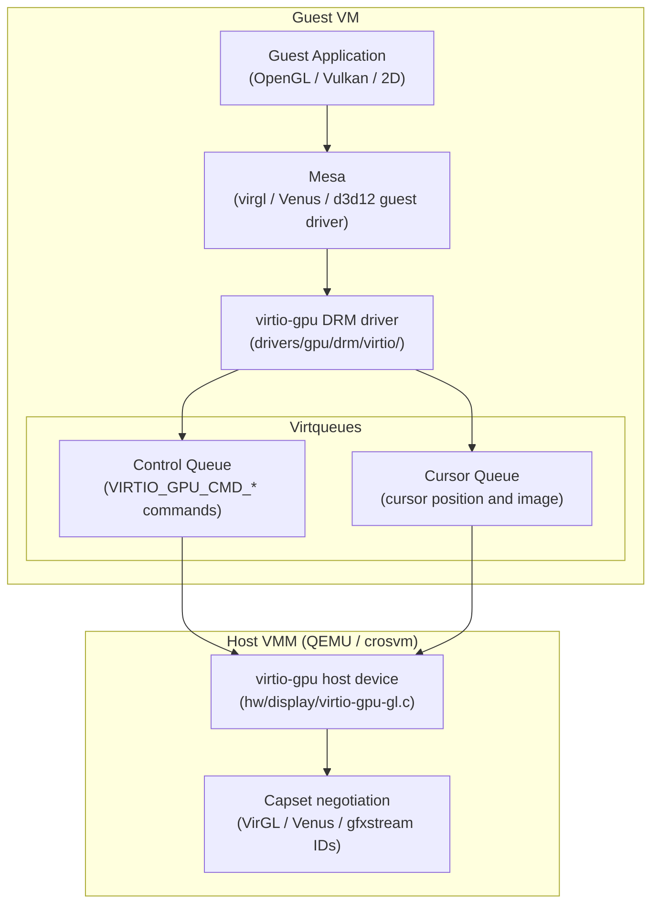
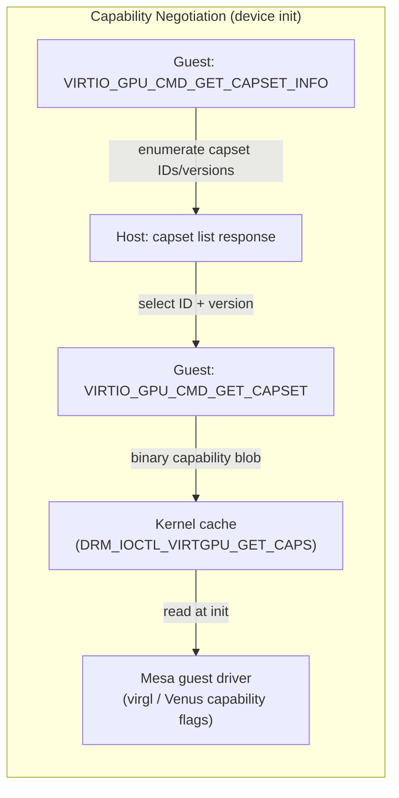
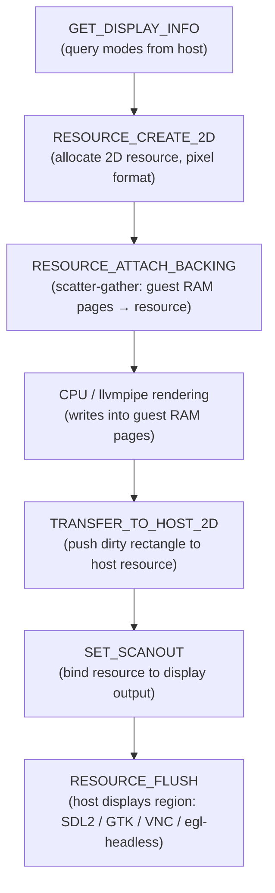
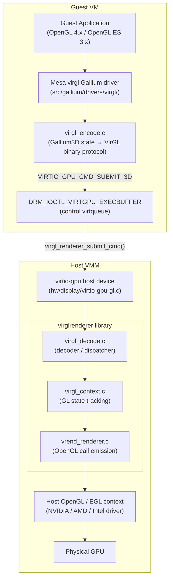
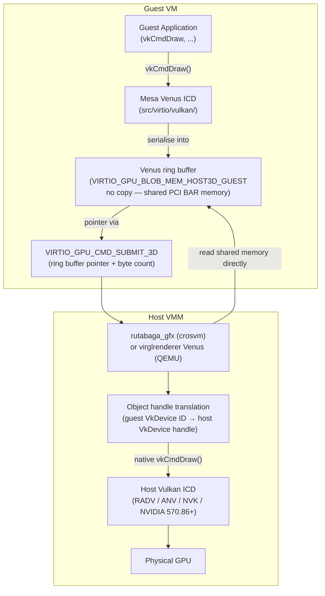
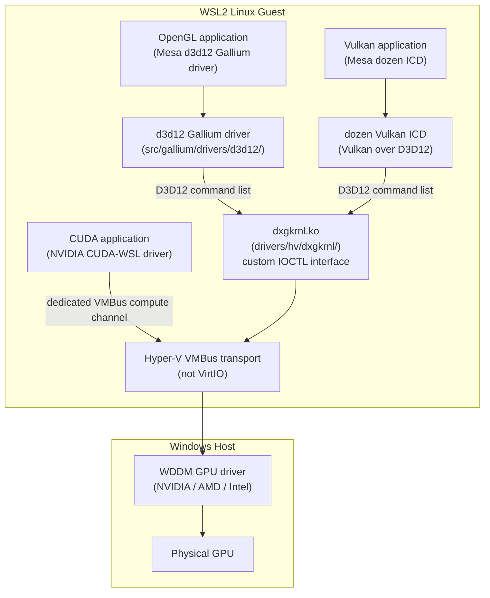
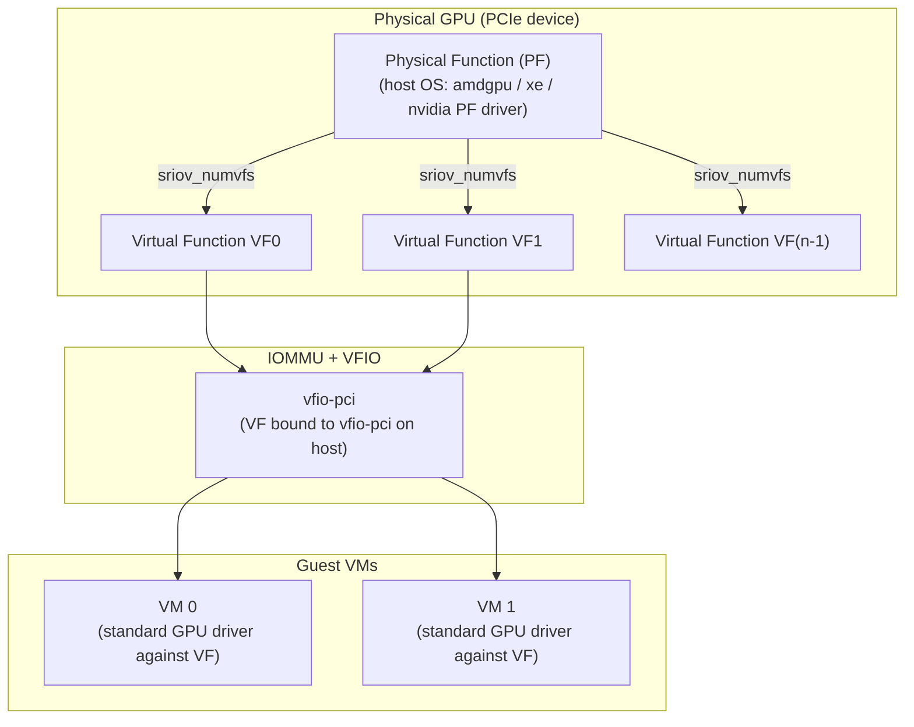

# Appendix F: virtio-gpu and GPU Virtualisation

**Audience**: All readers — systems and driver developers, graphics application developers, and browser/web platform engineers deploying Linux workloads in virtualised or containerised environments.

GPU virtualisation spans a wide range of deployment contexts — cloud virtual machines, WSL2 developer desktops, CI pipelines, container workloads, and enterprise GPU time-sharing — yet the underlying mechanisms are rarely explained in a single coherent reference. This appendix maps the full virtualisation stack from the virtio-gpu wire protocol up through VirGL and Venus to vendor SR-IOV schemes, giving the reader an architectural reference to consult when diagnosing performance problems or selecting an appropriate virtualisation strategy. It complements the main text by collecting in one place subsystems that are otherwise scattered across kernel driver trees, Mesa Gallium sources, and vendor documentation, and provides practical guidance for choosing the right approach in each deployment scenario.

---

## Table of Contents

- [F.1 virtio-gpu DRM Driver Architecture](#f1-virtio-gpu-drm-driver-architecture)
  - [F.1.1 The virtio-gpu Command Protocol](#f11-the-virtio-gpu-command-protocol)
  - [F.1.2 Blob Resource Extension for DMA-BUF Guest/Host Sharing](#f12-blob-resource-extension-for-dma-buf-guesthost-sharing)
  - [F.1.3 Display Mode (No 3D): Simple KMS Scanout over virtio](#f13-display-mode-no-3d-simple-kms-scanout-over-virtio)
- [F.2 VirGL: OpenGL Virtualisation over virtio-gpu](#f2-virgl-opengl-virtualisation-over-virtio-gpu)
  - [F.2.1 virglrenderer Host Library](#f21-virglrenderer-host-library)
  - [F.2.2 Guest Mesa virgl Gallium Driver](#f22-guest-mesa-virgl-gallium-driver)
  - [F.2.3 Performance Characteristics: Latency of Command Serialisation](#f23-performance-characteristics-latency-of-command-serialisation)
- [F.3 Venus: Vulkan over virtio-gpu](#f3-venus-vulkan-over-virtio-gpu)
  - [F.3.1 The Venus Protocol: Vulkan Commands Serialised over Virtqueues](#f31-the-venus-protocol-vulkan-commands-serialised-over-virtqueues)
  - [F.3.2 udmabuf: Zero-Copy Buffer Sharing Between Guest DMA-BUF and Host](#f32-udmabuf-zero-copy-buffer-sharing-between-guest-dma-buf-and-host)
  - [F.3.3 gfxstream: Google's Alternative to Venus for Android Virtualisation](#f33-gfxstream-googles-alternative-to-venus-for-android-virtualisation)
- [F.4 WSL2 GPU Pass-Through (D3D12 Backend)](#f4-wsl2-gpu-pass-through-d3d12-backend)
  - [F.4.1 How Microsoft's DXCore Driver Appears to the WSL2 Kernel](#f41-how-microsofts-dxcore-driver-appears-to-the-wsl2-kernel)
  - [F.4.2 Performance Characteristics vs. Native Linux](#f42-performance-characteristics-vs-native-linux)
- [F.5 Container GPU Access](#f5-container-gpu-access)
  - [F.5.1 Kubernetes Device Plugins for DRM Devices](#f51-kubernetes-device-plugins-for-drm-devices)
  - [F.5.2 cgroup DRM Device Access Policy](#f52-cgroup-drm-device-access-policy)
  - [F.5.3 The `--device=dri` Problem in Docker/Podman](#f53-the---devicedri-problem-in-dockerpodman)
- [F.6 Vendor SR-IOV Virtualisation](#f6-vendor-sr-iov-virtualisation)
  - [F.6.1 NVIDIA vGPU: MIG on A100/H100; Mediated Device Pass-Through](#f61-nvidia-vgpu-mig-on-a100h100-mediated-device-pass-through)
  - [F.6.2 AMD MxGPU: SR-IOV Virtual Functions on Radeon Pro](#f62-amd-mxgpu-sr-iov-virtual-functions-on-radeon-pro)
  - [F.6.3 Intel GVT-g → SR-IOV: The Transition on Intel](#f63-intel-gvt-g--sr-iov-the-transition-on-intel)
- [F.7 Practical Guidance: Choosing Virtio-gpu vs. Pass-Through vs. Software](#f7-practical-guidance-choosing-virtio-gpu-vs-pass-through-vs-software)
  - [F.7.1 Decision Matrix](#f71-decision-matrix)
  - [F.7.2 Performance Ranking](#f72-performance-ranking-approximate-relative-to-bare-metal)
  - [F.7.3 Configuration Quick-Start Commands](#f73-configuration-quick-start-commands)
- [Integrations](#integrations)
- [References](#references)

---

## F.1 virtio-gpu DRM Driver Architecture

The virtio-gpu device is a paravirtualised graphics device specified in the VirtIO 1.2 standard (section 5.7). Unlike SR-IOV pass-through (covered in F.6), which presents a physical PCIe device directly to the guest, virtio-gpu defines a well-specified wire protocol between a cooperative guest driver and a host-side emulator. This design gives the host complete control over resource allocation, command validation, and scheduling — critical properties for multi-tenant cloud workloads — at the cost of some performance overhead relative to bare metal.

The Linux guest driver lives in `drivers/gpu/drm/virtio/` and presents a fully compliant DRM device to userspace. Applications see a standard DRM file descriptor, can perform GEM allocations, submit command buffers via `DRM_IOCTL_VIRTGPU_EXECBUFFER`, and use the DRM fence/syncobj infrastructure for synchronisation. Mesa autodetects the virtio-gpu DRM device and selects the appropriate guest driver (virgl, Venus, or d3d12 on WSL2) based on the capability sets advertised by the host.



### F.1.1 The virtio-gpu Command Protocol

virtio-gpu communicates over two virtqueues: a **control queue** for synchronous command submission and resource management, and a **cursor queue** for fast, low-latency cursor position and image updates. Every command is a fixed-size C struct prefixed by `struct virtio_gpu_ctrl_hdr`, defined in `include/uapi/linux/virtio_gpu.h`:

```c
/* include/uapi/linux/virtio_gpu.h */
struct virtio_gpu_ctrl_hdr {
    __le32 type;        /* VIRTIO_GPU_CMD_* or VIRTIO_GPU_RESP_* */
    __le32 flags;       /* VIRTIO_GPU_FLAG_FENCE */
    __le64 fence_id;    /* non-zero iff FENCE flag set */
    __le32 ctx_id;      /* 3D context ID (0 for 2D commands) */
    __u8   ring_idx;    /* index into per-context timeline ring (Venus) */
    __u8   padding[3];
};
```

The type field encodes the command opcode. The complete set of resource management commands is:

| Command | Struct | Purpose |
|---------|--------|---------|
| `VIRTIO_GPU_CMD_RESOURCE_CREATE_2D` | `virtio_gpu_resource_create_2d` | Allocate a 2D scanout resource (display-only, no 3D) |
| `VIRTIO_GPU_CMD_RESOURCE_CREATE_3D` | `virtio_gpu_resource_create_3d` | Allocate a 3D resource (requires capset support) |
| `VIRTIO_GPU_CMD_RESOURCE_ATTACH_BACKING` | `virtio_gpu_resource_attach_backing` | Attach guest scatter-gather memory to a resource |
| `VIRTIO_GPU_CMD_TRANSFER_TO_HOST_2D` | `virtio_gpu_transfer_to_host_2d` | DMA a rectangle of guest memory to a host resource |
| `VIRTIO_GPU_CMD_TRANSFER_TO_HOST_3D` | `virtio_gpu_transfer_host_3d` | DMA a 3D sub-region to/from a host resource |
| `VIRTIO_GPU_CMD_SUBMIT_3D` | `virtio_gpu_cmd_submit` | Submit a command buffer to a 3D rendering context |
| `VIRTIO_GPU_CMD_CTX_CREATE` | `virtio_gpu_ctx_create` | Create a 3D rendering context (VirGL or Venus) |
| `VIRTIO_GPU_CMD_SET_SCANOUT` | `virtio_gpu_set_scanout` | Bind a resource to a display scanout output |
| `VIRTIO_GPU_CMD_RESOURCE_FLUSH` | `virtio_gpu_resource_flush` | Flush a display region from resource to physical output |
| `VIRTIO_GPU_CMD_GET_CAPSET_INFO` | `virtio_gpu_get_capset_info` | Query which capsets (VirGL, Venus, etc.) are available |
| `VIRTIO_GPU_CMD_GET_CAPSET` | `virtio_gpu_get_capset` | Download a specific capset blob |

The **fence mechanism** is fundamental to guest–host synchronisation. When the `VIRTIO_GPU_FLAG_FENCE` flag is set in a command header and a non-zero `fence_id` is provided, the host does not issue the response until the submitted work has completed on the physical GPU. The guest driver in `drivers/gpu/drm/virtio/virtgpu_fence.c` wraps these fence IDs in DRM fence objects (`struct dma_fence`), allowing Mesa's Vulkan and OpenGL synchronisation primitives to wait correctly across the VM boundary without polling.

**Capability negotiation** occurs at device initialisation. The guest driver calls `VIRTIO_GPU_CMD_GET_CAPSET_INFO` to enumerate available capsets (each identified by a numeric ID and a maximum version), then calls `VIRTIO_GPU_CMD_GET_CAPSET` with the chosen ID and version to download the binary capability blob. The kernel caches this blob and exposes it to userspace via the `DRM_IOCTL_VIRTGPU_GET_CAPS` ioctl. Mesa reads the capset during driver initialisation to discover which texture formats, GLSL versions, Vulkan extensions, and protocol features the host supports.



The kernel-side parameters that userspace can query are enumerated by the `virtgpu_param` enum in `drivers/gpu/drm/virtio/virtgpu_ioctl.c`. Key parameter IDs include:

- `VIRTGPU_PARAM_3D_FEATURES` — VirGL-generation 3D acceleration present
- `VIRTGPU_PARAM_CAPSET_QUERY_FIX` — capset query bug-fix generation; Mesa checks this before issuing capset queries
- `VIRTGPU_PARAM_RESOURCE_BLOB` — blob resource extension supported (kernel 5.14+)
- `VIRTGPU_PARAM_HOST_VISIBLE` — host memory visible to guest via PCI BAR mapping
- `VIRTGPU_PARAM_CONTEXT_INIT` — per-context initialisation with named capset (required for Venus and gfxstream)
- `VIRTGPU_PARAM_SUPPORTED_CAPSET_IDS` — bitmask of advertised capset IDs

**Key driver source files:**

- `drivers/gpu/drm/virtio/virtgpu_drv.c` — device probe, virtio feature negotiation, DRM driver registration
- `drivers/gpu/drm/virtio/virtgpu_vq.c` — virtqueue allocation, command submission, IRQ handling, response processing
- `drivers/gpu/drm/virtio/virtgpu_ioctl.c` — DRM IOCTL dispatch including `DRM_IOCTL_VIRTGPU_EXECBUFFER`, `DRM_IOCTL_VIRTGPU_RESOURCE_CREATE`, and parameter query
- `drivers/gpu/drm/virtio/virtgpu_fence.c` — DRM fence integration, fence signal callbacks on virtio response
- `drivers/gpu/drm/virtio/virtgpu_gem.c` — GEM object lifecycle: host-visible allocations backed by PCI BAR vs. guest-local allocations backed by guest RAM
- `drivers/gpu/drm/virtio/virtgpu_object.c` — resource ID management and object creation helpers
- `include/uapi/linux/virtio_gpu.h` — shared UAPI definitions: command structs, feature bits, capset IDs

### F.1.2 Blob Resource Extension for DMA-BUF Guest/Host Sharing

The traditional `TRANSFER_TO_HOST` path requires an explicit DMA operation to synchronise guest memory with the host resource representation — a copy that limits throughput for large textures and framebuffers. The **blob resource extension**, introduced in Linux 5.14 and specified by the `VIRTIO_GPU_F_RESOURCE_BLOB` VirtIO feature bit, eliminates this copy for use cases where the host can provide a memory mapping directly accessible from the guest.

A blob resource is created with `VIRTIO_GPU_CMD_RESOURCE_CREATE_BLOB` and is characterised by a `blob_mem` field that determines the backing memory arrangement:

| `blob_mem` value | Meaning |
|-----------------|---------|
| `VIRTIO_GPU_BLOB_MEM_GUEST` | Guest-local memory; host cannot access without an explicit transfer command |
| `VIRTIO_GPU_BLOB_MEM_HOST3D` | Host-allocated memory; guest accesses via `RESOURCE_MAP_BLOB` |
| `VIRTIO_GPU_BLOB_MEM_HOST3D_GUEST` | Shared memory simultaneously accessible from both guest and host, with no transfer required |

`VIRTIO_GPU_BLOB_MEM_HOST3D_GUEST` is the foundation for Venus zero-copy operation (see F.3.1). After creating the blob, the guest calls `VIRTIO_GPU_CMD_RESOURCE_MAP_BLOB`, which returns a PCI BAR offset into the host's memory window. The kernel driver maps this offset into a GEM object via `mmap` of the PCI BAR (`VIRTIO_GPU_PARAM_HOST_VISIBLE` must be set), and this GEM object can be exported as a DMA-BUF. The DMA-BUF can then be imported by a display compositor or by another guest driver without any bounce copy.

An important constraint on x86/KVM: the blob resource requires both host support (the VMM must allocate a PCI BAR window large enough for the total `hostmem` configured) and guest kernel support (`VIRTGPU_PARAM_RESOURCE_BLOB` must return non-zero). On QEMU, this is configured with the `hostmem=` and `blob=true` device parameters:

```bash
-device virtio-gpu-gl,hostmem=8G,blob=true,venus=on
```

Note: A long-standing limitation affected Linux kernel versions up to 6.12, where blob memory support had edge-case bugs affecting host-visible mappings. This was resolved in 6.13. Guest kernels should be 5.16 or later with back-ported blob fixes, or 6.13+ for full correctness. [Source: virglrenderer state blog, January 2025]

### F.1.3 Display Mode (No 3D): Simple KMS Scanout over virtio

When the host does not advertise any 3D capsets — or when 3D is explicitly disabled — virtio-gpu operates as a pure KMS display device. This mode is useful for lightweight VMs, CI screenshot capture, and embedded use cases where software rasterisation (llvmpipe) provides rendering without any host GPU dependency.

The display pipeline works as follows:

1. The guest DRM driver registers CRTCs, encoders, and connectors via `drm_mode_config` infrastructure. Modes are queried from the host via `VIRTIO_GPU_CMD_GET_DISPLAY_INFO`.
2. At mode-set time, `VIRTIO_GPU_CMD_RESOURCE_CREATE_2D` allocates a resource of the desired pixel format (typically `VIRTIO_GPU_FORMAT_B8G8R8X8_UNORM`). The `virtgpu_plane_update` callback in `drivers/gpu/drm/virtio/virtgpu_kms.c` translates a DRM atomic commit into this command sequence.
3. `VIRTIO_GPU_CMD_RESOURCE_ATTACH_BACKING` associates guest RAM pages with the resource via a scatter-gather list.
4. After rendering (via CPU or llvmpipe), `VIRTIO_GPU_CMD_TRANSFER_TO_HOST_2D` pushes the dirty rectangle from guest memory to the host resource.
5. `VIRTIO_GPU_CMD_RESOURCE_FLUSH` instructs the host to display the updated region on the physical screen (or, for headless operation, deliver it to the display backend such as SDL2, GTK, or VNC).



The `SET_SCANOUT` command connects a resource ID to a specific display output; it is issued once at mode-set time and again whenever the framebuffer binding changes (e.g., on a page flip).

On the QEMU host side, this path is implemented in `hw/display/virtio-gpu.c`. The `virtio-gpu-gl` QEMU device variant with `-display egl-headless` is particularly useful for CI pipelines: the guest renders into the framebuffer, the display is exported to an EGL surfaceless context on the host, and screenshots can be taken via QEMU's `screendump` monitor command without any physical display hardware.

Atomic modesetting is fully supported. The `virtgpu_atomic_commit` function in the kernel driver serialises atomic state into virtio-gpu commands, enabling Wayland compositors running in the guest to use the same atomic KMS API they would use on bare metal.

---

## F.2 VirGL: OpenGL Virtualisation over virtio-gpu

VirGL allows a guest to submit OpenGL 4.x / OpenGL ES 3.x rendering commands to a virtual GPU and have them executed on the host's physical GPU. It was designed by Collabora and Red Hat to give QEMU VMs accelerated OpenGL without requiring physical GPU pass-through. VirGL currently supports **OpenGL 4.3 and OpenGL ES 3.2** via virglrenderer 1.0+. [Source: Collabora virglrenderer state, 2025]

### F.2.1 virglrenderer Host Library

`virglrenderer` is a host-side C library — not a kernel driver — that translates the VirGL command stream into OpenGL or Vulkan calls on the host. It is linked directly into QEMU and into other VMMs including crosvm and Cloud Hypervisor. The library is maintained by the freedesktop.org community and hosted at `https://gitlab.freedesktop.org/virgl/virglrenderer`.

The full stack, from guest Mesa to host GPU, looks like this:

```
Guest Mesa virgl Gallium driver  (src/gallium/drivers/virgl/)
        │
        │  virtio-gpu SUBMIT_3D commands (VIRTIO_GPU_CMD_SUBMIT_3D)
        ▼
virtio-gpu host device  (QEMU hw/display/virtio-gpu-gl.c)
        │
        │  calls virgl_renderer_submit_cmd()
        ▼
virglrenderer library  (gitlab.freedesktop.org/virgl/virglrenderer)
        │
        ├── virgl_decode.c       — command stream decoder and dispatcher
        ├── virgl_context.c      — per-context GL state tracking
        ├── virgl_resource.c     — resource (texture/buffer) lifetime management
        ├── vrend_renderer.c     — OpenGL call emission (main translation layer)
        └── virgl_protocol.h     — shared guest/host command definitions
        │
        ▼
Host OpenGL / EGL context  (NVIDIA, AMD, Intel GPU driver on host OS)
        │
        ▼
Physical GPU
```



The VirGL command stream is a compact binary protocol defined in `virgl_protocol.h`, which is shared between the guest Mesa driver and the host virglrenderer library. Rather than encoding OpenGL API calls verbatim, the protocol encodes **Gallium3D state** — the intermediate representation used by Mesa's state tracker. Commands therefore map approximately one-to-one onto Gallium pipe state changes (bind texture, set blend state, draw call) rather than specific GL version-dependent API calls. This design makes the protocol independent of quirks in any particular OpenGL version and allows both the guest and host to operate at a level of abstraction above the raw OpenGL API.

**Capset IDs:** VirGL uses capset ID `VIRTIO_GPU_CAPSET_VIRGL` (value 1) for the baseline protocol and `VIRTIO_GPU_CAPSET_VIRGL2` (value 2) for the extended protocol that adds geometry shaders, compute shaders, and additional texture formats.

Since virglrenderer 0.9, an experimental **Vulkan-based backend** (`vkr`) allows routing VirGL commands to Vulkan instead of OpenGL on the host. This improves performance on hosts where the Vulkan driver is better optimised — particularly relevant for NVIDIA on Linux, where the Vulkan driver historically outperforms the OpenGL driver. As of virglrenderer 1.0 (2024), the Venus protocol (section F.3) has largely superseded the vkr backend for Vulkan workloads; the vkr backend remains useful for OpenGL workloads on Vulkan-only hosts.

QEMU exposes virglrenderer as the `virtio-gpu-gl` device. The configuration requires `-display gtk,gl=on` or `-display sdl,gl=on` to create an EGL/GLX context on the host for virglrenderer to render into.

### F.2.2 Guest Mesa virgl Gallium Driver

The guest-side counterpart is the Mesa Gallium driver at `src/gallium/drivers/virgl/`. It implements the `pipe_context` and `pipe_screen` interfaces that Mesa's OpenGL and OpenGL ES frontends sit atop. From the perspective of a guest application calling `glDrawArrays`, the call path is:

1. Mesa's OpenGL frontend (in `src/mesa/main/`) processes state and calls through the `st_context` Gallium bridge.
2. The `st_context` calls the virgl Gallium driver's `pipe_context::draw_vbo` method.
3. `virgl_encode.c` serialises the draw call and the current pipeline state into a VirGL binary command buffer.
4. The command buffer is flushed to the kernel via `DRM_IOCTL_VIRTGPU_EXECBUFFER`, which enqueues it on the control virtqueue.
5. The host virglrenderer library decodes the buffer and issues corresponding OpenGL calls.

The driver detects virgl capability by calling `DRM_IOCTL_VIRTGPU_GET_CAPS` at initialisation, downloading the capset blob and parsing it into `pipe_screen` capability values (`PIPE_CAP_*`). Supported texture formats are enumerated from the capset and reported to the OpenGL frontend so that format fallbacks are triggered correctly when the host GPU does not support a format natively.

**Key source files:**

- `src/gallium/drivers/virgl/virgl_screen.c` — screen initialisation, capability reporting from capset
- `src/gallium/drivers/virgl/virgl_context.c` — context creation, flush, fence operations
- `src/gallium/drivers/virgl/virgl_encode.c` — command encoder (populates virtio-gpu command buffers with VirGL binary protocol)
- `src/gallium/drivers/virgl/virgl_resource.c` — GEM buffer object management, DMA-BUF import/export
- `src/gallium/drivers/virgl/virgl_transfer_queue.c` — batched resource transfer optimisation to reduce round-trips

### F.2.3 Performance Characteristics: Latency of Command Serialisation

VirGL adds three compounding layers of overhead relative to native rendering:

**Command encoding latency.** The guest Mesa driver must encode every GL state change into the VirGL binary protocol. Each draw call serialises shader constants, vertex buffer bindings, and draw parameters into the command buffer. For draw-call-bound workloads this typically adds 5–15% CPU overhead on the guest side. The `virgl_encode.c` encoder is carefully optimised to minimise redundant state emission, but the fundamental cost of serialisation cannot be eliminated.

**Virtqueue round-trip latency.** Commands are flushed to the host via the virtqueue, which requires a VM exit (VMEXIT on x86) to notify the host. QEMU's `ioeventfd` mechanism reduces the frequency of VMEXITs by coalescing multiple notifications, but a single `glFlush` or `eglSwapBuffers` still incurs 1–5 µs of host notification latency. Under bursty draw-call workloads, this latency accumulates.

**Host re-execution overhead.** The host virglrenderer must decode each command and re-issue it as an OpenGL call through the host driver. The host driver performs its own command validation and (for new shader combinations) shader compilation. virglrenderer caches compiled GLSL programs via a string hash, so re-compilation cost is amortised after warm-up, but cold-start performance suffers.

A further constraint: VirGL serialises all rendering through a single OpenGL context on the host per guest context. Multiple guest applications competing for the same VirGL context can cause severe performance degradation because OpenGL does not support concurrent submission from multiple threads into one context. This is a fundamental architectural limitation that Venus (F.3) addresses by not having this constraint.

Representative overhead figures for a KVM/QEMU configuration with an Intel i915 or AMD RADV host driver:

| Workload type | Approximate overhead vs. native |
|--------------|--------------------------------|
| Single-threaded, batch-friendly (e.g. glmark2 geomean) | 20–40% |
| Draw-call-heavy (many small draws, typical game pattern) | 50–80% |
| Compute-heavy (GPGPU via GL compute shaders) | 15–30% |
| Pure display / 2D compositing (Wayland desktop) | 5–15% |

*Reference platform: KVM/QEMU 8.x, virglrenderer 1.0, Intel i915 host driver, Linux 6.8 guest kernel, Mesa 24.x guest. Results vary significantly with workload characteristics and host GPU.*

VirGL is the right choice for interactive desktop VMs and CI pipelines that need conformant OpenGL 4.3 with no host Vulkan requirement. It is not well-suited to high-performance rendering, GPGPU ML workloads, or workloads running multiple concurrent OpenGL applications; for those use cases Venus (F.3) or SR-IOV pass-through (F.6) is the better choice.

---

## F.3 Venus: Vulkan over virtio-gpu

Venus is the Vulkan virtualisation layer in the virtio-gpu stack. Unlike VirGL, which approximates an OpenGL GPU through a double translation (guest GL → VirGL protocol → host GL), Venus forwards Vulkan API calls across the VM boundary with minimal semantic transformation, achieving substantially lower driver overhead. As of virglrenderer 1.0 and Mesa 24.x, Venus supports **Vulkan 1.3** on the guest. [Source: virglrenderer state, January 2025]

### F.3.1 The Venus Protocol: Vulkan Commands Serialised over Virtqueues

Venus uses capset ID `VIRTIO_GPU_CAPSET_VENUS` (value 4). The protocol definition and code generation tooling are maintained at `https://gitlab.freedesktop.org/virgl/venus-protocol`. Unlike VirGL's hand-written protocol, Venus uses a generated protocol: a Python script processes the Vulkan XML registry and generates C structures for every Vulkan entrypoint, producing a near-lossless serialisation of the Vulkan API surface.

The guest Mesa Venus driver serialises Vulkan commands into a **shared ring buffer** backed by a `VIRTIO_GPU_BLOB_MEM_HOST3D_GUEST` blob resource. Because this blob is simultaneously accessible from both guest and host memory spaces (via the PCI BAR window), the host can read command data without any `TRANSFER_TO_HOST` copy operation. This eliminates the single largest overhead in the VirGL design.

The full command flow for a Vulkan draw operation:

```
Guest application
    │  vkCmdDraw(commandBuffer, ...)
    ▼
Mesa Venus ICD  (src/virtio/vulkan/)
    │  serialises VkCmdDraw + state into Venus ring buffer
    │  ring buffer backed by HOST3D_GUEST blob — no copy to host
    ▼
virtio-gpu SUBMIT_3D on control virtqueue
    │  (minimal payload: ring buffer pointer + byte count)
    ▼
Host rutabaga_gfx (crosvm) / virglrenderer Venus backend (QEMU)
    │  reads Venus ring buffer directly from shared memory
    │  decodes Venus protocol structs
    │  calls native vkCmdDraw on host Vulkan ICD
    ▼
Host Vulkan ICD  (RADV, ANV, NVK, proprietary NVIDIA 570.86+, etc.)
    ▼
Physical GPU
```



**Object handle translation** is managed by the Venus protocol itself. Guest `VkDevice` handles are 64-bit opaque IDs assigned by the guest Venus driver; the host maintains a hash table mapping these IDs to its own host-side Vulkan handles. This indirection prevents pointer value leaks across the VM boundary (a security requirement) while keeping per-object lookup cost O(1). The guest-side handle space is managed by `vn_instance.c` and `vn_device.c`.

The guest kernel **parameters required** for Venus to operate (verified against Mesa documentation):

- `VIRTGPU_PARAM_3D_FEATURES` — general 3D support present
- `VIRTGPU_PARAM_CAPSET_QUERY_FIX` — correct capset query behaviour
- `VIRTGPU_PARAM_RESOURCE_BLOB` — blob resource creation supported
- `VIRTGPU_PARAM_HOST_VISIBLE` — host memory window accessible via PCI BAR
- `VIRTGPU_PARAM_CONTEXT_INIT` — per-context initialisation for named capsets

The guest kernel must be version 5.16 or later (with blob resource back-ports from 5.14), and the host virglrenderer must be version 1.0 or later. Tested host Vulkan drivers include ANV 21.1+, RADV 21.1+, NVIDIA proprietary 570.86+, ARM Mali r32p0+, and Turnip (Qualcomm Adreno) 22.0+. [Source: Mesa Venus documentation]

**Key Mesa source files** (Venus graduated from experimental in Mesa 22.1):

- `src/virtio/vulkan/vn_instance.c` — instance creation, capset negotiation with host
- `src/virtio/vulkan/vn_device.c` — logical device creation, queue family mapping from host to guest
- `src/virtio/vulkan/vn_command_buffer.c` — command buffer recording, serialisation into Venus ring
- `src/virtio/vulkan/vn_ring.c` — shared-memory ring buffer management: write position, seqno tracking, flow control
- `src/virtio/vulkan/vn_renderer_virtgpu.c` — virtgpu-specific blob creation, memory mapping, and fence submission
- `src/virtio/vulkan/vn_pipeline.c` — pipeline and shader module lifecycle, including SPIR-V forwarding to host

As of Mesa 26.0 (early 2026), Venus gained support for `VK_EXT_mesh_shader`, contingent on host driver support — demonstrating that new Vulkan extensions can be added to Venus by extending the generated protocol, without changes to the fundamental architecture. [Source: Phoronix, Venus mesh shader]

### F.3.2 udmabuf: Zero-Copy Buffer Sharing Between Guest DMA-BUF and Host

`udmabuf` (`drivers/dma-buf/udmabuf.c`) is a kernel driver that synthesises a DMA-BUF from an array of guest `memfd` pages. It predates blob resources and serves as a fallback zero-copy mechanism for platforms where `VIRTIO_GPU_BLOB_MEM_HOST3D_GUEST` is unavailable (e.g., some ARM SoC platforms where the host cannot provide a PCI BAR window into guest physical memory).

The mechanism operates as follows:

1. The guest allocates a `memfd` anonymous file of the desired size and optionally seals it with `F_SEAL_SHRINK`.
2. The guest calls `ioctl(udmabuf_dev, UDMABUF_CREATE, ...)` passing the `memfd` fd and a page range — this returns a new DMA-BUF file descriptor whose backing pages are exactly the `memfd` pages.
3. This DMA-BUF can be passed to the host via a virtio-gpu resource attachment or via a separate vhost-user channel, enabling the host to access the guest's buffer without an intervening copy.

`udmabuf` is used by ChromeOS's crosvm for the Minigbm/GBM allocation path when blob resources are not available. On x86/KVM with a properly configured QEMU `hostmem` window, the blob resource mechanism (F.1.2) is preferred over `udmabuf` because it requires no additional driver and integrates more cleanly with the virtio-gpu resource model.

### F.3.3 gfxstream: Google's Alternative to Venus for Android Virtualisation

gfxstream is a virtualisation protocol developed by Google, predating Venus, for use in Android virtualisation environments: the Android Emulator (AOSP), crosvm (ChromeOS/Android Auto), and Android Automotive OS (AAOS). It serves a different primary use case from Venus: while Venus targets desktop Linux VMs and cloud workloads, gfxstream's primary target is Android guests that need both **OpenGL ES and Vulkan** support in the same guest environment.

gfxstream uses capset ID `VIRTIO_GPU_CAPSET_GFXSTREAM_VULKAN` (value 3) for its Vulkan sub-protocol, as defined in the upstream kernel header `include/uapi/linux/virtio_gpu.h`. OpenGL ES support is exposed via experimental context types in the QEMU/crosvm rutabaga implementation (`x-gfxstream-gles`), but these are not assigned a separate upstream capset ID in the mainline kernel header — `VIRTIO_GPU_CAPSET_VIRGL2` (value 2) is reserved for the VirGL2 protocol, not gfxstream GLES. [Source: `include/uapi/linux/virtio_gpu.h`, torvalds/linux] The host-side implementation is the `gfxstream` C++ library, which can be linked into crosvm (via the Rust FFI bindings in `rutabaga_gfx`) or into QEMU's `virtio-gpu-rutabaga` device.

The architectural differences between Venus and gfxstream are significant enough that they serve as genuinely complementary solutions:

| Property | Venus | gfxstream |
|----------|-------|-----------|
| Protocol design | Thin serialisation; generated struct per Vulkan entrypoint | Thick encoding; higher-level rendering stream with explicit resource IDs |
| Host implementation | rutabaga_gfx (Rust, crosvm); virglrenderer Venus (QEMU) | gfxstream C++ library (crosvm + QEMU rutabaga) |
| OpenGL ES support | No — Vulkan only | Yes — GLES and Vulkan via separate sub-protocols |
| Android as primary target | No | Yes — Android Automotive and ChromeOS ARC++ container |
| Upstream Mesa status | Upstream since Mesa 22.1 | Partial — full stack in AOSP / ChromiumOS repos |
| Upstream kernel status | Merged upstream (virtgpu capset mechanism) | Partial upstream; AOSP for full stack |
| Zero-copy mechanism | Blob resources (`HOST3D_GUEST`) | Blob resources + address space device |
| Vulkan version | 1.3 (as of 2025) | 1.3 (within AOSP) |

gfxstream is the correct choice when the guest environment is Android-derived and must support OpenGL ES (not just Vulkan), or when targeting ChromeOS's Linux container (Crostini). Venus is preferred for desktop Linux VMs and cloud workloads because it is fully upstream, has a simpler and more auditable codebase, and benefits from the broader Mesa/Vulkan community's development effort.

In QEMU, gfxstream is exposed through the `virtio-gpu-rutabaga` device with `gfxstream-vulkan=on`:

```bash
-device virtio-gpu-rutabaga,gfxstream-vulkan=on,cross-domain=on,hostmem=8G
```

---

## F.4 WSL2 GPU Pass-Through (D3D12 Backend)

WSL2 (Windows Subsystem for Linux 2) provides GPU acceleration through a custom paravirtualisation mechanism that is architecturally distinct from virtio-gpu, despite superficially resembling it from the guest kernel's perspective. The guest sees a DRM-like GPU device, but the underlying transport is Microsoft's proprietary Hyper-V VMBus rather than the VirtIO virtqueue protocol.

### F.4.1 How Microsoft's DXCore Driver Appears to the WSL2 Kernel

The WSL2 GPU subsystem is built around the `dxgkrnl` kernel module, located in `drivers/hv/dxgkrnl/`. **Note:** As of Linux 6.14, `dxgkrnl` has not been merged into the mainline Linux kernel (torvalds/linux). It is maintained in Microsoft's WSL2-Linux-Kernel fork (`github.com/microsoft/WSL2-Linux-Kernel`) and is delivered to WSL2 users via that fork rather than through the upstream kernel. Microsoft has made several upstreaming attempts (patch series v1–v2 in 2022, subsequent revisions through 2024–2025) but the driver remains out-of-tree due to concerns around its dependence on closed-source userspace software. [Source: Phoronix; lkml discussions; Microsoft WSL2-Linux-Kernel repository] `dxgkrnl` implements the guest side of Microsoft's DXGKRNL (DirectX Graphics Kernel) protocol, which uses Hyper-V VMBus channels to communicate with the Windows host's WDDM (Windows Display Driver Model) GPU driver.

The complete WSL2 GPU stack:

```
Linux userspace  (Mesa, CUDA, DirectML, Vulkan applications)
    │
    ▼
dxgkrnl.ko  (drivers/hv/dxgkrnl/)
    │  D3D12 command submission via custom IOCTL interface
    │  DXGI surface sharing for zero-copy compositing
    │  Hyper-V VMBus transport (not VirtIO)
    ▼
Hyper-V hypervisor
    │
    ▼
Windows host: WDDM GPU driver  (NVIDIA, AMD, Intel)
    │
    ▼
Physical GPU
```



`dxgkrnl` exposes a custom IOCTL interface (not standard DRM IOCTLs) that Mesa's `d3d12` Gallium driver (`src/gallium/drivers/d3d12/`) and `dozen` Vulkan driver use to submit D3D12 command lists. The path is:

- **OpenGL** → Mesa `d3d12` Gallium driver → D3D12 command list → `dxgkrnl` IOCTL → VMBus → WDDM host driver → GPU
- **Vulkan** → Mesa `dozen` ICD (Vulkan over D3D12) → D3D12 command list → same path
- **CUDA** → NVIDIA CUDA-WSL driver → dedicated VMBus compute channel → GPU (bypasses D3D12)

DXGI surface sharing enables zero-copy interop between the Linux guest compositor (WSLg uses a Weston-based compositor) and the Windows host compositor (DWM), so rendered frames are displayed on the Windows desktop without a pixel copy — analogous to DMA-BUF sharing between a Wayland compositor and a display engine on native Linux.

Microsoft continues active development of `dxgkrnl`, with significant patch series submitted to the Linux kernel mailing list in 2024–2025 improving memory management, synchronisation fences (matching D3D12's timeline semaphore model), and additional VMBus protocol capabilities. [Source: Phoronix, Microsoft DXGKRNL updates]

### F.4.2 Performance Characteristics vs. Native Linux

The D3D12 translation layer and VMBus transport introduce measurable overhead compared to a native Linux GPU driver. However, WSL2 GPU performance substantially outperforms software rendering and is adequate for most developer workloads:

| Workload | WSL2 overhead vs. native Windows GPU | WSL2 overhead vs. native Linux GPU |
|----------|--------------------------------------|-------------------------------------|
| OpenGL (via d3d12 Gallium) | ~30–50% (D3D12 translation cost) | ~40–60% (translation + VMBus) |
| Vulkan (via dozen / Vulkan over D3D12) | ~25–40% | ~35–55% |
| CUDA (via NVIDIA CUDA-WSL) | ~5–15% | ~10–20% |
| DirectML / AI inference | ~5–10% | Comparable or faster (WDDM scheduler) |

CUDA performance is close to native because NVIDIA's CUDA-WSL driver bypasses the D3D12 translation layer entirely, submitting compute work through a dedicated VMBus channel that maps almost directly to the physical GPU's compute engine. AI/ML inference workloads benefit from WDDM's integration with Windows system power management, which can sometimes yield higher sustained throughput than the Linux GPU driver stack.

The `d3d12` Gallium driver and `dozen` Vulkan ICD are also used by Mesa on Windows natively (not just WSL2) — WSL2 is a specialised deployment of the same driver stack. Engineers familiar with Mesa's d3d12 driver can therefore apply that knowledge directly to WSL2 GPU debugging.

---

## F.5 Container GPU Access

Containers present a fundamentally different virtualisation challenge from VMs. Containers share the host kernel, so there is no virtio-gpu layer and no hypervisor overhead. Instead, the challenge is correctly configuring namespace isolation and cgroup device access control to grant GPU access to the container without allowing inappropriate access to display or kernel fusion interfaces.

### F.5.1 Kubernetes Device Plugins for DRM Devices

The Kubernetes Device Plugin API (`k8s.io/kubelet/pkg/apis/deviceplugin/v1beta1`) provides a gRPC interface through which hardware vendors can advertise GPU resources to the Kubernetes scheduler and inject device files into Pod namespaces at runtime. Three major implementations cover the mainstream GPU vendors:

**NVIDIA Container Toolkit** (`github.com/NVIDIA/nvidia-container-toolkit`) exposes NVIDIA GPUs via the `nvidia.com/gpu` resource type. It uses NVIDIA's `libnvidia-container` library to inject the appropriate `/dev/nvidia*` character devices and kernel modules into the container namespace at Pod start time. With the NVIDIA open kernel module (driver version 520.x and later), DRM devices `/dev/dri/card*` and `/dev/dri/renderD*` are also present alongside the NVIDIA-specific devices, enabling DRM-aware applications alongside CUDA.

**Intel Device Plugin for Kubernetes** (`github.com/intel/intel-device-plugins-for-kubernetes`) exposes Intel GPUs via the `gpu.intel.com/i915` resource type. It passes `/dev/dri/renderD128` (and higher-numbered render nodes for multi-GPU systems) into Pods through the Device Plugin's `ListAndWatch` / `Allocate` gRPC interface. Intel Xe2 hardware with hardware tiling supports fractional GPU allocation via the `gpu.intel.com/tiles` resource, enabling multiple Pods to share a single GPU with hardware-enforced isolation at the tile level.

**AMD GPU Operator** (`github.com/ROCm/k8s-device-plugin`) exposes AMD GPUs via the `amd.com/gpu` resource type. It injects both `/dev/kfd` (the KFD compute device node required for ROCm) and `/dev/dri/renderD*` (for 3D and media) into Pods.

The Kubernetes **Dynamic Resource Allocation (DRA)** API (`k8s.io/dynamic-resource-allocation`), introduced as alpha in Kubernetes 1.26 and advancing toward beta in 1.31+, is the likely successor to the Device Plugin API. DRA supports more expressive resource claims (e.g., requesting a specific GPU memory capacity or topology constraint) and structured parameters. Operators tracking GPU resource allocation should monitor DRA's progression, as the Device Plugin API is expected to be deprecated in a future Kubernetes release.

### F.5.2 cgroup DRM Device Access Policy

The Linux kernel's cgroup v2 device controller (`cgroup.devices`) governs which device files a cgroup — and thus a container runtime — can open. DRM devices are character devices with major number **226**. Render nodes (`renderD128` and above) use minor numbers starting at **128**; primary nodes (`card0` and above) use minor numbers starting at **0**.

For container GPU workloads, the minimal cgroup device ACL entries are:

```
# Render node — compute, 3D, and media (no KMS/display access)
c 226:128 rwm      # /dev/dri/renderD128  (first GPU)
c 226:129 rwm      # /dev/dri/renderD129  (second GPU, if needed)

# AMD compute device — required for ROCm in addition to render node
c 232:*   rwm      # /dev/kfd

# Intel media/acceleration nodes (kernel 6.1+ accel subsystem)
c 261:*   rwm      # /dev/accel/accel0 and above

# Primary node — KMS/display capability; only needed for VMs with virtual display
# c 226:0   rwm    # /dev/dri/card0 — generally AVOID in production containers
```

**systemd-based container runtimes** (containerd with the containerd-shim-runc-v2, CRI-O) translate Device Plugin allocations into cgroup device entries automatically during Pod startup. The runtime reads the `DeviceSpecs` returned by the Device Plugin's `Allocate` RPC and configures the container's cgroup accordingly. For Docker and Podman without a Kubernetes scheduler, device access is configured via `--device` flags or vendor-provided container runtime hooks (e.g., `nvidia-container-runtime`).

### F.5.3 The `--device=dri` Problem in Docker/Podman

A common operational pitfall when granting GPU access to Docker or Podman containers is passing the entire `/dev/dri/` directory rather than individual device files. The `--device=/dev/dri` form passes all device files in the directory, which includes primary nodes (`card0`, `card1`) that carry KMS/modesetting capability. A container with access to a primary node can, in principle, reconfigure display outputs and arbitrate connector ownership — undesirable in multi-tenant or production environments.

Best practice is to pass only the render node:

```bash
# Correct: render node only, no KMS/display access
docker run --device=/dev/dri/renderD128 myimage

# Acceptable: render node with video group for codec access
docker run --device=/dev/dri/renderD128 --group-add video myimage

# Problematic: exposes KMS/modesetting capability to the container
docker run --device=/dev/dri myimage

# Also problematic: same as above, recursive directory pass-through
docker run --device=/dev/dri:rwm myimage
```

The architectural distinction between primary and render nodes is covered in depth in Chapter 2 (DRM Architecture) and Chapter 23 (Flatpak GPU sandboxing). The key property of render nodes is that they enforce **DRM authentication** — the kernel checks that the process holds an authenticated DRM file descriptor before allowing privileged operations — while primary nodes in legacy (non-authenticated) mode do not enforce this check. For containerised workloads, the render node provides both the necessary GPU access and the appropriate isolation boundary.

---

## F.6 Vendor SR-IOV Virtualisation

SR-IOV (Single Root I/O Virtualisation) is a PCI Express standard (PCIe SR-IOV specification, revision 1.1) that allows a single physical GPU to present multiple independent **virtual functions (VFs)** on the PCIe bus, each of which can be assigned to a different VM as if it were a dedicated GPU. Unlike virtio-gpu (paravirtualised, requiring cooperative guest driver participation), SR-IOV VFs appear as near-native PCI devices to the guest — the guest runs its standard GPU driver against the VF with no knowledge of virtualisation.

The trade-off relative to virtio-gpu is complexity: SR-IOV requires hardware support in the GPU itself, BIOS/UEFI SR-IOV enablement, IOMMU activation, and careful VFIO configuration on the host. In return, it offers performance figures within a few percent of bare-metal native GPU operation.



### F.6.1 NVIDIA vGPU: MIG on A100/H100; Mediated Device Pass-Through

NVIDIA offers GPU virtualisation through two complementary mechanisms depending on workload requirements and hardware generation.

**MIG (Multi-Instance GPU)** is available on A100, A30, H100, and H200 data centre GPUs. MIG partitions the GPU at the hardware level — SMs, L2 cache, memory bandwidth, and HBM capacity are divided into isolated instances, each with its own hardware-enforced memory protection. This is a stronger isolation guarantee than software time-slicing: a runaway compute kernel in one MIG instance cannot degrade the performance or corrupt the state of another instance. MIG instances appear as independent GPU devices, each with their own `nvidia*` device node, and can be assigned to containers or VMs through NVIDIA's standard pass-through mechanism.

MIG slice profiles on A100-80GB include `1g.10gb` (1 GPU instance, 10 GB memory), `2g.20gb`, `3g.40gb`, `4g.40gb`, and `7g.80gb` (full GPU). H100 uses different profile names. Consult the current NVIDIA MIG User Guide for the GPU generation in use, as profile names are generation-specific.

**NVIDIA vGPU (mediated pass-through)** is available on a broader range of data centre GPUs and uses the Linux kernel's VFIO-mdev framework (`vfio_mdev.ko`, introduced in kernel 4.10) to create mediated devices that time-multiplex the physical GPU among multiple VMs. The host must run NVIDIA's proprietary vGPU host driver (separate from the open kernel module). Guest VMs use the standard NVIDIA guest driver, which communicates with the mediated device through the VFIO interface. Scheduling is time-sliced at the GPU engine level, with graphics, compute, and copy engines scheduled independently. The `nvidia-vgpu-mgr` daemon on the host manages vGPU instance lifecycle.

From the Ampere generation (A100, RTX 3000-series) onwards, NVIDIA supports native **SR-IOV VFs** in addition to mdev-based mediated pass-through. SR-IOV reduces host CPU overhead compared to mediated pass-through because the hardware itself manages VF isolation rather than requiring the host software to intercept and redirect every MMIO access.

### F.6.2 AMD MxGPU: SR-IOV Virtual Functions on Radeon Pro

AMD MxGPU implements SR-IOV at the GPU hardware level on Radeon Pro series (workstation) GPUs and CDNA compute GPUs (MI-series). Unlike NVIDIA's mdev approach for older hardware, AMD's SR-IOV implementation has always been hardware-native.

The host must load the `amdgpu` driver with SR-IOV enabled on the physical function (PF). VF lifecycle management is performed through the `amdgpu` PF driver; the PF/VF mailbox protocol for resource negotiation is defined in `drivers/gpu/drm/amd/amdgpu/amdgpu_sriov_msg.h`. Each VF receives:

- A dedicated VRAM allocation (carved from the physical GPU's total VRAM)
- A partition of the GPU's compute units (hardware-enforced)
- Independent hardware scheduler queues for compute, graphics, and DMA engines

Guest VMs use the standard `amdgpu` driver against the VF device — no special guest-specific driver is required. This is AMD's key differentiator: the same `amdgpu` driver binary that runs on bare metal runs inside the VM against the VF, meaning AMD's full software stack (ROCm, Vulkan, VA-API) is available in the guest without modification.

The number of VFs per GPU varies by SKU (typically up to 16 for workstation GPUs). The `amdgpu.sriov=1` module parameter enables SR-IOV mode on the host PF. Linux kernel SR-IOV VF guest support in `amdgpu` has been stable since kernel 5.4 for GFX9 (Vega) architecture and later.

### F.6.3 Intel GVT-g → SR-IOV: The Transition on Intel

Intel has undergone a complete generational transition in its GPU virtualisation strategy, moving from a software-mediated approach to hardware SR-IOV.

**GVT-g (Intel GPU Virtualisation Technology for graphics)** was available on Intel 6th through 11th generation Core processors (Skylake through Tiger Lake) using the `i915` driver. It used VFIO-mdev to partition a single physical integrated GPU into multiple mediated devices via the `kvmgt` module (`drivers/gpu/drm/i915/gvt/`). The `kvmgt` implementation was technically ambitious: it maintained **shadow page tables** for each guest context, trapped MMIO accesses to the GPU's register space, and audited guest command streams for security. Crucially, guests used a lightly modified version of the standard `i915` driver, making GVT-g the only major GPU virtualisation approach where the guest ran a near-stock upstream driver.

GVT-g was **deprecated in kernel 6.8** and **removed entirely in kernel 6.12** after Intel announced it would no longer be maintained. The security audit and command stream validation code was identified as having known escape vulnerabilities, and Intel concluded that the effort required to maintain it outweighed the benefit given the availability of SR-IOV on newer hardware. The official Intel GVT-g GitHub repository (`github.com/intel/gvt-linux`) was archived in October 2024. Users on Gen9–Gen11 hardware who depended on GVT-g must either pin to a kernel before 6.12 (accepting no upstream security fixes for that component), use full VFIO GPU pass-through (one VM per GPU), or migrate to newer Intel hardware with SR-IOV support.

**SR-IOV on Intel Xe architecture** (Arc discrete GPUs, Meteor Lake integrated GPU, Lunar Lake, and later) is implemented in the `xe` DRM driver at `drivers/gpu/drm/xe/`. VF provisioning is performed through the standard PCI SR-IOV sysfs interface:

```bash
# Enable 4 virtual functions on an Intel Xe GPU
echo 4 > /sys/bus/pci/devices/0000:00:02.0/sriov_numvfs
# VFs appear as 0000:00:02.1 through 0000:00:02.4
```

The `xe` driver's SR-IOV PF side is implemented in `drivers/gpu/drm/xe/xe_gt_sriov_pf.c` and handles provisioning of the GGTT (global graphics translation table), LMEM (local memory) allocation per VF, and GuC (Graphics microController) communication for per-VF scheduling. The VF side in `drivers/gpu/drm/xe/xe_gt_sriov_vf.c` handles the VF driver's initialisation against the PF's provisioned resources.

Note: As of kernel 6.14, Intel Xe SR-IOV support is present in the kernel source but the feature enable switch has not yet been flipped for automatic activation in all configurations. Full production enablement across all supported Xe SKUs is expected in subsequent kernel releases. [Source: Phoronix, Intel Xe SR-IOV, 2024]

**Intel GPU virtualisation generation summary:**

| Generation | Driver | Virtualisation | Status |
|-----------|--------|---------------|--------|
| Gen9–Gen11 (Skylake–Tiger Lake) | i915 | **GVT-g** (VFIO-mdev, kvmgt) | **Deprecated**; removed kernel 6.12 |
| Gen12 (Tiger Lake/Rocket Lake/DG1) | i915 | Limited SR-IOV (DG2 only, experimental) | Experimental |
| Xe (Arc, Meteor Lake+) | xe | Native SR-IOV | **Production** (in progress, kernel 6.14+) |

---

## F.7 Practical Guidance: Choosing Virtio-gpu vs. Pass-Through vs. Software

Selecting the right GPU virtualisation strategy involves balancing performance requirements, hardware availability, isolation guarantees, configuration complexity, and software compatibility. This section provides a consolidated reference for the most common deployment scenarios.

### F.7.1 Decision Matrix

| Use case | Recommended approach | Rationale |
|----------|---------------------|-----------|
| CI pipeline: OpenGL conformance testing | virtio-gpu + VirGL (or Mesa llvmpipe headless) | No physical GPU required; VirGL provides conformant GL 4.3; llvmpipe is CPU-only but zero-dependency |
| CI pipeline: Vulkan conformance testing | virtio-gpu + Venus | Conformant Vulkan 1.3 in a VM; host Vulkan GPU required for hardware-backed path; SwiftShader/Lavapipe for fully software path |
| Interactive developer VM (workstation) | virtio-gpu + Venus + VirGL | Good compatibility and performance balance; no VFIO configuration needed; both GL and Vulkan available |
| ML/AI training (cloud VM) | SR-IOV VF pass-through or MIG | 5–15% overhead acceptable; full CUDA/ROCm access required; virtio-gpu insufficient for ML framework performance |
| Game streaming / high-fidelity 3D (cloud) | Full GPU pass-through (VFIO) or MIG | virtio-gpu overhead too high for interactive frame rates at high resolution |
| Multi-tenant cloud (many VMs per GPU) | NVIDIA MIG + vGPU or AMD MxGPU | Hardware isolation; predictable performance; time-sharing enforced in hardware |
| Container workload (Kubernetes, CI) | DRM Device Plugin + render node pass-through | No hypervisor overhead; cgroup isolation sufficient for most workloads; standard `renderD*` access |
| Android virtualisation (crosvm) | gfxstream (GLES + Vulkan) | Required for OpenGL ES support; primary Android virtualisation target |
| WSL2 developer desktop | D3D12 backend (automatic via dxgkrnl) | Configured automatically by Windows GPU driver; no manual VFIO setup required |
| Headless screenshot / visual regression testing | virtio-gpu 2D + egl-headless display | CPU rendering into framebuffer; deterministic output; no GPU hardware dependency |
| Embedded / IoT with no host GPU | virtio-gpu 2D + llvmpipe | Framebuffer display without host GPU; llvmpipe provides OpenGL on CPU |

### F.7.2 Performance Ranking (Approximate, Relative to Bare Metal)

The following ranking reflects typical performance relative to running the same workload on the host GPU natively, from best to worst:

1. **Full pass-through (VFIO)**: 95–99% of native. VM overhead is negligible for GPU workloads; the only measurable delta is VMEXIT cost for MMIO operations outside the GPU's hot path.

2. **SR-IOV VF / MIG**: 90–97% of native. Hardware partitioning adds trivial scheduler overhead; the VF presents as a native PCIe GPU to the guest driver with no emulation layer in the data path.

3. **Venus (Vulkan over virtio-gpu)**: 60–85% of native. Protocol serialisation and virtqueue round-trips are the dominant cost. Blob resources (`HOST3D_GUEST`) eliminate copy overhead; performance scales well with high-throughput workloads.

4. **gfxstream (OpenGL ES + Vulkan over virtio-gpu)**: 55–80% of native for GLES workloads. Comparable to Venus for Vulkan; GLES path adds encoding overhead.

5. **VirGL (OpenGL over virtio-gpu)**: 40–70% of native. Higher overhead than Venus due to the OpenGL → VirGL protocol → OpenGL double translation and the single-context serialisation constraint.

6. **D3D12 backend (WSL2)**: 50–70% of native Linux GPU performance. D3D12 translation layer plus VMBus overhead. CUDA is a special case: 80–90% of native due to dedicated VMBus compute path.

7. **llvmpipe / software rasteriser**: 1–5% of native GPU performance. Zero hardware dependency; deterministic output; the right choice when correctness, portability, and reproducibility matter more than speed.

### F.7.3 Configuration Quick-Start Commands

**QEMU with virtio-gpu + Venus + VirGL (blob resources, Vulkan + OpenGL):**

```bash
qemu-system-x86_64 \
  -device virtio-gpu-gl,hostmem=8G,blob=true,venus=on \
  -display gtk,gl=on \
  -m 8G -cpu host -enable-kvm \
  -drive file=guest.qcow2,if=virtio
  # Guest kernel >= 5.16; Mesa >= 22.1 in guest for Venus
  # Mesa >= 24.2 + virglrenderer >= 1.0 on host recommended
```

**QEMU with virtio-gpu + rutabaga (gfxstream, for Android/ChromeOS):**

```bash
qemu-system-x86_64 \
  -device virtio-gpu-rutabaga,gfxstream-vulkan=on,cross-domain=on,hostmem=8G \
  -display gtk,gl=on \
  -m 8G -cpu host -enable-kvm
```

**crosvm with gfxstream (ChromeOS/Android virtualisation):**

```bash
crosvm run \
  --gpu backend=gfxstream,context-types=gfxstream-vulkan:gfxstream-gles,wsi=vk,vulkan=true,gles=true \
  --mem size=8192 \
  kernel.img
```

**VFIO GPU pass-through (single dedicated GPU, e.g. NVIDIA):**

```bash
# Step 1: unbind the physical GPU from its native driver on the host
echo "0000:01:00.0" > /sys/bus/pci/devices/0000:01:00.0/driver/unbind

# Step 2: bind the GPU to vfio-pci (vendor:device ID of the GPU)
echo "10de 2204" > /sys/bus/vfio/drivers/vfio-pci/new_id

# Step 3: pass the VFIO device to QEMU
qemu-system-x86_64 \
  -device vfio-pci,host=01:00.0 \
  -m 16G -cpu host -enable-kvm
  # IOMMU must be enabled: intel_iommu=on or amd_iommu=on in host kernel cmdline
```

**Intel Xe SR-IOV VF creation and VFIO assignment:**

```bash
# Enable 4 VFs on Intel Xe GPU at PCI address 0000:00:02.0
echo 4 > /sys/bus/pci/devices/0000:00:02.0/sriov_numvfs

# VFs appear as 0000:00:02.1 through 0000:00:02.4
# Bind one VF to vfio-pci for VM pass-through
echo "0000:00:02.1" > /sys/bus/pci/devices/0000:00:02.1/driver/unbind
echo "8086 <vf_device_id>" > /sys/bus/vfio/drivers/vfio-pci/new_id
```

**Kubernetes Pod requesting Intel GPU via Device Plugin:**

```yaml
apiVersion: v1
kind: Pod
metadata:
  name: gpu-workload
spec:
  containers:
  - name: renderer
    image: myimage:latest
    resources:
      limits:
        gpu.intel.com/i915: "1"
    # /dev/dri/renderD128 is automatically injected by the device plugin
```

**Docker container with render node access (no KMS/display exposure):**

```bash
# Single render node, correct isolation
docker run --rm \
  --device=/dev/dri/renderD128 \
  --group-add video \
  myimage glxinfo -B

# With Intel media encode/decode (kernel 6.1+ accel subsystem)
docker run --rm \
  --device=/dev/dri/renderD128 \
  --device=/dev/accel/accel0 \
  myimage ffmpeg -hwaccel vaapi ...
```

---

## Integrations

**Chapter 2 — DRM Architecture**: The primary/render node distinction that motivates the `--device=dri` security guidance in F.5.3 is introduced in Chapter 2. The GEM object lifecycle and DRM fence infrastructure that virtio-gpu builds on are described there.

**Chapter 4 — Mesa and the Gallium State Tracker**: The `pipe_screen` and `pipe_context` interfaces that the virgl Gallium driver (F.2.2) implements are explained in Chapter 4. Mesa's IOCTL path to the DRM driver — including `DRM_IOCTL_VIRTGPU_EXECBUFFER` — follows the same pattern as any other Mesa Gallium driver.

**Chapter 8 — Vulkan Driver Internals**: The Venus ICD (F.3.1) is a Mesa Vulkan driver and follows the driver architecture described in Chapter 8. The `vn_device.c` and `vn_command_buffer.c` source files referenced here correspond directly to the layers described in that chapter.

**Chapter 10 — Display and KMS**: The virtio-gpu display path (F.1.3) uses the same DRM atomic modesetting API described in Chapter 10. The `virtgpu_plane_update` callback is a virtio-specific implementation of the generic DRM plane update path.

**Chapter 17 — DMA-BUF and Buffer Sharing**: The blob resource mechanism (F.1.2) and `udmabuf` (F.3.2) are specialised forms of DMA-BUF sharing. The zero-copy guest–host buffer exchange depends on the DMA-BUF infrastructure described in Chapter 17.

**Chapter 23 — Flatpak and GPU Sandboxing**: The render-node-only isolation principle discussed in F.5.3 is the same boundary enforced by the Flatpak sandbox. The security model — render nodes safe for sandboxed access, primary nodes requiring explicit permission — is described in depth in Chapter 23.

**Chapter 28 — VA-API and Media Decode**: Container GPU workloads frequently use VA-API for hardware video decode. The `/dev/accel/accel0` and `/dev/dri/renderD*` device nodes required for VA-API in containers (F.5.2, F.5.3) are the same nodes used by the VA-API stack described in Chapter 28.

---

## References

1. OASIS VirtIO Technical Committee. *Virtual I/O Device (VIRTIO) Version 1.2*, Section 5.7: GPU Device. OASIS Standard, 2022. [https://docs.oasis-open.org/virtio/virtio/v1.2/virtio-v1.2.html](https://docs.oasis-open.org/virtio/virtio/v1.2/virtio-v1.2.html)

2. Torvalds, L. et al. *Linux kernel source: `include/uapi/linux/virtio_gpu.h`*. [https://github.com/torvalds/linux/blob/master/include/uapi/linux/virtio_gpu.h](https://github.com/torvalds/linux/blob/master/include/uapi/linux/virtio_gpu.h)

3. Torvalds, L. et al. *Linux kernel source: `drivers/gpu/drm/virtio/`*. [https://github.com/torvalds/linux/tree/master/drivers/gpu/drm/virtio](https://github.com/torvalds/linux/tree/master/drivers/gpu/drm/virtio)

4. Gerd Hoffmann. *virtio-gpu blob resource extension* (kernel 5.14 feature). Linux kernel commit history. [https://github.com/torvalds/linux/commits/master/drivers/gpu/drm/virtio](https://github.com/torvalds/linux/commits/master/drivers/gpu/drm/virtio)

5. freedesktop.org. *virglrenderer — A Virtual 3D GPU Library*. [https://gitlab.freedesktop.org/virgl/virglrenderer](https://gitlab.freedesktop.org/virgl/virglrenderer)

6. Mesa project. *VirGL Gallium driver source: `src/gallium/drivers/virgl/`*. [https://gitlab.freedesktop.org/mesa/mesa/-/tree/main/src/gallium/drivers/virgl](https://gitlab.freedesktop.org/mesa/mesa/-/tree/main/src/gallium/drivers/virgl)

7. Mesa project. *Virtio-GPU Venus Documentation*. [https://docs.mesa3d.org/drivers/venus.html](https://docs.mesa3d.org/drivers/venus.html)

8. Mesa project. *Venus Vulkan driver source: `src/virtio/vulkan/`*. [https://gitlab.freedesktop.org/mesa/mesa/-/tree/main/src/virtio/vulkan](https://gitlab.freedesktop.org/mesa/mesa/-/tree/main/src/virtio/vulkan)

9. freedesktop.org. *Venus protocol definition and codegen*. [https://gitlab.freedesktop.org/virgl/venus-protocol](https://gitlab.freedesktop.org/virgl/venus-protocol)

10. Google. *crosvm — The Chrome OS Virtual Machine Monitor*. [https://google.github.io/crosvm/](https://google.github.io/crosvm/)

11. Collabora. *The state of GFX virtualization using virglrenderer* (January 2025). [https://www.collabora.com/news-and-blog/blog/2025/01/15/the-state-of-gfx-virtualization-using-virglrenderer/](https://www.collabora.com/news-and-blog/blog/2025/01/15/the-state-of-gfx-virtualization-using-virglrenderer/)

12. QEMU project. *VirtIO GPU device documentation*. [https://www.qemu.org/docs/master/system/devices/virtio/virtio-gpu.html](https://www.qemu.org/docs/master/system/devices/virtio/virtio-gpu.html)

13. Microsoft. *GPU accelerated ML training in WSL*. [https://learn.microsoft.com/en-us/windows/wsl/gpu-compute](https://learn.microsoft.com/en-us/windows/wsl/gpu-compute)

14. Torvalds, L. et al. *Linux kernel source: `drivers/hv/dxgkrnl/`*. [https://github.com/torvalds/linux/tree/master/drivers/hv/dxgkrnl](https://github.com/torvalds/linux/tree/master/drivers/hv/dxgkrnl)

15. Mesa project. *D3D12 Gallium driver source: `src/gallium/drivers/d3d12/`*. [https://gitlab.freedesktop.org/mesa/mesa/-/tree/main/src/gallium/drivers/d3d12](https://gitlab.freedesktop.org/mesa/mesa/-/tree/main/src/gallium/drivers/d3d12)

16. Phoronix. *Microsoft Posts Updated "DXGKRNL" Linux Kernel Driver For WSL/WSA*. [https://www.phoronix.com/news/Microsoft-DXGKRNL-v2](https://www.phoronix.com/news/Microsoft-DXGKRNL-v2)

17. Intel. *Intel Device Plugins for Kubernetes*. [https://github.com/intel/intel-device-plugins-for-kubernetes](https://github.com/intel/intel-device-plugins-for-kubernetes)

18. NVIDIA. *NVIDIA Container Toolkit*. [https://github.com/NVIDIA/nvidia-container-toolkit](https://github.com/NVIDIA/nvidia-container-toolkit)

19. AMD. *ROCm Kubernetes Device Plugin*. [https://github.com/ROCm/k8s-device-plugin](https://github.com/ROCm/k8s-device-plugin)

20. Linux kernel documentation. *cgroup v2 device controller*. [https://www.kernel.org/doc/html/latest/admin-guide/cgroup-v2.html](https://www.kernel.org/doc/html/latest/admin-guide/cgroup-v2.html)

21. Linux kernel documentation. *VFIO - "Virtual Function I/O"*. [https://www.kernel.org/doc/html/latest/driver-api/vfio.html](https://www.kernel.org/doc/html/latest/driver-api/vfio.html)

22. NVIDIA. *MIG User Guide for A100 and H100*. [https://docs.nvidia.com/datacenter/tesla/mig-user-guide/](https://docs.nvidia.com/datacenter/tesla/mig-user-guide/)

23. Torvalds, L. et al. *Linux kernel source: `drivers/gpu/drm/amd/amdgpu/amdgpu_sriov_msg.h`*. [https://github.com/torvalds/linux/blob/master/drivers/gpu/drm/amd/amdgpu/amdgpu_sriov_msg.h](https://github.com/torvalds/linux/blob/master/drivers/gpu/drm/amd/amdgpu/amdgpu_sriov_msg.h)

24. Intel (archived). *GVT-g project repository*. Archived October 2024. [https://github.com/intel/gvt-linux](https://github.com/intel/gvt-linux)

25. Phoronix. *Intel Begins Sorting Out SR-IOV Support For The Xe Kernel Graphics Driver*. [https://www.phoronix.com/news/Intel-Xe-Driver-SR-IOV-Plans](https://www.phoronix.com/news/Intel-Xe-Driver-SR-IOV-Plans)

26. Torvalds, L. et al. *Linux kernel source: `drivers/gpu/drm/xe/xe_gt_sriov_pf.c`*. [https://github.com/torvalds/linux/blob/master/drivers/gpu/drm/xe/xe_gt_sriov_pf.c](https://github.com/torvalds/linux/blob/master/drivers/gpu/drm/xe/xe_gt_sriov_pf.c)

27. Phoronix. *Venus Vulkan Driver Lands Mesh Shader Support In Mesa 26.0*. [https://www.phoronix.com/news/Venus-Vulkan-Mesh-Shader](https://www.phoronix.com/news/Venus-Vulkan-Mesh-Shader)

28. Torvalds, L. et al. *Linux kernel source: `drivers/dma-buf/udmabuf.c`*. [https://github.com/torvalds/linux/blob/master/drivers/dma-buf/udmabuf.c](https://github.com/torvalds/linux/blob/master/drivers/dma-buf/udmabuf.c)

---

*Last verified against: Linux kernel 6.14, Mesa 26.0, VirtIO specification 1.2, virglrenderer 1.0, QEMU 9.x, crosvm (ChromeOS main, January 2025).*

---

*Copyright © 2026 jreuben11. Licensed under [CC BY 4.0](https://creativecommons.org/licenses/by/4.0/).*
