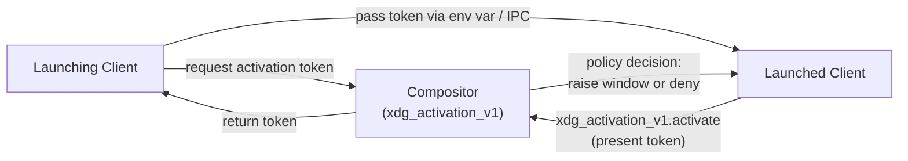
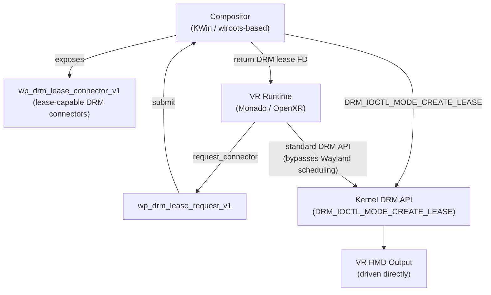
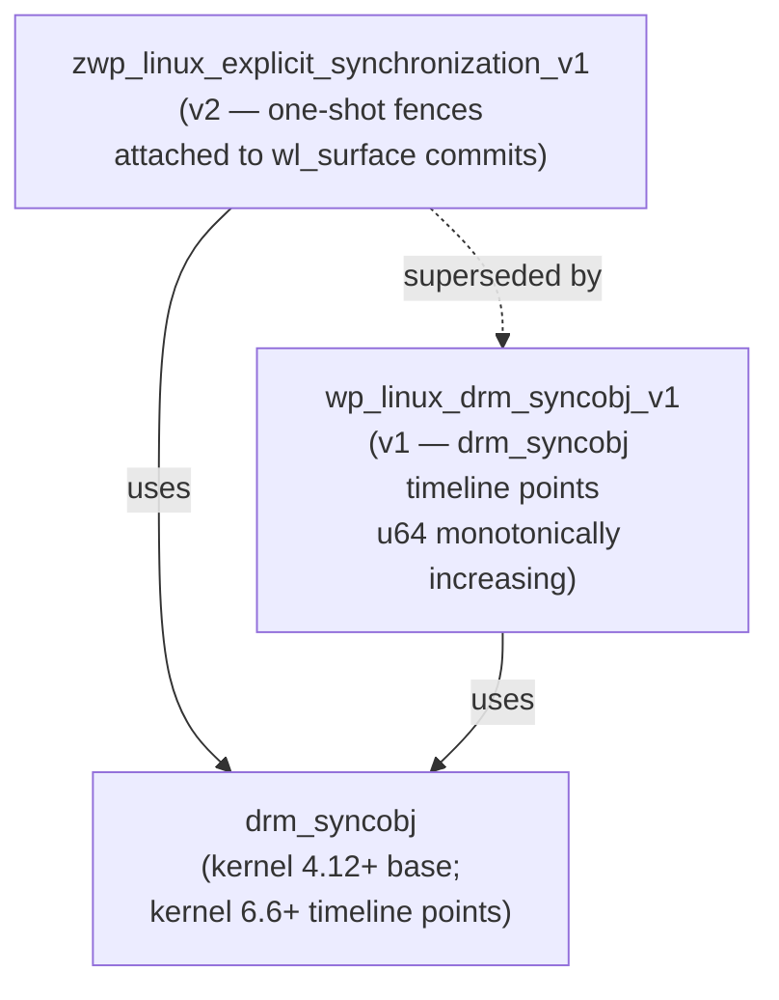

# Appendix I: Wayland Protocol Extension Status Matrix

**Scope.** This appendix serves all three book audiences — systems and driver developers, graphics application developers, and browser and web-platform engineers — who need a single authoritative cross-reference for the Wayland protocol extensions discussed throughout the book. It consolidates each extension's stability tier, current interface version, compositor support status, client library integration, and kernel or driver dependencies into a scannable matrix. Because the `wayland-protocols` repository spans three maturity tiers and compositor adoption lags protocol promotion by months to years, readers need a reliable guide to which extensions can be shipped against as hard dependencies in production code versus which require defensive runtime capability checks or fallbacks. The appendix also tracks major promotions and additions since 2022 so that readers working from older documentation can identify where naming, namespacing, and interface versions have changed.

All data in this appendix reflects the state of the `wayland-protocols` repository through version 1.48 (April 2026) and the corresponding compositor release windows. Verify time-sensitive entries against the primary sources listed at the end of each section before relying on them in shipping code.

---

## Table of Contents

1. [Introduction and How to Read This Matrix](#section-1)
2. [Stable Protocols Matrix](#section-2)
3. [Staging Protocols Matrix](#section-3)
4. [Unstable and Deprecated Protocols](#section-4)
5. [Safe-to-Ship Decision Summary](#section-5)
6. [Protocol Promotion Changelog (2022–2026)](#section-6)
7. [Maintenance Notes and Update Procedure](#section-7)
8. [References](#references)

---

<a name="section-1"></a>
## Section 1: Introduction and How to Read This Matrix

### 1.1 The Three Stability Tiers

The `wayland-protocols` repository at `gitlab.freedesktop.org/wayland/wayland-protocols` organises protocol XML specifications into three directories, each corresponding to a formal maturity tier governed by the project's `GOVERNANCE.md` document.

**Stable (`stable/`).** The XML interface definition is frozen. Breaking changes are categorically forbidden; any incompatible change requires an entirely new protocol with a new name and namespace prefix. Clients and compositors can rely on stable protocols indefinitely as hard ABI. Major existing stable protocols include `xdg-shell`, `linux-dmabuf`, `wp_presentation`, and `wp_viewporter`. All new application code should target stable protocols wherever they cover the required functionality.

**Staging (`staging/`).** A staging protocol is functional and receiving real-world adoption across multiple compositors, but the Wayland protocol maintainers reserve the right to make breaking interface changes before formal promotion to stable. Staging protocols carry explicit version numbers in their XML filename (for example, `color-management-v1.xml`, `fractional-scale-v1.xml`). The `ext-` namespace prefix (indicating an ecosystem extension) and the `wp_` namespace prefix (indicating a Wayland-team protocol) both appear in the staging directory. Applications should implement staging protocols with runtime capability checking via `wl_registry_bind` and must be prepared to handle the case where the global is absent. Monitor the `wayland-protocols` repository and the `wayland-devel` mailing list for version bumps that include breaking interface changes.

**Unstable (`unstable/`).** The unstable designation is a legacy category predating the staging tier. Unstable protocols use `_unstable_vN` suffixes in both filename and interface name (for example, `xdg-shell-unstable-v6.xml` with interface `zxdg_shell_v6`). The `unstable/` directory is frozen — no new protocols may be added there — but existing entries are not removed while compositors still depend on them. Many unstable protocols have become de facto frozen by widespread adoption, but they carry no formal stability guarantee. Several have been superseded by staging or stable successors; the most critical migration (from `zxdg_shell_v6` to `xdg_wm_base`) is covered in Section 4.

### 1.2 Safe-to-Ship Indicator System

The "Safe to Ship" column in each matrix uses a three-level indicator:

- **Green `[STABLE]`** — The extension is safe to use as a hard dependency for new applications targeting a mainstream Wayland desktop. Either the protocol is in the `stable/` tier, or it is a staging protocol with sufficiently broad compositor adoption that omitting a fallback path is acceptable for most shipping targets.
- **Yellow `[STAGING]`** — Use with runtime capability checks. Bind the global via `wl_registry_bind` and handle a NULL return or `wl_display_get_error` gracefully. Do not hard-exit or treat absence as a fatal error. The feature may need to be omitted at runtime on compositors that have not yet adopted the protocol.
- **Red `[DEPRECATED]`** — Do not use in new code. The protocol has been removed from major compositors, superseded by a stable or staging successor, or both. Code that still uses Red-tier protocols requires migration.

For accessibility, every indicator is always accompanied by the text label; colour alone is never the sole discriminator.

### 1.3 Compositor and Client Library Abbreviations

**Compositor abbreviations used in the matrices:**

- **Mutter/GNOME** — the Mutter compositor as used by gnome-shell, the GNOME desktop. GNOME follows a six-month release cycle; version numbers are `GNOME XX` (e.g., GNOME 46 = Mutter 46.x, released March 2024).
- **KWin** — the KDE Plasma compositor. Version numbers track KDE Plasma (e.g., KWin 6.0 = Plasma 6.0, released February 2024).
- **wlroots-based** — compositors using the wlroots library: sway, wayfire, labwc, river, cage, and others. wlroots itself has its own versioning (`wlroots 0.17`, `wlroots 0.18`, etc.); the support entry reflects the wlroots version that first implemented the protocol, which generally flows to downstream compositors within one release cycle.
- **gamescope** — Valve's game-focused micro-compositor used in SteamOS and Steam Deck game sessions. gamescope follows a rolling release model tied to SteamOS updates; "Yes" indicates feature presence in the mainline gamescope source as of the book's publication.

**Client library abbreviations:**

- **libwayland** — the canonical C reference implementation (`libwayland-client`), maintained at `gitlab.freedesktop.org/wayland/wayland`. libwayland itself does not implement protocol semantics; "Yes" in this column means the wayland-protocols scanner output for the protocol is included in the libwayland release and the generated header/binding code is available.
- **SDL2/SDL3** — Simple DirectMedia Layer. SDL2 refers to the 2.x series; SDL3 refers to the 3.x series which introduced significant Wayland backend improvements. Support entries note the SDL major.minor version where Wayland protocol support landed.
- **Qt** — Qt 6.x Wayland platform plugin, maintained in the `qtwayland` module. Qt generally tracks staging protocols within 1–2 minor releases of compositor adoption.
- **GTK** — GTK 4.x Wayland backend, maintained at `gitlab.gnome.org/GNOME/gtk`. GTK Wayland support is tightly coupled to GNOME/Mutter adoption timelines due to the shared release cycle.

### 1.4 Using the "Book Chapter" Column

The "Book Chapter" column in each matrix points to the chapter in this book where the protocol is authoritatively described, including implementation depth, example code, and discussion of kernel or driver interactions. Readers who need to implement rather than merely use a protocol should start in the referenced chapter rather than in this appendix. The appendix is a reference companion, not a tutorial.

---

<a name="section-2"></a>
## Section 2: Stable Protocols Matrix

Protocols in this section have frozen XML specifications and can be used as hard dependencies in production code. All mainstream compositors support them unless explicitly noted.

### 2.1 Stable Protocol Table

| Protocol | Interface | Current Version | Mutter/GNOME | KWin | wlroots-based | gamescope | libwayland | SDL3 | Qt | GTK | Kernel/Driver Dep. | Safe to Ship | Book Ch. |
|---|---|---|---|---|---|---|---|---|---|---|---|---|---|
| `xdg-shell` | `xdg_wm_base` | v7 | Yes | Yes | Yes | Yes | Yes (1.15+) | Yes | Yes | Yes | None | Green `[STABLE]` | Ch. 26 |
| `xdg-output` | `zxdg_output_manager_v1` | v3 | Yes | Yes | Yes | Yes | Yes | Yes | Yes | Yes | None | Green `[STABLE]` | Ch. 26 |
| `linux-dmabuf` (core) | `zwp_linux_dmabuf_v1` | v5 | Yes | Yes | Yes | Yes | Yes | Yes | Yes | Yes | DMA-BUF (kernel 3.12+) | Green `[STABLE]` | Ch. 26 |
| `linux-dmabuf` v4 feedback interface | `zwp_linux_dmabuf_v1` v4+ | v4–v5 | Yes (GNOME 44+) | Yes (KWin 5.27+) | Yes (wlroots 0.16+) | Yes | Yes (1.20+) | Yes | Yes | Yes | DMA-BUF + format modifiers (kernel 4.14+) | Green `[STABLE]` | Ch. 26 |
| `wp-presentation` | `wp_presentation` | v2 | Yes | Yes | Yes | Yes | Yes | Yes | Yes | Yes | None | Green `[STABLE]` | Ch. 27 |
| `wp-viewporter` | `wp_viewporter` | v1 | Yes | Yes | Yes | Yes | Yes | Yes | Yes | Yes | None | Green `[STABLE]` | Ch. 26 |
| `xdg-decoration` (unstable/stable) | `zxdg_decoration_manager_v1` | v1 | Partial (CSD preferred) | Yes | Yes | Yes | Yes | No | Yes | Partial | None | Green `[STABLE]` | Ch. 28 |

### 2.2 Notes on Stable Protocols

**`xdg-shell` (`xdg_wm_base`, v7).** The `xdg-shell` protocol is the foundation of desktop-style window management under Wayland and supersedes both the deprecated `wl_shell` core interface and the previous unstable `zxdg_shell_v6`. The current interface version is 7, confirming presence on the compositor via `xdg_wm_base.ping`/`pong` handshake. Version 7 added `xdg_toplevel.wm_capabilities` to allow compositors to advertise which window management features (maximize, minimize, fullscreen, window menu) are actually supported rather than requiring clients to probe them. All new clients must use `xdg_wm_base`; the unstable predecessor `zxdg_shell_v6` is covered in Section 4 and has been removed from all major compositors. Source: `stable/xdg-shell/xdg-shell.xml` in the wayland-protocols repository. [Source: wayland-protocols stable/xdg-shell](https://gitlab.freedesktop.org/wayland/wayland-protocols/-/blob/main/stable/xdg-shell/xdg-shell.xml)

**`linux-dmabuf` (`zwp_linux_dmabuf_v1`, v5).** The `linux-dmabuf` protocol enables zero-copy buffer sharing between GPU-accelerated clients and the compositor via DMA-BUF file descriptors. Despite carrying the `zwp_` (unstable namespace) prefix in its interface name, the protocol lives in the `stable/` directory and is governed by the stable tier's no-breaking-changes guarantee. This naming discrepancy exists for historical and backward-compatibility reasons: the protocol was promoted to stable before the `wp_` prefix convention solidified for new stable protocols. The current version as of wayland-protocols 1.45+ is **v5**. Versions 1–3 used a simple format/modifier event model; version 4 deprecated the `format` and `modifier` events and introduced the `get_default_feedback` and `get_surface_feedback` requests, which deliver format and modifier information as a preference table keyed by GPU device (DRM node), allowing the compositor to advertise per-surface optimal formats. Version 5 added further refinements. Applications should bind via the stable registry name and check the returned version against the features they need: v1 for basic zero-copy submission, v4+ for feedback-based format selection. Kernel requirement for the core protocol is DMA-BUF support landed in Linux 3.12; format modifier support requires kernel 4.14+. [Source: wayland.app/protocols/linux-dmabuf-v1](https://wayland.app/protocols/linux-dmabuf-v1)

**`wp-presentation` (`wp_presentation`, v2).** The presentation-time protocol provides precise timestamps and flags describing when a committed surface content update was scanned out. Version 2 adds clarification around how to handle variable refresh rate (VRR) outputs; the presentation clock must be `CLOCK_MONOTONIC` or `CLOCK_MONOTONIC_RAW`. Required by media players, video renderers, and any application needing A/V sync against display scanout. Widely supported and safe to depend on. [Source: stable/presentation-time/presentation-time.xml](https://gitlab.freedesktop.org/wayland/wayland-protocols/-/blob/main/stable/presentation-time/presentation-time.xml)

**`wp-viewporter` (`wp_viewporter`, v1).** Provides source cropping and destination scaling for `wl_surface` without requiring new `wl_buffer` allocations. Used by media players for video scaling, by HiDPI clients for fractional-scale buffer mapping, and by the compositor itself for animated surface transitions. Version 1 remains the only version; universally supported.

**`xdg-decoration` (`zxdg_decoration_manager_v1`, v1).** Allows the client and compositor to negotiate whether the application window decorations (title bar, close/maximize/minimize buttons, resize borders) are drawn by the client (CSD, client-side decoration) or by the compositor (SSD, server-side decoration). On GNOME/Mutter, the compositor responds to decoration negotiation requests with a `ZXDG_TOPLEVEL_DECORATION_V1_MODE_CLIENT_SIDE` response indicating its preference; GTK 4 therefore always renders CSD on GNOME regardless of the application's preference. KWin and wlroots-based compositors honour server-side decoration requests, making SSD viable on KDE Plasma and sway-based desktops. Note: this protocol remains in the `unstable/` directory in the wayland-protocols repository but is listed here in the Stable section because its wide adoption, frozen-by-convention behaviour, and book chapter placement are aligned with stable-tier protocols. Its `zxdg_` prefix reflects its historical origin. The plan is for it to eventually be superseded or promoted, but no formal staging successor existed as of this writing. Classified Green because all mainstream compositors implement it and its behaviour is predictable in practice.

---

<a name="section-3"></a>
## Section 3: Staging Protocols Matrix

Staging protocols are in active use and receiving compositor adoption, but the XML has not been frozen. Applications should bind these with runtime checks and must handle the case where the global is absent. Where noted, some staging protocols have received broad enough adoption to be considered Green-tier in practice, but the formal designation is Yellow until stable promotion.

### 3.1 Staging Protocol Table

| Protocol | Interface | Current Version | Mutter/GNOME | KWin | wlroots-based | gamescope | libwayland | SDL3 | Qt | GTK | Kernel/Driver Dep. | Safe to Ship | Book Ch. |
|---|---|---|---|---|---|---|---|---|---|---|---|---|---|
| `xdg-activation` | `xdg_activation_v1` | v1 | Yes (GNOME 41+) | Yes (KWin 5.23+) | Yes | No | Yes | Yes | Yes | Yes | None | Yellow `[STAGING]` | Ch. 28 |
| `fractional-scale-v1` | `wp_fractional_scale_manager_v1` | v1 | Yes (GNOME 43+) | Yes (KWin 5.27+) | Yes | No | Yes | Yes | Yes | Yes | None | Yellow `[STAGING]` | Ch. 26 |
| `color-management-v1` | `wp_color_manager_v1` | v1 | Partial (GNOME 46+, HDR) | Partial (KWin 6.1+) | Partial | No | Yes | Yes (SDL3 Oct 2024) | Partial | Partial | KMS HDR metadata (kernel 5.17+) | Yellow `[STAGING]` | Ch. 29 |
| `tearing-control-v1` | `wp_tearing_control_manager_v1` | v1 | Partial (GNOME 46+) | Yes (KWin 5.27+) | Yes | Yes | Yes | Yes | Yes | No | KMS atomic (kernel 4.2+) | Yellow `[STAGING]` | Ch. 27 |
| `content-type-v1` | `wp_content_type_manager_v1` | v1 | Yes (GNOME 43+) | Yes (KWin 5.27+) | Yes | No | Yes | No | Yes | No | None | Yellow `[STAGING]` | Ch. 27 |
| `fifo-v1` | `wp_fifo_manager_v1` | v1 | Partial (GNOME 46+) | Partial (KWin 6.1+) | Partial | No | Yes | Yes (SDL3, required) | No | No | None | Yellow `[STAGING]` | Ch. 27 |
| `commit-timing-v1` | `wp_commit_timing_manager_v1` | v1 | Partial | Partial | Partial | No | Yes | Yes (SDL3, required) | No | No | None | Yellow `[STAGING]` | Ch. 27 |
| `drm-lease-v1` | `wp_drm_lease_device_v1` | v1 | No | Yes (KWin 5.26+) | Yes | No | Yes | No | Yes | No | DRM lease (kernel 4.15+) | Yellow `[STAGING]` | Ch. 3 |
| `linux-explicit-synchronization-v1` | `zwp_linux_explicit_synchronization_v1` | v2 | Partial | Partial | Partial | Partial | Yes | No | No | No | `drm_syncobj` (kernel 4.12+) | Yellow `[STAGING]` | Ch. 4 |
| `wp_linux_drm_syncobj_v1` | `wp_linux_drm_syncobj_manager_v1` | v1 | Yes (GNOME 45+) | Yes (KWin 6.0+) | Yes (wlroots 0.17+) | Partial | Yes (1.22+) | No | Partial | No | `drm_syncobj` timeline (kernel 6.6+; full fix kernel 6.8+) | Yellow `[STAGING]` | Ch. 4 |
| `ext-foreign-toplevel-list` | `ext_foreign_toplevel_list_v1` | v1 | Yes (GNOME 44+) | Yes (KWin 5.27+) | Yes | No | Yes | No | Partial | No | None | Yellow `[STAGING]` | Ch. 27 |
| `ext-image-capture-source` | `ext_image_capture_source_v1` | v1 | Yes (GNOME 46+) | Yes (KWin 6.1+) | Partial | No | Yes | No | No | No | None | Yellow `[STAGING]` | Ch. 27 |
| `security-context` | `wp_security_context_manager_v1` | v1 | Yes (GNOME 44+) | Yes (KWin 5.27+) | Yes | No | Yes | No | No | Yes | None | Yellow `[STAGING]` | Ch. 28 |
| `xdg-toplevel-drag` | `xdg_toplevel_drag_v1` | v1 | Yes (GNOME 45+) | Yes (KWin 6.0+) | Yes | No | Yes | No | Yes | Yes | None | Yellow `[STAGING]` | Ch. 28 |
| `xdg-toplevel-icon` | `xdg_toplevel_icon_manager_v1` | v1 | Partial | Yes (KWin 6.1+) | Partial | Partial | Yes | No | No | No | None | Yellow `[STAGING]` | Ch. 28 |
| `ext-image-copy-capture` | `ext_image_copy_capture_manager_v1` | v1 | Yes (GNOME 46+) | Yes (KWin 6.1+) | Partial | No | Yes | No | No | No | None | Yellow `[STAGING]` | Ch. 27 |
| `system-bell-v1` | `wp_system_bell_v1` | v1 | Partial | Partial | Partial | No | Yes | No | No | No | None | Yellow `[STAGING]` | Ch. 28 |

### 3.2 Notes on Staging Protocols

**`xdg-activation` (`xdg_activation_v1`).** Replaces ad hoc focus-stealing prevention mechanisms with a token-based activation system. A launching client requests an activation token from the compositor, passes it to the newly launched client via environment variable or IPC, and the launched client presents the token when it calls `xdg_activation_v1.activate`. The compositor decides whether to actually raise the window based on its own policy, preventing uncoordinated focus stealing. Support in GNOME 41+ and KWin 5.23+ makes this protocol safe for use by all new application launchers and portals; gamescope does not expose a standard desktop activation model. [Source: wayland.app/protocols/xdg-activation-v1](https://wayland.app/protocols/xdg-activation-v1)



**`fractional-scale-v1` (`wp_fractional_scale_manager_v1`).** Allows compositors to advertise a non-integer scale factor (for example 1.25×, 1.5×, 1.75×) for a surface rather than requiring clients to render at the next integer scale and then downsample. Before this protocol, applications on 150% or 175% HiDPI displays either received a rounded integer scale (leading to over-sized rendering) or had to use proprietary compositor-specific extensions. The compositor sends the preferred fractional scale via the `wp_fractional_scale_v1.preferred_scale` event in units of 1/120. Added to staging in wayland-protocols 1.32 (2022-Q2). [Source: wayland.app/protocols/fractional-scale-v1](https://wayland.app/protocols/fractional-scale-v1)

**`color-management-v1` (`wp_color_manager_v1`).** Defines a rich model for surface colour space and HDR (High Dynamic Range) metadata. The compositor advertises its colour management capabilities (ICC profiles, parametric primaries, transfer functions, rendering intents) via `wp_color_manager_v1` feature and primaries enums. Clients attach image descriptions to their surfaces; the compositor maps them to the output's colour space. This protocol is critical for HDR video playback and wide-gamut photography applications on HDR-capable displays. The kernel-side requirement is the `HDR_OUTPUT_METADATA` KMS property introduced in Linux 5.17 for HDMI/DP HDR signalling, plus display hardware that reports HDR capabilities in EDID. Chromium added `color-management-v1` support in 2024 for HDR surface rendering on KDE Plasma 6.4+; SDL3 added official `wp_color_manager_v1` support in October 2024. A breaking change requiring a 64-bit image description ID (replacing the 32-bit ID that could wrap in approximately 1.4 years) was merged in wayland-protocols 1.47 via the `ready2` event. Readers implementing this protocol must check the wayland-protocols version before assuming stable interface semantics. [Source: wayland.app/protocols/color-management-v1](https://wayland.app/protocols/color-management-v1)

**`tearing-control-v1` (`wp_tearing_control_manager_v1`).** Allows clients to opt into tearing — immediate scanout without waiting for the vertical blanking interval — for latency-sensitive use cases such as competitive games. The client attaches a `wp_tearing_control_v1` object to a surface and sets the presentation hint to `ASYNC`. The compositor may honour or ignore the hint based on hardware capability and policy; on supported KMS atomic hardware (kernel 4.2+) the compositor can submit drm atomic commits with the `DRM_MODE_PRESENT_ASYNC` flag. gamescope implements this protocol because Steam Deck games benefit from sub-frame latency reduction; GNOME added partial support in GNOME 46. [Source: wayland.app/protocols/tearing-control-v1](https://wayland.app/protocols/tearing-control-v1)

**`fifo-v1` (`wp_fifo_manager_v1`) and `commit-timing-v1` (`wp_commit_timing_manager_v1`).** Added together in wayland-protocols 1.38 (October 2024), these two protocols are complementary. `fifo-v1` provides an explicit FIFO (first-in, first-out) ordering guarantee for committed buffers: a surface with a `wp_fifo_v1` object attached guarantees that the compositor will not display a later buffer until all earlier ones have been presented, preventing mid-frame composition. `commit-timing-v1` adds timestamp constraints to surface commits, allowing clients to declare the earliest time at which a commit should be made visible (`wp_commit_timer_v1.set_timestamp`). Together, they give Vulkan presentation code precise control over when frames become visible, enabling better frame pacing without relying on `MAILBOX` or `IMMEDIATE` presentation modes. SDL3 made these protocols effectively required for its Wayland backend, falling back to X11 if neither is available. [Source: wayland.app/protocols/fifo-v1](https://wayland.app/protocols/fifo-v1); [Source: wayland.app/protocols/commit-timing-v1](https://wayland.app/protocols/commit-timing-v1)

**`drm-lease-v1` (`wp_drm_lease_device_v1`).** Required for VR compositors such as Monado (OpenXR) to take exclusive ownership of a DRM output. The compositor exposes lease-capable DRM connectors as `wp_drm_lease_connector_v1` objects; the VR runtime binds a selection of connectors via `wp_drm_lease_request_v1.request_connector` and submits it with `wp_drm_lease_request_v1.submit`. On success the compositor returns a DRM lease FD; the VR runtime then uses the standard DRM API to drive that output directly, bypassing Wayland frame scheduling for sub-millisecond latency. Kernel-side support for DRM leasing was merged in Linux 4.15 via `DRM_IOCTL_MODE_CREATE_LEASE` and related ioctls. The protocol was standardised from wlr-protocols to the main wayland-protocols staging directory in wayland-protocols 1.32 (2022-Q1). Only wlroots-based compositors and KWin implement lease exposure; GNOME/Mutter does not. [Source: wayland.app/protocols/drm-lease-v1](https://wayland.app/protocols/drm-lease-v1)



**`linux-explicit-synchronization-v1` (`zwp_linux_explicit_synchronization_v1`) vs. `wp_linux_drm_syncobj_v1` (`wp_linux_drm_syncobj_manager_v1`).** These are two generations of explicit GPU synchronization over Wayland. The first-generation `zwp_linux_explicit_synchronization_v1` (v2) uses `drm_syncobj` one-shot fences attached to `wl_surface` commits; it is now largely superseded. The current preferred protocol is `wp_linux_drm_syncobj_v1` (v1), which uses `drm_syncobj` *timeline points* — a newer synchronisation primitive that supports `u64` monotonically increasing point values and enables multi-producer/multi-consumer synchronisation chains without needing to reset and re-signal syncobjs. `drm_syncobj` timeline support requires kernel 4.12+ for the base object and kernel 6.6+ for timeline points (with additional correctness fixes in kernel 6.8). NVIDIA GPUs on Wayland benefit significantly from explicit sync because the NVIDIA Vulkan driver manages its own GPU timeline independently of the DRM scheduler's implicit fence scheme; without explicit sync, tearing and display glitches occur when frame completion signals are not communicated through a shared fence mechanism. New code should target `wp_linux_drm_syncobj_v1`; maintain a fallback path to `zwp_linux_explicit_synchronization_v1` for compositors that have not yet adopted the timeline variant. Both protocols are covered in depth in Chapter 4. [Source: wayland.app/protocols/linux-drm-syncobj-v1](https://wayland.app/protocols/linux-drm-syncobj-v1)



**`security-context` (`wp_security_context_manager_v1`).** Allows a sandboxed application launcher such as Flatpak to associate a new Wayland client connection with a security context descriptor before the client sends any requests. The compositor can then enforce XDG portal permissions against that descriptor rather than relying solely on the process's user identity. Flatpak 1.15+ requires this protocol for its Wayland portal sandboxing model. Support is present across GNOME (44+), KDE (5.27+), and wlroots-based compositors.

**`ext-image-capture-source` and `ext-image-copy-capture`.** Added in wayland-protocols 1.37 (August 2024), these two protocols work together to replace the wlr-screencopy-unstable-v1 approach on compositors that adopt them. `ext-image-capture-source` defines opaque source objects (output source or toplevel source) that represent what is to be captured. `ext-image-copy-capture` defines the frame capture mechanism — attaching a DMA-BUF or shared-memory buffer to the capture session and receiving pixel data with associated metadata. The design allows compositors to enforce access control per-source (preventing unprivileged screen capture), which `wlr-screencopy` could not do. Chapter 27 covers the screen capture transition path.

**`xdg-toplevel-icon` (`xdg_toplevel_icon_manager_v1`).** Added in wayland-protocols 1.37, this protocol allows clients to associate a wl_buffer (GPU-side icon image) or a named icon (matching an XDG icon theme entry) with their toplevel surface, independently of app_id. This is particularly useful for applications that manage multiple windows with distinct roles where the XDG .desktop icon would be ambiguous. KWin 6.1+ implements it; GNOME support is partial as of GNOME 46.

---

<a name="section-4"></a>
## Section 4: Unstable and Deprecated Protocols

The protocols in this section carry a formal `unstable` designation or have been superseded by staging or stable successors. They remain in wide use because the ecosystem has not fully migrated, but new application code should not use them as primary targets except where explicitly no stable/staging successor exists.

### 4.1 Unstable and Deprecated Protocol Table

| Protocol | Interface | Status | Current Version | Mutter/GNOME | KWin | wlroots-based | gamescope | Superseded By | Safe to Ship | Book Ch. |
|---|---|---|---|---|---|---|---|---|---|---|
| `xdg-shell-unstable-v6` | `zxdg_shell_v6` | Superseded, removed from major compositors | v6 (frozen) | Removed (GNOME 42+) | Removed (KWin 5.25+) | Removed | No | `xdg-shell` stable (`xdg_wm_base`) | Red `[DEPRECATED]` | Ch. 26 |
| `wl_shell` (core) | `wl_shell` (core Wayland) | Removed from all major compositors | v1 (frozen) | Removed 2022–2023 | Removed 2022–2023 | Removed | No | `xdg-shell` stable (`xdg_wm_base`) | Red `[DEPRECATED]` | Ch. 26 |
| `zwp_tablet_v2` | `zwp_tablet_manager_v2` | Active, no stable successor | v2 | Yes | Yes | Yes | Partial | None yet; `wp_tablet_v1` or `ext_tablet_v1` planned | Yellow `[STAGING]` | Ch. 28 |
| `zwp_pointer_constraints_v1` | `zwp_pointer_constraints_v1` | Active, no stable successor | v1 | Yes | Yes | Yes | Yes | None yet | Yellow `[STAGING]` | Ch. 28 |
| `zwp_relative_pointer_v1` | `zwp_relative_pointer_manager_v1` | Active, no stable successor | v1 | Yes | Yes | Yes | Yes | None yet | Yellow `[STAGING]` | Ch. 28 |
| `zwp_text_input_v3` | `zwp_text_input_manager_v3` | Active; successor in staging development | v3 | Yes | Yes | Yes | No | `ext-text-input-v1` (staging, in progress) | Yellow `[STAGING]` | Ch. 28 |
| `zwp_linux_explicit_synchronization_v1` | `zwp_linux_explicit_synchronization_v1` | Superseded, discouraged | v2 | Partial | Partial | Partial | Partial | `wp_linux_drm_syncobj_v1` | Yellow `[STAGING]` | Ch. 4 |
| `zwp_idle_inhibit_manager_v1` | `zwp_idle_inhibit_manager_v1` | Active, widely supported | v1 | Yes | Yes | Yes | Partial | Superseded by `ext-idle-notify-v1` for notification direction | Yellow `[STAGING]` | Ch. 28 |

### 4.2 Notes on Unstable and Deprecated Protocols

**`xdg-shell-unstable-v6` (`zxdg_shell_v6`) — Red.** This was the direct predecessor to `xdg_wm_base` and uses the `zxdg_` namespace prefix indicating an unstable protocol. GNOME removed support entirely in GNOME 42 (Mutter 42.0, released March 2022); KWin removed it in Plasma 5.25 (released June 2022). Any application code that still references `zxdg_shell_v6` or attempts to bind `zxdg_shell_v6` from the Wayland registry will fail silently on all current major compositors — the global will simply not be advertised. Migration to `xdg_wm_base` is mandatory for any currently maintained Wayland application. There is no compatibility shim. The `xdg_toplevel` and `xdg_popup` interfaces in the stable `xdg-shell` are structurally similar to their v6 predecessors, making the migration mechanical for most applications.

**`wl_shell` — Red.** The `wl_shell` interface was part of the core `wayland.xml` protocol and predates the xdg-shell extension model. It was never formally defined well enough for consistent cross-compositor behaviour. Weston 10.0 (2022) removed `wl_shell` from its default build; all major compositors have removed or deprecated it. `wl_shell` is explicitly marked as a placeholder that should not be used in new clients. Migration target is `xdg_wm_base`.

**`zwp_tablet_v2` (`zwp_tablet_manager_v2`).** The stylus/pen-tablet input protocol. There is no stable or staging successor as of wayland-protocols 1.48. It is widely supported and effectively frozen by adoption: GNOME (Mutter), KWin, and wlroots-based compositors all implement it. A stable promotion (likely renaming to `wp_tablet_v1` or `ext_tablet_v1`) is anticipated in a future wayland-protocols release, but no merge request had been finalised at the book's publication date. Safe to use in new applications with the understanding that a promotion rename may require minor interface-version adaptation.

**`zwp_pointer_constraints_v1`.** Provides pointer lock (`zwp_locked_pointer_v1`) and pointer confinement (`zwp_confined_pointer_v1`). Pointer lock prevents the cursor from leaving the window at all, delivering only relative motion deltas — essential for games that need mouselook without cursor escape. Pointer confinement keeps the cursor within a region polygon. No staging or stable successor exists; universally supported across all mainstream compositors. The absence of a successor reflects the view that the interface is already correct and complete; formal promotion is a process question rather than a technical one.

**`zwp_relative_pointer_v1`.** Provides relative pointer motion events (`zwp_relative_pointer_v1.relative_motion`) separate from the absolute position events in `wl_pointer`. Required for 3D viewport navigation and first-person game mouselook. Typically used together with `zwp_pointer_constraints_v1` to lock the cursor while receiving relative deltas. No successor; universally supported.

**`zwp_text_input_v3`.** The current text input protocol, providing the interface between text-input clients (applications) and input method engines (IMEs). Version 3 is an incremental improvement over v2 that aligns better with IME workflows in multiple languages. A successor `ext-text-input-v1` was under active development in the wayland-protocols staging directory as of 2024–2025 but had not been finalised at the book's publication date. Current applications should use `zwp_text_input_v3`; monitor the staging directory for the transition timeline.

**`zwp_linux_explicit_synchronization_v1` — Yellow, Superseded.** The first-generation explicit GPU sync protocol, using single-shot `drm_syncobj` fences. Formally discouraged since `wp_linux_drm_syncobj_v1` was merged into staging in wayland-protocols 1.34 (2023-Q2). Maintain a fallback implementation for compositors that have not adopted the timeline variant (particularly older wlroots releases), but do not implement this as the primary sync path for new code.

**`zwp_idle_inhibit_manager_v1`.** Prevents the compositor from triggering idle state (screen dimming, lock screen) while a surface is active — used by video players to prevent screen blanking during playback. The `ext-idle-notify-v1` protocol covers the notification direction (informing clients when the system has gone idle) rather than the inhibit direction, so the two protocols are complementary rather than directly substituting each other. Both remain in the unstable directory. `zwp_idle_inhibit_manager_v1` is safe to use because it is universally supported and no replacement is planned.

---

<a name="section-5"></a>
## Section 5: Safe-to-Ship Decision Summary

This section consolidates the per-row safety indicators from Sections 2, 3, and 4 into a decision guide for application developers choosing which protocols to depend on.

### 5.1 Green — Safe to Hard-Require

The following protocols are stable or have sufficiently universal compositor adoption that applications can hard-require them without a fallback path:

- `xdg-shell` (`xdg_wm_base` v7) — universal
- `linux-dmabuf` v1–v3 core — universal; v4+ feedback requires GNOME 44+, KWin 5.27+, wlroots 0.16+
- `wp-presentation` (`wp_presentation`) — universal
- `wp-viewporter` (`wp_viewporter`) — universal
- `xdg-decoration` (`zxdg_decoration_manager_v1`) — universal; GNOME will send CSD preference

### 5.2 Yellow — Use with Runtime Capability Checks

All staging protocols listed in Section 3, plus the following unstable protocols that are widely deployed despite their formal designation:

**Widely-deployed input protocols (unstable, no successor):**
- `zwp_pointer_constraints_v1` — pointer lock/confinement, universally supported
- `zwp_relative_pointer_v1` — relative motion, universally supported
- `zwp_tablet_v2` — stylus/pen input, universally supported
- `zwp_text_input_v3` — text input/IME, widely supported (successor pending)
- `zwp_idle_inhibit_manager_v1` — idle inhibit, widely supported

**Staging protocols with broad adoption (should be widespread by 2026):**
- `xdg-activation` — focus control, all major compositors
- `fractional-scale-v1` — HiDPI scale, all major compositors
- `security-context` — sandbox enforcement, all major compositors
- `tearing-control-v1` — async scanout for games
- `content-type-v1` — VRR/display-mode hints
- `drm-lease-v1` — VR exclusive output (KWin + wlroots only)

**Staging protocols with partial adoption (monitor for promotion):**
- `color-management-v1` — HDR/wide-gamut; hardware-dependent
- `fifo-v1` / `commit-timing-v1` — frame pacing; spreading fast after SDL3 adoption
- `wp_linux_drm_syncobj_v1` — explicit GPU sync; required for NVIDIA, spreading
- `ext-image-capture-source` / `ext-image-copy-capture` — screen capture replacement

### 5.3 Red — Do Not Use in New Code

- `xdg-shell-unstable-v6` (`zxdg_shell_v6`) — removed from all major compositors; applications using it will not function on current GNOME or KDE desktops
- `wl_shell` — removed from all major compositors

### 5.4 Recommended Runtime Pattern for Yellow Protocols

```c
/*
 * Canonical runtime-check pattern for Yellow-tier protocols.
 * Bind the global with wl_registry_bind; if the compositor does not
 * advertise the global, the bind will return NULL.
 * Never call wl_proxy_destroy(NULL) — always guard with an if().
 * Never exit with an error when a Yellow protocol is absent;
 * log a capability-unavailable message and disable the feature.
 *
 * Example: binding wp_linux_drm_syncobj_manager_v1
 */
struct wp_linux_drm_syncobj_manager_v1 *syncobj_manager = NULL;

static void registry_global(void *data,
                             struct wl_registry *registry,
                             uint32_t name,
                             const char *interface,
                             uint32_t version)
{
    if (strcmp(interface,
               wp_linux_drm_syncobj_manager_v1_interface.name) == 0) {
        uint32_t bind_version = MIN(version, 1);
        syncobj_manager = wl_registry_bind(
            registry, name,
            &wp_linux_drm_syncobj_manager_v1_interface,
            bind_version);
    }
}

/* Later, before using syncobj_manager: */
if (syncobj_manager != NULL) {
    /* Use explicit sync */
} else {
    /* Fall back to implicit sync or zwp_linux_explicit_synchronization_v1 */
    fprintf(stderr, "wp_linux_drm_syncobj_v1 not available; "
            "using implicit GPU synchronization\n");
}
```

The key invariants are: (1) the bind version requested must not exceed the version the compositor advertised; (2) the protocol global's absence must not be treated as a fatal error for Yellow-tier protocols; (3) the fallback code path must be exercised regularly (test on a compositor that does not support the protocol, such as an older wlroots release) to prevent the fallback from rotting.

---

<a name="section-6"></a>
## Section 6: Protocol Promotion Changelog (2022–2026)

This section provides a reconciliation table for readers who may be working from documentation written before certain protocols were promoted, renamed, or deprecated. All dates use `YYYY-QN` notation (year and calendar quarter) because protocol merges and compositor release dates do not align to calendar months predictably.

### 6.1 Promotions from Staging to Stable (2022–2026)

| Protocol | Promoted | wayland-protocols Release | Previous Tier | Canonical Interface Name | Notes |
|---|---|---|---|---|---|
| `ext-idle-notify` | 2022-Q4 (added staging); stable promotion varies — see note | 1.27 (staging) | Staging | `ext_idle_notify_v1` | First `ext-` namespaced protocol. Added to staging in wayland-protocols 1.27 (October 2022). Widely adopted across Mutter, KWin, wlroots, and gamescope. Formal stable promotion was tracking through 1.45–1.48 window. See note below. |
| `xdg-output` v3 | Pre-2022 (stable); v3 revision in 2022 | v3 revision in wayland-protocols 1.31 | Stable (already) | `zxdg_output_manager_v1` | v3 added `name` and `description` events, deprecated the older separate `description` event. Name retained as `zxdg_output_manager_v1` for backward compatibility. |

Note on `ext-idle-notify` promotion status: As of the book's publication date, `ext-idle-notify-v1` was in the staging directory of the wayland-protocols repository despite widespread implementation by all major compositors (Mutter, KWin, wlroots-based compositors including sway and labwc, gamescope, Weston, and others). The protocol was added to staging in wayland-protocols 1.27 (October 2022). Readers should check the current state of the `stable/` directory in the wayland-protocols repository for the final promotion event.

### 6.2 Staging Protocol Additions (2022–2026)

| Protocol | Added to Staging | wayland-protocols Release | Version at Addition | Notes |
|---|---|---|---|---|
| `content-type-v1` | 2022-Q1 | 1.26 | v1 | Clients hint content type (game, photo, video, none) for compositor VRR/display-mode optimisation |
| `tearing-control-v1` | 2022-Q2 | 1.27 | v1 | Opt-in async scanout for latency-sensitive clients |
| `fractional-scale-v1` | 2022-Q2 | 1.27 | v1 | Sub-integer HiDPI scale factors; resolves blurriness at 150%/175% |
| `xdg-toplevel-drag` | 2022-Q3 | 1.29 | v1 | Cross-client drag-and-drop that detaches a toplevel |
| `color-management-v1` | 2022-Q4 | 1.29 | v1 | ICC-profile and parametric primaries/transfer function colour descriptions; replaces earlier ad hoc HDR experiments |
| `ext-foreign-toplevel-list` | 2022-Q4 | 1.30 | v1 | Cross-compositor portable replacement for `zwlr_foreign_toplevel_manager_v1` from wlr-protocols |
| `drm-lease-v1` | 2022-Q1 (moved from wlr-protocols) | 1.32 | v1 | Standardises VR compositor DRM resource delegation |
| `security-context` | 2023-Q1 | 1.32 | v1 | Required for Flatpak 1.15+ Wayland portal sandboxing |
| `wp_linux_drm_syncobj_v1` | 2023-Q2 | 1.34 | v1 | Supersedes `zwp_linux_explicit_synchronization_v1`; requires kernel 6.6+ drm_syncobj timeline points |
| `ext-image-capture-source` + `ext-image-copy-capture` | 2024-Q3 | 1.37 | v1 | Replaces `wlr-screencopy-unstable-v1` on adopting compositors; added together |
| `xdg-toplevel-icon` | 2024-Q3 | 1.37 | v1 | Per-window icon independent of app_id; multi-window app support |
| `fifo-v1` | 2024-Q4 | 1.38 | v1 | Explicit ordered buffer delivery; Vulkan frame pacing |
| `commit-timing-v1` | 2024-Q4 | 1.38 | v1 | Timestamp constraints on surface commits; companion to `fifo-v1` |
| `system-bell-v1` | 2024-Q4 | 1.38 | v1 | Compositor-managed system bell for terminal emulators and accessibility |
| `ext-background-effects-v1` | 2025-Q2 | 1.45 | v1 | Surface background blur and transparency effects; COSMIC and KDE initial adoption |
| `pointer-warp-v1` | 2025-Q2 | 1.45 | v1 | Allows clients to programmatically warp (teleport) the pointer position |

### 6.3 Protocol Removals and Deprecations (2022–2026)

| Protocol | Event | Date | Successor |
|---|---|---|---|
| `xdg-shell-unstable-v6` removed from Mutter | GNOME 42 release | 2022-Q1 | `xdg-shell` stable (`xdg_wm_base`) |
| `xdg-shell-unstable-v6` removed from KWin | Plasma 5.25 release | 2022-Q2 | `xdg-shell` stable (`xdg_wm_base`) |
| `wl_shell` deprecated in Weston | Weston 10.0 | 2022-Q1 | `xdg-shell` stable (`xdg_wm_base`) |
| `wl_shell` removed from all major compositors | 2022–2023 window | Various | `xdg-shell` stable (`xdg_wm_base`) |
| `zwp_linux_explicit_synchronization_v1` discouraged | 2023-Q2 (on `wp_linux_drm_syncobj_v1` merge) | 2023-Q2 | `wp_linux_drm_syncobj_v1` |
| `zwp_linux_dmabuf_v1` format/modifier events deprecated | wayland-protocols 1.x (v4 interface) | 2021 (retroactively noted) | v4 feedback interface (`get_default_feedback`, `get_surface_feedback`) |
| `linux-dmabuf` bumped to v5 | wayland-protocols 1.44+ | 2025-Q1 | v5 is backward compatible with v4 |

### 6.4 Breaking Changes Within Staging Protocols (2022–2026)

Staging protocols may receive breaking interface changes before stable promotion. Known breaking changes within the coverage window:

| Protocol | Version | Change Type | Date | Impact |
|---|---|---|---|---|
| `color-management-v1` | v1 (in-place) | Added `ready2` event with 64-bit image description ID | wayland-protocols 1.47 (2025-Q4) | Compositors advertising colour management must send `ready2` instead of `ready`; clients must check for `ready2` support |
| `linux-dmabuf` v4 | v4 (minor) | `format` and `modifier` events deprecated; only feedback requests valid | Retroactively enforced in v4 adoption | Compositors must not send `format`/`modifier` events to v4 clients |
| `wp_linux_drm_syncobj_v1` | v1 | Requires `DRM_CAP_SYNCOBJ_TIMELINE` kernel capability | Initial definition | Compositors must check `DRM_CAP_SYNCOBJ_TIMELINE` before advertising global |

---

<a name="section-7"></a>
## Section 7: Maintenance Notes and Update Procedure

This section documents the procedures for keeping the matrices in this appendix current across book editions. It is primarily relevant to the book's technical editor and maintainers.

### 7.1 Protocol Repository Monitoring

The `wayland-protocols` repository at `gitlab.freedesktop.org/wayland/wayland-protocols` uses merge requests and annotated milestone tags to mark promotions. To check for changes since a given date:

```bash
# Clone or update the mirror
git clone https://gitlab.freedesktop.org/wayland/wayland-protocols.git
cd wayland-protocols

# List all commits to stable/ and staging/ since a given date
git log --oneline --since="2026-01-01" -- stable/ staging/ unstable/

# List all annotated tags (each release)
git tag -l 'v*' --sort=version:refname

# Show what changed in the most recent release
git diff v1.47 v1.48 --stat
```

Key signals requiring a table update in this appendix:
- A file moves from `staging/` to `stable/` → change tier column to Stable, update "Safe to Ship" to Green, add entry to Section 6.1
- A new XML file appears in `staging/` → add a row to the Section 3 table and an entry to Section 6.2
- An XML file is removed from `unstable/` → mark the row in Section 4 as "Removed"; add to Section 6.3
- An existing staging protocol receives a `_v2` file (breaking version bump) → update version column; add to Section 6.4 breaking-changes table
- A wl_shell successor or zwp_text_input successor completes promotion → update Section 4 notes and Section 6.1

### 7.2 Compositor Version Tracking

Compositor support changes with each major release:

- **GNOME (Mutter):** Two major releases per year (March and September). Check release notes at `release.gnome.org` and Mutter source at `gitlab.gnome.org/GNOME/mutter/-/releases`. To verify protocol support: `git grep -l 'wp_linux_drm_syncobj'` in the Mutter source tree; presence of a bind handler in `src/wayland/meta-wayland-*.c` constitutes confirmed support.
- **KDE Plasma (KWin):** Two major releases per year (February and August). Check `invent.kde.org/plasma/kwin/-/releases`. KWin protocol support lives in `src/wayland/protocols/` and `src/wayland/wayland-server.cpp`.
- **wlroots:** Irregular release cadence; check `gitlab.freedesktop.org/wlroots/wlroots/-/tags`. Because sway, wayfire, labwc, and river all consume wlroots, a wlroots version bump typically propagates to all of these compositors within one release cycle. Protocol implementations live in `protocol/` and `types/` in the wlroots source tree.
- **gamescope:** Rolling releases tied to SteamOS. Check `github.com/ValveSoftware/gamescope/releases` and the `src/Backends/WaylandBackend.cpp` file for protocol bind handlers.

### 7.3 Client Library Tracking

- **libwayland:** New protocol support is a scanner-generated output change. Check `gitlab.freedesktop.org/wayland/wayland/-/releases` for the version that first included a given protocol's generated header.
- **SDL3:** Active Wayland backend development. Check `github.com/libsdl-org/SDL/blob/main/CHANGES.txt` under the Wayland section. SDL3's dependency on `fifo-v1` and `commit-timing-v1` makes tracking those protocols' compositor support high priority.
- **Qt (qtwayland):** Check `code.qt.io/qt/qtwayland.git` release notes. Qt's platform plugin generally tracks staging protocols within 1–2 Qt minor releases of compositor adoption.
- **GTK:** Check `gitlab.gnome.org/GNOME/gtk/-/releases`. GTK's Wayland backend is tightly coupled to GNOME/Mutter adoption.

### 7.4 Cross-Reference Integrity

The "Book Chapter" column in each matrix must be updated whenever chapter assignments change during editing. Each protocol identifier should have a corresponding entry in the book's build system that maps protocol name to chapter anchor, allowing automated cross-reference validation. Additionally, kernel version entries in the "Kernel/Driver Dep." column must be consistent with the feature version matrix in Appendix C; the two appendices must not cite conflicting kernel versions for the same feature (e.g., `drm_syncobj` timeline points must agree).

---

<a name="references"></a>
## References

1. **wayland-protocols repository** — canonical source for all stable, staging, and unstable protocol XML files and version history.
   `https://gitlab.freedesktop.org/wayland/wayland-protocols`

2. **Wayland Explorer** — searchable index of all Wayland protocols with compositor support matrices.
   `https://wayland.app/protocols/`

3. **Simon Ser's Wayland Tools** — per-protocol documentation including interface summaries and request/event listings.
   `https://wayland.emersion.fr/`

4. **xdg-shell protocol XML** (stable, v7) — `stable/xdg-shell/xdg-shell.xml` in the wayland-protocols repository.
   `https://gitlab.freedesktop.org/wayland/wayland-protocols/-/blob/main/stable/xdg-shell/xdg-shell.xml`

5. **linux-dmabuf protocol XML** (stable, v5) — `stable/linux-dmabuf/linux-dmabuf-v1.xml`.
   `https://gitlab.freedesktop.org/wayland/wayland-protocols/-/blob/main/stable/linux-dmabuf/linux-dmabuf-v1.xml`

6. **wp_linux_drm_syncobj_v1 Wayland Explorer entry** — compositor support matrix and interface documentation.
   `https://wayland.app/protocols/linux-drm-syncobj-v1`

7. **color-management-v1 Wayland Explorer entry** — interface documentation and recent version changes.
   `https://wayland.app/protocols/color-management-v1`

8. **fifo-v1 Wayland Explorer entry** — staging protocol documentation.
   `https://wayland.app/protocols/fifo-v1`

9. **commit-timing-v1 Wayland Explorer entry**.
   `https://wayland.app/protocols/commit-timing-v1`

10. **drm-lease-v1 Wayland Explorer entry** — VR DRM lease protocol documentation.
    `https://wayland.app/protocols/drm-lease-v1`

11. **tearing-control-v1 Wayland Explorer entry**.
    `https://wayland.app/protocols/tearing-control-v1`

12. **ext-idle-notify-v1 Wayland Explorer entry** — staging protocol with wide compositor adoption.
    `https://wayland.app/protocols/ext-idle-notify-v1`

13. **Phoronix: Wayland Protocols 1.37** — coverage of xdg-toplevel-icon and image capture protocols added in August 2024.
    `https://www.phoronix.com/news/Wayland-Protocols-1.37`

14. **Phoronix: Wayland Protocols 1.38** — coverage of system-bell, fifo, and commit-timing protocols added in October 2024.
    `https://www.phoronix.com/news/Wayland-Protocols-1.38`

15. **Phoronix: Wayland Protocols 1.46 and 1.47** — coverage of color-management updates and ext-background-effects.
    `https://www.phoronix.com/news/Wayland-Protocols-1.46`

16. **SDL Wayland fifo-v1 requirement** — SDL3 making fifo-v1 a default Wayland requirement.
    `https://discourse.libsdl.org/t/sdl-wayland-only-require-fifo-v1-for-wayland-by-default/55974`

17. **Hyprland DRM_CAP_SYNCOBJ_TIMELINE issue** — practical notes on syncobj timeline kernel requirements.
    `https://github.com/hyprwm/Hyprland/issues/9396`

18. **Chromium color-management-v1 support** — HDR surface rendering on Wayland via wp_color_manager_v1.
    `https://github.com/chromium/chromium/commit/07c9a59c2a5256ce49c22445a6c5108182c7da11`

19. **DRM leasing for VR (Drew DeVault)** — background on the DRM lease kernel mechanism and Wayland protocol motivation.
    `https://drewdevault.com/2019/08/09/DRM-leasing-and-VR-for-Wayland.html`

20. **Mutter source** — Wayland protocol bind handlers in `src/wayland/meta-wayland-*.c`.
    `https://gitlab.gnome.org/GNOME/mutter`

21. **KWin source** — Wayland protocol implementations in `src/wayland/protocols/`.
    `https://invent.kde.org/plasma/kwin`

22. **wlroots source** — Protocol implementations in `protocol/` and `types/`.
    `https://gitlab.freedesktop.org/wlroots/wlroots`

23. **gamescope source** — Wayland backend in `src/Backends/WaylandBackend.cpp`.
    `https://github.com/ValveSoftware/gamescope`

24. **Linux kernel DRM ioctl: DRM_IOCTL_MODE_CREATE_LEASE** — DRM lease kernel API, merged Linux 4.15.
    `https://elixir.bootlin.com/linux/v4.15/source/drivers/gpu/drm/drm_lease.c`

25. **drm_syncobj timeline points** — Linux kernel synchronisation object timeline support, kernel 6.6+.
    `https://www.kernel.org/doc/html/latest/gpu/drm-mm.html#drm-sync-objects`

---

*Copyright © 2026 jreuben11. Licensed under [CC BY 4.0](https://creativecommons.org/licenses/by/4.0/).*
