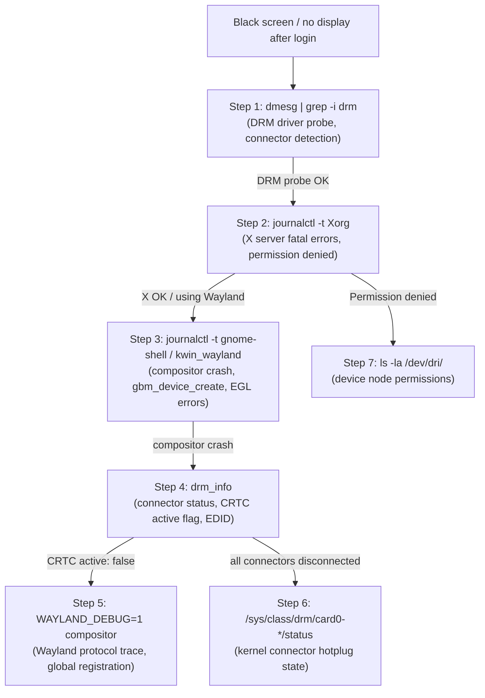
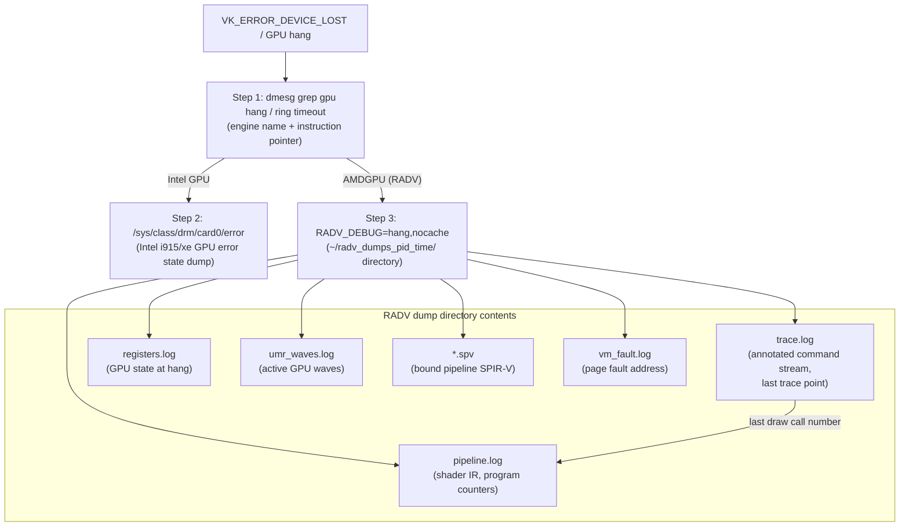
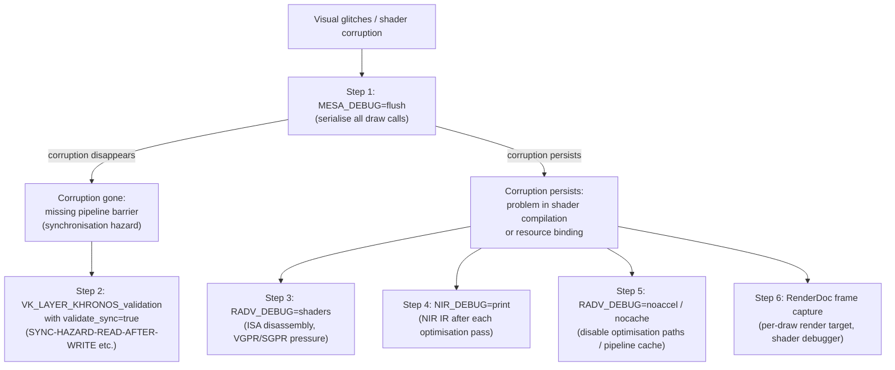
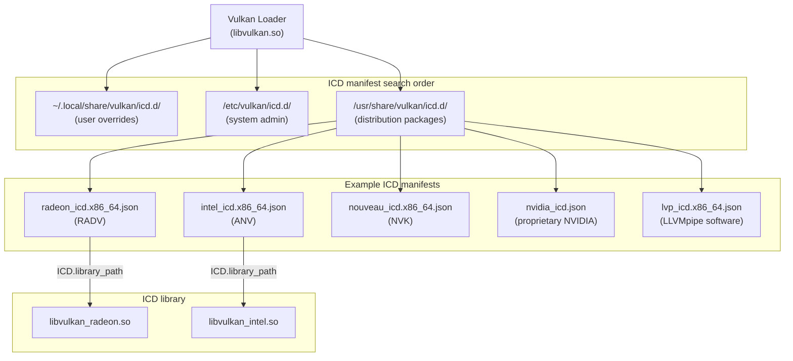

# Appendix J: Linux Graphics Stack Debugging Quick Reference

**Scope**: This appendix is a symptom-first cheat sheet for all three audiences of this book — systems and driver developers, graphics application developers, and browser and web platform engineers. It is organised by observable failure mode rather than by tool, so you can locate the relevant diagnostic commands immediately without knowing in advance which layer of the stack is responsible. Each section covers a distinct symptom category, presents a step-by-step diagnostic table ordered from least invasive to most invasive, and closes with interpretation notes that identify the most common root cause and the non-obvious pitfalls in each diagnostic. A compact one-liner card in [Section J.8](#j8-most-useful-one-liners-80-coverage) covers the 20% of commands that address 80% of common problems. The `Ch30 ref` column in each table points to the Chapter 30 section that explains the underlying mechanism in depth.

**Tool installation note**: Several tools used here are not installed by default. `drm_info` is available via `cargo install drm_info` or distribution packages from Mesa packaging teams. MangoHud is packaged as `mangohud` on Arch Linux, Fedora, and Ubuntu 22.04+. `intel_gpu_top` ships with `intel-gpu-tools`. `radeontop` is available as `radeontop` on all major distributions. `edid-decode` is part of `edid-decode` or `read-edid` packages depending on distribution.

---

## Table of Contents

- [J.0 How to Use This Appendix](#j0-how-to-use-this-appendix)
- [J.1 No Display / Black Screen After Login](#j1-no-display--black-screen-after-login)
- [J.2 GPU Hang / TDR / VK_ERROR_DEVICE_LOST](#j2-gpu-hang--tdr--vk_error_device_lost)
- [J.3 Shader Corruption / Visual Glitches](#j3-shader-corruption--visual-glitches)
- [J.4 Synchronisation / Tearing / Flickering](#j4-synchronisation--tearing--flickering)
- [J.5 Performance Regression](#j5-performance-regression)
- [J.6 Display Colour / HDR Issues](#j6-display-colour--hdr-issues)
- [J.7 Vulkan Layer / Driver Discovery Issues](#j7-vulkan-layer--driver-discovery-issues)
- [J.8 Most Useful One-Liners (80% Coverage)](#j8-most-useful-one-liners-80-coverage)
- [J.9 Cross-Reference Index to Chapter 30](#j9-cross-reference-index-to-chapter-30)
- [References](#references)

---

## J.0 How to Use This Appendix

The sections below are organised by what you *see* rather than by which tool addresses it. Scan the section headings for the observable failure mode — black screen, GPU hang, visual corruption, tearing, slow frame rates, wrong colours, missing Vulkan device — then work through the diagnostic table in that section. Steps within each table are numbered from least invasive (read-only log inspection, which cannot alter driver state) to most invasive (environment variables that alter driver behaviour or force recompilation). Each command entry describes both what healthy output looks like and what pathological output indicates, so you can confirm that a step is inconclusive before proceeding to the next.

The `Ch30 ref` column contains section numbers in the format `§30.N`. In the digital edition these are hyperlinks. In the print edition they are section numbers you can locate in the Chapter 30 table of contents. The cross-reference table in [Section J.9](#j9-cross-reference-index-to-chapter-30) maps every symptom category to its Chapter 30 section and the topic covered there, for readers who prefer to understand the mechanism before running the diagnostics.

The one-liner card in [Section J.8](#j8-most-useful-one-liners-80-coverage) is suitable for printing as a reference sheet. Start there if you are completely new to a problem — the ten commands listed cover the most common failures across all symptom categories.

---

## J.1 No Display / Black Screen After Login

**Observable symptom**: A system that completes boot (cursor visible or login prompt appears) but presents no graphical output after login, or drops to a black screen when the display server or compositor starts. The system remains responsive over SSH or a virtual terminal.

| Step | Command / Action | What to look for | Ch30 ref |
|------|-----------------|------------------|----------|
| 1 | `dmesg \| grep -i drm` | DRM driver probe errors, connector detection failures, framebuffer setup messages. Look for `[drm] failed to set mode`, `[drm:drm_atomic_helper_commit_hw_done] *ERROR* hw_done or flip_done timed out`, or `drm_dp_link_train_clock_recovery_delay` failures on DisplayPort. Healthy output shows `[drm] Initialized <driver>` and connector names like `HDMI-A-1 connected`. | §30.2 |
| 2 | `journalctl -b -p err -t Xorg` | X server fatal errors: `(EE) AIGLX error: dlopen of /usr/lib/dri/r600_dri.so failed`, `(EE) Failed to initialize GLX extension`, `(EE) open /dev/dri/card0: Permission denied`. A `Permission denied` here points to a `video` group membership issue, not a driver bug — add the user to the `video` group or verify udev rules for `/dev/dri/`. | §30.3 |
| 3 | `journalctl -b -p err -t gnome-shell -t kwin_wayland -t mutter` | Compositor crash backtraces. Look for `Failed to create backend`, `EGL error: EGL_NOT_INITIALIZED`, `gbm_device_create failed`, or Mesa initialisation errors. A `gbm_device_create failed` with a valid `/dev/dri/card0` suggests a Mesa DRI driver mismatch or a missing firmware file. | §30.3 |
| 4 | `drm_info` | Inspect connector status (`connected` vs. `disconnected`), CRTC active flag, plane state, and EDID presence for all outputs. A connector showing `disconnected` when a monitor is physically attached indicates either a missing or corrupt EDID or a hardware-level signal problem. A connected connector with CRTC `active: false` means the compositor attempted no modeset — see steps 3 and 5. | §30.2 |
| 5 | `WAYLAND_DEBUG=1 <compositor-binary> 2>&1 \| head -200` | Wayland protocol message trace from the compositor's perspective. Look for `wl_output` global not being advertised, `xdg_wm_base` handshake failing, or an abnormally short message sequence followed by compositor exit. Healthy startup shows `wl_compositor`, `wl_shm`, `xdg_wm_base`, and `wl_seat` globals being registered. | §30.4 |
| 6 | `cat /sys/class/drm/card0-*/status` | Kernel connector hotplug status for every output on `card0`. Replace `card0` with the correct DRM device if multiple GPUs are present (list with `ls /dev/dri/`). At least one connector should show `connected`. If all show `disconnected` despite a monitor being attached, the kernel's connector probing failed — check `dmesg` for HPD (hot-plug detect) or DDC/EDID errors. | §30.2 |
| 7 | `ls -la /dev/dri/` | Verify device node permissions. `card0` should be owned by `root:video` mode `0660` or `root:render` mode `0666`. `renderD128` should be mode `0666` or `0660` with group `render`. Missing device nodes indicate a DRM driver that failed to probe — re-check step 1. | §30.2 |

> **Interpretation notes**: Steps 1 and 2 together cover the majority of no-display failures. A `Permission denied` on `/dev/dri/card0` is a configuration error that takes 30 seconds to resolve (add the user to the `video` group) and should be ruled out before any further investigation. If `drm_info` shows a connector as `connected` with a valid EDID but the CRTC is `active: false`, the compositor failed to commit a modeset without crashing — check step 3 and step 5 output simultaneously, because the compositor log will show why the modeset was not attempted, and the Wayland protocol trace will show where the initialisation sequence was interrupted. For DisplayPort outputs, monitor for `drm_dp_channel_eq` errors in `dmesg`; these indicate a link training failure that prevents the kernel from establishing a display clock, which is often resolved by reducing the link rate with the `drm.dp_link_rate` module parameter.

---

## J.2 GPU Hang / TDR / VK\_ERROR\_DEVICE\_LOST

**Observable symptom**: The GPU stops responding, the kernel's timeout-detection-and-recovery (TDR) fires and resets the GPU, the display flickers and recovers, and the application receives `VK_ERROR_DEVICE_LOST` or an OpenGL `GL_GUILTY_CONTEXT_RESET_ARB`. On a hard hang requiring firmware reload, the display does not recover without a reboot.

| Step | Command / Action | What to look for | Ch30 ref |
|------|-----------------|------------------|----------|
| 1 | `dmesg \| grep -iE "gpu hang\|ring.*timeout\|gpu reset\|ring gfx\|job timed out\|amdgpu.*reset\|i915.*reset"` | `GPU HANG: ecode 9:1:0x00000000, hang on rcs0` (Intel), `amdgpu: GPU reset begin`, `amdgpu: ring gfx timeout`, or `drm_sched: job from <process> timed out`. Note the timestamp relative to the application crash; a hang timestamp before the `VK_ERROR_DEVICE_LOST` confirms the kernel reset triggered the Vulkan error. | §30.5 |
| 2 | `cat /sys/class/drm/card0/error` (i915/xe only) | Intel GPU error state dump, generated at time of hang. Contains: `GPU HANG` annotation, last batch buffer contents disassembled to GEN assembly, ring buffer head/tail registers, active context details, and the instruction pointer (IP) value at time of reset. Match the IP against the shader address range printed in `dmesg`. If the file reads `no error state collected`, no hang has occurred since last boot. On newer kernels the path is `/sys/class/drm/card0/clients/<client>/error`. | §30.5 |
| 3 | `RADV_DEBUG=hang,nocache %command%` | On AMDGPU with RADV, enables hang detection and captures a report to `~/radv_dumps_<pid>_<time>/`. The `nocache` flag ensures shader binaries are captured even when the pipeline cache would otherwise skip recompilation. The report directory contains: `*.spv` (SPIR-V of the bound pipeline), `trace.log` (annotated command stream showing the last executed trace point), `registers.log` (GPU state at time of hang), `umr_waves.log` (active GPU waves with register values), `pipeline.log` (shader IR and program counters), and `vm_fault.log` (page fault address if applicable). Requires `umr` to be installed for wave capture. | §30.6 |
| 4 | `MESA_DEBUG=fatal %command%` | Converts Mesa non-fatal errors to `abort()` with a full stack trace printed to stderr. Useful to identify the Mesa API call that submitted malformed commands before the GPU actually hangs — the abort may fire before TDR if Mesa detects the problem internally. | §30.6 |
| 5 | Enable `gpu_scheduler` ftrace: `echo 1 > /sys/kernel/debug/tracing/events/gpu_scheduler/enable && echo 1 > /sys/kernel/debug/tracing/tracing_on` then reproduce, then `cat /sys/kernel/debug/tracing/trace` | Per-job scheduling events: `drm_run_job` (job submitted to HW ring), `drm_job_timedout` (TDR fired for this job). Each event is tagged with the owning process name and PID, the DRM scheduler entity pointer, and a hardware fence seqno. `drm_job_timedout` identifies which process context owns the hung job. | §30.5 |
| 6 | `sudo umr -go` (AMDGPU) or `sudo intel_gpu_top -J` followed by Ctrl-C at hang | `umr -go` ("GPU Overview") polls AMDGPU ring and wave state continuously. At the moment of a hang, the ring head will stop advancing while new jobs continue to be enqueued. `intel_gpu_top -J` streams JSON engine utilisation; a hang appears as 100% GFX engine utilisation that persists past the expected frame time. | §30.5 |

> **Interpretation notes**: Step 1 is always the starting point — the kernel log records the engine name (GFX, COMPUTE, SDMA, VCNENC) and the last known instruction pointer, which tells you immediately whether this is a graphics shader hang, a compute shader loop, or a video encode firmware issue. For `VK_ERROR_DEVICE_LOST` without a visible kernel reset message, the hang may be a GPU soft-lock — an infinite loop in a shader that the GPU scheduler's watchdog timer has not yet detected. In this case, `RADV_DEBUG=hang,nocache` is the most direct diagnostic: RADV inserts synchronisation fences and trace markers that let it detect the exact draw call or dispatch before the kernel fires TDR. The `nocache` flag is critical because without it, cached shader binaries may not be written to the dump directory. If `~/radv_dumps_*/trace.log` shows the last trace point at a specific draw call number, open the `pipeline.log` in that dump to read the shader IR for that draw.

---

## J.3 Shader Corruption / Visual Glitches

**Observable symptom**: Rendered output shows incorrect colours, missing geometry, z-fighting artefacts at large distances, random pixel noise, or geometry that is correctly positioned but shaded with wrong values. The application continues running without crashing.

| Step | Command / Action | What to look for | Ch30 ref |
|------|-----------------|------------------|----------|
| 1 | `MESA_DEBUG=flush %command%` | Forces a GPU flush after every draw call, effectively serialising all rendering. If the corruption disappears under `MESA_DEBUG=flush`, there is a missing pipeline barrier or implicit synchronisation hazard in the application — a command is reading a resource before a preceding write has completed. This is a two-second test that should be done before any other investigation. | §30.7 |
| 2 | `VK_INSTANCE_LAYERS=VK_LAYER_KHRONOS_validation VK_LAYER_SETTINGS_PATH=<settings.txt> %command% 2>&1 \| grep -E "SYNC-HAZARD\|VUID"` | Enable the Khronos Validation Layer with synchronisation validation. In `settings.txt` set `khronos_validation.validate_sync = true`. Synchronisation validation reports `SYNC-HAZARD-READ-AFTER-WRITE`, `SYNC-HAZARD-WRITE-AFTER-READ`, or `SYNC-HAZARD-WRITE-RACING-WRITE` with the exact `vkCmdDraw*` or `vkCmdDispatch*` call that triggered the hazard, the resource involved, and the missing barrier type. The simplest enablement is `VK_LOADER_LAYERS_ENABLE=*validation VK_SYNC_VALIDATION_ENABLE=true %command%` for Vulkan loader 1.3.234+. | §30.7 |
| 3 | `RADV_DEBUG=shaders %command%` | Dumps all compiled AMDGPU shader binaries to stderr as ISA disassembly for each pipeline stage (VS, FS, CS). Redirect stderr to a file: `RADV_DEBUG=shaders %command% 2>shaders.txt`. Inspect the ISA for the shader stage producing incorrect output — look for unexpected register pressure (indicated by VGPR/SGPR counts near device limits), scratch memory spills (`SCRATCH_EN=1` in the shader header), or incorrect control flow from optimisation. Compare against a known-good shader from a reference run or previous driver version. | §30.8 |
| 4 | `NIR_DEBUG=print %command% 2>&1 \| grep -A 50 "after <pass-name>"` | Prints NIR IR to stderr after each named optimisation pass. The output is extremely verbose for complex scenes; always filter to the specific pass and shader stage under investigation. To find which pass introduced a regression, compare the `NIR_DEBUG=print` output between a good and bad Mesa build: `diff <(NIR_DEBUG=print good_app 2>&1) <(NIR_DEBUG=print bad_app 2>&1)`. The canonical flag name as of Mesa 24.x is `NIR_DEBUG=print`; earlier versions used `NIR_PRINT`. | §30.8 |
| 5 | `RADV_DEBUG=noaccel %command%` or disable pipeline cache with `RADV_DEBUG=nocache %command%` | `noaccel` disables most Mesa/RADV optimisation paths, using a minimally-optimised rendering path. If the corruption disappears under `noaccel`, the problem is in a specific optimisation pass. Use `RADV_DEBUG=nocache` to force shader recompilation on every run; if the corruption disappears intermittently, a stale pipeline cache entry contains corrupted ISA — delete `~/.cache/mesa_shader_cache/` and retry. | §30.8 |
| 6 | RenderDoc frame capture | With RenderDoc injected (`renderdoc %command%` or the RenderDoc UI), capture a frame showing the corruption. In the RenderDoc Event Browser, step through draw calls to the first one producing incorrect output. The Texture Viewer shows per-draw render target state. The Pipeline State panel shows bound shader stages, descriptor sets, and vertex input. The Shader Debugger (for some drivers) allows single-stepping through shader execution on a selected pixel or vertex to observe the exact value producing the incorrect output. | §30.9 |

> **Interpretation notes**: `MESA_DEBUG=flush` is the single most valuable first step — if flushing resolves the corruption, the diagnosis is complete (missing barrier) and the fix path is clear. If flushing does not resolve the corruption, the problem is in shader compilation or resource binding, not synchronisation. Sync validation in step 2 is the most precise diagnostic for the largest class of visual corruption bugs — missing barriers — and reports the exact offending API call and the missing barrier type, making the fix straightforward. `NIR_DEBUG=print` output can exceed several gigabytes for complex scenes; always redirect to a file and grep rather than reading interactively. For compiler regressions between Mesa versions, `shader-db` (see [Section J.5](#j5-performance-regression), step 4) provides a faster comparison method than `NIR_DEBUG=print` over a full application run.

---

## J.4 Synchronisation / Tearing / Flickering

**Observable symptom**: The display shows partial frames (horizontal tear lines), the compositor flickers between old and new frame content, or frames are presented with inconsistent timing (judder) despite the application rendering at a stable frame rate.

| Step | Command / Action | What to look for | Ch30 ref |
|------|-----------------|------------------|----------|
| 1 | `VK_INSTANCE_LAYERS=VK_LAYER_KHRONOS_validation %command% 2>&1 \| grep -E "SYNC-HAZARD\|VUID-vkQueuePresent\|semaphore"` | Reports explicit Vulkan synchronisation errors: missing semaphore signals before `vkQueuePresentKHR`, swapchain image used before `vkAcquireNextImageKHR` completes, or `VUID-vkQueuePresentKHR-pWaitSemaphores` violations. These indicate the application is submitting frames without proper acquire/present synchronisation, which can cause tearing even under a composited Wayland session. | §30.10 |
| 2 | `RADV_DEBUG=synchro %command% 2>&1 \| grep -i "acquire\|present\|semaphore\|fence"` | Enables RADV's internal synchronisation logging. Shows acquire/release fence state around each swapchain present operation, including timeline semaphore values and fence wait results. Look for `present called with unsignalled semaphore` or unexpected fence timeout values. | §30.10 |
| 3 | RenderDoc timeline view | Capture a frame with RenderDoc and open the Timeline panel. The timeline shows GPU queue overlaps, semaphore signal/wait edges, and presentation timestamps relative to vblank markers (where the driver exposes them). A frame submission that spans a vblank boundary indicates the application is not completing GPU work before the compositor's deadline. | §30.10 |
| 4 | Enable DRM KMS ftrace: `echo 1 > /sys/kernel/debug/tracing/events/drm/enable && echo 1 > /sys/kernel/debug/tracing/tracing_on` then reproduce, then `cat /sys/kernel/debug/tracing/trace \| grep -E "drm_vblank_event\|atomic_commit"` | `drm_vblank_event` records the CRTC number, sequence number, and timestamp (nanoseconds) each time a vblank fires. `drm_atomic_commit_tail` records when an atomic commit starts and completes. If the gap between `drm_atomic_commit_tail:begin` and `drm_vblank_event` for the same CRTC is negative (the commit completed after the vblank it was targeting), the compositor is missing its vblank deadline — causing a frame skip and visible judder. | §30.11 |
| 5 | `WAYLAND_DEBUG=1 %compositor-binary% 2>&1 \| grep -v wl_pointer \| grep -E "wl_surface.commit\|frame_callback\|presentation_feedback"` | Filter the Wayland protocol trace to surface commit and frame callback events. In a properly paced compositor, `wl_surface.commit` events arrive before the compositor issues the next `frame` callback. If `wl_surface.commit` events arrive after frame callbacks complete, the client is submitting frames late and the compositor must skip presenting a new frame for that surface. | §30.11 |
| 6 | `cat /sys/class/drm/card0/vrr_capable` and inspect `VRR_ENABLED` property in `drm_info` | Confirm whether Variable Refresh Rate is advertised and enabled. On AMD with FreeSync or Nvidia with G-Sync Compatible displays, `vrr_capable` reads `1` when the monitor supports VRR. If `VRR_ENABLED` in `drm_info` is `0` despite `vrr_capable` being `1`, the compositor has not enabled it — check compositor VRR settings. Unexpected tearing at variable frame rates on a VRR display may indicate the display is dropping out of VRR range. | §30.11 |

> **Interpretation notes**: Tearing on a Wayland desktop should be impossible if the compositor correctly implements vblank-synchronised atomic commits, because Wayland compositors serialise all frame updates through the KMS atomic commit path. If tearing occurs on Wayland, it most commonly indicates that the compositor is bypassing its normal page-flip path — for example, using direct scanout (where the application's buffer is scanned out without compositing). Step 4 (DRM ftrace) provides nanosecond-resolution commit and vblank timestamps, making it the most precise tool for diagnosing missed-deadline tearing. Steps 1 and 2 address Vulkan-side synchronisation errors that can cause the compositor to receive incompletely rendered frames. Step 6 should be checked early when the symptom only occurs at variable frame rates, as VRR misconfiguration is a common and easily resolved cause.

```mermaid
graph LR
    App["Application"]
    Swapchain["Vulkan Swapchain\n(vkAcquireNextImageKHR /\nvkQueuePresentKHR)"]
    Semaphore["acquire / present\nsemaphores"]
    Compositor["Wayland Compositor\n(wl_surface.commit /\nframe_callback)"]
    KMS["KMS Atomic Commit\n(drm_atomic_commit_tail)"]
    Vblank["DRM vblank event\n(drm_vblank_event)"]
    Display["Display output"]

    App --> Swapchain
    Swapchain -- "signal semaphore" --> Semaphore
    Semaphore -- "wait semaphore" --> Compositor
    Compositor -- "wl_surface.commit" --> KMS
    KMS -- "page-flip before deadline" --> Vblank
    Vblank --> Display
```

---

## J.5 Performance Regression

**Observable symptom**: Frame rate is lower than expected or has decreased relative to a previous driver version; CPU or GPU utilisation is higher than expected for the workload; frame times show periodic spikes or sustained degradation.

| Step | Command / Action | What to look for | Ch30 ref |
|------|-----------------|------------------|----------|
| 1 | `MANGOHUD=1 %command%` (MangoHud overlay) | Real-time overlay showing: frame time graph (ms), frame rate, GPU utilisation (%), CPU utilisation (%), VRAM usage (MiB), GPU temperature, and power draw. If GPU utilisation is below 90% and CPU is near 100%, the bottleneck is CPU-side (driver submit path, game logic, or scene traversal). If GPU utilisation is 100% and frame time is stable, the GPU is the bottleneck — investigate which GPU block is saturated (step 2). | §30.12 |
| 2 | `radeontop` (AMD) or `intel_gpu_top` (Intel) | Per-engine GPU utilisation: GFX (3D pipeline), COMPUTE, SDMA (DMA transfers), Video Codec (VCNENC/VCNDEC on AMD, VECS on Intel), Media, and display engine. If COMPUTE is at 100% while GFX is low, an async compute workload is the bottleneck — check `RADV_PERFTEST=noasyncs` to serialise compute. If SDMA is at 100%, a buffer transfer or texture streaming path is saturating memory bandwidth. | §30.12 |
| 3 | `RADV_PERFTEST=<flag> %command%` (AMD) or `ANV_ENABLE_<flag>=0 %command%` (Intel) | Toggle individual driver optimisations. Useful RADV flags: `RADV_PERFTEST=nggc` (disable NGG culling on GFX11+), `RADV_PERFTEST=nosam` (disable Smart Access Memory / resizable BAR), `RADV_PERFTEST=noasyncs` (serialise async compute), `RADV_PERFTEST=gpl` (enable Graphics Pipeline Library). For Intel ANV: `ANV_ENABLE_PIPELINE_CACHE=0` forces recompilation every run. These flags allow binary isolation of which optimisation path is regressing without rebuilding Mesa. | §30.13 |
| 4 | Mesa `shader-db` comparison: `./bin/run_shader_db -p <old-build> <shader-corpus>` vs. `./bin/run_shader_db -p <new-build> <shader-corpus>`; diff the summary files | Compares shader compiler output quality between two Mesa builds without running a full application. The summary shows: instruction count, VGPR (vector register) count, SGPR (scalar register) count, spill count, and wave occupancy per shader. An increase in instruction count or VGPR pressure indicates the compiler regressed for that shader. The shader corpus can be extracted from a running application using `RADV_DEBUG=shaders` (see §J.3). | §30.13 |
| 5 | `perf stat -e cycles,instructions,cache-misses,cache-references -- %command%` | CPU-side hardware performance counters for the driver process. High `cache-misses` during the frame submit window indicates the driver's command buffer construction is thrashing the CPU cache — look for large descriptor set update patterns or unbatched draw calls. For GPU performance counters on AMD, `perf stat -e amd_iommu/...` or `umr -pm` provides hardware GPU counters where the PMU driver is loaded. | §30.14 |
| 6 | `RADV_DEBUG=nocache %command%` or `ANV_ENABLE_PIPELINE_CACHE=0 %command%` | Disable the pipeline cache to force shader recompilation every run. A large frame-time spike at application startup (first few frames) that vanishes on subsequent runs indicates a shader compilation stall masked by the pipeline cache. This is expected behaviour for first-run pipeline compilation, but if compilation is happening mid-session (indicated by a spike not correlated with a new scene), the pipeline cache is being invalidated — check for shader hash collisions or cache invalidation from a driver update. | §30.13 |

> **Interpretation notes**: Always start with step 1 (MangoHud) to establish whether the regression is GPU-bound or CPU-bound before investigating driver internals. CPU-bound regressions are often in the application or in the driver's CPU-side submit path; GPU-bound regressions are often in shader code quality or an underperforming hardware path. A `shader-db` comparison (step 4) is the most efficient way to diagnose cross-version compiler regressions: it does not require running the full application and produces a diff-friendly summary in a few minutes on a multi-core machine. RADV_PERFTEST flags (step 3) allow testing specific hardware paths in isolation without a Mesa rebuild, making them the fastest way to identify which optimisation change caused a regression when bisecting between Mesa versions.

---

## J.6 Display Colour / HDR Issues

**Observable symptom**: Colours appear washed out (compressed dynamic range), oversaturated, or incorrectly gamma-converted; HDR content is displayed in SDR range (tone-mapped incorrectly) or vice versa; colour management properties appear to have no effect; the display looks different under Linux than under other operating systems.

| Step | Command / Action | What to look for | Ch30 ref |
|------|-----------------|------------------|----------|
| 1 | `drm_info` (look under connector properties) | Inspect KMS connector properties and their current values for the relevant output. Key properties: `COLOR_ENCODING` (e.g., `ITU-R BT.709`, `ITU-R BT.2020`), `COLOR_RANGE` (`Full` vs. `Limited`), `HDR_OUTPUT_METADATA` (present and non-zero on HDR-capable connectors), `COLORSPACE` (e.g., `Default`, `BT2020_RGB`), and `max bpc` (bits per channel). If `HDR_OUTPUT_METADATA` is present but zero, the compositor is not setting it despite HDR being available. | §30.15 |
| 2 | `WAYLAND_DEBUG=1 <compositor> 2>&1 \| grep -E "color_management\|image_description\|wp_color"` | Filter the Wayland protocol trace for colour management protocol messages. The `wp_color_management_v1` protocol (stable in wayland-protocols 1.41, released February 2025) exchanges `wp_image_description_v1` objects between the compositor and clients to negotiate colour space and HDR metadata. A missing `set_image_description` from the client or a compositor `preferred_changed` event not triggering a client response indicates the colour management negotiation is incomplete. | §30.15 |
| 3 | `cat /sys/class/drm/card0-HDMI-A-1/hdr_sink_metadata` (substitute your connector name) | EDID-derived HDR static metadata reported by the display kernel driver. Shows maximum luminance, minimum luminance, maximum content light level (MaxCLL), and maximum frame average light level (MaxFALL) as parsed from the EDID HDRDB (HDR Static Metadata Data Block). If this file shows zeros for luminance or does not exist, the display is not advertising HDR capability in its EDID — check the display's HDR mode setting in its on-screen menu. Note: connector names vary by hardware; list them with `ls /sys/class/drm/card0-*/`. | §30.15 |
| 4 | `edid-decode /sys/class/drm/card0-HDMI-A-1/edid` | Full EDID decode including: display colorimetry (colour primaries, white point), HDMI Forum VSDB (vendor-specific data block) with HDMI 2.0/2.1 capabilities, HDR Static Metadata Data Block (HDRDB) with luminance levels and EOTF support flags, and Colorimetry Data Block (CDB) with wide-gamut flags. The `Colorimetry Data Block` section shows `BT2020YCC`, `BT2020RGB`, and `DCI-P3` flags. If `HDR Static Metadata: Desired Content Max Luminance` is 0 here, the display's EDID does not advertise HDR, regardless of the display's physical HDR capability. | §30.15 |
| 5 | `xrandr --verbose 2>&1 \| grep -E "Broadcast RGB\|max bpc\|BT\|HDR\|Color\|EDID"` (X11) | On X11, inspect the RandR output properties set by the X server. `Broadcast RGB: Full` disables hardware-level limited-range mapping. `max bpc: 10` enables 10-bit output. Missing `HDR_OUTPUT_METADATA` support in the X11 path means HDR requires compositing on Wayland with a compositor that implements the `wp_color_management_v1` protocol. | §30.15 |
| 6 | `kwin_wayland --replace 2>&1 \| grep -iE "hdr\|color\|bt2020\|edid"` (KDE Plasma) or `MUTTER_DEBUG_ENABLE_ATOMIC_KMS=1 gnome-shell 2>&1 \| grep -i hdr` (GNOME) | Compositor-level HDR initialisation logs. KWin logs HDR capability discovery and mode transitions. Mutter logs KMS property application. Look for `HDR output metadata set` or `failed to set HDR metadata` messages that indicate whether the compositor has successfully written `HDR_OUTPUT_METADATA` to the KMS property. | §30.15 |

> **Interpretation notes**: The most common HDR issue is a compositor that does not set `HDR_OUTPUT_METADATA` despite the display advertising HDR support. Step 1 (`drm_info`) combined with step 3 (`hdr_sink_metadata`) provides the definitive diagnosis: if the kernel sees the display as HDR-capable (`hdr_sink_metadata` contains non-zero luminance values) but `drm_info` shows `HDR_OUTPUT_METADATA` as zero or unset, the compositor is not enabling HDR mode. Step 2 is only relevant for compositors implementing `wp_color_management_v1` (KWin 6.3+, Mutter 47+, wlroots 0.18+); for compositors without this protocol, the diagnosis reduces to KMS property inspection. Colour range issues (`Full` vs. `Limited` appearing washed out) are almost always resolved by setting `COLOR_RANGE` to `Full` via a compositor setting or `xrandr --output <name> --set "Broadcast RGB" "Full"` on X11.

---

## J.7 Vulkan Layer / Driver Discovery Issues

**Observable symptom**: A Vulkan application fails to create an instance, reports no physical devices, or loads the wrong ICD (e.g., the software renderer instead of the GPU driver); `VK_ERROR_INCOMPATIBLE_DRIVER` or `VK_ERROR_INITIALIZATION_FAILED` at `vkCreateInstance`; layers expected to be enabled (e.g., validation, capture layers) are silently absent.

| Step | Command / Action | What to look for | Ch30 ref |
|------|-----------------|------------------|----------|
| 1 | `vulkaninfo --summary 2>&1` | Lists all enumerated physical devices with: device name, device type (`DiscreteGpu`, `IntegratedGpu`, `Cpu` for software), driver name, driver version, Vulkan API version, and device UUID. If only a `Cpu` type device is listed (typically `lavapipe`), the GPU ICD was not found. If no devices are listed and `vulkaninfo` exits with `ERROR: [Loader Message] Code 0 : loaderInitIcdList: Failed to detect any valid vulkan driver(s)`, all ICD manifests are missing or unreadable. | §30.16 |
| 2 | `VK_LOADER_DEBUG=all vulkaninfo 2>&1 \| grep -E "Found\|Cannot find\|error\|Loading\|.json"` | Verbose loader output. Shows: all ICD manifest search paths tried, JSON manifest files found and parsed, ICDs loaded with their library paths, layers discovered (system, user, and environment-specified), and version negotiation results. A line like `ERROR: loader_get_json: Failed to open JSON file /usr/share/vulkan/icd.d/radeon_icd.x86_64.json` pinpoints a missing manifest. `Found ICD manifest file: /usr/share/vulkan/icd.d/radeon_icd.x86_64.json` followed by a library load error identifies a broken `.so` reference. | §30.16 |
| 3 | `ls /usr/share/vulkan/icd.d/ /etc/vulkan/icd.d/ ~/.local/share/vulkan/icd.d/ 2>/dev/null` | List all ICD manifest locations searched by the Vulkan loader (in search order). A missing directory is normal (the loader skips absent paths), but an absent manifest file for the expected GPU driver is not. The typical manifest names are: `radeon_icd.x86_64.json` (RADV), `intel_icd.x86_64.json` (ANV), `nouveau_icd.x86_64.json` (NVK), `nvidia_icd.json` (proprietary NVIDIA), `lvp_icd.x86_64.json` (LLVMpipe software). | §30.16 |
| 4 | `VK_ICD_FILENAMES=/usr/share/vulkan/icd.d/radeon_icd.x86_64.json vulkaninfo --summary 2>&1` | Override ICD discovery to force exactly one ICD. If this succeeds where step 1 fails, the loader search path is the problem rather than the ICD itself. If this also fails, the ICD manifest or the `.so` it references is broken. Combine with `VK_LOADER_DEBUG=all` to see the exact error during library loading. Note: since Vulkan loader 1.3.207, `VK_ICD_FILENAMES` is considered deprecated and superseded by `VK_DRIVER_FILES`, which is preferred in new tooling. | §30.16 |
| 5 | `cat /usr/share/vulkan/icd.d/radeon_icd.x86_64.json` then `ldd $(jq -r '.ICD.library_path' /usr/share/vulkan/icd.d/radeon_icd.x86_64.json)` | Read the ICD manifest to find the `.so` path, then check that all shared library dependencies are satisfied. A common failure: the manifest points to `/usr/lib/x86_64-linux-gnu/libvulkan_radeon.so` but a partial Mesa update has moved it to `/usr/lib/x86_64-linux-gnu/libvulkan_radeon.so.0.0.0`. The `ldd` output will show `not found` for any missing dependency. | §30.16 |
| 6 | `VK_LOADER_LAYERS_ENABLE=*validation VK_LOADER_DEBUG=layer vulkaninfo 2>&1 \| grep -E "layer\|Loading\|Found"` (Vulkan loader >= 1.3.234) | Uses the loader's layer-filtering API to enable layers matching the glob `*validation`. Loader debug output shows exactly which layer manifests were found, which were enabled by the filter, and which failed to load (with reason). If `VK_LAYER_KHRONOS_validation` is not found, the layer package (`vulkan-validation-layers` on Ubuntu, `vulkan-validation-layers` on Arch) is not installed. | §30.16 |
| 7 | `VK_LAYER_PATH=/path/to/custom/layers VK_INSTANCE_LAYERS=VK_LAYER_KHRONOS_validation %command% 2>&1 \| grep -i "layer\|VUID\|error"` | Override the layer search path to a custom location. Confirms whether a layer failure is due to path or ABI mismatch. If `VK_LAYER_PATH` succeeds where the default path fails, a layer package installed to a non-standard location (e.g., under `~/.local/share/vulkan/explicit_layer.d/`) is not being found by the default search. | §30.16 |

> **Interpretation notes**: `VK_LOADER_DEBUG=all` is the single most diagnostic command for ICD and layer problems — it prints the complete manifest search sequence with per-path results including errors, making it trivially easy to identify whether the problem is a missing directory, a malformed JSON, or a broken library reference. A common failure sequence: a system Mesa update installs a new `libvulkan_radeon.so` but an old manifest still references the previous `.so` filename; `VK_LOADER_DEBUG=all` immediately shows the library load failure. For 32-bit applications on a 64-bit system, note that the loader searches for separate `x86` ICD manifests (e.g., `radeon_icd.i686.json`) alongside the `x86_64` manifests — verify both are installed if 32-bit Vulkan applications fail while 64-bit applications succeed.

---

## J.8 Most Useful One-Liners (80% Coverage)

The commands below are the highest-return diagnostics across all symptom categories. Start here when the problem is unclear, or use the table as a quick-reference print card. Commands containing `%command%` or `%your-app%` require substitution with your actual application launch command.

| # | Command | Symptom addressed |
|---|---------|------------------|
| 1 | `dmesg \| grep -iE "drm\|gpu hang\|ring\|reset\|gpu reset\|amdgpu" \| tail -50` | Any GPU or display problem: first command to run on any failure |
| 2 | `journalctl -b -p err -t Xorg -t gnome-shell -t kwin_wayland -t mutter \| tail -30` | Display server and compositor fatal errors after login |
| 3 | `drm_info \| head -120` | Connector, CRTC, and plane state overview for all DRM devices |
| 4 | `vulkaninfo --summary 2>&1 \| head -40` | Confirm Vulkan ICD discovery and GPU device enumeration |
| 5 | `VK_LOADER_DEBUG=all vulkaninfo 2>&1 \| grep -E "Found\|Cannot find\|error\|\.json"` | Vulkan ICD and layer discovery trace |
| 6 | `MANGOHUD=1 %your-app%` | Real-time frame-time graph, GPU/CPU utilisation, and VRAM overlay |
| 7 | `MESA_DEBUG=flush %your-vulkan-app%` | Quick test for missing pipeline barriers causing visual corruption |
| 8 | `VK_INSTANCE_LAYERS=VK_LAYER_KHRONOS_validation %your-vulkan-app% 2>&1 \| grep -E "VUID\|SYNC-HAZARD\|Error"` | Vulkan API usage errors and synchronisation hazards |
| 9 | `RADV_DEBUG=hang,nocache %your-app%` | AMDGPU: capture command buffer and wave state at `VK_ERROR_DEVICE_LOST` |
| 10 | `WAYLAND_DEBUG=1 %compositor-binary% 2>&1 \| grep -vE "wl_pointer\|wl_keyboard" \| head -100` | Wayland protocol trace filtered to non-input events |
| 11 | `cat /sys/class/drm/card0/error` | Intel i915/xe: GPU error state dump captured at last hang |
| 12 | `edid-decode /sys/class/drm/card0-HDMI-A-1/edid 2>&1 \| grep -iE "hdr\|luminance\|colorimetry\|BT2020"` | Verify display HDR and wide-gamut capability from EDID |
| 13 | `ls /usr/share/vulkan/icd.d/ /etc/vulkan/icd.d/ ~/.local/share/vulkan/icd.d/ 2>/dev/null` | List all Vulkan ICD manifest locations |
| 14 | `NIR_DEBUG=print %your-app% 2>&1 \| grep -A 30 "after <pass-name>"` | Print NIR IR after a specific compiler pass (shader corruption / regression) |
| 15 | `echo 1 > /sys/kernel/debug/tracing/events/drm/enable && echo 1 > /sys/kernel/debug/tracing/tracing_on` | Enable DRM KMS ftrace events for vblank and atomic commit timing |

**Package names for non-standard tools** (verify against your distribution at time of reading):

| Tool | Arch Linux | Fedora | Ubuntu 22.04+ |
|------|-----------|--------|---------------|
| `drm_info` | `drm_info` (AUR) or `cargo install drm_info` | `drm_info` | `drm-info` |
| MangoHud | `mangohud` | `mangohud` | `mangohud` |
| `intel_gpu_top` | `intel-gpu-tools` | `intel-gpu-tools` | `intel-gpu-tools` |
| `radeontop` | `radeontop` | `radeontop` | `radeontop` |
| `edid-decode` | `read-edid` | `edid-decode` | `edid-decode` |
| `vulkaninfo` | `vulkan-tools` | `vulkan-tools` | `vulkan-tools` |
| Vulkan Validation Layers | `vulkan-validation-layers` | `vulkan-validation-layers` | `vulkan-validationlayers` |
| `umr` (AMD GPU register tool) | `umr` (AUR) | `umr` | build from source: `gitlab.freedesktop.org/tomstdenis/umr` |

---

## J.9 Cross-Reference Index to Chapter 30

The table below maps each symptom category in this appendix to the Chapter 30 section that explains the underlying mechanism. Use this table when you want to understand *why* a diagnostic works rather than just running the command.

| Symptom category | Appendix section | Chapter 30 section | Topic covered in Ch30 |
|-----------------|-----------------|-------------------|-----------------------|
| No display / black screen / DRM errors | J.1 | §30.2 | KMS atomic commit pipeline, connector probing, and DRM device initialisation |
| No display / display server crash | J.1 | §30.3 | Xorg and Wayland compositor initialisation paths, DRI driver loading |
| No display / Wayland protocol failure | J.1 | §30.4 | `WAYLAND_DEBUG` interpretation, compositor global registration, startup protocol |
| GPU hang / TDR / kernel reset | J.2 | §30.5 | GPU scheduler timeout detection, TDR recovery mechanisms, amdgpu reset paths |
| GPU hang / Mesa driver side | J.2 | §30.6 | RADV and ANV device-lost error paths, `RADV_DEBUG=hang` capture format |
| Shader corruption / sync hazard | J.3 | §30.7 | Pipeline barriers, Mesa `MESA_DEBUG=flush` flush mechanism, sync validation |
| Shader corruption / compiler output | J.3 | §30.8 | NIR optimisation passes, `RADV_DEBUG=shaders` ISA dump format, shader-db |
| Shader corruption / frame capture | J.3 | §30.9 | RenderDoc integration with Mesa, DRI interface, frame capture mechanism |
| Tearing / Vulkan synchronisation | J.4 | §30.10 | Vulkan swapchain synchronisation, present modes, acquire/release semaphores |
| Tearing / KMS vblank timing | J.4 | §30.11 | DRM vblank events, ftrace KMS tracepoints, atomic commit deadline, VRR |
| Performance / bottleneck identification | J.5 | §30.12 | MangoHud metrics, `radeontop` / `intel_gpu_top` engine utilisation interpretation |
| Performance / shader compiler regression | J.5 | §30.13 | `RADV_PERFTEST` flags, shader-db methodology, pipeline cache effects |
| Performance / CPU-side profiling | J.5 | §30.14 | `perf stat` GPU performance counters, driver CPU-side submit path profiling |
| HDR / colour management | J.6 | §30.15 | KMS colour properties (`HDR_OUTPUT_METADATA`, `COLOR_RANGE`), `wp_color_management_v1` |
| Vulkan ICD and layer discovery | J.7 | §30.16 | Vulkan loader manifest search algorithm, ICD JSON format, layer loading |

---

## Appendix-Level Integrations

**Chapter 30 (Linux Graphics Debugging)** is the primary companion to this appendix. Every diagnostic table entry in this appendix has a `Ch30 ref` column pointing to the Chapter 30 section that explains the mechanism being interrogated. This appendix is the operational layer; Chapter 30 is the explanatory layer.

**Chapter 3 (DRM Architecture)** provides background for the `dmesg` and `drm_info` diagnostics in [Section J.1](#j1-no-display--black-screen-after-login) — understanding the DRM object model (connector, encoder, CRTC, plane, framebuffer) makes it easier to interpret `drm_info` output.

**Chapter 7 (Mesa and the Gallium Driver Framework)** explains the Mesa driver loading path referenced in [Section J.1](#j1-no-display--black-screen-after-login) step 3 and the `MESA_DEBUG` environment variable flags used in [Section J.3](#j3-shader-corruption--visual-glitches).

**Chapter 12 (RADV: AMD Vulkan Driver)** provides context for `RADV_DEBUG` and `RADV_PERFTEST` flags in Sections [J.2](#j2-gpu-hang--tdr--vk_error_device_lost), [J.3](#j3-shader-corruption--visual-glitches), and [J.5](#j5-performance-regression), and for the structure of the hang dump files produced by `RADV_DEBUG=hang`.

**Chapter 19 (Vulkan Ecosystem)** explains the Vulkan loader architecture, ICD manifest format, and layer discovery mechanism that underlie the diagnostics in [Section J.7](#j7-vulkan-layer--driver-discovery-issues).

**Chapter 24 (Wayland Compositing)** provides the protocol-level context for `WAYLAND_DEBUG` trace interpretation in Sections [J.1](#j1-no-display--black-screen-after-login) and [J.4](#j4-synchronisation--tearing--flickering), and for the `wp_color_management_v1` protocol referenced in [Section J.6](#j6-display-colour--hdr-issues).

**Appendix H (Environment Variable Reference)** contains the complete canonical list of `MESA_DEBUG`, `NIR_DEBUG`, `RADV_DEBUG`, `RADV_PERFTEST`, and Vulkan loader environment variables, with Mesa version ranges for each flag. Readers who need the full flag lists beyond the diagnostic-oriented subset in this appendix should consult Appendix H.

---

## References

1. Mesa 3D Documentation — RADV GPU Hang Debugging. `https://docs.mesa3d.org/drivers/amd/hang-debugging.html`

2. Mesa 3D Documentation — Environment Variables. `https://docs.mesa3d.org/envvars.html`

3. Mesa 3D Documentation — RADV Driver. `https://docs.mesa3d.org/drivers/radv.html`

4. Khronos Group — Vulkan Validation Layers source and documentation. `https://github.com/KhronosGroup/Vulkan-ValidationLayers`

5. Khronos Group — Vulkan Loader source and `LoaderInterfaceArchitecture.md`. `https://github.com/KhronosGroup/Vulkan-Loader/blob/main/docs/LoaderInterfaceArchitecture.md`

6. Khronos Group — Vulkan Loader `LoaderDriverInterface.md`. `https://github.com/KhronosGroup/Vulkan-Loader/blob/main/docs/LoaderDriverInterface.md`

7. LunarG — A Guide to Vulkan Synchronization Validation (February 2024). `https://www.lunarg.com/wp-content/uploads/2024/02/Guide-to-Vulkan-Synchronization-Validation-LunarG-John-Zulauf-02-01-2024.pdf`

8. Khronos — "A Guide to Vulkan Synchronization Validation." `https://www.khronos.org/blog/a-guide-to-vulkan-synchronization-validation`

9. Intel — "How to Get the GPU Error State." Intel Graphics for Linux Developer Reference. `https://www.intel.com/content/www/us/en/docs/graphics-for-linux/developer-reference/1-0/gpu-error-state.html`

10. Intel — "How to File i915 and xe Bugs." Intel Graphics for Linux Documentation. `https://drm.pages.freedesktop.org/intel-docs/how-to-file-i915-bugs.html`

11. Linux Kernel Documentation — DRM KMS. `https://docs.kernel.org/gpu/drm-kms.html`

12. Linux Kernel Documentation — DRM Internals. `https://docs.kernel.org/gpu/drm-internals.html`

13. Wayland Explorer — Color Management Protocol v1. `https://wayland.app/protocols/color-management-v1`

14. Phoronix — "wlroots Merges Wayland Color Management / HDR Support." `https://www.phoronix.com/news/wlroots-color-management`

15. Wayland freedesktop — Color Management. `https://wayland.freedesktop.org/docs/book/Color.html`

16. Mesa GitLab — `docs/envvars.rst` (canonical environment variable reference). `https://gitlab.freedesktop.org/mesa/mesa/-/blob/main/docs/envvars.rst`

17. Mesa RADV debug source — `src/amd/vulkan/radv_debug.h`. `https://gitlab.freedesktop.org/mesa/mesa/-/blob/main/src/amd/vulkan/radv_debug.h`

18. MangoHud documentation and source. `https://github.com/flightlessmango/MangoHud`

19. eBPF Tutorial — Monitoring GPU Driver Activity with Kernel Tracepoints. `https://medium.com/@yunwei356/ebpf-tutorial-by-example-monitoring-gpu-driver-activity-with-kernel-tracepoints-db3d8bb01d4e`

20. drm_info source repository (emersion). `https://gitlab.freedesktop.org/emersion/drm_info`

---

*Copyright © 2026 jreuben11. Licensed under [CC BY 4.0](https://creativecommons.org/licenses/by/4.0/).*
