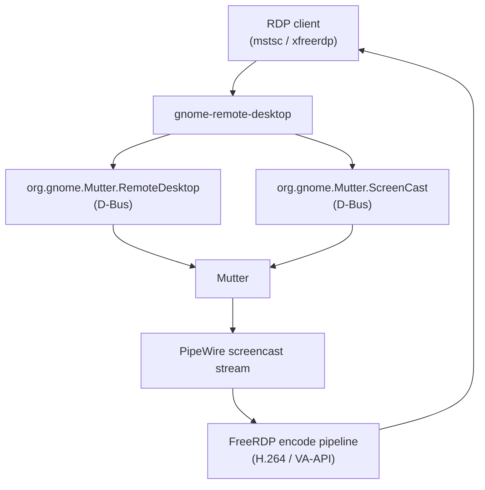
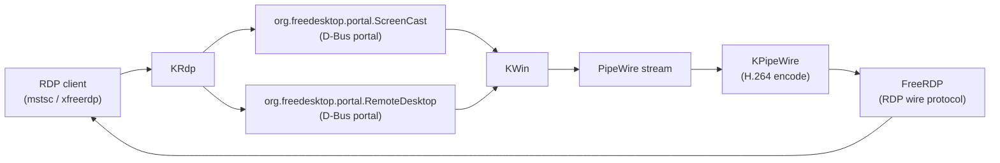
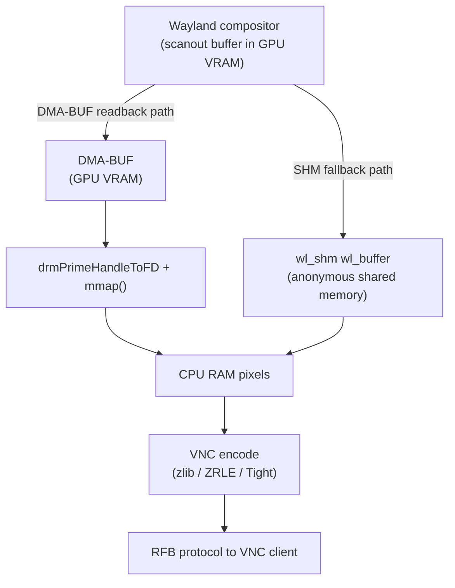
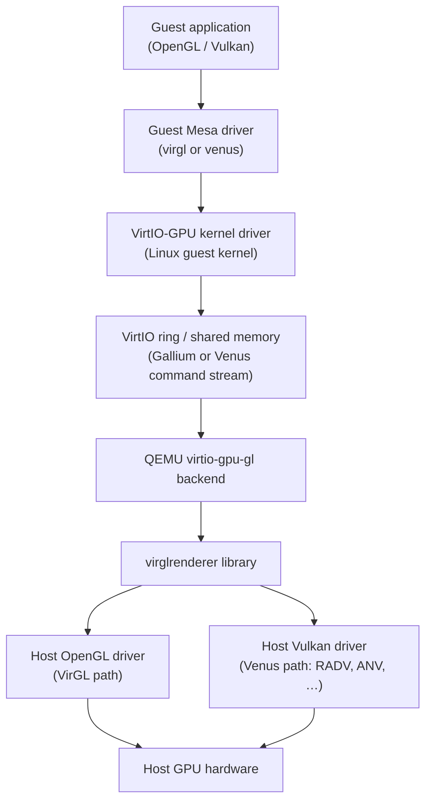
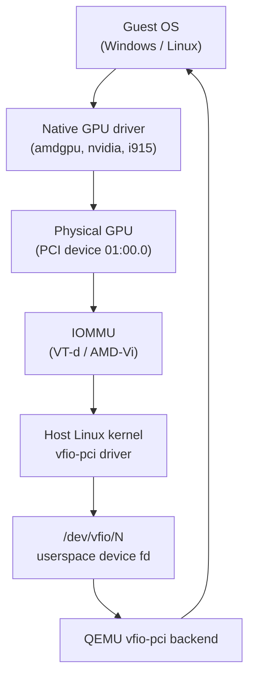
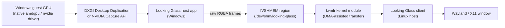
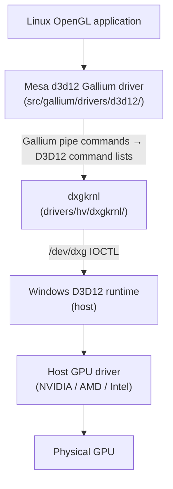
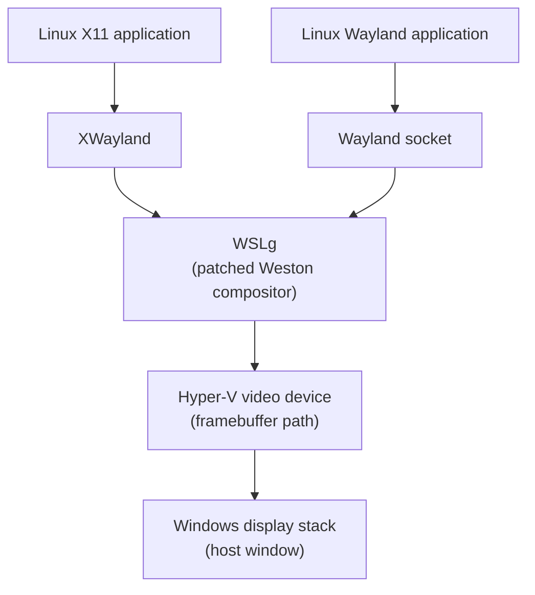

# Appendix K: Remote Display and GPU Virtualisation

> **Status**: First draft — 2026-06-18

## Table of Contents

- [Overview](#overview)
- [K.1 RDP: Remote Desktop Protocol on Linux](#k1-rdp-remote-desktop-protocol-on-linux)
- [K.2 VNC and the Wayland Capture Chain](#k2-vnc-and-the-wayland-capture-chain)
- [K.3 PipeWire-Based Remote Desktop](#k3-pipewire-based-remote-desktop)
- [K.4 GPU Virtualisation: VirtIO-GPU, VirGL, and Venus](#k4-gpu-virtualisation-virtio-gpu-virgl-and-venus)
- [K.5 VFIO and GPU Passthrough](#k5-vfio-and-gpu-passthrough)
- [K.6 WSL2 and the dxgkrnl Bridge](#k6-wsl2-and-the-dxgkrnl-bridge)
- [References](#references)

---

## Overview

Remote display on Linux spans two distinct problem domains: *screen capture and encoding* (sending a running desktop session to a remote viewer) and *GPU virtualisation* (giving a virtual machine or container access to GPU resources). Both domains intersect the graphics stack at the compositor and kernel layers. This appendix surveys the principal technologies in each domain, with cross-references to the chapters where the underlying mechanisms — PipeWire, DMA-BUF, VirtIO, KMS — are covered in depth.

---

## K.1 RDP: Remote Desktop Protocol on Linux

**Target audience**: systems administrators, DevOps engineers, desktop Linux users needing Windows-compatible remote access.

The Remote Desktop Protocol (RDP) is Microsoft's proprietary display protocol, but the Linux ecosystem has mature open-source implementations on both the client and server sides.

### FreeRDP

[FreeRDP](https://www.freerdp.com/) is the reference open-source RDP implementation, released under the Apache 2.0 licence. As of 2026 it has shipped 79 releases and carries over 23,000 commits from more than 400 contributors, making it one of the most actively maintained remote-display projects in the Linux ecosystem.

FreeRDP ships three primary binaries:

- **`xfreerdp`** — the X11 client for connecting to a Windows or Linux RDP server.
- **`wfreerdp`** — the Wayland-native client built against `libsdl2` or a native Wayland window.
- **`freerdp-shadow-cli`** — a lightweight shadow server that shares an already-running Linux desktop session; it captures the screen with X11 or Wayland APIs and streams it to an RDP client without managing session login itself.

```bash
# Connect to a Windows host as a client
xfreerdp /v:192.168.1.10 /u:Administrator /d:WORKGROUP /dynamic-resolution /gfx:AVC444

# Share the local X11 desktop with freerdp-shadow
freerdp-shadow-cli /port:3389 /auth:winpr
```

[Source: FreeRDP documentation](https://github.com/FreeRDP/FreeRDP/wiki)

### GNOME Remote Desktop (gnome-remote-desktop)

[`gnome-remote-desktop`](https://gitlab.gnome.org/GNOME/gnome-remote-desktop) is the GNOME project's integrated remote-desktop server. It began life providing VNC access (via libvncserver) around 2017, and **RDP support was added in GNOME 42** (2022), quickly becoming the default protocol. From GNOME 46 it supports three operation modes:

1. **Session sharing** — a logged-in user exposes their current session (like freerdp-shadow, but Wayland-native).
2. **Headless single-user** — a user-space systemd service starts a Mutter session without a physical display.
3. **System (multi-user login)** — a system-level GDM integration allows remote login to new sessions.

The architecture is: Mutter exposes two private D-Bus interfaces — `org.gnome.Mutter.RemoteDesktop` and `org.gnome.Mutter.ScreenCast` — that `gnome-remote-desktop` calls to acquire a PipeWire screencast stream and virtual input devices. The PipeWire video frames are then fed into FreeRDP's encode pipeline (see Chapter 38 for PipeWire ScreenCast detail).



```bash
# Enable GNOME RDP (run as user, or via System Settings → Sharing → Remote Desktop)
grdctl rdp enable
grdctl rdp set-credentials myuser mysecretpassword
systemctl --user restart gnome-remote-desktop
```

[Source: GNOME gnome-remote-desktop](https://gitlab.gnome.org/GNOME/gnome-remote-desktop)

### KDE Plasma 6: KRdp

KDE Plasma 6 ships **KRdp**, a library that exposes the active KDE Wayland session over RDP. KRdp uses three components:

- The `org.freedesktop.portal.RemoteDesktop` and `org.freedesktop.portal.ScreenCast` D-Bus portal interfaces to request a PipeWire stream and virtual input from KWin.
- **KPipeWire** to encode that stream to H.264 in software or hardware.
- **FreeRDP** as the RDP wire-protocol encoder/decoder.



Users enable it via **System Settings → Remote Desktop** in Plasma 6; standard RDP clients (`mstsc`, `xfreerdp`) connect directly. [Source: KDE planet, Arjen Hiemstra](https://planet.kde.org/arjen-hiemstra-2023-08-08-remote-desktop-using-the-rdp-protocol-for-plasma-wayland/)

### GPU-Accelerated H.264 Encode

The most CPU-intensive part of an RDP session is the continuous video encode. The RDP H.264 codec profile (`RDP_CODEC_ID_H264`, used in the Graphics Pipeline Extension / EGFX channel) maps naturally onto hardware video encoders:

- **VA-API** (AMD/Intel): gnome-remote-desktop and KRdp can route encode through `libva`, offloading H.264 or H.265 encode to the GPU's fixed-function video encode engine. See Chapter 26 for the VA-API encode pipeline.
- **NVENC** (NVIDIA): FreeRDP has an optional NVENC backend that submits frames directly to the NVIDIA encode SDK, achieving hardware H.264 encode with minimal CPU overhead.

When hardware encode is available the host CPU load for a 1080p RDP session drops from ~30–40% to under 5%.

---

## K.2 VNC and the Wayland Capture Chain

**Target audience**: administrators, developers needing lightweight remote viewing without the RDP codec overhead.

VNC (Virtual Network Computing) uses the RFB (Remote Framebuffer) protocol, which is fundamentally simpler than RDP: the server sends pixel rectangle updates to the client. Its weakness on modern composited Wayland desktops is that it requires CPU-readable pixel buffers (shared memory), which forces a GPU-to-CPU copy of every frame.

### wayvnc

[`wayvnc`](https://github.com/any1/wayvnc) (latest: v0.10.0, April 2026) is the standard VNC server for Wayland compositors. It attaches to a running Wayland session, creates virtual input devices, and exports the display via the RFB protocol. It is built around [neatvnc](https://github.com/any1/neatvnc) and requires libdrm, GBM, and libEGL.

```bash
# Start wayvnc on display :0, binding on localhost port 5900
wayvnc --output=HDMI-A-1 127.0.0.1 5900

# With TLS authentication
wayvnc --config=/etc/wayvnc/config 0.0.0.0 5900
```

wayvnc's compositor capture path has evolved significantly:

1. **`zwlr_screencopy_manager_v1`** (wlr-screencopy, deprecated) — the original capture protocol from wlroots; the compositor blits the KMS scanout buffer into a client-provided `wl_buffer`. Works with wlroots-based compositors (Sway, Wayfire, Hyprland, labwc).
2. **`ext_image_copy_capture_manager_v1`** + **`ext_image_capture_source_v1`** — the Wayland-upstream successor protocols that build on wlr-screencopy with improvements for window capture and better performance semantics. Merged into Wayland protocols upstream and adopted by wayvnc. [Source: OSnews — Wayland merges new screen capture protocols](https://www.osnews.com/story/140459/wayland-merges-new-screen-capture-protocols/)

### DMA-BUF vs. SHM paths

The compositor can satisfy a screencopy request in two ways:

- **DMA-BUF readback** — the compositor blits the scanout buffer to a client-provided DMA-BUF. The buffer lives in GPU VRAM; wayvnc must call `drmPrimeHandleToFD` and `mmap()` the result to read pixels into CPU RAM for VNC encoding. This is a GPU→CPU copy but avoids a double-copy via system memory.
- **SHM fallback** — the compositor blits directly to a `wl_shm`-backed `wl_buffer` in anonymous shared memory. Simpler, but forces the GPU to write through to normal RAM, which can be slower on discrete GPUs.



VNC encoding itself (zlib, ZRLE, Tight) is always CPU-bound, so there is **no zero-copy path for VNC** — the GPU-produced frame must always reach CPU RAM before it can be encoded and sent to the client. This is VNC's fundamental disadvantage compared to RDP's H.264 encode path (which can stay fully in GPU memory via VA-API, as described in K.1).

### KDE: krfb

KDE ships `krfb` as its VNC server, integrated with KWin's Wayland backend via the RemoteDesktop portal. It is functionally similar to wayvnc but uses Qt5/Qt6 libraries and exposes a simple GUI for allowing or denying incoming connection requests.

---

## K.3 PipeWire-Based Remote Desktop

**Target audience**: application developers, browser engineers, streaming software authors.

PipeWire (see Chapter 38) is not only an audio server; its graph model and DMA-BUF support make it the central bus for screen-sharing on modern Wayland desktops.

### xdg-desktop-portal interfaces

[xdg-desktop-portal](https://github.com/flatpak/xdg-desktop-portal) exposes two D-Bus interfaces that mediate screen access for sandboxed and unsandboxed applications alike:

- **`org.freedesktop.portal.ScreenCast`** — allows a client to request a screencast. The compositor backend shows a picker dialog; the user selects an output or window. The portal returns a PipeWire remote file descriptor via `OpenPipeWireRemote()`. The client reads video frames from this PipeWire stream.
- **`org.freedesktop.portal.RemoteDesktop`** — extends ScreenCast with virtual input injection (keyboard, pointer, touch). Used by RDP servers (gnome-remote-desktop, KRdp) and remote access tools.

[Source: XDG Desktop Portal ScreenCast documentation](https://flatpak.github.io/xdg-desktop-portal/docs/doc-org.freedesktop.portal.ScreenCast.html)

The compositor-specific backend implementations are:

- **xdg-desktop-portal-gnome** — implements portals using Mutter's private D-Bus API.
- **xdg-desktop-portal-kde** — routes through KWin.
- **xdg-desktop-portal-wlr** (and its successors xdg-desktop-portal-hyprland etc.) — uses `wlr-screencopy`/`ext-image-copy-capture` on wlroots-based compositors.

### PipeWire stream architecture

```
Application (OBS, browser, RDP server)
        │  pw_stream_connect()
        ▼
  PipeWire session graph
        │  SPA_DATA_DmaBuf or SPA_DATA_MemFd buffers
        ▼
  Portal backend (xdp-gnome / xdp-wlr)
        │  screencopy / Mutter ScreenCast API
        ▼
  Wayland compositor (Mutter / KWin / sway)
        │  GPU scanout buffer → blit to PipeWire buffer
        ▼
  KMS scanout (Chapter 2)
```

When the compositor and PipeWire negotiate `SPA_DATA_DmaBuf` buffer type, the frame stays in GPU memory as a DMA-BUF handle. This is the **zero-copy path**: the compositor blits the scanout buffer to a DMA-BUF that is owned by PipeWire, which the consumer (OBS, VA-API encoder, WebRTC) imports directly without going through CPU RAM.

### OBS Studio

OBS Studio's PipeWire screen capture plugin (`obs-pipewire`) is a concrete example of a consumer. It calls `org.freedesktop.portal.ScreenCast`, receives a PipeWire stream, and imports each frame buffer. If the frame arrives as a DMA-BUF, OBS can import it directly into an OpenGL texture via `EGL_EXT_image_dma_buf_import`, rendering it in its scene graph without CPU intervention.

### WebRTC screen sharing (Chrome / Firefox)

Chrome's WebRTC implementation on Linux (`webrtc_desktop_capture`) uses the ScreenCast portal when running under Wayland. The PipeWire stream feeds Chrome's WebRTC encode pipeline. When the frame arrives as a DMA-BUF, Chrome can import it into a VA-API or V4L2 encode pipeline, achieving hardware H.264/VP8 encode with no CPU copy. Firefox has used an equivalent PipeWire-based desktop capture path since Firefox 116. [Source: Phoronix, Wayland screen sharing how-to](https://www.phoronix.com/news/Wayland-Share-HowTo-Pipe-XDG)

---

## K.4 GPU Virtualisation: VirtIO-GPU, VirGL, and Venus

**Target audience**: VM developers, cloud infrastructure engineers, driver developers.



### VirtIO-GPU: the paravirtualised GPU

VirtIO-GPU is the paravirtualised GPU defined in the VirtIO specification. It presents as a PCI device to the guest and communicates with the hypervisor via a VirtIO ring. It supports two sub-protocols:

1. **2D mode** — simple dumb-framebuffer commands such as `VIRTIO_GPU_CMD_RESOURCE_CREATE_2D`, `VIRTIO_GPU_CMD_RESOURCE_FLUSH`, and `VIRTIO_GPU_CMD_SET_SCANOUT`. These are sufficient for a text console or unaccelerated desktop but impose CPU-side rendering.
2. **3D (VirGL) mode** — the guest driver serialises Gallium command streams into VirtIO ring descriptors; the host decodes and replays them against the host GPU. Enabled by `VIRTIO_GPU_F_VIRGL` capability bit, and in QEMU by `-device virtio-gpu-gl`.

[Source: QEMU virtio-gpu documentation](https://www.qemu.org/docs/master/system/devices/virtio/virtio-gpu.html)

### VirGL: OpenGL virtualisation

VirGL virtualises OpenGL. The division of labour is:

- **Guest side (Mesa)**: `src/gallium/drivers/virgl/` — a Gallium driver that serialises Gallium3D pipe commands (draw calls, state, shader IR in TGSI/NIR) into the VirtIO ring.
- **Host side**: `virglrenderer` library at [`gitlab.freedesktop.org/virgl/virglrenderer`](https://gitlab.freedesktop.org/virgl/virglrenderer) — decodes the Gallium command stream and replays it via the host OpenGL driver. The library is mostly API-stable and handles resource (texture, buffer) lifetime synchronously with the VirtIO fence mechanism.

VirGL supports **OpenGL 4.3** and **GLES 3.2** in the current QEMU configuration, and is described as "basically feature complete" with ongoing work focused on security fuzzing. Because commands are processed twice (once in the guest, once on the host), it is less efficient than passthroughs (VFIO) or near-native approaches (Venus), but it works on any host GPU that supports OpenGL 4.x and requires no hardware-specific guest driver.

```bash
# QEMU: enable VirGL (OpenGL acceleration, no Vulkan)
qemu-system-x86_64 \
  -enable-kvm \
  -device virtio-vga-gl \
  -display gtk,gl=on \
  ...
```

[Source: Collabora blog — state of GFX virtualisation 2025](https://www.collabora.com/news-and-blog/blog/2025/01/15/the-state-of-gfx-virtualization-using-virglrenderer/)

### Venus: Vulkan virtualisation

Venus is the Vulkan virtualisation protocol for VirtIO-GPU. Unlike VirGL, Venus forwards Vulkan API calls with minimal transformation — SPIR-V shaders pass through to the host driver unchanged, giving near-native performance.

- **Guest side (Mesa)**: `src/virtio/vulkan/` — the `venus` Vulkan ICD, also known as `virtio` in Mesa. Commands are serialised into a shared ring buffer backed by blob resources.
- **Host side**: `virglrenderer` with Venus context type (`VIRGL_RENDERER_USE_EGL | VIRGL_RENDERER_USE_VENUS`), which deserialises the command stream and dispatches to the host Vulkan implementation (RADV, ANV, NVIDIA, Turnip, PanVK, Lavapipe — all tested and supported).
- **Memory sharing**: Venus chains `VkExportMemoryAllocateInfo` to `VkMemoryAllocateInfo` to export device memory as a mmappable DMA-BUF, which is then registered with KVM for coherent guest-host access. This **blob resource** mechanism eliminates the need for explicit copy commands for buffer data.

Venus requires `VIRTGPU_PARAM_RESOURCE_BLOB` and `VIRTGPU_PARAM_HOST_VISIBLE` kernel parameters (Linux 5.14+) and `VK_EXT_image_drm_format_modifier` support on the host GPU (unavailable on pre-GFX9 AMD). It supports Vulkan 1.3 as of early 2025 and gained mesh shader support (`VK_EXT_mesh_shader`) in Mesa 26.0. [Source: Phoronix — Venus Vulkan Mesh Shader](https://www.phoronix.com/news/Venus-Vulkan-Mesh-Shader)

```bash
# QEMU: enable Venus (Vulkan) with blob resources
qemu-system-x86_64 \
  -enable-kvm \
  -accel kvm,honor-guest-pat=on \
  -device virtio-gpu-gl,hostmem=4G,blob=true,venus=true \
  -display gtk,gl=on \
  ...
```

[Source: Mesa Venus documentation](https://docs.mesa3d.org/drivers/venus.html)

### crosvm and rutabaga_gfx

[crosvm](https://crosvm.dev/) (Chrome OS's VM monitor) uses the **rutabaga_gfx** library as its GPU backend, which wraps both virglrenderer (VirGL + Venus) and **gfxstream** (a lower-overhead Vulkan/GLES forwarding protocol used in Android automotive virtualisation):

```bash
# crosvm: enable Venus via virglrenderer
crosvm run \
  --gpu vulkan=true \
  --gpu-render-server path=/usr/libexec/virgl_render_server \
  ...
```

QEMU 8.2+ also supports the rutabaga/gfxstream path via `-device virtio-gpu-rutabaga,gfxstream-vulkan=on`. [Source: QEMU VirtIO-GPU docs](https://www.qemu.org/docs/master/system/devices/virtio/virtio-gpu.html)

---

## K.5 VFIO and GPU Passthrough

**Target audience**: gaming VM users, ML/CUDA workload operators, bare-metal performance seekers.



### VFIO: Virtual Function I/O

VFIO (Virtual Function I/O) is the Linux kernel framework for safe, IOMMU-mediated userspace device access. When the `vfio-pci` driver is bound to a PCI device:

1. The native driver (e.g. `amdgpu`) is unbound from the device.
2. `vfio-pci` creates `/dev/vfio/N` (where N is the IOMMU group number) and `/dev/vfio/vfio`.
3. A userspace process (QEMU) opens these fds and receives a file descriptor representing the device's BARs, interrupts, and DMA capabilities.
4. The IOMMU (Intel VT-d or AMD-Vi) enforces that the device's DMA transactions can only target memory mapped for that IOMMU group, preventing the guest from corrupting host memory.

### IOMMU groups and ACS

A critical constraint is that **all devices in an IOMMU group must be passed through together**. PCIe ACS (Access Control Services) determines whether a PCIe root complex isolates each slot into its own group. Consumer motherboards frequently bundle all PCIe slots under a single root complex without ACS, placing them in one giant IOMMU group. Workarounds:

- Patch the kernel with the **ACS override patch** and boot with `pcie_acs_override=downstream,multifunction`. This forces the kernel to treat each device as its own IOMMU group at the cost of weakened DMA isolation.
- Use a platform (EPYC, Threadripper, or dedicated PCIe-via-CPU lanes) that natively provides ACS on each slot.

```bash
# Enable IOMMU at boot (add to kernel command line)
# Intel:
intel_iommu=on iommu=pt
# AMD:
amd_iommu=on iommu=pt

# Bind GPU to vfio-pci early (before amdgpu loads)
# Add to /etc/modprobe.d/vfio.conf:
options vfio-pci ids=1002:687f,1002:aaf8   # RX Vega64 GFX + HDMI audio

# List IOMMU groups
for d in /sys/kernel/iommu_groups/*/devices/*; do
    echo "Group $(basename $(dirname $(dirname $d))): $(lspci -nns ${d##*/})"
done
```

### QEMU GPU passthrough

Once the GPU is bound to `vfio-pci`, pass it to a QEMU VM:

```bash
qemu-system-x86_64 \
  -enable-kvm \
  -machine q35,accel=kvm \
  -cpu host \
  -m 16G \
  -device vfio-pci,host=01:00.0,multifunction=on,x-vga=true \
  -device vfio-pci,host=01:00.1 \
  -bios /usr/share/ovmf/OVMF.fd \
  ...
```

The guest sees a real PCI GPU at `01:00.0`, loads its native driver (`amdgpu`, `nvidia`), and achieves bare-metal GPU performance. CUDA, ROCm, hardware video encode, and display output all work as they would on physical hardware.

### Looking Glass

[Looking Glass](https://looking-glass.io/) solves the "headless GPU passthrough" problem: a Windows 10/11 guest uses a GPU for rendering but has no physical monitor attached. The **IVSHMEM** virtual device (Inter-VM Shared Memory, `ivshmem-plain`) provides a chunk of RAM accessible simultaneously by both the VM and the host. The Looking Glass Windows host application captures the guest's rendered framebuffer via DXGI Desktop Duplication or the NVIDIA Capture API and writes raw 32-bit RGBA frames into the IVSHMEM region at extremely high throughput — no compression, no encode latency. The Looking Glass Linux client reads those frames from the IVSHMEM (or the `kvmfr` kernel module for DMA-assisted transfer) and displays them in a Wayland or X11 window.

Typical latency with IVSHMEM + KVMFR is under 10 ms end-to-end, comparable to a physical display, and far below what H.264 encode/decode cycles impose (~50–100 ms).

```bash
# QEMU IVSHMEM device (256 MiB for 1080p RGBA)
-device ivshmem-plain,memdev=ivshmem \
-object memory-backend-file,id=ivshmem,share=on,mem-path=/dev/shm/looking-glass,size=256M
```

[Source: Looking Glass documentation B7](https://looking-glass.io/docs/B7/install_libvirt/)



### SR-IOV

Enterprise and server-class AMD (Instinct) and Intel (Arc Pro, Xe) GPUs support **SR-IOV** (Single Root I/O Virtualization), which exposes multiple **Virtual Functions** (VFs) from a single physical GPU. Each VF appears as an independent PCI device that can be passed to a separate VM, allowing true GPU sharing without virtualisation overhead. AMD's GPU-IOV driver (`amdgpu` with SR-IOV mode) and Intel's `xe` driver handle VF creation and resource partitioning. Consumer AMD and NVIDIA GPUs do not support SR-IOV. [Source: CloudRift — GPU virtualisation QEMU KVM NVIDIA AMD](https://www.cloudrift.ai/blog/gpu-virtualization-qemu-kvm-nvidia-amd)

---

## K.6 WSL2 and the dxgkrnl Bridge

**Target audience**: developers on Windows using WSL2 for Linux GPU workloads.

Windows Subsystem for Linux 2 (WSL2) runs a real Linux kernel inside a lightweight Hyper-V VM, but with a specialised GPU bridge to the Windows host driver that makes it appear almost native to Linux GPU applications.

### dxgkrnl: the kernel bridge

`dxgkrnl` is a Linux kernel module that lives at `drivers/hv/dxgkrnl/` in the [WSL2 kernel fork](https://github.com/microsoft/WSL2-Linux-Kernel). It implements a Hyper-V virtual bus device (VMBus channel) that speaks to the Windows GPU driver on the host via paravirtualised IOCTL calls. From the guest's perspective, `dxgkrnl` exposes `/dev/dxg` rather than the usual `/dev/dri/cardN` or `/dev/dri/renderDN` nodes.

`dxgkrnl` is **not** in the upstream Linux kernel; it is specific to the WSL2 kernel branch (currently rebased on kernel 6.6/6.18). The module carries Microsoft's copyright and is released under GPL-2.0.

[Source: Phoronix — Microsoft DXGKRNL v2](https://www.phoronix.com/news/Microsoft-DXGKRNL-v2)

### Mesa d3d12: OpenGL on D3D12

Mesa's `d3d12` Gallium driver (`src/gallium/drivers/d3d12/`) implements the Gallium3D interface on top of Direct3D 12 API calls. Inside WSL2:

1. A Linux OpenGL application calls into Mesa.
2. Mesa's `d3d12` Gallium driver translates Gallium pipe commands to D3D12 command lists.
3. D3D12 calls route through `dxgkrnl` via the `/dev/dxg` IOCTL interface to the Windows D3D12 runtime.
4. The Windows GPU driver (e.g. the host NVIDIA, AMD, or Intel driver) executes the commands on the physical GPU.



This gives WSL2 guests **OpenGL 3.3** (and higher via extensions) without requiring a native Linux GPU driver for the hardware. [Source: Mesa d3d12 documentation](https://docs.mesa3d.org/drivers/d3d12.html)

### Dozen (dzn): Vulkan on D3D12

**Dozen** (ICD name `dzn`) is Mesa's Vulkan driver for the same D3D12 path. It translates Vulkan API calls (and SPIR-V shaders, via cross-compilation to DXIL) to D3D12, again routing through `dxgkrnl`. The initial implementation was developed by Collabora under contract for Microsoft, based on work from Erik Faye-Lund and Boris Brezillon. As of 2025/2026 `dzn` is available in WSL2 distributions and can be selected via `VK_ICD_FILENAMES` or by `VK_LOADER_DRIVERS_SELECT=dzn_*`.

Note that `dzn` (Dozen) translates **Vulkan → D3D12**, which is the inverse direction from `vkd3d-proton` (which translates D3D12 → Vulkan for Wine/Proton gaming on Linux). They are complementary tools for different use cases.

[Source: Phoronix — Mesa Dozen D3D12 Vulkan](https://www.phoronix.com/news/Mesa-Dozen-VLK-D3D12)

### CUDA and compute under WSL2

NVIDIA ships a special `libcuda.so` inside the WSL2 guest that routes CUDA calls through `dxgkrnl` to reach the host CUDA runtime. No `/dev/dri/` or `/dev/nvidia*` nodes are created — CUDA exclusively uses `/dev/dxg`. This allows Linux CUDA workloads to run on the host NVIDIA GPU with minimal overhead, enabling use cases like ML training inside a WSL2 environment. [Source: Microsoft developer blog — D3D12 GPU video acceleration in WSL](https://devblogs.microsoft.com/commandline/d3d12-gpu-video-acceleration-in-the-windows-subsystem-for-linux-now-available/)

### Display limitations

WSL2 does **not** expose a KMS/DRM device (`/dev/dri/cardN`). GUI output for Linux GUI applications is provided by **WSLg** — a patched Weston compositor that renders into a Hyper-V video device (distinct from the `dxgkrnl` GPU path) and displays the result in a Windows window using the host's display stack. The WSLg compositor uses XWayland for legacy X11 applications and a Wayland socket for native Wayland applications. Because the framebuffer path goes through a separate Hyper-V video device, it is independent of the D3D12/dxgkrnl path used for GPU compute.



---

## References

- [FreeRDP project — freerdp.com](https://www.freerdp.com/)
- [GNOME Remote Desktop — gitlab.gnome.org](https://gitlab.gnome.org/GNOME/gnome-remote-desktop)
- [KDE KRdp blog post (Arjen Hiemstra, 2023)](https://planet.kde.org/arjen-hiemstra-2023-08-08-remote-desktop-using-the-rdp-protocol-for-plasma-wayland/)
- [wayvnc — github.com/any1/wayvnc](https://github.com/any1/wayvnc)
- [Wayland Explorer — wlr-screencopy-unstable-v1](https://wayland.app/protocols/wlr-screencopy-unstable-v1)
- [OSnews — Wayland merges new screen capture protocols (ext-image-copy-capture)](https://www.osnews.com/story/140459/wayland-merges-new-screen-capture-protocols/)
- [xdg-desktop-portal ScreenCast documentation](https://flatpak.github.io/xdg-desktop-portal/docs/doc-org.freedesktop.portal.ScreenCast.html)
- [xdg-desktop-portal RemoteDesktop documentation](https://flatpak.github.io/xdg-desktop-portal/docs/doc-org.freedesktop.portal.RemoteDesktop.html)
- [Phoronix — Wayland screen sharing how-to with PipeWire and XDG Portal](https://www.phoronix.com/news/Wayland-Share-HowTo-Pipe-XDG)
- [Mesa VirGL documentation](https://docs.mesa3d.org/drivers/virgl.html)
- [Mesa Venus (Virtio-GPU Vulkan) documentation](https://docs.mesa3d.org/drivers/venus.html)
- [Phoronix — Venus Vulkan mesh shader support in Mesa 26.0](https://www.phoronix.com/news/Venus-Vulkan-Mesh-Shader)
- [QEMU virtio-gpu documentation](https://www.qemu.org/docs/master/system/devices/virtio/virtio-gpu.html)
- [Collabora blog — State of GFX virtualisation using virglrenderer (January 2025)](https://www.collabora.com/news-and-blog/blog/2025/01/15/the-state-of-gfx-virtualization-using-virglrenderer/)
- [virglrenderer — gitlab.freedesktop.org/virgl/virglrenderer](https://gitlab.freedesktop.org/virgl/virglrenderer)
- [Looking Glass project — looking-glass.io](https://looking-glass.io/)
- [Looking Glass B7 libvirt/QEMU installation](https://looking-glass.io/docs/B7/install_libvirt/)
- [ArchWiki — PCI passthrough via OVMF](https://wiki.archlinux.org/title/PCI_passthrough_via_OVMF)
- [CloudRift — GPU virtualisation QEMU KVM NVIDIA AMD SR-IOV](https://www.cloudrift.ai/blog/gpu-virtualization-qemu-kvm-nvidia-amd)
- [Mesa d3d12 Gallium driver documentation](https://docs.mesa3d.org/drivers/d3d12.html)
- [Phoronix — Mesa Dozen close to providing Vulkan over Direct3D 12](https://www.phoronix.com/news/Mesa-Dozen-VLK-D3D12)
- [Phoronix — Microsoft DXGKRNL v2 for WSL/WSA](https://www.phoronix.com/news/Microsoft-DXGKRNL-v2)
- [Microsoft developer blog — D3D12 GPU video acceleration in WSL](https://devblogs.microsoft.com/commandline/d3d12-gpu-video-acceleration-in-the-windows-subsystem-for-linux-now-available/)
- [WSL2 Linux Kernel (dxgkrnl source) — github.com/microsoft/WSL2-Linux-Kernel](https://github.com/microsoft/WSL2-Linux-Kernel)

---

*Copyright © 2026 jreuben11. Licensed under [CC BY 4.0](https://creativecommons.org/licenses/by/4.0/).*
