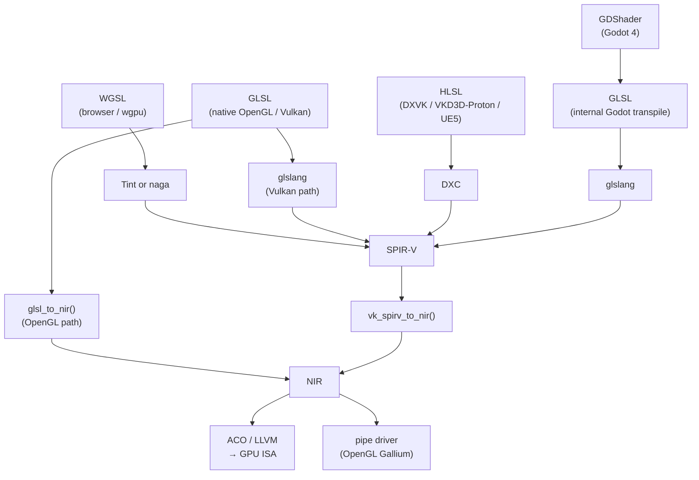
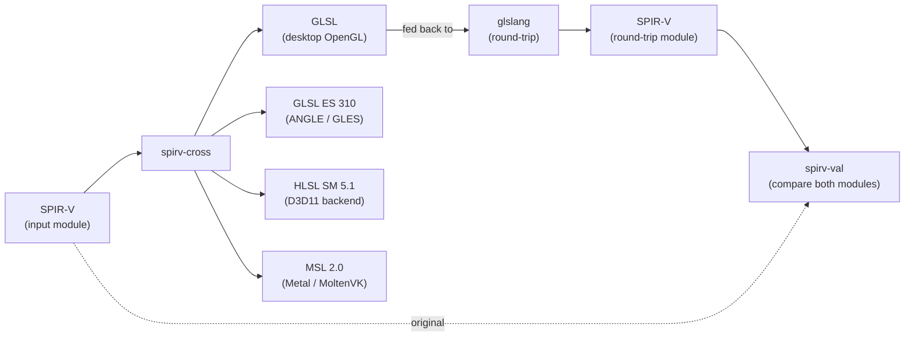
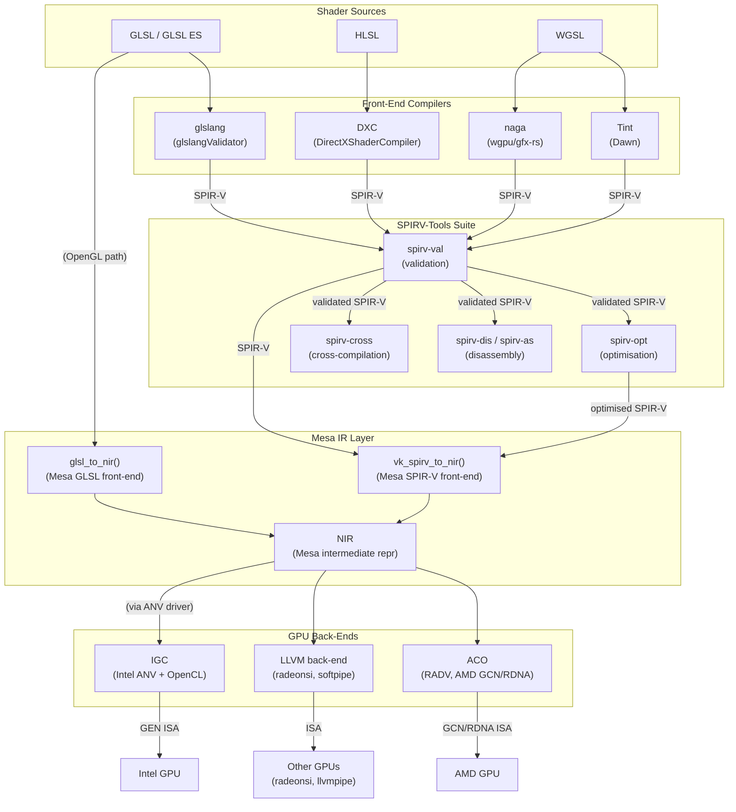

# Appendix L: Shader Toolchain Matrix

> **Status**: First draft — 2026-06-18

This appendix is a quick-reference matrix showing which tools read and write which shader formats, and where each tool fits in the Linux graphics stack.

---

## L.1 Format Overview

| Format | Description | Primary consumers |
|---|---|---|
| GLSL | OpenGL Shading Language | Mesa (NIR front end via `glsl_to_nir`) |
| GLSL ES | OpenGL ES Shading Language | ANGLE, Mesa GLES drivers |
| HLSL | High-Level Shader Language (Microsoft) | DXVK, VKD3D-Proton, UE5, Unity, DXC |
| WGSL | WebGPU Shading Language | Dawn/Tint, wgpu/naga |
| SPIR-V | Khronos binary IR | All Mesa Vulkan drivers via `vk_spirv_to_nir()` |
| GDShader/GLSL | Godot shaders → GLSL → SPIR-V | Godot 4 (Ch41) |
| SkSL | Skia shading language | Skia Ganesh and Graphite (Ch37) |
| MSL | Metal Shading Language | macOS/iOS only |
| DXBC/DXIL | DirectX bytecode / LLVM IR | Windows only (D3D11/D3D12) |

---

## L.2 Tool Matrix

| Tool | Source | Target(s) | Notes |
|---|---|---|---|
| `glslang` / `shaderc` | GLSL, GLSL ES | SPIR-V | Reference Khronos compiler; used by ANGLE, many apps |
| `DXC` (DirectXShaderCompiler) | HLSL | SPIR-V, DXIL | Used by UE5, Unity (`#pragma use_dxc`), VKD3D-Proton |
| `Tint` | WGSL | SPIR-V, MSL, HLSL, GLSL | Dawn's shader compiler (Ch35) |
| `naga` | WGSL, SPIR-V, GLSL | SPIR-V, GLSL, MSL, HLSL | wgpu's Rust shader translator (Ch40) |
| `spirv-cross` | SPIR-V | GLSL, HLSL, MSL, GLSL ES | Cross-compilation for inspection or non-Vulkan backends |
| `spirv-val` | SPIR-V | — (validation) | Khronos SPIR-V validator; Mesa CI prerequisite |
| `spirv-opt` | SPIR-V | SPIR-V | SPIRV-Tools optimiser; useful for isolating driver bugs |
| `spirv-dis` / `spirv-as` | SPIR-V ↔ text | SPIR-V / text | Disassembler and assembler for inspection |
| `vk_spirv_to_nir()` | SPIR-V | NIR | Mesa's SPIR-V front end; entry point for all Vulkan drivers |
| `glsl_to_nir()` | GLSL | NIR | Mesa's GLSL front end; used by GL state tracker (Gallium) |
| `ACO` | NIR | GCN/RDNA ISA | RADV's shader compiler (Ch15) |
| `IGC` (Intel Graphics Compiler) | SPIR-V / LLVM IR | GEN ISA | Intel's GPU compiler; used by ANV and compute-runtime |
| `HLSLcc` | DXBC | GLSL / SPIR-V-compat GLSL | Unity's legacy shader cross-compiler |
| `glslangValidator` | GLSL, HLSL | SPIR-V, AST dump | Developer tool for shader validation |

---

## L.3 Key Paths in the Linux Stack

```
WGSL (browser/wgpu)
  → Tint or naga → SPIR-V
    → vk_spirv_to_nir() → NIR → ACO/LLVM → GPU ISA

GLSL (native OpenGL / Vulkan)
  → glslang → SPIR-V (Vulkan path)
  → glsl_to_nir() → NIR → pipe driver (OpenGL path)

HLSL (DXVK / VKD3D-Proton / UE5)
  → DXC → SPIR-V
    → vk_spirv_to_nir() → NIR → ACO/LLVM → GPU ISA

GDShader (Godot 4)
  → GLSL (internal transpile) → glslang → SPIR-V
    → vk_spirv_to_nir() → NIR → GPU ISA
```



---

## L.4 Version and Availability Reference

The table below captures the current release series as of mid-2026 and the distribution package names for the two most common Linux developer workstation targets, Fedora and Ubuntu (24.04 LTS / Noble). Where a tool ships as part of a larger SDK (e.g. Vulkan SDK) the SDK version is given. Tools that are not yet packaged by distributions are noted; developers must build from source or install via a language-specific package manager.

| Tool | Current version (as of 2026) | Package name — Fedora (`dnf`) | Package name — Ubuntu (`apt`) | Notes on Linux availability |
|---|---|---|---|---|
| `glslang` / `glslangValidator` | 16.3.0 (May 2026) | `glslang` | `glslang-tools`, `glslang-dev` | Packaged in most distributions; also ships inside the Vulkan SDK tarball from LunarG. HLSL front-end deprecated as of April 2026 and scheduled for removal at next major version. |
| `DXC` (DirectXShaderCompiler) | v1.9.2602 (February 2026) | `directx-shader-compiler` | `hlsl2glsl` (community); build from source recommended | Not yet in Fedora/Ubuntu main repos at v1.9. Build via `cmake` or use `libdxc` in the Vulkan SDK. Linux produces `dxc` binary and `libdxcompiler.so`. |
| `Tint` (part of Dawn) | Tracks Chromium/Dawn HEAD (no standalone version tag) | — (not separately packaged) | — (not separately packaged) | Embedded in Chrome/Chromium and the Dawn library (`libdawn.so`). Standalone `tint` CLI can be built from [dawn.googlesource.com/dawn](https://dawn.googlesource.com/dawn). Prebuilt artifacts available via GitHub Actions on the Dawn mirror. |
| `naga` / `naga-cli` | 29.0.3 (part of wgpu 29.x, May 2026) | — (not separately packaged) | — (not separately packaged) | Install via Cargo: `cargo install naga-cli`. No distro package exists yet; the library crate is published at [crates.io/crates/naga](https://crates.io/crates/naga). |
| `spirv-cross` | v1.4.341.0 (March 2026; Vulkan SDK 1.4.341) | `spirv-cross` | `spirv-cross` | Available in both distros; also bundled in LunarG Vulkan SDK. Versioning tracks Vulkan SDK release cadence. |
| `spirv-val` / `spirv-opt` / `spirv-dis` | v2026.2 (April 2026) | `spirv-tools` | `spirv-tools` | All three binaries ship in the single `spirv-tools` package. Version numbering scheme is `vyear.index`. Vulkan SDK bundles the same release. |
| `vk_spirv_to_nir()` | Part of Mesa (no separate version) | `mesa-vulkan-drivers` | `mesa-vulkan-drivers` | Not a standalone binary; it is a C function entry point in `src/compiler/spirv/` inside Mesa. Exposed through any Mesa Vulkan driver. |
| `ACO` | Part of Mesa / RADV (no separate version) | `mesa-vulkan-drivers` (RADV) | `mesa-vulkan-drivers` | Integrated into the RADV Vulkan driver. Enabled by default for GCN and RDNA GPUs. No standalone binary; controlled via `RADV_DEBUG` and `ACO_DEBUG` environment variables. |
| `IGC` (Intel Graphics Compiler) | 2.34.4 (May 2026) | `intel-graphics-compiler` | `intel-graphics-compiler` (via Intel NEO PPA); runtime library packages `libigc1`, `libigdfcl1` | Ubuntu main repos lag behind; the [Intel GPU tools PPA](https://launchpad.net/~intel-opencl/+archive/ubuntu/intel-opencl) carries current releases. Fedora ships via `intel-compute-runtime` group. Used by the ANV Vulkan driver and the OpenCL compute runtime. |

---

## L.5 Common Developer Workflows

This section describes the three workflows developers encounter most frequently when working with shader toolchains on Linux. Each workflow is a practical sequence of command-line operations; the environment variables mentioned are Mesa-specific unless noted.

### a) Shader Debugging Workflow (GLSL → SPIR-V → GPU ISA)

The canonical debug cycle for a Vulkan GLSL shader begins with `glslang`, the Khronos reference compiler, which performs strict conformance checking at the source level:

```bash
# Compile GLSL vertex shader to SPIR-V binary
glslang -V -o shader.vert.spv shader.vert

# Disassemble to human-readable SPIR-V assembly for inspection
spirv-dis shader.vert.spv -o shader.vert.spvasm

# Validate — exits non-zero if the module violates the SPIR-V spec
spirv-val shader.vert.spv

# Optimise (useful for reproducing driver bugs with a minimal module)
spirv-opt -O shader.vert.spv -o shader.vert.opt.spv
```

Once the SPIR-V module is validated and optionally optimised, the next step is to observe how the Mesa driver translates it into GPU ISA. For AMD hardware using the RADV driver, two environment variables are particularly useful:

```bash
# Dump NIR IR after vk_spirv_to_nir() and after each ACO lowering pass
RADV_DEBUG=shaders ./your_vulkan_app

# Write SPIR-V modules received by the driver to disk for offline inspection
MESA_SHADER_DUMP_PATH=/tmp/shaders ./your_vulkan_app
```

`MESA_SHADER_DUMP_PATH` causes Mesa to write each SPIR-V module to a numbered file before it enters `vk_spirv_to_nir()`, making it possible to replay individual shader compilations without running the full application. For performance analysis, `RADV_PERFTEST=nir_dump` emits annotated NIR after register allocation. Intel ANV users can achieve equivalent visibility with `ANV_DEBUG=shaders` and the matching `MESA_SHADER_DUMP_PATH` variable.

A common triage pattern when a driver miscompiles a shader is to run `spirv-opt --legalize-hlsl -O` to normalise the module, then binary-search with `spirv-opt --skip-validation` passes disabled one at a time until the miscompilation disappears — this isolates which optimisation interacts badly with a specific driver path.

### b) Cross-Compilation Workflow (SPIR-V → GLSL / HLSL / MSL)

`spirv-cross` is the standard tool for converting a Vulkan SPIR-V module back to a high-level language, most often for porting a Vulkan shader to an OpenGL ES backend, a Metal backend on Apple platforms, or for providing a reference HLSL translation to DXVK/VKD3D-Proton maintainers:

```bash
# SPIR-V → GLSL (desktop, for non-Vulkan OpenGL driver)
spirv-cross shader.vert.spv --output shader.vert.glsl

# SPIR-V → GLSL ES 310 (for ANGLE or GLES device)
spirv-cross shader.vert.spv --es --version 310 --output shader.vert.essl

# SPIR-V → HLSL SM 5.1 (for D3D11 backend inspection)
spirv-cross shader.vert.spv --hlsl --shader-model 51 --output shader.vert.hlsl

# SPIR-V → MSL 2.0 (for Metal, e.g. when debugging a MoltenVK issue)
spirv-cross shader.vert.spv --msl --output shader.vert.msl
```

The output GLSL or HLSL is not necessarily identical to the original source — `spirv-cross` works from the SPIR-V IR and must reconstruct control flow and variable names. The `--reflect` flag emits a JSON resource description that lists uniform blocks, push constants, and image bindings, which is useful for engine developers building reflection systems.

When `spirv-cross` output is fed back to `glslang` to produce a second SPIR-V module, any functional divergence between the two SPIR-V modules indicates a `spirv-cross` translation bug or an input module that relies on SPIR-V features outside the common subset. Running `spirv-val` on both modules before comparing them eliminates specification violations as a confounding factor.



### c) WGSL Workflow (WebGPU Shaders on Linux)

WebGPU shaders written in WGSL follow a different path to the GPU. The two independent toolchains are `naga` (the Rust-native path used by wgpu applications) and `Tint` (the C++ path used by Dawn and Chrome). Both accept WGSL as input and can produce SPIR-V for consumption by a Mesa Vulkan driver.

```bash
# Validate a WGSL file with naga and dump its IR
naga shader.wgsl

# Translate WGSL → SPIR-V with naga
naga shader.wgsl shader.spv

# Translate WGSL → GLSL (useful for GLES2/WebGL fallback path)
naga shader.wgsl shader.glsl

# Build Tint from Dawn source, then invoke the tint CLI
tint shader.wgsl --format spv --output-name shader.spv
```

The resulting SPIR-V module can be passed directly to `spirv-val` and `spirv-opt`, and then to Mesa via the standard `vk_spirv_to_nir()` path — making all the debugging techniques in workflow (a) equally applicable to WGSL-originated shaders. For debugging a discrepancy between naga and Tint output, `spirv-dis` on both modules and a text diff of the assembly is the fastest first step; differences in resource binding layout or decoration encoding are the most common source of driver-visible divergence.

---



---

## References

**Khronos toolchain**

- [glslang](https://github.com/KhronosGroup/glslang) — Khronos reference GLSL/GLSL ES compiler and SPIR-V generator; also contains a partial HLSL front-end (deprecated April 2026)
- [SPIRV-Tools](https://github.com/KhronosGroup/SPIRV-Tools) — `spirv-val`, `spirv-opt`, `spirv-dis`, `spirv-as`; version numbering is `vyear.index`
- [SPIRV-Cross](https://github.com/KhronosGroup/SPIRV-Cross) — SPIR-V reflection and cross-compilation to GLSL, HLSL, MSL, and GLSL ES
- [SPIR-V Registry](https://registry.khronos.org/SPIR-V/) — Khronos SPIR-V specification, grammar, and extension registry
- [Vulkan SDK (LunarG)](https://vulkan.lunarg.com/sdk/home) — Bundles glslang, SPIRV-Tools, SPIRV-Cross, and validation layers in a single tarball

**Microsoft**

- [DirectXShaderCompiler (DXC)](https://github.com/microsoft/DirectXShaderCompiler) — HLSL compiler producing DXIL and SPIR-V; v1.9 (February 2026) adds Shader Model 6.9 and improved SPIR-V debug info
- [DXC SPIR-V documentation](https://github.com/microsoft/DirectXShaderCompiler/blob/main/docs/SPIR-V.rst) — Design and status of DXC's Vulkan/SPIR-V backend

**WebGPU / WGSL compilers**

- [Dawn (Google)](https://dawn.googlesource.com/dawn) — Native WebGPU implementation; `Tint` WGSL compiler lives in `src/tint/`
- [Dawn GitHub mirror](https://github.com/google/dawn) — Issue tracker and prebuilt artifact downloads
- [naga (gfx-rs/wgpu)](https://github.com/gfx-rs/wgpu/tree/trunk/naga) — Rust shader translation library; source format support: WGSL, SPIR-V, GLSL; target format support: SPIR-V, GLSL, HLSL, MSL, WGSL
- [naga on crates.io](https://crates.io/crates/naga) — Library crate; `naga-cli` crate provides the standalone CLI
- [naga-cli on crates.io](https://crates.io/crates/naga-cli) — `cargo install naga-cli` for the standalone `naga` binary

**Mesa (kernel.org / freedesktop.org)**

- [Mesa vk_spirv_to_nir — vtn_private.h](https://gitlab.freedesktop.org/mesa/mesa/-/blob/main/src/compiler/spirv/vtn_private.h) — Internal data structures for the SPIR-V → NIR front-end
- [Mesa spirv/ directory](https://gitlab.freedesktop.org/mesa/mesa/-/tree/main/src/compiler/spirv) — Full SPIR-V translator source; entry point is `vk_spirv_to_nir()` in `spirv_to_nir.c`
- [Mesa glsl_to_nir](https://gitlab.freedesktop.org/mesa/mesa/-/blob/main/src/compiler/glsl/glsl_to_nir.cpp) — GLSL → NIR front-end used by the Gallium OpenGL state tracker
- [ACO (RADV backend)](https://gitlab.freedesktop.org/mesa/mesa/-/tree/main/src/amd/compiler) — RADV's ACO NIR → GCN/RDNA ISA compiler; enabled by default since Mesa 20.2
- [NIR (Mesa IR)](https://gitlab.freedesktop.org/mesa/mesa/-/tree/main/src/compiler/nir) — Mesa's shared intermediate representation; consumed by all Mesa Vulkan and Gallium drivers

**Intel**

- [Intel Graphics Compiler (IGC)](https://github.com/intel/intel-graphics-compiler) — GPU compiler for Intel Gen/Xe ISA; consumes SPIR-V and LLVM IR; used by ANV Vulkan driver and the OpenCL compute runtime
- [Intel Compute Runtime (NEO)](https://github.com/intel/compute-runtime) — OpenCL / Level Zero runtime that calls IGC; Ubuntu package `intel-opencl-icd` pulls in `libigc1` as a dependency

**Legacy / additional tools**

- [HLSLcc](https://github.com/Unity-Technologies/HLSLcc) — Unity's legacy DXBC → GLSL cross-compiler (superseded by DXC in modern Unity versions)
- [shaderc](https://github.com/google/shaderc) — Google's `glslc` wrapper around glslang and SPIRV-Tools; widely used in Vulkan tutorials and build systems

---

*Copyright © 2026 jreuben11. Licensed under [CC BY 4.0](https://creativecommons.org/licenses/by/4.0/).*
