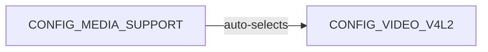
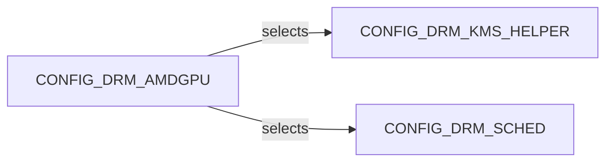

# Appendix M: Kernel Configuration Reference for Graphics

> **Status**: First draft — 2026-06-18

This appendix lists the key Linux kernel `CONFIG_` options relevant to the graphics stack, with notes on which chapters discuss the features they enable. Three new columns have been added in this draft: the kernel version where the option first appeared in mainline, and its default setting in Fedora 40/41 (`x86_64`) and Ubuntu 24.04 LTS Noble (`amd64`). ARM-only drivers (Panfrost, Panthor, Lima, V3D, VC4, MSM, Etnaviv) are not present in `x86_64`/`amd64` defconfigs and are marked `—` accordingly.

**Column key**: `y` = built-in, `m` = loadable module, `n` = disabled/not set, `—` = not applicable for this architecture.

---

## M.1 DRM Core

| Config | Description | Chapter | Min kernel | Fedora 40 | Ubuntu 24.04 |
|---|---|---|---|---|---|
| `CONFIG_DRM` | DRM subsystem core; required for all GPU drivers | Ch1 | ≤ 2.6.29 | `m` | `y` |
| `CONFIG_DRM_KMS_HELPER` | KMS helper library; required for modesetting | Ch2 | ≤ 2.6.29 | `m` | `y` |
| `CONFIG_DRM_GEM_DMA_HELPER` | DMA-based GEM helper (renamed from `DRM_KMS_CMA_HELPER` in 6.x) | Ch2 | 3.14 | `y` | `m` |
| `CONFIG_DRM_PANEL` | Panel driver framework (`drm_panel`) | Ch6 | 3.16 | `y` | `y` |
| `CONFIG_DRM_BRIDGE` | Bridge chain framework (`drm_bridge`) | Ch6 | 3.16 | `y` | `y` |
| `CONFIG_DRM_FBDEV_EMULATION` | Legacy fbdev emulation layer over KMS | Ch2 | ≤ 2.6.29 | `y` | `y` |

**Notes**:
- Ubuntu 24.04 ships kernel 6.8 with `CONFIG_DRM=y` and `CONFIG_DRM_KMS_HELPER=y` (built-in rather than modular) — verified against `/boot/config-6.8.0-124-generic`. Fedora 40 builds DRM as a module (`=m`); values from [Fedora src.fedoraproject.org/rpms/kernel](https://src.fedoraproject.org/rpms/kernel).
- `CONFIG_DRM_KMS_CMA_HELPER` was renamed to `CONFIG_DRM_GEM_DMA_HELPER` during the 6.x cycle (removal of CMA-specific naming). The Min kernel column reflects the original introduction of the CMA helper functionality (3.14); the rename to `DRM_GEM_DMA_HELPER` occurred in 6.x. `—` in table for kernels before the rename. [Source: cateee.net/lkddb](https://cateee.net/lkddb/web-lkddb/DRM.html)
- `CONFIG_DRM_DISPLAY_CONNECTOR` (added 5.10) is not present as a standalone symbol in Ubuntu 24.04 6.8 generic; it is subsumed into `CONFIG_DRM_DISPLAY_HELPER=m`.

---

## M.2 GPU Drivers

| Config | Description | Chapter | Min kernel | Fedora 40 | Ubuntu 24.04 |
|---|---|---|---|---|---|
| `CONFIG_DRM_AMDGPU` | AMD GPU driver (GCN+, RDNA, DCN) | Ch5 | 4.2 | `m` | `m` |
| `CONFIG_DRM_AMDGPU_SI` | Southern Islands (GCN 1.0) support in amdgpu | Ch5 | 4.2 | `y` (dep) | `y` (dep) |
| `CONFIG_DRM_AMDGPU_CIK` | Sea Islands (GCN 2.0) support in amdgpu | Ch5 | 4.2 | `y` (dep) | `y` (dep) |
| `CONFIG_DRM_I915` | Intel i915 driver (Gen 2 through Gen 12) | Ch5 | ≤ 2.6.29 | `m` | `m` |
| `CONFIG_DRM_XE` | Intel Xe driver (Gen 12.5+ / Meteor Lake+) | Ch5 | 6.8 | `m` | `m` |
| `CONFIG_DRM_NOUVEAU` | Nouveau (open-source NVIDIA) driver | Ch5, Ch7–Ch11 | 2.6.33 | `m` | `m` |
| `CONFIG_NOUVEAU_PLATFORM_DRIVER` | Nouveau platform driver for Tegra SoCs | Ch6 | 3.10 | `n` | `n` |
| `CONFIG_DRM_PANFROST` | Panfrost driver (Mali Midgard/Bifrost) | Ch6 | 5.2 | `—` | `—` |
| `CONFIG_DRM_PANTHOR` | Panthor driver (Mali Valhall CSF) | Ch6 | 6.10 | `—` | `—` |
| `CONFIG_DRM_LIMA` | Lima driver (Mali-400/450) | Ch6 | 5.2 | `—` | `—` |
| `CONFIG_DRM_ETNAVIV` | Etnaviv driver (Vivante GC series) | Ch6 | 4.5 | `—` | `—` |
| `CONFIG_DRM_MSM` | MSM driver (Qualcomm Adreno) | Ch6 | 3.12 | `—` | `—` |
| `CONFIG_DRM_V3D` | V3D driver (Broadcom VideoCore VI — Raspberry Pi 4+) | Ch6 | 4.18 | `—` | `—` |
| `CONFIG_DRM_VC4` | VC4 driver (Broadcom VideoCore IV — Raspberry Pi 3) | Ch6 | 4.4 | `—` | `—` |
| `CONFIG_DRM_VIRTIO_GPU` | VirtIO GPU driver (QEMU/crosvm virtual GPU); blob resources added 6.2 | Ch5 | 4.2 | `m` | `m` |

**Notes**:
- `CONFIG_DRM_PANTHOR` reached mainline in 6.10 (the Panthor driver was merged into `drm-misc` in early 2024 for Linux 6.10; earlier Phoronix reports referencing "6.9" reflected the drm-misc-next queue). [Source: Phoronix, CNX Software 2024](https://www.phoronix.com/news/Arm-Mali-Panthor-DRM-Coming)
- `CONFIG_DRM_XE` was first included in mainline Linux 6.8. [Source: cateee.net](https://cateee.net/lkddb/web-lkddb/DRM_XE.html)
- ARM-specific drivers (Panfrost, Panthor, Lima, V3D, VC4, MSM, Etnaviv) appear only in ARM/AArch64 defconfigs; `—` means "not present in x86_64 or amd64 generic configs".

---

## M.3 Memory Management and Buffer Sharing

| Config | Description | Chapter | Min kernel | Fedora 40 | Ubuntu 24.04 |
|---|---|---|---|---|---|
| `CONFIG_DMA_SHARED_BUFFER` | DMA-BUF framework | Ch4 | 3.3 | `y` | `y` |
| `CONFIG_SYNC_FILE` | Sync file / explicit fence framework | Ch3, Ch4 | 4.7 | `y` | `y` |
| `CONFIG_SW_SYNC` | Software sync timeline (for testing) | Ch4 | 3.10 | `n` | `y` |
| `CONFIG_DMABUF_HEAPS` | DMA-BUF heap allocator framework | Ch4 | 5.6 | `y` | `y` |
| `CONFIG_DMABUF_HEAPS_SYSTEM` | System heap for DMA-BUF | Ch4 | 5.6 | `y` | `y` |
| `CONFIG_DRM_GEM_SHMEM_HELPER` | Shared memory GEM helper (used by many simple drivers) | Ch4 | 5.2 | `y` | `y` |
| `CONFIG_DRM_TTM` | Translation Table Manager (used by amdgpu, nouveau) | Ch4 | 2.6.31 | `m` | `m` |

**Notes**:
- `CONFIG_SYNC_FILE` appeared as early as kernel 4.7 (initial sync file support); the renamed "Explicit Synchronization Framework" variant (`drivers/dma-buf/Kconfig`) became stable in 4.8+. [Source: cateee.net](https://cateee.net/lkddb/web-lkddb/SYNC_FILE.html)
- `CONFIG_SW_SYNC` is disabled in Fedora production kernels but is **enabled** (`y`) in Ubuntu 24.04 (kernel 6.8.0-124-generic) — verified from `/boot/config-$(uname -r)`. Ubuntu enables it for Android compatibility layers (e.g., `libsync` test tools). Fedora x86_64 config shows `# CONFIG_SW_SYNC is not set`.

---

## M.4 IOMMU and Virtualisation

| Config | Description | Chapter | Min kernel | Fedora 40 | Ubuntu 24.04 |
|---|---|---|---|---|---|
| `CONFIG_IOMMU_SUPPORT` | IOMMU subsystem core | Ch5, App K | ≤ 2.6.39 | `y` | `y` |
| `CONFIG_AMD_IOMMU` | AMD IOMMU driver | Ch5 | 2.6.27 | `y` | `y` |
| `CONFIG_INTEL_IOMMU` | Intel VT-d IOMMU driver | Ch5 | 3.2 | `y` | `y` |
| `CONFIG_VFIO` | VFIO framework for GPU passthrough | Ch5, App K | 3.6 | `m` | `m` |
| `CONFIG_VFIO_PCI` | VFIO PCI device driver | App K | 3.6 | `m` | `m` |
| `CONFIG_HMM_MIRROR` | Heterogeneous Memory Management mirror (AMD SVM/amdgpu_mn) | Ch5 | 4.14 | `y` | `y` |

**Notes**:
- `CONFIG_AMD_IOMMU` and `CONFIG_INTEL_IOMMU` are built-in (`y`) in both distros because they are required early in boot (before module loading) for correct DMA isolation.
- `CONFIG_HMM_MIRROR` was introduced in 4.14. cateee.net lists it with a 4.14–5.3 range for the original `mm/hmm.c` symbol, but the Kconfig symbol itself survives into 6.x as a dependency selector for amdgpu SVM support — confirmed present as `CONFIG_HMM_MIRROR=y` in Ubuntu 24.04 kernel 6.8.0-124-generic. If your build lacks it, check that `CONFIG_DRM_AMDGPU` is enabled (it selects HMM_MIRROR). [Source: cateee.net](https://cateee.net/lkddb/web-lkddb/HMM_MIRROR.html)


---

## M.5 Video and Camera

| Config | Description | Chapter | Min kernel | Fedora 40 | Ubuntu 24.04 |
|---|---|---|---|---|---|
| `CONFIG_MEDIA_SUPPORT` | V4L2 media framework | Ch26 | 2.6.31 | `m` | `m` |
| `CONFIG_VIDEO_V4L2` | V4L2 core (auto-selected by `MEDIA_SUPPORT`) | Ch26 | 2.6.17 | `m` | (auto) |
| `CONFIG_MEDIA_CONTROLLER` | Media Controller API (required for libcamera) | Ch26 | 2.6.39 | `y` | `y` |
| `CONFIG_V4L2_MEM2MEM_DEV` | Memory-to-memory video device framework (stateless codecs) | Ch26 | 2.6.35 | `y` | `y` |
| `CONFIG_VIDEO_HANTRO` | Hantro VPU driver (stateless H.264/H.265/VP8/VP9) | Ch26 | 5.3 | `—` | `—` |
| `CONFIG_VIDEO_RASPBERRYPI_HEVC` | Raspberry Pi HEVC codec driver | Ch26 | not yet mainline (verify) | `—` | `—` |

**Notes**:
- `CONFIG_VIDEO_V4L2` is not a user-visible standalone Kconfig symbol in kernel 6.x; it is automatically selected when `CONFIG_MEDIA_SUPPORT` is enabled. The `(auto)` entry in the Ubuntu 24.04 column reflects this — it is not directly settable.
- `CONFIG_VIDEO_HANTRO` and `CONFIG_VIDEO_RASPBERRYPI_HEVC` are ARM-specific platform drivers and are absent from x86_64/amd64 generic configs.
- As of early 2025, `CONFIG_VIDEO_RASPBERRYPI_HEVC` is still undergoing mainline upstreaming (third patch series posted); it is available in the Raspberry Pi downstream kernel tree. [Source: Phoronix 2025](https://www.phoronix.com/news/Raspberry-Pi-HEVC-Decode-V3)



---

## M.6 Useful Debug Options

| Config | Description | Notes | Min kernel | Fedora 40 | Ubuntu 24.04 |
|---|---|---|---|---|---|
| `CONFIG_DRM_DEBUG_SELFTEST` | DRM core self-tests | Use with `make kselftest` | 4.9 | `n` | `n` |
| `CONFIG_DRM_DP_AUX_CHARDEV` | DisplayPort AUX channel char device | Useful for display debugging | 3.15 | `y` | `y` |
| `CONFIG_DRM_DEBUG_MM` | GEM/TTM memory manager debug | High overhead; CI use only | 4.4 | `n` | `n` |
| `CONFIG_LOCKDEP` | Lock dependency validator | Catches GPU scheduler deadlocks | ≤ 2.6.18 | `n` | (see note) |
| `CONFIG_KASAN` | Kernel Address Sanitiser | Driver memory safety testing | 3.18 | `n` | `n` |
| `CONFIG_KCSAN` | Kernel Concurrency Sanitiser | Race condition detection in DRM | 5.8 | `n` | `n` |

**Notes**:
- Ubuntu 24.04 column values verified from `/boot/config-6.8.0-124-generic`: `CONFIG_DRM_DEBUG_MM` is `# not set`, `CONFIG_KASAN` is `# not set`, `CONFIG_KCSAN` is `# not set`, `CONFIG_DRM_DP_AUX_CHARDEV=y`. Fedora 40 values from [src.fedoraproject.org/rpms/kernel](https://src.fedoraproject.org/rpms/kernel).
- `CONFIG_LOCKDEP` exists as `CONFIG_LOCKDEP_SUPPORT=y` in Ubuntu 24.04's kernel but the user-selectable `CONFIG_LOCKDEP` debug option is not present as a standalone symbol in the generic kernel — it requires a debug kernel build with `PROVE_LOCKING=y`. Marked `(see note)` for Ubuntu.
- `CONFIG_KASAN`, `CONFIG_KCSAN`, and `CONFIG_DRM_DEBUG_SELFTEST` impose significant runtime overhead and are disabled in production kernels from all distributions. They are enabled only in dedicated debug/CI kernel builds (e.g., `make kasan.config`).
- `CONFIG_DRM_DP_AUX_CHARDEV` is enabled as built-in in Ubuntu 24.04 and exposes `/dev/drm_dp_auxN` for DP monitor debugging.

---

## M.7 Building a Minimal Graphics Kernel

When building a custom kernel for embedded systems, CI containers, or specialised hardware, it is useful to know the minimum set of `CONFIG_` options needed to support a given graphics use case. The sections below cover three representative scenarios.

### M.7.1 Desktop with AMD GPU

For a standard x86 desktop with an AMD Radeon GPU (GCN or RDNA) driving a display over HDMI or DisplayPort:

```
CONFIG_DRM=m
CONFIG_DRM_KMS_HELPER=m
CONFIG_DRM_TTM=m
CONFIG_DRM_SCHED=m
CONFIG_DMA_SHARED_BUFFER=y
CONFIG_SYNC_FILE=y
CONFIG_DMABUF_HEAPS=y
CONFIG_DMABUF_HEAPS_SYSTEM=y
CONFIG_DRM_AMDGPU=m
CONFIG_DRM_AMDGPU_SI=y        # optional: GCN 1.0 (Southern Islands)
CONFIG_DRM_AMDGPU_CIK=y       # optional: GCN 2.0 (Sea Islands)
```

Using `scripts/config` to set these non-interactively from a base `.config`:

```bash
scripts/config --enable  CONFIG_DRM
scripts/config --module  CONFIG_DRM_KMS_HELPER
scripts/config --module  CONFIG_DRM_TTM
scripts/config --enable  CONFIG_DMA_SHARED_BUFFER
scripts/config --enable  CONFIG_SYNC_FILE
scripts/config --module  CONFIG_DRM_AMDGPU
make olddefconfig
```

Or interactively via `make menuconfig`: navigate to **Device Drivers → Graphics support → AMD GPU** and select `<M>`.

### M.7.2 Headless GPU Compute Server

A server running ROCm HPC workloads needs the amdgpu render node (`/dev/dri/renderD128`) but does not need an active display pipeline. The minimum set is:

```
CONFIG_DRM=m
CONFIG_DRM_TTM=m
CONFIG_DRM_SCHED=m
CONFIG_DMA_SHARED_BUFFER=y
CONFIG_SYNC_FILE=y
CONFIG_DRM_AMDGPU=m
```

> **Note**: `CONFIG_DRM_AMDGPU` has a Kconfig `select` dependency on `DRM_KMS_HELPER` and `DRM_SCHED`, so those symbols will be forced on automatically regardless of what you set explicitly — you cannot build amdgpu without `DRM_KMS_HELPER`. The practical approach for a compute-only server is to build the full amdgpu module and suppress Display Core at **runtime** rather than at Kconfig time: add `amdgpu.dc=0` to the kernel command line (in `/etc/default/grub` or a `.conf` drop-in under `/boot/loader/entries/`). With DC disabled, `amdgpu` exposes render nodes (`renderD*`) but no KMS modesetting nodes (`card*`). You can also disable fbdev emulation at config time:
>
> ```
> # CONFIG_DRM_FBDEV_EMULATION is not set
> ```
>
> Verify the result with `ls -l /dev/dri/` after boot — render-only setups show `renderD*` but no `card*` entries.



### M.7.3 Raspberry Pi 4 Display-only Build

The Raspberry Pi 4 uses two separate DRM drivers: `vc4` for the display pipeline (HDMI, DSI, composite) and `v3d` for the 3D accelerator (VideoCore VI). Both are ARM-only and live in AArch64 defconfigs:

```
CONFIG_DRM=m
CONFIG_DRM_KMS_HELPER=m
# Kernel < 6.x:
CONFIG_DRM_KMS_CMA_HELPER=y
# Kernel 6.x+:
CONFIG_DRM_GEM_DMA_HELPER=y
CONFIG_DRM_GEM_SHMEM_HELPER=y
CONFIG_DRM_FBDEV_EMULATION=y
CONFIG_DRM_V3D=m               # 3D / compute (VideoCore VI)
CONFIG_DRM_VC4=m               # Display / HDMI / DSI (VideoCore IV display HW)
CONFIG_DMA_SHARED_BUFFER=y
CONFIG_SYNC_FILE=y
```

Apply via `scripts/config` on a Raspberry Pi kernel tree (the Pi Foundation tree or upstream with BCM2711 support enabled):

```bash
scripts/config --module CONFIG_DRM_VC4
scripts/config --module CONFIG_DRM_V3D
scripts/config --enable CONFIG_DRM_FBDEV_EMULATION
make ARCH=arm64 olddefconfig
make ARCH=arm64 CROSS_COMPILE=aarch64-linux-gnu- -j$(nproc)
```

`CONFIG_DRM_FBDEV_EMULATION` is required if you rely on the framebuffer console (`/dev/fb0`) during early boot before a Wayland compositor starts.

---

## M.8 Verifying Your Kernel Configuration

Once a kernel is built and booted, several methods let you confirm which graphics-related options are active.

### M.8.1 Reading the Running Kernel's Config

If `CONFIG_IKCONFIG_PROC=y` was set at build time (common in distribution kernels), the full config is exposed via the proc filesystem:

```bash
zcat /proc/config.gz | grep CONFIG_DRM
```

If `CONFIG_IKCONFIG_PROC` is not set, use the config file installed into `/boot`:

```bash
cat /boot/config-$(uname -r) | grep CONFIG_DRM
```

On Fedora, this file is always present at `/boot/config-<version>`. On Ubuntu the same applies via the `linux-image-*` package. Example output on Ubuntu 24.04 with amdgpu (kernel 6.8):

```
CONFIG_DRM=y
CONFIG_DRM_KMS_HELPER=y
CONFIG_DRM_AMDGPU=m
CONFIG_DRM_AMDGPU_SI=y
CONFIG_DRM_AMDGPU_CIK=y
CONFIG_DRM_XE=m
```

On Fedora 40, `CONFIG_DRM` and `CONFIG_DRM_KMS_HELPER` are compiled as modules (`=m`), so the output will differ accordingly.

### M.8.2 Checking Module Metadata

`modinfo` reports module metadata including which kernel version it was built for:

```bash
modinfo drm
modinfo amdgpu | grep -E "^(filename|version|license|depends)"
```

A healthy response confirms the module path (`/lib/modules/<uname -r>/kernel/drivers/gpu/drm/…`) and lists its inter-module dependencies (`drm_display_helper`, `ttm`, `drm_sched`, etc.).

### M.8.3 Verifying DRM Subsystem Activation

The DRM subsystem exposes a `debugfs` tree when `CONFIG_DRM_DEBUG` or the subsystem itself is active. Check:

```bash
ls /sys/kernel/debug/dri/
```

A running amdgpu system will show entries such as `0/`, `1/` (one per GPU/display engine). Each subdirectory contains files like `amdgpu_gpu_reset`, `amdgpu_vbios_dump`, `clients`, `name`, and `state`. If `/sys/kernel/debug/dri/` is empty or missing, the DRM subsystem is not loaded.

For a quick sanity check without root access, list the DRM character devices:

```bash
ls -l /dev/dri/
# card0 → modesetting/display node
# renderD128 → render node (compute/3D without display)
```

Both `card*` and `renderD*` appearing confirms full KMS + render-node support. Only `renderD*` (no `card*`) indicates a headless/compute-only build. For display debugging, the DP AUX channel (`CONFIG_DRM_DP_AUX_CHARDEV=y`) exposes:

```bash
ls /dev/drm_dp_aux*
# drm_dp_aux0, drm_dp_aux1, …
```

These character devices allow userspace tools (`edid-decode`, `dp-aux-mon`) to read EDID and DPCD data directly from DisplayPort monitors.

---

## References

- [Linux kernel GPU documentation](https://www.kernel.org/doc/html/latest/gpu/) — authoritative driver-specific config notes
- [Kconfig language reference](https://www.kernel.org/doc/html/latest/kbuild/kconfig-language.html) — syntax and semantics of `Kconfig` files
- [Mesa on Linux — driver prerequisites](https://docs.mesa3d.org/install.html)
- [Fedora kernel source (config files)](https://src.fedoraproject.org/rpms/kernel) — `kernel-x86_64-fedora.config` and related files
- [Ubuntu kernel mainline builds](https://kernel.ubuntu.com/mainline/) — test builds of upstream kernels for Ubuntu
- [Linux Kernel Driver DataBase (lkddb)](https://cateee.net/lkddb/) — `CONFIG_` option history by kernel version
- [kernelconfig.io](https://www.kernelconfig.io/) — interactive Kconfig search with version history

---

*Copyright © 2026 jreuben11. Licensed under [CC BY 4.0](https://creativecommons.org/licenses/by/4.0/).*
