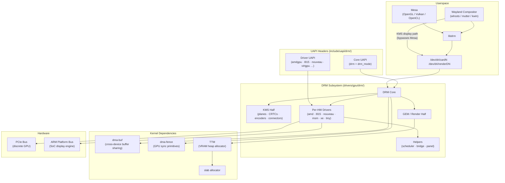
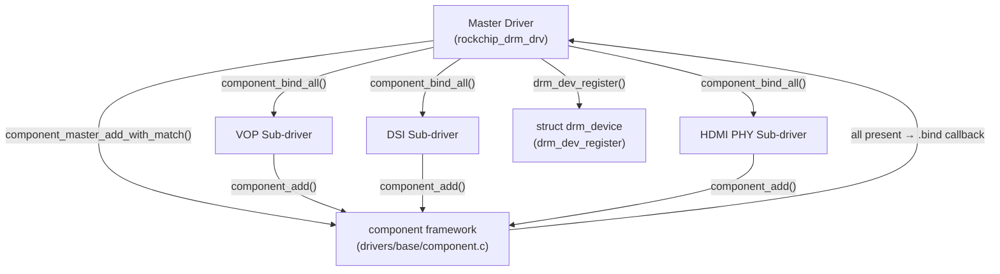
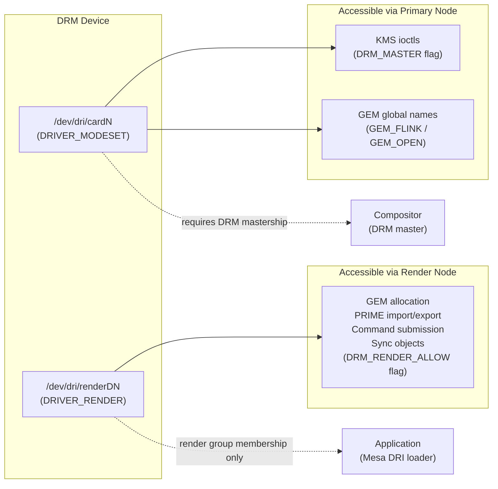
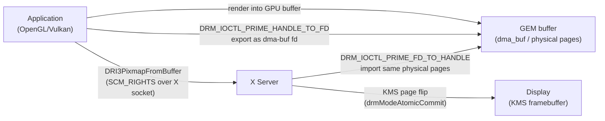
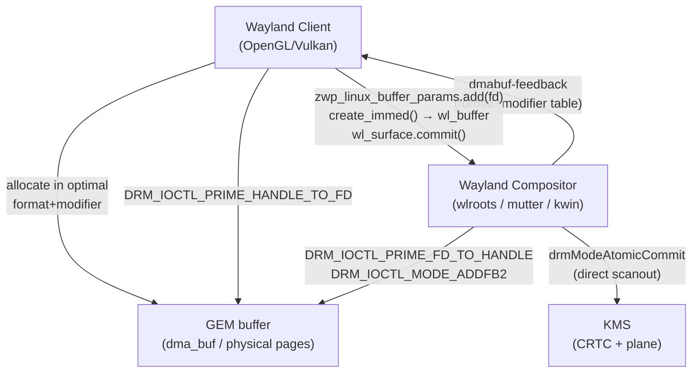
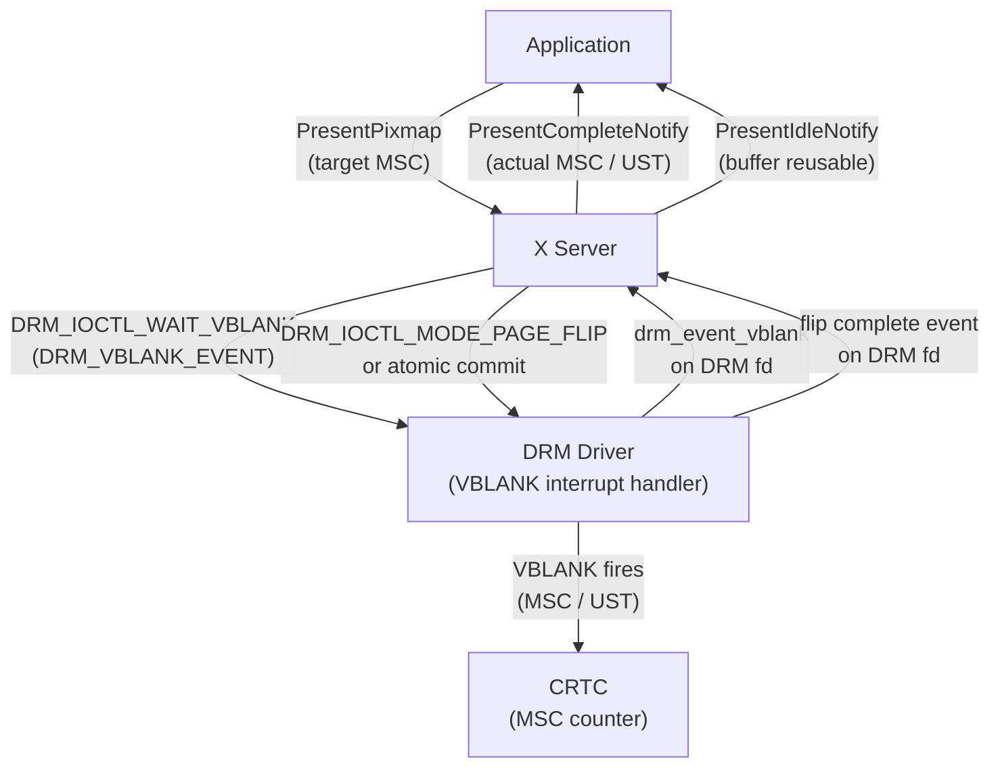
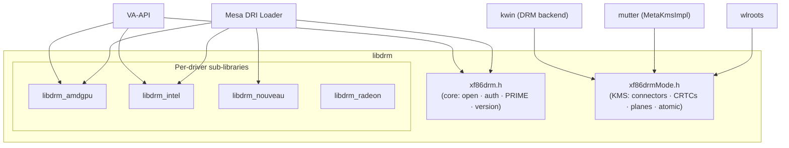

# Chapter 1: DRM Architecture & the Driver Model

> **Part**: Part I — The Kernel Layer
> **Audience**: Systems developer — this chapter is foundational for kernel and driver developers; application developers need the conceptual overview but can skim implementation details
> **Status**: First draft — 2026-06-06

## Table of Contents

- [Overview](#overview)
- [1. Locating DRM in the Kernel and Software Stack](#1-locating-drm-in-the-kernel-and-software-stack)
  - [UAPI: The Kernel–Userspace Contract](#uapi-the-kernelâuserspace-contract)
- [2. The DRM Driver Model: Probe, Bind, and the Component Framework](#2-the-drm-driver-model-probe-bind-and-the-component-framework)
- [3. Device Nodes: Primary vs. Render Nodes](#3-device-nodes-primary-vs-render-nodes)
- [4. Privilege Separation Between Display Ownership and Rendering](#4-privilege-separation-between-display-ownership-and-rendering)
- [5. DRI3: Buffer Passing via File Descriptors](#5-dri3-buffer-passing-via-file-descriptors)
- [6. The Present Extension: Synchronised Frame Delivery](#6-the-present-extension-synchronised-frame-delivery)
- [7. How DRM Drivers Expose Capabilities via Ioctls](#7-how-drm-drivers-expose-capabilities-via-ioctls)
- [8. The drm_info and Debugfs Tools for Exploration](#8-the-drm_info-and-debugfs-tools-for-exploration)
- [9. libdrm: The Userspace DRM API](#9-libdrm-the-userspace-drm-api)
- [10. fbdev Emulation: Legacy Console via DRM](#10-fbdev-emulation-legacy-console-via-drm)
- [Integrations](#integrations)
- [References](#references)

---

## Overview

The **Direct Rendering Manager** (**DRM**) subsystem is the kernel's unified abstraction layer for **GPU** hardware. What began in the late 1990s as a narrow privilege-gating mechanism — a way for multiple X clients to share a graphics card without routing every pixel operation through a single server process — has matured over two decades into the comprehensive kernel framework that underpins everything from the framebuffer on a Raspberry Pi to the multi-die AI accelerators in modern datacentre nodes. Understanding **DRM** architecture is a prerequisite for understanding every other layer of the Linux graphics stack. The chapters that follow this one all presuppose the foundation laid here.

The subsystem lives in **drivers/gpu/drm/** within the kernel source tree, alongside per-hardware driver subdirectories such as **amd/**, **i915/**, **nouveau/**, **msm/**, and **xe/**. **UAPI** headers in **include/uapi/drm/** — including **drm.h**, **amdgpu_drm.h**, and **i915_drm.h** — define the interface visible to userspace. Below **DRM** in the kernel dependency graph sit **dma-buf** (shared buffer objects passed across device and process boundaries), **dma-fence** (synchronisation primitives that signal buffer readiness), and **TTM** (Translation Table Manager, the **VRAM** heap allocator for discrete GPUs). Above **DRM**, userspace reaches the subsystem through **libdrm**, the thin **C** wrapper library that converts raw ioctls into a stable, versioned **API**. **Mesa** sits above **libdrm** and translates **OpenGL**, **Vulkan**, and **OpenCL** workloads into driver-specific **GPU** commands; **Wayland** compositors such as **wlroots**, **mutter**, and **kwin** call **libdrm** directly for **KMS** operations, bypassing **Mesa** entirely for the display path.

A common misconception among beginners is that **DRM** is synonymous with the 3D rendering path. In reality **DRM** has two architecturally distinct halves: the display half, known as **KMS** (**Kernel Mode Setting**), which owns the pipeline from **GPU** output through display encoder to monitor; and the **GPU** execution half, which encompasses the **GEM** buffer manager, command submission queues, and scheduling. Both halves are exposed through the same character device and the same **struct drm_driver** registration, but they serve different consumers and operate on different hardware blocks. This chapter addresses both halves at the architectural level.

Every **DRM** driver is described by a **struct drm_driver** filled with capability flags, file-operation callbacks, and a driver-private ioctl table. Hardware modules reach the **DRM** core through one of two probe paths: discrete **PCIe** GPUs register via **struct pci_driver** and call **devm_drm_dev_alloc()** followed by **drm_dev_register()**; **ARM** **SoC** display subsystems register as platform drivers and, when multiple independent **IP** blocks must be coordinated, use the component framework (**drivers/base/component.c**) to defer **drm_dev_register()** until every sub-driver has bound successfully.

After registration, the kernel creates one or two character device nodes in **/dev/dri/**. The **primary node** (**/dev/dri/cardN**) is created when the driver sets **DRIVER_MODESET** and is the compositor's handle for **KMS** ioctls; it requires **DRM** mastership, managed in practice by **systemd-logind**. The **render node** (**/dev/dri/renderDN**) is created when the driver sets **DRIVER_RENDER** and is unrestricted to **KMS** — any process with **render** group membership can allocate **GPU** memory and submit compute workloads, which is how **Mesa**'s **DRI** loader initialises a **Vulkan** or **OpenGL** context without elevated privilege.

Buffer sharing between **GPU** clients uses two complementary mechanisms. **DRI3** replaced the older **DRI2** shared-memory pixmap path by passing **DMA-BUF** file descriptors over the X socket via the **SCM_RIGHTS** mechanism: a rendered **GEM** object is exported with **DRM_IOCTL_PRIME_HANDLE_TO_FD** and imported by the **X** server with **DRM_IOCTL_PRIME_FD_TO_HANDLE**, with no pixel copy. The **linux-dmabuf** Wayland protocol serves the same role on the Wayland side. The **Present extension** answers the complementary timing question: its **MSC**/**UST** model lets applications schedule frame delivery to precise **CRTC** refresh boundaries via **DRM_IOCTL_WAIT_VBLANK** events and **PresentPixmap** requests, receiving **PresentCompleteNotify** and **PresentIdleNotify** callbacks.

The **DRM** ioctl interface — dispatched through **drm_ioctl()** in **drm_ioctl.c** with access control enforced by **drm_ioctl_permit()** — is the sole channel for userspace communication. Capability negotiation via **DRM_IOCTL_GET_CAP** (returning constants such as **DRM_CAP_ADDFB2_MODIFIERS**, **DRM_CAP_SYNCOBJ**, and **DRM_CAP_SYNCOBJ_TIMELINE**) and client opt-ins via **DRM_IOCTL_SET_CLIENT_CAP** (flags **DRM_CLIENT_CAP_ATOMIC** and **DRM_CLIENT_CAP_UNIVERSAL_PLANES**) allow new features to be added while preserving strict **UAPI** **ABI** stability. Driver-private ioctls are declared with **DRM_IOCTL_DEF_DRV** in a range reserved below **DRM_COMMAND_END**.

Two inspection mechanisms let developers explore a live system: the **drm_info** userspace tool enumerates the complete **KMS** object tree, format modifiers, and connector **EDID** data; and the kernel's **debugfs** tree under **/sys/kernel/debug/dri/** exposes per-driver files such as **i915_gem_objects**, **amdgpu_fence_info**, and **vblank_count**. **libdrm** functions — **drmGetDevices2()**, **drmModeGetResources()**, **drmModeAtomicCommit()**, **drmPrimeHandleToFD()**, and **drmModeAddFB2WithModifiers()** — are the correct userspace entry points for all of these operations; per-driver sub-libraries **libdrm_amdgpu**, **libdrm_intel**, **libdrm_nouveau**, and **libdrm_radeon** wrap driver-private ioctls for **Mesa** and **VA-API** consumers.

Finally, the **fbdev** emulation layer (**CONFIG_DRM_FBDEV_EMULATION**) bridges the legacy **/dev/fbN** interface — required by **Plymouth**, **fbcon**, and older tooling — by synthesising a linear dumb buffer framebuffer from the **DRM** device via **drm_fbdev_generic_setup()**. New driver code should treat this as a compatibility shim rather than permanent infrastructure.

After reading this chapter, a kernel driver developer will be able to trace exactly how a **GPU** kernel module initialises, how it registers with **DRM**, how the kernel creates **/dev/dri/cardN** and **/dev/dri/renderDN**, and how the privilege model keeps display ownership separate from compute access. An application or compositor developer will understand why render nodes exist and require no elevated privilege, why **DRI3** replaced the older shared-memory buffer exchange of **DRI2**, and how the **Present extension** maps application frame delivery to display scanout timing. The subsequent chapters on **KMS** (Chapter 2), **GPU** memory management (Chapter 4), and specific hardware drivers (Chapters 5–6) all build on this foundation.

---

## 1. Locating DRM in the Kernel and Software Stack

The DRM subsystem lives in `drivers/gpu/drm/` within the kernel source tree. Beneath that directory you will find the subsystem core (`drm_drv.c`, `drm_ioctl.c`, `drm_auth.c`, `drm_file.c`, `drm_mm.c`, and about forty other files), per-hardware driver subdirectories (`amd/`, `i915/`, `nouveau/`, `rockchip/`, `msm/`, `xe/`, and dozens more), the tiny driver collection (`tiny/`) for single-chip embedded controllers, and shared helper libraries (`scheduler/`, `ttm/`, `bridge/`, `panel/`). The UAPI headers that define the interface visible to userspace live separately in `include/uapi/drm/`, where `drm.h` contains the core ioctl definitions and per-driver headers such as `amdgpu_drm.h` and `i915_drm.h` extend the interface with hardware-specific commands.

Positioning DRM in the broader software stack: below DRM sits the PCIe bus (for discrete GPUs), the ARM platform bus (for SoC display engines), and the system memory allocator. DRM depends on several other kernel subsystems: `dma-buf` provides a shared buffer object that can be passed between devices and processes; `dma-fence` provides the synchronisation primitives that signal buffer readiness; TTM (Translation Table Manager) provides a GPU memory manager for discrete hardware with VRAM; and the standard kernel allocator, slab, underlies all of them. Above DRM, userspace sees a pair of character device nodes and a sysfs subtree. The libdrm library wraps those character device ioctls into a stable C API. Mesa sits above libdrm and translates OpenGL, Vulkan, and OpenCL workloads into driver-specific GPU commands. Wayland compositors such as wlroots, mutter, and kwin call libdrm directly for KMS operations, bypassing Mesa entirely for the display path.



The evolution of the DRI (Direct Rendering Infrastructure) protocol family shows why the architecture evolved the way it did. DRI1 gave application processes direct access to GPU memory-mapped registers via `/dev/dri/card0`, but required `CAP_SYS_ADMIN` or root membership and offered no isolation between clients. DRI2 introduced authenticated buffer sharing: the X server would vouch for a client by exchanging a magic token, allowing the client to share SHM-backed pixmaps with the compositor. DRI2 worked but introduced unavoidable CPU copies and required the X server to be involved in every buffer handoff — a bottleneck that became increasingly painful as GPU output resolutions and frame rates climbed. DRI3, introduced in 2013, solved both problems at once by passing GPU buffer file descriptors directly over the X socket using the standard Unix `SCM_RIGHTS` mechanism. The X server receives a DMA-BUF file descriptor and imports it as a pixmap without ever reading or copying the pixel data. DRI2 is effectively dead on modern stacks; any kernel older than 3.14 that lacks render nodes can be safely treated as legacy.

The two halves of DRM are worth naming precisely to avoid confusion throughout the book. The **KMS half** manages the display pipeline: it models the hardware as a tree of KMS objects (planes, CRTCs, encoders, connectors, and bridges), and provides ioctls to enumerate and reconfigure those objects. The **GEM/render half** manages GPU memory (via GEM objects) and GPU workload submission. In the kernel source this split is visible in the naming: `drm_mode_*` functions belong to KMS, while `drm_gem_*`, `drm_sched_*`, and the driver-private ioctls for command submission belong to the render path. Chapter 2 covers the KMS pipeline in full depth; Chapter 4 covers GEM and memory management.

### UAPI: The Kernel–Userspace Contract

**UAPI** stands for *User-space API*. In the Linux kernel source tree, the directory `include/uapi/` is a specially demarcated zone of headers whose contents form part of the **kernel's ABI (Application Binary Interface) stability guarantee** — a guarantee inherited from the kernel's broader promise that a binary compiled against a given kernel version will continue to work, unmodified, on every future kernel version.

For DRM, the relevant headers live in `include/uapi/drm/` ([source](https://elixir.bootlin.com/linux/latest/source/include/uapi/drm)):

| Header | Contents |
|---|---|
| `drm.h` | Core DRM ioctl numbers, argument structs, capability constants, event types |
| `drm_mode.h` | KMS object structs: `drm_mode_info`, `drm_mode_create_dumb`, `drm_mode_atomic`, `drm_mode_obj_get_properties`, format modifier types |
| `amdgpu_drm.h` | AMD GPU–private ioctls: GEM create/mmap/wait, command submission (`AMDGPU_CS`), VM management, query (`AMDGPU_INFO`) |
| `i915_drm.h` | Intel i915/Xe–private ioctls: GEM create/execbuffer/busy/mmap, GPU reset, perf, GuC submission |
| `nouveau_drm.h` | Nouveau (NVIDIA open-kernel) private ioctls |
| `virtgpu_drm.h` | Virtio-GPU guest driver ioctls |

**The immutability rule.** Once a UAPI ioctl struct is shipped in a released kernel, its layout is frozen. The C struct must never change size; fields must never be reinterpreted. Adding capabilities requires one of three approaches:

1. **Reserved fields**: the original struct includes padding bytes or a `flags` field; new functionality is gated by a new flag bit and only the newly written fields are interpreted when the flag is set.
2. **New ioctl number**: a new ioctl `DRM_IOCTL_FOO_V2` is introduced alongside the original; old userspace continues to use the old number.
3. **Capability negotiation**: `DRM_IOCTL_GET_CAP` / `DRM_IOCTL_SET_CLIENT_CAP` allow new behaviour to be opted into without changing existing ioctls.

This constraint has a practical consequence visible throughout `i915_drm.h`: some structs carry fields that encode assumptions about the Gen6/Gen7 memory management model that have been architecturally superseded, but cannot be removed. The technical debt is real and acknowledged; it is the price of a stable ABI.

```c
/* Excerpt from include/uapi/drm/drm.h showing the pattern:
   reserved padding in a UAPI struct guarantees future extensibility.
   Source: https://elixir.bootlin.com/linux/latest/source/include/uapi/drm/drm.h */

struct drm_gem_open {
    __u32 name;       /* the flink global name to import */
    __u32 handle;     /* OUT: GEM handle in this file's namespace */
    __u64 size;       /* OUT: object size in bytes */
};

/* DRM sync object — note the pad field reserving space */
struct drm_syncobj_create {
    __u32 handle;     /* OUT: handle for the new sync object */
    __u32 flags;      /* IN: DRM_SYNCOBJ_CREATE_SIGNALED or 0 */
};
```

**Why `include/uapi/` is a separate directory.** Before Linux 3.5, kernel headers and userspace headers were entangled — userspace programs that included kernel headers would inadvertently pull in kernel-internal definitions, types, and macros. The `include/uapi/` split (merged in 3.5 via David Howells' header sanitisation work) cleanly separates headers intended for userspace from those used only within the kernel. Build tools (`make headers_install`) export only `uapi/` headers to the installed sysroot (`/usr/include/linux/`, `/usr/include/drm/`), preventing userspace from accidentally depending on kernel-internal definitions.

**The libdrm abstraction.** Userspace is strongly discouraged from including UAPI headers directly and calling `ioctl(2)` with raw structs. The **libdrm** library ([source](https://gitlab.freedesktop.org/mesa/drm)) wraps every UAPI ioctl in a typed C function (`drmModeGetResources()`, `drmPrimeHandleToFD()`, `drmModeAtomicCommit()`, etc.) and handles struct-size differences between kernel versions. Section 9 of this chapter covers libdrm in detail. The key point is that the UAPI headers are the *contract*; libdrm is the *recommended implementation* of that contract for userspace C programs.

**UAPI review process.** Any kernel patch that adds or modifies a DRM UAPI header must receive explicit sign-off from the DRM maintainers and typically from the broader kernel community. The patch must include documentation of the new ioctl's semantics, preconditions, and error codes in `Documentation/gpu/`. A common review comment on first-time submissions is "add a reserved/pad field for future extension" — this is enforced as a matter of policy, not preference, because forgetting to reserve space means the next capability will require a new ioctl number. Chapter 32 covers the contribution and review process in detail.

---

## 2. The DRM Driver Model: Probe, Bind, and the Component Framework

Every DRM driver begins with a `struct drm_driver`. This structure is the central descriptor that a kernel module fills in statically and hands to the DRM subsystem. It declares what capabilities the driver offers, which file operations to use for the device node, which additional ioctls to register beyond the core set, and a collection of callback pointers for GEM object lifecycle, PRIME buffer import/export, dumb buffer creation, and framebuffer device probing.

The driver feature flags are declared in `enum drm_driver_feature` in `include/drm/drm_drv.h`. The most important flags are:

- `DRIVER_GEM` — the driver implements the GEM memory manager; required for all modern hardware drivers.
- `DRIVER_MODESET` — the driver implements KMS; its presence causes a primary device node (`/dev/dri/cardN`) to be created.
- `DRIVER_RENDER` — the driver supports a render node (`/dev/dri/renderDN`); all modern drivers that accept GPU workloads should set this.
- `DRIVER_ATOMIC` — the driver has opted into the atomic modesetting API (see Chapter 2); userspace must separately opt in via `DRM_CLIENT_CAP_ATOMIC`.
- `DRIVER_SYNCOBJ` — the driver supports sync objects for explicit GPU synchronisation (see Chapter 3).
- `DRIVER_SYNCOBJ_TIMELINE` — the driver supports timeline sync objects with monotonically increasing sequence points.
- `DRIVER_COMPUTE_ACCEL` — the driver is a compute accelerator rather than a display GPU; introduced for non-display AI/ML hardware.

A minimal pedagogical `struct drm_driver` initialisation, modelled on how modern tiny drivers like `simpledrm` are structured, looks like the following:

```c
/* Source: drivers/gpu/drm/tiny/simpledrm.c — simpledrm_driver */
static const struct drm_driver simpledrm_driver = {
    .driver_features    = DRIVER_ATOMIC | DRIVER_GEM | DRIVER_MODESET,
    .fops               = &simpledrm_fops,
    .name               = "simpledrm",
    .desc               = "Simple framebuffer driver",
    .major              = 1,
    .minor              = 0,
};
```

A production driver such as `amdgpu` fills in far more fields — the `amdgpu_kms_driver` struct in `drivers/gpu/drm/amd/amdgpu/amdgpu_drv.c` sets `driver_features` to include `DRIVER_ATOMIC | DRIVER_GEM | DRIVER_RENDER | DRIVER_MODESET | DRIVER_SYNCOBJ | DRIVER_SYNCOBJ_TIMELINE`, supplies a large `ioctls` array covering the full amdgpu command submission and memory query interface, and provides callbacks for `gem_create_object`, `prime_handle_to_fd`, and `prime_fd_to_handle`. The fops structure for amdgpu wraps `drm_open`, `drm_poll`, `drm_read`, and `drm_gem_mmap` with driver-specific entry points for ioctl dispatch and flush.

**The PCI driver path.** For discrete PCIe GPUs, the driver registers a `struct pci_driver` via `module_pci_driver()`. The PCI core calls the `probe` function when it matches a device ID. The probe function allocates the DRM device and registers it. The modern allocation API is `devm_drm_dev_alloc()`, which supports embedding `struct drm_device` inside a larger driver-private structure and automatically arranges cleanup through the devres mechanism:

```c
/* Source: drivers/gpu/drm/drm_drv.c — devm_drm_dev_alloc pattern */
struct my_device {
    struct drm_device drm;   /* must be first, or offset specified */
    /* driver-private fields follow */
    void __iomem *mmio;
    struct drm_plane primary_plane;
};

static int my_gpu_probe(struct pci_dev *pdev,
                        const struct pci_device_id *ent)
{
    struct my_device *priv;
    int ret;

    priv = devm_drm_dev_alloc(&pdev->dev, &my_driver,
                               struct my_device, drm);
    if (IS_ERR(priv))
        return PTR_ERR(priv);

    /* hardware-specific initialisation */
    ret = my_gpu_hw_init(priv);
    if (ret)
        return ret;

    return drm_dev_register(&priv->drm, 0);
}
```

`drm_dev_register()` is the pivotal call: it creates the character device nodes, fires connector initialisation, and registers the device with sysfs. After it returns, userspace can open `/dev/dri/cardN`. The driver must not call `drm_dev_register()` before its hardware initialisation is complete, because userspace clients may arrive at any point after registration.

**The platform driver path.** ARM SoC display drivers such as `sun4i_drv` (Allwinner) and `msm_drm` (Qualcomm) register as platform drivers via `module_platform_driver()`. The device tree provides the hardware description; the platform core matches a node's `compatible` string against the driver's `of_match_table` and calls `probe`. The rest of the sequence — `devm_drm_dev_alloc`, hardware init, `drm_dev_register` — is identical to the PCI path.

**The component framework.** Many SoC display subsystems are not a single hardware block but a collection of independent IP blocks: a Video Output Processor (VOP) feeding a DSI controller that drives a panel via a PHY, for example, with a separate HDMI encoder on another output. Each IP block may have its own kernel driver, its own device tree node, and its own `probe` function. The component framework (`drivers/base/component.c`) provides the glue.

The pattern works as follows. A "master" driver — in Rockchip's case `rockchip_drm_drv.c` — calls `component_master_add_with_match()` in its own probe function, supplying a match list of the IP block devices it requires. Each sub-driver — VOP, DSI, HDMI PHY — calls `component_add()` in its own probe. When the component framework sees all required components present, it calls the master's `.bind` operation:

```c
/* Source: drivers/gpu/drm/rockchip/rockchip_drm_drv.c */
static const struct component_master_ops rockchip_drm_ops = {
    .bind   = rockchip_drm_bind,
    .unbind = rockchip_drm_unbind,
};

static int rockchip_drm_probe(struct platform_device *pdev)
{
    struct component_match *match = NULL;

    /* build the match list from device tree sub-nodes */
    match = rockchip_drm_match_add(&pdev->dev);
    if (IS_ERR(match))
        return PTR_ERR(match);

    return component_master_add_with_match(&pdev->dev,
                                           &rockchip_drm_ops, match);
}
```

Inside `rockchip_drm_bind`, the driver allocates the DRM device, initialises mode configuration, then calls `component_bind_all()` which triggers each sub-driver's `struct component_ops.bind`. Each sub-driver's bind function registers its planes, CRTCs, encoders, or connectors with the DRM device. Only after all components have bound successfully does the master call `drm_dev_register()`. This ordering guarantee is the whole point of the component framework: a DRM device with only some of its display pipes initialised would be unusable, and the framework prevents partial registration from reaching userspace.



**Hot-unplug and the unplug fence.** For PCIe devices that support hot-removal, `drm_dev_unplug()` marks the device as inaccessible to new userspace operations while ongoing ioctl calls finish safely. Driver code wraps hardware access in `drm_dev_enter()` / `drm_dev_exit()` pairs; `drm_dev_unplug()` waits for all entered regions to exit before returning, ensuring no access to unmapped hardware occurs after physical removal.

---

## 3. Device Nodes: Primary vs. Render Nodes

Every registered DRM device appears in `/dev/dri/` as one or two character device nodes. Understanding which node to open for which purpose is fundamental to writing correct DRM client code.

The **primary node** (`/dev/dri/cardN`) is created whenever the driver sets `DRIVER_MODESET`. It provides access to KMS (connector enumeration, CRTC programming, page flipping) and to legacy GEM operations (global name sharing via `GEM_FLINK`/`GEM_OPEN`). Opening the primary node for modesetting typically requires the calling process to hold DRM mastership (discussed in Section 4). Without mastership, KMS ioctls return `-EACCES`. In practice, compositors open the primary node and hold mastership for the duration of the display session. Applications do not open the primary node at all in modern stacks.

The **render node** (`/dev/dri/renderDN`) is created whenever the driver sets `DRIVER_RENDER`. It is restricted to the render and compute subset of DRM ioctls: GEM buffer allocation, PRIME import/export, command submission, and sync object management. Modesetting ioctls are not available on render nodes; attempting them returns `-EACCES`. The critical property of render nodes is that they require no DRM mastership and no privilege beyond group membership. Any process that can open the file can allocate GPU memory and submit workloads. This is the entry point that Mesa's DRI loader opens when initialising a Vulkan or OpenGL context.

The numbering of primary and render nodes is independent. A single GPU might appear as `card0` and `renderD128`. The relationship between them is discoverable through sysfs: `/sys/class/drm/card0/device/drm/` contains a subdirectory named `renderD128` that symlinks back to the render node. The libdrm function `drmGetDevices2()` performs this discovery, returning an array of `drmDevicePtr` structures that enumerate all nodes associated with each physical device.

For multi-GPU systems, the symlink forest `/dev/dri/by-path/` provides stable names that survive device renumbering across reboots. udev generates these symlinks from PCIe bus addresses, making them suitable for configuration files where `card0` versus `card1` would be ambiguous.

### Key Primary Node Operations: Connector Enumeration, CRTC Programming, and Page Flipping

Three operations define the display side of the primary node. They are listed together because they form a sequential workflow: enumerate to discover hardware, program to set a mode, then flip to show frames.

**Connector enumeration** is how a compositor discovers what physical outputs the GPU has and what monitors are attached. A *connector* is the kernel object for one port — HDMI-1, DisplayPort-2, eDP-1. The compositor calls `drmModeGetResources()` to obtain a list of connector IDs, then `drmModeGetConnector()` for each to read its `connection` state (`DRM_MODE_CONNECTED` / `DRM_MODE_DISCONNECTED`), its `modes[]` array of `drm_mode_info` structs derived from the monitor's **EDID** data, and its `connector_type`. Enumeration is also triggered on demand when the kernel fires a `drm` udev hotplug event (a monitor is plugged or unplugged). The `drm_info` tool in §8 runs this enumeration and prints a human-readable dump — its source is the canonical reference for correct enumeration code. Section 9 shows a full `drmModeGetResources` + `drmModeGetConnector` code example.

**CRTC programming** means configuring a display controller to drive a specific resolution and refresh rate on a specific output. The hardware chain is:

```
Framebuffer → Plane → CRTC → Encoder → Connector → Monitor
```

A *CRTC* (historically "Cathode Ray Tube Controller") owns the scanout pipeline: it reads pixels from a framebuffer, generates the h-sync/v-sync timing, and feeds the pixel stream to an encoder. "Programming" it means specifying: use *this* framebuffer, apply *this* display mode (e.g. 1920×1080@60 Hz), route output through *this* connector. In the modern **atomic** API this is done by building a property request — `ACTIVE` and `MODE_ID` on the CRTC, `CRTC_ID` on the connector, `FB_ID` and `CRTC_ID` on the plane — and submitting with `drmModeAtomicCommit()`. The `DRM_MODE_ATOMIC_TEST_ONLY` flag validates the entire proposed state before applying any of it, so partial or conflicting configurations are rejected atomically. The legacy `drmModeSetCrtc()` still exists but is deprecated. Section 7 has a full atomic commit example; Chapter 2 covers the KMS object model in depth.

**Page flipping** is the mechanism for displaying a newly rendered frame without tearing. The display hardware continuously scans out from one framebuffer. To switch to a new frame you don't copy pixels — you change the framebuffer *pointer* in the CRTC atomically at the vertical blank interval (the brief period when the display beam retraces to the top of the screen). The sequence:

1. Render the next frame into a back buffer (a GEM object registered as a framebuffer with `drmModeAddFB2WithModifiers()`).
2. Submit the flip via `drmModeAtomicCommit()` with `DRM_MODE_PAGE_FLIP_EVENT` set, or via the legacy `DRM_IOCTL_MODE_PAGE_FLIP`.
3. The kernel queues the flip; at the next VBLANK the display controller switches scanout to the new framebuffer.
4. The kernel pushes a `drm_event_vblank` onto the DRM fd's event queue; the compositor reads it with `poll()` + `read()` (the `drmHandleEvent()` loop shown in §7).
5. The flip completion event confirms the old framebuffer is no longer being scanned — it is safe to render into it again.

**Double buffering** (two framebuffers alternating) prevents tearing; **triple buffering** decouples render latency from display latency. The VBLANK event's `sequence` field is the **MSC** (Media Stream Counter), the monotonically incrementing display clock that the Present extension and `wp_presentation` protocol both synchronise to.

### Key Render Node Operations: PRIME Import/Export and Sync Object Management

The render node's four primary operations — GEM allocation, PRIME import/export, command submission, and sync object management — are the foundation of all GPU compute and compositing work on Linux.

**PRIME import/export** is the zero-copy buffer sharing mechanism. A GEM object (a GPU memory allocation) is exported from one DRM file context as a **DMA-BUF** file descriptor with `DRM_IOCTL_PRIME_HANDLE_TO_FD` (`drmPrimeHandleToFD()`). That fd can then be sent to any other process over a Unix socket (via `SCM_RIGHTS`) or inherited. The receiving process imports it with `DRM_IOCTL_PRIME_FD_TO_HANDLE` (`drmPrimeFDToHandle()`), obtaining a GEM handle in its own namespace that references the same physical GPU pages. No pixel data is copied at any point. This is how:
- A Vulkan renderer shares a completed frame with a Wayland compositor without a readback.
- A video decoder (VA-API) shares a decoded frame with a display compositor.
- Two GPUs in a heterogeneous system exchange buffers (the DMA-BUF fd crosses driver boundaries).

Section 5 covers PRIME in full with kernel ioctl structs and a complete sendmsg/recvmsg example. The security model is important: because DMA-BUF fds are opaque kernel references, a receiving process cannot forge or guess handles to access unrelated GPU memory.

**Sync object management** provides explicit GPU synchronisation — the ability to express "operation B must not start until operation A has completed on the GPU" without inserting a CPU-side stall. DRM sync objects (`drm_syncobj`) are kernel objects that hold either a binary semaphore state (signalled / unsignalled) or a timeline point (a monotonically increasing `uint64_t` counter). They are the kernel primitive underlying **Vulkan semaphores** and **Vulkan timeline semaphores** on Linux.

```c
/* Sync object lifecycle — binary and timeline variants.
   Source: include/uapi/drm/drm.h — DRM_IOCTL_SYNCOBJ_* */
#include <xf86drm.h>

/* --- Binary sync object --- */

/* Create: returns a handle in syncobj_create.handle */
uint32_t binary_handle;
drmSyncobjCreate(fd, 0 /* flags */, &binary_handle);

/* After submitting GPU work that signals this syncobj,
   wait for it to reach the signalled state: */
drmSyncobjWait(fd, &binary_handle, 1 /* count */,
               INT64_MAX /* timeout_nsec */,
               DRM_SYNCOBJ_WAIT_FLAGS_WAIT_ALL, NULL);

/* Export to a sync_file fd for cross-process / cross-driver use */
int sync_fd;
drmSyncobjExportSyncFile(fd, binary_handle, &sync_fd);

/* --- Timeline sync object (requires DRM_CAP_SYNCOBJ_TIMELINE) --- */

uint32_t timeline_handle;
drmSyncobjCreate(fd, 0, &timeline_handle);

/* Signal point 5 explicitly (GPU submission normally does this) */
uint64_t point = 5;
drmSyncobjTimelineSignal(fd, &timeline_handle, &point, 1);

/* Wait for point 5 to be reached */
drmSyncobjTimelineWait(fd, &timeline_handle, &point, 1,
                       INT64_MAX,
                       DRM_SYNCOBJ_WAIT_FLAGS_WAIT_ALL, NULL);

drmSyncobjDestroy(fd, binary_handle);
drmSyncobjDestroy(fd, timeline_handle);
```

**Binary sync objects** represent a single signalled/unsignalled state, equivalent to a Vulkan binary semaphore. **Timeline sync objects** hold a monotonically increasing counter: you can wait for point 42 while the GPU is executing point 39, and the wait resolves automatically when point 42 is reached. This maps directly to Vulkan's `VkSemaphoreTypeTimeline`.

Sync objects cross process and driver boundaries via **sync files** (`drmSyncobjExportSyncFile` / `drmSyncobjImportSyncFile`). A sync file fd can be passed over a Unix socket; the recipient imports it and waits for it or uses it as a fence for a subsequent GPU submission. This is the mechanism behind `EGL_ANDROID_native_fence_sync` and the Wayland `linux-drm-syncobj-v1` explicit sync protocol. Chapter 3 covers the full sync object and sync file API, including how timeline points map to Vulkan timeline semaphore operations and how `VM_BIND` command submission integrates sync objects for out-of-order GPU scheduling.

### GEM Backing Storage, GPU Memory Domains, and Kernel-Bypass Paths

**GEM is not always system memory.** This is one of the most common misconceptions about the DRM memory model. *GEM* (Graphics Execution Manager) is a *naming and lifetime* layer — it provides the `struct drm_gem_object` base type, the integer handle namespace scoped to a `drm_file`, and the `drm_gem_object_funcs` vtable — but it says nothing about *where* the memory actually lives. The backing storage is entirely driver-determined. There are four distinct cases:

| Backing type | Kernel helper | Where memory lives | Typical users |
|---|---|---|---|
| Anonymous shmem | `drm_gem_shmem_object` | CPU system RAM (demand-paged, swappable) | Panfrost, Lima, V3D, software renderers |
| Physically contiguous | `drm_gem_cma_object` | CPU system RAM, contiguous (via `dma_alloc_coherent`) | Display controllers, embedded video IP |
| IOMMU-mapped | `drm_gem_dma_object` | CPU system RAM, non-contiguous (IOVA via IOMMU) | ARM SoC GPU/display drivers |
| VRAM / GTT (TTM-backed) | `ttm_buffer_object` embedded in driver BO | GPU VRAM or GART-mapped system RAM | amdgpu, nouveau, i915/Xe |

So on an integrated GPU (Intel UHD, AMD Vega APU, ARM Mali) a GEM object typically is system memory. On a discrete GPU with its own VRAM (NVIDIA, AMD RDNA/CDNA, Intel Arc) a GEM object is more commonly VRAM, with system RAM used only as a fallback.

**TTM and the memory domain hierarchy.** For discrete GPUs, the **Translation Table Manager** (TTM) manages buffer objects across multiple named *placement tiers*:

- `TTM_PL_SYSTEM` — CPU system RAM, not yet mapped to the GPU.
- `TTM_PL_TT` / GTT — system RAM mapped into the GPU's address space via the GART or IOMMU; CPU-accessible, GPU-accessible, slower than VRAM.
- `TTM_PL_VRAM` — GPU-private video RAM; fastest for GPU shaders, typically inaccessible to the CPU without a BAR mapping or a readback copy.

When VRAM fills up, TTM *evicts* buffer objects to GTT or system RAM by copying them across the PCIe bus (or using a hardware DMA engine like AMD SDMA). Display framebuffers and command ring buffers are *pinned* (`ttm_bo_pin`) to prevent eviction. Chapter 4 §2 covers TTM placement, eviction, and pinning in detail.

**GART and IOMMU — what they are.** The **GART** (Graphics Address Remapping Table) is the GPU's own address-translation unit for system-RAM access: it maps *GPU virtual addresses* to non-contiguous *physical CPU RAM pages*, letting the GPU treat scattered system-RAM pages as a single flat range. On modern discrete GPUs the GART is folded into the GPU's general MMU. The **IOMMU** (Input–Output Memory Management Unit) is the CPU-chipset equivalent: it intercepts DMA requests from any PCIe device and translates *device-virtual addresses* (IOVAs) to physical RAM addresses, enforcing that a device can only reach pages the kernel has explicitly mapped for it. In DRM, the `TTM_PL_TT`/GTT placement tier is system RAM that has been programmed into *both* the GPU's GART (so the GPU can read it) and the CPU IOMMU (so the DMA mapping is valid). The `drm_gem_dma_object` helper uses the CPU IOMMU to give a SoC display engine a contiguous IOVA view of physically scattered pages, avoiding the need for CMA on IOMMU-equipped platforms.

**CPU access to VRAM — BAR windows.** PCIe devices expose regions of their internal memory to the CPU via **Base Address Registers** (BARs) — hardware-defined address windows that appear in the CPU's physical memory map and are readable/writable by the CPU over the PCIe bus. The GPU's VRAM is exposed through `BAR0`. Historically BAR size was capped at 256 MB, so only a small aperture of a large VRAM was CPU-visible at once; accessing the rest required a GPU DMA readback through system RAM. **Resizable BAR** (ReBAR / AMD SAM — Smart Access Memory) lifts this cap: the BIOS/firmware expands the BAR to cover the full VRAM at boot, so the entire VRAM appears in the CPU's physical address space. With ReBAR active, a driver can allocate a `TTM_PL_VRAM` buffer and `mmap` it to userspace with write-combining at PCIe bandwidth (16–32 GB/s on PCIe 4.0 ×16), eliminating the GTT staging tier for CPU-written data.

**`userptr` and HMM pinning — GPU access to userspace memory.** Some GPU drivers (notably amdgpu and i915) support "userptr" buffer objects: the application provides a range of its own virtual address space, and the driver maps those CPU pages into the GPU's IOMMU/GART so the GPU can read them directly — avoiding a copy for use cases like texture streaming from CPU-side decompression. The kernel infrastructure is **HMM** (Heterogeneous Memory Management, `mm/hmm.c`, merged Linux 5.8). *HMM pinning* means `hmm_range_fault()` faults in any missing CPU pages (handling swap-in, copy-on-write, huge-page splitting), returns the physical page list, and installs GPU PTE mappings — all while the HMM range lock is held. **MMU notifiers** (`mmu_notifier_invalidate_range_start`) fire whenever the CPU kernel wants to remap or reclaim one of those pages (e.g., on `munmap` or NUMA migration): the GPU driver tears down its GPU PTE for that range before the CPU VMM proceeds, preventing stale GPU accesses. The long-term goal is **SVM** (Shared Virtual Memory): CPU and GPU share one virtual address space, GPU page faults trigger `hmm_range_fault` on demand, and the application uses the same pointer on both CPU and GPU without explicit migration. Chapter 4 §9 covers HMM and SVM in depth.

**Kernel-bypass: PCIe peer-to-peer DMA (p2pdma).** The `drivers/pci/p2pdma.c` subsystem (Linux 4.20+) enables DMA directly between two PCIe devices — GPU VRAM to NVMe SSD, or GPU VRAM to InfiniBand HCA — without the data ever touching system RAM or the CPU. The kernel API:

```c
/* Check if two PCIe devices can do peer DMA without CPU involvement.
   Source: include/linux/pci-p2pdma.h */
int dist = pci_p2pdma_distance(provider_pdev, client_pdev,
                               false /* verbose */);
/* dist == 0: direct peer path through PCIe switch (no CPU hop)
   dist  > 0: peer path exists but routes via root complex
   dist  < 0 (-ENODEV): no p2p path available */
```

p2pdma is the foundation for **GPU-Direct Storage** (NVMe → GPU VRAM DMA, bypassing the CPU memory copy that normally occurs in `read()`/`write()` I/O paths) and **GPU-Direct RDMA** (InfiniBand → GPU VRAM DMA, used for distributed deep learning collectives over RDMA fabric). Practical deployment requires a PCIe switch that implements peer transactions; commodity desktop motherboards typically do not. AMD EPYC and Intel Xeon server platforms are the common deployment targets. Chapter 4 §9 covers p2pdma, NVLink, and AMD xGMI (Infinity Fabric) peer topologies in full detail.

**Kernel-bypass: RDMA and GPUDirect.** An **HCA** (Host Channel Adapter) is an InfiniBand network interface card — the endpoint adapter connecting a server to an InfiniBand fabric (e.g., NVIDIA/Mellanox ConnectX-6/7). HCAs support **RDMA** (Remote Direct Memory Access): incoming network data is written directly into a pre-registered memory buffer by the HCA's DMA engine, with no CPU involvement in the data path. **GPU-Direct RDMA** extends this so the HCA DMAs directly into *GPU VRAM* rather than system RAM — the critical path for distributed deep learning (AllReduce over InfiniBand without staging tensors through host memory). The mechanism: NVIDIA's `nv_p2p_get_pages` / `nv_p2p_put_pages` API registers GPU BAR physical addresses with the RDMA subsystem; the HCA programs its own IOMMU to allow DMA to those addresses. The open-source `nvidia-open` driver exposes the same surface. On AMD, ROCm's `amdkfd` uses HMM pinning to register GPU VRAM pages with the RDMA layer via `hsa_amd_ipc_memory_*`. Both paths register physical GPU memory ranges with `dma_map_sg` so any third-party PCIe device can DMA into them.

**Shared memory between CPU and GPU — shmem GEM and `mmap`.** For integrated GPUs and for TTM buffers in GTT placement, the same physical pages are simultaneously visible to the CPU (via normal virtual memory mappings) and to the GPU (via the GPU's GART/IOMMU mapping). The GEM `mmap` path (`drm_gem_mmap` → driver's `gem_mmap_offset` callback) installs a VM area in the calling process's address space backed by the GEM object's pages. For shmem-backed GEM objects this is a straightforward `remap_pfn_range`; for VRAM-backed objects with ReBAR it maps the BAR aperture; for objects in GTT it maps the GART-accessible system pages. This CPU–GPU shared mapping is what allows zero-copy vertex/uniform buffer uploads from CPU to GPU on integrated hardware.

All of these mechanisms — TTM placement, HMM userptr, p2pdma, GPUDirect RDMA, and mmap — are invisible at the GEM API surface. From userspace's perspective, a GEM handle is just an opaque integer. The physical memory location, the migration policy, and the kernel-bypass capability are all kernel-internal decisions made by the driver and TTM based on allocation flags and hardware topology. Chapter 4 is the definitive reference for how each path works end-to-end.



When a process calls `open(2)` on a DRM device node, the kernel allocates a `struct drm_file` and attaches it to the file descriptor. This structure is the per-connection context: it holds the GEM handle table (a private namespace of integer handles mapping to kernel GEM objects), the authenticated flag, the is-master flag, and the event queue for VBLANK and page-flip notifications. A critical subtlety: GEM handles are per-`drm_file`, not per-process. If a single process opens the render node twice, it has two independent handle namespaces; handles from the first fd are invalid on the second. When Mesa creates multiple DRI contexts within a single process, all contexts sharing the same underlying fd also share the same handle namespace. This handle isolation is intentional: it is the kernel's mechanism for preventing one client from accidentally (or maliciously) referencing another client's GPU buffers by guessing handle numbers.

The legacy DRI2 authentication model required an unrelated exchange: an application would call `DRM_IOCTL_GET_MAGIC` to obtain a token, pass that token to the X server out-of-band, and the X server would call `DRM_IOCTL_AUTH_MAGIC` to validate it, after which the application's `drm_file` had its `authenticated` flag set. Ioctls tagged with `DRM_AUTH` in the ioctl descriptor table required this flag. Render nodes bypass this entirely: all clients of a render node are implicitly trusted for rendering operations, and the `DRM_AUTH` check is passed by `drm_is_render_client()` returning true in `drm_ioctl_permit()`. The magic token infrastructure in `drm_auth.c` still exists for DRI2 compatibility but is dead code on any stack that uses render nodes.

---

## 4. Privilege Separation Between Display Ownership and Rendering

The privilege architecture of DRM reflects a careful decomposition of the security problem. The display pipeline is a shared resource whose output is visible to every user looking at the physical screen; access to it must be controlled. GPU execution resources (shader cores, VRAM, command processors) can safely be divided among tenants if each tenant operates within its own address space and command queue. DRM handles these two problems with different mechanisms.

**The DRM master model.** `struct drm_master` is a reference-counted kernel object created when a process first successfully becomes master of a DRM device. At any moment, at most one `drm_master` is the *current* master of a device, enforced by a spinlock in `drm_master_get()`. A process asserts mastership by calling `DRM_IOCTL_SET_MASTER` on an open primary node fd; the kernel checks whether a master already exists and rejects the call if one does. The current master may call KMS ioctls freely; any other process that tries to call a `DRM_MASTER`-flagged ioctl receives `-EACCES`. When the master fd is closed — whether by explicit `close(2)` or process exit — the kernel automatically drops mastership, preventing display lockout if a compositor crashes.

The kernel's `drm_is_current_master()` implements the check:

```c
/* Source: drivers/gpu/drm/drm_auth.c — drm_is_current_master */
bool drm_is_current_master(struct drm_file *fpriv)
{
    bool ret;
    spin_lock(&fpriv->master_lookup_lock);
    ret = fpriv->is_master &&
          drm_lease_owner(fpriv->master) == fpriv->minor->dev->master;
    spin_unlock(&fpriv->master_lookup_lock);
    return ret;
}
```

**DRM master and logind.** In practice, no application calls `DRM_IOCTL_SET_MASTER` directly on modern desktop systems. The reference implementation for seat management is `systemd-logind`. When a VT switch occurs, logind calls `DRM_IOCTL_DROP_MASTER` on behalf of the outgoing session's compositor, then calls `DRM_IOCTL_SET_MASTER` for the incoming session. Compositors that integrate with logind — wlroots, mutter, kwin — register with the `org.freedesktop.login1.Session` D-Bus interface and receive `PauseDevice` and `ResumeDevice` signals that drive the master acquire/release cycle. A compositor that must run without logind (in a container, in a VT-less embedded environment) must call `DRM_IOCTL_SET_MASTER` itself and manage VT switching via `VT_SETMODE` ioctl on its VT file descriptor.

Note the permission check in `drm_auth.c`: a process may call `DRM_IOCTL_SET_MASTER` if it was previously master on this device and its process identity (task group ID) matches the opener, or if it holds `CAP_SYS_ADMIN`. This rule allows logind to drop and re-acquire master on behalf of compositor processes without requiring them to have root privilege.

**The render node security model.** Render nodes (`/dev/dri/renderDN`) are designed to be opened without privilege. Most distributions set their permissions to mode `0660` with group `render` (Fedora since approximately F36) or `0666` (world-readable on older Ubuntu configurations). Users must be members of the `render` group, or in some configurations the `video` group, to open the render node. There is no capability check; group membership is the only gate.

This deliberate openness means that any local user who has been added to the `render` group can allocate GPU memory and submit compute workloads. The risk surface this creates deserves honest acknowledgement. GPU memory exhaustion is a denial-of-service vector; some drivers implement per-client memory limits but there is no universal kernel mechanism. Speculative-execution side channels between GPU clients are an active research area; no general mitigation exists in mainline as of 2025. Shader JIT compilation in the command processor is a potential attack surface if the GPU microcode has vulnerabilities. For desktop workloads where all local users are trusted, these risks are acceptable. For multi-tenant GPU servers — Kubernetes nodes with GPU passthrough, AI inference clusters, shared rendering farms — the threat model requires additional isolation. Container runtimes in these environments typically pass the render node fd directly to the container, bypassing group membership checks. The chapter on security in graphics stacks (Chapter 30) revisits these mitigations in depth.

**The ioctl permission matrix.** The four flags in `drm_ioctl_permit()` define a two-by-two matrix of access control:

```c
/* Source: drivers/gpu/drm/drm_ioctl.c — drm_ioctl_permit */
static int drm_ioctl_permit(u32 flags, struct drm_file *file_priv)
{
    /* ROOT_ONLY is only for CAP_SYS_ADMIN */
    if (unlikely((flags & DRM_ROOT_ONLY) && !capable(CAP_SYS_ADMIN)))
        return -EACCES;

    /* AUTH is only for authenticated or render client */
    if (unlikely((flags & DRM_AUTH) && !drm_is_render_client(file_priv) &&
                 !file_priv->authenticated))
        return -EACCES;

    /* MASTER is only for master or control clients */
    if (unlikely((flags & DRM_MASTER) &&
                 !drm_is_current_master(file_priv)))
        return -EACCES;

    /* Render clients must be explicitly allowed */
    if (unlikely(!(flags & DRM_RENDER_ALLOW) &&
                 drm_is_render_client(file_priv)))
        return -EACCES;

    return 0;
}
```

The last check is the render-node gate: an ioctl that does not carry `DRM_RENDER_ALLOW` cannot be called from a render node fd. This ensures that KMS ioctls — which are `DRM_MASTER` but not `DRM_RENDER_ALLOW` — are unreachable from render nodes entirely.

---

## 5. DRI3: Buffer Passing via File Descriptors

DRI3 is the mechanism that enables zero-copy buffer sharing between GPU drivers and the X server. To understand why it was needed, it helps to trace what DRI2 actually did. Under DRI2, when an application finished rendering a frame, the rendered pixels lived in a GPU buffer. The X server needed to display those pixels. DRI2 transferred them via shared memory (SHM) pixmaps: the application wrote pixels into a CPU-accessible buffer, the X server read those pixels and composited them onto the screen. This required at least one CPU copy, involved the CPU in every frame transfer, and prevented any zero-copy path from GPU output to display scanout.

DRI3's core insight was that the X server does not need to read pixel data at all if the buffer can be passed by file descriptor. Under DRI3, the application renders into a GEM buffer on the GPU. It exports that buffer as a DMA-BUF file descriptor using `DRM_IOCTL_PRIME_HANDLE_TO_FD`. It passes that fd to the X server over the X socket using the `DRI3PixmapFromBuffer` protocol request, which transmits the fd via the standard Unix `SCM_RIGHTS` ancillary data mechanism. The X server calls `DRM_IOCTL_PRIME_FD_TO_HANDLE` to import the buffer into its own DRM context and creates an X pixmap backed by it. At no point does any process touch the pixel data; the GPU buffer is shared by kernel file descriptor reference.

The kernel ioctls at the heart of PRIME:

```c
/* Source: include/uapi/drm/drm.h — PRIME ioctl structures */
struct drm_prime_handle {
    __u32 handle;   /* GEM handle (in for HANDLE_TO_FD, out for FD_TO_HANDLE) */
    __u32 flags;    /* DRM_CLOEXEC | DRM_RDWR */
    __s32 fd;       /* DMA-BUF fd (out for HANDLE_TO_FD, in for FD_TO_HANDLE) */
};
/* ioctls: DRM_IOCTL_PRIME_HANDLE_TO_FD, DRM_IOCTL_PRIME_FD_TO_HANDLE */
```

At the kernel level, a GEM handle is an integer in a per-`drm_file` namespace that refers to a `struct drm_gem_object`. A DMA-BUF fd is a file descriptor wrapping a `struct dma_buf`, which is a kernel object that can be shared across device contexts and processes. When `prime_handle_to_fd` runs, it calls `dma_buf_export()` to wrap the underlying GEM object's memory in a `dma_buf` and returns a file descriptor for it. When `prime_fd_to_handle` runs in the receiving process, it calls `dma_buf_get()` on the fd, then calls the driver's `gem_prime_import()` callback to create a local GEM handle representing that same physical memory. The two GEM handles in two different processes refer to the same underlying physical pages, with no copy.

The three categories of DRI3 protocol messages map directly to kernel operations. `DRI3Open` causes the X server to open the GPU device and return its fd to the client — this is how the client learns which `/dev/dri/renderDN` to open. `DRI3PixmapFromBuffer` / `DRI3BufferFromPixmap` pass DMA-BUF fds to create or retrieve X pixmaps without copying pixels. `DRI3FenceFromFD` / `DRI3FDFromFence` pass Linux sync file fds for synchronisation: before the X server displays a buffer the application must signal the fence that marks it as fully rendered, and the kernel enforces this through the `dma-fence` mechanism.



The security model of PRIME/DRI3 is important: because DMA-BUF fds are passed via `SCM_RIGHTS`, the receiving process gains a kernel reference to the buffer but cannot forge a handle or escalate privileges. The fd is opaque; its integer value in one process is meaningless in another. An application cannot pass an arbitrary integer and cause the X server to access unrelated GPU memory, as was possible with the global name mechanism (`GEM_FLINK`) that DRI2 inherited from DRI1.

On the Wayland side, the `linux-dmabuf` protocol serves exactly the same role as DRI3 but over the Wayland socket. A Wayland client exports a rendered buffer as a DMA-BUF fd and passes it to the compositor, which imports it. The mechanism is kernel-identical; only the wire protocol differs. DRI3 exists today primarily to support the X11 compatibility path through XWayland: XWayland acts as an X server that receives DRI3 buffer fds from X clients and forwards them to the Wayland compositor as `linux-dmabuf` buffers. The GEM/DMA-BUF layer in the kernel is the common language.

---

## 5b. The Wayland Equivalent: linux-dmabuf, dmabuf-feedback, and linux-drm-syncobj

Wayland has no concept of a global pixmap namespace or an X atom table — every resource is created through protocol objects bound per-client. Buffer sharing consequently works through a dedicated protocol: `zwp_linux_dmabuf_v1` (stable since Wayland Protocols 1.24). The protocol achieves the same kernel path as DRI3/PRIME — DMA-BUF fd via `SCM_RIGHTS` over the Unix socket — while fitting naturally into Wayland's stateful object model.

**`zwp_linux_dmabuf_v1`: the Wayland parallel to `DRI3PixmapFromBuffer`.** A Wayland client that finishes rendering into a GEM object:

1. Exports the GEM object to a DMA-BUF fd with `DRM_IOCTL_PRIME_HANDLE_TO_FD` (same as the X path).
2. Creates a `zwp_linux_buffer_params_v1` object from the `zwp_linux_dmabuf_v1` global.
3. Calls `zwp_linux_buffer_params_v1.add()` to add the fd, plane index, offset, stride, and DRM format modifier.
4. Calls `zwp_linux_buffer_params_v1.create_immed()` (or the asynchronous `.create()`) to obtain a `wl_buffer`.
5. Attaches the `wl_buffer` to a `wl_surface` and calls `wl_surface.commit()`.

The compositor receives the fd over the socket via `SCM_RIGHTS`, calls `DRM_IOCTL_PRIME_FD_TO_HANDLE` to import it, and creates a KMS framebuffer from it with `DRM_IOCTL_MODE_ADDFB2` — supplying the modifier so the display controller knows the tiling layout. At no point are pixels copied; the compositor scans out the same physical pages the client rendered into.

```xml
<!-- Source: wayland-protocols/stable/linux-dmabuf/linux-dmabuf-v1.xml
     https://gitlab.freedesktop.org/wayland/wayland-protocols -->
<request name="add">
  <description summary="add a dmabuf to the temporary set">
    This request adds one dmabuf fd to the set in this
    linux_buffer_params_v1 object.
  </description>
  <arg name="fd"       type="fd"   summary="dmabuf fd"/>
  <arg name="plane_idx" type="uint" summary="plane index"/>
  <arg name="offset"   type="uint" summary="offset in bytes"/>
  <arg name="stride"   type="uint" summary="stride in bytes"/>
  <arg name="modifier_hi" type="uint" summary="high 32 bits of layout modifier"/>
  <arg name="modifier_lo" type="uint" summary="low 32 bits of layout modifier"/>
</request>
<request name="create_immed">
  <description summary="immediately create a wl_buffer for the dmabuf"/>
  <arg name="buffer_id" type="new_id" interface="wl_buffer"
       summary="id for the newly created wl_buffer"/>
  <arg name="width"  type="int"  summary="base surface width in pixels"/>
  <arg name="height" type="int"  summary="base surface height in pixels"/>
  <arg name="format" type="uint" summary="DRM_FORMAT code"/>
  <arg name="flags"  type="uint" summary="not used"/>
</request>
```

**`linux-dmabuf-feedback` (protocol version 4+): format/modifier negotiation.** Early versions of `zwp_linux_dmabuf_v1` required the client to guess which `(format, modifier)` combinations the compositor could scanout directly. If the client allocated in the wrong layout the compositor had to **blit** before scanning out, defeating the zero-copy goal. Protocol version 4 introduced `zwp_linux_dmabuf_feedback_v1`, which allows the compositor to advertise, per-surface, exactly which format+modifier pairs it can scanout directly versus which it can import only into composition.

> **What is a blit?** "Blit" (from "block transfer") is a GPU or CPU copy of pixel data from one buffer to another. In this context it has two parts. First, GPUs do not store pixels in simple row-by-row (linear) order; they use **tiled** layouts where pixels are grouped into small 2D blocks (e.g., 4×4 or 64×64 depending on GPU generation) so that accessing a 2D region hits cache-friendly adjacent addresses. Hardware-specific tiling formats are called **modifiers** (`DRM_FORMAT_MOD_*`). The display scanout engine can accept certain modifiers directly, but if the client allocated in a GPU-optimal modifier the display engine does not understand, the compositor must read the tiled buffer, rewrite it into a linear or display-compatible layout — the **detile** step — and then scanout the rewritten copy. That read–rewrite–scanout sequence is the blit. `linux-dmabuf-feedback` exists to eliminate it: the compositor tells the client upfront which modifiers the display engine accepts, so the client allocates in the right layout and the compositor can scanout the original buffer with no copy at all.

The compositor sends a `format_table` event carrying a shared-memory file descriptor containing an array of `{ uint32_t format; uint32_t pad; uint64_t modifier; }` entries. It then sends `tranche_target_device` (the DRM device node the compositor renders to), `tranche_formats` (indices into the table that this tranche supports), and `tranche_flags` (whether scanout is possible). Clients observe the feedback, allocate GEM objects in a supported modifier, and the compositor can then KMS-scanout the client buffer directly — zero copies, zero blits, one buffer from application memory to display.

> **The shared-memory file descriptor.** The `format_table` fd is created with `memfd_create(2)` — a Linux system call that creates an anonymous file backed entirely by RAM. It has no path in the filesystem and no backing on disk. The name given to `memfd_create` (e.g., `"linux-dmabuf-feedback"`) appears in `/proc/<pid>/fd/` for debugging only; it does not create a filesystem entry. The compositor writes the table into the memfd, then sends the fd to the client over the Wayland socket via `SCM_RIGHTS`. The client calls `mmap(2)` on the fd to read the table directly from shared RAM. When both sides close their fds the kernel frees the memory. Nothing persists beyond the lifetime of the open file descriptors.

```c
/* Compositor side (pseudocode) — creating and populating the format table */
int fd = memfd_create("linux-dmabuf-feedback", MFD_CLOEXEC | MFD_ALLOW_SEALING);
ftruncate(fd, n_pairs * sizeof(struct dmabuf_feedback_format));
struct dmabuf_feedback_format *table =
    mmap(NULL, n_pairs * sizeof(*table), PROT_READ | PROT_WRITE, MAP_SHARED, fd, 0);
for (int i = 0; i < n_pairs; i++) {
    table[i].format   = formats[i].drm_format;  /* e.g. DRM_FORMAT_ARGB8888 */
    table[i].pad      = 0;
    table[i].modifier = formats[i].modifier;     /* e.g. I915_FORMAT_MOD_X_TILED */
}
munmap(table, n_pairs * sizeof(*table));
/* fd is then sent to the client via the Wayland protocol SCM_RIGHTS path */
```

[Source: `wayland-protocols/stable/linux-dmabuf/linux-dmabuf-v1.xml` — `zwp_linux_dmabuf_feedback_v1`](https://gitlab.freedesktop.org/wayland/wayland-protocols/-/blob/main/stable/linux-dmabuf/linux-dmabuf-v1.xml)



**`linux-drm-syncobj-v1`: explicit sync over Wayland.** The DRI3 path passed sync files (Linux fence fds) via `DRI3FenceFromFD`/`DRI3FDFromFence`, letting the X server and client share GPU timeline points. Wayland's `linux-drm-syncobj-v1` protocol (landed in wayland-protocols in 2023) provides the direct parallel. A client can attach an `acquire_point` (a DRM timeline syncobj point that the compositor must wait for before using the buffer) and a `release_point` (a point the compositor signals when the buffer can be reused), both expressed as DRM syncobj handles exported to fds and passed over the Wayland socket. This protocol supersedes the implicit synchronisation approach where drivers silently serialised GPU work behind the scenes — implicit sync is fragile when client and compositor use different kernel drivers (e.g., a client rendering on a discrete GPU whose work must be visible to an integrated GPU running the compositor). [Source: `wayland-protocols/staging/linux-drm-syncobj/linux-drm-syncobj-v1.xml`](https://gitlab.freedesktop.org/wayland/wayland-protocols/-/blob/main/staging/linux-drm-syncobj/linux-drm-syncobj-v1.xml)

**The XWayland bridge.** XWayland is itself a Wayland client. When an X application renders through Mesa/DRI3, it produces a DMA-BUF fd in the normal PRIME manner. XWayland, acting as both an X server (receiving DRI3 buffer fds from X clients) and a Wayland client (speaking `zwp_linux_dmabuf_v1` to the compositor), takes those fds and re-submits them as `wl_buffer` objects. The same physical GEM pages flow from X application to XWayland to Wayland compositor to display without any copy. The only overhead relative to a native Wayland client is the extra fd-passing hop through the X socket and the XWayland process — the kernel buffer is never touched.

```
X Application
   │  DRI3PixmapFromBuffer (SCM_RIGHTS over X socket, fd → GEM pages)
   ▼
XWayland (X server role)
   │  zwp_linux_buffer_params.add(same fd) (SCM_RIGHTS over Wayland socket)
   ▼
Wayland Compositor
   │  DRM_IOCTL_PRIME_FD_TO_HANDLE → drmModeAtomicCommit
   ▼
KMS / Display
```

---

## 6. The Present Extension: Synchronised Frame Delivery

The DRI3 mechanism (and its Wayland parallel `zwp_linux_dmabuf_v1`, covered in §5b) answers the question of how to share a rendered buffer with the display system. The Present extension answers the complementary question: when should that buffer appear on screen, and how does the application learn that the display has moved on to the next frame? Without explicit timing, an application must either block waiting for vsync (wasting CPU), submit frames as fast as possible and accept tearing, or guess the timing and hope for the best. Present provides a principled, explicit timing model built on top of DRM VBLANK events.

**The MSC/UST model.** Every DRM CRTC (display output) maintains a counter called the MSC (Media Stream Counter), which increments by one at each display refresh. The UST (Unadjusted System Time) is the kernel's monotonic clock timestamp at which the most recent vblank occurred. Together, MSC and UST give an application a precise timeline of display events. The application learns the current MSC/UST pair by calling `DRM_IOCTL_WAIT_VBLANK` with the `DRM_VBLANK_RELATIVE` flag set to zero and the sequence set to zero (a non-blocking query).

**Core Present operations.** `PresentPixmap` is the central request: the application submits a DRI3 pixmap, a target MSC at which it should appear, and an MSC divisor/remainder pair for periodic frame scheduling. The X server queues the pixmap and, when the target MSC arrives (signalled by the DRM VBLANK event path), calls the page-flip ioctl to make the buffer active on the display controller. When the flip completes, the X server sends a `PresentCompleteNotify` event to the application with the actual MSC and UST of the scanout. `PresentIdleNotify` arrives when a previously presented buffer is no longer on screen and can be safely reused for the next frame's rendering.

The path from Present request to display scanout passes through several layers. The X server subscribes to DRM VBLANK events by calling `DRM_IOCTL_WAIT_VBLANK` with the `DRM_VBLANK_EVENT` flag. When the target MSC arrives, the DRM driver's VBLANK interrupt handler fires, the kernel queues a `struct drm_event_vblank` onto the X server's DRM fd, and the X server's event loop reads it via `poll(2)` + `read(2)`. The X server then issues a page-flip ioctl (either `DRM_IOCTL_MODE_PAGE_FLIP` in legacy mode or an atomic commit in modern drivers), which schedules the new framebuffer to become active at the next VBLANK. The flip completion event arrives similarly via the DRM fd event queue.



**Present vs. SwapBuffers.** The `SwapBuffers` call familiar from GLX and EGL hides all of this machinery. Under the covers, Mesa's EGL/GLX swap chain implementation on X11 uses the Present extension to submit the rendered back buffer. The present-swap path in Mesa constructs a `PresentPixmap` request with a target MSC computed from the application's swap interval, submits it, and waits for `PresentCompleteNotify` before returning `SwapBuffers` to the caller. The advantage of using Present directly (without going through Mesa's swap chain) is that an application can queue multiple frames ahead, specifying distinct target MSCs, without blocking — this is the basis of low-latency frame pipelining used in game engines.

**The Wayland analogue.** The `linux-dmabuf` protocol (§5b) handles the buffer-sharing half for Wayland clients. The timing half — the equivalent of Present's MSC/UST model — is provided by `wp_presentation`. A client attaches a DMA-BUF buffer to a surface and commits it; the compositor, after displaying the buffer, sends a `wp_presentation_feedback.presented` event carrying the VBLANK timestamp (`tv_sec`/`tv_nsec`), the CRTC refresh interval (`refresh` in nanoseconds), and a 64-bit MSC-equivalent sequence counter. The compositor derives all of these from DRM VBLANK events via the same kernel path as the X server. Unlike Present, Wayland has no explicit "target MSC" submission — the client double-buffers and relies on the compositor's frame callback (`wl_callback` from `wl_surface.frame()`) to know when to render the next frame. Chapter 20 examines `wp_presentation` in detail.

---

## 7. How DRM Drivers Expose Capabilities via Ioctls

The DRM ioctl interface is the sole mechanism by which userspace communicates with the DRM subsystem and individual hardware drivers. Understanding how it is structured — and why — is essential both for writing correct userspace code and for understanding the constraints kernel developers operate under.

**The ioctl dispatch path.** When userspace calls `ioctl(2)` on a DRM fd, the kernel routes it through `drm_ioctl()` in `drm_ioctl.c`. This function decodes the ioctl number, looks it up in a dispatch table, calls `drm_ioctl_permit()` to check the caller's privileges (as described in Section 4), copies the argument struct from userspace, calls the handler function, and copies the result struct back. For core DRM ioctls, the dispatch table is `drm_ioctls[]` compiled into the DRM core. For driver-private ioctls, the handler table is the `drm_driver.ioctls` array supplied by the driver; these are accessed via ioctl numbers in the range `[DRM_COMMAND_BASE, DRM_COMMAND_END)` which is `[0x40, 0xa0)` relative to the DRM major ioctl base. Ioctl numbers in this range are per-driver; the same number can mean different things in `amdgpu_drm.h` and `i915_drm.h` because the driver identity is determined by which device file was opened, not by the number.

Driver-private ioctls are declared using the `DRM_IOCTL_DEF_DRV` macro:

```c
/* Source: include/drm/drm_ioctl.h — DRM_IOCTL_DEF_DRV pattern */

/* In the UAPI header (e.g., include/uapi/drm/amdgpu_drm.h): */
#define AMDGPU_IOCTL_BASE  'A'
#define DRM_AMDGPU_GEM_CREATE  0x00
#define DRM_IOCTL_AMDGPU_GEM_CREATE \
    DRM_IOWR(DRM_COMMAND_BASE + DRM_AMDGPU_GEM_CREATE, \
             union drm_amdgpu_gem_create)

/* In the driver source (e.g., amdgpu_kms.c): */
static const struct drm_ioctl_desc amdgpu_ioctls_kms[] = {
    DRM_IOCTL_DEF_DRV(AMDGPU_GEM_CREATE, amdgpu_gem_create_ioctl,
                      DRM_AUTH | DRM_RENDER_ALLOW),
    /* ... additional ioctls ... */
};
```

**Capability negotiation.** DRM uses an explicit capability negotiation model to allow new features to be added without breaking existing userspace. The `DRM_IOCTL_GET_CAP` ioctl takes a capability identifier and returns a 64-bit value. Key capabilities:

```c
/* Source: include/uapi/drm/drm.h — DRM_CAP_* constants */
#define DRM_CAP_DUMB_BUFFER             0x1  /* driver supports dumb buffers */
#define DRM_CAP_VBLANK_HIGH_CRTC        0x2  /* high CRTC vblank event bits */
#define DRM_CAP_ADDFB2_MODIFIERS        0x10 /* format modifier support */
#define DRM_CAP_SYNCOBJ                 0x13 /* explicit sync objects */
#define DRM_CAP_SYNCOBJ_TIMELINE        0x14 /* timeline sync objects */
```

The complementary `DRM_IOCTL_SET_CLIENT_CAP` ioctl allows userspace to opt into features that change behaviour in incompatible ways. The two most important client capabilities are `DRM_CLIENT_CAP_ATOMIC` (opt into the atomic modesetting API, enabling `DRM_IOCTL_MODE_ATOMIC`) and `DRM_CLIENT_CAP_UNIVERSAL_PLANES` (expose all plane types, not just overlay planes). Clients must set these before calling the corresponding APIs; the opt-in requirement exists because older clients would break if the kernel spontaneously changed plane enumeration behaviour.

A complete capability query in userspace:

```c
/* Pedagogical example — libdrm wrapper: drmGetCap() */
#include <xf86drm.h>
#include <drm/drm.h>

int query_drm_caps(int fd)
{
    uint64_t cap = 0;
    int ret;

    ret = drmGetCap(fd, DRM_CAP_ADDFB2_MODIFIERS, &cap);
    if (ret < 0) {
        perror("DRM_CAP_ADDFB2_MODIFIERS");
        return ret;
    }
    printf("Format modifier support: %s\n", cap ? "yes" : "no");

    ret = drmGetCap(fd, DRM_CAP_SYNCOBJ, &cap);
    printf("Sync objects: %s\n", (ret == 0 && cap) ? "yes" : "no");

    /* opt into atomic modesetting */
    ret = drmSetClientCap(fd, DRM_CLIENT_CAP_ATOMIC, 1);
    if (ret < 0)
        fprintf(stderr, "Atomic modesetting unavailable\n");

    return 0;
}
```

**The VBLANK event read loop.** One of the more unusual aspects of the DRM fd is that it doubles as an event source. When a page flip completes or a VBLANK event fires, the kernel places a `struct drm_event_vblank` on the fd's internal event queue. Userspace reads these events via a standard `poll(2)` + `read(2)` loop:

```c
/* Pedagogical example — DRM event loop (libdrm drmHandleEvent pattern) */
#include <drm/drm.h>
#include <poll.h>
#include <unistd.h>

void drm_event_loop(int fd)
{
    struct pollfd pfd = { .fd = fd, .events = POLLIN };
    char buf[1024];

    while (poll(&pfd, 1, -1) > 0) {
        ssize_t len = read(fd, buf, sizeof(buf));
        if (len < 0) break;

        /* parse event stream: multiple events may arrive in one read */
        struct drm_event *ev = (struct drm_event *)buf;
        while ((char *)ev < buf + len) {
            if (ev->type == DRM_EVENT_FLIP_COMPLETE) {
                struct drm_event_vblank *vbl =
                    (struct drm_event_vblank *)ev;
                /* vbl->sequence is the MSC; vbl->tv_sec/tv_usec is the UST */
                on_flip_complete(vbl->user_data, vbl->sequence);
            }
            ev = (struct drm_event *)((char *)ev + ev->length);
        }
    }
}
```

In practice, libdrm's `drmHandleEvent()` wraps this loop and dispatches to registered callbacks. Compositors use this pattern to pace frame submission: they submit a page flip, wait for the completion event, then submit the next frame.

**ABI stability.** The uAPI ABI guarantee for DRM ioctls is the same as for the Linux kernel generally: once an ioctl is merged and released, its struct layout and semantics are frozen. This is why UAPI headers in `include/uapi/drm/` are carefully reviewed and why adding a field to an existing ioctl struct requires either extending via a reserved field or adding a new ioctl. The stability requirement creates genuine technical debt — there are ioctls in `i915_drm.h` that encode assumptions about memory management architectures that have since changed — but it is non-negotiable because breaking userspace binary compatibility is not acceptable in the Linux kernel. For contributors, this constraint is the primary reason DRM UAPI patches receive the most intense review. Chapter 32 discusses the contribution process in detail.

---

## 8. The drm_info and Debugfs Tools for Exploration

The DRM subsystem provides two complementary inspection mechanisms that are invaluable for understanding a live system: the `drm_info` userspace tool and the kernel's debugfs tree under `/sys/kernel/debug/dri/`.

**drm_info.** The `drm_info` tool (https://github.com/emersion/drm-info) is an open-source utility written by Simon Ser that enumerates the complete KMS object tree of every DRM device. Running it on a typical desktop produces a formatted dump of every connector (with EDID, status, and supported modes), every CRTC (with current mode, vblank state), every plane (with supported formats and format modifiers, IN_FENCE_FD capability), and every property on every object. `drm_info` is both a practical diagnostic tool and a readable example of correct libdrm enumeration code. Its source demonstrates the pattern of calling `drmModeGetResources`, iterating KMS objects, and using `drmModeObjectGetProperties` to walk property lists — the same pattern that compositor KMS backends use. The tool also queries format modifiers via `DRM_CAP_ADDFB2_MODIFIERS` and prints them in human-readable form, making it the fastest way to determine whether a GPU+driver combination supports a particular tiled buffer format.

**The debugfs tree.** Every DRM device registers a debugfs subtree at `/sys/kernel/debug/dri/N/` where N is the minor number. This tree is populated by the DRM core and extended by each driver. The core provides files such as `clients` (list of open file handles with process names and PIDs), `gem_names` (global GEM name table), and `vblank_count`. Driver-private files vary enormously: i915 provides `i915_gem_objects` (per-object size, binding, and active state), `i915_gem_fence_regs`, `i915_frequency_info`, and `i915_ppgtt_info`; amdgpu provides `amdgpu_fence_info`, `amdgpu_gpu_recover`, and per-ring job submission statistics; nouveau provides `nouveau_fifo_context` and channel allocation details.

A quick shell session to orient yourself on a new system:

```bash
# Source: interactive shell — /sys/kernel/debug/dri/ exploration

# List available DRM devices
ls /sys/kernel/debug/dri/

# Show open clients on the primary GPU (minor 0)
cat /sys/kernel/debug/dri/0/clients

# Dump GEM object statistics (i915 example)
cat /sys/kernel/debug/dri/0/i915_gem_objects | head -40

# Check VBLANK state
cat /sys/kernel/debug/dri/0/vblank_count

# List all debugfs files for a device
ls /sys/kernel/debug/dri/0/
```

**udev and hotplug.** DRM connectors generate `drm` uevents on hotplug. A display manager or compositor detects monitor arrival and departure by monitoring these events via a `udev_monitor` listening on the `drm` subsystem. The `DEVTYPE=drm_minor` and `HOTPLUG=1` properties in the uevent identify the affected device. Chapter 2 covers connector hotplug handling in the KMS context.

---

## 9. libdrm: The Userspace DRM API

Direct use of `ioctl(2)` on DRM fds is strongly discouraged. The libdrm library (https://gitlab.freedesktop.org/mesa/drm) is the correct entry point for all userspace DRM access. It provides a stable, versioned C API that abstracts over UAPI header versions, handles 32/64-bit struct padding differences, provides error-string helpers, and gives driver-private operations a consistent calling convention. libdrm is intentionally thin: it does not buffer ioctls, does not maintain caches, and does not batch operations. Readers coming from higher-level graphics APIs such as Vulkan should not expect libdrm to optimise or coalesce calls — it issues one ioctl per call, synchronously.

**Core header files.** `xf86drm.h` covers core DRM operations: device enumeration and opening, authentication, version queries, PRIME buffer import/export, and GEM object lifecycle (close, flink, open). `xf86drmMode.h` covers KMS operations: connector, encoder, CRTC, plane, and framebuffer enumeration; legacy mode setting; and the atomic modesetting API. The naming prefix `xf86` is a historical artefact from the library's origin in the X.Org DRM implementation; it does not imply any dependency on X.Org.

**Key functions.**

`drmOpen()` opens a DRM device by driver name or bus ID, wrapping the underlying `open(2)` with a compatibility fallback. In modern code, applications that know the device path open it directly with `open("/dev/dri/renderD128", O_RDWR)` and then call `drmGetVersion()` to verify the driver identity.

`drmModeGetResources()` is the entry point for any KMS enumeration. It issues `DRM_IOCTL_MODE_GETRESOURCES` and returns a `drmModeResPtr` containing arrays of connector IDs, encoder IDs, CRTC IDs, and framebuffer IDs. The caller iterates these IDs, calling `drmModeGetConnector()`, `drmModeGetCrtc()`, etc. to fetch details. All resources returned by these calls must be freed with the corresponding `drmModeFree*()` functions; forgetting to do so is a common source of fd and memory leaks in KMS code.

```c
/* Pedagogical example — libdrm KMS enumeration */
#include <xf86drm.h>
#include <xf86drmMode.h>
#include <stdio.h>
#include <fcntl.h>
#include <unistd.h>

int enumerate_kms(const char *node)
{
    int fd = open(node, O_RDWR | O_CLOEXEC);
    if (fd < 0) { perror("open"); return -1; }

    /* verify atomic support before enabling it */
    uint64_t has_atomic = 0;
    drmGetCap(fd, DRM_CAP_ATOMIC_ASYNC_PAGE_FLIP, &has_atomic);
    /* DRM_CLIENT_CAP_ATOMIC must be set before drmModeGetResources
       if you intend to use the atomic API */
    drmSetClientCap(fd, DRM_CLIENT_CAP_ATOMIC, 1);
    drmSetClientCap(fd, DRM_CLIENT_CAP_UNIVERSAL_PLANES, 1);

    drmModeResPtr res = drmModeGetResources(fd);
    if (!res) { perror("drmModeGetResources"); close(fd); return -1; }

    printf("Connectors: %d  CRTCs: %d  Encoders: %d\n",
           res->count_connectors, res->count_crtcs, res->count_encoders);

    for (int i = 0; i < res->count_connectors; i++) {
        drmModeConnectorPtr conn =
            drmModeGetConnector(fd, res->connectors[i]);
        if (!conn) continue;
        printf("  Connector %u: %s %s (%dx%d mm)\n",
               conn->connector_id,
               drmModeGetConnectorTypeName(conn->connector_type),
               conn->connection == DRM_MODE_CONNECTED ? "connected" : "disconnected",
               conn->mmWidth, conn->mmHeight);
        drmModeFreeConnector(conn);
    }

    drmModeFreeResources(res);
    close(fd);
    return 0;
}
```

`drmModeAtomicCommit()` is the modern replacement for the legacy `drmModeSetCrtc()` and `drmModeSetPlane()` functions. The legacy functions are still present in libdrm and widely used in tutorial code, but they are deprecated. The atomic API represents display state as a set of property-value pairs on KMS objects (planes, CRTCs, connectors). The application builds a request with `drmModeAtomicAlloc()`, adds properties with `drmModeAtomicAddProperty()`, and submits with `drmModeAtomicCommit()`. The `DRM_MODE_ATOMIC_TEST_ONLY` flag validates the state without applying it — an essential step for error handling:

```c
/* Pedagogical example — drmModeAtomicCommit pattern */
#include <xf86drmMode.h>

int atomic_modeset(int fd, uint32_t crtc_id, uint32_t plane_id,
                   uint32_t fb_id, uint32_t crtc_prop, uint32_t fb_prop)
{
    drmModeAtomicReqPtr req = drmModeAtomicAlloc();
    if (!req) return -ENOMEM;

    /* set plane properties: which CRTC and which framebuffer */
    drmModeAtomicAddProperty(req, plane_id, crtc_prop, crtc_id);
    drmModeAtomicAddProperty(req, plane_id, fb_prop, fb_id);

    /* validate first without applying */
    int ret = drmModeAtomicCommit(fd, req,
                                  DRM_MODE_ATOMIC_TEST_ONLY, NULL);
    if (ret == 0) {
        /* validation passed — apply the state */
        ret = drmModeAtomicCommit(fd, req,
                                  DRM_MODE_ATOMIC_ALLOW_MODESET, NULL);
    }

    drmModeAtomicFree(req);
    return ret;
}
```

`drmPrimeHandleToFD()` and `drmPrimeFDToHandle()` bridge the per-`drm_file` GEM handle namespace and the cross-process DMA-BUF fd world. A PRIME export followed by a Unix socket transfer allows two processes to share a GPU buffer without any pixel copy:

```c
/* Pedagogical example — PRIME export and sendmsg */
#include <xf86drm.h>
#include <sys/socket.h>

int export_gem_buffer(int drm_fd, uint32_t gem_handle, int unix_sock)
{
    int dmabuf_fd = -1;
    int ret = drmPrimeHandleToFD(drm_fd, gem_handle,
                                  DRM_CLOEXEC | DRM_RDWR, &dmabuf_fd);
    if (ret < 0) return ret;

    /* pass fd to another process via SCM_RIGHTS */
    struct msghdr msg = {};
    char ctrl[CMSG_SPACE(sizeof(int))];
    struct iovec iov = { .iov_base = "B", .iov_len = 1 };
    msg.msg_iov = &iov;
    msg.msg_iovlen = 1;
    msg.msg_control = ctrl;
    msg.msg_controllen = sizeof(ctrl);

    struct cmsghdr *cmsg = CMSG_FIRSTHDR(&msg);
    cmsg->cmsg_level = SOL_SOCKET;
    cmsg->cmsg_type  = SCM_RIGHTS;
    cmsg->cmsg_len   = CMSG_LEN(sizeof(int));
    memcpy(CMSG_DATA(cmsg), &dmabuf_fd, sizeof(int));

    ret = sendmsg(unix_sock, &msg, 0);
    close(dmabuf_fd);   /* the receiver has its own reference */
    return ret < 0 ? -errno : 0;
}
```

`drmModeAddFB2WithModifiers()` creates a KMS framebuffer object that specifies not only the pixel format (via `DRM_FORMAT_*` fourcc codes) but also the memory layout modifier (the `DRM_FORMAT_MOD_*` constants that encode tiling, compression, and vendor-specific layout variants). This is required whenever a GPU allocates buffers in a non-linear layout — which is the default for all performance-sensitive GPU workloads. Chapter 4 covers format modifiers in depth.

**Consumers of libdrm.** Mesa's DRI loader opens the render node and calls `drmGetVersion()` to identify the driver before loading the matching Gallium or DRI driver `.so`. The wlroots compositor library calls `drmModeGetResources()` and `drmModeAtomicCommit()` directly to drive KMS for compositors built on it (sway, river, cage). GNOME's mutter abstracts libdrm in its `MetaKmsImpl` layer; KDE Plasma's kwin wraps it in its DRM backend under `backends/drm/`. VA-API (hardware video decode, Chapter 26) opens the render node and submits decode commands via driver-private ioctls wrapped in `libdrm_intel` or `libdrm_amdgpu`.



**Sub-libraries.** The libdrm repository contains per-driver sub-libraries: `libdrm_amdgpu`, `libdrm_intel`, `libdrm_nouveau`, and `libdrm_radeon`. These provide slightly higher-level wrappers around driver-private ioctls, reducing the amount of raw ioctl code that Mesa and other consumers must write. It is worth noting that `libdrm_intel` is in the process of being superseded: Intel's newer `xe` and `i915` drivers have Mesa consuming their UAPI headers directly rather than through libdrm abstractions. The trend toward direct UAPI consumption reflects the kernel's strong ABI stability guarantee making the libdrm indirection less valuable for cutting-edge features.

---

## 10. fbdev Emulation: Legacy Console via DRM

Linux has two framebuffer subsystems: the original `fbdev` subsystem (`drivers/video/fbdev/`), which is deprecated and no longer accepting new hardware drivers, and the DRM subsystem, which is the sole destination for new graphics hardware support. For the transition period — which has lasted over a decade and continues — the DRM subsystem provides an fbdev emulation layer that synthesises a `/dev/fbN` device from a DRM dumb buffer. This allows legacy software that expects an fbdev device to continue working even after the kernel moves entirely to DRM.

`CONFIG_DRM_FBDEV_EMULATION` is the Kconfig option, found under `Device Drivers → Graphics support → Direct Rendering Manager`. When enabled, a DRM driver can call `drm_fbdev_generic_setup()` after `drm_dev_register()` to register an emulated framebuffer. The helper allocates a dumb buffer (the simplest DRM buffer type: CPU-accessible, linear, no tiling), maps it as a linear framebuffer, and registers it with `fbmem.c`. The dumb buffer then appears as `/dev/fb0`. Drivers that call this explicitly receive a working fbdev device automatically; drivers that omit the call (or implement their own fbdev helpers, as amdgpu does) do not.

```c
/* Source: drivers/gpu/drm/drm_fbdev_generic.c — typical call site pattern */
static int my_driver_probe(struct platform_device *pdev)
{
    struct my_device *priv;
    int ret;

    priv = devm_drm_dev_alloc(&pdev->dev, &my_driver,
                               struct my_device, drm);
    if (IS_ERR(priv)) return PTR_ERR(priv);

    ret = my_driver_hw_init(priv);
    if (ret) return ret;

    ret = drm_dev_register(&priv->drm, 0);
    if (ret) return ret;

    /* fbdev emulation: must come after drm_dev_register */
    drm_fbdev_generic_setup(&priv->drm, 32);

    return 0;
}
```

The argument to `drm_fbdev_generic_setup()` is the preferred bit depth for the emulated framebuffer; 32 is standard for a 32-bit XRGB surface.

**Use cases for fbdev emulation.** Plymouth, the boot splash daemon used on most Linux distributions, opens `/dev/fb0` for its graphical animations before a full compositor launches. Without fbdev emulation, Plymouth either falls back to software rendering (losing hardware acceleration) or requires a DRM-native backend. The kernel's virtual console system (`fbcon`) also uses `/dev/fb0` to draw text output to VT1–VT6. When a DRM driver takes over from the firmware framebuffer (`efifb`, `vesafb`, or `simplefb` from device tree), fbdev emulation preserves the ability to switch to a text console with `Ctrl+Alt+F2` because `fbcon` can attach to the emulated framebuffer. Without emulation, VT switching to text mode produces a blank screen.

**Conflict with DRM master.** If a DRM primary node is held by a compositor (DRM master) while fbdev emulation is also active, the two paths can conflict on CRTC ownership. The kernel serialises this through `drm_fb_helper_lock` and the requirement that the fbdev helper yields the display when a proper DRM master asserts itself. In practice this means the boot splash disappears cleanly when the compositor starts, but the transition is not always smooth on hardware with unusual modesetting requirements.

**Practical impact on headless servers.** Without `CONFIG_DRM_FBDEV_EMULATION`, a headless server loads the DRM GPU driver but does not expose `/dev/fb0`. Tools that unconditionally probe `/dev/fb0` will fail. GPU-compute-only workloads are unaffected because they access the GPU exclusively through the render node. Cloud and ML workloads should ensure that kernel builds for compute servers omit fbdev emulation entirely — it wastes memory on dumb buffers that will never display anything.

**Removal timeline.** There is ongoing discussion upstream (as of 2025) about phasing out `CONFIG_DRM_FBDEV_EMULATION` entirely or making it opt-in per-driver rather than a global toggle. The preferred long-term solution is for Plymouth and similar early-boot tools to adopt DRM-native rendering. New DRM driver code should not assume the fbdev emulation layer will be present indefinitely; compositor and driver developers should treat it as a compatibility shim rather than a reliable infrastructure component.

---

## Observing DRM with eBPF and bpftrace

> **Audience note**: This section is aimed at driver developers and systems engineers who need to observe DRM internals on a live system without recompiling the kernel or inserting printk statements.

The Linux kernel's tracing infrastructure exposes dozens of DRM-specific tracepoints that fire with zero overhead when disabled and with sub-microsecond overhead when enabled. Combined with `bpftrace` — the high-level eBPF scripting language — these tracepoints let a driver developer answer latency and correctness questions in seconds on a production kernel.

### Available DRM Tracepoints

The kernel ships three families of tracepoints directly relevant to DRM work. All are defined under `include/trace/events/` and require no patching or module insertion.

**Display timing — `drm_vblank_event`** ([`include/trace/events/dma_fence.h` and the vblank trace header](https://elixir.bootlin.com/linux/latest/source/include/trace/events/dma_fence.h)): fires on every CRTC vertical blanking interval. Fields include `crtc` (integer index), `seq` (vblank sequence counter, equivalent to MSC), and `time` (kernel monotonic timestamp in nanoseconds). This is the ground-truth timing source for display jitter analysis.

**GPU fence lifecycle — `dma_fence_init` / `dma_fence_emit` / `dma_fence_signaled`** ([`include/trace/events/dma_fence.h`](https://elixir.bootlin.com/linux/latest/source/include/trace/events/dma_fence.h)): track the full lifetime of a DMA fence from allocation through signal. Fields include `driver` (the fence driver name, e.g. `amdgpu` or `i915`), `timeline`, `context`, and `seqno`. These tracepoints are the canonical way to measure how long the GPU actually takes to complete a job from the kernel's perspective — independent of any userspace timing.

**GPU scheduler — `drm_sched_job`** ([`include/trace/events/gpu_scheduler.h`](https://elixir.bootlin.com/linux/latest/source/include/trace/events/gpu_scheduler.h)): fires when a job enters the DRM GPU scheduler queue (`drm_sched_job_arm`) and when it completes. Fields include `entity`, `id`, and `fence`. This tracepoint is available for all drivers that use the common `drm_sched` layer — amdgpu, etnaviv, lima, panfrost, msm, and v3d among others; i915 and xe have their own scheduler paths.

To enumerate every tracepoint currently available under the `drm` subsystem on a running kernel:

```bash
sudo bpftrace -l 'tracepoint:drm:*'
sudo bpftrace -l 'tracepoint:dma_fence:*'
sudo bpftrace -l 'tracepoint:gpu_scheduler:*'
```

> Note: The exact set varies by kernel version and Kconfig. Tracepoints in `CONFIG_DRM_USE_DYNAMIC_DEBUG` builds may appear differently. Always enumerate on the target kernel before scripting.

### Three Essential One-Liners

**1. Vblank jitter measurement**

Display timing irregularities — dropped frames, stutters, sync loss — produce a vblank interval that deviates from the nominal refresh period (16.67 ms at 60 Hz, 6.94 ms at 144 Hz). This script accumulates a histogram of inter-vblank deltas per CRTC:

```bpftrace
// Vblank jitter: histogram of inter-vblank intervals in microseconds, per CRTC
tracepoint:drm:drm_vblank_event
{
    @delta_us[args->crtc] = hist((nsecs - @prev[args->crtc]) / 1000);
    @prev[args->crtc] = nsecs;
}
```

Run with `sudo bpftrace vblank_jitter.bt` for 10–30 seconds during a repro scenario, then `Ctrl+C` to print the histogram. A healthy 60 Hz display shows a tight cluster around 16 667 µs; any outliers beyond ±500 µs indicate a missed interrupt, a CPU scheduling stall on the vblank handler, or a late DRM interrupt acknowledgement.

**2. GPU fence latency histogram**

This script measures the elapsed time between fence creation and fence signal — the wall-clock duration a GPU job took to complete, as seen by the kernel:

```bpftrace
// GPU fence latency: time from dma_fence_init to dma_fence_signaled, in µs
tracepoint:dma_fence:dma_fence_init
{
    @start[args->context, args->seqno] = nsecs;
}

tracepoint:dma_fence:dma_fence_signaled
{
    $key_ctx  = args->context;
    $key_seq  = args->seqno;
    $t = @start[$key_ctx, $key_seq];
    if ($t > 0) {
        @fence_us = hist((nsecs - $t) / 1000);
        delete(@start[$key_ctx, $key_seq]);
    }
}
```

The resulting histogram separates fast (sub-millisecond) compute fences from slow (tens of milliseconds) rendering jobs. Outliers on the right tail indicate GPU hangs, preemption stalls, or command ring contention. Cross-referencing with `tracepoint:gpu_scheduler:drm_sched_job` on supported drivers adds the scheduler queuing time to the picture.

> Note: `bpftrace` map keys must be scalar. The two-field key `(args->context, args->seqno)` used above is valid in bpftrace 0.17+ as a tuple key. On older releases, encode as `args->context << 32 | args->seqno` if both values fit in 32 bits, or use a string key: `@start[sprintf("%d:%d", args->context, args->seqno)]`.

**3. DRM ioctl rate by process**

Unexpected latency spikes are sometimes caused by a process hammering DRM ioctls. This one-liner counts ioctl entries per process name, printing and clearing every second:

```bpftrace
// DRM ioctl rate: calls per second, broken out by process name
kprobe:drm_ioctl          { @ioctls[comm] = count(); }
interval:s:1              { print(@ioctls); clear(@ioctls); }
```

A compositor under normal load issues a few hundred ioctls per second (mostly atomic commits and event reads). Thousands of ioctls per second from a single process typically indicates a Mesa driver stuck in a retry loop, a broken fence wait, or a userspace busy-poll. The `comm` built-in in bpftrace gives the 16-character `task_comm` name; attach `pid` instead of `comm` if multiple instances of the same binary are suspected.

### When to Reach for bpftrace vs. Other Tools

bpftrace is the right tool when the question is temporal or statistical: *How long does this take? How often does this happen? Which process is the source?* It excels at one-shot latency questions, race condition detection, and correlating DRM events with concurrent application behaviour — all without modifying kernel or userspace source.

It is the wrong tool for other classes of analysis:

- **Per-drawcall GPU work** — Use [RenderDoc](https://renderdoc.org/) or [GFXR](https://github.com/LunarG/gfxreconstruct) to capture and replay individual draw calls with full pipeline state. bpftrace cannot see inside GPU command streams.
- **Hardware performance counters** — GPU counter access (cache miss rate, shader occupancy, memory bandwidth) requires vendor profilers: [Intel GPA](https://www.intel.com/content/www/us/en/developer/tools/graphics-performance-analyzers/overview.html), [AMD Radeon GPU Profiler](https://gpuopen.com/rgp/), or [NVIDIA Nsight](https://developer.nvidia.com/nsight-systems). The kernel does not expose raw PMU counters via tracepoints for GPU hardware.
- **Mesa and OpenGL/Vulkan API tracing** — `MESA_DEBUG=1`, `LIBGL_DEBUG=verbose`, or [apitrace](https://github.com/apitrace/apitrace) are the right tools for problems in the Mesa driver stack above the kernel. `MESA_DEBUG` adds overhead unconditionally; bpftrace adds none unless a script is running.
- **Display colour and geometry correctness** — No kernel tracepoint can tell you whether a pixel is the wrong colour. Use compositor-level debug overlays or hardware test patterns from the KMS `debugfs` interface (`/sys/kernel/debug/dri/0/`).

As a decision rule: if the symptom appears in `/sys/kernel/debug/dri/`, `dmesg`, or in frame timing graphs, reach for bpftrace first. If the symptom requires inspecting the content of GPU commands or pixel values, reach for userspace tooling.

---

## Roadmap

### Near-term (6–12 months)

- **DRM GPU scheduler defaults to "fair" policy**: As of the Linux 7.2 merge window, the DRM GPU scheduler (used by amdgpu, Intel Xe, and other drivers) switches its default scheduling policy from FIFO to "fair", improving multi-client GPU timesharing. Drivers that previously relied on implicit FIFO ordering may need to audit their command-submission paths. [Source](https://www.phoronix.com/news/Linux-7.2-Initial-DRM-Misc-Next)
- **Nova DRM driver graduates from staging**: The Rust-written Nova driver for NVIDIA GSP-based GPUs (Turing/RTX 20 and newer) continues to land infrastructure in `drivers/gpu/drm/nova/`. Memory management (page tables, virtual address space, BAR mapping) reached RFC v6 in early 2026 and is tracking mainline inclusion once Rust DRM abstractions stabilise. [Source](https://lkml.iu.edu/2601.2/00047.html)
- **Rust DRM abstractions expand for Linux 7.x**: The `rust/kernel/drm/` tree is receiving new abstractions — DMA-coherent API rework, GPU buddy allocator, shared-memory GEM helpers, and I/O infrastructure — which are prerequisite building blocks for Nova and the Panthor/PowerVR Rust drivers. [Source](https://www.phoronix.com/news/Rust-DRM-For-Linux-7.1)
- **GPU Scheduler todo-list cleanup**: The drm-misc todo list has added an explicit section for GPU scheduler improvements, including better error propagation, reset handling, and scheduler-priority exposure to userspace via `FDINFO`. Note: specific patchsets are in flux; needs verification against drm-misc-next.
- **AMDXDNA FDINFO per-client memory tracking**: The AMDXDNA driver (AMD Ryzen AI NPUs) lands per-client buffer-object memory reporting via `FDINFO`, establishing a pattern for compute-accelerator (`DRIVER_COMPUTE_ACCEL`) resource accounting that may be generalised across other accelerator drivers. [Source](https://www.phoronix.com/news/Linux-7.2-Initial-DRM-Misc-Next)
- **GPU memory exhaustion protection via per-client accounting**: The current DRM render node model imposes no quota on how much VRAM or GTT a single client can allocate — a runaway or malicious process can exhaust device memory and cause other clients' allocations to fail or trigger forced eviction cascades. Near-term work extends `FDINFO` (`/proc/<pid>/fdinfo/<drm-fd>`) to expose per-client GEM memory usage (already landed for amdgpu, i915, and nouveau), and driver-specific `drm_client_quota` mechanisms are under discussion for capping per-fd VRAM and GTT allocations. cgroup-based GPU memory accounting (analogous to `memory.max` for RAM) is a longer-term goal being prototyped in amdgpu. Note: quota enforcement is not yet upstream as of mid-2026; needs verification.

### Medium-term (1–3 years)

- **Multi-tenant GPU isolation — SR-IOV and MIG**: Cloud and virtualised workloads require hard isolation between GPU tenants. NVIDIA's **MIG** (Multi-Instance GPU, available on A100/H100) partitions a single physical GPU into up to 7 isolated instances, each with dedicated compute engines, L2 cache slices, and VRAM quota — enforced in hardware with no cross-tenant memory visibility. The Linux kernel exposes MIG instances as separate DRM devices via `nvidia-open` (each instance gets its own `/dev/nvidia-caps/` device node). AMD CDNA GPUs support **SR-IOV** (Single Root I/O Virtualisation), which exposes virtual functions (VFs) to VMs via the hypervisor; the `amdgpu` driver's SR-IOV host driver manages VF scheduling and VRAM partitioning. For KVM/QEMU GPU passthrough without SR-IOV, **VFIO** (`drivers/vfio/`) passes the entire PCIe device to a guest VM with IOMMU isolation; the Nova driver architecture explicitly plans a `nova-vfio` module sharing the same `nova-core` hardware abstraction as `nova-drm`. Medium-term work focuses on exposing MIG and SR-IOV GPU instances as first-class DRM devices with standard `drm_info`-queryable properties, and on `drm_gpuvm` integration for per-VF address space management. [Source](https://docs.nvidia.com/datacenter/tesla/mig-user-guide/)
- **Unified `drm_gpuvm` VM_BIND uAPI adoption**: The `drm_gpuvm` framework (CONFIG_DRM_GPUVM), already consumed by Xe, Nouveau, MSM, Panthor, and PowerVR, is being positioned as the canonical GPU virtual-address-space management layer. Ongoing work aims to converge the per-driver `VM_BIND` uAPI (userspace-managed GPU VA ranges) on a common interface so that Mesa's Vulkan drivers can use a single code path across hardware. [Source](https://docs.kernel.org/gpu/drm-mm.html)
- **Nova-Core / Nova-DRM split architecture as a template**: The Nova architecture separates a hardware abstraction core (`nova-core`) from a DRM-facing driver (`nova-drm`) and a potential VFIO virtualisation driver sharing the same core. If successful, this layered model may influence how future DRM drivers for AI accelerators and non-display GPUs are structured under `DRIVER_COMPUTE_ACCEL`. [Source](https://rust-for-linux.com/nova-gpu-driver)
- **Expanded explicit synchronisation surface**: Timeline sync objects (`DRIVER_SYNCOBJ_TIMELINE`) and DRM sync files continue to grow: proposals on the mailing list include exposing GPU-side timeline points directly in the `VM_BIND` submission path and tighter integration with io_uring for zero-copy command submission. Note: specific RFC numbers need verification.
- **Display HDR and colour-management uAPI stabilisation**: Colour-pipeline properties (`drm_color_mgmt`) and HDR metadata connectors have been in tree for several kernel cycles but remain labelled "experimental" in several drivers. The medium-term goal is a stable, driver-neutral uAPI for wide-colour-gamut and HDR display pipelines. Note: needs verification against current drm-misc status.

### Long-term

- **Full Rust DRM driver ecosystem**: The expectation within the Rust-for-Linux and DRM communities is that future drivers for novel GPU ISAs (AI accelerators, RISC-V GPU IP) will be written primarily in Rust from the outset, using the `rust/kernel/drm/` abstractions rather than the legacy C helper layer. The Nova and Tyr (ARM Mali CSF) drivers are the current proving grounds for this model.
- **Privilege model evolution — capability-based GPU access**: The current render-node + render-group model dates to 2012 and is acknowledged as a coarse grained mechanism. Longer-term proposals discuss replacing the group-membership check with a capability-based model (similar to `cap_net_bind_service`) that allows fine-grained delegation of GPU sub-resources to containers and sandboxed processes. Note: no formal RFC exists as of mid-2026; speculative direction.
- **DRM as the unified kernel interface for AI/ML accelerators**: The `DRIVER_COMPUTE_ACCEL` flag introduced for non-display hardware is intended to allow DRM to serve as the kernel interface for AI NPUs, matrix engines, and fixed-function accelerators — not just GPUs. The long-term architectural question is whether a single DRM device model can accommodate display, 3D, compute, and inference workloads, or whether a parallel subsystem (analogous to `drm` versus `v4l2`) will emerge.
- **KMS atomic API deprecation of legacy ioctls**: The legacy KMS ioctls (`drmModeSetCrtc`, `drmModeSetPlane`, `drmModeAddFB`) are candidates for eventual deprecation in favour of the atomic path. Complete removal requires verifying that all remaining userspace consumers (Plymouth, fbcon, older Weston versions) have migrated. Note: no deprecation timeline has been formally proposed.
- **Speculative-execution side channels between GPU clients**: GPUs share microarchitectural state — caches (L1/L2 texture cache, shader instruction cache), execution units, memory controller queues, DRAM row buffers — across contexts and processes in ways analogous to CPU Spectre/Meltdown. Demonstrated GPU side-channel attacks (e.g., pixel theft between WebGL contexts, cache-timing attacks on shared L2 between CUDA processes) exploit the fact that DRM context switches do not flush GPU caches between clients by default. Mitigations are nascent and hardware-dependent: NVIDIA Ampere+ supports hardware context isolation with `NV_MEM_EXTENDED_USAGE_FLAGS_ZERO_ON_FREE` zeroing of freed VRAM; AMD CDNA has similar VRAM-scrub features for MIG/SR-IOV instances; browser vendors work around GPU cache timing by jitter-rounding WebGL frame timestamps. A general kernel-level solution — mandatory L2 flush and VRAM scrub at DRM context switch for security-sensitive deployments — would impose significant performance overhead and has not been proposed for mainline. The render node model's implicit trust of all render-group members (Section 4) means that two co-tenant processes on the same render node share the same GPU scheduling context without any cache-isolation boundary. This is an active research area; no upstream kernel mitigation framework exists as of mid-2026. [Reference: "rendered insecure" GPU side-channel survey, IEEE S&P 2023; Note: specific CVEs need verification.]

---

## Integrations

**Chapter 2 (Kernel Mode Setting)**: Section 7 of this chapter introduces the atomic commit API (`drmModeAtomicCommit`) and the property-object model that replaces `drmModeSetCrtc`. Chapter 2 expands the entire KMS object model — planes, CRTCs, encoders, connectors, bridges — and explains how `DRM_MODE_ATOMIC_ALLOW_MODESET` interacts with hardware-specific constraints. The dumb buffer API that the fbdev emulation layer (Section 10) relies upon is also described in full in Chapter 2.

**Chapter 3 (Advanced Display Features and Synchronisation)**: The `DRIVER_SYNCOBJ` and `DRIVER_SYNCOBJ_TIMELINE` flags introduced in Section 2 of this chapter are flags whose meaning only becomes clear in the context of the explicit synchronisation framework. Chapter 3 explains `struct drm_syncobj`, the `DRM_IOCTL_SYNCOBJ_CREATE` / `WAIT` / `SIGNAL` ioctl family, and how timeline sync objects extend point-in-time synchronisation to monotonically ordered sequences — the foundation for Vulkan timeline semaphores on Linux.

**Chapter 4 (GPU Memory Management)**: The GEM object model is introduced here (Section 5) as the kernel side of the PRIME DMA-BUF mechanism. Chapter 4 covers the full GEM lifecycle: `drm_gem_object_init`, reference counting, mmap offset allocation, and the TTM heap manager for VRAM. It also covers DMA-BUF format modifiers in depth, explaining the `DRM_FORMAT_MOD_*` constants referenced in Section 9's discussion of `drmModeAddFB2WithModifiers`.

**Chapters 5 and 6 (GPU Drivers — amdgpu, i915, and nouveau)**: The `struct drm_driver` initialisation pattern from Section 2 is concretised in these chapters with production code from `amdgpu_drv.c` (the `amdgpu_kms_driver` struct with its full ioctl table and `DRIVER_SYNCOBJ_TIMELINE` flag), `i915/i915_drv.c`, and the nouveau DRM driver. The driver-private ioctl numbering convention from Section 7 is shown in context for each driver's submission and memory query paths.

**Chapter 12 (Mesa DRI Loader and Driver Selection)**: The render node is the entry point through which Mesa's DRI loader identifies and loads hardware-specific drivers. The loader calls `drmGetVersion()` on the opened render node fd (Section 9 of this chapter), reads the driver name string, and uses it to `dlopen()` the matching Gallium or DRI driver `.so`. Chapter 12 traces this path in detail through Mesa source.

**Chapter 20 (Wayland Compositor Internals)**: The logind DRM master handoff described in Section 4 of this chapter is examined from the compositor perspective in Chapter 20, showing how wlroots and mutter call `libseat` or the logind D-Bus API to acquire and release the primary node. The `linux-dmabuf` Wayland protocol — the Wayland equivalent of DRI3 buffer passing described in Section 5 — is described in full there, including the import path through `drmPrimeFDToHandle` that the compositor performs when it receives a buffer from a client.

**Chapters 24 and 25 (Vulkan on Linux)**: Vulkan external memory (`VK_KHR_external_memory_fd`) and external semaphores (`VK_KHR_external_semaphore_fd`) are direct applications of the PRIME mechanism and sync file mechanism described in Sections 5 and the SYNCOBJ flags of Section 2. Chapter 24 traces the full path from `vkAllocateMemory` with external memory info, through the driver's `prime_handle_to_fd` callback, to a DMA-BUF fd that can be shared with a Wayland compositor or a video encoder.

**Chapter 26 (VA-API and Hardware Video Decode)**: VA-API opens the DRM render node to submit decode jobs to the GPU's fixed-function video decode engine. The privilege model described in Section 3 (render node, unprivileged access) is directly applicable: VA-API clients require no special privilege beyond render group membership to access hardware video decode.

**Chapter 29 (MangoHud and Performance Monitoring)**: MangoHud reads GPU performance counters via driver-private ioctls issued on the render node. This is a direct application of the render node privilege model (Section 3) and the driver-private ioctl dispatch described in Section 7.

**Chapter 30 (Debugging, Profiling, and Security)**: The debugfs tree introduced in Section 8 is the primary introspection mechanism for all GPU debugging described in Chapter 30. RenderDoc, performance counter reads, and `gpu-top` all open DRM device nodes. The render node security risks enumerated in Section 4 (GPU memory exhaustion, speculative side channels, shader JIT attack surfaces) are revisited with mitigation strategies and container isolation patterns.

**Chapter 32 (Contributing to the Linux Graphics Stack)**: The uAPI ABI stability constraint from Section 7 is the single most important constraint for DRM contributors. Chapter 32 explains the review process for UAPI additions, the `drm-misc-next` and `drm-tip` trees, and the documentation requirements for new ioctls. Chapter 32 also covers Rust DRM driver development: the `rust/kernel/drm/` abstractions for `drm_device`, `drm_gem_object`, and `drm_gpuvm` that are used by the Nova (NVIDIA, Chapter 10) and Tyr (ARM Mali CSF) drivers — the flagship examples of Rust-based DRM driver implementations in the mainline kernel.

---

## References

1. [Kernel DRM Internals Documentation](https://www.kernel.org/doc/html/latest/gpu/drm-internals.html) — Authoritative kernel documentation for `struct drm_driver`, driver feature flags, `drm_dev_alloc`, and the component framework.

2. [Kernel DRM uAPI Reference](https://www.kernel.org/doc/html/latest/gpu/drm-uapi.html) — Complete documentation of the DRM UAPI: ioctl definitions, capability constants, event structures, and ABI stability rules.

3. [Kernel DRM KMS Documentation](https://www.kernel.org/doc/html/latest/gpu/drm-kms.html) — KMS object model reference: connectors, encoders, CRTCs, planes, framebuffers, and the atomic modesetting API.

4. [drm_drv.c — drm_dev_alloc, drm_dev_register, ioctl dispatch](https://elixir.bootlin.com/linux/latest/source/drivers/gpu/drm/drm_drv.c) — Source of truth for device allocation and registration; the `drm_stub_open` and node creation path.

5. [drm_ioctl.c — ioctl permission model](https://elixir.bootlin.com/linux/latest/source/drivers/gpu/drm/drm_ioctl.c) — Contains `drm_ioctl_permit()`, the core dispatch function `drm_ioctl()`, and the `DRM_IOCTL_DEF_DRV` macro applications.

6. [drm_auth.c — DRM master and authentication](https://elixir.bootlin.com/linux/latest/source/drivers/gpu/drm/drm_auth.c) — `drm_setmaster_ioctl`, `drm_dropmaster_ioctl`, `drm_is_current_master`, and the legacy magic token path.

7. [simpledrm.c — minimal DRM driver reference](https://elixir.bootlin.com/linux/latest/source/drivers/gpu/drm/tiny/simpledrm.c) — The pedagogical minimal DRM driver added in Linux 5.14; replaces `efifb` and `vesafb` with a proper DRM driver.

8. [rockchip_drm_drv.c — component framework example](https://elixir.bootlin.com/linux/latest/source/drivers/gpu/drm/rockchip/rockchip_drm_drv.c) — Production use of `component_master_add_with_match` for multi-component SoC display binding.

9. [amdgpu_drv.c — production DRM driver registration](https://gitlab.freedesktop.org/drm/amd/) — The `amdgpu_kms_driver` struct with full feature flags and ioctl table.

10. [drm_fb_helper.c — fbdev emulation helper](https://elixir.bootlin.com/linux/latest/source/drivers/gpu/drm/drm_fb_helper.c) — Core fbdev helper infrastructure used by `drm_fbdev_generic_setup` and driver-specific variants.

11. [DRI3 Protocol Specification](https://gitlab.freedesktop.org/xorg/proto/xorgproto/-/blob/master/specs/dri3proto.txt) — The wire protocol specification for DRI3: `DRI3Open`, `DRI3PixmapFromBuffer`, and the fence fd messages.

12. [Present Protocol Specification](https://gitlab.freedesktop.org/xorg/proto/xorgproto/-/blob/master/specs/presentproto.txt) — The Present extension specification: `PresentPixmap`, MSC/UST model, and the event notification protocol.

13. [LWN: Render nodes (2012)](https://lwn.net/Articles/503848/) — The original LWN article introducing the render node concept and security rationale; still the best explanation of why the primary/render split exists.

14. [LWN: The DRM/KMS API (2013)](https://lwn.net/Articles/565197/) — Overview of the KMS API design and the transition from UMS (User Mode Setting) to KMS.

15. [LWN: The component framework (2013)](https://lwn.net/Articles/566210/) — Introduction to the component framework used by multi-block SoC display drivers.

16. [LWN: Atomically setting display state (2015)](https://lwn.net/Articles/653071/) — Covers the atomic modesetting API that `drmModeAtomicCommit` implements; explains the property-object model and the motivation for replacing legacy `drmModeSetCrtc`.

17. [LWN: Linux graphics stack security model (2021)](https://lwn.net/Articles/867818/) — Render node security, `CAP_SYS_ADMIN` removal history, seat management, and multi-tenant GPU risks.

18. [libdrm source repository](https://gitlab.freedesktop.org/mesa/drm) — Authoritative source for `xf86drm.h`, `xf86drmMode.h`, and per-driver sub-libraries (`amdgpu`, `intel`, `nouveau`, `radeon`).

19. [drm_info source](https://github.com/emersion/drm-info) — Practical libdrm consumer tool; readable example of correct KMS object enumeration and format modifier querying.

20. [freedesktop drm-misc git tree](https://gitlab.freedesktop.org/drm/drm) — The upstream DRM kernel subsystem tree; the destination for most DRM driver patches before merging to Linus's tree.

21. [systemd-logind DRM device handling](https://github.com/systemd/systemd) — See `src/login/logind-dbus.c` and `logind-device.c` for the `PauseDevice`/`ResumeDevice` implementation and `DRM_IOCTL_SET_MASTER` orchestration.

22. [XDC 2013 — DRI3 and Present introduction (Keith Packard)](https://www.x.org/wiki/Events/XDC2013/XDC2013KeithPackardDRI3Present/) — The original conference presentation introducing DRI3 and Present; explains the design rationale directly from the author.

---

*Copyright © 2026 jreuben11. Licensed under [CC BY 4.0](https://creativecommons.org/licenses/by/4.0/).*
