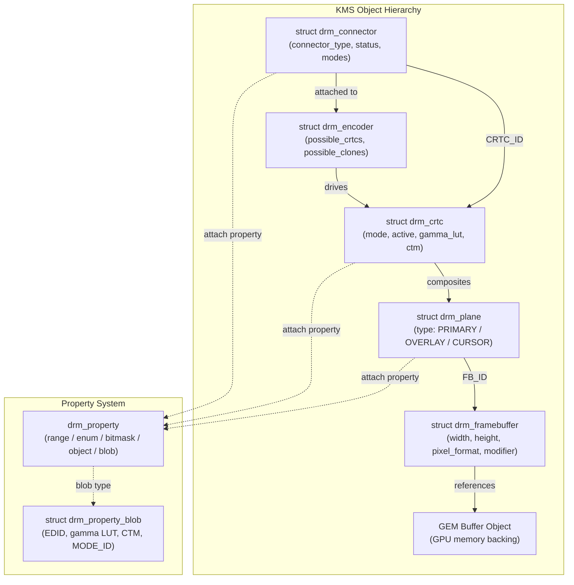
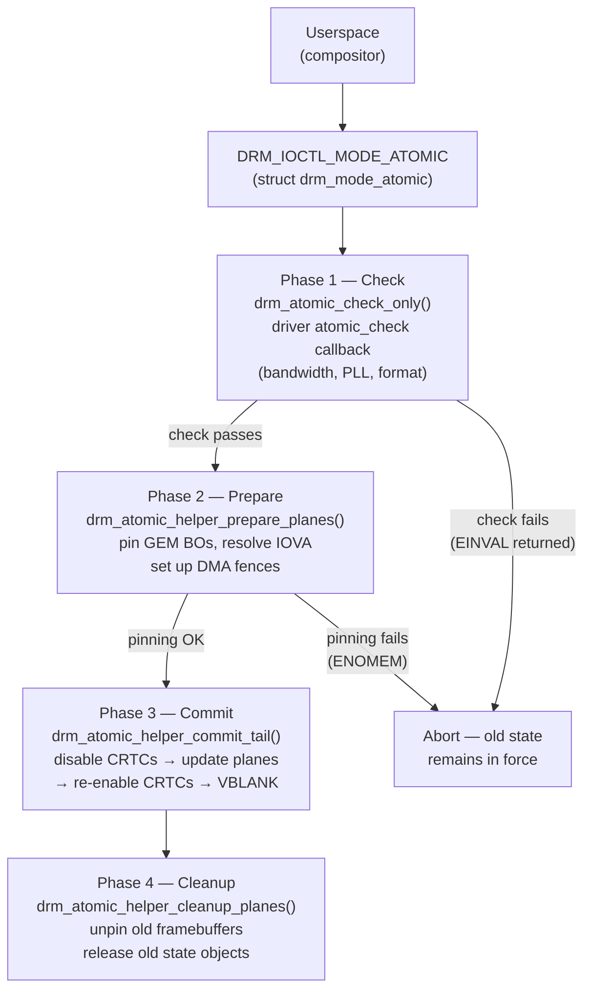
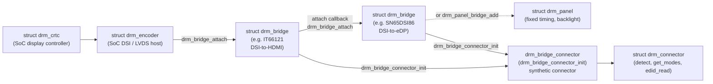

# Chapter 2: KMS: The Display Pipeline

> **Part**: Part I — The Kernel Layer
> **Audience**: Both — systems developers need the full KMS API depth; application developers need enough understanding to interpret compositor behaviour, frame-timing events, and buffer format requirements
> **Status**: First draft — 2026-06-06

## Table of Contents

- [Overview](#overview)
- [1. KMS Objects: The Display Hardware Model](#1-kms-objects-the-display-hardware-model)
  - [1.1 What is KMS?](#11-what-is-kms)
  - [1.2 What is the Display Pipeline?](#12-what-is-the-display-pipeline)
- [2. Legacy Mode Setting: The Original API](#2-legacy-mode-setting-the-original-api)
- [3. Atomic Modesetting: Design and Mechanics](#3-atomic-modesetting-design-and-mechanics)
- [4. Properties: The Configuration Language of KMS](#4-properties-the-configuration-language-of-kms)
- [5. Planes: Hardware Compositing Layers](#5-planes-hardware-compositing-layers)
- [6. DRM Format Modifiers](#6-drm-format-modifiers)
- [7. Page Flipping and VBLANK Synchronisation](#7-page-flipping-and-vblank-synchronisation)
- [8. The Display Pipeline: From GPU Memory to Physical Connector](#8-the-display-pipeline-from-gpu-memory-to-physical-connector)
- [9. Damage Tracking and Partial Updates](#9-damage-tracking-and-partial-updates)
- [10. Connector Probing: EDID, DisplayID, and Hotplug](#10-connector-probing-edid-displayid-and-hotplug)
- [11. Screen Rotation, Panel Orientation, and Buffer Transforms](#11-screen-rotation-panel-orientation-and-buffer-transforms)
- [12. The DRM Bridge Framework: Composable Display Pipelines](#12-the-drm-bridge-framework-composable-display-pipelines)
- [13. AMD Display Core: amdgpu_dm and the DCN Hardware Abstraction](#13-amd-display-core-amdgpu_dm-and-the-dcn-hardware-abstraction)
- [Integrations](#integrations)
- [References](#references)

---

## Overview

**Kernel Mode Setting** (**KMS**) is the display half of the **DRM** subsystem, and it represents one of the most consequential architectural changes in the Linux graphics stack over the past two decades. Before **KMS**, display hardware programming was performed entirely in userspace — the X server directly wrote to display controller registers, trained **DisplayPort** links, and managed **VBLANK** interrupts without any kernel coordination. This approach worked when a single privileged X server owned the display, but it was fundamentally incompatible with suspend/resume, multiple display servers, secure output paths, and the demands of modern compositor architectures. **KMS** moved display hardware ownership into the kernel, where it belongs, and wrapped it in an ioctl interface that is safe, auditable, and accessible to multiple userspace consumers through ordinary file descriptors.

This chapter dissects the **KMS** object model from the ground up and traces the complete path from a GPU memory buffer to photons leaving a physical connector. Section by section, it covers:

- **KMS Object Types** — the five core object types (**connectors**, **encoders**, **CRTCs**, **planes**, and **framebuffers**) and the **property system** that drives their configuration, including the blob mechanism used to pass **EDID** bytes, gamma tables, and colour transform matrices as typed **KMS** properties
- **Legacy API** — **DRM_IOCTL_MODE_SETCRTC** and **DRM_IOCTL_MODE_PAGE_FLIP**, explaining non-atomicity and the practical failure modes that motivated the atomic redesign
- **Atomic Modesetting** — the **drm_atomic_state** transaction model, the **DRM_IOCTL_MODE_ATOMIC** ioctl, the four-phase commit lifecycle (check, prepare, commit, cleanup), non-blocking commits and the per-**CRTC** workqueue, driver callbacks in **drm_mode_config_funcs**, **drm_crtc_helper_funcs**, and **drm_plane_helper_funcs**, and the hard rollback guarantee that makes **DRM_MODE_ATOMIC_TEST_ONLY** safe for capability probing
- **Properties** — the standard **connector**, **CRTC**, and **plane** properties — including **IN_FENCE_FD**, **OUT_FENCE_PTR**, and **FB_DAMAGE_CLIPS** — that form the configuration language between the kernel and userspace compositors
- **Planes** — hardware compositing layers in depth: format and modifier negotiation via the **IN_FORMATS** blob, **z-order** via the **zpos** property, alpha compositing via **pixel_blend_mode** and **alpha**, **cursor** plane constraints, and hardware scaling
- **Page Flipping and VBLANK Synchronisation** — how the **drm_vblank_init()** interrupt counter, **DRM_IOCTL_WAIT_VBLANK**, atomic page flips, **drm_event_vblank** event delivery, and double and triple buffering strategies prevent display tearing
- **Display Pipeline** — every step from a **GEM** buffer object through **GBM** (**gbm_surface_lock_front_buffer()**), **DRM_IOCTL_MODE_ADDFB2** (**struct drm_mode_fb_cmd2**), an atomic commit, the display controller's **atomic_update** callback, **IOMMU** address mapping via **drm_fb_dma_get_gem_addr()**, encoder signal conversion (**TMDS**, **8b/10b**, **D-PHY**), and the physical connector driving the cable — along with power sequencing via **drm_encoder_helper_funcs** and the **drm_panel** framework
- **Damage Tracking** — the **FB_DAMAGE_CLIPS** plane property, the **wl_surface_damage()** / **wl_surface_damage_buffer()** Wayland surface damage protocol, **wlr_damage_ring** in **wlroots**, **Panel Self-Refresh** (**PSR** and **PSR2** selective update) on Intel **eDP** panels, and **DRM_IOCTL_MODE_CREATE_DUMB** dumb buffers as the universal CPU-accessible scanout format
- **Connector Probing** — the **EDID** and **DisplayID 2.0** standards, the **drm_connector_helper_funcs** probing path (**drm_edid_read()**, **drm_edid_connector_update()**, **drm_edid_connector_add_modes()**), **Hot Plug Detect** (**HPD**) interrupt handling via **drm_kms_helper_hotplug_event()**, poll-based detection via **drm_kms_helper_poll_init()**, EDID race conditions and the **drm_edid_quirk_list**, and fake **EDID** injection for headless **CI/CD** testing
- **Screen Rotation** — the **rotation** bitmask plane property, the **panel_orientation** connector property sourced from **ACPI** or **Device Tree**, hardware versus compositor-side rotation strategies, and the propagation chain from **DRM_MODE_PANEL_ORIENTATION_*** to **WL_OUTPUT_TRANSFORM_*** via **wl_output.transform** and **wl_surface_set_buffer_transform()**, including **wp_fractional_scale_v1** for **HiDPI** panels
- **DRM Bridge Framework** — **struct drm_bridge**, **drm_bridge_add()**, **drm_bridge_attach()**, the **struct drm_bridge_funcs** atomic operations table (**atomic_pre_enable**, **atomic_enable**, **atomic_disable**, **atomic_post_disable**), the **drm_bridge_connector_init()** helper that synthesises a **drm_connector** from a bridge chain, the **drm_panel** framework (**struct drm_panel_funcs**, **drm_panel_bridge_add()**), and representative bridge chip drivers — **IT66121** (DSI-to-HDMI), **TI SN65DSI86** (DSI-to-eDP with **AUX** channel link training), and **ANX7625** (USB-C **Alt Mode DisplayPort**) — illustrating the range of SoC embedded display designs

After reading this chapter, a systems developer will have the mental model needed to write a minimal **DRM/KMS** compositor from scratch, understand what callbacks a GPU driver must implement, and diagnose failures at the modesetting layer. An application developer will understand why compositors are architected the way they are, what causes display tearing and how it is prevented at the hardware level, and how the **KMS** properties described here surface in the higher-level APIs they use every day.

---

## 1. KMS Objects: The Display Hardware Model

Every element of physical display hardware visible to the kernel is represented by a KMS object with a stable `uint32_t` identifier in the DRM device's global namespace. The enumeration ioctl `DRM_IOCTL_MODE_GETRESOURCES` returns the complete list of connector, encoder, CRTC, and framebuffer IDs in a single call; plane IDs are returned separately by `DRM_IOCTL_MODE_GETPLANERESOURCES` after the client has enabled the `DRM_CLIENT_CAP_UNIVERSAL_PLANES` capability flag. This namespace is the compositor's starting point: before it can configure the display, it must walk this tree of objects to understand what hardware it has available.

**Connectors** (`include/drm/drm_connector.h`) represent physical output ports — HDMI, DisplayPort, DSI, eDP, VGA, and others. The `struct drm_connector` carries a `connector_type` field encoded as one of the `DRM_MODE_CONNECTOR_*` constants, a `status` field (`connector_status_connected`, `connector_status_disconnected`, or `connector_status_unknown`), a `modes` linked list of `struct drm_display_mode` instances populated after a probe, and a `state` pointer to the current `struct drm_connector_state` under the atomic model. Connectors also aggregate `struct drm_display_info`, which is populated from EDID parsing and carries panel dimensions, subpixel arrangement, HDR static metadata support, colorimetry flags, and the maximum supported bits per colour channel.

**Encoders** (`include/drm/drm_encoder.h`) sit between CRTCs and connectors and convert the CRTC's internal timing representation into the protocol-level signal the connector expects — TMDS differential pairs for HDMI, 8b/10b-encoded lane data for DisplayPort, or MIPI D-PHY lane signals for DSI. In practice, modern GPU drivers increasingly treat encoders as thin glue objects and delegate the real work to `drm_bridge` chains (covered in Section 11). An encoder has a `possible_crtcs` bitmask identifying which CRTCs it may be driven by, and a `possible_clones` bitmask for multi-monitor clone configurations.

**CRTCs** (`include/drm/drm_crtc.h`) are the scanout engines — one per independent display head. The name is historical (Cathode Ray Tube Controller), but the modern `struct drm_crtc` represents any hardware block that reads pixel data from framebuffers, composites hardware planes, and generates the timing signals that downstream encoders encode. A CRTC holds a `state` pointer to `struct drm_crtc_state`, which carries the active display mode in `mode` and `mode_blob`, colour management state in `gamma_lut`, `degamma_lut`, and `ctm`, and the `active` boolean that controls whether the CRTC is scanning out at all. The `funcs` and `helper_private` pointers link to the driver-provided operations tables.

**Planes** (`include/drm/drm_plane.h`) are the hardware compositing layers that the CRTC blends together. There are three plane types distinguished by the `enum drm_plane_type`: `DRM_PLANE_TYPE_PRIMARY` (mandatory — the main scanout plane that must be active whenever the CRTC is active), `DRM_PLANE_TYPE_OVERLAY` (optional additional layers for video, sprites, or picture-in-picture), and `DRM_PLANE_TYPE_CURSOR` (the hardware cursor plane, with special size constraints). A `struct drm_plane` exposes its `format_types` array (a list of `DRM_FORMAT_*` fourcc codes it accepts) and `format_count`, as well as its `type`. The current configuration lives in `struct drm_plane_state`, which contains the framebuffer pointer `fb`, the destination rectangle (`crtc_x/y/w/h`), the source rectangle in 16.16 fixed-point format (`src_x/y/w/h`), and atomic properties for `rotation`, `zpos`, `alpha`, and `pixel_blend_mode`.

**Framebuffers** (`include/drm/drm_framebuffer.h`) are references to one or more GEM buffer objects with associated width, height, pixel format, stride, and optional tiling/compression modifiers. They are created via `DRM_IOCTL_MODE_ADDFB2`, which accepts a `struct drm_mode_fb_cmd2`. That structure carries four handle slots for multi-planar formats (NV12, P010, and other YCbCr layouts each require separate luma and chroma planes), four pitch values, four offset values, and four 64-bit modifier fields that describe the tiling or compression layout in use. Framebuffers are reference-counted; the kernel pins the underlying GEM BO as long as a framebuffer that references it is attached to an active plane.

The **property system** is the extension mechanism that makes all of this configurable. Every KMS object — connector, CRTC, plane, framebuffer — can have an arbitrary set of typed properties attached to it via `drm_object_attach_property()`. Properties are typed: range (integer with min/max), enum (named values), bitmask, object (referring to another KMS object by ID), or blob (arbitrary binary data stored as a `struct drm_property_blob`). The blob type is particularly important because it allows structured data — EDID bytes, gamma tables, HDR metadata descriptors, and colour transform matrices — to be passed as a single reference. Blobs are created by userspace via `DRM_IOCTL_MODE_CREATEPROPBLOB` and referenced by ID in atomic commits.

Userspace discovers all properties of an object using `drmModeObjectGetProperties()` (the libdrm wrapper around `DRM_IOCTL_MODE_OBJ_GETPROPERTIES`). For each property ID returned, `drmModeGetProperty()` yields the property name, type, and valid values. This discovery pattern is essential: compositors must query capabilities at runtime rather than assuming hardware support, because the set of properties and their valid values varies between GPU drivers and hardware generations.



### Code example: KMS object enumeration

```c
/* Uses libdrm — include/xf86drmMode.h */
#include <xf86drm.h>
#include <xf86drmMode.h>
#include <stdio.h>
#include <fcntl.h>

int main(void) {
    int fd = open("/dev/dri/card0", O_RDWR | O_CLOEXEC);

    /* Enable universal planes so overlay and cursor planes appear */
    drmSetClientCap(fd, DRM_CLIENT_CAP_UNIVERSAL_PLANES, 1);
    drmSetClientCap(fd, DRM_CLIENT_CAP_ATOMIC, 1);

    drmModeRes *res = drmModeGetResources(fd);
    printf("CRTCs: %d, Connectors: %d, Encoders: %d\n",
           res->count_crtcs, res->count_connectors, res->count_encoders);

    for (int i = 0; i < res->count_connectors; i++) {
        drmModeConnector *conn = drmModeGetConnector(fd, res->connectors[i]);
        printf("Connector %u: type=%u status=%u modes=%d\n",
               conn->connector_id, conn->connector_type,
               conn->connection, conn->count_modes);
        if (conn->count_modes > 0) {
            drmModeModeInfo *m = &conn->modes[0]; /* preferred mode */
            printf("  Preferred: %dx%d@%d\n",
                   m->hdisplay, m->vdisplay, m->vrefresh);
        }
        drmModeFreeConnector(conn);
    }

    drmModeFreeModeInfo(res);  /* actually drmModeFreeResources */
    drmModeFreeResources(res);
    return 0;
}
```

The `DRM_CLIENT_CAP_UNIVERSAL_PLANES` and `DRM_CLIENT_CAP_ATOMIC` capabilities (introduced in kernels 3.15 and 4.2 respectively, as described in Chapter 1) must be set before attempting to use any of the APIs discussed in this chapter. Without `DRM_CLIENT_CAP_UNIVERSAL_PLANES`, only primary planes appear in the plane list; without `DRM_CLIENT_CAP_ATOMIC`, the atomic commit ioctl is unavailable.

### 1.1 What is KMS?

Kernel Mode Setting (KMS) is the display configuration subsystem within the Linux kernel's Direct Rendering Manager (DRM) framework. It handles the ownership and programming of display controller hardware — the circuits responsible for reading pixel data from GPU memory and driving signals out through physical connectors such as HDMI, DisplayPort, or eDP. The kernel exposes this hardware through the `/dev/dri/card*` device nodes, with KMS operations accessible as ioctl calls defined in `include/uapi/drm/drm_mode.h`.

Before KMS existed, display programming was performed entirely in userspace, most commonly by the X server writing directly to memory-mapped hardware registers. This approach was workable when a single privileged process owned the display for the lifetime of a session, but it became untenable as Linux matured: suspend and resume required saving and restoring display state that no kernel-owned code tracked; multiple independent display servers could not safely share the display controller; and secure or encrypted output paths could not be enforced without kernel involvement. KMS solves these problems by moving all display hardware ownership into the kernel, wrapping it in a capability-gated ioctl interface, and ensuring that the display controller is always in a coherent state regardless of which userspace process is currently active.

The KMS interface is exposed in two generations: the legacy ioctl API (`DRM_IOCTL_MODE_SETCRTC`, `DRM_IOCTL_MODE_PAGE_FLIP`) and the atomic modesetting API (`DRM_IOCTL_MODE_ATOMIC`) introduced in kernel 4.2. In this chapter, KMS refers specifically to the modesetting half of DRM — the path from buffer allocation through property configuration to the hardware scanout of pixels on an active display.

### 1.2 What is the Display Pipeline?

The display pipeline is the ordered sequence of hardware stages and software abstractions that carries rendered pixel data from GPU memory to a physical display panel. In the KMS model this pipeline is represented as a directed graph of typed kernel objects: a framebuffer wraps one or more GEM buffer objects holding pixel data; a plane maps that framebuffer onto a rectangular region of a CRTC's output; the CRTC generates the video timing signal; an encoder converts that timing signal into a protocol-level representation such as TMDS differential pairs for HDMI or 8b/10b-encoded lane data for DisplayPort; and a connector drives the physical pins that attach to a cable or panel.

This object graph is not merely a software abstraction — it corresponds directly to discrete hardware blocks present in real GPU silicon. The scanout controller reads from DRAM using a DMA address obtained by pinning the GEM buffer through the IOMMU; the timing generator counts horizontal and vertical pixels to produce HSYNC, VSYNC, and pixel-clock signals at the rate specified by the active `drm_display_mode`; the encoder modulates those signals onto the appropriate physical medium. On embedded and mobile SoCs the pipeline often includes additional stages represented by the DRM bridge framework, such as a DSI-to-HDMI bridge chip or a USB-C Alt Mode multiplexer (covered in Section 12).

Understanding this object graph — which objects are mandatory, which are optional, and which constraints govern their connections — is the prerequisite for all configuration work discussed in this chapter. The five object types introduced in the sections below map one-to-one onto the stages of this pipeline.

---

## 2. Legacy Mode Setting: The Original API

Understanding the legacy API is important both for reading older codebases and for appreciating why the atomic redesign was necessary. The legacy API exposed separate ioctls for each aspect of display configuration, and while each individual ioctl was internally consistent, the combination was not.

The primary legacy modesetting ioctl is `DRM_IOCTL_MODE_SETCRTC`, which simultaneously sets the display mode on a CRTC, assigns a primary framebuffer for scanout, and attaches one or more connectors to that CRTC. This single ioctl is actually fairly well-designed for basic use — it sets mode, framebuffer, and connector list atomically at the CRTC level. The problems emerge when a compositor needs to coordinate multiple hardware elements simultaneously.

`DRM_IOCTL_MODE_PAGE_FLIP` is the legacy mechanism for changing the primary framebuffer at VBLANK. The caller passes the new framebuffer ID and, if the `DRM_MODE_PAGE_FLIP_EVENT` flag is set, requests a `drm_event_vblank` notification on the DRM file descriptor when the flip completes. This works well in the simple single-display case, but the fundamental issue is that a page flip only changes the primary framebuffer — there is no way to atomically update cursor position, overlay plane configuration, and primary framebuffer in a single operation. Each requires a separate ioctl: `DRM_IOCTL_MODE_SETCURSOR2` for the cursor, `DRM_IOCTL_MODE_SETPLANE` for overlay planes.

The consequences of this non-atomicity were real and visible. If a compositor updated the cursor position and primary framebuffer in separate ioctls, a frame could be displayed where the cursor had moved but the scene had not yet updated — a brief flicker or visual glitch. Worse, if the compositor was updating three planes and the second ioctl failed (perhaps because the new configuration exceeded the display controller's memory bandwidth), the hardware was left in an inconsistent intermediate state. There was no rollback; the compositor had to detect the failure, figure out which ioctls had already applied, and manually undo them.

The legacy API also had no concept of testing a configuration before applying it. If a compositor wanted to know whether a particular resolution was achievable given the current CRTC-encoder-connector path and the monitor's capabilities, it had to simply try the `SETCRTC` call and see what happened. This made dynamic mode switching fragile, because mode validation and mode application were the same operation.

Implicit GPU-to-display synchronisation was another gap: the legacy API had no way to express "apply this page flip only after the GPU has finished rendering into this framebuffer." Early compositors worked around this by inserting explicit CPU-side waits (using OpenGL fence objects or polling on GPU completion ioctls) before calling `PAGE_FLIP`, but this introduced latency and could cause deadline misses. The explicit fence mechanism that solves this properly (`IN_FENCE_FD` and `OUT_FENCE_PTR` plane properties) required the atomic infrastructure, as discussed in Section 4.

The legacy API remains fully supported in all current kernels. Simpledrm (the generic framebuffer driver used on platforms without a native DRM driver), fbdev emulation, and the kernel's VT console all rely on it. Thousands of existing applications were written against it, and removing it would break compatibility. But all new compositor and display driver development should use the atomic API exclusively.

---

## 3. Atomic Modesetting: Design and Mechanics

Atomic modesetting, merged in kernel 4.2 (2015), addressed all of the structural problems of the legacy API with a single, coherent design principle: all KMS configuration changes are expressed as property updates collected into a single transaction, validated completely before any hardware is touched, and then applied as one hardware-level operation. This is the most important section of this chapter because every modern compositor — wlroots, Mutter, KWin, gamescope — drives display hardware exclusively through the atomic API.

### The Atomic State Object

The central data structure is `struct drm_atomic_state` (defined in `drivers/gpu/drm/drm_atomic.c` and declared in `include/drm/drm_atomic.h`). An atomic state is a transactional snapshot: it contains per-object state structures for every KMS object being modified. `drm_crtc_state`, `drm_plane_state`, and `drm_connector_state` are all embedded in the atomic state, and the kernel populates them from the current hardware state before allowing the driver to modify them. When a commit is applied, the new state structures replace the old ones atomically under the appropriate locks; if the commit fails at any point before hardware programming begins, the old state remains in force and the new state is discarded.

### The Atomic Commit Ioctl

The userspace interface is `DRM_IOCTL_MODE_ATOMIC`, which accepts a `struct drm_mode_atomic`:

```c
/* Source: include/uapi/drm/drm_mode.h */
struct drm_mode_atomic {
    __u32 flags;
    __u32 count_objs;
    __u64 objs_ptr;        /* pointer to array of object IDs */
    __u64 count_props_ptr; /* pointer to per-object property counts */
    __u64 props_ptr;       /* pointer to property ID arrays */
    __u64 prop_values_ptr; /* pointer to property value arrays */
    __u64 reserved;
    __u64 user_data;       /* returned in completion events */
};
```

The commit is encoded as parallel arrays: `objs_ptr` lists the object IDs being changed, `count_props_ptr` gives the number of properties being set on each object, and `props_ptr`/`prop_values_ptr` give the flattened property-id/value pairs. This encoding allows an arbitrary number of objects and properties to be changed in a single syscall.

Four flags control the commit behaviour. `DRM_MODE_ATOMIC_TEST_ONLY` (0x0100) runs the full validation path without touching any hardware — compositors use this to probe whether a configuration is achievable. `DRM_MODE_ATOMIC_NONBLOCK` (0x0200) allows the ioctl to return before the hardware flip has actually occurred (see below). `DRM_MODE_ATOMIC_ALLOW_MODESET` (0x0400) is required for any commit that changes the display mode, resolution, or CRTC active state; it is intentionally separated from page-flip-only commits because mode changes involve reprogramming PLLs, link training, and EDID negotiation — operations that cannot be performed safely while the display is active without careful sequencing. Page-flip-only commits should never set `ALLOW_MODESET`; doing so would cause unnecessary display blanking.

### The Four-Phase Commit Path

The kernel's atomic commit implementation in `drivers/gpu/drm/drm_atomic_helper.c` defines a four-phase lifecycle for every commit:

**Phase 1 — Check**: `drm_atomic_check_only()` validates the proposed state by calling the driver's `atomic_check` callback (registered in `struct drm_mode_config_funcs`). The driver examines the complete proposed state — which planes are active on which CRTCs, what framebuffer formats and modifiers are in use, what display modes are requested — and returns an error if any hardware constraint is violated. This is where bandwidth limits, PLL availability, FIFO depth constraints, and format compatibility are verified. Because no hardware has been touched at this point, a check failure is completely safe; the caller receives the error code and the display continues operating on the previous configuration. This is the mechanism behind `DRM_MODE_ATOMIC_TEST_ONLY`.

**Phase 2 — Prepare**: `drm_atomic_helper_prepare_planes()` pins the framebuffers that will be displayed after the commit, resolving the GEM buffer objects to physical or IOVA addresses. This step also sets up DMA fences. Crucially, prepare happens before the commit crosses the point of no return, so if pinning fails (because GPU memory is exhausted, for example), the commit can still be cleanly aborted.

**Phase 3 — Commit**: `drm_atomic_helper_commit_tail()` (the default `atomic_commit_tail` implementation called from `drm_atomic_helper_commit()`) performs the actual hardware programming. It calls `drm_atomic_helper_commit_modeset_disables()` to disable any CRTCs that are being turned off or reconfigured, then `drm_atomic_helper_commit_planes()` to program the plane state (calling each plane's `atomic_update` or `atomic_disable` helper), then `drm_atomic_helper_commit_modeset_enables()` to re-enable CRTCs in their new configuration, and finally signals VBLANK and flips the active state pointer.

**Phase 4 — Cleanup**: `drm_atomic_helper_cleanup_planes()` unpins the previous framebuffers and releases references to state objects no longer in use. At this point the old GEM BOs are safe to return to the allocator or unmap from the display IOMMU.

### Non-Blocking Commits and the Workqueue

When `DRM_MODE_ATOMIC_NONBLOCK` is set, `drm_atomic_helper_commit()` queues the commit work — specifically `commit_work()`, which calls `commit_tail()` — onto a per-CRTC workqueue and returns immediately. The ioctl returns to userspace before the hardware flip has occurred. This is the normal operating mode for a high-performance compositor: the compositor submits the next frame's configuration immediately after preparing it, without waiting for the display controller to acknowledge the previous flip. The workqueue serialises multiple in-flight commits to the same CRTC.

A common misconception is that `NONBLOCK` means the state is instantly active. It is not. The hardware flip still occurs at the next VBLANK boundary; `NONBLOCK` only means the ioctl returns before that moment arrives. Compositors must use the `OUT_FENCE_PTR` mechanism (described in Section 4) or the VBLANK event (described in Section 6) to know when the flip has actually completed. Failing to track flip completion correctly is a reliable way to produce frame drops or buffer corruption.

### Driver Callbacks

Driver-provided validation lives in `struct drm_mode_config_funcs.atomic_check`. The AMD display stack's `amdgpu_dm_atomic_check()` is a representative example: it validates available display core bandwidth (crucial when multiple high-resolution displays share a single memory controller), verifies PLL availability for the requested pixel clocks, and calls into AMD's DC (Display Core) abstraction library to confirm that the hardware can achieve the requested configuration.

Hardware programming lives in `struct drm_crtc_helper_funcs` (`.atomic_begin`, `.atomic_flush`, `.atomic_enable`, `.atomic_disable`) and `struct drm_plane_helper_funcs` (`.atomic_check`, `.atomic_update`, `.atomic_disable`). The `atomic_begin` callback is called once before all plane updates on a given CRTC; `atomic_flush` is called once after all plane updates. This bracketing pattern allows drivers that use double-buffered register banks to arm the bank swap in `atomic_flush`, ensuring all plane register writes become active simultaneously at the next VBLANK.

### Rollback Semantics and Debugging



If `atomic_check` fails, no hardware registers have been written; the display continues on the previous configuration. This hard rollback guarantee is one of the most operationally important properties of the atomic API. A Wayland compositor that presents an invalid configuration (wrong pixel format for a plane, bandwidth-exceeding arrangement) receives an error ioctl return and can gracefully fall back to a simpler configuration.

Debugging atomic commits is aided by the `drm.debug=0x1f` kernel module parameter, which enables verbose logging of every atomic state transition. Combined with `drm_atomic_state_print()` (which dumps a human-readable representation of an atomic state to the kernel log), this produces a detailed trace of what was attempted and why it failed. The `drm_info` tool from the freedesktop.org repository (see References) provides a static snapshot of all current KMS object states.

### Commit Timing and Frames Per Second

**How fast is a commit?** The four phases themselves are fast — microseconds of CPU time for a typical page-flip-only commit on modern hardware. The bottleneck is not the commit path itself but the VBLANK boundary it must hit.

**The VBLANK constraint.** The display controller's scanout engine reads the framebuffer line-by-line at a rate determined by the pixel clock and the mode timing. After it finishes scanning the last active line, it enters the *vertical blanking interval* (VBLANK) — a brief period during which no pixels are being sent and the beam (historically) returned to the top. The hardware register that selects which framebuffer to scan — the *flip latch* — can only be safely updated during this blanking period, because writing it mid-scan would tear the image. The atomic commit's Phase 3 arms the flip; the actual register update happens when the VBLANK interrupt fires. This means **one atomic commit produces at most one frame on screen**, and it lands on the VBLANK boundary after Phase 3 completes.

**Commit-to-frame arithmetic.** The refresh rate set in `MODE_ID` determines how often VBLANK occurs:

| Display mode | VBLANK period | Maximum frames per second |
|---|---|---|
| 60 Hz | 16.67 ms | 60 fps |
| 75 Hz | 13.33 ms | 75 fps |
| 120 Hz | 8.33 ms | 120 fps |
| 144 Hz | 6.94 ms | 144 fps |
| 240 Hz | 4.17 ms | 240 fps |
| 360 Hz | 2.78 ms | 360 fps |

A compositor that issues one `DRM_IOCTL_MODE_ATOMIC` call per VBLANK period, hitting every VBLANK, achieves the display's full refresh rate. Miss a VBLANK and the frame is delayed to the next one — at 60 Hz, a single missed VBLANK drops the effective rate to 30 fps (every other VBLANK). This is why frame timing discipline in compositors is critical.

**Where does the commit time go?** For a non-blocking (`DRM_MODE_ATOMIC_NONBLOCK`) page-flip-only commit on a modern driver:

- **Phase 1 (check)** — typically 10–50 µs; mostly driver `atomic_check` logic, bandwidth validation, format compatibility checks. AMD DC's `amdgpu_dm_atomic_check` with DML validation can push this to 200–500 µs for complex multi-display configurations.
- **Phase 2 (prepare)** — typically 5–20 µs for a page-flip-only commit where the framebuffer is already pinned; longer if a new GEM BO needs to be pinned and IOMMU-mapped.
- **ioctl return** — the ioctl returns here under `NONBLOCK`; total kernel time in the ioctl is typically 50–200 µs.
- **Phase 3 (commit)** — runs asynchronously on the per-CRTC workqueue; waits until just before the VBLANK deadline, programs registers, exits.
- **Hardware flip** — happens at the VBLANK interrupt; display controller latches new framebuffer pointer atomically.
- **Phase 4 (cleanup)** — immediately after flip completes; unpins old framebuffer.

The entire ioctl path from userspace submission to hardware flip therefore takes: (time to next VBLANK) + a few microseconds of interrupt latency. At 60 Hz, worst case (just missed a VBLANK) this is 16.67 ms; best case (submitted just before VBLANK) it is near-zero. **The effective latency is therefore dominated by where in the VBLANK cycle the commit arrives, not by the four-phase processing time itself.**

**Non-blocking commits and pipelining.** Because `NONBLOCK` returns in ~100–200 µs, a compositor can issue a commit and immediately begin rendering the *next* frame while the display controller is still waiting to flip the previous one. This double-buffered pipeline is what allows a compositor to sustain full refresh rate without stalling:

```
Compositor timeline (60 Hz, 16.67 ms per frame):
  t=0.0 ms  VBLANK — frame N appears on screen
  t=0.1 ms  Compositor woken by VBLANK event, begins rendering frame N+1
  t=14.0 ms GPU finishes rendering frame N+1
  t=14.1 ms Atomic commit (NONBLOCK) for frame N+1 — ioctl returns in ~0.15 ms
  t=16.67 ms VBLANK — frame N+1 appears on screen
  t=16.7 ms Compositor woken, begins rendering frame N+2
  ...
```

If GPU rendering takes longer than one frame period (> 16.67 ms at 60 Hz), the compositor misses the VBLANK and the next commit lands on the VBLANK after that — halving the frame rate to 30 fps. This is the fundamental frame-pacing constraint that VRR (Variable Refresh Rate, `VRR_ENABLED` CRTC property) addresses: it stretches the VBLANK period to match the GPU's actual render time, avoiding the 30/60 fps cliff.

**Modeset commits are slower.** A commit with `DRM_MODE_ATOMIC_ALLOW_MODESET` — changing the display mode, resolution, or CRTC active state — is substantially more expensive because it involves: disabling the CRTC (Phase 3 calls `atomic_disable`), reprogramming PLLs (tens to hundreds of milliseconds for the PLL to lock), link training (DisplayPort: ~10–50 ms per link-rate negotiation round-trip), and re-enabling the CRTC. During this period the display is blank. Compositors avoid modeset commits during normal operation; they are reserved for initial setup and explicit user-triggered resolution changes.

**Observing commit timing.** The `wp_presentation_feedback.presented` event (§6b of Ch1) delivers the actual VBLANK timestamp and MSC counter, allowing compositors to measure frame-to-frame jitter. `ftrace` with the `drm:drm_vblank_event` tracepoint records per-VBLANK timing at kernel level. MangoHUD and `present_timing` tooling (referenced in the Ch93 §13 latency budget addition in plan.md) instrument the full compositor→GPU→KMS→display path.

---

## 4. Properties: The Configuration Language of KMS

Properties are the primary extension mechanism for KMS. Adding a new display feature — HDR metadata, variable refresh rate, fractional scaling — means defining new properties on the appropriate KMS objects. Properties are the lingua franca between the kernel's display pipeline and userspace compositors; everything configurable about a display, beyond the basic mode and framebuffer pointer, is expressed as a property.

**Standard connector properties** include: `EDID` (blob — the raw EDID bytes, readable and in some contexts writable for testing); `DPMS` (legacy power management enum, largely superseded by the atomic `ACTIVE` CRTC property); `CRTC_ID` (object — which CRTC this connector is attached to); `link-status` (enum — `Good` or `Bad`, writable by userspace to trigger link retraining); `scaling mode` (enum — controls how the display controller handles resolution mismatches between the framebuffer and the panel's native resolution); `max bpc` (range — maximum bits per colour channel on this output); `colorspace` (enum — the colour space of the content being sent, e.g., BT.2020 for HDR10 content); and `Content Protection` (enum — signals HDCP copy-protection intent: `Undesired`, `Desired`, or `Enabled`; the kernel sets the value to `Enabled` once the HDCP handshake with the downstream sink completes).

> **What are EDID bytes?** EDID (Extended Display Identification Data) is a compact binary structure the monitor stores in a small EEPROM and exposes over the DDC I2C bus (the two control pins on HDMI and DisplayPort connectors). The base block is exactly 128 bytes and encodes: the manufacturer ID (3-letter JEDEC code packed into 2 bytes), product code, serial number, manufacture date, VESA-standard supported resolutions (a bitmap of "established timings"), up to four 18-byte Detailed Timing Descriptors (the preferred mode and additional modes — each encoding pixel clock, horizontal/vertical active+blanking+sync widths and polarities in packed BCD), and a checksum. Extension blocks follow — the most important is the CEA-861/CTA-861 extension (1 additional 128-byte block) which adds Audio Data Blocks (supported sound formats), Video Data Blocks (CEA-standard mode codes like 1080p/4K), Vendor-Specific Data Blocks (HDMI/HDMI Forum extended capabilities, HDR static metadata), and Colorimetry Data Blocks (BT.2020, DCI-P3, sRGB). The KMS `EDID` blob property contains all of these bytes verbatim — the kernel reads them from the hardware but does not filter or reformat. Userspace can read the blob (e.g., with `edid-decode` or `drm_info`) to understand exactly what the monitor declared.

> **HDCP and DMA-BUF: Why Link Encryption Does Not Protect System Memory**
>
> **High-bandwidth Digital Content Protection (HDCP)** is a wire-encryption protocol that scrambles the HDMI or DisplayPort signal between the GPU's transmitter and the display's receiver so that a physical cable tap cannot yield usable pixel data. The threat model is narrow: it protects the *link*, not the *buffer*. The `Content Protection` KMS property signals intent to the kernel — setting `Desired` triggers a hardware HDCP handshake; a successful handshake transitions the property to `Enabled` — but the property has no effect on how the GPU manages the underlying pixel buffer in system memory.
>
> The critical gap is that a DMA-BUF handle to the scanout framebuffer gives any process with the file descriptor direct, CPU-readable access to the plaintext pixels — completely bypassing the wire encryption HDCP provides. The buffer is in DRAM, not on the cable. An attacker with `/dev/dri/card0` access and the framebuffer's DMA-BUF fd can `mmap(2)` the pixels directly.
>
> **The real protection chain** — as used on platforms that support certified playback (Android, ChromeOS) — requires all five layers to cooperate:
>
> | Layer | Mechanism | Stops DMA-BUF extraction? |
> |---|---|---|
> | TEE / secure video path | ARM TrustZone or Intel ME decodes into a protected memory region; the CPU normal-world cannot access it | Yes — CPU never has plaintext access |
> | Protected GEM buffer | Driver creates a GEM BO with a hardware-protected flag (`I915_GEM_CREATE_EXT_PROTECTED` on Intel i915; `AMDGPU_GEM_CREATE_ENCRYPTED` on AMD; `MSM_BO_CACHED_COHERENT` + Qualcomm SMMU protection on mobile) | Yes — mmap refused for normal-world processes |
> | `prime_export` refusal | Driver's `gem_prime_export` callback returns `-EPERM` for protected BOs, preventing any DMA-BUF fd from being created at all | Yes — fd never leaves the kernel |
> | IOMMU / SMMU | System IOMMU marks protected physical pages as inaccessible to all DMA masters except the display engine | Yes — no device can DMA-read the plaintext |
> | HDCP on output link | Wire encryption from GPU transmitter to display receiver | No — protects cable only, not memory |
>
> Without every layer above HDCP, a sufficiently privileged userspace process can always extract the plaintext scanout buffer.
>
> **Desktop Linux reality:** Widevine Content Decryption Module on Linux ships only at **Security Level L3** — software decryption in a normal userspace process, with the decoded frames written into ordinary system memory. L1 (TEE-based hardware path) is not available on desktop Linux. This means the full chain cannot be assembled, HDCP is the only active layer, and the `Content Protection` property is largely academic for desktop playback — legal content protection on Linux depends entirely on DRM licensing terms rather than hardware enforcement.

**Standard CRTC properties** include: `ACTIVE` (boolean — whether the CRTC is scanning out); `MODE_ID` (object blob — a reference to a `struct drm_mode_modeinfo` blob defining the display timing); `GAMMA_LUT` (blob — an array of `drm_color_lut` entries for the 1D output gamma curve); `DEGAMMA_LUT` (blob — the inverse gamma curve for colour-managed pipelines); `CTM` (blob — a 3×3 colour transform matrix encoded as `drm_color_ctm`); and `VRR_ENABLED` (boolean — request variable refresh rate on the attached display). The `GAMMA_LUT`, `DEGAMMA_LUT`, `CTM`, and HDR-related properties are introduced here but covered in depth in Chapter 3 (Advanced Display Features).

> **What are gamma tables?** Display panels have a non-linear relationship between the digital value sent to them and the light they emit. Historically this was a physical property of CRT phosphors — doubling the voltage did not double the brightness — characterised by the exponent γ ≈ 2.2. Modern LCD/OLED panels emulate this non-linearity in their electronics to remain compatible with content mastered for CRT. The result is that pixel value 128 (half of 255) does not produce half the luminance; it produces roughly (128/255)^2.2 ≈ 22% of peak luminance. A **gamma LUT** (Look-Up Table) is a correction table applied by the display controller's hardware just before the signal leaves the GPU: for each possible input value (typically 0–255 for 8-bit, or 0–1023 for 10-bit), the table specifies the output value to send to the panel. The KMS `GAMMA_LUT` blob is an array of `struct drm_color_lut` entries — one per LUT step — each containing `red`, `green`, and `blue` fields as 16-bit unsigned integers. A 256-entry table covers 8-bit content; a 1024- or 4096-entry table provides finer control for 10-bit HDR pipelines. The `DEGAMMA_LUT` is applied *before* the CTM matrix (to linearise the input), and `GAMMA_LUT` is applied *after* (to re-apply the display's expected encoding). Together they implement a proper ICC-profile colour management pipeline entirely in display-controller hardware, with no GPU compute cost per pixel.

```c
/* Source: include/uapi/drm/drm_mode.h — gamma LUT entry */
struct drm_color_lut {
    __u16 red;    /* 16-bit value: 0 = black, 65535 = full output */
    __u16 green;
    __u16 blue;
    __u16 reserved;
};
/* A GAMMA_LUT blob is simply an array of these structs.
   Size = drm_crtc_gamma_size(crtc) * sizeof(struct drm_color_lut).
   Query the LUT size with: DRM_IOCTL_GET_CAP / GAMMA_LUT_LUT_SIZE property. */
```

**Standard plane properties** include the core geometry set: `FB_ID` (object — the framebuffer to display), `CRTC_ID` (object — which CRTC this plane is on), the destination rectangle `CRTC_X/Y/W/H` (in pixels, clipped to the CRTC size), and the source rectangle `SRC_X/Y/W/H` (in 16.16 fixed-point, addressing a sub-rectangle of the framebuffer). The 16.16 fixed-point encoding for source coordinates was chosen to allow sub-pixel precision, which matters for hardware scalers that can position video content at half-pixel boundaries. Also on planes: `rotation` (bitmask), `zpos` (range), `pixel_blend_mode` (enum: `None`, `Pre-multiplied`, `Coverage`), `alpha` (range 0–65535), `IN_FENCE_FD` (signed integer — a sync file descriptor the display controller waits on before scanning out), `OUT_FENCE_PTR` (unsigned integer — a pointer to a userspace location where the kernel writes a sync file descriptor that signals when the flip completes), and `FB_DAMAGE_CLIPS` (blob). The `IN_FENCE_FD`/`OUT_FENCE_PTR` mechanism (available since kernel 4.9) is the explicit synchronisation path that allows the GPU rendering pipeline and the display pipeline to coordinate without CPU involvement; the full explicit sync story, including `wp_linux_drm_syncobj`, is covered in Chapter 3.

### Code example: property enumeration

```c
/* Uses libdrm — include/xf86drmMode.h */
#include <xf86drm.h>
#include <xf86drmMode.h>
#include <stdio.h>

void print_object_properties(int fd, uint32_t obj_id, uint32_t obj_type) {
    drmModeObjectProperties *props =
        drmModeObjectGetProperties(fd, obj_id, obj_type);
    if (!props) return;

    for (uint32_t i = 0; i < props->count_props; i++) {
        drmModePropertyRes *prop =
            drmModeGetProperty(fd, props->props[i]);
        printf("  prop[%u] id=%u name='%s' flags=0x%x value=%llu\n",
               i, prop->prop_id, prop->name, prop->flags,
               (unsigned long long)props->prop_values[i]);
        drmModeFreeProperty(prop);
    }
    drmModeFreeObjectProperties(props);
}

/* Call for a CRTC: */
/* print_object_properties(fd, crtc_id, DRM_MODE_OBJECT_CRTC); */
```

Blob properties require a separate lookup: `drmModeGetPropertyBlob(fd, blob_id)` returns the raw bytes. This is how userspace reads the `EDID` blob, the current `MODE_ID`, and colour management LUT data.

### Creating Driver-Specific Properties

GPU drivers add hardware-specific properties by calling `drm_property_create_range()`, `drm_property_create_enum()`, or `drm_property_create_blob()` in their driver initialisation path, then attaching the property to the target object with `drm_object_attach_property()`. This extensibility is why features like NVIDIA's Adaptive-Sync metadata or Intel's per-pipe colour management properties could be added without changing the ioctl interface: they simply appear as new named properties on the relevant objects.

---

## 5. Planes: Hardware Compositing Layers

Hardware planes are one of the most powerful and most hardware-variable features in KMS. The concept is straightforward: instead of the GPU compositing all display surfaces into a single framebuffer and then scanning that out, the display controller itself can blend multiple independently-addressed memory buffers in real time, in fixed-function hardware, using zero GPU compute and drawing minimal power. The practical reality is that planes are intensely hardware-specific in their capabilities, and a compositor must query what the hardware actually supports rather than assuming anything.

The number of planes per CRTC varies enormously: a simple SoC display controller may have two planes (one primary, one overlay for video), while a high-end desktop GPU may expose four or more overlay planes per CRTC, each with independent scaling, format, and rotation capabilities. The critical prerequisite is enabling `DRM_CLIENT_CAP_UNIVERSAL_PLANES` (kernel 3.15): without this, `DRM_IOCTL_MODE_GETPLANERESOURCES` returns an empty list and overlay planes are invisible to userspace.

Plane format support is the first thing to query: `struct drm_plane.format_types` is an array of `DRM_FORMAT_*` fourcc codes (from `include/uapi/drm/drm_fourcc.h`) listing every pixel format the plane accepts. Common values include `DRM_FORMAT_XRGB8888`, `DRM_FORMAT_ARGB8888`, `DRM_FORMAT_NV12` (4:2:0 planar YCbCr, two planes), and `DRM_FORMAT_P010` (10-bit 4:2:0 for HDR video). The format list varies per plane even within a single driver: many SoC display controllers can only accept YCbCr formats on overlay planes, not primary planes.

**Format modifiers** extend format selection to cover memory layout. A `DRM_FORMAT_XRGB8888` framebuffer might be stored in linear layout, or in a hardware-specific tiled layout that improves display controller cache efficiency, or in a vendor-specific compressed format (like Intel's CCS or ARM's AFBC). The `IN_FORMATS` blob property on each plane contains a `struct drm_format_modifier_blob` that maps out every supported (format, modifier) pair. A compositor allocating a framebuffer for direct scanout must negotiate: it queries the plane's `IN_FORMATS`, passes those modifier hints to GBM's `gbm_bo_create_with_modifiers2()` (Chapter 4), and receives a BO whose modifier is guaranteed to be accepted by the target plane. If no matching modifier can be allocated, the compositor falls back to `DRM_FORMAT_MOD_LINEAR` and accepts the potential performance cost.

**Z-order** between planes is expressed via the `zpos` property. When hardware supports flexible z-ordering, `zpos` is a writable range property; compositors can stack planes in any order by assigning `zpos` values. Some hardware has fixed z-ordering between planes, in which case `zpos` is an immutable property (set by the driver at initialisation time and not changeable by userspace). Always check the property's `DRM_MODE_PROP_IMMUTABLE` flag before assuming zpos is writable.

**Alpha compositing** on hardware planes is controlled by two properties. `pixel_blend_mode` selects the blending equation: `None` disables alpha blending entirely (useful for the opaque primary plane at the bottom of the stack), `Pre-multiplied` applies the standard pre-multiplied alpha formula (`src * alpha + dst * (1 - alpha)` where source RGB is pre-multiplied by alpha), and `Coverage` uses straight alpha. The plane-wide `alpha` property (range 0–65535) scales the entire plane's opacity independently of per-pixel alpha, enabling smooth crossfade transitions in hardware.

**Cursor planes** have unique constraints. Most display controllers limit cursor planes to a maximum size of 64×64 pixels, power-of-two dimensions only, and a small set of formats (typically `DRM_FORMAT_ARGB8888`). The hardware caps `DRM_CAP_CURSOR_WIDTH` and `DRM_CAP_CURSOR_HEIGHT` report the maximum cursor size; many compositors implement a software cursor fallback for large or animated cursors that exceed hardware limits, falling back to stamping the cursor image into the primary plane's framebuffer.

**Scaling** is supported on overlay planes of many display controllers: the source rectangle (`SRC_*`) and destination rectangle (`CRTC_*`) can have different sizes, and the hardware upscales or downscales the content. The minimum and maximum scale factors are hardware-dependent and often format-dependent as well (scaling from NV12 may be more limited than from ARGB8888). Compositors use `TEST_ONLY` commits to probe whether a given scale factor is acceptable before committing.

### Code example: plane format and modifier query

```c
/* Uses libdrm — include/xf86drmMode.h and drm_fourcc.h */
#include <xf86drm.h>
#include <xf86drmMode.h>
#include <drm/drm_fourcc.h>
#include <stdio.h>

void enumerate_plane_formats(int fd, uint32_t plane_id) {
    drmModePlane *plane = drmModeGetPlane(fd, plane_id);
    if (!plane) return;

    printf("Plane %u formats:\n", plane_id);
    for (uint32_t i = 0; i < plane->count_formats; i++) {
        uint32_t fmt = plane->formats[i];
        printf("  %.4s (0x%08x)\n", (char *)&fmt, fmt);
    }

    /* Read IN_FORMATS blob for modifier support */
    drmModeObjectProperties *props =
        drmModeObjectGetProperties(fd, plane_id, DRM_MODE_OBJECT_PLANE);
    for (uint32_t i = 0; i < props->count_props; i++) {
        drmModePropertyRes *prop = drmModeGetProperty(fd, props->props[i]);
        if (strcmp(prop->name, "IN_FORMATS") == 0) {
            drmModePropertyBlobRes *blob =
                drmModeGetPropertyBlob(fd, props->prop_values[i]);
            struct drm_format_modifier_blob *fmb =
                (struct drm_format_modifier_blob *)blob->data;
            printf("  Modifier count: %u\n", fmb->count_modifiers);
            drmModeFreePropertyBlob(blob);
        }
        drmModeFreeProperty(prop);
    }
    drmModeFreeObjectProperties(props);
    drmModeFreePlane(plane);
}
```

---

## 6. DRM Format Modifiers

When a KMS plane accepts a `DRM_FORMAT_XRGB8888` framebuffer, that fourcc code describes the pixel layout within a single pixel — four eight-bit channels packed in a specific order — but says nothing about how rows of pixels are laid out in GPU memory. Is each row stored contiguously, left to right, with stride bytes between rows (linear layout)? Or is the surface divided into rectangular tiles to improve cache efficiency? Is it compressed in a proprietary lossless format to reduce memory bandwidth? Without a way to convey this information, a GPU driver that has just rendered a compressed, tiled surface cannot hand it to the display controller — which may need a different (or identical) layout to scan it out correctly — without a full decompression and re-layout step. DRM format modifiers solve exactly this problem.

### What Format Modifiers Are

A DRM format modifier is a 64-bit integer that extends a fourcc pixel format to fully specify the memory layout and compression mode of a buffer. The upper 8 bits encode a vendor ID identifying which company or standard body defined the modifier; the lower 56 bits are vendor-defined and encode tile size, compression variant, swizzle pattern, pipe configuration, and other layout parameters. [Source](https://elixir.bootlin.com/linux/latest/source/include/uapi/drm/drm_fourcc.h)

Two special modifier values have universal meaning. `DRM_FORMAT_MOD_LINEAR` (value `0ULL`) designates a plain row-major, stride-separated layout with no tiling or compression — the simplest, most universally supported layout. `DRM_FORMAT_MOD_INVALID` (value `0x00ffffffffffffffULL`) is a sentinel that indicates no modifier has been negotiated; it must never be used as a surface layout descriptor and is used only in API context where "modifier unknown or not applicable" must be distinguished from `DRM_FORMAT_MOD_LINEAR`. Both constants, along with all vendor-specific modifiers, are defined in [`include/uapi/drm/drm_fourcc.h`](https://elixir.bootlin.com/linux/latest/source/include/uapi/drm/drm_fourcc.h).

The modifier namespace is partitioned by vendor. The upper-byte vendor IDs include `DRM_FORMAT_MOD_VENDOR_NONE` (0x00, used for `LINEAR` and `INVALID`), `DRM_FORMAT_MOD_VENDOR_INTEL` (0x01), `DRM_FORMAT_MOD_VENDOR_AMD` (0x02), `DRM_FORMAT_MOD_VENDOR_NVIDIA` (0x03), `DRM_FORMAT_MOD_VENDOR_SAMSUNG` (0x04), `DRM_FORMAT_MOD_VENDOR_QCOM` (0x05), `DRM_FORMAT_MOD_VENDOR_VIVANTE` (0x06), `DRM_FORMAT_MOD_VENDOR_BROADCOM` (0x07), `DRM_FORMAT_MOD_VENDOR_ARM` (0x08), `DRM_FORMAT_MOD_VENDOR_ALLWINNER` (0x09), and `DRM_FORMAT_MOD_VENDOR_AMLOGIC` (0x0a). [Source](https://elixir.bootlin.com/linux/latest/source/include/uapi/drm/drm_fourcc.h)

### Why Modifiers Are Necessary

The problem modifiers solve becomes concrete when you trace a single `DRM_FORMAT_XRGB8888` buffer through a modern GPU stack without modifiers. The GPU driver allocates a surface and, for performance, may lay it out in one of several incompatible ways:

- **Linear**: stride × height bytes, row-major, no tiling.
- **Intel X-tiled**: 4 KiB tiles, 512 bytes × 8 rows, interleaved in a specific pattern to improve GPU cache line locality.
- **Intel Y-tiled**: 4 KiB tiles, 128 bytes × 32 rows, better for scanout bandwidth.
- **Intel Y-tiled with CCS** (Color Control Surface): Y-tiled pixel data paired with an auxiliary lossless compressed surface encoding render-compression metadata.
- **AMD DCC** (Delta Color Compression): a surface with an auxiliary compression metadata surface encoding per-block compression state using a variable-length encoding.
- **ARM AFBC** (Arm FrameBuffer Compression): a fixed-rate lossless compressed format with a header region followed by variable-length compressed body tiles.

All of these are valid `DRM_FORMAT_XRGB8888` surfaces from the GPU's perspective. None of them are interchangeable without a full decode-recode pass. If a compositor allocates a surface in Intel Y-tiled-CCS format and tries to hand it to the display controller via a `DRM_IOCTL_MODE_ADDFB2` call without communicating the layout, the display controller would interpret the compressed metadata bytes as pixel data — producing garbage on screen, or triggering a display underflow.

With modifiers, both the allocator and the consumer negotiate a shared layout before allocation. The GPU driver and display controller both declare the set of modifiers they support; the compositor picks a modifier from the intersection and allocates a buffer in exactly that layout. The buffer can then be passed between the GPU render pipeline, the display controller's scanout engine, and potentially also imported into another GPU process (for zero-copy video decode → display pipelines) without any copy or conversion.

### Key Modifier Families

The `drm_fourcc.h` header defines modifiers for every major GPU vendor. The most important families for desktop and mobile Linux are:

**Linear**: `DRM_FORMAT_MOD_LINEAR` (`fourcc_mod_code(NONE, 0)`) — universally supported, universally a fallback. Any KMS plane that supports a given fourcc at all must support `DRM_FORMAT_MOD_LINEAR` for that fourcc. [Source](https://elixir.bootlin.com/linux/latest/source/include/uapi/drm/drm_fourcc.h)

**Intel**: Three major tiling variants are defined in `drm_fourcc.h` for Intel integrated graphics (i915) display controllers:

```c
/* Source: include/uapi/drm/drm_fourcc.h */
#define I915_FORMAT_MOD_X_TILED   fourcc_mod_code(INTEL, 1)
#define I915_FORMAT_MOD_Y_TILED   fourcc_mod_code(INTEL, 2)
#define I915_FORMAT_MOD_Y_TILED_CCS fourcc_mod_code(INTEL, 4)
```

`I915_FORMAT_MOD_X_TILED` is the legacy 4 KiB X-tile format, where the surface is divided into 512×8-byte tiles. `I915_FORMAT_MOD_Y_TILED` uses 128×32-byte tiles (32 × 128 = 4 KiB), which scan out more efficiently because the display controller can prefetch a full cache line per clock. `I915_FORMAT_MOD_Y_TILED_CCS` is Y-tiled data paired with a compressed CCS auxiliary plane: the main surface strides are for uncompressed data, but the hardware may have written compressed blocks; the CCS surface encodes per-64-byte-block compression metadata. From Gen12 onward, Intel added further variants including `I915_FORMAT_MOD_Y_TILED_GEN12_RC_CCS` (render compression), `I915_FORMAT_MOD_Y_TILED_GEN12_MC_CCS` (media compression), and Tile4/Tile64 variants for Xe-based hardware. [Source](https://elixir.bootlin.com/linux/latest/source/include/uapi/drm/drm_fourcc.h)

**AMD**: AMD's modifier space is more complex because it encodes multiple independent hardware parameters — DCC enable/disable, DCC independent block mode, pipe config, swizzle mode, and memory bank configuration — as bit fields within the 56-bit modifier value. A macro `AMD_FMT_MOD` constructs a modifier value from these fields:

```c
/* Source: include/uapi/drm/drm_fourcc.h — AMD modifier structure */
#define AMD_FMT_MOD_TILE_VER_GFX9     1
#define AMD_FMT_MOD_TILE_VER_GFX10    2
#define AMD_FMT_MOD_TILE_VER_GFX10_RBPLUS 3
#define AMD_FMT_MOD_TILE_VER_GFX11    4

/* The AMD modifier is constructed with AMD_FMT_MOD() macro */
/* Bit fields: TILE_VERSION (4 bits), TILE (5 bits), DCC (1 bit),
 *             DCC_RETILE (1 bit), DCC_PIPE_ALIGN (1 bit),
 *             DCC_INDEPENDENT_64B (1 bit), DCC_INDEPENDENT_128B (1 bit),
 *             DCC_MAX_COMPRESSED_BLOCK (2 bits), DCC_CONSTANT_ENCODE (1 bit),
 *             PIPE_XOR_BITS (4 bits), BANK_XOR_BITS (4 bits),
 *             PACKERS (4 bits), RB (4 bits), PIPE (5 bits) */
#define AMD_FMT_MOD fourcc_mod_code(AMD, /* per-surface bit field encoding */)
```

The AMD modifier for a GFX10 DCC-compressed surface with 64B independent blocks and pipe alignment looks like a specific large integer. The AMDGPU display driver exposes the full set of supported AMD modifiers via the `IN_FORMATS` blob, and Mesa's RADV/RadeonSI allocates surfaces with the modifier the KMS plane reports as preferred, which is ordered by scanout efficiency. [Source](https://elixir.bootlin.com/linux/latest/source/include/uapi/drm/drm_fourcc.h)

**ARM AFBC**: Arm FrameBuffer Compression is a standard lossy/lossless compression scheme supported by ARM Mali GPUs, Rockchip, Allwinner, MediaTek, and others. The modifier uses a flag-based scheme:

```c
/* Source: include/uapi/drm/drm_fourcc.h */
#define DRM_FORMAT_MOD_ARM_AFBC(flags)  fourcc_mod_code(ARM, flags)

/* Flag bits combined with bitwise OR: */
#define AFBC_FORMAT_MOD_BLOCK_SIZE_16x16   (1ULL)
#define AFBC_FORMAT_MOD_BLOCK_SIZE_32x8    (2ULL)
#define AFBC_FORMAT_MOD_BLOCK_SIZE_64x4    (3ULL)
#define AFBC_FORMAT_MOD_BLOCK_SIZE_32x8_64x4 (4ULL)
#define AFBC_FORMAT_MOD_YTR    (1ULL << 4)  /* YCbCr-to-RGB transform */
#define AFBC_FORMAT_MOD_SPLIT  (1ULL << 5)  /* split-block encoding */
#define AFBC_FORMAT_MOD_SPARSE (1ULL << 6)  /* sparse allocation */
#define AFBC_FORMAT_MOD_CBR    (1ULL << 7)  /* constant-bit-rate */
#define AFBC_FORMAT_MOD_TILED  (1ULL << 8)  /* super-block tiling */
#define AFBC_FORMAT_MOD_SC     (1ULL << 9)  /* solid-colour blocks */
#define AFBC_FORMAT_MOD_DB     (1ULL << 10) /* double-buffer */
#define AFBC_FORMAT_MOD_BCH    (1ULL << 11) /* block checksumming */
#define AFBC_FORMAT_MOD_USM    (1ULL << 12) /* uncompressed storage mode */
```

A typical AFBC modifier for scanout on a Rockchip RK3588 would be `DRM_FORMAT_MOD_ARM_AFBC(AFBC_FORMAT_MOD_BLOCK_SIZE_16x16 | AFBC_FORMAT_MOD_TILED | AFBC_FORMAT_MOD_SPARSE)`. [Source](https://elixir.bootlin.com/linux/latest/source/include/uapi/drm/drm_fourcc.h)

**Qualcomm UBWC**: The Qualcomm Universal Bandwidth Compression format, used on Adreno GPUs and Qualcomm display processors, is exposed as `DRM_FORMAT_MOD_QCOM_COMPRESSED` (`fourcc_mod_code(QCOM, 1)`). It supports a subset of DRM formats (typically ARGB8888, NV12, and UBWC-compressed YUV variants) and can be scanned out directly by Qualcomm's DPU (Display Processing Unit) when both the Adreno GPU and the DPU have negotiated this modifier. [Source](https://elixir.bootlin.com/linux/latest/source/include/uapi/drm/drm_fourcc.h)

**Broadcom SAND**: The Raspberry Pi VideoCore IV and V hardware encoders produce video in the SAND (Semi-Planar Architectured Non-Discrete) format, where columns of pixels are stored in fixed-width strips rather than rows. `DRM_FORMAT_MOD_BROADCOM_SAND128` (strip width 128 bytes) and `DRM_FORMAT_MOD_BROADCOM_SAND256` (strip width 256 bytes) allow the VC4/VC6 display engine to scan out video frames directly from the hardware encoder's output buffer without a copy. [Source](https://elixir.bootlin.com/linux/latest/source/include/uapi/drm/drm_fourcc.h)

### Modifier Flow Through the Stack

Modifier negotiation is a dance between the KMS display pipeline (the consumer) and the buffer allocator/GPU driver (the producer). The flow has three phases: capability advertisement, intersection, and committed allocation.

**Phase 1: Consumer declares accepted modifiers via `IN_FORMATS`.** Every KMS plane that supports modifier-aware scanout exposes an `IN_FORMATS` blob property. The blob contains a `struct drm_format_modifier_blob`, which is a header followed by two packed arrays: a list of fourcc format codes, and a list of `struct drm_format_modifier` records each of which identifies a modifier value and a bitmask indicating which of the listed fourcc codes it applies to. [Source](https://elixir.bootlin.com/linux/latest/source/include/uapi/drm/drm_mode.h)

```c
/* Source: include/uapi/drm/drm_mode.h */
struct drm_format_modifier_blob {
    __u32 version;         /* always 1 */
    __u32 flags;           /* reserved, must be 0 */
    __u32 count_formats;   /* number of formats in the format array */
    __u32 formats_offset;  /* byte offset from start of blob to format array */
    __u32 count_modifiers; /* number of modifiers in the modifier array */
    __u32 modifiers_offset;/* byte offset from start of blob to modifier array */
    /* followed by: __u32 formats[count_formats] */
    /* followed by: struct drm_format_modifier modifiers[count_modifiers] */
};

struct drm_format_modifier {
    __u64 formats;         /* bitmask: bit i set means formats[i] is supported */
    __u32 offset;          /* index of first format this modifier applies to */
    __u32 pad;
    __u64 modifier;        /* the modifier value */
};
```

**Phase 2: Producer declares supported modifiers via `zwp_linux_dmabuf_v1`.** In a Wayland compositor stack, the `zwp_linux_dmabuf_v1` Wayland protocol extension ([wayland-protocols](https://gitlab.freedesktop.org/wayland/wayland-protocols/-/blob/main/unstable/linux-dmabuf/linux-dmabuf-unstable-v1.xml)) allows clients to import dma-buf backed buffers. During binding, the compositor sends `zwp_linux_dmabuf_v1.modifier` events to advertise all supported (format, modifier) pairs. A GPU-accelerated client receiving these events knows exactly which layout it should allocate its render targets in to allow zero-copy import by the compositor. The version 4 extension added `zwp_linux_dmabuf_feedback_v1`, which extends this to per-surface and per-format-table feedback, enabling finer-grained modifier negotiation for multi-GPU setups. [Source](https://gitlab.freedesktop.org/wayland/wayland-protocols/-/blob/main/unstable/linux-dmabuf/linux-dmabuf-unstable-v1.xml)

**Phase 3: Intersection and allocation.** The compositor intersects the KMS plane's `IN_FORMATS` list with the producer's advertised modifiers (or with the GBM driver's supported modifier list for direct-render allocations). It passes the resulting intersection to `gbm_bo_create_with_modifiers2()`, which asks the underlying DRI driver to allocate a buffer in one of the acceptable modifiers. GBM returns a BO whose `gbm_bo_get_modifier()` value is guaranteed to be in the list the KMS plane accepts.

**Phase 4: Framebuffer registration with `drmModeAddFB2WithModifiers`.** Once the BO is allocated, the compositor registers it as a KMS framebuffer. For modifier-aware framebuffers the correct call is `drmModeAddFB2WithModifiers()` (libdrm wrapper around `DRM_IOCTL_MODE_ADDFB2` with `DRM_MODE_FB_MODIFIERS` set in `flags`):

```c
/* Uses libdrm — include/xf86drmMode.h */
uint32_t bo_handles[4] = { gbm_bo_get_handle(bo).u32, 0, 0, 0 };
uint32_t pitches[4]    = { gbm_bo_get_stride(bo), 0, 0, 0 };
uint32_t offsets[4]    = { 0, 0, 0, 0 };
uint64_t modifiers[4]  = { gbm_bo_get_modifier(bo),
                            DRM_FORMAT_MOD_INVALID,
                            DRM_FORMAT_MOD_INVALID,
                            DRM_FORMAT_MOD_INVALID };

uint32_t fb_id;
int ret = drmModeAddFB2WithModifiers(
    fd,
    gbm_bo_get_width(bo),
    gbm_bo_get_height(bo),
    GBM_FORMAT_ARGB8888,
    bo_handles, pitches, offsets, modifiers,
    &fb_id,
    DRM_MODE_FB_MODIFIERS  /* MUST be set when modifier != LINEAR */
);
```

Using the plain `drmModeAddFB2()` without `DRM_MODE_FB_MODIFIERS` for a tiled or compressed buffer causes the kernel to treat the buffer as linear, producing display corruption. The `DRM_MODE_FB_MODIFIERS` flag is the kernel's signal that the `modifier[]` array contains meaningful data. For multi-planar formats (NV12 is two planes — luma and chroma), separate `handles[1]`, `pitches[1]`, and `modifiers[1]` are populated for the second plane; the modifier value should be the same across all planes of a single surface. [Source](https://elixir.bootlin.com/linux/latest/source/include/uapi/drm/drm_mode.h)

### Code Example: Full Modifier Query Flow

The following C snippet demonstrates the complete modifier negotiation cycle: querying the KMS plane's `IN_FORMATS` blob, parsing the supported (fourcc, modifier) pairs, and registering a modifier-aware framebuffer. In a real compositor this query is cached at startup and compared against the GBM driver's modifier list.

```c
/* Uses libdrm — include/xf86drmMode.h, include/drm/drm_fourcc.h */
#include <xf86drm.h>
#include <xf86drmMode.h>
#include <drm/drm_mode.h>
#include <drm/drm_fourcc.h>
#include <stdint.h>
#include <stdio.h>
#include <string.h>
#include <stdlib.h>

/*
 * parse_in_formats - parse an IN_FORMATS blob and print all
 * (fourcc, modifier) pairs the plane accepts.
 *
 * Returns a heap-allocated array of accepted modifiers for
 * DRM_FORMAT_XRGB8888; *count is set to the array length.
 * Caller must free() the result.
 */
uint64_t *parse_in_formats(int fd, uint32_t plane_id,
                            uint32_t target_fmt, uint32_t *count)
{
    drmModeObjectProperties *props =
        drmModeObjectGetProperties(fd, plane_id, DRM_MODE_OBJECT_PLANE);
    if (!props) return NULL;

    drmModePropertyBlobRes *blob = NULL;
    for (uint32_t i = 0; i < props->count_props; i++) {
        drmModePropertyRes *prop = drmModeGetProperty(fd, props->props[i]);
        if (prop && strcmp(prop->name, "IN_FORMATS") == 0 &&
            props->prop_values[i] != 0) {
            blob = drmModeGetPropertyBlob(fd, props->prop_values[i]);
        }
        drmModeFreeProperty(prop);
        if (blob) break;
    }
    drmModeFreeObjectProperties(props);
    if (!blob) return NULL;

    /* Parse the drm_format_modifier_blob */
    const struct drm_format_modifier_blob *fmb =
        (const struct drm_format_modifier_blob *)blob->data;
    const uint32_t *fmts = (const uint32_t *)
        ((const char *)fmb + fmb->formats_offset);
    const struct drm_format_modifier *mods = (const struct drm_format_modifier *)
        ((const char *)fmb + fmb->modifiers_offset);

    /* Find index of target_fmt in the format list */
    int fmt_idx = -1;
    for (uint32_t i = 0; i < fmb->count_formats; i++) {
        if (fmts[i] == target_fmt) { fmt_idx = (int)i; break; }
    }

    uint64_t *result = NULL;
    uint32_t n = 0;
    if (fmt_idx >= 0) {
        for (uint32_t i = 0; i < fmb->count_modifiers; i++) {
            /* The modifier applies to format fmt_idx if the corresponding
             * bit is set in the formats bitmask, relative to mods[i].offset */
            int bit = fmt_idx - (int)mods[i].offset;
            if (bit >= 0 && bit < 64 && (mods[i].formats >> bit) & 1) {
                printf("  plane %u accepts %.4s with modifier 0x%016llx\n",
                       plane_id, (const char *)&target_fmt,
                       (unsigned long long)mods[i].modifier);
                result = realloc(result, (n + 1) * sizeof(uint64_t));
                result[n++] = mods[i].modifier;
            }
        }
    }
    drmModeFreePropertyBlob(blob);
    *count = n;
    return result;
}

/*
 * add_fb_with_modifier - register a GEM BO as a modifier-aware framebuffer.
 * modifier must be DRM_FORMAT_MOD_LINEAR or a value returned by
 * parse_in_formats() for the target plane.
 */
int add_fb_with_modifier(int fd, uint32_t gem_handle, uint32_t width,
                         uint32_t height, uint32_t fourcc, uint32_t stride,
                         uint64_t modifier, uint32_t *out_fb_id)
{
    uint32_t handles[4] = { gem_handle, 0, 0, 0 };
    uint32_t pitches[4] = { stride,     0, 0, 0 };
    uint32_t offsets[4] = { 0,          0, 0, 0 };
    uint64_t mods[4]    = { modifier,
                            DRM_FORMAT_MOD_INVALID,
                            DRM_FORMAT_MOD_INVALID,
                            DRM_FORMAT_MOD_INVALID };

    /* Use drmModeAddFB2WithModifiers so the kernel records the modifier.
     * DRM_MODE_FB_MODIFIERS signals that the modifier[] array is valid.
     * Without this flag the kernel treats the buffer as DRM_FORMAT_MOD_LINEAR
     * regardless of the modifier[] values, causing display corruption on
     * tiled or compressed surfaces. */
    return drmModeAddFB2WithModifiers(fd, width, height, fourcc,
                                      handles, pitches, offsets, mods,
                                      out_fb_id, DRM_MODE_FB_MODIFIERS);
}
```

A Wayland compositor implementing `zwp_linux_dmabuf_v1` advertises its supported (format, modifier) pairs by building the list from `parse_in_formats()` for each KMS plane and combining it with the list of modifiers the DRI/GBM driver can allocate. The Wayland listener for the `zwp_linux_dmabuf_v1.modifier` event (sent by a compositor to its clients) looks like:

```c
/* Client-side: receiving modifier advertisement from a Wayland compositor */
/* Protocol: wayland-protocols unstable/linux-dmabuf/linux-dmabuf-unstable-v1.xml */
static void dmabuf_modifier(void *data,
                             struct zwp_linux_dmabuf_v1 *dmabuf,
                             uint32_t format,
                             uint32_t modifier_hi,
                             uint32_t modifier_lo)
{
    uint64_t modifier = ((uint64_t)modifier_hi << 32) | (uint64_t)modifier_lo;

    if (modifier == DRM_FORMAT_MOD_INVALID)
        return;  /* sentinel — skip */

    printf("Compositor supports: %.4s with modifier 0x%016llx\n",
           (const char *)&format, (unsigned long long)modifier);

    /* In practice, the client stores these pairs and passes the modifier list
     * to gbm_bo_create_with_modifiers2() or vkCreateImage with
     * VkImageDrmFormatModifierListCreateInfoEXT to allocate a buffer that
     * the compositor can import without a copy. */
}

static const struct zwp_linux_dmabuf_v1_listener dmabuf_listener = {
    .format   = NULL,          /* deprecated in favour of .modifier */
    .modifier = dmabuf_modifier,
};
```

### EGL Side: `EGL_EXT_image_dma_buf_import_modifiers`

The `EGL_EXT_image_dma_buf_import_modifiers` extension ([Khronos registry](https://registry.khronos.org/EGL/extensions/EXT/EGL_EXT_image_dma_buf_import_modifiers.txt)) exposes modifier-aware dma-buf import into EGL. Two new attributes on `eglCreateImageKHR` carry the 64-bit modifier split across two 32-bit EGL attribute values to accommodate EGL's `EGLAttrib` type:

```c
/* EGL_EXT_image_dma_buf_import_modifiers attribute keys */
#define EGL_DMA_BUF_PLANE0_MODIFIER_LO_EXT  0x3443
#define EGL_DMA_BUF_PLANE0_MODIFIER_HI_EXT  0x3444
/* Similarly _PLANE1_ and _PLANE2_ variants for multi-planar formats */

EGLImageKHR img = eglCreateImageKHR(
    dpy, EGL_NO_CONTEXT, EGL_LINUX_DMA_BUF_EXT, NULL,
    (EGLint[]) {
        EGL_WIDTH,                           width,
        EGL_HEIGHT,                          height,
        EGL_LINUX_DRM_FOURCC_EXT,            DRM_FORMAT_XRGB8888,
        EGL_DMA_BUF_PLANE0_FD_EXT,          dmabuf_fd,
        EGL_DMA_BUF_PLANE0_OFFSET_EXT,      0,
        EGL_DMA_BUF_PLANE0_PITCH_EXT,       stride,
        EGL_DMA_BUF_PLANE0_MODIFIER_LO_EXT, (EGLint)(modifier & 0xFFFFFFFF),
        EGL_DMA_BUF_PLANE0_MODIFIER_HI_EXT, (EGLint)(modifier >> 32),
        EGL_NONE
    });
```

Mesa's EGL implementation queries the set of (format, modifier) pairs the underlying DRI driver supports via the `__DRI_IMAGE` extension's `queryDmaBufFormats` and `queryDmaBufModifiers` entry points. These in turn call into the gallium or radeonsi/iris/anv driver's modifier support table, which is itself derived from the driver's knowledge of the GPU hardware's allocation capabilities. The result is that `eglQueryDmaBufModifiersEXT()` returns the same modifier list that GBM's `gbm_bo_create_with_modifiers2()` would accept, ensuring consistent negotiation across EGL and GBM paths. [Source](https://registry.khronos.org/EGL/extensions/EXT/EGL_EXT_image_dma_buf_import_modifiers.txt)

### Vulkan Side: `VK_EXT_image_drm_format_modifier`

Vulkan exposes modifier-aware image allocation through the `VK_EXT_image_drm_format_modifier` extension ([Vulkan specification](https://registry.khronos.org/vulkan/specs/1.3-extensions/man/html/VK_EXT_image_drm_format_modifier.html)), which allows applications and WSI layers to specify or query the DRM format modifier used for a `VkImage`.

Two `pNext` structures chain onto `VkImageCreateInfo` to specify modifiers at image creation time:

```c
/* VkImageDrmFormatModifierListCreateInfoEXT — let the driver pick
 * the best modifier from a caller-provided list */
VkImageDrmFormatModifierListCreateInfoEXT modifier_list = {
    .sType = VK_STRUCTURE_TYPE_IMAGE_DRM_FORMAT_MODIFIER_LIST_CREATE_INFO_EXT,
    .pNext = NULL,
    .drmFormatModifierCount = n_modifiers,
    .pDrmFormatModifiers    = modifiers,   /* uint64_t[] from IN_FORMATS */
};

/* VkImageDrmFormatModifierExplicitCreateInfoEXT — caller specifies exact
 * modifier and per-plane layout; used when importing an existing dma-buf */
VkImageDrmFormatModifierExplicitCreateInfoEXT explicit_mod = {
    .sType = VK_STRUCTURE_TYPE_IMAGE_DRM_FORMAT_MODIFIER_EXPLICIT_CREATE_INFO_EXT,
    .pNext = NULL,
    .drmFormatModifier              = chosen_modifier,
    .drmFormatModifierPlaneCount    = 1,
    .pPlaneLayouts                  = &(VkSubresourceLayout){
        .offset     = 0,
        .size       = stride * height,
        .rowPitch   = stride,
        .arrayPitch = 0,
        .depthPitch = 0,
    },
};
```

After image creation with `VkImageDrmFormatModifierListCreateInfoEXT`, the application calls `vkGetImageDrmFormatModifierPropertiesEXT()` to query which modifier the driver actually selected:

```c
VkImageDrmFormatModifierPropertiesEXT props = {
    .sType = VK_STRUCTURE_TYPE_IMAGE_DRM_FORMAT_MODIFIER_PROPERTIES_EXT,
};
vkGetImageDrmFormatModifierPropertiesEXT(device, image, &props);
uint64_t chosen = props.drmFormatModifier;
/* Use chosen modifier when calling drmModeAddFB2WithModifiers */
```

The Vulkan WSI (Window System Integration) layer in Mesa for Wayland (`vk_wsi_wayland.c`) uses exactly this flow: it queries the modifier list from `zwp_linux_dmabuf_feedback_v1`, creates swapchain images with `VkImageDrmFormatModifierListCreateInfoEXT`, queries the chosen modifier with `vkGetImageDrmFormatModifierPropertiesEXT`, exports the image as a dma-buf via `VK_KHR_external_memory_fd`, and passes the dma-buf and modifier to the compositor for import. The compositor then calls `drmModeAddFB2WithModifiers` with that modifier to register the swapchain image as a KMS framebuffer suitable for direct scanout — avoiding a copy entirely in the common case where the GPU renders directly into a tiled format the display controller can scan out natively. [Source](https://registry.khronos.org/vulkan/specs/1.3-extensions/man/html/VK_EXT_image_drm_format_modifier.html)

### Modifier Negotiation in Practice: Zero-Copy Render-to-Scanout

The full value of the modifier system is realised in zero-copy render-to-scanout. On a system where the GPU can render to Intel Y-tiled-CCS surfaces and the display controller can scan out Intel Y-tiled-CCS surfaces, a compositor can render a frame directly into the final scanout buffer without any decompression, detiling, or copy. The sequence is:

1. At startup, query `IN_FORMATS` on the primary plane to get accepted (format, modifier) pairs.
2. Pass that modifier list to `gbm_bo_create_with_modifiers2()` (or `VkImageDrmFormatModifierListCreateInfoEXT`).
3. The DRI driver allocates a buffer in the best modifier both the GPU render engine and the display controller accept — typically the GPU's native tiled/compressed format.
4. Render into the buffer with the GPU as normal.
5. Call `drmModeAddFB2WithModifiers()` with the allocated modifier.
6. Commit the framebuffer to the KMS plane.

The display controller's HUBP or equivalent scanout engine reads the tiled buffer directly, performing hardware detiling in the scanout data path — a fixed-function path with no extra bandwidth cost compared to a linear scanout because the hardware is designed for it. Compression savings reduce DRAM read bandwidth further. The net result is that the display consumes less memory bandwidth than a linear scanout at the same resolution and refresh rate.

When no common modifier exists (the GPU driver supports only compressed formats, but the display controller supports only linear), the compositor must insert an explicit copy or blit pass to convert the GPU-rendered buffer to a linear scanout buffer. This is the fallback path and is notably more expensive on high-refresh-rate, high-resolution displays.

---

## 7. Page Flipping and VBLANK Synchronisation

Display tearing — the visible artefact where part of one frame and part of the next appear simultaneously on screen — results from updating the display controller's framebuffer pointer while the scanout beam is in the middle of a frame. Preventing tearing requires coordinating framebuffer updates with the VBLANK interval, the blanking period between frames during which the scanout hardware returns to the top of the display but is not yet emitting visible pixels.

### VBLANK Mechanics

The `drm_vblank_init()` call in a driver's initialisation path registers the VBLANK interrupt handler and initialises an atomic counter that is incremented by each hardware VBLANK interrupt (or, on hardware that lacks reliable interrupt delivery, estimated from software timing via `drm_crtc_accurate_vblank_count()`). Userspace can wait for a specific VBLANK sequence number via `DRM_IOCTL_WAIT_VBLANK`, specifying either a relative offset (`_DRM_VBLANK_RELATIVE`) or an absolute sequence number (`_DRM_VBLANK_ABSOLUTE`). The CRTC pipe index is encoded in the upper bits of the `type` field of `struct drm_wait_vblank_request`.

Reference counting on VBLANK events is handled by `drm_crtc_vblank_get()` and `drm_crtc_vblank_put()`. The KMS framework maintains a VBLANK refcount per CRTC; when the refcount drops to zero, the kernel may disable the VBLANK interrupt to save power. Drivers that implement power management must take care to restore the interrupt before servicing a VBLANK wait.

### Atomic Page Flipping

In the atomic model, a page flip is simply an atomic commit that changes the `FB_ID` property on the primary plane (and possibly other planes too). The flip is scheduled to occur at the next VBLANK boundary. With `DRM_MODE_ATOMIC_NONBLOCK`, the ioctl returns immediately; the actual display update happens at VBLANK. To receive notification when the flip completes, the compositor sets the `OUT_FENCE_PTR` plane property to a userspace address where the kernel will write a sync file descriptor. That sync fd signals when the display controller has latched the new framebuffer — at which point it is safe to render into the old buffer.

Alternatively, compositors can request the `DRM_MODE_PAGE_FLIP_EVENT` flag (equivalent functionality is available through atomic userspace data and VBLANK event delivery on the DRM file descriptor). The kernel delivers a `struct drm_event_vblank` on the DRM fd when the flip completes:

```c
/* Source: include/uapi/drm/drm.h — struct drm_event_vblank */
struct drm_event_vblank {
    struct drm_event base;
    __u64 user_data;   /* echo of the user_data field from the commit */
    __u32 tv_sec;      /* VBLANK timestamp — seconds */
    __u32 tv_usec;     /* VBLANK timestamp — microseconds */
    __u32 sequence;    /* VBLANK sequence number */
    __u32 crtc_id;     /* CRTC that flipped (0 on kernels before 4.12) */
};
```

### Code example: VBLANK event loop

```c
/* Uses libdrm — include/xf86drmMode.h and xf86drm.h */
#include <xf86drm.h>
#include <xf86drmMode.h>
#include <poll.h>
#include <stdio.h>

static void page_flip_handler(int fd, unsigned int seq,
                               unsigned int tv_sec, unsigned int tv_usec,
                               unsigned int crtc_id, void *user_data) {
    double t = tv_sec + tv_usec / 1e6;
    printf("Flip complete on CRTC %u: seq=%u t=%.6f\n", crtc_id, seq, t);
    /* Signal the render thread to prepare the next frame */
}

void run_flip_loop(int fd) {
    drmEventContext evctx = {
        .version = DRM_EVENT_CONTEXT_VERSION,
        .page_flip_handler2 = page_flip_handler,
    };

    struct pollfd pfd = { .fd = fd, .events = POLLIN };

    while (1) {
        /* Submit next atomic commit here (nonblocking) */

        /* Wait for flip completion event */
        if (poll(&pfd, 1, -1) > 0 && (pfd.revents & POLLIN))
            drmHandleEvent(fd, &evctx);
    }
}
```

`drmHandleEvent()` reads and dispatches the event from the DRM fd. The `page_flip_handler2` callback (the v2 variant that includes the `crtc_id` field, available since kernel 4.12) provides the VBLANK timestamp, which compositors use for frame presentation timing calculations, frame rate estimation, and adaptive scheduling.

### Double and Triple Buffering

The relationship between buffer count, GPU render time, and VBLANK interval determines compositor latency. With double buffering, one buffer is on screen while the GPU renders into the other; if the GPU misses the VBLANK deadline, the compositor must wait an entire frame period before it can flip. Triple buffering adds a third buffer, allowing the GPU to render ahead: one buffer is displayed, one is queued for the next flip, and one is available for immediate rendering. Triple buffering reduces dropped frames at the cost of one frame of additional latency. Compositors like wlroots implement a demand-driven frame scheduler that presents at the earliest VBLANK after rendering completes, targeting double-buffering latency while degrading gracefully to triple-buffering when the GPU is slow.

---

## 8. The Display Pipeline: From GPU Memory to Physical Connector

With the object model and commit mechanics established, it is worth tracing the complete physical path from a GPU memory buffer to visible light leaving a connector. This path is what "submitting a frame" actually means at the hardware level.

**Step 1: GPU renders into a GEM buffer object.** The GPU (discussed in Chapters 5–6) writes pixel data into a buffer object allocated from GPU memory. On a discrete GPU with VRAM, this is device-local memory; on an integrated GPU sharing system RAM, it is a region of main memory mapped for GPU access. The GEM BO has a `uint32_t` handle scoped to the DRM file descriptor.

**Step 2: GBM wraps the BO into a format-annotated surface.** The Generic Buffer Management library (Chapter 4) provides the `gbm_bo` abstraction. `gbm_surface_lock_front_buffer()` gives access to the `gbm_bo` that the GPU just rendered into. The BO carries a fourcc format (e.g., `GBM_FORMAT_ARGB8888`) and a modifier that describes its memory layout — tiled, compressed, or linear.

**Step 3: `DRM_IOCTL_MODE_ADDFB2` registers the framebuffer with KMS.** The compositor calls the ioctl with a filled `struct drm_mode_fb_cmd2`:

```c
/* Source: include/uapi/drm/drm_mode.h — struct drm_mode_fb_cmd2 */
struct drm_mode_fb_cmd2 {
    __u32 fb_id;          /* output: assigned framebuffer ID */
    __u32 width;
    __u32 height;
    __u32 pixel_format;   /* DRM_FORMAT_* fourcc */
    __u32 flags;          /* DRM_MODE_FB_MODIFIERS if modifiers used */
    __u32 handles[4];     /* GEM handles, one per plane */
    __u32 pitches[4];     /* stride in bytes, one per plane */
    __u32 offsets[4];     /* offset into the BO, one per plane */
    __u64 modifier[4];    /* DRM_FORMAT_MOD_* values, one per plane */
};
```

For single-plane ARGB8888, only `handles[0]`, `pitches[0]`, `offsets[0]`, and `modifier[0]` are used. For multi-planar NV12, `handles[0]` and `handles[1]` point to the luma and chroma planes respectively. The `DRM_MODE_FB_MODIFIERS` flag in `flags` must be set when non-linear modifiers are used. The ioctl returns the new `fb_id` in the output field.

**Step 4: Atomic commit programs the plane `FB_ID` and `CRTC_ID` properties.** The compositor builds an atomic commit setting `FB_ID` on the primary plane to the new framebuffer ID. This queues the framebuffer switch for the next VBLANK.

**Step 5: Display controller reads pixels from the GEM BO at VBLANK.** At VBLANK, the display controller's scanout hardware latches the new base address for the primary plane and begins reading from it. The `atomic_update` callback in `struct drm_plane_helper_funcs` is called by the kernel during the commit phase to program this address into the display controller's registers. On an IOMMU-equipped SoC, the driver calls `drm_fb_dma_get_gem_addr()` to obtain the IOVA and programs it into the display controller's base-address register. On a PCIe discrete GPU, the scanout engine accesses VRAM directly via BAR addresses.

**Step 6: Encoder converts timing signals.** The display controller outputs a parallel pixel stream with pixel clock, HSYNC, VSYNC, and data enable signals. The encoder logic — whether implemented in the GPU die, in a bridge chip, or in a separate display IC — converts this to the wire protocol. For HDMI, this means 8b/10b encoding and TMDS serialisation at GHz data rates. For DisplayPort, it means 128b/132b or 8b/10b encoding, scrambling, and differential signalling at up to 20 Gbps per lane in DP 2.1.

**Step 7: Connector drives the cable.** The physical connector interfaces the differential signal pairs to the cable. HDMI and DP connectors have HPD (Hot Plug Detect) lines that the monitor asserts when it is attached; DDC (Display Data Channel) I2C lines for EDID communication; and the high-speed data lanes. The panel on the other end decodes the signal stream and drives its display matrix.

```mermaid
graph LR
    GEM["GEM Buffer Object\n(GPU-rendered pixels)"]
    GBM["gbm_bo\n(gbm_surface_lock_front_buffer)"]
    ADDFB2["DRM_IOCTL_MODE_ADDFB2\n(struct drm_mode_fb_cmd2)\nreturns fb_id"]
    FB["struct drm_framebuffer\n(format, modifier, stride)"]
    AtomicCommit["Atomic Commit\nFB_ID property on plane"]
    DC["Display Controller\nscanout engine"]
    Encoder["Encoder\n(TMDS / 8b10b / D-PHY)"]
    Connector["Connector\n(HDMI / DP / eDP / DSI)"]

    GEM --> GBM
    GBM --> ADDFB2
    ADDFB2 --> FB
    FB --> AtomicCommit
    AtomicCommit -- "VBLANK latch\natomic_update callback" --> DC
    DC --> Encoder
    Encoder --> Connector
```



### IOMMU Considerations

On ARM SoC platforms, the display controller is typically a separate IP block from the GPU and accesses main memory through its own IOMMU (also called SMMU or IPMMU depending on the SoC vendor). GEM BOs allocated by the GPU driver must be mapped for DMA into the display controller's IOMMU address space before they can be scanned out. The DRM DMA helper `drm_fb_dma_get_gem_addr()` handles this mapping; display drivers that use the DMA framebuffer helpers (`drm_fb_dma_helper.c`) get this for free.

### Power Sequencing

Enabling or disabling a display requires careful ordering to avoid damage to the panel and connector electronics. The `drm_encoder_helper_funcs` callbacks (`.enable`, `.disable`, `.mode_set`) and the `drm_bridge` chain callbacks (covered in Section 11) implement the correct power-up and power-down sequences. For eDP panels, the sequence involves enabling the panel power rail, waiting for voltage stabilisation, enabling the backlight, then starting DisplayPort link training. Reverse order is required for power-down. The `drm_panel` framework formalises this for DSI and eDP panels.

---

## 9. Damage Tracking and Partial Updates

On desktop GPUs with high-bandwidth memory subsystems, redrawing the entire screen every frame is inexpensive. On mobile SoCs with LPDDR5 memory shared between CPU, GPU, and display controller, full-screen redraws at 90 or 120 Hz can represent a significant fraction of total system power consumption. Damage tracking is the mechanism by which the compositor communicates to the display pipeline which regions of the framebuffer have actually changed, enabling partial refresh and self-refresh optimisations.

### The `FB_DAMAGE_CLIPS` Property

The `FB_DAMAGE_CLIPS` plane property (added in kernel 5.9) carries a blob of `struct drm_mode_rect` values, each describing a dirty rectangle in framebuffer-local coordinates. A compositor that has been tracking which surfaces changed since the last frame sets this property to the union of all dirty rectangles on the plane. The driver accesses these rectangles in `atomic_update` via `drm_plane_state.damage_clips`. What the driver does with them is hardware-dependent: some display controllers can use damage information to limit DMA reads to the dirty regions; others use it to drive panel self-refresh selective update.

In practice, damage tracking requires cooperation across the full stack. The Wayland protocol allows surfaces to report damage via `wl_surface_damage()` or `wl_surface_damage_buffer()`. A compositor like wlroots accumulates surface damage into an output-level damage region (the `wlr_damage_ring` API), then uses that region when compositing to skip GPU work on unchanged areas and to populate `FB_DAMAGE_CLIPS` on the final KMS commit.

### Panel Self-Refresh (PSR)

Intel's eDP panels on laptops support Panel Self-Refresh, in which the display controller enters a low-power state and the panel uses an internal framebuffer to refresh itself without receiving new data from the host. The display controller can enter PSR1 when the screen is fully static; with PSR2 (selective update), it can send only the changed tiles to the panel, waking only the affected rows of the display matrix. PSR2 selective update uses damage information from `FB_DAMAGE_CLIPS` (or internal tracking in the display driver) to determine which tiles need to be transmitted. The result is that a mostly-static desktop — a browser with a blinking cursor and a clock widget — can spend most of its time in PSR2 with very low display power consumption.

### Dumb Buffers

`DRM_IOCTL_MODE_CREATE_DUMB` creates a simple, linearly-laid-out, CPU-accessible buffer object. Dumb buffers are the lowest common denominator: every KMS driver must support them (it is a mandatory capability), they require no GPU involvement to fill, and they accept no tiling or compression modifiers. Simpledrm (the generic DRM driver used when no native driver is available), the kernel's fbdev emulation layer, and early hardware bring-up all rely on dumb buffers. Their performance ceiling is limited by the fact that display controllers with tiled or compressed scanout formats get no benefit from a dumb buffer's linear layout, but for correctness they are unmatched in simplicity.

---

## 10. Connector Probing: EDID, DisplayID, and Hotplug

A compositor cannot know what modes a display supports, or even whether a display is connected, without reading the monitor's identification data. This section covers the complete path from physical HPD signal to mode list in the compositor.

### EDID and DisplayID Standards

EDID (Extended Display Identification Data) is a VESA standard describing a monitor's capabilities in a compact binary format. The base block (VESA E-EDID 1.4) is exactly 128 bytes and carries the manufacturer ID, product code, serial number, physical dimensions in centimetres, a set of established timings, and one to four Detailed Timing Descriptors (DTDs) describing the monitor's preferred and additional modes. CEA-861/CTA-861 extension blocks follow the base block and add audio/video data blocks used by HDMI and DisplayPort to advertise supported colour spaces, HDR metadata capabilities, audio formats, and 3D modes.

DisplayID 2.0 is the modern successor to EDID. It uses a variable-length, tile-based format where each data block describes a specific capability set, making it more extensible and better suited to describing ultra-high-resolution, multi-tile, and VR/AR displays. KMS supports DisplayID through the `struct drm_edid` abstraction, which unifies EDID and DisplayID handling behind a common API. New drivers should use the modern API; older kernel trees may only have the legacy `struct edid *` path.

### The Probing Path

Connector probing in KMS is driven by the `drm_connector_helper_funcs` operations table. The `.detect()` callback is called when userspace issues `DRM_IOCTL_MODE_GETCONNECTOR` or when the KMS hotplug poll worker fires. It returns one of three values: `connector_status_connected`, `connector_status_disconnected`, or `connector_status_unknown`. On HDMI and DP connectors, detection reads the HPD signal; on DSI panels that are permanently attached, detection always returns connected.

After detection, the `.get_modes()` callback reads EDID and populates the mode list. Modern drivers call `drm_edid_read()` (the unified API merged in kernel 6.2) to retrieve a `const struct drm_edid *`, then pass it to `drm_edid_connector_update()` which populates `struct drm_display_info` on the connector with panel dimensions, subpixel order, HDR static metadata flags, colorimetry capabilities, and maximum bits per colour channel. Calling `drm_edid_connector_add_modes()` then parses the EDID and adds all supported modes to the connector's mode list. Drivers that must work on older kernels without `drm_edid_read()` use the legacy `drm_get_edid()` function, which returns a `struct edid *` (raw EDID bytes), and pass it to `drm_add_edid_modes()`.

The preferred mode — the mode the monitor recommends as its best — is identified by the `DRM_MODE_TYPE_PREFERRED` flag. Under EDID 1.4, this is the first Detailed Timing Descriptor in the base block. Compositors should default to the preferred mode when first connecting a display.

### Code example: EDID read and mode enumeration

```c
/* Uses libdrm — include/xf86drmMode.h */
#include <xf86drm.h>
#include <xf86drmMode.h>
#include <stdio.h>
#include <string.h>

void read_connector_edid_and_modes(int fd, uint32_t conn_id) {
    drmModeConnector *conn = drmModeGetConnector(fd, conn_id);
    if (!conn || conn->connection != DRM_MODE_CONNECTED) {
        if (conn) drmModeFreeConnector(conn);
        return;
    }

    /* Find and read the EDID blob property */
    drmModeObjectProperties *props =
        drmModeObjectGetProperties(fd, conn_id, DRM_MODE_OBJECT_CONNECTOR);
    for (uint32_t i = 0; i < props->count_props; i++) {
        drmModePropertyRes *prop = drmModeGetProperty(fd, props->props[i]);
        if (strcmp(prop->name, "EDID") == 0 && props->prop_values[i]) {
            drmModePropertyBlobRes *blob =
                drmModeGetPropertyBlob(fd, props->prop_values[i]);
            printf("  EDID: %u bytes\n", blob->length);
            /* blob->data contains the raw EDID bytes */
            drmModeFreePropertyBlob(blob);
        }
        drmModeFreeProperty(prop);
    }
    drmModeFreeObjectProperties(props);

    /* Walk the mode list populated by the kernel's EDID parse */
    printf("  %d modes available:\n", conn->count_modes);
    for (int i = 0; i < conn->count_modes; i++) {
        drmModeModeInfo *m = &conn->modes[i];
        int preferred = !!(m->type & DRM_MODE_TYPE_PREFERRED);
        printf("    %dx%d@%d%s\n",
               m->hdisplay, m->vdisplay, m->vrefresh,
               preferred ? " [preferred]" : "");
    }
    drmModeFreeConnector(conn);
}
```

### Hotplug

Hot Plug Detect (HPD) is a dedicated signal pin on HDMI and DisplayPort connectors, asserted by the monitor when it is attached or when its EDID changes (for example, when switching between two input sources). The GPU interrupt handler detects the HPD signal change and calls `drm_kms_helper_hotplug_event()`, which sends a `DRM_EVENT_HOTPLUG` uevent from the DRM device and wakes any userspace threads blocked in `poll()` on the DRM file descriptor. The compositor then re-issues `DRM_IOCTL_MODE_GETCONNECTOR` to re-detect and re-read EDID for the changed connector.

When hardware lacks a HPD interrupt — common on older VGA connectors and some embedded display interfaces — `drm_mode_config.poll_enabled = true` activates a kernel worker thread (`drm_kms_helper_poll_init()`) that polls all connectors by calling their `.detect()` callback on a fixed interval (currently 10 seconds by default). This polling approach adds latency to connection detection but is universally compatible.

A known race condition affects HPD-driven detection: the kernel may report `connector_status_connected` via the uevent immediately when HPD is asserted, but the monitor's I2C DDC bus (used to read EDID) may not yet be ready. The subsequent `GETCONNECTOR` call may fail to read EDID and return an empty mode list. Robust compositors handle this by retrying EDID reads after a short delay and accepting the possibility of a brief initial state with no modes. The EDID quirk table in `drivers/gpu/drm/drm_edid.c` (array `drm_edid_quirk_list`) contains per-monitor workarounds for EDID parsing failures and timing deviations from standard; the breadth of this table is a testament to the variation in real-world EDID implementations.

### Fake EDID Injection for Testing

The `EDID` blob property on connectors is writable in some contexts, allowing a pre-built 128-byte EDID binary to be injected without a physical monitor. This is invaluable for CI/CD headless test environments:

```c
/* Uses libdrm — demonstrates EDID injection for headless testing */
#include <xf86drm.h>
#include <xf86drmMode.h>
#include <string.h>

/*
 * Minimal valid 1920x1080@60 EDID (128 bytes).
 * In practice, use a real EDID binary captured from hardware.
 */
extern const uint8_t fake_edid_1080p[128];

int inject_fake_edid(int fd, uint32_t conn_id) {
    /* Create a blob from the fake EDID bytes */
    uint32_t blob_id;
    int ret = drmModeCreatePropertyBlob(fd, fake_edid_1080p,
                                        sizeof(fake_edid_1080p), &blob_id);
    if (ret) return ret;

    /* Find the EDID property ID on this connector */
    drmModeObjectProperties *props =
        drmModeObjectGetProperties(fd, conn_id, DRM_MODE_OBJECT_CONNECTOR);
    uint32_t edid_prop_id = 0;
    for (uint32_t i = 0; i < props->count_props; i++) {
        drmModePropertyRes *prop = drmModeGetProperty(fd, props->props[i]);
        if (strcmp(prop->name, "EDID") == 0)
            edid_prop_id = prop->prop_id;
        drmModeFreeProperty(prop);
        if (edid_prop_id) break;
    }
    drmModeFreeObjectProperties(props);

    /* Inject via legacy SETPROPERTY (simpler and more widely supported) */
    if (edid_prop_id)
        ret = drmModeObjectSetProperty(fd, conn_id,
                                       DRM_MODE_OBJECT_CONNECTOR,
                                       edid_prop_id, blob_id);

    drmModeDestroyPropertyBlob(fd, blob_id);
    return ret;
}
```

After injection, re-calling `DRM_IOCTL_MODE_GETCONNECTOR` will show the injected EDID's modes in the connector's mode list. Virtual machine display drivers and software-rendered display engines use this mechanism to advertise a stable mode list without real hardware.

---

## 11. Screen Rotation, Panel Orientation, and Buffer Transforms

Display rotation in KMS involves hardware capabilities, firmware-provided physical orientation data, and Wayland protocol semantics that must all be aligned. Getting the chain right requires understanding where each piece of information originates and how it propagates to applications.

### The KMS Rotation Property

The `rotation` plane property (defined in `include/uapi/drm/drm_mode.h`) is a bitmask with rotation and reflection flags: `DRM_MODE_ROTATE_0`, `DRM_MODE_ROTATE_90`, `DRM_MODE_ROTATE_180`, `DRM_MODE_ROTATE_270`, `DRM_MODE_REFLECT_X`, and `DRM_MODE_REFLECT_Y`. The property is attached to planes by drivers that have hardware rotation support in their display engine, via `drm_plane_create_rotation_property()`. The bitmask passed to that function defines which rotation values the hardware actually supports on that plane.

A critical hardware reality: on x86 desktop and laptop display controllers, the `rotation` plane property is rarely present because almost no x86 display hardware supports 90° or 270° rotation on the primary plane. The property only appears when the hardware genuinely supports it. On ARM SoC display controllers — Qualcomm MDP/DPU, Samsung Exynos, Rockchip VOP2 — hardware rotation of overlay planes is more common, though often restricted to specific planes or specific pixel formats.

### Panel Orientation from Firmware

The `panel_orientation` connector property reports the physical mounting orientation of built-in panels on tablets, 2-in-1 convertibles, and embedded displays. Its values — `DRM_MODE_PANEL_ORIENTATION_NORMAL`, `DRM_MODE_PANEL_ORIENTATION_BOTTOM_UP`, `DRM_MODE_PANEL_ORIENTATION_LEFT_UP`, `DRM_MODE_PANEL_ORIENTATION_RIGHT_UP` — correspond to the physical rotation of the panel relative to the device's natural upright orientation. A tablet with a portrait-primary panel (physically taller than it is wide) that the display controller drives in its native orientation will report `DRM_MODE_PANEL_ORIENTATION_RIGHT_UP` if the device's power button is on the right side.

The value of `panel_orientation` comes from system firmware. On x86 tablets and 2-in-1s it is read from ACPI's `_DSD` device-specific data under the `panel orientation` key. On ARM platforms it comes from the Device Tree `panel-orientation` binding on the connector or panel node. Absence of this firmware data means the property will not be set even if the panel is physically rotated — this is a frequent source of rotation bugs during new hardware bring-up. The property was added in kernel 5.0 specifically to handle the proliferation of non-normal-orientation panels in portable devices.

### Hardware vs. Compositor-Side Rotation

When the display engine supports the requested rotation (the target plane's `rotation` property accepts the value after a `TEST_ONLY` commit), the compositor can program it directly in the atomic commit at zero CPU or GPU cost. When hardware rotation is unavailable, the compositor must pre-rotate the buffer contents before scanout. This typically means rendering with a rotated projection matrix in the GPU-side composition step, producing a buffer whose contents are already in the correct orientation for the display's native coordinate system.

### Code example: rotation property query and conditional commit

```c
/* Uses libdrm — demonstrates compositor rotation strategy selection */
#include <xf86drm.h>
#include <xf86drmMode.h>
#include <drm/drm_mode.h>
#include <stdio.h>

uint64_t query_plane_rotation_support(int fd, uint32_t plane_id) {
    drmModeObjectProperties *props =
        drmModeObjectGetProperties(fd, plane_id, DRM_MODE_OBJECT_PLANE);
    uint64_t supported_rotations = DRM_MODE_ROTATE_0; /* baseline */

    for (uint32_t i = 0; i < props->count_props; i++) {
        drmModePropertyRes *prop = drmModeGetProperty(fd, props->props[i]);
        if (strcmp(prop->name, "rotation") == 0) {
            /* For bitmask properties, valid_values[i] are the supported bits */
            supported_rotations = props->prop_values[i]; /* current value */
            /* Check supported bitmask via prop->values for enum/bitmask */
            printf("Plane %u rotation bitmask: 0x%llx\n",
                   plane_id, (unsigned long long)props->prop_values[i]);
        }
        drmModeFreeProperty(prop);
    }
    drmModeFreeObjectProperties(props);
    return supported_rotations;
}

/*
 * When building the atomic commit for a panel with panel_orientation=LEFT_UP,
 * the compositor checks if DRM_MODE_ROTATE_90 is in the supported bitmask.
 * If yes: include rotation=DRM_MODE_ROTATE_90 in the atomic commit.
 * If no: pre-rotate the buffer in the GPU render pass instead.
 */
```

### Wayland Transform Propagation

The Wayland `wl_output` interface carries a `transform` field in its output configuration event. Compositors read the `panel_orientation` KMS connector property and map it to the corresponding `WL_OUTPUT_TRANSFORM_*` value — `WL_OUTPUT_TRANSFORM_90` for `DRM_MODE_PANEL_ORIENTATION_LEFT_UP`, for example — and advertise this in the `wl_output.transform` event. Client applications receive this transform and can adjust their rendering accordingly: a `WL_OUTPUT_TRANSFORM_90` transform tells the client that the output is rotated 90° clockwise, so it should render in portrait mode.

Clients that produce pre-rotated buffers (camera applications, video decoders producing portrait frames) communicate this to the compositor via `wl_surface_set_buffer_transform()`. The compositor applies the inverse transform when compositing the surface, avoiding a double-rotation. The `wp_fractional_scale_v1` protocol extends this to fractional scaling: on HiDPI panels where the scale factor is not an integer, the compositor communicates the chosen rational scale factor so that clients can render at the correct density without blurring.

---

## 12. The DRM Bridge Framework: Composable Display Pipelines

On SoC and embedded platforms, the display pipeline is almost never a direct encoder-to-connector connection. A typical embedded design routes the signal through two, three, or more discrete components — a MIPI DSI host controller in the SoC, a DSI-to-HDMI bridge chip on the PCB, and an HDMI transmitter IC with built-in HPD and EDID circuitry — each requiring independent driver code, power sequencing, register programming, and mode validation. The `struct drm_encoder` model was designed for discrete GPU architectures where the encoder logic is integrated on-chip and there is a single operational boundary between the CRTC and the connector. The DRM bridge framework generalises this to arbitrary chains.

### The Bridge Abstraction

`struct drm_bridge` (declared in `include/drm/drm_bridge.h`) represents one stage in the display pipeline between the encoder and the connector. A bridge driver registers its bridge globally via `drm_bridge_add()`, keyed by its Device Tree `of_node`. The encoder driver for the SoC's display controller discovers the first bridge in the chain — typically the component connected to its output port in the Device Tree — via `drm_of_find_panel_or_bridge()`, then calls `drm_bridge_attach()` to connect it. If that bridge itself has an output connected to another component, its `.attach` callback calls `drm_of_find_panel_or_bridge()` and `drm_bridge_attach()` again for the next stage, recursively building the complete chain.

### The Bridge Operations Table

`struct drm_bridge_funcs` is the operations table that every bridge driver implements. The modern, preferred approach uses the atomic variants:

```c
/* Source: include/drm/drm_bridge.h — struct drm_bridge_funcs (atomic subset) */
struct drm_bridge_funcs {
    int (*attach)(struct drm_bridge *bridge, struct drm_encoder *encoder,
                  enum drm_bridge_attach_flags flags);
    void (*detach)(struct drm_bridge *bridge);
    enum drm_mode_status (*mode_valid)(struct drm_bridge *bridge,
                                       const struct drm_display_info *info,
                                       const struct drm_display_mode *mode);
    void (*mode_set)(struct drm_bridge *bridge,
                     const struct drm_display_mode *mode,
                     const struct drm_display_mode *adjusted_mode);
    void (*atomic_pre_enable)(struct drm_bridge *bridge,
                               struct drm_atomic_state *state);
    void (*atomic_enable)(struct drm_bridge *bridge,
                          struct drm_atomic_state *state);
    void (*atomic_disable)(struct drm_bridge *bridge,
                           struct drm_atomic_state *state);
    void (*atomic_post_disable)(struct drm_bridge *bridge,
                                struct drm_atomic_state *state);
    int (*get_modes)(struct drm_bridge *bridge,
                     struct drm_connector *connector);
    const struct drm_edid *(*edid_read)(struct drm_bridge *bridge,
                                         struct drm_connector *connector);
    enum drm_connector_status (*detect)(struct drm_bridge *bridge,
                                         struct drm_connector *connector);
    /* ... HDMI infoframe, audio, CEC, DP audio callbacks omitted */
};
```

The power sequencing order is enforced by `drm_atomic_bridge_chain_pre_enable()` and `drm_atomic_bridge_chain_enable()`, which walk the chain from encoder toward connector calling `atomic_pre_enable` on each bridge in forward order, then `atomic_enable` in forward order after the CRTC is active. Power-down is the reverse: `atomic_disable` walks from connector toward encoder, then `atomic_post_disable` follows.

The `.attach` callback is where a bridge discovers and attaches the next component in the chain, typically with:

```c
/* Source: drivers/gpu/drm/bridge/ — typical attach() implementation pattern */
static int my_bridge_attach(struct drm_bridge *bridge,
                             struct drm_encoder *encoder,
                             enum drm_bridge_attach_flags flags)
{
    struct my_bridge *priv = bridge_to_my_bridge(bridge);

    /* Discover the next bridge or panel from Device Tree */
    priv->next_bridge = devm_drm_of_get_bridge(&priv->pdev->dev,
                                                priv->pdev->dev.of_node,
                                                1, 0);
    if (IS_ERR(priv->next_bridge))
        return PTR_ERR(priv->next_bridge);

    /* Attach the next bridge, passing the DRM_BRIDGE_ATTACH_NO_CONNECTOR
     * flag when using drm_bridge_connector_init() for connector creation */
    return drm_bridge_attach(encoder, priv->next_bridge, bridge,
                             DRM_BRIDGE_ATTACH_NO_CONNECTOR);
}
```

### The `drm_bridge_connector` Helper



Before the `drm_bridge_connector` helper (added in kernel 5.8), SoC display drivers had to implement their own `struct drm_connector` with connector-specific callbacks that re-dispatched to the appropriate bridge in the chain. This was repetitive and error-prone. `drm_bridge_connector_init()` in `drivers/gpu/drm/drm_bridge_connector.c` automates this: given an encoder with a complete bridge chain attached, it creates a synthetic `drm_connector` that wires `.detect` to the last bridge in the chain that provides a `detect` callback, and `.get_modes` / `.edid_read` to the last bridge or panel that provides those callbacks. The encoder driver calls `drm_bridge_connector_init()` instead of `drm_connector_init()`, passing the encoder, and receives a ready-to-use connector backed by the bridge chain.

### The `drm_panel` Framework

At the end of a bridge chain — or directly attached to an encoder — is often a `struct drm_panel` (declared in `include/drm/drm_panel.h`). Panel drivers use `drm_panel` rather than `drm_bridge` when they only need to provide mode information and power sequencing without any signal processing. `struct drm_panel_funcs` provides `.prepare` (assert reset, enable power rails), `.enable` (release reset, enable backlight), `.disable`, and `.unprepare` callbacks. Backlight control is handled via the Linux backlight subsystem (`struct backlight_device`). Mode information is provided by `drm_panel_get_modes()`, which for fixed-timing panels (like DSI panels specified in the Device Tree) returns a hard-coded mode list from the panel datasheet.

Some panel drivers need to participate in both contexts — as a `drm_panel` when connected directly to an encoder, or as a `drm_bridge` when in a longer chain. The `drm_panel_bridge_add()` helper wraps a `drm_panel` in a minimal `drm_bridge`, exposing the panel's callbacks through the bridge interface without duplicating the implementation.

### Representative Bridge Drivers

The `drivers/gpu/drm/bridge/` directory contains driver code for dozens of bridge chips. A few illustrate the range of use cases:

The **IT66121** (`drivers/gpu/drm/bridge/ite/it66121.c`) is an ITE Technology DSI-to-HDMI bridge widely used on Raspberry Pi CM4 carrier boards and NXP i.MX8M designs. It reads EDID from the HDMI sink via DDC and provides `detect` and `get_modes` callbacks, making it the last meaningful stage in the chain before the `drm_bridge_connector` synthesises the connector.

The **TI SN65DSI86** (`drivers/gpu/drm/bridge/ti-sn65dsi86.c`) is a DSI-to-eDP bridge found in many ARM Chromebook and tablet designs. It handles DisplayPort link training over the AUX channel and provides EDID via AUX, making it a self-contained DSI-to-display-output solution. The complexity of its driver reflects the complexity of DP link training state machines.

The **ANX7625** (`drivers/gpu/drm/bridge/analogix/anx7625.c`) handles USB-C Alt Mode DisplayPort output in MediaTek Chromebooks and other USB-C display dock designs. It manages lane muxing between USB SuperSpeed and DP data lanes and handles the DisplayPort Configuration Data (DPCD) negotiation over the sideband channel.

### Encoder vs. Bridge: Recognising the Pattern

Because the bridge framework was introduced incrementally (bridges became mainstream in kernel 5.x, though the infrastructure existed earlier), real drivers exhibit both old-style and new-style patterns. An old-style driver creates both a `drm_encoder` and a `drm_connector` manually, implementing all connector callbacks in the encoder driver. A new-style driver creates a `drm_encoder`, calls `drm_bridge_attach()` to attach the first bridge, and calls `drm_bridge_connector_init()` to synthesise the connector. When reading an unfamiliar SoC display driver, look for `drm_bridge_connector_init` to identify the new-style pattern; its absence suggests an older driver that predates the helper.

---

## 13. AMD Display Core: amdgpu_dm and the DCN Hardware Abstraction

The AMD GPU display stack is the most architecturally elaborate in the mainline kernel. Where most GPU drivers implement KMS callbacks directly in terms of hardware register writes, AMD interposes a second, portable abstraction layer — the **Display Core** (**DC**) — between the KMS integration code and the DCN hardware registers. Understanding the two-layer split is essential for anyone reading or contributing to `drivers/gpu/drm/amd/display/`.

### The Two-Layer Architecture and the DC Inclusion Debate

The display driver divides into two directories. `drivers/gpu/drm/amd/display/amdgpu_dm/` contains **amdgpu_dm** — the KMS integration layer, which implements the standard DRM callbacks (`drm_mode_config_funcs`, `drm_crtc_helper_funcs`, `drm_plane_helper_funcs`) and bridges between DRM's atomic state machine and the DC abstraction below. `drivers/gpu/drm/amd/display/dc/` contains **Display Core** (**DC**) itself — a vendor hardware abstraction layer approximately 300,000 lines of C that models display hardware without any Linux-specific dependencies and that AMD maintains as a shared codebase across multiple operating systems. [Source](https://docs.kernel.org/gpu/amdgpu/display/index.html)

The decision to include DC as a shared-OS abstraction layer — rather than writing a conventional Linux DRM driver — was one of the most contentious kernel upstream debates of the decade. In February 2016 Harry Wentland (AMD) submitted the first patch series, then called the "DAL display driver," consisting of 279 files and nearly 94,000 lines of code. Graphics maintainer Dave Airlie and Daniel Vetter (Intel, primary DRM architect) blocked it on the grounds that the code's midlayer abstraction — its attempt to hide all Linux-specific details behind an OS-agnostic interface — would prevent community maintenance, block cross-driver refactoring, and create a maintenance burden that the kernel community could not shoulder. Airlie's assessment was direct: "this code base is pretty much unmergeable as-is." [Source](https://lwn.net/Articles/708891/)

Over the course of 2017, AMD stripped out roughly a third of the midlayer indirection, removing many internal abstraction objects and directly calling Linux APIs in `amdgpu_dm/` while retaining the DC layer for hardware-specific logic. The compromise satisfied the maintainers: in November 2017, Airlie submitted the amdgpu-dc pull request and Linus Torvalds accepted it for Linux 4.15 — 132,395 lines of new code. [Source](https://kernelnewbies.org/Linux_4.15) The resulting architecture is impure by DRM standards but functional: `amdgpu_dm` is a normal DRM driver; `dc/` is a hardware abstraction layer that `amdgpu_dm` calls into rather than directly touching DCN registers.

### The DCN Hardware Model

AMD's **Display Core Next** (**DCN**) organises display hardware into a linear pipeline of specialised processing blocks. Each block maps to a C struct in `dc/inc/hw/` and a per-generation hardware implementation in `dc/dcn*/`. The canonical signal flow is:

```
HUBBUB/HUBP → DPP → MPC → OPP → OPTC/OTG → DIO → connector
```

[Source](https://docs.kernel.org/gpu/amdgpu/display/dcn-overview.html)

**HUBBUB (Display Controller Hub)** is the gateway between the system memory fabric (AMD's Scalable Data Port) and the DCN pipeline. It contains memory arbitration logic, manages bandwidth requests to the DRAM controller, and provides per-pipe HUBP (Hub and Hub Bypass) instances. Each HUBP fetches pixel data for one pipe from system memory, converts tiled or compressed surface layouts into a linear, interleaved stream, and handles rotation and cursor composition. The `struct hubbub` and `struct hubp` types in `dc/hubbub/` and `dc/hubp/` respectively represent these blocks. [Source](https://docs.kernel.org/gpu/amdgpu/display/dcn-blocks.html)

**DPP (Display Pipe and Plane)** is the unified per-pipe pixel processing engine. It chains together: a converter/cursor block (format conversion, 4:2:0→4:4:4 upsampling), a scaler (bilinear or polyphase), a color management block (degamma LUT, plane CTM, shaper LUT, 3D LUT, output gamma), and a digital bypass path. The DPP is the hardware realisation of per-plane color management: every color transformation applied to a plane before blending is programmed into DPP registers. Its `struct dpp` abstraction lives in `dc/dpp/`. [Source](https://docs.kernel.org/gpu/amdgpu/display/dcn-blocks.html)

**MPC (Multiple Pipe/Plane Combiner)** blends the outputs of up to four DPP instances per output pipe into a single composited pixel stream, using programmable alpha blending and z-ordering. Post-blending, MPC hosts per-CRTC color correction: the CRTC-level CTM and regamma are applied here by post-blending transformation matrices and LUTs. Its `struct mpc` abstraction is in `dc/mpc/`. [Source](https://docs.kernel.org/gpu/amdgpu/display/dcn-blocks.html)

**OPP (Output Pixel Processor)** formats the pixel stream for transmission: it applies dithering, truncation from internal precision to wire bit depth, and Adaptive Backlight Modulation (ABM) for laptop panel brightness management. It buffers pixel data and interfaces to the OTG timing generator. Its `struct output_pixel_processor` type lives in `dc/opp/`. [Source](https://docs.kernel.org/gpu/amdgpu/display/dcn-blocks.html)

**OPTC/OTG (Output Timing Controller / Output Timing Generator)** generates CRTC timing: horizontal and vertical sync, blanking intervals, pixel clock, and the global sync signals (VStartup, VUpdate, VReady) that coordinate double-buffered register latching across the pipeline. Each OTG corresponds to one KMS CRTC. In `dc/optc/` the abstraction is `struct timing_generator`. [Source](https://docs.kernel.org/gpu/amdgpu/display/dcn-overview.html)

**DIO (Display Input/Output)** provides the output encoders: stream encoders for DisplayPort, HDMI, DVI, and eDP, along with their associated link training and AUX channel logic. From the KMS perspective, DIO implements what the encoder and bridge layers do in other drivers. [Source](https://docs.kernel.org/gpu/amdgpu/display/dcn-blocks.html)

```
┌─────────────────────────────────────────────────────────────────┐
│  System Memory (DRAM / MALL cache)                              │
│          │ pixel data DMA                                       │
│   ┌──────▼──────┐                                               │
│   │  HUBBUB     │  bandwidth arbitration, per-pipe HUBP fetch   │
│   └──────┬──────┘  rotation, cursor                            │
│          │ linear pixel stream                                  │
│   ┌──────▼──────┐                                               │
│   │    DPP      │  scaler, degamma, plane CTM, 3D LUT,          │
│   └──────┬──────┘  shaper, regamma                             │
│          │ pre-blended pixels                                   │
│   ┌──────▼──────┐                                               │
│   │    MPC      │  alpha blend up to 4 planes → post-blend CTM  │
│   └──────┬──────┘  + regamma (CRTC-level)                      │
│          │ composited pixels                                    │
│   ┌──────▼──────┐                                               │
│   │    OPP      │  dithering, truncation, ABM                   │
│   └──────┬──────┘                                              │
│          │ formatted pixel stream                               │
│   ┌──────▼──────┐                                               │
│   │  OPTC/OTG   │  HSYNC, VSYNC, pixel clock, VUpdate          │
│   └──────┬──────┘                                              │
│          │ parallel timing                                      │
│   ┌──────▼──────┐                                               │
│   │    DIO      │  DP/HDMI/eDP stream encoder, link training    │
│   └──────┬──────┘                                              │
│          │ differential lanes                                   │
│   connector → cable → display                                   │
└─────────────────────────────────────────────────────────────────┘
```

### The Dual State Model: dm_crtc_state and dc_stream_state

AMD's atomic state model layers two state representations on top of each other. The DRM layer sees `struct dm_crtc_state`, which subclasses `struct drm_crtc_state` and is the object that participates in the standard KMS atomic state machine. Alongside the standard `drm_crtc_state` fields, `dm_crtc_state` carries a pointer to its DC counterpart and metadata needed for the translation: [Source](https://elixir.bootlin.com/linux/latest/source/drivers/gpu/drm/amd/display/amdgpu_dm/amdgpu_dm.h)

```c
/* Source: drivers/gpu/drm/amd/display/amdgpu_dm/amdgpu_dm.h */
struct dm_crtc_state {
    struct drm_crtc_state base;        /* must be first */
    struct dc_stream_state *stream;    /* corresponding DC stream, or NULL */

    bool cm_has_degamma;               /* DRM degamma LUT is set */
    bool cm_is_degamma_srgb;           /* degamma is the sRGB curve */
    bool mpo_requested;                /* multi-plane overlay requested */

    int update_type;                   /* DC_UPDATE_TYPE_* */
    int active_planes;

    bool vrr_supported;
    struct mod_freesync_config freesync_config;
    struct dc_info_packet vrr_infopacket;

    int abm_level;                     /* Adaptive Backlight Modulation */
    enum amdgpu_transfer_function regamma_tf;
    enum amdgpu_dm_cursor_mode cursor_mode;
};
#define to_dm_crtc_state(x) container_of(x, struct dm_crtc_state, base)
```

`struct dc_stream_state` (declared in `drivers/gpu/drm/amd/display/dc/dc_stream.h`) is DC's version of the same concept. It carries the full display timing (`struct dc_crtc_timing timing`), the output color space, stream-level color transforms (`struct dc_transfer_func out_transfer_func`, `struct colorspace_transform gamut_remap_matrix`), HDR metadata infopackets, VRR/FreeSync configuration, dithering options, and a reference to the physical link. The `dm_crtc_state.stream` pointer is the bridge between the two worlds: when `amdgpu_dm` creates or updates a `dm_crtc_state`, it also creates or updates the corresponding `dc_stream_state` via `create_validate_stream_for_sink()`. [Source](https://elixir.bootlin.com/linux/latest/source/drivers/gpu/drm/amd/display/dc/dc_stream.h)

### The Atomic Commit Path

`amdgpu_dm_atomic_check()` (in `amdgpu_dm.c`) is the `drm_mode_config_funcs.atomic_check` implementation. It iterates over all modified CRTCs and planes in the incoming `drm_atomic_state`, reconstructs a `struct dc_state` reflecting the desired hardware configuration, and calls `dc_validate_with_context()` to ask DC whether that configuration is achievable given bandwidth constraints, clock limits, and DCN hardware capabilities. Critically, this validation step calls into the **Display Mode Library** (DML, in `dc/dml/`) to verify that the aggregate memory bandwidth required by all active streams fits within the system's DRAM and data-fabric constraints. Only if `dc_validate_with_context()` succeeds does `atomic_check` return 0, permitting the commit to proceed. Invalid configurations — such as four 4K@120Hz streams exceeding DRAM bandwidth — are rejected during `atomic_check` before any hardware is touched. [Source](https://docs.kernel.org/gpu/amdgpu/display/display-manager.html)

`amdgpu_dm_atomic_commit_tail()` is the `drm_mode_config_helper_funcs.atomic_commit_tail` implementation that runs in the non-blocking commit workqueue. It translates the validated `drm_atomic_state` into DC update calls. For streams that have changed, it calls `dc_commit_updates_for_stream()` to program DCN register blocks for the affected pipeline. For full modeset changes it calls `dc_commit_state()` which reprograms the entire DC state including link training and OTG timing. The DC layer then programs HUBBUB, DPP, MPC, OPP, and OTG registers directly, using the double-buffered register architecture to ensure all changes latch atomically at the next VUpdate signal. [Source](https://docs.kernel.org/gpu/amdgpu/display/display-manager.html)

```c
/* Simplified sketch of the commit path — not literal kernel code */

/* Phase 1: atomic_check (called from DRM_IOCTL_MODE_ATOMIC) */
static int amdgpu_dm_atomic_check(struct drm_device *dev,
                                   struct drm_atomic_state *state)
{
    struct dm_atomic_state *dm_state;
    struct dc_state *dc_state;

    /* Get or create a dc_state attached to this drm_atomic_state */
    dm_atomic_get_state(state, &dm_state);
    dc_state = dm_state->context;

    /* Translate each modified dm_crtc_state → dc_stream_state,
     * each modified dm_plane_state → dc_plane_state,
     * then ask DC to validate the whole configuration. */
    foreach_new_crtc_in_state(state, crtc, new_crtc_state, i) {
        struct dm_crtc_state *dm_new = to_dm_crtc_state(new_crtc_state);
        dc_add_stream_to_ctx(dc, dc_state, dm_new->stream);
    }

    /* DML bandwidth check happens inside dc_validate_with_context() */
    return dc_validate_with_context(dc, dc_state) ? 0 : -EINVAL;
}

/* Phase 2: commit_tail (runs in per-CRTC workqueue for NONBLOCK) */
static void amdgpu_dm_atomic_commit_tail(struct drm_atomic_state *state)
{
    /* Program DCN registers via DC for each modified stream */
    dc_commit_updates_for_stream(dc, plane_states, plane_count,
                                  stream, stream_update, dc_state);
    /* DC internally programs HUBP, DPP, MPC, OPP, OTG registers */
}
```

Compared with i915's `intel_atomic_commit()`, `amdgpu_dm`'s commit tail is significantly longer and more complex — it must handle VRR state, FreeSync, PSR transitions, DSC (Display Stream Compression), DMUB firmware commands, and ABM level changes, all of which are managed by the DC layer's own internal state machines rather than directly by the KMS driver code.

### Color Management in DCN

DCN exposes an exceptionally deep color management pipeline that maps directly onto KMS properties. At the stream (CRTC) level, `dc_stream_state` carries `out_transfer_func` (regamma, written from `GAMMA_LUT`) and `gamut_remap_matrix` (output CSC, written from `CTM`). At the plane level, `dc_plane_state` carries: [Source](https://elixir.bootlin.com/linux/latest/source/drivers/gpu/drm/amd/display/dc/dc.h)

```c
/* Source: drivers/gpu/drm/amd/display/dc/dc.h — dc_plane_state (color fields) */
struct dc_plane_state {
    /* ... geometry and surface format fields ... */

    struct dc_transfer_func  in_transfer_func;    /* degamma: linearise input */
    struct dc_csc_transform  input_csc_color_matrix; /* input CSC */
    struct colorspace_transform gamut_remap_matrix; /* plane CTM (3×4 s31.32) */

    struct dc_transfer_func  in_shaper_func;      /* pre-3D-LUT 1D shaper */
    struct dc_3dlut          lut3d_func;          /* 3D LUT (17³ entries) */
    struct dc_transfer_func  blend_tf;            /* post-3D-LUT blend gamma */

    struct dc_gamma          gamma_correction;    /* legacy gamma (GAMMA_LUT) */
    /* ... */
};
```

`amdgpu_dm_update_plane_color_mgmt()` in `amdgpu_dm_color.c` reads the DRM plane properties (`DEGAMMA_LUT`, `CTM`, `GAMMA_LUT`, and AMD-private driver properties) and populates the corresponding `dc_plane_state` fields. `amdgpu_dm_update_crtc_color_mgmt()` similarly maps CRTC-level DRM properties to `dc_stream_state` fields. The hardware implementation of these transforms lives in the DPP block: `in_transfer_func` (degamma) and `gamut_remap_matrix` (plane CTM) are applied in DPP before blending; MPC applies the post-blend CRTC CTM and regamma. [Source](https://docs.kernel.org/gpu/amdgpu/display/display-manager.html)

DCN 3.0 (Sienna Cichlid / RX 6000 series, Linux 5.13+) added plane-level CTM support, allowing independent color space conversions per plane before they are blended. This enables accurate color management for mixed-gamut content (sRGB UI overlaid on BT.2020 HDR video) without compositor-side GPU processing. The full color pipeline — per-plane degamma → CTM → shaper → 3D LUT → blend gamma → MPC blend → CRTC CTM → regamma — is documented in the kernel's AMD display color documentation. For the compositor-side perspective on how these capabilities are used in practice, see Chapter 74 (HDR and Wide Color Gamut). [Source](https://melissawen.github.io/blog/2023/11/07/amd-steamdeck-colors-p2)

### Display Bandwidth Management: The Display Mode Library

The **Display Mode Library** (**DML**) in `dc/dml/` and `dc/dml2_0/` is a dedicated validation library that answers the question: given a set of display configurations (resolutions, refresh rates, pixel formats, compression, number of active planes), do the memory bandwidth and latency requirements fit within the current hardware's DRAM and data-fabric constraints?

DML models the entire display subsystem's memory traffic: it accounts for DRAM bandwidth, data fabric clock frequency, MALL (Memory Access Latency Limiter) cache behaviour, display prefetch buffer (DET) allocation per pipe, watermark levels, and DCN's requirements for worst-case memory latency in order to avoid FIFO underflow glitches. The output is a set of hardware configuration parameters — DLG (Display Latency Governor) register values, TTU (Time-To-Urgent) thresholds, RQ (Request Queue) parameters — that are written to HUBBUB and HUBP registers by the hardware sequencer layer (`dc/hwss/`).

`amdgpu_dm_atomic_check()` calls into DML implicitly via `dc_validate_with_context()`, which invokes `dml_calcs()` (or its DCN generation-specific equivalents) as part of the resource validation path. If DML determines that the requested configuration would require more memory bandwidth than the current DRAM operating point can supply, `dc_validate_with_context()` returns failure, and `atomic_check` rejects the configuration with `-EINVAL` before any hardware is programmed. The DML is therefore the gatekeeper that prevents display underrun on memory-bandwidth-limited configurations — for example, four independent 4K@60Hz displays sharing a single LPDDR5 memory channel. [Source](https://docs.kernel.org/gpu/amdgpu/display/programming-model-dcn.html)

### Panel Self-Refresh (PSR) on eDP Displays

PSR is a DP/eDP feature that allows the display controller to enter a low-power state while the panel's internal framebuffer refreshes itself without receiving new data from the host. AMD's eDP support on laptops implements PSR through the DC link layer.

PSR capability is discovered during link training via `amdgpu_dm_set_psr_caps()`, which reads the panel's PSR capability DPCD registers and populates `struct psr_caps` on the `dc_link`. When the compositor submits a commit with no changed planes (a fully static frame), `amdgpu_dm` can call into DC to enable PSR entry, allowing the display controller to gate its clock and memory fetch while the panel drives itself. The `amdgpu_dm_psr.c` module manages this lifecycle: `amdgpu_dm_psr_set_event()` sends PSR enable/disable requests via DMUB (Display Micro-controller Unit for amdgpu) firmware, which handles the PSR entry/exit state machine asynchronously in firmware rather than in the main kernel driver. [Source](https://elixir.bootlin.com/linux/latest/source/drivers/gpu/drm/amd/display/amdgpu_dm/amdgpu_dm_psr.h)

PSR was shipped disabled in AMD's kernel driver for several years due to compositor compatibility issues: early Wayland compositors did not always signal frame quiescence correctly, causing spurious PSR-entry when the compositor was still actively rendering. AMD enabled PSR by default for newer DCN hardware starting with Linux 5.16, after improving the interaction with compositor-driven page flip tracking. Users can verify PSR capability and current state via: [Source](https://www.phoronix.com/news/AMDGPU-Linux-5.16-PSR)

```bash
# Check PSR capability (requires debugfs, typically /sys/kernel/debug/dri/0/eDP-1/)
cat /sys/kernel/debug/dri/0/eDP-1/psr_capability
# Output: "PSR1" or "PSR2" and current state (enabled/disabled/active)

# Force-enable PSR via dcfeaturemask (PSR1 = bit 3)
# Add to kernel commandline: amdgpu.dcfeaturemask=0xb
```

**PSR2 selective update** goes further: instead of blanking the entire display, the panel accepts selective tile updates — only transmitting the changed rows of pixels over the DP link while the panel refreshes unchanged rows from its internal buffer. This allows the `FB_DAMAGE_CLIPS` plane damage information (described in Section 8) to directly reduce link utilisation: the display controller transmits only the dirty tiles, dramatically reducing power on panels that support PSR2 (most modern AMD laptop eDP panels do). The interaction between `FB_DAMAGE_CLIPS`, PSR2 selective update, and compositor damage tracking represents the lowest-latency, lowest-power path for static-dominant laptop workloads.

The AMD display stack's depth — 300k LOC of DC, the DML bandwidth model, the DMUB firmware co-processor, and the multi-generational DCN hardware variants from DCN 1.0 (Raven Ridge, Linux 4.15) through DCN 4.x (RDNA4, Linux 6.x) — reflects the complexity of AMD's display hardware. The two-layer `amdgpu_dm`/DC split, controversial at inception, provides a pragmatic path for AMD to upstream new hardware support without rewriting the display stack from scratch with each GPU generation.

---

## Roadmap

### Near-term (6–12 months)

- **DRM Color Pipeline API stabilisation**: The `drm_color_pipeline` API, merged into `drm-misc-next` in November 2025 and included in Linux 6.13-rc1, provides a standardised, driver-agnostic KMS interface for injecting colour transform pipelines (degamma LUT → matrix → gamma LUT chains) per CRTC and per plane. Near-term work focuses on wiring compositor support (Mutter, KWin, gamescope) to the new uAPI and expanding driver coverage beyond AMD and Intel. [Source](https://melissawen.github.io/blog/2025/05/19/drm-info-with-kms-color-api)
- **KMS display-brightness connector property**: An RFC patchset proposes adding a `brightness` property directly to `drm_connector` objects, allowing compositors to control panel brightness through the same atomic modesetting path as all other display state, obsoleting the `/sys/class/backlight` interface and eliminating the many-to-one mapping ambiguity. Initial implementation targets AMD eDP connectors. [Source](https://lwn.net/Articles/1069679/)
- **`wp_linux_drm_syncobj` explicit sync rollout**: The Wayland `linux-drm-syncobj-v1` protocol, which conveys DRM syncobj timeline points alongside `wl_surface` commits, is being adopted by major compositors and GPU drivers to replace the implicit fence model; near-term effort concentrates on full Mesa/ANV/RADV driver integration and compositor support in Mutter 47+ and KWin 6.x. Note: needs verification of exact compositor release versions.
- **VKMS (Virtual KMS) capability expansion**: The virtual test driver (`drivers/gpu/drm/vkms/`) is being extended to support writeback connectors, CRC capture for all plane formats, and simulation of hardware colour pipeline stages, improving automated CI coverage for KMS features without physical hardware. [Source](https://dri.freedesktop.org/docs/drm/gpu/todo.html)
- **HDR static metadata property standardisation**: Following the merge of `hdr_output_metadata` as a connector blob property, work is under way to standardise HDR10+ and Dolby Vision dynamic metadata paths through KMS, coordinating with HDMI 2.1 VSIF (Vendor-Specific InfoFrame) kernel helpers.

### Medium-term (1–3 years)

- **Per-plane colour management properties**: The current KMS colour pipeline operates at the CRTC level; medium-term proposals extend per-plane degamma/gamma/CTM control to allow compositors to apply ICC profile corrections at the plane level before CRTC-level blending, enabling accurate colour management for mixed-gamut content on a single display head. [Source](https://canartuc.medium.com/drm-color-pipeline-api-and-hdr-on-linux-the-long-road-to-proper-display-color-management-539d56acaa33)
- **Unified backlight/brightness KMS API**: Longer-term refactoring aims to merge the legacy `struct backlight_device` sysfs interface entirely into KMS, routing all brightness control through `drm_connector` atomic properties and removing the parallel `/sys/class/backlight/` code path from drivers that already expose a KMS connector. Note: needs verification of kernel merge timeline.
- **DisplayPort 2.1 UHBR (Ultra High Bit Rate) link training**: DP 2.1 introduces UHBR10, UHBR13.5, and UHBR20 link rates requiring updated link training sequences in `drm_dp_link_train` helpers and significant changes in the Intel and AMD display engine drivers to support 80 Gbit/s aggregate bandwidth per connector. [Source](https://dri.freedesktop.org/docs/drm/gpu/todo.html)
- **Atomic KMS test coverage generalisation**: The `igt-gpu-tools` project is extending its KMS test suite so that display pipeline tests (atomic commit validation, plane format negotiation, VBLANK timing verification) run generically against any DRM driver rather than requiring vendor-specific skips, enabling broader CI for embedded and SoC display drivers.
- **`drm_lease` protocol integration with Wayland**: The `DRM lease` mechanism (which delegates KMS object ownership to VR runtimes like Monado) is being integrated with a forthcoming Wayland protocol extension to replace the current out-of-band D-Bus negotiation, making headset direct-mode display management a first-class Wayland operation.

### Long-term

- **Hardware-accelerated display pipeline composition**: As display controllers on modern SoCs gain more programmable plane-blending stages, the long-term architectural goal is to expose these capabilities generically through KMS properties rather than vendor-specific driver ioctls, allowing compositors to offload scene-graph blending to the display engine without involving the GPU.
- **KMS GPU-less display path for embedded systems**: There is a recurring architectural desire to allow framebuffer-only compositors (targeting very low-power or headless embedded Linux) to drive KMS display pipelines without requiring a full GPU DRM driver, using only the display controller's DMA engine via `DRM_IOCTL_MODE_CREATE_DUMB` and standard atomic commits.
- **Removal of legacy modesetting API**: The non-atomic `DRM_IOCTL_MODE_SETCRTC` and `DRM_IOCTL_MODE_PAGE_FLIP` ioctls remain in the kernel for compatibility with X.Org DDX drivers and older userspace; the very long-term goal is to mark these interfaces deprecated once all major compositors and the X.Org modesetting DDX have migrated fully to atomic, clearing the way for simplifying driver implementations.

---

## Integrations

**Chapter 1 (DRM: The Kernel Graphics Subsystem)**: Chapter 1 introduces the DRM device nodes (`/dev/dri/card*`), the DRM authentication model, and the `DRM_CLIENT_CAP_UNIVERSAL_PLANES` and `DRM_CLIENT_CAP_ATOMIC` capability flags. These caps must be set before any API in this chapter will work correctly: without `UNIVERSAL_PLANES`, plane enumeration returns empty results; without `ATOMIC`, `DRM_IOCTL_MODE_ATOMIC` fails with `EOPNOTSUPP`. Chapter 1 also introduces `drm_vblank_event` delivery on the DRM file descriptor, which Section 6 of this chapter uses for flip completion notification.

**Chapter 3 (Advanced Display Features)**: The properties `GAMMA_LUT`, `DEGAMMA_LUT`, `CTM`, and `VRR_ENABLED` on CRTCs are introduced in Section 4 here but their full semantics — the KMS colour pipeline, HDR static metadata via `hdr_output_metadata` blob, variable refresh rate implementation, and the full explicit sync story for `IN_FENCE_FD`/`OUT_FENCE_PTR` via `wp_linux_drm_syncobj` — are detailed in Chapter 3. DisplayPort MST topology discovery, `struct drm_dp_mst_topology_mgr`, and virtual connector allocation are also deferred to Chapter 3; Section 7's forward reference explains why the basic pipeline must be understood first.

**Chapter 4 (GPU Memory Management)**: Framebuffer creation with `DRM_IOCTL_MODE_ADDFB2` requires GEM handles produced by the GPU memory allocator. The `struct drm_mode_fb_cmd2.modifier` field and the `IN_FORMATS` plane property described in Sections 5 and 7 connect directly to `gbm_bo_create_with_modifiers2()` in the GBM API (Chapter 4), where the allocation side of the modifier negotiation dance lives. `drm_fb_dma_get_gem_addr()` used in Section 7 for IOMMU scanout mapping is part of the DMA framebuffer helper layer also covered in Chapter 4.

**Chapters 5–6 (i915 and AMDGPU Driver Internals)**: The `drm_crtc_helper_funcs` callbacks (`.atomic_begin`, `.atomic_flush`, `.atomic_enable`, `.atomic_disable`) and `drm_plane_helper_funcs` callbacks (`.atomic_check`, `.atomic_update`, `.atomic_disable`) described in Sections 3 and 5 are what Chapters 5 and 6 implement. `amdgpu_dm_atomic_check()` mentioned in Section 3 is detailed in Chapter 6 in the context of AMD's Display Core library. The vc4 CRTC implementation in `drivers/gpu/drm/vc4/vc4_crtc.c` provides a readable reference implementation of these callbacks that Chapters 5–6 contrast against the complexity of discrete GPU drivers.

**Chapter 12 (Mesa Loader and DRI Interface)**: Mesa's DRI interface results in rendering into framebuffers created via GBM that are subsequently registered with KMS via `DRM_IOCTL_MODE_ADDFB2`. The modifier negotiation described in Section 5 — where the compositor queries the plane's `IN_FORMATS` and communicates the allowed modifiers to GBM — is the bridge between Chapter 12's rendering path and this chapter's scanout path.

**Chapter 21 (wlroots)**: wlroots drives atomic KMS commits via libdrm's modesetting API. Its scene graph output abstraction maps directly onto the KMS object model: each `wlr_output` corresponds to a CRTC with its attached planes; `wlr_output_commit()` translates the scene graph state into a `DRM_IOCTL_MODE_ATOMIC` call. The `wlr_damage_ring` API described in Section 8 feeds into `FB_DAMAGE_CLIPS`. wlroots's hotplug response path — re-enumerating connectors after `drm_kms_helper_hotplug_event()` fires a uevent — is the compositor-side counterpart to Section 9's kernel-side hotplug mechanism. The `panel_orientation` → `wl_output.transform` propagation path in Section 10 is implemented in wlroots and covered in Chapter 21.

**Chapter 22 (Mutter, KWin, gamescope)**: All three compositors drive KMS through the same atomic API. gamescope's KMS backend is a particularly direct consumer: it uses `DRM_MODE_ATOMIC_TEST_ONLY` to probe plane configurations and progressively falls back through more planes until it finds one the hardware accepts, then commits with `DRM_MODE_ATOMIC_NONBLOCK`. KWin's and Mutter's KMS backends implement the same flip completion and VBLANK scheduling loop described in Section 6. Mutter's display brightness control via the backlight sysfs interface connects to the `drm_panel` backlight integration discussed in Section 11.

**Chapter 24 (Vulkan for Applications)**: Vulkan swapchain presentation via `VK_PRESENT_MODE_FIFO_KHR` maps to VBLANK-synchronised KMS page flips as described in Section 6. The Vulkan WSI layer either submits frames to a compositor (which then drives KMS) or, in direct display mode, drives a CRTC directly via `DRM_IOCTL_MODE_ATOMIC`. The explicit sync path (`IN_FENCE_FD`) that Vulkan's timeline semaphores connect to is the direct application of the fence mechanism introduced in Section 4.

**Chapter 27 (OpenXR/Monado)**: Monado's DRM direct mode bypasses the desktop compositor entirely and acquires exclusive control of a CRTC corresponding to a VR headset output, driving it directly with `DRM_IOCTL_MODE_ATOMIC`. The VBLANK timing data from `struct drm_event_vblank` (Section 6) is used by Monado's timing system to schedule pose prediction and ATW (asynchronous timewarp) relative to the display's vertical sync. The `drm_lease` mechanism (by which a compositor delegates KMS object ownership to a VR runtime) depends on the object ID namespace described in Section 1.

---

## References

1. [KMS Internals Documentation](https://www.kernel.org/doc/html/latest/gpu/drm-kms.html) — Kernel.org reference for KMS object model, property system, and atomic modesetting API
2. [KMS Helper Functions Documentation](https://www.kernel.org/doc/html/latest/gpu/drm-kms-helpers.html) — Atomic helper functions, CRTC/plane helper callbacks, and bridge helper reference
3. [Atomic Modesetting Documentation](https://www.kernel.org/doc/html/latest/gpu/drm-atomic.html) — Kernel.org reference for `drm_atomic_state` and the atomic commit lifecycle
4. [`drivers/gpu/drm/drm_atomic_helper.c`](https://elixir.bootlin.com/linux/latest/source/drivers/gpu/drm/drm_atomic_helper.c) — Canonical implementation of atomic helpers; `drm_atomic_helper_commit`, `drm_atomic_helper_prepare_planes`, `commit_tail`, `commit_work`
5. [`include/uapi/drm/drm_mode.h`](https://elixir.bootlin.com/linux/latest/source/include/uapi/drm/drm_mode.h) — KMS uAPI structs: `drm_mode_atomic`, `drm_mode_fb_cmd2`, `DRM_MODE_ATOMIC_*` flags
6. [`include/uapi/drm/drm.h`](https://elixir.bootlin.com/linux/latest/source/include/uapi/drm/drm.h) — Core DRM uAPI: `drm_event_vblank`, `DRM_MODE_PAGE_FLIP_EVENT`
7. [`include/uapi/drm/drm_fourcc.h`](https://elixir.bootlin.com/linux/latest/source/include/uapi/drm/drm_fourcc.h) — `DRM_FORMAT_*` pixel format constants and `DRM_FORMAT_MOD_*` modifier definitions
8. [LWN: "Atomic mode setting design overview"](https://lwn.net/Articles/653071/) — Daniel Vetter, 2015; explains the motivation and design principles behind atomic modesetting
9. [LWN: "Atomic mode setting in practice"](https://lwn.net/Articles/653466/) — 2015; practical guide to using the atomic API from userspace
10. [XDC 2014 — Atomic Modesetting talk](https://www.x.org/wiki/Events/XDC2014/) — Rob Clark's original XDC presentation introducing atomic modesetting
11. [`drivers/gpu/drm/vc4/`](https://elixir.bootlin.com/linux/latest/source/drivers/gpu/drm/vc4/) — VideoCore IV DRM driver; one of the clearest reference implementations of `drm_crtc_helper_funcs` and `drm_plane_helper_funcs`
12. [libdrm modetest examples](https://gitlab.freedesktop.org/mesa/drm/-/tree/main/tests/modetest) — Reference userspace code using libdrm modesetting API
13. [Daniel Vetter's blog on DRM design](https://blog.ffwll.ch/) — Authoritative commentary on DRM/KMS architecture decisions from the primary maintainer
14. [freedesktop.org KMS properties list](https://www.kernel.org/doc/html/latest/gpu/drm-kms.html#standard-connector-properties) — Official list of standard KMS properties for connectors, CRTCs, and planes
15. [`drivers/gpu/drm/drm_edid.c`](https://elixir.bootlin.com/linux/latest/source/drivers/gpu/drm/drm_edid.c) — EDID and DisplayID parsing implementation; contains the `drm_edid_quirk_list` for vendor-specific workarounds
16. [`include/drm/drm_edid.h`](https://elixir.bootlin.com/linux/latest/source/include/drm/drm_edid.h) — `struct drm_edid`, `drm_edid_read()`, `drm_get_edid()`, `drm_edid_connector_update()` declarations
17. [`drivers/gpu/drm/drm_probe_helper.c`](https://elixir.bootlin.com/linux/latest/source/drivers/gpu/drm/drm_probe_helper.c) — KMS connector probe helpers: poll worker implementation and `drm_kms_helper_hotplug_event()`
18. [VESA E-EDID and DisplayID Standards](https://vesa.org/vesa-standards/) — VESA public standard documents for EDID 1.4 and DisplayID 2.0
19. [CTA-861-H Standard](https://www.cta.tech/Resources/Standards) — CEA-861 successor; audio/video data blocks for HDMI and DisplayPort
20. [`include/drm/drm_bridge.h`](https://elixir.bootlin.com/linux/latest/source/include/drm/drm_bridge.h) — `struct drm_bridge`, `struct drm_bridge_funcs`, `struct drm_bridge_timings` declarations
21. [`drivers/gpu/drm/drm_bridge.c`](https://elixir.bootlin.com/linux/latest/source/drivers/gpu/drm/drm_bridge.c) — Bridge chain registration, traversal, and atomic helper implementations
22. [`drivers/gpu/drm/bridge/`](https://elixir.bootlin.com/linux/latest/source/drivers/gpu/drm/bridge/) — Upstream bridge chip drivers: IT66121, SN65DSI86, ANX7625, TC358767, and many more
23. [`include/drm/drm_panel.h`](https://elixir.bootlin.com/linux/latest/source/include/drm/drm_panel.h) — `struct drm_panel` and `struct drm_panel_funcs` declarations
24. [`drivers/gpu/drm/drm_bridge_connector.c`](https://elixir.bootlin.com/linux/latest/source/drivers/gpu/drm/drm_bridge_connector.c) — `drm_bridge_connector_init()` implementation; synthesises a connector from a bridge chain
25. [KMS Bridge Helper Reference](https://www.kernel.org/doc/html/latest/gpu/drm-kms-helpers.html#drm-bridge-helper-reference) — Kernel.org documentation for the DRM bridge framework
26. [Wayland `wl_output` Protocol Specification](https://wayland.freedesktop.org/docs/html/apa.html#protocol-spec-wl_output) — `wl_output.transform` field; values and semantics for output orientation
27. [`wp_fractional_scale_v1` Protocol](https://gitlab.freedesktop.org/wayland/wayland-protocols/-/blob/main/staging/fractional-scale/fractional-scale-v1.xml) — Wayland extension for communicating fractional scale factors to clients
28. [`drm_info` tool](https://gitlab.freedesktop.org/emersion/drm_info) — Utility that dumps all KMS object states, properties, and capabilities; invaluable for debugging
29. [`weston-info` tool](https://gitlab.freedesktop.org/wayland/weston/) — Reports `wl_output` properties including transform; useful for verifying rotation propagation
30. [`include/drm/drm_plane.h`](https://elixir.bootlin.com/linux/latest/source/include/drm/drm_plane.h) — `struct drm_plane`, `struct drm_plane_state`, `enum drm_plane_type` declarations

---

*Copyright © 2026 jreuben11. Licensed under [CC BY 4.0](https://creativecommons.org/licenses/by/4.0/).*
