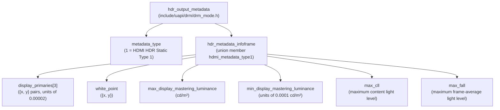
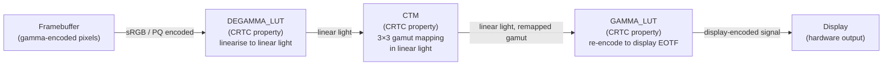
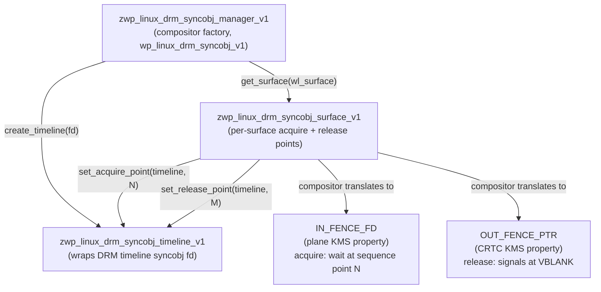
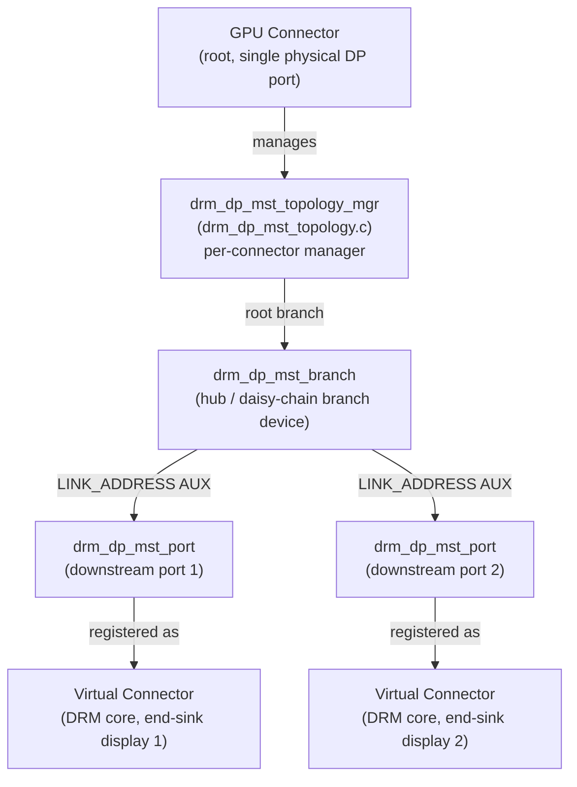

# Chapter 3: Advanced Display Features

> **Part**: Part I — The Kernel Layer
> **Audience**: Both — systems developers implementing KMS properties in drivers and compositors; application developers understanding the hardware capabilities their frame pipeline must accommodate
> **Status**: First draft — 2026-06-06

## Table of Contents

- [Overview](#overview)
- [1. Variable Refresh Rate: FreeSync, G-Sync, and Adaptive Sync](#1-variable-refresh-rate-freesync-g-sync-and-adaptive-sync)
- [2. HDR: Hardware Reality and the KMS Model](#2-hdr-hardware-reality-and-the-kms-model)
- [3. The KMS Colour Management Pipeline](#3-the-kms-colour-management-pipeline)
- [4. Explicit Synchronisation: The Problem and the Solution](#4-explicit-synchronisation-the-problem-and-the-solution)
- [5. Content Protection: HDCP in KMS](#5-content-protection-hdcp-in-kms)
- [6. DisplayPort Multi-Stream Transport (MST)](#6-displayport-multi-stream-transport-mst)
- [7. Putting It Together: Multi-Feature Interaction](#7-putting-it-together-multi-feature-interaction)
- [Integrations](#integrations)
- [References](#references)

---

## Overview

Chapter 2 established the KMS atomic commit mechanism as the canonical way to reconfigure display hardware: properties are staged onto state objects, constraints are validated during `atomic_check`, and changes are applied atomically on a VBLANK boundary. That foundation is necessary but not sufficient for the display pipelines that ship in 2024–2026 hardware. Modern compositors and the games and media applications they host require variable refresh rates for judder-free rendering, wide-gamut HDR output for content that exceeds the traditional sRGB envelope, precision colour pipelines for accurate reproduction on profiled displays, race-free GPU-to-display synchronisation that works across incompatible driver stacks, content protection for premium media, and the ability to drive independent monitors from a single DisplayPort cable via Multi-Stream Transport. Every one of these capabilities follows the same KMS pattern introduced in Chapter 2 — new atomic properties, new blob formats, new driver callbacks — but each carries its own hardware model, its own failure modes, and its own cross-stack story that reaches from the kernel into compositor policy and application APIs.

This chapter is organised around the problems each feature solves rather than alphabetically by feature name. Variable refresh rate eliminates the stutter that arises when GPU frame time does not align with a fixed display interval. HDR and colour management deliver images whose luminance, gamut, and transfer function match the creative intent. Explicit synchronisation resolves the fundamental race that occurs when the GPU and display engines on different vendors' hardware cannot share fence state through the common DMA-BUF implicit fence system. HDCP restricts content presentation to authorised displays. MST multiplexes several independent video streams over a single DP physical link. In each case the chapter traces the feature from its hardware reality through the KMS abstraction and into the protocols that expose it to compositors and applications.

After working through this chapter, a driver author can implement VRR, HDR colour management, and explicit sync support in a DRM driver and have each feature integrate correctly with the atomic commit infrastructure. A compositor author understands which Wayland protocols map to which KMS properties and what policy decisions remain their responsibility rather than the kernel's. An application developer understands which Vulkan extensions and Wayland protocol interfaces feed the KMS properties described here, and which pieces are still stabilising.

---

## 1. Variable Refresh Rate: FreeSync, G-Sync, and Adaptive Sync

A conventional display is driven at a fixed refresh rate — 60 Hz, 144 Hz, or any other rate that was negotiated at link establishment. The display controller counts down a fixed VBLANK interval, starts scanning out the next frame whether or not a new buffer has arrived, and repeats. When a GPU renders frames at a rate that is not a whole-number multiple of the display rate, the result is *judder*: some frames are displayed for two refresh periods and others for one, producing an irregular cadence that is perceptible as stuttering even at frame rates that average well above the display refresh. Variable refresh rate (VRR) is the hardware mechanism that lets the display hold its current frame until the GPU signals that the next one is ready, within a manufacturer-specified refresh-rate window. The display stretches or compresses the VBLANK interval accordingly, and the photons arrive in lock-step with the rendered pixels.

Three distinct hardware families implement VRR. DisplayPort Adaptive-Sync is the VESA standard, introduced in DP 1.4, that uses a variable-length VBLANK period: the source signals the end of the active video line and then holds the link in a blank state until it is ready to clock out the next frame. HDMI 2.1 VRR uses a different negotiation path but achieves the same effect; HDMI VRR capability is separately advertised in the EDID. AMD markets its DP Adaptive-Sync and HDMI VRR support under the FreeSync brand; NVIDIA certifies compatible displays as G-Sync Compatible, using standard DP Adaptive-Sync rather than proprietary hardware. The G-Sync hardware module — NVIDIA's older proprietary solution — uses out-of-band DP signalling that the open-source stack cannot replicate, so only G-Sync Compatible monitors (those that have passed NVIDIA's adaptive sync conformance testing) work with the open-source graphics stack.

KMS exposes VRR through two atomic properties. The `vrr_capable` connector property is read-only and set by the driver after parsing the EDID and, for DisplayPort outputs, the DPCD capability registers. The display's minimum and maximum refresh rate are captured in `drm_display_info.monitor_range`, derived from the EDID CEA-861 timing block. Compositors read `vrr_capable` to discover whether the connected display supports VRR at all before attempting to enable it. The `VRR_ENABLED` CRTC property is a boolean the compositor writes to request VRR activation on a given output; drivers attach it via `drm_mode_crtc_attach_vrr_enabled_property()`. The corresponding state field is `drm_crtc_state.vrr_enabled`. During `atomic_check`, the driver validates that the requested display mode's nominal refresh falls within the supported range; if the compositor has enabled VRR but the mode is outside the window, `atomic_check` must return `-EINVAL`. On AMD hardware this validation is in `amdgpu_dm_atomic_check()` in `drivers/gpu/drm/amd/display/amdgpu_dm/amdgpu_dm.c`. The `VRR_ENABLED` CRTC property arrived in kernel 5.0 for AMD hardware and kernel 5.2 for Intel.

When VRR is active, the CRTC does not fire the VBLANK interrupt at the end of the fixed interval; instead it waits for the compositor to submit the next atomic commit containing a new framebuffer. The GPU scheduler, via the DMA fence attached to that framebuffer, signals that the render is complete, and scanout begins. The net effect is that the display's effective refresh rate follows the GPU's frame delivery rate, bounded between the display's minimum and maximum supported rates. Below the minimum rate (typically 40–48 Hz for most consumer panels) the display must use frame doubling or revert to fixed-rate behaviour, which is why applications should still target rates above the VRR floor.

One hardware quirk that compositors must accommodate: on some platforms, VRR cannot remain active while a hardware cursor plane is enabled. The asynchronous cursor position updates that the hardware cursor plane delivers would introduce phase errors into the variable VBLANK timing. KWin and gamescope handle this by falling back to software cursor rendering when VRR is active on an output. This fallback must be implemented explicitly; failing to do so produces visible cursor tearing or jitter.

The relationship between VRR and application frame pacing is mediated by the `wp_presentation` Wayland protocol (for feedback on when a specific buffer was displayed) and the `wp_tearing_control_v1` protocol, which allows applications to opt into *tearing* — submitting frames without waiting for a VBLANK boundary at all — for the absolute minimum input-to-photon latency in competitive gaming scenarios. Tearing mode and VRR mode are complementary: an application using `wp_tearing_control_v1` with `VSYNC` hint `none` can submit frames as fast as the GPU produces them; the compositor relays this intent to KMS and the display presents each frame as it arrives, accepting tearing across the scan-out boundary in exchange for eliminating the VBLANK-wait latency.

### Code example: Setting VRR_ENABLED in an atomic commit

```c
/* Source: illustrative compositor code; structs from include/uapi/drm/drm_mode.h
 * and libdrm headers. Extends the atomic commit pattern from Chapter 2. */
#include <xf86drm.h>
#include <xf86drmMode.h>

int compositor_enable_vrr(int drm_fd, uint32_t crtc_id, uint32_t conn_id,
                          drmModeAtomicReq *req)
{
    drmModeObjectProperties *conn_props =
        drmModeObjectGetProperties(drm_fd, conn_id, DRM_MODE_OBJECT_CONNECTOR);

    /* First verify the display is capable */
    uint64_t vrr_capable = 0;
    for (uint32_t i = 0; i < conn_props->count_props; i++) {
        drmModePropertyRes *prop =
            drmModeGetProperty(drm_fd, conn_props->props[i]);
        if (strcmp(prop->name, "vrr_capable") == 0)
            vrr_capable = conn_props->prop_values[i];
        drmModeFreeProperty(prop);
    }
    drmModeFreeObjectProperties(conn_props);

    if (!vrr_capable)
        return -ENOTSUP;  /* fall back to fixed-rate scanout */

    /* Find the VRR_ENABLED CRTC property and set it */
    drmModeObjectProperties *crtc_props =
        drmModeObjectGetProperties(drm_fd, crtc_id, DRM_MODE_OBJECT_CRTC);
    for (uint32_t i = 0; i < crtc_props->count_props; i++) {
        drmModePropertyRes *prop =
            drmModeGetProperty(drm_fd, crtc_props->props[i]);
        if (strcmp(prop->name, "VRR_ENABLED") == 0)
            drmModeAtomicAddProperty(req, crtc_id,
                                     crtc_props->props[i], 1 /* enable */);
        drmModeFreeProperty(prop);
    }
    drmModeFreeObjectProperties(crtc_props);
    return 0;
}
```

---

## 2. HDR: Hardware Reality and the KMS Model

High Dynamic Range display operates on three interrelated axes that are worth holding separately in mind before examining the KMS abstractions: luminance range, colour gamut, and bit depth. Standard dynamic range (SDR) targets a peak display luminance of approximately 100 cd/m² (nits); HDR10 targets 1,000 cd/m² or higher for specular highlights, with a black floor several orders of magnitude lower. The wider luminance window requires a transfer function that can express values across that range without visible banding — ST.2084 (the Perceptual Quantizer, or PQ curve) is the standard for HDR10, designed so that equal steps in the encoded value correspond to equal perceptual steps in brightness. HLG (Hybrid Log-Gamma) is the broadcast HDR standard, designed to be backward-compatible with SDR displays. At the colour level, HDR content is typically mastered in BT.2020, a colour space that contains roughly 76% of the visible colour gamut (versus about 35% for sRGB). Faithfully reproducing HDR content therefore requires a 10-bit-per-component signal path minimum to avoid banding, a BT.2020-capable display primary set, and a display that can actually achieve the luminance range.

KMS exposes HDR capabilities through a cluster of properties introduced primarily in kernel 5.2. The `hdr_output_metadata` connector property carries a blob whose content is `struct hdr_output_metadata`, defined in `include/uapi/drm/drm_mode.h`. The outer struct holds a `metadata_type` field (set to 1 for HDMI HDR Static Metadata Type 1, defined in CTA-861.3) and a union whose first and currently only member is `struct hdr_metadata_infoframe`. The infoframe struct contains the display's colour primaries as three `{x, y}` pairs of `__u16` values encoded in units of 0.00002 (so the value 0xC350 = 50,000 represents 1.0000 in CIE chromaticity), the white point in the same encoding, `max_display_mastering_luminance` in cd/m² as a 16-bit integer, `min_display_mastering_luminance` in units of 0.0001 cd/m², `max_cll` (maximum content light level, cd/m²), and `max_fall` (maximum frame-average light level, cd/m²). The driver receives this blob, validates it during `atomic_check`, and during `atomic_commit` packages it into an HDMI InfoFrame of type 0x87 or a DP Secondary Data Packet, which the display uses to switch its internal EOTF processing and adapt its tone mapping.



The `max bpc` connector property requests a minimum output bit depth. Drivers negotiate the actual bit depth against the link bandwidth available from the encoder and the cable. At DP HBR3 with DSC (Display Stream Compression) disabled, a 4K@60Hz HDR stream requires roughly 18 Gbps of raw bandwidth, which exceeds DP 1.4's 32.4 Gbps HBR3 link at 10 bits per component only with colour subsampling or DSC. The `colorspace` connector property selects the output colour space interpretation — values include `BT2020_RGB`, `BT2020_YCC`, `DCI-P3_RGB_D65`, and the traditional `Default` (sRGB). The compositor must set this to match the content it is presenting.

### Code example: HDR metadata blob construction

```c
/* Source: illustrative compositor code; structs from
 * include/uapi/drm/drm_mode.h (struct hdr_output_metadata,
 * struct hdr_metadata_infoframe) */
#include <xf86drm.h>
#include <xf86drmMode.h>
#include <drm_mode.h>  /* for hdr_output_metadata */

static int set_hdr_output_metadata(int drm_fd, uint32_t conn_id,
                                   drmModeAtomicReq *req,
                                   uint32_t hdr_metadata_prop_id)
{
    struct hdr_output_metadata meta = {0};
    meta.metadata_type = 1;  /* HDMI HDR Static Metadata Type 1 */

    struct hdr_metadata_infoframe *inf = &meta.hdmi_metadata_type1;

    /* EOTF: 0=SDR gamma, 1=HDR gamma, 2=ST.2084 (PQ), 3=HLG */
    inf->eotf = 2;    /* ST.2084 PQ for HDR10 */
    inf->metadata_type = 0;  /* Static Metadata Type 1 descriptor */

    /* BT.2020 primary chromaticities in units of 0.00002.
     * Red: (0.708, 0.292), Green: (0.170, 0.797), Blue: (0.131, 0.046) */
    inf->display_primaries[0].x = 35400;  /* Red x = 0.708 */
    inf->display_primaries[0].y = 14600;  /* Red y = 0.292 */
    inf->display_primaries[1].x =  8500;  /* Green x = 0.170 */
    inf->display_primaries[1].y = 39850;  /* Green y = 0.797 */
    inf->display_primaries[2].x =  6550;  /* Blue x = 0.131 */
    inf->display_primaries[2].y =  2300;  /* Blue y = 0.046 */

    /* D65 white point: (0.3127, 0.3290) */
    inf->white_point.x = 15635;
    inf->white_point.y = 16450;

    inf->max_display_mastering_luminance = 1000; /* 1000 cd/m² peak  */
    inf->min_display_mastering_luminance = 50;   /* 0.005 cd/m² black */
    inf->max_cll  = 1000;  /* maximum content light level */
    inf->max_fall = 400;   /* maximum frame-average light level */

    uint32_t blob_id = 0;
    drmModeCreatePropertyBlob(drm_fd, &meta, sizeof(meta), &blob_id);
    drmModeAtomicAddProperty(req, conn_id, hdr_metadata_prop_id, blob_id);

    /* Blobs are reference-counted; destroy our reference after the commit */
    drmModeDestroyPropertyBlob(drm_fd, blob_id);
    return 0;
}
```

A critical point that confuses application developers: the kernel has no tone mapping logic. When the compositor sets `hdr_output_metadata`, it is telling the display hardware what the content's luminance and gamut characteristics are, so the display can adapt its own processing. The display's firmware then decides how to map those values onto its panel. The kernel's role is strictly metadata passthrough and bit-depth negotiation. The compositor is responsible for all tone mapping decisions — including the crucial SDR-to-HDR path and HDR-to-SDR fallback. Misunderstanding this is the most common source of developer confusion about HDR on Linux.

The SDR-to-HDR path arises when an SDR application (targeting 100 cd/m², sRGB) is composited onto an HDR output. Without intervention, the 100 cd/m² SDR signal mapped naively into a 1,000 cd/m² display range appears washed out and dim. The compositor must apply a tone expansion curve and gamut expansion (BT.709 to the display's wider gamut) to lift the SDR signal into the HDR range in a perceptually plausible way. Gamescope, Valve's game compositor for Steam Deck, implements the most complete public Linux implementation of this path in `src/color_helpers.cpp`. The HDR-to-SDR path — needed when an HDR source must be shown on an SDR output — requires a tone mapping operator that compresses highlights into the SDR range, an inherently lossy transformation. Gamescope uses a PQ rolloff approach; other compositors implement variants of the ACES filmic curve or the Reinhard operator.

Hardware driver support for HDR is uneven. The amdgpu driver exposes the most complete hardware pipeline: from RDNA2 (Navi21) onwards, the DCN3.0 display engine provides dedicated colour processing blocks (`MPC` and per-plane `DPP` blocks) with full 16-bit internal precision; `amdgpu_dm_color.c` maps KMS colour properties to DC (Display Core) hardware programming. Intel's i915/xe driver supports HDR metadata passthrough from Ice Lake; Tiger Lake (Gen 12 display engine) adds a multi-segmented gamma curve via the `GAMMA_MODE` register; Xe2 (Lunar Lake) adds full per-plane colour pipelines. Nouveau currently supports HDR metadata passthrough but does not expose hardware tone mapping; the compositor must perform all tone mapping in GPU shader code. On Raspberry Pi (vc4), there is no hardware HDR pipeline at all.

---

## 3. The KMS Colour Management Pipeline

Accurate colour reproduction on a real display requires accounting for two classes of imperfection: the display's physical colour gamut (which primaries it can actually reproduce and how they relate to the standardised reference gamut) and its tone reproduction curve (how input code values map to emitted luminance). The KMS colour management pipeline expresses the correction for both through three hardware stages that are present in most modern display controllers.

The first stage is the *degamma* LUT: a one-dimensional lookup table, set via the `DEGAMMA_LUT` CRTC property, that converts encoded pixel values from the framebuffer into a linear-light representation. Framebuffers are almost always gamma-encoded (sRGB's approximate gamma 2.2 or the exact sRGB piecewise curve), and the mathematical operations in the subsequent stages must be performed in linear light to give correct results. The second stage is the Colour Transform Matrix (CTM): a 3×3 matrix, set via the `CTM` CRTC property, applied in linear light to each pixel's RGB triple. It is stored as `struct drm_color_ctm`, an array of nine `__u64` values in S31.32 signed fixed-point format (bit 63 is the sign, bits 62:32 are the integer part, bits 31:0 are the fractional part). The CTM is the mechanism for gamut mapping: a BT.709-to-BT.2020 conversion is a well-known 3×3 matrix that can be programmed here. The third stage is the *gamma* LUT: a one-dimensional lookup table, set via the `GAMMA_LUT` CRTC property, that converts linear light back to the encoded signal expected by the display's own EOTF. Together, these three stages implement the ICC matrix/TRC profile model in hardware.



The LUT data type for both `DEGAMMA_LUT` and `GAMMA_LUT` is an array of `struct drm_color_lut` entries, also defined in `include/uapi/drm/drm_mode.h`. Each entry contains `red`, `green`, `blue`, and `reserved` fields, all `__u16`. The hardware-specific LUT sizes are exposed as read-only CRTC properties: `GAMMA_LUT_SIZE` and `DEGAMMA_LUT_SIZE`. Typical values are 256 entries for older hardware and 4,096 entries for modern display engines. The driver registers these properties by calling `drm_crtc_enable_color_mgmt()` in `drivers/gpu/drm/drm_color_mgmt.c`, which attaches all five properties (`DEGAMMA_LUT`, `CTM`, `GAMMA_LUT`, `GAMMA_LUT_SIZE`, `DEGAMMA_LUT_SIZE`) to the CRTC.

### Code example: Degamma LUT for sRGB-to-linear conversion

```c
/* Source: illustrative compositor code; structs from include/uapi/drm/drm_mode.h */
#include <math.h>
#include <stdlib.h>
#include <drm_mode.h>  /* struct drm_color_lut */

static uint32_t build_srgb_degamma_lut(int drm_fd, uint32_t lut_size)
{
    struct drm_color_lut *lut = calloc(lut_size, sizeof(*lut));

    for (uint32_t i = 0; i < lut_size; i++) {
        double u = (double)i / (lut_size - 1);   /* normalised input [0,1] */

        /* sRGB piecewise linearisation */
        double linear = (u <= 0.04045)
            ? u / 12.92
            : pow((u + 0.055) / 1.055, 2.4);

        /* Scale to uint16 range (0xFFFF = 1.0) */
        uint16_t v = (uint16_t)(linear * 65535.0 + 0.5);
        lut[i].red = lut[i].green = lut[i].blue = v;
    }

    uint32_t blob_id = 0;
    drmModeCreatePropertyBlob(drm_fd, lut,
                              lut_size * sizeof(struct drm_color_lut),
                              &blob_id);
    free(lut);
    return blob_id;
}
```

### Code example: CTM for BT.709 to BT.2020 gamut mapping

```c
/* Source: illustrative compositor code; struct drm_color_ctm from
 * include/uapi/drm/drm_mode.h; matrix values from ITU-R BT.2087 */
#include <drm_mode.h>   /* struct drm_color_ctm */
#include <stdint.h>

/* Convert a double coefficient to S31.32 fixed-point (sign + 63-bit value).
 * The sign bit is bit 63; the high 31 bits are integer; the low 32 are
 * fractional. Negative values use sign-magnitude, not two's complement. */
static uint64_t to_s31_32(double v)
{
    uint64_t sign = (v < 0) ? (1ULL << 63) : 0;
    double   magnitude = fabs(v);
    /* Scale fractional part: 2^32 units per 1.0 */
    uint64_t fixed = (uint64_t)(magnitude * (1ULL << 32));
    return sign | fixed;
}

static uint32_t build_bt709_to_bt2020_ctm(int drm_fd)
{
    /* BT.709 to BT.2020 colour conversion matrix (ITU-R BT.2087-0).
     * Row-major, applied as: [R' G' B']_bt2020 = M * [R G B]_bt709  */
    static const double m[3][3] = {
        { 0.6274040,  0.3292820,  0.0433136 },
        { 0.0690970,  0.9195400,  0.0113612 },
        { 0.0163916,  0.0880132,  0.8955950 },
    };

    struct drm_color_ctm ctm;
    for (int row = 0; row < 3; row++)
        for (int col = 0; col < 3; col++)
            ctm.matrix[row * 3 + col] = to_s31_32(m[row][col]);

    uint32_t blob_id = 0;
    drmModeCreatePropertyBlob(drm_fd, &ctm, sizeof(ctm), &blob_id);
    return blob_id;
}
```

The ICC profile use case makes this pipeline concrete. A compositor obtains the display's ICC profile from colord (via its D-Bus API) or from a path specified at configuration time. ICC profiles are stored in `/var/lib/colord/icc/`. The compositor then uses the lcms2 library (Little CMS 2) to extract the display's tone reproduction curve for the degamma LUT, the chromatic adaptation matrix for the CTM blob, and the display's encoding curve for the gamma LUT. The key lcms2 functions are `cmsOpenProfileFromFile()` to load the profile, `cmsReadTag()` with tag `cmsSigRedTRCTag` (and green/blue equivalents) to retrieve the tone reproduction curves, and `cmsEvalToneCurveFloat()` to sample them. For the matrix, `cmsReadTag(hProfile, cmsSigRedColorantTag)` returns the primary chromaticities, from which the chromatic adaptation matrix to the display's white point is computed. lcms2 version 2.13 or later is required for complete ICC v4 support. KWin, Mutter, and wlroots all use lcms2 for these computations.

An important limitation constrains the KMS colour pipeline: it implements the *matrix/TRC* class of ICC profiles precisely — profiles that are fully characterised by a 3×3 matrix and 1D tone reproduction curves. Profiles with full 3D LUT tables (A2B/B2A tables in ICC terminology) cannot be accurately applied through the KMS pipeline because KMS exposes only 1D LUTs and a 3×3 CTM. There is no KMS 3D LUT property in the upstream kernel. Compositors targeting colour-critical workflows must fall back to a GPU render pass for profiles with 3D A2B tables.

Per-plane colour correction is a newer capability, still stabilising as of kernel 6.x. Plane-level `DEGAMMA_LUT`, `CTM`, and `GAMMA_LUT` properties allow each composited layer to be independently colour-corrected before blending. This is the hardware primitive required for mixed SDR/HDR desktop compositing, where a BT.709 SDR window and a PQ HDR window must both be colour-converted to the display's native colour space before they can be blended together. Intel Xe2 (Lunar Lake and later) and AMD DCN3.x display engines support per-plane colour correction; other hardware requires a GPU render pass to achieve the same result.

The `wp_color_management_v1` Wayland protocol is the compositor-facing interface that exposes these KMS colour capabilities to Wayland clients. The protocol was merged into the staging area of wayland-protocols in February 2025 (wayland-protocols 1.41) and was adopted by Mutter/GNOME 48 in March 2025. KWin, wlroots, and Weston are at various stages of implementation. The protocol allows clients to attach a colour space description (as an ICC profile or a named colour space tag) to a `wl_surface`, which the compositor uses to select the appropriate plane colour pipeline or GPU conversion path. The compositor-side implementation of this protocol, and the full integration with lcms2 and colord, is covered in depth in Chapter 22.

### Colour Representation: wp_color_representation_v1

`wp_color_management_v1` defines the colour *space* that a surface's pixels inhabit. A companion protocol, `wp_color_representation_v1`, defines the colour *encoding* — how YCbCr video frames are encoded as digital values before they reach the compositor. Without both protocols, a compositor cannot correctly display HDR video received from a media player through a Wayland surface.

`wp_color_representation_v1` was proposed alongside `wp_color_management_v1` in the wayland-protocols staging area and addresses three distinct encoding attributes:

**Colour matrix (YCbCr to RGB conversion):** Video decoders produce YCbCr frames using one of several standardised conversion matrices. The protocol encodes the choice as an enum:

- `COEFFICIENTS_BT601`: SDTV/DVD, used for SD content
- `COEFFICIENTS_BT709`: HDTV, the default for most HD and 1080p content
- `COEFFICIENTS_BT2020`: Ultra HD and HDR10 content; wider colour gamut coefficients

Without this information, a compositor that defaults to BT.709 will produce subtly incorrect colours when fed BT.601 content — the skin-tone hue shift is typically the first visible artefact.

**Chroma range (full vs. limited):** Video encoding historically clips luma to 16–235 and chroma to 16–240 (limited range / "studio swing"), reserving headroom for transmission sync signals. Computer-generated content typically uses the full 0–255 range. A mismatch causes crushed blacks and clipped whites. The protocol's `RANGE_FULL` and `RANGE_LIMITED` enum values let the client (e.g., a media player) inform the compositor of the frame's range so that the compositor's KMS plane or GPU conversion path applies the correct expansion.

**Chroma siting:** In subsampled formats (YUV 4:2:0, YUV 4:2:2), chroma samples do not co-locate with luma samples. MPEG-2 cositing places the chroma sample vertically aligned with the top luma row; H.264/AVC and H.265/HEVC default to interstitial chroma siting. The `wp_color_representation_v1::chroma_location` enum exposes common siting positions (`COSITED_TOP`, `MIDPOINT`, etc.) that map directly to the `VkChromaLocation` enum in Vulkan and the `V4L2_YCBCR_ENC_*` flags in the V4L2 kernel API.

**Protocol interaction with wp_color_management_v1:** The two protocols are attached separately to a `wl_surface`. A video player that produces a BT.2020 HDR10 frame would:

1. Create a `wp_color_management_surface_v1` and set the colour space to `PRIMARIES_BT2020`, transfer function `TF_ST2084_PQ` (via `wp_color_management_v1`).
2. Create a `wp_color_representation_surface_v1` and set `COEFFICIENTS_BT2020`, `RANGE_LIMITED`, chroma siting per the codec standard.

The compositor's KMS implementation then programs the plane's DEGAMMA, CTM, and GAMMA registers (Section 3.3) using the matrix coefficients and range flags from both protocols together, applying a complete BT.2020 PQ → display-native colour pipeline on the hardware scan-out plane — typically with zero GPU involvement.

The kernel-side support for these flags is exposed through the same `drm_color_lut` and `drm_ctm` blobs described in Section 3.2, but hardware YCbCr-to-RGB conversion is implemented as an additional fixed-function stage (CSC — colour space converter) in newer AMD DCN and Intel Xe display engines. The kernel DRM `COLOR_RANGE` and `COLOR_ENCODING` plane properties (introduced in Linux 4.20) are the KMS interface for these flags:

```c
/* kernel: drivers/gpu/drm/drm_color_mgmt.c */
drm_plane_create_color_properties(plane,
    BIT(DRM_COLOR_YCBCR_BT601) | BIT(DRM_COLOR_YCBCR_BT709) |
    BIT(DRM_COLOR_YCBCR_BT2020),
    BIT(DRM_COLOR_YCBCR_LIMITED_RANGE) | BIT(DRM_COLOR_YCBCR_FULL_RANGE),
    DRM_COLOR_YCBCR_BT709, DRM_COLOR_YCBCR_LIMITED_RANGE);
```

[Source: `drivers/gpu/drm/drm_color_mgmt.c`, `drm_plane_create_color_properties()`](https://github.com/torvalds/linux/blob/master/drivers/gpu/drm/drm_color_mgmt.c)

The wayland-protocols staging specification for `wp_color_representation_v1` is tracked at [wayland-protocols staging](https://gitlab.freedesktop.org/wayland/wayland-protocols/-/tree/main/staging/color-representation). As of early 2025 the protocol was under active review with KWin and Mutter targeted as first adopters.

---

## 4. Explicit Synchronisation: The Problem and the Solution

Every buffer handoff across subsystem boundaries requires a synchronisation guarantee: the producer must signal that it has finished writing before the consumer reads, and the consumer must signal that it has finished reading before the producer reuses the buffer. Within the Linux DRM subsystem, this handoff has traditionally been handled by implicit fences embedded in the DMA-BUF itself: the GPU driver attaches a `dma_fence` to the buffer before handing it to the display, and the display controller waits for that fence to signal before scanning out. This implicit fence model works cleanly within a single vendor's driver stack because the GPU and display drivers cooperate through the shared `dma_fence` infrastructure.

NVIDIA's proprietary driver does not participate in the Linux `dma_fence` implicit fence system. Buffers returned to a Wayland compositor from NVIDIA's EGL or Vulkan implementation may carry no attached `dma_fence`; from the kernel's perspective, the buffer has an unresolved write dependency. The compositor cannot determine when NVIDIA's GPU has finished rendering into the buffer before passing it to KMS for scanout. The result is visible corruption: partial frames, flicker, and out-of-order scanout — the set of issues that earned NVIDIA's proprietary driver a prolonged negative reputation for Wayland reliability.

The engineering solution is explicit synchronisation: both the acquire fence (signal that the producer's GPU work is complete) and the release fence (signal that the consumer is done with the buffer) are passed explicitly as file descriptors through dedicated APIs, bypassing the in-kernel implicit fence path entirely.

The kernel object that carries an explicit fence is the DRM sync object (`struct drm_syncobj`, implemented in `drivers/gpu/drm/drm_syncobj.c`). A sync object is created via `DRM_IOCTL_SYNCOBJ_CREATE` and exported as a file descriptor via `DRM_IOCTL_SYNCOBJ_HANDLE_TO_FD`; the reverse import uses `DRM_IOCTL_SYNCOBJ_FD_TO_HANDLE`. The binary sync object model holds a single fence; it can be waited on with `DRM_IOCTL_SYNCOBJ_WAIT`. The *timeline* sync object — introduced in kernel 5.2 — is more powerful: it holds an ordered sequence of fences, each associated with a 64-bit sequence point. The timeline can be waited at any sequence point independently, enabling N-frame lookahead pipelines without pipeline stalls. Timeline sync objects are waited on with `DRM_IOCTL_SYNCOBJ_TIMELINE_WAIT`. The kernel driver capability flag for timeline sync objects is `DRIVER_SYNCOBJ_TIMELINE`, introduced alongside the feature in kernel 5.2; Chapter 1 lists this capability flag in context.

At the KMS layer, two atomic properties expose explicit sync to compositors. The `IN_FENCE_FD` plane property accepts a sync file file descriptor; KMS waits for that fence to signal before scanning out from the plane's associated framebuffer. The `OUT_FENCE_PTR` CRTC property accepts a pointer to a `uint64_t` cast to `u64`; KMS writes a sync file fd to that location, and that fd signals at the VBLANK when the atomic commit takes effect. Both properties were added in kernel 4.9. Together they provide a complete acquire/release fence pair for every KMS frame without requiring implicit fences.

### Code example: DRM syncobj creation, export, and use in an atomic commit

```c
/* Source: illustrative compositor code; ioctls from include/uapi/drm/drm.h
 * and include/uapi/linux/sync_file.h; see also drm_syncobj.c */
#include <xf86drm.h>
#include <drm/drm.h>
#include <drm/drm_syncobj.h>

/* Create a timeline syncobj and get its fd */
static int create_syncobj_fd(int drm_fd, uint32_t *out_handle, int *out_fd)
{
    struct drm_syncobj_create args = { .flags = DRM_SYNCOBJ_CREATE_SIGNALED };
    if (drmIoctl(drm_fd, DRM_IOCTL_SYNCOBJ_CREATE, &args) < 0)
        return -errno;
    *out_handle = args.handle;

    struct drm_syncobj_handle h2fd = {
        .handle = args.handle,
        .flags  = DRM_SYNCOBJ_HANDLE_TO_FD_FLAGS_EXPORT_SYNC_FILE,
    };
    /* Export as a sync_file fd usable as IN_FENCE_FD */
    if (drmIoctl(drm_fd, DRM_IOCTL_SYNCOBJ_HANDLE_TO_FD, &h2fd) < 0)
        return -errno;
    *out_fd = h2fd.fd;
    return 0;
}

/* In the atomic commit, wire up IN_FENCE_FD and OUT_FENCE_PTR */
static int commit_frame_with_fences(int drm_fd, uint32_t plane_id,
                                    uint32_t crtc_id, int acquire_fence_fd,
                                    uint32_t in_fence_prop,
                                    uint32_t out_fence_prop)
{
    drmModeAtomicReq *req = drmModeAtomicAlloc();

    /* Acquire fence: KMS waits for GPU rendering to complete */
    drmModeAtomicAddProperty(req, plane_id, in_fence_prop, acquire_fence_fd);

    /* Release fence: pointer to where KMS will write the vblank sync fd */
    int64_t out_fence_fd = -1;
    drmModeAtomicAddProperty(req, crtc_id, out_fence_prop,
                             (uint64_t)(uintptr_t)&out_fence_fd);

    int ret = drmModeAtomicCommit(drm_fd, req,
                                  DRM_MODE_ATOMIC_NONBLOCK, NULL);
    drmModeAtomicFree(req);

    /* out_fence_fd now contains a sync file fd that signals at VBLANK */
    if (ret == 0 && out_fence_fd >= 0)
        close(out_fence_fd);   /* compositor signals release to client here */
    return ret;
}
```

The Wayland protocol that carries this machinery from compositor to application is `wp_linux_drm_syncobj_v1`, merged into wayland-protocols 1.32 in 2023. The protocol factory interface `zwp_linux_drm_syncobj_manager_v1` is advertised by the compositor. Clients wrap a DRM timeline syncobj file descriptor in a `zwp_linux_drm_syncobj_timeline_v1` object, and attach per-surface acquire and release points via `zwp_linux_drm_syncobj_surface_v1`. The acquire point carries the sequence number the compositor should wait on before compositing the client's buffer; the release point carries the sequence number the compositor signals when it is finished with the buffer. The compositor translates these points into `IN_FENCE_FD` and `OUT_FENCE_PTR` values on the KMS atomic commit.



This protocol closed the NVIDIA Wayland problem. NVIDIA's driver can export a timeline syncobj fence representing GPU work completion via `VK_EXT_external_semaphore_fd`, satisfying the acquire fence the compositor waits on — without any implicit `dma_fence` participation. NVIDIA's proprietary driver added this support in driver version 555.58, released as stable in June 2024. Mutter (GNOME) and KWin (Plasma) both added `wp_linux_drm_syncobj_v1` compositor support through 2024, in time to coincide with the NVIDIA 555 driver family. Mesa's RADV and ANV Vulkan drivers produce explicit fences via Vulkan external semaphores in a parallel path; the chapter's coverage of those drivers is in Chapter 18.

It is worth being explicit about a common misconception: explicit sync does not eliminate implicit sync for drivers that already support it. Mesa-based drivers continue to use implicit `dma_fence` internally for their own queue management. Explicit sync is a bridge to the one significant production driver — NVIDIA's — that cannot participate in implicit fence sharing. The two mechanisms coexist in the kernel: compositors that support both will use implicit fences with Mesa-based clients and explicit fences with NVIDIA clients, depending on what the client exposes.

A second common conflation is between **explicit sync** and **EGLStreams removal**. EGLStreams (`EGL_NV_stream_producer_d3d_texture`, `EGLDevice`) was an NVIDIA-proprietary Wayland buffer-sharing mechanism from the pre-GBM era: the compositor and the NVIDIA driver communicated through an NVIDIA-specific stream rather than `linux-dmabuf`. GNOME 51 (2025) removed EGLStreams support from Mutter entirely, as the mechanism is superseded by GBM-backed `linux-dmabuf` on all current NVIDIA configurations. Explicit sync (`wp_linux_drm_syncobj_v1`) is an entirely orthogonal mechanism that solves GPU fence propagation — it works on top of the same `linux-dmabuf` path that replaced EGLStreams. Removing EGLStreams does not remove explicit sync support; if anything, it simplifies the compositor code that implements it.

### Sequence diagram: wp_linux_drm_syncobj_v1 surface commit flow

```
Application (Vulkan/EGL)          Compositor                        KMS
        |                              |                              |
        |  wl_surface.attach(buf)      |                              |
        |----------------------------->|                              |
        |  syncobj_surface.set_acquire |                              |
        |    (timeline, point=N)       |                              |
        |----------------------------->|                              |
        |  wl_surface.commit()         |                              |
        |----------------------------->|                              |
        |                              |                              |
        |  [GPU renders into buf]      |                              |
        |  [signals timeline@N]        |                              |
        |                              |                              |
        |                              |  atomic_commit(             |
        |                              |    IN_FENCE_FD=timeline@N,  |
        |                              |    OUT_FENCE_PTR=&release)  |
        |                              |---------------------------->|
        |                              |                              |
        |                              |        [VBLANK — scanout]   |
        |                              |<--- release_fence signals --|
        |                              |                              |
        |  syncobj_surface.set_release |                              |
        |    signals point=M to app   |                              |
        |<-----------------------------|                              |
        |  [app reuses buffer]         |                              |
```

---

## 5. Content Protection: HDCP in KMS

High-bandwidth Digital Content Protection (HDCP) is the content restriction layer that premium video services require before they will transmit 4K content to a display. HDCP version 1.4 applies to DVI, HDMI, and DisplayPort links carrying resolutions up to 1080p; HDCP 2.2 is required for 4K (UHD) content. Both versions implement a cryptographic key exchange between the source (the GPU output) and the sink (the display), establishing a shared session key that encrypts the HDCP-protected content during transit. HDCP also supports *repeaters* — devices that sit between source and sink, such as AV receivers — with the topology constrained to at most 7 repeater levels and 127 downstream devices. The kernel tracks repeater topology through the HDCP device management state machine.

KMS exposes HDCP through the `Content Protection` connector property, an enumeration with three values: `Undesired` (the default; HDCP is off), `Desired` (the compositor requests HDCP be established), and `Enabled` (the kernel has completed the key exchange and the link is encrypted). Compositors write `Desired` and then poll for `Enabled`; if the key exchange fails (wrong device, revoked HDCP key, repeater topology violation), the property remains at `Desired` and the compositor must decide how to handle the failure — typically by denying playback or displaying a low-resolution fallback. The `HDCP Content Type` property provides finer-grained control: Type 0 content may be forwarded through HDCP 1.4 repeaters, while Type 1 content requires HDCP 2.2 end-to-end.

The kernel implementation lives in `drivers/gpu/drm/display/drm_hdcp.c`, which provides the `drm_hdcp_helper_funcs` callback structure that drivers implement to hook their hardware-specific authentication sequences into the generic HDCP state machine. For DisplayPort, the HDCP Authentication and Key Exchange (AKE) protocol is handled via DPCD auxiliary transactions; for HDMI, via DDC (I2C over the display data channel). A significant practical constraint affects Intel platforms: HDCP 2.2 requires the Intel Management Engine (ME) to perform the public-key portions of the AKE. The kernel can implement the state machine, but the ME firmware version must support HDCP 2.2; without a compatible ME firmware image, HDCP 2.2 will fail to authenticate even if the display is capable. This is a known gap in purely software-visible documentation.

From an architecture standpoint, HDCP is a well-defined KMS feature — implementing it requires careful state machine management and correct integration of the `drm_hdcp_helper_funcs` callbacks, but it introduces no novel architecture relative to the atomic commit model. The limitation worth noting for readers targeting security analysis: HDCP is cryptographically broken; the HDCP master key was published in 2010, and implementations that do not check revocation lists (or use stale ones) can be circumvented trivially. The Linux implementation is complete and correct given the specification, but the protection it provides is against casual capture rather than a committed adversary.

---

## 6. DisplayPort Multi-Stream Transport (MST)

DisplayPort Multi-Stream Transport (MST) solves the problem of driving multiple independent monitors from a single physical DP output port. Single-Stream Transport (SST), the baseline DP mode, dedicates the full link bandwidth to one video stream. MST divides that bandwidth into time-division multiplexed *virtual channels*, each carrying an independent video stream to a separate display. The displays are arranged in a daisy-chain or hub topology that forms a binary tree. USB-C docking stations, Thunderbolt docks, and DisplayPort MST hubs all use this mechanism to present multiple independent display outputs to the host GPU from a single physical connector.

The MST topology model maps directly to data structures in the kernel. Branch devices — hubs and daisy-chain-capable monitors — are modelled as `drm_dp_mst_branch` nodes; each branch has an arbitrary number of downstream ports. Leaf nodes — the final displays — are `drm_dp_mst_port` structures. Both types are reference-counted and live in a tree rooted at the GPU's connector. The kernel discovers the topology by walking the tree via DP AUX transactions: `LINK_ADDRESS` messages enumerate a branch's ports, `ENUM_PATH_RESOURCES` queries available bandwidth on each path, and `CONNECT_CHG` IRQs trigger topology re-discovery on hotplug events. The in-memory tree is maintained by `drm_dp_mst_topology_mgr`, the per-connector manager object that lives in `drivers/gpu/drm/display/drm_dp_mst_topology.c`. Drivers initialise it via `drm_dp_mst_topology_mgr_init()` and destroy it via `drm_dp_mst_topology_mgr_destroy()`. Each discovered end-sink port is registered with the DRM core as a virtual connector, appearing to userspace as a distinct output with its own EDID and mode list.



Bandwidth allocation is the central constraint in any MST deployment. Each DisplayPort link (in the 8b/10b encoding used by DP 1.2/1.4) has a pool of 63 time-division payload slots, with one slot reserved for the MTP (Main-stream Transport Packet) header, leaving 63 slots for video payloads. Each video stream requires a contiguous allocation of slots proportional to its bandwidth demand — the slot count for a stream is computed from its pixel rate, bit depth, and lane count, and expressed as a PBN (Payload Bandwidth Number). The function that performs this allocation in the atomic commit path is `drm_dp_atomic_find_time_slots()`, declared in `include/drm/display/drm_dp_mst_helper.h`. Note that this function was renamed from the older `drm_dp_mst_atomic_get_vcpi_slots()` (which used VCPI — Virtual Channel Payload ID — terminology) during the atomic MST rework; code references that use the old name are targeting pre-5.5 kernels. The `drm_dp_mst_atomic_check()` function validates that the sum of all stream slot allocations fits within the link's 63-slot budget; if the budget is exhausted, `atomic_check` returns `-ENOSPC` and the compositor must either reduce resolution, enable DSC (Display Stream Compression), or present fewer outputs.

### Code example: MST topology enumeration and slot budget check

```c
/* Source: illustrative driver or compositor code; API from
 * include/drm/display/drm_dp_mst_helper.h and
 * drivers/gpu/drm/display/drm_dp_mst_topology.c */
#include <drm/display/drm_dp_mst_helper.h>

static int mst_check_slot_budget(struct drm_atomic_state *state,
                                 struct drm_dp_mst_topology_mgr *mgr,
                                 struct drm_dp_mst_port *port,
                                 int pbn_required)
{
    /* drm_dp_atomic_find_time_slots() allocates slots in the topology
     * state; it returns the number of slots allocated or -ENOSPC if
     * the link budget is exhausted. */
    int slots = drm_dp_atomic_find_time_slots(state, mgr, port, pbn_required);
    if (slots == -ENOSPC) {
        /* Bandwidth exhausted: compositor must reduce mode or enable DSC */
        drm_dbg_kms(mgr->dev,
                    "MST slot budget exhausted for port %p (need %d PBN)\n",
                    port, pbn_required);
        return -ENOSPC;
    }
    if (slots < 0)
        return slots;   /* other error */

    drm_dbg_kms(mgr->dev, "Allocated %d slots for port %p\n", slots, port);
    return 0;
}
```

Driver integration follows a consistent pattern. In amdgpu, `amdgpu_dm_mst_types.c` is the bridge between the DRM MST topology manager and DC (Display Core), which manages the actual stream programming via `dc_link_dp_mst_*` functions; the topology-level slot allocation calls `drm_dp_atomic_find_time_slots()` during `amdgpu_dm_atomic_check()`. In i915/xe, `drivers/gpu/drm/i915/display/intel_dp_mst.c` implements the `intel_mst_*` encoder functions; each virtual MST port is registered as a distinct `intel_connector` and `intel_encoder` pair. MST audio follows the video streams: each end-sink's DPCD audio capability block is read during topology discovery, and the kernel exports per-port audio components to ALSA via the standard `drm_audio_component` interface.

The MST layer has well-documented failure modes. Bandwidth exhaustion is the most common: attempting to drive two 4K@60Hz 10-bit displays through a USB-C dock on a DP 1.4 HBR3 link (32.4 Gbps) without DSC exceeds the link capacity; the compositor must account for DSC compression availability when computing PBN. Hub firmware quality varies enormously: some popular Thunderbolt 3 docks with DP 1.2 MST hubs misreport topology, fail to respond to `LINK_ADDRESS` messages, or corrupt the DPCD payload table; the kernel's MST layer carries workarounds for known-broken firmware. If MST topology discovery fails entirely, the driver may fall back to SST mode and present only the first display; compositors must handle connector loss gracefully without crashing the session. Hotplug storms — rapid connect/disconnect of branch devices, which can occur when a laptop is re-docked while another device is being unplugged — are rate-limited and debounced in `drm_dp_mst_handle_hpd_irq()`. The MST topology manager core entered the kernel at version 4.1; the atomic MST rework that introduced `drm_dp_atomic_find_time_slots()` arrived in kernel 5.5, and MST DSC support in kernel 5.9.

DisplayPort Stream Compression (DSC) interacts directly with MST bandwidth budgeting. When DSC is available at a port, the PBN calculation uses the compressed bitrate rather than the raw pixel rate; this can allow configurations that would otherwise exhaust the 63-slot budget. The `drm_dp_atomic_find_time_slots()` function has DSC-aware variants for this path. For readers targeting high-resolution multi-monitor setups (such as a 5K display daisy-chained with a 4K display on a single DP 1.4 link), DSC is the enabling technology that makes such configurations fit within the slot budget, and it is worth testing on real hardware because DSC capability reporting in DPCD is not universally accurate across hub firmware generations.

---

## 7. Putting It Together: Multi-Feature Interaction

The seven features described in this chapter do not operate in isolation; compositors targeting production quality must handle all combinations simultaneously. This section traces the most important interaction surfaces.

VRR and HDR can be enabled simultaneously, and the VBLANK extension that VRR introduces must respect the HDR-compliant timing requirements of the display. Some panel firmware implementations have subtle bugs where VRR causes the HDR metadata to be reinterpreted on each extended VBLANK — gamescope works around this by re-asserting the `hdr_output_metadata` blob on every atomic commit when both features are active, a defensive practice that has no performance cost since blobs are reference-counted and the kernel detects no-change updates during `atomic_check`.

The colour management pipeline is the mechanism through which HDR tone mapping is implemented at the compositor level. When a compositor wishes to perform SDR-to-HDR tone expansion, it programs the `DEGAMMA_LUT` to linearise the SDR signal, then sets a `GAMMA_LUT` that implements the PQ EOTF for the output encoding. The `CTM` simultaneously maps from the SDR rendering colour space (BT.709) to the display's native colour space (typically BT.2020 for an HDR display). This is the three-stage pipeline running at full capacity: all three KMS colour properties active simultaneously. When per-plane colour correction is available (Intel Xe2, AMD DCN3.x), the compositor can apply SDR-to-HDR tone expansion per-layer, enabling a mixed SDR/HDR desktop where each window is individually lifted into the display's HDR luminance range without a GPU render pass.

Explicit sync interacts with VRR timing in a subtle way. Under VRR, the VBLANK does not fire at a fixed interval, so the `OUT_FENCE_PTR` fence signals at an unpredictable time relative to the wall clock. Compositors that use the `OUT_FENCE_PTR` fence to time buffer recycling must account for this variability; treating the VRR out-fence as a fixed-period heartbeat produces incorrect frame pacing. The correct pattern is to use the fence purely as a buffer-availability signal — the compositor must not reuse a buffer until the out-fence signals, regardless of when that occurs relative to the target frame time.

The `drm_atomic_check` constraint web grows with each additional feature. A commit that enables VRR must validate the refresh range; a commit that sets HDR metadata must validate the encoder's HDR capability and bit depth; a commit that sets colour LUTs must validate the LUT sizes against the hardware's `GAMMA_LUT_SIZE` and `DEGAMMA_LUT_SIZE` properties; a commit that uses `IN_FENCE_FD` must validate that the fence fd is a valid sync file. Drivers must structure their `atomic_check` to accumulate all these validations correctly, and compositors must be prepared to receive `-EINVAL` or `-ENOSPC` from any commit and fall back gracefully — disabling the feature that caused the failure rather than crashing or hanging.

End-to-end latency — the interval from an input event (keyboard press, mouse click, game controller trigger) to the corresponding photon leaving the display — is determined by the combination of VRR timing, explicit sync fence latency, and VBLANK scheduling. With VRR and explicit sync both active, the theoretical minimum is one render pass plus the display's own scanout time (typically 1–2 ms). Achieving this requires that the compositor submit the atomic commit with a valid `IN_FENCE_FD` as close as possible to the GPU work completion, that the display's VRR minimum rate not force an artificial hold, and that no implicit fence round-trip introduces an unaccounted-for delay. Gamescope on Steam Deck represents the current state of the art in achieving this on real hardware, combining gamescope's direct scanout path (bypassing the compositor's own render pass when possible), VRR on the internal eDP panel, HDR tone mapping for legacy SDR game content, and MST passthrough for dock-connected displays.

MST, colour management, and HDR can all be active simultaneously on MST-attached displays, but each MST sink has an independent set of display capabilities that the compositor must query separately. A daisy-chained configuration might have one HDR-capable display and one SDR display; the compositor must apply different colour management policies to each CRTC. The MST topology manager exposes each sink as an independent connector, and the compositor queries `vrr_capable`, `hdr_output_metadata`, `max bpc`, and colour space properties per-connector, applying the appropriate per-output policy.

---

## Integrations

**Chapter 1 (DRM Architecture Fundamentals)**: introduced `DRIVER_SYNCOBJ_TIMELINE` as a capability flag and the `drm_syncobj` object at the declaration level. This chapter fills in the operational semantics: timeline sequence points, `DRM_IOCTL_SYNCOBJ_TIMELINE_WAIT`, and the relationship between `drm_syncobj` and `dma_fence`.

**Chapter 2 (Atomic Modesetting)**: every advanced feature in this chapter is an extension of the atomic commit mechanism introduced there. The `drm_crtc_state.vrr_enabled` field, `drm_connector_state.hdr_output_metadata`, and the `IN_FENCE_FD`/`OUT_FENCE_PTR` plane/CRTC properties are all first-class atomic state. The `atomic_check` validation patterns this chapter extends are the patterns Chapter 2 established.

**Chapter 5 (USB-C and DisplayPort Alternate Mode)**: USB-C docking stations are the primary deployment vehicle for MST topologies. The USB-C DP Alt Mode negotiation — involving USBPD VDO (Vendor Defined Object) messages and DPCD capability discovery — that precedes MST discovery at the `drm_dp_mst_topology_mgr` level is covered there. A failed DP Alt Mode negotiation will prevent the MST topology manager from ever receiving valid AUX transactions.

**Chapter 9 (GSP-RM: NVIDIA's Kernel Module Architecture)**: NVIDIA's ability to export `dma_fence`-compatible timeline syncobj completion fences — the architectural underpinning of the NVIDIA Wayland explicit sync fix — was enabled by the nvidia-open kernel module providing the GSP-RM firmware path. Chapter 9 provides the architectural motivation for why nvidia-open mattered for Wayland reliability.

**Chapter 18 (Mesa Vulkan Drivers: RADV, ANV, NVK)**: the Mesa Vulkan driver side of explicit sync. RADV (AMD), ANV (Intel), and NVK (NVIDIA open) all export GPU completion as sync fds via `VK_EXT_external_semaphore_fd`. The Vulkan semaphore that `VkQueueSubmit` signals becomes the `IN_FENCE_FD` that the compositor passes to KMS. The function that drives this export in RADV is in `src/amd/vulkan/radv_cmd_buffer.c`.

**Chapter 20 (Wayland Protocol Internals)**: covers `wp_linux_drm_syncobj_v1` in full as a protocol design case study — how the protocol XML maps to generated C dispatch code, how compositor implementations of `zwp_linux_drm_syncobj_manager_v1` work, and how the acquire/release point model maps to `drmModeAtomicAddProperty` calls.

**Chapter 22 (Compositor Colour Management: KWin and Mutter)**: provides the compositor-side implementation of everything described in Section 3. The full lcms2 integration — including `cmsOpenProfileFromFile`, `cmsReadTag` for TRC extraction, and the `drm_color_lut` array construction — is shown there in the context of real KWin and Mutter source code. The complete `wp_color_management_v1` compositor implementation is also covered there.

**Chapter 24 (Vulkan Swapchains and HDR)**: `VK_EXT_hdr_metadata` and `VkHdrMetadataEXT` are the Vulkan surface-level mechanism that generates the values populated into `struct hdr_metadata_infoframe` in Section 2. `VK_EXT_swapchain_colorspace` selects the colour space that determines which `colorspace` KMS connector property value the compositor sets. The mapping between Vulkan colour space enums and KMS `colorspace` property values is enumerated there.

**Chapter 25 (GPU Compute and CUDA/ROCm interoperability)**: CUDA–Vulkan interop uses external semaphores that are conceptually and mechanically identical to the DRM syncobjs used for explicit sync here. The underlying kernel mechanism is the same `dma_fence` system; the difference is in which userspace API creates and imports the fence.

**Chapter 28 (DXVK/VKD3D-Proton and Compatibility Layers)**: DirectX games running through VKD3D-Proton benefit from both VRR and HDR when mediated by gamescope. The `gamescope --hdr-enabled` flag and VRR activation for Proton-wrapped titles are the consumer of the KMS features described here. The tone mapping path in `src/color_helpers.cpp` (gamescope) is the most complete public example of the SDR-to-HDR compositor policy described in Section 2.

**Chapter 29 (Gamescope: The Steam Deck Compositor)**: gamescope implements the full combination of VRR, HDR, MST passthrough (for dock output), and explicit sync that this chapter describes. Its `src/wlserver.cpp` and `src/drm.cpp` are the highest-fidelity reference for how all these KMS features are driven together from a production compositor.

**Chapter 31 (Conformance Testing and the Linux CTS)**: the `kms_color` test suite in IGT GPU Tools exercises DEGAMMA_LUT, CTM, and GAMMA_LUT property validation. Wayland protocol compliance for `wp_linux_drm_syncobj_v1` is tested via compositor test suites. MST bandwidth allocation is tested by IGT's `kms_dp_mst` test. These tests are the authoritative reference for corner-case behaviour in `atomic_check`.

---

## References

1. [Kernel Mode Setting (KMS) Properties](https://www.kernel.org/doc/html/latest/gpu/drm-kms.html) — Official kernel documentation for all KMS properties including VRR, HDR, colour, and sync properties; version 7.x
2. [struct hdr_output_metadata / struct hdr_metadata_infoframe in include/uapi/drm/drm_mode.h](https://elixir.bootlin.com/linux/latest/source/include/uapi/drm/drm_mode.h) — UAPI struct definitions for HDR metadata passthrough; verified location (not hdrmetadata.h)
3. [drivers/gpu/drm/drm_color_mgmt.c — colour management helpers](https://elixir.bootlin.com/linux/latest/source/drivers/gpu/drm/drm_color_mgmt.c) — drm_crtc_enable_color_mgmt(), DEGAMMA_LUT, CTM, GAMMA_LUT property registration
4. [DRM Sync Objects documentation](https://www.kernel.org/doc/html/latest/gpu/drm-mm.html#drm-sync-objects) — Kernel documentation for binary and timeline sync objects, ioctl descriptions
5. [drivers/gpu/drm/drm_syncobj.c](https://elixir.bootlin.com/linux/latest/source/drivers/gpu/drm/drm_syncobj.c) — DRM_IOCTL_SYNCOBJ_CREATE, HANDLE_TO_FD, TIMELINE_WAIT implementation
6. [wp_linux_drm_syncobj_v1 protocol XML](https://gitlab.freedesktop.org/wayland/wayland-protocols/-/blob/main/staging/linux-drm-syncobj/linux-drm-syncobj-v1.xml) — Protocol definition for explicit sync over Wayland; merged wayland-protocols 1.32 (2023)
7. [HDCP Kernel Documentation](https://www.kernel.org/doc/html/latest/gpu/drm-kms.html#high-bandwidth-digital-content-protection-hdcp) — KMS HDCP property model, state machine description
8. [drivers/gpu/drm/display/drm_hdcp.c](https://elixir.bootlin.com/linux/latest/source/drivers/gpu/drm/display/drm_hdcp.c) — HDCP authentication helpers, drm_hdcp_helper_funcs
9. [drivers/gpu/drm/display/drm_dp_mst_topology.c — MST topology manager](https://elixir.bootlin.com/linux/latest/source/drivers/gpu/drm/display/drm_dp_mst_topology.c) — drm_dp_mst_topology_mgr_init/destroy, drm_dp_atomic_find_time_slots, drm_dp_mst_atomic_check
10. [drivers/gpu/drm/display/drm_dp_helper.c — DP AUX transaction helpers](https://elixir.bootlin.com/linux/latest/source/drivers/gpu/drm/display/drm_dp_helper.c) — Lower-level DP AUX message infrastructure used by MST
11. [drivers/gpu/drm/i915/display/intel_dp_mst.c — i915 MST integration](https://elixir.bootlin.com/linux/latest/source/drivers/gpu/drm/i915/display/intel_dp_mst.c) — intel_mst_* encoder functions, virtual MST connector/encoder pairs
12. [wp_color_management_v1 protocol XML](https://gitlab.freedesktop.org/wayland/wayland-protocols/-/blob/main/staging/color-management/color-management-v1.xml) — Colour management protocol; merged wayland-protocols 1.41 (February 2025)
13. [LWN: Variable refresh rate display support (2019)](https://lwn.net/Articles/804508/) — Analysis of the VRR KMS API addition
14. [LWN: Explicit synchronisation for Wayland (2023)](https://lwn.net/Articles/945599/) — Technical analysis of the explicit sync problem and wp_linux_drm_syncobj_v1 solution
15. [Simon Ser's blog: Implicit and explicit GPU synchronisation](https://emersion.fr/blog/2023/implicit-explicit-gpu-synchronization/) — Detailed technical explanation of why implicit fences fail for NVIDIA and how explicit sync resolves it
16. [NVIDIA 555.58 stable driver with Wayland explicit sync — 9to5Linux](https://9to5linux.com/nvidia-555-58-linux-graphics-driver-released-with-explicit-sync-on-wayland) — Release announcement confirming driver 555.58 as the stable version with wp_linux_drm_syncobj_v1 support
17. [GNOME 48 Mutter merges wp_color_management_v1 — Phoronix](https://www.phoronix.com/news/GNOME-wp_color_management_v1) — GNOME 48 / March 2025 adoption of colour management protocol
18. [12 years of incubating Wayland colour management — Collabora](https://www.collabora.com/news-and-blog/news-and-events/12-years-of-incubating-wayland-color-management.html) — Historical perspective on the colour management protocol development
19. [AMD Driver-specific Properties for Colour Management on Linux (Melissa Wen)](https://melissawen.github.io/blog/2023/11/07/amd-steamdeck-colors-p2) — Deep dive into amdgpu_dm colour property implementation, DC colour blocks, CTM S31.32 format
20. [Gamescope HDR implementation source — color_helpers.cpp](https://github.com/ValveSoftware/gamescope/blob/master/src/color_helpers.cpp) — Valve's reference implementation of SDR-to-HDR tone expansion and HDR-to-SDR fallback
21. [Valve Steam Deck HDR on Linux announcement (2023)](https://steamcommunity.com/games/221410/announcements/detail/3686809676195959808) — Public description of gamescope HDR pipeline for Steam Deck
22. [DRM MST VCPI/time-slot rename patchwork (Lyude Paul)](https://patchwork.kernel.org/project/dri-devel/patch/20220607190715.1331124-4-lyude@redhat.com/) — Documents the rename from VCPI-based to time-slot-based MST allocation functions
23. [lcms2 library documentation and API reference](https://littlecms.com/blog/2020/09/29/lcms2-api/) — ICC profile handling, tone curve extraction, colour transform computation; v2.13+ for ICC v4
24. [Color management protocol — Wayland Explorer](https://wayland.app/protocols/color-management-v1) — Interactive protocol documentation for wp_color_management_v1
25. [VESA DisplayPort 1.4 specification (MST chapter)](https://www.vesa.org/vesa-standards/) — Authoritative specification for MST payload slot budgeting and VCPI assignment

---

*Copyright © 2026 jreuben11. Licensed under [CC BY 4.0](https://creativecommons.org/licenses/by/4.0/).*
