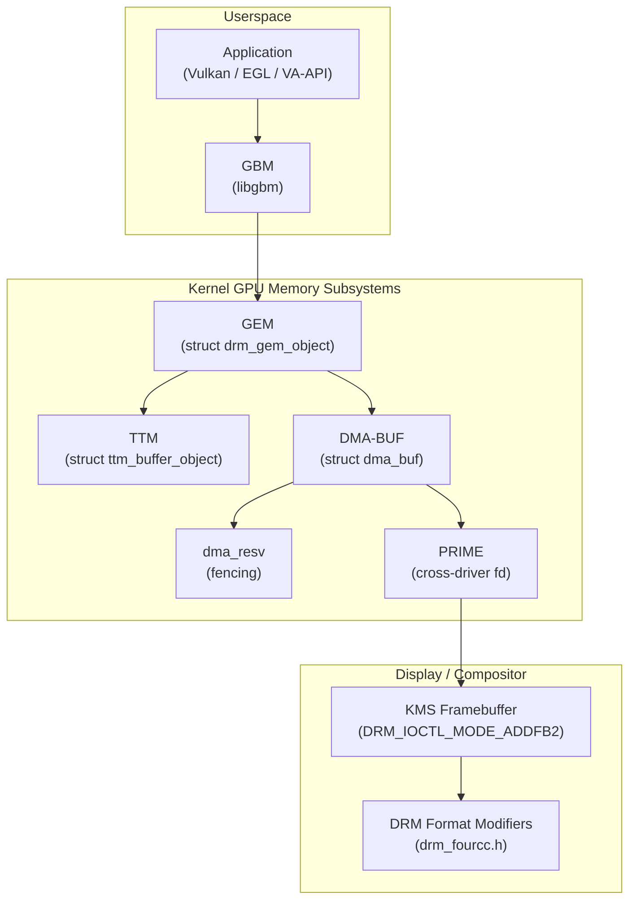
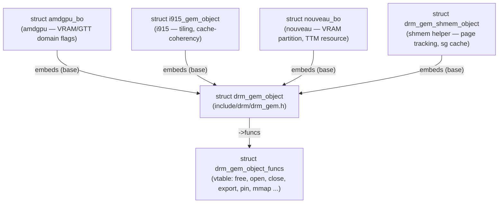
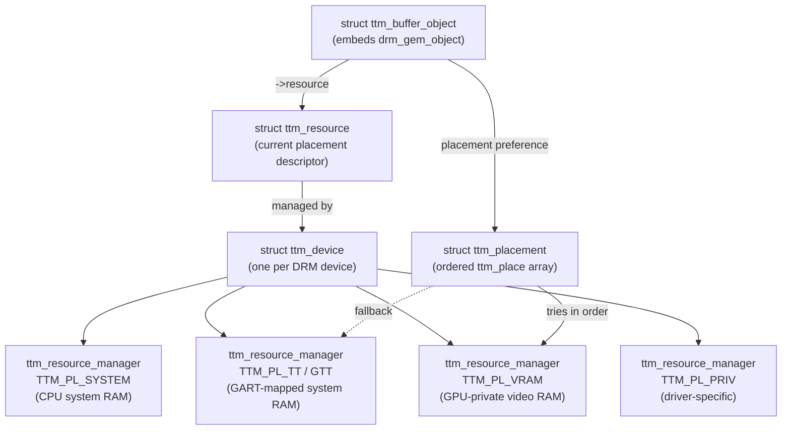
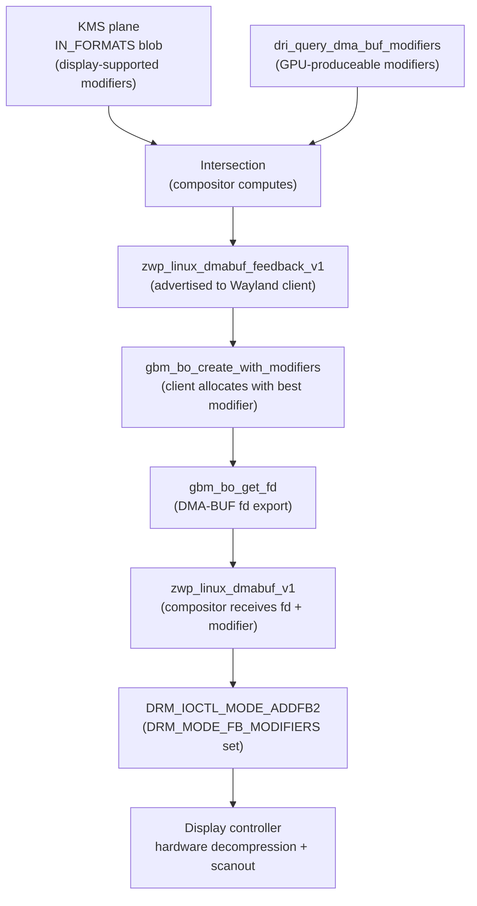
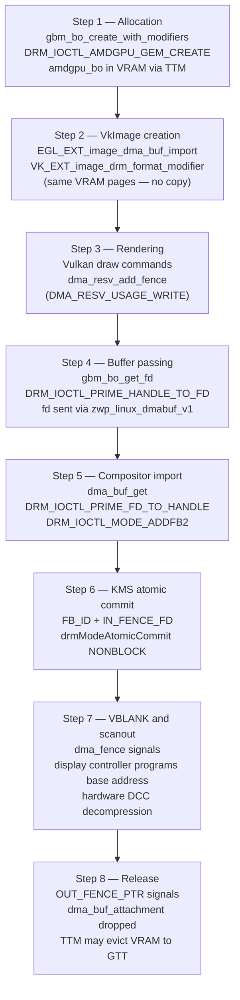
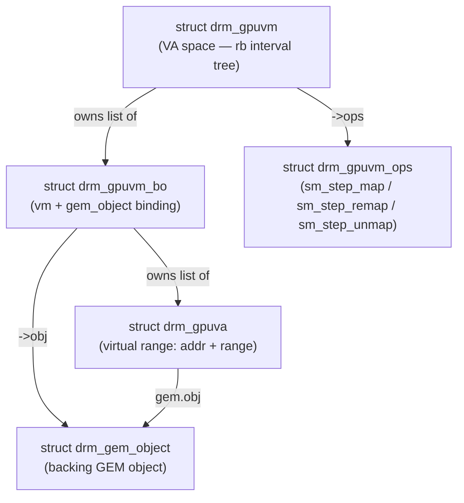

# Chapter 4: GPU Memory Management

> **Part**: Part I — The Kernel Layer
> **Audience**: Both — systems developers need the full kernel-side GEM/DMA-BUF/PRIME depth; application developers need to understand buffer lifecycle, zero-copy sharing, and format modifier negotiation to write correct Vulkan/EGL code
> **Status**: First draft — 2026-06-06

## Table of Contents

- [Overview](#overview)
- [1. GEM: Object Lifecycle and the Handle Model](#1-gem-object-lifecycle-and-the-handle-model)
- [2. TTM: Translation Table Manager](#2-ttm-translation-table-manager)
- [3. DMA-BUF: The Cross-Driver Buffer Sharing Framework](#3-dma-buf-the-cross-driver-buffer-sharing-framework)
- [4. Implicit vs. Explicit Fencing on DMA-BUF](#4-implicit-vs-explicit-fencing-on-dma-buf)
- [5. PRIME: Multi-GPU Buffer Sharing and Render Offload](#5-prime-multi-gpu-buffer-sharing-and-render-offload)
- [6. GBM: The Userspace Buffer Allocation API](#6-gbm-the-userspace-buffer-allocation-api)
- [7. DRM Format Modifiers: Tiling, Compression, and Cross-Driver Negotiation](#7-drm-format-modifiers-tiling-compression-and-cross-driver-negotiation)
- [8. The Integrated View: A Buffer's Journey](#8-the-integrated-view-a-buffers-journey)
- [9. Multi-GPU Topologies: NVLink, xGMI, and Peer-to-Peer DMA](#9-multi-gpu-topologies-nvlink-xgmi-and-peer-to-peer-dma)
- [Integrations](#integrations)
- [References](#references)

---

## Overview

GPU memory management in Linux is a collaborative system built from several interlocking kernel subsystems. **GEM** (**Graphics Execution Manager**) handles per-driver object allocation and lifetime within a single process context, centred on the **`struct drm_gem_object`** base type and the **`drm_gem_object_funcs`** vtable. GEM handles are opaque **`uint32_t`** values scoped to a per-**`drm_file`** namespace, forming the primary security boundary that prevents one process from accessing another process's GPU buffers. For drivers that back buffers with anonymous shared memory, the **`drm_gem_shmem_object`** helper provides demand-paging and swap support via **`shmem_file_setup`**. For hardware requiring physically contiguous memory — display controllers, embedded video IP — the **`drm_gem_cma_object`** helper allocates via **`dma_alloc_coherent`**, while the **`drm_gem_dma_object`** helper extends this to **IOMMU**-mapped **IOVA** (I/O Virtual Address) ranges on platforms with an IOMMU. Each major driver defines its own buffer object type embedding **`drm_gem_object`**: **`amdgpu_bo`** adds **TTM** placement and **AMDGPU** domain flags, **`i915_gem_object`** adds Intel tiling and cache-coherency state, and **`nouveau_bo`** adds VRAM partition and TTM resource information.

**TTM** (**Translation Table Manager**) addresses buffer objects that span multiple memory domains. It models memory as a set of named placement tiers — **`TTM_PL_SYSTEM`** (CPU system RAM), **`TTM_PL_TT`** / **GTT** (GART-mapped system RAM), **`TTM_PL_VRAM`** (GPU-private video RAM), and **`TTM_PL_PRIV`** (driver-specific) — each managed by a **`ttm_resource_manager`**. Placement preferences are expressed as ordered arrays of **`struct ttm_place`** within a **`struct ttm_placement`**. The **`struct ttm_buffer_object`** embeds **`drm_gem_object`** and carries the current **`ttm_resource`** descriptor. Under memory pressure, TTM evicts buffer objects via **`ttm_bo_evict`**, attaches a **`dma_fence`** via **`ttm_bo_add_move_fence`** to synchronise the move, and uses pinning (**`ttm_bo_pin`** / **`ttm_bo_unpin`**) to protect display framebuffers and ring buffers from eviction. In **amdgpu**, TTM placement is extended with **`AMDGPU_GEM_DOMAIN_GDS`**, **`AMDGPU_GEM_DOMAIN_OA`**, and **`AMDGPU_GEM_DOMAIN_DOORBELL`**; in **nouveau**, the push buffer lives in **GTT** to allow CPU writes without cache flushes.

**DMA-BUF** (merged in Linux 3.3) provides a kernel-wide buffer-sharing mechanism that crosses driver and subsystem boundaries. The **`struct dma_buf`** object is backed by an anonymous file; **`dma_buf_fd`** installs it in a process's file descriptor table for passing between processes via **`sendmsg`** with **`SCM_RIGHTS`**, the **Wayland** compositor protocol, or **PipeWire**. The **`struct dma_buf_ops`** vtable defines the protocol an exporting driver must implement, including **`attach`**/**`detach`** for importer tracking, **`map_dma_buf`** returning a **`struct sg_table`** scatter-gather list for IOMMU programming, and **`begin_cpu_access`**/**`end_cpu_access`** for cache maintenance on non-coherent architectures. Exporting a **GEM** object as a DMA-BUF uses **`drm_gem_prime_export`**; importing reverses this via **`DRM_IOCTL_PRIME_FD_TO_HANDLE`** which calls **`drm_gem_prime_fd_to_handle`**. The newer **DMA-BUF Heaps** facility (**`/dev/dma_heap/`**, merged in Linux 5.6) allows allocating DMA-BUF objects outside any GPU driver context via **`DMA_HEAP_IOCTL_ALLOC`**, used widely in Android camera pipelines and **V4L2** video decoder paths.

Synchronisation of asynchronous GPU work relies on **`struct dma_fence`** — a lightweight one-shot completion event signalled from GPU interrupt handlers — and **`struct dma_resv`** (the reservation object), which holds per-buffer in-flight fence lists guarded by a **`ww_mutex`** (wound-wait mutex) to prevent deadlock during multi-buffer batch submissions. Fences are added via **`dma_resv_add_fence`** with usage tags **`DMA_RESV_USAGE_READ`**, **`DMA_RESV_USAGE_WRITE`**, or **`DMA_RESV_USAGE_KERNEL`**. **Implicit synchronisation** lets **KMS** inspect a buffer's reservation object and wait automatically via **`dma_resv_wait_timeout`** before programming the display controller — neither the application nor compositor needs explicit coordination. **Explicit synchronisation** bypasses the reservation object, passing **`IN_FENCE_FD`** and **`OUT_FENCE_PTR`** KMS properties as **sync_file** fds bridged to **`dma_fence`** via **`DRM_IOCTL_SYNCOBJ_EXPORT_SYNC_FILE`** and **`DRM_IOCTL_SYNCOBJ_IMPORT_SYNC_FILE`**, and using **DRM syncobj** timeline points to coordinate the compositor's render-to-display pipeline.

**PRIME** (merged in Linux 3.5) extends DMA-BUF to multi-GPU buffer sharing and render offload via two ioctls: **`DRM_IOCTL_PRIME_HANDLE_TO_FD`** exports a GEM handle as a DMA-BUF fd, and **`DRM_IOCTL_PRIME_FD_TO_HANDLE`** imports it on a second GPU as a local GEM handle usable in **`DRM_IOCTL_MODE_ADDFB2`** for KMS scanout. Cross-driver fencing obligations require exporters to populate the **`dma_resv`** correctly. Mesa's **`DRI_PRIME`** environment variable activates render offload: the discrete GPU's **`/dev/dri/renderD128`** render node handles rendering, and the rendered buffer is exported via **`gbm_bo_get_fd`** and imported on the integrated GPU for display.

**GBM** (**Generic Buffer Manager**, **`libgbm`** in **Mesa**) is the userspace allocation API wrapping a DRM render node fd via **`gbm_create_device`**. It allocates **`struct gbm_bo`** buffer objects via **`gbm_bo_create`** and **`gbm_bo_create_with_modifiers`** / **`gbm_bo_create_with_modifiers2`**, with usage flags **`GBM_BO_USE_SCANOUT`**, **`GBM_BO_USE_RENDERING`**, and **`GBM_BO_USE_LINEAR`**. Multi-planar **YUV** formats such as **NV12** are accessed through per-plane accessors (**`gbm_bo_get_plane_count`**, **`gbm_bo_get_handle_for_plane`**, **`gbm_bo_get_stride_for_plane`**, **`gbm_bo_get_offset`**). DMA-BUF export uses **`gbm_bo_get_fd`** and **`gbm_bo_get_fd_for_plane`**. For **EGL** window surfaces, **`gbm_surface`** provides a ring-buffer swap chain via **`gbm_surface_lock_front_buffer`** and **`gbm_surface_release_buffer`**. GBM loads per-driver backends at runtime; Google's **ChromiumOS** ships an alternative implementation called **`minigbm`** with different allocation semantics. GBM is not a general GPU memory allocator — **Vulkan** device memory allocation goes through **`vkAllocateMemory`**, with the connection to GBM-allocated buffers established via **`VK_EXT_image_drm_format_modifier`** and **`VK_KHR_external_memory_fd`**.

Layered on top of all of these are **DRM format modifiers** — a negotiation protocol for hardware-specific tiling and compression layouts encoded as **`uint64_t`** values defined in **`include/uapi/drm/drm_fourcc.h`**. Key modifiers include **`DRM_FORMAT_MOD_LINEAR`** (row-major, no tiling), Intel modifiers such as **`I915_FORMAT_MOD_X_TILED`**, **`I915_FORMAT_MOD_Y_TILED`**, **`I915_FORMAT_MOD_4_TILED`**, and compressed variants like **`I915_FORMAT_MOD_4_TILED_DG2_RC_CCS`**; AMD **`AMD_FMT_MOD_*`** modifiers encoding **GFX** IP version, tile mode, and **DCC** (Delta Color Compression) parameters; ARM **AFBC** (**Arm Frame Buffer Compression**) modifiers via **`DRM_FORMAT_MOD_ARM_AFBC`**; and NVIDIA block-linear modifiers via **`DRM_FORMAT_MOD_NVIDIA_BLOCK_LINEAR_2D`**. KMS planes advertise supported (format, modifier) combinations through the **`IN_FORMATS`** blob property (**`struct drm_format_modifier_blob`** / **`struct drm_format_modifier`**), and **`DRM_IOCTL_MODE_ADDFB2`** (**`struct drm_mode_fb_cmd2`**) accepts per-plane **`modifier[]`** values when **`DRM_MODE_FB_MODIFIERS`** is set. EGL modifier negotiation uses **`EGL_EXT_image_dma_buf_import_modifiers`**; the Wayland compositor advertises the intersection of GPU-produceable and display-scannable modifiers to clients via **`zwp_linux_dmabuf_feedback_v1`**, completing the zero-copy pipeline.

Section 8 traces a single buffer through its entire lifecycle from allocation to display scanout, showing how every subsystem described above connects in practice. Section 9 covers advanced multi-GPU topologies: AMD's **xGMI** / **Infinity Fabric** providing cache-coherent inter-GPU memory access on **Instinct MI100/MI200/MI300** hardware (with **ROCm**/**HIP** APIs **`hipDeviceCanAccessPeer`**, **`hipDeviceEnablePeerAccess`**, **`hipMemcpyPeerAsync`**), NVIDIA's **NVLink** and **NVSwitch** interconnects for **A100**/**H100** class systems (accessed via the **`nv_p2p_*`** API and **GPUDirect**), and the generic Linux **p2pdma** infrastructure (**`drivers/pci/p2pdma.c`**, merged in Linux 4.20) with its **`pci_p2pdma_distance`**, **`pci_alloc_p2pmem`**, and **`pci_p2pdma_map_sg`** APIs. Section 9 also covers **`drm_gpuvm`** (merged in Linux 6.7) — a generic GPU virtual address space manager contributed by Danilo Krummrich using **`struct drm_gpuvm`**, **`struct drm_gpuva`**, and **`struct drm_gpuvm_bo`** with a **`drm_gpuvm_ops`** state machine (**`sm_step_map`**, **`sm_step_remap`**, **`sm_step_unmap`**), used by the **Panthor** driver (Arm **Mali-CSF**, Linux 6.8) and the new **Nouveau** rewrite — and NUMA GPU topologies discoverable via **`drm_info`**, **`rocm-smi --showtopo`**, **`nvidia-smi topo --matrix`**, and **`numactl`**.

This chapter is perhaps the most cross-cutting in the entire book. Every other chapter depends on understanding how GPU buffers are allocated, shared, and synchronised. A **Vulkan** application allocating device-local memory, a **VA-API** decoder producing a hardware surface, a **Wayland** compositor presenting a client buffer to the display, and a **CUDA** kernel importing an **OpenGL** texture — all of these paths converge on the mechanisms described here. The **GEM** handle model (introduced in Linux 2.6.28) provides the security and reference-counting foundation; **DMA-BUF** (merged in 3.3) generalises it across subsystem boundaries; **PRIME** (3.5) extends it to multi-GPU systems; and **DRM** format modifiers (4.1) complete the picture by making hardware-specific memory layouts portable.



After reading this chapter, a systems developer can implement GEM objects in a new DRM driver, correctly handle DMA-BUF import and export across drivers, and understand the memory coherency and synchronisation obligations that come with shared buffers. An application developer will understand what GBM actually does, why format modifiers exist and how to negotiate them, and how zero-copy buffer sharing works from GPU memory through a Wayland compositor to display scanout.

---

## 1. GEM: Object Lifecycle and the Handle Model

Before GEM, GPU memory management on Linux was entirely ad hoc and per-driver. Each driver exposed raw physical addresses to userspace, with no standard access control, no reference counting, and no portable mechanism for sharing buffers between processes. The i915 driver introduced GEM in 2008 (merged in Linux 2.6.28) as a handle-based abstraction that hides physical addresses, enables kernel-enforced reference counting, and establishes a uniform model that every subsequent DRM driver has adopted.

The cornerstone of GEM is `struct drm_gem_object`, defined in `include/drm/drm_gem.h`. Every driver embeds this structure in its own, driver-specific buffer object type. The generic fields track the buffer's device, its backing storage, its mmap offset, and its reference and handle counts:

```c
/* Source: include/drm/drm_gem.h */
struct drm_gem_object {
    struct kref refcount;          /* kernel reference count */
    unsigned handle_count;         /* number of open handles */
    struct drm_device *dev;        /* owning DRM device */
    struct file *filp;             /* backing shmem file, or NULL */
    struct drm_vma_offset_node vma_node; /* mmap offset allocation */
    size_t size;                   /* object size in bytes */
    int name;                      /* legacy flink global name, or 0 */
    struct dma_buf *dma_buf;       /* associated DMA-BUF, if exported */
    struct dma_buf_attachment *import_attach; /* if imported from DMA-BUF */
    struct dma_resv *resv;         /* reservation object for fencing */
    struct dma_resv _resv;         /* embedded resv if not provided externally */
    struct {
        struct list_head list;
        struct mutex lock;
    } gpuva;                       /* GPU VA mappings referencing this object */
    const struct drm_gem_object_funcs *funcs;
    struct list_head lru_node;
    struct drm_gem_lru *lru;
};
```

The driver-specific behaviour of a GEM object is expressed through the `drm_gem_object_funcs` vtable. This replaces the older per-driver callbacks that were registered on the `drm_driver` struct, and allows different object types within the same driver to have different behaviours:

```c
/* Source: include/drm/drm_gem.h */
struct drm_gem_object_funcs {
    void (*free)(struct drm_gem_object *obj);
    int  (*open)(struct drm_gem_object *obj, struct drm_file *file);
    void (*close)(struct drm_gem_object *obj, struct drm_file *file);
    void (*print_info)(struct drm_printer *p, unsigned int indent,
                       const struct drm_gem_object *obj);
    struct dma_buf *(*export)(struct drm_gem_object *obj, int flags);
    int  (*pin)(struct drm_gem_object *obj);
    void (*unpin)(struct drm_gem_object *obj);
    struct sg_table *(*get_sg_table)(struct drm_gem_object *obj);
    int  (*vmap)(struct drm_gem_object *obj, struct iosys_map *map);
    void (*vunmap)(struct drm_gem_object *obj, struct iosys_map *map);
    int  (*mmap)(struct drm_gem_object *obj, struct vm_area_struct *vma);
    int  (*evict)(struct drm_gem_object *obj);
    enum drm_gem_object_status (*status)(struct drm_gem_object *obj);
    size_t (*rss)(struct drm_gem_object *obj);
    const struct vm_operations_struct *vm_ops;
};
```

### GEM Handles: The Security Boundary

A GEM handle is an opaque `uint32_t` value that a userspace process uses to refer to a GPU buffer object. Handles are created by driver-private allocation ioctls (such as `DRM_IOCTL_I915_GEM_CREATE` or `DRM_IOCTL_AMDGPU_GEM_CREATE`) or by importing a DMA-BUF fd via `DRM_IOCTL_PRIME_FD_TO_HANDLE`. They are destroyed via `DRM_IOCTL_GEM_CLOSE`.

The critical security property of GEM handles is their per-`drm_file` namespace. Each open file descriptor on the DRM device node (`/dev/dri/card0`, `/dev/dri/renderD128`) has an independent handle namespace. Two processes opening the same DRM device node cannot reference each other's buffers by guessing handle values — handles are opaque integers with no global meaning. This is a fundamental departure from the pre-GEM era, when physical addresses were shared between processes.

Reference counting is managed through `drm_gem_object_get` and `drm_gem_object_put`, which increment and decrement the `kref` inside the GEM object. There are two distinct counts that beginners frequently confuse: the handle count (`handle_count`, the number of userspace handles pointing to the object) and the reference count (`refcount`, the total kernel-side reference count). An object can have zero userspace handles but non-zero kernel references because GPU work has not yet completed — the driver holds a reference until the GPU finishes accessing the buffer.

### GEM Shmem Helper

For drivers that back GPU buffers with ordinary anonymous shared memory, the kernel provides `drm_gem_shmem_object` in `drivers/gpu/drm/drm_gem_shmem_helper.c`. This structure extends `drm_gem_object` with fields for page tracking, sg_table caching, and CPU mapping. The allocation entry point is:

```c
/* Source: drivers/gpu/drm/drm_gem_shmem_helper.c */
struct drm_gem_shmem_object *drm_gem_shmem_create(struct drm_device *dev,
                                                   size_t size);
```

Internally, the helper calls `shmem_file_setup` to create an anonymous file in the shmem filesystem, which provides demand-paging, swap support, and the ability to mmap the buffer to userspace. Drivers such as Panfrost, Lima, and V3D use this helper rather than implementing their own page allocation and mapping logic.

### GEM CMA and DMA Object Helpers

For hardware that requires physically contiguous memory — common in display controllers and embedded video IP — the `drm_gem_cma_object` helper allocates via `dma_alloc_coherent`, which guarantees a single contiguous physical range that the hardware can DMA over without an IOMMU. On IOMMU-enabled platforms, the DMA-backed `drm_gem_dma_object` provides a more general solution: the physical address returned is an IOVA (I/O Virtual Address) mapped by the IOMMU, allowing non-contiguous physical memory to appear contiguous to the device.

### Per-Driver BO Types

Each major DRM driver defines its own buffer object type that embeds `drm_gem_object` and adds driver-specific state. `amdgpu_bo` (see Chapter 5) embeds `drm_gem_object` and adds placement flags (`AMDGPU_GEM_DOMAIN_VRAM`, `AMDGPU_GEM_DOMAIN_GTT`), GPU virtual address bindings, and TTM node information. `i915_gem_object` (Chapter 6) adds placement and cache-coherency tracking for Intel's tiling modes. `nouveau_bo` (Chapter 8) adds the TTM resource and nouveau-specific VRAM partition information. In all cases, the pattern is the same: the driver's BO type embeds `drm_gem_object` as the first member (or as a named member named `base`), and the kernel's generic GEM infrastructure operates on the base struct via `container_of` back-casting.



---

## 2. TTM: Translation Table Manager

The Translation Table Manager (TTM) addresses a fundamental challenge that simpler GEM helpers do not: managing GPU buffer objects that can reside in multiple memory domains — VRAM, GART-mapped system RAM (GTT), or unmapped system RAM — and must be migrated between them under memory pressure. TTM was originally contributed by Tungsten Graphics for the Radeon driver and has undergone significant refactoring, most notably the API overhaul between Linux 5.10 and 5.15 when `struct ttm_bo_device` was renamed to `struct ttm_device` and the resource manager layer was redesigned. This chapter uses the 5.15+ API as the baseline.

### Memory Types and Placement

TTM models memory as a set of memory types, each managed by a `ttm_resource_manager`. The canonical types are:

- `TTM_PL_SYSTEM` (0): CPU-side system RAM, before any GPU mapping or IOMMU translation.
- `TTM_PL_TT` (1): System RAM mapped into the GPU's address space via the GART or IOMMU (called GTT — Graphics Translation Table — in AMD terminology). Slower than VRAM but abundant and shareable with the CPU.
- `TTM_PL_VRAM` (2): GPU-private video RAM. Fastest for GPU access, typically 8–80 GB in workstation and consumer hardware.
- `TTM_PL_PRIV` (3): Driver-specific private memory (used by some drivers for internal command buffers and ring buffers).

Placement preferences are specified as an ordered array of `struct ttm_place` entries within a `struct ttm_placement`. The TTM core will try each placement in order, falling back to later entries when a preferred domain is full:

```c
/* Source: include/drm/ttm/ttm_placement.h */
struct ttm_place {
    unsigned  fpfn;       /* first valid page frame number */
    unsigned  lpfn;       /* last valid page frame number (0 = no limit) */
    uint32_t  mem_type;   /* TTM_PL_* constant */
    uint32_t  flags;      /* TTM_PL_FLAG_CONTIGUOUS, TTM_PL_FLAG_TOPDOWN, etc. */
};

struct ttm_placement {
    unsigned              num_placement;
    const struct ttm_place *placement;
};
```

A typical amdgpu buffer object initialization specifies VRAM as the preferred placement with GTT as the fallback:

```c
/* Source: drivers/gpu/drm/amd/amdgpu/amdgpu_object.c — amdgpu_bo_do_create() */
static const struct ttm_place vram_placement = {
    .fpfn     = 0,
    .lpfn     = 0,
    .mem_type = TTM_PL_VRAM,
    .flags    = TTM_PL_FLAG_DESIRED,
};

static const struct ttm_place gtt_placement = {
    .fpfn     = 0,
    .lpfn     = 0,
    .mem_type = TTM_PL_TT,
    .flags    = TTM_PL_FLAG_FALLBACK,
};

static const struct ttm_place placements[2] = {
    vram_placement,
    gtt_placement,
};

static const struct ttm_placement bo_placement = {
    .num_placement = 2,
    .placement     = placements,
};

/* Driver calls ttm_bo_init_reserved(&adev->mman.bdev, &bo->tbo,
 *     size, type, &bo_placement, page_align, ctx, NULL, NULL,
 *     &amdgpu_bo_destroy); */
```

### The TTM Buffer Object

`struct ttm_buffer_object` is the TTM-layer base struct. In modern drivers it is embedded inside the driver's BO type alongside `drm_gem_object`:

```c
/* Source: include/drm/ttm/ttm_bo.h */
struct ttm_buffer_object {
    struct drm_gem_object base;    /* DRM GEM superclass */
    struct ttm_device    *bdev;    /* owning TTM device */
    enum ttm_bo_type      type;    /* ttm_bo_type_device, _kernel, or _sg */
    struct ttm_resource  *resource; /* current placement descriptor */
    struct ttm_tt        *ttm;     /* system page structure for TT domain */
    bool                  deleted; /* zombie flag */
    unsigned              pin_count; /* pin reference count */
    struct sg_table      *sg;      /* external DMA page source (for _sg type) */
};
```

### Eviction and Buffer Migration

When VRAM is exhausted, TTM evicts buffer objects to GTT or system RAM. The eviction path begins at `ttm_resource_manager_evict_all` and proceeds through `ttm_bo_evict`, which calls the driver's `ttm_bo_driver.evict_flags` callback to determine acceptable destinations and then initiates a buffer move. For CPU-visible memory, `ttm_bo_move_memcpy` performs the move using the kernel's `copy_page` facility. Drivers with dedicated DMA engines (amdgpu's SDMA, nouveau's copy engines) override the move path to use hardware acceleration.

Buffer moves require careful synchronisation. After a move, the `ttm_bo_add_move_fence` call attaches a `dma_fence` to the buffer's reservation object. Neither the CPU nor the GPU may access the destination until this fence signals. Failure to honour this constraint produces subtle GPU memory corruption that manifests only under memory pressure — a notoriously difficult class of bug.

Pinning prevents eviction: `ttm_bo_pin` increments `pin_count`, and TTM will not evict an object with a non-zero pin count. Display framebuffers, KMS cursor buffers, and GPU ring buffers are typically pinned. Forgetting to unpin with `ttm_bo_unpin` is a memory leak that causes VRAM exhaustion.

### TTM in amdgpu and nouveau

In `amdgpu`, the `struct amdgpu_bo` embeds both `drm_gem_object` and `ttm_buffer_object` via the TTM-provided helper base class. AMDGPU extends the placement flags with domain-specific constants: `AMDGPU_GEM_DOMAIN_GDS` for GPU Data Store, `AMDGPU_GEM_DOMAIN_OA` for ordered append buffers, and `AMDGPU_GEM_DOMAIN_DOORBELL` for the doorbell aperture used by the CP engine. In `nouveau`, `struct nouveau_bo` uses TTM for VRAM/GTT placement, and the push buffer (GPU command stream) lives in GTT to allow CPU writes without cache flushes.

The `struct ttm_device` (one per DRM device) owns all `ttm_resource_manager` instances and the LRU lists used for eviction ordering. Drivers register their memory types during `drm_dev_register` via `ttm_range_man_init` (for simple contiguous ranges) or a custom `ttm_resource_manager_func` for more complex arrangements.



---

## 3. DMA-BUF: The Cross-Driver Buffer Sharing Framework

Before DMA-BUF (merged in Linux 3.3, 2012), there was no kernel-standard way for different subsystems — a GPU, a V4L2 camera, a hardware video codec, a display controller — to share the same physical buffer without copying it. Each driver had its own buffer allocation mechanism, and cross-driver sharing required either copying or ad hoc private agreements. DMA-BUF solves this by introducing a file-descriptor-backed kernel object that represents a shareable buffer and defining a standard protocol for importing and exporting it.

### struct dma_buf: The Shared Buffer Object

```c
/* Source: include/linux/dma-buf.h */
struct dma_buf {
    size_t                    size;
    struct file              *file;        /* backing file, fd returned to userspace */
    struct list_head          attachments; /* list of dma_buf_attachment objects */
    const struct dma_buf_ops *ops;         /* exporter's vtable */
    struct dma_resv          *resv;        /* reservation object for fencing */
    void                     *priv;        /* exporter's private data */
    const char               *exp_name;   /* exporter name for debugging */
    struct module            *owner;       /* exporter module */
    /* ... poll/callback fields ... */
};
```

The `dma_buf` object is backed by an anonymous file in the kernel's file system namespace. When the exporting driver calls `dma_buf_fd`, the kernel installs this file into the process's file descriptor table and returns the integer fd to userspace. The fd can then be passed between processes using `sendmsg` with `SCM_RIGHTS` (Unix socket fd passing), or more commonly, via the Wayland compositor protocol or PipeWire socket channel.

### The dma_buf_ops Vtable

The `struct dma_buf_ops` defines the protocol that an exporting driver must implement:

```c
/* Source: include/linux/dma-buf.h */
struct dma_buf_ops {
    /* Importer attachment management */
    int  (*attach)(struct dma_buf *, struct dma_buf_attachment *);
    void (*detach)(struct dma_buf *, struct dma_buf_attachment *);

    /* Optional: pin/unpin for dynamic-attachment capable exporters */
    int  (*pin)(struct dma_buf_attachment *);
    void (*unpin)(struct dma_buf_attachment *);

    /* DMA mapping: returns an sg_table for the importer's IOMMU */
    struct sg_table *(*map_dma_buf)(struct dma_buf_attachment *,
                                    enum dma_data_direction);
    void (*unmap_dma_buf)(struct dma_buf_attachment *, struct sg_table *,
                          enum dma_data_direction);

    /* Destructor */
    void (*release)(struct dma_buf *);

    /* CPU access with cache maintenance */
    int  (*begin_cpu_access)(struct dma_buf *, enum dma_data_direction);
    int  (*end_cpu_access)(struct dma_buf *, enum dma_data_direction);

    /* CPU mapping */
    int  (*mmap)(struct dma_buf *, struct vm_area_struct *);
    int  (*vmap)(struct dma_buf *, struct iosys_map *);
    void (*vunmap)(struct dma_buf *, struct iosys_map *);
};
```

The `attach`/`detach` callbacks allow the exporter to track which devices have registered an interest in the buffer. An exporter that backs the buffer with physically contiguous memory (e.g., CMA) may reject attachments from devices with incompatible IOMMU constraints. The `map_dma_buf` callback is where the real work happens: it returns a `struct sg_table` — a scatter-gather list of physical memory ranges — that the importing device can program into its IOMMU to obtain a contiguous IOVA mapping, even if the underlying physical pages are non-contiguous.

The `begin_cpu_access` and `end_cpu_access` callbacks implement cache maintenance. On architectures without hardware-coherent DMA (many ARM SoCs), the exporter must flush CPU caches before the device can read, and invalidate them before the CPU can read device-written data. Failing to call these correctly causes silent data corruption that is extremely difficult to reproduce.

### Export and Import

Exporting a GEM object as a DMA-BUF requires two steps: constructing the DMA-BUF itself, then obtaining an fd. The kernel helper `drm_gem_prime_export` handles the standard case:

```c
/* Source: drivers/gpu/drm/drm_prime.c */
struct dma_buf *drm_gem_prime_export(struct drm_gem_object *obj, int flags);
```

Internally, this populates a `struct dma_buf_export_info` with the GEM PRIME ops vtable and calls `dma_buf_export`, which allocates the `dma_buf` object and installs the file. The driver can then call `dma_buf_fd` to obtain the userspace fd.

Importing is the reverse: `dma_buf_get(fd)` converts a userspace fd back to a kernel `struct dma_buf *` pointer, and `dma_buf_attach(dmabuf, importing_device)` creates a `dma_buf_attachment` struct recording the (buffer, device) pair. The importer then calls `dma_buf_map_attachment` to get the sg_table and programs its IOMMU accordingly.

The `DRM_IOCTL_PRIME_FD_TO_HANDLE` ioctl wraps this import path for GEM drivers: it calls `drm_gem_prime_fd_to_handle`, which checks whether the same DMA-BUF has already been imported (caching it by dma_buf pointer to avoid duplicate imports) and returns a GEM handle pointing to the imported object. The resulting GEM handle is indistinguishable to userspace from a locally allocated buffer — its address space, refcounting, and fencing infrastructure are all handled by the kernel.

```mermaid
graph LR
    ExporterGEM["Exporter GEM object\n(drm_gem_object)"]
    ExportFn["drm_gem_prime_export\n(drm_prime.c)"]
    DmaBuf["struct dma_buf\n(anonymous file)"]
    Fd["userspace fd\n(dma_buf_fd)"]
    Attach["struct dma_buf_attachment\n(importer device)"]
    SgTable["struct sg_table\n(scatter-gather list)"]
    ImporterGEM["Importer GEM handle\n(drm_gem_prime_fd_to_handle)"]

    ExporterGEM --> ExportFn
    ExportFn --> DmaBuf
    DmaBuf --> Fd
    Fd -- "dma_buf_get + dma_buf_attach" --> Attach
    Attach -- "map_dma_buf" --> SgTable
    SgTable -- "IOMMU mapping" --> ImporterGEM
```



### DMA-BUF Heaps

A newer facility, DMA-BUF heaps (`/dev/dma_heap/`), merged in Linux 5.6, allows allocating DMA-BUF objects outside any GPU driver context. A userspace process opens `/dev/dma_heap/system` and issues `DMA_HEAP_IOCTL_ALLOC` to obtain a DMA-BUF fd backed by anonymous system memory. This is widely used in Android's camera pipeline and V4L2 video decoder paths, where a buffer must be allocated before either the producer (camera ISP) or consumer (GPU) has been selected. The `system` heap allocates from page allocator; the `system-contig` heap uses CMA for physically contiguous allocations.

---

## 4. Implicit vs. Explicit Fencing on DMA-BUF

GPU work is asynchronous: submitting a rendering command to the GPU does not mean the GPU has finished writing to the framebuffer. Before another consumer (a second GPU, the display controller, or the CPU) can safely read from a shared buffer, it must wait for the GPU work to complete. This synchronisation problem is solved in the Linux kernel through a combination of `dma_fence` objects, `dma_resv` reservation objects, and — at the userspace API level — a choice between implicit and explicit synchronisation semantics.

### dma_fence: A One-Shot Completion Event

`struct dma_fence` (`include/linux/dma-fence.h`) is a lightweight, one-shot completion event. GPU drivers allocate and initialise a fence when GPU work is submitted, and signal it from the interrupt handler when the hardware completes:

```c
/* Source: include/linux/dma-fence.h (conceptual driver usage) */

/* In the submit path: */
struct dma_fence *fence = dma_fence_create(driver_ops, lock, context, seqno);
dma_fence_get(fence);  /* take reference before attaching to resv */
attach_fence_to_reservation(bo->base.resv, fence, DMA_RESV_USAGE_WRITE);
submit_gpu_job(ring, cmd_buffer);
dma_fence_put(fence);  /* release caller's reference; resv holds its own */

/* In the IRQ handler, when GPU signals completion: */
dma_fence_signal(fence);
```

Key operations on `dma_fence`:
- `dma_fence_add_callback`: registers a software callback to be invoked when the fence signals; used by KMS to chain buffer release actions to GPU completion.
- `dma_fence_wait` / `dma_fence_wait_timeout`: CPU-side blocking wait; avoid in render submission paths but necessary for certain synchronisation points.
- `dma_fence_chain`: links multiple fences into a directed chain, enabling efficient representation of "all prior work in this timeline" without storing each fence individually.

### dma_resv: The Reservation Object

Every `dma_buf` has an embedded `struct dma_resv`. This structure holds the fences associated with in-flight GPU work on that buffer. Its layout is intentionally simple:

```c
/* Source: include/linux/dma-resv.h */
struct dma_resv {
    struct ww_mutex           lock;    /* wound-wait mutex */
    struct dma_resv_list __rcu *fences; /* RCU-protected fence array */
};
```

The wound-wait mutex (`ww_mutex`) is used instead of a conventional mutex to prevent deadlock when multiple reservation objects must be locked simultaneously (for example, when the GPU scheduler prepares a batch that reads from buffer A and writes to buffer B). The `ww_acquire_ctx` discipline requires acquiring all locks in one transaction; if a conflict is detected, the lower-priority holder "wounds" (backs off) rather than deadlocking.

Fences are added via `dma_resv_add_fence(obj, fence, usage)`, where `usage` is one of `DMA_RESV_USAGE_READ`, `DMA_RESV_USAGE_WRITE`, or `DMA_RESV_USAGE_KERNEL`. A consumer waiting for all GPU work to complete calls `dma_resv_wait_timeout(obj, DMA_RESV_USAGE_READ, interruptible, timeout)`, which iterates the fence list and waits for each signalled fence.

### Implicit Synchronisation

Implicit synchronisation means the kernel tracks buffer state automatically: when a buffer is handed to KMS for display, KMS inspects the buffer's reservation object and waits for any outstanding write fences before programming the display controller's base address register. Neither the application nor the compositor needs to explicitly communicate "the GPU is done with this buffer." The `dma_buf_poll` call implements `POLLIN`/`POLLOUT` on DMA-BUF file descriptors so userspace can wait without busy-looping.

```mermaid
graph TD
    subgraph "Implicit Sync"
        GPUSub["GPU submit\n(render ring)"]
        Fence["struct dma_fence\n(dma_fence_create)"]
        Resv["struct dma_resv\n(dma_resv_add_fence)"]
        KMSWait["KMS atomic commit\n(dma_resv_wait_timeout)"]
        Scanout["Display controller\nscanout"]

        GPUSub -- "creates" --> Fence
        Fence -- "attached to" --> Resv
        Resv -- "KMS inspects" --> KMSWait
        KMSWait -- "after fence signals" --> Scanout
    end

    subgraph "Explicit Sync"
        GPUSub2["GPU submit\n(render ring)"]
        SyncObj["DRM syncobj\n(drm_syncobj_export_sync_file)"]
        SyncFd["sync_file fd\n(IN_FENCE_FD)"]
        KMSCommit["drmModeAtomicCommit\n(DRM_MODE_ATOMIC_NONBLOCK)"]
        Scanout2["Display controller\nscanout"]

        GPUSub2 -- "creates" --> SyncObj
        SyncObj -- "exported as" --> SyncFd
        SyncFd -- "passed to KMS plane" --> KMSCommit
        KMSCommit -- "waits then programs" --> Scanout2
    end
```



Implicit sync works well when every GPU driver participating in the pipeline correctly adds fences to the `dma_resv`. The well-known NVIDIA implicit sync problem (discussed in Chapter 3) arises precisely because NVIDIA's GPU driver historically did not populate the reservation object. From KMS's perspective, an empty reservation object means "no outstanding work" — scanout proceeds immediately, producing tearing or corruption if the GPU hasn't actually finished rendering.

### Explicit Synchronisation

Explicit synchronisation bypasses the reservation object entirely. Instead, the submitter passes an `IN_FENCE_FD` to the KMS atomic commit: a sync_file fd that KMS waits on before scanning out. The renderer passes an `OUT_FENCE_PTR` to its GPU submission ioctl to receive a sync_file fd that signals when rendering completes. The two are connected by the compositor, which threads the GPU completion fence as the display controller's input fence.

```c
/* Source: conceptual compositor synchronisation path */

/* After GPU render submission: */
drm_syncobj_export_sync_file(dev_fd, render_syncobj, &render_fence_fd);

/* At KMS atomic commit: */
drmModeAtomicAddProperty(req, plane_id,
    in_fence_fd_prop_id, render_fence_fd);
drmModeAtomicAddProperty(req, crtc_id,
    out_fence_ptr_prop_id, (uint64_t)&out_fence_fd_ptr);
drmModeAtomicCommit(kms_fd, req, DRM_MODE_ATOMIC_NONBLOCK, NULL);
```

The `DRM_IOCTL_SYNCOBJ_EXPORT_SYNC_FILE` and `DRM_IOCTL_SYNCOBJ_IMPORT_SYNC_FILE` ioctls bridge between DRM syncobj timeline points and sync_file fds, enabling interoperability between the explicit DRM sync model and the implicit DMA-BUF model when needed.

---

## 5. PRIME: Multi-GPU Buffer Sharing and Render Offload

PRIME was introduced in Linux 3.5 (2012) to solve a specific problem: laptops and workstations with two GPUs (a power-efficient integrated GPU and a high-performance discrete GPU) need a way to render on the discrete GPU and present the result via the display output connected to the integrated GPU. The only mechanism available is DMA-BUF, and PRIME is simply the name for the GEM-level ioctls that wrap DMA-BUF export and import.

### The PRIME fd Mechanism

The PRIME workflow is straightforward at the ioctl level. On the rendering GPU:

```c
/* Source: drivers/gpu/drm/drm_prime.c — DRM_IOCTL_PRIME_HANDLE_TO_FD handler */
struct drm_prime_handle args = {
    .handle = gem_handle,    /* GEM handle on the render GPU */
    .flags  = DRM_CLOEXEC,
    .fd     = -1,
};
ioctl(render_fd, DRM_IOCTL_PRIME_HANDLE_TO_FD, &args);
int dmabuf_fd = args.fd;    /* DMA-BUF fd, passable across processes */
```

On the display GPU:

```c
struct drm_prime_handle args = {
    .fd     = dmabuf_fd,    /* received via socket or inherited */
    .flags  = 0,
    .handle = 0,
};
ioctl(display_fd, DRM_IOCTL_PRIME_FD_TO_HANDLE, &args);
uint32_t display_handle = args.handle;  /* local GEM handle on display GPU */
```

The `display_handle` can now be used in `DRM_IOCTL_MODE_ADDFB2` to create a KMS framebuffer from the render GPU's buffer, without copying.

### Cross-Driver Fencing Obligations

When a buffer is imported across drivers, the importer cannot know what type of `dma_fence` the exporter uses — each driver has its own fence implementation and timeline semantics. The correct approach is to use the `dma_resv` protocol: the exporter adds its completion fence to the buffer's reservation object, and the importer calls `dma_resv_wait_timeout` (or registers a callback via the DMA-BUF poll mechanism) before accessing the buffer. Drivers that fail to honour this protocol produce corruption that is typically intermittent and workload-dependent.

The scatter-gather helper functions `drm_prime_pages_to_sg` and `drm_prime_sg_to_page_array` (deprecated — use `drm_prime_pages_to_sg` for new code) assist drivers in converting between their internal page representations and the DMA-BUF scatter-gather table format required by the import protocol.

### DRI_PRIME Render Offload in Mesa

Mesa implements render offload through the `DRI_PRIME` environment variable. When set (e.g., `DRI_PRIME=1`), Mesa's EGL implementation opens a `gbm_device` on the discrete GPU's render node (`/dev/dri/renderD128`) for rendering, while display output remains on the integrated GPU's card node. The rendered buffer is exported from the discrete GPU via `gbm_bo_get_fd` (which calls `DRM_IOCTL_PRIME_HANDLE_TO_FD` internally) and imported on the integrated GPU via `DRM_IOCTL_PRIME_FD_TO_HANDLE`. This is a copy-based path on most consumer hardware because the integrated and discrete GPUs do not share an IOMMU domain; the kernel's PRIME import creates a new scatter-gather mapping through system RAM.

True zero-copy PRIME requires that both GPUs can access the same physical memory range directly, which in practice means either a unified IOMMU domain (AMD APU-style SoCs) or the peer-to-peer memory paths described in Section 9.

```mermaid
graph LR
    RenderGPU["Render GPU\n(/dev/dri/renderD128)"]
    GemHandle["GEM handle\n(render GPU)"]
    PrimeFd["DMA-BUF fd\n(DRM_IOCTL_PRIME_HANDLE_TO_FD)"]
    DisplayGPU["Display GPU\n(/dev/dri/card0)"]
    DisplayHandle["GEM handle\n(display GPU)"]
    KMSFB["KMS framebuffer\n(DRM_IOCTL_MODE_ADDFB2)"]

    RenderGPU -- "renders into" --> GemHandle
    GemHandle -- "exported via PRIME" --> PrimeFd
    PrimeFd -- "imported by" --> DisplayGPU
    DisplayGPU -- "DRM_IOCTL_PRIME_FD_TO_HANDLE" --> DisplayHandle
    DisplayHandle --> KMSFB
```



---

## 6. GBM: The Userspace Buffer Allocation API

GBM (Generic Buffer Manager) is the userspace counterpart to the kernel's GEM/DMA-BUF infrastructure. It provides a small, focused API for allocating GPU buffers that can serve both as rendering surfaces (EGL images) and as KMS scanout framebuffers. GBM is the allocation layer that ties Mesa's EGL implementation to the DRM kernel driver, and it is where format modifier negotiation — one of the most important and poorly understood mechanisms in the graphics stack — occurs.

### GBM Device and Buffer Object

The GBM device wraps a DRM render node file descriptor:

```c
/* Source: src/gbm/main/gbm.h (Mesa) */
struct gbm_device *gbm_create_device(int fd);
void gbm_device_destroy(struct gbm_device *gbm);
```

A GBM buffer object (`struct gbm_bo`) wraps a GEM object in the underlying driver. The primary allocation functions are:

```c
/* Source: src/gbm/main/gbm.h (Mesa) */
/* Simple allocation without modifier control: */
struct gbm_bo *gbm_bo_create(struct gbm_device *gbm,
                              uint32_t width, uint32_t height,
                              uint32_t format, uint32_t flags);

/* Allocation with explicit modifier list (preferred for scanout): */
struct gbm_bo *gbm_bo_create_with_modifiers(struct gbm_device *gbm,
                                             uint32_t width, uint32_t height,
                                             uint32_t format,
                                             const uint64_t *modifiers,
                                             const unsigned int count);

/* Extended version with usage flags: */
struct gbm_bo *gbm_bo_create_with_modifiers2(struct gbm_device *gbm,
                                              uint32_t width, uint32_t height,
                                              uint32_t format,
                                              const uint64_t *modifiers,
                                              const unsigned int count,
                                              uint32_t flags);
```

The `format` parameter uses the same `GBM_FORMAT_*` constants as DRM fourcc codes (`GBM_FORMAT_ARGB8888`, `GBM_FORMAT_NV12`, etc.). The `flags` parameter accepts usage hints: `GBM_BO_USE_SCANOUT` indicates the buffer will be used as a KMS framebuffer; `GBM_BO_USE_RENDERING` indicates GPU render target use; `GBM_BO_USE_LINEAR` forces linear (non-tiled) layout.

### Multi-Planar Format Support

YUV formats such as NV12 (used in video decoding) require multiple planes stored in separate memory regions. GBM exposes per-plane accessors:

```c
/* Source: src/gbm/main/gbm.h (Mesa) */
int      gbm_bo_get_plane_count(struct gbm_bo *bo);
union gbm_bo_handle gbm_bo_get_handle_for_plane(struct gbm_bo *bo, int plane);
uint32_t gbm_bo_get_stride_for_plane(struct gbm_bo *bo, int plane);
uint32_t gbm_bo_get_offset(struct gbm_bo *bo, int plane);
```

For a two-plane NV12 buffer, `gbm_bo_get_plane_count` returns 2. Plane 0 holds the luma (Y) data; plane 1 holds the interleaved chroma (UV) data. Each plane has its own GEM handle (allowing separate VRAM allocations), stride, and offset.

### DMA-BUF Export from GBM

Any GBM BO can be exported as a DMA-BUF fd:

```c
int fd = gbm_bo_get_fd(bo);           /* single-plane export */
int fd = gbm_bo_get_fd_for_plane(bo, plane_index); /* per-plane export */
```

These calls invoke `DRM_IOCTL_PRIME_HANDLE_TO_FD` under the hood. The resulting fd is what gets passed to the Wayland compositor via the `zwp_linux_dmabuf_v1` protocol, and to KMS via `DRM_IOCTL_MODE_ADDFB2`.

### GBM Surfaces and the Swap Chain

For EGL window surfaces, GBM provides a ring-buffer abstraction:

```c
struct gbm_surface *surf = gbm_surface_create(gbm, width, height,
                                               GBM_FORMAT_XRGB8888, flags);
/* ... EGL creates a window surface from this gbm_surface ... */

/* After eglSwapBuffers: */
struct gbm_bo *front_bo = gbm_surface_lock_front_buffer(surf);
/* Create KMS framebuffer from front_bo and commit; then: */
gbm_surface_release_buffer(surf, old_bo);
```

### The GBM Backend Architecture

GBM is not a monolithic library. The `libgbm` implementation in Mesa (`src/gbm/`) loads a backend from the Mesa DRI module path at runtime. Each hardware driver provides its GBM backend, which implements the `struct gbm_backend` interface. This means the allocation semantics for `gbm_bo_create` on an amdgpu device differ from those on an Intel device, even though the GBM API is identical.

Google's ChromiumOS ships a separate implementation called `minigbm` (`src/gbm/backends/` in the ChromiumOS tree). Minigbm has different allocation semantics, additional usage flags, and different modifier support. Code written and tested against Mesa's `libgbm` may behave differently with minigbm, particularly on embedded platforms.

An important misconception to correct: GBM is not a general GPU memory allocator. It cannot allocate Vulkan device memory — `vkAllocateMemory` operates through the Vulkan driver's own allocation paths. The connection between GBM-allocated buffers and Vulkan images is established through `VK_EXT_image_drm_format_modifier` (Chapter 18) and `VK_KHR_external_memory_fd` (Chapter 24), which allow a Vulkan `VkImage` to be backed by an existing GBM BO's GEM memory.

---

## 7. DRM Format Modifiers: Tiling, Compression, and Cross-Driver Negotiation

Modern GPUs and display controllers do not store framebuffers in simple linear (row-major) memory layouts. They use tiled memory arrangements — sometimes called swizzled or bit-interleaved layouts — that improve cache locality during rendering and reduce memory bandwidth during display scanout. Beyond tiling, recent hardware implements lossless hardware compression: AMD's DCC (Delta Color Compression), Intel's CCS (Color Compression Surface), and ARM's AFBC (Arm Frame Buffer Compression) can compress a rendered buffer in-place, halving the effective memory bandwidth. A plain `(width, height, bits_per_pixel, stride)` description is wholly inadequate to describe these layouts. DRM format modifiers solve this.

### The Modifier Value

A DRM format modifier is a `uint64_t` value defined in `include/uapi/drm/drm_fourcc.h`. Every modifier uniquely identifies a specific memory layout. The key defined modifiers include:

- `DRM_FORMAT_MOD_LINEAR` (`0`): row-major, no tiling. Universally supported by all hardware but suboptimal for rendering and bandwidth.
- `DRM_FORMAT_MOD_INVALID` (`0xFFFFFFFFFFFFFFFF`): sentinel meaning "no modifier specified" or "modifier negotiation not performed." Using this in production code is a bug.
- Intel modifiers: `I915_FORMAT_MOD_X_TILED` (legacy X-tiling), `I915_FORMAT_MOD_Y_TILED` (Y-tiling for pre-Xe), `I915_FORMAT_MOD_4_TILED` (the new Xe/DG2 4KB tiling), and compressed variants such as `I915_FORMAT_MOD_4_TILED_DG2_RC_CCS` (Render Compression).
- AMD modifiers: `AMD_FMT_MOD_*` encode the GFX IP version, tile mode, DCC enable/disable, DCC pipe XOR bits, and DCC independent block parameters into a single 64-bit value. The full encoding is documented in `drm_fourcc.h` and is complex enough that AMD provides helper macros (`AMD_FMT_MOD_SET`, `AMD_FMT_MOD_GET`) for construction and inspection.
- ARM AFBC: `DRM_FORMAT_MOD_ARM_AFBC(flags)` where `flags` encode the block size, tiled header option, split layout, and YUV transform capabilities. Used by the Panfrost driver and ARM display controllers.
- NVIDIA block-linear: `DRM_FORMAT_MOD_NVIDIA_BLOCK_LINEAR_2D(c, s, i, v, h)` encodes the log2 of the block height and other Fermi+ tiling parameters.

### KMS Integration: IN_FORMATS and ADDFB2

The `DRM_IOCTL_MODE_ADDFB2` ioctl accepts a `modifier` array field in `struct drm_mode_fb_cmd2` — one `uint64_t` per plane. The KMS driver validates that the display controller's scan-out hardware can read the specified modifier:

```c
/* Source: include/uapi/drm/drm_mode.h */
struct drm_mode_fb_cmd2 {
    uint32_t fb_id;
    uint32_t width, height;
    uint32_t pixel_format;   /* DRM_FORMAT_* fourcc */
    uint32_t flags;          /* DRM_MODE_FB_MODIFIERS if modifier[] is valid */
    uint32_t handles[4];     /* GEM handles, one per plane */
    uint32_t pitches[4];
    uint32_t offsets[4];
    uint64_t modifier[4];    /* DRM_FORMAT_MOD_* per plane */
};
```

The `DRM_MODE_FB_MODIFIERS` flag must be set in `flags` to signal that the `modifier[]` array is meaningful. If the flag is absent, KMS assumes `DRM_FORMAT_MOD_LINEAR`.

KMS planes advertise their supported (format, modifier) combinations through the `IN_FORMATS` blob property. Parsing this blob requires understanding `struct drm_format_modifier_blob`:

```c
/* Source: include/uapi/drm/drm_mode.h */
struct drm_format_modifier_blob {
    uint32_t version;         /* always 1 */
    uint32_t flags;
    uint32_t count_formats;   /* number of uint32_t format entries */
    uint32_t formats_offset;  /* byte offset from blob start to format array */
    uint32_t count_modifiers; /* number of drm_format_modifier entries */
    uint32_t modifiers_offset;/* byte offset from blob start to modifier array */
    /* followed by format array, then drm_format_modifier array */
};

struct drm_format_modifier {
    uint64_t formats;  /* bitmask: bit N set means format[N] supports this modifier */
    uint32_t offset;   /* index into the format array for bit 0 */
    uint32_t pad;
    uint64_t modifier; /* the DRM_FORMAT_MOD_* value */
};
```

This bitmask encoding is compact: a single `drm_format_modifier` entry can indicate that a given modifier is supported for up to 64 formats simultaneously.

### EGL and Wayland Modifier Negotiation

The EGL extension `EGL_EXT_image_dma_buf_import_modifiers` allows a Wayland client to query which (format, modifier) pairs its GPU can produce as EGL images. The Wayland compositor advertises the intersection of GPU-produceable modifiers and KMS-scannable modifiers to clients via the `zwp_linux_dmabuf_v1` / `zwp_linux_dmabuf_feedback_v1` protocol. A client receiving this feedback calls `gbm_bo_create_with_modifiers` with the advertised list, and GBM/Mesa selects the best supported modifier.

The full negotiation flow for a typical AMD rendering + KMS display path:

1. At compositor startup, query the KMS plane's `IN_FORMATS` blob to obtain the list of (format, modifier) pairs the display controller can scan out.
2. Open a `gbm_device` on the render GPU; query Mesa's `dri_query_dma_buf_modifiers` DRI interface to obtain the list of modifiers the GPU can produce for the desired format.
3. Compute the intersection of display-supported and GPU-produceable modifiers.
4. Advertise this intersection to Wayland clients via `zwp_linux_dmabuf_feedback_v1`.
5. Client receives the feedback, calls `gbm_bo_create_with_modifiers(gbm, w, h, GBM_FORMAT_ARGB8888, modifiers, count)`.
6. GBM/amdgpu selects the best modifier — typically an AMD DCC-compressed tiled modifier for maximum bandwidth savings.
7. Client renders into the GBM BO, then calls `gbm_bo_get_fd(bo)` to export a DMA-BUF fd.
8. Client sends the fd to the compositor via `zwp_linux_dmabuf_v1`.
9. Compositor imports the fd, creates a KMS framebuffer with `DRM_IOCTL_MODE_ADDFB2` specifying the modifier.
10. KMS submits an atomic commit; the display controller scans out the DCC-compressed buffer, applying hardware decompression in the scan path — zero CPU involvement, zero copies.

This end-to-end path is what makes zero-copy, hardware-compressed rendering on modern Linux possible. Breaking any link in the chain — using `DRM_FORMAT_MOD_LINEAR` instead of the optimal modifier, skipping the `DRM_MODE_FB_MODIFIERS` flag in ADDFB2, or failing to negotiate via the Wayland protocol — produces a functional but suboptimal path, often with a performance penalty of 20–50% in memory bandwidth.



---

## 8. The Integrated View: A Buffer's Journey

The preceding sections introduced each subsystem in isolation. Here we trace a single GPU-rendered buffer from allocation to display scanout, annotating every subsystem interaction and showing how each mechanism connects to the others.

The scenario: a Wayland client using Vulkan on an AMD GPU, rendering to a tiled+DCC-compressed buffer, presenting to a Wayland compositor that scans out via KMS.

**Step 1 — Allocation.** The Wayland compositor has already performed modifier negotiation (Section 7) and advertised the supported modifier list to the client. The client calls `gbm_bo_create_with_modifiers(gbm, 1920, 1080, GBM_FORMAT_ARGB8888, modifiers, count)`. GBM calls into the amdgpu Mesa DRI backend, which issues `DRM_IOCTL_AMDGPU_GEM_CREATE` with placement flags specifying `AMDGPU_GEM_DOMAIN_VRAM`. The kernel allocates an `amdgpu_bo`, initialises its embedded `drm_gem_object` and `ttm_buffer_object`, places it in VRAM via the TTM resource manager, and returns a GEM handle. The selected modifier — an AMD DCC tiled modifier — is stored in the `amdgpu_bo`.

**Step 2 — VkImage creation.** Mesa creates a `VkImage` backed by the GBM BO. Internally, this involves creating an EGLImage (`EGL_EXT_image_dma_buf_import`) from the GBM BO's GEM handle, then using `VK_EXT_image_drm_format_modifier` to associate the tiling/compression layout with the Vulkan image. The Vulkan memory is backed by the same VRAM pages as the GBM BO — no copy.

**Step 3 — Rendering.** The application submits Vulkan draw commands. The amdgpu kernel driver adds a `dma_fence` to the GEM object's `dma_resv` (specifically to its embedded `struct dma_resv _resv`) via `dma_resv_add_fence(resv, fence, DMA_RESV_USAGE_WRITE)`. This fence signals from the SDMA/GFX interrupt handler when the GPU ring's seqno advances past the work item.

**Step 4 — Buffer passing.** The client calls `gbm_bo_get_fd(bo)`, which invokes `DRM_IOCTL_PRIME_HANDLE_TO_FD` and returns a DMA-BUF fd. The client sends this fd to the compositor via the Wayland socket (using `zwp_linux_dmabuf_v1`) together with the buffer's width, height, format, modifier, and per-plane stride/offset metadata.

**Step 5 — Compositor import.** The compositor receives the fd, calls `dma_buf_get(fd)` to obtain the kernel `dma_buf *`, then calls `DRM_IOCTL_PRIME_FD_TO_HANDLE` on its own KMS fd to import it as a local GEM handle. It creates a KMS framebuffer via `DRM_IOCTL_MODE_ADDFB2` with `DRM_MODE_FB_MODIFIERS` set and the AMD DCC modifier in the `modifier[0]` field.

**Step 6 — KMS atomic commit.** The compositor builds a DRM atomic request setting `FB_ID` on the overlay plane to the new framebuffer. In the explicit sync case, it also sets `IN_FENCE_FD` on the plane to the DMA-BUF's implicit fence exported as a sync_file fd via `DRM_IOCTL_SYNCOBJ_EXPORT_SYNC_FILE`. The `drmModeAtomicCommit` call with `DRM_MODE_ATOMIC_NONBLOCK` returns immediately.

**Step 7 — VBLANK and scanout.** The DRM core waits for the `IN_FENCE_FD` to signal (the `dma_fence` from Step 3). At the next VBLANK, the display controller's base address register is updated to point to the VRAM buffer. The display controller begins reading pixel data using the DCC modifier's tiling geometry, applying hardware decompression to produce the final pixel stream — all without CPU involvement, without copies, and without the GPU or CPU touching the buffer again.

**Step 8 — Release.** The `OUT_FENCE_PTR` provided by the compositor signals at VBLANK, indicating the new framebuffer is active and the previous one is safe to release. The compositor releases the old framebuffer, dropping the `dma_buf_attachment`, which decrements the DMA-BUF reference count. When the GEM `handle_count` also reaches zero (the client has closed the GBM BO), TTM may evict the VRAM allocation to GTT if memory pressure warrants it.

This walkthrough shows that GEM, TTM, DMA-BUF, `dma_fence`/`dma_resv`, PRIME, GBM, format modifiers, and KMS are not independent layers — they are tightly coupled stages in a single buffer lifecycle. Understanding any one in isolation leaves critical questions unanswered.



---

## 9. Multi-GPU Topologies: NVLink, xGMI, and Peer-to-Peer DMA

PRIME (Section 5) enables buffer sharing between discrete GPUs but, on most hardware, routes data through system RAM. A rendered buffer on discrete GPU A must be copied to system RAM, then DMA-transferred to discrete GPU B's VRAM. For workstation and server computing applications — scientific simulation, machine learning, rendering farms — this copy overhead is unacceptable. True zero-copy multi-GPU computing requires a physical interconnect visible to both devices simultaneously.

### AMD xGMI / Infinity Fabric

AMD's xGMI (inter-GPU Memory Interface, part of the Infinity Fabric) is a high-bandwidth, cache-coherent link available on workstation GPUs (Radeon Pro W6000/W7000 series) and server accelerators (Instinct MI100, MI200, MI300). On a four-GPU MI200 node, xGMI provides 800 GB/s aggregate bandwidth between any two GPUs, compared to PCIe 4.0 x16's ~32 GB/s.

The amdgpu driver discovers xGMI peers at device initialisation. Each GPU in an xGMI hive is assigned a `hive_id` via `amdgpu_xgmi_get_hive_id`; all members share the same hive and can access each other's VRAM without staging through system RAM. The peer VRAM address ranges are mapped into each GPU's own address space via the xGMI node aperture, and the local GPU's MMU translates remote accesses transparently.

```c
/* Source: drivers/gpu/drm/amd/amdgpu/amdgpu_xgmi.c — xGMI peer registration */
struct amdgpu_hive_info *hive = amdgpu_get_xgmi_hive(adev);
if (hive) {
    mutex_lock(&hive->hive_lock);
    list_add_tail(&adev->gmc.xgmi.node, &hive->device_list);
    hive->number_devices++;
    mutex_unlock(&hive->hive_lock);
}
```

From the ROCm/HIP perspective, xGMI-connected GPUs expose a shared global address space: a pointer valid on GPU 0 is valid on GPU 1 without explicit translation. `hipDeviceCanAccessPeer(result, 0, 1)` returns true for xGMI peers; `hipDeviceEnablePeerAccess(1, 0)` activates the unified addressing; `hipMemcpyPeerAsync(dst, 1, src, 0, size, stream)` copies data using xGMI DMA engines at full interconnect bandwidth.

AMD's MI300A takes the integration further: this APU combines CPU cores and GPU compute dies in a single package sharing memory. CPU and GPU memory appear as separate NUMA nodes to the OS, but are coherently accessible from both processing elements. `AMDGPU_GEM_DOMAIN_CPU` allocations on MI300A reside in NUMA-local memory accessible from both sides without IOMMU remapping.

### NVLink

NVIDIA's NVLink is a proprietary GPU-to-GPU interconnect available on A100 and H100 class hardware. NVLink 3.0 on A100 provides 600 GB/s aggregate bidirectional bandwidth per GPU across twelve links; NVLink 4.0 on H100 pushes this to 900 GB/s. Systems are sometimes further connected through NVSwitch, a dedicated NVLink switch ASIC that provides all-to-all connectivity between up to 256 GPUs with no PCIe bottleneck.

From the kernel driver perspective, NVLink peer VRAM appears as p2p memory regions registered with the NVIDIA kernel module. The `nv_p2p_*` API (`nv_p2p_get_pages`, `nv_p2p_put_pages`) is the interface used by third-party kernel modules (InfiniBand RDMA, NVMe-oF) for GPUDirect access. The open-source `nvidia-open` driver exposes NVLink topology via the same API surface.

An important caveat for open-source stack users: NVLink functionality is not exposed in the Nouveau open-source NVIDIA driver. The hardware interconnect exists but requires the firmware and register programming sequences that are proprietary. Users expecting NVLink peer access must use the NVIDIA proprietary driver or `nvidia-open`.

```c
/* Source: conceptual ROCm peer-to-peer path (HIP) */
int can_access = 0;
hipDeviceCanAccessPeer(&can_access, 0, 1);  /* check xGMI/NVLink link */
if (can_access) {
    hipDeviceEnablePeerAccess(1, 0);         /* activate peer addressing */
    /* Direct copy over xGMI/NVLink — no staging through system RAM */
    hipMemcpyPeerAsync(dst_gpu1, 1,
                       src_gpu0, 0,
                       size, stream);
} else {
    /* Fallback: copy through system RAM (PRIME-equivalent path) */
    hipMemcpyDtoH(staging, src_gpu0, size);
    hipMemcpyHtoD(dst_gpu1, staging, size);
}
```

### Linux p2pdma Infrastructure

The `drivers/pci/p2pdma.c` subsystem (merged in Linux 4.20, matured through 5.x) provides a generic kernel facility for DMA between two PCIe devices without routing data through system RAM. The key API:

```c
/* Source: include/linux/pci-p2pdma.h */
/* Check if two PCIe devices can exchange p2p DMA: */
int pci_p2pdma_distance(struct pci_dev *provider, struct pci_dev *client,
                        bool verbose);

/* Allocate memory from a device's p2p-capable BAR: */
void *pci_alloc_p2pmem(struct pci_dev *pdev, size_t size);
void  pci_free_p2pmem(struct pci_dev *pdev, void *addr, size_t size);

/* Scatter-gather mapping for p2p transfers: */
int  pci_p2pdma_map_sg(struct device *dev, struct scatterlist *sg,
                       int nents, enum dma_data_direction dir);
void pci_p2pdma_unmap_sg(struct device *dev, struct scatterlist *sg,
                          int nents, enum dma_data_direction dir);
```

`pci_p2pdma_distance` queries the PCIe topology and returns a distance metric: 0 if the devices share a direct PCIe switch that supports peer transactions, or an error (`-ENODEV`) if p2p must route through the host bridge (CPU memory). An important topology caveat: commodity PC motherboard PCIe switches often do not implement peer transactions. AMD EPYC and Intel Xeon server platforms with known p2p-capable PCIe switches are the typical deployment environments. `pci_p2pdma_distance` may return a large positive distance even when two GPUs are on the same physical PCIe switch, depending on the switch model's capabilities.

P2PDMA is the foundation for GPU-direct storage (NVMe-to-GPU DMA) and GPU-direct RDMA (InfiniBand-to-GPU DMA), both of which bypass system RAM and move data between storage/network and GPU VRAM directly.

### drm_gpuvm: Generic GPU Virtual Address Space Manager

Managing the GPU's virtual address space — mapping GEM BOs into GPU-visible virtual addresses, splitting and merging VA ranges on eviction — was historically reimplemented by every DRM driver. Danilo Krummrich contributed `drm_gpuvm` (merged in Linux 6.7) as a generic, driver-agnostic VA manager that drivers can delegate this work to.

The core data structures:

```c
/* Source: include/drm/drm_gpuvm.h */
struct drm_gpuvm {
    const char                *name;
    struct drm_device         *drm;
    u64                        mm_start;
    u64                        mm_range;
    struct rb_root_cached      rb.tree;   /* interval tree of drm_gpuva entries */
    const struct drm_gpuvm_ops *ops;
    struct drm_gem_object     *r_obj;     /* resv object for VA space locking */
    /* ... eviction and extobj lists ... */
};

struct drm_gpuva {
    struct drm_gpuvm    *vm;
    struct drm_gpuvm_bo *vm_bo;
    struct {
        u64 addr;
        u64 range;
    } va;                          /* [addr, addr+range) virtual range */
    struct {
        u64                   offset;
        struct drm_gem_object *obj;
    } gem;                         /* backing GEM object and offset */
};

struct drm_gpuvm_bo {
    struct drm_gpuvm      *vm;
    struct drm_gem_object *obj;
    bool                   evicted;
    struct kref            kref;
    /* list heads linking gpuva entries and eviction state */
};
```

The `drm_gpuvm_ops` interface defines a state machine that drivers implement to translate generic VA operations into hardware page table updates.



```c
/* Source: include/drm/drm_gpuvm.h */
struct drm_gpuvm_ops {
    void (*vm_free)(struct drm_gpuvm *gpuvm);
    /* Memory allocation for operation descriptors: */
    struct drm_gpuva_op   *(*op_alloc)(void);
    void                   (*op_free)(struct drm_gpuva_op *op);
    struct drm_gpuvm_bo   *(*vm_bo_alloc)(void);
    void                   (*vm_bo_free)(struct drm_gpuvm_bo *vm_bo);
    /* Validation callback (called during exec/bind): */
    int (*vm_bo_validate)(struct drm_gpuvm_bo *vm_bo, struct drm_exec *exec);
    /* Sparse mapping state machine steps: */
    int (*sm_step_map)(struct drm_gpuva_op *op, void *priv);
    int (*sm_step_remap)(struct drm_gpuva_op *op, void *priv);
    int (*sm_step_unmap)(struct drm_gpuva_op *op, void *priv);
};
```

The `sm_step_*` callbacks implement the "sparse mapping" state machine: when a new VA range is being established, `sm_step_map` fires; when an existing mapping must be split or resized (e.g., partial unmap), `sm_step_remap` fires; when a range is unmapped, `sm_step_unmap` fires. The driver translates these generic operations into hardware-specific page table writes.

**Panthor's usage.** The Panthor driver (Arm Mali-CSF GPU, merged in Linux 6.8) uses `drm_gpuvm` as its VA manager. `panthor_vm_op_ctx` drives the state machine; `panthor_vm_map_bo_op` translates `sm_step_map` into Mali CSF firmware page table update commands; `panthor_vm_unmap_op` handles unmaps. The Panthor driver is a clean-room implementation that serves as a reference for how `drm_gpuvm` should be used.

**The new Nouveau's usage.** Danilo Krummrich's rework of the Nouveau driver replaces `nvkm_vmm` with `drm_gpuvm`-managed address spaces. The motivation is to eliminate the per-driver interval tree implementations (a well-known source of bugs and subtle races) and share the generic VA management infrastructure. Chapter 8 describes Nouveau-specific GPU MMU and page table programming; the generic VA management layer described here is the foundation that Chapter 8 builds on.

### NUMA GPU Topologies

On large multi-GPU server systems, GPU VRAM nodes appear in the Linux NUMA topology. On HMM (Heterogeneous Memory Management)-enabled configurations, `numactl --hardware` lists GPU memory nodes alongside CPU nodes, and `numactl --membind` can steer CPU-side staging buffer allocations to NUMA-local memory adjacent to a particular GPU's VRAM. On AMD Instinct systems, `/sys/devices/system/node/nodeNNN/` entries exist for each GPU's VRAM NUMA node.

Topology discovery tools:
- `drm_info`: reports GPU capabilities, memory region sizes, and PCIe bus position.
- `rocm-smi --showtopo`: reports AMD xGMI link type and bandwidth matrix.
- `nvidia-smi topo --matrix`: reports NVLink topology annotated as NV1/NV2/NV4 (number of NVLink connections).
- `/sys/bus/pci/devices/<BDF>/p2pmem/`: sysfs entries created by p2pdma for p2p-capable BAR regions.

---

## Integrations

**Chapter 1 (DRM Core and the ioctl Interface)**: Chapter 1 introduced GEM handles as opaque `uint32_t` values returned by allocation ioctls. This chapter explains what those handles refer to (`struct drm_gem_object`), how they are reference-counted, and why the handle namespace is per-`drm_file` rather than global. The `DRM_IOCTL_GEM_CLOSE` ioctl drops a handle; `drm_gem_object_put` drops the underlying reference.

**Chapter 2 (KMS Framebuffers and Display Planes)**: Chapter 2 introduced `DRM_IOCTL_MODE_ADDFB2` with a `modifier` field. This chapter explains what that modifier encodes, how the KMS plane's `IN_FORMATS` blob is structured, and the full negotiation flow that determines which modifier is used. The `struct drm_format_modifier_blob` parsing described in Section 7 is what a compositor must implement to correctly populate `gbm_bo_create_with_modifiers`.

**Chapter 3 (Synchronisation: Fences, VBlank, and Atomic KMS)**: Chapter 3's implicit vs. explicit sync discussion depends entirely on `dma_resv` and `dma_fence`, both described in Section 4 of this chapter. The `IN_FENCE_FD`/`OUT_FENCE_PTR` KMS properties described in Chapter 3 are sync_file fds bridged to `dma_fence` via `DRM_IOCTL_SYNCOBJ_EXPORT_SYNC_FILE`. The NVIDIA implicit sync problem discussed in Chapter 3 is a direct consequence of amdgpu and i915 populating `dma_resv` while the NVIDIA driver historically did not.

**Chapter 5 (AMDGPU Driver Internals)**: `amdgpu_bo` embeds `drm_gem_object` and `ttm_buffer_object` and adds AMDGPU-specific domain flags (`AMDGPU_GEM_DOMAIN_VRAM`, `AMDGPU_GEM_DOMAIN_GTT`, `AMDGPU_GEM_DOMAIN_GDS`). Chapter 5 covers the SDMA copy engine path used for TTM buffer migration, the GFX ring submission path that produces `dma_fence` objects, and the DCC compression configuration that selects the `AMD_FMT_MOD_*` modifier values.

**Chapter 6 (i915/Xe Driver Internals)**: The i915 and Xe drivers use `drm_gpuvm` for GPU VA space management. Chapter 6 describes Intel-specific GPU MMU and page table formats; Section 9 of this chapter is the authoritative treatment of `drm_gpuvm` — Chapter 6 references here for the generic layer and focuses on `GEN8_PTE_*` and Xe GGTT/PPGTT programming specifics.

**Chapter 8 (Nouveau Driver and the Drm_gpuvm Rewrite)**: Danilo Krummrich's Nouveau rework uses `drm_gpuvm` to replace `nvkm_vmm`. Chapter 8 describes NV50+ and Turing-era GPU page table formats and the NV MMU programming interface. Section 9's `drm_gpuvm` treatment is the shared foundation; Chapter 8 does not re-explain the interval tree and ops architecture.

**Chapter 12 (Mesa EGL Implementation)**: Mesa's EGL implementation uses GBM as its allocation backend. `eglCreateWindowSurface` creates a `gbm_surface`; `eglSwapBuffers` calls `gbm_surface_lock_front_buffer`. The `EGL_EXT_image_dma_buf_import` and `EGL_EXT_image_dma_buf_import_modifiers` extensions are the EGL-level interface to the DMA-BUF import path described in Section 3.

**Chapter 17 (Software Renderers: llvmpipe, Lavapipe)**: llvmpipe and Lavapipe allocate GBM BOs for their KMS scanout path. Because there is no hardware tiling, they use `DRM_FORMAT_MOD_LINEAR`. The GBM allocation and DMA-BUF export path is identical to hardware GPU paths — the only difference is the modifier chosen.

**Chapter 18 (Mesa DRI Format Modifier Support)**: The `VK_EXT_image_drm_format_modifier` Vulkan extension and `dri_query_dma_buf_modifiers` DRI interface are the Mesa-side projections of the format modifier negotiation described in Section 7. Chapter 18 explains how individual Mesa drivers implement `dri_query_dma_buf_modifiers` and how modifier information flows from the driver through GBM to the Wayland compositor.

**Chapter 20 (Wayland Protocol Internals)**: The `zwp_linux_dmabuf_v1` and `zwp_linux_dmabuf_feedback_v1` Wayland protocols transmit DMA-BUF fds and modifier lists between Wayland clients and compositors. Section 7 of this chapter describes what those modifier lists mean and how they are produced; Chapter 20 describes the Wayland protocol wire format and the compositor's feedback mechanism.

**Chapter 21 (wlroots Compositor Backend)**: wlroots calls `gbm_bo_create_with_modifiers` in its KMS backend to allocate scanout buffers with the optimal modifier. The modifier negotiation logic described in Section 7 is what wlroots implements in `backend/drm/format.c`. Chapter 21 covers the wlroots DRM backend architecture and the render loop; this chapter provides the foundational mechanisms.

**Chapter 23 (XWayland)**: XWayland presents client buffers via the `linux-dmabuf-unstable-v1` Wayland protocol. An X11 client's DRI3 buffer (a DMA-BUF fd) is wrapped in a `wl_buffer` by XWayland and forwarded to the Wayland compositor. The DMA-BUF chain from X client through XWayland to compositor follows exactly the import/export path described in Section 3 and Section 5.

**Chapter 24 (Vulkan External Memory Extensions)**: `VK_KHR_external_memory_fd` and `VK_EXT_external_memory_dma_buf` are the Vulkan API for DMA-BUF import and export. The memory ownership transfer rules, the fence import/export via `VK_KHR_external_semaphore_fd`, and the cache coherency obligations at the Vulkan level are direct applications of the mechanisms described in Sections 3 and 4.

**Chapter 25 (GPU Compute: ROCm, CUDA, OpenCL)**: NVLink and xGMI peer-to-peer memory access (Section 9) is the kernel-level foundation for CUDA GPUDirect and ROCm peer memory APIs. Chapter 25 covers `hipMemcpyPeerAsync` and `cudaMemcpyPeerAsync` semantics; the hardware interconnect and kernel driver paths are what Section 9 describes.

**Chapter 26 (VA-API and Video Decode)**: VA-API surfaces are DMA-BUF objects. `vaExportSurfaceHandle` exports a VA surface as a DMA-BUF fd; `VASurfaceAttribExternalBuffers` imports an external DMA-BUF as a VA surface. The zero-copy video decode path — decoder writes to a surface, GL or Vulkan reads it as a texture — is built entirely on the DMA-BUF import/export mechanism described in Section 3.

**Chapter 31 (Conformance Testing)**: The `kms_addfb_basic`, `kms_prime`, and `kms_gem_linear_rendering` test groups in the IGT GPU Tools test suite directly exercise the mechanisms described in this chapter. These tests verify GEM handle lifecycle, PRIME cross-driver buffer sharing, and KMS framebuffer creation with modifiers.

---

## References

1. [GEM Objects — Linux GPU Driver Developer's Guide](https://www.kernel.org/doc/html/latest/gpu/drm-mm.html#gem-objects) — Canonical kernel documentation for the GEM buffer object model.
2. [DMA Buffer Sharing API](https://www.kernel.org/doc/html/latest/driver-api/dma-buf.html) — Kernel documentation for the DMA-BUF framework, including the ops vtable and heap API.
3. [The Translation Table Manager (TTM)](https://www.kernel.org/doc/html/latest/gpu/drm-mm.html#the-translation-table-manager-ttm) — TTM internals documentation, placement, and resource manager API.
4. [include/linux/dma-buf.h](https://elixir.bootlin.com/linux/latest/source/include/linux/dma-buf.h) — struct dma_buf, dma_buf_ops, dma_buf_export_info definitions.
5. [include/linux/dma-resv.h](https://elixir.bootlin.com/linux/latest/source/include/linux/dma-resv.h) — struct dma_resv and reservation fence management API.
6. [include/linux/dma-fence.h](https://elixir.bootlin.com/linux/latest/source/include/linux/dma-fence.h) — struct dma_fence, signalling and callback API.
7. [include/uapi/drm/drm_fourcc.h — DRM format modifier definitions](https://elixir.bootlin.com/linux/latest/source/include/uapi/drm/drm_fourcc.h) — Canonical source for all DRM_FORMAT_MOD_* modifier values and their encoding.
8. [LWN: "DMA-BUF: A file descriptor for buffer sharing" (2012)](https://lwn.net/Articles/489427/) — Original LWN article introducing the DMA-BUF framework at merge time.
9. [LWN: "DRM format modifiers" (2018)](https://lwn.net/Articles/763440/) — LWN coverage of format modifier introduction and the cross-driver modifier negotiation problem.
10. [GBM source in Mesa](https://gitlab.freedesktop.org/mesa/mesa/-/tree/main/src/gbm) — The canonical GBM implementation; src/gbm/main/gbm.h for the public API, src/gbm/backends/ for driver backends.
11. [drivers/gpu/drm/drm_prime.c](https://elixir.bootlin.com/linux/latest/source/drivers/gpu/drm/drm_prime.c) — PRIME export/import implementation; drm_gem_prime_export and drm_gem_prime_fd_to_handle.
12. [drivers/gpu/drm/drm_gem_shmem_helper.c](https://elixir.bootlin.com/linux/latest/source/drivers/gpu/drm/drm_gem_shmem_helper.c) — GEM shmem helper; drm_gem_shmem_create and related allocation/mapping helpers.
13. [zwp_linux_dmabuf_v1 Wayland protocol](https://gitlab.freedesktop.org/wayland/wayland-protocols/-/blob/main/unstable/linux-dmabuf/linux-dmabuf-unstable-v1.xml) — Wayland DMA-BUF protocol XML; format and modifier advertisement and buffer import.
14. [LWN: "The GEM object locking design" — Daniel Vetter](https://lwn.net/Articles/702154/) — Explanation of ww_mutex discipline in the GEM locking model.
15. [drivers/gpu/drm/drm_gpuvm.c](https://elixir.bootlin.com/linux/latest/source/drivers/gpu/drm/drm_gpuvm.c) — Generic GPU virtual address space manager implementation.
16. [include/drm/drm_gpuvm.h](https://elixir.bootlin.com/linux/latest/source/include/drm/drm_gpuvm.h) — drm_gpuvm, drm_gpuva, drm_gpuvm_bo struct definitions and drm_gpuvm_ops callbacks.
17. [drivers/pci/p2pdma.c](https://elixir.bootlin.com/linux/latest/source/drivers/pci/p2pdma.c) — PCIe peer-to-peer DMA infrastructure; pci_p2pdma_distance, pci_alloc_p2pmem.
18. [Linux p2pdma documentation](https://www.kernel.org/doc/html/latest/driver-api/pci/p2pdma.html) — Kernel documentation for PCIe p2p DMA and topology requirements.
19. [drivers/gpu/drm/amd/amdgpu/amdgpu_xgmi.c](https://elixir.bootlin.com/linux/latest/source/drivers/gpu/drm/amd/amdgpu/amdgpu_xgmi.c) — AMD xGMI/Infinity Fabric peer discovery and hive management.
20. [ROCm HIP Peer-to-Peer Memory Management](https://rocm.docs.amd.com/projects/HIP/en/latest/how-to/hip_runtime_api/memory_management/peer_to_peer.html) — ROCm documentation for hipDeviceCanAccessPeer, hipDeviceEnablePeerAccess, hipMemcpyPeerAsync.
21. [LWN: "drm_gpuvm: a generic GPU virtual address space manager" — Danilo Krummrich (2023)](https://lwn.net/Articles/940870/) — LWN coverage of the drm_gpuvm patchset explaining the motivation and architecture.
22. [Panthor driver source (drm_gpuvm usage)](https://elixir.bootlin.com/linux/latest/source/drivers/gpu/drm/panthor/) — Reference implementation of drm_gpuvm integration in the Mali-CSF Panthor driver.
23. [include/drm/drm_gem.h](https://elixir.bootlin.com/linux/latest/source/include/drm/drm_gem.h) — struct drm_gem_object and drm_gem_object_funcs vtable definitions.
24. [include/drm/ttm/ttm_placement.h](https://elixir.bootlin.com/linux/latest/source/include/drm/ttm/ttm_placement.h) — TTM placement structures: struct ttm_place, struct ttm_placement, and TTM_PL_* constants.

---

*Copyright © 2026 jreuben11. Licensed under [CC BY 4.0](https://creativecommons.org/licenses/by/4.0/).*
