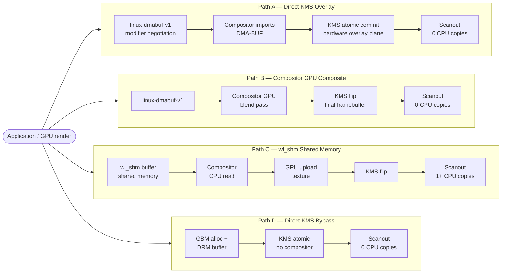

# Chapter 139: DRM Hardware Overlay Planes and Composition Bypass

**Target audiences**: Kernel KMS/display driver developers implementing plane support, Wayland compositor developers implementing direct scanout and plane allocation, and embedded Linux display engineers optimising power consumption via composition bypass.

---

## Table of Contents

1. [Introduction](#introduction)
2. [Display Engine Architecture](#display-engine-architecture)
3. [KMS Plane API: Objects, Properties, and Atomic Commits](#kms-plane-api-objects-properties-and-atomic-commits)
4. [Pixel Formats and DRM Modifiers](#pixel-formats-and-drm-modifiers)
5. [Composition Bypass and Direct Scanout](#composition-bypass-and-direct-scanout)
6. [Z-Order and Alpha Blending](#z-order-and-alpha-blending)
7. [Video Planes and Colour Space Conversion](#video-planes-and-colour-space-conversion)
8. [Compositor Plane Allocation Strategies](#compositor-plane-allocation-strategies)
9. [Debugging Hardware Planes](#debugging-hardware-planes)
10. [Integrations](#integrations)

---

## Introduction

Modern display engines — the silicon responsible for scanning framebuffers to the display panel — contain multiple independent **hardware planes** (also called overlays, layers, or sprites). Rather than requiring the GPU to composite all visual layers into a single framebuffer, hardware planes allow the display engine itself to blend images at scanout time, in real-time, without GPU involvement.

This hardware blending is significant for three reasons:

1. **Power**: a fully hardware-composited frame uses no GPU, saving 200–800 mW on mobile platforms
2. **Latency**: cursor movement can be reflected in the next frame without a GPU render pass
3. **Quality**: video content can be displayed at its native YUV format without GPU colour space conversion

The Linux Kernel Mode Setting (KMS) API exposes hardware planes as `drm_plane` objects. The atomic KMS commit API allows compositors to test and set plane configurations atomically. This chapter covers:

- **KMS plane object model** — `drm_plane` objects, plane types, and the property system
- **Atomic API for plane configuration** — testing and setting plane configurations atomically via `drmModeAtomicCommit`
- **DRM format and modifier negotiation** — FourCC pixel formats and 64-bit modifier support via the `IN_FORMATS` blob
- **Composition bypass (direct scanout)** — placing client surfaces directly on hardware planes, bypassing GPU compositing
- **Wayland compositor plane allocation** — strategies for assigning surfaces to hardware planes

[Linux kernel DRM plane documentation](https://www.kernel.org/doc/html/latest/gpu/drm-kms.html#plane-abstraction)

## Alternative Paths: GPU Frame to Compositor

A rendered GPU frame can reach the display via four distinct pipeline paths, each with different CPU copy counts, latency characteristics, and driver requirements.



| Path | Compositor | CPU copies | Requires | Typical use |
|------|-----------|------------|----------|------------|
| A — DMA-BUF → KMS overlay | Yes (assigns plane) | 0 | DRM format modifier agreement; hardware overlay plane | mpv video, hardware video decode surfaces |
| B — DMA-BUF → GPU composite | Yes (composites) | 0 | linux-dmabuf-v1 | Normal Wayland GPU-rendered windows |
| C — wl_shm → GPU upload | Yes | ≥1 | Nothing (universal fallback) | Software-rendered clients, Xwayland shm fallback |
| D — Direct KMS (no compositor) | No | 0 | KMS master / DRM lease | gamescope, VR runtimes (Monado), kiosk displays |

Path A is the most efficient for video surfaces: the VA-API decoder exports a DMA-BUF, the compositor negotiates a matching modifier via `zwp_linux_dmabuf_v1`, and the KMS plane scans the buffer directly without GPU compositing. Path D goes further — the compositor is not involved at all, which is the approach used by Monado and gamescope for sub-millisecond latency.

---

## Display Engine Architecture

### The Display Pipeline

Hardware planes feed into the display pipeline:

```
Plane 0 (Primary) ──┐
Plane 1 (Overlay) ──┤
Plane 2 (Overlay) ──┤→ Blender → CRTC → Encoder → Connector → Display
Plane 3 (Cursor) ───┘
```

Each plane has:
- An associated framebuffer (DMA-BUF or GEM BO)
- Source rectangle (which part of the framebuffer to display, in 16.16 fixed-point)
- Destination rectangle (where on the screen to place it, in pixels)
- Pixel format and modifier
- Z-position (layering order)
- Alpha and blend mode

### Platform Plane Counts

| GPU | Platform | Max Planes/CRTC | Notes |
|---|---|---|---|
| Intel Tiger Lake | `ICL` and later | Up to 7 | 5 universal + 1 sprite + 1 cursor |
| Intel Alder Lake | ADL+ | Up to 7 | All universal planes |
| AMD DCN 3.x | RX 6000+ | Up to 4 | DCN display core planes |
| Qualcomm SDM845 | DSS | Up to 6 | DPP units |
| Raspberry Pi 4 | VC4 | Up to 8 | Hardware pixel valves |

### Plane Types

```c
/* include/uapi/drm/drm_mode.h */
#define DRM_PLANE_TYPE_PRIMARY 0
#define DRM_PLANE_TYPE_OVERLAY 1
#define DRM_PLANE_TYPE_CURSOR  2
```

- **Primary**: one per CRTC; always present; used for the main framebuffer
- **Overlay**: additional planes; used for video, secondary surfaces, or UI layers
- **Cursor**: special 64×64 or 128×128 cursor plane with hardware move via `drmModeMoveCursor`

The `DRM_PLANE_TYPE_*` designation is advisory for userspace; the capabilities of each plane are described by its supported formats, modifiers, and properties.

### Kernel Plane Objects

```c
/* drivers/gpu/drm/drm_plane.c */
struct drm_plane {
    struct drm_device *dev;
    struct list_head head;
    char *name;
    struct drm_modeset_lock mutex;
    struct drm_mode_object base;
    uint32_t possible_crtcs;
    uint32_t *format_types;
    unsigned int format_count;
    uint64_t *modifiers;
    unsigned int modifier_count;
    const struct drm_plane_funcs *funcs;
    struct drm_plane_state *state;
    const struct drm_plane_helper_funcs *helper_private;
    struct drm_property *zpos_property;
    enum drm_plane_type type;
    /* ... */
};
```

---

## KMS Plane API: Objects, Properties, and Atomic Commits

### Enumerating Planes

```c
#include <xf86drm.h>
#include <xf86drmMode.h>

int fd = open("/dev/dri/card0", O_RDWR | O_CLOEXEC);

// Must request universal planes to see overlay and cursor planes:
drmSetClientCap(fd, DRM_CLIENT_CAP_UNIVERSAL_PLANES, 1);
drmSetClientCap(fd, DRM_CLIENT_CAP_ATOMIC, 1);

drmModePlaneRes *plane_res = drmModeGetPlaneResources(fd);
printf("Plane count: %u\n", plane_res->count_planes);

for (uint32_t i = 0; i < plane_res->count_planes; i++) {
    drmModePlane *plane = drmModeGetPlane(fd, plane_res->planes[i]);
    printf("Plane %u: crtc_id=%u, fb_id=%u, possible_crtcs=0x%x\n",
           plane->plane_id, plane->crtc_id,
           plane->fb_id, plane->possible_crtcs);
    drmModeFreePlane(plane);
}
```

### Plane Properties

Plane properties are set via the atomic API (`drmModeAtomicAddProperty`):

| Property | Type | Description |
|---|---|---|
| `FB_ID` | BLOB/uint32 | Framebuffer object ID to display |
| `CRTC_ID` | uint32 | Which CRTC this plane feeds; 0 to disable |
| `SRC_X`, `SRC_Y` | uint32 (16.16 fixed) | Source rectangle top-left (in sub-pixels) |
| `SRC_W`, `SRC_H` | uint32 (16.16 fixed) | Source rectangle dimensions |
| `CRTC_X`, `CRTC_Y` | int32 | Destination position on screen |
| `CRTC_W`, `CRTC_H` | uint32 | Destination size (scaling if ≠ SRC) |
| `ZPOS` | uint32 | Z-order; 0 = bottom |
| `ALPHA` | uint16 (0=transparent, 0xFFFF=opaque) | Plane-wide alpha |
| `PIXEL_BLEND_MODE` | enum | `None`, `Pre-multiplied`, `Coverage` |
| `ROTATION` | bitmask | `DRM_MODE_ROTATE_0/90/180/270 \| REFLECT_X/Y` |
| `COLOR_ENCODING` | enum | `ITU-R BT.601`, `BT.709`, `BT.2020 Constant Luminance` |
| `COLOR_RANGE` | enum | `YCbCr limited range`, `YCbCr full range` |
| `IN_FORMATS` | BLOB | Supported format+modifier combinations |

### Atomic Commit with Planes

```c
drmModeAtomicReq *req = drmModeAtomicAlloc();

// Enable an overlay plane:
drmModeAtomicAddProperty(req, plane_id, FB_ID_prop,   fb_id);
drmModeAtomicAddProperty(req, plane_id, CRTC_ID_prop, crtc_id);
drmModeAtomicAddProperty(req, plane_id, SRC_X_prop,   0 << 16);
drmModeAtomicAddProperty(req, plane_id, SRC_Y_prop,   0 << 16);
drmModeAtomicAddProperty(req, plane_id, SRC_W_prop,   width  << 16);
drmModeAtomicAddProperty(req, plane_id, SRC_H_prop,   height << 16);
drmModeAtomicAddProperty(req, plane_id, CRTC_X_prop,  dst_x);
drmModeAtomicAddProperty(req, plane_id, CRTC_Y_prop,  dst_y);
drmModeAtomicAddProperty(req, plane_id, CRTC_W_prop,  dst_width);
drmModeAtomicAddProperty(req, plane_id, CRTC_H_prop,  dst_height);
drmModeAtomicAddProperty(req, plane_id, ZPOS_prop,    1);
drmModeAtomicAddProperty(req, plane_id, ALPHA_prop,   0xFFFF);

// Test first (no visual change, returns 0 or -EINVAL):
int ret = drmModeAtomicCommit(fd, req, DRM_MODE_ATOMIC_TEST_ONLY, NULL);
if (ret == 0) {
    // Hardware supports this configuration; commit for real:
    drmModeAtomicCommit(fd, req, DRM_MODE_ATOMIC_NONBLOCK |
                        DRM_MODE_PAGE_FLIP_EVENT, user_data);
}

// Disable a plane: set CRTC_ID = 0
drmModeAtomicAddProperty(req, plane_id, CRTC_ID_prop, 0);
drmModeAtomicAddProperty(req, plane_id, FB_ID_prop,   0);
```

### Kernel Helper Functions

```c
/* drivers/gpu/drm/drm_atomic_helper.c */
int drm_atomic_helper_check_planes(struct drm_device *dev,
                                    struct drm_atomic_state *state);

void drm_atomic_helper_update_legacy_modeset_state(
    struct drm_device *dev, struct drm_atomic_state *old_state);

/* Per-driver plane helper: */
static const struct drm_plane_helper_funcs my_plane_helper_funcs = {
    .atomic_check   = my_plane_atomic_check,
    .atomic_update  = my_plane_atomic_update,
    .atomic_disable = my_plane_atomic_disable,
};
```

---

## Pixel Formats and DRM Modifiers

### FourCC Pixel Formats

DRM pixel formats are 4-byte FourCC codes from `include/uapi/drm/drm_fourcc.h` [Source](https://elixir.bootlin.com/linux/latest/source/include/uapi/drm/drm_fourcc.h):

```c
/* Common formats */
DRM_FORMAT_XRGB8888    /* 32bpp, 8 bits per channel, X filler */
DRM_FORMAT_ARGB8888    /* 32bpp with alpha */
DRM_FORMAT_RGB565      /* 16bpp packed RGB */
DRM_FORMAT_ABGR2101010 /* 30bpp + 2-bit alpha: wide colour / HDR */
DRM_FORMAT_XBGR2101010 /* 30bpp HDR, no alpha */

/* YUV formats for video */
DRM_FORMAT_NV12        /* 4:2:0 planar: Y plane + interleaved UV */
DRM_FORMAT_NV16        /* 4:2:2 planar */
DRM_FORMAT_YUV420      /* 4:2:0 three separate planes */
DRM_FORMAT_P010        /* 10-bit 4:2:0: Y16 + UV16 (HDR video) */
DRM_FORMAT_P016        /* 16-bit 4:2:0 */
```

### DRM Modifiers

Modifiers describe the memory layout (tiling, compression) of a framebuffer, beyond what the pixel format describes. They are 64-bit integers:

```c
/* include/uapi/drm/drm_fourcc.h */
#define DRM_FORMAT_MOD_LINEAR           0ULL  /* linear (scanline) layout */
#define DRM_FORMAT_MOD_INVALID          0xFFFFFFFFFFFFFFFFULL

/* Intel modifiers */
#define I915_FORMAT_MOD_X_TILED         0x0100000000000001ULL
#define I915_FORMAT_MOD_Y_TILED         0x0100000000000002ULL
#define I915_FORMAT_MOD_Y_TILED_CCS     0x0100000000000004ULL  /* CCS compressed */
#define I915_FORMAT_MOD_4_TILED         0x0100000000000009ULL  /* Xe/MTL tile4 */

/* AMD modifiers (DCC = Delta Color Compression) */
#define AMD_FMT_MOD_DCC                 (1ULL << 13)
#define AMD_FMT_MOD_TILE_VER_GFX10      2ULL
```

### IN_FORMATS Blob

The `IN_FORMATS` plane property is a blob describing which (format, modifier) combinations the plane supports:

```c
struct drm_format_modifier_blob {
    uint32_t version;         /* FORMAT_BLOB_CURRENT = 1 */
    uint32_t flags;
    uint32_t count_formats;
    uint32_t formats_offset;  /* offset to array of DRM_FORMAT_* */
    uint32_t count_modifiers;
    uint32_t modifiers_offset; /* offset to array of drm_format_modifier */
};

struct drm_format_modifier {
    uint64_t formats;         /* bitmask: which formats this modifier applies to */
    uint32_t offset;          /* index into formats array */
    uint32_t pad;
    uint64_t modifier;
};
```

Compositors parse `IN_FORMATS` to determine which format+modifier pairs can be directly scanned out by a plane without CPU conversion.

### Creating a Framebuffer with Modifiers

```c
uint32_t handles[4] = { gem_handle, 0, 0, 0 };
uint32_t pitches[4] = { stride, 0, 0, 0 };
uint32_t offsets[4] = { 0, 0, 0, 0 };
uint64_t modifiers[4] = { DRM_FORMAT_MOD_LINEAR, 0, 0, 0 };

uint32_t fb_id;
drmModeAddFB2WithModifiers(fd, width, height,
    DRM_FORMAT_ARGB8888, handles, pitches, offsets,
    modifiers, &fb_id, DRM_MODE_FB_MODIFIERS);
```

---

## Composition Bypass and Direct Scanout

### What Is Direct Scanout?

Direct scanout (also called composition bypass) places a client surface **directly onto a hardware plane**, bypassing GPU compositing entirely. The compositor acts only as a scheduler: it assigns a DMA-BUF from the Wayland client to a hardware plane and commits atomically, without any copy or blend on the GPU.

### Prerequisites for Direct Scanout

1. **Format+modifier match**: The client buffer's format and modifier must appear in the plane's `IN_FORMATS` blob
2. **No scaling**: source rect must equal destination rect in dimensions (most hardware can't scale and alpha-blend simultaneously)
3. **Full coverage** (for primary plane): the surface must cover the entire CRTC output
4. **Transform**: `DRM_MODE_ROTATE_0` unless the hardware supports rotated scanout
5. **Fencing**: an acquire fence must be signalled before scanout

### Testing with DRM_MODE_ATOMIC_TEST_ONLY

```c
// Build atomic request with the client buffer:
drmModeAtomicReq *req = drmModeAtomicAlloc();
drmModeAtomicAddProperty(req, plane_id, FB_ID_prop, client_fb_id);
// ... (CRTC_ID, SRC, CRTC rects)

// Test without committing:
int ret = drmModeAtomicCommit(fd, req,
    DRM_MODE_ATOMIC_TEST_ONLY | DRM_MODE_ATOMIC_NONBLOCK, NULL);

if (ret == 0) {
    // Hardware CAN scan this buffer directly
    // Commit for real with page flip event
} else if (ret == -EINVAL) {
    // Hardware cannot; fall back to GPU composition
}
```

### wlroots Direct Scanout

wlroots (`backend/drm/drm.c`) implements direct scanout via `wlr_drm_output_test_buffer`:

```c
/* wlroots: test if a wlr_buffer can be directly scanned out */
bool wlr_drm_connector_test_primary_fb(struct wlr_drm_connector *conn,
    struct wlr_buffer *buffer)
{
    struct wlr_drm_fb *fb = drm_fb_get_from_buffer(conn->backend, buffer);
    if (!fb) return false;

    // Test with DRM_MODE_ATOMIC_TEST_ONLY
    return drm_atomic_connector_commit(conn, fb, /*test=*/true) == 0;
}
```

### Power Impact

On a typical laptop:
- Full-screen video in `mpv --vo=drm`: ~2.5 W GPU power (direct scanout, GPU near idle)
- Full-screen video via compositor (GPU compositing): ~4.5 W GPU power
- Cursor movement with hardware cursor plane: 0 W GPU cost (no render required)

This makes direct scanout critical for battery life in media playback scenarios.

---

## Z-Order and Alpha Blending

### ZPOS Property

The `ZPOS` property controls layering order. Lower values appear below higher values:

```
ZPOS 0: wallpaper (primary plane, opaque)
ZPOS 1: browser window (overlay, with ARGB8888 alpha)
ZPOS 2: notification popup (overlay, with alpha)
ZPOS 255: cursor (cursor plane)
```

Zpos ranges are driver-specific; compositors query `min_zpos` and `max_zpos` from the property range.

### ALPHA Property

The `ALPHA` property applies a plane-wide multiplier. Range: 0 (transparent) to 0xFFFF (fully opaque). This multiplies the per-pixel alpha from ARGB formats:

```c
// Semi-transparent notification at 75% opacity:
drmModeAtomicAddProperty(req, plane_id, ALPHA_prop,
    (uint64_t)(0.75 * 0xFFFF));
```

### PIXEL_BLEND_MODE

```c
/* Blend modes */
DRM_MODE_BLEND_PIXEL_NONE  /* ignore pixel alpha; use plane ALPHA only */
DRM_MODE_BLEND_PREMULTI    /* pixel colour is pre-multiplied by its alpha */
DRM_MODE_BLEND_COVERAGE    /* straight alpha (colour / alpha before blending) */
```

Most hardware supports `Pre-multiplied` (the default for Wayland surfaces) and `Coverage` (X11-style). Some hardware only supports one mode.

### Cursor Plane Optimisation

The cursor plane receives special treatment in KMS: `drmModeMoveCursor(fd, crtc_id, x, y)` repositions the cursor plane without a full atomic commit. This is the lowest-latency path for cursor tracking — the hardware updates the cursor position at the next scanout without any CPU involvement in the framebuffer.

```c
// Efficient cursor move (no page flip required):
drmModeMoveCursor(fd, crtc_id, pointer_x, pointer_y);
```

Cursor planes are typically limited to 64×64 or 128×128 pixels. Most compositors render the cursor surface into a dedicated GEM buffer at startup and then only move it.

---

## Video Planes and Colour Space Conversion

### YUV Video on Overlay Planes

Video codecs produce frames in YCbCr (YUV) colour spaces. Displaying them on a plane without GPU conversion requires:

1. A plane that supports `DRM_FORMAT_NV12` (or `NV16`, `P010`, etc.)
2. The `COLOR_ENCODING` property set to match the video's colour space
3. The `COLOR_RANGE` property set (limited or full range)

```c
/* Configure plane for NV12 (H.264/H.265 decoded video at BT.709): */
drmModeAtomicAddProperty(req, plane_id, FB_ID_prop, nv12_fb_id);
drmModeAtomicAddProperty(req, plane_id, COLOR_ENCODING_prop,
    DRM_COLOR_YCBCR_BT709);
drmModeAtomicAddProperty(req, plane_id, COLOR_RANGE_prop,
    DRM_COLOR_YCBCR_LIMITED_RANGE);
```

### Zero-Copy VA-API → Plane Path

```
Decoder (VA-API) → NV12 DMA-BUF → import as DRM FB → overlay plane
```

The complete zero-copy path: the video decoder (VA-API or V4L2) writes decoded frames directly into a DMA-BUF. The display compositor imports this DMA-BUF as a DRM framebuffer and places it on an overlay plane. No GPU copy, no CPU memory touch per frame.

```bash
# mpv with DRM backend (direct KMS, no compositor):
mpv --vo=drm --drm-connector=HDMI-A-1 video.mkv

# mpv via Wayland (compositor handles plane assignment):
mpv --vo=gpu --gpu-api=vulkan video.mkv
# If RADV supports direct scanout for NV12, compositor places on overlay plane
```

### Hardware Scaling

When `CRTC_W/H ≠ SRC_W/H`, the display engine scales the plane content. This is distinct from GPU scaling: the display engine hardware scaler (e.g. Intel PSR scaler, AMD DCN scaler) handles it at scanout time, consuming minimal power compared to GPU upscaling.

```c
/* Scale a 1920×1080 NV12 video to 2560×1440 display area: */
drmModeAtomicAddProperty(req, plane_id, SRC_W_prop, 1920 << 16);
drmModeAtomicAddProperty(req, plane_id, SRC_H_prop, 1080 << 16);
drmModeAtomicAddProperty(req, plane_id, CRTC_W_prop, 2560);
drmModeAtomicAddProperty(req, plane_id, CRTC_H_prop, 1440);
```

Not all planes support scaling; check `DRM_MODE_ATOMIC_TEST_ONLY`.

### Intel PSR (Panel Self-Refresh)

Intel's PSR feature reduces power by keeping the display panel in a self-refresh mode when the screen content is unchanged. PSR interacts with overlay planes: if any plane changes, PSR must wake the panel. Hardware planes that change frequently (video, cursor) must be carefully managed to avoid excessive PSR wakeups.

---

## Compositor Plane Allocation Strategies

### The Allocation Problem

A compositor has N surfaces in a window stack, M hardware planes, and must decide which surfaces to assign to hardware planes (saving GPU work) vs which to GPU-composite into the primary framebuffer.

Key constraints:
- Plane format+modifier must match surface format+modifier
- Plane Z-order must match surface stack order
- Hardware may have additional constraints (no alpha on certain planes, size limits)

### Greedy Z-Order Algorithm

The simplest strategy: iterate surfaces from bottom to top, try to assign each to a hardware plane, fall back to GPU composition for surfaces that don't fit:

```
surfaces = [wallpaper, browser, video, notification, cursor]
planes   = [primary, overlay1, overlay2, cursor_plane]

Try assigning wallpaper  → primary plane  (ATOMIC_TEST → success)
Try assigning browser    → overlay1      (ATOMIC_TEST → fail: format)
  → mark browser for GPU composition
Try assigning video      → overlay2      (ATOMIC_TEST → success: NV12 supported)
Try assigning notification → (no planes left) → GPU composition
Try assigning cursor     → cursor_plane  (success: always)

Result: GPU composites [wallpaper+browser+notification] → primary plane
        Video direct on overlay2
        Cursor direct on cursor_plane
```

### wlroots Plane Allocation

wlroots' DRM backend (`backend/drm/drm.c`) tests each surface:

```c
struct wlr_drm_plane *plane =
    drm_plane_for_connector(conn, surface->zpos);

bool can_direct = wlr_drm_connector_test_primary_fb(conn, surface->buffer);
if (can_direct) {
    drm_plane_set_fb(plane, surface_fb);
} else {
    // Fall back: render surface into the compositor's scanout buffer
    renderer_blit(conn->renderer, surface, composite_fb);
}
```

### Mutter Plane Allocation (GNOME)

Mutter's Clutter-based compositor integrates plane allocation with `MetaKmsDevice`. Mutter maintains a list of KMS planes and assigns them during frame preparation, coordinated with Clutter's scene graph. The `MetaKmsUpdate` object accumulates plane assignments and commits them atomically.

### DRM_MODE_ATOMIC_NO_MODESET Page Flip

For every-frame page flips (video or animation), compositors use `DRM_MODE_ATOMIC_NO_MODESET` (faster, no display pipeline reconfiguration):

```c
int ret = drmModeAtomicCommit(fd, req,
    DRM_MODE_ATOMIC_NONBLOCK |
    DRM_MODE_PAGE_FLIP_EVENT |
    DRM_MODE_ATOMIC_NO_MODESET,  // no CRTC mode change
    flip_data);
```

---

## Debugging Hardware Planes

### Kernel State Dump

```bash
# Full atomic state dump (all planes, CRTCs, connectors):
cat /sys/kernel/debug/dri/0/state

# Example output excerpt:
# plane[31]:overlay-0
#   crtc=crtc[32]:pipe-A
#   fb=framebuffer[76](1920x1080)
#   FB_ID=76 CRTC_ID=32 SRC_X=0 SRC_Y=0 SRC_W=1920 SRC_H=1080
#   CRTC_X=0 CRTC_Y=0 CRTC_W=1920 CRTC_H=1080 ZPOS=1
```

### Intel-Specific Debugging

```bash
# Display info including active planes:
cat /sys/kernel/debug/dri/0/i915_display_info

# Plane register state:
cat /sys/kernel/debug/dri/0/i915_planes

# Enable DRM debug messages:
echo 0x04 > /sys/module/drm/parameters/debug  # DRM_UT_ATOMIC
dmesg | grep -i "plane\|atomic"
```

### AMD-Specific Debugging

```bash
# AMD DC (Display Core) visual confirmation overlay:
echo 1 > /sys/kernel/debug/dri/0/amdgpu_dm_visual_confirm

# This draws a coloured border around surfaces handled by the display engine
# vs surfaces that had to go through GPU composition

# Full DC state:
cat /sys/kernel/debug/dri/0/amdgpu_dm_dp_mst_info
```

### modetest Plane Testing

`modetest` from the `libdrm-tests` package allows manual plane configuration:

```bash
# List all planes:
modetest -p

# Set a plane directly (e.g. overlay plane 31 on CRTC 32, 100x100 at offset 200,200):
modetest -s 32:1920x1080 -P 31@32:100x100+200+200:XR24

# Test cursor plane:
modetest -s 32:1920x1080 -P 33@32:64x64+960+540:AR24
```

### wlroots Debug Logging

```bash
# Enable DRM backend debug output:
WLR_DRM_DEBUG=1 sway 2>&1 | grep -i "plane\|direct\|scanout"

# weston debug (similar):
WESTON_DEBUG=drm-backend weston 2>&1 | grep plane
```

---

## Roadmap

### Near-term (6–12 months)

- **DRM Color Pipeline API rollout to compositor stacks**: The per-plane Color Pipeline API merged into Linux 6.19 (drm-misc-next, November 2025) and NVIDIA published a preview open-kernel-module implementation in April 2026. Mutter, KWin, and wlroots are actively integrating it to offload per-plane HDR tone-mapping to display hardware rather than GPU shaders. [Source](https://www.phoronix.com/news/NVIDIA-Preview-DRM-Color-Pipe) [Source](https://docs.kernel.org/gpu/rfc/color_pipeline.html)
- **NVIDIA open driver plane support hardening**: The NVIDIA 610.43.02 driver (May 2026) introduced production HDR output support; near-term work focuses on stabilising per-plane colour pipeline negotiation for Wayland compositors that rely on the `drm_color_pipeline` property chain. [Source](https://ubuntuhandbook.org/index.php/2026/05/nvidia-610-43-02-released-with-hdr-output-support-for-linux/)
- **Mutter/GNOME direct scanout reliability improvements**: Mutter 46+ now falls back from direct scanout correctly for scaled outputs; ongoing work targets more surface types (video subtitles, cursor overlays) as valid direct-scanout candidates without compositor GPU blend. Note: needs verification of exact milestone.
- **`DRM_FORMAT_P010` and `BT.2020` overlay for HDR10 video**: AMD DCN and Intel display engine plane support for P010/P016 with full HDR metadata (`HDR_OUTPUT_METADATA` property) on overlay planes is being aligned across distros shipping kernel 6.19+. [Source](https://www.omgubuntu.co.uk/2026/02/linux-6-19-kernel-features-amd-performance)
- **Splash DRM client and kmsprint tooling**: An RFC Splash DRM client for kernel-space boot splash (reducing dependency on fbdev) has been proposed; related tooling improvements to `modetest` and `kmsprint` are expected to expose plane colour-pipeline properties. [Source](https://www.phoronix.com/news/Linux-Splash-DRM-Client-RFC)

### Medium-term (1–3 years)

- **Plane-level colour pipeline for all major vendor drivers**: Intel i915/xe, AMD AMDGPU, and Qualcomm DRM drivers are expected to implement `drm_color_pipeline` callbacks for their display engines, enabling compositors to query per-plane tone-mapping and gamut-mapping hardware capabilities via a unified kernel API. [Source](https://canartuc.medium.com/drm-color-pipeline-api-and-hdr-on-linux-the-long-road-to-proper-display-color-management-539d56acaa33)
- **Extended plane capability introspection**: Proposals exist in the DRM community to standardise plane capability reporting (rotation, scaling limits, format modifier fallback chains) through a richer property model, reducing the need for compositor-side trial-and-error atomic `TEST_ONLY` commits.  Note: needs verification of specific patchset status.
- **Multi-plane video overlay for HDR + SDR simultaneous**: As displays gain dual-pipeline HDR/SDR support, driver work is expected to enable one overlay plane in `BT.2020/PQ` and a second in `sRGB` on the same CRTC — relevant for picture-in-picture and HUD overlays in gaming and VR contexts.
- **DRM lease API enhancements for VR/XR**: Monado and other XR runtimes rely on DRM leases for direct KMS access (Path D). Upcoming work targets lease introspection APIs so runtimes can enumerate which planes are available under a lease without requiring KMS master. Note: needs verification.
- **`VKMS` overlay plane improvements**: The virtual KMS (VKMS) driver is gaining overlay plane compositing support in CI pipelines; this enables automated testing of multi-plane compositor logic without real hardware. [Source](https://docs.kernel.org/gpu/vkms.html)

### Long-term

- **Hardware plane allocation as a compositor service**: Architectural discussions in the Wayland ecosystem consider exposing a plane-allocation protocol so privileged clients (video players, VR runtimes) can negotiate hardware planes directly through the compositor rather than requiring DRM lease or KMS master, improving security and multi-client coordination. Note: speculative — no formal protocol draft exists yet.
- **AI-assisted plane assignment**: GPU vendors are exploring using on-die ML inference blocks to predict optimal plane assignments (direct scanout vs. GPU composite) based on content classification (video, UI, game), potentially offloading the compositor's atomic test loop. Note: speculative direction.
- **Unified cross-vendor modifier registry**: Long-term goal of a machine-readable, formally versioned `drm_format_modifier` registry (beyond the current header-comment approach) would allow user-space libraries to negotiate modifiers without embedding per-vendor knowledge. This would simplify GBM/EGL modifier negotiation across the stack.
- **Display engine compute offload**: Future display engines (post-DCN 4.x, post-Xe) may expose programmable blend stages accessible via the KMS plane API, blurring the boundary between hardware overlay and lightweight GPU compute — allowing tone curves and dithering to run on the display engine without a full GPU render pass.

---

## Integrations

- **Ch2 (KMS)** — DRM plane objects are first-class KMS citizens; atomic KMS is the foundation of the plane API described here
- **Ch3 (Advanced Display)** — HDR planes (`P010`, `ABGR2101010` formats), wide-colour planes; HDR metadata properties
- **Ch4 (DMA-BUF)** — plane surfaces backed by DMA-BUF; zero-copy import from GPU/decoder
- **Ch20 (Wayland core)** — compositor direct scanout: Wayland surfaces become DRM framebuffers on overlay planes
- **Ch21 (wlroots)** — wlroots DRM backend plane allocation; `wlr_drm_connector_test_primary_fb`
- **Ch22 (Compositors: Mutter, KWin)** — Mutter/KWin plane allocators integrated with Clutter/Qt scene graphs
- **Ch38 (Video Decode / VA-API)** — NV12 DMA-BUF from VA-API decoder placed directly on overlay plane (zero-copy video)
- **Ch74 (HDR)** — `DRM_FORMAT_P010` + `COLOR_ENCODING` + `BT.2020` for HDR10 video on overlay planes
- **Ch123 (Screen Capture)** — DRM writeback connector captures the post-blend output of all planes

---

*Copyright © 2026 jreuben11. Licensed under [CC BY 4.0](https://creativecommons.org/licenses/by/4.0/).*
