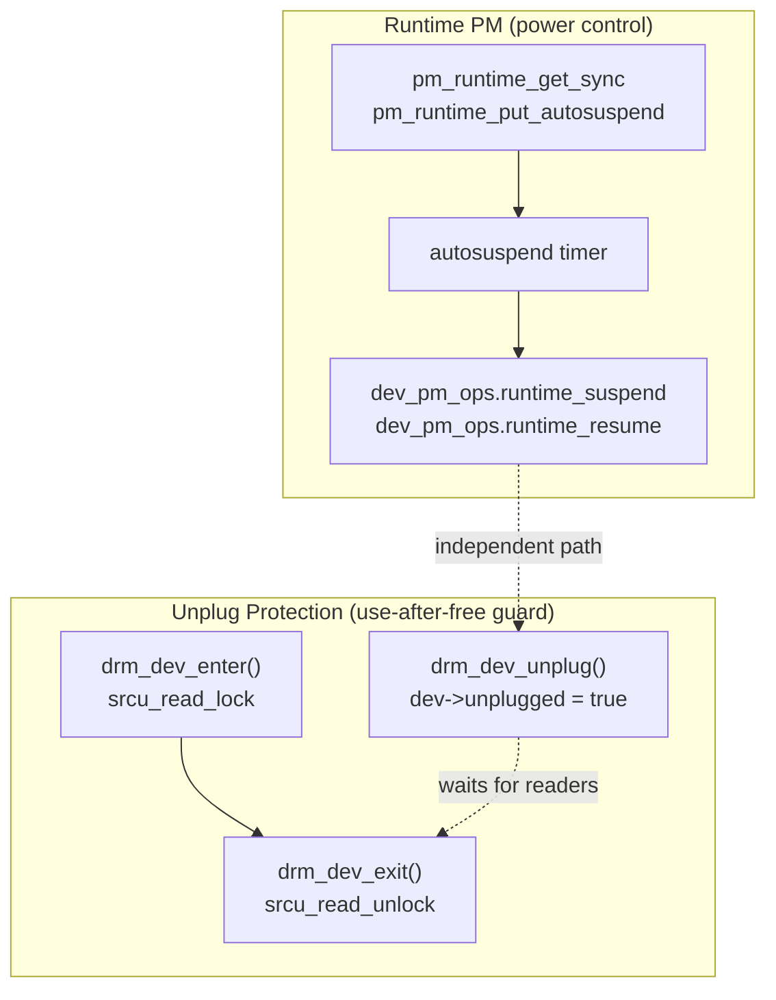
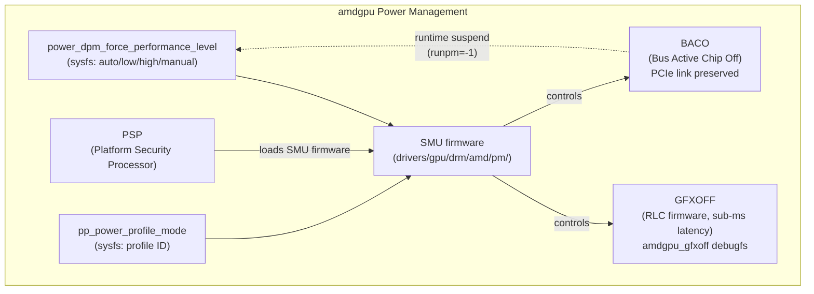
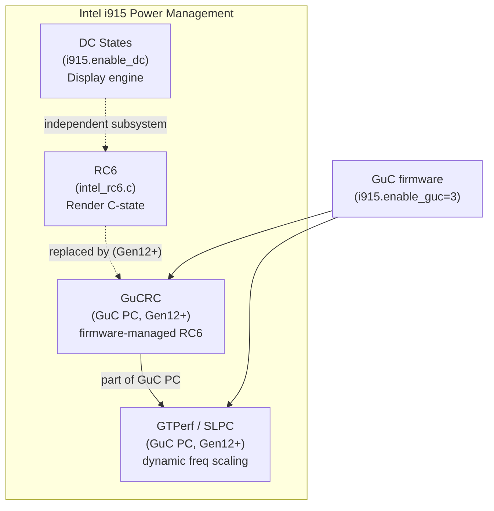
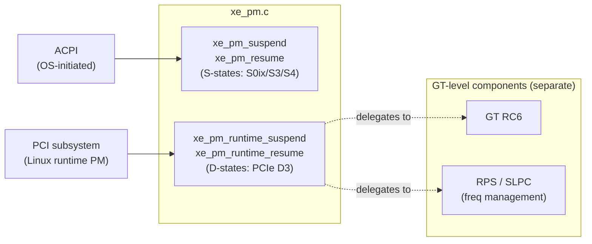
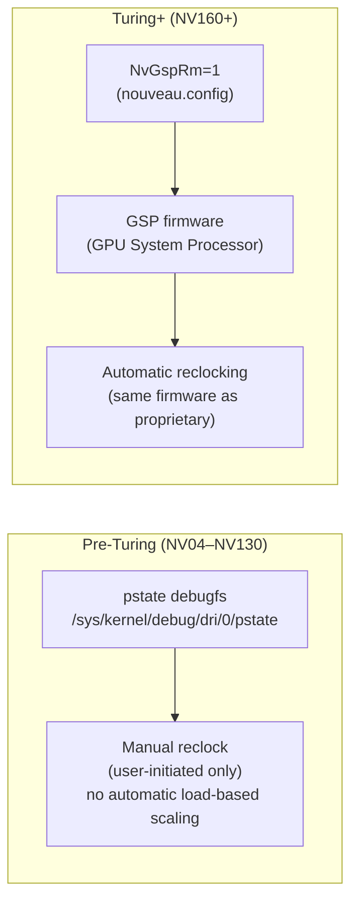
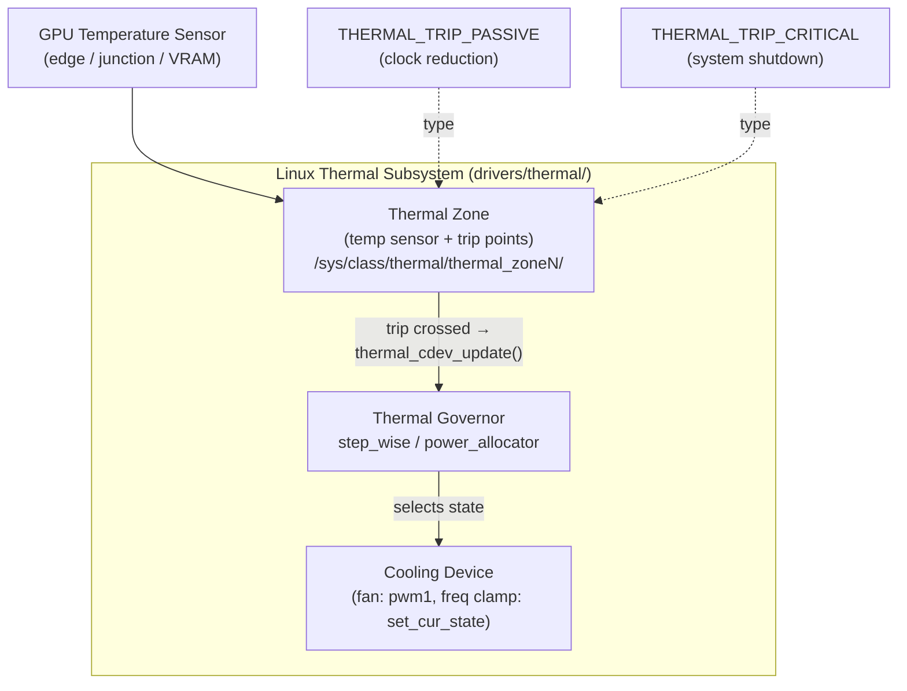
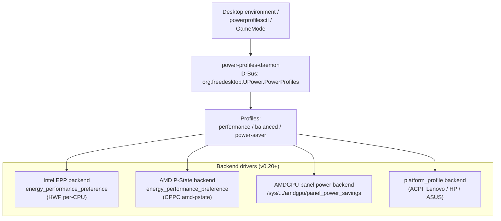

# Chapter 51: GPU Power Management and Thermal

This chapter targets two audiences: **systems and driver developers** who need to understand how the Linux kernel arbitrates power states across GPU subsystems, and **graphics application developers** — particularly those working in laptop, embedded, or battery-constrained environments — who must reason about performance throttling, power caps, and profile selection. The chapter covers the DRM runtime PM framework, per-vendor power management architectures, the Linux thermal subsystem, userspace profile daemons, and the monitoring tools that expose all of this to operators and developers.

---

## Table of Contents

1. [DRM Runtime PM Framework](#1-drm-runtime-pm-framework)
2. [amdgpu Power Management](#2-amdgpu-power-management)
3. [Intel i915 and Xe Power Management](#3-intel-i915-and-xe-power-management)
4. [NVIDIA Proprietary Power Management](#4-nvidia-proprietary-power-management)
5. [Nouveau Power Management](#5-nouveau-power-management)
6. [Thermal Management Framework](#6-thermal-management-framework)
7. [power-profiles-daemon and powerprofilesctl](#7-power-profiles-daemon-and-powerprofilesctl)
8. [Tools and Monitoring](#8-tools-and-monitoring)
9. [Integrations](#integrations)

---

## 1. DRM Runtime PM Framework

GPU power management in Linux is built on two overlapping but distinct mechanisms: the generic **Runtime Power Management** framework (**runtime PM**) for controlling when hardware is powered, and the **DRM device-protection** helpers that guard against post-unplug use-after-free scenarios. A driver developer must understand both, and must not conflate them. The **runtime PM** core provides the **pm_runtime_get_sync()**, **pm_runtime_put_autosuspend()**, and **pm_runtime_mark_last_busy()** functions that DRM drivers call to track usage and schedule idle suspend; the autosuspend timer fires the **dev_pm_ops.runtime_suspend** and **dev_pm_ops.runtime_resume** callbacks. Unplug protection is handled separately by **drm_dev_enter()** and **drm_dev_exit()**, which use **SRCU** (Sleeping Read-Copy-Update) to guard IOCTLs against concurrent device removal. The interaction between **DPMS** (Display Power Management Signaling) and runtime PM — particularly on **Optimus**/**PRIME** laptops where a discrete GPU must power down when no **CRTC** output is active — is driver-specific and depends on correct implementation of **drm_crtc_funcs.disable** and **drm_encoder_funcs.disable**.

The chapter then examines per-vendor power management architectures. The **amdgpu** driver exposes **DPM** (Dynamic Power Management) via the **power_dpm_force_performance_level** and **pp_power_profile_mode** sysfs interfaces, the **BACO** (Bus Active Chip Off) low-power PCIe state for discrete GPU runtime suspend, the **GFXOFF** sub-millisecond GFX engine power gate controlled by the **RLC** firmware, and the **SMU** (System Management Unit) microcontroller that enforces **TDP** limits and drives the **PSP** (Platform Security Processor)-loaded firmware stack. **APU** vs. discrete GPU power differences — including **BAPM** (Bidirectional Application Power Management) on **SoC** designs — and the **ppfeaturemask** module parameter for selectively enabling **PowerPlay** features are also covered.

For Intel hardware, the chapter covers **RC6** (Render C-state 6) as implemented in **intel_rc6.c**, the transition to **GuC** (Graphics Microcontroller) firmware-managed **GuCRC** and **SLPC** (Single Loop Power Conservation) on **Gen12** (Tiger Lake) and newer platforms, display-engine **DC states** controlled by the **i915.enable_dc** parameter, and the **Xe** driver's **xe_pm_runtime_suspend()** / **xe_pm_runtime_resume()** hooks for **Arc Alchemist** and **Battlemage** (**Xe2**) hardware including **ACPI** **S-state** and **PCIe D-state** management.

On the proprietary NVIDIA side, the chapter addresses **nvidia-smi** persistence mode (**nvidia-smi -pm**), **TGP** (Total Graphics Power) and **cTGP** on laptop SKUs, **--power-limit** capping for desktop GPUs, **RTD3** (Runtime D3) dynamic power management via the **NVreg_DynamicPowerManagement** kernel module parameter, and power management differences in the **nvidia-open** open-kernel-module driver. The **Nouveau** open-source driver is covered separately, tracing its evolution from manual **pstate** debugfs reclocking on **Kepler**, **Maxwell**, and **Pascal** (**NVE0**–**NV130**) generations to automatic reclocking via the **GSP** (GPU System Processor) firmware on **Turing** (**NV160**) and newer under **NvGspRm**, as well as the **nouveau.runpm** parameter for hybrid graphics configurations.

The thermal management section describes the kernel's **drivers/thermal/** subsystem: **thermal zones**, **thermal governors** (**step_wise**, **power_allocator**), and **cooling devices** including **hwmon** **pwm1** fan control and frequency clamping via **set_cur_state**. It covers **amdgpu** thermal zone registration (edge, junction, and **VRAM** temperature sensors via **temp1_input** / **temp2_input** / **temp3_input**), the **SMU** firmware's independent thermal throttle policy, the **gpu_metrics** sysfs blob, and userspace fan control tools including **thinkfan** and **NBFC-Linux**.

The userspace policy layer is covered through **power-profiles-daemon** (D-Bus service **org.freedesktop.UPower.PowerProfiles**) and its **powerprofilesctl** front-end, which translate **performance** / **balanced** / **power-saver** profiles into driver-specific settings via backend drivers for Intel **HWP** **EPP** (energy_performance_preference), AMD **CPPC** **amd-pstate**, **AMDGPU** panel power savings (**ABM**), and **ACPI** **platform_profile** on Lenovo, HP, and ASUS laptops.

Finally, the monitoring and tooling section surveys **powertop** for system-wide runtime PM status, **turbostat** for package and **GFXWatt** reporting on Intel and AMD **APU** platforms, **rocm-smi** for AMD **ROCm** GPU power and thermal monitoring, **intel_gpu_top** for **i915**/**Xe** engine utilisation and **RC6** residency, **nvtop** for cross-vendor GPU process monitoring via **DRM** and **hwmon** sysfs, **nvidia-smi** for NVIDIA power monitoring and control, and direct **sysfs** inspection patterns for scripted environments.



### 1.1 Linux Runtime PM Core

The Linux runtime PM framework ([Source: Documentation/power/runtime_pm.rst](https://dri.freedesktop.org/docs/drm/power/runtime_pm.html)) allows individual devices to be suspended and resumed independently of system-wide sleep states. The two central operations for DRM drivers are:

```c
/* drivers/gpu/drm/i915/intel_runtime_pm.c — request device active */
pm_runtime_get_sync(kdev);           /* increments usage count, resumes device */
pm_runtime_mark_last_busy(kdev);     /* reset the autosuspend idle timer */
pm_runtime_put_autosuspend(kdev);    /* decrement count; schedule autosuspend after delay */
```

The **autosuspend delay** is the idle time the PM core waits after the usage count drops to zero before calling the driver's `->runtime_suspend` callback. Intel i915 historically configured this as:

```c
/* drivers/gpu/drm/i915/intel_runtime_pm.c */
pm_runtime_set_autosuspend_delay(kdev, 10000); /* 10 seconds */
pm_runtime_use_autosuspend(kdev);
pm_runtime_allow(kdev);
```

When autosuspend fires, the PM core calls the driver's `dev_pm_ops.runtime_suspend` callback. For DRM drivers this often delegates to `drm_mode_config_helper_suspend()`, which serialises against the KMS modesetting lock and tears down display hardware state. On resume, `drm_mode_config_helper_resume()` restores it.

The `/sys/class/drm/cardN/device/power/` directory exposes runtime PM state to userspace:

| Attribute | Description |
|-----------|-------------|
| `control` | `auto` (runtime PM enabled) or `on` (always active) |
| `autosuspend_delay_ms` | Delay before idle suspend fires |
| `runtime_status` | `active`, `suspended`, `suspending`, `resuming`, `error` |
| `runtime_active_time` | Milliseconds spent in active state since boot |
| `runtime_suspended_time` | Milliseconds spent suspended since boot |
| `runtime_usage` | Current usage count |

Writing `on` to `control` forces the device permanently active — useful for debugging hang-on-suspend issues. Writing `auto` re-enables the runtime PM policy.

### 1.2 drm_dev_enter / drm_dev_exit: Unplug Protection

`drm_dev_enter()` and `drm_dev_exit()` are **not** runtime PM operations. They protect code sections against execution after a device has been unplugged (e.g., a Thunderbolt eGPU or USB display adapter is removed while a process holds the DRM file descriptor). Their implementation uses SRCU (Sleeping Read-Copy-Update):

```c
/* drivers/gpu/drm/drm_drv.c (linux master, 2024) */
bool drm_dev_enter(struct drm_device *dev, int *idx)
{
    *idx = srcu_read_lock(&drm_unplug_srcu);
    if (dev->unplugged) {
        srcu_read_unlock(&drm_unplug_srcu, *idx);
        return false;
    }
    return true;
}

void drm_dev_exit(int idx)
{
    srcu_read_unlock(&drm_unplug_srcu, idx);
}
```

[Source: drivers/gpu/drm/drm_drv.c](https://github.com/torvalds/linux/blob/master/drivers/gpu/drm/drm_drv.c)

The pattern in an IOCTL or sysfs handler is:

```c
int drm_ioctl_handler(struct drm_device *dev, ...)
{
    int idx;
    if (!drm_dev_enter(dev, &idx))
        return -ENODEV;
    /* ... access hardware ... */
    drm_dev_exit(idx);
    return 0;
}
```

When `drm_dev_unplug()` is called (e.g., from the USB disconnect path), it sets `dev->unplugged = true` and waits for all concurrent SRCU readers to finish before tearing down the device. This is separate from runtime suspend: the device can be unplugged while fully active, or while suspended.

### 1.3 DPMS and Runtime Suspend Interaction

DPMS (Display Power Management Signaling) interacts with runtime PM in a driver-specific way. When all display outputs are DPMS-off (via `drm_connector_dpms()` or KMS property updates setting `DRM_MODE_DPMS_OFF`), the display engine no longer needs the GPU active. Drivers that implement `drm_crtc_funcs.disable` and `drm_encoder_funcs.disable` will drop their runtime PM references at that point. Once the usage count reaches zero and the autosuspend timer expires, the kernel suspends the device.

This path is important on Optimus/PRIME laptops: when the dGPU handles no CRTC outputs (all displays are on the iGPU), and no userspace DRM client holds the dGPU's render node open, the dGPU's PM usage count can reach zero and the driver can enter BACO or D3 suspension automatically.

Drivers that do not properly release their PM references when all CRTCs are disabled will prevent the GPU from autosuspending. This is a common source of unexpected power drain on laptops. The Nouveau driver, for instance, historically had bugs where the fbcon framebuffer layer held a PM reference even when the screen was blank.

Note: the exact handoff between KMS DPMS callbacks and runtime PM release is driver-specific. It depends on whether the driver has implemented `drm_crtc_helper_funcs.disable` correctly, whether DRM's internal reference counting is complete, and whether any external userspace process holds the device open. Driver source review is required for any given driver; there is no single DRM-level guarantee. This is a needs-verification area for any driver not explicitly listed in the kernel's `Documentation/gpu/` docs as supporting runtime PM.

---

## 2. amdgpu Power Management

The amdgpu driver exposes one of the richest power management interfaces in the kernel, spanning sysfs files, debugfs, module parameters, and SMU firmware interaction. [Source: GPU Power/Thermal Controls and Monitoring](https://docs.kernel.org/gpu/amdgpu/thermal.html)

### 2.1 Power State Sysfs Interface

The primary control file is `power_dpm_force_performance_level`:

```bash
# Path: /sys/class/drm/card0/device/power_dpm_force_performance_level
cat /sys/class/drm/card0/device/power_dpm_force_performance_level
# -> auto

# Force the card to always use lowest clocks:
echo "low" > /sys/class/drm/card0/device/power_dpm_force_performance_level

# Return to dynamic power management:
echo "auto" > /sys/class/drm/card0/device/power_dpm_force_performance_level
```

Valid values:
- `auto` — ASIC selects optimal power state dynamically
- `low` — Clamp to lowest available clock level
- `high` — Clamp to highest available clock level
- `manual` — User-specified DPM levels via `pp_dpm_*` files
- `profile_standard` — Fixed standard clock
- `profile_min_sclk` / `profile_min_mclk` — Minimum shader or memory clock
- `profile_peak` — All clocks at maximum (no thermal headroom reserved)

### 2.2 Power Profile Modes (pp_power_profile_mode)

The `pp_power_profile_mode` sysfs file configures the heuristics used by the SMU firmware to switch between DPM (Dynamic Power Management) levels. Reading it shows all profiles and their parameters; writing a numeric ID activates that profile. Manual mode must be active first:

```bash
# Enable manual control then read available profiles:
echo "manual" > /sys/class/drm/card0/device/power_dpm_force_performance_level
cat /sys/class/drm/card0/device/pp_power_profile_mode
```

Standard profile IDs (applicable to GCN/RDNA ASICs):

| ID | Name | Typical Use |
|----|------|-------------|
| 0 | BOOTUP_DEFAULT | Kernel default at boot |
| 1 | 3D_FULL_SCREEN | Gaming: aggressive ramp-up |
| 2 | POWER_SAVING | Efficient clocking for light workloads |
| 3 | VIDEO | Decode-optimised clocks |
| 4 | VR | Low-latency: avoids frequency dips between frames |
| 5 | COMPUTE | Stable compute clocks for ML/ROCm workloads |
| 6 | CUSTOM | User-defined heuristic parameters |

[Source: amdgpu-gfx mailing list patch documentation](https://lists.freedesktop.org/archives/amd-gfx/2018-April/021576.html)

Note: the exact heuristic parameters exposed by each profile vary by ASIC family. On RDNA3 the profile table columns differ from RDNA2. Reading the file on the target hardware is the authoritative way to see what is tunable.

For ROCm compute workloads, activating COMPUTE profile prevents the SMU from aggressively downclocking between dispatch waves:

```bash
echo 5 > /sys/class/drm/card0/device/pp_power_profile_mode
```

### 2.3 BACO (Bus Active Chip Off)

BACO is a low-power state for discrete GPUs where the PCIe bus clock remains active (so the device stays enumerated) but the GPU logic is powered off. It is used for runtime suspend of dGPUs — when the GPU has been idle long enough and BACO is supported, the driver powers off the compute and display engines while keeping the PCIe link alive for fast wake.

The key distinction between BACO and a full PCIe D3cold state is that BACO preserves the PCIe link, allowing the host to issue MMIO or DMA transactions that will wake the GPU without a full PCIe hot-reset cycle. This makes BACO transitions significantly faster than D3cold (hundreds of milliseconds vs. several seconds), which is important for dGPU workloads that have short, bursty idle periods. The PCIe specification's D3hot state is roughly analogous: the device remains addressable on the bus.

BACO is also one of the reset methods available after a GPU hang:

```c
/* drivers/gpu/drm/amd/include/amd_shared.h (module parameter reset_method) */
/* -1=auto, 0=legacy, 1=mode0, 2=mode1, 3=mode2, 4=baco */
```

When `reset_method=4` is selected, the driver uses a BACO cycle to reset the GPU rather than a bus-level reset, which avoids disturbing the PCIe link state. This is relevant on multi-GPU systems where a PCIe bus reset on one GPU may impact other devices sharing the segment.

Note: the detailed register-level mechanism by which BACO powers down and restores individual IP blocks (GFX, SDMA, VCN, display engine) is controlled by the SMU firmware and is not exposed as source code; the kernel driver triggers the transition via SMU messages. The exact power savings and wake latency of BACO vs. D3cold vary by ASIC generation and requires verification against the specific GPU being characterised.

The `amdgpu.runpm` module parameter controls whether runtime suspend (including BACO transitions) is enabled:
- `-1` — auto (enabled by default for supported dGPUs)
- `0` — disabled
- `-2` — auto, also considers attached displays when deciding to suspend

[Source: amdgpu Module Parameters](https://docs.kernel.org/gpu/amdgpu/module-parameters.html)

On multi-GPU laptops (see Ch49), BACO is the mechanism that allows the discrete GPU to be fully power-gated while the integrated GPU handles display, a significant source of battery improvement on Ryzen + Radeon laptop configurations.

### 2.4 GFXOFF

GFXOFF is a fine-grained power feature implemented in the GPU's RLC (RunList Controller) firmware. When the graphics and compute pipelines are idle, the RLC can power off the entire GFX engine block — register state, caches, and ALUs — and restore them transparently when work arrives. Unlike BACO, GFXOFF operates at the IP block level with sub-millisecond latency.

GFXOFF is enabled by default on supported ASICs (Vega20 and newer). It is controlled via debugfs:

```bash
# Disable GFXOFF for profiling stability:
echo 0 > /sys/kernel/debug/dri/0/amdgpu_gfxoff

# Re-enable:
echo 1 > /sys/kernel/debug/dri/0/amdgpu_gfxoff

# Check current state: 0=powered down, 1=transitioning out, 2=active, 3=transitioning in
cat /sys/kernel/debug/dri/0/amdgpu_gfxoff_status
```

Profiling tools (rocm-smi, RadeonTop) may need GFXOFF disabled to get stable hardware performance counter readings, since entering/exiting GFXOFF resets some counter state.

### 2.5 SMU Firmware

The SMU (System Management Unit) is a dedicated microcontroller embedded in AMD ASICs that runs its own firmware and handles all power, thermal, and clock management. The Linux amdgpu driver communicates with the SMU via a message-passing protocol defined in `drivers/gpu/drm/amd/pm/`. The SMU firmware is loaded by the PSP (Platform Security Processor) during driver initialisation alongside the GFX and SDMA firmware blobs.

The SMU is responsible for:
- Computing actual power states based on workload and temperature
- Enforcing TDP limits (configurable via `power1_cap` hwmon sysfs)
- Reporting temperature, fan speed, and power draw to the kernel
- Executing fan curves stored in VBIOS or overridden via sysfs `fan_curve`



### 2.6 APU vs. dGPU Power Differences

On AMD APUs (e.g., Steam Deck, Ryzen 7040 series), the GPU shares the SoC power budget with the CPU. The `bapm` (Bidirectional Application Power Management) module parameter controls whether the CPU and GPU can borrow TDP headroom from each other:

```
amdgpu.bapm=1   # allow CPU/GPU TDP sharing (default: -1/auto)
```

On APUs, the `in1_input` hwmon file reports the northbridge voltage alongside GPU voltage, and `power1_average` reflects total SoC power. The VRAM is system RAM, so there is no separate `freq2_input` memory clock file.

On dGPUs, the `runpm` parameter enables runtime suspend to BACO, and `power1_cap` allows power-capping below the card's TDP:

```bash
# Read current and maximum power cap (in microwatts):
cat /sys/class/drm/card0/device/hwmon/hwmon*/power1_cap
cat /sys/class/drm/card0/device/hwmon/hwmon*/power1_cap_max

# Reduce TDP by 20%:
echo 180000000 > /sys/class/drm/card0/device/hwmon/hwmon*/power1_cap
```

### 2.7 ppfeaturemask

The `amdgpu.ppfeaturemask` module parameter is a hexadecimal bitmask that enables or disables individual PowerPlay features. The bit definitions are in `drivers/gpu/drm/amd/include/amd_shared.h`, `enum PP_FEATURE_MASK`. Common use cases:

```
# Disable GFXOFF (bit 21 = 0x200000):
amdgpu.ppfeaturemask=0xffdfffff

# Disable OverDrive (bit 14 = 0x4000):
amdgpu.ppfeaturemask=0xfffd3fff
```

The default value enables all features the driver considers stable for the current ASIC. Disabling features is occasionally necessary for workaround of firmware bugs or to obtain stable performance counter readings in benchmarking contexts.

---

## 3. Intel i915 and Xe Power Management

### 3.1 RC6: Render C-States

RC6 (Render C-state 6) is Intel's GPU idle power-saving mechanism. When the render engine, blitter engine, and video engine are all idle and there are no outstanding GPU memory transactions, the GFX engine enters RC6, dropping its supply voltage to near-zero. The hardware restores state transparently on the next workload submission.

The implementation lives in `drivers/gpu/drm/i915/gt/intel_rc6.c`. Key functions:

```c
/* drivers/gpu/drm/i915/gt/intel_rc6.c */
void intel_rc6_init(struct intel_rc6 *rc6);
void intel_rc6_enable(struct intel_rc6 *rc6);   /* called after GT init */
void intel_rc6_disable(struct intel_rc6 *rc6);  /* called before GT teardown */
void intel_rc6_park(struct intel_rc6 *rc6);     /* deepen RC6 when GT parks */
void intel_rc6_unpark(struct intel_rc6 *rc6);   /* restore timers on unpark */
```

[Source: drivers/gpu/drm/i915/gt/intel_rc6.c](https://github.com/torvalds/linux/blob/master/drivers/gpu/drm/i915/gt/intel_rc6.c)

The `intel_rc6` struct tracks enabled/supported state, residency register mappings, and extended residency counters (needed because hardware counters wrap on long-running systems). Residency statistics are exposed to userspace via `intel_gpu_top` and through `/sys/kernel/debug/dri/0/i915_pm_rc6_residencies`.

The historical `i915.enable_rc6` module parameter was deprecated after kernel 4.16; RC6 is now always enabled on platforms that support it without a user-visible knob. Disabling RC6 for stability workarounds now requires custom kernel patches.

### 3.2 GuC Power Management: GuCRC and SLPC

From Gen12 (Tiger Lake) onwards, Intel's GuC (Graphics Microcontroller) firmware handles RC6 and frequency management via SLPC (Single Loop Power Conservation). GuC-based RC6 (GuCRC) replaces the host-software timer-based approach with firmware heuristics:

```
GuC firmware features:
  GTPerf  — equivalent to host-based RPS (dynamic frequency scaling)
  GuCRC   — equivalent to host-based RC6 management
```

GuCRC and GTPerf are part of GuC PC (Power Conservation), enabled when GuC submission is active (Gen12+). The `i915.enable_guc` module parameter controls GuC loading:

```
i915.enable_guc=3   # load GuC + HuC (bitmask: bit0=GuC submission, bit1=HuC)
```

Starting with Linux 6.15, a sysfs interface exposes the GuC SLPC power profile (power-saving vs. base), allowing the profile to be tuned without rebuilding the kernel. [Source: Intel Graphics Driver With Linux 6.15 To Allow Tuning The GuC Power Profile](https://www.phoronix.com/news/Intel-sysfs-GuC-SLPC-Profile)

### 3.3 Display C-States: DC States

Display C-states (DC states) are *separate* from render C-states. They reduce power in the display engine's clock domains when outputs are idle or in panel self-refresh (PSR). The `i915.enable_dc` module parameter selects how deep the display engine may go:

| Value | State | Description |
|-------|-------|-------------|
| `-1` | auto | Platform default (recommended) |
| `0` | disabled | No display C-states |
| `1` | DC5 | Light display clock gating |
| `2` | DC6 | Deeper display engine power-off |
| `3` | DC5 + DC3CO | DC5 plus display port clock gating |
| `4` | DC6 + DC3CO | DC6 plus display port clock gating |

DC6 provides the deepest display power savings but requires the display engine to fully restore its state on each wakeup. DC3CO (DC3 Clock Off) reduces power during short blanking intervals and is beneficial on laptops with high-refresh-rate panels.

Note: `enable_dc` is a *display* parameter and has no relationship to the render C-state bitmask. They control independent hardware subsystems.



### 3.4 Xe Driver Power Management

The Xe kernel driver (replacing i915 for Arc Alchemist and Battlemage) implements runtime PM via `xe_pm_runtime_suspend` and `xe_pm_runtime_resume`, which are called by the PCI subsystem as the device enters and exits PCIe D3:

```c
/* drivers/gpu/drm/xe/xe_pm.c */
int xe_pm_runtime_suspend(struct xe_device *xe);
int xe_pm_runtime_resume(struct xe_device *xe);
```

The Xe PM component manages two layers of suspend:
- **System sleep (S-states)**: OS-initiated suspend driven by ACPI, targeting S0ix (modern standby), S3 (suspend-to-RAM), or S4 (hibernation). Functions `xe_pm_suspend` and `xe_pm_resume` handle this path.
- **PCI device sleep (D-states)**: Opportunistic PCIe D3, controlled by the PCI subsystem and Linux runtime PM. The `xe_pm_runtime_suspend` and `xe_pm_runtime_resume` functions are the hooks called by the PCI subsystem during these transitions.



[Source: Runtime Power Management — The Linux Kernel documentation (Xe)](https://docs.kernel.org/gpu/xe/xe_pm.html)

The Xe PM component explicitly delegates GT idleness (RC6) and frequency management (RPS) to separate GT-level components outside the core PM path. Linux 6.18 added SLPC power savings to the Xe driver, bringing GuC-PC based frequency conservation to Arc and Battlemage hardware. [Source: Linux 6.18 Kernel Adds SLPC Power Savings to Intel Xe Driver](https://www.webpronews.com/linux-6-18-kernel-adds-slpc-power-savings-to-intel-xe-driver/)

The SLPC power-saving profile for Xe is configurable via a new sysfs interface introduced in Linux 6.15:

```bash
# Read available SLPC power profiles:
cat /sys/kernel/debug/dri/0/gt0/uc/guc_slpc_info

# Profile: 0 = base (balanced), 1 = power-saving (conservative ramp-up)
```

Note: Xe2 (Battlemage, Arrow Lake integrated) power gating architecture introduces new IP block isolation relative to Xe (Alchemist). The specific Xe2 power domain topology, tile-level gating, and the MCR (Multicast Register) interaction with power state transitions are not comprehensively documented in public kernel documentation at time of writing. The driver source at `drivers/gpu/drm/xe/` is the authoritative reference for Xe2-specific PM behaviour. Note: needs verification for Xe2-specific power domain mapping.

---

## 4. NVIDIA Proprietary Power Management

### 4.1 Persistence Mode

By default, the NVIDIA kernel module unloads when no active client is using the GPU, which causes a brief delay the next time a GPU application launches. Persistence mode keeps the driver resident:

```bash
# Enable persistence mode:
nvidia-smi -pm 1

# Check status:
nvidia-smi -q -d POWER | grep "Persistence Mode"
```

In server and container environments (see Ch55), persistence mode is almost always required to prevent the driver from unloading between workloads, which would lose any configured power limits and introduce latency spikes.

A systemd service approach for persistence across reboots:

```ini
# /etc/systemd/system/nvidia-persistence.service
[Unit]
Description=NVIDIA Persistence Mode
After=syslog.target

[Service]
Type=oneshot
RemainAfterExit=yes
ExecStart=/usr/bin/nvidia-smi -pm 1
ExecStop=/usr/bin/nvidia-smi -pm 0

[Install]
WantedBy=multi-user.target
```

### 4.2 Power Limit Capping (--power-limit)

NVIDIA GPUs expose a configurable TDP via `nvidia-smi --power-limit`:

```bash
# Query current and allowed power limit range:
nvidia-smi -q -d POWER | grep -E "Power Limit|Default Power Limit|Min Power Limit|Max Power Limit"

# Cap a 400W RTX 4090 to 300W:
sudo nvidia-smi --power-limit=300

# Apply at boot via systemd (after persistence mode enabled):
ExecStart=/bin/bash -c '/usr/bin/nvidia-smi -pm 1 && /usr/bin/nvidia-smi --power-limit=300'
```

Power limit changes are not persistent across reboots unless explicitly scripted. The range of allowed values is reported by `Min Power Limit` and `Max Power Limit` in `nvidia-smi -q`.

Note: `--power-limit` is not supported on all GPUs. Laptop GPUs with board-level TGP restrictions may report the power limit as non-configurable, and some open-module configurations have similar restrictions.

### 4.3 TGP on Laptops

Laptop NVIDIA GPUs are sold with a **TGP** (Total Graphics Power) budget that is set by the OEM, not the end user. A 150W TGP variant of the RTX 4070 will operate differently from a 100W variant of the same SKU. The cTGP (configurable TGP) mechanism, available on some OEM platforms, allows the GPU to temporarily boost up to a higher power level when the system thermal envelope permits.

From userspace, the TGP limit is visible as `Default Power Limit` in `nvidia-smi -q`. Unlike desktop GPUs, laptop TGP is generally not configurable via `--power-limit` due to OEM lock restrictions.

### 4.4 RTD3: Runtime D3 Dynamic Power Management

The "power-on-demand" mode for NVIDIA GPUs is **RTD3** (Runtime D3), a PCIe power state that completely powers down the GPU when no application is using it. This is distinct from persistence mode, which keeps the driver resident but does not power-gate the hardware:

| Mechanism | Driver resident | GPU powered | Use case |
|-----------|----------------|-------------|----------|
| RTD3 off | Yes (if `-pm 1`) | Yes | Server, always-on |
| RTD3 enabled | Yes (restored on demand) | No (when idle) | Laptop, battery |
| No persistence | No | No | Minimal footprint |

RTD3 is configured via the `NVreg_DynamicPowerManagement` kernel module parameter:

```bash
# /etc/modprobe.d/nvidia-pm.conf
options nvidia NVreg_DynamicPowerManagement=0x02
```

Values:
- `0x00` — Disabled (GPU always powered)
- `0x01` — Coarse-grained (power down when no applications present)
- `0x02` — Fine-grained (actively monitors GPU usage and powers down between operations)
- `0x03` — Default: fine-grained on Ampere+ laptops, disabled elsewhere

[Source: PCI-Express Runtime D3 (RTD3) Power Management — NVIDIA](https://download.nvidia.com/XFree86/Linux-x86_64/465.27/README/dynamicpowermanagement.html)

RTD3 requires:
- A Turing or newer GPU
- Intel Coffeelake or newer platform (for ACPI `_PR0`/`_PR3` support)
- Linux kernel 4.18+ with `CONFIG_PM=y`

### 4.5 nvidia-open Power Differences

The open-kernel-module driver (`nvidia-open`, shipping since 2022) historically lagged the proprietary driver in power management support. As of driver version 610 and later, RTD3 is fully supported and enabled by default on qualifying configurations. Earlier versions of nvidia-open had incomplete RTD3 support, and some users reported that `--power-limit` was not honoured on certain laptop configurations. [Source: Unable to change power limit with nvidia-smi #483](https://github.com/NVIDIA/open-gpu-kernel-modules/issues/483)

---

## 5. Nouveau Power Management

Nouveau's power management history reflects the fundamental challenge of reverse-engineering a closed hardware platform: clock tables, voltage rails, and SMU-equivalent firmware are undocumented and have required years of community effort to decode.

### 5.1 Pre-Turing: Manual Reclocking

For Kepler, Maxwell, and Pascal GPUs (NVE0–NV130), manual reclocking is available via a debugfs interface:

```bash
# List available performance states:
cat /sys/kernel/debug/dri/0/pstate

# Example output:
# 07: core 405 MHz memory 405 MHz
# 0f: core 1480 MHz memory 8000 MHz
# AC: auto (current)

# Manually force high performance:
echo 0f > /sys/kernel/debug/dri/0/pstate
```

The `nouveau.pstate=1` module parameter that historically enabled this was removed in kernel 4.5; the debugfs interface is the current mechanism. The performance state IDs shown are VBIOS-defined: `07` is the typical low pstate and `0f` (or similar) the highest, but the exact values depend on the card's VBIOS clock table.

Reclocking status across Nouveau's supported generations (from the Nouveau PM matrix):

| Generation | Engine reclock | Memory reclock | Automatic reclock |
|------------|---------------|----------------|-------------------|
| NV04–NV50 | Mostly done | Mostly done | Not implemented |
| NVE0 (Kepler) | Work-in-progress | Work-in-progress | Not implemented |
| NV130 (Pascal) | Mostly done | Partial | Not implemented |
| NV160+ (Turing+) | Done via GSP-RM | Done via GSP-RM | Done (GSP-RM) |

[Source: Nouveau Power Management](https://nouveau.freedesktop.org/PowerManagement.html)

Automatic reclocking (the GPU autonomously adjusting clocks based on load) remains unimplemented for most pre-Turing generations, meaning Nouveau GPUs from these eras boot at a conservative low-power clock table and stay there unless the user or an application manually promotes the pstate. This significantly degrades performance versus the proprietary driver, particularly for compute-heavy Vulkan workloads running through NVK (Ch10, Ch18).

### 5.2 Turing and Newer: GSP-RM Reclocking



From Turing (NV160, RTX 2000 series) onwards, Nouveau can delegate power management to the NVIDIA GSP (GPU System Processor) firmware via `NvGspRm`:

```bash
# Kernel parameter to enable GSP-RM (default since Linux 6.7 for Ada and newer):
nouveau.config=NvGspRm=1
```

When GSP-RM is active, the GSP microcontroller runs NVIDIA's firmware stack and handles clock management, power states, and thermal policy autonomously — the same firmware that the proprietary driver uses internally. This gives Turing+ users automatic reclocking without userspace intervention.

Ada Lovelace (RTX 4000) and newer have `NvGspRm=1` enabled by default as of Linux 6.7. For Turing and Ampere, it must be explicitly enabled. [Source: Nouveau Power Management](https://nouveau.freedesktop.org/PowerManagement.html)

### 5.3 Runtime PM and runpm

The `nouveau.runpm` parameter controls runtime PM for Optimus (hybrid graphics) configurations:
- `1` — force enable runtime PM (BACO-style D3 transitions)
- `0` — force disable
- `-1` — auto (default: enabled only on Optimus systems)

On systems with an iGPU handling the display, Nouveau will use runtime PM to power down the dGPU when no 3D application is active, mirroring the behaviour of the proprietary driver. The display handoff uses PRIME DMA-BUF (Ch49).

---

## 6. Thermal Management Framework

### 6.1 Linux Thermal Subsystem Architecture

The kernel's thermal subsystem (`drivers/thermal/`) provides a generic framework for monitoring temperatures and triggering cooling actions. It has three primary abstractions:

**Thermal zones** — logical groupings around a temperature sensor, with trip points defining thresholds. Each zone corresponds to a physical location on the die (e.g., CPU die, GPU edge, GPU junction, VRAM).

**Cooling devices** — hardware or software mechanisms that can reduce heat. For GPUs, cooling devices include the fan (controlled via hwmon `pwm1`), and frequency-reduction via the driver's own DPM table clamping.

**Thermal governors** — policy engines that map zone temperature to cooling device state. The `step_wise` governor increases cooling by one step each time a passive trip is exceeded; `power_allocator` uses a PID controller to distribute power budget. The default governor for most GPU zones is `step_wise`.



A minimal example of how a driver registers a thermal zone (simplified from kernel patterns):

```c
/* Illustrative pattern from drivers/thermal/thermal_core.c usage */
static struct thermal_trip gpu_trips[] = {
    { .temperature = 85000,  .type = THERMAL_TRIP_PASSIVE },   /* throttle at 85°C */
    { .temperature = 100000, .type = THERMAL_TRIP_CRITICAL },  /* shutdown at 100°C */
};

static int gpu_get_temp(struct thermal_zone_device *tzd, int *temp)
{
    struct gpu_device *gpu = tzd->devdata;
    *temp = gpu_read_junction_temp(gpu);
    return 0;
}

static const struct thermal_zone_device_ops gpu_tz_ops = {
    .get_temp = gpu_get_temp,
};

/* Registration during driver probe: */
tzd = thermal_zone_device_register_with_trips("gpu-junction",
        gpu_trips, ARRAY_SIZE(gpu_trips),
        gpu_dev, &gpu_tz_ops, NULL,
        1000,   /* passive_delay ms */
        5000);  /* polling_delay ms */
```

[Source: Generic Thermal Sysfs driver How To](https://docs.kernel.org/driver-api/thermal/sysfs-api.html)

When a passive trip is crossed, the thermal framework calls `thermal_cdev_update()` on all bound cooling devices, which invokes each device's `set_cur_state` callback. For a GPU frequency cooling device, `set_cur_state(n)` selects the nth entry in the GPU's DPM frequency table, effectively throttling the card.

Trip point types relevant to GPU throttling:

| Type | Behaviour |
|------|-----------|
| `THERMAL_TRIP_PASSIVE` | Triggers gradual clock reduction via `set_cur_state` on bound cooling device |
| `THERMAL_TRIP_ACTIVE` | Spins up fans or other active cooling |
| `THERMAL_TRIP_HOT` | Calls the zone's `notify` callback for driver-level emergency handling |
| `THERMAL_TRIP_CRITICAL` | Initiates system shutdown |

The sysfs representation of a registered thermal zone appears at `/sys/class/thermal/thermal_zoneN/`:

```bash
cat /sys/class/thermal/thermal_zone*/type        # e.g., "amdgpu", "x86_pkg_temp"
cat /sys/class/thermal/thermal_zone2/temp        # millidegrees Celsius
cat /sys/class/thermal/thermal_zone2/policy      # governor name
cat /sys/class/thermal/thermal_zone2/trip_point_0_temp
cat /sys/class/thermal/thermal_zone2/trip_point_0_type  # "passive" / "critical"
```

### 6.2 GPU Thermal Zones in amdgpu

The amdgpu driver registers thermal zones for each temperature sensor (edge, junction, memory):

```
/sys/class/thermal/thermal_zone*/
    type            -> e.g., "amdgpu"
    temp            -> current temperature in millidegrees Celsius
    trip_point_0_temp
    trip_point_0_type -> "critical" / "passive"
    cdev0/          -> bound cooling device (freq scaling)
```

The amdgpu hwmon interface is the primary channel through which the SMU reports temperature:

```bash
# Read GPU edge temperature:
cat /sys/class/drm/card0/device/hwmon/hwmon*/temp1_input
# Read GPU junction (hotspot) temperature:
cat /sys/class/drm/card0/device/hwmon/hwmon*/temp2_input
# Read VRAM temperature:
cat /sys/class/drm/card0/device/hwmon/hwmon*/temp3_input
```

Labels are available via `temp[1-3]_label`. On mobile ASICs, the junction temperature is the primary throttle trigger, not the edge.

### 6.3 AMD SMU Thermal Policy

The SMU firmware implements its own thermal throttling independent of the Linux thermal framework. When the GPU's junction temperature approaches the configured thermal limit (`temp2_crit`), the SMU automatically reduces shader and memory clocks without kernel involvement. The Linux thermal zone is therefore primarily for monitoring and for the critical shutdown path, not for the primary throttle response.

The SMU thermal limit is configurable on desktop cards via OverDrive, but it is fixed on most laptop ASICs. The `gpu_metrics` sysfs file exposes a comprehensive snapshot including `throttle_status` bits that indicate which thermal or power limits are currently active:

```bash
# Read binary metrics blob (parse with amdgpu_top or rocm-smi):
cat /sys/class/drm/card0/device/gpu_metrics | hexdump -C | head
```

### 6.4 Fan Control

**Automatic fan control** is the default: `pwm1_enable` reads `2` (automatic), and the SMU firmware manages fan speed according to its built-in curve.

**Manual fan control** exposes `pwm1` (0–255 range) and requires switching to manual mode:

```bash
# Switch to manual fan control:
echo 1 > /sys/class/drm/card0/device/hwmon/hwmon*/pwm1_enable

# Set fan to 50%:
echo 128 > /sys/class/drm/card0/device/hwmon/hwmon*/pwm1

# Return to automatic:
echo 2 > /sys/class/drm/card0/device/hwmon/hwmon*/pwm1_enable
```

**Custom fan curves** (RDNA2+) can be set via the `fan_curve` sysfs file, which accepts anchor points as temperature/PWM pairs. This allows a quieter profile at lower temperatures than the firmware default without surrendering automatic control.

**thinkfan** is a userspace daemon that reads temperatures from hwmon or ACPI sensors and writes fan control outputs. On ThinkPads with ACPI fan control (`/proc/acpi/ibm/fan`), it can incorporate GPU temperature from the amdgpu hwmon path:

```yaml
# /etc/thinkfan.conf (YAML format, thinkfan 1.2+)
sensors:
  - hwmon: /sys/devices/pci0000:00/0000:00:08.1/0000:05:00.0/hwmon
    name: amdgpu
    indices: [2]   # temp2_input = junction temperature

fans:
  - tpacpi: /proc/acpi/ibm/fan

levels:
  - [0, 0, 50]      # off below 50°C
  - [2, 45, 60]
  - [4, 55, 70]
  - [7, 65, 32767]  # maximum above 65°C
```

**NBFC-Linux** (Notebook Fan Control for Linux) provides vendor-specific fan control profiles for laptops with embedded controllers that do not expose a standard hwmon interface. It has seen reduced maintenance since 2020 but still covers many legacy laptop models. [Source: Fan speed control — ArchWiki](https://wiki.archlinux.org/title/Fan_speed_control)

Note: Some newer AMD laptops (post-2023) use an AMD-specific EC interface for fan control that neither thinkfan nor NBFC covers directly; the amdgpu driver's hwmon `pwm1_enable=1` path is the recommended approach on those platforms.

---

## 7. power-profiles-daemon and powerprofilesctl

### 7.1 Architecture

`power-profiles-daemon` is a D-Bus service (`org.freedesktop.UPower.PowerProfiles`) that exposes a unified `performance` / `balanced` / `power-saver` interface to desktop environments, compositors, and userspace tools, translating these into driver-specific settings. Version 0.20+ supports loading multiple backend drivers simultaneously.



```bash
# List available profiles and active profile:
powerprofilesctl list

# Set profile:
powerprofilesctl set power-saver

# Run a command while holding the performance profile:
powerprofilesctl launch --profile performance glxgears
```

### 7.2 Intel EPP Backend

On Intel platforms with hardware P-states (HWP), the daemon adjusts the `energy_performance_preference` (EPP) value per-CPU via:

```
/sys/devices/system/cpu/cpu*/cpufreq/energy_performance_preference
```

EPP mappings:

| Profile | EPP value (HWP) | EPB value |
|---------|----------------|-----------|
| `performance` | `performance` | 0 |
| `balanced` (AC) | `balance_performance` | 6 |
| `balanced` (battery) | `balance_power` | 8 |
| `power-saver` | `power` | 15 |

[Source: Syncing EPP with power-profiles-daemon](https://aly.codes/blog/2024-01-30-pp_to_epp/)

### 7.3 AMD P-State Backend

On AMD platforms with CPPC (Collaborative Processor Performance Control) and `amd-pstate` in active mode, the daemon uses the same `energy_performance_preference` interface. Since version 0.21, the daemon is battery-state aware: when on battery and in `balanced` mode, it applies `balance_power` EPP rather than `balance_performance`, a measurable improvement for Ryzen laptop battery life. [Source: UPower Power Profiles Daemon v0.21](https://www.phoronix.com/news/Power-Profiles-Daemon-0.21)

### 7.4 AMDGPU GPU Power Integration

Power-profiles-daemon 0.20 added an AMDGPU-specific driver that applies the ABM (Adaptive Backlight Management / panel power saving) feature on AMD iGPU laptops when in `balanced` or `power-saver` mode on battery. This reduces display panel power by trading colour accuracy:

```bash
# Path exposed by AMDGPU panel power saving action:
/sys/class/drm/card0/amdgpu/panel_power_savings
# Values: 0 (off) to 4 (maximum savings)
```

The GPU `pp_power_profile_mode` is not directly set by power-profiles-daemon itself; that integration is typically done via GameMode (Ch29) or custom scripts. [Source: AMDGPU Panel power action — power-profiles-daemon reference](https://freedesktop-team.pages.debian.net/power-profiles-daemon/power-profiles-daemon-AMDGPU-Power-Panel-Saving-Action.html)

### 7.5 ACPI Platform Profile Integration

On laptops where the platform firmware exposes a `platform_profile` ACPI device (common on Lenovo, HP, and some ASUS models), power-profiles-daemon prefers the `platform_profile` driver over CPU EPP tuning. This allows firmware-level fan curve and power limit adjustments to be triggered from the same userspace interface. The CPU and GPU power profiles then follow the platform profile rather than being independently managed.

---

## 8. Tools and Monitoring

### 8.1 powertop

`powertop` provides a system-wide view of power consumers, including GPU wakeup events. The "Tunables" tab surfaces suggestions such as enabling runtime PM for GPU PCI functions:

```bash
sudo powertop --html=powertop-report.html
# Or interactive:
sudo powertop
```

The `RUNTIME PM` column shows whether each device's `/sys/.../power/control` is `auto` or `on`. A GPU showing `on` is being held active by something (a process, a driver bug, or a misconfigured autosuspend).

### 8.2 turbostat

`turbostat` reports per-CPU power, C-state residency, and Turbo frequency data. While primarily a CPU tool, it reflects the platform power package that includes the iGPU on Intel and AMD APUs:

```bash
sudo turbostat --interval 5 --show PkgWatt,GFXWatt,Busy%,Avg_MHz
```

The `GFXWatt` column shows integrated GPU power on Intel platforms. `PkgWatt` includes both CPU and iGPU on AMD APUs.

### 8.3 rocm-smi

`rocm-smi` is the AMD ROCm system management interface, providing rich power and performance monitoring for AMDGPU devices:

```bash
rocm-smi                        # Summary table of all GPUs
rocm-smi --showpower            # Power draw per GPU
rocm-smi --showtemp             # Temperature sensors
rocm-smi --showclocks           # Current clock frequencies
rocm-smi --showprofile          # Active power profile
rocm-smi --setprofile COMPUTE   # Set compute profile (requires root)
rocm-smi --setpoweroverdrive 20 # Set 20% power overdrive above TDP cap
```

On ROCm workloads (Ch48), rocm-smi is the primary tool for diagnosing thermal throttling and power-limit-induced frequency reduction.

### 8.4 intel_gpu_top

`intel_gpu_top` (from the `intel-gpu-tools` package) provides a real-time view of i915/Xe engine utilisation, frequency, and RC6 residency:

```bash
sudo intel_gpu_top
```

Output shows: render/blitter/video/video-enhance engine busy %, current and requested frequency (MHz), RC6 residency %, interrupt rate, and power (on platforms where it is available via RAPL).

For scripting, `intel_gpu_top -J` emits JSON:

```bash
sudo intel_gpu_top -J -s 1000 | jq '.engines["Render/3D"].busy'
```

### 8.5 nvtop

`nvtop` is a cross-vendor GPU process monitor supporting AMD (amdgpu), Intel (i915/Xe), NVIDIA (proprietary), Qualcomm (MSM), and others:

```bash
nvtop         # interactive display
```

[Source: nvtop GitHub](https://github.com/Syllo/nvtop)

nvtop shows per-process GPU memory usage, engine utilisation, power draw (where the driver exposes it), and temperature. It reads from the DRM and hwmon sysfs interfaces rather than vendor-specific SDKs, making it consistent across drivers.

### 8.6 nvidia-smi (NVIDIA)

For NVIDIA GPUs, `nvidia-smi` remains the canonical tool for power monitoring and control:

```bash
nvidia-smi dmon -s pcut -d 1    # continuous: power/clock/utilisation/temp
nvidia-smi -q -d POWER          # static power budget and current draw
nvidia-smi --query-gpu=power.draw,temperature.gpu,clocks.current.graphics \
           --format=csv,noheader -l 1
```

### 8.7 sysfs Power Inspection

For scripting or quick inspection without specialised tools, the sysfs tree provides direct access:

```bash
# Runtime PM status for all DRM cards:
for card in /sys/class/drm/card*/device; do
    echo -n "$card: "
    cat "$card/power/runtime_status" 2>/dev/null || echo "N/A"
done

# amdgpu power profile:
cat /sys/class/drm/card0/device/pp_power_profile_mode

# amdgpu current GPU and memory clocks:
cat /sys/class/drm/card0/device/pp_dpm_sclk
cat /sys/class/drm/card0/device/pp_dpm_mclk

# Current hwmon power draw (AMD):
cat /sys/class/drm/card0/device/hwmon/hwmon*/power1_input

# Runtime PM autosuspend delay (ms):
cat /sys/class/drm/card0/device/power/autosuspend_delay_ms
```

---

## Integrations

GPU power management does not operate in isolation — it interacts with multiple layers of the stack described elsewhere in this book.

**GameMode (Ch29)** — Feral Interactive's `gamemoded` daemon activates GPU performance profiles when games launch. On AMD it writes `3D_FULL_SCREEN` (profile 1) to `pp_power_profile_mode`, overriding the `power-profiles-daemon` setting. On NVIDIA it enables persistence mode (`nvidia-smi -pm 1`). GameMode also interacts with power-profiles-daemon's `performance` profile via its D-Bus API.

**ROCm workloads (Ch48)** — ML training runs are sensitive to thermal throttling: a reduction in GPU frequency mid-training introduces non-reproducible compute times. For ROCm deployments, the recommended configuration is `power_dpm_force_performance_level=high` (or `manual` with COMPUTE profile) plus disabling GFXOFF to prevent counter resets. `rocm-smi` is the primary operational tool for monitoring TDP compliance during training.

**Thermal throttling and conformance (Ch31)** — Conformance test suites (VK-GL-CTS, dEQP) can produce non-deterministic failures on thermally throttled hardware. Running conformance with `profile_peak` performance level and a controlled thermal environment is necessary for reproducible results.

**Nouveau reclocking (Ch11)** — Chapter 11 covers Nouveau's clock and power state machinery from the driver perspective (pstate debugfs, VBIOS table parsing, voltage control). The runtime PM model described here (autosuspend, `runpm` parameter, DPMS handoff) is the kernel-layer foundation on which Nouveau's pstate mechanism sits.

**Laptop hybrid graphics / PRIME (Ch49)** — On Optimus and PRIME render offload systems, the dGPU's runtime PM state is the critical power variable. BACO (AMD) or RTD3 (NVIDIA) must be enabled and functioning for the discrete GPU to power down when no 3D application is active. Chapter 49 covers the PRIME DMA-BUF transport; the power coordination above it is described here.

**Containers and cloud (Ch55)** — In containerised GPU workloads, `nvidia-smi -pm 1` persistence mode must be enabled at the host level before containers launch; the NVIDIA kernel module does not automatically maintain state across container lifecycle events. Power capping via `--power-limit` is a key operational control in multi-tenant GPU clusters where a single tenant must not exhaust shared thermal headroom. AMD GPU power capping via `power1_cap` serves the same function in ROCm container deployments.

---

*Sources referenced in this chapter:*

- [GPU Power/Thermal Controls and Monitoring — Linux Kernel documentation](https://docs.kernel.org/gpu/amdgpu/thermal.html)
- [amdgpu Module Parameters — Linux Kernel documentation](https://docs.kernel.org/gpu/amdgpu/module-parameters.html)
- [Runtime Power Management Framework for I/O Devices — Linux Kernel documentation](https://dri.freedesktop.org/docs/drm/power/runtime_pm.html)
- [Runtime Power Management — Xe Driver — Linux Kernel documentation](https://docs.kernel.org/gpu/xe/xe_pm.html)
- [Generic Thermal Sysfs driver How To — Linux Kernel documentation](https://docs.kernel.org/driver-api/thermal/sysfs-api.html)
- [Nouveau Power Management — freedesktop.org](https://nouveau.freedesktop.org/PowerManagement.html)
- [PCI-Express Runtime D3 (RTD3) Power Management — NVIDIA](https://download.nvidia.com/XFree86/Linux-x86_64/465.27/README/dynamicpowermanagement.html)
- [drm_drv.c — torvalds/linux (master)](https://github.com/torvalds/linux/blob/master/drivers/gpu/drm/drm_drv.c)
- [intel_rc6.c — torvalds/linux (master)](https://github.com/torvalds/linux/blob/master/drivers/gpu/drm/i915/gt/intel_rc6.c)
- [nvtop — GPU & Accelerator process monitoring](https://github.com/Syllo/nvtop)
- [AMDGPU Panel Power Saving Action — power-profiles-daemon reference](https://freedesktop-team.pages.debian.net/power-profiles-daemon/power-profiles-daemon-AMDGPU-Power-Panel-Saving-Action.html)
