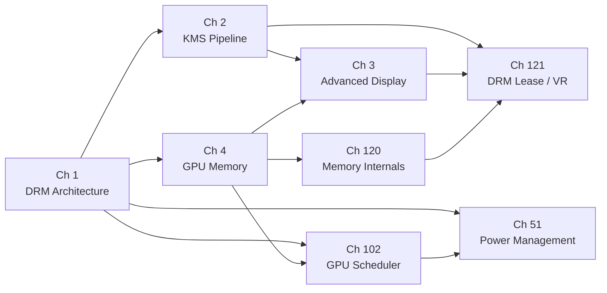

# Part I — The Kernel Layer

The Linux graphics stack begins in the kernel. Before a frame can be rendered, before a compositor can present a surface, before a terminal emulator can blit a glyph to screen, the kernel must enumerate GPU hardware, manage the memory those GPUs consume, schedule the work they execute, program the display pipeline that drives physical monitors, and enforce power budgets that keep the system thermally and electrically stable. Part I covers every one of those responsibilities. It describes the **Direct Rendering Manager** (**DRM**) subsystem — the single kernel framework that unifies GPU execution, display programming, memory management, scheduling, and power control behind a stable **UAPI** — and provides the conceptual foundation on which every subsequent part of this book rests.

## Foundational Concepts

Before stepping into the individual chapters, it is worth fixing the vocabulary that runs through all of them. The concepts defined here recur across every part of this book; readers who already know them can skip ahead to the chapter descriptions.

### Frames, Surfaces, and Compositors

A **frame** is a single complete image delivered to the display hardware at one refresh boundary. Producing a frame is a multi-actor process. Individual applications draw into **surfaces** — regions of GPU memory allocated and managed independently per window or layer. A **compositor** (Wayland compositors such as **Mutter**, **KWin**, or a custom **wlroots** shell) collects those surfaces, composites them according to z-order, clip regions, and transform metadata, and submits the final assembled image to the display hardware. The kernel interface the compositor uses for that final submission is **KMS** (**Kernel Mode Setting**), the display half of **DRM** detailed in Chapter 2. From the kernel's point of view, "presenting a frame" means programming a **CRTC** scanout engine to read from a nominated **framebuffer** object and delivering that image to a physical connector at the next vertical blank.

### Kernel Modules and .ko Files

Every GPU driver on Linux is a **kernel module** — a relocatable ELF object with a `.ko` suffix, loaded at boot or on device hot-plug by **modprobe**. A module exports a `module_init` entry point that registers one or more **struct pci_driver** (for PCIe GPUs) or **struct platform_driver** (for SoC display engines) instances with the kernel bus core. When the bus enumerates a matching device, the driver's `probe` callback fires. For DRM drivers, `probe` calls **devm_drm_dev_alloc()** and **drm_dev_register()** to create the subsystem's internal state and expose the device nodes described below. Module parameters — passed as `module_name.param=value` on the kernel command line or in `/etc/modprobe.d/` — control runtime features: `amdgpu.ppfeaturemask`, `i915.enable_dc`, and `nouveau.pstate` are examples encountered throughout this part.

### UAPI and ioctls

The **UAPI** (**User-space API**) is the kernel's formal contract with programs that run outside the kernel boundary. DRM exposes its UAPI through **ioctl** calls on the device nodes in **/dev/dri/**. Headers in `include/uapi/drm/` — `drm.h` for core operations, plus per-driver headers such as `amdgpu_drm.h` — define the ioctl numbers and the C structures passed through them. The Linux kernel treats UAPI as immutable once merged: an ioctl structure that shipped in a stable release must remain ABI-compatible forever, so the same `libdrm` binary can operate on kernels years apart. Capability negotiation via **DRM_IOCTL_GET_CAP** lets userspace query which optional features the running kernel supports, and client opt-ins via **DRM_IOCTL_SET_CLIENT_CAP** enable behaviours (such as atomic modesetting or universal planes) that are off by default to preserve compatibility with older clients. UAPI stability is not an incidental property — it is the reason the entire stack above the kernel can evolve independently of the kernel itself.

### Primary and Render Nodes

When a DRM driver registers both `DRIVER_MODESET` and `DRIVER_RENDER` capability flags, the kernel creates two character device nodes for each GPU. The **primary node** (**/dev/dri/cardN**) carries full KMS authority: only one process at a time may hold DRM mastership on it (a privilege managed in practice by **systemd-logind**), because the kernel must enforce mutually exclusive control of the scanout hardware. The **render node** (**/dev/dri/renderDN**) is intentionally unprivileged: any process in the `render` group may open it, allocate GPU memory, and submit compute or graphics workloads without ever touching the display pipeline. Mesa's DRI loader, the Chromium GPU process, VA-API decoders, and CUDA workloads all open the render node. The split matters for security: a sandboxed video decoder or a browser renderer tab needs GPU access but should never be able to reprogram the display hardware or interfere with another application's cursor plane.

### Buffer Passing and DMA-BUF File Descriptors

A rendered image cannot be passed between processes by copying pixels — at 4K resolution that would be hundreds of megabytes per frame. Instead, Linux uses **DMA-BUF**: a kernel mechanism that wraps a GPU buffer allocation as an anonymous **file descriptor**. A process that owns a buffer exports it with **DRM_IOCTL_PRIME_HANDLE_TO_FD**, producing a regular file descriptor. That file descriptor can be sent over a Unix domain socket using the **SCM_RIGHTS** ancillary data mechanism to an entirely different process — a compositor, a display server, a video encoder — which imports it with **DRM_IOCTL_PRIME_FD_TO_HANDLE**. The receiving process obtains a handle into the same physical GPU memory pages; no copy occurs. The Wayland **linux-dmabuf** protocol, VA-API zero-copy decode, and V4L2 camera output all rely on this mechanism. Chapter 4 covers DMA-BUF and its associated synchronisation semantics in depth.

### KMS Object Types

The KMS display pipeline is modelled as a graph of five object types, all managed through the atomic property system:

- A **connector** represents a physical display output — an HDMI port, a DisplayPort receptacle, an eDP panel connection, or a DSI bus. The connector carries **EDID** metadata from the display and properties such as **COLORSPACE**, **HDR_OUTPUT_METADATA**, and **CONTENT_PROTECTION**.
- An **encoder** converts the CRTC's internal pixel stream into the electrical or optical signal the connector expects: TMDS encoding for HDMI, 8b/10b or 128b/132b for DisplayPort, LVDS differential pairs for embedded panels, or MIPI DSI commands for mobile displays. On discrete GPUs the encoder is a hardware block; on SoCs the DRM bridge framework chains multiple IP blocks (`drm_bridge_attach`) to form the full signal path.
- A **CRTC** (historically, CRT Controller) is the scanout engine: it reads pixel data from a framebuffer at a programmed timing (resolution, refresh rate, interlace), applies colour transforms, and feeds the encoder. A GPU may expose several CRTCs to drive multiple independent displays simultaneously.
- **Planes** are hardware image layers composited by the CRTC before output. Every CRTC has at least one **primary plane** (the main framebuffer), typically a **cursor plane** (hardware-accelerated mouse pointer), and often several **overlay planes** (video frames, UI layers). Planes have independent format, crop, scale, and z-order properties; compositing them in hardware saves the compositor from having to re-render the full scene every frame.
- A **framebuffer** is the KMS wrapper around a GEM object: it records the pixel format, width, height, pitch, and DRM format modifier of the underlying buffer so the scanout hardware knows how to interpret the memory.

### GEM and GBM

**GEM** (**Graphics Execution Manager**) is the kernel-side abstraction for GPU buffer objects [Source](https://www.kernel.org/doc/html/latest/gpu/drm-mm.html). A GEM object (`struct drm_gem_object`) is a reference-counted allocation of GPU-accessible memory. Userspace identifies GEM objects by opaque `uint32_t` handles scoped to a single file descriptor; handles are neither global nor inheritable, which provides the process isolation guarantee. GEM objects can be exported as DMA-BUF file descriptors for cross-process or cross-driver sharing. Each driver implements its own GEM backend — **amdgpu** uses TTM-backed BOs, **i915**/**Xe** use their own shmem-backed objects, **nouveau** uses **TTM** as well — but the handle/export/import lifecycle is uniform.

**GBM** (**Generic Buffer Manager**) is the Mesa userspace library (`libgbm`) that applications and compositors use to allocate GEM BOs suitable for display scanout or EGL rendering without needing to call driver-private ioctls directly. A `gbm_device` wraps a DRM file descriptor; a `gbm_bo` is a single allocated buffer; a `gbm_surface` provides the EGL surface integration. GBM is what EGL calls under the hood on DRM/KMS platforms when creating a Wayland-presentable surface, and it is what compositors use when allocating the framebuffers they hand to KMS. Chapter 4 covers GBM allocation and format modifier negotiation in detail.

### IOMMU Address Mapping

Discrete GPUs have their own memory management unit — the **GPU MMU** — that translates GPU virtual addresses to physical addresses. The system **IOMMU** (**I/O Memory Management Unit**, e.g. AMD-Vi or Intel VT-d) provides a second level of translation and protection: it governs which physical pages the GPU's DMA engine may reach, preventing a compromised GPU driver or firmware from reading arbitrary system memory [Source](https://www.kernel.org/doc/html/latest/driver-api/iommu.html). The kernel GPU drivers create an `iommu_domain` per GPU address space and call `iommu_map` to install mappings when a buffer is made GPU-resident. TTM eviction, GEM object lifecycle, and power state transitions all require careful coordination with the IOMMU to ensure mappings are torn down before physical pages are freed.

### Atomic Commit

The original KMS API (`DRM_IOCTL_MODE_SETCRTC`) set display state one object at a time, making it impossible to atomically swap framebuffers across multiple CRTCs without tearing or intermediate invalid states. **Atomic modesetting** replaces this with a transactional model [Source](https://www.kernel.org/doc/html/latest/gpu/drm-kms.html#atomic-mode-setting): a caller assembles a `drm_atomic_state` structure containing desired property values for any combination of CRTCs, planes, and connectors, then submits it with `drm_atomic_commit`. The kernel validates the state in a `TEST_ONLY` pass (checking hardware constraints, format support, and bandwidth limits without touching hardware), then applies it atomically at the next vertical blank. If any constraint is violated, the entire commit is rolled back and the caller receives an error, with the display hardware undisturbed. Atomic commit is the mechanism through which VRR, HDR, explicit synchronisation, and overlay plane promotion all work.

### Advanced Display Properties

**Variable Refresh Rate** (**VRR**) — marketed as Adaptive Sync by VESA, FreeSync by AMD, and G-Sync Compatible by NVIDIA — allows the display to vary its refresh interval to match the GPU's rendering cadence, eliminating tearing without fixed-rate V-Sync latency. At the KMS level it is controlled by the `vrr_capable` connector property (set by the driver from EDID/DPCD data) and the `VRR_ENABLED` CRTC property (set by the compositor). **HDR** output requires two parallel mechanisms: the `COLORSPACE` connector property selects the colour primaries and EOTF curve (BT.2020/PQ for HDR10, BT.2020/HLG for broadcast HDR), while `HDR_OUTPUT_METADATA` carries the SMPTE ST 2086 mastering display luminance and MaxCLL/MaxFALL values the display uses for tone mapping. **HDCP** (High-bandwidth Digital Content Protection) is negotiated via the `CONTENT_PROTECTION` connector property and the kernel-side HDCP state machine that handles the cryptographic handshake with the display. **DisplayPort Multi-Stream Transport** (**MST**) allows a single DP connector to drive a daisy chain of monitors by multiplexing virtual channels; the kernel `drm_dp_mst_topology_*` APIs manage the topology discovery and bandwidth allocation.

## Chapters in This Part

**Chapter 1 — DRM Architecture & the Driver Model** introduces the **DRM** subsystem as a whole: how a GPU kernel module registers with **struct drm_driver**, how the kernel creates **/dev/dri/cardN** primary nodes and **/dev/dri/renderDN** render nodes, why the two nodes carry different privilege requirements, and how **libdrm** wraps the underlying ioctl interface. The chapter also explains **DRI3** buffer-passing via **DMA-BUF** file descriptors, the **Present extension**'s **MSC**/**UST** timing model, and the **fbdev** emulation compatibility layer. Readers who work through this chapter will have the mental model needed to understand how every other kernel-layer component plugs into the DRM core.

**Chapter 2 — KMS and the Display Pipeline** dissects **Kernel Mode Setting** (**KMS**): the five core object types (**connectors**, **encoders**, **CRTCs**, **planes**, **framebuffers**) and the property system that configures them, the legacy **DRM_IOCTL_MODE_SETCRTC** API and its atomicity limitations, and the atomic modesetting model built on **drm_atomic_state** transactions, four-phase commits, and the **DRM_MODE_ATOMIC_TEST_ONLY** dry-run path. The chapter traces a buffer from a **GEM** object through **GBM**, **DRM_IOCTL_MODE_ADDFB2**, an atomic commit, **IOMMU** address mapping, encoder signal conversion, and the physical connector. Chapter 2 extends Chapter 1 by providing the complete display-half view of **DRM**.

**Chapter 3 — Advanced Display Features** builds directly on the atomic commit infrastructure introduced in Chapter 2, showing how that same mechanism accommodates six production display features: **Variable Refresh Rate** (**VRR**) via the **vrr_capable** and **VRR_ENABLED** atomic properties; **HDR** output via **hdr_output_metadata** and the **colorspace** connector property; the three-stage **KMS** colour pipeline (**DEGAMMA_LUT**, **CTM**, **GAMMA_LUT**); explicit GPU-to-display synchronisation via **drm_syncobj** timeline fences, **IN_FENCE_FD**, and **OUT_FENCE_PTR**; **HDCP** content protection; and **DisplayPort Multi-Stream Transport** (**MST**) with **DSC** compression. Driver authors will learn what callbacks each feature requires; compositor authors will see which **Wayland** protocols (**wp_tearing_control_v1**, **wp_linux_drm_syncobj_v1**, **wp_color_representation_v1**) map to which **KMS** properties.

**Chapter 4 — GPU Memory Management: GEM, TTM, and DMA-BUF** is the most cross-cutting chapter in this part. It explains how **GEM** (**Graphics Execution Manager**) allocates per-driver buffer objects and enforces process isolation via opaque **uint32_t** handles, how **TTM** (**Translation Table Manager**) manages multi-domain placement across **TTM_PL_SYSTEM**, **TTM_PL_TT** (**GTT**), and **TTM_PL_VRAM** tiers and performs fence-tracked eviction under memory pressure, how **DMA-BUF** crosses driver and subsystem boundaries as an anonymous file descriptor, and how **PRIME** extends that sharing to multi-GPU topologies. The chapter also covers **GBM** as the userspace allocation API, **DRM format modifiers** for hardware-specific tiling and compression layouts, implicit versus explicit fencing on **dma_resv** reservation objects, and **drm_gpuvm** (Linux 6.7) for generic GPU virtual address space management.

**Chapter 51 — GPU Power Management and Thermal** explains how the kernel arbitrates power states across GPU hardware using the **Runtime PM** framework (**pm_runtime_get_sync**, **pm_runtime_put_autosuspend**) and the **drm_dev_enter**/**drm_dev_exit** unplug-protection mechanism. It traces per-vendor implementations: **amdgpu** **DPM**, **BACO**, **GFXOFF**, and **SMU** firmware; **i915** **RC6** and **GuC**-managed **GuCRC**/**SLPC**; and the **Xe** driver's **xe_pm_runtime_suspend** hooks for **Arc**/**Battlemage** hardware. The chapter covers the Linux thermal subsystem — thermal zones, governors, and **hwmon** cooling devices — and the **power-profiles-daemon** D-Bus service that translates **performance**/**balanced**/**power-saver** profiles into driver-specific register settings.

**Chapter 102 — The DRM GPU Scheduler and Multi-Process Fairness** examines **drivers/gpu/drm/scheduler/**, the shared arbitration library used by **amdgpu**, **i915**, **Xe**, **Nouveau**, **Panfrost**, **Panthor**, and other drivers. It explains the **CFS**-inspired virtual-runtime fair scheduling algorithm, the four priority classes from **KERNEL** to **LOW**, the **drm_sched_job** lifecycle from submission through dependency resolution to hardware dispatch, timeline fence integration with **dma_fence** and **drm_syncobj**, the timeout-detection-reset (**TDR**) watchdog, and per-process GPU time accounting. Wayland compositor developers will find the section on priority inversion and compositor scheduling particularly relevant to reducing frame latency under load.

**Chapter 120 — GPU Memory Management Internals: TTM, GEM, and BAR** goes deeper than Chapter 4 into the kernel-side mechanisms that implement GPU memory placement and movement. It dissects the **TTM** eviction machinery — **LRU** list management, the fence-tracked **ttm_bo_evict** path, and **drm_buddy** VRAM allocator internals — and explains how **drm_gpuvm** and **drm_exec** provide a generic GPU virtual address space framework that replaces per-driver implementations (Linux 6.7+). The chapter covers **Resizable BAR** (**ReBAR**) and AMD's **Smart Access Memory** (**SAM**), showing how the CPU-visible PCIe aperture expands from 256 MB to the full VRAM size and what that means for buffer placement decisions. It also documents the **debugfs** interfaces under **/sys/kernel/debug/dri/** that expose TTM domain occupancy and eviction statistics at runtime. This chapter targets kernel GPU driver developers and systems engineers who need to reason about memory pressure, eviction policy, and cross-driver buffer sharing at the implementation level.

**Chapter 121 — DRM Lease and VR Direct Display** covers the kernel mechanism that allows a VR runtime to bypass the desktop compositor and drive a head-mounted display's CRTCs, connectors, and planes directly. Introduced in Linux 4.15, **DRM lease** (**DRM_IOCTL_MODE_CREATE_LEASE**, **DRM_IOCTL_MODE_REVOKE_LEASE**) delegates exclusive KMS mastership over a named set of display objects to a lessee process via a new file descriptor, enabling the sub-20 ms motion-to-photon latency that VR requires. The chapter explains how OpenXR runtimes such as **Monado** discover HMD connectors, request a lease via the **wp_drm_lease_device_v1** Wayland protocol, drive the display through the lease fd, and implement **Asynchronous TimeWarp** (**ATW**) on a high-priority Vulkan queue to meet VBLANK deadlines. It also covers the **VK_EXT_acquire_drm_display** Vulkan extension for direct-to-display swapchains and the frame-timing machinery that VR runtimes use to synchronise GPU submission with display refresh. VR compositor and OpenXR runtime developers are the primary audience; Wayland compositor authors will find the lease grant and revocation flow directly applicable to their KMS master implementation.

**Chapter 129 — GPU Firmware: Loading, Authentication, and Trust** covers how GPU drivers load signed firmware blobs from disk (via `request_firmware()`), authenticate them through PSP/GSP-RM security processors, and manage the firmware lifecycle across suspend/resume and GPU reset cycles, with per-vendor treatment of AMD PSP, Intel GuC/HuC/GSC, and NVIDIA GSP-RM.

**Chapter 139 — DRM Hardware Planes: Overlay, Cursor, and Direct Scanout** explains the hardware-plane abstraction in the KMS atomic property system — plane types (primary, overlay, cursor), format and modifier caps, z-order and blend-mode properties — and shows how compositors promote surfaces to overlay planes to eliminate per-frame GPU compositing and achieve direct scanout.

**Chapter 144 — Boot Graphics Pipeline: EFI Framebuffer to DRM Handoff** traces the path from UEFI GOP framebuffer through the `efifb` and `simplefb` boot drivers to the native DRM driver's `drm_dev_register()`, covering the `sysfb_init()` handoff, firmware framebuffer conflicts, and the `DRIVER_ATOMIC`-guarded first modeset sequence that transitions the display from the bootloader image to the compositor.

**Chapter 149 — GPU Hang Detection and Recovery** documents the TDR (Timeout Detection and Recovery) watchdog mechanism in the DRM GPU scheduler: how per-engine software timers detect hung command submissions, how drivers invoke `drm_sched_fault()` to initiate a GPU reset, and how per-vendor reset sequences (`amdgpu_device_gpu_recover`, `i915_reset`, `xe_gt_reset`) restore hardware state without rebooting.

**Chapter 162 — Framebuffer Compression: DCC, AFBC, and CCS** covers vendor-specific lossless framebuffer compression schemes — AMD Delta Color Compression (DCC), ARM Adaptive Framebuffer Compression (AFBC), and Intel Color Control Surface (CCS) — explaining how DRM format modifiers encode compression parameters, how display engines decompress on scanout, and the bandwidth and power savings each scheme provides.

**Chapter 163 — VKMS: Virtual Kernel Mode Setting** examines the `vkms` software-only DRM driver that provides a fully functional KMS device with no physical hardware, enabling headless rendering, CI test environments, and compositing research; it covers the frame-generation timer loop, writeback connector implementation, and how VKMS integrates with the DRM atomic commit path.

**Chapter 51 — GPU Power Management and Thermal** (expanded) covers `pm_runtime_*` lifecycle hooks, GENPD power-domain controllers, DVFS via the devfreq framework (governors table, `panfrost_devfreq_target()`), display engine DC states vs. GPU engine power gating, and Power Capping via Intel RAPL and hwmon, in addition to per-vendor DPM/RC6/Nouveau power management and the thermal subsystem.

## How the Chapters Interrelate

Chapter 1 is the mandatory starting point. Every other chapter in this part presupposes the **DRM** driver model, the **/dev/dri/** node hierarchy, the ioctl dispatch mechanism, and the separation between the display half and the execution half of **DRM** that Chapter 1 establishes.

Chapters 2 and 4 are the two principal branches that grow from that root. Chapter 2 owns the display half — the **KMS** object model, atomic commits, and the full pipeline from buffer to photon. Chapter 4 owns the memory half — **GEM** handle allocation, **TTM** domain placement, **DMA-BUF** cross-driver sharing, **PRIME** multi-GPU transport, and **DRM format modifiers**. These two chapters are largely independent of each other in reading order, but they share two critical junction points: the **drm_gem_object** that Chapter 4 allocates is the same object that Chapter 2 wraps in a **KMS framebuffer** via **DRM_IOCTL_MODE_ADDFB2**, and the **dma_resv** implicit fencing mechanism that Chapter 4 introduces is the mechanism by which **KMS** in Chapter 2 waits for render completion before display scanout. Readers who encounter either of those concepts in Chapter 2 and want the full kernel-side explanation should turn to Chapter 4.

Chapter 3 builds directly on both predecessors. The **VRR** feature operates on the **CRTC** objects from Chapter 2. The explicit synchronisation story — **drm_syncobj** timeline fences, **IN_FENCE_FD**, **OUT_FENCE_PTR** — relies on the **dma_fence** and **dma_resv** infrastructure from Chapter 4. The **HDR** colour pipeline and **MST** topology management extend the atomic commit infrastructure detailed in Chapter 2. Chapter 3 should be read after Chapters 2 and 4, or with them open for reference.

Chapter 120 is a deep-dive companion to Chapter 4: it assumes everything Chapter 4 introduces about GEM, TTM placement domains, DMA-BUF, and dma_resv, then goes further into the TTM eviction engine, the **drm_buddy** VRAM allocator, the **drm_gpuvm**/**drm_exec** locking protocol, and the Resizable BAR upgrade path. Readers who need to implement or debug TTM eviction, tune buffer placement heuristics, or understand why a driver moves a buffer between VRAM and GTT should read Chapter 4 first and then proceed to Chapter 120.

Chapter 102 on the GPU scheduler branches from the execution half rather than the display half: it requires the **drm_gem_object** and **dma_fence** concepts from Chapter 4 and the driver registration concepts from Chapter 1, but has no dependency on Chapter 2 or 3. Readers who care only about rendering throughput and multi-process fairness can read Chapters 1, 4, and 102 as a self-contained path.

Chapter 121 on DRM lease and VR direct display sits at the convergence of the display and memory branches. It requires a solid understanding of the KMS object model from Chapter 2 — because the lease mechanism delegates ownership of specific CRTCs, connectors, and planes — and benefits from familiarity with the explicit synchronisation and VRR infrastructure from Chapter 3, which VR runtimes rely on for frame-timing precision. The buffer allocation and TTM domain concepts from Chapters 4 and 120 are relevant to the zero-copy rendering pipelines VR runtimes construct. Chapter 121 should therefore be read after Chapters 2 and 3, with Chapter 120 as a recommended supplement for readers who want to understand the memory-side implications of driving an HMD at 90+ Hz.

Chapter 51 on power management is the terminal node in the dependency graph. It relies on the **DRM** runtime PM integration described in Chapter 1, the display-engine **DC states** and **DPMS** interaction described in Chapter 2, and the scheduler idle callbacks described in Chapter 102. It should be read last within this part, or consulted as a reference when investigating platform-specific power behaviour.

The shared technical threads that tie all eight chapters together are: the **struct drm_device** and **struct drm_file** ownership model, the **dma_fence** synchronisation primitive (which appears in **KMS** page flip timing, **GEM** eviction, **GPU** scheduler job completion, and power state transitions), and the **debugfs** instrumentation under **/sys/kernel/debug/dri/** that surfaces internals from every subsystem.

## Prerequisites and What Comes Next

Readers should arrive at this part with a working knowledge of Linux kernel development conventions (kernel modules, `struct`-based vtables, reference counting via **kref**, and the **slab** allocator) and a conceptual understanding of how PCIe devices are enumerated. No prior knowledge of GPU hardware or graphics APIs is assumed. The chapters in Part II (hardware-specific GPU drivers — **amdgpu**, **i915/Xe**, **Nouveau**, **freedreno**, **Panfrost**, and others) build directly on every concept introduced here, implementing the **drm_driver**, **drm_crtc_funcs**, **drm_gem_object_funcs**, and **drm_sched_backend_ops** callbacks that Part I defines. Parts III through IX — covering Mesa, Vulkan, display compositing, browser graphics, and terminal rendering — all assume that the reader understands the kernel mechanisms described in this part, particularly **DRM** nodes, **DMA-BUF** buffer sharing, **GBM** allocation, **KMS** atomic commits, and **dma_fence** synchronisation.

---

## Part Roadmap Summary

*Synthesised from the Roadmap sections of this part's chapters.*

### Near-term (6–12 months)

- **Rust DRM ecosystem expansion.** Rust DRM abstractions in `rust/kernel/drm/` are landing new helpers (DMA-coherent API rework, GPU buddy allocator, shared-memory GEM helpers) that unblock the Nova NVIDIA driver and Panthor/PowerVR Rust drivers. Rust-based `request_firmware` wrappers are expected alongside this. The Nova driver's memory management (page tables, virtual address space, BAR mapping) is tracking mainline inclusion once these abstractions stabilise (Linux 7.x).
- **GPU scheduler fairness.** The CFS-inspired fair DRM scheduler — replacing per-priority FIFO queues with a vruntime-ordered red-black tree — is progressing through review (v5) and is expected to land in Linux 6.20/6.21. The Linux 7.2 merge window already switches the default scheduling policy to "fair" for amdgpu, Xe, and other consumers. Deadline propagation / priority inheritance (the `drm_sched_fence::deadline` boosting path) is the near-term follow-on.
- **Display colour pipeline rollout.** The `drm_color_pipeline` API (merged Linux 6.19 / drm-misc-next November 2025) is being adopted by Mutter, KWin, gamescope, and wlroots to offload per-plane HDR tone-mapping to display hardware. NVIDIA published a preview open-kernel-module implementation in April 2026; AMD, Intel, and Qualcomm are wiring up callbacks. The `wp_color_management_v1` Wayland protocol (merged into wayland-protocols 1.41) is rolling out to remaining compositors.
- **Explicit synchronisation completion.** The Wayland `linux-drm-syncobj-v1` protocol and KMS `IN_FENCE_FD`/`OUT_FENCE_PTR` infrastructure are now broadly available; near-term work focuses on retiring the implicit `dma_resv` read/write fence path in modern drivers. Mesa ANV and RADV integration, and compositor adoption in Mutter 47+ and KWin 6.x, are the remaining milestones. `VK_EXT_present_timing` is now supported across RADV, ANV, NVK, Turnip, and PanVK in Mesa 26.1.
- **Memory management hardening.** `drm_gpusvm` (generic GPU Shared Virtual Memory) is under active revision; AMD is prototyping an amdgpu SVM backend atop it. The `dmem` device-memory cgroup controller (landed for Intel Xe in Linux 6.14) is being wired into AMDGPU and other TTM drivers. VRAM eviction heuristics for 4–8 GB RDNA2/3 GPUs are being tuned to reduce stuttering. `drm_buddy` defragmentation and improved `drm_gpuvm` robustness are also in-flight.
- **Firmware and boot pipeline.** AMD PSP 14.0 firmware components for RDNA 4 are being staged in linux-firmware. `fwupd` 2.x is expanding GPU firmware update coverage to RDNA 4 and Intel GuC/HuC. Legacy `efifb`/`vesafb` drivers are deprecated in favour of `CONFIG_DRM_SIMPLEDRM`; the in-kernel DRM splash client RFC (targeting embedded platforms) is progressing through review. NVIDIA GSP-RM blob consolidation in linux-firmware is reducing manual installation requirements for open-driver users.
- **GPU hang recovery and VKMS.** `DRM_GPU_SCHED_STAT_NO_HANG` (landed v6.12–v6.13) eliminates spurious TDR resets; remaining drivers (vc4, lima, etnaviv) are adopting the pattern. amdgpu pipe-level reset for compute queues is in a 42-patch series. VKMS is being extended with configfs runtime reconfiguration (Linux 6.13), multi-CRTC support, multi-planar YUV formats, and blend-mode properties for overlay planes.

### Medium-term (1–3 years)

- **Unified GPU virtual address management.** `drm_gpuvm` + `drm_exec` (Linux 6.7+) and `drm_gpusvm` are converging toward a single `drm_gpu_vm` abstraction that replaces per-driver interval trees and HMM range notifiers across amdgpu, Xe, Nouveau, Panthor, and future drivers. The `VM_BIND` UAPI is being standardised across these drivers to give Mesa Vulkan a single submission path.
- **Display and colour pipeline deepening.** Per-plane colour management properties (per-plane degamma/CTM/gamma before CRTC blending) will extend to Qualcomm Adreno, Arm Mali-DP, and other SoC display engines currently limited to legacy `GAMMA_LUT`. DisplayPort 2.1 UHBR10/20 (80 Gbps) mainline enablement is in progress for Intel Meteor Lake and AMD RDNA 4. HDR dynamic metadata (HDR10+, Dolby Vision per-frame blobs) is an open KMS design discussion. The `wp_drm_lease_device_v1` Wayland protocol is expected to graduate from staging to stable as KWin and Mutter adoption matures.
- **Scheduler and virtualisation advances.** Hardware preemption hooks on AMD RDNA 3/4 and Intel Xe HPC will allow true GPU time-slicing in `drm_gpu_scheduler`. Intel Xe SR-IOV scheduler groups and AMD's equivalent VF-per-VM submission paths require coordination between the DRM fair scheduler and in-hardware GuC/MES firmware schedulers. Real-time / `SCHED_DEADLINE` integration for GPU job scheduling is under research.
- **Memory tiering and CXL integration.** CXL 2.0/3.0 memory expanders are appearing alongside GPU VRAM; DRM drivers need to register GPU VRAM and CXL nodes in the kernel's NUMA tier hierarchy so NUMA balancing can migrate BOs across HBM, GDDR, CXL DRAM, and system RAM. `p2pdma` infrastructure needs updating for CXL Type 3 device BARs. Kernel-to-userspace GPU memory pressure notifications (analogous to `memory.pressure`) are at RFC stage.
- **Firmware and security.** Nova (Rust NVIDIA driver) is targeting feature parity with Nouveau's GSP-RM path within 1–2 years, requiring a stable kernel-to-GSP-RM RPC specification. IMA integration with the firmware loader (measuring firmware blobs into TPM PCR registers) is a design direction for measured-boot coverage. Intel Xe2/Battlemage GuC firmware ABI alignment between i915 and Xe is an active maintenance goal.
- **Cross-cutting: per-context reset isolation, ECC/EDAC integration, standardised `VK_EXT_device_fault` breadcrumbs, and unified modifier negotiation** (including format feedback for non-Wayland consumers and AFBC v3 wider-block adoption) are all in the medium-term queue across the display, memory, and scheduler subsystems.

### Long-term

- **Rust-first GPU driver model and DRM as the kernel AI accelerator interface.** The `DRIVER_COMPUTE_ACCEL` flag and Nova/Tyr architecture (nova-core/nova-drm split) are the proving grounds for a future where novel AI NPU, RISC-V GPU, and matrix-engine drivers are written in Rust from day one. The long-term question is whether a single DRM device model can span display, 3D, compute, and inference, or whether a parallel subsystem emerges.
- **Unified, first-class GPU memory and cgroup integration.** GPU VRAM pages as `struct page` citizens (participating in LRU scanning, OOM scoring, and page reclaim), HMM as the universal GPU memory backend across all discrete drivers, and a `gpu` cgroup controller enforcing VRAM bandwidth quotas and power limits per cgroup are the long-horizon architectural goals. Confidential computing (AMD SEV-SNP, Intel TDX) integration requires GPU firmware to participate in attestation flows.
- **Display pipeline unification and legacy API deprecation.** The non-atomic KMS ioctls (`DRM_IOCTL_MODE_SETCRTC`, `DRM_IOCTL_MODE_PAGE_FLIP`) are candidates for deprecation once all major compositors and the X.Org modesetting DDX complete migration to atomic. A unified `drm_boot_fb` abstraction across UEFI GOP, ACPI, Device Tree, and U-Boot hand-offs would replace the current proliferation of parallel boot-display code paths. Hardware-accelerated display-engine composition (programmable blend stages via KMS plane properties) blurs the boundary between hardware overlay and GPU compute.
- **Cross-vendor standards: GPU coredump format, modifier registry, and firmware manifests.** Standardised GPU coredump format (analogous to ELF core dumps) for post-mortem analysis, a machine-readable `drm_format_modifier` registry for modifier negotiation without per-vendor embedding, and a manifest-based GPU firmware dependency system (atomically loading coherent firmware version sets) are recurring architectural goals without committed timelines.

---

*Copyright © 2026 jreuben11. Licensed under [CC BY 4.0](https://creativecommons.org/licenses/by/4.0/).*
