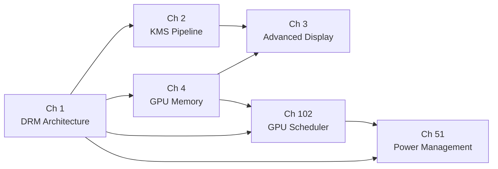

# Part I — The Kernel Layer

The Linux graphics stack begins in the kernel. Before a frame can be rendered, before a compositor can present a surface, before a terminal emulator can blit a glyph to screen, the kernel must enumerate GPU hardware, manage the memory those GPUs consume, schedule the work they execute, program the display pipeline that drives physical monitors, and enforce power budgets that keep the system thermally and electrically stable. Part I covers every one of those responsibilities. It describes the **Direct Rendering Manager** (**DRM**) subsystem — the single kernel framework that unifies GPU execution, display programming, memory management, scheduling, and power control behind a stable **UAPI** — and provides the conceptual foundation on which every subsequent part of this book rests.

## Chapters in This Part

**Chapter 1 — DRM Architecture & the Driver Model** introduces the **DRM** subsystem as a whole: how a GPU kernel module registers with **struct drm_driver**, how the kernel creates **/dev/dri/cardN** primary nodes and **/dev/dri/renderDN** render nodes, why the two nodes carry different privilege requirements, and how **libdrm** wraps the underlying ioctl interface. The chapter also explains **DRI3** buffer-passing via **DMA-BUF** file descriptors, the **Present extension**'s **MSC**/**UST** timing model, and the **fbdev** emulation compatibility layer. Readers who work through this chapter will have the mental model needed to understand how every other kernel-layer component plugs into the DRM core.

**Chapter 2 — KMS and the Display Pipeline** dissects **Kernel Mode Setting** (**KMS**): the five core object types (**connectors**, **encoders**, **CRTCs**, **planes**, **framebuffers**) and the property system that configures them, the legacy **DRM_IOCTL_MODE_SETCRTC** API and its atomicity limitations, and the atomic modesetting model built on **drm_atomic_state** transactions, four-phase commits, and the **DRM_MODE_ATOMIC_TEST_ONLY** dry-run path. The chapter traces a buffer from a **GEM** object through **GBM**, **DRM_IOCTL_MODE_ADDFB2**, an atomic commit, **IOMMU** address mapping, encoder signal conversion, and the physical connector. Chapter 2 extends Chapter 1 by providing the complete display-half view of **DRM**.

**Chapter 3 — Advanced Display Features** builds directly on the atomic commit infrastructure introduced in Chapter 2, showing how that same mechanism accommodates six production display features: **Variable Refresh Rate** (**VRR**) via the **vrr_capable** and **VRR_ENABLED** atomic properties; **HDR** output via **hdr_output_metadata** and the **colorspace** connector property; the three-stage **KMS** colour pipeline (**DEGAMMA_LUT**, **CTM**, **GAMMA_LUT**); explicit GPU-to-display synchronisation via **drm_syncobj** timeline fences, **IN_FENCE_FD**, and **OUT_FENCE_PTR**; **HDCP** content protection; and **DisplayPort Multi-Stream Transport** (**MST**) with **DSC** compression. Driver authors will learn what callbacks each feature requires; compositor authors will see which **Wayland** protocols (**wp_tearing_control_v1**, **wp_linux_drm_syncobj_v1**, **wp_color_representation_v1**) map to which **KMS** properties.

**Chapter 4 — GPU Memory Management: GEM, TTM, and DMA-BUF** is the most cross-cutting chapter in this part. It explains how **GEM** (**Graphics Execution Manager**) allocates per-driver buffer objects and enforces process isolation via opaque **uint32_t** handles, how **TTM** (**Translation Table Manager**) manages multi-domain placement across **TTM_PL_SYSTEM**, **TTM_PL_TT** (**GTT**), and **TTM_PL_VRAM** tiers and performs fence-tracked eviction under memory pressure, how **DMA-BUF** crosses driver and subsystem boundaries as an anonymous file descriptor, and how **PRIME** extends that sharing to multi-GPU topologies. The chapter also covers **GBM** as the userspace allocation API, **DRM format modifiers** for hardware-specific tiling and compression layouts, implicit versus explicit fencing on **dma_resv** reservation objects, and **drm_gpuvm** (Linux 6.7) for generic GPU virtual address space management.

**Chapter 51 — GPU Power Management and Thermal** explains how the kernel arbitrates power states across GPU hardware using the **Runtime PM** framework (**pm_runtime_get_sync**, **pm_runtime_put_autosuspend**) and the **drm_dev_enter**/**drm_dev_exit** unplug-protection mechanism. It traces per-vendor implementations: **amdgpu** **DPM**, **BACO**, **GFXOFF**, and **SMU** firmware; **i915** **RC6** and **GuC**-managed **GuCRC**/**SLPC**; and the **Xe** driver's **xe_pm_runtime_suspend** hooks for **Arc**/**Battlemage** hardware. The chapter covers the Linux thermal subsystem — thermal zones, governors, and **hwmon** cooling devices — and the **power-profiles-daemon** D-Bus service that translates **performance**/**balanced**/**power-saver** profiles into driver-specific register settings.

**Chapter 102 — The DRM GPU Scheduler and Multi-Process Fairness** examines **drivers/gpu/drm/scheduler/**, the shared arbitration library used by **amdgpu**, **i915**, **Xe**, **Nouveau**, **Panfrost**, **Panthor**, and other drivers. It explains the **CFS**-inspired virtual-runtime fair scheduling algorithm, the four priority classes from **KERNEL** to **LOW**, the **drm_sched_job** lifecycle from submission through dependency resolution to hardware dispatch, timeline fence integration with **dma_fence** and **drm_syncobj**, the timeout-detection-reset (**TDR**) watchdog, and per-process GPU time accounting. Wayland compositor developers will find the section on priority inversion and compositor scheduling particularly relevant to reducing frame latency under load.

## How the Chapters Interrelate

Chapter 1 is the mandatory starting point. Every other chapter in this part presupposes the **DRM** driver model, the **/dev/dri/** node hierarchy, the ioctl dispatch mechanism, and the separation between the display half and the execution half of **DRM** that Chapter 1 establishes.

Chapters 2 and 4 are the two principal branches that grow from that root. Chapter 2 owns the display half — the **KMS** object model, atomic commits, and the full pipeline from buffer to photon. Chapter 4 owns the memory half — **GEM** handle allocation, **TTM** domain placement, **DMA-BUF** cross-driver sharing, **PRIME** multi-GPU transport, and **DRM format modifiers**. These two chapters are largely independent of each other in reading order, but they share two critical junction points: the **drm_gem_object** that Chapter 4 allocates is the same object that Chapter 2 wraps in a **KMS framebuffer** via **DRM_IOCTL_MODE_ADDFB2**, and the **dma_resv** implicit fencing mechanism that Chapter 4 introduces is the mechanism by which **KMS** in Chapter 2 waits for render completion before display scanout. Readers who encounter either of those concepts in Chapter 2 and want the full kernel-side explanation should turn to Chapter 4.

Chapter 3 builds directly on both predecessors. The **VRR** feature operates on the **CRTC** objects from Chapter 2. The explicit synchronisation story — **drm_syncobj** timeline fences, **IN_FENCE_FD**, **OUT_FENCE_PTR** — relies on the **dma_fence** and **dma_resv** infrastructure from Chapter 4. The **HDR** colour pipeline and **MST** topology management extend the atomic commit infrastructure detailed in Chapter 2. Chapter 3 should be read after Chapters 2 and 4, or with them open for reference.

Chapter 102 on the GPU scheduler branches from the execution half rather than the display half: it requires the **drm_gem_object** and **dma_fence** concepts from Chapter 4 and the driver registration concepts from Chapter 1, but has no dependency on Chapter 2 or 3. Readers who care only about rendering throughput and multi-process fairness can read Chapters 1, 4, and 102 as a self-contained path.

Chapter 51 on power management is the terminal node in the dependency graph. It relies on the **DRM** runtime PM integration described in Chapter 1, the display-engine **DC states** and **DPMS** interaction described in Chapter 2, and the scheduler idle callbacks described in Chapter 102. It should be read last within this part, or consulted as a reference when investigating platform-specific power behaviour.

The shared technical threads that tie all six chapters together are: the **struct drm_device** and **struct drm_file** ownership model, the **dma_fence** synchronisation primitive (which appears in **KMS** page flip timing, **GEM** eviction, **GPU** scheduler job completion, and power state transitions), and the **debugfs** instrumentation under **/sys/kernel/debug/dri/** that surfaces internals from every subsystem.

## Prerequisites and What Comes Next

Readers should arrive at this part with a working knowledge of Linux kernel development conventions (kernel modules, `struct`-based vtables, reference counting via **kref**, and the **slab** allocator) and a conceptual understanding of how PCIe devices are enumerated. No prior knowledge of GPU hardware or graphics APIs is assumed. The chapters in Part II (hardware-specific GPU drivers — **amdgpu**, **i915/Xe**, **Nouveau**, **freedreno**, **Panfrost**, and others) build directly on every concept introduced here, implementing the **drm_driver**, **drm_crtc_funcs**, **drm_gem_object_funcs**, and **drm_sched_backend_ops** callbacks that Part I defines. Parts III through IX — covering Mesa, Vulkan, display compositing, browser graphics, and terminal rendering — all assume that the reader understands the kernel mechanisms described in this part, particularly **DRM** nodes, **DMA-BUF** buffer sharing, **GBM** allocation, **KMS** atomic commits, and **dma_fence** synchronisation.

---
