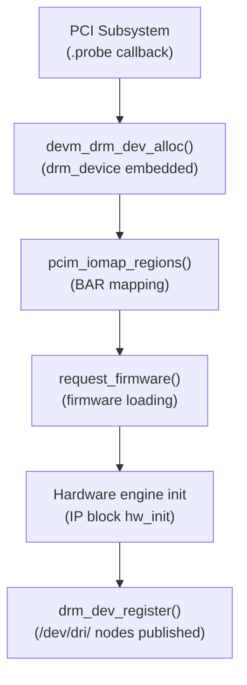
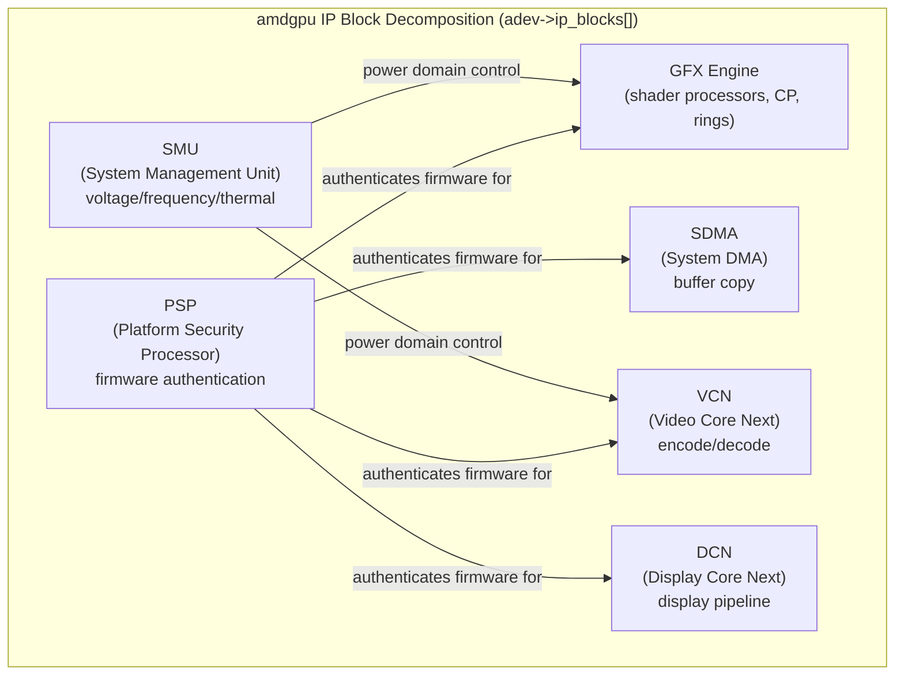
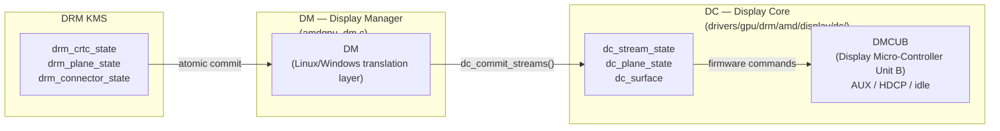
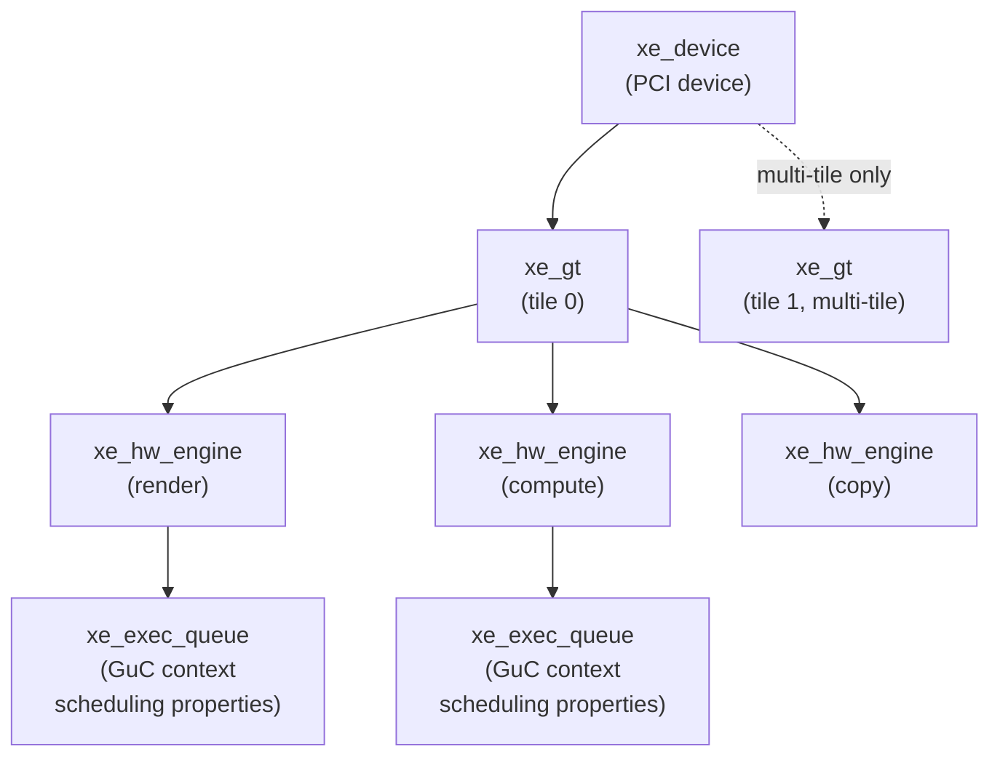
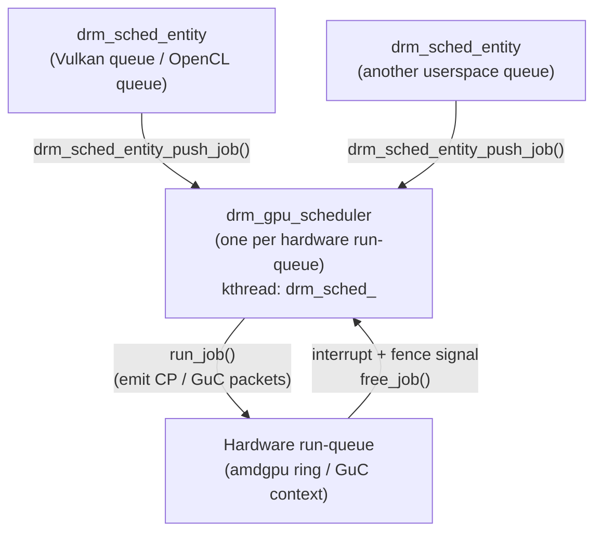
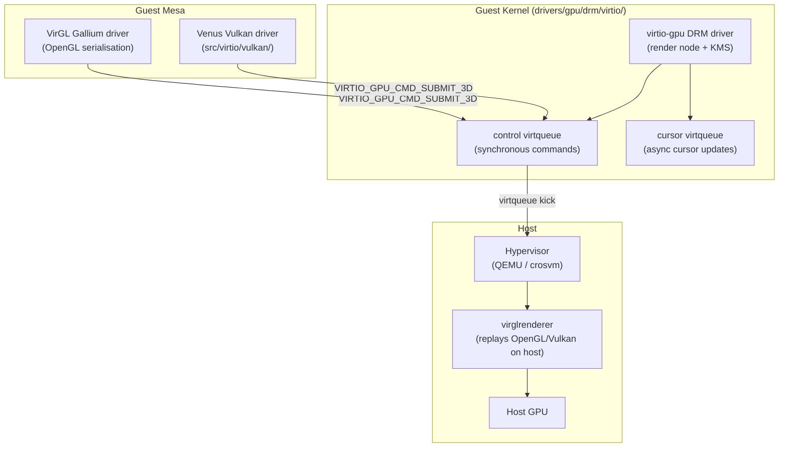
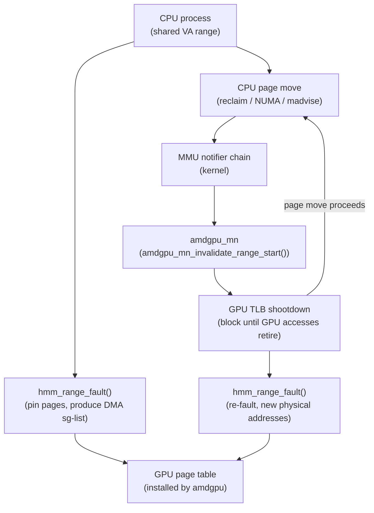

# Chapter 5: x86 GPU Drivers

> **Part**: Part II — GPU Drivers
> **Audience**: Systems developer — this chapter is squarely aimed at kernel and driver developers who need to understand how AMD, Intel, and NVIDIA GPUs are managed in kernel space. Application developers benefit from the firmware, power, and scheduling overview as context for latency and performance behaviour they observe at the API level.
> **Status**: First draft — 2026-06-06

## Table of Contents
- [Overview](#overview)
- [1. The Common Structure of a DRM GPU Driver](#1-the-common-structure-of-a-drm-gpu-driver)
  - [1.1 What is DRM (Direct Rendering Manager)?](#11-what-is-drm-direct-rendering-manager)
  - [1.2 What is GEM (Graphics Execution Manager)?](#12-what-is-gem-graphics-execution-manager)
  - [1.3 What is KMS (Kernel Mode Setting)?](#13-what-is-kms-kernel-mode-setting)
- [2. amdgpu: Architecture of the AMD Kernel Driver](#2-amdgpu-architecture-of-the-amd-kernel-driver)
- [3. amdgpu Power Management and the SMU](#3-amdgpu-power-management-and-the-smu)
- [4. i915: Intel's Integrated and Discrete Driver](#4-i915-intels-integrated-and-discrete-driver)
- [5. The Xe Driver: Intel's Clean-Slate Replacement](#5-the-xe-driver-intels-clean-slate-replacement)
- [6. nouveau and nvidia-open: NVIDIA Kernel Drivers Overview](#6-nouveau-and-nvidia-open-nvidia-kernel-drivers-overview)
  - [NVIDIA Driver Landscape: Feature and Performance Comparison](#nvidia-driver-landscape-feature-and-performance-comparison)
- [7. The GPU Scheduler: drm_gpu_scheduler](#7-the-gpu-scheduler-drm_gpu_scheduler)
- [8. Format Modifiers and Cross-Driver Buffer Sharing](#8-format-modifiers-and-cross-driver-buffer-sharing)
- [9. GPU Firmware Loading: request_firmware and the linux-firmware Package](#9-gpu-firmware-loading-request_firmware-and-the-linux-firmware-package)
- [10. Runtime Power Management](#10-runtime-power-management)
- [11. GPU Reset and Timeout Detection](#11-gpu-reset-and-timeout-detection)
- [12. virtio-gpu: GPU Virtualisation and Paravirtualised Rendering](#12-virtio-gpu-gpu-virtualisation-and-paravirtualised-rendering)
- [13. AMD HMM: Heterogeneous Memory Management and APU Unified Memory](#13-amd-hmm-heterogeneous-memory-management-and-apu-unified-memory)
- [Intel i915 Kernel Driver: GEM, GuC Submission, and Display Engine](#intel-i915-kernel-driver-gem-guc-submission-and-display-engine)
- [Iris: Intel's Gallium3D OpenGL Driver](#iris-intels-gallium3d-opengl-driver)
- [Integrations](#integrations)
- [References](#references)

---

## Overview

The Linux kernel contains three major GPU driver families for x86 hardware:
- **amdgpu** — AMD Radeon products from the GCN 2nd-generation architecture onward
- **i915**/**Xe** — Intel integrated and discrete graphics
- **nouveau** / **nvidia-open** — NVIDIA GPUs; **nouveau** is community-reverse-engineered, **nvidia-open** is NVIDIA's own open-source kernel module

Despite the enormous differences in hardware architecture — AMD's **IP block** decomposition, Intel's **GuC** firmware-mediated submission, NVIDIA's **GSP-RM** offload model — all three conform to the same kernel-side contract. They register with the **DRM** subsystem via `struct drm_driver`, implement the **GEM** memory management interface, drive the GPU command scheduler, and expose a **KMS** display pipeline. Chapter 1 introduced that contract in the abstract; this chapter makes it concrete.

Section 1 unpacks the common skeleton every **DRM** GPU driver must provide:
- **`drm_driver` capability flags** — `DRIVER_GEM`, `DRIVER_MODESET`, `DRIVER_RENDER`, `DRIVER_ATOMIC`, `DRIVER_GEM_GPUVA`
- **PCI probe sequence** — `devm_drm_dev_alloc()` through `pcim_iomap_regions()` to `drm_dev_register()`
- **interrupt handling** — with **MSI-X** vectors
- **PM reference-counting discipline** — `pm_runtime_get_sync()` / `pm_runtime_put_autosuspend()` enforced by `drm_dev_enter()` / `drm_dev_exit()`

Section 2 covers **amdgpu** in depth. Its defining characteristic is decomposition of the physical GPU SoC into independent **IP blocks**:
- **GFX** — shader processors and the Command Processor
- **SDMA** — System DMA
- **VCN** — Video Core Next for encode/decode
- **DCN** — Display Core Next
- **PSP** — Platform Security Processor
- **SMU** — System Management Unit

Each IP block registers an `amdgpu_ip_block_version` with `sw_init` / `hw_init` hooks, and initialisation proceeds in two phases via `amdgpu_device_ip_init()`. The **PSP** is the first block initialised and acts as a cryptographic gatekeeper: every subsequent firmware blob submitted via `psp_cmd_submit_buf()` is authenticated before the target engine can use it. The **GFX** pipeline centres on **PM4** command packets dispatched via `amdgpu_ring_alloc()` / `amdgpu_ring_write()` / `amdgpu_ring_commit()` across GFX, **COMPUTE** (MEC-driven asynchronous compute), and **SDMA** ring buffers. Memory management uses **TTM** (Translation Table Manager) with **VRAM** and **GTT** (Graphics Translation Table / **GART**) heaps, represented by `struct amdgpu_bo` wrapping `struct ttm_buffer_object`, created via `amdgpu_gem_object_create()`. AMD's display engine is organised as **DC** (Display Core) — a cross-platform library in `drivers/gpu/drm/amd/display/dc/` operating on `dc_stream_state` and `dc_plane_state` objects — bridged to **DRM/KMS** atomic state by **DM** (Display Manager) in `amdgpu_dm.c`. Within **DCN**, the **DMCUB** microcontroller handles **DisplayPort** AUX channel transactions, **HDCP** state, and display idle optimisations autonomously. The **RDNA 4** generation (GFX 12.1, Radeon RX 9000 series) adds **DCN 4.2** support, renames Compute Units to **Work Group Processors** (**WGPs**), enhanced ray tracing acceleration, and mesh shader support in the GFX ring, with initial support landing in Linux 7.1.

Section 3 details **amdgpu** power management via the **SMU**. The kernel communicates power state changes to the **SMU** through a **mailbox protocol** over **MMIO** registers rather than directly programming voltage regulators. The chapter covers:
- **SMU 11** (RDNA 1) and **SMU 13** (RDNA 3/4) — the two firmware generations and their mailbox protocols
- **GFXOFF** — fine-grained clock-gating feature for idle management between dispatches
- **BACO** (Bus Active, Chip Off) — deepest runtime suspend state
- **hwmon** sysfs interface (`/sys/class/hwmon/hwmonX/`) — exposing temperature, fan speed, and power sensors
- **Overdrive** — frequency and voltage tuning interface via **DPM** (Dynamic Power Management)

Section 4 examines **i915**, the oldest **DRM** GPU driver in the tree, covering Intel **Gen 4** through Meteor Lake (**MTL**) and first-generation **Arc** Alchemist (**Xe_HPG**). The driver organises hardware around **GT** (Graphics Technology) objects and uses **GuC** (Graphics Micro-Controller) firmware for GPU command scheduling via **Context Descriptors** and a **CT** (Command Transport) buffer. **HuC** (HEVC/AVC Micro-Controller), authenticated by **GuC**, enables hardware **VP9** and **AVC** decode acceleration on Gen 11+. The **GEM** layer centres on `struct drm_i915_gem_object` with tiling modes (X-tile, Y-tile, `I915_FORMAT_MOD_4_TILED` on **Xe2**/Battlemage), stolen memory, and **LMEM** on discrete **Arc** cards. Command submission uses the `DRM_IOCTL_I915_GEM_EXECBUFFER2` ioctl with **relocation lists** or the **softpin** optimisation (`EXEC_OBJECT_PINNED`), with cross-process synchronisation built on `dma_resv` fences exported via `DRM_IOCTL_SYNCOBJ_FD_TO_HANDLE`.

Section 5 covers **Xe**, Intel's clean-slate replacement driver. Its object hierarchy — `xe_device` → `xe_gt` → `xe_hw_engine` → `xe_exec_queue` — cleanly models multi-tile hardware. **Lunar Lake** and **Battlemage** (**Arc B-series**, **Xe2**) made **Xe** the default driver; **Nova Lake** and later targets **Xe** only. The critical departure from **i915** is **VM_BIND** as the only memory model: applications create a `xe_vm`, bind **BOs** at explicit **GPU VAs** via `DRM_IOCTL_XE_VM_BIND`, and submit work that uses those persistent bindings — enabling **sparse binding** and persistent descriptor heaps required by Vulkan's `VK_EXT_buffer_device_address`. **Xe** uses **GuC** as its only submission mechanism (`xe_sched_job` → **GuC CT** → hardware engine), with mid-batch preemption controlled by the `DRM_XE_EXEC_QUEUE_SET_PROPERTY_PREEMPTION_TIMEOUT` property.

Section 6 surveys the NVIDIA kernel driver landscape. **nouveau** — built on the **nvkm** hardware abstraction layer in `drivers/gpu/drm/nouveau/nvkm/` with engine objects for `gr`, `fifo`, `fb`, and `display` — supports **NV04** through **Ada Lovelace** via community reverse-engineering but is severely limited by encrypted reclocking tables on Maxwell through Turing. **nvidia-open** (MIT/GPLv2, `https://github.com/NVIDIA/open-gpu-kernel-modules`) supports **Turing** (**SM 7.5**) and later, replacing `nvidia.ko` while the **GSP** (GPU System Processor) firmware (**GSP-RM**) retains GPU initialisation; its release enabled proper `dma_resv` fence exposure and **explicit sync** (`wp_linux_drm_syncobj_v1`) on NVIDIA + **Wayland** configurations as of Linux 6.6 / nvidia-open 545, and removed the need for **EGLStreams**. **Nova** — a clean-sheet **Rust** driver in `drivers/nova/` (**nova-core**) and `drivers/gpu/drm/nova/` (**nova-drm**) introduced in Linux 6.10 — targets **Turing+** GPUs using **GSP-RM**, offering compile-time safety via `drm::gem::Object<T>` and **Higher-Ranked Lifetime Types** (**HRT**) for **GPUVM** bindings.

Section 7 examines the **drm_gpu_scheduler** infrastructure from `drivers/gpu/drm/scheduler/sched_main.c`, used by all three driver families. A `drm_gpu_scheduler` corresponds to a hardware run-queue (amdgpu ring or **GuC** context channel); a `drm_sched_entity` represents a Vulkan queue or **OpenCL** command queue. Jobs are pushed via `drm_sched_entity_push_job()` using an **SPSC** queue, dispatched by the `drm_sched_<name>` kthread via the driver's `run_job` backend, and completed via interrupt-signalled fences. Priority bands (`DRM_SCHED_PRIORITY_KERNEL`, `DRM_SCHED_PRIORITY_HIGH`, `DRM_SCHED_PRIORITY_NORMAL`, `DRM_SCHED_PRIORITY_LOW`) prevent starvation. **TDR** (Timeout Detection and Recovery) is implemented via `drm_sched_job_timedout()` registered as a delayed work item.

Section 8 covers **DRM format modifiers** and cross-driver buffer sharing. Driver-specific modifiers:
- **amdgpu** — `DRM_FORMAT_MOD_AMD_GFX9_64K_S_X` (RDNA 1/2), `DRM_FORMAT_MOD_AMD_GFX12_256K_R_X` (RDNA 4)
- **i915** — `I915_FORMAT_MOD_X_TILED`, `I915_FORMAT_MOD_Y_TILED`, `I915_FORMAT_MOD_4_TILED`
- **nouveau**/NVK — `DRM_FORMAT_MOD_NVIDIA_BLOCK_LINEAR_2D` (**GOB** layout)

The cross-driver zero-copy display pipeline — e.g. **VA-API** decode on **AMD** scanned out by an **Intel** compositor — depends on the modifier embedded in the **DMA-BUF**'s `drm_format_modifier_blob` to negotiate whether a detile blit is needed.

Section 9 covers GPU firmware loading. The kernel firmware API provides:
- `request_firmware()`
- `firmware_request_nowarn()`
- `request_firmware_direct()`

The chapter explains the critical interaction with `EPROBE_DEFER` during initramfs boot. **amdgpu** uses `amdgpu_ucode_request()` to load blobs from the **linux-firmware** package (e.g. `amdgpu/navi10_sos.bin`) and passes them to the **PSP** via `amdgpu_ucode_init_bo()`. **i915** loads **GuC** and **HuC** via `intel_uc_fw.c` and can fall back to execlist submission on older hardware if **GuC** load fails; **Xe** has no fallback and treats **GuC** load failure as fatal. Debugging paths include:
- `/sys/kernel/debug/dri/0/amdgpu_firmware_info`
- `/sys/kernel/debug/dri/0/gt0/uc/guc_info`
- `huc_info`

Section 10 covers runtime power management. The Linux **PM** framework uses `pm_runtime_get_sync()` / `pm_runtime_put_autosuspend()` reference counting. **amdgpu** transitions to **BACO** on runtime suspend via `amdgpu_pmops_runtime_suspend()`, controlled by the `AMDGPU_AUTOSUSPEND_DELAY` parameter (default 2000 ms); **GFXOFF** provides fine-grained idle management between dispatches. Intel's equivalent is **RC6** (Render C-state 6), which powers down the render engine with sub-100 µs latency, documented in Volume 12 of the Intel Open Source Graphics Programmer's Reference Manual and implemented in `intel_rc6.c`. Runtime PM state is observable via `/sys/bus/pci/devices/.../power/runtime_status` and tools such as **powertop** and **turbostat**.

Section 11 covers GPU reset and timeout detection. The **DRM GPU scheduler** detects hangs via `drm_sched_job_timedout()`; heartbeat-based liveness probes distinguish slow from genuinely hung GPUs. **amdgpu** escalates through soft reset → mode-1 reset → **BACO** reset, grouped by **reset domains** in `amdgpu_reset.c`; after any reset, the **PSP** must re-authenticate and reload all firmware. **i915** uses `__intel_gt_reset()` with generation-specific engine reset functions and re-initialises **GuC** after a full **GT** reset; a GPU error state snapshot is written to `/sys/class/drm/card0/error`. Per-process fault isolation is temporal, not spatial: a hang resets the entire **GPU** and aborts in-flight jobs from all processes, which see `VK_ERROR_DEVICE_LOST` from Vulkan; hardware memory protection via **GPU** page faults (available on **RDNA 3+**) is an area of ongoing work.

Section 12 covers **virtio-gpu**, the paravirtualised GPU driver for virtual machines in `drivers/gpu/drm/virtio/`. Its protocol uses a control virtqueue for synchronous commands (`VIRTIO_GPU_CMD_RESOURCE_CREATE_2D`, `VIRTIO_GPU_CMD_RESOURCE_ATTACH_BACKING`, `VIRTIO_GPU_CMD_TRANSFER_TO_HOST_2D`, `VIRTIO_GPU_CMD_SET_SCANOUT`, `VIRTIO_GPU_CMD_RESOURCE_FLUSH`, `VIRTIO_GPU_CMD_SUBMIT_3D`, `VIRTIO_GPU_CMD_RESOURCE_CREATE_BLOB`) and a cursor virtqueue for async cursor updates. **VirGL** serialises **OpenGL** API calls into a protocol stream replayed by **virglrenderer** on the host; **Venus** encodes **Vulkan** calls directly into `VIRTIO_GPU_CMD_SUBMIT_3D` payloads, with zero-copy buffer access via **udmabuf** and blob resources. **WSL2** uses a distinct path where guest Mesa drivers (**RADV**, **ANV**) emit native command streams forwarded to the Windows `dxgkrnl` module via **Direct3D 12**. Virtualisation strategy guidance covers **VirGL**/Venus for shared VMs, **VFIO** pass-through for latency-sensitive workloads, **AMD MxGPU** (**SR-IOV**) and **NVIDIA vGPU** for multi-tenant isolation, and **llvmpipe**/**lavapipe** software fallbacks.

Section 13 covers **AMD HMM** (Heterogeneous Memory Management) and **APU** unified memory. **HMM**'s `hmm_range_fault()` pins CPU process pages into a **DMA**-mapped scatter-gather list for **GPU** page tables; **amdgpu** registers an **MMU** notifier via `amdgpu_mn` (`amdgpu_mn_invalidate_range_start()`) that issues a **GPU TLB** shootdown when the **CPU** moves pages, followed by `migrate_vma_setup()` / `migrate_vma_pages()` / `migrate_vma_finalize()` for page migration between system RAM and **VRAM**. On **APU** platforms — exemplified by the **Steam Deck** (Van Gogh APU with **LPDDR5** unified heap) — there is no discrete **VRAM**; `AMDGPU_GEM_DOMAIN_GTT` and `AMDGPU_GEM_DOMAIN_VRAM` both map to system memory, making GPU memory budget a shared concern with the CPU. **Resizable BAR** (**ReBAR**, mainlined Linux 5.12) — branded as **Smart Access Memory** (**SAM**) on AMD platforms — allows the CPU to access full **VRAM** over **PCIe** without the 256 MB **BAR 1** constraint, enabling bidirectional zero-copy on discrete GPUs. The **KFD** (Kernel Fusion Driver) in `drivers/gpu/drm/amd/amdkfd/` exposes GPU compute resources to the **ROCm** userspace runtime via `kfd_ioctl_*` ioctls consumed by `libhsa-runtime`, with **SVM** region allocation in `amdgpu_svm.c` wired into the **HMM** notifier chain for transparent page migration in large-model inference workloads.

After reading this chapter, a kernel developer should be able to navigate the source trees for all three drivers, follow the probe and initialisation sequence for any supported GPU, and explain the relationship between firmware blobs, the GPU scheduler, and the **GEM**/**TTM** object lifecycle. An application developer will understand why firmware versions gate feature availability, how memory heaps are communicated upward to **Mesa**, and what the split between **i915** and **Xe** means in practice for the hardware they are targeting.

---

## 1. The Common Structure of a DRM GPU Driver

Before examining any individual driver, it is worth internalising the skeleton that every DRM GPU driver must provide. Chapter 1 introduced `struct drm_driver` as the central registration point; here we unpack what that structure actually requires and why each field matters.

The `drm_driver` capability flags are the first thing the DRM core inspects when a driver calls `drm_dev_register()`. The flag `DRIVER_GEM` (bit 0) signals that the driver manages GPU buffer objects through the GEM interface and therefore provides the `gem_prime_import`, `gem_prime_export`, and optionally `gem_vm_ops` hooks. `DRIVER_MODESET` (bit 1) signals KMS support — the driver implements atomic display pipelines and owns at least one CRTC, encoder, and connector. `DRIVER_RENDER` (bit 3) enables the render node at `/dev/dri/renderD*`, which is the unprivileged path used by Mesa for 3D and compute work. `DRIVER_ATOMIC` (bit 4) indicates full atomic KMS support, where display state changes are submitted as a complete transaction rather than individual property writes. An additional flag, `DRIVER_GEM_GPUVA` (bit 8), signals that the driver participates in the kernel's GPU virtual address management API — required for drivers like Xe that use `VM_BIND` semantics.

The driver lifecycle follows a well-defined sequence. A GPU driver registers a `pci_driver` struct whose `.probe` function is called by the PCI subsystem when a matching PCI device is discovered at boot or hotplug. That probe function calls `devm_drm_dev_alloc()` to allocate and zero a device-sized struct that embeds a `struct drm_device`, taking advantage of devres to tie the lifetime of all managed allocations to the PCI device's lifetime. With the device allocated, the driver maps MMIO regions using `pcim_iomap_regions()`, which claims the PCI BARs listed in the `pci_device_id` table and maps them into kernel virtual address space. Integrated GPUs typically expose a single small MMIO BAR; discrete GPUs expose a large VRAM BAR (BAR 1 or BAR 2, potentially resized via PCIe Resizable BAR negotiation) alongside a smaller register BAR. After MMIO mapping, the driver loads firmware, initialises the hardware engine, and finally calls `drm_dev_register()`, which publishes the device nodes under `/dev/dri/` and makes them accessible to userspace.



Interrupt handling differs between drivers but the pattern is consistent. The DRM core provides IRQ helpers — `drm_irq_install()` / `drm_irq_uninstall()` — for drivers that use a single IRQ. Production GPU drivers typically bypass these and manage MSI-X vectors directly, allocating per-engine interrupt vectors to avoid contention on high-throughput workloads. The interrupt handler's primary job is to signal completion fences, allowing waiting tasks or the GPU scheduler's wakeup path to proceed.

Runtime power management is woven into every driver operation. The `pm_runtime_get_sync()` / `pm_runtime_put_autosuspend()` pair brackets any operation that requires the GPU to be powered. Inside the DRM core, `drm_dev_enter()` and `drm_dev_exit()` serve as PM-aware critical section guards: `drm_dev_enter()` increments an in-use reference count and returns false if the device is being torn down, while `drm_dev_exit()` decrements it and may trigger an autosuspend timer. The cost of a D3cold transition on a discrete GPU — resetting all hardware state, re-authenticating firmware — can be tens to hundreds of milliseconds, which is why autosuspend delays are tunable rather than zero.

Error handling throughout a DRM driver leans heavily on devres. Every allocation made through `devm_kmalloc()`, every MMIO mapping claimed with `pcim_iomap_regions()`, every IRQ registered with `devm_request_irq()` is automatically released when the PCI device is removed or the driver probe fails. On failure paths, the driver calls `drm_dev_unregister()` to remove device nodes before tearing down hardware state, preventing userspace from reaching a partially-initialised device.

### Code example — struct drm_driver registration in amdgpu

```c
/* Source: drivers/gpu/drm/amd/amdgpu/amdgpu_drv.c — amdgpu_kms_driver */
static const struct drm_driver amdgpu_kms_driver = {
    .driver_features =
        DRIVER_ATOMIC |
        DRIVER_GEM    |
        DRIVER_RENDER |
        DRIVER_MODESET |
        DRIVER_SYNCOBJ |
        DRIVER_SYNCOBJ_TIMELINE,

    .open                   = amdgpu_driver_open_kms,
    .postclose              = amdgpu_driver_postclose_kms,
    .lastclose              = amdgpu_driver_lastclose_kms,

    /* GEM / DMA-BUF prime callbacks */
    .gem_prime_import_sg_table = amdgpu_gem_prime_import_sg_table,
    .gem_prime_mmap         = drm_gem_prime_mmap,
    .dumb_create            = amdgpu_mode_dumb_create,
    .dumb_map_offset        = amdgpu_mode_dumb_mmap,

    .ioctls                 = amdgpu_ioctls_kms,
    .num_ioctls             = ARRAY_SIZE(amdgpu_ioctls_kms),
    .fops                   = &amdgpu_driver_kms_fops,

    .name  = DRIVER_NAME,
    .desc  = DRIVER_DESC,
    .date  = DRIVER_DATE,
    .major = KMS_DRIVER_MAJOR,
    .minor = KMS_DRIVER_MINOR,
    .patchlevel = KMS_DRIVER_PATCHLEVEL,
};
```

This struct is the driver's identity card to the DRM core. Every callback listed here maps to a documented kernel-side interface; see `include/drm/drm_drv.h` for the full definition.

### 1.1 What is DRM (Direct Rendering Manager)?

The Direct Rendering Manager is the Linux kernel subsystem responsible for managing GPU hardware resources and providing a unified interface between GPU hardware drivers and userspace graphics software. Originally introduced to solve the problem of multiple processes needing concurrent, safe access to a GPU — coordinating frame buffers, command submission, and display output — DRM has evolved into the primary abstraction layer through which all modern Linux GPU drivers expose their capabilities. Within the kernel source tree, DRM infrastructure lives in `drivers/gpu/drm/` and provides the shared code that individual hardware drivers build upon rather than reimplementing. A GPU driver enters the DRM ecosystem by registering a `struct drm_driver` with `drm_dev_register()`, after which the DRM core publishes device nodes under `/dev/dri/`: a privileged primary node (`card0`, `card1`, …) for display and mode-setting operations, and an unprivileged render node (`renderD128`, `renderD129`, …) for 3D and compute work. The render node separation is a security boundary: an application performing GPU compute via Vulkan or OpenGL never needs the elevated privileges required to reconfigure the display. DRM also provides the shared fence infrastructure (`struct dma_fence`, `struct dma_resv`) that enables synchronisation across drivers, devices, and subsystems — used wherever a buffer's readiness must be communicated between a GPU producer and a display engine consumer. This chapter examines how AMD's amdgpu, Intel's i915 and Xe, and NVIDIA's nouveau and nvidia-open drivers each fulfill the DRM contract.

### 1.2 What is GEM (Graphics Execution Manager)?

The Graphics Execution Manager is the GPU buffer object management layer built into the Linux DRM subsystem. It solves the fundamental problem of how a kernel driver allocates, tracks, and safely shares regions of GPU-accessible memory — both in device VRAM and in system memory mapped for GPU access — across multiple userspace processes. A GEM buffer object is represented by `struct drm_gem_object` on the kernel side; userspace identifies it by an integer handle obtained from ioctls such as `DRM_IOCTL_GEM_CLOSE`. The PRIME extension to GEM enables cross-process and cross-driver buffer sharing: a buffer is exported as a DMA-BUF file descriptor via `DRM_IOCTL_PRIME_HANDLE_TO_FD`, which can then be passed over a Unix domain socket to another process or driver that imports it via `DRM_IOCTL_PRIME_FD_TO_HANDLE`. This DMA-BUF mechanism underlies the zero-copy pipeline between a video decoder (VA-API on amdgpu or i915) and a compositor (Wayland, typically running on the same or a different GPU driver). Each driver extends `struct drm_gem_object` with hardware-specific fields: amdgpu uses `struct amdgpu_bo` wrapping a `struct ttm_buffer_object`; i915 uses `struct drm_i915_gem_object`; Xe uses `struct xe_bo`. GEM also provides the mmap path through which userspace can CPU-map a buffer object for readback, typically via `DRM_IOCTL_MMAP_OFFSET` followed by a system `mmap()` call. Section 8 of this chapter details how format modifiers embedded in DMA-BUF metadata extend GEM sharing to carry GPU-specific tiling and compression layout information across driver boundaries.

### 1.3 What is KMS (Kernel Mode Setting)?

Kernel Mode Setting is the DRM subsystem's display pipeline abstraction. Before KMS, video mode configuration happened in userspace — requiring privileged access to hardware registers and making it impossible for the kernel to manage the display during early boot, virtual terminal switches, or suspend/resume transitions. KMS moves display hardware programming entirely into the kernel, exposing a hardware-neutral object model to userspace. The KMS object hierarchy consists of CRTCs (display controllers that read pixel data from a framebuffer and generate timing signals), encoders (which translate the CRTC's internal format to a signal type such as TMDS for HDMI or DisplayPort for DP connectors), connectors (which represent physical output ports and carry EDID data from attached displays), and planes (which represent independent layers of pixel data composited by the hardware). Userspace configures a display pipeline by assembling these objects into a state and committing it via `DRM_IOCTL_MODE_SETCRTC` (legacy path) or `DRM_IOCTL_MODE_ATOMIC` (atomic path). The atomic path, signalled by the `DRIVER_ATOMIC` capability flag, extends KMS with a test-and-commit transaction model: a compositor can call with the `DRM_MODE_ATOMIC_TEST_ONLY` flag to verify that a display configuration is feasible before committing it, avoiding partial state and visual artefacts. Within amdgpu, the KMS interface is implemented by the DC/DM layer (Display Core and Display Manager); within i915 and Xe it is implemented by the Intel display engine driver, which shares code between the two drivers.

---

## 2. amdgpu: Architecture of the AMD Kernel Driver

The amdgpu driver supports AMD Radeon GPUs from the Sea Islands (CIK, GCN 2nd generation) architecture through the current RDNA 4 / GFX 12 generation. The first reliably supported chip is `CHIP_BONAIRE` (Bonaire, a Sea Islands part). Southern Islands (SI, GCN 1st generation) chips — Tahiti, Pitcairn, Verde, Oland — are handled by the legacy `radeon` driver, which has separate source trees and a separate module. The `radeon` driver is not a subset of amdgpu; they are entirely distinct. Pre-GCN hardware (Terascale and older) is handled by older drivers or not supported at all in current kernels. This distinction matters because a common misconception is that amdgpu subsumes radeon; it does not.

### IP Block Architecture

The most distinctive architectural feature of amdgpu is its decomposition of the physical GPU into independent **IP blocks** (Intellectual Property blocks). AMD's GPU SoC is literally assembled from separately-designed blocks: a GFX engine (shader processors), SDMA (System DMA), VCN (Video Core Next for encode/decode), DCN (Display Core Next), PSP (Platform Security Processor), SMU (System Management Unit), and on older parts UVD (Unified Video Decoder) and VCE (Video Codec Engine). Each IP block has its own register space, its own firmware, and its own power domain.

amdgpu models this directly. Every IP block registers an `amdgpu_ip_block_version` struct which embeds a pointer to an `amd_ip_funcs` vtable. That vtable provides `sw_init`, `hw_init`, `hw_fini`, `sw_fini`, `suspend`, and `resume` hooks. Initialisation proceeds by iterating `adev->ip_blocks[]` in order — first calling `sw_init` on all blocks, then `hw_init` — because some blocks depend on others' software state being established before hardware can be programmed.



```c
/* Source: drivers/gpu/drm/amd/amdgpu/amdgpu_device.c — amdgpu_device_ip_init() */
static int amdgpu_device_ip_init(struct amdgpu_device *adev)
{
    int i, r;

    /* Phase 1: software initialisation for all blocks */
    for (i = 0; i < adev->num_ip_blocks; i++) {
        if (!adev->ip_blocks[i].status.valid)
            continue;
        r = adev->ip_blocks[i].version->funcs->sw_init(&adev->ip_blocks[i]);
        if (r) {
            DRM_ERROR("sw_init of IP block %s failed %d\n",
                      adev->ip_blocks[i].version->funcs->name, r);
            goto init_failed;
        }
        adev->ip_blocks[i].status.sw = true;
    }

    /* Phase 2: hardware initialisation in the same order */
    for (i = 0; i < adev->num_ip_blocks; i++) {
        if (!adev->ip_blocks[i].status.sw)
            continue;
        r = adev->ip_blocks[i].version->funcs->hw_init(&adev->ip_blocks[i]);
        if (r) {
            DRM_ERROR("hw_init of IP block %s failed %d\n",
                      adev->ip_blocks[i].version->funcs->name, r);
            goto init_failed;
        }
        adev->ip_blocks[i].status.hw = true;
    }
    return 0;
init_failed:
    return r;
}
```

This two-phase pattern ensures that all software state is stable before any hardware register is touched, which simplifies error recovery: if `hw_init` fails on block N, all blocks 0..N-1 can be safely torn down by calling their `hw_fini` in reverse order.

### PSP and Firmware Authentication

The Platform Security Processor is the first IP block initialised, and deliberately so. The PSP is an AMD-proprietary trusted execution environment embedded in the GPU SoC. Before any other firmware can be loaded, the PSP firmware itself must be loaded and authenticated by the system firmware (UEFI/BIOS). Once the PSP is running, it acts as a security gatekeeper: every subsequent firmware blob — GFX, SDMA, VCN, DME — is submitted to the PSP for cryptographic authentication before it is handed to the relevant engine.

The kernel's PSP interface is not publicly documented by AMD; `drivers/gpu/drm/amd/amdgpu/amdgpu_psp.c` is the primary reference. Firmware images are loaded from the `linux-firmware` package (paths like `/lib/firmware/amdgpu/navi10_sos.bin`) using the standard kernel firmware API. Once loaded, they are submitted to the PSP via the `psp_cmd_submit_buf()` function, which builds a command buffer in a PSP-accessible memory region and signals the PSP via MMIO registers. The PSP verifies the firmware signature, decrypts it if necessary, and either loads it to the engine's local instruction RAM or returns an error that causes the entire amdgpu probe to fail.

```c
/* Source: drivers/gpu/drm/amd/amdgpu/amdgpu_psp.c — psp_load_fw_list() (simplified) */
static int psp_load_fw_list(struct psp_context *psp,
                            struct amdgpu_firmware_info **ucode_list,
                            int ucode_count)
{
    int i, ret;
    struct amdgpu_firmware_info *ucode;

    for (i = 0; i < ucode_count; i++) {
        ucode = ucode_list[i];
        if (!ucode || !ucode->fw)
            continue;

        /* Submit firmware to PSP for authentication and loading */
        ret = psp_execute_non_psp_fw_load(psp, ucode);
        if (ret) {
            dev_err(psp->adev->dev,
                    "Failed to load firmware %s: %d\n",
                    ucode->fw_name, ret);
            return ret;
        }
    }
    return 0;
}
```

The PSP also hosts Trusted Applications (TAs): the HDCP TA enforces HDCP key exchange for protected content, and the RAS TA (Reliability, Availability, Serviceability) manages ECC error injection and reporting for data-centre Instinct GPUs.

### GFX Pipeline and Ring Infrastructure

The GFX pipeline centres on the Command Processor (CP), which reads command packets from ring buffers and dispatches work to shader engines and fixed-function units. amdgpu maintains multiple ring buffers: a GFX ring for 3D and general compute, COMPUTE rings for asynchronous compute (driven by the MEC — Micro Engine Compute), and SDMA rings for DMA copy operations. Each ring is represented by a `struct amdgpu_ring` that holds the ring buffer's GPU-visible address, the read and write pointers, and a pointer to the `drm_gpu_scheduler` instance that feeds it.

The `amdgpu_ring_*` infrastructure handles all ring management: `amdgpu_ring_alloc()` reserves space in the ring buffer, `amdgpu_ring_write()` emits individual PM4 packets, and `amdgpu_ring_commit()` advances the write pointer and generates a doorbell write that wakes the CP. From the DRM scheduler's perspective, a ring is a hardware run-queue: one `drm_gpu_scheduler` instance per ring serialises job submissions, and the ring's `run_job` callback translates a `drm_sched_job` into the CP packets that represent that job.

### Memory Subsystem: TTM Integration

amdgpu manages GPU memory through the TTM (Translation Table Manager) subsystem. TTM provides a generalised eviction and migration framework for GPU buffer objects, and amdgpu initialises it via `amdgpu_ttm_init()`. Two primary memory heaps exist on discrete GPUs: **VRAM** (the GPU's local GDDR/HBM memory, accessed via the GPU's memory controller) and **GTT** (Graphics Translation Table, which is system RAM pinned and mapped into the GPU's address space via GART — Graphics Address Remapping Table). On APUs, only the GTT domain is meaningful since there is no discrete VRAM.

Buffer objects are represented by `struct amdgpu_bo`, which wraps a `struct ttm_buffer_object`. When a BO is created via `amdgpu_bo_create_kernel()` or the userspace-facing `amdgpu_gem_object_create()`, the caller specifies a placement preference as a bitmask of `AMDGPU_GEM_DOMAIN_*` flags. TTM then attempts to allocate the BO in the preferred domain; if that domain is exhausted, the TTM eviction machinery moves less-recently-used BOs to a lower-priority domain (e.g., from VRAM to GTT, or from GTT to system memory) to make room.

```c
/* Source: drivers/gpu/drm/amd/amdgpu/amdgpu_gem.c — amdgpu_gem_create_ioctl() */
int amdgpu_gem_create_ioctl(struct drm_device *dev, void *data,
                            struct drm_file *filp)
{
    struct amdgpu_device *adev = drm_to_adev(dev);
    struct drm_amdgpu_gem_create *args = data;
    struct drm_gem_object *gobj;
    uint32_t handle;
    int r;

    /* Translate userspace domain flags to kernel placement */
    r = amdgpu_gem_object_create(adev,
                                 args->in.bo_size,
                                 args->in.alignment,
                                 args->in.domains,      /* VRAM, GTT, etc. */
                                 args->in.domain_flags,
                                 ttm_bo_type_device,
                                 NULL,
                                 &gobj, 0, 0);
    if (r)
        return r;

    r = drm_gem_handle_create(filp, gobj, &handle);
    drm_gem_object_put(gobj);
    if (r)
        return r;

    args->out.handle = handle;
    return 0;
}
```

### DCN: The Display Core Next Stack

AMD's display engine is a particularly complex subsystem within amdgpu. The Display Core Next (DCN) is a full display pipeline — scalers, colour management, gamma/degamma, DisplayPort and HDMI output stages — that has evolved from DCN 1.0 (Raven/Vega) through DCN 4.x on RDNA 4. AMD maintains a shared display stack called **DC** (Display Core) that is compiled on both Linux and Windows, enabling a single codebase to support both operating systems. The DC library lives in `drivers/gpu/drm/amd/display/dc/` and presents an object model based on `dc_stream_state`, `dc_plane_state`, and `dc_surface` objects.

The integration layer, called **DM** (Display Manager), lives in `drivers/gpu/drm/amd/display/amdgpu_dm/amdgpu_dm.c`. DM's job is to translate DRM KMS atomic state — `drm_crtc_state`, `drm_plane_state`, `drm_connector_state` — into DC objects, then call `dc_commit_streams()` (or its atomic equivalent) to apply the new display configuration. The dc/dm split is what allows AMD to keep DC as a portable library while still complying with the DRM KMS driver contract.



Within DCN, AMD embeds a microcontroller called the **DMCUB** (Display Micro-Controller Unit B). DMCUB is AMD's own embedded core and handles tasks that benefit from low-latency autonomous execution: DisplayPort AUX channel transactions (needed for monitor capability negotiation and HDCP), HDCP state machine management, and low-power display idle optimisations. DMCUB firmware is a separate blob loaded at startup via `request_firmware()`. It is important to note that DMCUB is AMD's proprietary microcontroller design, distinct from NVIDIA's Falcon family used in their display and video engines.

### RDNA 4 and GFX 12.1

The RDNA 4 generation, branded as Radeon RX 9000 series, introduced the GFX 12 hardware IP. Linux 7.1 added support for DCN 4.2 and GFX 12.1, representing the first production RDNA 4 silicon to have complete kernel support. Architecturally, GFX 12 renamed Compute Units to Work Group Processors (WGPs) as the fundamental dual-CU scheduling unit, enhanced ray tracing acceleration with dedicated traversal hardware, and introduced mesh shader support in the GFX ring. The driver-level changes are primarily IP block version bumps and register space updates; the IP block architecture itself is unchanged.

---

## 3. amdgpu Power Management and the SMU

The System Management Unit is AMD's firmware-based power controller embedded in the GPU SoC. It is responsible for voltage and frequency scaling, thermal management, and fan control. The CPU kernel driver does not directly program voltage regulators or PLL dividers; it communicates requests to the SMU via a **mailbox protocol** — writing command codes and arguments to a pair of MMIO registers and polling a response register. The SMU's own firmware then executes the requested power state change. This mailbox protocol is not publicly documented by AMD; it has been reverse-engineered from the driver source (`drivers/gpu/drm/amd/pm/`).

Two major SMU generations are relevant to modern hardware. SMU 11 is used on Navi 10 and Navi 12 (RDNA 1), while SMU 13 spans RDNA 3 and RDNA 4. The kernel's `amdgpu_dpm_*` interface abstracts both, allowing the rest of the driver to request power state changes without knowing which SMU version is present. The SMU also enforces **power caps**: if the driver sets a power limit via `/sys/class/hwmon/hwmonX/power1_cap`, it sends a mailbox command to SMU, which then enforces the limit in firmware.

The **GFXOFF** feature deserves particular attention for latency-sensitive applications. GFXOFF allows the GFX IP block to be clock-gated when idle — the shader engines, caches, and L2 are powered down to near-zero consumption. When a new command is submitted, the ring's doorbell write causes the CP to request a GFXOFF exit from SMU. The SMU re-enables the GFX power domain before the CP can proceed. This exit latency — typically under a millisecond on current hardware — is invisible for throughput-bound workloads but measurable for latency-sensitive command streams. The GPU scheduler's active-job tracking prevents GFXOFF from engaging while jobs are in flight.

BACO (Bus Active, Chip Off) is amdgpu's deepest power state for runtime suspend. In BACO, the GPU chip is effectively powered off while the PCIe bus interface remains active. The chip is not accessible via MMIO during BACO; returning from BACO requires a full re-initialisation of all IP blocks, which is why BACO is reserved for long idle periods (controlled by `AMDGPU_AUTOSUSPEND_DELAY`, defaulting to 2000 ms) and is never entered while any ring is active.

The **hwmon** sysfs interface at `/sys/class/hwmon/hwmonX/` exposes real-time sensor data: GPU temperature (`temp1_input`), fan speed (`fan1_input`), power consumption (`power1_average`), and voltage. The **Overdrive** interface at `/sys/class/drm/card0/device/pp_od_clk_voltage` allows privileged users to view and modify GPU frequency and voltage tables — relevant for both performance tuning and understanding how the DPM (Dynamic Power Management) frequency domains interact.

---

## 4. i915: Intel's Integrated and Discrete Driver

The i915 driver is one of the oldest DRM drivers in the kernel tree, with a history stretching back to Intel GMA 900 (Gen 3, Grantsdale). As of 2025, i915 supports integrated graphics from Gen 4 (Broadwater, Core 2 era) through Meteor Lake (MTL, Intel's first tiled die design), plus the first generation of Intel Arc discrete cards, code-named Alchemist (Xe_HPG microarchitecture). The driver accumulated over two decades of per-generation workarounds, legacy ioctl support, and hardware-specific code paths, which ultimately motivated the Xe effort described in Section 5.

### Initialisation and GuC

i915 probe begins at `i915_pci_probe()`, which calls `i915_driver_probe()`. Unlike amdgpu's IP block model, i915 organises hardware into **GT** (Graphics Technology) objects. Each GT contains the render, compute, copy, and media engines along with the corresponding memory controller interface. Multi-tile products like Ponte Vecchio (Intel's data-centre GPU) contain multiple GT objects within a single `drm_i915_private`. Engine enumeration walks the GT's engine capabilities register to discover which physical engines are present; this dynamic discovery replaced the older approach of hard-coding engine lists per generation.

The **GuC** (Graphics Micro-Controller) and **HuC** (HEVC/AVC Micro-Controller) are Intel's firmware components embedded in the GPU. GuC firmware handles GPU command scheduling: instead of the driver writing commands directly to hardware ring buffers, it submits `i915_request` objects to GuC via a Context Descriptor and a Command Transport (CT) buffer — a shared memory region used as a synchronous RPC channel. GuC then schedules those requests onto physical engines according to priority and hardware availability. This indirection was introduced to improve hardware context scheduling fairness and to support features like preemption between user contexts.

```c
/* Source: drivers/gpu/drm/i915/gt/uc/intel_guc_submission.c — guc_submit_request() */
static void guc_submit_request(struct i915_request *rq)
{
    struct intel_context *ce = rq->context;
    struct intel_guc *guc = ce_to_guc(ce);
    unsigned long flags;

    /* Enqueue the request to the GuC context's submission queue */
    spin_lock_irqsave(&ce->guc_state.lock, flags);
    list_add_tail(&rq->sched.link, &ce->guc_state.requests);

    if (intel_context_is_scheduled(ce)) {
        /* Context already scheduled with GuC — ping the CT to process */
        intel_guc_notify(guc);
    } else {
        /* Issue a register-context command to GuC via CT buffer */
        __guc_submit_context(guc, ce);
    }
    spin_unlock_irqrestore(&ce->guc_state.lock, flags);
}
```

HuC is authenticated by GuC — the authentication is a two-step process where GuC firmware is loaded first, then GuC loads and verifies the HuC binary. HuC is required for hardware VP9 and AVC decode acceleration on Gen 11 and later; if HuC fails to authenticate, the media fixed-function engines fall back to unaccelerated paths.

### GEM in i915

i915 implements its own GEM layer centred on `struct drm_i915_gem_object`. This struct wraps the backing storage — which may be shmem pages, stolen memory (a firmware-reserved DRAM region on integrated platforms), or LMEM (local device memory on Arc discrete cards) — together with the tiling mode and any active fences.

Tiling modes in i915 track the GPU's surface layout for display and texturing operations. Historically, i915 supported X-tile (a 512-byte-wide tile in a 4 KB page), Y-tile (a 128-byte-wide, 32-row tile), and linear. Xe2 (Battlemage) introduces I915_FORMAT_MOD_4_TILED as the display engine's preferred scanout format. The legacy `set_tiling` ioctl — which allowed userspace to set a BO's tiling mode after creation — has been deprecated in favour of DRM format modifiers negotiated via the KMS plane property interface, where the modifier encodes both the tiling layout and the memory compression state.

On Arc discrete cards, LMEM is device-local GDDR6 memory exposed via TTM. This changes the placement policy significantly: GTT allocations on integrated graphics always reside in system RAM and are coherent with the CPU; LMEM allocations on discrete cards require explicit migration if the CPU needs to read them, similar to amdgpu's VRAM domain.

### Execbuffer and Softpin

The `DRM_IOCTL_I915_GEM_EXECBUFFER2` ioctl is i915's command submission interface. A submission carries a list of `drm_i915_gem_exec_object2` structs identifying all BOs the batch references, plus the batch buffer itself. The original design required **relocation lists**: the kernel would patch GPU virtual addresses into the batch buffer at submission time because BO placement in the GPU VA space was not guaranteed to be stable. As GPU VA spaces grew and per-submission patching became a bottleneck, i915 introduced **softpin**: the application pins each BO at a specific GPU virtual address and marks the exec object with `EXEC_OBJECT_PINNED`, disabling relocations. The kernel validates that the requested addresses are available and non-overlapping, but does not move objects or patch the batch. This is semantically equivalent to amdgpu's VM model, where applications explicitly bind BOs into a GPU VA space via the VM ioctl.

Fencing in i915 uses the kernel's `dma_resv` (DMA reservation object) infrastructure. Each GEM object carries a `dma_resv` that holds the last exclusive write fence and a list of shared read fences. When i915 submits a batch, it attaches the resulting `i915_request` as the exclusive fence on every exec object that is written by the batch. Mesa's DRI3 and Wayland explicit sync paths read these fences via `DRM_IOCTL_SYNCOBJ_FD_TO_HANDLE` and pass them across process boundaries. This is the foundation of the cross-process synchronisation model described in Chapter 3 (explicit sync) and Chapter 4 (DMA-BUF implicit fences).

---

## 5. The Xe Driver: Intel's Clean-Slate Replacement

Xe is Intel's ground-up redesign of the kernel GPU driver, motivated by the accumulated complexity of i915 after two decades of development. The key design goals were: a clean object model for multi-tile hardware, `VM_BIND` semantics instead of execbuffer relocations, GuC-only submission from day one, and a codebase that could support both integrated and discrete Xe-architecture hardware without generation-specific code paths.

### Hardware Coverage and Driver Transition

The transition from i915 to Xe as the default driver has been incremental. Alchemist (Arc A-series, Xe_HPG) and Meteor Lake integrated graphics initially shipped with i915 as the default driver, with Xe available as an opt-in via `xe.force_probe=*`. Lunar Lake (Intel's successor to Meteor Lake, released 2024) and Battlemage (Arc B-series, Xe2 architecture) made Xe the default driver. Nova Lake and subsequent platforms (Xe3P, code-named Celestial) target Xe only; the i915 driver will never support these parts. This means the i915/Xe split is not temporary — both drivers will coexist in the kernel tree for the foreseeable future, with i915 receiving maintenance but not new-hardware development.

### Xe Architecture: Devices, GTs, and Engines

Xe's object hierarchy starts at `xe_device`, which corresponds to a PCI device. Within a device, one or more `xe_gt` (Graphics Technology) objects represent hardware tiles; a single-tile Arc GPU has one GT, a multi-tile server part would have several. Within each GT, `xe_hw_engine` objects represent individual hardware engines (render, compute, copy, media). Execution queues — the userspace-visible abstraction for submitting work — are represented by `xe_exec_queue`, which encapsulates the GuC context and the associated scheduling properties.

This four-level hierarchy (device → GT → engine → exec queue) is more explicit than i915's model, which conflated some of these levels. It pays dividends when handling multi-tile submissions, where a single userspace queue may span multiple GTs and require cross-GT synchronisation.



### Xe VM and VM_BIND

The most significant departure from i915 is Xe's virtual memory model. In i915, GPU virtual addresses are assigned per-submission and softpin is an opt-in optimisation. In Xe, **VM_BIND is the only supported model**: applications create a `xe_vm` (a GPU virtual address space), bind BOs into it at explicit GPU VAs using `DRM_IOCTL_XE_VM_BIND`, and then submit work that implicitly uses those bindings. There are no relocation lists, no per-submission address assignment, and no execbuffer-style object lists.

```c
/* Source: drivers/gpu/drm/xe/xe_vm.c — vm_bind_ioctl_check_args() and xe_vm_bind_ioctl() */

/* The DRM_IOCTL_XE_VM_BIND ioctl entry point */
int xe_vm_bind_ioctl(struct drm_device *dev, void *data,
                     struct drm_file *file)
{
    struct xe_device *xe = to_xe_device(dev);
    struct drm_xe_vm_bind *args = data;
    struct xe_vm *vm;
    int err;

    /* Validate and look up the VM handle */
    vm = xe_vm_lookup(xe, args->vm_id);
    if (IS_ERR(vm))
        return PTR_ERR(vm);

    /* Parse the array of bind operations (bind/unbind/prefetch) */
    err = vm_bind_ioctl_check_args(xe, vm, args,
                                   &bind_ops, &num_binds,
                                   &syncs, &num_syncs);
    if (err)
        goto put_vm;

    /* Execute the operations, updating the GPU page table */
    err = xe_vm_bind_array(vm, NULL, NULL, bind_ops,
                           num_binds, syncs, num_syncs);
put_vm:
    xe_vm_put(vm);
    return err;
}
```

The VM_BIND model has three important consequences. First, it eliminates the per-submission overhead of validating and updating GPU page table entries; bindings are long-lived and persist until explicitly unbound. Second, it enables **sparse binding**: a GPU VA range can be partially backed, with some sub-ranges bound to BOs and others left unmapped, which maps directly to Vulkan's sparse resource concept. Third, Mesa's ANV (Intel Vulkan driver) can use persistent GPU mappings for descriptor heaps and push constant buffers — exactly the model Vulkan's `VK_EXT_buffer_device_address` and descriptor indexing require. See Chapter 18 for the ANV side of this story.

### Xe GuC Submission and Preemption

Unlike i915, which gained GuC submission gradually on top of an existing ring-direct path, Xe was designed from the start with GuC as the only submission mechanism. There is no legacy ring-direct path in Xe. Every `xe_exec_queue` is backed by a GuC context; submission goes through `xe_sched_job` → GuC CT → hardware engine, with no bypass path.

Long-running compute workloads raise the question of preemption. Xe exposes a per-queue preemption timeout via the `DRM_XE_EXEC_QUEUE_SET_PROPERTY_PREEMPTION_TIMEOUT` property. If a compute job exceeds the timeout without yielding, GuC preempts it in favour of higher-priority work. The preemption mechanism is hardware-assisted on Xe: the GFX and compute engines support mid-batch preemption, allowing the GPU to save its shader pipeline state and resume later. The timeout value is a trade-off between responsiveness (low timeout, frequent preemption) and throughput (high timeout, fewer context switches).

---

## 6. nouveau and nvidia-open: NVIDIA Kernel Drivers Overview

Two kernel drivers exist for NVIDIA hardware on Linux: `nouveau`, the community reverse-engineered driver, and `nvidia-open`, NVIDIA's own open-source kernel module released in May 2022. They target different hardware, follow different engineering philosophies, and should be considered separate drivers rather than versions of the same code. The full structural depth — nvkm engine model, GSP-RM protocol, NVK Vulkan driver — is covered in Part III (Chapters 7–11); the purpose here is to establish the landscape so that the earlier sections of this chapter can be contextualised correctly.

### nouveau: The Reverse-Engineered Driver

nouveau supports a remarkable hardware range, from NV04 (Celsius, the first geometry-capable NVIDIA GPU) through Ada Lovelace in principle, assembled through years of community reverse-engineering. The driver is organised around **nvkm** (NVIDIA Kernel Module), a hardware abstraction layer in `drivers/gpu/drm/nouveau/nvkm/` that models each GPU generation as a set of engine objects — gr (graphics), fifo (command submission), fb (framebuffer), display, and so on. The entry point where device probing leads to nvkm engine creation is in `drivers/gpu/drm/nouveau/nvkm/engine/device/base.c` via `nvkm_device_new()`.

The critical limitation for application developers is **GPU reclock support**. NVIDIA firmware initialises discrete GPUs at a low-power boot clock, and without explicit reclocking, the GPU runs far below its rated performance. On pre-Kepler hardware nouveau has some reclock support. On Maxwell through Turing, the situation is severely constrained: NVIDIA's secure boot and firmware signing requirements mean the reclocking tables are encrypted or inaccessible, so nouveau cannot raise clock frequencies without support from NVIDIA. This is not a software bug that can be fixed without NVIDIA's cooperation.

### nvidia-open: NVIDIA's Open Kernel Module

nvidia-open (repository: `https://github.com/NVIDIA/open-gpu-kernel-modules`) is NVIDIA's own source code, released under MIT/GPLv2 dual license. It supports Turing (RTX 2000 series, SM 7.5) and later architectures — Ampere, Ada Lovelace, and Hopper — all having reached feature parity with the proprietary `nvidia.ko`. The open module replaces `nvidia.ko` as the kernel-side driver while keeping the same `nvidia-drm.ko` DRM interface layer that provides the render node and KMS surface. The user-mode stack — libcuda, libGL, Vulkan ICDs — remains proprietary and unchanged.

A common misconception worth dispelling directly: nvidia-open does not replace the entire NVIDIA software stack. It replaces only the kernel module. The GPU's on-board GSP (GPU System Processor) still runs a closed firmware blob called GSP-RM, which handles most of the GPU initialisation and management work. The kernel module's primary role is to provide a memory-mapped communication channel to GSP-RM via the GPU's embedded NV_PGSP engine and to expose DRM interfaces to userspace. The practical consequences of this architecture — minimal kernel-side logic, GSP-RM doing the heavy lifting — are discussed in Chapter 9.

The release of nvidia-open was the prerequisite that enabled **explicit sync** support on NVIDIA hardware under Wayland. The proprietary `nvidia.ko` used internal page-flipping mechanisms that were incompatible with the `DRM_FORMAT_MOD_LINEAR` and explicit sync contracts that Wayland compositors require (see Chapter 3). With nvidia-open, the DRM interface layer could be modified to expose proper `dma_resv` fences on imported DMA-BUFs, resolving the long-standing frame pacing and tearing issues on NVIDIA + Wayland configurations. As of Linux 6.6 / nvidia-open 545, explicit sync is fully supported.

> **Note — GNOME 51 and EGLStreams**: GNOME 51 (2025) removed `EGLDevice`/`EGLStreams` support from Mutter. EGLStreams was an NVIDIA-specific Wayland buffer-sharing mechanism that predated the `linux-dmabuf` + GBM path now used across the entire stack. Its removal does **not** affect modern NVIDIA + Wayland setups, which use GBM and the explicit sync protocol (`wp_linux_drm_syncobj_v1`) described in Chapter 3. EGLStreams should not be confused with explicit sync — they are distinct mechanisms that solved different problems at different points in NVIDIA's Wayland integration history.

### Nova: The Rust NVIDIA Kernel Driver

Nova is a third NVIDIA driver option introduced in Linux 6.10 and expanded through Linux 7.2. Unlike nouveau (reverse-engineered, spanning NV04 through modern hardware) and nvidia-open (NVIDIA's own C kernel module), Nova is a clean-sheet Rust implementation designed exclusively for Turing+ GPUs that use GSP-RM as their hardware management layer.

The driver follows a two-component design:

- **`nova-core`** (`drivers/nova/`): a platform driver — not a DRM driver — that boots the GSP firmware via the GPU's Falcon/RISC-V processor, establishes the command queue for RPC communication with GSP-RM, and exposes a kernel-internal API for second-level drivers.
- **`nova-drm`** (`drivers/gpu/drm/nova/`): a DRM driver that builds on `nova-core`, implementing GEM buffer management, command submission, and sync object integration — the standard DRM interface described in Chapter 1.

Nova's Rust implementation brings compile-time safety guarantees that C cannot provide: `drm::gem::Object<T>` wraps GEM buffer lifetimes in Rust's `Arc` type (no missing `drm_gem_object_put()` calls on error paths), and Higher-Ranked Lifetime Types (HRT) in the GPUVM bindings prevent VA handles from outliving their parent VM. Linux 7.2 added Turing-specific firmware parsing, GPUVM immediate-mode support, and DebugFS access to GSP-RM logs.

Nova is expected to replace nouveau for Turing+ users once it reaches KMS (display) feature parity, likely in the 2027–2028 timeframe. It does not target pre-Turing hardware. Chapter 10 covers Nova's architecture in full detail.

### NVIDIA Driver Landscape: Feature and Performance Comparison

Understanding which driver to use — and why the choice matters — requires comparing the four options across kernel, userspace, and operational dimensions. The table below treats **Proprietary** as NVIDIA's binary-only `nvidia.ko` (the driver for Pascal and older, and historically the only option), **nvidia-open** as NVIDIA's MIT/GPLv2 open kernel module (required for Blackwell, preferred for Turing+), and **Nouveau** as the community reverse-engineered driver. **Nova** is included as a forward reference; it is not yet production-ready.

| Dimension | Nouveau | nvidia-open | Proprietary (binary) | Nova |
|---|---|---|---|---|
| **Kernel module** | `nouveau.ko` (in-tree) | `nvidia.ko` (open source) | `nvidia.ko` (binary blob) | `nova-core.ko` + `nova-drm.ko` |
| **Supported GPU range** | NV04 – Ada Lovelace | Turing (SM 7.5) – Blackwell | Pascal – Ada Lovelace (no Blackwell) | Turing+ (Turing baseline, Ampere in progress) |
| **License** | GPL-2.0 | MIT / GPLv2 dual | NVIDIA Proprietary | GPL-2.0 (Rust) |
| **Source availability** | Full in-tree kernel source | Kernel module source; userspace closed | Closed | Full in-tree Rust source |
| **GPU clock management** | Boot clocks only on Maxwell+ (< 20% rated perf); dynamic reclock on Fermi/Kepler only | Full dynamic freq/voltage via GSP-RM | Full (GSP-RM on Turing+; direct register on Pascal/Volta) | Inherits GSP-RM; full perf once implemented |
| **Render performance** | Pascal: ~15–25% of rated; Maxwell–Turing: boot-clock speed; Fermi/Kepler: near-native | Full rated performance | Full rated performance | Full (inherits GSP-RM perf path) |
| **Wayland explicit sync** | Not supported — no `dma_resv` fence exposure from nvkm | Supported since driver 545 / Linux 6.6 (`wp_linux_drm_syncobj_v1`) | Supported since driver 545 / Linux 6.6 | Planned; blocked on KMS implementation |
| **EGLStreams** | Never supported | Not required; GBM path used | Deprecated; GNOME 51 (2025) removed it | N/A |
| **KMS / display output** | Supported via nvkm display engine (some panels limited) | Supported via `nvidia-drm.ko` (shares nvidia-open as base) | Supported via `nvidia-drm.ko` | Planned (blocking Nova production readiness) |
| **GBM backend** | `gbm_create_device` works; modifiers limited | Full GBM + `DRM_FORMAT_MOD_NVIDIA_BLOCK_LINEAR_2D` | Full GBM (same as nvidia-open on Turing+) | Planned |
| **Vulkan ICD** | **NVK** (Mesa, open; Turing+ production quality via RADV-architecture) | Proprietary NVIDIA Vulkan ICD (`libvulkan_nvidia.so`) | Proprietary NVIDIA Vulkan ICD | Will use NVK (same Mesa driver, different kernel backend) |
| **OpenGL ICD** | Zink (NVK→OpenGL via Gallium) or legacy NVC0 Gallium | Proprietary NVIDIA libGL | Proprietary NVIDIA libGL | Will use Zink / NVC0 via nova-drm |
| **OpenGL version** | 4.6 via NVK+Zink (Turing+); 4.5 via NVC0 (older) | 4.6 full (proprietary ICD) | 4.6 full | Will match NVK ceiling |
| **Vulkan Ray Tracing** | Supported on Ada via NVK | Supported (proprietary ICD) | Supported | Future |
| **CUDA support** | None — no CUDA kernel interfaces exposed | Yes — proprietary CUDA toolkit works with open kernel module; `nvidia-uvm.ko` accompanies | Yes (full CUDA stack) | Planned (requires nvidia-uvm.ko integration) |
| **NVENC (hardware encode)** | None | Yes — kernel exposes NVENC engines; FFmpeg `h264_nvenc/hevc_nvenc/av1_nvenc` work | Yes | Planned |
| **NVDEC / VA-API decode** | None | Yes — NVDEC accessible; `nvidia-vaapi-driver` provides VA-API bridge | Yes | Planned |
| **NVLink peer-to-peer** | Not supported | Supported via `nv_p2p_get_pages` API; NCCL AllReduce works | Supported | Not yet |
| **GPUDirect RDMA** | Not supported | Supported (`nvidia-peermem.ko`) | Supported | Not yet |
| **GPUDirect Storage** | Not supported | Supported (`nvidia-fs.ko`) | Supported | Not yet |
| **HMM / SVM** | Partial (amdgpu-style HMM not implemented) | Yes — `nvidia-uvm.ko` integrates with Linux HMM; `VM_BIND`-based in CUDA 12.2+ | Yes | Planned |
| **Power management** | Read-only hwmon sensors on Maxwell+; no frequency scaling; basic PM on Fermi/Kepler | Full: dynamic P-states, fan control, power cap via GSP-RM; BACO-equivalent suspend | Full (GSP-RM on Turing+; direct on Pascal) | Inherits GSP-RM power path |
| **Confidential computing** | Not supported | Supported on H100 (Hopper CC mode via GSP-RM) | Supported | Not yet |
| **Installation** | Zero install — in Linux kernel tree | DKMS package (`nvidia-open-dkms`) or distro-packaged; replaces binary `nvidia.ko` | DKMS installer (`nvidia-dkms`) or distro `.run` | In-tree (Linux 6.10+); no package needed |
| **Kernel signing / Secure Boot** | Signed by distro kernel build | Supported — open source enables distro signing and kmod signing | Requires distro MOK enrollment or `--no-secureboot` | Signed by distro kernel build |
| **Blackwell (SM 10.x)** | No | **Only option** — NVIDIA deprecated binary `nvidia.ko` for Blackwell | Not available | Planned (after Ampere) |
| **Production readiness** | Display and compositing only; no compute or video hardware acceleration on Maxwell+ | Production-grade on Turing+; single-chip flagship NVIDIA deployment path | Production-grade on Pascal–Ada Lovelace | Not yet production; Turing display target ~2027 |
| **Future trajectory** | Maintained; superseded by Nova on Turing+ | **Primary path going forward**; Blackwell mandates it | Legacy path (Pascal/Volta support only new hardware won't gain it) | Intended long-term replacement for both Nouveau and nvidia-open |

**Key takeaways for deployment decisions:**

- **Nouveau** is the correct choice when the GPU must run completely open-source with zero proprietary components — typically Fermi/Kepler-era hardware or situations where CUDA and video acceleration are not needed. On Maxwell through Ada, the boot-clock performance penalty makes it unsuitable for graphics-intensive or compute workloads.

- **nvidia-open** is NVIDIA's official supported kernel driver for Turing and newer. It is not a complete open-source stack: the userspace (CUDA, OpenGL, Vulkan) remains proprietary, and GSP-RM firmware is a closed blob. But the kernel module being open enables distro signing, proper `dma_resv` fence semantics, and meaningful integration with the Linux graphics stack. This is the correct deployment choice for Turing+ desktops and servers.

- **Proprietary (binary nvidia.ko)** is the only option for Pascal (GTX 1000 series) and Volta (Titan V, V100) GPUs where nvidia-open is not available. On Turing+ hardware, nvidia-open has reached feature parity and is preferred; the binary module receives no new architecture support.

- **NVK** (Mesa Vulkan driver for nouveau) changes the Vulkan calculus for open-source users on Turing and newer. It runs on top of nouveau (or will run on Nova) and provides a conformant Vulkan 1.3 implementation without any proprietary ICD. Application developers who need an auditable Vulkan path on NVIDIA hardware should evaluate NVK first; proprietary ICD performance leads exist but are narrowing.

---

## 7. The GPU Scheduler: drm_gpu_scheduler

All three driver families — amdgpu, i915/Xe, and nouveau — use the DRM GPU scheduler infrastructure from `drivers/gpu/drm/scheduler/sched_main.c`. The scheduler provides a two-level queue model that bridges the gap between unbounded userspace parallelism and finite hardware resources.

### Entities, Jobs, and Schedulers

The two central abstractions are `struct drm_gpu_scheduler` and `struct drm_sched_entity`. A `drm_gpu_scheduler` corresponds to a hardware run-queue — in amdgpu terms, a single ring buffer; in i915/Xe terms, a GuC context submission channel. A `drm_sched_entity` represents a userspace submission queue, such as a Vulkan queue or an OpenCL command queue. Multiple entities multiplex onto a single scheduler; the scheduler selects the next job to run using a fair-queue algorithm that honours entity priorities.

Job submission follows a defined lifecycle. The driver creates a `drm_sched_job` via `drm_sched_job_init()`, populates it with hardware-specific payload, then publishes it to the scheduler via `drm_sched_entity_push_job()`. This call adds the job to the entity's SPSC queue and wakes the scheduler's kthread if the entity is the current entity of a hardware scheduler. The kthread (named `drm_sched_<name>`) calls the driver's `run_job` backend operation, which emits the actual hardware commands. When the hardware signals completion via an interrupt and fence, the fence's signal propagation wakes any waiters and triggers `free_job` cleanup.



```c
/* Source: drivers/gpu/drm/scheduler/sched_main.c — job lifecycle */

/* Job initialisation: sets up the scheduler fence and entity link */
int drm_sched_job_init(struct drm_sched_job *job,
                       struct drm_sched_entity *entity,
                       u32 credits, void *owner)
{
    job->sched = entity->sched;
    job->entity = entity;
    job->credits = credits;
    /* s_fence will be signalled on job completion */
    job->s_fence = drm_sched_fence_alloc(entity, owner);
    if (!job->s_fence)
        return -ENOMEM;
    return 0;
}

/* Push a fully-armed job to the entity's queue */
void drm_sched_entity_push_job(struct drm_sched_job *job)
{
    struct drm_sched_entity *entity = job->entity;

    /* Atomically enqueue; the spsc_queue wakeup signals the scheduler kthread */
    spsc_queue_push(&entity->job_queue, &job->queue_node);
    /* Wake the scheduler if this entity can run now */
    drm_sched_wakeup(entity->sched);
}
```

### Priority and Timeout

The scheduler defines four priority levels: `DRM_SCHED_PRIORITY_KERNEL`, `DRM_SCHED_PRIORITY_HIGH`, `DRM_SCHED_PRIORITY_NORMAL`, and `DRM_SCHED_PRIORITY_LOW`. amdgpu maps its internal `AMDGPU_CTX_PRIORITY_*` values onto these; Xe maps GuC priority bands similarly. The scheduler's run-queue selection picks from the highest-priority non-empty entity queue, with a configurable credit mechanism preventing starvation of lower-priority entities.

Timeout detection is handled by a delayed work item registered at scheduler initialisation via `INIT_DELAYED_WORK(&sched->work_tdr, drm_sched_job_timedout)`. When `run_job` submits a job to hardware, the TDR (Timeout Detection and Recovery) timer starts. If the job's completion fence has not signalled when the timer fires, `drm_sched_job_timedout()` is called; it transitions the scheduler to a recovery state and calls the driver's `timedout_job` backend operation. That operation is driver-specific: amdgpu may attempt a soft reset of the offending ring; if that fails, it escalates to a full device reset. The distinctions between per-engine and full-device resets are covered in Section 11.

---

## 8. Format Modifiers and Cross-Driver Buffer Sharing

Chapter 4 introduced DRM format modifiers as the mechanism by which the memory layout of a surface (tiling, compression, YUV subsampling) is communicated between producers and consumers. This section examines how the three x86 driver families declare and negotiate modifiers, and what happens when a surface must cross driver boundaries.

### Per-Driver Modifier Declarations

amdgpu declares its format modifiers through KMS plane properties. RDNA 1 and RDNA 2 use the `DRM_FORMAT_MOD_AMD_GFX9_64K_S_X` family (a 64 KB swizzle mode optimised for rendering and compatible with hardware texture units). RDNA 3 and RDNA 4 add `DRM_FORMAT_MOD_AMD_GFX12_256K_R_X` (a 256 KB tile mode for RDNA 4's wider memory bus). The driver reports supported modifiers via a DRM plane property, and Mesa's RADV and radeonsi query this property at startup to choose the appropriate tiling mode for render targets and scanout surfaces. `amdgpu_display_get_fb_modifier_supported()` (in `amdgpu_display.c`) is the kernel-side function that maps internal hardware swizzle mode identifiers to the DRM modifier namespace.

i915's modifiers are simpler in namespace: `I915_FORMAT_MOD_X_TILED`, `I915_FORMAT_MOD_Y_TILED`, and the current preferred scanout modifier `I915_FORMAT_MOD_4_TILED` on Xe2 (Battlemage). Intel's display engine hardware requires surfaces to be in a specific tiling mode to feed through the scanout path at full bandwidth; a linearly-laid-out texture can be displayed but may require a detile blit. The choice of modifier for a render target therefore has a direct performance impact on the display path. i915 declares its supported modifiers in `drivers/gpu/drm/i915/display/intel_fb.c`.

nouveau uses `DRM_FORMAT_MOD_NVIDIA_BLOCK_LINEAR_2D`, which encodes NVIDIA's proprietary GOB (Group Of Blocks) layout. NVK, the open-source Vulkan driver built on nouveau (see Chapter 10), queries this modifier to ensure render targets are in a format the display engine can scan out without a copy.

### The Cross-Driver Scenario

The zero-copy display pipeline — where a video decoder running on one GPU writes to a DMA-BUF that a compositor running on (potentially another) GPU scans out — is only possible if both parties understand the surface's memory layout. The modifier embedded in the DMA-BUF's `drm_format_modifier_blob` is the communication channel.

Consider a VA-API hardware video decode session on an AMD GPU: the VCN engine writes a decoded frame into a BO with `DRM_FORMAT_MOD_AMD_GFX9_64K_S_X` tiling. This BO is exported as a DMA-BUF with the modifier embedded. A Wayland compositor running on an Intel GPU imports the DMA-BUF. At import time, it queries the modifier and checks whether its display engine — or a shader-based compositor — can handle that tiling layout. If not, it schedules a detile blit. If yes, it can scan out the buffer directly. The modifier negotiation during surface creation, via KMS plane properties, is what makes this "if yes" case possible. It is not optional; without it, the compositor must defensively copy every imported buffer, negating the point of DMA-BUF sharing.

---

## 9. GPU Firmware Loading: request_firmware and the linux-firmware Package

GPU firmware loading is a prerequisite for all driver functionality, yet it is one of the most common sources of subtle failures. Understanding the kernel firmware API, the probe deferral mechanism, and the consequences of version mismatches is essential for anyone maintaining or deploying GPU drivers.

### The Kernel Firmware API

The kernel provides three variants of the firmware request API. `request_firmware()` is the blocking call: it searches `/lib/firmware/` (and distro-specific overlay paths) for the named blob, reads it into a kernel buffer, and returns the buffer to the caller. If the firmware is not found, it returns `-ENOENT`. `firmware_request_nowarn()` behaves identically but suppresses the kernel log message on failure — used for optional firmware features where the driver can degrade gracefully. `request_firmware_direct()` bypasses the firmware cache and loads directly from the filesystem, used in contexts where the firmware cache is not available.

The critical point for GPU drivers is the interaction with `EPROBE_DEFER`. Many GPU firmware blobs reside on the root filesystem, which may not be mounted when the PCI subsystem first probes the GPU — particularly during early initramfs boot. When `request_firmware()` returns `-ENOENT` because the filesystem is not yet accessible, the driver should propagate this as `-EPROBE_DEFER` from its `.probe` function. The PCI subsystem will then defer probing this device and retry after more of the system has initialised. A driver that fails probe with `-ENOENT` rather than `-EPROBE_DEFER` will leave the GPU permanently uninitialised for that boot.

```c
/* Source: drivers/gpu/drm/amd/amdgpu/amdgpu_ucode.c — amdgpu_ucode_request() */
int amdgpu_ucode_request(struct amdgpu_device *adev,
                         const struct firmware **fw,
                         enum amdgpu_ucode_required required,
                         const char *fmt, ...)
{
    char fw_name[64];
    int err;
    va_list args;

    va_start(args, fmt);
    vsnprintf(fw_name, sizeof(fw_name), fmt, args);
    va_end(args);

    err = request_firmware(fw, fw_name, adev->dev);
    if (err) {
        if (required == AMDGPU_UCODE_REQUIRED) {
            /* Critical firmware missing — propagate for possible EPROBE_DEFER */
            dev_err(adev->dev, "Failed to load firmware \"%s\"\n", fw_name);
        } else {
            /* Optional firmware — log at debug level and continue */
            dev_dbg(adev->dev, "Optional firmware \"%s\" not found\n", fw_name);
            err = 0; /* non-fatal */
        }
    }
    return err;
}
```

Once a firmware blob is loaded, amdgpu passes it to `amdgpu_ucode_init_bo()`, which allocates a GPU BO in the GTT domain and DMA-maps the firmware image into it. The PSP then authenticates the BO's contents before handing the firmware off to the target engine.

### i915 and Xe Firmware Loading

i915 loads GuC and HuC firmware via `drivers/gpu/drm/i915/gt/uc/intel_uc_fw.c`. The `intel_uc_fw_init_early()` function identifies the appropriate firmware file based on the hardware generation and GT type. GuC firmware must be loaded first; after GuC is running, the driver uses GuC's authentication service to load and verify HuC. If GuC firmware fails to load — for example, because the `linux-firmware` package is out of date — i915 falls back to execlist-based command submission (direct ring writing without GuC scheduling) on older hardware that supports it. On Gen 12+ hardware that requires GuC submission, a GuC load failure is fatal to the driver's GPU functionality.

Xe uses `drivers/gpu/drm/xe/xe_uc_fw.c` for the same purpose. Because Xe has no legacy submission path, GuC load failure on Xe is always fatal; there is no fallback.

### Debugging Firmware Problems

When firmware loading fails, the primary diagnostic path is `dmesg`. amdgpu emits messages of the form `amdgpu: Failed to load firmware "amdgpu/navi10_sos.bin"`. The `linux-firmware` package version can be checked against the kernel driver's requirements by reading `/sys/kernel/debug/dri/0/amdgpu_firmware_info`, which lists the version of each loaded firmware component. The driver embeds the minimum required firmware version in its source; a mismatch between the installed firmware and the driver's expectation will often produce a boot-time warning and may disable specific features (VCN decode, HDCP, compute ring) rather than failing the probe entirely.

For i915 and Xe, the analogous path is `/sys/kernel/debug/dri/0/gt0/uc/guc_info` and `huc_info`, which report the loaded firmware versions and authentication status. `modinfo /lib/modules/$(uname -r)/kernel/drivers/gpu/drm/i915/i915.ko` lists the firmware files the module was compiled to request, providing a definitive list of what must be present in `/lib/firmware/`.

---

## 10. Runtime Power Management

Linux runtime power management allows devices to be suspended to low-power states while the system remains running. For discrete GPUs, this can reduce idle power consumption from tens of watts to near zero. The mechanisms differ between amdgpu and i915 but share the same kernel PM framework.

### The Linux Runtime PM Framework

The runtime PM framework is built around reference counting. `pm_runtime_get_sync()` increments the device's usage count and blocks until the device is fully resumed if it was suspended. `pm_runtime_put_autosuspend()` decrements the usage count; if it reaches zero, the autosuspend timer starts. When the timer fires without the count being incremented again, the framework calls `.runtime_suspend` in the driver's `dev_pm_ops`. On the next access, `pm_runtime_get_sync()` calls `.runtime_resume` before returning.

This reference-counting model means that every driver operation that requires the GPU to be active must bracket itself with a get/put pair. The DRM core's `drm_dev_enter()` / `drm_dev_exit()` wrappers enforce this discipline for paths that go through the DRM file operations; lower-level paths in the GPU scheduler and IRQ handler manage the reference directly.

### amdgpu Runtime PM: BACO and GFXOFF

amdgpu's runtime suspend path (`amdgpu_pmops_runtime_suspend()` in `amdgpu_drv.c`) orchestrates a sequence of IP block suspensions in reverse initialisation order. At its deepest level, it transitions the device to BACO state. During BACO, the GPU chip is powered off; only the PCIe interface logic remains powered to receive the wakeup signal. All MMIO register state is lost; resuming from BACO requires re-running the full IP block `hw_init` sequence, re-loading firmware, and re-establishing all rings.

The autosuspend delay — controlled by `AMDGPU_AUTOSUSPEND_DELAY`, with a default of 2000 ms in recent kernels — controls how long after the last usage count drop before the suspend begins. This delay is deliberately conservative because BACO resume latency (tens to hundreds of milliseconds depending on firmware complexity) can be jarring for interactive workloads. GFXOFF, described in Section 3, is the preferred fine-grained idle mechanism for interactive use; BACO is reserved for prolonged idle periods such as locking the screen or suspending the system.

### i915 RC6

Intel's equivalent of GPU idle power management is **RC6** (Render C-state 6). Unlike BACO, which powers down the entire chip, RC6 powers down the render engine while leaving the PCIe link and display engine active. The GPU enters RC6 automatically when its command processor detects that all rings are empty and a configurable idle timer has expired; it exits RC6 when a new command is written to a ring doorbell register. The transition latency is under 100 µs for RC6 (versus tens of milliseconds for BACO), making it suitable for fine-grained idle management on integrated graphics. Intel documents the RC6 enable/disable mechanism in Volume 12 of the Intel Open Source Graphics Programmer's Reference Manual; the kernel implementation is in `intel_rc6.c` within the i915 GT directory.

### Observing Runtime PM State

The runtime PM state of a GPU can be inspected via the sysfs power interface: `/sys/bus/pci/devices/0000:01:00.0/power/runtime_status` reports one of `active`, `suspended`, `suspending`, or `resuming`. The cumulative active and suspended times are in `runtime_active_time` and `runtime_suspended_time` (in milliseconds). For amdgpu, `powertop` and `turbostat` will show GPU power in watts when the SMU hwmon interface is available. These tools are the first line of evidence when debugging GPU power regression reports.

---

## 11. GPU Reset and Timeout Detection

A GPU hang — where the command processor stops advancing through ring buffer commands — is one of the most disruptive failure modes a GPU driver must handle. The kernel must detect the hang, reset the hardware, and restore the system to a functional state without crashing, while isolating the fault to the offending process as much as possible.

### Scheduler-Side Detection

The DRM GPU scheduler detects hangs via a delayed work item, `drm_sched_job_timedout()`, registered against each job when it is submitted to hardware. The default timeout is configurable via the `sched_timeout` parameter but typically defaults to 500 ms to 10 s depending on the driver and workload type. When the timer fires and the completion fence has not been signalled, the scheduler enters a recovery state: it stops processing new jobs from the affected entity and calls the driver's `timedout_job` backend operation.

The distinction between a slow GPU and a genuinely hung GPU is not always clear. Long compute shaders — ML training on large batches, physics simulation, shader compilation — can legitimately take many seconds. amdgpu and Xe both implement heartbeat-based hang detection alongside the timeout: a periodic kernel job submitted between user jobs serves as a liveness probe. If the kernel job fails to complete within its shorter timeout, it is much stronger evidence of a real hang than a user job timeout alone.

### amdgpu Reset: Reset Domains and BACO

amdgpu's reset path begins when `drm_sched_job_timedout()` calls `amdgpu_job_timedout()`. The driver first attempts a **soft reset** of the offending ring: it sends a CP preemption signal and waits for the ring to drain. If the soft reset fails, it escalates to a **mode-1 reset**, which cycles the GPU through a hardware reset sequence via a dedicated MMIO register. If mode-1 also fails on platforms that support it, a **BACO reset** powers the chip off and back on.

The **reset domain** concept in `amdgpu_reset.c` groups engines that cannot be reset independently. On a single-tile GPU, all engines typically share one reset domain; a reset of the GFX engine also resets compute and SDMA. On multi-tile Instinct GPUs, reset domains may be scoped to individual tiles, allowing one tile's failure to be recovered without interrupting work on other tiles. After a reset, the PSP must re-authenticate and reload all firmware before the hardware is usable; this is the primary source of reset latency.

```c
/* Source: drivers/gpu/drm/amd/amdgpu/amdgpu_device.c — amdgpu_device_gpu_recover() */

/**
 * amdgpu_device_gpu_recover - reset the ASIC and recover the scheduler
 *
 * @adev: amdgpu_device pointer
 * @job:  the timed-out job that triggered the reset (may be NULL for manual reset)
 *
 * Performs full GPU reset: stops all rings, resets hardware, reloads
 * firmware, restores rings, and resumes scheduler queues.
 */
int amdgpu_device_gpu_recover(struct amdgpu_device *adev,
                              struct amdgpu_job *job, ...)
{
    /* ... stop all engines, wait for IDLEs ... */
    /* ... execute hw reset via SMU / BACO / mode-1 ... */
    /* ... reinitialise IP blocks via hw_init loop ... */
    /* ... signal reset_sem to unblock waiting submits ... */
    return 0;
}
```

### i915 Reset

i915's reset path is structured around `__intel_gt_reset()` in `drivers/gpu/drm/i915/gt/intel_reset.c`. The function selects the appropriate reset method based on hardware generation — `gen8_reset_engines()` for Gen 8+, `gen6_reset_engines()` for earlier parts — and applies the reset to either individual engines (engine-level reset) or the entire GT (full reset). After a full GT reset, GuC must be re-initialised: the GuC firmware context is lost on a hardware reset, and the driver must reload and re-authenticate GuC before submissions can resume.

i915 provides a GPU error state snapshot at `/sys/class/drm/card0/error`. This file is written atomically at hang time and contains the contents of all ring buffers, the offending batch buffer (if accessible), engine register state, and decoded GPU fault information. It is the primary debugging artifact for GPU hang investigation and is the subject of detailed coverage in Chapter 30.

### Per-Process Isolation

A frequently misunderstood aspect of GPU resets is the scope of the fault isolation. When a single process submits a batch that hangs the GPU, the reset affects the **entire GPU** — all other processes with work in flight on the same device will have their in-flight jobs aborted and their fences completed with an error status. From the perspective of those other processes, their next operation that waits on a GPU fence will receive an error, and their Vulkan driver will return `VK_ERROR_DEVICE_LOST`.

What the reset domain mechanism provides is **time isolation**: after the reset, the GPU is restored to a clean state and other processes can resume submission without restarting their applications. It does not provide true memory isolation during the hang — the hung GPU has access to all BOs mapped into its address space, not just those of the offending process. Hardware memory protection (analogous to CPU page-level protection) is an area of ongoing work in the GPU driver community; GPU page-fault isolation exists on some hardware (RDNA 3+ can generate page faults for out-of-bounds shader accesses) but is not universally enforced for all memory access types.

---

## 12. virtio-gpu: GPU Virtualisation and Paravirtualised Rendering

The virtio-gpu driver enables GPU functionality in virtual machines without requiring full GPU pass-through. It implements the complete DRM render node and KMS interface inside the guest OS while serialising all GPU operations over virtqueue message buffers to a host-side renderer. The guest kernel driver lives in `drivers/gpu/drm/virtio/`; from the guest's perspective it is an ordinary DRM driver with a render node, GEM objects, and a KMS display pipeline.

### The virtio-gpu Protocol

The protocol divides commands between a control queue (synchronous commands that expect a response) and a cursor queue (asynchronous lightweight cursor position updates). The foundational 2D commands establish resource lifecycle management: `VIRTIO_GPU_CMD_RESOURCE_CREATE_2D` allocates a named resource on the host, `VIRTIO_GPU_CMD_RESOURCE_ATTACH_BACKING` associates guest memory pages with the resource (transferring ownership of those pages to the hypervisor for the duration of the resource's lifetime), and `VIRTIO_GPU_CMD_TRANSFER_TO_HOST_2D` copies a dirty region from the guest-side backing pages to the host-visible resource buffer. Display updates use `VIRTIO_GPU_CMD_SET_SCANOUT` and `VIRTIO_GPU_CMD_RESOURCE_FLUSH` to associate a resource with a scanout and trigger a host-side display refresh.

The 3D command submission extension uses `VIRTIO_GPU_CMD_SUBMIT_3D`, which carries an opaque command stream in its payload. The content of this stream depends on the rendering protocol in use — VirGL or Venus — described below. The blob resource extension (`VIRTIO_GPU_CMD_RESOURCE_CREATE_BLOB`) adds the ability to create resources backed by host-visible memory, enabling DMA-BUF export from guest to host for zero-copy scanout paths.



### VirGL: OpenGL Virtualisation

VirGL is the OpenGL-over-virtio protocol. In the guest, Mesa's VirGL Gallium driver serialises OpenGL API calls into a compact binary stream. That stream is submitted via `VIRTIO_GPU_CMD_SUBMIT_3D` to the host. The host-side `virglrenderer` library receives the stream and replays it as host OpenGL (or host Vulkan, in newer virglrenderer versions) calls. This double-serialisation — guest API calls → protocol stream → host API calls — adds latency on every frame but is suitable for general desktop virtualisation.

The guest virtio-gpu ioctl path for 3D submission is in `drivers/gpu/drm/virtio/virtgpu_ioctl.c` and the virtqueue wrangling is in `virtgpu_vq.c`. Submission allocates a command buffer from the virtqueue's descriptor ring, fills it with the `VIRTIO_GPU_CMD_SUBMIT_3D` header and the command stream payload, and then notifies the host via a virtqueue kick. Completion is signalled via an interrupt from the hypervisor when the host has consumed and executed the command.

```c
/* Source: drivers/gpu/drm/virtio/virtgpu_vq.c — virtio_gpu_cmd_submit() (simplified) */
void virtio_gpu_cmd_submit(struct virtio_gpu_device *vgdev,
                           void *data, uint32_t data_size,
                           uint32_t ctx_id,
                           struct virtio_gpu_object_array *objs,
                           struct virtio_gpu_fence *fence)
{
    struct virtio_gpu_cmd_submit *cmd_p;
    struct virtio_gpu_vbuffer *vbuf;

    cmd_p = virtio_gpu_alloc_cmd(vgdev, &vbuf, sizeof(*cmd_p));
    memset(cmd_p, 0, sizeof(*cmd_p));

    cmd_p->hdr.type = cpu_to_le32(VIRTIO_GPU_CMD_SUBMIT_3D);
    cmd_p->hdr.ctx_id = cpu_to_le32(ctx_id);
    cmd_p->size = cpu_to_le32(data_size);

    vbuf->data_buf = data;
    vbuf->data_size = data_size;
    vbuf->objs = objs;
    vbuf->fence = fence;

    /* Enqueue on the control virtqueue and kick the host */
    virtio_gpu_queue_ctrl_slab(vgdev, vbuf);
}
```

### Venus: Vulkan-over-virtio

Venus is a more direct protocol: instead of emulating an OpenGL state machine, Venus encodes Vulkan API calls (and their arguments, including pointers serialised as resource IDs) directly into the `VIRTIO_GPU_CMD_SUBMIT_3D` payload. The guest-side implementation lives in Mesa at `src/virtio/vulkan/`; the host-side implementation is in `virglrenderer` and in Crosvm's `rutabaga_gfx` backend.

The critical performance optimisation in Venus is `udmabuf`. On the host, GPU buffer objects are allocated in host address space. The guest accesses these buffers via `VIRTIO_GPU_CMD_RESOURCE_CREATE_BLOB`, which creates a blob resource backed by host memory that is mapped into the guest via the virtqueue's shared memory region. Vulkan buffer and image memory allocated by the guest application maps to these blob resources without any extra copy through virtqueue buffers. `udmabuf` (requiring kernel 5.4+) is the kernel mechanism that makes this zero-copy path work by creating a DMA-BUF from a set of `memfd` pages that are shared between guest and host.

### WSL2: D3D12-Backed virtio-gpu

Microsoft's WSL2 uses a fundamentally different protocol stack despite presenting a virtio-gpu device to the guest. The guest kernel loads the virtio-gpu driver, which communicates with a WSL2 host-side component (`dxgkrnl` kernel module on the Windows host). Guest GPU commands are not translated through VirGL or Venus; instead, the guest Mesa driver — RADV, ANV, or other — emits its native AMD or Intel command streams which are forwarded to the Windows `dxgkrnl` module and executed via Direct3D 12 on the host GPU. The `dxgi` translation layer handles the API boundary. This approach achieves significantly better performance than VirGL on Windows hosts but is specific to Windows hosts running WSL2; it is not available in standard QEMU or crosvm environments.

### Virtualisation Strategy Guidance

The appropriate virtualisation strategy depends on the workload. For general desktop virtualisation where the host GPU is shared among multiple VMs, virtio-gpu with VirGL (for OpenGL workloads) or Venus (for Vulkan workloads) is the correct choice — it provides reasonable performance with no configuration complexity. For latency-sensitive workloads — gaming VMs, GPU compute, video encoding — VFIO-based PCI pass-through hands the physical GPU exclusively to the guest kernel, which loads the native driver (amdgpu, i915, etc.) directly; performance is near-native but the GPU cannot be shared. For multi-tenant data-centre deployments requiring performance isolation, AMD MxGPU (SR-IOV based, exposing hardware-isolated Virtual Functions) or NVIDIA vGPU (proprietary, requiring vGPU host drivers) provide the appropriate guarantees. Software rendering via llvmpipe or lavapipe through virtio-gpu is the fallback when no GPU is present on the host at all.

---

## 13. AMD HMM: Heterogeneous Memory Management and APU Unified Memory

The Heterogeneous Memory Management subsystem enables the GPU to access CPU-managed memory using the same virtual addresses the CPU uses, with demand-fault semantics similar to CPU virtual memory. This is the foundation of AMD's ROCm Shared Virtual Memory (SVM) model.

### HMM Infrastructure in the Kernel

HMM's core function is `hmm_range_fault()`, which takes a virtual address range from a CPU process's page table and pins the physical pages, producing a DMA-mapped scatter-gather list that a GPU page table walker can install. When the CPU subsequently moves one of those pages — due to reclaim, migration, NUMA balancing, or explicit `madvise` — the kernel's MMU notifier chain fires. amdgpu registers an MMU notifier via `amdgpu_mn` (the amdgpu MMU notifier, `drivers/gpu/drm/amd/amdgpu/amdgpu_mn.c`). The notifier callback — `amdgpu_mn_invalidate_range_start()` — issues a GPU TLB shootdown for the affected address range and blocks until all GPU memory accesses to those addresses have completed. Only then does the CPU page move proceed. The GPU can subsequently re-fault the mapping via `hmm_range_fault()`, obtaining new physical addresses.



```c
/* Source: drivers/gpu/drm/amd/amdgpu/amdgpu_mn.c — MMU notifier callback (simplified) */
static int amdgpu_mn_invalidate_range_start(struct mmu_notifier *mn,
                                            const struct mmu_notifier_range *range)
{
    struct amdgpu_mn *amn = container_of(mn, struct amdgpu_mn, mn);
    struct amdgpu_device *adev = amn->adev;

    /* Block until all GPU accesses to this range are retired */
    if (mmu_notifier_range_blockable(range))
        amdgpu_svm_range_notifier_invalidate_start(adev, range);

    /* Flush GPU TLBs for the invalidated VA range */
    amdgpu_vm_bo_invalidate_tlb(adev, range->start, range->end);
    return 0;
}
```

The full migration path — moving pages from system memory to VRAM or vice versa — uses `migrate_vma_setup()` / `migrate_vma_pages()` / `migrate_vma_finalize()`. This API (stable since Linux 5.8, with full amdgpu SVM support requiring 5.14+) allows the GPU driver to initiate migrations on demand: when a shader accesses a page that resides in system memory, the page fault handler can migrate the page to VRAM to improve subsequent access performance.

### APU Unified Memory: The Steam Deck Case Study

On APUs — AMD processors with integrated Radeon graphics sharing the same DRAM as the CPU — there is no discrete VRAM. The GPU and CPU use the same physical memory controller and the same DRAM modules. A 16 GB Steam Deck (Van Gogh APU) has 16 GB of LPDDR5 that is simultaneously the CPU's system RAM and the GPU's framebuffer memory. There is no physical copy needed for DMA-BUF transfers between CPU and GPU; the same physical pages are coherently accessible by both processors. The only synchronisation required is cache flushing to ensure CPU stores are visible to the GPU (and vice versa).

amdgpu models this by mapping APU GPU allocations to the `MEM_TYPE_SYSTEM` memory domain. `AMDGPU_GEM_DOMAIN_GTT` allocations on an APU are backed by system pages and require only a coherency barrier, not a physical copy. This is the correct allocation domain for all GPU-accessible memory on APU systems; the `AMDGPU_GEM_DOMAIN_VRAM` domain is treated as a synonym for GTT on APUs because no discrete VRAM exists.

Developers targeting the Steam Deck must internalise a corollary: a 4 GB texture on the Steam Deck occupies 4 GB of system RAM, competing directly with the CPU's working set. There is no separate GPU memory budget. Games that assume "VRAM" is a separate resource from system RAM will make poor allocation decisions on APU platforms. The recommended approach is to treat the unified heap as a single shared budget and avoid holding large GPU-only assets in memory when the CPU also needs that memory for streaming or physics.

### Resizable BAR and Bidirectional Zero-Copy

On discrete GPUs, the standard PCIe BAR 1 VRAM aperture is limited to 256 MB by the PCI specification's original constraints on 32-bit addressable BARs. Resizable BAR (ReBAR), mainlined in Linux 5.12, allows the UEFI firmware and kernel PCIe subsystem to negotiate a larger BAR mapping that covers the full VRAM. With AMD's **Smart Access Memory** (SAM) — their branding for ReBAR on Radeon + Ryzen platforms — the CPU can read and write the full VRAM over PCIe without the 256 MB bottleneck. Combined with HMM's outward migration (system RAM → VRAM via `migrate_vma_pages`), this enables true bidirectional zero-copy on discrete GPUs: the GPU can fault into system RAM pages, and the CPU can directly read the results in VRAM.

The HMM path is not entirely overhead-free on dGPUs, however. Migrating a page from system RAM to VRAM still involves a DMA copy — the PCIe bus carries the data. What HMM eliminates is the software overhead of explicit host→device copies via a staging buffer and the need for the application to manage dual allocations. The migration happens transparently on first access, analogous to how the CPU's OS page fault handler brings a page in from swap on first access.

### KFD: The Compute Interface for ROCm

The KFD (Kernel Fusion Driver) is the amdgpu component that exposes GPU compute resources to the ROCm userspace runtime. It lives in `drivers/gpu/drm/amd/amdkfd/`. KFD provides the `kfd_ioctl_*` ioctls consumed by the ROCm HSA (Heterogeneous System Architecture) runtime library `libhsa-runtime`. These ioctls include queue creation, signal object management, and SVM region allocation. When a ROCm application allocates an `hsa_amd_svm_*` region, KFD registers it with HMM via the SVM allocator in `amdgpu_svm.c`, which in turn registers MMU notifiers so that any CPU-side movement of those pages triggers the GPU TLB invalidation chain described above.

The combination of KFD, HMM, and APU unified memory is what enables large-scale ML inference workloads to stream model weights from disk directly into SVM-managed memory and have the GPU access them on demand via page faults. On a discrete GPU with ReBAR, this pattern can saturate PCIe bandwidth without any explicit double-buffering or staging logic in the application. Chapter 25 (GPU Compute) examines this pattern in depth from the ROCm and HIP application perspective.

---

## Roadmap

### Near-term (6–12 months)

- **amdgpu: GCN 1.x legacy driver consolidation.** Timur Kristóf (Valve) has announced plans to add DRM format modifier support for SI/CIK/VI/Polaris GPUs, enabling purely Vulkan-based compositors and Zink on older hardware, and to retire the non-DC legacy display path from amdgpu to reduce maintenance burden. [Source](https://www.phoronix.com/news/Timur-More-Old-AMDGPU-2026)
- **Intel Xe: Nova Lake and Xe3 enablement.** Linux 7.1 already carries significant Xe3(P) code for Crescent Island and Nova Lake P, including VM_BIND DECOMPRESS, context-based TLB invalidations, and Xe3P_LPG L2 cache flush optimisations; remaining Nova Lake production support is expected to land in the 7.x cycle. [Source](https://www.phoronix.com/news/Intel-Xe-VM-BIND-DECOMPRESS)
- **Intel Xe: Transparent Hugepages for device SVM.** THP support for `drm_pagemap` device pages is being enabled in Linux 7.1, yielding significant SVM bandwidth improvements for GPU compute workloads by reducing TLB pressure on large allocation regions. [Source](https://www.phoronix.com/news/Intel-Xe-THP-For-Device-SVM)
- **Nova: Turing baseline completion.** Linux 7.1 Rust driver work focuses on hardening the GSP-RM command queue, large RPC support, Falcon firmware parsing, and DebugFS exposure of GSP-RM log buffers, bringing Nova to a functionally complete Turing display and compute baseline before tackling Ampere. [Source](https://www.phoronix.com/news/Rust-DRM-For-Linux-7.1)
- **amdgpu RDNA 4 (GFX 12.1) consolidation.** DCN 4.2, SMU 13 updates, and MES 12 landed at launch in Linux 7.1; near-term work covers fine-tuning power management heuristics and validating GFXOFF behaviour on RX 9000 series under sustained compute loads. Note: needs verification for specific patchset status.

### Medium-term (1–3 years)

- **Nova superseding nouveau for Turing+.** The Nova architecture — nova-core (GSP-RM, firmware, memory) and nova-drm (DRM KMS/GEM) — is explicitly designed to replace nouveau on Turing and newer GPUs; full Ampere and Ada Lovelace support will follow once the Turing baseline is stable, requiring porting of the nvkm display engine into Rust DRM abstractions. [Source](https://rust-for-linux.com/nova-gpu-driver)
- **amdgpu APU compute memory improvements: GCN legacy PM retirement.** Timur Kristóf's roadmap includes refactoring SI and KV power management to retire the legacy SMC/power management code paths, simplifying the amdgpu power state machine to a single SMU-based path. [Source](https://www.phoronix.com/news/Timur-More-Old-AMDGPU-2026)
- **drm_gpu_scheduler: multi-queue scheduling improvements.** The GPU scheduler infrastructure (`sched_main.c`) is under active development to support per-engine priority inheritance, more granular preemption timeout controls, and improved heartbeat liveness probing for compute-heavy workloads sharing a ring with display scanout; RFC patchsets are circulating on dri-devel. Note: needs verification for specific RFC links.
- **Xe: SR-IOV guest driver hardening.** VF FLR synchronisation improvements for Xe VFIO were queued in Linux 7.1; medium-term roadmap includes extending Xe's SR-IOV to support live migration of GPU contexts between VFs, which is a prerequisite for Kubernetes GPU checkpoint-restore. [Source](https://www.phoronix.com/news/Intel-DRM-Xe-Next-Linux-7.1)
- **nvidia-open: Blackwell (SM 9.x) open kernel module coverage.** NVIDIA has committed to open kernel modules as the only supported path for Blackwell and later; medium-term work includes exposing Blackwell's NVLink 5 and confidential computing extensions via the open module's `dma_resv` and HMM interfaces. [Source](https://developer.nvidia.com/blog/nvidia-transitions-fully-towards-open-source-gpu-kernel-modules.md/)

### Long-term

- **GPU memory protection and per-process fault isolation.** Hardware GPU page faults (available on RDNA 3+ and Intel Xe) could enable true per-process GPU address space isolation so that a hung process does not force a full-GPU reset affecting other users; the architecture requires VM_BIND semantics (already present in Xe, under design for amdgpu) and kernel-side fault handler infrastructure. Note: needs verification for timeline.
- **Unified drm_gpuvm across amdgpu, Xe, and Nova.** The `drm_gpuvm` kernel API introduced alongside Xe's VM_BIND model is intended to be adopted by amdgpu and eventually Nova as a shared GPU virtual memory manager, eliminating per-driver TTM VM reimplementations and enabling cross-driver sparse binding via a common kernel interface.
- **amdgpu and KFD convergence: unified SVM path for ROCm and graphics.** The long-term goal in AMD's kernel team is to collapse the KFD SVM allocator and amdgpu's GEM+TTM paths into a single unified SVM region type that can serve both graphics BOs and HSA compute allocations, removing the current dual-stack complexity visible in `amdgpu_svm.c` and `kfd_svm.c`.
- **Rust-first DRM driver abstractions.** The Rust DRM bindings being developed for Nova (`drm::gem::Object<T>`, `drm::sched::Job<T>`) are intended to become the upstream-preferred abstraction layer for new DRM drivers; longer-term, successor drivers for embedded and mobile GPUs may be written from scratch in Rust against these APIs rather than porting C drivers. [Source](https://www.phoronix.com/news/Rust-DRM-For-Linux-7.1)

---

## Intel i915 Kernel Driver: GEM, GuC Submission, and Display Engine

> **Audience note**: This section targets kernel and driver developers who need to navigate the i915 source tree. Section 4 above introduced GuC submission and softpin at a conceptual level; this section drills into the GEM object model internals, the `i915_request` lifecycle, the display engine atomic commit path, and the sysfs/debugfs tuning knobs.

### GEM Object Model: drm_i915_gem_object and Backing Stores

i915's memory management centres on `struct drm_i915_gem_object`, defined in `drivers/gpu/drm/i915/gem/i915_gem_object_types.h`. Unlike amdgpu's TTM-based `amdgpu_bo`, which uses a generic `ttm_buffer_object` as its base type, `drm_i915_gem_object` embeds either a `drm_gem_object` (for shmem and stolen-memory objects) or a `ttm_buffer_object` (for LMEM objects on Arc discrete GPUs) in a union. This dual backing allows i915 to maintain full backwards compatibility with its pre-TTM GEM design while adopting TTM for new discrete platforms. [Source](https://github.com/torvalds/linux/blob/master/drivers/gpu/drm/i915/gem/i915_gem_object_types.h)

The operations vtable `struct drm_i915_gem_object_ops` provides the per-backing-store polymorphism:

```c
/* Source: drivers/gpu/drm/i915/gem/i915_gem_object_types.h */
struct drm_i915_gem_object_ops {
    unsigned int flags;

    /* Backing store management */
    int  (*get_pages)(struct drm_i915_gem_object *obj);
    void (*put_pages)(struct drm_i915_gem_object *obj, struct sg_table *pages);

    /* Optional CPU read/write override (e.g. stolen memory) */
    int  (*pread) (struct drm_i915_gem_object *obj,
                   const struct drm_i915_gem_pread *arg);
    int  (*pwrite)(struct drm_i915_gem_object *obj,
                   const struct drm_i915_gem_pwrite *arg);

    /* Memory region migration (GTT ↔ LMEM ↔ system) */
    int  (*migrate)(struct drm_i915_gem_object *obj,
                    struct intel_memory_region *mr, unsigned int flags);

    /* Shrinking and release */
    int  (*shrink)(struct drm_i915_gem_object *obj, unsigned int flags);
    void (*release)(struct drm_i915_gem_object *obj);

    const char *name; /* "shmem", "stolen", "lmem", etc. */
};
```

Three physical backing stores are in use. **Shmem objects** are the default for integrated graphics: `get_pages()` calls `shmem_read_mapping_page()` to fault in anonymous pages from a `tmpfs`-backed inode, producing a scatter-gather table that the GPU's GGTT page table walks. On systems with IOMMU, the same sg-table is DMA-mapped before being installed in the GPU's page table. **Stolen memory** is a firmware-carved region of system DRAM that the GPU can access without going through the PCIe BAR — historically used for the initial framebuffer and for pre-allocated kernel objects that must survive across GPU resets because stolen memory is not zeroed by a GT reset. **LMEM** (Local Memory) is GDDR6 on Arc discrete cards, backed by a `ttm_buffer_object` placed in the `intel_memory_region` representing device-local memory. When the CPU needs to read LMEM, the `migrate` op copies the object to a GTT-backed system-memory mirror.

The `drm_i915_gem_object` tracks two domain-coherency fields inherited from the original GEM design: `read_domains` and `write_domain`, each a bitmask of `I915_GEM_DOMAIN_CPU`, `I915_GEM_DOMAIN_GTT`, and `I915_GEM_DOMAIN_RENDER`. When the CPU writes to a GEM object (via `pwrite` or a CPU virtual mapping), `write_domain` is set to `I915_GEM_DOMAIN_CPU`; the GPU cannot safely read the object until a cache-flush operation clears `write_domain` and sets the appropriate `read_domain`. This domain-tracking design predates `dma_resv` fences and is now maintained purely for ABI compatibility with legacy applications that use `DRM_IOCTL_I915_GEM_SET_DOMAIN`. All modern Mesa paths use `dma_resv` fences instead.

### i915_request Lifecycle

The unit of GPU command submission in i915 is `struct i915_request`, declared in `drivers/gpu/drm/i915/i915_request.h`. An `i915_request` wraps a region of the hardware ring buffer, the DMA fence that signals its completion, and the scheduling state connecting it to the DRM GPU scheduler:

```c
/* Source: drivers/gpu/drm/i915/i915_request.h — abbreviated */
struct i915_request {
    struct dma_fence       fence;   /* signalled on HW completion */
    spinlock_t             lock;
    struct drm_i915_private *i915;
    struct intel_engine_cs  *engine;
    struct intel_context    *context;
    struct intel_ring       *ring;

    /* Ring buffer positions */
    u32 head;     /* start of this request's commands */
    u32 infix;    /* after preamble, before user BB */
    u32 postfix;  /* after user BB, before breadcrumb */
    u32 tail;     /* end including breadcrumb */

    /* Breadcrumb (sequence number written to HWSP on completion) */
    u32 *hwsp_seqno;

    /* Dependency tracking (in/out fences) */
    struct i915_sw_fence    submit;    /* software fence: all deps satisfied */
    struct i915_sw_fence    semaphore; /* engine-to-engine semaphore deps */
    struct drm_i915_sched_node sched;
};
```

The lifecycle proceeds in four steps. `i915_request_create()` allocates a request from the slab cache, calls `intel_timeline_get_seqno()` to assign a monotonically increasing sequence number on the context's timeline, and calls `dma_fence_init()` to initialise the `fence` member — the object that waiters (display, Wayland compositor, other engines) will block on. The ring buffer space for the breadcrumb is reserved at create time. Mesa's ANV and iris then write PM commands (pipeline state packets, 3DPRIMITIVE, MI_FLUSH_DW, etc.) into the ring buffer between `request->infix` and `request->postfix`. `i915_request_add()` is the commit point: it adds the request to the context's timeline, arms the software fence by signalling all software-side dependencies resolved, and enqueues the request with the GuC via `guc_submit_request()`. When the GPU writes the sequence number to the Hardware Status Page (HWSP) on completion, the breadcrumb interrupt fires, `dma_fence_signal()` is called, and all waiters are woken.

On Gen12+ (Tiger Lake and later), the only supported submission path is GuC-mediated. For reference, earlier hardware used **EXECLIST** (execlists/ELSP — Engine List Submit Port): the driver wrote two `HW_CTX` pointers directly to the MMIO register `EXECLIST_SUBMITPORT`, bypassing GuC entirely. EXECLIST was removed as the primary path in Gen12 because it could not support the multi-context preemption required by modern workloads. GuC-mediated submission replaced it with context descriptors submitted via the CT (Command Transport) shared memory buffer. The GuC firmware is uploaded to device memory via `intel_guc_fw_upload()` (`drivers/gpu/drm/i915/gt/uc/intel_guc_fw.c`), which calls `guc_prepare_xfer()` to configure the transfer hardware, `guc_xfer_rsa()` to load the RSA signature, `intel_uc_fw_upload()` to DMA the CSS header and microkernel code, and `guc_wait_ucode()` to poll the GuC status register until it reports `INTEL_UC_FIRMWARE_RUNNING`. [Source](https://github.com/torvalds/linux/blob/master/drivers/gpu/drm/i915/gt/uc/intel_guc_fw.c)

### Display Engine: Atomic Commit and DC States

i915's display engine implements the DRM KMS atomic commit path through `intel_atomic_commit()` in `drivers/gpu/drm/i915/display/intel_display.c`. The function receives a `drm_atomic_state` — a validated snapshot of all KMS object states produced by `drm_atomic_helper_check()` — and applies it to hardware in two phases: a non-blocking preparation phase and a blocking flip phase.

Two hardware-specific structs carry the Intel-specific state alongside the generic DRM structs. `intel_crtc_state` extends `drm_crtc_state` with fields for the pipe, transcoder, and clock configuration: the pixel clock in kilohertz, the DPLL parameters, the pipe mode (interlaced vs. progressive), the VRR (Variable Refresh Rate) state for DisplayPort Adaptive Sync, and the display power domain mask that must be held active during this mode. `intel_plane_state` extends `drm_plane_state` with the GGTT VMA (Virtual Memory Area) of the framebuffer, the hardware scaler configuration index, and the PSR2 (Panel Self Refresh 2) selective update area. Both are defined in `drivers/gpu/drm/i915/display/intel_display_types.h`. [Source](https://github.com/torvalds/linux/blob/master/drivers/gpu/drm/i915/display/intel_display_types.h)

The hardware abstraction maps a display pipeline to three conceptual layers: the **pipe** (the colour processing, gamma/degamma, and dithering stages), the **plane** (a scanout surface with hardware position, scaling, and blending), and the **transcoder** (the output serialiser that feeds a port — DisplayPort, HDMI, or eDP). Each physical display is driven by one pipe connected to one transcoder; a pipe can feed multiple planes in hardware overlay mode. The CRTC corresponds to the pipe, the DRM plane to the hardware plane, and the encoder/connector pair to the transcoder + port.

Display power saving on Gen9+ is handled via **DC (Display C) states**, managed by the DMC (Display Microcontroller) firmware loaded at startup. DC5 and DC6 are the deepest idle states:

- **DC5**: the display engine's power rails are gated; the DMC saves and restores display engine register state automatically when the display becomes idle (all planes disabled or in self-refresh). Supported on Skylake (Gen9) and later.
- **DC6**: extends DC5 by also gating the memory controller's power well; requires that no memory reads be outstanding. Not all platforms support DC6 — it requires specific memory power domain isolation.

The kernel controls DC state entry via `intel_display_power_set_target_dc_state()` in `drivers/gpu/drm/i915/display/intel_display_power.c`, which sanitises the requested state against the platform's allowed mask (retrieved from `get_allowed_dc_mask()`), then enables or disables the "DC off" power well to effect the transition. The DMC firmware autonomously detects the idle condition and enters the target state without further CPU intervention. The module parameter `i915.enable_dc` (values: -1=auto, 0=disable, 1=DC5, 2=DC6) allows overriding the default behaviour for debugging. [Source](https://github.com/torvalds/linux/blob/master/drivers/gpu/drm/i915/display/intel_display_power.c)

### Sysfs, Debugfs, and Module Parameters

i915 exposes a rich set of diagnostic and tuning interfaces, accessible without recompiling the driver:

**Debugfs** (under `/sys/kernel/debug/dri/0/`, registered in `drivers/gpu/drm/i915/i915_debugfs.c`):

- `i915_gem_objects`: lists all live GEM objects, their sizes, backing store type (shmem, stolen, lmem), pin counts, and active fence states. Essential for diagnosing memory leaks and identifying objects stuck in GPU-active state.
- `i915_frequency_info`: reports the current, requested, and minimum/maximum GPU frequencies in MHz, along with the RPS (Render P-State) boost count and the reason for the current frequency floor.
- `i915_engine_info`: per-engine state — current request seqno, head/tail pointers, GuC context ID, and whether the engine is in a reset state.
- `gt0/uc/guc_info` and `gt0/uc/huc_info`: GuC and HuC firmware version and authentication status. These are the primary diagnostics for firmware loading failures.

**Module parameters** (viewed via `modinfo i915.ko`, set at load time via `/etc/modprobe.d/`):

- `i915.enable_guc` (default -1=auto): bitmask — bit 0 enables GuC submission, bit 1 enables HuC loading via GuC. Setting to 0 forces EXECLIST mode on platforms that support it; on Gen12+ this is unsupported and the parameter is ignored.
- `i915.enable_dc` (default -1=auto): controls DC5/DC6 entry as described above.
- `i915.guc_log_level` (0–4): verbosity of GuC firmware log output, routed to `dmesg` via the relay channel. Levels 1–4 progressively increase verbosity; useful when diagnosing GuC scheduling anomalies.

These knobs are the first line of investigation when a display does not resume from DC6 correctly, when GuC submission stalls, or when GPU frequency is stuck below the rated boost clock.

---

## Iris: Intel's Gallium3D OpenGL Driver

> **Audience note**: This section targets graphics application developers and Mesa contributors who need to understand how OpenGL calls are translated into Intel EU ISA on modern Intel hardware. The kernel-side story (i915 GEM, request submission) is covered in Section 4 and the preceding subsection; Iris is the Mesa-side companion.

### Role and Hardware Coverage

Iris is Mesa's Gallium3D OpenGL driver for Intel Gen8 (Broadwell) and later hardware, living in `src/gallium/drivers/iris/` in the Mesa repository. It replaced `i965` — the classic Mesa driver that used a non-Gallium, non-NIR compilation path — for Gen8+ GPUs. The replacement was motivated by the need to use the NIR intermediate representation for all Intel hardware, eliminating a parallel compiler path that had to be maintained alongside the newer NIR-based stack. [Source](https://gitlab.freedesktop.org/mesa/mesa/-/merge_requests/283)

Hardware coverage:

- **Gen8 (Broadwell)**: supported by Iris, compiled through the **ELK** compiler backend (`src/intel/compiler/elk/`), which Intel has separated from the main BRW path to allow independent maintenance of the older ISA.
- **Gen9 (Skylake, Kaby Lake, Coffee Lake) through Gen12 (Tiger Lake, Rocket Lake)**: the **BRW** compiler backend (`src/intel/compiler/brw/`), providing OpenGL 4.6 and OpenGL ES 3.2.
- **Xe2 (Battlemage/Arc B-series)**: an experimental **Jay** compiler backend (`src/intel/compiler/`) was merged in Mesa 26.1 for this generation.

For Gen4–Gen7 (Ivy Bridge and older), the separate **Crocus** Gallium driver is used. The Iris/Crocus split is at Gen8: Crocus handles hardware that predates Broadwell's 64-bit GEN8 ISA extension. [Source](https://www.phoronix.com/news/Intel-Mesa-Splitting-Gen8)

### Architecture: Screen, Context, Batch, and Bufmgr

The Iris driver follows the standard Gallium3D object hierarchy, with Intel-specific structs at each level:

**`iris_screen`** is the per-`drm_device` singleton. It holds the `iris_bufmgr` (Intel's internal buffer manager, wrapping the i915 GEM memory allocator), the hardware device information struct (`intel_device_info`) that encodes the hardware generation and capability flags, and the `intel_compiler` instance shared by all contexts. `iris_screen` is created once when Mesa opens the DRM render node and is reference-counted across all `EGLContext`/`GLXContext` instances on the same device. [Source](https://gitlab.freedesktop.org/mesa/mesa/-/blob/main/src/gallium/drivers/iris/iris_screen.h)

**`iris_context`** implements `pipe_context` — the Gallium draw and state-management interface. It holds the dirty-state bitmasks (`IRIS_DIRTY_VERTEX_BUFFERS`, `IRIS_DIRTY_COLOR_CALC_STATE`, etc.) that track which Gallium state objects need to be re-emitted into the batch on the next draw call, the current bound `iris_compiled_shader` per stage, and the three `iris_batch` instances (render, compute, blitter) described below.

**`iris_batch`** is the command buffer. Iris maintains three batch objects per context, corresponding to the three i915 engine rings:

```c
/* Source: src/gallium/drivers/iris/iris_batch.h — enum iris_batch_name */
enum iris_batch_name {
    IRIS_BATCH_RENDER,   /* 3D render engine — 3DPRIMITIVE, pipeline state */
    IRIS_BATCH_COMPUTE,  /* compute engine — GPGPU_WALKER / COMPUTE_WALKER */
    IRIS_BATCH_BLITTER,  /* copy engine — XY_COPY_BLT, MEM_COPY */
};
```

Each batch is a growable buffer of hardware command packets. When the batch reaches its threshold or the application calls `glFlush()`, `iris_batch_flush()` calls `iris_submit_cmd_buffer()`, which packages the batch into a `drm_i915_gem_execbuffer2` structure (on i915) with the list of referenced BOs and submits it via `ioctl(DRM_IOCTL_I915_GEM_EXECBUFFER2)`. The kernel's i915 driver then creates an `i915_request`, attaches it to the appropriate engine's timeline, and hands it to GuC as described above.

**`iris_bufmgr`** wraps the i915 kernel memory allocator. It maintains a slab allocator for small BOs (shader binaries, constant buffers, descriptor tables) and a direct GEM allocator for large BOs (vertex buffers, textures). It tracks all live BOs and manages a BO cache (recently freed BOs are held for reuse to avoid kernel round-trips) and the relocation or softpin (address assignment) logic. All BOs allocated by `iris_bufmgr` correspond to `DRM_IOCTL_I915_GEM_CREATE` kernel handles.

### Draw Call Execution: iris_draw_vbo to 3DPRIMITIVE

When the application calls `glDrawArrays()` or `glDrawElements()`, Mesa's state tracker invokes `iris_draw_vbo()` on the `iris_context`. This function is the critical draw-time path:

1. **Dirty state flush**: `iris_upload_render_state()` walks the context's dirty bitmask and `memcpy`s pre-computed CSO (Constant State Object) packets into the render batch. Iris's "stateless" design means that state objects like the depth-stencil state (`iris_depth_stencil_alpha_state`) and the blend state are pre-packed into the hardware packet format at CSO create time; `iris_draw_vbo` only needs to copy them, not re-encode them.
2. **Vertex and index setup**: vertex buffer and index buffer BOs are referenced in the `drm_i915_gem_exec_object2` list for the batch; vertex element state packets (`3DSTATE_VERTEX_ELEMENTS`, `3DSTATE_VERTEX_BUFFERS`) are emitted if dirty.
3. **3DPRIMITIVE emission**: the actual draw command is a `3DPRIMITIVE` hardware packet written via the genxml-generated helper — encoding the primitive type (triangles, lines, points), vertex count, instance count, and start vertex/instance:

```c
/* Source: src/gallium/drivers/iris/iris_draw.c — simplified 3DPRIMITIVE emission */
iris_emit_cmd(batch, GENX(3DPRIMITIVE), prim) {
    prim.VertexAccessType         = draw->index_size ? RANDOM : SEQUENTIAL;
    prim.PrimitiveTopologyType    = translate_prim_type(info->mode, patches);
    prim.VertexCountPerInstance   = sc->count;
    prim.StartVertexLocation      = sc->start;
    prim.InstanceCount            = draw->instance_count;
    prim.StartInstanceLocation    = draw->start_instance;
    prim.BaseVertexLocation       = draw->index_bias;
}
```

The `iris_emit_cmd` macro expands to a genxml-generated struct initialisation and `memcpy` into the batch buffer. This is the lowest-level hardware command that causes the EU (Execution Unit) shader array to begin consuming vertices.

### Shader Compilation: NIR to EU ISA

When a GLSL shader is compiled in an Iris context, the pipeline is:

1. **GLSL → NIR**: Mesa's GLSL compiler lowers GLSL into NIR, applying standard optimisations (DCE, constant folding, vectorisation).
2. **Intel-specific NIR lowering**: Iris applies passes tailored to Intel hardware. `iris_lower_storage_image_derefs()` rewrites storage image accesses into the form the BRW backend expects (derefs through a descriptor index rather than a pointer). Additional passes lower bindless texture handles, demote discard to `demote_to_helper_invocation` for Gen11+ helper-lane semantics, and lower 64-bit operations for Gen8 which lacks native 64-bit integer ALU in some paths.
3. **Backend compilation**: the NIR is handed to `brw_compile_vs()` / `brw_compile_fs()` / `brw_compile_cs()` (or the `elk_` equivalents for Gen8/Broadwell). These functions perform instruction selection (NIR → GEN assembly), register allocation across the EU's 128 GRF (General Register File) registers, and SIMD width selection (SIMD8, SIMD16, SIMD32 depending on register pressure and hardware generation). The output is a binary blob in **EU ISA** — Intel's proprietary instruction set for the Execution Units.
4. **iris_compiled_shader**: the resulting binary, along with the `brw_stage_prog_data` struct that describes the shader's binding table layout, push constant ranges, and SIMD dispatch width, is stored in an `iris_compiled_shader`. The driver maintains a shader cache (keyed on a hash of the NIR and hardware generation) to avoid recompilation of identical shaders across context switches.

### State Encoding: genxml Pack Macros

A distinguishing implementation detail of Iris (shared with the earlier i965 driver and the ANV Vulkan driver) is that hardware command packet encoding is never done by hand-writing bit fields. Instead, Intel maintains a machine-readable XML description of every hardware command packet and state structure, in `src/intel/genxml/gen*.xml`. A code generator (`src/intel/genxml/gen_pack_header.py`) produces C header files with typed structs and `pack()` / `unpack()` functions for each packet. [Source](https://github.com/Igalia/mesa/blob/master/src/intel/genxml/genX_pack.h)

The `iris_emit_cmd(batch, GENX(3DSTATE_DEPTH_BUFFER), db)` pattern (where `GENX` resolves to the correct generation's struct via a compile-time `GEN_VER` define) compiles down to a `memset` of the struct to zero, an initialisation of the named fields, and a `memcpy` of the packed struct into the batch buffer. This approach eliminates an entire class of bit-field encoding bugs that historically plagued GPU drivers written with manual shift-and-mask code, at the cost of a code generator tool in the build system. Chapter 19 covers radeonsi and iris from the application-API perspective, and revisits the genxml pattern in the context of Mesa's broader command encoding infrastructure.

---

## Integrations

**Chapter 1 (The DRM Subsystem)**: the `struct drm_driver` registration pattern in Section 1 is a direct realisation of the DRM driver contract introduced there. `DRIVER_GEM`, `DRIVER_MODESET`, `DRIVER_RENDER`, and `DRIVER_ATOMIC` flags correspond to specific DRM core subsystems described in Chapter 1. The `drm_dev_alloc()` → `drm_dev_register()` lifecycle maps exactly onto the driver model presented there.

**Chapter 3 (Explicit Sync)**: the implicit fence path via `dma_resv` in i915 (Section 4) and the transition to explicit sync enabled by nvidia-open (Section 6) are the kernel-side story of the cross-process synchronisation model described in Chapter 3. The `DRM_IOCTL_SYNCOBJ_FD_TO_HANDLE` path allows Mesa to export i915 and Xe GPU fences as sync file descriptors that Wayland compositors can wait on.

**Chapter 4 (GBM, DMA-BUF, Format Modifiers)**: Section 8 of this chapter is the x86-specific instantiation of the format modifier framework introduced in Chapter 4. The `DRM_FORMAT_MOD_AMD_GFX9_64K_S_X`, `I915_FORMAT_MOD_4_TILED`, and `DRM_FORMAT_MOD_NVIDIA_BLOCK_LINEAR_2D` modifiers are the concrete values that flow through the DMA-BUF `drm_format_modifier_blob` when surfaces cross driver boundaries.

**Chapter 6 (ARM GPU Drivers)**: the IP block pattern (Section 2), the `request_firmware()` deferred-probe pattern (Section 9), and the `drm_gpu_scheduler` usage (Section 7) all appear in Mali/Panfrost and Imagination/PowerVR drivers. Chapter 6 shows how embedded constraints — IOMMU mandatory, power domains from device tree, no PCIe — modify the same skeleton introduced here.

**Chapter 7–11 (Part III: The NVIDIA Story)**: Sections 6 of this chapter establishes the landscape context for Part III. Chapter 8 covers the nvkm engine model visible at `nvkm_device_new()`. Chapter 9 details the GSP-RM protocol. Chapter 10 covers NVK (the nouveau-based open Vulkan driver). Chapter 11 covers the performance characteristics of the full nvidia-open stack.

**Chapter 12 (Mesa Driver Loader)**: Mesa's driver loader opens the DRM render node created by the drivers in this chapter and performs PCI ID matching to select the appropriate user-space driver. The PCI IDs used here in `amdgpu_drv.c` and `i915_pci_ids.h` are the same IDs Mesa consults.

**Chapter 14–15 (NIR and ACO)**: amdgpu GEM BOs carry shader code as their payloads. ACO's compiled shader is placed in a BO allocated via `amdgpu_gem_object_create()`; the ring submission path described in Section 2 is what executes it. The GEM object lifecycle here is the kernel half of the story that NIR/ACO complete.

**Chapter 18 (RADV and ANV — Mesa Vulkan Drivers)**: RADV's ring submission calls into `DRM_IOCTL_AMDGPU_CS` which traverses the scheduler path in Section 7. ANV's `VM_BIND` usage — available only on Xe, not i915 — is a direct consequence of the Xe design decision described in Section 5. The Xe2/Battlemage architecture changes (unified tile cache, new descriptor heap layout) drove significant ANV changes in Mesa 25.x.

**Chapter 19 (radeonsi and iris — Mesa OpenGL Drivers)**: radeonsi and iris use the same kernel ioctls and GEM paths as their Vulkan counterparts; the difference is that they are driven through Gallium `pipe_context` calls rather than Vulkan command buffers. The amdgpu memory placement policy described in Section 2 applies equally to both.

**Chapter 25 (GPU Compute and ROCm)**: amdgpu's COMPUTE rings (Section 2), the SDMA ring, and the KFD interface (Section 13) are what ROCm targets. Runtime PM interactions (Section 10) are especially visible in compute workloads where GPUs cycle between idle and burst dispatches; ROCm's use of amdgpu autosuspend directly affects observed compute dispatch latency. The HMM SVM allocator (Section 13) is a critical enabler for large-model inference workflows.

**Chapter 26 (Virtualisation and Containers)**: Section 12 (virtio-gpu) is the kernel-driver-level introduction to GPU virtualisation. Chapter 26 covers the full stack including QEMU/crosvm hypervisor backends, Kubernetes GPU device plugins (`k8s.io/dri`), and container runtime GPU access models. The DRM render node cgroup access pattern (`/dev/dri/renderD128` with `--device /dev/dri` in Docker/Podman) introduced here is foundational to that chapter.

**Chapter 30 (Debugging the Graphics Stack)**: driver-level debug knobs (`amdgpu.debug`, `i915.modeset=0`, `xe.force_probe`) and the GPU error state snapshot at `/sys/class/drm/card0/error` (Section 11) and firmware info at `/sys/kernel/debug/dri/0/amdgpu_firmware_info` (Section 9) are primary debugging entry points covered in depth in Chapter 30. This chapter provides the kernel-side context for what those files contain.

---

## References

1. [amdgpu Kernel Driver Documentation](https://www.kernel.org/doc/html/latest/gpu/amdgpu.html) — Official kernel-doc for the amdgpu driver; IP block architecture, sysfs interfaces, and power management.
2. [Display Core Next (DCN) Overview](https://docs.kernel.org/gpu/amdgpu/display/dcn-overview.html) — AMD DCN architecture documentation embedded in the kernel tree; DC/DM split, stream model.
3. [Xe Driver RFC and Architecture](https://www.kernel.org/doc/html/v6.8/gpu/rfc/xe.html) — The original kernel RFC that established Xe's design goals and object model; essential background on the i915-to-Xe transition.
4. [i915 Driver Documentation — GuC/HuC Firmware](https://www.kernel.org/doc/html/latest/gpu/i915.html) — Kernel-doc for i915; covers GuC context submission, HuC authentication, and GPU error capture.
5. [Kernel Source: drivers/gpu/drm/amd](https://github.com/torvalds/linux/tree/master/drivers/gpu/drm/amd) — amdgpu, display (DC/DCN), and power management (SMU) source trees.
6. [Kernel Source: drivers/gpu/drm/i915](https://github.com/torvalds/linux/tree/master/drivers/gpu/drm/i915) — i915 driver source; GT, GEM, display, and UC subdirectories.
7. [Kernel Source: drivers/gpu/drm/xe](https://github.com/torvalds/linux/tree/master/drivers/gpu/drm/xe) — Xe driver source; xe_vm.c, xe_bo.c, xe_exec_queue.c, xe_hw_engine.c.
8. [NVIDIA Open GPU Kernel Modules](https://github.com/NVIDIA/open-gpu-kernel-modules) — nvidia-open source repository; MIT/GPLv2 dual-licensed kernel module replacing nvidia.ko.
9. [LWN: The Xe Graphics Driver](https://lwn.net/Articles/917186/) — Ben Widawsky's 2023 LWN article describing Xe's design rationale and the VM_BIND model.
10. [DRM Memory Management Documentation](https://www.kernel.org/doc/html/latest/gpu/drm-mm.html) — Covers TTM, GEM, GPU scheduler, and DMA-BUF in the kernel DRM subsystem.
11. [LWN: DRM Format Modifiers](https://lwn.net/Articles/762421/) — Background on the format modifier mechanism, its motivation, and the kernel ABI.
12. [Kernel Firmware Request API](https://www.kernel.org/doc/html/latest/driver-api/firmware/request_firmware.html) — Reference for `request_firmware()`, `firmware_request_nowarn()`, and the deferred probe interaction.
13. [linux-firmware Repository](https://git.kernel.org/pub/scm/linux/kernel/git/firmware/linux-firmware.git) — The canonical source of GPU firmware blobs shipped by distributions; AMD, Intel GuC/HuC, and NVIDIA firmwares.
14. [Kernel Runtime PM Documentation](https://www.kernel.org/doc/html/latest/power/runtime_pm.html) — `pm_runtime_get_sync`, `pm_runtime_put_autosuspend`, and the reference-counting model.
15. [LWN: GPU Reset in the DRM Subsystem](https://lwn.net/Articles/753452/) — Historical context on GPU hang detection, the TDR mechanism, and per-context isolation.
16. [Kernel Source: drivers/gpu/drm/virtio](https://github.com/torvalds/linux/tree/master/drivers/gpu/drm/virtio) — virtio-gpu guest DRM driver; virtgpu_vq.c, virtgpu_ioctl.c, virtgpu_submit.c.
17. [virtio Specification v1.2 — Section 5.7: GPU Device](https://docs.oasis-open.org/virtio/virtio/v1.2/virtio-v1.2.html) — Normative specification for the virtio-gpu protocol including blob resource and 3D command extensions.
18. [virglrenderer Project](https://gitlab.freedesktop.org/virgl/virglrenderer) — Host-side VirGL and Venus implementation; the renderer that processes VIRTIO_GPU_CMD_SUBMIT_3D payloads.
19. [Mesa Venus Vulkan Guest Driver](https://gitlab.freedesktop.org/mesa/mesa/-/tree/main/src/virtio/vulkan) — Venus protocol implementation in Mesa; the guest-side Vulkan driver for virtio-gpu.
20. [Crosvm / rutabaga_gfx Documentation](https://crosvm.dev/book/devices/gpu.html) — ChromeOS/Android host-side GPU backend; rutabaga_gfx Rust library supporting VirGL and Venus.
21. [LWN: Heterogeneous Memory Management (original RFC)](https://lwn.net/Articles/597289/) — Jérôme Glisse's original HMM proposal explaining the motivation for GPU-accessible CPU page tables.
22. [LWN: HMM Merged](https://lwn.net/Articles/774472/) — Merge announcement for HMM in mainline Linux; stable API overview.
23. [Kernel HMM Documentation](https://www.kernel.org/doc/html/latest/mm/hmm.html) — `hmm_range_fault()`, `migrate_vma_*` API, and MMU notifier integration.
24. [ROCm GPU Memory and HMM Concepts](https://rocm.docs.amd.com/en/latest/conceptual/gpu-memory.html) — AMD ROCm documentation on SVM allocation, HMM page migration, and unified memory programming.
25. [AMD Smart Access Memory (Resizable BAR)](https://www.amd.com/en/technologies/smart-access-memory) — AMD's description of SAM/ReBAR and its performance implications.
26. [PCIe Resizable BAR Kernel Documentation](https://www.kernel.org/doc/html/latest/PCI/pci.html) — Kernel-side PCIe ReBAR negotiation; mainlined in Linux 5.12.
27. [Intel Xe vs. i915 Benchmarks — Linux 6.19](https://www.phoronix.com/review/intel-xe-i915-linux-619) — Performance comparison between i915 and Xe default drivers on overlapping hardware.
28. [amdgpu DCN 4.2 and GFX 12.1 in Linux 7.1](https://www.phoronix.com/news/Linux-7.1-AMDGPU-1) — Phoronix coverage of RDNA 4 (GFX 12) support landing in Linux 7.1.
29. [KFD Source — drivers/gpu/drm/amd/amdkfd](https://github.com/torvalds/linux/tree/master/drivers/gpu/drm/amd/amdkfd) — Kernel Fusion Driver source; queue management, SVM allocator, and ROCm HSA ioctl implementations.
30. [Kernel Source: mm/hmm.c](https://github.com/torvalds/linux/blob/master/mm/hmm.c) — Core HMM implementation; `hmm_range_fault()` and the migrate_vma family.
31. [Steam Deck Technical Specifications](https://www.steamdeck.com/en/tech) — Van Gogh APU unified memory architecture; the reference platform for APU unified-heap programming guidance.

---

*Copyright © 2026 jreuben11. Licensed under [CC BY 4.0](https://creativecommons.org/licenses/by/4.0/).*
