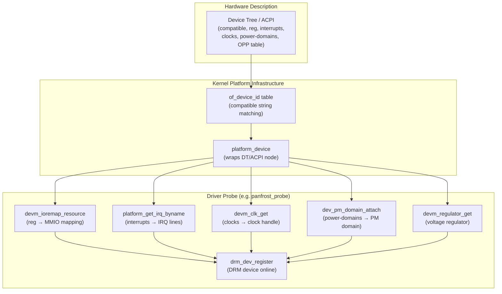
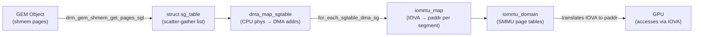
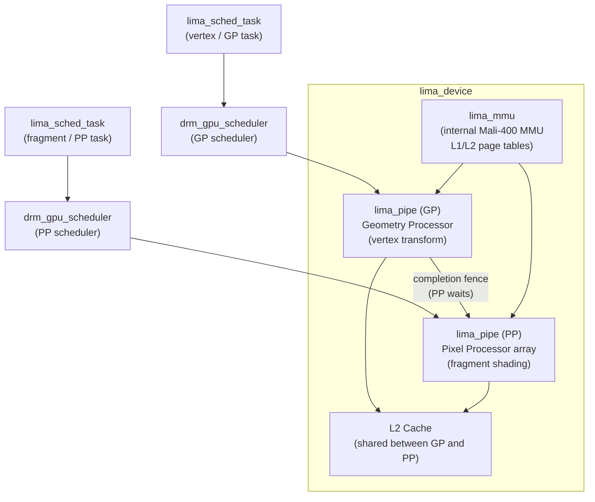
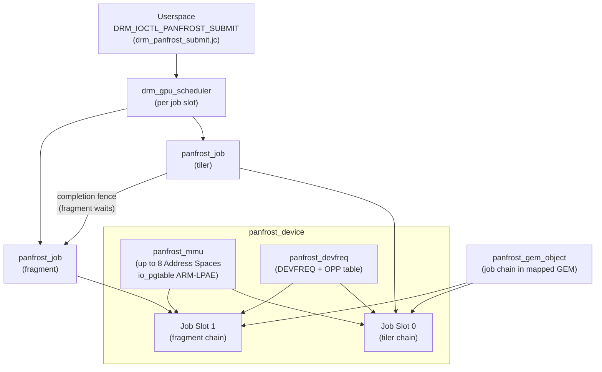
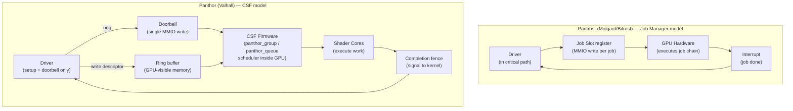
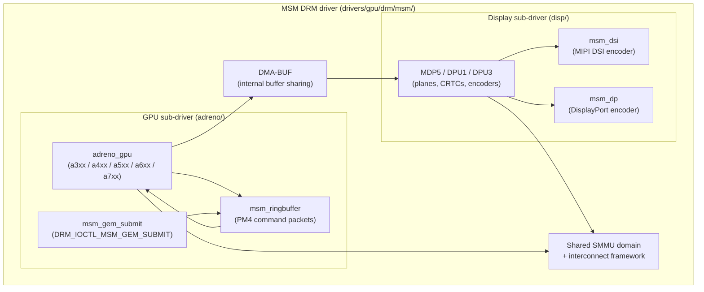
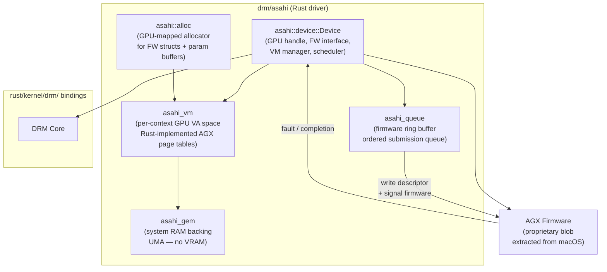
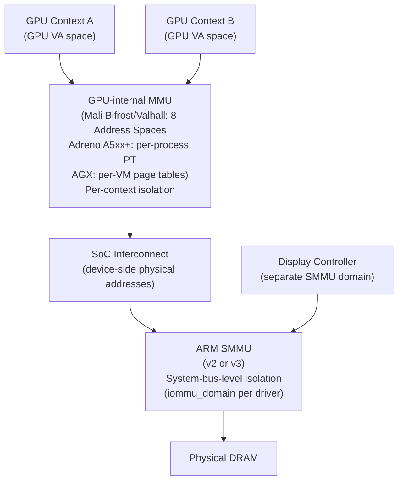

# Chapter 6: ARM & Embedded GPU Drivers

> **Part**: Part II — GPU Drivers
> **Audience**: Systems developer primary — kernel and driver developers targeting embedded SoCs, mobile, and ARM server platforms. Application developers benefit from sections on Turnip and Panfrost Mesa driver pairing to understand the capability boundaries of open-source ARM GPU support.
> **Status**: First draft — 2026-06-06

## Table of Contents

- [Overview](#overview)
- [1. Embedded vs. x86: Platform Driver Model](#1-embedded-vs-x86-platform-driver-model)
- [2. IOMMU Integration](#2-iommu-integration)
- [3. Lima: Mali-400/450 (Utgard)](#3-lima-mali-400450-utgard)
- [4. Panfrost: Mali Midgard and Bifrost](#4-panfrost-mali-midgard-and-bifrost)
- [5. Panthor: Mali Valhall CSF (Gen 10+)](#5-panthor-mali-valhall-csf-gen-10)
- [6. MSM / freedreno: Qualcomm Adreno](#6-msm--freedreno-qualcomm-adreno)
- [7. Asahi: Apple Silicon AGX](#7-asahi-apple-silicon-agx)
- [8. Embedded Display Subsystem Integration](#8-embedded-display-subsystem-integration)
- [9. Power Management, Devfreq, and Thermal Constraints](#9-power-management-devfreq-and-thermal-constraints)
- [10. IOMMU and Memory Protection on ARM](#10-iommu-and-memory-protection-on-arm)
- [11. Firmware Loading on Embedded Platforms](#11-firmware-loading-on-embedded-platforms)
- [Integrations](#integrations)
- [References](#references)

---

## Overview

**ARM** and embedded **GPU** drivers inhabit the same **DRM** driver framework as their x86 desktop counterparts, but the environment surrounding them is fundamentally different. Where a discrete GPU announces itself over **PCI Express**, negotiates **BAR**s, and manages its own **VRAM**, an embedded GPU is baked into a **System-on-Chip** fabric: discovered through **Device Tree** or **ACPI** tables, powered and clocked through shared SoC power controllers, and relying on the system's **IOMMU** — the **ARM SMMU** — to provide the address translation that PCI-attached GPUs handle with hardware **GART**s. The platform driver model uses `of_device_id` compatible-string matching and `platform_driver.probe` to claim **MMIO** resources, **IRQ** lines, clocks (`devm_clk_get`), power domains (`dev_pm_domain_attach`), and voltage regulators (`devm_regulator_get`) before calling `drm_dev_register`. **DVFS** couples the regulator and clock via **OPP** tables; on Qualcomm platforms, **ACPI** tables replace **Device Tree** on Snapdragon-based laptops.

**IOMMU** integration is the most consequential difference from x86. The **ARM SMMU v2/v3** translates GPU-issued **IOVA**s to physical **RAM** addresses using the kernel **IOMMU API** (`iommu_domain_alloc`, `iommu_attach_device`, `iommu_map`). GPU drivers bridge **GEM** object backing pages to **IOMMU** mappings via `struct sg_table` scatter-gather tables, using `dma_map_sgtable` and `for_each_sgtable_dma_sg`. On hardware without a GPU-internal **MMU**, the driver falls back to **CMA** (Contiguous Memory Allocator) allocations. The generic **drm_gpuvm** framework (Linux 6.7) provides a reusable **GPU VA** space manager.

This chapter examines the five main open-source **ARM** GPU kernel driver families that have reached mainline **Linux**. **Lima** covers the **Mali-400** and **Mali-450 Utgard**-architecture GPUs found in **Allwinner** and **Rockchip** SoCs, with a two-processor model (**GP** geometry processor and **PP** pixel processor array), a `drm_gpu_scheduler` per pipe, and a Mesa pairing of the **Lima Gallium3D** driver providing **OpenGL ES 2.0**. **Panfrost** handles the **Mali Midgard** (**T6xx**/**T7xx**/**T8xx**) and **Bifrost** (**G31** through **G76**) generations, implementing a **Job Slot** submission model, per-context **Mali MMU** address spaces managed via the **io_pgtable** library in **ARM-LPAE** format, **GEM** objects backed by `drm_gem_shmem_object` with a `madvise`-controlled memory shrinker, **DEVFREQ**-based **DVFS** with `simple_ondemand` governor, and a Mesa pairing of the **Panfrost Gallium3D** driver (OpenGL ES 3.1 on **Mali-G52** and **Mali-G610**). **Panthor** is the newest Mali driver, targeting the **Valhall CSF** architecture (**Mali-G310** through **Immortalis-G720**) and requiring a complete architectural break from **Panfrost**: the **Valhall Command Stream Frontend** replaced the **Job Manager** model with a firmware-managed microcontroller that consumes ring buffers and doorbells rather than job-slot register writes. **Panthor** uses **drm_gpuvm** for GPU VM management and pairs with the **PanVK** Vulkan driver in **Mesa** for **Vulkan 1.3** on **Mali-G610** and newer hardware. **Tyr**, merged in Linux 6.18, is a **Rust**-language reimplementation of the same **CSF** driver, the first **GPU** driver in mainline written in **Rust**, developed jointly by **Collabora**, **Arm**, and **Google** and built on the **rust/kernel/drm/** bindings layer. The **MSM** driver covers **Qualcomm Adreno** GPUs (**Adreno 2xx** through **Adreno 7xx**) and unlike every other driver discussed here also manages the **Snapdragon** display subsystem (**MDP4**, **MDP5**, **DPU**) under the same `drm_driver`; the per-generation files (`a3xx_gpu.c` through `a7xx_gpu.c`) implement an `adreno_gpu_funcs` vtable; **PM4** command packets fill `msm_ringbuffer` ring buffers submitted via `DRM_IOCTL_MSM_GEM_SUBMIT`; **Adreno** firmware and **PFP** microcode are loaded via `request_firmware` from `linux-firmware`; the security-critical **zap shader** crosses into **TrustZone** via `qcom_scm_pas_init_image` to configure **SMMU** stage-2 translations; **DEVFREQ** OPP transitions are accompanied by Qualcomm **interconnect** framework (`icc_set_bw`) DDR bandwidth votes; the display side covers **MIPI DSI** (`msm_dsi`) and **DisplayPort** (`msm_dp`) encoders; and the Mesa pairing is **freedreno Gallium3D** for all generations plus **Turnip** for **Vulkan 1.3** on **Adreno 6xx** (default on **AArch64** since **Mesa 25.1**). Finally, the **Asahi** DRM driver for **Apple Silicon AGX** (M1/M2/M3/M4) is produced by the **Asahi Linux** project through reverse engineering of **macOS**: the **AGX** architecture is a **Tile-Based Deferred Renderer** (**TBDR**) with separate geometry and fragment phases, **parameter buffers** in system **RAM**, and a **Unified Memory Architecture** (**UMA**) with no discrete **VRAM**; the reverse engineering methodology centres on the **m1n1** hypervisor for **MMIO** tracing of **macOS** GPU driver activity, supplemented by **Python** scripts that reconstruct data structure layouts from **DMA** memory snapshots; the **Rust** driver at `drivers/gpu/drm/asahi/` uses `rust/kernel/drm/` bindings and exposes `asahi_vm` per-context GPU VA spaces, `asahi_queue` firmware ring buffers, and `asahi_gem` system-RAM-backed objects; the **AGX** firmware blob is extracted from **macOS IPSW** archives by `asahi-installer` and loaded via `request_firmware`; as of **Linux 6.16** only the **uAPI** header (`include/uapi/drm/asahi_drm.h`) has been merged into mainline; and the userspace stack comprises the **Mesa Asahi Gallium3D** driver (OpenGL ES 3.1 / OpenGL 4.6), the **Honeykrisp** Vulkan driver targeting **Vulkan 1.3**, and **rusticl** OpenCL.

The chapter also covers cross-cutting topics shared by all drivers: embedded display subsystem integration including **MIPI DSI** panels, **drm_panel_funcs** callbacks, **DSI** video and command modes, bridge chips (**DSI-to-eDP** converters such as **Analogix ANX7625**, **Parade PS8640**), and the **drm_writeback_connector** for capture; power management via **DEVFREQ**, `operating-points-v2` **OPP** tables, `thermal_cooling_device` registration for thermal throttling, **Generic Power Domain** dependency ordering, and the `pm_runtime` suspend/resume sequence; system-level **IOMMU** and memory protection covering the **ARM SMMU** architecture, the distinction between the GPU's internal **MMU** and the system **SMMU**, **IOMMU groups** and **DMA-BUF** import/export as the controlled access gate between isolation domains, **SMMU** fault handling via `iommu_set_fault_handler`, and **CMA** fallback on **SMMU**-bypass SoCs; and embedded-platform firmware loading patterns including the `firmware-name` **Device Tree** property, **Panthor CSF** firmware boot sequence and binary header validation, **Adreno** firmware and the **zap shader** security flow, **AGX** firmware extraction, and power-domain sequencing pitfalls on **Rockchip RK3399**.

After reading this chapter, a systems developer should be able to bring up a new **ARM** GPU kernel driver from a **Device Tree** description, understand the **IOMMU** and power domain interactions that govern initialisation ordering, and explain why **Panthor** required a new driver rather than an extension of **Panfrost**. Application developers will understand which hardware generations are supported by which open-source userspace stack and what **Mesa** driver pairs with each kernel driver.

---

## 1. Embedded vs. x86: Platform Driver Model

On x86, a GPU driver's life begins at PCI enumeration. The kernel scans the PCI bus, matches a vendor/device ID to a driver via `pci_driver.id_table`, and calls the driver's `probe` function with a `pci_dev` handle. The driver then requests MMIO BARs, sets up MSI interrupts, and maps VRAM. This model presupposes that the hardware is self-describing: the PCI configuration space carries everything the driver needs to know about the device's resources.

ARM SoC GPUs have no PCI configuration space. Their existence, register addresses, interrupt lines, clocks, power domains, and IOMMU connections are all described in the platform's Device Tree (DT) source files or, on some Qualcomm laptop platforms, in ACPI tables. The kernel's platform driver infrastructure replaces PCI enumeration with DT or ACPI matching. A driver announces which hardware it supports via a `of_device_id` table of `compatible` strings. When the kernel boots and processes the flattened Device Tree, it finds GPU nodes and matches them against registered `of_device_id` tables, calling the driver's `platform_driver.probe` function with a `platform_device` that wraps the DT node.



A representative DT GPU node for a Rockchip RK3399 carrying a Mali-T860 looks like the following. Every field in this node translates directly into a driver operation:

```dts
/* Source: arch/arm64/boot/dts/rockchip/rk3399.dtsi — Mali-T860 GPU node */
gpu: gpu@ff9a0000 {
    compatible = "arm,mali-t860", "arm,mali-midgard";
    reg = <0x0 0xff9a0000 0x0 0x10000>;
    interrupts = <GIC_SPI 19 IRQ_TYPE_LEVEL_HIGH>,
                 <GIC_SPI 20 IRQ_TYPE_LEVEL_HIGH>,
                 <GIC_SPI 21 IRQ_TYPE_LEVEL_HIGH>;
    interrupt-names = "gpu", "mmu", "job";
    clocks = <&cru ACLK_GPU>;
    power-domains = <&power RK3399_PD_GPU>;
    operating-points-v2 = <&gpu_opp_table>;
    #cooling-cells = <2>;
};
```

The `reg` property gives the MMIO base address and size; the driver calls `platform_get_resource` and `devm_ioremap_resource` to map this region. The `interrupts` array provides three separate IRQ lines — in Panfrost's case one for the GPU block, one for the MMU, and one for the job scheduler — retrieved via `platform_get_irq_byname`. The `clocks` property names the clock that must be enabled before any GPU register access; the driver obtains it with `devm_clk_get` and must call `clk_prepare_enable` before touching hardware and `clk_disable_unprepare` during power-off. The `power-domains` entry ties the GPU to the Rockchip PMU's `PD_GPU` domain, handled by the Generic Power Domain framework via `dev_pm_domain_attach`.

On top of the fundamental clock and power-domain resources, SoC GPUs commonly depend on a voltage regulator for their core power rail. The `devm_regulator_get` / `regulator_enable` pattern governs this. DVFS couples the regulator and the clock: as the OPP table switches from one (frequency, voltage) pair to another, the driver must raise the voltage before raising the clock and lower the clock before lowering the voltage. This sequencing is mandatory; inverting it causes hardware instability.

The ACPI path is less common for GPU on ARM but does appear on Qualcomm Snapdragon-based laptops and tablets (Surface Pro X, Lenovo Yoga Slim 7x). The MSM DRM driver exposes an `acpi_match_table` alongside its `of_match_table`. ACPI-based ARM platforms describe resources through `_CRS` (Current Resource Settings) methods rather than DT properties, but the driver infrastructure still calls `platform_get_resource` and `devm_ioremap_resource` using the same API; the difference is invisible once the platform layer has translated ACPI tables into `platform_device` resources.

The key insight for any developer approaching an ARM GPU driver is that the platform driver probe function — `panfrost_probe`, `msm_pdev_probe`, `panthor_probe` — is the single entry point through which all hardware resources are claimed, all power and clock dependencies are enabled, and the DRM device is registered. Nothing can be done in GPU-specific order until the platform layer has satisfied its DT/ACPI-described dependencies. Every ARM GPU driver initialises through this platform driver path before it can do anything GPU-specific; the resource tree in DT or ACPI is the authoritative hardware description.

### Code example: Panfrost platform probe

```c
/* Source: drivers/gpu/drm/panfrost/panfrost_drv.c — panfrost_probe() */
static int panfrost_probe(struct platform_device *pdev)
{
    struct panfrost_device *pfdev;
    int err;

    pfdev = devm_drm_dev_alloc(&pdev->dev, &panfrost_drm_driver,
                               struct panfrost_device, base);
    if (IS_ERR(pfdev))
        return PTR_ERR(pfdev);

    platform_set_drvdata(pdev, pfdev);
    pfdev->comp = of_device_get_match_data(&pdev->dev);
    if (!pfdev->comp)
        return -ENODEV;

    pfdev->coherent = device_get_dma_attr(&pdev->dev) == DEV_DMA_COHERENT;

    pm_runtime_set_active(&pdev->dev);
    pm_runtime_enable(&pdev->dev);
    /* ... clock, power domain, MMU, job scheduler init ... */

    err = drm_dev_register(&pfdev->base, 0);
    if (err < 0)
        goto err_pm;

    return 0;
}
```

The `devm_drm_dev_alloc` call allocates a `panfrost_device` embedding a `drm_device`; the `base` field is the DRM device. Device-managed allocations (`devm_*`) guarantee cleanup on probe failure, which is important because probe failures that do not undo partial initialisation create subtle resource leaks.

---

## 2. IOMMU Integration

The most consequential difference between ARM embedded GPU drivers and their x86 counterparts is how GPU memory management interacts with the system's IOMMU. On discrete x86 GPUs, the GPU has dedicated VRAM and a hardware Graphics Address Remapping Table (GART) or per-process GPU Page Tables (PPGTT) implemented entirely within the GPU chip. The system's CPU-side IOMMU may be involved for DMA-BUF sharing but is not on the critical path for ordinary GPU memory allocation.

ARM SoC GPUs typically lack a hardware GART. The GPU issues addresses on the SoC interconnect, and those addresses must be translated to physical RAM addresses by the SoC's IOMMU — the ARM System Memory Management Unit (SMMU v2 or v3). Without the SMMU, the GPU would have to use physically contiguous memory (CMA allocations) for every buffer, which is expensive and defeats the purpose of having a virtual address space. With the SMMU, the GPU driver can allocate scattered physical pages and create a contiguous virtual address range in the SMMU page tables. From the GPU's perspective, it sees a flat virtual address space; the SMMU silently translates each access to the correct physical page.

The kernel's IOMMU API provides a driver-agnostic interface to the SMMU and other IOMMU implementations. A GPU driver creates a private IOMMU domain at probe time:

```c
/* Source: drivers/gpu/drm/msm/msm_iommu.c — msm_iommu_new() */
struct msm_mmu *msm_iommu_new(struct device *dev, unsigned long quirks)
{
    struct iommu_domain *domain;
    struct msm_iommu *iommu;
    int ret;

    if (!device_iommu_mapped(dev))
        return ERR_PTR(-ENODEV);

    domain = iommu_paging_domain_alloc(dev);
    if (IS_ERR(domain))
        return ERR_CAST(domain);

    iommu_set_pgtable_quirks(domain, quirks);
    iommu = kzalloc(sizeof(*iommu), GFP_KERNEL);
    /* ... initialise iommu struct ... */
    iommu->domain = domain;
    ret = iommu_attach_device(iommu->domain, dev);
    if (ret) {
        /* ... cleanup ... */
        return ERR_PTR(ret);
    }

    /* Register fault handler to convert SMMU faults to GPU resets */
    iommu_set_fault_handler(iommu->domain, msm_gpu_fault_handler, iommu);
    return &iommu->base;
}
```

Once the domain is attached, the driver calls `iommu_map(domain, iova, paddr, size, prot)` to install mappings — one call per scatter-gather segment — and `iommu_unmap` to remove them when a buffer is freed. The `iova` (I/O Virtual Address) is the GPU-visible address; `paddr` is the physical page address; `prot` carries read/write/cache flags.

The bridge between a GEM object's backing pages and IOMMU mappings is the scatter-gather table (`struct sg_table`). When a GEM object's pages are pinned (via `drm_gem_shmem_get_pages` or `dma_buf_map_attachment`), the driver calls `dma_map_sgtable` to obtain DMA-mapped addresses, then iterates `for_each_sgtable_dma_sg` to feed each segment into `iommu_map`:



```c
/* Source: drivers/gpu/drm/panfrost/panfrost_mmu.c — mmu_map_sg() */
static int mmu_map_sg(struct panfrost_device *pfdev, struct panfrost_mmu *mmu,
                      u64 iova, int prot, struct sg_table *sgt)
{
    struct scatterlist *sgl;
    int count;

    for_each_sgtable_dma_sg(sgt, sgl, count) {
        unsigned long paddr = sg_dma_address(sgl);
        size_t len = sg_dma_len(sgl);

        ret = ops->map_pages(ops, iova, paddr, pgsize, pgcount,
                             prot, GFP_KERNEL, &mapped);
        iova += mapped;
    }
    return 0;
}
```

The Panfrost driver programs the Mali GPU's internal MMU page tables directly using the `io_pgtable` library's ARM-LPAE format, rather than going through the SoC SMMU. This is because Mali Midgard and Bifrost GPUs have their own built-in MMU that manages per-context GPU VA spaces; the Mali MMU page tables live in system RAM and are programmed by the driver via MMIO into the Mali hardware's Translation Table Base Registers. The SoC SMMU is still present on the bus but the Mali hardware's internal MMU means the GPU presents coarser-granularity addresses to the system bus that the SMMU then translates at the device boundary.

For older hardware (notably Mali-400 on SoCs without an SMMU), the driver must fall back to Contiguous Memory Allocator (CMA) allocations. CMA reserves a pool of physically contiguous RAM at boot; the driver allocates from this pool and passes physical addresses directly to the GPU without any virtual address remapping. The Lima driver handles both the MMU path and the CMA fallback based on whether the hardware's MMU block is present and enabled.

The `drm_gpuvm` infrastructure, introduced in Linux 6.7, provides a generic framework for managing GPU virtual address spaces that multiple drivers can share. Panthor uses `drm_gpuvm` rather than a custom VA allocator; see Section 5 for how this manifests in practice.

---

## 3. Lima: Mali-400/450 (Utgard)

The Mali-400 and Mali-450 GPUs represent Arm's Utgard architecture, designed in the early 2010s and still shipping in Allwinner (H3, H5, A20, A64) and Rockchip (RK3036, RK3066) SoCs that power inexpensive single-board computers. The Utgard architecture is not a unified shader GPU in the modern sense. It has a fixed-function Geometry Processor (GP) that handles vertex transformation and a programmable Pixel Processor (PP) array — the Mali-450 has up to eight PP cores — for fragment shading. The shader ISA is a simple VLIW design, and the entire pipeline is considerably simpler than a contemporary Vulkan-capable GPU.

The Lima DRM driver was merged into Linux 5.2 in 2019. It is maintained in a stable, maintenance-mode state: no new hardware is being added to this driver family, but it receives bug fixes and minor improvements. The source tree lives at `drivers/gpu/drm/lima/`.

The driver structures reflect the hardware's two-processor model. `lima_device` is the top-level object representing the whole SoC GPU block. Within it, `lima_pipe` abstracts each of the GP and PP sub-blocks. `lima_gem_object` represents GEM objects backed by shmem pages; on hardware that has the Mali-400's internal MMU, pages are mapped through the driver's `lima_vm` virtual memory manager. On SoCs where the Mali MMU is disabled or absent, the driver uses CMA for physically contiguous allocations.

The Mali-400's built-in MMU is distinct from the SoC SMMU. The Lima driver programs this internal MMU directly via MMIO, writing L1 and L2 page table entries into GPU-accessible memory and setting the Translation Table Base register to point at the L1 table. The `lima_mmu.c` module encapsulates this page table management.

Scheduling in Lima uses two instances of the DRM GPU scheduler (`drm_gpu_scheduler`), one for the GP and one for the PP. A rendering workload produces two `lima_sched_task` objects — a vertex task for the GP and a fragment task for the PP — linked by an explicit dependency: the PP task cannot start until the GP task's fence has signalled. The `lima_sched_run_job` function activates the relevant pipe, flushes the L2 cache to ensure coherency between GP output and PP input, switches the MMU to the submitting context's address space, and then starts the task on the pipe.



```c
/* Source: drivers/gpu/drm/lima/lima_sched.c — lima_sched_run_job() (abbreviated) */
static struct dma_fence *lima_sched_run_job(struct drm_sched_job *job)
{
    struct lima_sched_task *task = to_lima_task(job);
    struct lima_sched_pipe *pipe = task->pipe;
    struct dma_fence *fence;

    /* Create completion fence before task starts */
    fence = lima_fence_create(pipe);
    if (IS_ERR(fence))
        return fence;

    /* Resume GPU from runtime suspend; record devfreq activity */
    lima_pm_busy(pipe->dev);

    /* Flush all L2 cache instances to prevent stale data */
    lima_l2_cache_flush_all(pipe->dev);

    /* Switch MMU address space to this task's VM context */
    lima_mmu_switch_vm(pipe->mmu, task->vm);

    /* Start the actual GP or PP task on the pipe */
    trace_lima_task_run(task);
    pipe->task_run(pipe, task);

    return fence;
}
```

The Mesa counterpart for Lima is the Lima Gallium3D driver in `src/gallium/drivers/lima/`. It supports OpenGL ES 2.0 on this hardware. There is no Vulkan support for Utgard hardware, nor OpenGL ES 3.x. The hardware simply lacks the compute primitives, transform feedback, and geometry shader capabilities that those APIs require. Developers targeting Lima hardware should expect a capable 2D and simple 3D stack suitable for embedded UI workloads, game ports with gles2 backends, and lightweight media applications. Deep compute or modern Vulkan workloads require a newer Mali generation.

---

## 4. Panfrost: Mali Midgard and Bifrost

Panfrost covers two generations of Arm Mali GPU. Midgard (Mali-T604, T620, T628, T720, T760, T820, T830, T860, T880) introduced a fully programmable unified shader model, tiled rendering, and a dedicated tiler unit that separates vertex/geometry processing from fragment shading. Bifrost (Mali-G31, G51, G52, G71, G72, G76) refined this model with improved SIMD execution units, out-of-order scheduling within the shader cores, and improved texture and attribute caches.

The Panfrost driver reached mainline Linux in 5.2 alongside Lima. Bifrost support was added iteratively through 5.x and 6.x kernel releases and is fully stable. The driver's source tree is at `drivers/gpu/drm/panfrost/`.

### Driver Architecture

`panfrost_device` is the top-level structure that aggregates the GPU hardware block, job scheduler state, MMU context manager, and power management. At probe, `panfrost_device_init` reads the hardware version register to determine the exact GPU variant and selects the appropriate feature flags and quirks from `panfrost_features.h`.

Job submission in Panfrost follows the hardware's Job Slot (JS) model. The hardware exposes multiple job slots; slots 0 and 1 are used for the tiler (vertex + tiler) job chain and the fragment job chain respectively. A `panfrost_job` represents one submission of either a tiler or fragment job chain. The dependency between them is explicit: the fragment job's `dma_fence` is added as a fence waiter on the tiler job's completion fence, enforcing that fragment work does not start until the tiler has finished writing per-tile polygon lists.

`drm_gpu_scheduler` mediates access to each job slot. Userspace submits via `DRM_IOCTL_PANFROST_SUBMIT` with a `drm_panfrost_submit` struct whose `jc` field carries a GPU-virtual-address pointer into a pre-assembled job chain in a mapped GEM object. The kernel does not parse or validate the job chain content; it trusts the Mali MMU to prevent the GPU from accessing memory outside the context's mapped range.



### MMU

The Panfrost driver manages the Mali hardware's internal MMU directly, not via the SoC SMMU API. The Mali MMU provides up to eight Address Spaces (ASes) on Bifrost, each with its own Translation Table Base Register. `panfrost_mmu.c` allocates AS slots, programs TTBRs, and manages page table memory using the `io_pgtable` library with either the ARM-LPAE or AArch64-4K format depending on hardware generation.

```c
/* Source: drivers/gpu/drm/panfrost/panfrost_mmu.c — panfrost_mmu_map() */
int panfrost_mmu_map(struct panfrost_gem_mapping *mapping)
{
    struct panfrost_gem_object *bo = mapping->obj;
    struct drm_gem_shmem_object *shmem = &bo->base;
    struct drm_gem_object *obj = &shmem->base;
    struct panfrost_device *pfdev = to_panfrost_device(obj->dev);
    struct sg_table *sgt;
    int prot = IOMMU_READ | IOMMU_WRITE | IOMMU_CACHE;

    /* Pin pages and get DMA-mapped scatter-gather table */
    sgt = drm_gem_shmem_get_pages_sgt(shmem);
    if (IS_ERR(sgt))
        return PTR_ERR(sgt);

    /* Walk sgt entries writing Mali page table entries */
    mmu_map_sg(pfdev, mapping->mmu, mapping->mmnode.start << PAGE_SHIFT,
               prot, sgt);
    mapping->active = true;
    return 0;
}
```

SMMU faults from the Mali MMU (which appear as GPU job faults in the Mali interrupt handler) cause the driver to reset the affected GPU context. The driver calls `panfrost_device_reset` which quiesces in-flight jobs, resets the GPU block, and returns error fences to waiting userspace threads.

### GEM and Memory

`panfrost_gem_object` wraps `drm_gem_shmem_object`, giving it shmem backing and the DRM PRIME/DMA-BUF import/export machinery. The `madvise` ioctl (`DRM_IOCTL_PANFROST_MADVISE`) lets userspace mark GEM objects as purgeable, enabling the driver's shrinker (`panfrost_gem_shrinker.c`) to reclaim GPU-mapped pages under memory pressure without killing the application.

### Power Management and Devfreq

Panfrost uses the kernel DEVFREQ framework for dynamic voltage and frequency scaling, implemented in `panfrost_devfreq.c`:

```c
/* Source: drivers/gpu/drm/panfrost/panfrost_devfreq.c — panfrost_devfreq_init() */
int panfrost_devfreq_init(struct panfrost_device *pfdev)
{
    struct device *dev = pfdev->base.dev;
    struct devfreq *devfreq;
    int ret;

    /* Load OPP table from Device Tree operating-points-v2 node */
    ret = devm_pm_opp_of_add_table(dev);
    if (ret) {
        if (ret == -ENODEV)
            ret = 0;     /* No OPP table — devfreq not available */
        return ret;
    }
    pfdev->pfdevfreq.opp_of_table_added = true;

    /* Register with DEVFREQ using simple ondemand governor */
    devfreq = devm_devfreq_add_device(dev, &panfrost_devfreq_profile,
                                      DEVFREQ_GOV_SIMPLE_ONDEMAND,
                                      &pfdev->pfdevfreq.gov_data);
    if (IS_ERR(devfreq))
        return PTR_ERR(devfreq);

    pfdev->pfdevfreq.devfreq = devfreq;
    return 0;
}
```

The `devm_pm_opp_of_add_table` call parses the `operating-points-v2` node in Device Tree, which contains a table of (frequency, voltage) pairs. The `simple_ondemand` governor adjusts the OPP level based on a utilisation metric: the driver reports GPU busy time per sampling period, and the governor raises or lowers the OPP accordingly.

### Mesa Pairing

The Mesa counterpart is the Panfrost Gallium3D driver in `src/gallium/drivers/panfrost/`. It achieves OpenGL ES 3.1 conformance on Mali-G52 and Mali-G610 hardware. There is no Vulkan support in the Panfrost Gallium driver for Midgard or Bifrost — the Vulkan path requires the Panthor kernel driver and Valhall hardware. Midgard and Bifrost OpenGL ES support is mature, and the combination of the Panfrost kernel driver with the Panfrost Gallium3D Mesa driver is the recommended open-source stack for these GPU generations.

---

## 5. Panthor: Mali Valhall CSF (Gen 10+)

The Valhall architecture — Mali-G310, G510, G610, G710, and the Immortalis-G715 and G720 — represents Arm's tenth generation of Mali GPU design. It appears in MediaTek Dimensity 9000, Samsung Exynos 2200, and similar high-end mobile SoCs. Panthor, the kernel driver for Valhall, was merged into Linux 6.10 in 2024, developed primarily by Collabora.

### Why CSF Required a New Driver

The decision to write Panthor as a completely separate driver rather than extending Panfrost is architectural, not cosmetic. Midgard and Bifrost use a Job Manager (JS) to dispatch work: the driver writes a job chain pointer into a Job Slot control register, the hardware reads and executes the job chain, and fires an interrupt on completion. The driver is in the critical path for every GPU submission.

Valhall replaced the Job Manager with the Command Stream Frontend (CSF): a microcontroller running proprietary firmware inside the GPU. The firmware manages a hierarchy of command groups (`panthor_group`) and command queues (`panthor_queue`). The driver's role is to set up ring buffers in GPU-visible memory, write firmware command descriptors into those ring buffers, and ring a doorbell — a single MMIO write — to notify the CSF firmware that new work is available. The firmware scheduler decides when to run each queue on the available shader cores. For typical submissions, the kernel is not involved between the doorbell write and the fence signal on completion.

This model is architecturally similar to how Intel's GuC firmware manages command submission on modern Intel GPUs (see Chapter 5, Section "GuC Submission"). The pattern of firmware-managed queues with kernel-side setup and doorbell signalling recurs in modern GPU designs because it allows hardware-level scheduling and preemption without kernel intervention on the submission hot path.



```c
/* Source: drivers/gpu/drm/panthor/panthor_fw.c — panthor_fw_load() (abbreviated) */
static int panthor_fw_load(struct panthor_device *ptdev)
{
    const struct firmware *fw;
    char fw_path[256];
    int ret;

    /* Construct architecture-versioned firmware path */
    snprintf(fw_path, sizeof(fw_path), "arm/mali/arch%d.%d/%s",
             GPU_ARCH_MAJOR(ptdev->gpu_info.gpu_id),
             GPU_ARCH_MINOR(ptdev->gpu_info.gpu_id),
             CSF_FW_NAME);   /* "mali_csffw.bin" */

    ret = request_firmware(&fw, fw_path, ptdev->base.dev);
    if (ret) {
        drm_err(&ptdev->base, "Failed to load firmware %s\n", fw_path);
        return ret;
    }

    /* Validate header magic: 0xc3f13a6e */
    if (hdr.magic != CSF_FW_BINARY_HEADER_MAGIC) {
        ret = -EINVAL;
        goto release_fw;
    }

    /* Parse and load firmware sections, initialise shared interface regions */
    ret = panthor_fw_load_sections(ptdev, fw);
    /* ... boot CSF microcontroller ... */

release_fw:
    release_firmware(fw);
    return ret;
}
```

After the firmware boots, the driver initialises the CSF interface structures — global control, command group slots, and stream slots — which are shared-memory regions the driver and firmware both access. From this point, command submission is entirely through firmware ring buffers.

### GPU VM Management

Panthor uses the generic `drm_gpuvm` framework (introduced in Linux 6.7) for managing GPU virtual address spaces. Where Panfrost has a custom VA allocator in `panfrost_mmu.c`, Panthor delegates VA range management to `drm_gpuvm_bo_obtain` and the state-machine map/unmap path:

```c
/* Source: drivers/gpu/drm/panthor/panthor_gem.c — VM map path */
int panthor_vm_map_bo_op(struct panthor_device *ptdev,
                         struct panthor_vm *vm,
                         struct panthor_gem_object *bo,
                         u64 va, u64 size, u32 flags)
{
    struct drm_gpuvm_bo *vm_bo;
    int ret;

    vm_bo = drm_gpuvm_bo_obtain(&vm->base, &bo->base.base);
    if (IS_ERR(vm_bo))
        return PTR_ERR(vm_bo);

    ret = drm_gpuvm_sm_map(&vm->base, NULL, va, size,
                           &bo->base.base, 0);
    drm_gpuvm_bo_put(vm_bo);
    return ret;
}
```

Using `drm_gpuvm` makes Panthor a reference implementation of the generic GPU VM framework and positions it well for future features such as VM_BIND (asynchronous GPU VA operations initiated directly from userspace without a kernel ioctl per-map).

### Tyr: Rust Port in Linux 6.18

Tyr is a Rust-language reimplementation of the Panthor CSF driver for the same Valhall hardware. It was merged into Linux 6.18 in 2025, living at `drivers/gpu/drm/tyr/`, and represents the first GPU driver in the mainline kernel written in Rust. Tyr was developed jointly by Collabora, Arm, and Google engineers, working from the existing Panthor C driver as a specification.

The initial upstream submission powers up the GPU, probes the device, and reads ROM information — a deliberately conservative first step. The complete downstream `tyr-dev` branch implements the full CSF submission model, runs GNOME and Weston compositors, and matches Panthor's performance on RK3588 hardware. The expectation is that Tyr will be developed incrementally upstream until it can serve as a drop-in replacement for Panthor, at which point the C driver may eventually be deprecated.

The significance of Tyr extends beyond the specific hardware it targets. It demonstrates that the Rust DRM binding abstractions in `rust/kernel/drm/` are mature enough to implement a non-trivial GPU driver, and it provides a concrete example of Rust/C driver coexistence within the DRM subsystem. Both Tyr and Asahi are contributors to the `rust/kernel/drm/` bindings layer that will become the canonical foundation for new Rust DRM drivers.

### Mesa Pairing

The Panfrost Gallium3D driver in Mesa, extended for Valhall, pairs with Panthor for OpenGL ES workloads. Vulkan support for Valhall is being developed through the PanVK driver in Mesa; it targets the Panthor kernel uAPI and is the path to conformant Vulkan on Mali-G610 and newer Arm GPU hardware. The OpenGL ES 3.1 conformance milestone on Mali-G610 was achieved in mid-2024 using the Panthor kernel driver paired with the updated Mesa Panfrost/Valhall stack (see Chapter 19 for the Mesa side of this story).

---

## 6. MSM / freedreno: Qualcomm Adreno

The MSM DRM driver is the largest and most complex ARM GPU driver in the Linux kernel. It covers the full lifecycle of Qualcomm Adreno GPUs — from the legacy scalar Adreno 2xx through the 64-bit Vulkan-capable Adreno 6xx and the recently-landed Adreno 7xx — and unlike every other GPU driver discussed in this chapter, it also manages the Snapdragon display subsystem (MDP4, MDP5, DPU) under the same `drm_driver`. The source tree is at `drivers/gpu/drm/msm/`, with GPU code under `adreno/`, display code under `disp/`, and shared infrastructure at the root.

### Driver Architecture and the GPU/Display Split

The decision to manage both GPU and display in one DRM driver reflects the Snapdragon SoC architecture, where the Adreno GPU, the display controller (MDP/DPU), the camera engine, and the video encoder all share the same SMMU and memory interconnect fabric. The same IOMMU domain infrastructure, the same devfreq and interconnect frameworks, and the same DMA-BUF import/export paths serve both subsystems. Separating them would require artificial interfaces between what is physically a unified system.

This contrasts with how Panfrost and Panthor are deployed: those drivers handle only the GPU, while a separate DRM driver (e.g., `rockchip_drm`, `sun4i_drm`, `mediatek_drm`) handles the display controller. Buffer sharing between the GPU and display then uses DRM PRIME/DMA-BUF. The MSM approach inlines this sharing by treating the GPU and display as co-equal DRM sub-drivers under a shared framework.



### GPU Architecture Evolution

Within the Adreno family, the driver handles distinct hardware generations, each with its own file under `drivers/gpu/drm/msm/adreno/`:

- `a3xx_gpu.c` / `a4xx_gpu.c`: legacy scalar ISA, OpenGL ES 3.0, no Vulkan.
- `a5xx_gpu.c`: 64-bit capable, introduced the render pass model and compute queues. First Adreno generation with Turnip Vulkan support in Mesa.
- `a6xx_gpu.c`: the dominant generation in Snapdragon 845 through 888 SoCs. Full Vulkan 1.3 support via Turnip. Multiple ring buffers for graphics and compute.
- `a7xx_gpu.c` (Adreno 730, 740, 750): newest microarchitecture with CSF-style submission on higher-end variants. Support landed in the MSM driver in 2024/2025; Turnip A7xx support is in active development.

The per-generation files implement a `adreno_gpu_funcs` vtable covering initialisation, firmware loading, power management, and submission; the generic `adreno_gpu.c` layer calls these functions, providing a consistent interface to the rest of the MSM driver.

### Firmware and the Zap Shader

Adreno GPUs require PM4 microcode (for the command processor) and PFP (Prefetch Parser) firmware, loaded from `/lib/firmware/qcom/adreno/` via `request_firmware`. These blobs are maintained in the `linux-firmware` repository under `qcom/`. Without firmware, the command processor cannot initialise and the GPU is non-functional.

The zap shader is an Adreno-specific security mechanism worth understanding. It is a small pre-compiled shader blob loaded at GPU startup via `adreno_zap_shader_load()`. The zap shader does not render anything; instead, it runs through the Qualcomm Trusted Execution Environment (TZ) and instructs the SMMU to mark certain GPU memory regions as protected, preventing non-secure GPU commands from accessing DRM-protected video content or other secure buffers:

```c
/* Source: drivers/gpu/drm/msm/adreno/adreno_gpu.c — adreno_zap_shader_load() */
int adreno_zap_shader_load(struct msm_gpu *gpu, const char *fwname)
{
    const struct firmware *fw;
    int ret;

    ret = request_firmware_direct(&fw, fwname, &gpu->pdev->dev);
    if (ret) {
        DRM_DEV_ERROR(gpu->dev->dev,
                      "Failed to load zap shader %s: %d\n", fwname, ret);
        return ret;
    }

    /* Issue SCM (Secure Channel Manager) call to TrustZone firmware.
     * TZ validates the shader and configures SMMU S2 translations for
     * protected GPU memory regions. */
    ret = qcom_scm_pas_init_image(ADRENO_PAS_ID, fw->data, fw->size, NULL);
    release_firmware(fw);
    return ret;
}
```

The `qcom_scm_pas_init_image` call crosses into TrustZone; TZ validates the zap shader cryptographic signature, then programs SMMU stage-2 tables to enforce secure memory access. This is the intersection of firmware loading, IOMMU security, and Qualcomm's proprietary TEE. Correct zap shader loading is mandatory for protected content playback and is one reason why Adreno bring-up on new SoC variants can require firmware and TZ configuration work beyond the GPU driver itself.

### Command Submission

Userspace submits GPU work via `DRM_IOCTL_MSM_GEM_SUBMIT`. The `msm_gem_submit` struct carries a list of BOs with per-BO flags (`MSM_SUBMIT_BO_READ`, `MSM_SUBMIT_BO_WRITE`), a list of command buffers referencing those BOs, and fence synchronisation information. The kernel validates every submitted BO handle, checks flag consistency, and resolves IOVAs before committing the submission to the ring buffer:

```c
/* Source: drivers/gpu/drm/msm/msm_gem_submit.c — msm_ioctl_gem_submit() */
int msm_ioctl_gem_submit(struct drm_device *dev, void *data,
                         struct drm_file *file)
{
    struct msm_gem_submit *submit;
    /* ... */

    /* Bulk lookup and lock all submitted BOs in table_lock order */
    ret = submit_lookup_objects(submit, &args, file);
    if (ret)
        goto out;

    /* Validate BO flags; resolve GPU IOVAs for each BO */
    for (i = 0; i < args->nr_bos; i++) {
        struct msm_gem_object *msm_obj = submit->bos[i].obj;
        ret = submit_bo(submit, i, msm_obj, &iova);
        if (ret)
            goto out;
    }

    /* Retrieve ring buffer for the target queue */
    ring = gpu->rb[queue->ring_nr];

    /* Push the scheduler job; actual ring writes happen in run_job */
    drm_sched_entity_push_job(&submit->base);
    /* ... */
}
```

The ring buffer (`msm_ringbuffer`) contains PM4 command packets. PM4 is the packet protocol inherited from ATI/AMD hardware that Adreno GPUs have used since the pre-Qualcomm era; it is a packet-based command stream with Type-3 and Type-7 packet formats. The kernel writes PM4 packets that set up GPU state, reference command buffer addresses, and trigger indirect execution; the actual draw calls and compute dispatches live in userspace-assembled command buffers in mapped GEM objects.

On Adreno A6xx and newer, there are multiple ring buffers: a graphics ring, a compute ring, and a protected-mode ring. Each ring is associated with a separate hardware queue and can be preempted independently. The MSM driver's scheduler (`msm_sched.c`) manages priority and preemption across rings.

### Devfreq and Interconnect

Adreno power management via DEVFREQ follows the same OPP-table pattern as Panfrost, but adds Qualcomm's `interconnect` framework for memory bandwidth voting. At each OPP level transition, the driver calls `icc_set_bw(path, avg_bw, peak_bw)` to vote for the DDR bus bandwidth that the GPU requires at that performance level:

```c
/* Source: drivers/gpu/drm/msm/msm_devfreq.c — msm_devfreq_change_freq() */
static int msm_devfreq_change_freq(struct msm_devfreq *devfreq,
                                   unsigned long freq)
{
    struct dev_pm_opp *opp;

    opp = dev_pm_opp_find_freq_ceil(devfreq->dev, &freq);
    /* ... set clock, set voltage ... */

    /* Vote for memory bandwidth at this OPP level */
    icc_set_bw(gpu->icc_path, MBps_to_icc(opp_bw), 0);
    dev_pm_opp_put(opp);
    return 0;
}
```

Bandwidth voting is not optional on Qualcomm hardware: without correct ICC votes, the DDR interconnect may not allocate sufficient bandwidth for the GPU's working frequency, resulting in subtle performance degradation or GPU hangs under high memory pressure.

### Display Subsystem

The MSM display driver under `disp/` supports three generations of Snapdragon display hardware: MDP5 (Snapdragon 200/400/600-era), DPU1 (Snapdragon 845 through 865, using the Display Processing Unit model), and DPU3 (Snapdragon 8cx laptop-class SoCs). Each generation has distinct plane/CRTC/encoder implementations but all participate in the standard DRM atomic commit flow (see Chapter 2).

The DSI encoder (`msm_dsi.c`) manages the MIPI DSI physical layer and controller for panel bring-up. Panel devices appear as child nodes in Device Tree, matched to panel drivers in `drivers/gpu/drm/panel/` by `compatible` string. The DisplayPort encoder (`msm_dp.c`) handles USB-C DisplayPort on Snapdragon X Elite and similar laptop SoCs.

### Mesa Pairing

freedreno Gallium3D (`src/gallium/drivers/freedreno/`) is the OpenGL driver for all Adreno generations. Turnip (`src/vulkan/drivers/freedreno/`) is the Vulkan driver targeting Adreno 6xx and newer. As of Mesa 25.1, Turnip is built by default when compiling Mesa for AArch64 — it joins the software rasteriser, Intel ANV, and Panfrost on the default AArch64 driver list. Turnip supports Vulkan 1.3 on Adreno 6xx hardware. Adreno 7xx Turnip support is in active development. Older Adreno hardware (5xx, 4xx) is supported by freedreno Gallium only; there is no Vulkan path for pre-6xx Adreno.

---

## 7. Asahi: Apple Silicon AGX

The Asahi DRM driver for Apple Silicon AGX is unlike any other driver in this chapter. The hardware — Apple's in-house GPU IP in the M1, M2, M3, and M4 SoC families — is completely undocumented by Apple. The driver is the product of systematic reverse engineering by the Asahi Linux project. The kernel-mode driver is written in Rust. And the upstream journey has been an exercise in patience: as of Linux 6.16, only the userspace API (uAPI) header has been merged into mainline (`include/uapi/drm/asahi_drm.h`); this makes Asahi the only GPU in Linux's history where the uAPI was merged ahead of the driver itself, a special accommodation by the DRM maintainers to unblock upstream Mesa enablement. The full Rust driver continues to develop in the AsahiLinux kernel fork at `drivers/gpu/drm/asahi/`.

### 7a. AGX GPU Microarchitecture

Apple calls its GPU design a Tile-Based Deferred Renderer (TBDR). Understanding TBDR is necessary to understand why the Asahi driver submits vertex and fragment work as separate firmware queue entries, and why the Honeykrisp Vulkan driver handles Vulkan render passes differently from typical x86 Vulkan drivers.

In a TBDR, rendering a frame proceeds in two phases. During the vertex phase (Apple calls this "geometry" work), all draw calls for the frame are processed to produce per-tile polygon lists. The screen is divided into tiles — typically 32x32 pixels — and each triangle is binned into the tiles it touches. The output of the vertex phase is a set of per-tile command lists stored in parameter buffers in system RAM. This work happens entirely before any pixel shading begins.

The fragment phase (Apple calls this "fragment" work or "render") processes tiles one at a time. For each tile, the GPU loads the relevant geometry from the parameter buffer, rasterises it, shades pixels, and writes the result to a small on-chip tile memory buffer. Only when the entire tile is finished does the GPU write colour, depth, and stencil results from tile memory to the main framebuffer in DRAM. This means the on-chip tile memory acts as the working depth and colour buffer for the tile; bandwidth to DRAM for intermediate render results is eliminated.

The performance benefit is significant. A 1080p framebuffer with 32x32 tiles has 1,020 tiles. Each tile's shading uses on-chip memory that is hundreds of times faster than DRAM. The DRAM bandwidth cost per frame is the final framebuffer write plus parameter buffer reads — not repeated reads and writes for depth testing against a full-resolution depth buffer in DRAM as occurs in immediate-mode renderers.

The Unified Memory Architecture (UMA) of Apple Silicon means CPU and GPU share the same physical DRAM. There is no discrete VRAM. The driver allocates GEM objects in system RAM and maps them into the GPU's virtual address space. There is no TTM-style VRAM eviction engine; the driver does not need to migrate buffers between VRAM and system RAM because there is only system RAM. This simplifies the driver considerably compared to discrete GPU drivers.

Parameter buffers are allocated by the driver in system RAM and their addresses are embedded in the firmware queue descriptors. The driver must allocate enough parameter buffer space before starting geometry work; if the geometry is more complex than anticipated, the hardware can signal a "partial render" — completing the tiles that fit within the allocated parameter buffer — after which the driver reallocates a larger buffer and resubmits remaining geometry. The exact format of parameter buffers is reverse-engineered and should be treated as observed behaviour rather than specified behaviour.

### 7b. Reverse Engineering Methodology

The challenge facing the Asahi Linux project has no parallel in this chapter. Where freedreno benefited from leaked internal Qualcomm documentation and the Panfrost team had access to Arm's Midgard architecture manual, the Asahi team had nothing except the hardware and the macOS GPU driver stack.

The primary tool for hardware-level observation is `m1n1`, the Asahi project's custom first-stage bootloader and hypervisor. When running macOS as a guest under `m1n1`, every MMIO read and write performed by the macOS GPU driver is intercepted and logged. Similarly, every DMA write to GPU-visible memory — the firmware command descriptors, the GPU page table entries, the GPU register writes performed by firmware — is captured. Over thousands of captured traces, the team built a picture of how macOS initialises and commands the AGX GPU.

The `m1n1` hypervisor intercepts operate at nanosecond granularity; the resulting traces are processed by Python scripts in the Asahi RE toolkit (available at `https://github.com/AsahiLinux/gpu`). These scripts parse memory snapshots and reconstruct data structure layouts by correlating pointer values observed in MMIO writes with structures found in DMA-mapped memory regions. This is how the firmware queue descriptor format, the GPU MMU page table layout, and the GPU register map were determined. The scripts continue to be used as the driver evolves — new hardware features are first characterised by running a known workload on macOS and parsing the resulting traces.

Iterative fuzzing complements trace analysis. The Asahi driver is tested by rendering known geometric primitives and comparing the output to the same scene rendered on macOS. Any pixel-level divergence indicates incorrect hardware state. This comparison approach is how shader compiler correctness is verified: the `agx` shader compiler backend in Mesa is validated against macOS GPU output on the same inputs.

All hardware details in the Asahi driver should be understood as reverse-engineered observations, not vendor specifications. Tile memory capacity per tile, the exact format of parameter buffer geometry records, and the firmware queue descriptor protocol are all in this category.

### 7c. drm/asahi Driver Structure

The Rust driver at `drivers/gpu/drm/asahi/` uses the Rust DRM bindings in `rust/kernel/drm/` to interact with the DRM core. The top-level `asahi::device::Device` (mapped to the `asahi_device` concept in the uAPI) holds the GPU hardware handle, the firmware interface, the VM manager, and the job scheduler. Initialisation follows the reverse-engineered firmware boot sequence: the driver writes a specific pattern to GPU registers to release the firmware microcontroller from reset, waits for the firmware ready flag in shared memory, then exchanges capability information with the firmware.

Each GPU context owns an `asahi_vm` — a per-VM GPU virtual address space backed by Rust-implemented page tables that match the AGX MMU format. The page table format was reverse-engineered and is analogous to AArch64 4-level page tables but with Apple-specific attributes and layout. The `asahi::vm` module manages IOVA allocation and page table updates using a Rust structure that enforces ownership and prevents aliasing — this is one concrete place where the Rust language properties benefit driver safety on undocumented hardware.

`asahi_queue` represents one ordered submission queue within a VM, mapping roughly to a Vulkan queue. Commands are written into firmware ring buffers in GPU-visible memory. The queue model is architecturally similar to Panthor CSF queues: the kernel sets up the ring buffers and the firmware consumes them, with the kernel involved only for setup and fault recovery.

`asahi_gem` objects are backed by system RAM (UMA, no VRAM). The `asahi::alloc` module provides GPU-mapped allocators for internal driver use (firmware data structures, page tables, parameter buffers).



### 7d. Firmware-Based Submission Model

The AGX firmware is a proprietary blob extracted from macOS IPSW archives. The Asahi project packages and distributes it separately; the driver loads it via `request_firmware`. Without the firmware blob, the GPU does not initialise. Unlike Panthor's CSF firmware (which is distributed by Arm and SoC vendors and has a published binary interface version), the AGX firmware protocol is entirely reverse-engineered and can change across macOS updates.

The firmware exposes ring buffers in shared CPU/GPU-visible memory. For each work type — geometry (vertex/tiler), fragment (render), and compute — the driver writes command descriptors into the corresponding ring buffer. Each descriptor carries buffer addresses, the parameter buffer pointer (for fragment work that depends on vertex output), and synchronisation information. After writing the descriptor, the driver signals the firmware via a shared-memory flag or doorbell, and the firmware schedules the work onto available shader cores.

This is architecturally closer to Panthor CSF than to Panfrost: the kernel does not directly program shader dispatch registers. All GPU execution is mediated through the firmware protocol. The difference from Panthor is that the Panthor CSF interface is documented by Arm, while the AGX firmware protocol is observed behaviour.

Fault recovery follows a similar pattern to Panthor. The firmware signals faults (page faults, GPU hangs, command stream timeouts) by setting flags in shared memory, which the driver's fault handler detects via a completion mechanism. On fault, the driver marks the offending VM as invalid, returns error fences to waiting userspace, and attempts GPU recovery. Because the firmware protocol is reverse-engineered, fault handling is one of the areas where the Asahi driver is most cautious: a misunderstood firmware state after fault can leave the GPU in an indeterminate state.

### 7e. Userspace Driver Stack

The Mesa Asahi Gallium3D driver (`src/gallium/drivers/asahi/`) provides OpenGL ES 3.1 and OpenGL 4.6 support. It uses the `agx` NIR-to-AGX ISA shader compiler backend, which was also developed through reverse engineering and is the same backend used by the Honeykrisp Vulkan driver.

Honeykrisp is the Vulkan driver for AGX, developed primarily by Faith Ekstrand and derived structurally from NVK (the nouveau Vulkan driver for NVIDIA hardware). The name reflects the Apple Silicon laptop it targets. Honeykrisp targets Vulkan 1.3 conformance; as of mid-2025, conformance submission is in progress. The connection to NVK is architecturally interesting: NVK and Honeykrisp share NIR-level infrastructure and design patterns, even though the hardware they target (NVIDIA Turing/Ampere vs. Apple AGX) is completely different. This is discussed further in Chapter 7 in the context of the nouveau/NVK family.

The rusticl OpenCL implementation in Mesa runs on top of the Asahi Gallium driver, providing OpenCL for AGX workloads without a separate compute driver. Video decode (HEVC, VP9 on M1/M2) is supported via a separate media driver; video encode is not yet supported.

The uAPI stabilisation in Linux 6.16 is the milestone that allowed Mesa to target upstream headers rather than the AsahiLinux fork headers. The `drm_asahi_submit` struct in `include/uapi/drm/asahi_drm.h` captures the firmware-buffer submission model; annotated here for reference:

```c
/* Source: include/uapi/drm/asahi_drm.h — drm_asahi_submit */
struct drm_asahi_submit {
    __u64 flags;          /* Reserved, must be zero */
    __u32 queue_id;       /* Target submission queue within the VM */
    __u32 result_handle;  /* GEM handle for per-submission result buffer */
    __u64 in_syncs;       /* Pointer to array of drm_asahi_sync (wait) */
    __u32 in_sync_count;
    __u32 out_sync_count;
    __u64 out_syncs;      /* Pointer to array of drm_asahi_sync (signal) */
    __u64 command;        /* GPU VA of the command descriptor in the ring buffer */
    __u32 cmd_type;       /* DRM_ASAHI_CMD_RENDER, DRM_ASAHI_CMD_COMPUTE, ... */
    __u32 pad;
};
```

The `command` field is a GPU-virtual address pointing into a ring buffer the driver has pre-populated with the firmware-format command descriptor. This reflects the firmware-buffer model: userspace (Mesa) constructs the descriptor and the kernel ioctl delivers it to the firmware queue.

---

## 8. Embedded Display Subsystem Integration

Display integration on ARM SoCs is tighter than on x86. On a desktop system, the GPU produces rendered frames and the display controller reads them from DRAM via a separate PCIe path; the two are independent devices. On a SoC, the GPU and display controller share the same memory interconnect, the same SMMU, and often the same Device Tree power domain. MIPI DSI panels are not plug-and-play like HDMI or DisplayPort monitors; their initialisation sequences, timing parameters, and reset GPIO sequences must be described in Device Tree and implemented in panel drivers.

The DRM panel and bridge framework (see Chapter 2, Section "KMS Connectors") provides the abstraction layer. A panel driver in `drivers/gpu/drm/panel/` implements `drm_panel_funcs` callbacks: `prepare` (assert power and reset, initialise panel over DSI command mode), `enable` (turn on backlight), `disable` (turn off backlight), and `unprepare` (deassert and power down). The display controller driver calls these in order during KMS atomic commits. A typical ARM display pipeline looks like:

```
GPU (renders frame) → framebuffer in DRAM
                              ↓
              Display controller (reads framebuffer, applies scaling/blending)
                              ↓
                 DSI controller (serialises pixel data to MIPI DSI bus)
                              ↓
                    DSI PHY (physical differential signalling)
                              ↓
                       DSI panel (receives and displays)
```

Each element in this chain appears as a DRM object: the display controller contributes CRTCs and planes, the DSI encoder appears as a DRM encoder, bridge chips (if any) appear as `drm_bridge` objects in the encoder chain, and the panel appears as a `drm_connector`. The `atomic_check` path validates that the combination of CRTC timing, encoder mode, and connector capabilities is consistent; `atomic_commit` performs the actual hardware programming.

MIPI DSI panels operate in one of two modes. Video mode panels continuously receive a pixel stream driven by the display controller's sync timing; from the panel's perspective, it behaves like an analogue display. Command mode panels are stateful: the controller sends frame data explicitly via DSI packets, and the panel's internal display RAM holds the last received frame. Command mode reduces DSI bus activity and power consumption but requires that the display controller send frames at the panel's expected refresh rate.

Bridge chips — external scalers, DSI-to-eDP converters (Parade PS8640, Analogix ANX7625), DSI-to-HDMI bridges — appear as intermediate elements in the bridge chain. The DRM core's `drm_bridge_chain_*` functions traverse the chain in order during mode setting. A multi-bridge chain on an ARM laptop might look like: DPU encoder → DSI controller → ANX7625 DSI-to-eDP bridge → eDP panel. Each bridge's `drm_bridge_funcs` callbacks are called in sequence for power, mode, and enable transitions.

The writeback connector (`drm_writeback_connector`) is an embedded-specific DRM feature that allows routing display output to a buffer rather than to an external display. On SoCs that support writeback (Rockchip RK3568, Qualcomm DPU), an application or compositor can capture screen content by attaching a GEM object as a writeback destination in an atomic commit. This is useful for screen mirroring, recording, and accessibility tools without requiring a separate capture engine.

When Panfrost or Panthor is paired with a separate display driver (rather than the integrated MSM approach), the connection between GPU rendering and display scanning is entirely through DMA-BUF / GEM PRIME. The GPU driver exports its GEM objects as DMA-BUFs; the display driver imports them as framebuffers. The SMMU ensures that the display controller has access to those buffers via its own IOMMU domain, with the DMA-BUF import/export mechanism acting as the controlled access gate between IOMMU domains (see Section 10).

---

## 9. Power Management, Devfreq, and Thermal Constraints

Embedded GPU power management is more complex than discrete GPU power management because the GPU does not own its power domain. It shares power rails with other SoC IP blocks, its clock tree is managed by a shared clock controller, and thermal constraints may originate from a CPU thermal zone rather than a GPU-specific sensor.

### DVFS and the OPP Framework

The kernel DEVFREQ framework provides a unified interface for dynamic voltage and frequency scaling. All the GPU drivers discussed in this chapter — Lima, Panfrost, Panthor, MSM, and eventually Asahi — use DEVFREQ. The operating point table in Device Tree uses the `operating-points-v2` binding:

```dts
/* Source: arch/arm64/boot/dts/rockchip/rk3399.dtsi — GPU OPP table */
gpu_opp_table: opp-table {
    compatible = "operating-points-v2";
    opp-200000000 {
        opp-hz = /bits/ 64 <200000000>;
        opp-microvolt = <800000>;
    };
    opp-297000000 {
        opp-hz = /bits/ 64 <297000000>;
        opp-microvolt = <850000>;
    };
    opp-400000000 {
        opp-hz = /bits/ 64 <400000000>;
        opp-microvolt = <900000>;
    };
    opp-500000000 {
        opp-hz = /bits/ 64 <500000000>;
        opp-microvolt = <950000>;
    };
};
```

The `devm_pm_opp_of_add_table` call parses this table and registers the OPP objects with the OPP core. The DEVFREQ driver then calls `dev_pm_opp_set_rate` to transition between OPPs; the OPP core handles the voltage-before-clock-raise and clock-before-voltage-lower sequencing.

DEVFREQ governor selection matters for embedded workloads. The `simple_ondemand` governor (used by Panfrost) monitors GPU busy time per polling interval and scales up when the GPU is above an `upthreshold` percentage busy. The `performance` and `powersave` governors pin the OPP at the highest or lowest level respectively. For interactive UI workloads where latency matters, `simple_ondemand` or `userspace` (allowing a compositor to control the OPP) is typical.

### Thermal Throttling

The GPU registers as a `thermal_cooling_device` via `thermal_of_cooling_device_register`. The thermal subsystem calls the cooling device's `get_max_state` and `set_cur_state` callbacks when thermal zone temperatures exceed thresholds. `set_cur_state` in the GPU driver limits the maximum allowed OPP level. If the GPU is currently running at a higher OPP, DEVFREQ forces it down at the next sampling interval.

The thermal zone for a SoC GPU may be defined in Device Tree using the `thermal-zones` binding, with a trip point at (for example) 85°C triggering GPU throttling and a second trip point at 95°C reducing to the lowest OPP. On Qualcomm platforms, the TSENS temperature sensor subsystem feeds into the thermal framework; the GPU thermal zone polls TSENS directly.

### Power Domain Dependencies

SoC power domains form dependency trees. The Rockchip RK3399 GPU power domain (`PD_GPU`) depends on the top-level `PD_CENTER` domain; power-on must proceed parent-first (PD_CENTER then PD_GPU) and power-off must proceed child-first. The Generic Power Domain framework manages this automatically when power domains are described correctly in Device Tree as a parent-child hierarchy.

The critical constraint for GPU drivers is that the GPU power domain must be on before any MMIO register access. Attempting to read a GPU register while its power domain is off causes a bus error. The correct probe ordering is enforced by `pm_runtime_get_sync` (which activates the power domain and clocks) before the first register access in `panfrost_device_init` or equivalent. Similarly, `pm_runtime_put_autosuspend` in the idle path sequences clock disable before power domain off.

### Suspend/Resume

System suspend requires the GPU to quiesce completely before the power domain can be turned off. The sequence for all drivers is similar: drain all in-flight jobs (wait for scheduler to idle), disable interrupts, disable GPU clocks, disable power domains. On resume, the reverse: enable power domains, enable clocks, re-initialise the GPU block (register re-programming, MMU re-setup), re-enable interrupts. The `pm_runtime_force_suspend` / `pm_runtime_force_resume` helpers enforce this ordering by calling the driver's `runtime_suspend` and `runtime_resume` callbacks, which perform the actual hardware sequencing.

---

## 10. IOMMU and Memory Protection on ARM

This section zooms out from the per-driver IOMMU API calls in Section 2 to examine the system-level ARM SMMU architecture and its security implications, which apply across all ARM GPU drivers.

### The ARM SMMU: Function and Architecture

The ARM System Memory Management Unit (SMMU v2 or v3) is the SoC's IOMMU. It sits on the system interconnect between all DMA-capable IP blocks and the memory controllers. Every DMA transaction issued by the GPU, display controller, camera engine, or USB controller passes through the SMMU. For each transaction, the SMMU consults its page tables to translate the device-issued address (an IOVA — I/O Virtual Address) to a physical RAM address. If no valid mapping exists, the SMMU fires a translation fault and blocks the access.

The SMMU driver lives at `drivers/iommu/arm/arm-smmu-v3/arm-smmu-v3.c`. It exposes the standard kernel `iommu_domain` API: `iommu_domain_alloc`, `iommu_attach_device`, `iommu_map`, `iommu_unmap`, and `iommu_set_fault_handler`. GPU drivers call these functions without knowing whether the underlying IOMMU is an SMMU v2, SMMU v3, Qualcomm IOMMU, or any other implementation — the abstraction is complete.

### GPU MMU vs. System SMMU

A common misconception is that the GPU MMU and the system SMMU are the same unit. They are not. Modern ARM GPUs (Mali Bifrost/Valhall, Adreno A5xx+, AGX) have their own internal GPU MMU that manages per-context GPU virtual address spaces. This internal MMU operates entirely within the GPU; it translates GPU-issued virtual addresses to device-side physical addresses that the GPU then presents to the SoC interconnect. The SMMU, in turn, translates those device-side addresses to actual physical RAM addresses.

The two MMUs serve different roles: the GPU's internal MMU provides per-context isolation between GPU processes (each OpenGL context or Vulkan device gets its own GPU VA space); the SMMU provides system-bus-level isolation between the GPU as a whole and every other DMA-capable device. Compromising a GPU context breaks the GPU MMU's isolation but not the SMMU's — the GPU as a device is still limited to accessing only the DRAM regions for which it has SMMU mappings.

On older hardware without a GPU-internal MMU (Mali-400/Lima), the SMMU is the only address translation layer; the driver programs SMMU page tables directly rather than the GPU's internal tables.



### IOMMU Groups and DMA Isolation

The kernel assigns devices to IOMMU groups based on hardware isolation guarantees. Devices in the same IOMMU group cannot be isolated from each other: they share an IOMMU domain. On well-designed SoCs, the GPU and display controller are in separate IOMMU groups, meaning that a bug or exploit in the GPU cannot issue DMA reads into display framebuffer memory — the SMMU enforces the boundary.

This has direct implications for DMA-BUF sharing. When a GPU-exported DMA-BUF is imported by the display controller, the display driver calls `iommu_map` on the display controller's SMMU domain, explicitly granting the display hardware access to that buffer. The import/export mechanism is the controlled access gate between IOMMU domains. Outside of explicit DMA-BUF sharing, no cross-domain access is possible.

### Fault Handling and GPU Reset

SMMU faults — whether caused by a bug in the GPU driver, a malformed GPU command stream, or an attempt by a compromised shader to read out-of-bounds memory — trigger the fault handler registered with `iommu_set_fault_handler`. In the MSM driver, the fault handler calls `msm_gpu_fault_handler`, which records the faulting IOVA and fault type, then triggers a GPU reset via the DRM GPU scheduler's timeout mechanism. The reset invalidates in-flight jobs, returns error fences to waiting clients, and reinitialises the GPU hardware state. The physical RAM that was the target of the out-of-bounds access is never reached.

### SMMU Bypass and Older SoCs

Not all ARM SoCs have a functional SMMU. Early Rockchip SoCs (RK3288-era), some Allwinner SoCs, and Qualcomm SoCs in certain secure-world configurations disable or bypass the SMMU. In these cases, GPU drivers must detect the absence of IOMMU support (via `device_iommu_mapped` returning false, or `of_iommu_configure` returning an error) and fall back to CMA allocations. The CMA path trades virtual address flexibility for guaranteed physical contiguity; it is functional but limits the size of individual allocations to what CMA can satisfy contiguously.

For new driver bring-up, always check `device_iommu_mapped` at probe and handle the no-IOMMU path explicitly. Silently proceeding with physically addressed DMA without SMMU protection is both a correctness hazard (fragmented physical memory) and a security hazard (no DMA isolation).

---

## 11. Firmware Loading on Embedded Platforms

Chapter 5 covers the general `request_firmware` / `firmware_class` mechanism, signed firmware, and the x86 driver firmware model. This section covers ARM-SoC-specific patterns that differ from or extend that baseline.

### Device Tree Firmware Names

The `firmware-name` Device Tree property is the canonical ARM mechanism for specifying firmware blob names in the device node rather than hard-coding filenames in the driver. The driver reads the property with `of_property_read_string(node, "firmware-name", &fw_name)` and passes the result to `request_firmware`. This allows SoC integrators to select the correct firmware variant for their board without driver changes:

```dts
/* Example: DT node specifying Valhall CSF firmware for a specific SoC */
gpu@fb000000 {
    compatible = "mediatek,mt9902-gpu", "arm,mali-valhall-csf";
    reg = <0x0 0xfb000000 0x0 0x200000>;
    firmware-name = "arm/mali/arch10.8/mali_csffw.bin";
    /* ... */
};
```

The Panthor driver reads this property in `panthor_fw_load` to construct the firmware path. Without this property, the driver falls back to a hard-coded default path constructed from the GPU architecture version registers read at probe.

### Panthor CSF Firmware Boot

Panfrost (Midgard and Bifrost non-CSF) requires no external firmware; the driver programs the GPU entirely via MMIO. Panthor, by contrast, requires the CSF firmware blob to be present before it can accept any command submissions.

The firmware load sequence in `panthor_fw.c` constructs an architecture-versioned path (`arm/mali/arch10.8/mali_csffw.bin` for Valhall Gen 10.8), calls `request_firmware`, validates the binary header magic (`0xc3f13a6e`), and loads firmware sections into GPU-accessible memory. After the firmware sections are loaded, the driver releases the CSF microcontroller from reset and waits for the firmware ready handshake via a shared-memory flag. Only after this handshake does the driver initialise the CSF interface structures (global control, command group slots, stream slots) and signal to the DRM core that the device is ready for submissions.

### Qualcomm Adreno Firmware and the Zap Shader

Adreno GPUs require PM4 microcode (for the command processor) and PFP (Prefetch Parser) firmware loaded from `/lib/firmware/qcom/adreno/`. These blobs exist in the `linux-firmware` repository under `qcom/` and must match the specific GPU revision. Loading is via `request_firmware` in `adreno_gpu.c`.

The zap shader (covered in detail in Section 6) is a security-critical firmware element loaded via the Qualcomm Secure Channel Manager (SCM). It must be loaded before the GPU is allowed to process any command submissions on production fused silicon. The `adreno_zap_shader_load` function's SCM call crosses into TrustZone; TZ validates the zap shader, programs SMMU stage-2 translations for protected memory regions, and returns a success indicator. If the zap shader fails to load — due to firmware version mismatch, missing blob, or TZ configuration error — the MSM driver refuses to initialise the GPU.

### AGX Firmware Extraction and Loading

Apple's AGX firmware is a proprietary blob that ships as part of macOS. The Asahi Linux project's `asahi-installer` extracts firmware from a macOS IPSW archive or an existing macOS installation during the initial Fedora Asahi Remix setup. The extracted firmware lands in `/lib/firmware/apple/` on the Linux installation and is loaded by the Asahi driver via `request_firmware`. Without the firmware blob, `request_firmware` returns an error and the GPU does not initialise; this is by design, as the firmware protocol is required for any GPU operation.

Unlike Panthor's CSF firmware (which has a documented binary interface with a magic header and version negotiation), the AGX firmware protocol is entirely reverse-engineered. The firmware binary format, boot sequence, and shared-memory interface structures are all products of the Asahi team's trace analysis rather than Arm or Apple documentation.

### Power Domain Sequencing: Rockchip Example

A detailed example of power domain interaction during probe illustrates a pitfall common to all ARM GPU drivers. On Rockchip RK3399, the GPU power domain (`PD_GPU`) is managed by the Rockchip PMU driver at `drivers/soc/rockchip/pm_domains.c`. The PMU sequences power-on as: enable voltage regulator → wait for voltage stable → release hardware reset → enable clocks. The reverse sequence powers off.

The Panfrost driver on RK3399 attaches to this domain via `devm_pm_domain_attach` and uses `pm_runtime_get_sync` to activate it before any register access. If a developer mistakenly accesses a GPU register before `pm_runtime_get_sync` returns — for example, to read the GPU version register in `panfrost_device_init` — the access occurs while the GPU clock is not yet enabled, resulting in a hang or bus error. The rule is absolute: no MMIO before power domain and clock activation.

```c
/* Source: drivers/gpu/drm/panfrost/panfrost_drv.c — probe ordering */
static int panfrost_probe(struct platform_device *pdev)
{
    /* ... allocate pfdev ... */

    /* Enable runtime PM first — activates power domain and clocks */
    pm_runtime_set_active(&pdev->dev);
    pm_runtime_enable(&pdev->dev);
    pm_runtime_get_noresume(&pdev->dev);

    /* Now safe to access GPU registers */
    err = panfrost_device_init(pfdev);
    /* ... */
}
```

The `pm_runtime_get_noresume` call increments the usage count so that the device stays active through the rest of probe; `pm_runtime_put` at the end of probe allows the device to autosuspend. On resume from system suspend, `pm_runtime_resume` re-activates the power domain and re-runs the GPU initialisation sequence.

---

## Integrations

**Chapter 1 (DRM Driver Model)**: The `drm_driver` structure and `drm_dev_register` flow introduced in Chapter 1 are the same entry points all embedded GPU drivers use. The distinction is that `drm_driver.open`, `.close`, `.ioctl`, and `.gem_*` callbacks are the same DRM interfaces; only the `platform_driver` registration path (not `pci_driver`) differs. The `panfrost_drm_driver` struct, `msm_drm_driver`, and `lima_drm_driver` all instantiate this same interface.

**Chapter 2 (KMS, Atomic Modesetting)**: Section 8 of this chapter (Embedded Display Subsystem Integration) is the ARM-specific implementation of the KMS plane/CRTC/encoder/connector model introduced in Chapter 2. The `drm_panel_prepare`/`drm_panel_enable` lifecycle, the bridge chain traversal, and the writeback connector API are all KMS-layer concepts instantiated on ARM SoC hardware. DSI panel bring-up results in a `drm_connector` that participates in the same atomic commit flow as an HDMI connector on x86.

**Chapter 4 (GEM Objects and DMA-BUF)**: All drivers here use GEM objects (`panfrost_gem_object`, `msm_gem_object`, `lima_gem_object`, `asahi_gem`) backed by shmem or CMA, and export them as DMA-BUFs via `drm_gem_prime_export`. The IOMMU section (Section 2 and Section 10) describes the embedded-specific mechanism — `iommu_map` over an `sg_table` — that enables DMA-BUF import/export without a hardware GART. The `dma_map_sgtable` / `for_each_sgtable_dma_sg` iteration is the bridge between the GEM object's physical pages and the IOMMU mappings.

**Chapter 5 (x86 GPU Drivers: i915, amdgpu, Xe)**: Chapter 5's coverage of GPU firmware loading via `request_firmware`, the GPU scheduler (`drm_gpu_scheduler`), and the GART aperture model are all prerequisites for this chapter. Readers should understand the x86 model first and then read this chapter to see the ARM deviations: platform driver vs. PCI driver, SMMU vs. GART, Device Tree OPP tables vs. VBIOS power tables. The `drm_gpu_scheduler` used by Lima and Panfrost is the same infrastructure as amdgpu uses; embedded drivers contributed to the scheduler's generalisation into a subsystem-wide facility.

**Chapter 7 (Nouveau)**: The Asahi project's reverse engineering methodology (Section 7b) is the spiritual successor to nouveau's RE of NVIDIA hardware, but conducted entirely without leaked specifications. Both projects maintain Python-script toolkits for parsing GPU register traces; the Asahi `m1n1` hypervisor is a more sophisticated trace capture tool than nouveau's `envytools`. The Honeykrisp Vulkan driver was structurally derived from NVK (nouveau's Vulkan driver), making Asahi and nouveau directly connected at the Mesa level.

**Chapter 18 (Turnip: Mesa Vulkan for Adreno)**: Turnip's `tu_drm.c` module calls into the MSM kernel driver via the `DRM_IOCTL_MSM_GEM_SUBMIT` ioctl described in Section 6. The BO validation loop, ring buffer selection, and fence synchronisation model visible in `msm_gem_submit.c` are the kernel-side surface that Turnip's userspace driver touches. Understanding the MSM submission model (Section 6) is prerequisite to understanding Turnip's kernel driver backend in Chapter 18.

**Chapter 19 (Panfrost/Panthor Mesa Gallium and Vulkan)**: The Panfrost Gallium3D driver in `src/gallium/drivers/panfrost/` and the PanVK Vulkan driver both target the kernel drivers described in this chapter. `DRM_IOCTL_PANFROST_SUBMIT` and the Panthor CSF firmware ring buffer protocol are the uAPI surfaces these Mesa drivers consume. The OpenGL ES 3.1 conformance on Mali-G610 achieved in 2024 is the product of the Panthor kernel driver (Section 5) paired with the Valhall-extended Panfrost Gallium driver.

**Chapter 20 (Wayland linux-dmabuf)**: GEM objects allocated by MSM, Panfrost, Panthor, and Lima are exported as DMA-BUFs and transferred to Wayland compositors via the `linux-dmabuf` protocol. The IOMMU re-mapping that occurs when the display controller imports a GPU-exported DMA-BUF (Section 10, "IOMMU Groups and DMA Isolation") is the kernel-side mechanism that makes zero-copy buffer passing from application rendering to display scanning physically safe.

**Chapter 25 (GPU Compute)**: The MSM compute ring (A6xx+) exposed by the `DRM_IOCTL_MSM_GEM_SUBMIT` path with a compute queue is the kernel-side enabler for OpenCL on Adreno via freedreno Gallium / rusticl. The Asahi Gallium driver's compute path similarly enables rusticl-based OpenCL on AGX. Chapter 25 covers the Mesa compute stack; this chapter covers the kernel submission paths that feed it.

**Chapter 30 (Debugging)**: `panfrost_dump.c` provides a crash dump facility; the MSM driver includes `rd_debugfs`, a binary trace format captured at submission time and parseable by the freedreno developer tool `cffdump` for offline PM4 command stream analysis. The Asahi driver's Rust implementation adds additional complexity to debugging (no printk-based `DRM_DEBUG_DRIVER` macros; Rust uses the kernel's `pr_info!` / `dev_dbg!` macros). These debugging facilities are detailed in Chapter 30.

**Chapter 31 (Conformance Testing)**: dEQP (the Khronos conformance test suite) exercises the kernel drivers here through their Mesa pairings. Panthor's OpenGL ES 3.1 conformance on Mali-G610 (achieved 2024) and Turnip's Vulkan 1.3 conformance on Adreno 6xx are both milestones that required kernel driver correctness as a prerequisite. Chapter 31 covers how dEQP is run against these stacks.

---

## References

1. [Panfrost kernel driver documentation](https://www.kernel.org/doc/html/latest/gpu/panfrost.html) — Kernel-side documentation for the Panfrost DRM driver covering client usage statistics and engine accounting.
2. [Panfrost Mesa driver documentation](https://docs.mesa3d.org/drivers/panfrost.html) — Mesa-side Panfrost Gallium3D driver documentation covering OpenGL ES conformance status and feature support.
3. [Panthor kernel documentation](https://docs.kernel.org/6.19/gpu/panthor.html) — Kernel documentation for the Panthor DRM driver for Valhall CSF GPUs.
4. [Tyr GPU Driver — Rust for Linux](https://rust-for-linux.com/tyr-gpu-driver) — Overview of the Tyr Rust DRM driver for CSF-based Arm Mali GPUs, relationship to Panthor.
5. [Introducing Tyr, a new Rust DRM driver — Collabora](https://www.collabora.com/news-and-blog/news-and-events/introducing-tyr-a-new-rust-drm-driver.html) — Collabora's announcement of the Tyr driver, development philosophy, and current capabilities.
6. [Linux 6.18 DRM Pull: Tyr and Rocket — Phoronix](https://www.phoronix.com/news/Linux-6.18-DRM) — News coverage of the Linux 6.18 DRM pull request including the Tyr driver merge.
7. [Collabora: Release the Panthor](https://www.collabora.com/news-and-blog/news-and-events/release-the-panthor.html) — Blog post on the Panthor driver merge into drm-misc, covering the CSF model and drm_gpuvm integration.
8. [Apple AGX GPU driver — Rust for Linux](https://rust-for-linux.com/apple-agx-gpu-driver) — Overview of the Rust-language Asahi AGX driver and its significance for Rust in DRM.
9. [LWN: The initial Apple AGX graphics driver posting](https://lwn.net/Articles/925503/) — LWN article covering the initial Asahi kernel driver RFC submission.
10. [LWN: Whither the Apple AGX graphics driver?](https://lwn.net/Articles/988438/) — LWN analysis of the upstream blockers for the Asahi Rust driver.
11. [Asahi Linux Progress Report: Linux 6.15](https://asahilinux.org/2025/05/progress-report-6-15/) — Asahi project progress update covering uAPI merger into mainline and Mesa upstream enablement.
12. [Linux 6.16 GPU Driver Changes: Asahi uAPI — Phoronix](https://www.phoronix.com/news/Linux-6.16-Graphics-Drivers) — Coverage of the Asahi DRM uAPI being merged into Linux 6.16.
13. [Freedreno Mesa driver documentation](https://docs.mesa3d.org/drivers/freedreno.html) — Mesa freedreno Gallium3D and Turnip Vulkan driver documentation.
14. [Turnip ARM64 default in Mesa 25.1 — Phoronix](https://www.phoronix.com/news/Mesa-25.1-Turnip-ARM64-Default) — Phoronix coverage of Turnip being added to the default AArch64 driver list in Mesa 25.1.
15. [Kernel source: MSM driver](https://github.com/torvalds/linux/tree/master/drivers/gpu/drm/msm) — Mainline Linux source for the MSM DRM driver (Qualcomm Adreno GPU and display).
16. [Kernel source: Panfrost driver](https://github.com/torvalds/linux/tree/master/drivers/gpu/drm/panfrost) — Mainline Linux source for the Panfrost DRM driver (Mali Midgard/Bifrost).
17. [Kernel source: Panthor driver](https://github.com/torvalds/linux/tree/master/drivers/gpu/drm/panthor) — Mainline Linux source for the Panthor DRM driver (Mali Valhall CSF).
18. [Kernel source: Lima driver](https://github.com/torvalds/linux/tree/master/drivers/gpu/drm/lima) — Mainline Linux source for the Lima DRM driver (Mali-400/450 Utgard).
19. [AsahiLinux kernel fork — Rust GPU driver](https://github.com/AsahiLinux/linux/tree/gpu/rust-wip/drivers/gpu/drm/asahi) — AsahiLinux fork of the Linux kernel containing the Rust AGX GPU driver.
20. [m1n1 hypervisor — Asahi RE tool](https://github.com/AsahiLinux/m1n1) — The Asahi project's custom bootloader/hypervisor used for MMIO tracing of macOS GPU driver activity.
21. [Asahi RE toolkit — GPU memory map and trace parsing scripts](https://github.com/AsahiLinux/gpu) — Python scripts used by the Asahi team to reconstruct GPU data structures from captured traces.
22. [Linux IOMMU API documentation](https://www.kernel.org/doc/html/latest/driver-api/iommu.html) — Kernel documentation for the IOMMU API including `iommu_domain_alloc`, `iommu_map`, and SMMU fault handling.
23. [Qualcomm Adreno firmware in linux-firmware](https://git.kernel.org/pub/scm/linux/kernel/git/firmware/linux-firmware.git/tree/qcom) — The `linux-firmware` repository tree for Qualcomm firmware blobs including Adreno PM4 and PFP microcode.
24. [Rockchip PM domains driver](https://github.com/torvalds/linux/blob/master/drivers/soc/rockchip/pm_domains.c) — Mainline source for the Rockchip PMU power domain driver used with Panfrost on RK3399/RK3568.
25. [LWN: Generic PM domains](https://lwn.net/Articles/493195/) — LWN background article on the `pm_genpd` Generic Power Domain framework.
26. [Tyr being submitted for Linux 6.18 — Phoronix](https://www.phoronix.com/news/Rust-DRM-Drivers-Linux-6.18-Tyr) — Phoronix news on the Tyr Rust driver submission for Linux 6.18.
27. [Kernel 6.18: Tyr advances Rust in Linux — Collabora](https://www.collabora.com/news-and-blog/news-and-events/kernel-618-tyr-advances-rust-in-linux.html) — Collabora's post-merge analysis of Tyr's significance for Rust in the Linux kernel.

---

*Copyright © 2026 jreuben11. Licensed under [CC BY 4.0](https://creativecommons.org/licenses/by/4.0/).*
