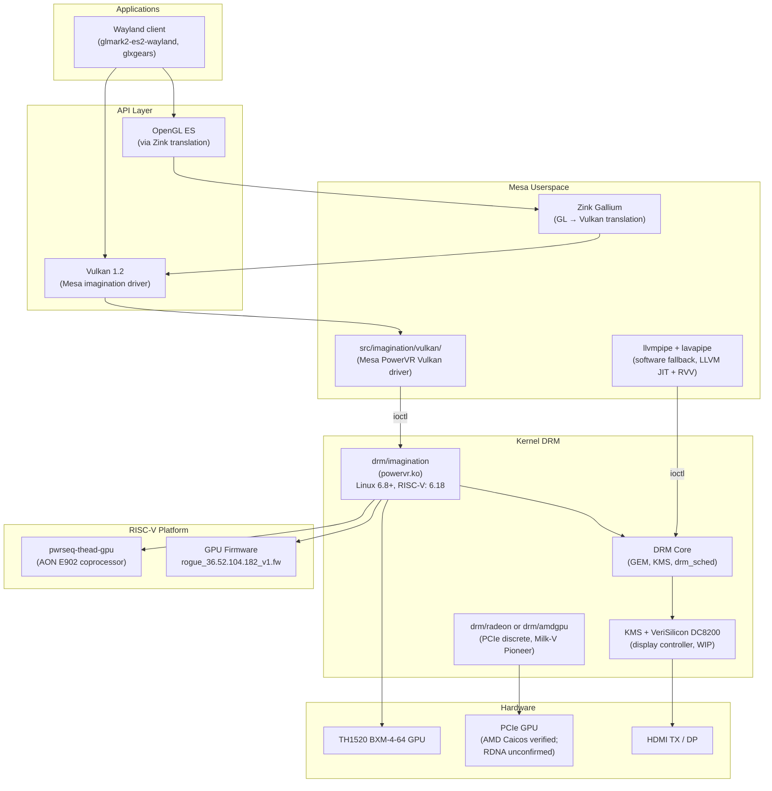

# Chapter 116: RISC-V GPU Drivers and the Emerging RISC-V Graphics Stack

> **Part**: Part II — GPU Drivers
> **Audience**: Embedded Linux engineers, SoC bring-up engineers, open hardware developers
> **Status**: First draft — 2026-06-19

---

## Table of Contents

- [Overview](#overview)
- [1. The RISC-V SoC GPU Landscape](#1-the-risc-v-soc-gpu-landscape)
  - [1.1 StarFive JH7110 — Imagination BXE-4-32 (No Upstream Driver)](#11-starfive-jh7110--imagination-bxe-4-32-no-upstream-driver)
  - [1.2 T-HEAD TH1520 — Imagination BXM-4-64 (The Mainline Milestone)](#12-t-head-th1520--imagination-bxm-4-64-the-mainline-milestone)
  - [1.3 SpacemiT K1 — Imagination PowerVR (Proprietary DDK)](#13-spacemit-k1--imagination-powervr-proprietary-ddk)
  - [1.4 ESWIN EIC7700 / SiFive HiFive Premier P550](#14-eswin-eic7700--sifive-hifive-premier-p550)
  - [1.5 Sophgo SG2042 / Milk-V Pioneer — PCIe GPUs Only](#15-sophgo-sg2042--milk-v-pioneer--pcie-gpus-only)
  - [1.6 Allwinner D1 / T-Head C906 — No GPU](#16-allwinner-d1--t-head-c906--no-gpu)
- [2. The `drm/imagination` Driver — History, Architecture, and Upstreaming](#2-the-drimagination-driver--history-architecture-and-upstreaming)
  - [2.1 From Proprietary pvrsrvkm to Open drm/imagination](#21-from-proprietary-pvrsrvkm-to-open-drimagination)
  - [2.2 Source Tree and Module Structure](#22-source-tree-and-module-structure)
  - [2.3 Kconfig and RISC-V Enablement in Linux 6.18](#23-kconfig-and-risc-v-enablement-in-linux-618)
  - [2.4 Supported GPU Hardware Matrix](#24-supported-gpu-hardware-matrix)
- [3. IMG B-Series GPU Architecture](#3-img-b-series-gpu-architecture)
  - [3.1 Tile-Based Deferred Rendering](#31-tile-based-deferred-rendering)
  - [3.2 Unified Shader Cluster (USC)](#32-unified-shader-cluster-usc)
  - [3.3 Firmware Processor: META and RISC-V Variants](#33-firmware-processor-meta-and-risc-v-variants)
  - [3.4 MMU and Job Submission](#34-mmu-and-job-submission)
- [4. TH1520 Power Architecture — The RISC-V Bring-Up Chain](#4-th1520-power-architecture--the-risc-v-bring-up-chain)
  - [4.1 Cortex-E902 Always-On Coprocessor and pwrseq-thead-gpu](#41-cortex-e902-always-on-coprocessor-and-pwrseq-thead-gpu)
  - [4.2 Patch Series Chronology](#42-patch-series-chronology)
  - [4.3 Device Tree Fragment](#43-device-tree-fragment)
- [5. Mesa PowerVR Vulkan Driver (`src/imagination`)](#5-mesa-powervr-vulkan-driver-srcimagination)
  - [5.1 Build Instructions](#51-build-instructions)
  - [5.2 Vulkan Conformance Timeline](#52-vulkan-conformance-timeline)
  - [5.3 OpenGL ES via Zink](#53-opengl-es-via-zink)
  - [5.4 Firmware Loading and Environment Variables](#54-firmware-loading-and-environment-variables)
- [6. PCIe Discrete GPU on RISC-V](#6-pcie-discrete-gpu-on-risc-v)
  - [6.1 AMD Radeon on Milk-V Pioneer (Verified)](#61-amd-radeon-on-milk-v-pioneer-verified)
  - [6.2 amdkfd Compute Buildable on RISC-V since Linux 6.16](#62-amdkfd-compute-buildable-on-risc-v-since-linux-616)
  - [6.3 Intel Arc and NVIDIA — Experimental and Unverified](#63-intel-arc-and-nvidia--experimental-and-unverified)
- [7. RISC-V Vector Extension (RVV 1.0) and Mesa Software Rendering](#7-risc-v-vector-extension-rvv-10-and-mesa-software-rendering)
  - [7.1 RVV 1.0 Ratification and Hardware](#71-rvv-10-ratification-and-hardware)
  - [7.2 LLVM RISC-V Backend and RVV Code Generation](#72-llvm-risc-v-backend-and-rvv-code-generation)
  - [7.3 llvmpipe on RISC-V](#73-llvmpipe-on-risc-v)
  - [7.4 lavapipe on RISC-V](#74-lavapipe-on-risc-v)
- [8. Display Controller Bring-Up on RISC-V SoCs](#8-display-controller-bring-up-on-risc-v-socs)
  - [8.1 StarFive JH7110 — VeriSilicon DC8200 + Innosilicon HDMI](#81-starfive-jh7110--verisilicon-dc8200--innosilicon-hdmi)
  - [8.2 T-HEAD TH1520 — DC8200 + DesignWare HDMI TX 2.0](#82-t-head-th1520--dc8200--designware-hdmi-tx-20)
- [9. Cross-Compilation: Meson, Sysroot, and Yocto meta-riscv](#9-cross-compilation-meson-sysroot-and-yocto-meta-riscv)
  - [9.1 Meson Cross-Compile File for RISC-V 64-bit](#91-meson-cross-compile-file-for-risc-v-64-bit)
  - [9.2 Yocto / OpenEmbedded and meta-riscv](#92-yocto--openembedded-and-meta-riscv)
- [10. Open Hardware GPU Prospects for RISC-V](#10-open-hardware-gpu-prospects-for-risc-v)
  - [10.1 Vortex GPGPU (Georgia Tech)](#101-vortex-gpgpu-georgia-tech)
  - [10.2 RV64X — ISA Extension Proposals](#102-rv64x--isa-extension-proposals)
  - [10.3 Academic Projects and the Absence of Open Discrete GPU IP](#103-academic-projects-and-the-absence-of-open-discrete-gpu-ip)
- [11. Kernel Configuration Reference](#11-kernel-configuration-reference)
- [Integrations](#integrations)
- [References](#references)

---

## Overview

RISC-V has crossed a threshold that few predicted would arrive before the end of this decade: in Linux 6.18, a RISC-V system-on-chip received **fully mainline, hardware-accelerated 3D graphics**. The platform in question is Alibaba/T-HEAD's TH1520 SoC, and the enabling technology is the open `drm/imagination` kernel driver paired with Mesa's PowerVR Vulkan implementation. This development is not merely a curiosity — it establishes the template that future RISC-V SoC vendors must follow, and it exposes the multi-layered complexity of bringing a GPU subsystem to a new ISA without the decades of x86 and ARM scaffolding that most driver work takes for granted.

This chapter covers the graphics stack from the SoC silicon up to the Wayland compositor, targeting three overlapping groups: **embedded Linux engineers** responsible for BSP bring-up on RISC-V boards, **systems developers** studying how the `drm/imagination` driver was adapted for RISC-V's platform model and power management constraints, and **open hardware developers** interested in what is possible with the Vortex research GPU and emerging RISC-V GPU ISA proposals. The chapter situates RISC-V graphics within the broader open-source GPU driver landscape — the ARM Mali parallels in Chapter 6 and Chapter 90 are close companions — while documenting the specific pitfalls and milestones that are unique to the RISC-V architecture.



---

## 1. The RISC-V SoC GPU Landscape

The RISC-V SoC GPU landscape in 2025–2026 is dominated by a single IP vendor: **Imagination Technologies**. Nearly every commercially available RISC-V SoC with an integrated GPU uses Imagination's PowerVR Rogue or B-Series GPU IP. This reflects an industry dynamic: Imagination actively licenses to SoC vendors seeking alternative ISA cores, while Arm restricts Mali IP to partners committed to the Arm CPU ecosystem. The GPU story for RISC-V thus becomes inseparable from the `drm/imagination` driver and Mesa's PowerVR Vulkan implementation.

### 1.1 StarFive JH7110 — Imagination BXE-4-32 (No Upstream Driver)

The StarFive JH7110 SoC (used in the VisionFive 2 board and Milk-V Mars) integrates an Imagination **BXE-4-32** GPU (B-Series, BVNC 36.50.54.182). This is the lowest-tier B-Series part: 4 FP32 ALUs per USC cluster, 32 pixels per clock, targeting the IoT and entry display-class segment.

Despite being one of the most widely deployed RISC-V Linux SoCs, the JH7110's GPU has **no upstream `drm/imagination` support**. Mesa's official PowerVR driver documentation lists BXE-4-32 explicitly as unsupported and "not under active development" [Source: https://docs.mesa3d.org/drivers/powervr.html]. StarFive's own forums document an unfulfilled promise from 2022: "After 2022 Q4, Linux driver will support Vulkan 1.0 and OGLES 3.x" — as of October 2025 users report the situation unchanged after three years [Source: https://forum.rvspace.org/t/img-bxe4-32-gpu-open-source-plan/600].

StarFive's SDK ships the proprietary **pvrsrvkm** out-of-tree module (PowerVR DDK), which taints the kernel, requires a closed userspace blob, and tracks its own vendor kernel rather than upstream mainline. For embedded Linux users who require an upstream-clean kernel, the JH7110's GPU remains dead hardware.

This is the cautionary case. The engineering lesson: BVNC (GPU identification) is deterministic about hardware capability, but vendor licensing decisions about supporting the open `drm/imagination` driver are entirely discretionary, and BXE-4-32 has not been licensed for that path.

### 1.2 T-HEAD TH1520 — Imagination BXM-4-64 (The Mainline Milestone)

The Alibaba/T-HEAD TH1520 SoC (used in the LicheePi 4A single-board computer) integrates an Imagination **BXM-4-64 MC1** GPU (BVNC 36.52.104.182). The BXM-4-64 is a higher-tier B-Series part than the BXE-4-32: 64 pixels per clock, a single multi-core cluster, targeting performance-class embedded and IoT-gateway workloads.

**Linux 6.18 (released December 2025) merged device tree support for the TH1520 GPU node, making it the first RISC-V SoC with fully mainline hardware-accelerated 3D graphics.** This was not a single patch but a chain of prerequisite drivers that had to land across multiple kernel versions before the GPU node could be enabled [Source: https://mwilczynski.dev/posts/riscv-gpu-zink/]:

| Component | Kernel Driver | Landed |
|-----------|--------------|--------|
| Mailbox | `mailbox-th1520` | Linux 6.13 |
| Power domains | `pmdomain-thead` | Linux 6.x |
| Clock control | `clk-th1520-vo` | Linux 6.x |
| Reset controller | `reset-th1520` | Linux 6.x |
| GPU power sequencer | `pwrseq-thead-gpu` | Linux 6.18 |
| GPU Device Tree node | `"thead,th1520-gpu"` | Linux 6.18 |

The patch series (v4, 8 patches) was authored by **Michal Wilczynski (Samsung)** and submitted to the dri-devel mailing list [Source: https://www.mail-archive.com/dri-devel@lists.freedesktop.org/msg549967.html]. The display controller (VeriSilicon DC8200) and HDMI output remain a work-in-progress as of 6.18; GPU rendering works but requires a Wayland compositor configured against a software-rendered KMS scanout, or display driver patches not yet in mainline [Source: https://lwn.net/Articles/1033823/].

### 1.3 SpacemiT K1 — Imagination PowerVR (Proprietary DDK)

The SpacemiT K1 SoC uses eight RISC-V X60 cores (the first widely available mass-market SoC with RVV 1.0) and integrates an Imagination Technologies GPU. The GPU runs the **PowerVR DDK version 24.2** via the proprietary DRM module — not the upstream open `drm/imagination` driver. Mesa3D provides the OpenGL ES interface that bridges applications to the proprietary kernel driver.

Initial kernel CPU support for SpacemiT/X60 was queued via the `soc.git` for-next branch targeting **Linux 6.14** (device tree and DT bindings) [Source: https://www.phoronix.com/news/Linux-6.14-SpaceMiT-RISC-V-CPUs]. GPU userspace remains proprietary. The SpacemiT K1 platform (BananaPi BPI-F3) also supports AMD discrete GPUs via PCIe; SpacemiT provides an adaptation reference guide for amdgpu on the K1 platform [Source: https://sdk.spacemit.com/en/graphics/AMD_graphics_card_adaptation_reference/].

### 1.4 ESWIN EIC7700 / SiFive HiFive Premier P550

The ESWIN EIC7700 and its consumer variant EIC7700X contain four SiFive P550 RISC-V cores (RV64GC, up to 1.8 GHz) and a 19.95 TOPS NPU. The integrated GPU is an Imagination **AXM-8-256** — this is the A-Series (not B-Series), featuring 256 pixels-per-clock throughput and 8 ALUs per cluster, targeting a higher performance tier than BXE/BXM.

Basic kernel device tree support was submitted in patch series v3 in April 2025, targeting Linux 6.16 [Source: https://www.phoronix.com/news/Linux-Patches-EIC7700-HiFive]. The GPU driver upstream status for the AXM-8-256 in `drm/imagination` is not yet confirmed at the time of writing; the driver's officially maintained hardware list focuses on AXE-1-16M and the BXM/BXS variants. **Note: needs verification** — the AXM-8-256 may require additional device info entries in `pvr_device_info.c` before it can be enumerated by the open driver.

### 1.5 Sophgo SG2042 / Milk-V Pioneer — PCIe GPUs Only

The Sophgo SG2042 is a 64-core RISC-V server SoC (16 clusters × 4 RV64GC cores, 2 GHz, 64 MB shared L3 cache) with **no integrated GPU**. It provides x32 PCIe Gen4 expansion. The Milk-V Pioneer uses an mATX form factor with standard PCIe slots [Source: https://milkv.io/pioneer]. This platform is the reference target for PCIe GPU experimentation on RISC-V — see Section 6.

### 1.6 Allwinner D1 / T-Head C906 — No GPU

The D1 (using the T-HEAD C906 core) has **no GPU whatsoever**. It is notable as one of the first mass-produced Linux-capable RISC-V SoCs and receives software rendering via llvmpipe/lavapipe. Graphics output uses a basic framebuffer or DRM panel driver for its display output — there is no 3D acceleration path.

---

## 2. The `drm/imagination` Driver — History, Architecture, and Upstreaming

### 2.1 From Proprietary pvrsrvkm to Open drm/imagination

Imagination Technologies shipped its GPU IP for decades with a proprietary kernel module called `pvrsrvkm` — the PowerVR Services Kernel Module, part of the Imagination DDK (Driver Development Kit). The `pvrsrvkm` module has characteristics that make it fundamentally incompatible with mainline Linux philosophy: it taints the kernel, requires a closed-source userspace blob, tracks its own vendor kernel tree, and exposes a non-standard ioctl interface that changes between DDK versions.

The `drm/imagination` driver was **written from scratch** — not a refactored version of `pvrsrvkm` — and merged into **Linux 6.8** (early 2024). The decision to start fresh rather than adapt the existing proprietary code was deliberate: the DDK codebase carries years of assumptions about a closed-source execution environment that are incompatible with a clean DRM driver design [Source: https://lwn.net/Articles/943691/].

Key driver authors include **Sarah Walker, Frank Binns, and Donald Robson** (Imagination Technologies), with substantial contributions from Collabora and Intel engineers. Maintainers listed in the kernel `MAINTAINERS` file are **Donald Robson and Matt Coster** (imgtec.com). The RISC-V enablement patch series was authored by **Michal Wilczynski (Samsung)**, merged for Linux 6.18 [Source: https://lkml.iu.edu/hypermail/linux/kernel/2506.3/04673.html].

### 2.2 Source Tree and Module Structure

The driver lives at `drivers/gpu/drm/imagination/` in the kernel tree [Source: https://github.com/torvalds/linux/tree/master/drivers/gpu/drm/imagination]:

```
drivers/gpu/drm/imagination/
├── pvr_drv.c/h            # Driver entry point, probe/remove, DRM ops
├── pvr_device.c/h         # GPU hardware detection and enumeration
├── pvr_device_info.c/h    # BVNC-based feature and quirk tables
├── pvr_fw.c/h             # Firmware loading and management
├── pvr_fw_riscv.c         # RISC-V firmware processor boot
├── pvr_rogue_riscv.h      # RISC-V firmware register definitions
├── pvr_fw_meta.c/h        # META processor firmware support
├── pvr_fw_mips.c/h        # MIPS processor firmware support
├── pvr_mmu.c/h            # GPU MMU management
├── pvr_vm.c/h             # GPU virtual address space management
├── pvr_gem.c/h            # GEM buffer object (shmem-backed)
├── pvr_job.c/h            # Job lifecycle management
├── pvr_queue.c/h          # GPU queue (geometry, fragment, compute, transfer)
├── pvr_context.c/h        # Per-process GPU context
├── pvr_hwrt.c/h           # Hardware Render Target management (TBDR)
├── pvr_free_list.c/h      # TBDR free list for parameter buffers
└── pvr_power.c/h          # Runtime PM and devfreq
```

Module name: `powervr` (`CONFIG_DRM_POWERVR`). Kernel docs: [https://docs.kernel.org/gpu/imagination/index.html].

The ioctl interface exposed to Mesa is defined in `include/uapi/drm/pvr_drm.h`, covering context creation (`DRM_IOCTL_PVR_CREATE_CONTEXT`), BO allocation (`DRM_IOCTL_PVR_CREATE_BO`), VM map operations (`DRM_IOCTL_PVR_VM_MAP`), and job submission (`DRM_IOCTL_PVR_SUBMIT_JOBS`).

### 2.3 Kconfig and RISC-V Enablement in Linux 6.18

The Kconfig entry for the driver illustrates the RISC-V addition precisely:

```kconfig
# drivers/gpu/drm/imagination/Kconfig
config DRM_POWERVR
	tristate "Imagination Technologies PowerVR (Series 6 and later) & IMG Graphics"
	depends on ARM64 || (RISCV && 64BIT)
	depends on MMU
	depends on DRM && PM
	select DRM_EXEC
	select DRM_GEM_SHMEM_HELPER
	select DRM_SCHED
	select DRM_GPUVM
	select FW_LOADER
	help
	  DRM driver for Imagination Technologies PowerVR and IMG GPU hardware.
	  Supports Rogue series and B-series GPUs.
```

The `depends on (ARM64 || (RISCV && 64BIT))` clause was added by patch 5/5 of the Wilczynski RISC-V enablement series [Source: https://lkml.iu.edu/hypermail/linux/kernel/2506.3/04673.html]. The `MMU` dependency is essential for RISC-V: without it, the Kconfig system would allow the driver to be selected on RISC-V `NOMMU` configurations where `pvr_mmu.c`'s `iommu_map` calls would be unavailable. The `(RISCV && 64BIT)` guard ensures 32-bit RISC-V configurations (which exist, though uncommon in GPU-bearing SoCs) are excluded.

Unit test support: `CONFIG_DRM_POWERVR_KUNIT_TEST` (depends on `KUNIT`).

### 2.4 Supported GPU Hardware Matrix

As of Linux 6.18 and Mesa 25.3 [Source: https://docs.mesa3d.org/drivers/powervr.html]:

| GPU | BVNC | Platform | Architecture | Status |
|-----|------|----------|--------------|--------|
| AXE-1-16M | 33.15.11.3 | TI AM62 (ARM64) | A-Series | Conformant Vulkan 1.0 |
| BXM-4-64 | 36.52.104.182 | TH1520 (RISC-V) | B-Series | Conformant Vulkan 1.0 |
| BXM-4-64 | 36.56.104.183 | Variant | B-Series | Supported |
| BXS-4-64 | 36.53.104.796 | TI J721S2/AM68 (ARM64) | B-Series | Conformant Vulkan 1.0 |
| **BXE-4-32** | **36.50.54.182** | **JH7110 (RISC-V)** | **B-Series** | **Not supported, not under active development** |
| BXE-2-32 | 36.29.52.182 | Various | B-Series | Not supported |
| GX6250, GX6650 | — | Series 6XT | Rogue | Not supported |
| GE7800, GE8300 | — | Series 8XE | Rogue | Not supported |

The stark contrast between BXM-4-64 (the mainline RISC-V milestone) and BXE-4-32 (the widely deployed JH7110 GPU with no upstream driver) reflects a vendor licensing decision, not a fundamental technical barrier. The `pvr_device_info.c` data tables that define per-BVNC quirks and feature sets are keyed directly on the BVNC 4-tuple — adding BXE-4-32 support would require entries in those tables plus Imagination's blessing to include the associated firmware.

---

## 3. IMG B-Series GPU Architecture

Understanding the B-Series architecture is prerequisite to understanding driver internals. All supported RISC-V GPU targets (BXM-4-64 on TH1520) share the same fundamental micro-architecture with the ARM64-targeted AXE and BXS parts.

### 3.1 Tile-Based Deferred Rendering

Like Arm Mali, Apple AGX, and Qualcomm Adreno's tiled rasterization mode, the Imagination B-Series uses **Tile-Based Deferred Rendering (TBDR)**. Rendering is split into two phases:

1. **Geometry phase**: The vertex shader and primitive assembly run, generating a per-tile command list (the *parameter buffer* or *PPB* — Pixel Processing Buffer). The GPU walks the scene geometry and bins each primitive into one or more screen-space tiles, writing primitive data and vertex outputs into a large on-chip SRAM tile buffer.

2. **Fragment phase**: Once geometry is complete for a tile, the fragment shader runs on that tile's primitives in isolation, reading only tile-local data and the texture cache. This eliminates the DRAM bandwidth cost of writing and re-reading an intermediate depth/colour buffer.

The free list managed by `pvr_free_list.c` provides dynamic DRAM backing for parameter buffers. If a frame's geometry exceeds the initial free list allocation, the driver grows it on-the-fly via `DRM_IOCTL_PVR_FREE_LIST_CREATE`. The `pvr_hwrt.c` file manages Hardware Render Targets — the GPU-side objects describing the framebuffer dimensions, sample count, and free-list associations for each render target.

### 3.2 Unified Shader Cluster (USC)

The Unified Shader Cluster (USC) is Imagination's execution unit, combining vertex, fragment, and compute workloads into a single programmable pipeline. A BXM-4-64 has one multi-core cluster (MC1), each cluster containing multiple USCs. Each USC implements:

- A scalar SIMD-within-a-thread model (SIMT), with hardware thread contexts for latency hiding
- A dedicated texture pipeline (TPU) for filtered texture reads
- A coissue path allowing a texture read and an arithmetic instruction to execute simultaneously in the same cycle
- Unified register file shared between vertex and fragment threads

The USC executes a proprietary Imagination instruction set — the **USSE** (Universal SIMT Shader Engine) ISA. This ISA is not public; the Mesa `src/imagination/` compiler emits USSE binaries by driving a firmware-provided **USC compiler library** that ships as a binary inside the GPU firmware package rather than as Mesa-side code. This distinguishes `drm/imagination` from open-ISA drivers like Panfrost (which contains a fully reverse-engineered Bifrost compiler): Mesa sends shader IR to the firmware compiler, not directly to USSE binary emission code.

### 3.3 Firmware Processor: META and RISC-V Variants

Imagination's Rogue and B-Series GPUs contain an embedded processor that runs the GPU firmware, managing job scheduling, power transitions, and command stream parsing. Two firmware processor variants are supported by `drm/imagination`:

- **META** processor: Imagination's proprietary RISC-like embedded CPU (earlier B-Series designs). Handled by `pvr_fw_meta.c`.
- **RISC-V** processor: More recent B-Series designs (including the BXM-4-64) embed a small RISC-V core as the GPU's internal firmware processor [Source: https://mwilczynski.dev/posts/riscv-gpu-zink/]. This is handled by `pvr_fw_riscv.c` and the register definitions in `pvr_rogue_riscv.h`.

Note the layering here: the **host CPU** is a RISC-V application processor (TH1520's C910 cores), and the **GPU's internal firmware processor** is also RISC-V. `pvr_fw_riscv.c` does not run RISC-V code on the host — it manages the boot process of the RISC-V core embedded *inside the GPU die*, loading firmware from `/lib/firmware/` and initialising the RISC-V core's boot vectors and stack.

```c
/* drivers/gpu/drm/imagination/pvr_fw_riscv.c (abbreviated concept) */
int pvr_riscv_fw_process(struct pvr_device *pvr_dev,
                         const struct firmware *fw,
                         u8 *fw_code_ptr, u8 *fw_data_ptr,
                         u8 *fw_core_code_ptr, u8 *fw_core_data_ptr,
                         u32 core_code_alloc_size)
{
    /* Parse the Imagination firmware ELF-like binary header,
     * copy code and data segments to GPU-accessible memory,
     * and set the RISC-V boot vector register to the firmware
     * entry point. The GPU RISC-V core is then released from
     * reset by writing to a GPU control register. */
    ...
}
```

Firmware images are loaded via the `FW_LOADER` infrastructure (`request_firmware`). The firmware header encodes the GPU's BVNC, allowing the driver to validate that the firmware matches the discovered hardware without hardcoding specifications. The firmware for TH1520 is `powervr/rogue_36.52.104.182_v1.fw`, served from Imagination's freedesktop.org staging firmware repository [Source: https://gitlab.freedesktop.org/imagination/linux-firmware].

### 3.4 MMU and Job Submission

The `pvr_mmu.c` implements the GPU's page table walk in software, constructing page tables compatible with the B-Series MMU hardware. Unlike the ARM SMMU (which the driver also attaches to via the kernel IOMMU API), the B-Series GPU has its own internal two-level page table:

- L0: A single 4 KB page containing 512 8-byte entries (each covering a 2 MB region)
- L1: 4 KB pages each covering 4 KB granules

GPU virtual address spaces are managed per-context via `pvr_vm.c`. GEM buffer objects backed by `drm_gem_shmem` are mapped into a GPU VA space using `DRM_IOCTL_PVR_VM_MAP`. Job submission (`DRM_IOCTL_PVR_SUBMIT_JOBS`) takes a list of sync objects and job descriptors, enqueues them through `pvr_queue.c` into the DRM GPU scheduler (`drm_sched_entity`), and the firmware's job manager receives the work via a doorbell register write once the scheduler determines the job is ready.

---

## 4. TH1520 Power Architecture — The RISC-V Bring-Up Chain

The TH1520 power bring-up for the GPU is the most technically distinctive aspect of this RISC-V enablement, and understanding it is essential for anyone attempting a similar bring-up on another RISC-V SoC with complex power domains.

### 4.1 Cortex-E902 Always-On Coprocessor and pwrseq-thead-gpu

The TH1520's GPU cannot use the standard Linux **Generic Power Domain** (`genpd`) infrastructure that works on most ARM SoCs. The GPU's power sequence is controlled by a **Cortex-E902 safety coprocessor** — an always-on processor that runs its own firmware independently of the main Linux kernel. The E902 manages power sequences for multiple SoC blocks including the GPU and cannot be directly accessed by the GPU driver via register writes.

The `drm/imagination` driver communicates with the E902 through the **power sequencing** (`pwrseq`) framework via a dedicated **`pwrseq-thead-gpu`** auxiliary driver. This driver speaks the **thead-aon-protocol** over the TH1520 mailbox controller, which itself required the `mailbox-th1520` driver to be in mainline first (Linux 6.13):

```
drm/imagination (pvr_power.c)
    └─→ pwrseq-thead-gpu (auxiliary driver)
            └─→ thead-aon-protocol
                    └─→ mailbox-th1520 (mailbox controller)
                            └─→ Cortex-E902 AON firmware
                                    └─→ GPU power rails, clocks, isolation cells
```

This pattern — GPU driver delegating power control to an always-on coprocessor via a mailbox protocol — appears in several modern SoC designs (compare Qualcomm's RPM/RPMH for GPU power on Adreno, Raspberry Pi's VideoCore firmware for VC7 power). The TH1520 implementation is the first example of this pattern in the RISC-V mainline kernel ecosystem.

### 4.2 Patch Series Chronology

The v4 patch series (8 patches) authored by Michal Wilczynski submitted to dri-devel [Source: https://www.mail-archive.com/dri-devel@lists.freedesktop.org/msg549967.html] introduces:

1. `"thead,th1520-gpu"` DT compatible string in `pvr_drv.c`
2. `pwrseq-thead-gpu` power sequencer auxiliary driver
3. Power sequencer bindings YAML (`Documentation/devicetree/bindings/power/sequencer/thead,th1520-gpu-pwrseq.yaml`)
4. Device tree nodes in `arch/riscv/boot/dts/thead/th1520.dtsi`
5. `pvr_fw_riscv.c` fixes for the TH1520 GPU's RISC-V firmware processor boot sequence
6. Kconfig `depends on (ARM64 || (RISCV && 64BIT))` addition [Source: https://lkml.iu.edu/hypermail/linux/kernel/2506.3/04673.html]

The earlier v2 RFC series also documents an intermediate `drm/imagination` enablement attempt: [Source: https://lkml.iu.edu/hypermail/linux/kernel/2412.0/02989.html].

### 4.3 Device Tree Fragment

The TH1520 GPU device tree node (conceptually, based on the patch series — verify against merged `arch/riscv/boot/dts/thead/th1520.dtsi`):

```devicetree
/* arch/riscv/boot/dts/thead/th1520.dtsi */
gpu: gpu@ffef400000 {
    compatible = "thead,th1520-gpu";
    reg = <0xff 0xef400000 0x0 0x400000>;
    interrupts = <GIC_SPI 90 IRQ_TYPE_LEVEL_HIGH>;
    clocks = <&clk_vo CLK_VO_GPU>,
             <&clk_vo CLK_VO_GPU_CORE>;
    clock-names = "core", "mem";
    resets = <&rst_vo RST_VO_GPU>;
    power-domains = <&pd_thead_gpu>;
    firmware-name = "powervr/rogue_36.52.104.182_v1.fw";
    /* Power sequencer via thead-aon-protocol mailbox */
    power-sequencer = <&gpu_pwrseq>;
};

gpu_pwrseq: gpu-power-sequencer {
    compatible = "thead,th1520-gpu-pwrseq";
    mailboxes = <&aon_mbox THEAD_AON_MBOX_GPU>;
    #power-sequencer-cells = <0>;
};
```

**Note: The exact register address, clock names, reset references, and mailbox cell values shown above are illustrative based on the patch series description. Verify the precise DT node against the merged `arch/riscv/boot/dts/thead/th1520.dtsi` in the Linux 6.18+ tree before using in a BSP.**

---

## 5. Mesa PowerVR Vulkan Driver (`src/imagination`)

### 5.1 Build Instructions

The Mesa PowerVR driver is built as a Vulkan ICD (Installable Client Driver) via Meson:

```bash
# Clone Mesa
git clone https://gitlab.freedesktop.org/mesa/mesa.git
cd mesa

# Install prerequisites (Fedora/Ubuntu equivalent)
# dnf install meson ninja-build python3-mako wayland-devel libdrm-devel

# Build for host (native RISC-V board) with imagination Vulkan driver
meson setup build \
    -Dvulkan-drivers=imagination \
    -Dgallium-drivers=zink \
    -Dtools=drm-shim \
    -Dbuildtype=release

ninja -C build

# Install
sudo ninja -C build install
```

The `drm-shim` tool builds `libpowervr_noop_drm_shim.so` — a user-space DRM shim that allows offline testing of the Mesa driver without GPU hardware by intercepting DRM ioctls and returning synthetic data. [Source: https://docs.mesa3d.org/drivers/powervr.html]

### 5.2 Vulkan Conformance Timeline

| Milestone | Date |
|-----------|------|
| Mesa 25.3: Vulkan 1.0 conformant for AXE-1-16M and BXS-4-64 | Mid-2025 |
| BXS GPU joined AXE GPU in passing Khronos Vulkan 1.0 CTS | August 2025 |
| Vulkan 1.2 code fully merged upstream in Mesa | October 2025 |
| BXM-4-64 (TH1520, RISC-V) added to conformance testing scope | Late 2025 |
| Khronos Vulkan 1.2 conformance validation in progress | 2026 |

[Source: https://blog.imaginationtech.com/open-source-graphics-driver-adds-vulkan-1-2-support/]

The Khronos Vulkan 1.2 conformance requirement adds features including descriptor indexing, buffer device addresses, timeline semaphores, and Vulkan memory model — all of which are implemented in Mesa's `src/imagination/vulkan/` without needing the closed DDK.

### 5.3 OpenGL ES via Zink

With Vulkan support in place, OpenGL ES is provided through **Zink** — the Mesa Gallium driver that translates OpenGL calls into Vulkan API calls. The pipeline on TH1520 when running a GL application:

```
OpenGL ES app
    ↓ (Mesa GL dispatch)
Zink Gallium3D driver (src/gallium/drivers/zink/)
    ↓ (Vulkan API calls)
Mesa imagination Vulkan driver (src/imagination/vulkan/)
    ↓ (pvr_drm.h ioctls)
drm/imagination kernel driver (powervr.ko)
    ↓
TH1520 BXM-4-64 GPU hardware
```

A working `glmark2-es2-wayland` run on TH1520 demonstrating this full stack was documented by Michal Wilczynski in August 2025 [Source: https://mwilczynski.dev/posts/riscv-gpu-zink/]. This represents the first hardware-accelerated OpenGL on a RISC-V SoC using a fully upstream kernel and Mesa stack — a significant milestone for the RISC-V embedded Linux ecosystem.

Set Zink as the OpenGL backend when the imagination Vulkan driver is installed:
```bash
MESA_LOADER_DRIVER_OVERRIDE=zink glmark2-es2-wayland
```

### 5.4 Firmware Loading and Environment Variables

GPU firmware for the TH1520 BXM-4-64:
- **Staging repository**: `https://gitlab.freedesktop.org/imagination/linux-firmware`
- **File**: `powervr/rogue_36.52.104.182_v1.fw`
- **Installed path**: `/lib/firmware/powervr/rogue_36.52.104.182_v1.fw`
- **Status**: Not yet in the upstream `linux-firmware` tree as of early 2026; requires manual installation from the staging repo

Key environment variables for `drm/imagination` / Mesa PowerVR:

| Variable | Purpose |
|----------|---------|
| `PVR_I_WANT_A_BROKEN_VULKAN_DRIVER=1` | Required for non-conformant GPU variants not yet in the Khronos conformance list |
| `PVR_SHIM_DEVICE_BVNC=36.52.104.182` | Override detected BVNC when using the DRM shim for testing |
| `LD_PRELOAD=<path>/libpowervr_noop_drm_shim.so` | Offline CI testing without GPU hardware |
| `VK_ICD_FILENAMES=/usr/share/vulkan/icd.d/powervr_icd.aarch64.json` | Explicit ICD selection (adjust for RISC-V: `riscv64`) |

Proprietary DDK vs. open driver comparison:

| Feature | `pvrsrvkm` DDK | `drm/imagination` |
|---------|---------------|-------------------|
| In kernel tree | No (out-of-tree) | Yes (Linux 6.8+) |
| Kernel taint | Yes | No |
| Userspace | Proprietary blob | Mesa `src/imagination/vulkan` |
| RISC-V host support | Via vendor SDK only | Linux 6.18+ |
| Firmware | Shipped with DDK | `gitlab.freedesktop.org/imagination/linux-firmware` |
| Vulkan version | Varies by DDK | 1.0 conformant (1.2 in progress) |

[Source: https://lwn.net/Articles/943691/]

---

## 6. PCIe Discrete GPU on RISC-V

Platforms like the Milk-V Pioneer (SG2042) have no integrated GPU but provide PCIe expansion slots that accept standard desktop graphics cards. This section documents what is known to work, what has been demonstrated to build (but is not end-to-end verified), and what remains speculative.

### 6.1 AMD Radeon on Milk-V Pioneer (Verified)

A **legacy AMD Caicos GPU (Radeon HD 6450)** running on the Milk-V Pioneer with the upstream `radeon` DRM driver (`CONFIG_DRM_RADEON`) is the only PCIe GPU configuration with comprehensive primary-source documentation [Source: https://wiki.gentoo.org/wiki/Milk-V_Pioneer_Box]:

```bash
# Required firmware blobs in /lib/firmware/radeon/
CAICOS_mc.bin     # Memory controller microcode
CAICOS_me.bin     # Microengine firmware
CAICOS_pfp.bin    # Pre-fetch parser firmware
CAICOS_smc.bin    # System management controller
BTC_rlc.bin       # Radeon language compiler
SUMO_uvd.bin      # Unified video decoder
```

The configuration requires `CONFIG_DRM_RADEON=y`. Known hardware issue: **periodic "ring 0 stalled" lockups** requiring a GPU reset. These stalls appear related to the RISC-V host's PCIe latency characteristics interacting with the Caicos command processor's timeout thresholds — the exact root cause was not identified in available primary sources as of 2026.

The SG2042's PCIe implementation appears broadly compatible with standard PCIe semantics; the Caicos GPU does not require BAR-space size workarounds or MMIO quirks beyond those already in the `radeon` driver.

### 6.2 amdkfd Compute Buildable on RISC-V since Linux 6.16

AMD's HSA compute driver (`amdkfd`) became **buildable** on RISC-V in **Linux 6.16** [Source: https://riscv.org/ecosystem-news/2025/06/amds-kernel-compute-driver-amdkfd-can-now-be-enabled-on-risc-v/] [Source: https://www.phoronix.com/news/AMDKFD-RISC-V-Linux-6.16]. This was a Kconfig-only change: adding `select ARCH_SUPPORTS_ATOMIC_RMW` to the RISC-V architecture config, which is a prerequisite for `CONFIG_HSA_AMD`.

This change makes `CONFIG_HSA_AMD` **selectable** on RISC-V. It does **not** certify end-to-end HSA compute functionality. RISC-V was added alongside x86_64, ARM64, and Power64 in the supported architectures list. Whether RDNA2/3 cards with `amdgpu` + `amdkfd` deliver working HSA compute on a RISC-V host remains unverified by primary sources at the time of writing. **Note: needs verification** — testing with a modern AMD discrete GPU (e.g., RX 6600 or later) on Milk-V Pioneer with Linux 6.16+ and HSA applications would be needed to confirm.

`CONFIG_DRM_AMDGPU` itself has no RISC-V-specific blockers at the Kconfig level since the `drm/amdgpu` driver uses only generic DRM infrastructure. Display output via `amdgpu` on RISC-V PCIe is architecturally possible but has not been documented as working for modern RDNA-class cards in available community reports as of early 2026.

### 6.3 Intel Arc and NVIDIA — Experimental and Unverified

**Intel Arc (xe driver)**: The Intel `xe` driver (replacing `i915` for Arc GPUs) was designed with improved portability compared to `i915`. Testing on RISC-V PCIe platforms has been explored but results at the time of writing show mixed behaviour including rendering artifacts. **Note: needs verification** — no primary-source confirmation of a fully working Intel Arc setup on RISC-V was available for this chapter.

**NVIDIA on RISC-V**: Modern NVIDIA GPUs (Turing/Ampere/Ada and later) use the GPU System Processor (GSP) firmware, which itself runs on a **RISC-V core embedded inside the GPU die** (GSP-RM). The irony is notable: every modern NVIDIA GPU already contains a RISC-V processor internally. However, running the NVIDIA open kernel modules (`open-gpu-kernel-modules`) on a **RISC-V host CPU** is a separate question from the embedded RISC-V inside the GPU.

**Note: needs verification** — no primary-source confirmation of `nouveau` or NVIDIA's open kernel modules working on a RISC-V host CPU was found. The open kernel modules' architecture-specific code paths do not document RISC-V host support as of their available release notes.

---

## 7. RISC-V Vector Extension (RVV 1.0) and Mesa Software Rendering

On RISC-V platforms without a working hardware GPU driver — the majority of RISC-V platforms at present — software rendering via llvmpipe and lavapipe is the primary graphics path. The RISC-V Vector Extension (RVV 1.0) is critical to making software rendering performance acceptable.

### 7.1 RVV 1.0 Ratification and Hardware

The RISC-V Vector Extension v1.0 was **ratified by RISC-V International in November/December 2021** [Source: https://github.com/riscvarchive/riscv-v-spec/releases]. It provides:

- Variable-length SIMD vectors: configurable from 32-bit to 2048-bit effective width per element group
- 32 vector registers (v0–v31) with configurable width (`VLEN`)
- Vector length CSR (`vl`) and type CSR (`vtype`) controlling the number and type of active elements
- Register grouping (`LMUL`): multiply the effective register width by 1, 2, 4, or 8
- Mask registers (via `v0.t` predicate operand)
- Floating-point: fp16 (via `vfwcvt`), fp32, fp64; bfloat16 widening via ratified Zbf16 extension

The **SpacemiT K1** (BananaPi BPI-F3) is the first widely available mass-market SoC with a full RVV 1.0 hardware implementation, making it the practical platform for measuring RVV-accelerated Mesa performance on production silicon [Source: https://riscv.org/blog/risc-v-vector-processing].

### 7.2 LLVM RISC-V Backend and RVV Code Generation

LLVM's RISC-V backend targets RVV 1.0 with scalable vector types similar to AArch64 SVE — the compiler operates on `<vscale x N x T>` IR types where `vscale` is determined at runtime by `vsetvli`. Igalia published a detailed analysis of RISC-V vector code generation improvements in LLVM (as of May 2025) [Source: https://blogs.igalia.com/compilers/2025/05/28/improvements-to-risc-v-vector-code-generation-in-llvm/]:

| Improvement | Impact |
|-------------|--------|
| VL tail folding | Single vectorised loop body, no scalar tail, reduced code size |
| Non-power-of-two SLP vectorisation | Improves RGB/RGBA pixel pack/unpack loops |
| Libcall expansion | `memcpy`/`memset` replaced with inline vector instructions |
| fp16/bf16 widening | `f16` arithmetic widened to `f32` rather than scalar fallback |

Benchmarks on SpacemiT X60 with SPEC CPU 2017: 12 of 16 benchmarks improved ≥5%, 7 improved ≥10%, approximately 9% geomean improvement from March 2023 to March 2025 Clang across the SPEC suite [Source: https://blogs.igalia.com/compilers/2025/05/28/improvements-to-risc-v-vector-code-generation-in-llvm/].

LLVM 17+ has mature RISC-V `rv64gc` support; RVV autovectorisation is available when building Mesa with an LLVM installation that was itself built with `LLVM_TARGETS_TO_BUILD=RISCV`.

Full LLVM RISC-V Vector Extension documentation: [https://llvm.org/docs/RISCV/RISCVVectorExtension.html].

### 7.3 llvmpipe on RISC-V

**llvmpipe** is Mesa's CPU-based OpenGL rasteriser, using LLVM JIT compilation to generate native vector code for the host CPU. On RISC-V:

- llvmpipe runs on RISC-V because RISC-V 64-bit (`riscv64`) is a fully supported LLVM backend target.
- LLVM's autovectoriser may opportunistically emit RVV instructions for inner loops (dot products, blending operations, texture sampling) when the target supports RVV.
- However, **llvmpipe does not have an explicit RVV fast path** — unlike x86 where SSE2 and SSE4.1 are explicitly listed as minimum requirements with hand-tuned paths, RISC-V/RVV relies entirely on LLVM's autovectoriser making the right decisions.

Build llvmpipe for a native RISC-V host:

```bash
meson setup build \
    -Dgallium-drivers=llvmpipe \
    -Dglx=xlib \
    -Dllvm=enabled \
    -Dbuildtype=release
ninja -C build
```

The `LP_NATIVE_VECTOR_WIDTH` environment variable overrides the auto-detected vector width. On RVV-capable hardware, LLVM may detect a wider effective SIMD width, but the interaction between `vscale`-based scalable vectors and llvmpipe's fixed-width JIT assumptions means this variable may not behave identically to its x86 semantics [Source: https://docs.mesa3d.org/drivers/llvmpipe.html].

### 7.4 lavapipe on RISC-V

**lavapipe** (`VK_DRIVER_ID_MESA_LAVAPIPE`) is Mesa's software Vulkan implementation, built on the llvmpipe rasteriser. It uses the same LLVM JIT path as llvmpipe and runs on any LLVM-supported architecture including RISC-V 64-bit.

lavapipe has been used as the Mesa Vulkan backend in the **Vortex** research GPU project (Section 10.1) for software-mode testing of Vortex's GPGPU extensions, validating that the Mesa stack above the driver interface layer works correctly before bringing up real hardware. This is a useful development pattern for new GPU bring-up: develop and validate the Mesa driver against lavapipe first, then swap in the hardware ICD.

Build lavapipe:
```bash
meson setup build \
    -Dvulkan-drivers=swrast \
    -Dgallium-drivers=llvmpipe \
    -Dllvm=enabled
ninja -C build
```

Mesa software rendering driver summary for RISC-V:

| Driver | API | LLVM JIT | RVV Acceleration |
|--------|-----|----------|-----------------|
| llvmpipe | OpenGL (up to 4.6) | Yes | Opportunistic (autovectoriser) |
| lavapipe | Vulkan 1.3 | Yes | Opportunistic |
| imagination (Mesa) | Vulkan 1.2 | No (USC firmware compiler) | N/A (hardware) |
| Zink on imagination | OpenGL ES | No | N/A (hardware) |

---

## 8. Display Controller Bring-Up on RISC-V SoCs

The GPU rendering pipeline and the display output pipeline are separate hardware blocks that must both be mainlined before a RISC-V SoC can deliver a fully integrated graphics experience. In the TH1520 case as of Linux 6.18, GPU rendering works but physical display output is still in progress. This section covers display controller bring-up for the two primary RISC-V platforms.

### 8.1 StarFive JH7110 — VeriSilicon DC8200 + Innosilicon HDMI

The JH7110 display subsystem uses two IP blocks:

- **VeriSilicon DC8200**: A display controller supporting up to two independent display outputs, multiple input plane types (primary, overlay, cursor), and hardware compositing. Despite having no GPU acceleration, it provides hardware-assisted 2D compositing that offloads the CPU for UI rendering.
- **Innosilicon HDMI transmitter**: Compatible with the Synopsys DesignWare HDMI protocol (though physically different from the DesignWare IP), driven by the `starfive,jh7110-inno-hdmi` compatible.

The StarFive DRM driver patch series (`[PATCH 0/9] Add DRM driver for StarFive SoC JH7110`) was submitted by StarFive employees to lkml [Source: https://www.phoronix.com/news/StarFive-JH7110-DRM-Driver] [Source: https://lore.kernel.org/lkml/003a01d9a57b$c140f340$43c2d9c0$@samsung.com/T/]. The driver provides KMS (kernel modesetting) and GEM buffer management only — no 2D hardware acceleration is exposed through DRM.

Device tree compatible strings used by the JH7110 display subsystem:

**Note: The following strings are derived from search-indexed DT documentation summaries and the submitted patch series. Verify against `arch/riscv/boot/dts/starfive/jh7110*.dtsi` and `Documentation/devicetree/bindings/display/` YAML files in the upstream kernel tree before using in a BSP.**

- `"starfive,jh7110-dc8200"` — DC8200 display controller
- `"verisilicon,dc8200"` — generic VeriSilicon DC8200 compatible
- `"starfive,jh7110-inno-hdmi"` — JH7110 HDMI transmitter
- `"verisilicon,display-subsystem"` — display subsystem node

### 8.2 T-HEAD TH1520 — DC8200 + DesignWare HDMI TX 2.0

The TH1520 also uses the VeriSilicon DC8200 display controller, but pairs it with a **Synopsys DesignWare HDMI TX 2.0 PHY** (not the Innosilicon variant used in JH7110). A dedicated `th1520-dw-hdmi` HDMI bridge driver was developed alongside the GPU patches.

The DC8200 driver RFC patchset for TH1520 (August 2025, v1) targets `arch/riscv/boot/dts/thead/` [Source: https://lwn.net/Articles/1033823/]. As of Linux 6.18:

- **GPU rendering**: Works via `drm/imagination` + Mesa PowerVR + Zink
- **Display output**: Still in progress, depending on DC8200 driver and DW-HDMI TX patches not yet in mainline
- **Practical workaround**: Use a USB display adapter or run `weston` with the `headless` backend for testing GPU rendering without a physical display

The RFC patch depends on upstream clock, reset, and power domain patches not yet in linux-next — a reminder that display bring-up on RISC-V SoCs involves a dependency chain as long as the GPU bring-up chain.

---

## 9. Cross-Compilation: Meson, Sysroot, and Yocto meta-riscv

Most development environments for RISC-V graphics work are cross-compilation setups: the developer builds on an x86_64 workstation targeting RISC-V 64-bit hardware. Both kernel and Mesa respect Meson's cross-compilation framework.

### 9.1 Meson Cross-Compile File for RISC-V 64-bit

```ini
# riscv64-linux-gnu.ini (Meson cross file)
[binaries]
c = 'riscv64-linux-gnu-gcc'
cpp = 'riscv64-linux-gnu-g++'
ar = 'riscv64-linux-gnu-ar'
strip = 'riscv64-linux-gnu-strip'
pkgconfig = 'riscv64-linux-gnu-pkg-config'
exe_wrapper = 'qemu-riscv64-static'

[host_machine]
system = 'linux'
cpu_family = 'riscv64'
cpu = 'riscv64'
endian = 'little'

[properties]
sys_root = '/path/to/riscv64-sysroot'
pkg_config_libdir = '/path/to/riscv64-sysroot/usr/lib/pkgconfig'
```

Use with Meson:
```bash
meson setup build \
    --cross-file riscv64-linux-gnu.ini \
    -Dvulkan-drivers=imagination \
    -Dgallium-drivers=zink \
    -Dtools=drm-shim \
    -Dbuildtype=release

ninja -C build
```

**Critical**: LLVM must be built with `LLVM_TARGETS_TO_BUILD=RISCV` and made available to the cross-compilation environment to enable llvmpipe JIT. Without this, llvmpipe falls back to a scalar software interpreter. For the imagination Vulkan driver, LLVM is not required (Mesa calls the firmware USC compiler binary), so a simpler toolchain suffices for `drm/imagination`-only builds.

[Source: https://mesonbuild.com/Cross-compilation.html] [Source: https://docs.mesa3d.org/install.html]

### 9.2 Yocto / OpenEmbedded and meta-riscv

The **meta-riscv** layer [Source: https://github.com/riscv/meta-riscv] is the primary Yocto/OpenEmbedded BSP layer for RISC-V. It provides machine configurations for StarFive VisionFive 2, BeagleV Ahead, SiFive HiFive Unmatched, and LicheePi 4A (TH1520).

Graphics-relevant Yocto configuration:

```bitbake
# local.conf or distro configuration

# Enable Wayland
DISTRO_FEATURES:append = " wayland"

# Enable Mesa with Gallium llvmpipe and imagination drivers
# (via meta-riscv or openembedded-core mesa recipe)
PACKAGECONFIG:append:pn-mesa = " gallium-llvm imagination"

# For TH1520 with drm/imagination, ensure firmware is included
IMAGE_INSTALL:append = " linux-firmware-powervr"
```

Supported images can run **Weston** (Wayland compositor, DRM backend) on RISC-V platforms that have DRM output. For TH1520, this requires the display driver patches currently in RFC status; for JH7110 with the proprietary DDK, the pvrsrvkm module must be included in the recipe.

The meta-riscv layer's `recipes-graphics/` directory provides platform-specific Mesa, Weston, and libdrm recipes. The main `mesa.inc` recipe in openembedded-core [Source: https://github.com/openembedded/openembedded-core/blob/master/meta/recipes-graphics/mesa/mesa.inc] handles the `PACKAGECONFIG` mechanism for Vulkan and Gallium driver selection.

---

## 10. Open Hardware GPU Prospects for RISC-V

The GPU ecosystem for RISC-V described in previous sections is composed of commercial IP (Imagination Technologies) with an open-source kernel driver and Mesa frontend. A separate, smaller, but technically significant effort seeks to build **open hardware GPU IP** specifically designed for RISC-V. This section surveys the realistic state of that space, with clear distinctions between projects targeting GPU functionality versus those that are CPU-only.

### 10.1 Vortex GPGPU (Georgia Tech)

**Vortex** is the most technically complete open-source RISC-V GPGPU project. Hosted at [https://vortex.cc.gatech.edu/](https://vortex.cc.gatech.edu/) and [https://github.com/vortexgpgpu/vortex](https://github.com/vortexgpgpu/vortex), Vortex extends the RISC-V ISA with custom instructions for GPU-style parallel execution: warp creation, thread masking, warp-level barriers, and texture sampling. It is not a pure standard-ISA design — the GPU extensions go beyond what the ratified RVV specification provides.

**Vortex 3.0** (released 2024–2025) added [Source: https://www.phoronix.com/news/Vortex-3.0-RISC-V-GPGPU]:

- A full 3D graphics pipeline: rasteriser, texture units, depth/stencil, and blend units
- Mesa/lavapipe Vulkan backend integration — `lavapipe` serves as the Vulkan reference path for validating the Mesa-side interface
- HIP support via chipStar, enabling GPGPU compute code written for AMD's ROCm ecosystem
- Tensor core structured sparsity and warp-group-level matrix multiply (targeting ML workloads)
- A new hardware kernel scheduler and command processor architecture
- Async barriers for inter-warp synchronisation

The foundational paper is "Vortex: Extending the RISC-V ISA for GPGPU and 3D-Graphics," MICRO-54, 2021 [https://arxiv.org/abs/2110.10857]. Vortex supports multiple backend implementations: a C++ functional simulator (simx), an RTL simulator (VCS/Verilator), and synthesis targets for Xilinx and Intel FPGA platforms. It does not yet have a fabricated ASIC implementation.

Vortex demonstrates an important architectural principle: a clean RISC-V GPGPU can be designed from first principles with an open hardware description, open toolchain, and open Mesa integration — but it requires ISA extensions beyond the ratified standard set, which creates ecosystem fragmentation concerns for software toolchain compatibility.

### 10.2 RV64X — ISA Extension Proposals

The **RV64X** project [https://github.com/avl-bsuir/rv64x-base](https://github.com/avl-bsuir/rv64x-base) is an academic effort to define GPU extensions built on the base RV64I ISA extended with the standard vector instruction set. Unlike Vortex, which defines its own custom extension opcodes, RV64X aims to express GPU compute using combinations of ratified RISC-V extensions (RVV, Zvamo for atomic operations, potentially Zicond for predication).

Maturity is early — the project is primarily a specification exercise with limited hardware implementation. Whether the ratified extension set is sufficient for GPU-class throughput without custom opcodes is an open research question.

### 10.3 Academic Projects and the Absence of Open Discrete GPU IP

Several open-source RISC-V CPU projects are sometimes mentioned in the context of open GPU hardware:

- **CVA6 (formerly Ariane)** — a 6-stage, single-issue, in-order, Linux-capable 64-bit RISC-V CPU core from ETH Zurich / OpenHW Foundation. CVA6 is a **CPU, not a GPU**. There is no active CVA6 GPU integration effort — mentioning CVA6 in the context of GPU development would be misleading.

- **VRoom!** — a high-performance out-of-order RISC-V CPU implementation. VRoom! is also a **CPU project**; no GPU plans exist.

The honest summary: **production-quality open discrete GPU IP for RISC-V does not exist in mainline or near-mainline form**. Vortex is the closest available design, but it is an FPGA-class research GPU with custom ISA extensions rather than a fabricated product. The industry path to RISC-V GPU IP will likely run through commercial licensing (Imagination, MIPS, or other licensors) with open kernel drivers and Mesa frontends — as TH1520 has demonstrated — rather than from-scratch open hardware GPUs.

---

## 11. Kernel Configuration Reference

A complete Kconfig fragment for a RISC-V system targeting GPU support covers both the `drm/imagination` open driver (for TH1520) and PCIe GPU options (for Milk-V Pioneer):

```kconfig
# === DRM core (required for all GPU drivers) ===
CONFIG_DRM=m
CONFIG_DRM_FBDEV_EMULATION=y
CONFIG_DRM_GEM_SHMEM_HELPER=y
CONFIG_DRM_SCHED=y
CONFIG_DRM_GPUVM=y
CONFIG_DRM_EXEC=y

# === Imagination Technologies PowerVR open driver ===
# Requires: ARM64 || (RISCV && 64BIT), MMU, DRM && PM
# RISC-V support added in Linux 6.18
CONFIG_DRM_POWERVR=m
# Optional unit tests (requires KUNIT)
# CONFIG_DRM_POWERVR_KUNIT_TEST=m

# === AMD discrete GPU (PCIe, Milk-V Pioneer) ===
# Legacy radeon: verified working with Caicos on SG2042/Pioneer
CONFIG_DRM_RADEON=m
# Modern amdgpu: buildable, hardware functionality unverified
CONFIG_DRM_AMDGPU=m
# HSA compute: buildable on RISC-V since 6.16 (full functionality unverified)
CONFIG_HSA_AMD=m

# === Display controllers (RISC-V SoC platforms) ===
# StarFive JH7110 / VeriSilicon DC8200 — check kernel version
# CONFIG_DRM_VERISILICON=m     # if available
# JH7110 HDMI — check availability
# CONFIG_DRM_JH7110_HDMI=m    # illustrative; check actual symbol name

# === Firmware loading (required by drm/imagination) ===
CONFIG_FW_LOADER=y
CONFIG_EXTRA_FIRMWARE="powervr/rogue_36.52.104.182_v1.fw"
CONFIG_EXTRA_FIRMWARE_DIR="/lib/firmware"

# === Software rendering (Mesa-side, no kernel config required) ===
# llvmpipe and lavapipe are built in Mesa via -Dgallium-drivers=llvmpipe
# and -Dvulkan-drivers=swrast. No kernel CONFIG_ symbols govern them.
```

**Note**: The display controller Kconfig symbols are illustrative — verify the actual symbol names in the kernel version you are targeting by searching `drivers/gpu/drm/*/Kconfig` for the compatible strings used by your platform's DT nodes.

---

## Roadmap

### Near-term (6–12 months)

- **BXE-4-32 upstreaming for StarFive JH7110**: The Imagination BXE-4-32 GPU used in the StarFive JH7110 (VisionFive 2) was absent from the initial `drm/imagination` upstreaming to Linux 6.7–6.8 ([Source](https://forum.rvspace.org/t/img-bxe4-32-gpu-open-source-plan/600)). Community work toward enabling this GPU via the existing `drm/imagination` framework is underway, with Vulkan and kernel 6.6+ LTS enablement tracked on the RVspace upstream wiki ([Source](https://wiki.rvspace.org/en/project/JH7110_Upstream_Plan)). Note: a specific kernel version target for full upstream merge is unconfirmed.
- **VeriSilicon DC8200 DRM driver mainline merge**: The RFC patchset for the DC8200 display controller driver — used on both the TH1520 and JH7110 — was posted to dri-devel in late 2024 ([Source](https://lwn.net/Articles/1033823/)). Completing the merge of this driver is the next milestone for a fully mainline KMS+GPU stack on RISC-V SBCs.
- **Vulkan 1.2 Khronos conformance for additional GPU SKUs**: The Mesa `src/imagination` driver achieved Vulkan 1.2 conformance on the BXS-4-64, and upstream driver code is expected to undergo Khronos conformance validation for additional PowerVR GPU SKUs including BXM-4-64 ([Source](https://developer.imaginationtech.com/solutions/open-source-gpu-driver/)). Note: timeline needs verification.
- **ESWIN EIC7700 GPU bring-up**: The ESWIN EIC7700 SoC (used in the SiFive HiFive Premier P550) arrived with initial kernel patches in 2025 ([Source](https://www.phoronix.com/news/Linux-Patches-EIC7700-HiFive)); its integrated GPU (reported as an Imagination variant) has not yet been addressed in upstream drivers. Bring-up patches are anticipated within the next year.
- **OpenCL support in Mesa `src/imagination`**: OpenGL ES is currently proxied through Zink, and OpenCL is absent from the open Mesa PowerVR driver. Imagination's open-source developer portal lists compute API support as a planned addition ([Source](https://developer.imaginationtech.com/solutions/open-source-gpu-driver/)). Note: concrete timeline needs verification.

### Medium-term (1–3 years)

- **SpacemiT K1 (Imagination PowerVR) open driver**: The SpacemiT K1 SoC currently ships only with a proprietary DDK. Community interest in enabling the `drm/imagination` framework for K1 exists (it uses similar Imagination IP), but no public upstream patchset has been submitted as of mid-2026. Note: needs verification.
- **amdkfd full functionality on RISC-V**: AMD's `amdkfd` compute driver became buildable on RISC-V in Linux 6.16 ([Source](https://www.phoronix.com/news/AMDKFD-RISC-V-Linux-6.16)), but hardware-assisted HSA compute on RISC-V PCIe hosts (Milk-V Pioneer) remains unverified at the application level. Full ROCm stack enablement on RISC-V is a medium-term research objective.
- **RV64X GPU ISA extension standardization**: SiliconArts and Georgia Tech's Vortex project have proposed RV64X and related ISA extensions to bring GPU-class vector and texture operations into the RISC-V ISA formally ([Source](https://www.einpresswire.com/article/557733456/siliconarts-joins-risc-v-foundation-to-collaborate-on-graphics-extensions-for-risc-v-isa)). Progressing these from research proposals to RISC-V International ratified extensions is a multi-year standardization effort.
- **Vortex 3.0 ASIC tapeout on open process nodes**: The Vortex 3.0 release (June 2026) introduced ASIC synthesis flows targeting three open process design kits ([Source](https://www.phoronix.com/news/Vortex-3.0-RISC-V-GPGPU)). Actual tapeout of a Vortex-derived open silicon GPU, enabling hardware testing beyond FPGA emulation, is a realistic 2–3 year objective depending on funding and PDK maturity.
- **Panthor/Imagination co-scheduler integration**: As the `drm_sched` framework evolves to support multi-engine GPU scheduling (driven by Panthor/Xe developments), the `drm/imagination` driver is expected to adopt updated scheduling APIs. This aligns with a broader DRM scheduler refactor in progress on dri-devel. Note: specific patch series tracking this for `drm/imagination` needs verification.

### Long-term

- **Native RISC-V GPU silicon with open firmware**: All current RISC-V GPUs rely on proprietary firmware blobs (Imagination's `rogue_*.fw`). The long-term architectural goal is a RISC-V SoC with an open-hardware GPU whose firmware is fully open-source and auditable — an objective being pursued in academic form by the Vortex project and in hardware by the open-PDK community, but not yet achievable on commercial silicon.
- **Vulkan Ray Tracing and Mesh Shader extensions on Imagination B-Series**: Future Imagination GPU generations (C-Series and beyond) are expected to expose hardware ray traversal and mesh shading. Upstream Mesa and kernel driver support for these extensions on RISC-V SoCs would follow, contingent on new silicon arriving in RISC-V SoC designs. Note: speculative; depends on vendor roadmap.
- **A unified RISC-V graphics platform**: The convergence of an upstream DRM display driver (DC8200), a conformant Vulkan driver (`drm/imagination` + Mesa), a compute stack (OpenCL/ROCm), and a Wayland compositor on a single RISC-V board represents the long-term goal of the community. The TH1520 milestone in Linux 6.18 is the first real step; achieving feature parity with ARM Cortex-A72-class SBC platforms (e.g., Raspberry Pi 4) is the realistic long-term bar for RISC-V embedded graphics.
- **RISC-V in automotive and edge AI graphics SoCs**: Imagination is actively licensing GPU IP to automotive SoC vendors considering RISC-V application cores. Long-term, `drm/imagination`-based RISC-V platforms may appear in ADAS and edge inference hardware, bringing safety-critical display and compute requirements into the upstream driver stack. Note: speculative based on current vendor trajectory.

---

## Integrations

This chapter connects to several other chapters in the book:

**Chapter 6: ARM and Embedded GPU Drivers** — The closest technical parallel. The embedded GPU driver model described there (Device Tree matching, `of_device_id`, `platform_driver.probe`, power domain ordering, devfreq) applies equally to RISC-V. The `drm/imagination` driver follows identical conventions to the Panfrost, Lima, and Panthor drivers detailed in Chapter 6. The key RISC-V-specific additions are the `pwrseq-thead-gpu` power sequencer pattern (contrast with ARM's genpd usage) and the firmware processor RISC-V boot sequence in `pvr_fw_riscv.c`.

**Chapter 90: Panfrost, Panthor, and Lima** — The open-source ARM GPU driver methodology is the closest conceptual ancestor to `drm/imagination`. The TBDR rendering model (Chapter 90's Bifrost and Panthor discussion) is shared between Imagination B-Series and Mali Valhall. The reverse-engineering contrast is also instructive: Panfrost was built by reverse engineering, while `drm/imagination` was written from scratch with Imagination's participation — a different collaboration model with different tradeoffs for hardware coverage and compliance.

**Chapter 92: Raspberry Pi and VideoCore** — A comparable embedded single-board compute platform story: VideoCore VII on Pi 5 and the V3D driver provide the ARM-side counterpart to TH1520's `drm/imagination` bring-up. Both platforms required display controller and GPU driver to be mainlined in sequence. The Raspberry Pi experience with V3D + Mesa (`vc4`/`v3d`) influenced the approach to firmware blob management and Mesa ICD selection that `drm/imagination` now follows.

**Chapter 99: Automotive and Embedded Graphics** — RISC-V graphics is entering the automotive SoC market via the same Imagination IP path. The power domain complexity on TH1520 (AON coprocessor, mailbox protocol) mirrors automotive SoC power management architectures (AUTOSAR-safe always-on domains). The `pwrseq-thead-gpu` pattern is a preview of what automotive RISC-V SoC bring-up will look like.

---

## References

1. Mesa PowerVR driver documentation: https://docs.mesa3d.org/drivers/powervr.html
2. Linux kernel `drm/imagination` source: https://github.com/torvalds/linux/tree/master/drivers/gpu/drm/imagination
3. Linux kernel `drm/imagination` documentation: https://docs.kernel.org/gpu/imagination/index.html
4. Imagination open source developer portal: https://developer.imaginationtech.com/solutions/open-source-gpu-driver/
5. Imagination linux-firmware staging repository: https://gitlab.freedesktop.org/imagination/linux-firmware
6. Michal Wilczynski (Samsung) — TH1520 GPU enablement blog: https://mwilczynski.dev/posts/riscv-gpu-zink/
7. TH1520 GPU patch series v4 (dri-devel): https://www.mail-archive.com/dri-devel@lists.freedesktop.org/msg549967.html
8. RISC-V Kconfig enablement patch v7 (LKML): https://lkml.iu.edu/hypermail/linux/kernel/2506.3/04673.html
9. RFC: BXM-4-64 LicheePi 4A v2 (LKML): https://lkml.iu.edu/hypermail/linux/kernel/2412.0/02989.html
10. BXE-4-32 open source plan forum thread: https://forum.rvspace.org/t/img-bxe4-32-gpu-open-source-plan/600
11. StarFive JH7110 DRM driver (Phoronix): https://www.phoronix.com/news/StarFive-JH7110-DRM-Driver
12. JH7110 DRM patch (lore.kernel.org): https://lore.kernel.org/lkml/003a01d9a57b$c140f340$43c2d9c0$@samsung.com/T/
13. DC8200 driver RFC for TH1520 (LWN): https://lwn.net/Articles/1033823/
14. amdkfd RISC-V support (RISC-V International): https://riscv.org/ecosystem-news/2025/06/amds-kernel-compute-driver-amdkfd-can-now-be-enabled-on-risc-v/
15. amdkfd RISC-V support (Phoronix): https://www.phoronix.com/news/AMDKFD-RISC-V-Linux-6.16
16. Linux 6.18 RISC-V changes (CNX Software): https://www.cnx-software.com/2025/12/01/linux-6-18-release-main-changes-arm-risc-v-and-mips-architectures/
17. SpacemiT K1 / Linux 6.14 (Phoronix): https://www.phoronix.com/news/Linux-6.14-SpaceMiT-RISC-V-CPUs
18. ESWIN EIC7700 / HiFive Premier kernel patches (Phoronix): https://www.phoronix.com/news/Linux-Patches-EIC7700-HiFive
19. Milk-V Pioneer Box (Gentoo Wiki): https://wiki.gentoo.org/wiki/Milk-V_Pioneer_Box
20. Milk-V Pioneer overview: https://milkv.io/pioneer
21. LLVM RISC-V vector code generation improvements (Igalia, May 2025): https://blogs.igalia.com/compilers/2025/05/28/improvements-to-risc-v-vector-code-generation-in-llvm/
22. LLVM RISC-V Vector Extension documentation: https://llvm.org/docs/RISCV/RISCVVectorExtension.html
23. RVV v1.0 ratification: https://github.com/riscvarchive/riscv-v-spec/releases
24. Vortex 3.0 RISC-V GPGPU (Phoronix): https://www.phoronix.com/news/Vortex-3.0-RISC-V-GPGPU
25. Vortex GPGPU home page: https://vortex.cc.gatech.edu/
26. Vortex GitHub: https://github.com/vortexgpgpu/vortex
27. Vortex paper (MICRO-54, 2021): https://arxiv.org/abs/2110.10857
28. Imagination PowerVR DRM driver (LWN, 2023): https://lwn.net/Articles/943691/
29. Imagination Vulkan 1.2 Mesa support (Imagination blog): https://blog.imaginationtech.com/open-source-graphics-driver-adds-vulkan-1-2-support/
30. Mesa llvmpipe documentation: https://docs.mesa3d.org/drivers/llvmpipe.html
31. Meson cross-compilation: https://mesonbuild.com/Cross-compilation.html
32. Mesa install documentation: https://docs.mesa3d.org/install.html
33. meta-riscv Yocto layer: https://github.com/riscv/meta-riscv
34. OpenEmbedded-core mesa.inc: https://github.com/openembedded/openembedded-core/blob/master/meta/recipes-graphics/mesa/mesa.inc
35. SpacemiT AMD GPU adaptation reference: https://sdk.spacemit.com/en/graphics/AMD_graphics_card_adaptation_reference/

---

*Copyright © 2026 jreuben11. Licensed under [CC BY 4.0](https://creativecommons.org/licenses/by/4.0/).*
