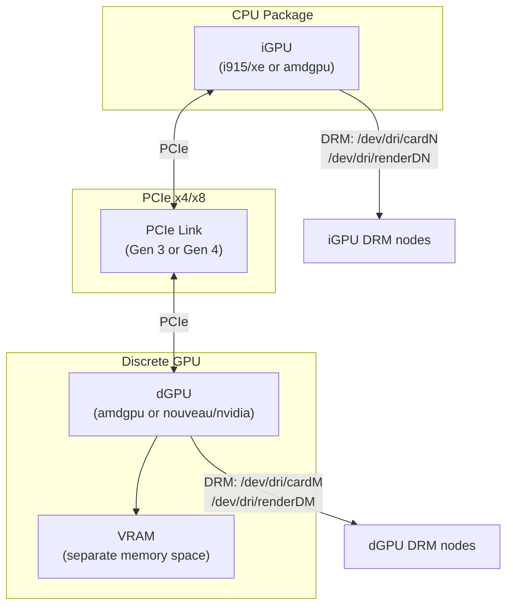
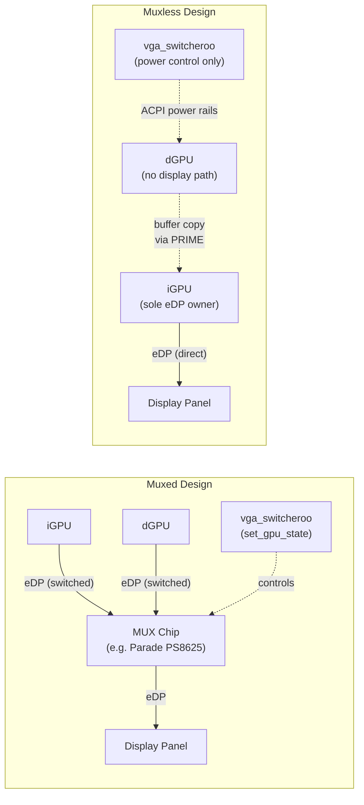
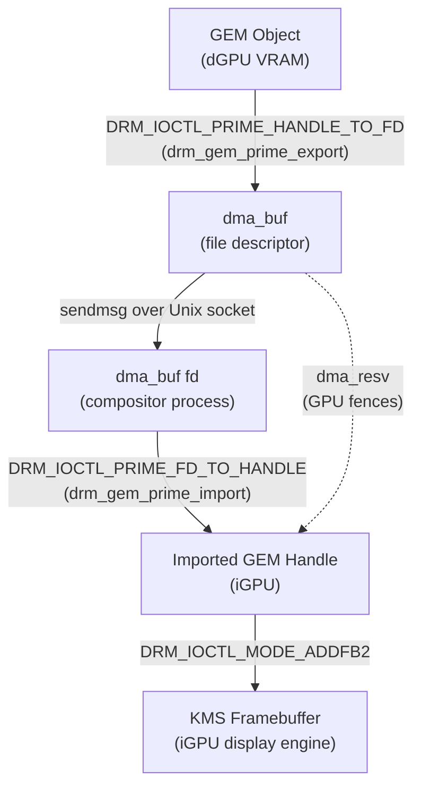
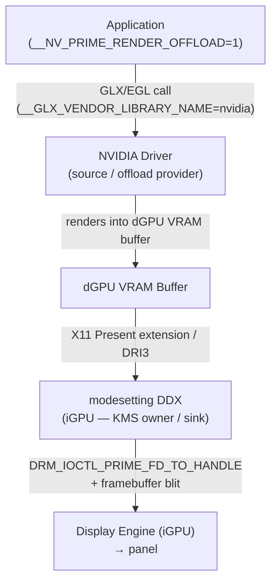
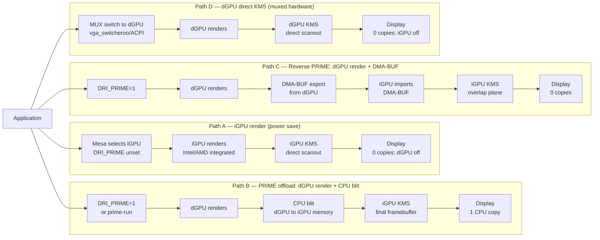
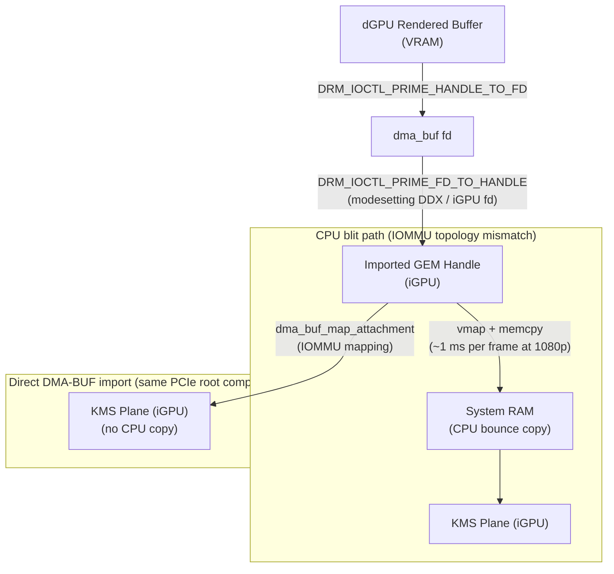
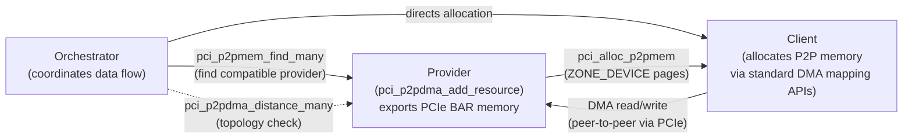

# Chapter 49: Multi-GPU and PRIME Render Offload

> **Part**: Part II — GPU Drivers
> **Audience**: Systems and driver developers needing to understand cross-device buffer sharing at the kernel level; graphics application developers targeting hybrid-GPU laptops who need to control which GPU runs their workload.
> **Status**: First draft — 2026-06-12

## Table of Contents

- [Overview](#overview)
- [1. Hybrid Graphics Hardware: Topology and MUX Design](#1-hybrid-graphics-hardware-topology-and-mux-design)
- [2. PRIME DRM Buffer Sharing: DMA-BUF Export and Import](#2-prime-drm-buffer-sharing-dma-buf-export-and-import)
- [3. DRI\_PRIME and Mesa Device Selection](#3-dri_prime-and-mesa-device-selection)
- [4. NVIDIA PRIME Render Offload](#4-nvidia-prime-render-offload)
- [5. Reverse PRIME: Rendering on dGPU, Scanning Out via iGPU KMS](#5-reverse-prime-rendering-on-dgpu-scanning-out-via-igpu-kms)
- [6. Explicit GPU Selection in Vulkan: Device Groups](#6-explicit-gpu-selection-in-vulkan-device-groups)
- [7. AMD SmartShift: Dynamic CPU+GPU TDP Sharing](#7-amd-smartshift-dynamic-cpugpu-tdp-sharing)
- [8. Vendor GPU Switching Tools: supergfxctl and system76-power](#8-vendor-gpu-switching-tools-supergfxctl-and-system76-power)
- [9. Multi-GPU Rendering: SLI/CrossFire History and Vulkan Device Groups](#9-multi-gpu-rendering-slikcrossfire-history-and-vulkan-device-groups)
- [10. Peer-to-Peer DMA: NVLink, Infinity Fabric, and the p2pdma Framework](#10-peer-to-peer-dma-nvlink-infinity-fabric-and-the-p2pdma-framework)
- [Integrations](#integrations)
- [References](#references)

---

## Overview

Modern laptops routinely ship with two GPUs: a power-efficient integrated GPU (**iGPU**) bonded to the CPU die, and a high-performance discrete GPU (**dGPU**) connected via **PCIe**. The challenge for the Linux graphics stack is to make these two completely independent **DRM** devices—with separate memory spaces, separate kernel drivers, and no shared bus master—collaborate seamlessly. A game should run on the **NVIDIA** or **AMD** dGPU, the **Wayland** compositor should drive the display from the **Intel** or **AMD** iGPU, and battery life should not collapse when the dGPU is idle.

This chapter covers the full vertical slice from hardware topology to application API. It begins with the physical design of hybrid graphics: the PCIe topology between the **iGPU** (driven by **i915**, **xe**, or **amdgpu**) and the **dGPU** (driven by **amdgpu**, **nouveau**, or **nvidia**), and how hardware display multiplexer (**MUX**) chips route **eDP** signals in muxed designs versus the buffer-copy constraints imposed by muxless laptops. The **vga_switcheroo** subsystem manages muxed-laptop GPU switching and dGPU power-rail control, while premium gaming laptops from ASUS ROG, Razer, and MSI have reintroduced software-controllable MUX hardware exposed through vendor tools.

The chapter then descends into the kernel **PRIME** infrastructure, which enables cross-device buffer sharing via **DMA-BUF** file descriptors. The two public userspace ioctls—**DRM_IOCTL_PRIME_HANDLE_TO_FD** and **DRM_IOCTL_PRIME_FD_TO_HANDLE**—together with the kernel-side **drm_gem_prime_export()** and **drm_gem_prime_import()** callbacks and the **dma_resv** reservation-object fence-sharing mechanism are examined in depth. Cross-device **IOMMU** topology constraints that determine whether a DMA mapping succeeds or falls back to a CPU bounce copy are also covered.

On the Mesa and Vulkan side, the chapter covers the **DRI_PRIME** environment variable and the **DRI_PRIME_DEBUG** companion, the **VK_LAYER_MESA_device_select** implicit Vulkan layer and the **MESA_VK_DEVICE_SELECT** variable, and the **prime-run** shell wrapper that assembles the correct set of environment variables. For **NVIDIA**'s proprietary driver, the **__NV_PRIME_RENDER_OFFLOAD**, **__GLX_VENDOR_LIBRARY_NAME**, and **__VK_LAYER_NV_optimus** variables are explained alongside the **GLVND** dispatch architecture and the **modesetting** DDX GLX offload sink model. Reverse **PRIME**—routing dGPU output through the iGPU's **KMS** display engine—is covered through the **RandR 1.4** provider model (**xrandr --setprovideroutputsource**), the CPU blit versus direct **DMA-BUF** import blit paths, and how **Wayland** compositors handle the same task with **gbm_bo_import()**.

For explicit GPU selection in **Vulkan**, the chapter covers **VkPhysicalDeviceGroupProperties**, **vkEnumeratePhysicalDeviceGroups()**, **VkDeviceGroupDeviceCreateInfo**, **vkCreateDevice()**, **VkDeviceGroupSubmitInfo**, device masks, and the practical Linux limitations that make multi-device groups rarely useful without a high-speed interconnect.

On the hardware-policy side, **AMD SmartShift**'s kernel **sysfs** interface (**smartshift_apu_power**, **smartshift_dgpu_power**, **smartshift_bias**), the underlying **STAPM** (Skin Temperature Aware Power Management) budget, **ACPI** **_DSM** methods, and the **ryzenadj** userspace tool are examined. Vendor GPU switching tools are then covered: the **supergfxctl** daemon (**supergfxd**) and its **D-Bus** interface for ASUS laptops, and **system76-power**'s **com.system76.PowerDaemon** D-Bus service for System76 / **Pop!_OS** machines.

Finally, the chapter surveys multi-GPU rendering from **SLI** (Alternate Frame Rendering/**AFR**, Split Frame Rendering/**SFR**) and **CrossFire** history through **Vulkan** device groups with **VkDeviceGroupSwapchainCreateInfoKHR** and **VkDeviceGroupPresentInfoKHR**. The kernel **p2pdma** framework (**pci_p2pdma_add_resource()**, **pci_p2pdma_distance_many()**, **pci_alloc_p2pmem()**) is explained alongside **NVIDIA NVLink** (NVLink 2.0 through 5.0) and **nvidia_p2p_get_pages()**, **AMD Infinity Fabric** and **CDNA** multi-die topology, **GPU NUMA** topology with **Heterogeneous Memory Management** (**HMM**), and the ML multi-GPU implications for all-reduce collectives via **NCCL** and **RCCL**.

---

## 1. Hybrid Graphics Hardware: Topology and MUX Design

### 1.1 Physical Topology

A typical hybrid-GPU laptop integrates two independent PCIe endpoint devices. The iGPU sits inside the CPU package—Intel Arc/Gen graphics, AMD Radeon 680M/890M, or (on Apple Silicon-adjacent designs) Qualcomm Adreno. The dGPU lives on a separate PCIe card edge or BGA die soldered to the motherboard; it connects to the CPU's PCIe root complex through a PCIe x4 or x8 link at Gen 3 or Gen 4 speed.

Both GPUs are enumerated as distinct PCI devices. The kernel loads separate driver instances: `i915` or `xe` for the Intel iGPU, `amdgpu` for an AMD iGPU or dGPU, `nouveau` or `nvidia` for an NVIDIA dGPU. Each driver creates independent `/dev/dri/cardN` and `/dev/dri/renderDN` nodes. There is no shared memory by default: a buffer allocated in the dGPU's VRAM is not directly readable by the iGPU.



### 1.2 Muxed Designs

Older and premium gaming laptops include a hardware display multiplexer (MUX) chip—a device such as the Parade PS8625 or an OEM-specific ASIC—that routes the display panel's eDP link to either the iGPU or the dGPU. In muxed designs, the dGPU can drive the panel directly without any buffer copy overhead. Switching which GPU owns the panel requires cutting and re-establishing the eDP link, which causes a brief blackout; on most implementations a full logout or reboot is needed to hand ownership safely.

The kernel `vga_switcheroo` subsystem manages muxed laptops. [Source: Linux kernel VGA Switcheroo documentation](https://www.kernel.org/doc/html/latest/gpu/vga-switcheroo.html) Each GPU driver registers a `vga_switcheroo_client_ops` with the subsystem, and an OEM-provided handler (the *mux handler*) implements the physical switching and power-rail control:

```c
/* drivers/gpu/vga/vga_switcheroo.c — simplified client registration */
struct vga_switcheroo_client_ops {
    void (*set_gpu_state)(struct pci_dev *dev, enum vga_switcheroo_state);
    void (*reprobe)(struct pci_dev *dev);
    bool (*can_switch)(struct pci_dev *dev);
    int  (*get_client_id)(struct pci_dev *dev);
};

int vga_switcheroo_register_client(struct pci_dev *pdev,
    const struct vga_switcheroo_client_ops *ops, bool driver_power_control);
```

The `set_gpu_state` callback is called with `VGA_SWITCHEROO_ON` or `VGA_SWITCHEROO_OFF` when the mux handler powers a GPU up or down. Manual switching is exposed through `/sys/kernel/debug/vgaswitcheroo/switch`; writing `IGD` hands the panel to the integrated GPU, `DIS` to the discrete.

The Apple gmux microcontroller is the best-documented mux handler in the tree. On MacBook Pro models it is a Lattice XP2 or Renesas R4F2113 device that manages blanking-interval synchronisation so the panel transition is flicker-free. On T2 Mac models, the gmux is integrated into the T2 SoC and communicates via MMIO. [Source: drivers/platform/apple/apple-gmux.c](https://github.com/torvalds/linux/blob/master/drivers/platform/apple/apple-gmux.c)

### 1.3 Muxless Designs

The majority of modern gaming and creator laptops are *muxless*: the iGPU is the sole owner of the eDP link and all external display connectors. The dGPU has no path to the display hardware; its output must be copied to iGPU-accessible memory before the compositor can scan it out. This is cheaper—no MUX chip, simpler PCB routing—but imposes an inescapable latency penalty on each frame that the dGPU renders for display.

On a muxless laptop, `vga_switcheroo` is still present but its switching handler is a no-op for display purposes. Its role is limited to controlling the dGPU's power rails through ACPI: `_DSM` or `_PS0`/`_PS3` methods are called to power the dGPU on or off, and the GPU driver uses `vga_switcheroo`'s *driver power control* mode to let its own runtime PM manage those transitions automatically.

The render-offload and buffer-copy mechanisms described in the rest of this chapter exist specifically to make muxless hybrids useful at the application level.



### 1.4 MUX Switch on Modern Gaming Laptops

Premium gaming laptops from ASUS ROG, Razer, MSI, and others have reintroduced hardware MUX in a new form: a software-controllable switch that puts the dGPU directly on the display bus for maximum gaming performance, with a reboot required to change the setting. On Linux, `supergfxctl` (Section 8.1) exposes this via D-Bus. NVIDIA documented the XDC 2024 presentation *"MUX: Mux Switch for Hybrid Graphics"* covering the state of Linux MUX support. [Source: XDC 2024 presentation on MUX switches](https://indico.freedesktop.org/event/6/contributions/297/)

---

## 2. PRIME DRM Buffer Sharing: DMA-BUF Export and Import

### 2.1 The PRIME Concept

PRIME is the DRM subsystem's mechanism for sharing GEM buffer objects across device boundaries using UNIX file descriptors. [Source: Linux GPU Driver Developer's Guide — PRIME](https://dri.freedesktop.org/docs/drm/gpu/drm-mm.html) A GEM object on the NVIDIA driver can be exported as a `dma_buf` file descriptor, passed to the Intel i915 driver, and imported as a new GEM handle there—without any CPU-visible copy of the pixel data. The `dma_buf` framework (introduced in Linux 3.3) provides the lifetime management: the underlying memory is not freed until all importers have released their references.

PRIME superseded the earlier GEM name sharing mechanism. GEM names are globally guessable 32-bit integers visible to any process with the right DRM fd; `dma_buf` file descriptors must be explicitly sent over Unix domain sockets, giving PRIME inherent security advantages. Since kernel 6.6, `DRM_CAP_PRIME` is always set for both `DRM_IOCTL_PRIME_HANDLE_TO_FD` and `DRM_IOCTL_PRIME_FD_TO_HANDLE`, meaning all modern DRM drivers support the interface. [Source: Linux kernel 6.6 DRM capability update](https://github.com/torvalds/linux/commit/6b85aa68d9d5a27556b8b1015e7e515a371e77de)



### 2.2 Userspace ioctls

Two ioctls form the public PRIME userspace API, defined in `include/uapi/drm/drm.h`:

```c
/* Exporter side: obtain a dma-buf fd from a GEM handle */
struct drm_prime_handle {
    __u32 handle;   /* GEM handle on this device */
    __u32 flags;    /* DRM_CLOEXEC | DRM_RDWR */
    __s32 fd;       /* returned dma-buf file descriptor */
};
#define DRM_IOCTL_PRIME_HANDLE_TO_FD  DRM_IOWR(0x2d, struct drm_prime_handle)

/* Importer side: create a GEM handle from a dma-buf fd */
#define DRM_IOCTL_PRIME_FD_TO_HANDLE  DRM_IOWR(0x2e, struct drm_prime_handle)
```

A typical cross-device sharing flow (e.g., rendering on the dGPU, compositing on the iGPU):

```c
/* Step 1: on the rendering (dGPU) device fd */
struct drm_prime_handle exp = { .handle = dgpu_gem_handle, .flags = DRM_CLOEXEC };
ioctl(dgpu_fd, DRM_IOCTL_PRIME_HANDLE_TO_FD, &exp);
int dmabuf_fd = exp.fd;   /* sendmsg this to compositor */

/* Step 2: on the display (iGPU) device fd — compositor process */
struct drm_prime_handle imp = { .fd = dmabuf_fd };
ioctl(igpu_fd, DRM_IOCTL_PRIME_FD_TO_HANDLE, &imp);
uint32_t igpu_gem_handle = imp.handle;

/* Step 3: use igpu_gem_handle with KMS to create a framebuffer */
struct drm_mode_fb_cmd2 fb = {
    .width  = width,
    .height = height,
    .pixel_format = DRM_FORMAT_XRGB8888,
    .handles[0] = igpu_gem_handle,
    .pitches[0] = stride,
};
ioctl(igpu_fd, DRM_IOCTL_MODE_ADDFB2, &fb);
```

### 2.3 Kernel Driver Callbacks

The kernel side is implemented in `drivers/gpu/drm/drm_prime.c`. [Source: torvalds/linux — drm_prime.c](https://github.com/torvalds/linux/blob/master/drivers/gpu/drm/drm_prime.c)

**Export path** (`HANDLE_TO_FD`): `drm_gem_prime_handle_to_fd()` looks up the GEM object from the handle, then calls the driver's `gem_prime_export` callback (or the generic `drm_gem_prime_export()` if the driver doesn't provide one):

```c
/* drivers/gpu/drm/drm_prime.c */
struct dma_buf *drm_gem_prime_export(struct drm_gem_object *obj, int flags)
{
    struct drm_device *dev = obj->dev;
    struct dma_buf_export_info exp_info = {
        .exp_name = KBUILD_MODNAME,
        .owner    = dev->driver->fops->owner,
        .ops      = &drm_gem_prime_dmabuf_ops,
        .size     = obj->size,
        .flags    = flags,
        .priv     = obj,
        .resv     = obj->resv,
    };
    return drm_gem_dmabuf_export(dev, &exp_info);
}
```

The `dma_buf_export_info.resv` field attaches the GEM object's `dma_resv` reservation object to the dma-buf, ensuring that GPU fences are visible to importers for cross-device synchronisation (see Ch4 on DMA-BUF fencing).

The `drm_gem_prime_dmabuf_ops` table wires in the seven callbacks the dma-buf framework expects:

```c
static const struct dma_buf_ops drm_gem_prime_dmabuf_ops = {
    .attach        = drm_gem_map_attach,
    .detach        = drm_gem_map_detach,
    .map_dma_buf   = drm_gem_map_dma_buf,
    .unmap_dma_buf = drm_gem_unmap_dma_buf,
    .release       = drm_gem_dmabuf_release,
    .mmap          = drm_gem_dmabuf_mmap,
    .vmap          = drm_gem_dmabuf_vmap,
    .vunmap        = drm_gem_dmabuf_vunmap,
};
```

**Import path** (`FD_TO_HANDLE`): `drm_gem_prime_fd_to_handle()` calls `dma_buf_get()` on the fd, checks a per-device hash table (`prime_fd_to_handle` cache) to avoid creating duplicate GEM objects for the same underlying buffer, then calls the driver's `gem_prime_import` callback:

```c
/* Generic import helper used by most drivers */
struct drm_gem_object *drm_gem_prime_import(struct drm_device *dev,
                                             struct dma_buf *dma_buf)
{
    struct dma_buf_attachment *attach;
    struct sg_table *sgt;
    struct drm_gem_object *obj;

    if (dma_buf->ops == &drm_gem_prime_dmabuf_ops) {
        obj = dma_buf->priv;
        if (obj->dev == dev) {
            /* same device: just take a reference */
            drm_gem_object_get(obj);
            return obj;
        }
    }

    attach = dma_buf_attach(dma_buf, dev->dev);
    sgt = dma_buf_map_attachment(attach, DMA_BIDIRECTIONAL);
    obj = dev->driver->gem_prime_import_sg_table(dev, attach, sgt);
    return obj;
}
```

The `gem_prime_import_sg_table` driver callback receives the scatter-gather table of physical pages backing the buffer (after DMA mapping on the importing device's IOMMU) and creates a driver-specific GEM object that maps those pages. This is where format-modifier negotiation (Ch5, Section 8) matters: if the exporter produced a buffer with a tiling modifier (e.g., `I915_FORMAT_MOD_Y_TILED`), the importer must understand that modifier to correctly interpret the pixel layout.

### 2.4 Cross-Device DMA Constraints

A critical concern is IOMMU topology. When both GPUs are behind the same IOMMU domain (common on AMD platforms with internal PCIe), the DMA mapping in `dma_buf_map_attachment` succeeds and physical addresses are shared. On platforms with separate IOMMU domains, the kernel must either establish an appropriate IOMMU mapping or fall back to a CPU bounce copy. The `pci_p2pdma_distance_many()` function (Section 10.2) can be used to test whether two devices can exchange data without traversing the root complex.

---

## 3. DRI\_PRIME and Mesa Device Selection

### 3.1 The Mesa Loader

Mesa's device-selection logic lives in `src/loader/loader.c`. [Source: Mesa GitLab — src/loader/loader.c](https://gitlab.freedesktop.org/mesa/mesa/-/blob/main/src/loader/loader.c) When an OpenGL or Vulkan application opens a DRI driver, the loader iterates `/dev/dri/renderD*` nodes and scores each device. Without `DRI_PRIME`, the loader selects the device that has an active display output—the one driving the compositor. This is the iGPU on a muxless hybrid.

### 3.2 DRI\_PRIME Environment Variable

Setting `DRI_PRIME` redirects the OpenGL loader to a different device. [Source: Mesa environment variables documentation](https://docs.mesa3d.org/envvars.html) Three syntax forms are supported:

| Form | Example | Meaning |
|------|---------|---------|
| Ordinal | `DRI_PRIME=1` | Select the 1st non-default GPU |
| PCIe address | `DRI_PRIME=pci-0000_01_00_0` | Select by PCIe bus/device/function |
| PCI vendor:device | `DRI_PRIME=10de:2684` | Select first GPU matching IDs |

Appending `!` (e.g., `DRI_PRIME=1!`) causes the loader to expose *only* the selected device to the application, hiding the iGPU entirely. This is useful for applications that enumerate devices themselves.

The debug companion `DRI_PRIME_DEBUG=1` prints the loader's device-scoring decisions to stderr, which is invaluable when the wrong GPU is being selected.

A simple usage example:

```bash
# Run glxgears on the discrete GPU (AMD dGPU, PCI ID 1002:73bf)
DRI_PRIME=1002:73bf glxgears

# Or by ordinal, if you know it is the second DRM device
DRI_PRIME=1 glxgears

# Verify which GPU is being used
DRI_PRIME=1 glxinfo | grep -E "renderer|device"
```

### 3.3 VK\_LAYER\_MESA\_device\_select

For Vulkan, Mesa 20.1 introduced the `VK_LAYER_MESA_device_select` implicit layer. [Source: Mesa 20.1 Vulkan device selection layer — Phoronix](https://www.phoronix.com/news/Mesa-20.1-Vulkan-Dev-Selection) The layer is loaded automatically by the Vulkan loader for any Mesa Vulkan driver and interposes `vkEnumeratePhysicalDevices`. It reads `MESA_VK_DEVICE_SELECT` (falling back to `DRI_PRIME`) and reorders the physical device list so that the requested GPU appears first. This means a `vkEnumeratePhysicalDevices` call that returns devices [NVIDIA, Intel] on a hybrid system will return [Intel] first if the application has not set any override, or [NVIDIA] first if `MESA_VK_DEVICE_SELECT=10de:2684` is set.

```bash
# List all Vulkan devices as seen by the selection layer
MESA_VK_DEVICE_SELECT=list vulkaninfo 2>/dev/null | head -20

# Force dGPU as the only visible Vulkan device
MESA_VK_DEVICE_SELECT=1002:73bf! vkcube
```

The `MESA_VK_DEVICE_SELECT_FORCE_DEFAULT_DEVICE=1` variable goes further and removes all non-selected devices from `vkEnumeratePhysicalDevices`, preventing applications from falling back to the iGPU.

### 3.4 prime-run Wrapper

The `nvidia-prime` package on most distributions ships a `prime-run` shell script that assembles the correct environment variables before exec-ing the target program. The appropriate variables differ by GPU vendor and windowing system:

```bash
#!/bin/bash
# /usr/bin/prime-run — from nvidia-prime package
# For NVIDIA dGPU with GLVND
export __NV_PRIME_RENDER_OFFLOAD=1
export __NV_PRIME_RENDER_OFFLOAD_PROVIDER=NVIDIA-G0
export __GLX_VENDOR_LIBRARY_NAME=nvidia
export __VK_LAYER_NV_optimus=NVIDIA_only
exec "$@"
```

For AMD dGPUs the equivalent is simply `DRI_PRIME=1 "$@"`, so `prime-run` on AMD-only systems often resolves to that. The script is intentionally thin — the real work is done inside Mesa's loader and NVIDIA's GLVND dispatch layer.

---

## 4. NVIDIA PRIME Render Offload

NVIDIA's proprietary driver implements a distinct render-offload mechanism documented in the driver README. [Source: NVIDIA PRIME Render Offload — driver README 435.17+](https://download.nvidia.com/XFree86/Linux-x86_64/435.17/README/primerenderoffload.html) Because the NVIDIA driver uses GLVND for OpenGL dispatch and provides its own Vulkan layer, the generic `DRI_PRIME` path does not apply.

### 4.1 Environment Variables

| Variable | Value | Effect |
|----------|-------|--------|
| `__NV_PRIME_RENDER_OFFLOAD` | `1` | Enable render offload; loads `VK_LAYER_NV_optimus` for Vulkan |
| `__GLX_VENDOR_LIBRARY_NAME` | `nvidia` | Force GLVND to load the NVIDIA GLX driver for this process |
| `__NV_PRIME_RENDER_OFFLOAD_PROVIDER` | `NVIDIA-G0` | Select a specific NVIDIA RandR provider by name |
| `__VK_LAYER_NV_optimus` | `NVIDIA_only` | Restrict Vulkan device enumeration to NVIDIA GPU |
| `__VK_LAYER_NV_optimus` | `non_NVIDIA_only` | Restrict to non-NVIDIA GPUs |

Setting `__NV_PRIME_RENDER_OFFLOAD=1` causes the NVIDIA GLX and Vulkan driver to redirect rendering to the dGPU. The final image is then copied (blitted) back to the iGPU's framebuffer for compositor composition. Since NVIDIA driver 450.57, the copy can use a direct DMA path if the platform supports it, bypassing the CPU entirely.

### 4.2 GLX Offload Sink Architecture

In NVIDIA's terminology, the GPU rendering the X screen is the *sink* (the iGPU, running the `modesetting` DDX driver). The NVIDIA GPU is the *source* or *offload provider*. The source produces scanline data that is presented on the sink's display pipeline:

```
Application (renders on NVIDIA dGPU)
      |
      | GLX/EGL call → __GLX_VENDOR_LIBRARY_NAME=nvidia
      v
 NVIDIA driver (renders into dGPU VRAM buffer)
      |
      | present → X11 Present extension / DRI3
      v
 modesetting DDX driver (iGPU — KMS owner)
      |
      | DRM_IOCTL_PRIME_FD_TO_HANDLE + framebuffer blit
      v
 Display engine (iGPU) → panel
```



For Wayland compositors, NVIDIA render offload works through the `__NV_PRIME_RENDER_OFFLOAD` path as well, but the exact copy mechanism depends on whether the compositor supports `EGL_EXT_device_query` and can import `EGLImage` objects from external devices.

---

## 5. Reverse PRIME: Rendering on dGPU, Scanning Out via iGPU KMS

Four paths exist for getting rendered frames from a dual-GPU laptop to the display. They differ in which GPU renders, how many CPU copies occur, and whether the primary display output is on the iGPU or dGPU.



| Path | Rendering GPU | CPU copies | dGPU power state | Kernel support | Performance |
|------|--------------|------------|-----------------|---------------|-------------|
| A — iGPU render | iGPU (integrated) | 0 | Off / D3cold | Always available | Low (iGPU limited) |
| B — PRIME offload + CPU blit | dGPU | 1 per frame (~1 ms at 1080p) | On (active render) | Linux 3.12+ DRI_PRIME | Medium (blit overhead) |
| C — Reverse PRIME + DMA-BUF | dGPU | 0 | On (active render) | Linux 4.10+ p2pdma/IOMMU | High (preferred muxless path) |
| D — dGPU direct KMS | dGPU | 0 | On (exclusive) | MUX hardware + vga_switcheroo | Maximum (muxed laptops only) |

Path C (Reverse PRIME with DMA-BUF) is the preferred modern path for muxless laptops. The dGPU renders into a GBM buffer, exports as DMA-BUF via `DRM_PRIME_HANDLE_TO_FD`, and the iGPU imports via `DRM_PRIME_FD_TO_HANDLE`. No CPU is involved in the memory transfer.

### 5.1 The Reverse PRIME Problem

Standard PRIME offload (Section 3) runs the application on the dGPU and copies the result back for display. *Reverse PRIME* addresses a different scenario: the dGPU has its own display outputs (HDMI, DisplayPort) that the user wants to use, but the dGPU is not the KMS master. This occurs when a laptop's HDMI port is wired to the NVIDIA GPU's display engine, while the iGPU owns the eDP panel and is the X server's primary screen.

### 5.2 RandR 1.4 Provider Model

X.Org's RandR 1.4 extension introduced the *provider* abstraction: a DRM device that is not the primary KMS master can register as a provider and offer its display outputs or rendering capability to the X server. [Source: NVIDIA README — Offloading Graphics Display with RandR 1.4](https://download.nvidia.com/XFree86/Linux-x86_64/450.57/README/randr14.html) Two provider roles are relevant:

- **Source** (`--setprovideroutputsource`): renders frames and sends them to a *sink* provider's display outputs.
- **Offload sink** (`--setprovideroffloadsink`): receives rendered frames from a source and presents them on connected displays.

For reverse PRIME the typical setup is:

```bash
# iGPU (modesetting) is provider 0 — it owns the primary screen
# NVIDIA dGPU is provider 1
xrandr --setprovideroutputsource NVIDIA-G0 modesetting
xrandr --auto
```

This command tells X that the NVIDIA provider should source its display outputs via the modesetting (iGPU) provider. The HDMI-connected monitor on the NVIDIA GPU then appears as a second screen routed through the iGPU KMS.

### 5.3 Blit Path: CPU vs Direct DMA-BUF Import

When the NVIDIA GPU renders a frame destined for its HDMI output (served via reverse PRIME), the rendered buffer must reach the iGPU's KMS plane. Two paths exist:

**CPU blit (legacy)**: The NVIDIA driver exports the buffer via `DRM_IOCTL_PRIME_HANDLE_TO_FD`. The X server `modesetting` DDX imports it via `DRM_IOCTL_PRIME_FD_TO_HANDLE` on the iGPU fd. If the IOMMU topology does not allow direct DMA between the two devices, the kernel falls back to a CPU copy through `vmap`/`memcpy`, adding ~1 ms per frame for a 1080p buffer.

**Direct DMA-BUF import**: When both GPUs are on the same PCIe root complex (common in AMD+AMD or Intel+AMD configurations), the iGPU's display engine can DMA-read the buffer from the dGPU's VRAM directly via the p2pdma mechanism. The `dma_buf_map_attachment()` call succeeds without a CPU copy because the IOMMU can create a mapping between the two devices' address spaces.



For PRIME Synchronisation (preventing tearing), the modesetting DDX requires kernel 4.5+ and uses DRM KMS `drm_syncobj` or `dma_resv` fences attached to the shared dma-buf. [Source: PRIME Synchronization — X.Org modesetting DDX](https://gitlab.freedesktop.org/xorg/driver/xf86-video-modesetting)

```c
/* Simplified: modesetting DDX importing a PRIME buffer for KMS plane */
/* File: hw/xfree86/drivers/modesetting/drmmode_display.c */

/* Import the dma-buf fd as a DRM framebuffer */
struct drm_mode_fb_cmd2 fb_cmd = {
    .width        = width,
    .height       = height,
    .pixel_format = DRM_FORMAT_XRGB8888,
    .handles[0]   = imported_gem_handle,
    .pitches[0]   = pitch,
    .modifier[0]  = modifier,   /* tiling modifier from exporter */
};
drmModeAddFB2WithModifiers(igpu_fd, width, height,
    DRM_FORMAT_XRGB8888, fb_cmd.handles,
    fb_cmd.pitches, fb_cmd.offsets, fb_cmd.modifier, &fb_id,
    DRM_MODE_FB_MODIFIERS);
```

### 5.4 Wayland and Reverse PRIME

Under Wayland, the compositor (e.g., KWin, GNOME Shell, gamescope) owns the KMS device directly and manages buffer import without an X server intermediary. A Wayland compositor with multi-GPU support (Ch21, Ch22) uses `gbm_bo_import()` with `GBM_BO_IMPORT_FD_MODIFIER` to import dma-buf file descriptors from the dGPU as wl_buffer attachments, then promotes the imported GBO to a KMS overlay plane on the iGPU. This path avoids the X server provider model entirely and is the preferred path on modern Wayland desktops.

---

## 6. Explicit GPU Selection in Vulkan: Device Groups

### 6.1 VkPhysicalDeviceGroupProperties

Vulkan 1.1 (and the predecessor `VK_KHR_device_group_creation`) exposes multi-GPU topology at the instance level. [Source: VK_KHR_device_group_creation specification](https://registry.khronos.org/vulkan/specs/latest/man/html/VK_KHR_device_group_creation.html) Applications enumerate device groups with `vkEnumeratePhysicalDeviceGroups`:

```c
uint32_t group_count;
vkEnumeratePhysicalDeviceGroups(instance, &group_count, NULL);

VkPhysicalDeviceGroupProperties *groups =
    malloc(group_count * sizeof(VkPhysicalDeviceGroupProperties));
for (uint32_t i = 0; i < group_count; i++)
    groups[i].sType = VK_STRUCTURE_TYPE_PHYSICAL_DEVICE_GROUP_PROPERTIES;

vkEnumeratePhysicalDeviceGroups(instance, &group_count, groups);

/* groups[i].physicalDeviceCount — number of GPUs in the group (usually 1 on Linux) */
/* groups[i].physicalDevices[]   — array of VkPhysicalDevice handles */
/* groups[i].subsetAllocation    — whether memory can be allocated to a device subset */
```

On a typical Linux hybrid-GPU laptop, each GPU forms its own single-device group. Multi-device groups (two GPUs in one group) require same-vendor devices and explicit driver support — on Linux this is practically only realised with two AMD GPUs or two NVIDIA GPUs connected by NVLink.

### 6.2 Creating a Multi-Device VkDevice

To create a logical device spanning multiple physical devices, extend `VkDeviceCreateInfo` with `VkDeviceGroupDeviceCreateInfo`:

```c
VkDeviceGroupDeviceCreateInfo group_info = {
    .sType               = VK_STRUCTURE_TYPE_DEVICE_GROUP_DEVICE_CREATE_INFO,
    .physicalDeviceCount = 2,
    .pPhysicalDevices    = physical_devices,  /* both GPUs */
};

VkDeviceCreateInfo device_info = {
    .sType = VK_STRUCTURE_TYPE_DEVICE_CREATE_INFO,
    .pNext = &group_info,
    /* ... queues, features, extensions */
};

VkDevice device;
vkCreateDevice(physical_devices[0], &device_info, NULL, &device);
```

Within the resulting `VkDevice`, operations accept a *device mask*: a bitmask where bit `n` indicates physical device index `n` in the group. A device mask of `0b01` runs on device 0, `0b10` on device 1, `0b11` on both simultaneously.

### 6.3 VkDeviceGroupSubmitInfo and Device Masks

Command buffer submission uses `VkDeviceGroupSubmitInfo` to direct execution:

```c
uint32_t cb_masks[]     = { 0b01 };  /* run command buffer on device 0 */
uint32_t wait_indices[] = { 0 };     /* wait semaphore on device 0 */
uint32_t sig_indices[]  = { 1 };     /* signal semaphore on device 1 */

VkDeviceGroupSubmitInfo group_submit = {
    .sType                        = VK_STRUCTURE_TYPE_DEVICE_GROUP_SUBMIT_INFO,
    .waitSemaphoreCount           = 1,
    .pWaitSemaphoreDeviceIndices  = wait_indices,
    .commandBufferCount           = 1,
    .pCommandBufferDeviceMasks    = cb_masks,
    .signalSemaphoreCount         = 1,
    .pSignalSemaphoreDeviceIndices = sig_indices,
};

VkSubmitInfo submit = {
    .sType = VK_STRUCTURE_TYPE_SUBMIT_INFO,
    .pNext = &group_submit,
    /* ... semaphores, command buffers */
};
vkQueueSubmit(queue, 1, &submit, fence);
```

### 6.4 Practical Limitations on Linux

Despite Vulkan's specification-level support, multi-device groups are rarely used on Linux desktops. The primary reason is that useful multi-device operation requires the ability to cross-device peer-read memory — which depends on NVLink or equivalent hardware interconnect. Without that, GPU0 must DMA-copy results to GPU1 before the second GPU can use them, negating most performance gains. Section 10 covers the p2pdma and NVLink paths that would make this useful.

For hybrid laptops, the practical recommendation is to use `MESA_VK_DEVICE_SELECT` or `__NV_PRIME_RENDER_OFFLOAD` to direct a single application to the dGPU, rather than attempting Vulkan device groups.

---

## 7. AMD SmartShift: Dynamic CPU+GPU TDP Sharing

### 7.1 Technology Overview

AMD SmartShift (introduced with Renoir APUs) is a firmware-managed power redistribution mechanism available on AMD Advantage laptops — systems pairing a Ryzen CPU with an AMD Radeon dGPU. [Source: AMD Continues Working On SmartShift Support For Linux — Phoronix](https://www.phoronix.com/news/AMD-SmartShift-Linux-Still-Come) The laptop's BIOS and AMD's SMU (System Management Unit) firmware treat the CPU and dGPU as a single power pool. When the CPU workload is light, its unused TDP headroom is transferred to the dGPU, allowing the GPU to run at higher sustained clock frequencies than its nominal TDP limit would otherwise permit — and vice versa.

SmartShift 2.0 (AMD Advantage 2022+) adds software-accessible bias control, allowing the user or an application to hint whether power should favour the CPU or GPU side.

### 7.2 Kernel sysfs Interface

The `amdgpu` driver exposes SmartShift monitoring and control through sysfs. [Source: AMDGPU misc driver documentation](https://dri.freedesktop.org/docs/drm/gpu/amdgpu/driver-misc.html) The attributes appear under the device's hwmon directory when SmartShift is supported by the platform firmware:

```
/sys/class/drm/card1/device/
├── smartshift_apu_power    # ro: APU power shift percentage (0–100)
├── smartshift_dgpu_power   # ro: dGPU power shift percentage (0–100)
└── smartshift_bias         # rw: SS2.0 bias, -100 (prefer APU) to +100 (prefer dGPU)
```

Reading these files shows the instantaneous power distribution. A value of `0` for `smartshift_apu_power` means no power is being transferred to the APU; `50` means the APU is receiving 50% of its TDP limit as a bonus from the shared pool.

```bash
# Monitor SmartShift power distribution (AMD Advantage laptop)
watch -n 0.5 'cat /sys/class/drm/card1/device/smartshift_apu_power \
                   /sys/class/drm/card1/device/smartshift_dgpu_power'

# Set bias to prefer dGPU for gaming
echo 50 | sudo tee /sys/class/drm/card1/device/smartshift_bias
```

Note: These sysfs paths are platform-dependent. The `card1` device node varies by system; use `ls /sys/class/drm/*/device/smartshift_*` to locate them. Also, `smartshift_bias` writable support requires SS2.0-capable firmware and may not be present on all AMD Advantage systems — verify needs checking against specific platform BIOS versions.

### 7.3 STAPM and ACPI

The underlying mechanism is AMD's STAPM (Skin Temperature Aware Power Management) budget, communicated from the BIOS to the SMU. On Linux, `ryzenadj` (a userspace tool using the SMU programming interface) and custom ACPI `_DSM` methods can override STAPM limits. [Source: stapmlifier — ACPI STAPM override](https://github.com/sibradzic/stapmlifier) Most OEMs do not expose STAPM controls in the BIOS setup, making the sysfs `smartshift_bias` attribute the primary tuning knob available to end users.

---

## 8. Vendor GPU Switching Tools: supergfxctl and system76-power

### 8.1 supergfxctl (ASUS Laptops)

ASUS ROG and TUF laptops with NVIDIA dGPUs and a hardware MUX require vendor-specific tooling beyond generic PRIME. The `supergfxctl` project (part of the asus-linux community ecosystem) provides the `supergfxd` daemon and `supergfxctl` CLI. [Source: supergfxctl — asus-linux.org](https://asus-linux.org/manual/supergfxctl-manual/) [Source: supergfxctl GitLab](https://gitlab.com/asus-linux/supergfxctl)

The daemon runs as a systemd service (`supergfxd.service`) and exposes a D-Bus interface. It manages four primary modes:

| Mode | Description | Reboot required? |
|------|-------------|-----------------|
| `Hybrid` | PRIME offload; iGPU drives display, dGPU available via `prime-run` | Logout |
| `Integrated` | dGPU powered off; iGPU only | Logout |
| `Vfio` | dGPU bound to `vfio-pci` for VM passthrough | Logout |
| `AsusMuxDgpu` | Hardware MUX switched to dGPU for direct scan-out | **Reboot** |

Switching to `AsusMuxDgpu` mode invokes ACPI methods that reconfigure the MUX hardware; the kernel (`asus-wmi` module, requiring kernel 6.1+) sequences the power-rail and ACPI transitions. [Source: supergfxctl architecture — ArchWiki](https://wiki.archlinux.org/title/Supergfxctl)

NVIDIA Runtime Power Management (RTD3) is configured through `/etc/modprobe.d/` to allow the dGPU to enter D3cold when idle in Hybrid mode:

```bash
# /etc/modprobe.d/nvidia-power.conf — NVreg_DynamicPowerManagement=0x02
# enables fine-grained RTD3 on Turing+ GPUs
options nvidia NVreg_DynamicPowerManagement=0x02
```

**Note**: As of 2025, supergfxctl is officially deprecated. The successor project *Cardwire* uses eBPF LSM hooks for GPU management. Unless you need VFIO passthrough or have difficulty powering off the dGPU, the simpler path is to rely on the kernel's runtime PM and `prime-run`.

### 8.2 system76-power (System76 / Pop!\_OS)

System76 ships `system76-power` on Pop!\_OS and supports it on Ubuntu for their laptop lineup. [Source: system76-power GitHub](https://github.com/pop-os/system76-power/) The daemon exposes a D-Bus service at `com.system76.PowerDaemon` with a `Graphics` interface:

```
D-Bus method: com.system76.PowerDaemon.Graphics.GetGraphics() -> string
D-Bus method: com.system76.PowerDaemon.Graphics.SetGraphics(string) -> ()
D-Bus signal:  com.system76.PowerDaemon.HotPlugDetect(uint64)
```

Supported graphics modes:

| Mode | Description |
|------|-------------|
| `integrated` | iGPU only; dGPU powered off; no external dGPU displays |
| `hybrid` | PRIME render offload; iGPU primary, dGPU on-demand |
| `nvidia` | dGPU exclusive; full performance, shorter battery |
| `compute` | iGPU for display; dGPU as CUDA/ROCm compute node only |

A mode change writes the desired mode to `/var/lib/system76-power/graphics`, adjusts Xorg configuration files, and prompts the user to reboot. PRIME render offloading in `hybrid` mode follows the NVIDIA driver's `__NV_PRIME_RENDER_OFFLOAD` mechanism (Section 4) and requires NVIDIA driver 435.17+.

The `HotPlugDetect` D-Bus signal is emitted when a display is connected to a port wired to the dGPU while the system is in `integrated` mode; the GNOME extension included with Pop!\_OS prompts the user to switch to `hybrid` mode.

```bash
# Query current graphics mode
system76-power graphics

# Switch to hybrid mode (requires reboot)
sudo system76-power graphics hybrid
```

---

## 9. Multi-GPU Rendering: SLI/CrossFire History and Vulkan Device Groups

### 9.1 Historical Context: SLI and CrossFire

NVIDIA SLI (Scalable Link Interface, debuting April 2004 with GeForce 6 series) and AMD CrossFire (introduced 2005) were consumer multi-GPU solutions that rendered frames cooperatively for higher framerates. Two modes dominated:

- **AFR (Alternate Frame Rendering)**: GPU0 renders even frames, GPU1 renders odd frames. Effective throughput doubles in theory, but inter-frame data dependencies and driver scheduling introduced *micro-stutter* — irregular frame pacing that was perceptible as judder even at high average framerates.
- **SFR (Split Frame Rendering)**: Each frame is divided horizontally; each GPU renders its half. SFR requires the frame boundary to be sent over the SLI bridge (a proprietary ribbon cable) to composite the halves before display.

Both technologies required explicit application profiling — game developers maintained SLI/CrossFire compatibility bits in driver databases, and any new title needed a profile before it could benefit. Driver overhead for profile management, frame pacing correction, and synchronisation across the SLI bridge was substantial.

AMD quietly retired CrossFire in 2017; NVIDIA removed SLI AA, AFR, and SFR support from its Linux driver as of the 530.x series, retaining only NVLink-based memory sharing for workstation/compute use cases. [Source: NVIDIA Linux driver dropping SLI modes — Phoronix](https://www.phoronix.com/news/NVIDIA-Linux-Dropping-SLI-Modes) The broader industry consensus is that per-frame latency improvements and higher single-GPU performance made multi-GPU consumer rendering economically uninteresting.

### 9.2 Vulkan Device Groups for Multi-GPU Rendering

Vulkan's device group mechanism (Section 6) is the standards-track replacement for vendor-proprietary SLI. It allows an application to control exactly which physical devices in a group execute which work:

```c
/* Alternate Frame Rendering equivalent using Vulkan device groups */

/* Even frames: device mask = 0b01 (physical device 0) */
VkDeviceGroupSubmitInfo even_frame_submit = {
    .sType                     = VK_STRUCTURE_TYPE_DEVICE_GROUP_SUBMIT_INFO,
    .commandBufferCount        = 1,
    .pCommandBufferDeviceMasks = (uint32_t[]){ 0b01 },
};

/* Odd frames: device mask = 0b10 (physical device 1) */
VkDeviceGroupSubmitInfo odd_frame_submit = {
    .sType                     = VK_STRUCTURE_TYPE_DEVICE_GROUP_SUBMIT_INFO,
    .commandBufferCount        = 1,
    .pCommandBufferDeviceMasks = (uint32_t[]){ 0b10 },
};
```

The `VkSwapchainCreateInfoKHR` includes a `pNext` chain with `VkDeviceGroupSwapchainCreateInfoKHR` to specify the presentation device mask. `VkDeviceGroupPresentInfoKHR` at present time specifies which device's rendered image to display.

In practice, Vulkan device group rendering on Linux is extremely rare. The missing ingredient is transparent cross-device memory access: without NVLink or AMD Infinity Fabric providing cache-coherent peer access, a Vulkan rendering pass that reads G-buffer data rendered by the other GPU must explicitly copy that data across the PCIe bus, incurring latency that dwarfs any parallelism benefit.

### 9.3 Current Reality: Single-GPU Recommendation

The Linux Vulkan ecosystem recommends against multi-device group rendering for real-time graphics. Modern high-end single GPUs (NVIDIA RTX 5090, AMD Radeon RX 9070 XT) provide more raw performance than a dual-GPU setup with the synchronisation overhead accounted for. Device groups remain relevant for ML inference distribution (Section 10.4) where the workload structure minimises cross-device communication.

---

## 10. Peer-to-Peer DMA: NVLink, Infinity Fabric, and the p2pdma Framework

### 10.1 Why Peer-to-Peer DMA Matters

The central bottleneck for multi-GPU workloads is data movement. When GPU0 produces a tensor and GPU1 needs to consume it, the naïve path is: GPU0 DMA → system RAM → GPU1 DMA. On PCIe 4.0 x16, each hop costs roughly 30–50 GB/s bandwidth; two hops for a round-trip halves effective throughput and doubles latency. Peer-to-peer (P2P) DMA allows GPU1's DMA engine to read directly from GPU0's VRAM via PCIe, cutting the round-trip to a single hop. High-speed interconnects (NVLink, AMD Infinity Fabric) go further, providing direct cache-coherent paths.

### 10.2 The Linux p2pdma Framework

The kernel `p2pdma` framework (merged in Linux 4.20) provides the infrastructure for PCIe peer-to-peer DMA. [Source: PCI Peer-to-Peer DMA Support — Linux kernel documentation](https://docs.kernel.org/driver-api/pci/p2pdma.html) It defines three driver roles:

- **Provider**: exports PCIe BAR memory as a P2P resource via `pci_p2pdma_add_resource()`
- **Client**: allocates and uses P2P memory through standard DMA mapping APIs
- **Orchestrator**: coordinates data flow between clients and providers



Key kernel functions:

```c
/* Register a PCIe BAR range as a P2P memory resource */
int pci_p2pdma_add_resource(struct pci_dev *pdev, int bar,
                             size_t size, u64 offset);

/* Find a compatible P2P provider for a set of clients */
struct pci_dev *pci_p2pmem_find_many(struct pci_dev **clients, int num_clients);

/* Allocate P2P memory from provider */
void *pci_alloc_p2pmem(struct pci_dev *pdev, size_t size);
void  pci_free_p2pmem(struct pci_dev *pdev, void *addr);

/* Build scatter-gather list backed by P2P memory */
struct scatterlist *pci_p2pmem_alloc_sgl(struct pci_dev *pdev,
                                          unsigned int *nents, u32 length);

/* Evaluate whether two devices can do P2P without traversing the CPU */
int pci_p2pdma_distance_many(struct pci_dev *provider,
                              struct device **clients, int num_clients,
                              bool verbose);
```

P2P memory uses `ZONE_DEVICE` struct pages with the `MEMORY_DEVICE_PCI_P2PDMA` type. A critical constraint: "KVA is still MMIO and must still be accessed through the normal `readX()`/`writeX()` helpers. Direct CPU access via `memcpy` is forbidden." For GPU framebuffer memory, which is write-combined MMIO from the CPU's perspective, this matters significantly.

The `pci_p2pdma_distance_many()` function returns the *distance* in terms of PCIe topology. Distance 0 means both devices share the same switch and data never leaves the switch fabric. Distance 1 means data traverses to the root complex but the root complex can *hairpin* the transaction (route it back down) without involving the CPU; this requires the root complex to be whitelisted as safe by the kernel. Distance >= 2 requires data to traverse QPI/HT links between CPU sockets, which the kernel blocks by default.

### 10.3 NVIDIA NVLink

NVLink is NVIDIA's proprietary high-bandwidth interconnect, first appearing on Pascal-generation data-center GPUs (P100) and consumer GPUs from Turing (RTX 2080 Ti NVLink Bridge). [Source: Evaluating GPU Interconnect — PCIe vs NVLink](https://arxiv.org/pdf/1903.04611)

| Generation | Per-link bandwidth | Max GPU-GPU links |
|------------|-------------------|------------------|
| NVLink 2.0 (Volta/Turing) | 25 GB/s (bidirectional) | 2 |
| NVLink 3.0 (Ampere) | 50 GB/s | 12 (NVSwitch) |
| NVLink 4.0 (Hopper) | 112 GB/s | 18 (NVSwitch) |
| NVLink 5.0 (Blackwell) | 200 GB/s | 18 (NVSwitch) |

On Linux, NVIDIA's proprietary kernel driver maps peer GPU memory into the requesting GPU's address space via the `nvidia_p2p_get_pages()` API. The `nvidia-peermem` kernel module (introduced CUDA 11.4) extends this to allow InfiniBand HCAs direct access to GPU memory for GPUDirect RDMA. [Source: NVIDIA GPUDirect RDMA documentation](https://docs.nvidia.com/cuda/gpudirect-rdma/)

The `nvidia_p2p_get_pages` mechanism pins a region of GPU physical memory and returns a table of physical addresses visible to peer PCIe devices:

```c
/* NVIDIA kernel driver API — used by nvidia-peermem and similar */
/* Note: This is an internal NVIDIA API, not a standard kernel interface */
int nvidia_p2p_get_pages(uint64_t va_space,
                          uint64_t virtual_address,
                          uint64_t length,
                          struct nvidia_p2p_page_table **page_table,
                          void (*free_callback)(void *data),
                          void *data);

int nvidia_p2p_put_pages(uint64_t va_space,
                          uint64_t virtual_address,
                          struct nvidia_p2p_page_table *page_table);
```

**Note**: The `nv-p2p` API family is deprecated as of CUDA 13.0 for Tegra/Blackwell SoC platforms; NVIDIA recommends migrating to the upstream `pin_user_pages()`/`get_user_pages()` kernel family.

### 10.4 AMD Infinity Fabric

AMD's Infinity Fabric (IF) provides cache-coherent inter-die and inter-chiplet communication for Zen-architecture CPUs and RDNA/CDNA GPUs. On consumer platforms (desktop and laptop), Infinity Fabric connects the CPU dies to each other but does *not* extend to a discrete dGPU — the dGPU connects via PCIe as normal.

For AMD's data-center CDNA products (Instinct MI200 series *Aldebaran*, MI300X *Antares*), multiple GPU dies share an Infinity Fabric interconnect, appearing as a single physical device to the OS. This is architecturally different from two separate PCIe GPUs: the kernel sees one DRM device with multiple compute units, not a device group.

On the compute platform, ROCm (Ch48) exposes peer-to-peer access through `hipMemcpyPeer()` and the `hsa_amd_agents_allow_access()` call, which configure the GPU MMU to map peer pages into the requesting agent's address space using IF's coherency protocol.

### 10.5 GPU NUMA Topology

Linux exposes GPU memory in the NUMA topology on platforms that support it. With AMD's APU unified memory or on HBM-equipped discrete GPUs with Heterogeneous Memory Management (HMM, covered in Ch5), GPU memory nodes appear in `/sys/devices/system/node/`:

```bash
# List NUMA nodes including GPU memory nodes
numactl --hardware

# On a system with AMD APU + HMM:
# available: 2 nodes (0-1)
# node 0 cpus: 0-15    (CPU memory)
# node 1 cpus: <none>  (GPU VRAM, HMM-mapped)
```

The NUMA distance table indicates the latency penalty for cross-node accesses. A CPU thread on node 0 accessing GPU node 1 memory pays the PCIe round-trip latency; GPU threads on node 1 accessing CPU node 0 pay the same. `numactl -N 1 --membind=1 application` can be used to bind ML training processes to the GPU memory node on platforms that support it.

### 10.6 ML Multi-GPU Implications

In machine learning training, the dominant data movement pattern is *all-reduce*: each GPU computes a gradient, then all GPUs exchange and sum gradients before the weight update. On a PCIe-only system with two GPUs, all-reduce travels: GPU0 VRAM → CPU RAM → GPU1 VRAM → CPU RAM → GPU0 VRAM, consuming 4× the gradient size in PCIe bandwidth per iteration.

NVLink eliminates the CPU stage: GPU0 writes directly to GPU1's VRAM and vice versa. NCCL (NVIDIA Collective Communications Library) automatically uses NVLink when available, falling back to PCIe when not. [Source: Evaluating GPU Interconnect bandwidth — arxiv 1903.04611](https://arxiv.org/pdf/1903.04611)

AMD's ROCm equivalent is RCCL (ROCm Communication Collectives Library), which uses Infinity Fabric for intra-package GPU communication and PCIe with p2pdma for inter-package transfers.

The DMA-BUF / p2pdma framework is not directly used by NCCL or RCCL — those libraries manage peer memory directly through their runtime APIs. However, the same PCIe topology constraints (ACS bits, root-complex hairpinning) that limit p2pdma also limit NCCL/RCCL throughput, so understanding p2pdma distance is a useful diagnostic for ML multi-GPU performance problems.

---

## Roadmap

### Near-term (6–12 months)

- **GPU Direct RDMA via device-private pages upstream**: NVIDIA's patch series enabling P2P DMA for HMM device-private pages (allowing NICs to DMA directly from GPU VRAM without a CPU-memory bounce) is under active review on lkml. The RFC v5 series (December 2024) adds `pagemap_ops` P2P page callbacks and Nouveau/MLX5 driver support; upstream merge is expected in the 6.20–7.0 timeframe. [Source: RFC 0/5 GPU Direct RDMA for Device Private Pages — LKML](https://lkml.iu.edu/hypermail/linux/kernel/2412.0/00028.html) [Source: Phoronix — NVIDIA Posts Linux Patches For GPU Direct RDMA](https://www.phoronix.com/news/Linux-GPU-P2P-DMA-Device-Priv)
- **Block-layer P2P DMA improvements (Linux 6.19)**: NVIDIA's block-layer and NVMe driver patches landing in Linux 6.19 fix MMIO cache-synchronisation semantics, incorrect DMA mapping/unmapping for MMIO regions, and IOMMU configuration for peer-to-peer MMIO memory, improving GPUDirect Storage throughput on PCIe systems. [Source: Phoronix — NVIDIA Improves Block Layer Peer-To-Peer DMA In Linux 6.19](https://www.phoronix.com/news/Linux-6.19-IO-uring-Block)
- **NVIDIA DMA-BUF for VFIO PCI devices (Linux 6.19)**: NVIDIA plumbed DMA-BUF exporter support into the VFIO-PCI subsystem in Linux 6.19, enabling zero-copy GPU-buffer sharing between the host driver and virtualised device contexts. [Source: Linux.org — NVIDIA Plumbs DMA-BUF Support For VFIO PCI Devices In Linux 6.19](https://www.linux.org/threads/phoronix-nvidia-plumbs-dma-buf-support-for-vfio-pci-devices-in-linux-6-19.59738/)
- **Mesa EGL/Wayland scanout-side linear allocation**: Improvements merged into Mesa 23.1 ensure the linear copy buffer for cross-GPU scanout is allocated on the display (iGPU) side rather than the render (dGPU) side, reducing the DMA mapping overhead on the iGPU's IOMMU. Follow-on patches are expected to extend this to Vulkan WSI paths. [Source: Phoronix — Mesa EGL X11/Wayland Optimization For Multi-GPU/PRIME Systems](https://www.phoronix.com/news/Mesa-EGL-Wayland-Scanout-Linear)
- **Native Wayland DMA-BUF Feedback for Vulkan PRIME**: Wayland's `zwp_linux_dmabuf_feedback_v1` protocol, already landed in Mesa Vulkan WSI, is expected to gain tighter integration with compositor device-selection APIs so that Vulkan applications using `DRI_PRIME` can automatically negotiate the optimal DMA-BUF format modifier without a fallback linear blit. Note: needs verification for exact timeline.

### Medium-term (1–3 years)

- **True NVIDIA open-kernel DMA-BUF support**: NVIDIA's open GPU kernel modules currently implement a proprietary buffer-sharing path that does not interoperate with the upstream DMA-BUF subsystem for discrete GPUs (only NVLink/C2C or framebuffer-less devices). A tracked GitHub issue requests proper `dma_buf_export()` integration, which would allow PRIME to import NVIDIA VRAM buffers via standard DRM mechanisms without requiring the GLVND `__NV_PRIME_RENDER_OFFLOAD` workaround. [Source: True DMA-BUF support issue — NVIDIA open-gpu-kernel-modules](https://github.com/NVIDIA/open-gpu-kernel-modules/issues/175) [Source: P2PDMA DMA-BUF framework support discussion](https://github.com/NVIDIA/open-gpu-kernel-modules/discussions/1046)
- **CONFIG_PCI_P2PDMA for modern GPUDirect RDMA**: Distro kernels (e.g., Talos Linux, Ubuntu server) are being pushed to enable `CONFIG_PCI_P2PDMA` by default to support the DMA-BUF-based GPUDirect RDMA approach. Wider enablement would allow the `p2pdma` framework to replace the legacy `nvidia-peermem` out-of-tree module entirely. [Source: Enable CONFIG_PCI_P2PDMA for modern GPUDirect RDMA — Talos issue](https://github.com/siderolabs/talos/issues/12021)
- **`vga_switcheroo` modernisation or replacement**: The `vga_switcheroo` subsystem dates to the pre-ACPI-runtime-PM era and carries significant technical debt. Discussions on the DRI mailing list point toward consolidating per-vendor power-rail logic into the individual DRM drivers' runtime PM paths and removing the central mux-handler model, with vendor-specific D-Bus daemons (supergfxctl, system76-power) owning the MUX control surface entirely. Note: needs verification for exact patchset status.
- **Vulkan device-group cross-GPU execution on Linux**: The `VK_KHR_device_group` specification permits multi-GPU rendering without a proprietary interconnect, but all Mesa drivers currently report group sizes of 1 (no peer device) on Linux unless NVLink is present. AMD ROCm and upstream RDNA drivers may add Infinity Fabric-backed device groups for CDNA platforms. Note: needs verification.
- **Upstream kernel MUX driver for ASUS/MSI/Razer gaming laptops**: The XDC 2024 presentation on MUX switches noted that laptop MUX hardware is currently managed by out-of-tree vendor firmware interfaces. A generic kernel MUX driver (extending `vga_switcheroo` or replacing it with a platform-driver model) was proposed as a long-term goal to eliminate the dependency on supergfxctl kernel modules. [Source: XDC 2024 MUX Switch presentation](https://indico.freedesktop.org/event/6/contributions/297/)

### Long-term

- **Coherent CPU+GPU address space via HMM and CXL**: As CXL 3.0 memory expanders and GPU-attached memory pools become more common, the Heterogeneous Memory Management (HMM) infrastructure may evolve to provide a flat, cache-coherent address space spanning iGPU, dGPU, and CPU memory, removing the need for explicit PRIME buffer copies on coherent systems. This would make the DMA-BUF fd-passing model optional rather than mandatory for inter-GPU data paths.
- **Wayland compositor-side GPU device negotiation protocol**: The current `zwp_linux_dmabuf_feedback_v1` protocol tells clients which GPU and modifier the compositor prefers, but there is no standard protocol for a compositor to orchestrate application-level GPU selection across multiple physical devices. A future Wayland extension could formalise this, replacing the current `DRI_PRIME` environment-variable workaround with a proper protocol negotiation at surface-creation time. Note: needs verification.
- **AMD SmartShift integration with kernel power capping (`powercap`)**: AMD's SmartShift STAPM budget is currently managed through ACPI `_DSM` and vendor sysfs knobs. A long-term direction tracked by AMD kernel engineers is to expose the APU+dGPU TDP budget through the Linux `powercap` RAPL-like framework, enabling system-level energy coordinators (e.g., `tuned`, GNOME Power Profiles) to participate in SmartShift decisions without vendor-specific tooling. Note: needs verification for roadmap status.
- **P2P DMA support in container and VM environments**: Containerised GPU access (Kubernetes device plugin, VFIO mediated devices) currently cannot exploit PCIe P2P DMA because IOMMU grouping rules separate container namespaces from host memory domains. Future IOMMU and VFIO-PCI work may enable scoped P2P mappings inside container sandboxes, which would make GPUDirect RDMA usable in multi-tenant cloud GPU deployments without disabling IOMMU protection.
- **Cross-vendor GPU compositing without CPU copies**: For muxless laptops, the iGPU is always required to blit dGPU output, incurring PCIe bandwidth cost. If future PCIe display-output bridging hardware (conceptually similar to NVLink but for display KMS) gains OS support, it could allow the dGPU to push scan-out buffers to iGPU display engines over PCIe without a CPU-side copy, removing the main latency penalty of the muxless design. Note: highly speculative.

---

## Integrations

**Ch4 — GPU Memory Management**: The DMA-BUF framework (including `dma_resv` reservation objects and cross-device fence sharing) underpins all of PRIME. The `dma_buf_attach`, `dma_buf_map_attachment`, and `dma_buf_map_attachment_unlocked` calls used during PRIME import depend on the memory management infrastructure described there, including TTM eviction policies and the fence timeline model.

**Ch5 — x86 GPU Drivers**: Format modifiers (`DRM_FORMAT_MOD_*`) negotiated between `i915`/`xe`/`amdgpu` drivers are carried through PRIME export and import. An iGPU scanning out a dGPU-rendered buffer must understand the dGPU's tiling modifier; this is handled through the `drm_mode_fb_cmd2` modifiers field.

**Ch12 — The Mesa Loader and Driver Dispatch**: `DRI_PRIME` device selection is implemented in `src/loader/loader.c`. The loader's device scoring, render node iteration, and the `VK_LAYER_MESA_device_select` Vulkan layer are documented in detail there.

**Ch21 — Building Compositors with wlroots**: wlroots implements multi-GPU support through `wlr_drm_backend` with explicit DMA-BUF import for cross-device surfaces. A Wayland compositor built on wlroots automatically handles reverse-PRIME-style buffer imports when a client renders on a different GPU than the display backend.

**Ch22 — Production Compositors**: gamescope (Valve's micro-compositor) uses `DRI_PRIME` and direct DRM buffer import to present frames from game processes running on the dGPU onto the iGPU's display output. KWin and GNOME Shell have similar hybrid-GPU paths using the `wlr-output-management` or direct KMS stacking.

**Ch48 — ROCm and Machine Learning on Linux GPUs**: RCCL's peer-to-peer transfers, `hipMemcpyPeer`, and the Infinity Fabric topology affecting multi-GPU training throughput are the ML manifestation of the p2pdma and NVLink mechanisms described here.

**Ch51 — GPU Power Management and Thermal**: Runtime power management of the dGPU in a hybrid laptop (RTD3, D3cold, PCI power states) interacts closely with PRIME: the dGPU must be runtime-resumed before any PRIME export can succeed. `pm_runtime_get_sync()` is called inside the `HANDLE_TO_FD` ioctl path. AMD SmartShift's STAPM budget is managed by the same SMU firmware that handles thermal throttling.

**Ch55 — GPU Containers and Cloud Compute**: Container environments that expose multiple GPUs (e.g., Kubernetes with the NVIDIA device plugin) use DRM render node passing and DMA-BUF fd sharing as the mechanism for a containerised workload to access a specific GPU. The device group and P2P DMA topology described here applies equally inside container sandboxes.

---

## References

- [Linux Kernel VGA Switcheroo Documentation](https://www.kernel.org/doc/html/latest/gpu/vga-switcheroo.html)
- [Linux GPU Driver Developer's Guide — PRIME Buffer Sharing](https://dri.freedesktop.org/docs/drm/gpu/drm-mm.html)
- [DRM PRIME implementation — drivers/gpu/drm/drm_prime.c](https://github.com/torvalds/linux/blob/master/drivers/gpu/drm/drm_prime.c)
- [Mesa Environment Variables — docs.mesa3d.org](https://docs.mesa3d.org/envvars.html)
- [Mesa 20.1 Vulkan Device Selection Layer — Phoronix](https://www.phoronix.com/news/Mesa-20.1-Vulkan-Dev-Selection)
- [NVIDIA PRIME Render Offload — driver README 435.17](https://download.nvidia.com/XFree86/Linux-x86_64/435.17/README/primerenderoffload.html)
- [NVIDIA Offloading Graphics Display with RandR 1.4 — driver README 450.57](https://download.nvidia.com/XFree86/Linux-x86_64/450.57/README/randr14.html)
- [Vulkan Device Groups — Vulkan Documentation Project](https://docs.vulkan.org/guide/latest/extensions/device_groups.html)
- [VK_KHR_device_group_creation specification](https://registry.khronos.org/vulkan/specs/latest/man/html/VK_KHR_device_group_creation.html)
- [PCI Peer-to-Peer DMA Support — Linux Kernel Documentation](https://docs.kernel.org/driver-api/pci/p2pdma.html)
- [NVIDIA GPUDirect RDMA Documentation](https://docs.nvidia.com/cuda/gpudirect-rdma/)
- [AMDGPU Misc Driver Information — Linux Kernel Documentation](https://dri.freedesktop.org/docs/drm/gpu/amdgpu/driver-misc.html)
- [supergfxctl Manual — asus-linux.org](https://asus-linux.org/manual/supergfxctl-manual/)
- [system76-power GitHub](https://github.com/pop-os/system76-power/)
- [PRIME — ArchWiki](https://wiki.archlinux.org/title/PRIME)
- [Evaluating GPU Interconnect: PCIe, NVLink, NVSwitch — arXiv:1903.04611](https://arxiv.org/pdf/1903.04611)

---

*Copyright © 2026 jreuben11. Licensed under [CC BY 4.0](https://creativecommons.org/licenses/by/4.0/).*
