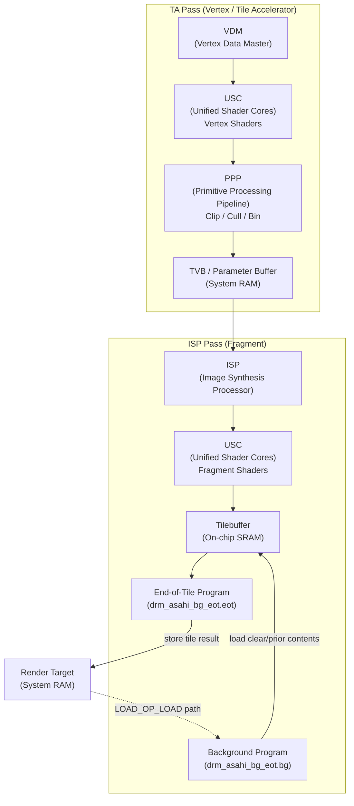
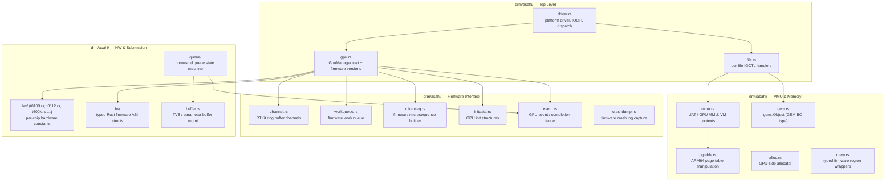
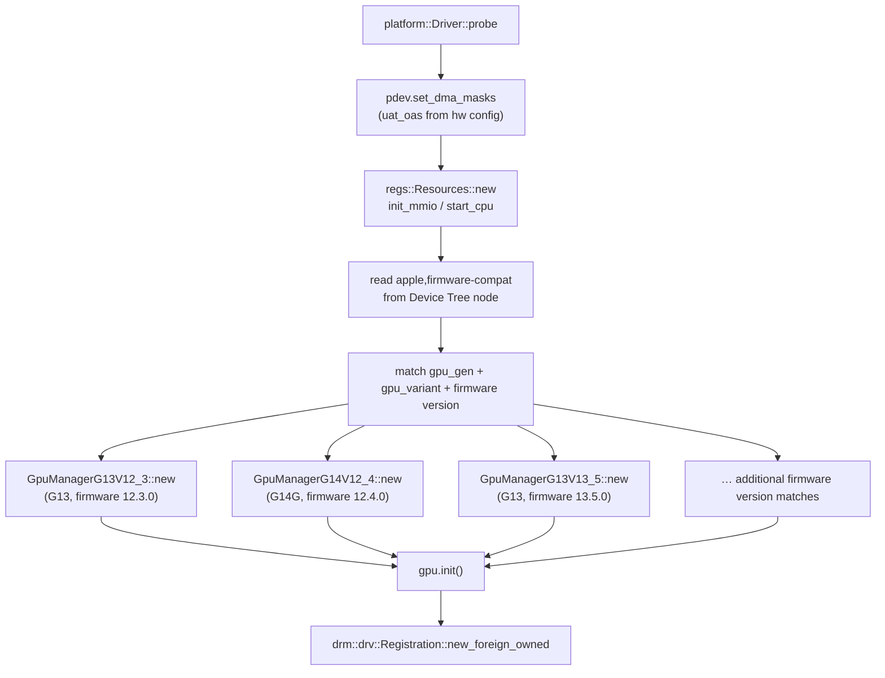
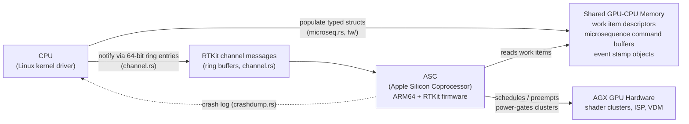
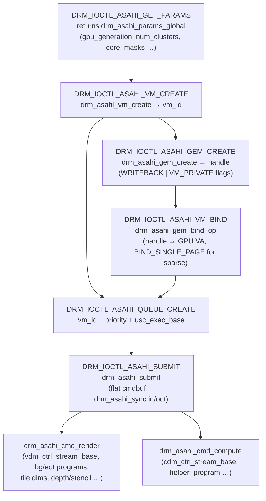
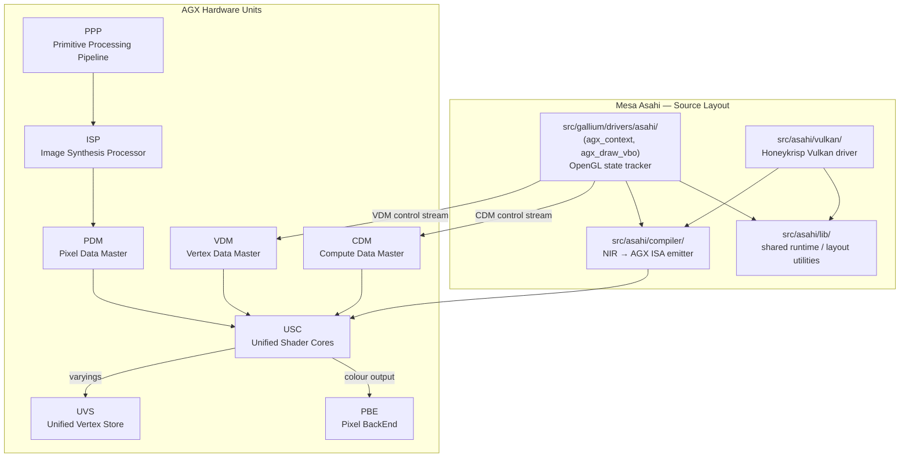
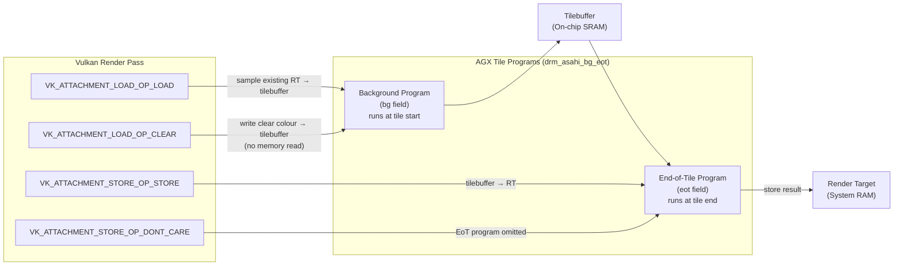
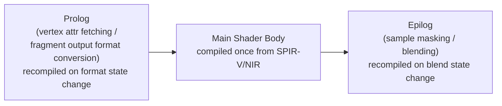
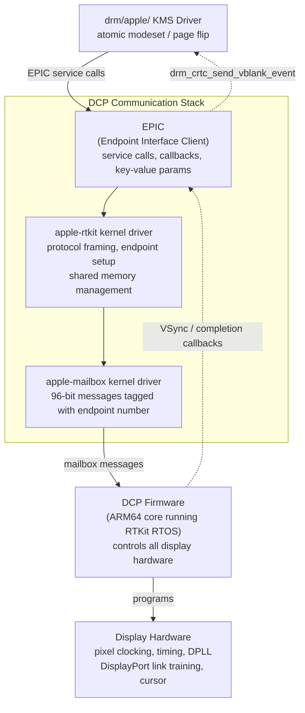
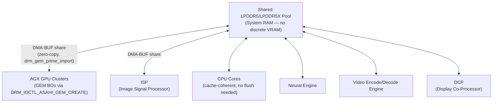

# Chapter 73: Asahi Linux and the Apple Silicon AGX Driver

> **Part**: Part II — GPU Drivers (addition)
> **Audience**: Systems and driver developers (primary) — this chapter examines a Rust-language kernel driver written for completely undocumented hardware via reverse engineering. Graphics application developers will benefit from the sections on Mesa Gallium and Vulkan driver design to understand capability boundaries and UMA implications. The chapter is also relevant to browser and web platform engineers deploying Chrome on Apple Silicon Linux systems.
> **Status**: First draft — 2026-06-17

---

## Table of Contents

- [Overview](#overview)
- [1. Apple Silicon GPU Architecture: The AGX Family](#1-apple-silicon-gpu-architecture-the-agx-family)
- [2. The Reverse Engineering Story](#2-the-reverse-engineering-story)
- [3. Lina's Rust AGX Kernel Driver (drm/asahi)](#3-linas-rust-agx-kernel-driver-drmasahi)
- [4. The UAPI: Explicit VM and Submission Model](#4-the-uapi-explicit-vm-and-submission-model)
- [5. Mesa Asahi Gallium Driver](#5-mesa-asahi-gallium-driver)
- [6. Mesa Asahi Vulkan Driver: Honeykrisp](#6-mesa-asahi-vulkan-driver-honeykrisp)
- [7. Apple Display Co-Processor (DCP)](#7-apple-display-co-processor-dcp)
- [8. Unified Memory Architecture Implications](#8-unified-memory-architecture-implications)
- [9. Conformance, Performance, and Current Status](#9-conformance-performance-and-current-status)
- [Integrations](#integrations)
- [References](#references)

---

## Overview

The **Asahi Linux** project occupies a unique position in the landscape of Linux **GPU** driver development. Every other driver in the Linux **DRM** subsystem targets hardware that either publishes programming specifications (**Intel**, **AMD**) or whose interfaces were available to the original vendor driver team. The **Asahi** **AGX** driver targets hardware whose full register specification has never been published by Apple, whose firmware binary interface evolves with every macOS release, and whose display controller runs a proprietary real-time operating system on an embedded **ARM** core.

The result is the most technically ambitious open-source GPU driver project of the past decade: a kernel driver written entirely in **Rust** — the first in the **DRM** subsystem — combined with a **Mesa** **Gallium** driver and a **Vulkan** driver (**Honeykrisp**) that together deliver the only conformant **OpenGL 4.6**, **OpenGL ES 3.2**, **OpenCL 3.0**, and **Vulkan 1.4** stack on Apple Silicon hardware. The conformant standard is higher than Apple's own **Metal**-based stack achieves via **MoltenVK**.

Section 1 surveys the **AGX** hardware architecture in depth. Apple's in-house GPU spans multiple generations — **G13** through **G14** — mapped across **M1** and **M2** family **SoC**s including the **T8103**, **T6001** (M1 Max), **T6002** (M1 Ultra), **T8112**, and **T6020**/**T6021**/**T6022** chips. The GPU implements **TBDR** (Tiled Deferred Rendering), a tile-based architecture sharing its lineage with **PowerVR**, with a pipeline split between the **TA** (Tile Accelerator) pass — orchestrated by the **VDM** (Vertex Data Master), **PPP** (Primitive Processing Pipeline), and **TVB** (Tiled Vertex Buffer) — and the fragment/**ISP** (Image Synthesis Processor) pass writing through an on-chip tilebuffer. All shader types run on **USC** (Unified Shader Cores) using the **G13G ISA** documented by Dougall Johnson. The SoC uses a **UMA** (Unified Memory Architecture) with no discrete **VRAM**, placing every allocation in shared **LPDDR5**/**LPDDR5X** system RAM.

Section 2 covers the reverse engineering methodology that made the driver possible. For non-GPU **SoC** peripherals the team used **m1n1**, a bare-metal hypervisor that intercepts **MMIO** register traffic from macOS. For the GPU itself, Alyssa Rosenzweig developed **IOKit** interception via **`DYLD_INSERT_LIBRARIES`**, hooking memory allocation, command buffer creation, and submission to capture **GPU**-visible memory at the moment of dispatch — implemented as the **`wrap`** library and **`agxdecode`** tool in **Mesa**. The approach is compared with **Nouveau**'s **`LD_PRELOAD`** wrapping, **`mmt-replay`**, and **envytools** disassembly; the key distinction is that **AGX** puts scheduling, preemption, and fault recovery into co-processor firmware rather than hardware registers.

Section 3 examines Asahi Lina's **`drm/asahi`** Rust kernel driver — the first **Rust** driver in the **DRM** subsystem. It explains the decision to use **Rust** for safety over the complex firmware **ABI** (more than 70 packed struct types), describes the full module structure (**`driver.rs`**, **`gpu.rs`**, **`mmu.rs`**, **`gem.rs`**, **`channel.rs`**, **`microseq.rs`**, **`fw/`**, **`hw/`**, and more), shows the **`AsahiDriver`** / **`drm::drv::Driver`** initialisation pattern with per-chip **Device Tree** compatible strings, details the **UAT** (Unified Address Translator) GPU **MMU** using **ARM64**-compatible page tables with 16 KiB pages and 64 VM contexts, and explains how work is submitted to the **ASC** (Apple Silicon Coprocessor) via **RTKit** channel ring buffers in **`channel.rs`** and firmware microsequences in **`microseq.rs`**, with crash recovery handled by **`crashdump.rs`**.

Section 4 details the **Asahi UAPI** — accepted into mainline **Linux** as **`include/uapi/drm/asahi_drm.h`** without the driver, a first for the **DRM** subsystem — covering the full IOCTL sequence: **`DRM_IOCTL_ASAHI_GET_PARAMS`** returning **`struct drm_asahi_params_global`**, **`DRM_IOCTL_ASAHI_VM_CREATE`** / **`struct drm_asahi_vm_create`** for explicit **GPU** VM management, **`DRM_IOCTL_ASAHI_GEM_CREATE`** / **`struct drm_asahi_gem_create`** for buffer allocation with the **`DRM_ASAHI_GEM_WRITEBACK`** flag, **`DRM_IOCTL_ASAHI_VM_BIND`** / **`struct drm_asahi_gem_bind_op`** with **`DRM_ASAHI_BIND_SINGLE_PAGE`** for sparse binding, **`DRM_IOCTL_ASAHI_QUEUE_CREATE`** with priority and **`usc_exec_base`**, and **`DRM_IOCTL_ASAHI_SUBMIT`** / **`struct drm_asahi_submit`** with flat command buffers, explicit **DRM syncobj** synchronisation, and the central **`struct drm_asahi_cmd_render`** carrying **`vdm_ctrl_stream_base`**, **`bg`**/**`eot`** tile programs, tile dimensions, depth/stencil buffers, and **`drm_asahi_timestamps`**.

Section 5 covers the **Mesa Asahi Gallium** driver in **`src/gallium/drivers/asahi/`** and **`src/asahi/`**. The **`agx_context`** / **`agx_draw_vbo`** state tracker orchestrates the eight **AGX** hardware units (**VDM**, **PPP**, **ISP**, **USC**, **UVS**, **PDM**, **PBE**, **CDM**), while the **NIR** compiler backend in **`src/asahi/compiler/`** handles varying lowering to **`st_var`** / **`ldcf`** / **`iter`** instructions, uniform lowering to the 256-entry uniform register file, image layout selection (strided linear, GPU-tiled, twiddled), and the lowering of **OpenGL** transform feedback, geometry shaders, and tessellation evaluation shaders to **compute** dispatches. Achieving **OpenGL 4.6** conformance required creative bridging of hardware gaps: buffer robustness via unsigned-minimum clamping, image robustness by forcing out-of-bounds texture coordinates, and clip control via a vertex shader epilogue remapping **clip-space Z**.

Section 6 covers **Honeykrisp** (**`src/asahi/vulkan/`**), the **Vulkan** driver for Apple Silicon on Linux, forked from **NVK** (Faith Ekstrand's **Mesa** **Vulkan** driver for **NVIDIA**) and adapted for **TBDR** semantics. It explains how **Vulkan** render pass **`VK_ATTACHMENT_LOAD_OP_*`** / **`VK_ATTACHMENT_STORE_OP_*`** operations are mapped to synthesised **BG** (background) and **EoT** (end-of-tile) **USC** programs in **`struct drm_asahi_bg_eot`**; how dynamic state is handled via prolog/epilog shader splits, conditional code, precompiled variants, and indirection tables to avoid pipeline stutter; how descriptor sets are adapted for **UMA** hardware formats; how **`VK_EXT_image_drm_format_modifier`** enables zero-copy **WSI** with **DMA-BUF** sharing to the **Wayland** compositor; and the **Vulkan** conformance timeline (**Vulkan 1.3** in June 2024, **Vulkan 1.4** by late 2024, sparse binding in **Mesa 25.1** enabling **VKD3D-Proton** **DX12_0**). Hardware tessellation limitations — the M1's tessellator is too limited for **OpenGL**/**Vulkan** **TCS**/**TES** semantics — lead to emulation via compute dispatches.

Section 7 covers the **DCP** (Display Control Processor), an **ASC** embedded **ARM64** core running **RTKit**. The **DCP** manages all display hardware — pixel clocking, timing, **DPLL** programming, **DisplayPort** link training, cursor planes, brightness control — while the **CPU** communicates only via a layered protocol: **`apple-mailbox`** (96-bit **ASC** messages) → **`apple-rtkit`** → **EPIC** (Endpoint Interface Client) service calls. The **`drm/apple/`** **KMS** driver implements atomic **DRM/KMS** modesetting on top of this firmware-mediated stack, delivering page flipping, **VSync**, brightness control, 120 Hz **ProMotion**, audio over **DisplayPort**/**HDMI**, and experimental external display via **USB-C** (the "fairydust" branch, coordinating **DCP**, **DPXBAR**, **ATCPHY**, and **ACE**). **VRR** (Variable Refresh Rate) requires a full modeset to toggle, a known limitation compared to conventional **KMS** drivers such as **i915** or **amdgpu** that program timing registers directly.

Section 8 examines the implications of the **UMA** model: the absence of a **VRAM**/**GTT** split means every **`DRM_IOCTL_ASAHI_GEM_CREATE`** allocation is in the shared **LPDDR5**/**LPDDR5X** pool competing for the same bandwidth among **CPU** cores, **AGX GPU** clusters, **Neural Engine**, **ISP**, and video encode/decode engines; **DMA-BUF** sharing via **`drm_gem_prime_import`** between the **GPU** and the camera **ISP** or video decoder is structurally zero-copy; the hardware is **cache-coherent** between **CPU** and **GPU** without **`drm_clflush_sg`** calls; and **`DRM_ASAHI_BIND_SINGLE_PAGE`** with **`DRM_ASAHI_FEATURE_SOFT_FAULTS`** provides the hardware primitive for **Vulkan** sparse binding.

Section 9 summarises conformance achievement (**OpenGL 4.6**, **OpenGL ES 3.2**, **OpenCL 3.0**, **Vulkan 1.4**), available performance data (355 GB/s buffer clear on M1 Ultra, 100 million draw calls/second in **`vkoverhead`**, **AAA** gaming via **FEX** + **Wine** + **DXVK**/**VKD3D-Proton** + **muvm**), the project leadership transitions of 2025, and upstreaming status: the **UAPI** is in mainline, **Gallium** and **Honeykrisp** are fully upstream in **Mesa**, the **`drm/asahi`** kernel driver (~21,000 lines) remains out-of-tree, and **M3**/**M4** GPU acceleration awaits further reverse engineering of the **G15**/**G16** architecture with hardware ray tracing and **Dynamic Caching**.

---

## 1. Apple Silicon GPU Architecture: The AGX Family

### GPU Generations and SoC Mapping

Apple's in-house GPU, internally designated AGX, debuted with the A11 Bionic in 2017 and reached its first desktop-class incarnation with the M1 (chip ID T8103) in late 2020. Apple does not publish formal microarchitecture names in the same way AMD and NVIDIA do, but the Asahi project and hardware researchers have identified distinct GPU generations, designated G13 through G15/G16, by tracing firmware structures and ISA differences.

The mapping of confirmed generations to SoCs, sourced from the Asahi project's hardware configuration files and the Khronos conformance database, is:

| GPU Generation (core) | Chip ID | Product Line | Dies | Max Clusters | Max Cores/Cluster |
|---|---|---|---|---|---|
| G13G (`GpuCore::G13G`) | T8103 | M1 | 1 | 1 | 8 |
| G13S (`GpuCore::G13S`) | T6000 | M1 Pro | 1 | 2 | 8 |
| G13C (`GpuCore::G13C`) | T6001 | M1 Max | 1 | 4 | 8 |
| G13D (`GpuCore::G13C`, variant D) | T6002 | M1 Ultra | 2 | 8 | 8 |
| G14G (`GpuCore::G14G`) | T8112 | M2 | 1 | 1 | 10 |
| G14S (`GpuCore::G14S`) | T6020 | M2 Pro | 1 | 2 | 10 |
| G14C (`GpuCore::G14C`) | T6021 | M2 Max | 1 | 4 | 10 |
| G14D (`GpuCore::G14D`) | T6022 | M2 Ultra | 2 | 8 | 10 |

Support for M3 and M4 series (which introduce G15/G16 variants with hardware-accelerated ray tracing, mesh shaders, and Dynamic Caching) is under active reverse engineering as of mid-2026, with M3 MacBook Air booting to a software-rendered desktop but lacking GPU acceleration. [Source: Asahi Linux Progress Report Linux 6.19, February 2026](https://asahilinux.org/2026/02/progress-report-6-19/)

The actual GPU generation and cluster topology are exposed to userspace via the `DRM_IOCTL_ASAHI_GET_PARAMS` IOCTL, which returns a `struct drm_asahi_params_global`. This struct reports `gpu_generation` (e.g., 13 for G13G), `gpu_variant` (a character, e.g., 'G'), `num_clusters_total`, `num_cores_per_cluster`, and a `core_masks` bitmask array showing which cores are active in each cluster. [Source: `include/uapi/drm/asahi_drm.h` in Linux mainline](https://github.com/torvalds/linux/blob/master/include/uapi/drm/asahi_drm.h)

The M1 base chip (T8103) carries a single G13G cluster with up to eight shader cores active. The M1 Max (T6001, G13C) scales to four clusters with eight cores each — 32 cores on a single die — while the M1 Ultra (T6002, G13C variant D) is a two-die package doubling this to eight clusters and 64 shader cores. The hardware configuration for the M1 as recovered by Asahi's driver code confirms: `max_num_clusters: 1`, `max_num_cores: 8`, `uat_oas: 40` (40-bit output address space), and `num_dies: 1`. The M1 Ultra's t6002 config raises this to `num_dies: 2`, `max_num_clusters: 8`, with a 42-bit OAS to accommodate the larger address space. [Source: `drivers/gpu/drm/asahi/hw/t8103.rs` and `hw/t600x.rs` in AsahiLinux/linux](https://github.com/AsahiLinux/linux/blob/gpu/rust-wip/drivers/gpu/drm/asahi/hw/t600x.rs)

### Tiled Deferred Rendering (TBDR)

AGX implements tile-based deferred rendering (TBDR), the same fundamental architecture as PowerVR (from which AGX descends), ARM Mali, and Qualcomm Adreno. The rendering pipeline splits frame processing across two distinct passes that bookend the tile loop:

**Vertex / Tile Accelerator (TA) pass.** The VDM (Vertex Data Master) dispatches vertex shaders via the Unified Shader Cores (USCs). The PPP (Primitive Processing Pipeline) clips and culls primitives and sorts them into tile bins stored in the Tiled Vertex Buffer (TVB), also known as the Parameter Buffer (PB). The TVB holds post-transform vertex positions and varyings for all geometry that touches each tile. This data lives in system RAM — a single pool shared by all stages.

**Fragment / ISP pass.** Once the TA pass completes for a tile, the ISP (Image Synthesis Processor) fetches the binned primitives. Fragment shaders execute on USCs and write results to a small, high-speed tilebuffer — a region of on-chip SRAM sized at a few kilobytes — rather than main memory. At the end of each tile, the **end-of-tile (EoT) program**, a small compute-like shader dispatched by the hardware, stores the tilebuffer contents to the actual render target in system RAM. The **background program** loads clear colour or prior render target contents into the tilebuffer at the start of each tile.

The UAPI exposes this two-program model directly. Every `drm_asahi_cmd_render` command carries explicit `bg` and `eot` fields of type `struct drm_asahi_bg_eot`, each containing a USC address and resource specifier. The kernel never touches these programs; it forwards them to firmware, which dispatches them as part of hardware tile scheduling. Similarly, `partial_bg` and `partial_eot` handle the **partial render** case, where the TVB fills up mid-frame and the GPU must flush completed tiles to memory before continuing with the remaining geometry. [Source: `include/uapi/drm/asahi_drm.h`](https://github.com/torvalds/linux/blob/master/include/uapi/drm/asahi_drm.h)



The tilebuffer dimensions are another detail the kernel must know: `drm_asahi_cmd_render` includes `width_px`, `height_px`, `utile_width_px`, `utile_height_px`, `samples`, and `sample_size_B`. The kernel uses these to compute internal tiling structures passed to firmware, making the render submit heavier than on immediate-mode architectures — a deliberate trade-off enabling backwards compatibility with future firmware versions. [Source: UAPI comments in `asahi_drm.h`](https://github.com/torvalds/linux/blob/master/include/uapi/drm/asahi_drm.h)

### Unified Shader Cores (USC)

AGX uses a unified shader architecture: vertex, fragment, and compute workloads all execute on the same USC pool. There is no hardware separation between vertex ALUs and fragment ALUs as existed on older fixed-function designs. The G13G ISA (reverse-engineered by Dougall Johnson and documented at [dougallj.github.io/applegpu](https://dougallj.github.io/applegpu/docs.html)) organises execution around SIMD-groups of 32 threads, with up to 128 general-purpose 32-bit registers per thread. The architecture is scalar at the 32-bit level, though ALUs operate superscalarly on 16-bit halves. Instruction categories include integer and floating-point arithmetic, transcendentals (`log2`, `exp2`, `rsqrt`), memory loads/stores to device memory and threadgroup (shared) memory, texture sampling, and execution-mask stack operations for control flow. There are no explicit branch predictions; flow control uses a push/pop execution mask stack where inactive threads retire their bits while the active threads proceed.

The shader core also uses a separate 256-entry uniform register file (`u0`–`u255`) for values broadcast identically to all threads in a SIMD-group, such as buffer base addresses and grid parameters. This distinction matters for the Mesa compiler: NIR uniform loads lower to uniform register reads, while divergent per-thread values occupy the main register file.

A helper program — a compute-like kernel supplied by userspace and dispatched by hardware on demand — manages dynamic allocation of scratch and stack memory for individual subgroups by partitioning a static allocation shared across the device. The UAPI exposes this via `struct drm_asahi_helper_program` embedded in both `drm_asahi_cmd_render` (separate instances for vertex and fragment) and `drm_asahi_cmd_compute`. [Source: `asahi_drm.h`](https://github.com/torvalds/linux/blob/master/include/uapi/drm/asahi_drm.h)

### Unified Memory Architecture

Apple Silicon SOCs use a single unified memory subsystem: there is no discrete VRAM, no PCI-E memory controller, and no distinct address space that the GPU "owns." CPU cores, GPU clusters, the Neural Engine, the DCP display controller, and the ISP image signal processor all share the same LPDDR5 or LPDDR5X memory physically attached to the SoC package. A high-bandwidth interconnect fabric routes accesses from each client through its own view of this shared pool.

From the GPU driver's perspective, every GEM buffer object allocated via `DRM_IOCTL_ASAHI_GEM_CREATE` resides in system RAM. There is no heap-of-VRAM to manage. The memory is cache-coherent between CPU and GPU without explicit cache maintenance operations by the driver, simplifying the zero-copy path for DMA-BUF sharing between GPU and camera ISP or video decoder. The implication of this shared bandwidth is examined in [Section 8](#8-unified-memory-architecture-implications).

---

## 2. The Reverse Engineering Story

### The Challenge

When Hector Martin founded the Asahi Linux project in December 2020 and began active work in January 2021, Apple had published no programming interface for the M1 GPU, its display co-processor, or the dozens of peripheral co-processors managing power, audio, and I/O. The hardware communicated via in-house protocols layered on Apple's RTKit real-time OS. The GPU firmware binary interface was unversioned from the outside, tied silently to macOS versions, and contained thousands of undocumented packed C structures. Martin described the M1 as "a massive reverse engineering challenge." [Source: The Register, January 2021](https://www.theregister.com/2021/01/07/linux_for_apple_silicon_project/)

### The Hypervisor Approach (CPU/SoC Peripherals)

For the SoC peripherals — SMC, power management, NVME, USB — Martin built m1n1, a bare-metal hypervisor that sits between macOS and the M1 hardware. The hypervisor intercepts and logs hardware register accesses transparently, allowing the team to capture the register traffic generated by macOS drivers during boot and normal operation without disassembling any binary. This approach was possible for MMIO peripherals because their register interfaces are mapped at known physical addresses visible to the hypervisor. [Source: Asahi Linux about page](https://asahilinux.org/about/)

### IOKit Interception for the GPU

The GPU interface does not consist of simple MMIO register sequences visible to a hypervisor at the CPU level. Instead, macOS communicates with the GPU through a userspace Metal driver that makes IOKit calls into the kernel's AGX kernel extension. The "interesting" hardware data — GPU command buffers, firmware structures, the packed binary representation of draw calls — lives in GPU-mapped shared memory, not in CPU registers.

Alyssa Rosenzweig developed a different technique: wrapping the key IOKit entrypoints used by the macOS AGX Metal userspace driver using `DYLD_INSERT_LIBRARIES` (the macOS equivalent of `LD_PRELOAD`). The three critical IOKit calls intercepted were memory allocation, command buffer creation, and command buffer submission. By hooking submission, the team could time-stamp and dump the full contents of every GPU-visible memory region at the moment of submission — capturing the complete binary representation of a command stream for a known draw call. [Source: Alyssa Rosenzweig, "Dissecting the Apple M1 GPU, part I"](https://alyssarosenzweig.ca/blog/asahi-gpu-part-1.html)

This technique is documented in Mesa as the `wrap` library, built when Mesa is configured with `-Dtools=asahi`. The library produces a `wrap.dylib` file injected into Metal processes to dump GPU memory, with the captured data fed into `agxdecode` — a Mesa tool that decodes the binary command stream into human-readable form. [Source: Mesa Asahi documentation](https://docs.mesa3d.org/drivers/asahi.html)

The ISA was reverse-engineered through iterative comparison: compiling minimal Metal shaders, making incremental source changes, capturing the resulting binary output, and diffing the instruction sequences to deduce opcode encodings. Dougall Johnson led this effort, producing a comprehensive ISA specification at [dougallj.github.io/applegpu](https://dougallj.github.io/applegpu/docs.html) that now serves as the authoritative reference for the Mesa AGX compiler backend.

### Comparison with Nouveau

The Nouveau project (Chapter 7) reverse-engineered NVIDIA hardware using similar interception techniques: `LD_PRELOAD` wrappers around OpenGL library calls, `mmt-replay` for replaying captured memory traffic, and the envytools disassembler for NVIDIA shader ISAs. The fundamental approaches converge — intercept the communication channel between the vendor's userspace driver and hardware, capture the binary protocol, decode it iteratively.

The key architectural difference is where the intelligence resides. Nouveau deals with a hardware command stream sent over a FIFO (channel) to a fixed-function command processor; the firmware manages relatively little. AGX inverts this: almost all scheduling, preemption, power management, and fault recovery logic lives in the GPU firmware. The OS driver provides data structures, not hardware registers. This makes AGX firmware structures the primary reverse engineering target, rather than hardware registers, and it means a firmware update can silently change the ABI the driver depends on — a constant maintenance hazard unique to the Asahi project.

Hardware documentation discovered during reverse engineering is maintained in the [AsahiLinux/docs repository on GitHub](https://github.com/AsahiLinux/docs/tree/main/hw/gpu), which covers GPU register layouts, firmware message formats, and the UAT page table structure.

---

## 3. Lina's Rust AGX Kernel Driver (drm/asahi)

### The Decision to Use Rust

When Asahi Lina began writing the kernel-side AGX driver in 2022, the Rust-for-Linux project had just landed its first code in the 5.20/6.1 merge window. Lina chose Rust for two reasons made explicit in the RFC patch series posted to lkml in March 2023:

1. **Safety over a complex firmware ABI.** The firmware interface comprises over 70 distinct packed C-struct types and more than 3000 lines of struct definitions. Rust's type system allowed expressing the firmware ABI layout as typed structures with compile-time size assertions, making misuse of a wrong-type pointer a compile error rather than a silent runtime corruption. [Source: [PATCH RFC 00/18] Rust DRM subsystem abstractions, lkml](https://lkml.iu.edu/hypermail/linux/kernel/2303.0/07151.html)

2. **Forcing DRM abstraction quality.** Writing the AGX driver forced the creation of safe Rust wrappers for the DRM subsystem: `drm::device::Device<T>`, `drm::drv::Driver`, GEM object abstractions, DMA fence wrappers, the GPU scheduler, and the DRM MM range allocator. The resulting abstractions benefit future Rust DRM drivers.

### Module Structure

The `drivers/gpu/drm/asahi/` directory (in the [AsahiLinux/linux repository](https://github.com/AsahiLinux/linux/tree/gpu/rust-wip/drivers/gpu/drm/asahi)) is organised as follows:

| File | Purpose |
|---|---|
| `driver.rs` | Top-level platform driver, DRM device registration, IOCTL dispatch table |
| `gpu.rs` | `GpuManager` trait and per-firmware-version implementations |
| `mmu.rs` | UAT (GPU MMU) — page table handoff, VM contexts, TTBAT management |
| `pgtable.rs` | ARM64-compatible page table manipulation |
| `gem.rs` | GEM buffer object type (`gem::Object`) |
| `alloc.rs` | GPU-side memory allocator |
| `mem.rs` | Typed memory region wrappers for firmware structures |
| `workqueue.rs` | Firmware work queue management |
| `channel.rs` | RTKit channel communication (ring buffer message passing) |
| `microseq.rs` | Firmware microsequence (virtual machine) instruction builder |
| `initdata.rs` | GPU initialisation data structures sent to firmware at boot |
| `event.rs` | GPU event and completion fence infrastructure |
| `file.rs` | Per-file IOCTL handlers (`File::submit`, `File::vm_create`, etc.) |
| `crashdump.rs` | GPU firmware crash log capture and decode |
| `regs.rs` | MMIO register layout for the GPU and co-processor |
| `slotalloc.rs` | Fixed-capacity slot allocator for firmware context handles |
| `buffer.rs` | Tiled vertex buffer / parameter buffer management |
| `queue/` | Command queue and submission state machine |
| `fw/` | Typed Rust structures matching firmware ABI layout |
| `hw/` | Per-chip hardware constants (`t8103.rs`, `t8112.rs`, `t600x.rs`, `t602x.rs`) |

### Module Structure Overview



### The DRM Device Initialisation Pattern

The driver follows the Rust DRM pattern established by the RFC. `AsahiDriver` implements the `drm::drv::Driver` trait, associating three types: `Data` (reference-counted `AsahiData` containing the `GpuManager`), `File`, and `Object`. The `FEATURES` constant declares which DRM capabilities the driver supports:

```rust
// drivers/gpu/drm/asahi/driver.rs
// Source: https://github.com/AsahiLinux/linux/tree/gpu/rust-wip/drivers/gpu/drm/asahi/driver.rs

pub(crate) struct AsahiDriver {
    _dev: ARef<AsahiDevice>,
}

pub(crate) type AsahiDevice = kernel::drm::device::Device<AsahiDriver>;

const INFO: drv::DriverInfo = drv::DriverInfo {
    major: 0, minor: 0, patchlevel: 0,
    name: c_str!("asahi"),
    desc: c_str!("Apple AGX Graphics"),
    date: c_str!("20220831"),
};

#[vtable]
impl drv::Driver for AsahiDriver {
    type Data = Arc<AsahiData>;
    type File = file::File;
    type Object = gem::Object;

    const INFO: drv::DriverInfo = INFO;
    const FEATURES: u32 = drv::FEAT_GEM
        | drv::FEAT_RENDER
        | drv::FEAT_SYNCOBJ
        | drv::FEAT_SYNCOBJ_TIMELINE
        | drv::FEAT_GEM_GPUVA;

    kernel::declare_drm_ioctls! {
        (ASAHI_GET_PARAMS, drm_asahi_get_params,
             ioctl::RENDER_ALLOW, crate::file::File::get_params),
        (ASAHI_VM_CREATE,  drm_asahi_vm_create,
             ioctl::AUTH | ioctl::RENDER_ALLOW, crate::file::File::vm_create),
        (ASAHI_GEM_CREATE, drm_asahi_gem_create,
             ioctl::AUTH | ioctl::RENDER_ALLOW, crate::file::File::gem_create),
        (ASAHI_SUBMIT,     drm_asahi_submit,
             ioctl::AUTH | ioctl::RENDER_ALLOW, crate::file::File::submit),
        // ... additional ioctls elided for brevity
    }
}
```

The `platform::Driver::probe` function (also in `driver.rs`) performs the full initialisation sequence: set DMA masks based on the `uat_oas` field from the hardware config table, map MMIO resources, start the co-processor CPU, read the `apple,firmware-compat` device-tree property, and select the correct `GpuManager` implementation for the detected GPU generation and firmware version pair:

```rust
// drivers/gpu/drm/asahi/driver.rs — probe excerpt
// Source: https://github.com/AsahiLinux/linux/tree/gpu/rust-wip/drivers/gpu/drm/asahi/driver.rs

fn probe(pdev: &mut platform::Device, info: Option<&Self::IdInfo>) -> Result<Pin<KBox<Self>>> {
    let cfg = info.ok_or(ENODEV)?;
    pdev.set_dma_masks((1 << cfg.uat_oas) - 1)?;

    let res = regs::Resources::new(pdev)?;
    res.init_mmio()?;
    res.start_cpu()?;     // start the AGX co-processor

    let node = pdev.as_ref().of_node().ok_or(EIO)?;
    let compat: KVec<u32> = node.get_property(c_str!("apple,firmware-compat"))?;

    let drm = drm::device::Device::<AsahiDriver>::new_no_data(pdev.as_ref())?;
    let gpu = match (cfg.gpu_gen, cfg.gpu_variant, compat.as_slice()) {
        (hw::GpuGen::G13, _, &[12, 3, 0]) =>
            gpu::GpuManagerG13V12_3::new(&drm, &res, cfg)? as Arc<dyn gpu::GpuManager>,
        (hw::GpuGen::G14, hw::GpuVariant::G, &[12, 4, 0]) =>
            gpu::GpuManagerG14V12_4::new(&drm, &res, cfg)? as Arc<dyn gpu::GpuManager>,
        (hw::GpuGen::G13, _, &[13, 5, 0]) =>
            gpu::GpuManagerG13V13_5::new(&drm, &res, cfg)? as Arc<dyn gpu::GpuManager>,
        // ... additional firmware version matches
        _ => return Err(ENODEV),
    };
    // ...
    data.gpu.init()?;
    drm::drv::Registration::new_foreign_owned(drm.clone(), 0)?;
    Ok(KBox::new(Self { _dev: drm }, GFP_KERNEL)?.into())
}
```

The probe sequence selects a firmware-version-specific `GpuManager` implementation based on the GPU generation and `apple,firmware-compat` device-tree property:



The Device Tree `compatible` strings for supported chips are:

```rust
// drivers/gpu/drm/asahi/driver.rs — OF device table
kernel::of_device_table!(
    OF_TABLE, MODULE_OF_TABLE,
    <AsahiDriver as platform::Driver>::IdInfo,
    [
        (of::DeviceId::new(c_str!("apple,agx-t8103")), &hw::t8103::HWCONFIG), // M1
        (of::DeviceId::new(c_str!("apple,agx-t8112")), &hw::t8112::HWCONFIG), // M2
        (of::DeviceId::new(c_str!("apple,agx-t6000")), &hw::t600x::HWCONFIG_T6000), // M1 Pro
        (of::DeviceId::new(c_str!("apple,agx-t6001")), &hw::t600x::HWCONFIG_T6001), // M1 Max
        (of::DeviceId::new(c_str!("apple,agx-t6002")), &hw::t600x::HWCONFIG_T6002), // M1 Ultra
        (of::DeviceId::new(c_str!("apple,agx-t6020")), &hw::t602x::HWCONFIG_T6020), // M2 Pro
        (of::DeviceId::new(c_str!("apple,agx-t6021")), &hw::t602x::HWCONFIG_T6021), // M2 Max
        (of::DeviceId::new(c_str!("apple,agx-t6022")), &hw::t602x::HWCONFIG_T6022), // M2 Ultra
    ]
);
```

### The UAT: GPU MMU

The UAT (Unified Address Translator) is the GPU's MMU, implemented in `mmu.rs`. It is largely compatible with the ARMv8.4 page table format, making it possible to reuse kernel page table code — but with Apple-specific extensions. Key constants from the driver source:

```rust
// drivers/gpu/drm/asahi/mmu.rs — address space layout
// Source: https://github.com/AsahiLinux/linux/tree/gpu/rust-wip/drivers/gpu/drm/asahi/mmu.rs

const UAT_NUM_CTX: usize = 64;         // total context entries in TTBAT
const UAT_USER_CTX_START: usize = 1;   // first user context (0 reserved for kernel)
const UAT_USER_CTX: usize = UAT_NUM_CTX - UAT_USER_CTX_START; // 63 user contexts

// Lower (user) address space: from one page above zero to 2^UAT_IAS
pub(crate) const IOVA_USER_BASE: u64 = UAT_PGSZ as u64; // 0x4000 (16K page)
pub(crate) const IOVA_USER_TOP: u64  = 1 << (UAT_IAS as u64); // 2^40 = 1 TiB

// Upper (kernel) address space
const IOVA_KERN_BASE: u64 = 0xffffffa000000000;
const IOVA_KERN_TOP:  u64 = 0xffffffb000000000;
```

The `uat_oas: 40` in the M1 hardware config means the GPU's output address space is 40 bits (1 TiB), matching the SoC's physical address space visible to the GPU. Pages are 16 KiB (not 4 KiB), matching Apple's ARM64 kernel page size. Up to 64 GPU VM contexts can exist simultaneously, sharing kernel-range page tables but each having their own user-range TTBR0-equivalent. A shared handoff structure synchronises page table updates between CPU and firmware via atomic-like flush state flags. [Source: Asahi Linux GPU documentation](https://asahilinux.org/docs/hw/soc/agx/)

### Communication with Firmware

Work submission to the GPU does not write to hardware registers. Instead, the CPU populates typed data structures in shared GPU-CPU memory — work item descriptors, microsequence command buffers, event stamp objects — and notifies the firmware via RTKit channel messages (ring buffers of fixed-size 64-bit entries). The firmware (running on an embedded ARM64 co-processor called the ASC — Apple Silicon Coprocessor) handles scheduling, preemption, power-gating of shader clusters, and fault recovery. The driver's `channel.rs` manages the ring buffers; `microseq.rs` builds the firmware microsequence virtual machine instructions that bookend each work item.

If the firmware crashes, the only recovery path is a full GPU reset, because no other mechanism allows reinitialising the co-processor. The `crashdump.rs` module captures the firmware panic log to aid debugging. The driver ran in production (in Fedora Asahi Remix) without a single reported kernel oops for over a year before the mainline UAPI submission. [Source: PATCH RFC 00/18, lkml](https://lkml.iu.edu/hypermail/linux/kernel/2303.0/07151.html)



---

## 4. The UAPI: Explicit VM and Submission Model

The Asahi UAPI was designed for Vulkan-first use and merged into mainline Linux as `include/uapi/drm/asahi_drm.h` — a historically unprecedented event: the UAPI was accepted into mainline without the driver itself, because the driver requires further cleanup before upstream review can complete. This was explicitly permitted by DRM maintainers. [Source: Asahi Linux Progress Report Linux 6.15](https://asahilinux.org/2025/05/progress-report-6-15/)

The design borrows from the Intel Xe and ARM Panthor UAPIs: explicit GPU VM management, explicit synchronisation via DRM syncobjs only (no implicit sync), and a flat command buffer with no CPU pointers.

The Asahi UAPI was designed for Vulkan-first use and borrows from the Intel Xe and ARM Panthor UAPIs: explicit GPU VM management, explicit synchronisation via DRM syncobjs only (no implicit sync), and a flat command buffer with no CPU pointers.



### VM Management

Each userspace process creates one or more GPU VM address spaces via `DRM_IOCTL_ASAHI_VM_CREATE`:

```c
/* include/uapi/drm/asahi_drm.h */
struct drm_asahi_vm_create {
    __u64 kernel_start;     /* start of kernel-reserved VA range */
    __u64 kernel_end;       /* end of kernel-reserved VA range */
    __u32 vm_id;            /* returned VM ID */
    __u32 pad;
};
```

The kernel requires userspace to reserve a VA sub-range for its own internal structures (the `vm_kernel_min_size` field from `GET_PARAMS`). Userspace controls the location of this reservation, facilitating future support for shared virtual memory (SVM). Buffer objects are bound into VMs via `DRM_IOCTL_ASAHI_VM_BIND`:

```c
struct drm_asahi_gem_bind_op {
    __u32 flags;    /* DRM_ASAHI_BIND_READ | WRITE | UNBIND | SINGLE_PAGE */
    __u32 handle;   /* GEM handle */
    __u64 offset;   /* offset into BO */
    __u64 range;    /* bytes to map */
    __u64 addr;     /* GPU VA destination */
};
```

The `DRM_ASAHI_BIND_SINGLE_PAGE` flag maps a single page repeatedly across a VA range — the hardware primitive used to implement Vulkan sparse binding's null-tile acceleration. [Source: `asahi_drm.h` comments](https://github.com/torvalds/linux/blob/master/include/uapi/drm/asahi_drm.h)

### Buffer Allocation

```c
struct drm_asahi_gem_create {
    __u64 size;
    __u32 flags;    /* DRM_ASAHI_GEM_WRITEBACK | GEM_VM_PRIVATE */
    __u32 vm_id;    /* if GEM_VM_PRIVATE: associated VM */
    __u32 handle;   /* returned GEM handle */
    __u32 pad;
};
```

The `DRM_ASAHI_GEM_WRITEBACK` flag maps the buffer as write-back cached (optimising CPU reads) rather than write-combine (optimising GPU streaming writes). Because all memory is in system RAM, this choice directly affects CPU cache utilisation.

### Queue Creation and Submission

Queues are created with `DRM_IOCTL_ASAHI_QUEUE_CREATE`, specifying a VM, a priority (`LOW`, `MEDIUM`, `HIGH`, `REALTIME`), and the `usc_exec_base` — the 64-bit GPU VA base for all shader binaries on this queue. Because USC shader addresses are 32-bit relative to this base, userspace must allocate a 4 GiB VA carveout for all shaders and pass its base here.

Work is submitted via `DRM_IOCTL_ASAHI_SUBMIT`:

```c
struct drm_asahi_submit {
    __u64 syncs;            /* pointer to in_sync_count + out_sync_count drm_asahi_sync items */
    __u64 cmdbuf;           /* pointer to flat command buffer */
    __u32 flags;
    __u32 queue_id;
    __u32 in_sync_count;
    __u32 out_sync_count;
    __u32 cmdbuf_size;
    __u32 pad;
};
```

The command buffer is flat — no CPU pointers — making it directly serialisable for virtgpu/virtio-gpu wire protocol use (cross-VM GPU sharing). Commands are a sequence of `drm_asahi_cmd_header` followed by type-specific payloads. The header carries `cmd_type` (render, compute, or attachment-setting), `size`, and barrier indices for both the VDM (render) and CDM (compute) subqueues. The barrier mechanism lets a single submit encode ordered render–compute–render sequences with explicit dependency edges.

The in-sync and out-sync arrays use binary or timeline DRM syncobjs exclusively. There is no GEM implicit fencing path; the Asahi driver is explicitly-sync-only, matching modern Vulkan requirements. [Source: `asahi_drm.h`](https://github.com/torvalds/linux/blob/master/include/uapi/drm/asahi_drm.h)

### The Render Command

`struct drm_asahi_cmd_render` is the richest structure in the UAPI. Selected key fields:

```c
struct drm_asahi_cmd_render {
    __u32  flags;                   /* DRM_ASAHI_RENDER_VERTEX_SCRATCH, etc. */
    __u64  vdm_ctrl_stream_base;    /* GPU VA: VDM control stream start */
    struct drm_asahi_helper_program vertex_helper;
    struct drm_asahi_helper_program fragment_helper;
    __u64  sampler_heap;            /* GPU VA: sampler heap (vertex+fragment) */
    struct drm_asahi_zls_buffer depth;
    struct drm_asahi_zls_buffer stencil;
    __u64  zls_ctrl;                /* ZLS_CTRL hardware register value */
    __u16  width_px, height_px;     /* framebuffer dimensions */
    __u8   utile_width_px, utile_height_px; /* tile dimensions */
    __u8   samples, sample_size_B;  /* MSAA config */
    struct drm_asahi_bg_eot bg, eot;          /* per-tile load/store programs */
    struct drm_asahi_bg_eot partial_bg, partial_eot; /* partial render programs */
    struct drm_asahi_timestamps ts_vtx;    /* timestamps for vertex pass */
    struct drm_asahi_timestamps ts_frag;   /* timestamps for fragment pass */
    // ... additional fields
};
```

The explicit tile dimensions, background/EoT programs, and depth/stencil buffer descriptors expose AGX's TBDR nature directly at the UAPI level. The Gallium and Vulkan drivers are responsible for synthesising correct tile programs and populating these fields for every render pass. [Source: `asahi_drm.h`](https://github.com/torvalds/linux/blob/master/include/uapi/drm/asahi_drm.h)

---

## 5. Mesa Asahi Gallium Driver

The Gallium OpenGL driver lives in `src/gallium/drivers/asahi/` and `src/asahi/` in the Mesa repository. The overall Mesa layout for the Asahi stack is:

```
src/asahi/
├── compiler/    # AGX ISA emitter, NIR → AGX code generation
├── lib/         # Shared runtime library (layout utilities, etc.)
└── vulkan/      # Honeykrisp Vulkan driver

src/gallium/drivers/asahi/   # Gallium state tracker (OpenGL path)
```

[Source: Mesa repository on freedesktop.org GitLab](https://gitlab.freedesktop.org/mesa/mesa)

### Hardware Units and the Gallium State Tracker

The Mesa documentation names the hardware units the Gallium driver must orchestrate:

- **VDM** — Vertex Data Master, dispatches vertex shaders
- **PPP** — Primitive Processing Pipeline, clips/culls and bins primitives into tiles
- **ISP** — Image Synthesis Processor, rasterises binned primitives
- **USC** — Unified Shader Cores, executes all shader types
- **UVS** — Unified Vertex Store, buffers interpolation data between vertex and fragment stages
- **PDM** — Pixel Data Master, dispatches fragment shaders
- **PBE** — Pixel BackEnd, writes colour attachment results
- **CDM** — Compute Data Master, dispatches compute kernels

[Source: Mesa Asahi driver documentation](https://docs.mesa3d.org/drivers/asahi.html)

The Gallium state tracker (`agx_context`, `agx_draw_vbo`) maps OpenGL state to AGX hardware state, compiles GLSL shaders through NIR (see Chapter 14), and builds the VDM control stream and CDM control stream that `drm_asahi_cmd_render` / `drm_asahi_cmd_compute` reference.



### The NIR Compiler Backend

The AGX compiler backend (`src/asahi/compiler/`) receives NIR IR from the common Mesa shader infrastructure and emits AGX binary instructions. Key passes include:

- **Varying lowering.** NIR stores to `VARYING_SLOT_*` are lowered to `st_var` instructions that write to the Unified Vertex Store. Fragment shaders receive varyings as coefficient vectors via `ldcf` / `iter` hardware instructions that perform perspective-correct interpolation using the fixed-function interpolator unit.
- **Uniform lowering.** Uniform values (buffer addresses, push constants) are placed in the 256-entry uniform register file and loaded via dedicated uniform register read pseudo-instructions.
- **Image layout handling.** The driver handles three image layouts: strided linear (no mip support), GPU-tiled (power-of-two tiles in raster order, Morton/Z ordering within a tile), and twiddled (full image in Morton order). Choosing the correct layout for render targets vs. sampled images is a key performance decision — the GPU-tiled layout maximises tile cache locality during TBDR rasterisation.
- **Transform feedback as compute.** OpenGL transform feedback has no hardware equivalent in AGX. The compiler emits compute shader code to capture vertex outputs, running a TA pass that writes to a transform feedback buffer before the normal render. Similarly, geometry shaders and tessellation evaluation shaders are lowered to compute dispatches, since AGX's hardware tessellator is too limited to directly implement the Vulkan/OpenGL tessellation model.

### OpenGL 4.6 Conformance: Bridging Hardware Gaps

Achieving OpenGL 4.6 conformance on hardware that lacks native geometry shader and transform feedback support required several creative lowerings:

**Buffer robustness.** AGX memory loads take an offset-in-elements argument. The driver inserts an unsigned minimum instruction before loads, clamping the index to the buffer's element count minus one. This provides out-of-bounds safety with a single ALU instruction, and the compiler moves the computation to shader preambles where possible. [Source: Alyssa Rosenzweig, Conformant OpenGL 4.6 on the M1](https://asahilinux.org/2024/02/conformant-gl46-on-the-m1/)

**Image robustness.** The M1 returns data from the last valid mipmap level when a shader accesses an invalid level, violating the OpenGL zero-return requirement. Rather than inserting a branch (which serialises the scalar pipeline), the driver forces out-of-bounds texture coordinates — triggering the hardware's native zero-return path for coordinate-out-of-bounds — in a single instruction.

**Clip control.** The OpenGL clip-space Z convention (`[-1, 1]`) differs from Vulkan/AGX (`[0, 1]`). Clip control is emitted as a vertex shader epilogue that remaps depth.

Fedora Asahi Remix became the first Linux distribution shipping conformant OpenGL 4.6 on Apple Silicon, and the only platform — including macOS — to achieve full conformance on M1/M2 hardware under any API mapping layer. Apple's Metal-to-OpenGL translation achieves only OpenGL 4.1. [Source: Asahi Linux conformance announcement, February 2024](https://asahilinux.org/2024/02/conformant-gl46-on-the-m1/)

---

## 6. Mesa Asahi Vulkan Driver: Honeykrisp

Honeykrisp (`src/asahi/vulkan/`) is the Vulkan driver for Apple Silicon on Linux. It was developed primarily by Alyssa Rosenzweig and Ella Stanforth, with significant foundational work from Faith Ekstrand (who built the NVK driver that Honeykrisp derives from). The name continues the Asahi project's theme of Japanese cherry blossom names.

### Architecture: A Fork of NVK

Honeykrisp was not derived from prior M1 Vulkan attempts. Instead, it started as a fork of NVK, the Mesa Vulkan driver for NVIDIA (Chapter 10), written by Faith Ekstrand. The rationale was pragmatic: NVK represented a modern, from-scratch Vulkan driver designed for the Vulkan 1.3+ era, with clean abstractions for descriptor management, dynamic state, and the Mesa Vulkan common infrastructure (Chapter 16). Adapting an architecturally sound modern driver was faster than building from scratch and more reliable than extending the existing Gallium driver.

The adaptation involved replacing NVK's NVIDIA-specific shader compilation, hardware command stream generation, and memory management with Asahi equivalents — while retaining the NVK framework for descriptor set handling, render pass management, and pipeline state. [Source: Alyssa Rosenzweig, Vulkan 1.3 on the M1 in 1 month](https://asahilinux.org/2024/06/vk13-on-the-m1-in-1-month/)

### Render Pass to Tile Memory Mapping

The single largest architectural translation in Honeykrisp is mapping Vulkan render passes onto AGX's TBDR tile memory model. A Vulkan render pass specifies:

1. Attachments (colour, depth/stencil, resolve targets)
2. Subpasses with their attachment references
3. Load and store operations (`VK_ATTACHMENT_LOAD_OP_*`, `VK_ATTACHMENT_STORE_OP_*`)

AGX implements attachments differently from immediate-mode GPUs. There is no "render target write" instruction in fragment shaders. Instead, fragment shaders write to the tilebuffer (on-chip SRAM) using the PBE (Pixel BackEnd) unit, which is configured via hardware control words in the `drm_asahi_cmd_render` structure. The background and end-of-tile programs are the hardware mechanism implementing load/store operations:

- `VK_ATTACHMENT_LOAD_OP_LOAD` → the background program samples from the existing render target in system RAM and writes it into the tilebuffer.
- `VK_ATTACHMENT_LOAD_OP_CLEAR` → the background program writes the clear colour directly to the tilebuffer (fast path, no memory read).
- `VK_ATTACHMENT_STORE_OP_STORE` → the EoT program reads the tilebuffer and writes to the render target in system RAM.
- `VK_ATTACHMENT_STORE_OP_DONT_CARE` → the EoT program is omitted, saving memory bandwidth.

Honeykrisp synthesises the BG and EoT programs at render pass begin time, encoding them as USC (Unified Shader Core) binaries with their USC resource words in the `struct drm_asahi_bg_eot` fields. The tilebuffer sample size (`sample_size_B`) and tile dimensions are computed from attachment formats, MSAA sample count, and framebuffer dimensions.



### Dynamic State and Shader Objects

Rather than pre-compiling pipeline state objects with baked-in vertex attribute formats, sample masks, and blend equations (which would require pipeline variants and cause shader stutter), Honeykrisp implements four strategies to handle state that AGX bakes into shaders:

1. **Conditional code:** Runtime branches for state that changes rarely.
2. **Precompiled variants:** For combinatorially small state dimensions (e.g., depth comparison function).
3. **Indirection:** Lookup tables embedded in the shader for small enum values.
4. **Prologs and epilogs:** The shader binary is split into three parts — a prolog that handles vertex attribute fetching or fragment output format conversion, the main shader body, and an epilog that handles sample masking or blending. State changes only require recompiling the prolog/epilog, not the entire shader.

This approach, borrowed from the AMD RDNA driver architecture, eliminates the worst-case pipeline stutter problem. Benchmarks confirmed the CPU overhead was acceptable: the driver achieves 100 million draw calls per second on M1 hardware in the `vkoverhead` benchmark. [Source: Alyssa Rosenzweig, Vulkan 1.3 on the M1 in 1 month](https://asahilinux.org/2024/06/vk13-on-the-m1-in-1-month/)



### Descriptor Sets and UMA

NVK uses NVIDIA's GPU descriptor model, where descriptors reference GPU-side buffer objects via device addresses. Because all AGX memory is in system RAM (no VRAM), the fundamental descriptor model is simpler — there is no PCI BAR mapping or VRAM placement decision. Honeykrisp adapted NVK's descriptor lowering for M1 hardware formats, deleting more NVK code than it added, implementing a "simple but correct approach" that bundles address, format, and size information into hardware descriptor words.

The UMA model means there is never a need for a staging buffer between CPU memory and "GPU memory" — an allocation is simultaneously CPU-accessible and GPU-accessible. This simplifies the Vulkan `VK_MEMORY_PROPERTY_DEVICE_LOCAL_BIT | VK_MEMORY_PROPERTY_HOST_VISIBLE_BIT` combination: it is trivially achievable for all allocations, rather than representing a special carveout of BAR-mapped VRAM as on discrete GPUs.

### Zero-Copy WSI with DRM Format Modifiers

Initially, frame presentation required an explicit copy from the GPU render target to the compositor-visible surface. Honeykrisp later implemented `VK_EXT_image_drm_format_modifier` to negotiate image layout directly with the Wayland compositor: if the compositor and driver agree on a layout modifier, the WSI surface can be rendered directly into the compositor's buffer without any copy. This is straightforward on AGX because the compositor and GPU share the same system RAM — a DMA-BUF handle is sufficient to share the buffer between processes with zero data movement. [Source: Alyssa Rosenzweig, Vulkan 1.3 on the M1 in 1 month](https://asahilinux.org/2024/06/vk13-on-the-m1-in-1-month/)

### Vulkan Conformance Timeline

- **February 2024**: Conformant OpenGL 4.6 and OpenGL ES 3.2 achieved.
- **June 2024**: Honeykrisp achieves Vulkan 1.3 conformance, submitted to Khronos. The entire conformant implementation was completed within one 30-day Khronos review period — April 2 to April 27, 2024 — reportedly unprecedented for a new driver. Honeykrisp became the first conformant Vulkan implementation for Apple hardware on any operating system. [Source: Khronos Honeykrisp conformance announcement](https://www.khronos.org/news/permalink/apple-m1-honeykrisp-driver-achieves-vulkan-1.3-conformance)
- **Late 2024–2025**: Vulkan 1.4 conformance achieved. Sparse binding support (Vulkan sparse texturing, required for DirectX Feature Level 12_0) landed in Mesa 25.1, enabling the `DX12_0` feature level under VKD3D-Proton. [Source: Phoronix, Honeykrisp Sparse Mesa 25.1](https://www.phoronix.com/news/Honeykrisp-Sparse-Mesa-25.1)
- **October 2024**: Preliminary AAA DirectX game support via the FEX (x86-on-ARM64) + Wine + DXVK/VKD3D-Proton stack. Games run inside `muvm`, a lightweight VM providing 4K guest pages on top of the host's 16K pages. [Source: Asahi Linux, AAA gaming on Asahi Linux](https://asahilinux.org/2024/10/aaa-gaming-on-asahi-linux/)

### Hardware Tessellation Limitations

The M1 has hardware tessellation units, but Apple's implementation is too limited to directly serve OpenGL or Vulkan tessellation semantics (which require full TCS/TES stage programmability). Honeykrisp emulates both tessellation and geometry shaders via compute dispatches, acknowledging that "geometry shaders are slow even on desktop GPUs" but accepting the cost for compatibility. [Source: Asahi Linux AAA gaming blog post](https://asahilinux.org/2024/10/aaa-gaming-on-asahi-linux/)

---

## 7. Apple Display Co-Processor (DCP)

### Architecture

Apple's display controller in Apple Silicon SoCs is not a traditional DRM display controller with memory-mapped registers that the CPU configures directly. Instead, display control is delegated to the **DCP** — the Display Control Processor (the name is an Asahi project convention; Apple's internal naming is not public). The DCP is an instance of an **ASC** (Apple Silicon Coprocessor): an embedded ARM64 core running Apple's **RTKit** real-time operating system.

The DCP manages all display functions: pixel clocking, timing generation, display pipe configuration, brightness control, DPLL programming, display port link training, cursor plane management, and more. The main CPU never writes to display timing registers directly; it communicates with the DCP firmware by exchanging messages over a mailbox.

The mailbox protocol is layered:

1. **ASC mailbox** (lowest level): Each side of the mailbox can send 96-bit messages tagged with an endpoint number. The `apple-mailbox` kernel driver provides this interface.
2. **RTKit** (mid level): Sits atop the ASC mailbox, providing protocol framing, endpoint setup, and shared memory management. The `apple-rtkit` kernel driver abstracts this.
3. **EPIC** (Endpoint Interface Client): Sits atop RTKit. EPIC exposes "services," each with its own API surface comprising functions, callbacks, and a key-value parameter store. The DCP driver communicates with DCP via EPIC service calls.

[Source: Asahi Linux September 2021 progress report](https://asahilinux.org/2021/10/progress-report-september-2021/)



### The DRM KMS Driver

The `drm/apple/` kernel driver implements a standard DRM/KMS interface on top of this firmware-mediated display stack. When a Wayland compositor performs an atomic KMS modeset (e.g., setting a new resolution or page-flipping a framebuffer), the KMS driver translates the atomic state into EPIC service calls to the DCP firmware. The DCP firmware then programs the actual display hardware.

This abstraction has an important consequence: many register-level display configuration details are hidden inside Apple-proprietary firmware and are not visible to, nor controllable by, the Linux driver. The Linux driver interacts only at the EPIC service API level.

Notable capabilities implemented:

- **Page flipping and VSync**: The DCP signals completion events via EPIC callbacks, allowing `drm_crtc_send_vblank_event` to fire at the correct time. This enables tear-free Wayland presentation.
- **Brightness control**: The DCP manages panel backlight PWM internally; the Linux driver sends brightness values via EPIC parameters.
- **120 Hz ProMotion**: Available on 14"/16" MacBook Pro panels since kernel 6.18.
- **Audio over DisplayPort/HDMI**: Implemented via firmware coordination.
- **External display via USB-C**: The "fairydust" branch enables USB-C display output by orchestrating four distinct hardware blocks: DCP, DPXBAR (DisplayPort crossbar), ATCPHY (Apple Type-C PHY), and ACE (Apple Type-C Engine). This is significantly more complex than a conventional DisplayPort driver. [Source: Asahi Linux Progress Report Linux 6.19](https://asahilinux.org/2026/02/progress-report-6-19/)

VRR (Variable Refresh Rate) support requires sending DCP a minimum refresh rate parameter. However, as of Linux 7.0, toggling VRR requires a full modeset, violating the VESA DisplayPort specification which requires VRR to be togglable without re-training the link. A `appledrm.force_vrr` kernel module parameter enables forced VRR but compositors cannot control it dynamically through the standard KMS API. [Source: Asahi Linux Progress Report Linux 7.0](https://asahilinux.org/2026/04/progress-report-7-0/)

### Contrast with Standard KMS

A conventional KMS driver (e.g., Intel i915 or AMD amdgpu) programs display timing registers in `crtc_helper_funcs.mode_set_nofb`, configures pixel format registers in `plane_helper_funcs.atomic_update`, and reads DPCD registers from DisplayPort sinks directly. The driver author has complete visibility into what hardware state is being programmed.

The DCP driver has none of this. The DCP firmware is a black box: the Linux driver cannot inspect which display timings the DCP has programmed, cannot independently verify HDCP status, and cannot implement HDR tone mapping without reverse-engineering additional EPIC service calls. Every new display feature requires new EPIC reverse engineering. This is the most significant ongoing maintenance burden in the display stack.

---

## 8. Unified Memory Architecture Implications

### No VRAM, No Driver-Side Memory Placement

On a discrete AMD or NVIDIA GPU, the driver divides allocations between VRAM (fast, local to the GPU) and GTT (system RAM mapped via GART into the GPU address space). VRAM bandwidth is 10–50× higher than GTT bandwidth for GPU-side access, so the driver places frequently accessed render targets and textures in VRAM and uses GTT for staging buffers and rarely accessed resources.

On Apple Silicon, there is no such distinction. Every allocation from `DRM_IOCTL_ASAHI_GEM_CREATE` resides in the same system LPDDR5/LPDDR5X pool that all SoC clients share. The `DRM_ASAHI_GEM_WRITEBACK` flag controls CPU-side cache policy (write-back vs write-combine), but there is no GPU-side placement decision. From the GPU's perspective, all memory is equally "local."



### CPU–GPU Bandwidth Competition

The shared pool means every GPU memory access competes with CPU memory accesses. On M1 Max, the memory subsystem provides approximately 400 GB/s of total bandwidth, distributed across CPU cores, GPU clusters, the Neural Engine, the image signal processor, and the video encode/decode engines. A compute-heavy GPU workload simultaneously running a background CPU compile job or ML inference will see lower effective GPU bandwidth than the nominal figure.

The driver's performance tuning work has focused on memory operation efficiency at this level: the Asahi blog reported that GPU buffer clears on M1 Ultra achieve 355 GB/s — close to the theoretical peak — following a rework of the clear path to use naturally aligned, full-cache-line operations. [Source: Asahi Linux Progress Report Linux 6.19](https://asahilinux.org/2026/02/progress-report-6-19/)

### DMA-BUF Sharing

Because all GPU BOs reside in system RAM and the kernel manages them as standard kernel pages, DMA-BUF sharing between the GPU and other SoC clients (camera ISP, video decoder, NPU) is structurally free — no copy, no format conversion, no PCI-E transfer. A DMA-BUF handle from the camera ISP can be imported directly into the AGX driver via the standard `drm_gem_prime_import` path, and the GPU can sample the camera frame without any data movement.

This is the theoretical ideal for UMA, though in practice the producer (ISP, VE) and consumer (GPU) must agree on pixel format and tiling layout. The `VK_EXT_image_drm_format_modifier` extension (implemented in Honeykrisp) is the standard mechanism for negotiating compatible layouts between the GPU driver and the compositor or other DMA-BUF producers.

### GEM Object Cache Coherency

The hardware is cache-coherent between CPU and GPU without explicit cache flush/invalidate operations by the driver. This simplifies the driver substantially: there is no `drm_clflush_sg` or CLFLUSH call needed before GPU submission, and the CPU can read back GPU results without a flush barrier from the driver. The coherency is maintained by the SoC's interconnect fabric, not by the kernel driver.

### Sparse Binding

The `DRM_ASAHI_BIND_SINGLE_PAGE` VM bind flag provides the hardware primitive for Vulkan sparse binding. A large VA range can be populated with "null pages" — a single physically-backed zero page repeatedly mapped across the entire range — at low cost, then sparsely populated with real allocations as needed. The hardware's `DRM_ASAHI_FEATURE_SOFT_FAULTS` feature (when enabled) causes GPU loads from unmapped pages to return zero silently, enabling speculation-friendly sparse access without GPU faults. [Source: `asahi_drm.h`, `DRM_ASAHI_FEATURE_SOFT_FAULTS` comment](https://github.com/torvalds/linux/blob/master/include/uapi/drm/asahi_drm.h)

---

## 9. Conformance, Performance, and Current Status

### Conformance Achievement Summary

Fedora Asahi Remix is the only Linux distribution offering a fully conformant graphics stack on Apple Silicon hardware. As of mid-2026, the certified conformance levels are:

| API | Level | Notes |
|---|---|---|
| OpenGL | 4.6 | First ever conformant OpenGL 4.6 on Apple hardware; macOS reaches only 4.1 |
| OpenGL ES | 3.2 | Conformant since August 2023 (3.1), upgraded to 3.2 |
| OpenCL | 3.0 | Conformant |
| Vulkan | 1.4 | Honeykrisp; first conformant Vulkan for Apple hardware on any OS at 1.3 (June 2024) |

[Sources: Asahi Linux blog, Khronos conformance database, Alyssa Rosenzweig's blog]

These are the only conformant implementations on Apple Silicon hardware. Apple's own stack uses Metal as the primary API; Metal-to-OpenGL and Metal-to-Vulkan translation layers (such as MoltenVK) do not achieve full conformance for OpenGL 4.6 or Vulkan 1.4.

### Performance vs. macOS Metal

Direct API-level comparison between the Asahi open stack and Apple's Metal is complicated by the absence of shared benchmarks — most game benchmarks target Metal natively and compare via Wine/DXVK translation on Linux. Available data:

- GPU memory operations: 355 GB/s on M1 Ultra for aligned buffer clear operations, approaching hardware peak. [Source: Progress Report 6.19](https://asahilinux.org/2026/02/progress-report-6-19/)
- CPU draw call overhead: 100 million draw calls per second in `vkoverhead`, confirming that Honeykrisp's dynamic-state approach does not introduce prohibitive CPU overhead. [Source: Alyssa Rosenzweig blog](https://alyssarosenzweig.ca/blog/vk13-on-the-m1-in-1-month.html)
- Gaming: AAA DirectX titles via the FEX + Wine + DXVK/VKD3D-Proton + muvm stack were playable in alpha state as of October 2024, with the caveat that frame rates below 60 FPS are common in demanding titles. The primary bottleneck in many cases is x86 CPU emulation overhead in FEX, not GPU performance.

### Project Leadership and Current Maintainership

The Asahi Linux project has experienced significant contributor transitions:

- **February 2025**: Hector Martin (project founder) resigned, citing developer burnout and disagreements over Rust integration in the Linux kernel. The project transitioned to collective leadership by a board of seven members. [Source: Michael Tsai blog roundup](https://mjtsai.com/blog/2025/02/14/asahi-linux-lead-resigns/)
- **March 2025**: Asahi Lina paused all GPU driver work (kernel Rust driver + Mesa contributions), citing personal burnout. [Source: The Register, March 2025](https://www.theregister.com/2025/03/20/asahi_linux_asahi_lina/)
- **August 2025**: Alyssa Rosenzweig stepped away from the project after achieving the primary conformance milestones (OpenGL 4.6, Vulkan 1.4). [Source: Phoronix, August 2025](https://www.phoronix.com/news/Rosenzweig-Leaving-Apple-Asahi)

Despite these transitions, active development continues: the project has 858 downstream patches as of kernel 6.18 (reduced from 1,232 at 6.13), and significant effort is directed at M3/M4 support and GPU driver upstreaming.

### Upstreaming Status

The GPU driver upstreaming effort is ongoing but incomplete as of mid-2026:

- **UAPI (merged)**: `include/uapi/drm/asahi_drm.h` was merged into mainline — the first time a DRM driver's UAPI was accepted without the accompanying driver. This enables upstream Mesa to target the stable UAPI. [Source: Progress Report Linux 6.15](https://asahilinux.org/2025/05/progress-report-6-15/)
- **Kernel driver (out of tree)**: The `drm/asahi` Rust driver (~21,000 lines) remains in the AsahiLinux/linux fork. Seven UAPI patch versions were submitted before the header merged; the driver itself requires further cleanup, IGT test coverage, and extended review given its complexity. The review process is expected to be lengthy.
- **Mesa (upstream)**: The Gallium and Honeykrisp Vulkan drivers are fully upstream in Mesa, available in Mesa 24.3+ (Honeykrisp Vulkan merged in Mesa 24.3). Sparse support landed in Mesa 25.1.
- **Display (DCP)**: The `drm/apple` DCP driver remains downstream; portions of the display pipeline support (Apple Display Pipe ADP controller) reached mainline in Linux 6.15. [Source: Progress Report Linux 6.15](https://asahilinux.org/2025/05/progress-report-6-15/)
- **M3/M4**: Early bring-up (PCIe, keyboard, NVMe) is at the level of the first M1 alpha release; GPU acceleration for M3/M4 requires ongoing reverse engineering of the G15/G16 architecture with hardware ray tracing and Dynamic Caching. [Source: Progress Report Linux 7.0](https://asahilinux.org/2026/04/progress-report-7-0/)

### Known Limitations

- **VRR**: DCP does not permit VRR toggle without modeset; workaround available via kernel parameter. [Source: Progress Report 7.0](https://asahilinux.org/2026/04/progress-report-7-0/)
- **Multi-display**: Only one external display is reliably supported; multi-display support for external outputs via USB-C is experimental ("fairydust" branch).
- **M3/M4 GPU**: No hardware GPU acceleration; software fallback only.
- **Firmware coupling**: Every Apple firmware update risks breaking the kernel driver's binary interface. The driver must be updated when macOS updates change GPU firmware structures. M4 support stalled partly because firmware changes required re-reverse-engineering key structures.
- **HDR**: Experimental, very early stage.
- **Webcam/ISP**: Now fully supported following DMA-BUF handling fixes. [Source: Progress Report 6.19](https://asahilinux.org/2026/02/progress-report-6-19/)

---

## Roadmap

### Near-term (6–12 months)

- **`drm/asahi` kernel driver upstreaming**: The ~21,000-line Rust AGX kernel driver remains out-of-tree pending upstream of the required Rust DRM abstractions and completion of IGT test coverage. The UAPI header (`asahi_drm.h`) is already in mainline; the next step is landing the driver body itself, which the maintainers expect to be a lengthy review process given its complexity. [Source: Phoronix — DRM User-Space API For Apple Silicon Graphics Posted For Review](https://www.phoronix.com/news/DRM-User-Space-API-Asahi)
- **`drm/apple` DCP display driver upstreaming**: The Apple Display Co-Processor (DCP) KMS driver remains downstream. Portions of the Apple Display Pipe (ADP) controller support reached mainline in Linux 6.15; the full DCP atomic modesetting driver, including USB-C external display ("fairydust") support, is the next major upstream target. [Source: Asahi Linux Progress Report 6.19](https://asahilinux.org/2026/02/progress-report-6-19/)
- **VRR without full modeset**: Variable Refresh Rate currently requires a full modeset to toggle on DCP, a known limitation relative to conventional KMS drivers like `i915` and `amdgpu`. A fix reducing VRR toggle cost is in active development. [Source: Asahi Linux Progress Report 7.0](https://asahilinux.org/2026/04/progress-report-7-0/)
- **M3 GPU alpha release**: M3 MacBooks can boot to the KDE Plasma desktop with software rendering as of early 2026. Getting to an installable alpha with GPU acceleration on M3 (G15 ISA) is the primary near-term milestone. [Source: Phoronix — Apple M3 Progress On Linux: Asahi Can Boot To KDE Desktop But No GPU Acceleration Yet](https://www.phoronix.com/news/Apple-M3-Linux-Boot-To-KDE)
- **Multi-display USB-C support**: The experimental "fairydust" branch coordinating DCP, DPXBAR, ATCPHY, and ACE for USB-C DisplayPort alternate mode external displays is being stabilised for inclusion in the main Asahi kernel tree. [Source: Asahi Linux Progress Report 6.19](https://asahilinux.org/2026/02/progress-report-6-19/)

### Medium-term (1–3 years)

- **M3/M4 GPU acceleration**: Reverse engineering of the G15 (M3) and G16 (M4) GPU architectures is underway, building on ISA work by Dougall Johnson and TellowKrinkle. The G15/G16 introduce hardware-accelerated ray tracing, mesh shaders, and Dynamic Caching — a dynamic local memory allocation model that represents a significant architectural departure from G13/G14. Each of these features requires new firmware ABI structures, new ISA instructions, and new Mesa driver paths. [Source: Phoronix — Asahi Linux Has Experimental Code For DisplayPort, Apple M3/M4/M5 Bring-Up Still Ongoing](https://www.phoronix.com/news/Asahi-Linux-EOY-2025-CCC)
- **Rust DRM abstraction upstreaming**: The `drm/asahi` driver depends on a large set of Rust kernel abstractions for DRM (device, GEM, syncobj, scheduler, memory management). These abstractions must be reviewed and landed in upstream Linux before the driver body can merge. Progress on the broader Rust-in-kernel effort directly gates this milestone. Note: needs verification for specific patchset status in 2026.
- **Mesh shader and hardware ray tracing in Mesa**: Once G15/G16 ISA reverse engineering matures, Mesa's Honeykrisp Vulkan driver will need new backend paths for `VK_KHR_ray_tracing_pipeline`, `VK_EXT_mesh_shader`, and the Dynamic Caching memory model. These represent the largest feature gap between current Honeykrisp and the hardware capabilities of M3+ SoCs.
- **Improved FEX + muvm integration**: The x86-on-ARM translation stack (FEX + Wine + DXVK/VKD3D-Proton + muvm) is the primary gaming path. Medium-term work includes tighter Vulkan WSI integration, improved JIT performance in FEX for AVX/AVX2 workloads, and better memory pressure handling when GPU and CPU compete on UMA bandwidth. Note: needs verification for specific upstream plans.
- **HDR display support**: Very early-stage HDR output via DCP is a stated goal; delivering it requires understanding Apple's proprietary tone-mapping pipeline running inside DCP firmware. Note: needs verification for timeline.

### Long-term

- **M5 and beyond**: Each new Apple Silicon generation introduces GPU firmware ABI changes that require re-reverse-engineering key structures before driver support can begin. The project anticipates a perpetual multi-year lag between hardware release and GPU acceleration support for each new generation, driven by the time required for ISA documentation and firmware ABI recovery. [Source: Phoronix — Asahi Linux Has Experimental Code For DisplayPort, Apple M3/M4/M5 Bring-Up Still Ongoing](https://www.phoronix.com/news/Asahi-Linux-EOY-2025-CCC)
- **Full conformance on M3/M4**: Achieving the same OpenGL 4.6, OpenGL ES 3.2, OpenCL 3.0, and Vulkan 1.4 conformance bar on G15/G16 that Honeykrisp achieved on G13/G14 is the long-horizon conformance goal. Hardware ray tracing and mesh shaders may enable `VK_KHR_ray_tracing_pipeline` and `VK_EXT_mesh_shader` conformance on M3+, surpassing what is available on G13/G14.
- **Unified memory cooperative scheduling**: The AGX GPU and the Apple Neural Engine (ANE) share the same LPDDR5/LPDDR5X bandwidth pool. Long-term, a scheduler-level co-ordination framework across `drm/asahi`, the ANE driver, ISP, and video decode engines could enable more predictable QoS under mixed GPU/ML/video workloads. Note: needs verification — no concrete upstream proposal exists as of mid-2026.
- **OpenCL and compute workload expansion**: OpenCL 3.0 conformance was achieved on G13/G14. Long-term investment in compute — ML inference via OpenCL or Vulkan compute on Apple Silicon — is a natural fit given the hardware's UMA architecture and the growing Linux ML inference ecosystem. Note: needs verification for specific plans.

---

## Integrations

- **Chapter 1 — DRM Architecture & the Driver Model**: The Asahi driver is a standard `drm_driver` with GEM, render node, and syncobj features. The Rust DRM abstractions (`drm::device::Device<T>`, `declare_drm_ioctls!`) that Asahi introduced are the first production use of Rust in the DRM core layer.

- **Chapter 4 — GPU Memory Management**: Asahi's UMA model is the simplest possible GEM allocator — all objects reside in system RAM; there is no VRAM/GTT split. The `DRM_ASAHI_GEM_VM_PRIVATE` flag and the `DRM_ASAHI_BIND_SINGLE_PAGE` sparse primitive are Asahi-specific extensions to the common GEM model described in Chapter 4.

- **Chapter 6 — ARM & Embedded GPU Drivers**: Asahi shares the ARM embedded platform driver model (Device Tree, no PCI, platform_driver), the RTKit ASC co-processor pattern (which ARM Mali Panthor also uses via its own firmware), and the IOMMU-less operation. Chapter 6 provides a brief introduction to the Asahi driver; this chapter is the deep treatment.

- **Chapter 7 — Reverse Engineering NVIDIA**: Chapter 7 covers Nouveau's methodology — `LD_PRELOAD` wrapping, register capture via a hypervisor layer, envytools for ISA disassembly. The Asahi approach is the closest analogue: `DYLD_INSERT_LIBRARIES` wrapping of IOKit on macOS, the m1n1 hypervisor for non-GPU peripherals, and Dougall Johnson's iterative shader binary comparison. Both projects operate without vendor documentation; the primary difference is the co-processor firmware ABI that dominates AGX but is absent from traditional Nouveau targets.

- **Chapter 10 — NVK**: Honeykrisp was forked from NVK. The NVK architectural decisions around descriptor set lowering, the prolog/epilog shader split, and the Mesa Vulkan common infrastructure are directly reused in Honeykrisp. Chapter 10 covers the NVK design; this chapter covers how it was adapted for mobile-GPU TBDR semantics.

- **Chapter 14 — NIR**: The AGX compiler backend consumes NIR from the common Mesa shader infrastructure. NIR passes for varying lowering, uniform insertion, and transform-feedback-to-compute lowering are all NIR-level transformations. Chapter 14's treatment of NIR passes applies directly to understanding `src/asahi/compiler/`.

- **Chapter 16 — Mesa's Vulkan Common Infrastructure**: Honeykrisp uses Mesa's common Vulkan loader plumbing, the `vk_object_base` base class hierarchy, the common `vk_render_pass` implementation, and the Vulkan WSI implementation for Wayland/X11. Chapter 16 covers the infrastructure Honeykrisp relies on without reimplementing.

- **Chapter 18 — Vulkan Drivers**: Chapter 18 surveys the landscape of Mesa Vulkan drivers. Honeykrisp is the entry for Apple Silicon, with conformance level Vulkan 1.4. The architectural contrast between Honeykrisp (TBDR, UMA, no VRAM) and other Mesa Vulkan drivers (immediate-mode, discrete VRAM) illustrates the full diversity of the Mesa Vulkan ecosystem.

- **Chapter 75 — Explicit GPU Sync**: The Asahi UAPI is exclusively explicit-sync. The `drm_asahi_sync` structures (binary syncobj and timeline syncobj) and the per-command barrier indices in `drm_asahi_cmd_header` are the Asahi instantiation of the DRM explicit sync primitives covered in Chapter 75.

---

## References

- [Apple GPU (AGX) — Asahi Linux Documentation](https://asahilinux.org/docs/hw/soc/agx/)
- [Asahi Linux GPU Documentation / Hardware Register Notes](https://github.com/AsahiLinux/docs/tree/main/hw/gpu)
- [`include/uapi/drm/asahi_drm.h` — Linux mainline](https://github.com/torvalds/linux/blob/master/include/uapi/drm/asahi_drm.h)
- [AsahiLinux/linux — Rust AGX kernel driver source](https://github.com/AsahiLinux/linux/tree/gpu/rust-wip/drivers/gpu/drm/asahi)
- [Mesa Asahi driver documentation](https://docs.mesa3d.org/drivers/asahi.html)
- [Alyssa Rosenzweig — Dissecting the Apple M1 GPU, Part I](https://alyssarosenzweig.ca/blog/asahi-gpu-part-1.html)
- [Alyssa Rosenzweig — The Apple GPU and the Impossible Bug (partial render)](https://alyssarosenzweig.ca/blog/asahi-gpu-part-5.html)
- [Alyssa Rosenzweig — Apple GPU drivers now in Asahi Linux (December 2022)](https://alyssarosenzweig.ca/blog/asahi-gpu-part-7.html)
- [Alyssa Rosenzweig — Vulkan 1.3 on the M1 in 1 month](https://alyssarosenzweig.ca/blog/vk13-on-the-m1-in-1-month.html)
- [Asahi Linux — Conformant OpenGL 4.6 on the M1 (February 2024)](https://asahilinux.org/2024/02/conformant-gl46-on-the-m1/)
- [Asahi Linux — AAA Gaming on Asahi Linux (October 2024)](https://asahilinux.org/2024/10/aaa-gaming-on-asahi-linux/)
- [Asahi Linux — Progress Report Linux 6.15 (May 2025)](https://asahilinux.org/2025/05/progress-report-6-15/)
- [Asahi Linux — Progress Report Linux 6.19 (February 2026)](https://asahilinux.org/2026/02/progress-report-6-19/)
- [Asahi Linux — Progress Report Linux 7.0 (April 2026)](https://asahilinux.org/2026/04/progress-report-7-0/)
- [Khronos — Apple M1 Honeykrisp Driver Achieves Vulkan 1.3 Conformance](https://www.khronos.org/news/permalink/apple-m1-honeykrisp-driver-achieves-vulkan-1.3-conformance)
- [Phoronix — Honeykrisp Sparse Support in Mesa 25.1](https://www.phoronix.com/news/Honeykrisp-Sparse-Mesa-25.1)
- [[PATCH RFC 00/18] Rust DRM subsystem abstractions & preview AGX driver](https://lkml.iu.edu/hypermail/linux/kernel/2303.0/07151.html)
- [Dougall Johnson — Apple G13 GPU ISA documentation](https://dougallj.github.io/applegpu/docs.html)
- [Asahi Linux Tales of the M1 GPU (November 2022)](https://asahilinux.org/2022/11/tales-of-the-m1-gpu/)
- [Asahi Linux — GPU Drivers Now in Asahi Linux (December 2022)](https://asahilinux.org/2022/12/gpu-drivers-now-in-asahi-linux/)

---

*Copyright © 2026 jreuben11. Licensed under [CC BY 4.0](https://creativecommons.org/licenses/by/4.0/).*
