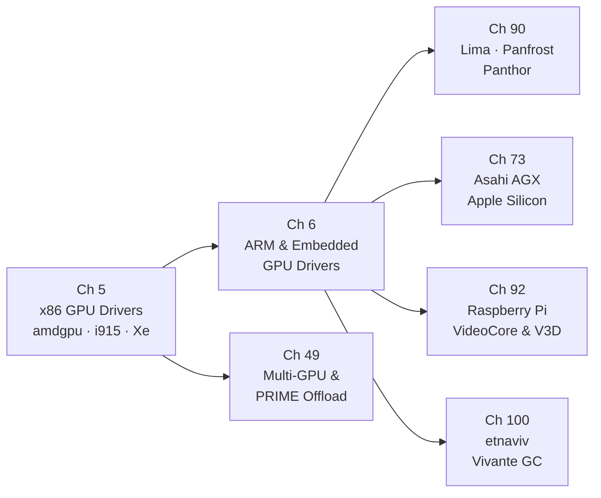

# Part II — GPU Drivers

Between the abstract contracts of the **DRM** subsystem (Part I) and the userspace Mesa drivers that translate **Vulkan**, **OpenGL ES**, and **OpenCL** calls into hardware operations (Part III), sits the kernel GPU driver layer: a collection of per-GPU-family modules that own every interaction with physical or virtual silicon. Each driver registers with **DRM** via `struct drm_driver`, implements the **GEM** memory management interface, drives a **DRM GPU scheduler** run-queue, and exposes a **KMS** display pipeline — yet each also embodies the peculiarities of its target silicon: the **IP block** decomposition of **amdgpu**, the firmware-mediated command queues of **Panthor** and **Asahi**, or the **CMA** allocations demanded by an **MMU**-less embedded GPU. This part surveys the full breadth of GPU driver families present in the mainline Linux kernel, from high-end x86 discrete graphics to the most constrained embedded and hobbyist platforms.

## Chapters in This Part

**Chapter 5 — x86 GPU Drivers: amdgpu, i915, and xe** is the anchor chapter of the part. It dissects the three driver families that serve the largest installed base: **amdgpu** with its **IP block** decomposition, **PSP**-authenticated firmware, **PM4** ring buffers, and **DC**/**DM** display stack; **i915** covering Intel Gen 4 through Meteor Lake with **GuC**-mediated submission and execbuffer2; and **Xe**, Intel's clean-slate replacement driver whose **VM_BIND**-only memory model enables persistent **GPU VA** bindings required by modern **Vulkan**. The chapter also covers the **drm_gpu_scheduler** infrastructure shared by all three families, **DRM format modifiers** and cross-driver **DMA-BUF** sharing, GPU firmware loading via `request_firmware`, runtime power management, GPU reset and timeout detection, **virtio-gpu** paravirtualisation, and **AMD HMM** unified memory on APU platforms.

**Chapter 6 — ARM & Embedded GPU Drivers** broadens the scope to the platform-driver world, where GPUs are discovered through **Device Tree** compatible strings rather than PCI enumeration, clocked and powered through shared SoC power domains, and address-translated by the **ARM SMMU** rather than an internal **GART**. It covers **Lima** (Mali-400/450 Utgard), **Panfrost** (Mali Midgard and Bifrost), **Panthor** and its **Tyr** Rust successor (Mali Valhall CSF), the **MSM** / **freedreno** driver for Qualcomm Adreno, and a concise treatment of **Asahi AGX** as it stands in the embedded driver survey. Cross-cutting topics — **DEVFREQ** DVFS, **IOMMU** integration, embedded display subsystem (**MIPI DSI**, **drm_panel_funcs**), and thermal throttling — are treated as first-class concerns rather than footnotes.

**Chapter 49 — Multi-GPU and PRIME Render Offload** addresses the scenario where two GPUs cooperate in a single system. Starting from the physical PCIe topology of hybrid-GPU laptops and the **vga_switcheroo** subsystem for muxed designs, it descends into the **PRIME** kernel infrastructure: **DRM_IOCTL_PRIME_HANDLE_TO_FD**, **DRM_IOCTL_PRIME_FD_TO_HANDLE**, `drm_gem_prime_export()`, `drm_gem_prime_import()`, and **dma_resv** fence sharing between distinct drivers. Mesa-level **DRI_PRIME** device selection, **VK_LAYER_MESA_device_select**, the **GLVND** dispatch model for NVIDIA offload, Reverse **PRIME** via **RandR 1.4**, and peer-to-peer DMA via **NVLink** and **AMD Infinity Fabric** complete the picture. Readers who work on hybrid-laptop power management or multi-GPU compute will find this chapter essential.

**Chapter 73 — Asahi Linux and the Apple Silicon AGX Driver** tells the story of the most technically ambitious open-source GPU driver project of the past decade: a **Rust**-language **DRM** driver for Apple Silicon **AGX** GPUs reverse-engineered without any hardware documentation. It covers the **TBDR** and **UMA** architecture of **AGX** (G13 through G14 generations, M1 through M4 SoCs), the reverse-engineering methodology built around the **m1n1** hypervisor and **IOKit** interception, the **`drm/asahi`** Rust driver with its **UAT** GPU MMU and **RTKit** firmware channels, the **UAPI** design (accepted into mainline before the driver itself — a DRM first), the **Mesa Asahi Gallium** driver's **NIR** backend, the **Honeykrisp** Vulkan driver forked from **NVK**, and the **DCP** display co-processor's firmware-mediated **KMS** interface. Readers who want to understand how a modern Rust kernel driver is structured, or how to approach undocumented hardware, will find this chapter uniquely instructive.

**Chapter 90 — Open ARM GPU Drivers: Lima, Panfrost, and Panthor** complements Chapter 6 with a far deeper focus on reverse-engineering methodology, ISA compiler design, and real-world deployment platforms. It traces the full Mali product line — **Utgard**, **Midgard**, **Bifrost**, **Valhall CSF**, and fifth-generation — explaining why each generation boundary required a new driver rather than an extension, and documenting the **Bifrost** compiler's ISA reconstruction, **NIR** lowering, clause scheduling, and the new **KRAID** Rust shader compiler for v9+ architectures. **PanVK** Vulkan and the **drm_gpuvm**-based **Panthor** VM model are covered in depth. The chapter closes with CI infrastructure (**LAVA**, **dEQP**, **deqp-runner**, **drm-shim**) and a contribution guide.

**Chapter 92 — The Raspberry Pi GPU Stack: VideoCore and V3D** covers the unique trajectory of Raspberry Pi graphics, from the closed-firmware **VideoCore IV** and its reverse-engineered **vc4** **DRM** driver (Pi 1–3) through the fully open **V3D** driver for **VideoCore VI**/**VII** (Pi 4/5), which bypasses the firmware blob entirely. The **QPU** shader compiler pipeline (**NIR → VIR → QPU binary**), the **HVS** compositor, **V4L2 M2M** hardware video decode with zero-copy **DMA-BUF** display integration, **libcamera** and the **Unicam** pipeline handler, and the **V3DV** Vulkan driver are all examined. Production deployment patterns (Wayfire, **labwc**, Chromium on Wayland, kiosk and signage setups) close the chapter with actionable guidance for embedded and education platform developers.

**Chapter 100 — etnaviv: The Vivante GPU Open Driver** covers the reverse-engineered driver for Vivante GC-series GPU IP cores embedded in **NXP i.MX6** and **i.MX8** SoCs, including the **Librem 5** smartphone (**GC7000Lite**). Starting from **Wladimir J. van der Laan**'s original **etna_viv** intercept-and-decode methodology and **rnndb rules-ng-ng** register documentation, the chapter explains the **HALTI** feature flag system, the **etnaviv DRM** kernel driver's command-stream ring management, the **Mesa Gallium** driver's **NIR**-to-Vivante-ISA shader compiler, compute shader support on **GC7000UL**, and debugging with **etnaviv**'s own register-level tooling.

## How the Chapters Interrelate

**Chapter 5** is the recommended entry point for all readers. It establishes the universal kernel-side contract — `struct drm_driver`, **GEM**, `drm_gpu_scheduler`, **KMS** atomic modeset, `dma_resv` fences, `request_firmware`, and runtime PM — using the three driver families (amdgpu, i915, Xe) that are most fully documented by their vendors. Readers who skip Chapter 5 will encounter unexplained references to these primitives throughout every other chapter in the part.

**Chapter 6** generalises the concepts from Chapter 5 to the ARM and embedded world. The **platform driver** probe model, **DEVFREQ** DVFS, **ARM SMMU** integration, and **MIPI DSI** display pipelines introduced in Chapter 6 are prerequisites for Chapters 90, 92, and 100, which assume familiarity with those cross-cutting topics. Chapter 6 also provides a concise survey of **Asahi AGX** that frames the more detailed Chapter 73.

**Chapter 49** depends on Chapter 5 for its treatment of **DMA-BUF**, **dma_resv**, and format modifiers; it ties together all the x86 driver families in the context of multi-GPU cooperation and can be read immediately after Chapter 5 without waiting for the embedded driver chapters.

**Chapters 73, 90, 92, and 100** are largely parallel and can be read in any order after Chapters 5 and 6. They share a common theme: every one of these drivers was written without access to a vendor hardware specification. **Lima**, **Panfrost**, **etnaviv**, **vc4**, and **Asahi** all reached the kernel through community reverse engineering. The shared data structures — `drm_gem_shmem_object` for **CMA**-backed allocations, `drm_gpuvm` for GPU VA management, the **io_pgtable** library for **LPAE**-format page tables, `drm_gpu_scheduler` for job dispatch — appear repeatedly across these drivers, making the part read as a coherent family rather than a collection of independent topics.

The structural distinction that runs through all seven chapters is the **submission model**: job-slot register writes (**Lima**, **Panfrost**, **etnaviv**, **vc4**) versus firmware ring buffers and doorbells (**Panthor**, **Asahi**, **v3d** with its **CSD** and **TFU** queues) versus the **GuC CT** path (**Xe**, **i915**). Recognising where each driver falls on this spectrum explains the capability and safety properties that flow upward into **Mesa** and **Vulkan**.

## Prerequisites and What Comes Next

Readers should arrive at this part with a working understanding of the **DRM** subsystem contracts introduced in Part I: the **KMS** object model, the **GEM** lifecycle, and the **DRM file descriptor** permission model. No GPU-specific knowledge is assumed. The kernel driver implementations here form the hardware substrate on which every subsequent part depends: Part III (Mesa and userspace drivers) translates the **GEM** and **render node** ioctls established here into **OpenGL**, **Vulkan**, and **OpenCL** APIs; Part V (display and compositing) builds directly on the **KMS** pipelines and **DMA-BUF** sharing described in Chapters 5, 6, and 92; and Part VIII (gaming and compatibility layers) relies on the multi-GPU **PRIME** offload and **VM_BIND** capabilities covered in Chapters 5 and 49.

---
