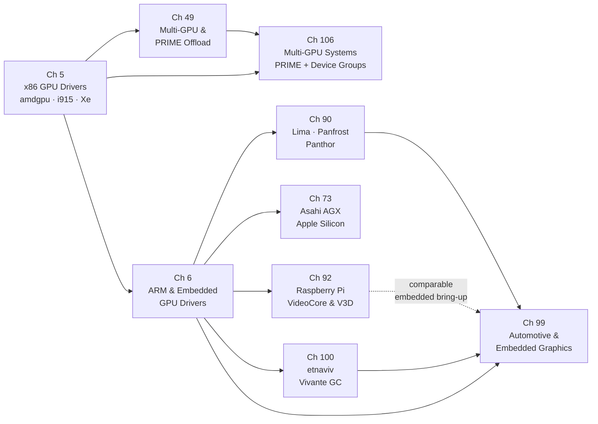

# Part II — GPU Drivers

Between the abstract contracts of the **DRM** subsystem (Part I) and the userspace Mesa drivers that translate **Vulkan**, **OpenGL ES**, and **OpenCL** calls into hardware operations (Parts IV–V), sits the kernel GPU driver layer: a collection of per-GPU-family modules that own every interaction with physical or virtual silicon. Each driver registers with **DRM** via `struct drm_driver`, implements the **GEM** memory management interface, drives a `drm_gpu_scheduler` run-queue, and exposes a **KMS** display pipeline — yet each also embodies the peculiarities of its target silicon: the **IP block** decomposition of **amdgpu**, the firmware-mediated command queues of **Panthor** and **Asahi**, or the **CMA** allocations demanded by an **MMU**-less embedded GPU. This part surveys the full breadth of GPU driver families present in the mainline Linux kernel, from high-end x86 discrete graphics to the most constrained embedded and hobbyist platforms.

## Key Concepts for This Part

GPU drivers share a surprisingly small set of architectural patterns. Recognising these patterns early lets you read any driver in this part — **amdgpu**, **Panfrost**, **etnaviv**, **V3D**, or **Asahi** — as a variation on common themes rather than an undifferentiated mass of hardware-specific code.

### IP Block Decomposition

Modern GPUs are not monolithic; they are assemblies of licensed silicon intellectual-property blocks. A single **amdgpu** device may contain a GFX/3D engine, one or more compute engines (**SDMA** copy engines, a **VCN** video encode/decode block, and a **DCN** display engine), each with its own firmware image, command queue, interrupt handler, and power-gating domain. The driver models this directly: `struct amdgpu_device` holds an array of `struct amdgpu_ip_block` entries, each representing one functional block and implementing `ip_block_type`, `is_in_reset`, `hw_init`, and `hw_fini` callbacks. Firmware for each block is loaded independently via `request_firmware()` and handed to the appropriate block's `hw_init` path. [Source — amdgpu IP block definitions](https://cgit.freedesktop.org/drm/drm-tip/tree/drivers/gpu/drm/amd/amdgpu/amdgpu_device.c)

Intel's **Xe** driver follows an equivalent decomposition: the `xe_gt` (Graphics Tile) and `xe_tile` objects encapsulate per-tile engine sets, and individual engines are represented as `xe_engine` instances with independent scheduling queues.

### Command Queues and Ring Buffers

The canonical model for submitting work to a GPU is a **ring buffer** — a circular FIFO in pinned system or VRAM memory. The CPU writes command packets into the ring and advances a write pointer (**wptr**). The GPU reads from a read pointer (**rptr**) and signals completion via interrupt or doorbell when it catches up. The CPU notifies the GPU that new work is available by writing to a **doorbell** register or memory location mapped into GPU MMIO space.

**AMD PM4**: AMD GPUs consume **PM4** (Packet Manager 4) command packets. A PM4 packet header encodes a packet type (0–3), an opcode, and a word count. Indirect buffer packets (`INDIRECT_BUFFER`) chain to sub-rings; `WRITE_DATA` packets update GPU registers or memory; `RELEASE_MEM` emits a fence value when a pipeline stage drains. The driver builds these into `struct amdgpu_ring`, calling `amdgpu_ring_write()` for individual DWORDs before closing with `amdgpu_ring_commit()`, which updates `wptr` and kicks the doorbell. [Source — amdgpu ring helpers](https://cgit.freedesktop.org/drm/drm-tip/tree/drivers/gpu/drm/amd/amdgpu/amdgpu_ring.h)

**Intel execlist / GuC CT**: Intel's legacy **i915** driver used *execlist* (ELSP) submission, writing batch-buffer addresses into per-engine ELSP registers. The modern path, mandatory in **Xe**, routes all submission through **GuC** (Graphics Microcontroller Unit) via a CT (Command Transport) ring. The host writes `H2G` (host-to-GuC) mailbox messages and receives `G2H` (GuC-to-host) completion notifications. This firmware-mediated path offloads scheduler policy from the kernel driver into the GuC firmware blob. [Source — GuC CT interface](https://cgit.freedesktop.org/drm/drm-tip/tree/drivers/gpu/drm/xe/xe_guc_ct.c)

**Job-slot vs ring+doorbell**: Older or simpler GPUs (Lima, Panfrost, etnaviv) write directly to hardware job-slot registers — one or a handful of registers that accept a command-stream pointer. There is no ring; the driver waits for completion and writes the next job. This simpler model maps well to low-end SoC GPUs but limits throughput and preemption depth.

### PSP Authentication and Firmware Loading

AMD GPUs since Vega include a **Platform Security Processor** (**PSP**) — a dedicated ARM Cortex-A5 running TrustZone firmware. Before the GFX, compute, or VCN blocks can accept commands, their firmware images must be authenticated by the PSP, which verifies RSA signatures against AMD's root key. The driver submits a firmware blob to the PSP via the PSP ring (`struct psp_ring`), receives an authenticated binary, and only then initialises the dependent IP block. [Source — PSP firmware authentication](https://cgit.freedesktop.org/drm/drm-tip/tree/drivers/gpu/drm/amd/amdgpu/amdgpu_psp.c)

Intel's **Integrated Platform Protection Unit** (**IPPU**) and the **NPU** firmware auth path follow a similar model, with firmware signing enforced by platform security features introduced on Meteor Lake and Lunar Lake.

### GPU Virtual Memory: VA Spaces, GART, and VM_BIND

Every GPU that executes shader code needs a **GPU Virtual Address** (**GPU VA**) space — an MMU-like translation table that maps GPU virtual addresses to physical memory pages. The mechanism varies by hardware era and vendor:

**GART** (Graphics Address Relocation Table): the legacy approach used since AGP and early PCIe cards. A hardware aperture (typically 256 MB–1 GB) maps a contiguous GPU VA range to physical pages via a hardware table. The driver pins pages and writes entries; no per-process isolation exists. `amdgpu`'s TTM layer still references the GART aperture for BO placement in the `GTT` (Graphics Translation Table) memory domain.

**Per-process GPU VM**: modern discrete GPUs support multiple concurrent GPU VA spaces, one per GPU context (analogous to a CPU process). `amdgpu` implements these as `struct amdgpu_vm`, backed by multi-level page tables (AMD Vega uses four-level tables). Creating, updating, and tearing down page table entries is a GPU operation — page table updates are issued as PM4 commands, not CPU writes.

**VM_BIND**: the Vulkan programming model requires *persistent mappings* — the application binds a buffer object to a GPU VA range at `vkBindBufferMemory2` time and that mapping remains valid for the buffer's lifetime, across multiple command buffer submissions. The Linux kernel exposes this as `DRM_IOCTL_AMDGPU_VM_BIND` (amdgpu) and the analogous **Xe** `DRM_XE_VM_BIND` ioctl. The `drm_gpuvm` library (introduced in Linux 6.7) provides driver-agnostic data structures for tracking GPU VA interval trees and generating delta operations when bindings change. [Source — drm_gpuvm](https://cgit.freedesktop.org/drm/drm-tip/tree/drivers/gpu/drm/drm_gpuvm.c)

### AMD Display Core (DC) and Display Manager (DM)

**amdgpu** splits display responsibilities into two subsystems. The **Display Core** (**DC**) is a hardware-abstraction layer written independently of DRM, covering the full DCN (Display Core Next) pipeline: planes, MPC (Multi-Plane Combiner), OPP (Output Pixel Processing), OTG (Output Timing Generator), and link encoder programming. DC is intentionally display-hardware-agnostic and is shared with AMD's Windows driver. The **Display Manager** (**DM**) layer (`amdgpu_dm_*` functions) bridges DC to the Linux DRM KMS model, translating `drm_atomic_state` commits into DC display context updates. [Source — amdgpu DM](https://cgit.freedesktop.org/drm/drm-tip/tree/drivers/gpu/drm/amd/display/amdgpu_dm/)

### CMA, IOMMU, and MMU-less Embedded GPUs

Embedded GPUs present a fundamentally different memory management problem. PCIe discrete GPUs scatter-gather DMA across non-contiguous physical pages using an **IOMMU** (Intel VT-d, AMD-Vi) that translates GPU DMA addresses at the hardware level. Embedded SoC GPUs often lack this infrastructure entirely, requiring physically contiguous memory allocations that the GPU's internal address generator can access without translation.

The Linux **Contiguous Memory Allocator** (**CMA**) satisfies this requirement: large contiguous physical regions are reserved at boot time and handed out via `dma_alloc_coherent()` to drivers that register CMA regions. **Lima**, **etnaviv**, **vc4**, and others use `drm_gem_cma_object` (now `drm_gem_dma_object` in recent kernels) as their GEM base type. [Source — drm_gem_dma_object](https://cgit.freedesktop.org/drm/drm-tip/tree/drivers/gpu/drm/drm_gem_dma_helper.c)

The **ARM SMMU** (**System Memory Management Unit**) fills the IOMMU role for SoCs that do support address translation. Drivers call `iommu_attach_device()` to associate the GPU with an `iommu_domain` and use `dma_map_sg()` for scatter-gather DMA. Panfrost, Panthor, MSM (freedreno), and the Asahi AGX driver all depend on the ARM SMMU for GPU address space isolation between processes. [Source — panfrost IOMMU path](https://cgit.freedesktop.org/drm/drm-tip/tree/drivers/gpu/drm/panfrost/panfrost_mmu.c)

### DEVFREQ and Thermal Throttling on ARM Drivers

Embedded GPU drivers implement **Dynamic Voltage and Frequency Scaling** (**DVFS**) through the Linux **DEVFREQ** framework. A driver registers with `devfreq_add_device()`, providing an `ops` structure with a `target()` callback that programs OPP (Operating Performance Point) tables via the `dev_pm_opp` API. DEVFREQ governors — `simple_ondemand`, `performance`, `powersave` — drive frequency selection based on GPU load metrics sampled through the driver's `get_dev_status()` callback. Panfrost, Panthor, etnaviv, and MSM all use this framework. [Source — Panfrost devfreq](https://cgit.freedesktop.org/drm/drm-tip/tree/drivers/gpu/drm/panfrost/panfrost_devfreq.c)

**Thermal throttling** integrates with this: drivers register a `thermal_cooling_device` via `devfreq_cooling_register()`, allowing the kernel thermal framework to call back into the driver to reduce maximum frequency when junction temperature exceeds trip points. On automotive and industrial platforms this path is safety-critical — the GPU must never violate the power budget programmed for the SoC's functional safety partition.

### GPU Virtualisation: virtio-gpu and Venus

Virtualised GPU access takes two forms. **VFIO passthrough** assigns the physical GPU PCI function to a VM using `vfio-pci`, providing bare-metal performance at the cost of exclusive access. **Paravirtualised GPUs** — implemented by the `virtio-gpu` DRM driver (`drivers/gpu/drm/virtio/`) — present a virtual GPU device over the virtio transport, mediated by a host-side `vhost-user-gpu` or QEMU backend. 3D acceleration uses the **Venus** protocol (Vulkan-over-virtio), where the guest Mesa driver serialises Vulkan commands into a virtio queue and the host decodes them against real GPU hardware. [Source — virtio-gpu driver](https://cgit.freedesktop.org/drm/drm-tip/tree/drivers/gpu/drm/virtio/)

### MIPI DSI and Embedded Display Subsystems

ARM SoC display pipelines connect to panels via **MIPI DSI** (Display Serial Interface) host controllers rather than the HDMI/DisplayPort encoders found on desktop hardware. The DRM **drm_panel** framework provides `prepare` / `enable` / `disable` / `unprepare` lifecycle callbacks that sequence panel power rails, reset lines, and DSI initialisation sequences. `drm_bridge` chains allow complex encoder topologies — SoC display engine → DSI-to-HDMI bridge → HDMI transmitter — to be described as linked lists of bridge objects, each implementing `drm_bridge_funcs`. [Source — drm_panel](https://cgit.freedesktop.org/drm/drm-tip/tree/drivers/gpu/drm/drm_panel.c)

## Chapters in This Part

**Chapter 5 — x86 GPU Drivers: amdgpu, i915, and Xe** is the anchor chapter of the part. It dissects the three driver families that serve the largest installed base: **amdgpu** with its **IP block** decomposition, **PSP**-authenticated firmware, **PM4** ring buffers, and **DC/DM** display stack; **i915** covering Intel Gen 4 through Meteor Lake with **GuC**-mediated submission and `execbuffer2`; and **Xe**, Intel's clean-slate replacement driver whose **VM_BIND**-only memory model enables persistent GPU VA bindings required by modern Vulkan. The chapter also covers **AMD HMM** unified memory on APU platforms and the **virtio-gpu** paravirtualisation model.

**Chapter 6 — ARM & Embedded GPU Drivers** broadens the scope to the platform-driver world, where GPUs are discovered through **Device Tree** compatible strings, clocked through SoC power domains, and address-translated by the **ARM SMMU**. It covers **Lima** (Mali-400/450 Utgard), **Panfrost** (Mali Midgard and Bifrost), **Panthor** and its **Tyr** Rust successor (Mali Valhall CSF), and the **MSM** / **freedreno** driver for Qualcomm Adreno. Cross-cutting topics — **DEVFREQ** DVFS, **SMMU** integration, embedded display subsystems (**MIPI DSI**, `drm_panel_funcs`), and thermal throttling — are treated as first-class concerns rather than footnotes.

**Chapter 49 — Multi-GPU and PRIME Render Offload** addresses the scenario where two GPUs cooperate in a single system, covering the **PRIME** kernel infrastructure (`DRM_IOCTL_PRIME_HANDLE_TO_FD`, `drm_gem_prime_export()`), Mesa-level **DRI_PRIME** device selection, `VK_LAYER_MESA_device_select`, Reverse PRIME via RandR 1.4, and peer-to-peer DMA via NVLink and AMD Infinity Fabric.

**Chapter 73 — Asahi Linux and the Apple Silicon AGX Driver** covers the **Rust**-language DRM driver for Apple Silicon AGX GPUs reverse-engineered without hardware documentation: the **TBDR** tiled architecture, the `drm/asahi` Rust driver with its **UAT** GPU MMU and **RTKit** firmware channels, the **DCP** display co-processor's firmware-mediated KMS interface, and the **Honeykrisp** Vulkan driver forked from NVK.

**Chapter 90 — Open ARM GPU Drivers: Lima, Panfrost, and Panthor** provides a deep focus on reverse-engineering methodology, ISA compiler design, and the **Panfrost** / **Panthor** Mali driver stack, including the **Bifrost** compiler's NIR lowering, clause scheduling, the **drm_gpuvm**-based Panthor VM model, and CI infrastructure using **LAVA** and **dEQP**.

**Chapter 92 — The Raspberry Pi GPU Stack: VideoCore and V3D** covers the reverse-engineered **vc4** driver (Pi 1–3) through the fully open **V3D** driver for VideoCore VI/VII (Pi 4/5), including the **QPU** shader compiler pipeline (**NIR → VIR → QPU binary**), the **HVS** compositor, **V4L2 M2M** hardware video decode with zero-copy DMA-BUF display integration, and the **V3DV** Vulkan driver.

**Chapter 100 — etnaviv: The Vivante GPU Open Driver** covers the reverse-engineered driver for Vivante GC-series GPU IP embedded in NXP i.MX6 and i.MX8 SoCs, including the **HALTI** feature flag system, the etnaviv DRM command-stream ring management, and the Mesa Gallium driver's NIR-to-Vivante-ISA shader compiler.

**Chapter 99 — Automotive and Embedded Linux Graphics** examines the Linux graphics stack under automotive and industrial constraints: **ISO 26262** functional-safety requirements, **ASIL-B** display controllers, **AGL** (Automotive Grade Linux), the **Qt Automotive Suite**, cabin-network protocols (**SOME/IP**, **DoIP**), and the Yocto/Buildroot build environments that tie SoC driver bring-up to production HMI deployments.

**Chapter 106 — Multi-GPU Systems: PRIME Offloading and Vulkan Device Groups** extends the PRIME story to explicit Vulkan multi-GPU: `VkPhysicalDeviceGroupProperties`, `VK_KHR_device_group`, `VkDeviceGroupSubmitInfo`, and the drm_gpuvm-based **VM_BIND** mechanism that makes persistent cross-GPU buffer sharing efficient.

## How the Chapters Interrelate

**Chapter 5** is the recommended entry point for all readers. It establishes the universal kernel-side contract — `struct drm_driver`, **GEM**, `drm_gpu_scheduler`, **KMS** atomic modeset, `dma_resv` fences, `request_firmware`, and runtime PM — using the three driver families that are most fully documented by their vendors.

**Chapter 6** generalises Chapter 5 concepts to the ARM and embedded world. The **platform driver** probe model, **DEVFREQ** DVFS, **ARM SMMU** integration, and **MIPI DSI** display pipelines introduced in Chapter 6 are prerequisites for Chapters 90, 92, and 100.

**Chapter 49** depends on Chapter 5 for its treatment of **DMA-BUF**, `dma_resv`, and format modifiers; it ties together the x86 driver families in the context of multi-GPU cooperation. **Chapter 106** extends this into the Vulkan device-group API.

**Chapters 73, 90, 92, and 100** are largely parallel and can be read in any order after Chapters 5 and 6. They share a common theme: every one of these drivers was written without access to a vendor hardware specification.

The structural distinction that runs through all chapters is the **submission model**: job-slot register writes (**Lima**, **Panfrost**, **etnaviv**, **vc4**) versus firmware ring buffers and doorbells (**Panthor**, **Asahi**, **V3D** CSD/TFU queues) versus the **GuC CT** path (**Xe**, **i915**). Recognising where each driver falls on this spectrum explains the capability and safety properties that flow upward into Mesa and Vulkan.

## Prerequisites and What Comes Next

Readers should arrive at this part with a working understanding of the **DRM** subsystem contracts introduced in Part I: the **KMS** object model, the **GEM** lifecycle, and the **DRM file descriptor** permission model. No GPU-specific hardware knowledge is assumed.

The kernel driver implementations here form the hardware substrate on which every subsequent part depends: Part IV (Mesa architecture) and Part V (Mesa GPU drivers) translate the **GEM** and **render node** ioctls established here into **OpenGL**, **Vulkan**, and **OpenCL** APIs via the **NIR** intermediate representation that connects all Mesa shader compilers to their respective hardware backends. **NVK** (NVIDIA's open Vulkan driver, Part III) and **NVK**'s kernel backend in **Nova** represent the NVIDIA-specific view of the same kernel contracts Part II establishes for AMD, Intel, and ARM. Part VI (display and compositing) builds directly on the **KMS** pipelines and **DMA-BUF** sharing described in Chapters 5, 6, and 92; and Part VIII (gaming and compatibility layers) relies on the multi-GPU **PRIME** offload and **VM_BIND** capabilities covered in Chapters 5, 49, and 106.

---
