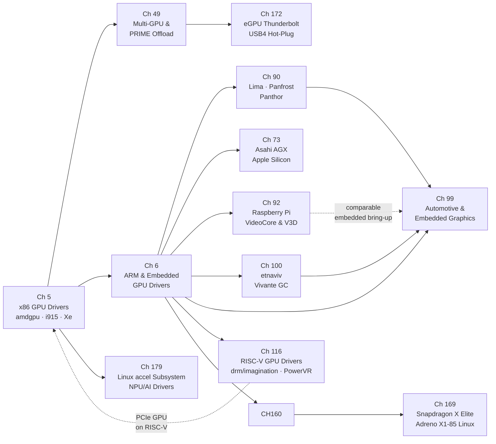

# Part II — GPU Drivers

Between the abstract contracts of the **DRM** subsystem (Part I) and the userspace Mesa drivers that translate **Vulkan**, **OpenGL ES**, and **OpenCL** calls into hardware operations (Parts IV–V), sits the kernel GPU driver layer: a collection of per-GPU-family modules that own every interaction with physical or virtual silicon. Each driver registers with **DRM** via `struct drm_driver`, implements the **GEM** memory management interface, drives a `drm_gpu_scheduler` run-queue, and exposes a **KMS** display pipeline — yet each also embodies the peculiarities of its target silicon: the **IP block** decomposition of **amdgpu**, the firmware-mediated command queues of **Panthor** and **Asahi**, or the **CMA** allocations demanded by an **MMU**-less embedded GPU. This part surveys the full breadth of GPU driver families present in the mainline Linux kernel, from high-end x86 discrete graphics to the most constrained embedded and hobbyist platforms.

## Key Concepts for This Part

GPU drivers share a surprisingly small set of architectural patterns. Recognising these patterns early lets you read any driver in this part — **amdgpu**, **Panfrost**, **etnaviv**, **V3D**, or **Asahi** — as a variation on common themes rather than an undifferentiated mass of hardware-specific code.

### IP Block Decomposition

Modern GPUs are not monolithic; they are assemblies of licensed silicon intellectual-property blocks. A single **amdgpu** device may contain a GFX/3D engine, one or more compute engines (**SDMA** copy engines, a **VCN** video encode/decode block, and a **DCN** display engine), each with its own firmware image, command queue, interrupt handler, and power-gating domain. The driver models this directly: `struct amdgpu_device` holds an array of `struct amdgpu_ip_block` entries, each representing one functional block and implementing `ip_block_type`, `is_in_reset`, `hw_init`, and `hw_fini` callbacks. Firmware for each block is loaded independently via `request_firmware()` and handed to the appropriate block's `hw_init` path. [Source — amdgpu IP block definitions](https://cgit.freedesktop.org/drm/drm-tip/tree/drivers/gpu/drm/amd/amdgpu/amdgpu_device.c)

Intel's **Xe** driver follows an equivalent decomposition: the `xe_gt` (Graphics Tile) and `xe_tile` objects encapsulate per-tile engine sets, and individual engines are represented as `xe_engine` instances with independent scheduling queues.

### Command Queues and Ring Buffers

The canonical model for submitting work to a GPU is a **ring buffer** — a circular FIFO in pinned system or VRAM memory. The CPU writes command packets into the ring and advances a write pointer (**wptr**). The GPU reads from a read pointer (**rptr**) and signals completion via interrupt or doorbell when it catches up. The CPU notifies the GPU that new work is available by writing to a **doorbell** register or memory location mapped into GPU MMIO space.

**AMD PM4**: AMD GPUs consume **PM4** (Packet Manager 4) command packets. A PM4 packet header encodes a packet type (0–3), an opcode, and a word count. Indirect buffer packets (`INDIRECT_BUFFER`) chain to sub-rings; `WRITE_DATA` packets update GPU registers or memory; `RELEASE_MEM` emits a fence value when a pipeline stage drains. The driver builds these into `struct amdgpu_ring`, calling `amdgpu_ring_write()` for individual DWORDs before closing with `amdgpu_ring_commit()`, which updates `wptr` and kicks the doorbell. [Source — amdgpu ring helpers](https://cgit.freedesktop.org/drm/drm-tip/tree/drivers/gpu/drm/amd/amdgpu/amdgpu_ring.h)

**Intel execlist / GuC CT**: Intel's legacy **i915** driver used *execlist* (ELSP) submission, writing batch-buffer addresses into per-engine ELSP registers. The modern path, mandatory in **Xe**, routes all submission through **GuC** (Graphics Microcontroller Unit) via a CT (Command Transport) ring. The host writes `H2G` (host-to-GuC) mailbox messages and receives `G2H` (GuC-to-host) completion notifications. This firmware-mediated path offloads scheduler policy from the kernel driver into the GuC firmware blob. [Source — GuC CT interface](https://cgit.freedesktop.org/drm/drm-tip/tree/drivers/gpu/drm/xe/xe_guc_ct.c)

**Job-slot vs ring+doorbell**: Older or simpler GPUs (Lima, Panfrost, etnaviv) write directly to hardware job-slot registers — one or a handful of registers that accept a command-stream pointer. There is no ring; the driver waits for completion and writes the next job. This simpler model maps well to low-end SoC GPUs but limits throughput and preemption depth.

### PSP Authentication and Firmware Loading

AMD GPUs since Vega include a **Platform Security Processor** (**PSP**) — a dedicated ARM Cortex-A5 running TrustZone firmware. Before the GFX, compute, or VCN blocks can accept commands, their firmware images must be authenticated by the PSP, which verifies RSA signatures against AMD's root key. The driver submits a firmware blob to the PSP via the PSP ring (`struct psp_ring`), receives an authenticated binary, and only then initialises the dependent IP block. [Source — PSP firmware authentication](https://cgit.freedesktop.org/drm/drm-tip/tree/drivers/gpu/drm/amd/amdgpu/amdgpu_psp.c)

Intel's **Integrated Platform Protection Unit** (**IPPU**) and the **NPU** firmware auth path follow a similar model, with firmware signing enforced by platform security features introduced on Meteor Lake and Lunar Lake.

### GPU Virtual Memory: VA Spaces, GART, and VM_BIND

Every GPU that executes shader code needs a **GPU Virtual Address** (**GPU VA**) space — an MMU-like translation table that maps GPU virtual addresses to physical memory pages. The mechanism varies by hardware era and vendor:

**GART** (Graphics Address Relocation Table): the legacy approach used since AGP and early PCIe cards. A hardware aperture (typically 256 MB–1 GB) maps a contiguous GPU VA range to physical pages via a hardware table. The driver pins pages and writes entries; no per-process isolation exists. `amdgpu`'s TTM layer still references the GART aperture for BO placement in the `GTT` (Graphics Translation Table) memory domain.

**Per-process GPU VM**: modern discrete GPUs support multiple concurrent GPU VA spaces, one per GPU context (analogous to a CPU process). `amdgpu` implements these as `struct amdgpu_vm`, backed by multi-level page tables (AMD Vega uses four-level tables). Creating, updating, and tearing down page table entries is a GPU operation — page table updates are issued as PM4 commands, not CPU writes.

**VM_BIND**: the Vulkan programming model requires *persistent mappings* — the application binds a buffer object to a GPU VA range at `vkBindBufferMemory2` time and that mapping remains valid for the buffer's lifetime, across multiple command buffer submissions. The Linux kernel exposes this as `DRM_IOCTL_AMDGPU_VM_BIND` (amdgpu) and the analogous **Xe** `DRM_XE_VM_BIND` ioctl. The `drm_gpuvm` library (introduced in Linux 6.7) provides driver-agnostic data structures for tracking GPU VA interval trees and generating delta operations when bindings change. [Source — drm_gpuvm](https://cgit.freedesktop.org/drm/drm-tip/tree/drivers/gpu/drm/drm_gpuvm.c)

### AMD Display Core (DC) and Display Manager (DM)

**amdgpu** splits display responsibilities into two subsystems. The **Display Core** (**DC**) is a hardware-abstraction layer written independently of DRM, covering the full DCN (Display Core Next) pipeline: planes, MPC (Multi-Plane Combiner), OPP (Output Pixel Processing), OTG (Output Timing Generator), and link encoder programming. DC is intentionally display-hardware-agnostic and is shared with AMD's Windows driver. The **Display Manager** (**DM**) layer (`amdgpu_dm_*` functions) bridges DC to the Linux DRM KMS model, translating `drm_atomic_state` commits into DC display context updates. [Source — amdgpu DM](https://cgit.freedesktop.org/drm/drm-tip/tree/drivers/gpu/drm/amd/display/amdgpu_dm/)

### CMA, IOMMU, and MMU-less Embedded GPUs

Embedded GPUs present a fundamentally different memory management problem. PCIe discrete GPUs scatter-gather DMA across non-contiguous physical pages using an **IOMMU** (Intel VT-d, AMD-Vi) that translates GPU DMA addresses at the hardware level. Embedded SoC GPUs often lack this infrastructure entirely, requiring physically contiguous memory allocations that the GPU's internal address generator can access without translation.

The Linux **Contiguous Memory Allocator** (**CMA**) satisfies this requirement: large contiguous physical regions are reserved at boot time and handed out via `dma_alloc_coherent()` to drivers that register CMA regions. **Lima**, **etnaviv**, **vc4**, and others use `drm_gem_cma_object` (now `drm_gem_dma_object` in recent kernels) as their GEM base type. [Source — drm_gem_dma_object](https://cgit.freedesktop.org/drm/drm-tip/tree/drivers/gpu/drm/drm_gem_dma_helper.c)

The **ARM SMMU** (**System Memory Management Unit**) fills the IOMMU role for SoCs that do support address translation. Drivers call `iommu_attach_device()` to associate the GPU with an `iommu_domain` and use `dma_map_sg()` for scatter-gather DMA. Panfrost, Panthor, MSM (freedreno), and the Asahi AGX driver all depend on the ARM SMMU for GPU address space isolation between processes. [Source — panfrost IOMMU path](https://cgit.freedesktop.org/drm/drm-tip/tree/drivers/gpu/drm/panfrost/panfrost_mmu.c)

### DEVFREQ and Thermal Throttling on ARM Drivers

Embedded GPU drivers implement **Dynamic Voltage and Frequency Scaling** (**DVFS**) through the Linux **DEVFREQ** framework. A driver registers with `devfreq_add_device()`, providing an `ops` structure with a `target()` callback that programs OPP (Operating Performance Point) tables via the `dev_pm_opp` API. DEVFREQ governors — `simple_ondemand`, `performance`, `powersave` — drive frequency selection based on GPU load metrics sampled through the driver's `get_dev_status()` callback. Panfrost, Panthor, etnaviv, and MSM all use this framework. [Source — Panfrost devfreq](https://cgit.freedesktop.org/drm/drm-tip/tree/drivers/gpu/drm/panfrost/panfrost_devfreq.c)

**Thermal throttling** integrates with this: drivers register a `thermal_cooling_device` via `devfreq_cooling_register()`, allowing the kernel thermal framework to call back into the driver to reduce maximum frequency when junction temperature exceeds trip points. On automotive and industrial platforms this path is safety-critical — the GPU must never violate the power budget programmed for the SoC's functional safety partition.

### GPU Virtualisation: virtio-gpu and Venus

Virtualised GPU access takes two forms. **VFIO passthrough** assigns the physical GPU PCI function to a VM using `vfio-pci`, providing bare-metal performance at the cost of exclusive access. **Paravirtualised GPUs** — implemented by the `virtio-gpu` DRM driver (`drivers/gpu/drm/virtio/`) — present a virtual GPU device over the virtio transport, mediated by a host-side `vhost-user-gpu` or QEMU backend. 3D acceleration uses the **Venus** protocol (Vulkan-over-virtio), where the guest Mesa driver serialises Vulkan commands into a virtio queue and the host decodes them against real GPU hardware. [Source — virtio-gpu driver](https://cgit.freedesktop.org/drm/drm-tip/tree/drivers/gpu/drm/virtio/)

### MIPI DSI and Embedded Display Subsystems

ARM SoC display pipelines connect to panels via **MIPI DSI** (Display Serial Interface) host controllers rather than the HDMI/DisplayPort encoders found on desktop hardware. The DRM **drm_panel** framework provides `prepare` / `enable` / `disable` / `unprepare` lifecycle callbacks that sequence panel power rails, reset lines, and DSI initialisation sequences. `drm_bridge` chains allow complex encoder topologies — SoC display engine → DSI-to-HDMI bridge → HDMI transmitter — to be described as linked lists of bridge objects, each implementing `drm_bridge_funcs`. [Source — drm_panel](https://cgit.freedesktop.org/drm/drm-tip/tree/drivers/gpu/drm/drm_panel.c)

## Chapters in This Part

**Chapter 5 — x86 GPU Drivers: amdgpu, i915, and Xe** is the anchor chapter of the part. It dissects the three driver families that serve the largest installed base: **amdgpu** with its **IP block** decomposition, **PSP**-authenticated firmware, **PM4** ring buffers, and **DC/DM** display stack; **i915** covering Intel Gen 4 through Meteor Lake with **GuC**-mediated submission and `execbuffer2`; and **Xe**, Intel's clean-slate replacement driver whose **VM_BIND**-only memory model enables persistent GPU VA bindings required by modern Vulkan. The chapter also covers **AMD HMM** unified memory on APU platforms and the **virtio-gpu** paravirtualisation model.

**Chapter 6 — ARM & Embedded GPU Drivers** broadens the scope to the platform-driver world, where GPUs are discovered through **Device Tree** compatible strings, clocked through SoC power domains, and address-translated by the **ARM SMMU**. It covers **Lima** (Mali-400/450 Utgard), **Panfrost** (Mali Midgard and Bifrost), **Panthor** and its **Tyr** Rust successor (Mali Valhall CSF), and the **MSM** / **freedreno** driver for Qualcomm Adreno. Cross-cutting topics — **DEVFREQ** DVFS, **SMMU** integration, embedded display subsystems (**MIPI DSI**, `drm_panel_funcs`), and thermal throttling — are treated as first-class concerns rather than footnotes.

**Chapter 49 — Multi-GPU and PRIME Render Offload** addresses the scenario where two GPUs cooperate in a single system, covering the **PRIME** kernel infrastructure (`DRM_IOCTL_PRIME_HANDLE_TO_FD`, `drm_gem_prime_export()`), Mesa-level **DRI_PRIME** device selection, `VK_LAYER_MESA_device_select`, Reverse PRIME via RandR 1.4, and peer-to-peer DMA via NVLink and AMD Infinity Fabric.

**Chapter 73 — Asahi Linux and the Apple Silicon AGX Driver** covers the **Rust**-language DRM driver for Apple Silicon AGX GPUs reverse-engineered without hardware documentation: the **TBDR** tiled architecture, the `drm/asahi` Rust driver with its **UAT** GPU MMU and **RTKit** firmware channels, the **DCP** display co-processor's firmware-mediated KMS interface, and the **Honeykrisp** Vulkan driver forked from NVK.

**Chapter 90 — Open ARM GPU Drivers: Lima, Panfrost, and Panthor** provides a deep focus on reverse-engineering methodology, ISA compiler design, and the **Panfrost** / **Panthor** Mali driver stack, including the **Bifrost** compiler's NIR lowering, clause scheduling, the **drm_gpuvm**-based Panthor VM model, and CI infrastructure using **LAVA** and **dEQP**.

**Chapter 92 — The Raspberry Pi GPU Stack: VideoCore and V3D** covers the reverse-engineered **vc4** driver (Pi 1–3) through the fully open **V3D** driver for VideoCore VI/VII (Pi 4/5), including the **QPU** shader compiler pipeline (**NIR → VIR → QPU binary**), the **HVS** compositor, **V4L2 M2M** hardware video decode with zero-copy DMA-BUF display integration, and the **V3DV** Vulkan driver.

**Chapter 100 — etnaviv: The Vivante GPU Open Driver** covers the reverse-engineered driver for Vivante GC-series GPU IP embedded in NXP i.MX6 and i.MX8 SoCs, including the **HALTI** feature flag system, the etnaviv DRM command-stream ring management, and the Mesa Gallium driver's NIR-to-Vivante-ISA shader compiler.

**Chapter 99 — Automotive and Embedded Linux Graphics** examines the Linux graphics stack under automotive and industrial constraints: **ISO 26262** functional-safety requirements, **ASIL-B** display controllers, **AGL** (Automotive Grade Linux), the **Qt Automotive Suite**, cabin-network protocols (**SOME/IP**, **DoIP**), and the Yocto/Buildroot build environments that tie SoC driver bring-up to production HMI deployments.

**Chapter 116 — RISC-V GPU Drivers and the Emerging RISC-V Graphics Stack** documents the nascent state of GPU driver support on RISC-V SoCs as of Linux 6.18. The chapter centres on the **`drm/imagination`** driver for Imagination Technologies B-Series GPUs, whose RISC-V enablement landed via T-HEAD TH1520 (Imagination BXM-4-64) — the first RISC-V SoC to reach upstream mainline with a 3D-capable GPU driver. It covers the GPU IP block architecture (TBDR tile engine, Unified Shader Cluster, META/RISC-V firmware processor), the TH1520 power-sequencing bring-up chain (`pwrseq-thead-gpu`, Cortex-E902 always-on coprocessor), and the Mesa **PowerVR Vulkan** driver (`src/imagination`). Additional topics include PCIe discrete GPU use on platforms such as Milk-V Pioneer (AMD Radeon amdgpu verified; amdkfd buildable since Linux 6.16), the RISC-V Vector Extension (RVV 1.0) and its impact on llvmpipe/lavapipe software rendering, and open hardware GPU research projects (Vortex GPGPU, RV64X ISA extension proposals) that point toward future native RISC-V GPU IP.

**Chapter 126 — Hybrid Graphics and Laptop Power Management** covers the software machinery that manages dual-GPU laptops — integrated + discrete configurations — including the **PRIME** render-offload path, **DRM_IOCTL_PRIME_HANDLE_TO_FD** cross-driver buffer sharing, **VK_LAYER_MESA_device_select** for Vulkan, `DRI_PRIME` environment variable selection, ACPI _DSM power rail control, and the **power-profiles-daemon** policies that gate discrete GPU wakeup on battery.

**Chapter 155 — USB Display Adapters: DisplayLink and EVDI** documents the kernel driver stack for USB-attached external displays, covering the **EVDI** (Extensible Virtual Display Interface) kernel module, the DisplayLink `udl` driver, how the DRM atomic commit path serialises pixel data over USB, CPU-side rendering fallbacks, and bandwidth constraints for 4K USB-C docking stations.

**Chapter 160 — freedreno and Turnip: Qualcomm Adreno Open Drivers** provides a dedicated deep dive into the open-source Qualcomm Adreno driver stack: the **freedreno** DRM kernel driver, the **Turnip** Mesa Vulkan driver (`src/freedreno/vulkan/`), the **ir3** compiler pipeline, the TBDR sysmem-vs-GMEM rendering path, CCU flush ordering, and the upstream Adreno GPU register and microcode documentation efforts.

**Chapter 169 — Snapdragon X Elite on Linux: Adreno X1-85, freedreno, and the Arm Laptop Era** examines the first Qualcomm SoC to enter the Linux laptop mainstream at volume. It covers the **SC8380** hardware architecture: the **Adreno X1-85** GPU (family ADRENO_7XX_GEN2, chip ID 0x43050c01), the Oryon CPU cores, and the Hexagon CDSP NPU. The chapter documents the `msm` DRM driver's X Elite support timeline (GPU functional ~Linux 6.14, IRIS video decoder in 6.15), Mesa Turnip Vulkan milestones (initial A7xx Gallium3D in 24.3, working X1-85 Vulkan + ray query in 25.0), firmware extraction requirements, display pipeline via `msm_dpu`, and the practical state of Linux laptop configurations on devices such as the Lenovo ThinkPad T14s Gen 6 and Dell XPS 13 9345.

**Chapter 179 — The Linux `accel` Subsystem: NPU and AI Accelerator Drivers** documents the dedicated kernel subsystem for non-display AI accelerators, merged into Linux 6.2 (February 2023). It explains why the `accel` subsystem was created alongside DRM rather than replacing it: `DRIVER_COMPUTE_ACCEL` flag, separate `/dev/accel/accel0` character device (major 261), and the shared GEM, DRM GPU scheduler, and DMA-BUF infrastructure. The chapter covers the five production drivers under `drivers/accel/`: **ivpu** (Intel VPU on Meteor/Lunar Lake), **habanalabs** (Gaudi/Greco at AWS), **qaic** (Qualcomm Cloud AI 100), **amdxdna** (AMD Phoenix/Hawk Point XDNA NPU), and **ethos-u** (ARM Cortex-M55 microcontroller NPU). It also covers the **drm_gpuvm** memory model without display, security via unprivileged `/dev/accel` access, and userspace runtime integration (OpenVINO, ONNX Runtime EP, ROCm HIP).

**Chapter 172 — eGPU on Linux: Thunderbolt, USB4, and PCIe Hot-Plug** covers external GPU attachment via Thunderbolt 3/4 and USB4 PCIe tunneling, the **bolt** daemon (`boltctl enroll`, `org.freedesktop.bolt` D-Bus) for Thunderbolt device authorization, the kernel `drivers/thunderbolt/` and `drivers/thunderbolt/usb4.c` subsystems, and how **amdgpu** implements PCIe hot-plug via `drm_dev_register` / `drm_dev_unplug`. The chapter covers Reverse PRIME (DMA-BUF blit from eGPU to iGPU scanout), NVIDIA eGPU limitations, and practical setup with `boltctl`, `lspci`, and `DRI_PRIME`.

## The Missing Driver: NVIDIA

Every chapter in this part covers a driver that ships in the mainline Linux kernel and is fully developed in the open: amdgpu, i915/Xe, Panfrost, Lima, etnaviv, V3D, freedreno, and the emerging RISC-V drivers. **NVIDIA is conspicuously absent from this list.** NVIDIA hardware is the most widely deployed discrete GPU on Linux desktops and laptops, yet its driver story is so architecturally distinct — and historically so fraught — that it fills an entire part of its own.

**Part III — The Nouveau Story** covers NVIDIA exclusively and in depth. The short version: for 17 years, NVIDIA withheld hardware documentation and shipped only a monolithic proprietary kernel module (`nvidia.ko`). The open Nouveau driver (`drivers/gpu/drm/nouveau/`) was built by reverse engineering BAR0 MMIO traces without a register spec, using the Envytools toolchain. It ran on every NVIDIA GPU since 2004 but could never reliably reclock to rated performance because doing so required signed PMU firmware. In 2022 NVIDIA released the `nvidia-open` kernel module (host-side source) and enabled `nouveau` to boot via the GSP-RM firmware blob, finally unlocking reclocking on Turing and later GPUs. Simultaneously, Faith Ekstrand began NVK — a clean-slate Vulkan driver in Mesa — which reached Vulkan 1.4 conformance on Mesa 25.x. The Nova driver (Rust, merged Linux 6.15) is the clean-sheet replacement for the C-based Nouveau.

Reading Part II first is still the right approach: the DRM contracts — GEM, drm_gpu_scheduler, KMS, dma_resv — that every AMD, Intel, and ARM driver implements are **identical** for NVIDIA's open drivers. Part III shows what happens when those same contracts are built on top of a closed GSP-RM firmware boundary instead of directly-accessible hardware registers.

## Comparing GPU Driver Architectures

The drivers surveyed in this part converge on the DRM subsystem contracts (Ch. 1–4) but diverge significantly in their submission model, memory management, firmware dependency, and design philosophy. Understanding the tradeoffs helps readers choose the right driver as a reference and anticipate where complexity lives.

### Submission Model

| Driver | Mechanism | Notes |
|--------|-----------|-------|
| **amdgpu** | PM4 ring buffers + doorbells; `DRM_IOCTL_AMDGPU_CS` | Multiple rings per engine (GFX, SDMA, compute, VCN). IB1/IB2 indirect buffer chaining for secondary command buffers. |
| **i915** (legacy) | Execlist (ELSP register writes); `DRM_IOCTL_I915_GEM_EXECBUFFER2` | Per-engine ELSP register pair; software scheduler in the kernel. Deprecated on Xe-class hardware. |
| **Xe** | GuC CT firmware-mediated; `DRM_XE_EXEC`; VM_BIND-only | All submission routed through H2G/G2H CT mailbox. GuC firmware owns scheduling policy. VM_BIND is the *only* memory model — no legacy relocation. |
| **Panfrost / Lima** | Job-slot register writes | GPU has a fixed number of job slots (typically 2). Driver writes job descriptor address into slot register and polls for completion. Simple, but limits concurrency and preemption depth. |
| **Panthor / Asahi** | Firmware-mediated CSF (Command Stream Frontend) | GPU fetches from a firmware-managed command stream. Preemption is firmware-handled. Closer to the GuC CT model than the job-slot model. |
| **freedreno / MSM** | Ring buffer + doorbells; `MSM_SUBMIT` | Per-ring-per-priority-queue on newer Adreno (A6xx+). GMEM tiling decisions made at submit time by the driver. |
| **Nouveau** | FIFO pushbuffer channels; GSP-RM routes to engine | Host writes pushbuffer descriptors to `DRM_IOCTL_NOUVEAU_EXEC`; GSP-RM firmware performs actual hardware FIFO management. |

**Key insight:** The shift from job-slot (Lima, etnaviv) through ring-buffer (amdgpu, i915) to firmware-mediated (Xe/GuC, Asahi, Panthor) reflects increasing GPU complexity and the corresponding desire to move preemption and scheduling policy out of the kernel and into firmware where it can be updated without kernel changes. The tradeoff is opacity: a firmware-mediated driver is harder to debug because the scheduling decisions are hidden inside a firmware blob.

### Memory Management

| Driver | Kernel allocator | GPU VA management | Highlights |
|--------|-----------------|-------------------|------------|
| **amdgpu** | TTM (with GEM wrapper) | Per-process `amdgpu_vm`; multi-level page tables (4-level on Vega+); `DRM_IOCTL_AMDGPU_VM_BIND` | Three heaps: VRAM (GPU-local), GTT (system RAM in GPU VA), BAR (CPU-writable VRAM window). PSP authenticates each firmware blob before the engine can accept commands. |
| **Xe** | GEM + drm_gpuvm | VM_BIND-only; `DRM_XE_VM_BIND`; no implicit relocation | LMEM (local memory on discrete) + system memory. `drm_gpuvm` library manages GPU VA interval tree. |
| **i915** | GEM + TTM (Xe-HP+) | Relocation-based historically; VM_BIND on newer APIs | Moving toward Xe's model; older i915 uses `execbuffer2` relocations. |
| **Panfrost / Lima** | GEM + CMA (for non-IOMMU SoCs) | IOMMU via ARM SMMU; per-process address spaces | CMA (`drm_gem_dma_object`) for physically-contiguous allocation. SMMU provides per-process isolation on hardware that supports it. |
| **etnaviv** | GEM + CMA | Simple IOVA mapping; no per-process VM | Vivante hardware lacks per-process GPU VA isolation; all processes share the GPU address space. Security implications for multi-user embedded deployments. |
| **Nouveau** | TTM | `DRM_IOCTL_NOUVEAU_VM_BIND`; GSP-RM manages page tables | GSP-RM owns the actual hardware page-table updates; Nouveau tells it what to map via RPC. |

**Key insight:** Discrete GPUs (AMD, Intel, NVIDIA) maintain a separate VRAM heap backed by on-board GDDR/HBM. Embedded and SoC GPUs (Lima, Panfrost, etnaviv, freedreno, Asahi) work in unified system memory. This has profound implications for buffer allocation strategy: discrete drivers must explicitly migrate buffers between CPU-accessible and GPU-optimal memory domains; unified-memory drivers do not, but may still need physically contiguous allocations where the IOMMU is absent.

### Firmware Dependency and Trust Model

| Driver | Critical firmware | Source availability | Notes |
|--------|------------------|--------------------|-|
| **amdgpu** | GFX fw, SDMA fw, VCN fw, DCN fw; **PSP** (security processor) | Binary blobs, signed by AMD | PSP authenticates every other firmware blob. GFX cannot initialise until PSP approves. Blobs distributed under permissive licence from `linux-firmware`. |
| **Xe / i915** | **GuC** (graphics microcontroller), HuC (video), GSC (media) | Binary blobs from Intel, open specs for firmware API | GuC implements the scheduler; its firmware API (CT protocol) is documented and used by the open Xe driver. |
| **Panthor / Asahi** | Mali CSF firmware; Apple RTKit firmware | Proprietary blobs, loaded at boot | Extracted from vendor OS images. No specification published. Reverse-engineered driver communicates with firmware via message queues. |
| **Nouveau / Nova** | **GSP-RM** (Falcon/RISC-V firmware, closed) | Host-side RPC client is open (`nvidia-open`); firmware binary is proprietary | The single largest remaining opacity in the NVIDIA open story. Part III covers this in depth. |

**The fundamental tradeoff:** Firmware offloads complexity from the kernel driver (scheduling, power management, security) but creates a trust boundary — bugs and limitations in the firmware blob are outside the open-source community's control. AMD's PSP is the most extreme example: no GPU command can execute before PSP signs off, meaning a PSP firmware bug can brick a GPU. NVIDIA's GSP-RM is architecturally similar but affects all operations, not just boot-time authentication. Intel's GuC is the most transparent of the three, with its CT protocol publicly documented.

### Pros and Cons by Driver Family

**amdgpu (AMD Radeon)**
- ✓ Full hardware documentation provided to the community; RADV/radeonsi written with vendor support
- ✓ Mature, feature-complete: hardware ray tracing, mesh shaders, VRR, hardware video encode/decode
- ✓ Excellent open Vulkan driver (RADV) with ACO compiler; competitive with proprietary performance
- ✗ Complex codebase: IP block decomposition, 12+ firmware images, DC/DM display stack is large and AMD-Windows-derived
- ✗ PSP authentication chain means cold-boot latency and a trust dependency on AMD signing keys

**Intel i915 / Xe**
- ✓ Longest history of open-source development; documentation available since the i915 days
- ✓ Xe is a clean-slate design with VM_BIND-only memory model, well-suited to Vulkan
- ✓ GuC firmware policy is documented; CT protocol is open
- ✗ Complexity of supporting 15+ years of GPU generations (Gen 6 through Xe2) in one driver
- ✗ GuC firmware required for all submission on Xe; a GuC firmware bug blocks all GPU access

**ARM open drivers (Panfrost, Panthor, Lima, etnaviv, V3D)**
- ✓ Fully open, community-driven; excellent CI via IGT and dEQP
- ✓ Appropriate for constrained embedded platforms; no proprietary user requirement
- ✗ Reverse-engineered without hardware documentation; some features permanently missing or unstable
- ✗ Performance typically 20–40% below the vendor proprietary driver (Mali) due to missing optimisations

**Qualcomm Adreno (freedreno / Turnip)**
- ✓ Turnip (Mesa Vulkan) achieves near-parity with the proprietary Adreno driver on recent generations
- ✓ Qualcomm has provided some hardware documentation for newer GPU generations
- ✗ TBDR architecture (sysmem vs GMEM) adds complexity not found in IMR (Immediate Mode Rendering) GPUs
- ✗ Firmware still required and not fully documented

**NVIDIA (Nouveau / Nova / NVK)** — see Part III for the full account
- ✓ NVK achieves Vulkan 1.4 conformance on Mesa 25.x; near-native performance on Turing+
- ✓ Nova (Rust) provides a clean, safe kernel interface
- ✗ GSP-RM binary blob remains proprietary — the open stack cannot function without it
- ✗ Pre-Turing GPUs: limited by the historical lack of documentation for VBIOS P-state tables

## How the Chapters Interrelate

**Chapter 5** is the recommended entry point for all readers. It establishes the universal kernel-side contract — `struct drm_driver`, **GEM**, `drm_gpu_scheduler`, **KMS** atomic modeset, `dma_resv` fences, `request_firmware`, and runtime PM — using the three driver families that are most fully documented by their vendors.

**Chapter 6** generalises Chapter 5 concepts to the ARM and embedded world. The **platform driver** probe model, **DEVFREQ** DVFS, **ARM SMMU** integration, and **MIPI DSI** display pipelines introduced in Chapter 6 are prerequisites for Chapters 90, 92, 100, and 116. Chapter 116 additionally draws on Chapter 5's treatment of PCIe discrete GPU bring-up (amdgpu on RISC-V servers) for the Milk-V Pioneer use case.

**Chapter 49** depends on Chapter 5 for its treatment of **DMA-BUF**, `dma_resv`, and format modifiers; it ties together the x86 driver families in the context of multi-GPU cooperation.

**Chapters 73, 90, 92, and 100** are largely parallel and can be read in any order after Chapters 5 and 6. They share a common theme: every one of these drivers was written without access to a vendor hardware specification.

The structural distinction that runs through all chapters is the **submission model**: job-slot register writes (**Lima**, **Panfrost**, **etnaviv**, **vc4**) versus firmware ring buffers and doorbells (**Panthor**, **Asahi**, **V3D** CSD/TFU queues) versus the **GuC CT** path (**Xe**, **i915**). Recognising where each driver falls on this spectrum explains the capability and safety properties that flow upward into Mesa and Vulkan.

## Prerequisites and What Comes Next

Readers should arrive at this part with a working understanding of the **DRM** subsystem contracts introduced in Part I: the **KMS** object model, the **GEM** lifecycle, and the **DRM file descriptor** permission model. No GPU-specific hardware knowledge is assumed.

The kernel driver implementations here form the hardware substrate on which every subsequent part depends: Part IV (Mesa architecture) and Part V (Mesa GPU drivers) translate the **GEM** and **render node** ioctls established here into **OpenGL**, **Vulkan**, and **OpenCL** APIs via the **NIR** intermediate representation that connects all Mesa shader compilers to their respective hardware backends. **NVK** (NVIDIA's open Vulkan driver, Part III) and **NVK**'s kernel backend in **Nova** represent the NVIDIA-specific view of the same kernel contracts Part II establishes for AMD, Intel, and ARM. Part VI (display and compositing) builds directly on the **KMS** pipelines and **DMA-BUF** sharing described in Chapters 5, 6, and 92; and Part VIII (gaming and compatibility layers) relies on the multi-GPU **PRIME** offload and **VM_BIND** capabilities covered in Chapters 5 and 49.

---

## Part Roadmap Summary

*Synthesised from the Roadmap sections of this part's chapters.*

### Near-term (6–12 months)

- **Rust DRM drivers reaching production baselines.** Nova (Ch. 5) is hardening its Turing baseline on Linux 7.1 — GSP-RM command queue, large RPC, Falcon firmware parsing. The Tyr CSF driver (Ch. 6, Ch. 90) already runs GNOME, Weston, and 3D games at Panthor parity and is stabilising toward becoming the default Mali CSF path. The `drm/asahi` UAPI header is mainlined; the full Rust AGX driver body and the DCP display driver (Ch. 73) are the next major upstream reviews.
- **New discrete GPU generation enablement.** Intel Xe3 (Crescent Island / Nova Lake P) support is landing in the Linux 7.x cycle with VM_BIND DECOMPRESS and THP for device SVM (Ch. 5). AMD RDNA 4 (GFX 12.1, RX 9000) DCN 4.2 and MES 12 arrived in Linux 7.1 and are being power-tuned. Adreno Gen 8 (Snapdragon X2 Elite / X2-85) kernel support is targeting Linux 6.19, with Turnip Vulkan support merged for Mesa 26.0 (Ch. 160, Ch. 169).
- **Vulkan conformance milestones on open ARM and Qualcomm drivers.** PanVK is progressing from Vulkan 1.2 (Mali-G610) toward Vulkan 1.3/1.4 and the Khronos Roadmap 2022 profile (Ch. 6, Ch. 90). Turnip is tracking Vulkan 1.4 conformance and extending `VK_KHR_ray_query` to Adreno 830/A8xx (Ch. 160). V3DV on Raspberry Pi 5 (Ch. 92) is adding optional extensions post–Vulkan 1.3 conformance. KRAID — the new Rust-based Mali shader compiler — shipped behind a Meson flag in Mesa 26.2 (Ch. 90).
- **Embedded SoC bring-up and CI expansion.** Panthor adds support for Mali-G725 / Immortalis-G925 (Ch. 6). etnaviv gains PPU flop reset for the STM32MP25 / GC8000 platform and expands LAVA CI dEQP-GLES3 coverage (Ch. 100). RISC-V graphics moves forward with VeriSilicon DC8200 display driver review, BXE-4-32 upstreaming for StarFive JH7110, and Vulkan 1.2 conformance validation for additional PowerVR SKUs (Ch. 116).
- **NPU and AI accelerator driver proliferation.** Intel ivpu gains Panther Lake NPU 5 support (Linux 6.13 baseline hardening). NXP Neutron NPU (i.MX95) is under kernel review. AMD XDNA gets Strix Halo support and power metric exposure. Two additional unnamed accel drivers are expected in mainline by end of 2026 (Ch. 179).
- **Multi-GPU and eGPU infrastructure fixes.** GPU Direct RDMA via HMM device-private pages (RFC v5) is targeting a merge in the 6.20–7.0 window with P2P DMA for NICs to read GPU VRAM directly. NVIDIA DMA-BUF export for VFIO PCI devices landed in Linux 6.19. AMDGPU hot-device-unplug hardening is approaching merge readiness (Ch. 49, Ch. 172).

### Medium-term (1–3 years)

- **Rust becomes the default substrate for new DRM drivers.** Nova supersedes nouveau for Turing+ once Ampere and Ada Lovelace support mature (Ch. 5). Tyr is planned as the exclusive upstream path for future CSF Mali hardware beyond Immortalis-G9xx (Ch. 6, Ch. 90). The Rust DRM abstractions (`drm::gem::Object<T>`, `drm::sched::Job<T>`) established by Nova and `drm/asahi` are intended as the upstream-preferred layer for all new DRM drivers (Ch. 5).
- **`drm_gpuvm` unification and VM_BIND / SVM convergence.** The `drm_gpuvm` GPU VA interval-tree library (already central to Xe, Panthor, Tyr, and Asahi) is expected to be adopted by amdgpu and Nova, eliminating per-driver TTM VM reimplementations. Xe SR-IOV guest hardening will enable GPU context live migration for Kubernetes checkpoint-restore. Intel multi-device SVM (Project Battlematrix, targeting Linux 6.20/7.0) will extend unified virtual address spaces across Arc GPUs and ivpu AI accelerators (Ch. 5, Ch. 49, Ch. 179).
- **M3/M4 GPU acceleration and Honeykrisp Vulkan 1.4.** Reverse engineering of the G15 (M3) and G16 (M4) ISA — including hardware ray tracing, mesh shaders, and Dynamic Caching — is underway. Once the Rust DRM abstractions land upstream, the full `drm/asahi` driver body can merge; Honeykrisp then targets Vulkan 1.4 and Roadmap 2024 profile. FEX + Wine + DXVK/VKD3D-Proton gaming performance also improves in this window (Ch. 73).
- **Vulkan ray tracing, mesh shaders, and compute maturation on Adreno and Mali.** Turnip is extending `VK_KHR_ray_tracing_pipeline` and `VK_EXT_mesh_shader` to A7xx/A8xx; ir3 compiler scheduling optimisations target closing the gap with the proprietary Qualcomm driver. Hexagon CDSP NPU integration (`accel/qda`) depends on Qualcomm firmware disclosure decisions (Ch. 160, Ch. 169). PanVK is targeting the Khronos Roadmap 2024 profile, and 5th-gen Mali (v12–v14) full feature parity is ongoing (Ch. 90).
- **Embedded compute and ML expansion.** Rusticl OpenCL 3.0 on V3D (Raspberry Pi 4/5) is stabilising toward a default-enabled configuration (Ch. 92). Adreno compute (Rusticl / OpenCL on Snapdragon X Elite) and etnaviv NPU support for VIPNano-SI+ on i.MX8M Plus are active development goals (Ch. 6, Ch. 100, Ch. 169). The Linux `accel` subsystem is driving a common sysfs/debugfs telemetry schema and CDI standardisation for `/dev/accel/` in containerised GPU deployments (Ch. 179).
- **Hybrid and eGPU infrastructure modernisation.** `vga_switcheroo` replacement by a proper `drm_mux` abstraction and DRM device-link model is under informal discussion. PRIME implicit sync will be updated for Wayland explicit-sync (`linux-drm-syncobj-v1`). A unified sysfs power-control API across NVIDIA RTD3 and amdgpu runtime PM is a stated direction for `power-profiles-daemon` integration (Ch. 49, Ch. 126, Ch. 172).

### Long-term

- **Per-process GPU fault isolation and coherent CPU+GPU address spaces.** Hardware GPU page faults (RDNA 3+, Intel Xe) could enable true per-process address-space isolation without full-GPU resets, contingent on VM_BIND semantics across all major drivers. CXL 3.0 memory expanders and HMM evolution may eventually provide a flat, cache-coherent address space spanning iGPU, dGPU, and CPU memory, making explicit PRIME buffer copies optional on coherent systems (Ch. 5, Ch. 49).
- **Open-firmware and full-open-stack goals across constrained platforms.** The RISC-V community's long-horizon target is a RISC-V SoC with a fully open-source GPU firmware; the Vortex 3.0 ASIC tapeout on open PDKs is a 2–3 year step toward that goal (Ch. 116). Qualcomm's Hexagon CDSP open-firmware decision gates the full ML inference open stack on Snapdragon X (Ch. 169). The Raspberry Pi VideoCore VII boot blob remains a long-term open-source target following Allwinner/Rockchip precedents (Ch. 92). Wayland compositor eGPU hot-plug recovery — surviving mid-session GPU removal without application restart — requires new DRM core and compositor protocol work not yet designed (Ch. 172).
- **Safety-critical and automotive convergence.** ISO 26262 ASIL-B qualification of selected Linux DRM paths (via ELISA / Linux Foundation Safety Critical SIG) and Khronos formal safety profiles for Vulkan are multi-year standardisation efforts that would allow a single open-source Vulkan driver to serve both QM-rated IVI and safety-rated warning overlays. SDV consolidation onto a single high-compute SoC — running all cabin displays as isolated GPU contexts with hardware memory partitioning — is the end-state architecture that the AGL and automotive SoC roadmaps are converging toward (Ch. 99).
- **Cross-vendor NPU and GPU heterogeneous scheduling.** A kernel-level scheduler able to migrate or pipeline inference tasks across `/dev/dri/renderD*` and `/dev/accel/accelN` devices — and a unified accel memory manager abstracting device-local DRAM, host-pinned memory, and SVM — would complete the long-term vision of the `accel` subsystem as a peer to DRM rather than a dependent of it (Ch. 179).

---

**Chapter 196 — The GPU as Embedded Computer: Firmware-as-OS Architecture Across Vendors** closes Part II with a cross-cutting architectural synthesis. Modern GPUs are not pure hardware accelerators — they contain dedicated management processors running their own firmware operating systems, and the host kernel driver is increasingly an RPC or CTB client to the GPU's embedded OS rather than a direct hardware programmer. The chapter compares all major vendors on this axis: NVIDIA's GSP-RM (the most complete firmware-OS, where the full Resource Manager runs on a RISC-V processor on the GPU die); AMD's tiered model (PSP, SMU, DMCUB, MES, and VCN firmware alongside open register-programming for the graphics engine); Intel's firmware-assisted submission model (GuC schedules workloads, xe.ko/i915.ko still do hardware init); Qualcomm's minimal-firmware approach (freedreno programs registers directly, Zap only for secure mode); and ARM Mali's evolving CSF model (job scheduling moving into firmware on Valhall, changing how Panthor submits work). A vendor spectrum table, security trust-model comparison, and open-source driver feasibility analysis conclude the chapter with a strategic outlook on where the industry is heading.

---

*Copyright © 2026 jreuben11. Licensed under [CC BY 4.0](https://creativecommons.org/licenses/by/4.0/).*
