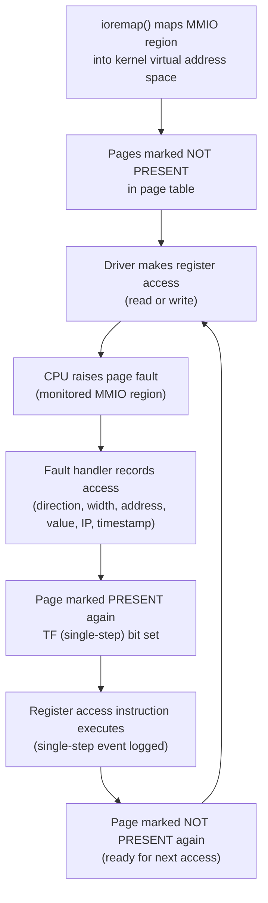
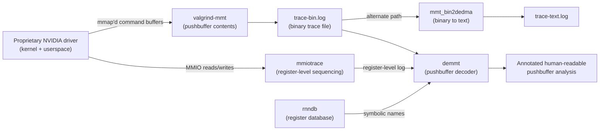
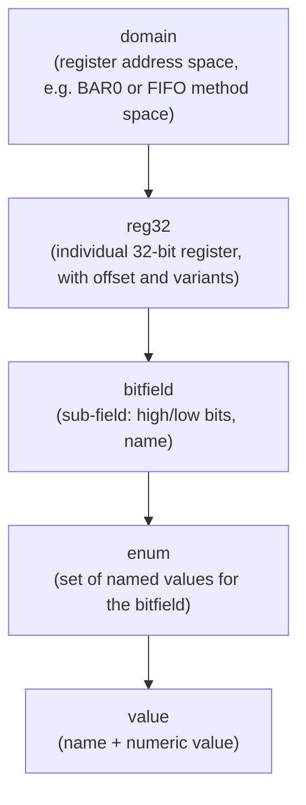
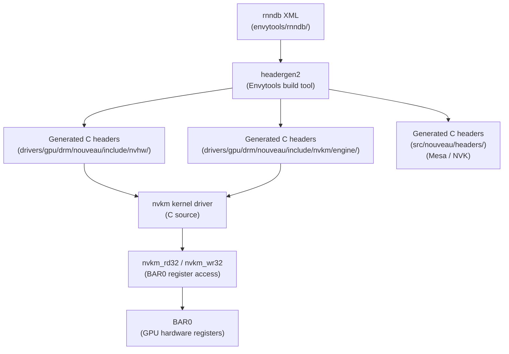

# Chapter 7: Reverse Engineering NVIDIA: History and Methodology

> **Part**: Part III — The Nouveau Story
> **Audience**: Systems developer — this chapter is primarily for those who want to understand how kernel driver development proceeds in the absence of hardware documentation, and how the Linux community built knowledge of NVIDIA hardware from scratch
> **Status**: First draft — 2026-06-06

## Table of Contents

- [Overview](#overview)
- [1. Why the Community Had to Reverse-Engineer NVIDIA](#1-why-the-community-had-to-reverse-engineer-nvidia)
- [2. Capturing Hardware Behaviour: mmiotrace](#2-capturing-hardware-behaviour-mmiotrace)
- [3. Envytools: The Register Database and Microcontroller Toolchain](#3-envytools-the-register-database-and-microcontroller-toolchain)
- [4. The HWDB: Organising Hardware Knowledge](#4-the-hwdb-organising-hardware-knowledge)
- [5. Community Structure and Key Contributors](#5-community-structure-and-key-contributors)
- [6. Legal and Ethical Dimensions](#6-legal-and-ethical-dimensions)
- [Integrations](#integrations)
- [References](#references)

---

## Overview

This chapter opens Part III of the book by laying the historical and methodological groundwork for everything that follows in the Nouveau story. Before you can meaningfully read the **nvkm** architecture chapter, understand the **GSP-RM** integration, or follow the development of **NVK**, you need to understand the epistemological problem at the centre of the whole enterprise: how does a developer write a hardware driver when the hardware vendor provides no documentation, no register reference manual, and no mechanism for asking questions?

The answer the Linux community built over twenty years is an ecosystem of tools and practices collectively known as reverse engineering. The term itself is loaded — it carries legal weight, ethical freight, and more than a little romance — but in practice the methodology is methodical and technical rather than dramatic. It is about watching what a known-good binary driver does to hardware registers, recording those observations systematically, cross-referencing them with observed GPU behaviour, and gradually accumulating a body of knowledge reliable enough to drive hardware you have never been given documentation for.

Section 1 traces the historical context: why the **NVIDIA** proprietary binary module **nvidia.ko** was intolerable in a mainline kernel distribution that expects full auditability, and what the community attempted before systematic reverse engineering became the explicit plan. It covers the early open-source attempts via the **XFree86** project's **nv** DDX (Device-Dependent X) driver, which provided 2D acceleration by inferring register interfaces from general knowledge of how accelerators worked, through Stéphane Marchesin's founding of the **Nouveau** project in 2005. It then establishes the significance and limits of the 2022 inflection point when **NVIDIA** published the **open-gpu-kernel-modules** source under a dual **MIT/GPL** licence, providing official register name headers without architectural documentation.

Section 2 dives into the primary technical instrument for capturing hardware behaviour: **mmiotrace**. It explains how **NVIDIA** GPUs expose their register space to the host CPU through the **PCI** **BAR** (Base Address Register) mechanism — **BAR0** as the primary control register space, **BAR1** as the framebuffer aperture — and how **mmiotrace** exploits the CPU's virtual memory hardware to intercept every read and write to those **MMIO** regions via a page-fault tracing mechanism developed by Pekka Paalanen and integrated into the mainline kernel in **Linux 2.6.31**. The section covers the **mmiotrace** log format (direction, width, address, value, instruction pointer, timestamp), activation through the **ftrace** infrastructure using **CONFIG_MMIOTRACE**, and the critical SMP limitation that requires taking all but one CPU offline during a trace. It then covers **valgrind-mmt** — a fork of the **Valgrind** dynamic instrumentation framework — which captures GPU pushbuffer contents by intercepting **mmap()** calls for command buffers, with the **demmt** tool consuming both **mmiotrace** and **valgrind-mmt** output to produce human-readable annotations.

Section 3 examines **Envytools** — the repository at `https://github.com/envytools/envytools` that is the knowledge base those observations accumulate into. Its heart is the **rnndb/** (rules-ng-ng) XML register database, which describes every characterised GPU register: its address within **BAR0**, the width and semantics of each bitfield, and the GPU families it applies to using NVIDIA's codename scheme (**NV50**, **NVC0**, **NVE0**, **GM200**, **GP100**, **GV100**, **TU100**, **GA100**). The **headergen2** tool generates C header files from the XML — producing **#define** constants used throughout the **nvkm** kernel driver — closing the loop from raw observation to symbolic driver code. The access macros **nvkm_rd32** and **nvkm_wr32**, defined in **drivers/gpu/drm/nouveau/include/nvkm/core/device.h**, wrap **ioread32_native()** and **iowrite32_native()** against the **ioremap()**'d **BAR0** base address. **Envytools** also contains **envydis** — a complete disassembler and assembler for the **Falcon** (FAst Logic CONtroller) microcontroller ISA and for GPU shader ISAs including **g80**, **gf100**, **gk110**, and **gm107** — and **envyas**, the complementary assembler. The **Falcon** processor runs multiple firmware instances per GPU: **PDAEMON**, **PGRAPH CTX**, **PMU**, and the Video Processor (**VP**). The **demmt** tool bridges raw binary traces from **valgrind-mmt** to human-readable pushbuffer analysis by decoding **NV50_3D** method-value pairs using the **rnndb** symbolically. Coverage in the **rnndb** is strongest for **NV50** through **Maxwell** generations; **Ampere** (**GA100**) and **Ada Lovelace** (**AD102**) coverage remains significantly incomplete.

Section 4 examines how that accumulated knowledge is systematised in the **HWDB** (Hardware Database). It covers the pipeline from **rnndb** XML to kernel driver constants via **headergen2**, producing generated headers under **drivers/gpu/drm/nouveau/include/nvhw/**, **drivers/gpu/drm/nouveau/include/nvkm/engine/**, and **src/nouveau/headers/** in the **Mesa** source tree for **NVK**. It explains the categories of knowledge beyond register names — timing constraints for operations such as **PLL** programming, engine reset sequences, and silicon errata tracked through stepping identifiers read from **NV_PMC_BOOT_0** — and examines the hardware tables in the **Mesa** Gallium-based nouveau classic driver under **src/gallium/drivers/nouveau/**, including the **nv50_ir/** shader compiler backend whose scheduling constraints and performance characteristics were entirely inferred from benchmarking. The section also covers the narrative documentation maintained at `https://envytools.readthedocs.io`, written in **reStructuredText** and built with **Sphinx**, which constitutes the closest equivalent to a hardware reference manual the Nouveau community has produced.

Section 5 covers community structure and key contributors across four phases: the founding phase (2005–2008) anchored by Marchesin, Xavier Chantry, and Pekka Paalanen establishing the **mmiotrace** methodology and early **KMS** (Kernel Mode Setting) integration; the Ben Skeggs era (2009–2023) in which Skeggs architected the **nvkm** refactor and drove GPU frequency scaling support; the 2012 Aalto University incident in which Linus Torvalds's public criticism prompted NVIDIA to begin piecemeal cooperation including signing firmware blobs for Kepler; and the current era (2020–present) anchored by Danilo Krummrich's memory management rewrite and Faith Ekstrand's **NVK** Vulkan driver, which achieved **Vulkan 1.3** conformance on **Turing**, **Ampere**, and **Ada** hardware and was enabled by default in **Mesa 24.0**.

Section 6 provides an honest treatment of the legal framework and ethical tensions. It explains why the classical "clean-room" doctrine — used by **Phoenix BIOS** and **Wine** — does not strictly apply to **Nouveau**, since the same developers who run traces also write driver code. It covers the US interoperability protection under **17 U.S.C. §1201(f)** of the **DMCA**, supported by Ninth Circuit precedents in *Sega v. Accolade* and *Sony v. Connectix*, and the equivalent EU protection under **Article 6** of **Directive 2009/24/EC** (the Computer Programs Directive). It addresses **NVIDIA**'s **EULA** prohibition on reverse engineering and why no legal action has been brought against the project. The section closes with the ethical question raised by **GSP-RM**: when **Nouveau** delegates hardware management to **NVIDIA**'s signed firmware blob rather than reverse-engineering the register interface directly, is the driver genuinely open source in any meaningful sense?

After reading this chapter you will understand the full capture-to-analysis pipeline well enough to run traces yourself, and you will understand how the symbolic register knowledge in the **Envytools** XML database becomes the C constants scattered throughout the kernel driver source.

---

## 1. Why the Community Had to Reverse-Engineer NVIDIA

To appreciate why reverse engineering became necessary, you have to appreciate what the NVIDIA proprietary driver looked like from the kernel's perspective in the early 2000s. NVIDIA shipped a kernel module — `nvidia.ko` — that sat outside the kernel's normal driver model. It did not use the kernel's DRM (Direct Rendering Manager) or KMS (Kernel Mode Setting) subsystems, it did not integrate with the vgaarb VGA arbitration layer, and it handled its own memory management through a private allocator that bypassed the DRM GEM infrastructure entirely. The driver worked, in the narrow sense that it accelerated OpenGL applications, but it worked by ignoring rather than integrating with the kernel's graphics abstractions.

The consequences were concrete and recurring. Suspend and resume was unreliable because the driver maintained hardware state that the kernel knew nothing about. IOMMU support was difficult because the driver mapped GPU memory in ways invisible to the IOMMU subsystem. DKMS — the Dynamic Kernel Module Support system used to rebuild out-of-tree kernel modules against new kernel versions — became a required piece of infrastructure just to keep the driver functional across kernel updates, and DKMS builds broke whenever NVIDIA fell behind the kernel's internal API changes. For distribution vendors, particularly Canonical and Red Hat, the question was not just whether the driver worked but whether it was safe to ship. A kernel module that cannot be audited, cannot be patched for security vulnerabilities, and breaks on every other kernel update is a maintenance liability of the first order.

NVIDIA's business rationale for keeping the driver closed was well understood if not sympathised with. The driver encapsulated years of ISV (Independent Software Vendor) certification work — the engineering that makes certified applications behave correctly on NVIDIA hardware is embedded in the driver, and exposing it would expose competitive implementation details. The driver also embodied NVIDIA's advantage over AMD and Intel in the workstation and professional markets, where certification against applications like Autodesk Maya or Pixar's RenderMan was a commercial differentiator. From NVIDIA's perspective, the binary driver was a product feature, not a delivery mechanism for a commodity service.

From the kernel community's perspective, however, a binary kernel module was and remains a problem. The Linux kernel is licensed under the GPL version 2, and while the exact legal status of binary kernel modules remains disputed, the kernel community's position — articulated most forcefully by Linus Torvalds himself — is that a kernel module that interacts with kernel-internal interfaces is a derived work of the kernel and ought to be subject to its license. Binary modules also violate the practical expectation that any kernel developer can understand and debug the entire kernel stack. When a GPU-related kernel panic occurs with the NVIDIA binary module loaded, the kernel community's ability to diagnose and fix it is effectively zero.

### The Early Attempts: XFree86, `nv`, and the Road to Nouveau

The first open-source NVIDIA support appeared long before any reverse engineering was required, because early NVIDIA hardware (NV1 through NV3) was simple enough that developers could infer register interfaces from general knowledge of how 2D accelerators worked. The XFree86 project's `nv` DDX (Device-Dependent X) driver provided 2D acceleration — blitter operations, hardware cursor support, mode setting — by reading the public PCI configuration space and making educated guesses at register layouts confirmed against observed hardware behaviour. This approach worked well enough for desktop 2D use and survived as the `xf86-video-nv` package for many years, but it fundamentally could not support 3D acceleration: the 3D engine's command interface was entirely undocumented and significantly more complex than anything that could be guessed.

The first serious attempt at open 3D support came from Stephane Marchesin, who in 2004 and 2005 began experimenting with the NV17 (GeForce4 MX) register interface. Marchesin's approach was empirical: he used the Linux kernel's ability to intercept memory-mapped I/O and observe what the proprietary driver was sending to the hardware. This work led directly to the founding of the Nouveau project in 2005, whose name — French for "new" — signalled its ambition to provide a full-featured replacement rather than the minimal `nv` driver. The founding developer roster included Marchesin, Xavier Chantry, and Pekka Paalanen, all of whom contributed to the core methodology that would define the project for the next decade.

The practical problem Nouveau faced from the beginning was the same problem every reverse-engineering effort faces: the knowledge gap is enormous, and it must be bridged systematically or not at all. A modern NVIDIA GPU has thousands of hardware registers, multiple programmable microcontroller engines, a deeply layered command submission protocol, and silicon errata that only manifest under specific workloads and timing conditions. Guessing any of these is not viable. The community needed a methodology for capturing, recording, and cross-referencing hardware behaviour — and it needed tools to support that methodology at scale.

### The 2022 Inflection Point

Before addressing those tools, it is worth establishing what changed in May 2022 when NVIDIA published the source code for its kernel module under a dual MIT/GPL license. The open-gpu-kernel-modules release was significant but bounded. It provided the source to the "Kernel RM" component — the code that runs in kernel space on the host CPU — but it did not provide documentation of the hardware register interface. The open module source code is, in many ways, harder to read than the register-level traces that Nouveau developers had been collecting for years: it is a large, complex codebase written for NVIDIA's own engineering purposes, not as a reference for external developers, and it uses NVIDIA's internal abstractions and naming conventions rather than any published standard. What it did provide, crucially, was header files defining register names and values — names that could be cross-referenced against the Envytools database and used in NVK (see Chapter 10).

The open module release did not make Nouveau's reverse-engineering methodology obsolete. It changed the source of some register names from observed inference to official header, but it did not provide the architectural documentation — timing constraints, engine sequencing requirements, silicon errata — that makes a driver reliable rather than merely functional. For the hardware generations covered in the open module (Turing and later), Nouveau could lean more heavily on official headers; for older hardware, the entirely reverse-engineered knowledge base remained the only resource. The methodology this chapter describes remains the foundation on which the entire Nouveau project was built, and understanding it is necessary for understanding every architectural decision in the chapters that follow.

---

## 2. Capturing Hardware Behaviour: mmiotrace

The central technique for learning what a closed-source driver sends to hardware is memory-mapped I/O tracing, or mmiotrace. To understand why mmiotrace works, you first need to understand how GPU register access is structured.

### MMIO, BARs, and the Register Interface

Modern GPUs expose their register space to the host CPU through the PCI Base Address Register (BAR) mechanism. NVIDIA GPUs expose multiple BARs: BAR0 is the primary control register space, typically 16 MB in size, through which the CPU reads and writes the thousands of hardware registers that control every aspect of the GPU's operation — from display engine configuration to graphics pipeline state to power management registers. BAR1 is the framebuffer aperture through which the CPU can directly access GPU video memory. When the NVIDIA driver (or any driver) calls `ioremap()` to map these BARs into kernel virtual address space, the resulting virtual addresses become the I/O interface to the hardware: writing a 32-bit value to `bar0_base + 0x400` sets a particular hardware register; reading the same address returns the register's current value.

From the reverse engineer's perspective, this is ideal: all driver-to-hardware communication over the register interface flows through a finite set of virtual address ranges that can be monitored. If you can intercept every read and write to those addresses, you have a complete record of everything the driver tells the hardware to do.

### The Page-Fault Tracing Mechanism

Mmiotrace implements this interception using the CPU's virtual memory hardware. The technique, developed by Pekka Paalanen and integrated into the mainline kernel in Linux 2.6.31, works as follows: at the moment `ioremap()` maps a MMIO region into virtual address space, mmiotrace marks those pages as not present in the page table. The next time any code accesses one of those pages — which will be the very next register access the driver makes — the CPU raises a page fault. The page fault handler, rather than treating this as an error, recognises that the fault occurred in a monitored MMIO region, records the access details (direction, width, address, value, instruction pointer, and timestamp), marks the page present again, and sets the CPU's single-step (trap flag, TF) bit so that the immediately following instruction — the one that will actually execute the register access — is also intercepted. After logging the single-step event, the page is once again marked not present so that the next access is caught by the same mechanism.

The result is a complete, ordered log of every read and write the CPU makes to the monitored MMIO region. The log entries record physical address, access direction, access width (8, 16, or 32 bits), the value written or read, the program counter at the time of access, and a timestamp. This is precisely the information needed to reconstruct what the driver is doing to hardware.



### Code Example: The mmiotrace Log Format

The mmiotrace infrastructure is implemented in `kernel/trace/trace_mmiotrace.c`. A raw trace log captures entries in a structured text format:

```c
/* Source: kernel/trace/trace_mmiotrace.c — mmio trace record format */

/*
 * Each line of mmiotrace output follows one of these formats:
 *
 * MAP   <timestamp> <map_id> <phys_addr> <virt_addr> <len> <flags>
 * UNMAP <timestamp> <map_id>
 * R     <width> <timestamp> <map_id> <phys_addr> <value> <pc> <pid>
 * W     <width> <timestamp> <map_id> <phys_addr> <value> <pc> <pid>
 * MARK  <timestamp> <message>
 *
 * Example entries from an NVIDIA BAR0 trace during mode set:
 *
 * MAP   1234567890 0 0xfd000000 0xffffc900fd000000 0x1000000 0x1
 * W     4 1234568001 0 0x00000200 0x80000001 0xffffffffa012c3ab 1234
 * W     4 1234568042 0 0x00000204 0x00000000 0xffffffffa012c3b2 1234
 * R     4 1234568103 0 0x00000100 0x000000a5 0xffffffffa012c3be 1234
 *
 * The physical address 0xfd000000 + offset 0x200 is a BAR0 register.
 * Cross-referencing offset 0x200 against the rnndb yields:
 *   NV_PMC_BOOT_0 — GPU identification register
 */
```

### Enabling mmiotrace

The tracer is enabled through the ftrace infrastructure. The kernel must be compiled with `CONFIG_MMIOTRACE=y` (which implies `CONFIG_FUNCTION_TRACER`). At runtime:

```bash
# Source: Documentation/trace/mmiotrace.rst — activation sequence

# Mount debugfs if not already mounted
mount -t debugfs debugfs /sys/kernel/debug

# Activate the mmiotrace tracer
echo mmiotrace > /sys/kernel/debug/tracing/current_tracer

# Start capturing to a pipe (do this before loading the driver)
cat /sys/kernel/debug/tracing/trace_pipe > nvidia_bar0_trace.txt &

# Load the proprietary driver, launch X, trigger the operation of interest
modprobe nvidia
# ... perform the operation ...

# Stop tracing
echo nop > /sys/kernel/debug/tracing/current_tracer
```

The critical practical constraint is that mmiotrace takes all but one CPU offline during activation on SMP systems to avoid races where another CPU accesses a page that has been marked not-present before the fault handler has restored it. This means traces are necessarily brief and targeted — you identify the specific operation you want to understand, enable the tracer, perform that operation, and disable the tracer. A trace of the entire driver initialisation sequence is impractical both because of the performance impact and because the resulting log would be too large to analyse manually.

### Pushbuffer Tracing with valgrind-mmt

Mmiotrace captures CPU-to-hardware register traffic, but on modern NVIDIA GPUs much of the interesting work is submitted through a pushbuffer: a region of memory that the CPU fills with a stream of method-value pairs (the GPU command stream), which the GPU processes asynchronously. The register-level trace only shows the CPU writing the pushbuffer address and size to the GPU's channel control registers; the pushbuffer contents themselves are in ordinary CPU-writable memory and require a different capture technique.

The solution the Nouveau community developed is valgrind-mmt: a fork of the Valgrind dynamic instrumentation framework, maintained in the envytools organisation, that intercepts `mmap()` system calls and records all accesses to memory-mapped regions. The GPU driver maps its command buffers into the process's address space; valgrind-mmt records every write to those mappings, capturing the exact pushbuffer contents as the userspace driver fills them in:

```bash
# Source: nouveau.freedesktop.org/Valgrind-mmt.html — valgrind-mmt capture workflow

# Run the application under valgrind-mmt to capture GPU command stream
valgrind --tool=mmt \
         --mmt-trace-nvidia-ioctls \
         --log-file=trace-bin.log \
         glxgears

# Decode the binary trace with demmt from envytools
demmt -l trace-bin.log

# Alternative: convert to text format first
mmt_bin2dedma < trace-bin.log > trace-text.log
```

The combination of mmiotrace (for register-level sequencing) and valgrind-mmt (for pushbuffer contents) provides a substantially complete picture of driver-hardware interaction. The tools in the Envytools repository — particularly `demmt` — are designed to consume traces from both sources and annotate them with symbolic names from the register database.



### Limitations and Evolution

Mmiotrace's page-fault mechanism imposes inherent limitations that shaped the Nouveau methodology. The tracer captures only CPU-initiated MMIO accesses; DMA transfers from the GPU to system memory are not captured, nor are GPU-to-GPU transactions. The time ordering of entries reflects the CPU's instruction stream, not any causal relationship with GPU-side operations. On systems with an active IOMMU, the old `/dev/mem`-based approach to reading DMA buffers has been impossible since the IOMMU was enabled by default on most distributions, which is why valgrind-mmt's userspace instrumentation approach became the standard.

---

## 3. Envytools: The Register Database and Microcontroller Toolchain

If mmiotrace is the instrument for capturing observations, Envytools is the library of knowledge those observations accumulate into. The Envytools repository at `https://github.com/envytools/envytools` is one of the most unusual open-source projects in the Linux graphics ecosystem: it is not a driver, not a library, and not an application in any conventional sense. It is a knowledge base — a systematically maintained description of NVIDIA GPU hardware, accumulated by volunteer developers over more than fifteen years without any official documentation to work from.

### The rnn Register Database

The heart of Envytools is the `rnndb/` directory tree, which implements what the project calls the "rules-ng-ng" XML register database format. The database describes every GPU register that the Nouveau community has successfully characterised: its address within BAR0, the width and semantics of each bitfield within the register, the named values those bitfields can take, and which GPU families the register applies to.

The XML schema is straightforward but expressive. A `<domain>` element defines a register address space (such as BAR0 or a FIFO method space). Within a domain, `<reg32>` elements describe individual 32-bit registers, and `<bitfield>` children within each register describe the sub-fields. Named values are given with `<enum>` elements:



```xml
<!-- Source: envytools/rnndb/nv50_pdisplay.xml — representative register entry -->

<domain name="NV50_PDISPLAY" bare="yes" prefix="NV50">

  <reg32 offset="0x00000610" name="PDISPLAY_CONTROL" variants="NV50-">
    <bitfield high="1" low="0" name="SYNC_MODE">
      <enum>
        <value name="FREE_RUNNING" value="0"/>
        <value name="VSYNC_LOCKED" value="1"/>
        <value name="HSYNC_LOCKED" value="2"/>
      </enum>
    </bitfield>
    <bitfield high="4" low="4" name="POWERDOWN_PENDING" type="boolean"/>
    <bitfield high="31" low="16" name="VBLANK_COUNT"/>
  </reg32>

  <reg32 offset="0x00690000" name="PDISPLAY_HEAD_SIZE" stride="0x1000"
         length="2" variants="NV50-">
    <!-- Per-head registers: offset 0x00690000 for head 0,
         0x00691000 for head 1 (stride = 0x1000) -->
    <bitfield high="15" low="0"  name="HACTIVE"/>
    <bitfield high="31" low="16" name="VACTIVE"/>
  </reg32>

</domain>
```

The `variants` attribute is critical: it records which GPU families a given register definition applies to, using NVIDIA's internal codename scheme (NV50 = Tesla G80, NVC0 = Fermi, NVE0 = Kepler, GM200 = Maxwell 2, GP100 = Pascal, GV100 = Volta, TU100 = Turing, GA100 = Ampere). A register that exists identically on all GPUs from NV50 onwards has `variants="NV50-"`; one that was removed in Fermi has `variants="NV50:NVC0"`. This versioning system allows a single XML file to describe the hardware evolution across a decade of GPU families without maintaining entirely separate databases per generation.

The rnndb covers the MMIO register space (BAR0), FIFO method spaces (the command protocol used to program the 3D and compute engines), memory structure layouts, and VBIOS table formats. As of 2024, coverage is strongest for the NV50 through Maxwell generations, where Nouveau had years of active development. Ampere and Ada Lovelace (GA100/AD100) coverage remains significantly incomplete — a gap that reflects both the complexity of newer hardware and the reduced developer bandwidth available for hardware bring-up without official documentation.

### headergen2: From XML to C Constants

The rnndb XML database would be of limited use if it could not be consumed by C source code. The `headergen2` tool generates C header files from the XML, producing `#define` constants that driver code uses to access named fields symbolically rather than by numeric offset:



```c
/* Source: drivers/gpu/drm/nouveau/include/nvhw/class/cl502d.h
 * Generated by headergen2 from rnndb/fifo/nv_object.xml
 * and rnndb/graph/nv50_2d.xml
 */

#define NV502D_SET_CLIP_ENABLE                                     0x00000184
#define NV502D_SET_CLIP_ENABLE_V                                   0:0
#define NV502D_SET_CLIP_ENABLE_V_FALSE                             0x00000000
#define NV502D_SET_CLIP_ENABLE_V_TRUE                              0x00000001

#define NV502D_SET_COLOR_KEY_FORMAT                                0x00000188
#define NV502D_SET_COLOR_KEY_FORMAT_V                              2:0
#define NV502D_SET_COLOR_KEY_FORMAT_V_A1R5G5B5                    0x00000000
#define NV502D_SET_COLOR_KEY_FORMAT_V_X1R5G5B5                    0x00000001
#define NV502D_SET_COLOR_KEY_FORMAT_V_A8R8G8B8                    0x00000002
#define NV502D_SET_COLOR_KEY_FORMAT_V_X8R8G8B8                    0x00000003

#define NV502D_RENDER_SOLID_PRIM_POINT                             0x00000480
```

These constants are then used throughout the nvkm kernel driver. The connection between a trace observation ("the driver writes 0x00000001 to offset 0x00000184 of the NV502D method space") and driver code ("set `NV502D_SET_CLIP_ENABLE_V_TRUE`") is explicit and auditable. This is the rnndb's fundamental contribution: it makes reverse-engineered knowledge reproducible and verifiable by connecting raw observations to symbolic names to running code.

### nvkm_rd32 and nvkm_wr32: Register Access in Practice

At runtime, the nouveau kernel driver accesses hardware registers through a pair of macros defined in `drivers/gpu/drm/nouveau/include/nvkm/core/device.h`:

```c
/* Source: drivers/gpu/drm/nouveau/include/nvkm/core/device.h
 * Runtime register access interface — connects rnndb constants to hardware
 */

/* device->pri is the ioremap'd virtual address of BAR0 */
#define nvkm_rd32(d, a)    ioread32_native((d)->pri + (a))
#define nvkm_wr32(d, a, v) iowrite32_native((v), (d)->pri + (a))

/* Usage in practice — writing a known rnndb-derived constant: */
/* From nvkm/subdev/bus/nv31.c: */
static void
nv31_bus_intr(struct nvkm_bus *bus)
{
    struct nvkm_device *device = bus->subdev.device;
    u32 stat = nvkm_rd32(device, 0x001100) & nvkm_rd32(device, 0x001140);

    if (stat & 0x00000008) {
        /* NV_PBUS_INTR_0_BUS_ERROR — symbolic name from rnndb */
        nvkm_error(&bus->subdev, "BUS_ERROR\n");
        nvkm_wr32(device, 0x001100, 0x00000008);
        stat &= ~0x00000008;
    }
}
```

The `pri` pointer is the `ioremap()`'d BAR0 base address, and every register access in the driver goes through these two macros. This uniformity was a deliberate design decision: it ensures that every register access can be traced (by intercepting the ioremap-based access) and that the symbolic names from rnndb flow through the codebase in a single, consistent form.

### envydis: The Microcontroller Disassembler

Envytools is not only a register database; it also contains a complete disassembler and assembler for the various instruction set architectures found on NVIDIA's programmable microcontrollers. The most important of these is the Falcon (FAst Logic CONtroller) processor family.

Falcon processors appear throughout the NVIDIA GPU design starting with the G98 (NV98) GPU. Every GPU from G98 onwards contains multiple Falcon instances running different firmware: PDAEMON (power management daemon), PGRAPH CTX (graphics context switching firmware), PMU (performance monitoring unit), and, on Maxwell and later, the Video Processor (VP). The Falcon is a 32-bit RISC processor with 16 general-purpose registers, a Harvard architecture with separate instruction and data memories, and a capability system for privileged operations. Understanding what firmware is running on each Falcon engine is essential for understanding GPU power management, context switching, and the reclocking problem described in Chapter 11.

The `envydis` tool disassembles binary firmware blobs for Falcon and many other NVIDIA microcontroller ISAs:

```bash
# Source: envytools/envydis — Falcon firmware disassembly
# Select machine type with -m; Falcon ISA used for G98+ microcontrollers

# Disassemble a Falcon firmware blob (e.g., extracted from VBIOS or proprietary driver)
envydis -m falcon -V falcon5 firmware_pdaemon.bin

# Example output fragment (illustrative, based on Falcon ISA):
#
# 0000: iowr I[$r2 + 0x00c], $r0   -- write to I/O port (Falcon MMIO)
# 0004: ld   $r3, D[$r1 + 0x010]   -- load from data memory
# 0008: add  $r4, $r3, $r0         -- arithmetic
# 000c: cmpu b32 $r4, 0x80         -- compare unsigned
# 0010: bra  e, #lbl_done          -- branch if equal
# 0014: xdld $r5, $r6              -- DMA transfer command
# ...
# lbl_done:
# 0020: ret                        -- return from subroutine
```

The `-m falcon` flag selects the Falcon ISA; the `-V` flag selects the ISA version (v0 through v6 across GPU generations, with v5 being Turing-era and v6 Ampere). The envydis tool also supports the GPU shader ISAs: `-m g80` for Tesla, `-m gf100` for Fermi, `-m gk110` for Kepler GK110, and `-m gm107` for Maxwell — ISAs that are used by the shader compiler portions of Nouveau and NVK.

The counterpart tool `envyas` assembles Falcon source code back to binary, enabling Nouveau developers to write custom microcontroller firmware where the proprietary firmware could not be extracted or used. This capability became particularly important for the reclocking work described in Chapter 11, where the clock reprogramming sequences required writing new Falcon firmware rather than merely understanding the existing firmware's behaviour.

### demmt: Decoding Pushbuffer Traces

The `demmt` tool bridges the gap between raw binary traces from valgrind-mmt and human-readable analysis. It consumes the binary log files produced by the valgrind-mmt tool and decodes the pushbuffer method-value pairs using the rnndb, producing an annotated output that identifies each GPU command by name and decodes its fields symbolically:

```text
# Source: envytools/demmt — example decoded pushbuffer output
# (run as: demmt -l trace-bin.log)

# Raw pushbuffer DWORDs → decoded method dispatch → field decode → symbolic names

ioctl pre NV01_DEVICE_0 (0x...)
  pushbuf: gpu_start=0x100000000 entries=4
    entry[0]: gpu_start=0x100001000 len=0x400
      pushbuf decode:
        [0x0000] mthd 0x0200 NV50_3D_CLEAR_VALUE_R = 0x00000000  (0.0f)
        [0x0004] mthd 0x0204 NV50_3D_CLEAR_VALUE_G = 0x00000000  (0.0f)
        [0x0008] mthd 0x0208 NV50_3D_CLEAR_VALUE_B = 0x00000000  (0.0f)
        [0x000c] mthd 0x020c NV50_3D_CLEAR_VALUE_A = 0x3f800000  (1.0f)
        [0x0010] mthd 0x1d88 NV50_3D_CLEAR_BUFFERS =
                    COLOR0=ENABLE DEPTH=ENABLE STENCIL=DISABLE
        [0x0014] mthd 0x0100 NV50_3D_NOP = 0x00000000
```

This output format is what Nouveau developers actually analysed when documenting hardware behaviour. The transition from "write 0x00000001 to offset 0x1d88 of the NV50_3D object" to "this is NV50_3D_CLEAR_BUFFERS with COLOR0 and DEPTH enabled" is the practical contribution of the rnndb: it transforms opaque hexadecimal values into engineering-meaningful descriptions.

### Coverage Gaps and Maintenance Burden

Maintaining the rnndb in the absence of official documentation is a continuous engineering effort. Every new GPU generation NVIDIA releases adds registers, modifies existing registers, introduces new microcontrollers, and changes the firmware protocol. Because Nouveau developers must infer these changes from traces of the proprietary driver rather than from a vendor changelog, new GPU support typically lags the hardware release by one to three years. As of 2024, the Ampere (GA100) register database is substantially incomplete, and Ada Lovelace (AD102) coverage barely exists in the rnndb, even though NVK supports those GPUs using the official headers from the open kernel module. This divergence — NVK using official headers, the kernel driver's nvkm using rnndb-derived headers — is an ongoing tension in the project.

---

## 4. The HWDB: Organising Hardware Knowledge

The term "HWDB" (Hardware Database) is used somewhat loosely in the Nouveau community to refer both to the Envytools rnndb XML database and to the broader accumulated knowledge about hardware behaviour that the project has built up over two decades. Understanding the relationship between these layers is important because driver code is written against the higher-level knowledge, not just the raw register definitions.

### From rnndb XML to Kernel Driver Constants

The rnndb-to-kernel-driver pipeline works as follows: the `headergen2` tool, invoked as part of the Envytools build, reads the rnndb XML files and generates C header files that are then included in the nouveau kernel driver source tree. These generated headers live under `drivers/gpu/drm/nouveau/include/nvhw/` and `drivers/gpu/drm/nouveau/include/nvkm/engine/` in the kernel tree, and under `src/nouveau/headers/` in the Mesa source tree for NVK.

The use of generated headers rather than hand-written constants is a deliberate design choice. It ensures that the symbolic names in driver code are always traceable to a specific rnndb XML entry, which in turn is traceable to the observations that gave rise to it. When a register definition is wrong — when a bitfield was mischaracterised and driver code misbehaves — the path from incorrect driver behaviour back to the XML entry that needs correction is explicit.

### Beyond Register Names: Timing Constraints and Errata

The rnndb captures register names and bitfield semantics, but hardware behaviour involves considerably more than the static register map. The HWDB also captures, more informally and sometimes only in code comments and commit messages, a category of knowledge that has no formal home: timing constraints, reset sequences, and silicon errata.

Timing constraints arise because hardware operations take time. Programming a PLL requires writing to multiple registers in sequence and then waiting for a lock signal to appear; the minimum wait time, and the correct polling register, must be reverse-engineered from observed driver behaviour. Engine reset sequences — the procedure for resetting a stalled GPU engine so that the driver can recover — are similarly time-dependent: write the reset bit, wait a microsecond, clear the reset bit, wait again, then check the engine status. Get the timing wrong and the engine will not recover, or will appear to recover but produce incorrect results.

Silicon errata are the hardest category. An erratum is a hardware bug present in some but not all stepping of a chip — a bug that NVIDIA's proprietary driver works around without documentation, and that Nouveau must discover empirically by finding workloads where its behaviour diverges from the proprietary driver's. The NV50 GPU had multiple stepping revisions (A0, A1, A2), each with different errata, and the Nouveau driver had to track which workarounds to apply based on the device's stepping identifier read from the `NV_PMC_BOOT_0` register. This knowledge lives partly in code (as conditional paths gated on a device revision field) and partly in commit messages and bug reports, but not in any formal structured database.

### The Mesa nouveau Classic Driver's Hardware Tables

The hardware knowledge layer extended into Mesa's Gallium-based nouveau classic driver (the OpenGL driver that predated NVK). The source tree under `src/gallium/drivers/nouveau/` in the Mesa repository contains hardware tables that encode GPU capabilities, shader instruction counts, warp sizes, and register file sizes for each supported GPU family. These tables — some of them hundreds of lines of GPU-specific constants — represent the application-level view of the same hardware knowledge that the rnndb represents at the register level. They were populated by a combination of reverse engineering, inspection of the proprietary driver's behaviour, and (where documentation existed) cross-referencing with NVIDIA's published GPU technical specifications.

The `nv50_ir/` subdirectory contains the shader compiler backend for the NV50 and NVC0 families, and it illustrates how deep the hardware knowledge requirement goes for compiler work. The compiler must know not only the instruction encoding (provided by envydis documentation) but also the performance characteristics — dual-issue rules, scheduling constraints, memory access latencies — none of which are documented and all of which were inferred from benchmarking and from inspection of the proprietary compiler's output.

### Community Documentation at envytools.readthedocs.io

Beyond the structured XML database and generated headers, the Envytools project maintains a parallel body of narrative documentation at `https://envytools.readthedocs.io`. This documentation — written in reStructuredText and built with Sphinx — describes GPU architecture in prose: the structure of the FIFO channel system, the Falcon processor architecture, the memory management unit, the display engine, and the command protocol. This documentation is written entirely from reverse-engineered knowledge, with no official NVIDIA input, and it represents the closest thing the Nouveau community has to a hardware reference manual.

The documentation is uneven in both depth and accuracy. Subsystems that saw intense Nouveau development effort — the NV50 through Fermi display engine, the Kepler PGRAPH interface — are documented in substantial detail. Subsystems that were difficult to reverse-engineer or that never became blockers for specific Nouveau features are thinner. The documentation's coverage gaps directly predict which features Nouveau has implemented poorly or not at all: the correspondence is close enough to be a reliable engineering signal.

---

## 5. Community Structure and Key Contributors

The Nouveau project has never had formal governance structures, but it has had a clear centre of gravity at each phase of its development. Understanding who drove each phase helps explain the architectural decisions visible in the code today.

### The Founding Phase, 2005–2008

The project's earliest years were defined by the need to establish basic correctness: could an open driver load firmware, initialise the hardware to a known state, and produce a display? Stephane Marchesin and Xavier Chantry drove much of the initial mmiotrace methodology and the first attempts at a 3D engine interface. Pekka Paalanen contributed the mmiotrace kernel infrastructure itself, which began as an out-of-tree patch before mainline inclusion in 2.6.31. This period also saw the first attempts at KMS (Kernel Mode Setting) integration — bringing Nouveau's mode setting code into the DRM framework rather than operating as a standalone display driver.

The XFree86/X.Org DDX infrastructure was the primary deployment target in this phase, and the driver existed primarily as a patch set against the X.Org tree rather than as anything close to a mainline kernel module. The goal of full kernel mainline integration was always present but repeatedly deferred as the technical debt of hardware bring-up accumulated.

### The Ben Skeggs Era, 2009–2023

Ben Skeggs (known by his handle `skeggsb`) became the dominant force in Nouveau around 2009 and remained so for over a decade, serving as the de-facto maintainer of both the kernel driver and the Mesa Gallium driver. Skeggs undertook the largest single architectural refactor in the project's history with the nvkm (NVIDIA Kernel Management) redesign, which restructured the kernel driver from a collection of per-GPU flat C files into a class hierarchy with proper abstraction boundaries. The nvkm redesign gave each hardware subsystem — the memory controller, the display engine, the graphics engine, the power management engine — a clean interface that new GPU families could implement without modifying the core.

Skeggs was also the primary driver of GPU frequency scaling support for the architectures where it was achievable, and the one who most consistently communicated the technical limits imposed by NVIDIA's firmware signing requirements on Maxwell and later hardware. His departure from Red Hat in 2023, which significantly reduced his upstream capacity, coincided with a broader transition in the project's direction toward GSP-RM integration for newer hardware.

### The 2012 NVIDIA Moment

No history of the Nouveau project would be complete without the 2012 Aalto University incident. At a Q&A session, an audience member asked Linus Torvalds about NVIDIA's refusal to provide documentation or support for Nouveau. Torvalds's response — "NVIDIA, fuck you" — became one of the most widely watched moments in open-source history. The comment was notable not for its language but for what followed: NVIDIA's response was not silence. Within months, NVIDIA had signed a firmware blob for nouveau's use on Kepler hardware (enabling video decoding), and had begun providing limited reference clock information that helped Nouveau match expected GPU frequencies. This was not full documentation, but it was the first acknowledgment that NVIDIA had any obligation to the open-source community, and it established a pattern of grudging, piecemeal cooperation that characterised the relationship until 2022.

### The GSP-RM and NVK Era, 2020–Present

The period from 2020 onward has seen the most dramatic shifts in the project's technical direction. The GSP (GPU System Processor) — an on-chip ARM Cortex-based management processor introduced in Turing hardware — gave NVIDIA a way to run its resource manager firmware on the GPU itself, separating the hardware management from the host kernel module. For Nouveau, the GSP-RM firmware became the path to supporting newer hardware: rather than reverse-engineering Turing and Ampere register interfaces, Nouveau could load NVIDIA's signed GSP-RM firmware blob and communicate with it over a relatively well-defined message-passing interface.

Danilo Krummrich led the work on Nouveau's memory management rewrite, presented at Linux Plumbers Conference 2023, which was necessary to support both the new kernel uAPI needed for NVK and the changed memory model required by GSP-RM. Faith Ekstrand (formerly known as Jason Ekstrand before transitioning) began NVK — the new Mesa Vulkan driver — in early 2022, writing it almost entirely from scratch using the official headers from NVIDIA's open kernel module release. NVK achieved Vulkan 1.3 conformance on Turing, Ampere, and Ada hardware, and Vulkan 1.4 conformance by late 2024. It was enabled by default in Mesa starting with version 24.0 in February 2024 and extended to Blackwell and Kepler GPU support in Mesa 25.2.

### How the Project Functions

Nouveau operates on a consensus model without formal voting or governance documents. Contributions flow through the nouveau mailing list (hosted on freedesktop.org) and are reviewed by whoever has relevant expertise. Ben Skeggs served as the de-facto arbiter for kernel driver submissions until 2023; Danilo Krummrich and others have taken on more of that role since. The Envytools repository has its own rhythm, with hardware documentation contributions reviewed by those who understand the relevant GPU generations. IRC (libera.chat, `#nouveau`) remains an active communication channel, though mailing list traffic is the canonical record.

---

## 6. Legal and Ethical Dimensions

Reverse engineering occupies a carefully bounded legal space in most jurisdictions. Understanding that space is important for anyone who contributes to or builds on reverse-engineered driver knowledge, and for understanding why the Nouveau community made certain structural choices about how work was divided and documented.

### The Clean-Room Doctrine and Its Limits

The classic legal protection for reverse engineering is the "clean-room" approach: one team reverse-engineers a system to produce a functional specification (without writing any code), and an entirely separate team, who have never seen the original binary, writes an implementation from that specification. The legal theory is that the implementation cannot be a direct copy of the original — it is derived only from the functional specification — and so it does not infringe any copyright in the original code.

Clean-room methodology in this pure form has been successfully applied in commercial settings: Compaq's Phoenix BIOS re-implementation and the Wine project's early Windows API implementation both used variants of this approach. But the Nouveau project has never claimed to follow clean-room methodology, and being honest about this is important. Nouveau developers who write the kernel driver also run the proprietary driver on their development machines to perform traces. The knowledge that flows from a trace observation to a driver implementation passes through the minds of the same people, not through a formal specification written by one team and read by another. This does not make the work illegal — the interoperability exemptions described below provide the more directly applicable legal basis — but it does mean that "clean-room reverse engineering" is not the correct description of what Nouveau developers do.

### US Legal Framework: DMCA Section 1201(f)

In the United States, the primary legal protection for interoperability-motivated reverse engineering is 17 U.S.C. §1201(f), the DMCA's interoperability exemption. This provision permits a person who has lawfully obtained a copy of a computer program to reverse-engineer it, or to develop or employ technological means to enable interoperability, if the information necessary to achieve interoperability was not previously readily available to the person and the sole purpose of the circumvention is to identify and analyse those elements necessary for interoperability. The exemption also permits circumvention solely for the purposes of enabling interoperability of an independently created computer program with other programs, provided the information acquired is not used for any other purpose.

The Nouveau use case fits this exemption well. The goal is interoperability: enabling the Linux kernel's DRM subsystem to control NVIDIA hardware, and enabling open-source applications to use that hardware through standard APIs. The information required — register offsets, bitfield semantics, firmware protocols — is not available through any other means. The knowledge extracted from traces is used only to write the interoperating driver, not to build competing proprietary products.

Two earlier Ninth Circuit cases established important precedents. In Sega v. Accolade (977 F.2d 1510, 1992), the court held that Accolade's disassembly of Sega's console code to understand the interface required for cartridge compatibility was fair use, even though it involved copying copyrighted code as an intermediate step. In Sony Computer Entertainment v. Connectix Corporation (203 F.3d 596, 2000), the court held that Connectix's reverse engineering of the PlayStation BIOS to produce a compatible emulator was fair use. Both cases establish the principle that intermediate copying of copyrighted material for the purpose of achieving interoperability can be legally protected, which is the essential premise of the mmiotrace and valgrind-mmt methodology.

### EU Legal Framework: Computer Programs Directive

In the European Union, the equivalent protection comes from Article 6 of Directive 2009/24/EC on the legal protection of computer programs (the Computer Programs Directive). Article 6 permits reverse engineering of the interfaces necessary for interoperability of an independently created computer program, provided the information required has not previously been made available, and the acts are performed only by persons authorised to use the program. The decompilation must be limited to the parts of the original program necessary for achieving interoperability, and the information obtained may not be used for purposes other than interoperability of the created program.

The EU provision maps closely onto the US §1201(f) framework. Its practical implication for Nouveau is that European developers contributing to the project have legal protection for their reverse-engineering activities under domestic law, not merely under the US framework.

### NVIDIA's EULA and Practical Risk

NVIDIA's end-user license agreement for its proprietary driver prohibits reverse engineering. This prohibition does not override the statutory interoperability exemptions in the DMCA or the EU Directive — a contract clause cannot waive rights granted by statute in either jurisdiction — but it does create a documentation concern. If a Nouveau developer agrees to the NVIDIA EULA to obtain the proprietary driver for tracing purposes, and then uses traces to write the open driver, NVIDIA could theoretically argue a contract breach even if not a copyright infringement.

In practice, NVIDIA has never brought a legal action against the Nouveau project. The relationship has been characterised by varying degrees of indifference, occasional cooperation, and periodic friction, but not litigation. This is likely because NVIDIA recognises that the legal risk runs both ways — the interoperability exemptions are robust, and challenging Nouveau in court would draw attention to the underlying question of whether NVIDIA is obligated to support open standards in its hardware.

### The GSP-RM Ethical Question

The most interesting ethical question in the current Nouveau project is not about reverse engineering at all, but about its partial supersession. When Nouveau loads NVIDIA's signed GSP-RM firmware blob to manage Turing and later hardware, it is no longer reverse-engineering the hardware interface — it is using NVIDIA's own code to manage the hardware, exposing a higher-level message-passing interface that is partially documented by the open kernel module source. This is philosophically distinct from the historical Nouveau methodology: rather than understanding what the hardware does and reimplementing that understanding, Nouveau is delegating hardware management to a vendor-supplied binary.

The community has largely accepted this tradeoff pragmatically. For newer hardware generations where the reverse-engineering effort would require years of work, GSP-RM provides a viable path to usable support at the cost of a runtime dependency on NVIDIA firmware. The philosophical tension — is a driver that depends on an opaque firmware blob genuinely "open source" in any meaningful sense? — is real but generally considered secondary to the practical goal of providing users with working hardware support. What NVIDIA gave with GSP-RM it can also take away: if NVIDIA chose to stop signing firmware for Linux use, Nouveau's support for recent hardware would break. This dependency is the cost of the pragmatic choice.

---

## Integrations

**Chapter 8 (nvkm Architecture)**: The rnndb-derived register headers — `cl502d.h`, `cl9097.h`, and their analogues for every supported GPU family — are the literal C constants used throughout nvkm. Every `nvkm_rd32` and `nvkm_wr32` call in the driver references an offset that, for hardware generations predating the open kernel module, originated in an rnndb XML entry that originated in an mmiotrace observation. The Falcon microcontroller ISA documented by `envydis` is the ISA that runs on PDAEMON, PGRAPH CTX, and PMU firmware described in Chapter 8. Understanding what those processors do requires being able to read envydis output.

**Chapter 9 (GSP-RM Integration)**: The firmware capture methodology described in Section 2 is the immediate predecessor to the GSP-RM support story. The Nouveau developers who began exploring GSP-RM in 2020 were the same developers who had spent years tracing the proprietary driver with mmiotrace and valgrind-mmt; they understood the hardware well enough to write a host-side driver that could communicate with the GSP firmware because they had already documented the hardware communication protocols through reverse engineering. Understanding what was reverse-engineered also helps explain what GSP-RM replaces (the register-level hardware management) and what it still hides (the internal resource allocation and firmware scheduling logic).

**Chapter 10 (NVK — The Mesa Vulkan Driver)**: NVK's shader ISA knowledge descends directly from the envydis shader ISA work. The `nv_isa` description of Volta, Turing, and Ampere SM instruction encodings in NVK's compiler backend draws on the same ISA documentation effort that produced the `gv100`, `tu102`, and `ga102` modes in envydis. Faith Ekstrand's ability to write NVK rapidly in 2022 depended on the decade of envydis ISA documentation that preceded it, even though NVK also benefited from official register name headers that the envytools effort had not yet produced for those generations.

**Chapter 11 (Display and Reclocking)**: Clock table reverse engineering — the central challenge of the reclocking work described in Chapter 11 — is the direct application of the mmiotrace and HWDB methodology at its most demanding. The clock tables that NVIDIA embeds in VBIOS are not documented; they must be extracted using the `nvbios` tool in Envytools and cross-referenced with mmiotrace observations of what the proprietary driver does when it transitions between performance levels. The reason reclocking remains unavailable on GM20x and later non-GSP hardware is precisely that the firmware signing requirement makes it impossible to write custom Falcon firmware — the Falcon programs that drive the clock transition sequences cannot be executed without NVIDIA's signature.

**Chapter 5 (x86 GPU Drivers — amdgpu and i915)**: The contrast with AMD and Intel driver development illuminates why this chapter exists and why it is unique in the book. AMD's open GPU documentation initiative provides register reference manuals for its GPU families; Intel's developer documentation for integrated and discrete graphics is comprehensive and current. Neither AMD's nor Intel's driver projects required the systematic reverse-engineering infrastructure that Nouveau built. The mmiotrace and Envytools methodology is distinctive to Nouveau precisely because NVIDIA was distinctive in its opacity — a policy that shaped every architectural decision in the driver stack for two decades.

**Chapter 31 (Conformance Testing and dEQP)**: The limits of reverse-engineered hardware documentation directly explain Nouveau/NVK's historical dEQP conformance gap relative to vendor-documented drivers. When a dEQP test failure is caused by an incorrect assumption about a hardware register's semantics — an assumption that would have been correct documentation rather than inference if documentation were available — the path to fixing it requires re-running traces, re-examining rnndb entries, and potentially discovering that the original observation was incomplete or misinterpreted. This feedback loop is longer and more uncertain than the equivalent loop for a documented hardware interface.

**Chapter 32 (Contributing to the Linux Graphics Stack)**: The Envytools contribution model is a distinct contribution path from kernel or Mesa work. Contributing new hardware knowledge to the rnndb — adding a register entry, correcting a bitfield width, documenting a new GPU family's register differences — requires running traces with mmiotrace or valgrind-mmt, comparing observations against existing rnndb entries, and submitting XML patches to the Envytools repository. This is different from either kernel driver contribution (which requires C programming against the DRM/KMS subsystem) or Mesa contribution (which requires knowledge of GLSL, NIR, or Vulkan). Readers who want to contribute to Nouveau's hardware knowledge base need this chapter as their entry point.

---

## References

1. [Envytools repository](https://github.com/envytools/envytools) — Primary repository for the rnndb register database, envydis disassembler/assembler, demmt pushbuffer decoder, and all related tooling
2. [Envytools documentation](https://envytools.readthedocs.io/en/latest/) — Community-maintained hardware documentation built from reverse-engineered knowledge; covers GPU architecture, Falcon processor, FIFO protocol, and memory management
3. [mmiotrace kernel documentation](https://www.kernel.org/doc/html/latest/trace/mmiotrace.html) — Official Linux kernel documentation for the mmiotrace tracer; includes activation procedure, log format description, and SMP limitations
4. [Nouveau project wiki](https://nouveau.freedesktop.org/) — Primary project documentation; GPU support matrix, reclocking status, GSP-RM status, and contributor resources
5. [Nouveau MmioTrace page](https://nouveau.freedesktop.org/MmioTrace.html) — Project-specific documentation for using mmiotrace with NVIDIA hardware; includes the demmio annotation workflow
6. [Nouveau Valgrind-mmt page](https://nouveau.freedesktop.org/Valgrind-mmt.html) — Documentation for the userspace pushbuffer capture workflow using valgrind-mmt and demmt
7. [LWN.net: "The state of the Nouveau driver" (2013)](https://lwn.net/Articles/557955/) — Contemporary analysis of Nouveau's state mid-project; covers reclocking challenges and community structure
8. [LWN.net: "NVIDIA opens up (a little)" (2022)](https://lwn.net/Articles/894476/) — Analysis of the 2022 open kernel module release and its implications for Nouveau
9. [Introducing NVK — Collabora blog (2022)](https://www.collabora.com/news-and-blog/news-and-events/introducing-nvk.html) — Faith Ekstrand's announcement of NVK; describes the relationship to official headers and to the new kernel uAPI
10. [NVIDIA open GPU kernel modules](https://github.com/nvidia/open-gpu-kernel-modules) — The 2022 open-source release of the NVIDIA kernel module; source of official register name headers used in NVK
11. [NVIDIA Technical Blog: Open-Source GPU Kernel Modules](https://developer.nvidia.com/blog/nvidia-releases-open-source-gpu-kernel-modules/) — NVIDIA's announcement of the open kernel module release with technical context
12. [Linus Torvalds 2012 Aalto University Q&A](https://www.youtube.com/watch?v=OF_5EKNX0Eg) — The "NVIDIA, fuck you" moment and its immediate context
13. [EU Computer Programs Directive 2009/24/EC Article 6](https://eur-lex.europa.eu/legal-content/EN/TXT/?uri=CELEX%3A32009L0024) — The EU interoperability exception for reverse engineering computer programs
14. [DMCA §1201(f) — 17 U.S.C. Chapter 12](https://www.copyright.gov/title17/92chap12.html) — The US interoperability exemption for circumventing technological protection measures
15. [Sega v. Accolade, 977 F.2d 1510 (9th Cir. 1992)](https://scholar.google.com/scholar_case?case=6786398137389219618) — Ninth Circuit precedent establishing fair use protection for reverse engineering for interoperability
16. [Sony v. Connectix, 203 F.3d 596 (9th Cir. 2000)](https://scholar.google.com/scholar_case?case=1607908661275849185) — Ninth Circuit precedent establishing fair use for reverse engineering to achieve interoperability via emulation
17. [envydis documentation](https://envytools.readthedocs.io/en/latest/envydis/) — Complete reference for envydis ISA support including Falcon, shader ISAs, and microcontroller modes
18. [Falcon microprocessor documentation](https://envytools.readthedocs.io/en/latest/hw/falcon/index.html) — Reverse-engineered documentation of the Falcon processor architecture and instruction set
19. [NVK Mesa documentation](https://docs.mesa3d.org/drivers/nvk.html) — Mesa's NVK driver documentation; current GPU support matrix and Vulkan conformance status
20. [drm/nouveau kernel documentation](https://docs.kernel.org/gpu/nouveau.html) — Kernel documentation for the nouveau DRM driver
21. [Nouveau kernel source tree](https://gitlab.freedesktop.org/drm/nouveau/kernel/) — Primary development tree for the nouveau kernel driver

---

*Copyright © 2026 jreuben11. Licensed under [CC BY 4.0](https://creativecommons.org/licenses/by/4.0/).*
