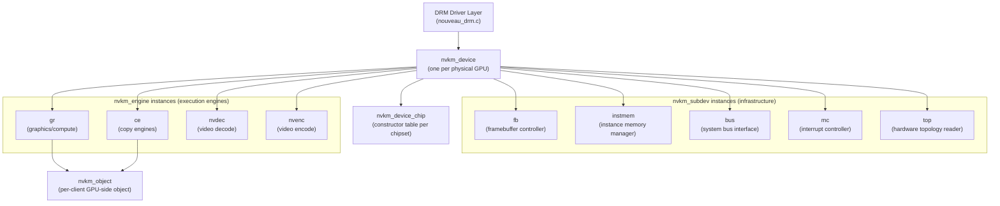
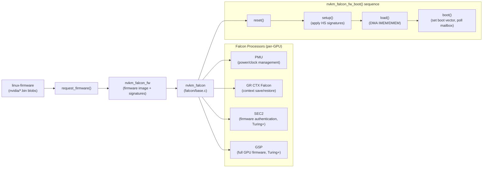
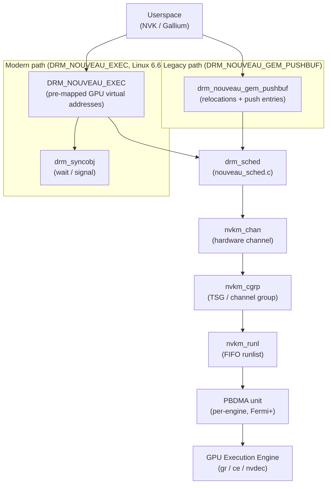
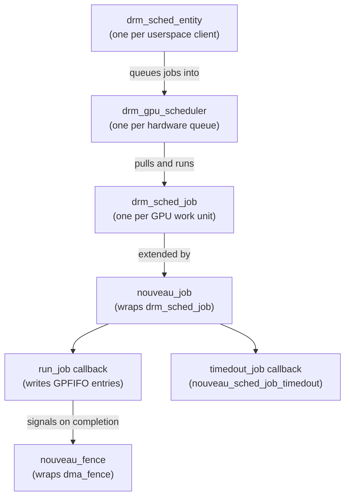
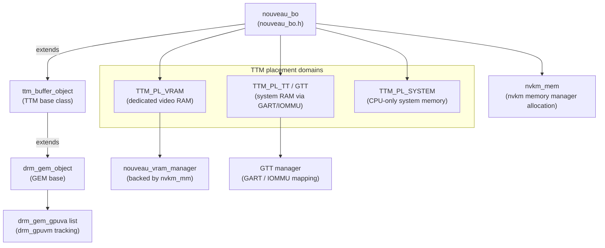
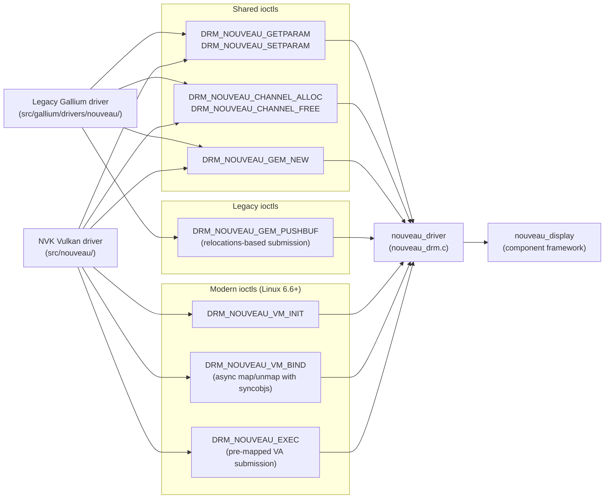

# Chapter 8: The Nouveau Kernel Driver: nvkm Architecture

> **Part**: Part III — The Nouveau Story
> **Audience**: Systems developer — this chapter targets kernel driver developers and those who want to understand how a complex, multi-generation GPU driver organises its internals without vendor documentation
> **Status**: First draft — 2026-06-06

## Table of Contents
- [Overview](#overview)
- [1. The nvkm Object Model: Engines, Subdevices, and Objects](#1-the-nvkm-object-model-engines-subdevices-and-objects)
- [2. Falcon Microcontrollers: PMU, PDAEMON, and Engine Controllers](#2-falcon-microcontrollers-pmu-pdaemon-and-engine-controllers)
- [3. Channel and Pushbuffer Management](#3-channel-and-pushbuffer-management)
- [4. The GPU Scheduler and Fence Handling](#4-the-gpu-scheduler-and-fence-handling)
- [5. Memory Management: TTM Integration and BO Lifecycle](#5-memory-management-ttm-integration-and-bo-lifecycle)
- [6. The nvkm Architecture Across GPU Generations](#6-the-nvkm-architecture-across-gpu-generations)
- [7. The DRM Driver Interface](#7-the-drm-driver-interface)
- [Integrations](#integrations)
- [References](#references)

---

## Overview

The **nvkm** subsystem is the technical centrepiece of the **Nouveau** kernel driver. Where most GPU drivers manage one or two hardware generations, **nvkm** must abstract a product line spanning from the **NV04** RIVA TNT (1998) through Ada Lovelace (2022) — roughly a dozen architectural families — within a single codebase and without access to the authoritative hardware documentation that NVIDIA retains internally. This constraint shaped every design decision in **nvkm** and gives it an unusually sophisticated internal structure compared to vendor-supplied drivers.

The fundamental solution is a vtable-heavy object model, reminiscent of an object-oriented class hierarchy implemented in C, that allows per-GPU-family code to override behaviour at any level of the hierarchy. Each GPU execution engine is represented by a typed **nvkm_object** whose `func` pointer points to a generation-specific **nvkm_object_func** vtable. An **NV50** **FIFO** engine and a **GK104** **FIFO** engine present the same interface to the caller but call completely different hardware programming functions. The same pattern repeats for the **MMU**, clock, power management, display engine, and every other hardware block. Object construction is dispatched through the **nvkm_oclass** / **nvkm_sclass** mechanism, which maps NVIDIA integer class IDs to generation-specific constructor functions. Subdevices follow a two-phase initialisation sequence — a one-time `oneinit` phase and a per-resume `init` phase — governed by **nvkm_device_init()** in **drivers/gpu/drm/nouveau/nvkm/engine/device/base.c**. Understanding this model is the prerequisite for reading any nvkm source file effectively.

**Falcon** microcontrollers are a second major architectural axis. Starting around the **NV98** generation, NVIDIA embedded small **Falcon** **RISC**-like processors inside the GPU die for power management, clock sequencing, context save/restore, and firmware authentication. The relevant **Falcon** instances are the **PMU** (power management), **PDAEMON** (pre-Kepler power management), the **GR CTX** Falcon (graphics context save/restore), **SEC2** (firmware authentication on **Turing**+), and the **GSP** (full GPU firmware stack). The **nvkm_falcon** abstraction layer in **drivers/gpu/drm/nouveau/nvkm/falcon/** provides **nvkm_falcon_fw_boot()** to orchestrate the reset–load–boot sequence common to all **Falcon** processors, while generation-specific vtables handle differing register layouts.

This chapter proceeds from the macro to the micro. It begins with the three-tier **nvkm_device** / **nvkm_subdev** / **nvkm_engine** / **nvkm_object** hierarchy, then examines the **Falcon** microcontrollers that NVIDIA uses for engine management, moves through channel and pushbuffer submission, the **drm_sched** GPU scheduler integration, and GPU memory management via **TTM** and **drm_gpuvm**. It then surveys how **nvkm** expresses per-family variation through the **nvkm_device_chip** chipset descriptor tables and traces the key architectural transitions from **NV04** through **AD100/Ada** — including the firmware-signing requirement introduced on **Maxwell**, the five-level **MMU** arriving on **Pascal**, and the **GSP-RM** dependency beginning on **Ampere**. Finally it covers the **DRM/KMS** driver interface: **nouveau_driver** registration in **nouveau_drm.c**, the component framework that separates the display subsystem, and the full ioctl surface — from the legacy **DRM_NOUVEAU_GEM_PUSHBUF** path to the modern **DRM_NOUVEAU_VM_BIND** and **DRM_NOUVEAU_EXEC** ioctls that power **NVK**. It pays particular attention to the boundaries between the software-managed path (used on hardware through Turing) and the **GSP-RM**-managed path introduced in Chapter 9, so the reader can see how the same nvkm code supports both modes. By the end of this chapter, the reader will be able to navigate the nvkm source tree, identify which object implements a given GPU function for a given hardware family, and trace a command buffer from userspace submission through hardware execution.

---

## 1. The nvkm Object Model: Engines, Subdevices, and Objects

### Motivation: The Multi-Generation Problem

The single most important design challenge facing Nouveau is breadth. Between NV04 and Ada Lovelace, NVIDIA changed its memory subsystem at least four times, introduced Falcon microcontrollers partway through the lineup, moved from software-managed to hardware-managed context switching, and fundamentally redesigned both the display engine and the FIFO command processor on multiple occasions. Any driver that targets this range must solve the polymorphism problem: how do you call `fifo_channel_alloc()` without writing a giant conditional that tests the GPU family at every call site?

The nvkm answer is an object model implemented via C vtables and a three-tier ownership hierarchy. Every hardware-facing abstraction in nvkm is an `nvkm_object` with a `func` pointer to a const vtable whose implementation is selected at object construction time based on the GPU chipset. This is not novel — it mirrors the pattern used in the Linux kernel's DMA engine framework, clk framework, and countless other subsystems — but nvkm applies it pervasively and consistently across an unusually large surface of hardware variation.

### The Three-Tier Hierarchy

The hierarchy has three levels. At the top is `nvkm_device`: one instance per physical GPU, owned by the DRM driver layer. It carries pointers to every subdevice and engine on the chip, the MMIO base address, the chipset identifier, and the `nvkm_device_chip` descriptor that maps the detected chip to its set of implementation constructors.

Below the device are `nvkm_subdev` instances: functional subsystems that exist on every GPU in one form or another. The subdev list includes the timer, framebuffer controller (`fb`), instance memory manager (`instmem`), system bus interface (`bus`), interrupt controller (`mc`), and hardware topology reader (`top`). Subdevices do not participate in userspace command execution — they manage infrastructure that other parts of nvkm depend on.

At the third level sit `nvkm_engine` instances: the GPU execution engines that userspace actually submits work to. These include `gr` (graphics/compute), `ce` (copy engines), `nvdec` (video decode), `nvenc` (video encode), and historical engines like `mpeg`, `vp`, and `bsp` present on older hardware. Engines extend `nvkm_subdev` and therefore share the same lifecycle and init conventions, but they additionally participate in channel management and context switching.

The `nvkm_object` base class is the leaf of the hierarchy — it represents a GPU-side object allocated on behalf of a userspace client, such as a channel, a memory mapping, or a class instance. It is defined in `drivers/gpu/drm/nouveau/include/nvkm/core/object.h`:



### Code Example 1: nvkm_object and nvkm_object_func

```c
/* Source: drivers/gpu/drm/nouveau/include/nvkm/core/object.h */
struct nvkm_object {
    const struct nvkm_object_func *func;
    struct nvkm_client *client;
    struct nvkm_engine *engine;
    s32 oclass;
    u32 handle;

    struct list_head head;
    struct list_head tree;
    u64 object;
    struct rb_node node;
};

struct nvkm_object_func {
    void *(*dtor)(struct nvkm_object *);
    int (*init)(struct nvkm_object *);
    int (*fini)(struct nvkm_object *, enum nvkm_suspend_state suspend);
    int (*mthd)(struct nvkm_object *, u32 mthd, void *data, u32 size);
    int (*ntfy)(struct nvkm_object *, u32 mthd, struct nvkm_event **);
    int (*map)(struct nvkm_object *, void *argv, u32 argc,
               enum nvkm_object_map *, u64 *addr, u64 *size);
    int (*unmap)(struct nvkm_object *);
    int (*bind)(struct nvkm_object *, struct nvkm_gpuobj *, int align,
                struct nvkm_gpuobj **);
    int (*sclass)(struct nvkm_object *, int index, struct nvkm_oclass *);
    int (*uevent)(struct nvkm_object *, void *argv, u32 argc,
                  struct nvkm_uevent *);
};
```

The `oclass` field holds the NVIDIA integer class ID — a number from the NVIDIA hardware class namespace such as `0xb0b5` for an Ampere compute channel — that was used to create the object. The `engine` pointer links back to the engine that owns this object. The `rb_node` and `object` fields connect the object into a per-client red-black tree keyed by the 64-bit object handle passed from userspace, enabling fast handle-to-object lookup with `nvkm_object_search()`.

### The nvkm_oclass Dispatch Table

Object construction in nvkm uses the `nvkm_oclass` / `nvkm_sclass` mechanism. An `nvkm_sclass` entry describes a single supported hardware class: its integer class ID, the version range it covers, and a constructor function pointer. Each engine implementation registers an array of these entries. When userspace calls a nouveau ioctl to allocate an object of a given class ID, nvkm walks the engine's sclass table looking for a matching entry, then calls that constructor. The result is that GK104 and GA100 both respond to the same class IDs in userspace while running completely different hardware programming sequences in the kernel.

```c
/* Source: drivers/gpu/drm/nouveau/include/nvkm/core/oclass.h */
struct nvkm_sclass {
    int minver;
    int maxver;
    s32 oclass;
    const struct nvkm_object_func *func;
    int (*ctor)(const struct nvkm_oclass *, void *data, u32 size,
                struct nvkm_object **);
};

struct nvkm_oclass {
    int (*ctor)(const struct nvkm_oclass *, void *data, u32 size,
                struct nvkm_object **);
    struct nvkm_sclass base;
    const void *priv;
    const void *engn;
    u32 handle;
    u64 object;
    struct nvkm_client *client;
    struct nvkm_object *parent;
    struct nvkm_engine *engine;
};
```

### The Two-Phase Subdevice Initialisation Sequence

Subdevices initialise in two phases. The first phase, `oneinit`, runs once during device probe and allocates all resources that survive suspend/resume cycles: firmware buffers, VRAM page pool allocations, hardware topology discovery. The second phase, `init`, runs on every device bring-up (including resume) and programs the actual hardware registers. This split is not an aesthetic choice — it is a correctness requirement. If `oneinit` ran on every resume, the driver would attempt to re-allocate firmware memory that is already pinned, causing either memory leaks or allocation failures.

The ordering of subdevice init is encoded implicitly by the `nvkm_device_init()` call sequence in `drivers/gpu/drm/nouveau/nvkm/engine/device/base.c`. The framebuffer controller (`fb`) must complete `oneinit` before instance memory (`instmem`) can allocate from VRAM. The MMU must be live before any engine attempts to create a virtual address space. The `top` subdevice, which reads the GPU's hardware topology registers to discover which engines are physically present, must initialise before the FIFO engine constructs its runlist. The fixed init order both encodes and enforces these dependencies.

The subdev init implementation can be read in `drivers/gpu/drm/nouveau/nvkm/core/subdev.c`: `nvkm_subdev_init_()` calls `nvkm_subdev_oneinit_()` on the first invocation (guarded by the `subdev->oneinit` boolean flag), then calls the `func->init` vtable entry regardless. This design separates idempotent hardware programming from one-time resource allocation in a straightforward, auditable way.

---

## 2. Falcon Microcontrollers: PMU, PDAEMON, and Engine Controllers

### What Falcon Processors Are

Starting around the NV98 generation (GeForce 9400M), NVIDIA began embedding small RISC-like microcontrollers inside the GPU die for handling functions that would otherwise require host CPU intervention: power management, clock programming, context save/restore, firmware authentication, and, on Turing and later, all of GPU command processing via the GSP. NVIDIA calls these processors Falcon (Flexible ALU for NVIDIA). They have a simple instruction set, separate instruction and data memory (IMEM/DMEM), a DMA engine for loading firmware blobs, and a mailbox mechanism for communicating with the host driver. The Envytools project has reverse-engineered the Falcon ISA and documents it at `https://envytools.readthedocs.io/en/latest/hw/falcon/index.html`.

Falcon processors come in several ISA versions. The original Falcon v0 through v4 processors use a 24-bit word-addressed instruction set that Envytools' `envydis` tool can disassemble. Starting with Turing's GSP (identified internally as Falcon v6), NVIDIA switched to a RISC-V core under the Falcon name, fundamentally changing the ISA while retaining the same driver-facing interface of IMEM/DMEM loading and mailbox messaging. The Falcon processors relevant to nvkm are:

- **PMU** (Power Management Unit, present from Fermi onward): manages voltage levels, clock frequencies, and thermal throttling. On pre-Maxwell hardware, nvkm provides software-authored PMU firmware blobs loaded from `linux-firmware`. On Maxwell and later, signed firmware binaries are required.
- **PDAEMON**: the pre-Kepler name for the PMU function, present on Fermi. Handled most of the same power management tasks before the PMU subdev was consolidated.
- **GR CTX** (Graphics Context Falcon): manages PGRAPH context save/restore when the GPU switches between channels. This Falcon runs firmware that knows how to save the complete graphics/compute engine state to instance memory and restore it for a different channel. On Fermi through Ampere, this firmware is loaded by nvkm from `linux-firmware` blobs named `nvidia/nv*_gr.bin`.
- **CE** (Copy Engine): on pre-Pascal hardware, copy engine command processing is handled by a Falcon embedded in the CE engine block.
- **SEC2** (Security Engine 2, Turing+): a high-security Falcon responsible for authenticating other Falcon firmware blobs before they are allowed to execute in heavy-secure (HS) mode. SEC2 itself runs signed firmware from `nvidia/nv*_sec2_*.bin`.
- **GSP** (GPU System Processor, Turing+): the full-GPU firmware stack; covered in depth in Chapter 9.

### The nvkm_falcon Abstraction Layer

The abstraction layer lives under `drivers/gpu/drm/nouveau/nvkm/falcon/`. The core is `base.c`, which provides `nvkm_falcon_dma_wr()` and `nvkm_falcon_pio_wr()` for loading firmware blobs into IMEM and DMEM, and the `nvkm_falcon_fw_boot()` function that orchestrates the full boot sequence.



### Code Example 4: Falcon Firmware Boot Sequence

```c
/* Source: drivers/gpu/drm/nouveau/nvkm/falcon/fw.c — nvkm_falcon_fw_boot() */
int
nvkm_falcon_fw_boot(struct nvkm_falcon_fw *fw, struct nvkm_subdev *user,
                    bool release, u32 *pmbox0, u32 *pmbox1,
                    u32 mbox0_ok, u32 irqsclr)
{
    struct nvkm_falcon *falcon = fw->falcon;
    int ret;

    ret = nvkm_falcon_get(falcon, user);
    if (ret)
        return ret;

    if (fw->sigs) {
        ret = nvkm_falcon_fw_patch(fw);   /* apply HS signatures */
        if (ret)
            goto done;
        nvkm_falcon_fw_dtor_sigs(fw);
    }

    FLCNFW_DBG(fw, "resetting");
    fw->func->reset(fw);                  /* hold Falcon in reset */

    FLCNFW_DBG(fw, "loading");
    if (fw->func->setup) {
        ret = fw->func->setup(fw);        /* pre-load setup (e.g. auth) */
        if (ret)
            goto done;
    }

    /* sync DMA mappings after last write to firmware image */
    dma_sync_single_for_device(fw->fw.device->dev, fw->fw.phys,
                               sg_dma_len(&fw->fw.mem.sgl), DMA_TO_DEVICE);

    ret = fw->func->load(fw);             /* DMA IMEM/DMEM from system RAM */
    if (ret)
        goto done;

    FLCNFW_DBG(fw, "booting");
    ret = fw->func->boot(fw, pmbox0, pmbox1, mbox0_ok, irqsclr);
    /* boot: sets boot vector, releases reset, polls mailbox */
    if (ret)
        FLCNFW_ERR(fw, "boot failed: %d", ret);

done:
    if (ret || release)
        nvkm_falcon_put(falcon, user);
    return ret;
}
```

The sequence is: reset the Falcon (holding it in reset clears any previous state), then load IMEM and DMEM from a system-memory DMA buffer, then release reset with the boot vector set to the firmware entry point, then poll the outbound mailbox register for the expected completion value. Each step is a vtable call into a generation-specific implementation (e.g., `gm200.c` for Maxwell, `tu102.c` for Turing) because the register offsets for Falcon control differ per generation.

### Firmware Signing and Security Modes

Post-Maxwell hardware enforces that PMU, GR CTX, and SEC2 firmware blobs carry valid NVIDIA signatures before they are admitted to heavy-secure (HS) execution mode. HS mode grants the Falcon access to privileged hardware registers that the host CPU cannot reach. The driver must load the ACR (Access Control Region) firmware first — itself signed — which then verifies and unlocks the other firmware blobs. This chain of trust is why unsigned community-authored firmware for Falcon processors on Maxwell+ is functionally limited: without HS mode, the PMU cannot program voltages and the clock driver is restricted to safe defaults.

The firmware blobs ship separately from the kernel, in the `linux-firmware` repository, under names like `nvidia/gp102/gr/fecs_sig.bin` (GR context firmware signatures for GP102) and `nvidia/tu102/sec2/hs_bl_prod.bin` (SEC2 heavy-secure bootloader for TU102). The driver requests them via the standard kernel `request_firmware()` mechanism. A missing firmware blob degrades capability but generally does not prevent the driver from loading — display and basic 2D operations survive without PMU firmware.

---

## 3. Channel and Pushbuffer Management

### The GPU Channel Concept

A GPU channel is the fundamental unit of isolation between userspace clients submitting work to the GPU. It consists of a hardware-maintained command FIFO that sequences operations for one or more execution engines. The GPU DMA controller — the PFIFO engine on pre-Fermi hardware, the PBDMA units on Fermi and later — reads command packets from the channel's ring buffer and dispatches them to the appropriate engine. From the userspace perspective, a channel is an object created via `DRM_NOUVEAU_CHANNEL_ALLOC`, mapped into the process address space, and then used to submit indirect buffers (IBs) containing GPU commands.

Pre-Fermi hardware (NV04 through NV40) uses a simple DMA FIFO: userspace writes method packets directly into a FIFO that the GPU processes sequentially, with no preemption and a maximum of 32 channels. NV50 introduces per-channel context memory (instance memory) and a hardware scheduler that can manage up to 128 channels, but the fundamental programming model is similar. The architectural break is Fermi (GF100/NVC0): NVIDIA introduced the GPFIFO model where the CPU writes 8-byte GPFIFO entries pointing to indirect buffer (IB) segments, and the GPU's PBDMA unit pulls those IB segments into its internal FIFO. This eliminates the need for the CPU to directly write into the GPU's command FIFO aperture and enables deeper software pipelining.

### The nvkm_chan Object

Each active channel is represented by an `nvkm_chan` in the kernel. Looking at `drivers/gpu/drm/nouveau/nvkm/engine/fifo/chan.h`, the `nvkm_chan_func` vtable captures all generation-specific channel operations:

### Code Example 3: nvkm_chan_func and nvkm_chan_new_ Signature

```c
/* Source: drivers/gpu/drm/nouveau/nvkm/engine/fifo/chan.h */
struct nvkm_chan_func {
    const struct nvkm_chan_func_inst {
        u32 size;    /* instance memory block size in bytes */
        bool zero;   /* zero instance memory on alloc */
        bool vmm;    /* bind VMM to channel instance */
    } *inst;

    const struct nvkm_chan_func_userd {
        enum nvkm_bar_id bar;   /* BAR1 or BAR2 USERD location */
        u32 base;
        u32 size;
        void (*clear)(struct nvkm_chan *);
    } *userd;

    const struct nvkm_chan_func_ramfc {
        const struct nvkm_ramfc_layout *layout;
        int (*write)(struct nvkm_chan *, u64 offset, u64 length,
                     u32 devm, bool priv);
        void (*clear)(struct nvkm_chan *);
        bool ctxdma;
        u32 devm;
        bool priv;
    } *ramfc;

    void (*bind)(struct nvkm_chan *);
    void (*unbind)(struct nvkm_chan *);
    void (*start)(struct nvkm_chan *);
    void (*stop)(struct nvkm_chan *);
    void (*preempt)(struct nvkm_chan *);
    u32  (*doorbell_handle)(struct nvkm_chan *);
};

/* Channel constructor — called by engine-specific fifo implementations */
int nvkm_chan_new_(const struct nvkm_chan_func *, struct nvkm_runl *,
                  int runq, struct nvkm_cgrp *,
                  const char *name, bool priv, u32 devm,
                  struct nvkm_vmm *, struct nvkm_dmaobj *,
                  u64 offset, u64 length,
                  struct nvkm_memory *userd, u64 userd_bar1,
                  struct nvkm_chan **);
```

The `inst` sub-vtable describes the channel instance memory block — a region of VRAM (or instmem) that holds the hardware RAMFC (RAM FIFO Context), which is the GPU's channel context record. The `userd` sub-vtable describes the user doorbell: a BAR1-mapped region that userspace writes to notify the GPU that new GPFIFO entries are available without making a kernel call. The `ramfc` sub-vtable handles writing the initial RAMFC structure that points the PBDMA at the GPFIFO ring in memory.

### FIFO Engine Variants Across Generations

The FIFO engine implementation varies substantially across GPU families. The GK104 (Kepler) FIFO implementation in `drivers/gpu/drm/nouveau/nvkm/engine/fifo/gk104.c` illustrates the architecture well. Each Kepler GPU has multiple PBDMA units — the `gk104_fifo_init_pbdmas()` function initialises them by writing a bitmask of active PBDMAs to register 0x000204. The FIFO function table registers the `KEPLER_CHANNEL_GPFIFO_A` class (a hardware class ID) as the constructor for new channels:

### Code Example 2: GK104 FIFO Function Table Registration

```c
/* Source: drivers/gpu/drm/nouveau/nvkm/engine/fifo/gk104.c */
static const struct nvkm_fifo_func
gk104_fifo = {
    .chid_nr      = gk104_fifo_chid_nr,    /* 4096 channels max */
    .chid_ctor    = gf100_fifo_chid_ctor,
    .runq_nr      = gf100_fifo_runq_nr,
    .runl_ctor    = gk104_fifo_runl_ctor,
    .init         = gk104_fifo_init,
    .init_pbdmas  = gk104_fifo_init_pbdmas,
    .intr         = gk104_fifo_intr,
    .intr_mmu_fault_unit = gf100_fifo_intr_mmu_fault_unit,
    .intr_ctxsw_timeout  = gf100_fifo_intr_ctxsw_timeout,
    .mmu_fault    = &gk104_fifo_mmu_fault,
    .nonstall     = &gf100_fifo_nonstall,
    .runl         = &gk104_runl,
    .runq         = &gk104_runq,
    .engn         = &gk104_engn,
    .engn_ce      = &gk104_engn_ce,
    .cgrp         = {{                               }, &nv04_cgrp },
    .chan         = {{ 0, 0, KEPLER_CHANNEL_GPFIFO_A }, &gk104_chan },
};

int
gk104_fifo_new(struct nvkm_device *device, enum nvkm_subdev_type type,
               int inst, struct nvkm_fifo **pfifo)
{
    return nvkm_fifo_new_(&gk104_fifo, device, type, inst, pfifo);
}
```

The `.chan` entry maps the `KEPLER_CHANNEL_GPFIFO_A` class ID to the `gk104_chan` function vtable — so when userspace requests a channel of that class, nvkm calls the GK104-specific channel constructor rather than (say) the Fermi or Volta one.

### Pushbuffers, IBs, and the Submission Path

The userspace submission model from the legacy Gallium path (`src/gallium/winsys/nouveau/`) uses the `DRM_NOUVEAU_GEM_PUSHBUF` ioctl with a `drm_nouveau_gem_pushbuf` structure that lists GEM buffer objects to make resident, relocation entries that the kernel patches at submission time (for GPU virtual addresses not yet known at command-record time), and push entries identifying which regions of those buffers to inject into the GPU FIFO. This relocation-based model is functional but has high per-submission overhead: every submit requires the kernel to iterate the relocation list and patch addresses into the command buffer.

The new NVK-targeted submission path, `DRM_NOUVEAU_EXEC` (merged in Linux 6.6), eliminates relocations entirely by requiring that all GPU virtual addresses be bound before submission. The `drm_nouveau_exec` structure passes virtual addresses of pre-mapped push buffer regions directly, trusting that the `DRM_NOUVEAU_VM_BIND` ioctl has already established stable GPU virtual mappings for all relevant buffers. This results in substantially lower per-submit kernel overhead and is required for NVK's Vulkan command buffer submission model.

### Engine Runlists and TSGs

On Kepler and later, channels are not submitted directly to the PBDMA — they are added to a runlist maintained by the FIFO engine, and the FIFO engine schedules channels from that runlist onto PBDMAs. Channels can be grouped into Time-Slice Groups (TSGs), which are the unit of hardware scheduling: the FIFO engine services one TSG at a time, giving it a configurable timeslice before preempting to the next. nvkm models this with `nvkm_runl` (the runlist) and `nvkm_cgrp` (channel group / TSG). Channel preemption on Volta+ (`nvkm_chan_preempt()`) signals the hardware to suspend the currently executing channel and waits for the PBDMA to confirm the channel is idle before proceeding.



---

## 4. The GPU Scheduler and Fence Handling

### Why Kernel-Side GPU Scheduling Exists

Early GPU drivers submitted work to hardware directly from the ioctl handler, relying on userspace to ensure that the GPU was not overloaded and that dependent jobs were submitted in the correct order. This approach has fundamental problems at scale: userspace cannot reason about the resource contention between competing processes, there is no reliable way to detect or recover from GPU hangs, and there is no mechanism for the kernel to enforce priority between security domains. The DRM GPU scheduler (`drm_sched`) was designed to address these issues by interposing a kernel-side job queue between the userspace submission ioctl and the actual hardware command buffer submission.

The scheduler infrastructure lives in `drivers/gpu/drm/scheduler/` and is built around three structures: `drm_gpu_scheduler` (one per hardware queue or submission ring), `drm_sched_entity` (one per userspace client submitting to a given scheduler), and `drm_sched_job` (one per unit of GPU work). The scheduler runs a kthread that pulls jobs from entity queues in priority order, calls the driver's `run_job` callback to push the job to hardware, and then waits for a completion fence. Timeout detection is handled internally: if a job's fence does not signal within a configurable timeout (10 seconds in nouveau: `NOUVEAU_SCHED_JOB_TIMEOUT_MS`), the scheduler calls the driver's `timedout_job` callback.

### Nouveau's Scheduler Integration

Nouveau's integration point is `drivers/gpu/drm/nouveau/nouveau_sched.c`. The `nouveau_job` structure wraps `drm_sched_job` with nouveau-specific state:



### Code Example 5: nouveau_job Initialisation

```c
/* Source: drivers/gpu/drm/nouveau/nouveau_sched.c — nouveau_job_init() */
int
nouveau_job_init(struct nouveau_job *job,
                 struct nouveau_job_args *args)
{
    struct nouveau_sched *sched = args->sched;
    int ret;

    INIT_LIST_HEAD(&job->entry);

    job->file_priv  = args->file_priv;
    job->cli        = nouveau_cli(args->file_priv);
    job->sched      = sched;
    job->sync       = args->sync;
    job->resv_usage = args->resv_usage;
    job->ops        = args->ops;

    /* Copy in-sync and out-sync drm_syncobj arrays */
    job->in_sync.count = args->in_sync.count;
    if (job->in_sync.count) {
        job->in_sync.data = kmemdup(args->in_sync.s,
                                    sizeof(*args->in_sync.s) *
                                    args->in_sync.count, GFP_KERNEL);
        if (!job->in_sync.data)
            return -ENOMEM;
    }
    /* ... out_sync setup omitted for brevity ... */

    ret = drm_sched_job_init(&job->base, &sched->entity,
                             args->credits, NULL,
                             job->file_priv->client_id);
    if (ret)
        goto err_free_chains;

    job->state = NOUVEAU_JOB_INITIALIZED;
    return 0;
    /* ... error labels ... */
}
```

The `drm_sched_job_init()` call registers the job with the scheduler entity. The job's `run_job` callback (set via the `ops` vtable) is responsible for writing the actual GPFIFO entries to the hardware channel ring buffer. The `timedout_job` callback calls `nouveau_sched_job_timedout()`, which attempts to reset the channel, signals any waiting fences with `-ETIME`, and logs an error. Critically, nouveau does not have a full GPU reset path on most hardware without GSP-RM: a channel hang can leave other channels on the same runlist stalled. This is a known operational gap relative to drivers like amdgpu, which implement a full GPU reset sequence, and it means that hung compute workloads on older Nouveau hardware may require a driver reload to recover.

### Fence Semantics and Sync Objects

Fence signalling in nouveau uses the standard `dma_fence` infrastructure. The `nouveau_fence` type wraps a `dma_fence` with a channel reference and sequence number. On pre-Fermi hardware, completion detection is polled: the kernel maps a region of the channel's VRAM where the GPU writes a sequence number on job completion, and `nouveau_fence_wait()` polls that value. On Fermi and later, completion is interrupt-driven: the channel raises an interrupt when the semaphore at the designated address crosses the expected value, which signals the fence without requiring polling.

The `DRM_NOUVEAU_EXEC` ioctl's sync object support uses `drm_syncobj` handles — the standard DRM mechanism for explicit synchronisation (see Chapter 3 for the connection to the `wp_linux_drm_syncobj` Wayland protocol). Both timeline syncobjs (where the sync point is a 64-bit counter value) and binary syncobjs are supported, controlled by the `DRM_NOUVEAU_SYNC_TYPE_MASK` flag in `drm_nouveau_sync.flags`.

### The DRM_NOUVEAU_EXEC Interface (Linux 6.6+)

The `DRM_NOUVEAU_EXEC` ioctl was merged in Linux 6.6 and represents the target submission interface for NVK. Its UAPI structure is defined in `include/uapi/drm/nouveau_drm.h`:

### Code Example 8: drm_nouveau_exec UAPI Structure

```c
/* Source: include/uapi/drm/nouveau_drm.h — DRM_NOUVEAU_EXEC interface */
struct drm_nouveau_exec_push {
    __u64 va;       /* GPU virtual address of this push buffer segment */
    __u32 va_len;   /* length in bytes */
    __u32 flags;
#define DRM_NOUVEAU_EXEC_PUSH_NO_PREFETCH 0x1
};

struct drm_nouveau_exec {
    __u32 channel;      /* hardware channel ID */
    __u32 push_count;   /* number of drm_nouveau_exec_push entries */
    __u32 wait_count;   /* number of drm_nouveau_sync wait entries */
    __u32 sig_count;    /* number of drm_nouveau_sync signal entries */
    __u64 wait_ptr;     /* userspace pointer to wait drm_nouveau_sync array */
    __u64 sig_ptr;      /* userspace pointer to signal drm_nouveau_sync array */
    __u64 push_ptr;     /* userspace pointer to drm_nouveau_exec_push array */
};
```

Userspace populates `push_ptr` with virtual-address segments already mapped via `DRM_NOUVEAU_VM_BIND`, `wait_ptr` with sync objects to wait on before submitting, and `sig_ptr` with sync objects to signal upon GPU completion. The kernel validates all virtual addresses, queues the job through `drm_sched`, and returns immediately. The GPU executes the push buffers asynchronously; the signal syncobjs are triggered when the GPU writes the completion fence value.

---

## 5. Memory Management: TTM Integration and BO Lifecycle

### TTM: The Kernel's GPU Memory Manager

The Translation Table Manager (TTM) is the DRM subsystem's generic GPU memory manager, providing allocation, placement, migration, and eviction for GPU buffer objects. It abstracts three primary memory domains: `TTM_PL_VRAM` (dedicated video RAM on the card), `TTM_PL_TT` (system RAM mapped through the GPU's GART or IOMMU, called GTT in nouveau), and `TTM_PL_SYSTEM` (ordinary system memory not mapped by the GPU, accessible only by the CPU). A `ttm_resource_manager` instance handles each placement, with placement-specific eviction logic. TTM's eviction path (`ttm_resource_manager_evict_all()`) is called when a placement is full and a new allocation is required: it iterates existing buffer objects in LRU order and migrates them to a lower-preference placement.

nouveau's TTM integration lives in `drivers/gpu/drm/nouveau/nouveau_ttm.c`. The VRAM manager (`nouveau_vram_manager`) is backed by `nvkm_mm`, the internal VRAM suballocator that understands GPU memory tiling and alignment constraints. The GTT manager maps system memory into the GPU's GART aperture using the IOMMU or the GPU's own page table walker, depending on hardware capability.

### The nouveau_bo Structure and Buffer Object Lifecycle

Every GPU-visible buffer in nouveau is represented by a `nouveau_bo`, defined in `drivers/gpu/drm/nouveau/nouveau_bo.h`, which extends `ttm_buffer_object`. The key fields are `domain` (a bitmask of `NOUVEAU_GEM_DOMAIN_VRAM`, `NOUVEAU_GEM_DOMAIN_GART`, and `NOUVEAU_GEM_DOMAIN_CPU` indicating preferred and acceptable placements), `tile_mode` and `tile_flags` (NVIDIA-specific tiling parameters for render targets and depth buffers), and the `nvkm_mem` backing structure that the nvkm memory manager allocated.



### Code Example 6: nouveau_bo_new and TTM Placement

```c
/* Source: drivers/gpu/drm/nouveau/nouveau_bo.c — nouveau_bo_new() */
int
nouveau_bo_new(struct nouveau_cli *cli, u64 size, int align,
               uint32_t domain, uint32_t tile_mode, uint32_t tile_flags,
               struct sg_table *sg, struct dma_resv *robj,
               struct nouveau_bo **pnvbo)
{
    struct nouveau_bo *nvbo;
    int ret;

    nvbo = nouveau_bo_alloc(cli, &size, &align, domain,
                            tile_mode, tile_flags, true);
    if (IS_ERR(nvbo))
        return PTR_ERR(nvbo);

    nvbo->bo.base.size = size;
    dma_resv_init(&nvbo->bo.base._resv);
    drm_vma_node_reset(&nvbo->bo.base.vma_node);

    /* Must be called before ttm_bo_init_reserved(): subsequent bo_move()
     * callbacks may already iterate the GEM's GPUVA list. */
    drm_gem_gpuva_init(&nvbo->bo.base);

    ret = nouveau_bo_init(nvbo, size, align, domain, sg, robj);
    if (ret)
        return ret;

    *pnvbo = nvbo;
    return 0;
}
```

The `nouveau_bo_placement_set()` function (called inside `nouveau_bo_init()`) populates a `ttm_placement` structure whose `placement` array lists `ttm_place` entries in order of preference. A buffer with `NOUVEAU_GEM_DOMAIN_VRAM` set and `NOUVEAU_GEM_DOMAIN_GART` as a fallback will first attempt VRAM allocation; if that fails due to pressure, TTM will try GTT. The `drm_gem_gpuva_init()` call is notable: it initialises the GEM object's GPUVA list, which the new `drm_gpuvm` framework uses to track all GPU virtual address mappings of this buffer object across all VMs.

### The nvkm VMM: GPU Virtual Address Management

GPU virtual address management is handled by the `nvkm_vmm` (Virtual Memory Manager) subdevice, whose implementation is spread across `drivers/gpu/drm/nouveau/nvkm/subdev/mmu/`. Each process that opens a nouveau file descriptor gets its own `nvkm_vmm` instance representing an independent GPU virtual address space. The VMM manages multi-level page tables whose structure varies by GPU generation: NV50 uses a two-level scheme with 512-entry page directories, while GP100 (Pascal) and later use a five-level scheme supporting 49-bit virtual addresses, with support for 4K, 64K, 2M, and 512M page sizes.

### Code Example 7: nvkm_vmm Page Table Traversal

```c
/* Source: drivers/gpu/drm/nouveau/nvkm/subdev/mmu/vmm.c — nvkm_vmm_map_ptes() */
static void
nvkm_vmm_map_ptes(struct nvkm_vmm *vmm,
                  const struct nvkm_vmm_page *page,
                  u64 addr, u64 size,
                  nvkm_vmm_pte_func MAP_PTES, struct nvkm_vmm_map *map,
                  nvkm_vmm_pxe_func CLR_PTES)
{
    const struct nvkm_vmm_desc *desc = page->desc;
    struct nvkm_vmm_iter it;
    u64 bits = addr >> page->shift;

    it.page = page;
    it.desc = desc;
    it.vmm  = vmm;
    it.cnt  = size >> page->shift;
    it.flush = NVKM_VMM_LEVELS_MAX;

    /* Deconstruct the address into per-level PTE indices */
    for (it.lvl = 0; desc[it.lvl].bits; it.lvl++) {
        it.pte[it.lvl] = bits & ((1 << desc[it.lvl].bits) - 1);
        bits >>= desc[it.lvl].bits;
    }
    it.max = --it.lvl;
    it.pt[it.max] = vmm->pd;   /* start from the top-level page directory */
    it.lvl = it.max;

    /* Depth-first traversal of the page table hierarchy */
    while (it.cnt) {
        /* ... walk PDEs, allocate child page tables as needed,
               call MAP_PTES leaf function to write PTEs ... */
    }
}
```

The `nvkm_vmm_desc` array for a given GPU generation encodes the number of bits consumed at each level of the page table hierarchy. The leaf `MAP_PTES` function pointer is a generation-specific function (e.g., `gf100_vmm_pgt_mem()` for Fermi) that writes the actual hardware PTE format. This design allows page table walking logic to be shared while format-specific PTE construction remains per-generation.

### The drm_gpuvm Rewrite (2023–2024)

The Danilo Krummrich memory management rewrite, landing across Linux 6.6 through 6.8, introduces a fundamental structural change. The old model used an `nvkm_vm` / `nvkm_vma` abstraction where the kernel driver exclusively managed all GPU virtual address mappings. This was incompatible with NVK's requirements: Vulkan drivers need to manage their own GPU virtual address space (sparse bindings, bindless descriptors, SVM) and to express this as asynchronous `VM_BIND` operations rather than synchronous ioctl calls.

The new model introduces `drm_gpuvm` — a DRM-generic GPU virtual address manager, now also used by the Intel Xe driver and Panfrost — that tracks a client's GPU VA space as a collection of `drm_gpuva` mappings. The `drm_gpuva_ops` abstraction expresses VM mutations (map, unmap, remap) as an operation list that the driver applies asynchronously, integrated with the scheduler via `DRM_NOUVEAU_VM_BIND`. The `DRM_NOUVEAU_VM_BIND` ioctl accepts a `drm_nouveau_vm_bind` structure with an operation array and sync objects, allowing the GPU VA space to be modified asynchronously relative to ongoing GPU work.

The critical point for readers navigating the source tree: both models coexist in Linux 6.8. The legacy `nvkm_vm` path is still exercised by the old Gallium nouveau driver (`src/gallium/drivers/nouveau/`), which uses `DRM_NOUVEAU_GEM_PUSHBUF`. The new `drm_gpuvm`-based path is used by NVK and the new Gallium path being developed alongside it. Code in `drivers/gpu/drm/nouveau/nouveau_mem.c`, `nouveau_bo.c`, and the nvkm MMU subdevice must simultaneously support both callers.

---

## 6. The nvkm Architecture Across GPU Generations

### How nvkm Expresses Per-Family Variation

The mechanism for selecting the right implementation for a detected GPU is the `nvkm_device_chip` descriptor table in `drivers/gpu/drm/nouveau/nvkm/engine/device/base.c`. Each supported chipset has a corresponding `nvkm_device_chip` struct that maps every subdev and engine type to a `(presence_mask, constructor_function)` pair. When `nvkm_device_ctor()` reads the GPU's `BOOT0` register to determine the chipset ID, it indexes this table to find the chip descriptor and then calls each constructor in the appropriate init order.

### Code Example 9: GPU Family Detection and Chipset Table

```c
/* Source: drivers/gpu/drm/nouveau/nvkm/engine/device/base.c
   nve4_chipset describes GK104 (Kepler); selected via: case 0x0e4 */
static const struct nvkm_device_chip
nve4_chipset = {
    .name     = "GK104",
    .bar      = { 0x00000001, gf100_bar_new     },
    .bios     = { 0x00000001, nvkm_bios_new      },
    .bus      = { 0x00000001, gf100_bus_new      },
    .clk      = { 0x00000001, gk104_clk_new      },
    .devinit  = { 0x00000001, gf100_devinit_new  },
    .fb       = { 0x00000001, gk104_fb_new       },
    .fuse     = { 0x00000001, gf100_fuse_new     },
    .gpio     = { 0x00000001, gk104_gpio_new     },
    .i2c      = { 0x00000001, gk104_i2c_new      },
    .imem     = { 0x00000001, nv50_instmem_new   },
    .ltc      = { 0x00000001, gk104_ltc_new      },
    .mc       = { 0x00000001, gk104_mc_new       },
    .mmu      = { 0x00000001, gk104_mmu_new      },
    .pci      = { 0x00000001, gk104_pci_new      },
    .pmu      = { 0x00000001, gk104_pmu_new      },
    .therm    = { 0x00000001, gk104_therm_new    },
    .top      = { 0x00000001, gk104_top_new      },
    .volt     = { 0x00000001, gk104_volt_new     },
    .ce       = { 0x00000007, gk104_ce_new       },  /* 3 CE instances */
    .disp     = { 0x00000001, gk104_disp_new     },
    .dma      = { 0x00000001, gf119_dma_new      },
    /* ... gr, nvdec, etc. ... */
};
```

The first field of each pair is a bitmask — `0x00000007` for CE means instances 0, 1, and 2 are all present. The constructor is called once per set bit. This single structure captures the complete hardware composition of a GK104 chip and routes every nvkm call for that chip to the right implementation without any runtime type dispatch beyond the initial table lookup at device construction.

### Key Architectural Transitions

The following transitions are the most significant discontinuities in the nvkm source tree. Understanding them allows a reader to predict which source files are relevant for a given GPU family.

**NV04–NV40 (TNT through GeForce 6):** Legacy DMA FIFO with up to 32 channels, no Falcon microcontrollers, software-managed graphics context switching by the kernel driver, and a relatively simple memory subsystem. Source files for this era are named `nv04`, `nv10`, `nv20`, `nv30`, `nv40`. Most of this code is maintenance-mode; it is correct but rarely receives new development.

**NV50 (GeForce 8, 2006):** A substantial architectural revision. New memory subsystem with a more capable GPU MMU, new PFIFO with hardware-managed channel contexts, and a completely new display engine (NV50 display) that the kernel represents as a semi-independent component. NV50 was the first NVIDIA GPU generation reverse-engineered thoroughly enough to support hardware-accelerated 3D in Nouveau, and it remains the oldest generation with relatively good Nouveau support.

**NVC0/Fermi (GeForce 400, 2010):** The Falcon era begins. PGRAPH context switching moves from CPU-driven to Falcon-driven (the GR CTX Falcon). The GPFIFO channel model replaces the old DMA FIFO. Unified shader model. TSG-based channel scheduling. Files named `gf100`, `gf119` in each engine directory target Fermi.

**NVE0/Kepler (GeForce 600, 2012):** Per-engine PBDMA units rather than a single shared FIFO, enabling massive parallelism. Up to 4096 hardware channels (GK104). The RECLK (reclock) path for managing GPU frequencies becomes significantly more complex, requiring the PMU Falcon to sequence voltage and clock changes safely. Files named `gk104`, `gk110`, `gk20a` target Kepler.

**GM200/Maxwell (GeForce 900, 2014):** The firmware signing requirement begins. PMU and GR CTX firmware must be signed by NVIDIA; unsigned community-authored firmware is rejected by the hardware. This makes full PMU functionality dependent on NVIDIA distributing firmware blobs in `linux-firmware`, and it is the point where the Nouveau software stack became structurally dependent on firmware distribution. Files named `gm107`, `gm200`, `gm20b` target Maxwell.

**GP100/Pascal (2016):** NVLink, HBM memory, and a new MMU with 49-bit virtual addresses and support for 5-level page tables (`vmmgp100.c` in the MMU subdev). The 512M large page size is introduced for performance on HPC workloads. Peer mappings for NVLink are represented in the VMM through a new address range type.

**GV100/Volta (2017):** Tensor cores for matrix acceleration. A new FIFO architecture with per-channel virtual addressing and SM-level preemption, enabling finer-grained multi-tenant GPU scheduling. Cooperative groups require synchronisation at the SM level, which changes the fence semantics for compute workloads. Files named `gv100` target Volta.

**TU100/Turing (2018):** RT cores for hardware ray tracing. The GSP processor appears as a distinct Falcon (later RISC-V) block. SEC2 gains the role of firmware authentication gatekeeper. INT8 and sparse matrix operations are added to the tensor core. This is the first generation where the GSP-RM path begins to be relevant, though Nouveau initially used it only experimentally.

**GA100/Ampere (2020):** Multi-Instance GPU (MIG) partitioning. A new copy engine model where CE instances are directly managed by the GSP firmware. GSP-RM becomes required for full functionality on Ampere; without it, several engine types are not accessible. The `nvkm/subdev/gsp/ga100.c` and `ga102.c` files implement the GSP interface for this generation.

**AD100/Ada (2022):** AV1 hardware encode, DLSS3 frame generation, continued GSP-RM dependency. The Ada generation is the most recent supported by Nouveau at the time of Linux 6.8 and is covered by `nvkm/subdev/gsp/ad102.c`.

### Implications for Driver Maintenance

The long tail of supported hardware means nvkm can never simply drop old code paths. An NV04 implementation must continue compiling and functioning correctly even as the GA100 implementation evolves. This constraint influences every refactoring decision: any change to the `nvkm_object` interface, the `nvkm_chan_func` vtable, or the TTM placement model must be backward-compatible with the oldest supported hardware. The practical consequence is that nvkm carries considerable historical complexity — the NV04 channel implementation uses code paths that no living GPU hardware can meaningfully exercise, but removing them would break existing users of decade-old GPUs.

---

## 7. The DRM Driver Interface

### Registration and the drm_driver Structure

Nouveau registers itself with the DRM framework through the `nouveau_driver` instance in `drivers/gpu/drm/nouveau/nouveau_drm.c`. This structure's function pointers implement the standard DRM driver interface described in Chapter 1. Key callbacks include `open` and `postclose` for per-file-descriptor client setup and teardown, `lastclose` for restoring display state when the last user closes the device, and `get_vblank_counter`, `enable_vblank`, and `disable_vblank` for KMS vertical-blank interrupt management. The PCIe driver hooks `nouveau_drm_probe()` and `nouveau_drm_remove()` handle device arrival and removal, calling `nvkm_device_ctor()` and managing the component framework.

### The Component Framework for Display

nouveau uses the Linux kernel component framework to split the display subsystem from the core GPU driver. The `nouveau_display_create()` / `nouveau_display_destroy()` functions manage the lifecycle of the display component. This split is not arbitrary: on NV50 and later, the display engine (PDISPLAY) is a physically distinct hardware block with its own clock domains, interrupt lines, and register space. Treating it as a separate component allows the core GPU subsystem to operate (for compute workloads, for example) without initialising display, and it allows display to be suspended and resumed independently. The KMS implementation in `nouveau_display.c` and `dispnv50/` builds on standard DRM helpers (`drm_crtc_helper_funcs`, `drm_connector_funcs`) and is expanded in Chapter 11.

### The Nouveau IOCTL Surface

The ioctl interface is the contract between the kernel driver and all userspace clients — both the legacy Gallium path and NVK. The full set of nouveau-specific ioctls is:



`DRM_NOUVEAU_GETPARAM` and `DRM_NOUVEAU_SETPARAM`: query and set driver-level parameters such as VRAM size, BAR size, the GPU's EXEC push buffer maximum count, and capability flags. New capabilities (like whether `DRM_NOUVEAU_EXEC` is supported) are communicated via GETPARAM values rather than requiring kernel version checks.

`DRM_NOUVEAU_CHANNEL_ALLOC` and `DRM_NOUVEAU_CHANNEL_FREE`: allocate and release a hardware channel. These ioctls are used by both the legacy Gallium path and NVK, though NVK additionally uses the newer `DRM_NOUVEAU_EXEC` for submission.

`DRM_NOUVEAU_GEM_NEW`: allocate a GEM buffer object with placement hints, tile mode, and tile flags. Returns a GEM handle usable by standard `DRM_IOCTL_GEM_CLOSE` and, via `DRM_IOCTL_PRIME_HANDLE_TO_FD`, DMA-BUF export.

`DRM_NOUVEAU_GEM_PUSHBUF`: the legacy command submission ioctl. Takes a list of buffer objects to make resident, a list of relocations, and a list of push buffer entries. Still used by the Gallium nouveau driver.

`DRM_NOUVEAU_EXEC`: the modern command submission ioctl, merged in Linux 6.6. Takes pre-mapped GPU virtual addresses and `drm_syncobj` wait/signal pairs. Used by NVK.

`DRM_NOUVEAU_VM_INIT`: initialise the client's GPU virtual address space, designating the boundary between the kernel-managed and user-managed VA regions. Must be called before any `VM_BIND` operations.

`DRM_NOUVEAU_VM_BIND`: asynchronously map or unmap GEM buffer objects in the client's GPU virtual address space, with `drm_syncobj` synchronisation. Enables NVK's sparse binding and dynamic buffer management features.

### Ioctl Version Negotiation

The capability gating mechanism uses GETPARAM queries for feature presence rather than a single version number. This reflects the incremental nature of nouveau's UAPI evolution: `DRM_NOUVEAU_EXEC` was not added as a new "version 2" of the driver but as an additional ioctl whose availability is queried via `NOUVEAU_GETPARAM_EXEC_PUSH_MAX` (parameter 17). Userspace checks whether the parameter query succeeds; if it does, the exec interface is available. NVK performs these capability checks at device initialisation and enables or disables features accordingly, allowing a single NVK build to run on both old and new kernels with graceful degradation.

---

## Roadmap

### Near-term (6–12 months)

- **Hopper and Blackwell GSP support in mainline**: The 62-patch series adding Nouveau support for NVIDIA Hopper (GH100) and Blackwell (GB100) GPUs — via the GSP firmware code path — landed in Linux 6.16. This uses R570 signed GSP firmware blobs upstreamed to `linux-firmware.git`. [Source](https://www.phoronix.com/news/NVIDIA-Blackwell-Hopper-616)
- **Nova `nova-core` v5 stabilisation**: The fifth revision of the `nova-core` stub driver (a Rust-written hardware and firmware abstraction layer for GSP-based GPUs) was submitted to LKML in March 2025 and is advancing toward merge. It forms the base for both `nova-drm` and the VFIO vGPU manager. [Source](https://lkml.iu.edu/hypermail/linux/kernel/2503.0/05057.html)
- **GA100 (Ampere data-centre) Nouveau GSP bring-up**: NVIDIA posted patches in early 2026 enabling the NVIDIA A100/GA100 GPU under Nouveau via the GSP code path, extending datacenter GPU coverage without proprietary drivers. [Source](https://www.phoronix.com/news/Nouveau-GSP-NVIDIA-GA100)
- **Continued `drm_gpuvm` and `DRM_NOUVEAU_EXEC` hardening**: NVK's adoption of `DRM_NOUVEAU_EXEC` and `DRM_NOUVEAU_VM_BIND` continues to drive robustness improvements in the `drm_gpuvm` infrastructure shared across Nouveau, Xe, and Panfrost; further sparse-binding and robustness features are expected in drm-next cycles through late 2026. Note: needs verification for specific patch numbers.
- **Removal of legacy pre-GSP UAPI paths from newer-generation code**: As GSP becomes mandatory for Turing+ (enforced by NVK), there is active work to separate legacy nvkm paths from the GSP-backed paths to reduce maintenance surface, complementing the Nova migration strategy. Note: needs verification for specific target kernel version.

### Medium-term (1–3 years)

- **Nova `nova-drm` DRM driver reaching functional completeness**: The Rust-written `nova-drm` driver (successor to `nouveau_drm.c` for Turing+ hardware) is iterating toward feature parity with the GSP-RM code path in nvkm. Hopper and Blackwell GPU enablement for Nova (12th iteration as of June 2026) signals active progress. [Source](https://www.phoronix.com/news/Hopper-Blackwell-Nova-Closer)
- **Gradual deprecation of nvkm for Turing+ hardware**: As Nova matures, the expectation is that nvkm's Turing+ code paths will be deprecated in favour of Nova's clean-sheet Rust implementation, which intentionally avoids carrying nvkm's multi-generation vtable complexity for hardware that has only ever used GSP-RM. [Source](https://rust-for-linux.com/nova-gpu-driver)
- **NVK Vulkan 1.3+ conformance expansion**: NVK's Vulkan conformance on Turing and Ampere hardware is advancing; medium-term goals include ray-tracing extension support (`VK_KHR_ray_tracing_pipeline`) and video decode/encode extensions (`VK_KHR_video_decode_h264` etc.) — these require corresponding nvkm engine and firmware-call additions. Note: needs verification for specific extension landing schedule.
- **`drm_gpuvm` sparse binding maturation**: The VM_BIND asynchronous sparse-binding model introduced for NVK is expected to gain additional synchronisation primitives (cross-driver timeline fence import/export) and integration with the kernel's `dma_resv` implicit fencing improvements. Note: needs verification.
- **Improved power management via GSP RPC**: On GSP-managed GPUs, power and clock management currently relies on GSP RPC calls; work is ongoing to expose finer-grained power capping and P-state control to the `nouveau_pstate` sysfs interface. Note: needs verification.

### Long-term

- **Full nvkm retirement for GSP-era hardware**: The long-term architectural goal, as articulated by Red Hat and the Nouveau maintainers, is for Nova to fully supersede Nouveau for all RTX 20-series (Turing) and newer GPUs, with nvkm retained only for the pre-GSP legacy hardware it currently supports well. [Source](https://9to5linux.com/red-hat-announces-nova-a-rust-based-gsp-only-driver-for-nvidia-gpus)
- **Upstream NVIDIA open-kernel-module GSP firmware alignment**: NVIDIA's own open-source kernel modules (`NVIDIA/open-gpu-kernel-modules`) and the Nouveau GSP path both consume the same signed GSP firmware; long-term convergence on shared firmware interfaces (e.g., unified RPC calling conventions) could reduce duplication. Note: speculative — no public roadmap confirmed.
- **Rust-native `drm_gpuvm` and scheduler bindings**: As the Rust-for-Linux DRM abstractions mature, both Nova and future Nouveau contributions are expected to use Rust-safe wrappers around `drm_gpu_scheduler`, `drm_gpuvm`, and `dma_resv`, eventually eliminating the unsafe `bindings::` calls currently required. Note: speculative direction based on Rust-for-Linux trajectory.
- **VFIO vGPU support via `nova-core`**: The `nova-core` platform driver is explicitly designed to serve as the base for an open-source NVIDIA vGPU manager, enabling virtualised GPU access (SR-IOV or MIG partitions) without proprietary VFIO-PCI extensions. The timeline for a functional upstream VFIO path depends on NVIDIA's cooperation with firmware interfaces. [Source](https://lkml.iu.edu/hypermail/linux/kernel/2503.0/05057.html)
- **Preservation of nvkm for pre-Turing legacy hardware**: The existing nvkm architecture — covering NV04 through Volta — is expected to remain in the kernel in maintenance mode for the foreseeable future, given the large installed base of older NVIDIA hardware running Nouveau for display-only or OpenGL workloads.

---

## Integrations

**Chapter 7 (Reverse Engineering NVIDIA Hardware)**: The `nvkm_oclass` tables and register constant names throughout nvkm originate directly from the Envytools `rnndb` register database described in Chapter 7. Functions like `nvkm_wr32(device, 0x002254, ...)` use the bare hexadecimal register addresses that Envytools decoded from NVIDIA hardware. The Falcon ISA documented in the Envytools project (`envydis`, `https://envytools.readthedocs.io/en/latest/hw/falcon/index.html`) is the same ISA that nvkm loads and executes on the PMU, GR CTX, and SEC2 processors described in Section 2.

**Chapter 9 (GSP-RM: Offloading the GPU)**: When GSP-RM is active (on Turing+ with the required firmware), large portions of the nvkm engine implementations are bypassed. PGRAPH context management, which nvkm implements via the GR CTX Falcon on pre-Turing hardware, is handled by the GSP firmware's `rm/` subcomponents in `drivers/gpu/drm/nouveau/nvkm/subdev/gsp/`. PMU voltage and clock control moves from the `nvkm/subdev/pmu/` path to GSP RPC calls. Chapter 9 should be read as documenting what changes in nvkm when `gsp=1` is set, with the present chapter covering the software-managed baseline.

**Chapter 10 (NVK: The Vulkan Driver)**: NVK is the primary consumer of the `DRM_NOUVEAU_EXEC` and `DRM_NOUVEAU_VM_BIND` ioctls described in Sections 3 and 5. NVK's `nvk_queue_submit()` function constructs `drm_nouveau_exec_push` entries for each Vulkan command buffer submission. NVK's memory allocator uses `nouveau_bo_new()` to allocate GEM buffer objects and `DRM_NOUVEAU_VM_BIND` to map them into its Vulkan VA space, using the `drm_gpuvm` infrastructure described in Section 5. The `NOUVEAU_GETPARAM_EXEC_PUSH_MAX` query from Section 7 is the mechanism by which NVK determines the maximum number of push buffer segments per submission.

**Chapter 11 (The Nouveau Display Stack)**: The `nouveau_display` component framework introduced in Section 7 is expanded fully in Chapter 11. The `nv50_display.c` (under `drivers/gpu/drm/nouveau/dispnv50/`) KMS implementation uses the `nvkm_disp` engine and the NV50 display hardware abstraction to implement `drm_crtc_helper_funcs` and `drm_connector_funcs`. The component framework separation discussed here is the architectural reason that `dispnv50/` is a semi-independent subsystem rather than being interspersed with the rest of nvkm.

**Chapter 4 (GPU Memory Management in the Kernel)**: TTM (Section 5) is the subsystem-level implementation of the GEM/DMA-BUF model described in Chapter 4. The `nouveau_bo` structure, its placement domains, and the TTM eviction path implement the abstract GPU memory object lifecycle that Chapter 4 describes. The `drm_gpuva_ops` bind/unbind model integrates with DMA-BUF implicit and explicit fence semantics: when a BO is exported as a DMA-BUF, its `dma_resv` (reservation object) carries the write and read fences that other drivers or the display engine use for synchronisation.

**Chapter 3 (Explicit Synchronisation)**: The `drm_syncobj` integration in `DRM_NOUVEAU_EXEC` (Section 4) is the kernel-side mechanism for explicit synchronisation. Both binary syncobjs and timeline syncobjs (where a 64-bit counter value represents the sync point) are supported. The connection to the `wp_linux_drm_syncobj` Wayland protocol — described in Chapter 3 — is that the compositor and the GPU client agree on a syncobj handle and a timeline point, and `DRM_NOUVEAU_EXEC` signals that point when the GPU job completes.

**Chapter 10 (Nova — The Rust NVIDIA Kernel Driver)**: Nova is the architectural successor to nvkm for Turing+ GPUs. Its `nova-core` platform driver boots the same GSP-RM firmware described in Chapter 9, and its `nova-drm` DRM driver uses the same `drm_gpuvm` infrastructure (Section 5 of this chapter) wrapped in Rust ownership types. The LWN article in Reference 13 ("What the Nova GPU driver needs") describes how the clean-sheet design deliberately avoids carrying nvkm's generational complexity for hardware that has only ever used GSP-RM.

**Chapter 1 (The DRM Architecture)**: The `struct drm_driver nouveau_driver` registration and the ioctl dispatch table discussed in Section 7 implement the DRM driver interface model described in Chapter 1. The per-file `open`/`postclose` callbacks, the GEM object lifecycle (`DRM_IOCTL_GEM_CLOSE`, prime import/export), and the KMS entry points all conform to the DRM framework contracts Chapter 1 defines.

---

## References

1. [Linux kernel nouveau driver source](https://github.com/torvalds/linux/tree/master/drivers/gpu/drm/nouveau) — Authoritative source for all nvkm code; browse `nvkm/core/`, `nvkm/engine/`, `nvkm/falcon/`, `nvkm/subdev/mmu/`
2. [Kernel GPU driver documentation: Nouveau](https://www.kernel.org/doc/html/latest/gpu/nouveau.html) — Kernel-doc generated documentation for the nouveau driver API surface
3. [TTM buffer object documentation](https://www.kernel.org/doc/html/latest/gpu/drm-mm.html) — Describes TTM placement, eviction, and the `ttm_resource_manager` interface used by `nouveau_ttm.c`
4. [DRM GPU scheduler documentation](https://www.kernel.org/doc/html/latest/gpu/drm-mm.html#gpu-scheduler) — `drm_gpu_scheduler`, `drm_sched_entity`, `drm_sched_job` API
5. [DRM GPUVA Manager & Nouveau VM_BIND UAPI — LWN.net](https://lwn.net/Articles/938721/) — Danilo Krummrich's patchset introducing `drm_gpuvm` and the `DRM_NOUVEAU_VM_BIND` UAPI
6. [A Nouveau graphics driver update — LWN.net (December 2023)](https://lwn.net/Articles/953144/) — Overview of the `drm_gpuvm` landing and its adoption by Nouveau, Xe, and Panfrost
7. [RFC: DRM GPUVA Manager & Nouveau VM_BIND UAPI — LWN.net](https://lwn.net/Articles/934106/) — Earlier RFC discussion with design rationale for the VM abstraction
8. [DRM GPUVM features RFC — LWN.net](https://lwn.net/Articles/949845/) — Subsequent feature additions to `drm_gpuvm`
9. [Envytools Falcon microcontroller documentation](https://envytools.readthedocs.io/en/latest/hw/falcon/index.html) — Documents the Falcon ISA, IMEM/DMEM structure, and boot protocol reverse-engineered from NVIDIA hardware
10. [nouveau freedesktop wiki: CodeNames](https://nouveau.freedesktop.org/wiki/CodeNames/) — Maps NVIDIA marketing names to internal chip codes (NVE4 = GK104, etc.) and lists hardware support status
11. [DRM_NOUVEAU_EXEC UAPI header](https://github.com/torvalds/linux/blob/master/include/uapi/drm/nouveau_drm.h) — Canonical source for `drm_nouveau_exec`, `drm_nouveau_sync`, `drm_nouveau_vm_bind` structures
12. [Danilo Krummrich's drm-gpuvm patches — dri-devel mailing list](https://lore.kernel.org/dri-devel/?q=drm+gpuvm) — Full patch thread with technical rationale for the VM rewrite
13. [What the Nova GPU driver needs — LWN.net](https://lwn.net/Articles/990736/) — Discusses the longer-term architectural direction for Rust-based GPU driver infrastructure building on the nouveau foundations

---

*Copyright © 2026 jreuben11. Licensed under [CC BY 4.0](https://creativecommons.org/licenses/by/4.0/).*
