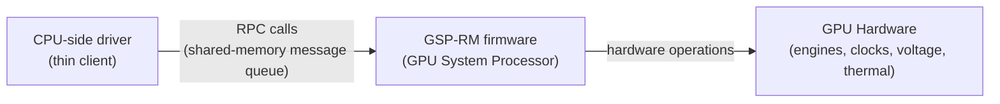
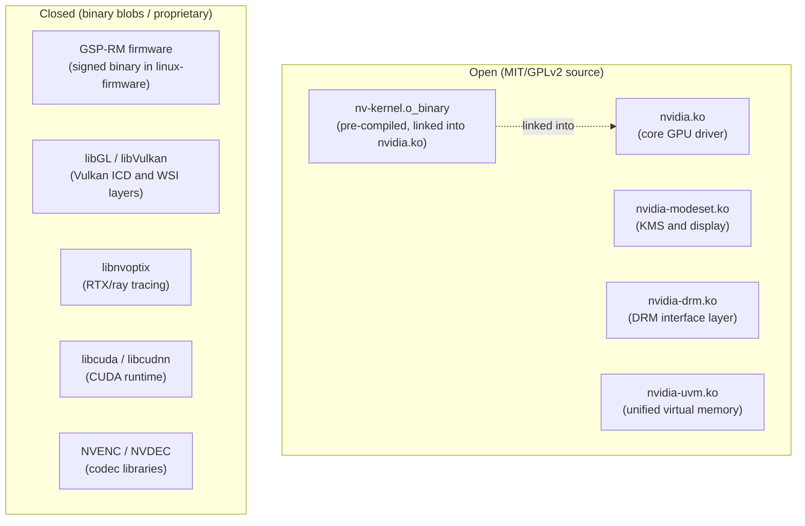
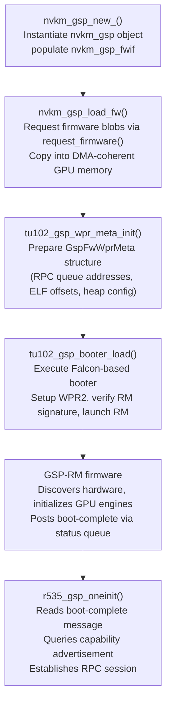
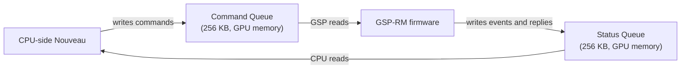
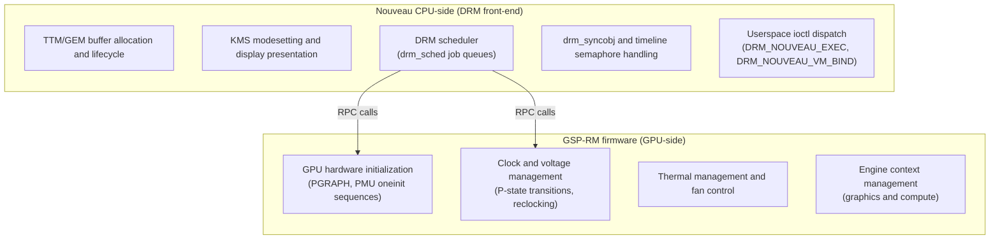

# Chapter 9: GSP-RM, Firmware, and the nvidia-open Connection

> **Part**: Part III — The Nouveau Story
> **Audience**: Systems developer — this chapter is primarily for kernel driver developers and those evaluating the open vs. proprietary NVIDIA stack for production deployment
> **Status**: First draft — 2026-06-06

## Table of Contents

- [Overview](#overview)
- [1. What GSP-RM Is: Architecture and Motivation](#1-what-gsp-rm-is-architecture-and-motivation)
  - [1.1 What is Nouveau?](#11-what-is-nouveau)
  - [1.2 What is GSP-RM?](#12-what-is-gsp-rm)
  - [1.3 What is linux-firmware?](#13-what-is-linux-firmware)
- [2. The nvidia-open Kernel Module: What Changed in 2022](#2-the-nvidia-open-kernel-module-what-changed-in-2022)
- [3. Nouveau's GSP-RM Support: Technical Architecture](#3-nouveaus-gsp-rm-support-technical-architecture)
- [4. Feature Parity and What GSP-RM Unlocks](#4-feature-parity-and-what-gsp-rm-unlocks)
- [5. Security Implications and the Trust Model](#5-security-implications-and-the-trust-model)
- [6. The Path Toward a Fully Open NVIDIA Stack](#6-the-path-toward-a-fully-open-nvidia-stack)
- [7. Operating nvidia-open Day-to-Day: Configuration, Monitoring, and Wayland Setup](#7-operating-nvidia-open-day-to-day-configuration-monitoring-and-wayland-setup)
- [Integrations](#integrations)
- [References](#references)

---

## Overview

The history of the **Nouveau** driver is, in large part, a history of inference. For roughly fifteen years, the open-source community painstakingly reverse-engineered NVIDIA's hardware interfaces — register by register, ioctl by ioctl — building a driver that could drive NVIDIA GPUs without access to any official documentation. That era did not simply end; it transformed. Between 2022 and 2024, two interconnected events changed the terms of engagement: NVIDIA opened the source code of its kernel module under a dual MIT/GPLv2 license, and **Nouveau** gained the ability to boot NVIDIA's own **GSP-RM** firmware — the embedded resource manager that runs on a dedicated processor inside every NVIDIA GPU since the **Turing** generation.

This chapter is about what those two events mean technically. The **GPU System Processor Resource Manager** (**GSP-RM**) is not merely a firmware blob sitting in **`/lib/firmware`**; it is a complete resource management stack compiled for a **RISC-V** or **Falcon**-family processor embedded in the GPU die itself. Section 1 covers what the **GSP** processor is and why NVIDIA moved the **Resource Manager** (**RM**) onto it, including the virtual-machine isolation, firmware updatability, and security motivations behind the architectural decision. It also explains the **Firmware Blob** that ships in **`linux-firmware`** — two signed binary images per GPU family, verified by the **GSP** hardware before execution, and extracted using the **`extract-firmware-nouveau.py`** script from the **open-gpu-kernel-modules** repository.

When **Nouveau** loads and boots this firmware, it stops being a pure reverse-engineered driver on **Turing** and later hardware and becomes, instead, a kernel-space front-end that communicates with NVIDIA's own management logic via a message-queue **RPC** interface. The practical consequences are substantial: reclocking works for the first time on these GPU generations, **Ampere** (**RTX 30** series) and **Ada Lovelace** (**RTX 40** series) gain real hardware acceleration support, and fan control and thermal management become reliable. The philosophical consequences are equally real and deserve honest examination.

Section 2 examines the **nvidia-open** kernel module released on May 19, 2022:

- **What the open module exposes** — **`nvidia.ko`**, **`nvidia-modeset.ko`**, **`nvidia-drm.ko`**, and **`nvidia-uvm.ko`**, including the **`drm_syncobj`** integration that unblocked **Wayland** explicit synchronisation
- **What remains closed** — the **GSP-RM** firmware blobs, **`nv-kernel.o_binary`**, and the entire proprietary userspace including **`libGL`**, **`libVulkan`**, **`libcuda`**, **`libnvoptix`**, and **NVENC**/**NVDEC** libraries
- **`nv-kernel.o_binary` transitional nature** — the compatibility shim for **Turing**-generation targets and its planned elimination as the codebase is refactored
- **Implications for distributions and Nouveau** — how the open module bifurcates the NVIDIA Linux driver landscape from **Nouveau**'s separate development trajectory

Section 3 covers **Nouveau**'s **GSP-RM** support as it is architecturally structured in the kernel source:

- **`nvkm_gsp` subdevice hierarchy** — located under **`drivers/gpu/drm/nouveau/nvkm/subdev/gsp/`**
- **Activation and configuration** — the **`nouveau.config=NvGspRm=1`** parameter and the automatic enablement path for **Ada Lovelace** hardware
- **Multi-stage boot sequence** — through **`nvkm_gsp_load_fw()`**, **`tu102_gsp_wpr_meta_init()`**, the **`GspFwWprMeta`** structure, and **`tu102_gsp_booter_load()`**
- **RPC message queue protocol** — dual **256 KB** circular queues in GPU memory with the **`rpc_message_header_v`** structure
- **Ownership split** — **GSP-RM** owns hardware init, clocks, and thermals; **Nouveau**'s CPU-side code owns **TTM**/**GEM**, **KMS**, **`drm_sched`**, **`drm_syncobj`**, **`DRM_NOUVEAU_EXEC`**, and **`DRM_NOUVEAU_VM_BIND`**
- **`open-gpu-doc` repository** — provides the class definitions and method encodings needed to implement the **RPC** protocol

Section 4 covers feature parity, documenting what **GSP-RM** unlocks and what gaps remain:

- **Pre-GSP-RM baseline** — fixed low-power clocks on **Turing** and **Ampere** delivering roughly 20% of rated performance
- **Working reclocking** — via **P-state** transitions, enabled for the first time on these GPU generations
- **Proper Ampere support** — full **GA102** (RTX 30 series) hardware acceleration
- **Initial Ada Lovelace support** — **AD102** hardware acceleration, the only supported path on RTX 40 hardware
- **Firmware blob packaging** — distribution considerations for the large per-family blobs
- **Remaining gaps** — ray tracing acceleration, **DisplayPort 2.0** bandwidth, **NVENC**/**NVDEC** codec access, and **CUDA** (which continues to require the proprietary userspace regardless of kernel driver)

Section 5 examines the security implications and trust model:

- **IOMMU-mediated DMA access** — the threat surface created by the **GSP** processor's direct access to system memory
- **Spectre-class threat surface** — speculative execution channels between the **GSP** and CPU
- **Firmware analogues** — a comparison with **AMD**'s **PSP** and **SMU** firmware and Intel's **GuC**/**HuC** firmware as structural counterparts
- **Hardware-enforced signing** — prevents running community-built firmware even if source were published
- **Distribution policies** — **Debian** and **Fedora** approaches to the firmware blobs
- **vGPU attestation and licensing** — checks enforced through **GSP-RM**

Section 6 addresses the path toward a fully open NVIDIA stack:

- **What has changed** — the **nvidia-open** release, the **`open-gpu-doc`** publication, and NVIDIA's upstream engagement with **Wayland** explicit sync
- **What remains closed** — the **GSP-RM** firmware source, **Turing+** clock tree and power-domain documentation, and the **CUDA** and proprietary **Vulkan** userspace
- **Nouveau vs. nvidia-open convergence** — architectural reasons why the two are unlikely to converge (**nvkm** vs. **NvRmApi**/**NvPort** abstraction layers)
- **Nova Rust kernel driver** — introduced in **Linux 6.10** as a clean-sheet **GSP-RM** client split into **`nova-core`** and **`nova-drm`** under **`drivers/gpu/drm/nova/`**

---

## 1. What GSP-RM Is: Architecture and Motivation

Every NVIDIA GPU since the Turing generation — first appearing publicly as the TU102 die in 2018 — contains a dedicated embedded processor called the GPU System Processor, or GSP. On the consumer Turing, Ampere, and Ada Lovelace parts that are the primary target of Nouveau's GSP support, this processor is based on NVIDIA's Falcon microcontroller architecture, specifically the Falcon v6 variant, augmented with RISC-V extension support. On later datacenter-class silicon (Hopper GH100, Blackwell GB100, GB202), NVIDIA transitioned the GSP to a more capable RISC-V configuration with a different boot path — the FMC (First Stage Microcode) boot sequence — but for the GPU families that most Linux desktop and workstation users encounter, the Falcon-family boot infrastructure applies.

The GSP sits on the GPU die in a dedicated region separate from the shader engines and display pipeline. It has its own address space and its own dedicated aperture into GPU framebuffer memory from which it loads and executes firmware. Critically, it can initiate DMA operations to system memory independently of the main GPU engines, which is precisely what makes it useful for management purposes — and what creates the security boundary discussed in section 5.

### What "Resource Manager" Actually Means

In NVIDIA's internal architecture, the Resource Manager (RM) is the software layer responsible for everything that is not rendering, compute, or display: hardware initialization, clock and voltage programming, power domain management, thermal monitoring and fan control, engine context management, and virtualisation multiplexing. Historically, the RM ran entirely on the host CPU as part of the proprietary `nvidia.ko` kernel module — a substantial body of code, several million lines, that was the central reason NVIDIA's kernel module remained closed source for decades. The sensitivity was not primarily about rendering algorithms; it was about the intimate hardware knowledge encoded in the RM's clock trees, voltage tables, and engine initialization sequences.

With the introduction of GSP-RM, NVIDIA moved the RM off the CPU and onto the GSP processor itself. The CPU-side driver becomes a thin client: it sends structured RPC calls to the GSP over a shared-memory message queue, and the GSP's RM firmware carries out the actual hardware operations. This is the architectural transformation that both the nvidia-open release and Nouveau's GSP-RM support are built on.



### Why NVIDIA Made This Move

NVIDIA has publicly cited several motivations for the GSP-RM architecture. The virtualisation use case is the most immediately compelling: in a vGPU deployment, multiple virtual machines need isolated access to GPU resources. With the RM running on the GSP, the GSP can manage resource partitions independently of hypervisor trust boundaries. Each virtual function (VF) in an SR-IOV configuration gets a separate channel to GSP-RM; the hypervisor's CPU-side driver does not need direct access to the hardware RM internals. This is substantially cleaner than the previous vGPU licensing architecture, which required a privileged host driver with deep hardware access running alongside each VM.

A second motivation is firmware updatability. When the RM ran on the CPU, updating the resource management logic required shipping a new kernel module — a process complicated by kernel ABI fragility, DKMS, and distribution packaging. With the RM on the GSP, NVIDIA can update the RM firmware independently of the kernel module, provided the RPC interface between CPU and GSP remains stable. In practice, the current RPC interface does not guarantee stability across firmware versions, but the architectural potential exists.

A third motivation is security. Sensitive hardware operations — clock programming, voltage control, power limit enforcement — run inside the GSP's execution environment, which is isolated from the CPU's address space. This does not make the operations unreachable to a compromised system (the GSP and CPU share physical memory, and the IOMMU situation is imperfect), but it does raise the cost of casual tampering.

### The Firmware Blob

The GSP-RM firmware ships as a collection of binary blobs in the `linux-firmware` repository. For a given GPU family, the Nouveau driver requires two firmware images, each in the range of 20–30 MB — substantially larger than typical microcode blobs. The naming follows the pattern `nvidia/` prefixed paths with generation-specific identifiers. The firmware is cryptographically signed with NVIDIA's key; the GSP hardware verifies this signature before executing the firmware. A build of the GSP-RM firmware from the nvidia-open repository's source code cannot be booted on real hardware without NVIDIA's signing key, even though the build infrastructure is published.

This means that while you can, in principle, read the CPU-side RPC stub code that ships in the open kernel module, the actual logic running on the GPU processor remains opaque unless you have access to the GSP firmware's disassembly — and since the Falcon/RISC-V instruction sets are embedded processor ISAs with limited public tooling, that analysis is nontrivial. The Envytools project has historically targeted Falcon, but the more capable RISC-V variants used in later GSP revisions require standard RISC-V tooling applied to a custom memory layout.

The practical consequence for Linux users is that using GSP-RM on modern NVIDIA hardware requires fetching NVIDIA-signed firmware from `linux-firmware`. Distributions differ in their policies: Debian places these blobs in `firmware-nvidia-gsp` within the non-free-firmware section; Fedora packages them in `linux-firmware` and enables them by default for Turing+ hardware with the nvidia-open module.

### 1.1 What is Nouveau?

Nouveau is the mainline Linux kernel's open-source driver for NVIDIA GPUs. It lives under `drivers/gpu/drm/nouveau/` in the kernel tree and implements the standard DRM/KMS interfaces — the same subsystem interfaces used by AMD's amdgpu and Intel's i915 drivers. Unlike those drivers, which operate with varying degrees of official hardware documentation, Nouveau was built almost entirely through reverse engineering of NVIDIA's undocumented hardware interfaces over roughly fifteen years, covering generations from the early NV04 (TNT2) through Ada Lovelace (RTX 40).

The driver is organised around an internal hardware abstraction layer called nvkm (Nouveau kernel module), which represents GPU hardware as a hierarchy of subdevice objects: the memory controller, the display engine, video decode engines, and — since Linux 6.7 — the GSP processor. Nouveau implements kernel mode-setting, GEM buffer management through TTM, command submission via drm_sched, and the `DRM_NOUVEAU_EXEC` and `DRM_NOUVEAU_VM_BIND` ioctls introduced to support the NVK Vulkan driver built in Mesa.

This chapter examines a specific phase of Nouveau's evolution: the transition from pure reverse-engineered hardware control on Turing and later hardware to a model where Nouveau delegates resource management to NVIDIA's own GSP-RM firmware. Understanding Nouveau's architecture — and its deliberate separation from the nvidia-open kernel module covered in section 2 — is prerequisite to understanding what that transition means and what it changes for users and distributors.

### 1.2 What is GSP-RM?

GSP-RM stands for GPU System Processor Resource Manager. It is NVIDIA's firmware implementation of the resource management layer that, on Turing and later GPU families, runs on the GSP — a dedicated embedded processor on the GPU die — rather than on the host CPU as part of the kernel module. The Resource Manager is the software component responsible for hardware initialization, clock and voltage programming, thermal and fan control, engine context management, and virtualisation multiplexing: everything below rendering and compute in NVIDIA's internal software stack.

Before the GSP architecture, this logic ran on the host CPU inside the proprietary `nvidia.ko` kernel module, where it required direct access to GPU register spaces, memory-mapped configuration interfaces, and power domain state machines. Moving it onto the GSP transforms the CPU-side driver into a thin RPC client: it submits structured requests to GSP-RM over a shared-memory message queue in GPU framebuffer memory, and the firmware carries out the actual hardware operations without exposing those interfaces to the host.

From Nouveau's perspective, GSP-RM support means that on Turing, Ampere, and Ada Lovelace hardware, the driver no longer attempts to implement clock management, power state transitions, or hardware initialization from reverse-engineered register sequences. Instead, it boots NVIDIA's signed firmware blob, establishes the RPC session described in section 3, and relies on GSP-RM to manage those operations. The practical consequence is that features previously unavailable on these GPU generations — principally functional reclocking and full Ampere and Ada hardware acceleration — become accessible through a mainlined, distribution-integrated kernel driver.

### 1.3 What is linux-firmware?

linux-firmware is a repository of binary firmware blobs required by Linux kernel drivers to initialize specific hardware. The upstream source is maintained at `https://git.kernel.org/pub/scm/linux/kernel/git/firmware/linux-firmware.git`. Drivers request firmware through the kernel's firmware loading API via `request_firmware()`, which searches for the blob under `/lib/firmware/` on the running system. The kernel tree itself contains no firmware binaries; it relies on the initramfs or installed system to supply them at driver load time.

For NVIDIA GSP-capable hardware, linux-firmware ships the GSP-RM firmware blobs — the signed binary images that boot the GSP processor and establish the resource management runtime on the GPU. These blobs are substantially larger than typical microcode files: 20–30 MB per GPU family, compared with the kilobytes typical of CPU microcode patches. They are organized under `nvidia/` within the firmware tree, with names encoding the GPU family and firmware revision.

Whether these blobs are installed by default or placed in a restricted section of a distribution's package tree depends on distribution policy. Some treat signed vendor firmware as redistributable without source; others apply a stricter free-software policy and place them in a non-free or contrib section that must be explicitly enabled. For Nouveau users on Ada Lovelace hardware, the GSP-RM blobs are not optional — GSP-RM is the only supported initialization path for those GPUs, making linux-firmware a hard runtime dependency rather than an optional enhancement.

---

## 2. The nvidia-open Kernel Module: What Changed in 2022

On May 19, 2022, NVIDIA published the source code of its GPU kernel modules under a dual MIT/GPLv2 license. The release covered the Turing architecture (TU102 and later) and was hosted at `https://github.com/NVIDIA/open-gpu-kernel-modules`. This was described at the time — accurately — as the most significant change in NVIDIA's Linux driver history. What it actually changed, and what it left unchanged, requires careful examination.

### What the Open Module Exposes

The nvidia-open release exposes the CPU-side kernel module infrastructure: the code that loads firmware into the GSP, exchanges RPC messages with it, implements the Linux kernel's DRM and KMS interfaces, manages memory through GEM and DMA-BUF, and presents the NVOS ioctl interface to userspace. This is not a small codebase — the repository spans over 900,000 lines of production code across the nine hardware generations it supports.

Specifically, the open module provides `nvidia.ko` (the core GPU driver), `nvidia-modeset.ko` (KMS and display), `nvidia-drm.ko` (the DRM interface layer), and `nvidia-uvm.ko` (unified virtual memory). The OS abstraction layer — traditionally one of the most locked-down pieces of NVIDIA's stack — is present as `kernel-open/nvidia/os-interface.c`, giving the community visibility into exactly how NVIDIA bridges its internal RM abstractions to Linux kernel APIs.

One significant practical improvement is the `drm_syncobj` integration. The closed nvidia module famously required workarounds to avoid using GPL-only exported kernel symbols, limiting its integration with internal kernel APIs. The open module, licensed under GPLv2, can use these APIs directly. This enabled proper `drm_syncobj` support, which in turn unblocked Wayland explicit synchronization — a long-standing issue described in detail in Chapter 3. Distributions using the nvidia-open module on Turing+ hardware get native KMS support and explicit sync without the fragile workarounds that characterized the closed module.

### What Remains Closed

It is essential to be precise about what the open module does not provide. The GSP-RM firmware itself — the binary that actually runs on the GSP processor and contains the resource management logic — remains proprietary and signed. It ships as binary blobs in `linux-firmware`, not as source in the open-gpu-kernel-modules repository. The CPU-side open module knows how to load, boot, and communicate with this firmware; it does not contain or replace it.

Additionally, `nvidia.ko` still includes pre-compiled binary objects for certain architectural components — `nv-kernel.o_binary` for the nvidia.ko module and `nv-modeset-kernel.o_binary` for the modeset module. These are OS-agnostic internal components that NVIDIA compiles separately and links into the final module. Their presence means that even building the "open" module from source produces a binary that contains code you cannot inspect as source.

The entire userspace stack — `libGL`, `libVulkan` (both Vulkan ICD and WSI layers), `libnvoptix` (RTX/ray tracing), `libcuda`, `libcudnn`, and the NVENC/NVDEC codec libraries — remains wholly proprietary. This boundary is firm: CUDA and proprietary Vulkan on Linux require NVIDIA's closed userspace regardless of whether the kernel module is open. The NVK Vulkan driver discussed in Chapter 10 is a separate, fully open Mesa implementation that can operate without any proprietary component.



### The nv-kernel.o_binary Transition Problem

A representative example of the transitional nature of the open module is `nv-kernel.o_binary`. This pre-compiled object contains OS-agnostic RM code for Turing-generation GPUs that NVIDIA has not yet restructured for full source exposure. It functions as a compatibility shim during the migration: new-enough hardware (Ampere, Ada, Hopper) has less reliance on it, and NVIDIA's stated direction is to eliminate it as the codebase is refactored. But as of 2025–2026, it remains part of the build for Turing targets, meaning Turing-class users building nvidia-open from source still link against a binary blob.

### Implications for Distributions and Nouveau

The nvidia-open release did not produce a single unified "open NVIDIA stack." Instead, it bifurcated the landscape: the nvidia-open module is NVIDIA's production driver kernel component, targeting users of the proprietary CUDA/Vulkan userspace; Nouveau is a separate kernel driver targeting users who want a fully mainlined, distribution-integrated driver. They use the same GSP firmware blobs, but they use entirely different CPU-side code, have different goals, and are not interchangeable components.

The horizon question — could Nouveau eventually use nvidia-open's kernel infrastructure instead of its own? — is discussed in section 6. The short answer is that the two projects have different structural goals that make direct merger unlikely, even as they draw on overlapping information sources.

---

## 3. Nouveau's GSP-RM Support: Technical Architecture

Nouveau's GSP-RM support was developed primarily by Ben Skeggs at Red Hat/NVIDIA over a period of several years, based on careful reading of the nvidia-open source code (which revealed the CPU-side RPC protocol) and the `open-gpu-doc` hardware documentation (which provided class and method definitions). It was merged into the mainline Linux kernel in the 6.7-rc1 merge window in late 2023. The version 6.6 merge window, often cited in error, brought the `DRM_NOUVEAU_VM_BIND` and GPUVM integration — a companion restructuring of Nouveau's memory management — but not GSP-RM itself.

### The GSP Subdevice in nvkm

Nouveau's internal hardware abstraction layer, nvkm, represents each hardware subsystem as a subdevice or engine object within a hierarchy. The GSP processor is represented by `struct nvkm_gsp`, defined in `drivers/gpu/drm/nouveau/nvkm/subdev/gsp/`. The GSP subdevice directory has the following structure:

```
drivers/gpu/drm/nouveau/nvkm/subdev/gsp/
├── Kbuild
├── base.c          — common GSP subdevice infrastructure
├── priv.h          — private structures and function declarations
├── fwsec.c         — firmware security module
├── ad102.c         — Ada Lovelace (RTX 40)
├── ga100.c         — Ampere GA100 (datacenter)
├── ga102.c         — Ampere GA102 (RTX 30)
├── gb100.c         — Blackwell GB100
├── gb202.c         — Blackwell GB202
├── gh100.c         — Hopper GH100
├── gv100.c         — Volta GV100
├── tu102.c         — Turing TU102 (RTX 20)
├── tu116.c         — Turing TU116 (GTX 16 series)
└── rm/             — RPC encoding layer
    ├── r535/       — r535 protocol version
    ├── r570/       — r570 protocol version
    ├── rm.h
    ├── rpc.h
    ├── engine.h
    ├── gpu.h
    ├── gr.h
    ├── handles.h
    ├── client.c
    ├── engine.c
    ├── gr.c
    ├── nvdec.c
    ├── nvenc.c
    ├── ad10x.c
    ├── ga100.c
    ├── ga1xx.c
    ├── gb10x.c
    ├── gb20x.c
    ├── gh100.c
    └── tu1xx.c
```

The `r535` label refers to NVIDIA driver version 535, which defined the RPC protocol version that Nouveau initially targeted. The `r535` naming convention is a source of confusion for newcomers: it is not a GPU generation or a kernel version; it is a protocol version label derived from the NVIDIA driver release that established the RPC interface specification. As of 2025–2026, Nouveau has added `r570` support tracking the 570 driver release, and the `r535` path is considered the reference/legacy version. Both subdirectories contain version-specific RPC encodings that implement the same conceptual interface at different revisions.

### Activation and Configuration

GSP-RM support is activated through the `nouveau.config=NvGspRm=1` kernel module parameter for Turing and Ampere GPUs. For Ada Lovelace (RTX 40 series, `ad102.c`), GSP-RM is enabled automatically and is the only supported path — NVIDIA has not maintained the software-only hardware initialization path for Ada. This creates a hard dependency on the signed firmware blobs for anyone running Nouveau on RTX 40 hardware.

### The Boot Sequence

The Turing boot sequence, as implemented in `tu102.c` with the r535 protocol layer, proceeds through the following stages. First, `nvkm_gsp_new_()` in `base.c` instantiates the `nvkm_gsp` object and populates the firmware interface table (`nvkm_gsp_fwif`), which maps the GPU variant to its firmware loading functions. Second, firmware loading begins: `nvkm_gsp_load_fw()` constructs the firmware path from a name and version pattern (`"gsp/%s-%s"`), requests the blobs from the kernel firmware subsystem via `request_firmware()`, and copies them into DMA-coherent GPU memory. Third, `tu102_gsp_wpr_meta_init()` prepares the `GspFwWprMeta` structure — a metadata block placed at the start of the protected region that tells the booter firmware where to find the RM image, its ELF sections, heap configuration, and the RPC queue addresses.

The `GspFwWprMeta` structure contains, among other fields, `partitionRpcAddr`, `partitionRpcRequestOffset`, and `partitionRpcReplyOffset`, which are the addresses in GPU memory where the command and status queues will reside once the RM firmware has initialized. These addresses are negotiated at boot time and embedded in the metadata before the GSP processor is released from reset.

Fourth, `tu102_gsp_booter_load()` executes the booter firmware — a small Falcon-based stage-one loader that sets up the WPR2 (Write-Protected Region 2) memory protection, verifies the signature on the RM image, and launches the RM. Fifth, after the RM firmware starts executing, it discovers the hardware, initializes GPU engines, and sends a "boot complete" notification via the status queue. Sixth, `r535_gsp_oneinit()` runs on the CPU side: it reads the boot complete message, queries the GSP for its capability advertisement, and establishes the RPC session that subsequent driver operations will use.



### Code Example: GspFwWprMeta Structure

```c
/* Source: drivers/gpu/drm/nouveau/nvkm/subdev/gsp/tu102.c
 * The WPR metadata structure passed to the GSP booter firmware.
 * Fields set here are consumed by the booter before it releases the RM.
 */
struct GspFwWprMeta {
    /* Physical addresses of firmware ELF and booter images */
    NvU64 magic;                    /* WPR_HEADER_MAGIC to validate layout */
    NvU64 revision;                 /* metadata format revision */
    NvU64 bootloaderCodeOffset;     /* offset of bootloader code in WPR */
    NvU64 bootloaderDataOffset;     /* offset of bootloader data in WPR */
    NvU64 bootloaderManifestOffset; /* offset of signed manifest */
    NvU64 gspFwOffset;              /* offset of the RM ELF image */
    NvU64 gspFwSize;                /* size of RM ELF */
    NvU64 gspFwHeapOffset;          /* base of the RM heap region */
    NvU64 gspFwHeapSize;            /* RM heap size */
    /* RPC queue addresses written by RM during boot */
    NvU64 partitionRpcAddr;         /* base address of partition RPC block */
    NvU32 partitionRpcRequestOffset;  /* command queue offset within block */
    NvU32 partitionRpcReplyOffset;    /* status queue offset within block */
    /* ... additional fields for signature, WPR2 layout, etc. */
};
```

### The RPC Message Queue Protocol

Once the GSP-RM firmware has booted, all communication between the CPU-side Nouveau code and the GSP uses a pair of circular message queues in GPU memory: the command queue (CPU writes, GSP reads) and the status queue (GSP writes events and replies, CPU reads). Queue initialization uses `msgqInit` and `msgqTxCreate`; the queues are sized at 256 KB on real hardware.

The core RPC message structure is `rpc_message_header_v`, which contains a function ID identifying the operation requested, a sequence number for matching replies to requests, and a union of payload types — one per RPC function. The `RPC_HDR` and `RPC_PARAMS` macros provide type-safe access to the header and payload fields respectively.



### Code Example: RPC Message Header and Reply Modes

```c
/* Source: drivers/gpu/drm/nouveau/nvkm/subdev/gsp/rm/rpc.h
 * Core RPC message structure for GSP-RM communication.
 */
struct rpc_message_header_v {
    NvU32 header_version;    /* protocol version discriminator */
    NvU32 signature;         /* magic value for sanity checking */
    NvU32 length;            /* total message length in bytes */
    NvU32 function;          /* RPC function ID (NV_VGPU_MSG_FUNCTION_*) */
    NvU32 rpc_result;        /* result code written by GSP on reply */
    NvU32 rpc_result_private; /* secondary result or error detail */
    NvU32 sequence;          /* sequence number for req/reply matching */
    /* payload follows immediately after this header */
};

/*
 * Reply waiting modes used by the CPU-side RPC send path:
 *   NOWAIT  — return immediately after enqueuing; no reply collected
 *   NOSEQ   — like NOWAIT but suppress sequence numbering
 *   RECV    — block until GSP posts a reply; retrieve full message
 *   POLL    — spin-wait for a specific reply, then discard it
 */
```

The RPC functions mirror the NV_RM_API object model from NVIDIA's proprietary ioctl interface. The three most fundamental operations are object allocation (`NV_RM_RPC_ALLOC_OBJECT`), object control (`NV_RM_RPC_CTRL`), and memory mapping (`NV_RM_RPC_MAP_MEMORY`). Object allocation creates RM-managed hardware resources — channels, engines, display heads — by sending a request that names the object class (from the `open-gpu-doc` class definitions) and receives back a handle. Subsequent control operations on that handle invoke specific hardware management functions.

The handle encoding scheme deserves mention for the insight it gives into the overall resource model. Handles encode their resource type directly: domain handles begin at `0xD0D00000`, client handles at `0xC1D00000`, and virtual-function client handles at `0xE0000000`. Each range supports up to one million distinct handles, and the encoding allows the GSP-RM firmware to dispatch operations to the correct resource manager subsystem without an additional table lookup.

### What GSP-RM Manages vs. What Nouveau Still Owns

The architectural split is the most important thing to internalize about Nouveau's GSP-RM path. GSP-RM owns everything that the resource manager historically controlled: GPU hardware initialization (the per-engine `oneinit` sequences that nvkm would otherwise run in software), clock and voltage management including the P-state transitions that enable reclocking, thermal management and fan control, and context management for graphics and compute engines. This means that when GSP-RM is active, `nvkm_engine` initialization paths for `PGRAPH`, `PMU`, and similar engines are skipped — the GSP has already initialized them.

Nouveau's CPU-side code retains ownership of everything that touches the DRM subsystem and system memory: TTM/GEM buffer allocation and lifecycle, KMS modesetting and display presentation, the DRM scheduler and `drm_sched` job queues, `drm_syncobj` and timeline semaphore handling, and userspace ioctl dispatch (`DRM_NOUVEAU_EXEC`, `DRM_NOUVEAU_VM_BIND`). This is the boundary that defines Nouveau's role: it is the kernel's legitimate DRM front-end, and GSP-RM is its hardware back-end.



### The open-gpu-doc Connection

The `open-gpu-doc` repository at `https://github.com/NVIDIA/open-gpu-doc` was essential to the Nouveau GSP-RM implementation. It provides class definitions for RM-managed hardware objects — the numerical class IDs needed in `NV_RM_RPC_ALLOC_OBJECT` calls — along with method encodings for engine control operations, register-level documentation for display, memory, and context-switching subsystems, and power state table formats. Without this documentation, implementing the RPC protocol from the CPU side would have required not just reading the nvidia-open module's message construction code but also guessing which class IDs correspond to which hardware objects. The open-gpu-doc publication, combined with the open kernel module's RPC encoding code, provided a complete picture of the protocol without requiring disassembly of the GSP firmware itself.

---

## 4. Feature Parity and What GSP-RM Unlocks

The practical argument for GSP-RM in Nouveau is straightforward: before it existed, Turing and Ampere GPUs under Nouveau were severely limited in ways that made them unsuitable for any serious use.

### The Pre-GSP-RM Situation

Without GSP-RM, Nouveau on Turing hardware could not perform reclocking. The GPU's clocks were fixed at whatever state they were left in by the firmware at boot — typically a low-power idle state. On a modern RTX 20 or 30 series GPU, this means the shader cores run at a fraction of their rated frequency, the memory bus operates at its lowest validated speed, and the resulting performance is roughly 20% of what the proprietary driver achieves. This is not a software rendering fallback; the GPU hardware is fully operational, but without RM-controlled clock programming, it cannot change frequency.

Additionally, without RM initialization, several hardware subsystems are in an indeterminate or partially initialized state. HDMI and DisplayPort audio are unreliable because the audio endpoint power sequences go through the RM. Fan control is absent or requires crude manual MMIO writes that do not account for thermal zones. Compute: while basic OpenGL and Vulkan work at the reduced clock speed, higher-level hardware features (precise preemption modes, hardware context isolation) require RM object allocations that the CPU-side-only path cannot perform.

### What GSP-RM Enables

With GSP-RM active, reclocking works for the first time on Turing and Ampere hardware in Nouveau. The GSP's RM firmware handles the full P-state transition sequence: it programs the PLL, adjusts voltages in the correct sequence to avoid instability, verifies the resulting frequency, and responds to thermal events by throttling appropriately. From the CPU side, this appears as a clock management RPC call; the complexity lives in the firmware.

Proper Ampere support is the second major unlock. GA102 (RTX 3000 series) hardware was not fully functional in Nouveau before the GSP-RM path. The Ampere generation introduced significant changes to the graphics engine initialization sequence and context management model; without RM initialization, the engines do not come up in a useful state. With GSP-RM, `ga102.c`'s GSP subdevice brings the hardware up through the standard RPC boot sequence and the engines are ready for use.

Ada Lovelace initial support is entirely conditional on GSP-RM, as noted earlier. `ad102.c` in the GSP subdevice tree enables the RTX 4000 series (AD102 and related dies) with hardware acceleration. As of 2024–2025, this support is functional for general 3D and compute workloads but lacks ray tracing hardware access (which requires additional RM object allocations not yet implemented), and NVENC/NVDEC support is limited. Sensor monitoring through the thermal management interface was also noted as non-functional in early GSP-RM builds, though fan control via RM thermal RPCs does work.

The NVK Vulkan driver (Chapter 10) benefits directly from GSP-RM on Turing+ because GSP-RM handles the engine initialization that NVK would otherwise be unable to drive. When the LWN "Nouveau graphics driver update" article reported that NVK performance on test hardware had risen from 20 frames per second to over 1000 after the NAK compiler was introduced, that improvement was measured on hardware where GSP-RM was handling the RM initialization — without reclocking, the baseline would have been far lower.

### Firmware Size and Distribution Concerns

The firmware blobs are large — two files per GPU family, each 20–30 MB — which has practical consequences for initramfs-based boot configurations. Distribution packagers must decide whether to include these blobs in the initramfs for early-boot GPU acceleration or defer them to the running system. The linux-firmware WHENCE file tracks each blob's origin (extracted from NVIDIA's `.run` driver packages using the `extract-firmware-nouveau.py` script from the open-gpu-kernel-modules repository). The extraction script is important: it means the firmware blobs are not hand-crafted for Nouveau but are the identical images that the nvidia-open module uses, ensuring compatibility.

### Remaining Gaps

Even with GSP-RM fully operational, the gap between Nouveau and the proprietary driver is not zero. Ray tracing acceleration on RTX hardware requires allocating RT engine objects through the RM — the class definitions exist in `open-gpu-doc`, but the Nouveau implementation has not yet built the full allocation chain. The HDMI 2.1 and DisplayPort 2.0 scrambler and link training sequences are partially reverse-engineered and partially driven through RM display RPCs; full DisplayPort 2.0 bandwidth requires the display engine work described in Chapter 11. CUDA, regardless of kernel driver, requires the proprietary userspace runtime — GSP-RM changes nothing about the kernel/userspace boundary for compute workloads.

---

## 5. Security Implications and the Trust Model

Running any firmware on dedicated GPU hardware involves accepting a trust relationship with the firmware's author. With GSP-RM, that trust relationship is unusually consequential because of the resource manager's scope.

### The Threat Model for Ring-0 Firmware

The GSP processor has DMA access to system memory. This is architecturally necessary: the GSP needs to read commands from the CPU-allocated message queue and write results back. But it means that a compromised or malicious GSP firmware could, in principle, read or write arbitrary physical memory on the host system — the same threat model that applies to any DMA-capable device.

The IOMMU provides the primary mitigation. When the kernel configures the IOMMU to restrict GPU DMA to specific physical address ranges, it limits what the GSP can access even if the firmware behaves badly. Nouveau sets up DMA mappings for the GSP's memory regions; only the areas explicitly mapped are reachable through IOMMU-protected DMA. However, IOMMU protection has limitations: on systems without an IOMMU, or with IOMMU disabled, there is no hardware barrier. Additionally, the RPC message queue itself is in a region that both CPU and GSP can access, meaning a firmware bug that corrupts the queue can affect CPU-side data structures.

The GSP processor runs speculative execution, which raises the theoretical possibility of Spectre-class information disclosure channels between the GSP and the CPU. NVIDIA has not published microarchitectural details of the Falcon or GSP RISC-V variants sufficient for independent analysis. This is a known unknown: the risk exists at least in principle, but the attack surface is narrower than for the main CPU because the GSP's speculative execution is confined to firmware-defined code paths.

Comparing to the broader GPU firmware landscape contextualizes the risk appropriately. AMD's amdgpu driver requires PSP (Platform Security Processor) firmware for secure boot and SMU (System Management Unit) firmware for power management — these are structurally similar blobs. Intel's i915 and Xe drivers require GuC (Graphics Microcontroller) and HuC (HEVC Microcontroller) firmware for submission and media encode. What distinguishes GSP-RM is the scope of what runs in the firmware: AMD's SMU handles power, but the amdgpu driver implements its own graphics engine initialization in open-source code; with GSP-RM, the full resource manager lives in the firmware, giving it broader authority over the hardware state.

### Signing and Libre Software Implications

The signature requirement on GSP firmware blobs has direct implications for software freedom advocates. The signed firmware requirement means that even if NVIDIA were to publish the GSP firmware source code tomorrow, users could not build and run their own version without NVIDIA's signing key. The hardware verifies signatures before execution; there is no bypass path without modifying the GPU hardware itself. This is structurally identical to Secure Boot's effect on bootloaders: source availability does not equal deployability when hardware-enforced signing is in place.

The Debian project's position on this is clear: firmware blobs go in `non-free-firmware`, regardless of license. The blob for GSP-RM is not GPL-licensed; its presence in `linux-firmware` reflects practical necessity rather than philosophical endorsement. Fedora's approach is more permissive, including the blobs in the standard `linux-firmware` package given their necessity for basic hardware function. This mirrors the longstanding debate about what "free software" means when hardware-enforced signing prevents modification.

### vGPU and Attestation

NVIDIA's vGPU licensing model passes through GSP-RM: the firmware enforces the licensing checks that restrict which physical GPUs can run vGPU workloads. The nvidia-open module exposes some of the attestation-related RPC infrastructure, which theoretically reveals the mechanism of the licensing checks. NVIDIA's license terms prohibit using the open source code to bypass these checks, and attempting to modify the firmware would fail the signature verification. This is the boundary between open source (which you can read) and open hardware (which you cannot reprogram).

---

## 6. The Path Toward a Fully Open NVIDIA Stack

Evaluating where the NVIDIA Linux stack is headed requires distinguishing between what has changed, what is changing slowly, and what has not moved.

### What Has Changed

The nvidia-open release represents a genuine architectural opening. The CPU-side kernel module is now inspectable, buildable from source (modulo the binary object shims), and subject to community audit. This has practical value: security researchers can examine how the driver interacts with kernel memory, distribution maintainers can apply patches without waiting for NVIDIA's release cycle for the kernel-mode pieces, and the GPL-only symbol workarounds that complicated the closed module's kernel integration are gone.

The `open-gpu-doc` publication, while limited in scope — it covers hardware register definitions and class interfaces but not the RM's internal logic — provides the foundation for the kind of third-party driver work that produced Nouveau's GSP-RM implementation. Faith Ekstrand's NVK Vulkan driver (Chapter 10) demonstrates what becomes possible when hardware documentation meets open source expertise: a fully mainlined, conformant Vulkan implementation built without access to NVIDIA's internal rendering algorithms.

NVIDIA's engagement with Wayland explicit sync standardization (Chapter 3) signals a cultural shift: the company is now participating in upstream kernel and compositor standardization work rather than shipping proprietary extensions. This is not the same as opening the full stack, but it changes the collaborative dynamic.

### What Remains Closed

For a fully open NVIDIA GPU stack, three things would need to change that have not. First, the GSP-RM firmware source would need to be published and made buildable by third parties with freely available signing keys — or the signing requirement would need to be relaxed for development builds. Second, hardware documentation for Turing+ clock trees, power domains, and engine initialization would need to reach the level of detail available for older NVIDIA generations or for AMD's GCN/RDNA architectures. Third, the Vulkan and CUDA userspace stacks would need open implementations; NVK addresses Vulkan, but an open CUDA implementation at the performance level of cuBLAS and cuDNN does not exist.

The GSP firmware source release is considered unlikely in the near term. NVIDIA's position is that the firmware contains proprietary RM logic accumulated over decades, and the security/virtualisation architecture depends on the signing model. There is a reasonable argument that releasing the source without the signing key provides most of the security review benefit while preserving NVIDIA's hardware authentication model — but this has not been pursued publicly.

### The Nouveau + nvidia-open Relationship

A natural question is whether Nouveau and nvidia-open will eventually converge. They share firmware blobs and draw on the same hardware documentation, but their CPU-side code is architecturally incompatible: nvidia-open targets NVIDIA's existing RM abstraction model with its `NvPort`, `NvRmApi`, and GPU Manager infrastructure, while Nouveau uses nvkm's object hierarchy, which is organized for mainline DRM integration and designed to span GPU generations from NV04 through modern hardware. Merging the two would require either adopting NVIDIA's abstraction model in mainline (which the DRM maintainers would not accept) or rewriting nvidia-open around nvkm (which would defeat the purpose of the open module for NVIDIA's existing customers).

The realistic trajectory is continued parallel development with shared firmware: nvidia-open for users who need the proprietary Vulkan/CUDA userspace, Nouveau for users who want a fully mainlined open driver. Both paths require the same signed GSP firmware blobs, which means both paths have the same fundamental hardware trust requirement. The philosophical tension — pragmatism versus a fully libre stack — does not resolve cleanly, because the hardware architecture has been designed in a way that makes purely open execution on modern NVIDIA GPUs architecturally difficult, not merely legally complicated.

### The Contribution Landscape

Contributing to Nouveau's GSP-RM support has a different character from contributing to the reverse-engineered paths for older hardware. The RPC protocol is documented in the nvidia-open source; the hardware object classes are in `open-gpu-doc`; the implementation structure is established in the `nvkm/subdev/gsp/` and `nvkm/subdev/gsp/rm/` directories. The work is primarily porting RM operations to RPC calls, implementing features like ray tracing object allocation, and ensuring the r570 (and future) protocol versions are correctly supported. This is conventional driver development work, accessible to developers without reverse-engineering expertise, which is precisely what the nvidia-open release was designed to enable. Chapter 32 covers the mechanics of contributing to Nouveau in this context.

The most concrete answer yet to the question of an open GSP-RM client is **Nova** — a clean-sheet Rust kernel driver introduced in Linux 6.10 and expanded through Linux 7.2. Where Nouveau retrofitted GSP-RM support into nvkm's existing engine model, Nova was designed from the ground up for Turing+ GPUs that have only ever known GSP-RM. The driver is split into `nova-core` (a platform driver that boots the GSP and manages the command queue) and `nova-drm` (a DRM driver in `drivers/gpu/drm/nova/`). Linux 7.2 added Turing GSP bringup, an immediate-mode GPUVM abstraction, and DebugFS access to GSP-RM log buffers. Nova demonstrates that the GSP-RM RPC interface — documented in `open-gpu-doc` and implemented via the same command queue described in this chapter — is sufficient to build a fully mainlined, Rust-safe driver without reverse-engineering hardware registers. Chapter 10 covers Nova's architecture in full.

The unanswered question for the decade ahead is whether the GSP-RM architecture represents a permanent equilibrium — open kernel interface, closed management firmware, open userspace Vulkan via NVK, closed CUDA — or whether competitive and regulatory pressures will push the remaining closed components toward openness. The trajectory of the stack since 2022 has been consistently positive, but the core firmware trust requirement has not budged.

---

## 7. Operating nvidia-open Day-to-Day: Configuration, Monitoring, and Wayland Setup

This section is a practical reference for systems and distribution engineers who have deployed nvidia-open and want to configure it correctly, monitor its runtime behaviour, and verify that the Wayland explicit synchronisation path is active. It complements the architectural coverage in Sections 1–6 with operational detail.

### 7.1 NVreg_* Module Parameters

nvidia-open exposes its runtime configuration through kernel module parameters, conventionally written to `/etc/modprobe.d/` as `options nvidia NVreg_Foo=Value`. The full list is declared in the open-module source at `kernel-open/nvidia/nv-reg.h` ([source](https://github.com/NVIDIA/open-gpu-kernel-modules/blob/main/kernel-open/nvidia/nv-reg.h)). The table below covers the parameters most relevant to desktop and workstation deployments.

| Parameter | Values | Default | Effect |
|-----------|--------|---------|--------|
| `NVreg_DynamicPowerManagement` | `0x00` – `0x03` | `0x02` (laptop) / `0x00` (desktop) | Controls RTD3 behaviour: `0x00` = always on, `0x01` = coarse-grained, `0x02` = fine-grained (powers down between ops), `0x03` = enable on all system types |
| `NVreg_PreserveVideoMemoryAllocations` | `0` / `1` | `0` | `1` = preserve VRAM contents across suspend/resume; requires matching `nvidia-hibernate` and `nvidia-resume` systemd units; strongly recommended if RTD3 is enabled |
| `NVreg_TemporaryFilePath` | path string | `/tmp` | Location for driver-managed tmpfs pages when preserving VRAM; set to a tmpfs with enough space (VRAM size) |
| `NVreg_EnableGpuFirmware` | `0` / `1` | `1` (Turing+) | `0` disables GSP firmware path; falls back to CPU-driven RM (limited functionality, no reclocking); useful only for debugging |
| `NVreg_OpenRmEnableUnsupportedGpus` | `0` / `1` | `0` | `1` enables nvidia-open on Kepler/Maxwell/Pascal GPUs that NVIDIA has not officially validated; community-supported only, may be unstable |
| `NVreg_UsePageAttributeTable` | `0` / `1` | auto | Controls use of x86 PAT for WC (write-combining) BAR mappings; normally auto-detected |
| `NVreg_InitializeSystemMemoryAllocations` | `0` / `1` | `1` | Zero-fill system memory allocations for security; `0` disables for marginal performance gain in malloc-heavy CUDA workloads |
| `NVreg_ModifyDeviceFiles` | `0` / `1` | `1` | Allow the driver to manage `/dev/nvidia*` device file permissions |
| `NVreg_DeviceFileUID` / `NVreg_DeviceFileGID` | UID/GID | `0` / `0` | Owner of `/dev/nvidia*` device files |
| `NVreg_EnableResizableBar` | `0` / `1` | auto | Force enable or disable PCIe Resizable BAR (ReBAR); auto-detects BIOS capability |

A minimal workstation configuration enabling fine-grained RTD3 with VRAM preservation:

```bash
# /etc/modprobe.d/nvidia.conf
options nvidia NVreg_DynamicPowerManagement=0x02
options nvidia NVreg_PreserveVideoMemoryAllocations=1
options nvidia NVreg_TemporaryFilePath=/var/tmp
```

Enable the associated systemd units so the driver can serialise VRAM before hibernate:

```bash
sudo systemctl enable nvidia-hibernate.service nvidia-resume.service nvidia-suspend.service
```

Verify the active parameter values at runtime via `/proc/driver/nvidia/params`:

```bash
cat /proc/driver/nvidia/params | grep -E "DynamicPower|PreserveVideo|EnableGpuFirmware"
# DynamicPowerManagement: 2
# PreserveVideoMemoryAllocations: 1
# EnableGpuFirmware: 1
```

[Source: NVIDIA Open GPU Kernel Modules README](https://github.com/NVIDIA/open-gpu-kernel-modules/blob/main/README.md)
[Source: nvidia-open NVreg parameters](https://github.com/NVIDIA/open-gpu-kernel-modules/blob/main/kernel-open/nvidia/nv-reg.h)

### 7.2 nvidia-smi Monitoring for nvidia-open

`nvidia-smi` uses the same ioctl interface regardless of whether the kernel module is nvidia-open or the proprietary binary — the userspace library (`libnvidia-ml.so`) is identical in both cases. The following commands are specifically useful for verifying that nvidia-open's GSP-RM path is performing as expected.

**Verify GSP firmware is active and loaded:**

```bash
# Check the firmware version reported by GSP-RM:
nvidia-smi -q | grep -E "VBIOS|Firmware Version|GSP"

# Confirm the open module is loaded:
modinfo nvidia | grep -E "^filename|^version|^license"
# filename: /lib/modules/.../updates/dkms/nvidia.ko
# version:  575.57.08
# license:  MIT
```

**Monitor P-state (performance state) transitions:**

```bash
# One-shot query showing current P-state and clocks:
nvidia-smi -q -d PERFORMANCE

# Continuous 1-second sampling (useful during GPU load):
nvidia-smi dmon -s pcut -d 1

# Loop showing P-state + power draw:
watch -n 1 'nvidia-smi --query-gpu=pstate,power.draw,clocks.gr,clocks.mem \
  --format=csv,noheader,nounits'
```

Expected output during an idle desktop session:
```
P8, 8.12, 210, 405
```
P8 is the lowest-power idle state (minimum clocks). Under GPU load, this transitions to P2 or P0:
```
P0, 285.40, 2505, 10501
```

**Clock and power summary during a benchmark:**

```bash
# Capture 60 seconds of telemetry at 500ms intervals to a CSV:
nvidia-smi --query-gpu=timestamp,pstate,power.draw,clocks.gr,clocks.mem,temperature.gpu,fan.speed \
  --format=csv -l 1 > nvidia_telemetry.csv &
sleep 60
kill %1
```

**Check RTD3 power gate status:**

```bash
# If the GPU has been powered down by RTD3, the device will report as unavailable:
cat /proc/driver/nvidia/gpus/*/power
# On a powered-up card: PowerState: D0
# After RTD3 power-gate: PowerState: D3
```

**nvidia-smi fan speed and thermal:**

```bash
# Current fan speed and target temperature:
nvidia-smi -q -d FAN,TEMPERATURE

# Fan policy (auto vs manual):
nvidia-settings -q GPUFanControlState
# Attribute 'GPUFanControlState' (hostname:0[gpu:0]): 0   (0=auto, 1=manual)
```

[Source: nvidia-smi documentation](https://developer.nvidia.com/nvidia-system-management-interface)

### 7.3 Fan Control

nvidia-open uses the same nvidia-settings and sysfs fan control interfaces as the proprietary module. Fan management on nvidia-open goes through a GSP-RM RPC call (`NV2080_CTRL_CMD_THERM_FANS_GET_STATUS` / `NV2080_CTRL_CMD_THERM_FANS_SET_CONTROL`) rather than direct thermal engine register writes, which means that older workarounds using direct hardware access are no longer applicable on Turing+.

**Using nvidia-settings for manual fan control:**

```bash
# Set manual fan control:
nvidia-settings -a GPUFanControlState=1

# Set fan speed to 60%:
nvidia-settings -a GPUTargetFanSpeed=60

# Return to auto:
nvidia-settings -a GPUFanControlState=0
```

These settings are runtime-only and reset on reboot or when the display server restarts. For persistent fan curves, the community `nvfancurve` or `GreenWithEnvy` tools wrap these calls.

**hwmon sysfs interface (alternative to nvidia-settings):**

The driver exposes a hwmon device under `/sys/class/hwmon/`:

```bash
# Find the NVIDIA hwmon node:
for h in /sys/class/hwmon/hwmon*; do
  if grep -q "nvidia" "$h/name" 2>/dev/null; then echo "$h"; fi
done

# Read current fan RPM:
cat /sys/class/hwmon/hwmon4/fan1_input
# 1200

# Read GPU temperature (millidegrees Celsius):
cat /sys/class/hwmon/hwmon4/temp1_input
# 42000  (= 42°C)

# Enable manual fan control (if supported by card):
echo 1 > /sys/class/hwmon/hwmon4/pwm1_enable   # 0=off, 1=manual, 2=auto
echo 153 > /sys/class/hwmon/hwmon4/pwm1         # 0-255; 153 ≈ 60%
```

Note: Not all NVIDIA cards expose fan PWM control through hwmon — enterprise GPUs (A100, H100) use passive or liquid cooling with fixed-speed fans. Consumer cards with active cooling (RTX series) generally do expose `pwm1`.

### 7.4 Wayland Explicit Synchronisation: Verification

One of the most significant practical improvements in nvidia-open (versus the historical proprietary module) is reliable Wayland explicit synchronisation via the `linux-drm-syncobj-v1` Wayland protocol (Ch3). Without explicit sync, Wayland compositors relying on implicit fences — which the binary nvidia driver did not fully expose through `dma_resv` — experienced rendering races visible as torn frames and incorrect frame ordering. nvidia-open's GPLv2 licensing allows direct use of kernel `drm_syncobj` APIs, resolving this at the kernel driver level.

**Kernel driver prerequisite — drm_syncobj support:**

```bash
# Verify DRM syncobj capability is exposed by the nvidia-open driver:
cat /sys/kernel/debug/dri/0/clients  # requires root; substitute card index if needed

# Check that timeline syncobjs are supported:
# Look for DRIVER_SYNCOBJ_TIMELINE in driver capabilities:
cat /sys/kernel/debug/dri/0/gem_names 2>/dev/null || \
  drminfo -d /dev/dri/card0 2>/dev/null | grep -i syncobj
```

For a direct check, the `drm_info` utility reports driver capabilities cleanly:

```bash
drm_info /dev/dri/card0 | grep -i syncobj
# "DRIVER_SYNCOBJ": true
# "DRIVER_SYNCOBJ_TIMELINE": true
```

Both flags should be `true` on nvidia-open ≥ 515.

**GBM backend — confirming EGLStreams is not in use:**

nvidia-open uses the GBM (Generic Buffer Manager) backend for buffer allocation and sharing with Wayland compositors. The historical EGLStreams path (required by the pre-open proprietary module) has been deprecated and removed from GNOME (as of GNOME 47, 2025). Verify that GBM is the active backend:

```bash
# For GNOME/Mutter on X11 or Wayland:
MUTTER_DEBUG_ENABLE_ATOMIC_KMS=1 MUTTER_DEBUG_NUM_DUMMY_MODES=0 gnome-shell --replace &
journalctl -u gdm -f | grep -i "gbm\|eglstreams\|backend"
# Expected: "Using GBM backend"

# For KDE Plasma / KWin:
journalctl --user -u plasma-kwin_wayland --since today | grep -i "gbm\|eglstreams"
# Expected: "GBM: using GBM"
# If you see EGLStreams, set:
# KWIN_DRM_USE_EGL_STREAMS=0 in /etc/environment (or /etc/profile.d/kwin.sh)
```

**Confirming wp_linux_drm_syncobj_v1 negotiation:**

The Wayland `linux-drm-syncobj-v1` protocol is negotiated between the compositor and client at connection time. Its presence in the compositor's protocol list confirms that explicit sync is available:

```bash
# List all Wayland protocols advertised by the running compositor:
wayland-info | grep syncobj
# Expected output:
# linux_drm_syncobj_manager_v1  version 1

# Alternative using weston-info or wl-info:
wl-info 2>/dev/null | grep syncobj
```

If `linux_drm_syncobj_manager_v1` is absent, the compositor is not exposing explicit sync. On GNOME with nvidia-open ≥ 545 and kernel ≥ 6.6, this protocol should be present automatically.

**Per-compositor verification:**

_GNOME/Mutter_ (GNOME 46+): explicit sync is enabled by default when the driver reports `DRIVER_SYNCOBJ_TIMELINE`. No extra configuration is needed.

```bash
# Confirm GNOME session type and compositor mode:
echo $XDG_SESSION_TYPE      # should print "wayland"
loginctl show-session $XDG_SESSION_ID | grep Type
# Type=wayland
```

_KDE Plasma / KWin_ (Plasma 6.1+): explicit sync via `linux-drm-syncobj-v1` is enabled by default for Wayland sessions. Disable the EGLStreams fallback:

```bash
# Add to /etc/environment or ~/.config/plasma-workspace/env/kwin.sh:
export KWIN_DRM_USE_EGL_STREAMS=0

# Verify KWin is using the DRM/GBM backend:
journalctl --user -u plasma-kwin_wayland | grep -i "drm\|gbm" | tail -5
```

_Weston_: Weston supports `linux-drm-syncobj-v1` since Weston 14.0.0. Enabled automatically when the compositor detects `DRIVER_SYNCOBJ_TIMELINE`.

_sway/wlroots_ (wlroots ≥ 0.18): Explicit sync via `linux-drm-syncobj-v1` is implemented in wlroots 0.18. Verify with `wl-info` as above.

**End-to-end test — confirm no tearing under load:**

A quick workload test to verify that explicit sync is preventing visible artifacts:

```bash
# Run a GPU-heavy application and check for explicit sync faults in dmesg:
dmesg -w | grep -i "syncobj\|fence\|timeout" &
vkcube &   # or glxgears, or a Vulkan benchmark
```

Absence of `drm_syncobj` timeout messages and absence of visible tearing in the application window confirms that the explicit sync path is active.

[Source: NVIDIA Wayland Explicit Sync announcement, driver 545](https://developer.nvidia.com/blog/nvidia-ray-tracing-in-vulkan/)
[Source: linux-drm-syncobj-v1 Wayland protocol](https://wayland.app/protocols/linux-drm-syncobj-v1)
[Source: KWin explicit sync implementation](https://invent.kde.org/plasma/kwin/-/merge_requests/5063)

---

## Strategic Outlook: Three NVIDIA Driver Paths and Where They Converge

Three distinct NVIDIA driver paths now coexist on the Linux kernel, and understanding the relationships among them requires separating what is architectural from what is transitional.

**Path 1: nvidia-open + proprietary userspace.** This is NVIDIA's production path for Turing and later hardware. The kernel module is open source; the GSP-RM firmware that does the actual resource management remains a signed binary blob; the CUDA runtime, Vulkan ICD, OptiX, DLSS, and codec libraries are entirely proprietary. Users on this path get full CUDA performance, NVENC/NVDEC hardware acceleration, and first-party Vulkan with all NVIDIA extensions. They also depend on NVIDIA's release cadence for firmware updates and have no recourse when the GPU firmware behaves unexpectedly other than filing bug reports.

**Path 2: Nouveau + NVK + NAK.** This is the fully mainlined open path for desktop Vulkan and display. NVK achieved Vulkan 1.3 conformance with Mesa 24.1 and reached Vulkan 1.4 within two years of its first public commit — a timeline that surprised even its developers. NAK, the Rust shader compiler, produces competitive code quality for a compiler that did not exist before 2023. This path requires GSP-RM firmware to be functional on Turing+ hardware (the clock and power management that GSP provides are prerequisites for usable performance), but the entire software stack above the firmware is open and mainlined. CUDA and ray tracing remain unavailable.

**Path 3: Nova (Rust kernel driver).** Nova is a clean-sheet GSP-RM client written in Rust, introduced in Linux 6.10 and actively developed through 6.18 and beyond. It targets Turing+ hardware exclusively — there is no legacy register-poke fallback, because Nova's premise is that GSP-RM is sufficient to drive these GPUs. Nova's medium-term goal is Mesa NVK integration, which would make it the kernel driver underneath the same NVK and NAK stack that currently runs on Nouveau. At that point, Path 2 and Path 3 converge at the Mesa layer: the distinction will be which kernel driver (Nova or Nouveau) is loaded, not which graphics stack is used above it.

**Why three paths exist simultaneously** is partly intentional and partly transitional. The nvidia-open path is intentional: NVIDIA has a large installed base of proprietary CUDA and Vulkan customers for whom compatibility with existing workloads is non-negotiable. The Nouveau + NVK path emerged from the community as the nvidia-open release and open-gpu-doc documentation made it technically feasible. Nova is transitional: it is the planned long-term replacement for Nouveau's Turing+ support, but it is not yet production-ready, and Nouveau's GSP-RM path exists precisely because the transition will take years.

**The GSP firmware model's strategic implications** are the most consequential design decision in this chapter. NVIDIA opened the kernel module but kept the GPU operating system — the resource manager — closed and hardware-signed. This means that open-source inspection of the driver stack terminates at the RPC interface. The RPC messages are visible and documented; what the GSP does in response to them is not. For security analysis, this matters: a vulnerability in GSP-RM firmware cannot be patched by a distribution or audited by a researcher without NVIDIA's cooperation. For driver feasibility, it is actually enabling rather than restricting: the RPC protocol is stable enough that both Nouveau and Nova can implement conformant GSP clients without needing GSP source access, because the message formats are specified in open-gpu-doc. The openness tradeoff NVIDIA chose — CPU kernel code visible, GPU firmware opaque — is the minimum necessary to unblock the Mesa community while preserving the security model and the proprietary perimeter around the management logic accumulated over two decades.

**What NVIDIA's open-sourcing bet is actually about** is not generosity toward the Linux desktop. The genuine motivations are virtualisation (GSP-RM enables clean SR-IOV partitioning for datacenter vGPU without exposing hardware secrets to hypervisors), firmware updatability (RM updates no longer require shipping new kernel modules through DKMS), and reducing the kernel-ABI fragility that historically required NVIDIA to maintain a closed module against every kernel version. The Mesa community's ability to build NVK and Nova is a valuable side effect that NVIDIA has acknowledged and encouraged — via open-gpu-doc headers, the r570 firmware upstream contribution, and explicit sync collaboration — because desktop graphics adoption reduces friction for the same hardware that runs datacenter workloads. But CUDA, OptiX, DLSS, and NVENC remain proprietary because those are the actual competitive moats: the algorithmic libraries, training optimisations, and AI inference pipelines that customers pay for. Opening the kernel module costs NVIDIA nothing strategically because the kernel is not where the value is captured.

**The convergence trajectory** that emerges from this analysis is structurally stable: Nova will eventually replace Nouveau's Turing+ kernel driver; NVK will become the primary open desktop Vulkan implementation on NVIDIA hardware; NAK will mature into a production shader compiler with full Turing/Ampere/Ada coverage; CUDA and the proprietary compute stack will remain unchanged. The GSP firmware signing requirement will not be relaxed in any near-term scenario, but the RPC protocol it sits behind is well-documented enough that neither Nova nor NVK need it to change. The open and proprietary paths will converge at the firmware interface and diverge again above it — one tree running into CUDA and proprietary Vulkan extensions, the other into Mesa and open compute via rusticl. NVK's trajectory from zero to Vulkan 1.4 conformance in under two years is the most concrete signal that the open path is not merely viable but competitive.

## Roadmap

### Near-term (6–12 months)

- **Hopper and Blackwell GSP boot in Nouveau**: A 60-patch series adding GSP-RM firmware version 570.144 support for GH100, GB10x, and GB20x GPUs has been posted to the nouveau mailing list and is expected to merge in Linux 6.19 or 6.20. [Source](https://www.mail-archive.com/nouveau@lists.freedesktop.org/msg46407.html)
- **Linux 6.18 default to GSP firmware on Turing+**: Starting with Linux 6.18, Nouveau will enable the GSP firmware path by default for all Turing and newer GPUs, removing the need for the `NvGspRm=1` module parameter for most users. [Source](https://itsfoss.gitlab.io/blog/linux-618-with-nouveau-driver-will-default-to-using-gsp-firmware/)
- **Nova Hopper/Blackwell enablement**: The 12th iteration of Nova's Hopper and Blackwell bring-up patches is in active review; once merged, Nova will support these GPU families through the same R570 GSP firmware path used by Nouveau. [Source](https://www.phoronix.com/news/Hopper-Blackwell-Nova-Closer)
- **R570 GSP firmware in linux-firmware.git**: NVIDIA has already upstreamed R570-derived GSP firmware blobs to the kernel's `linux-firmware` repository, enabling Hopper/Blackwell coverage for both Nouveau and Nova without a separate extraction step. [Source](https://www.phoronix.com/news/NVIDIA-GSP-RM-570-Firmware)
- **Additional open-gpu-doc headers for Blackwell**: NVIDIA released approximately 12,000 lines of new C header files covering Blackwell GPU register layouts, accelerating open-driver implementation of Blackwell-specific features across both Nouveau/NVK and Nova. [Source](https://news.slashdot.org/story/25/07/21/207245/nvidia-makes-more-hopper-blackwell-header-files-open-source)

### Medium-term (1–3 years)

- **Nova reaching end-user functionality**: Nova's developer 400-item TODO list is actively being worked through; the medium-term goal is achieving Mesa NVK integration so that Rust-based Nova can replace Nouveau for Turing+ GPUs on mainstream distributions. Note: no firm timeline has been publicly committed. [Source](https://rust-for-linux.com/nova-gpu-driver)
- **NVENC/NVDEC via GSP-RM RPC**: Hardware-accelerated video encode/decode on Nouveau and Nova depends on implementing the GSP-RM RPC calls for NVENC/NVDEC engine allocation. These engines are present in Blackwell and confirmed in open-gpu-doc headers; the RPC protocol stubs are visible in nvidia-open, but userspace VA-API/V4L2 integration work has not yet begun. Note: needs verification on current upstream state.
- **Ray tracing object allocation via RPC**: Implementing `NV0060_ALLOC_PARAMETERS` and related BLS/TLAS management RPCs would enable hardware ray tracing through NVK on Turing+ hardware; this work is identified in `nvkm/subdev/gsp/rm/` as a gap but no patch series has been posted as of mid-2026. Note: needs verification.
- **GSP-RM RPC protocol version tracking (r570 and beyond)**: Each major NVIDIA driver release increments the RPC protocol revision; Nouveau and Nova must track these changes. NVIDIA's continued upstream engagement, demonstrated by the r570 firmware contribution, suggests this will remain an ongoing engineering collaboration rather than a one-time lift. [Source](https://www.phoronix.com/news/NVIDIA-GSP-RM-570-Firmware)
- **DisplayPort 2.0/2.1 bandwidth support**: Full DP 2.0 UHBR link training requires GSP-RM display engine RPC calls that are not yet exposed in Nouveau's KMS layer; this gap affects 8K/240 Hz display support on Ada Lovelace and Blackwell hardware. Note: needs verification on current upstream state.

### Long-term

- **Possible open-sourcing of GSP-RM firmware**: The fundamental barrier to a fully open NVIDIA stack is the hardware-enforced firmware signing requirement. Competitive and regulatory pressure (EU Cyber Resilience Act, AI infrastructure scrutiny) could eventually motivate NVIDIA to either open-source the GSP-RM firmware source or publish signing infrastructure for community builds — but no announcement or concrete signal for this exists as of 2026. Note: speculative.
- **Unified Nova/Nouveau GSP client**: The architectural incompatibility between nvkm's object hierarchy and Nova's clean-sheet Rust abstractions may lead, over a 3–5 year horizon, to distributions defaulting to Nova for all Turing+ hardware and retiring Nouveau's GSP path, leaving Nouveau's role as the driver for pre-Turing (pre-GSP) hardware only. Note: speculative.
- **CUDA-open or open compute userspace**: GSP-RM-based compute engine initialisation is now achievable through open kernel drivers; the remaining gap is the CUDA and NVCC proprietary userspace. Long-term open alternatives (rusticl on NVK, potential community PTX-to-SPIR-V translation) could reduce this dependency, but CUDA binary compatibility remains outside the scope of any current open-source effort. Note: speculative.

---

## Integrations

**Chapter 3 (Explicit Sync and Wayland)**: The nvidia-open module's GPLv2 licensing enables direct use of `drm_syncobj` and `drm_syncobj_timeline` kernel-internal APIs that were previously inaccessible to the closed module. The Wayland explicit synchronization protocol described in Chapter 3, Section 5 — specifically the `linux-drm-syncobj-v1` Wayland protocol and its `drm_syncobj` kernel counterpart — depends directly on this change. Without `drm_syncobj` support in the kernel driver, the compositor cannot guarantee correct explicit sync semantics for GPU-rendered buffers, resulting in the tearing and race conditions that plagued NVIDIA/Wayland setups before 2023.

**Chapter 5 (AMD, Intel, and x86 GPU Drivers)**: The PSP (Platform Security Processor) in AMD GPUs and Intel's GuC/HuC firmware model are the closest analogues to NVIDIA's GSP-RM. AMD's amdgpu driver uses PSP firmware for secure key management and SMU (System Management Unit) for power, but the graphics engine initialization — `amdgpu_device_ip_init()` and the `amdgpu_ip_block` chain — is implemented in open kernel code, not in the PSP firmware. Intel's GuC, managed via `intel_guc_submission_enable()`, handles workload scheduling but not full resource management. GSP-RM's scope (full RM in firmware) is significantly broader than either AMD or Intel's firmware dependencies, which is relevant when evaluating the comparative trust requirements of the three major GPU vendors' Linux stacks.

**Chapter 7 (Reverse Engineering NVIDIA Hardware)**: GSP-RM represents the practical ceiling of what reverse engineering could achieve on Turing+ hardware. The RM initialization sequences for modern NVIDIA GPUs are too complex, too tightly coupled to the signed firmware, and too frequently updated for reverse engineering to keep pace. The signed firmware requirement described in Chapter 7, Section 6 — where NVIDIA-signed firmware verification prevents running community-built firmware — is the hard architectural constraint that motivated using GSP-RM rather than continuing the reverse-engineering approach for the RM itself. GSP-RM did not make reverse engineering obsolete; the display engine, DMA engine, and PCIe management work in Nouveau continues to use reverse-engineered paths. But for resource management, the firmware path is now the only viable path.

**Chapter 8 (nvkm Architecture)**: GSP-RM directly changes which nvkm engine initialization paths execute. When `nvkm_gsp` is active for a given GPU, the `oneinit` callbacks for nvkm engines that the GSP manages — including `nvkm_gr` (the graphics engine), power management subdevices, and thermal monitoring — are skipped or replaced by RPC calls. Chapter 8's section on engine initialization describes the software `oneinit` flow; that flow is the fallback for pre-Turing hardware and for Turing/Ampere when `NvGspRm` is not set. The `gsp_enabled` check that guards the divergent paths is the central architectural seam between the two code paths.

**Chapter 10 (NVK and the Open Vulkan Driver)**: NVK's viability on Turing and Ampere hardware depends on GSP-RM for hardware initialization. The NVK Vulkan driver submits work through `DRM_NOUVEAU_EXEC`, which depends on the DRM scheduler (`drm_sched`) that Nouveau controls on the CPU side; but the underlying GPU engines that execute those commands must be initialized and clocked correctly, which is GSP-RM's domain. Without GSP-RM, NVK on Turing runs at reduced clock speeds and with potentially incomplete engine initialization, degrading performance and stability. The performance gains reported after NVK and GSP-RM were both functional are therefore jointly attributable to both changes.

**Chapter 11 (Display, Reclocking, and Power Management)**: Reclocking on Turing+ hardware is entirely GSP-RM-dependent. The clock management RPC calls in `nvkm/subdev/gsp/rm/` implement the P-state transition that programs PLLs, adjusts VDD supply voltages in the correct sequence, and verifies clock stability. Chapter 11, Section 4's treatment of power management improvements on newer NVIDIA hardware describes the user-visible consequences of this RPC infrastructure. Without GSP-RM, Nouveau's power management code for Turing+ falls back to fixed-clock operation; the dynamic frequency scaling that brings Nouveau's performance within reach of the proprietary driver is conditional on the RPC clock calls being available.

**Chapter 25 (GPU Compute and CUDA)**: GSP-RM does not change the CUDA userspace situation. CUDA applications require NVIDIA's proprietary `libcuda.so`, which interfaces with NVIDIA's proprietary `nvidia-uvm.ko` for unified memory management. Neither the nvidia-open kernel module nor Nouveau's GSP-RM path provides a replacement for the CUDA userspace stack. OpenCL via `rusticl` (Mesa's OpenCL frontend to the NIR compiler) can target NVK for compute on Nouveau, but this is not CUDA compatibility. Chapter 25 should be read with the understanding that GSP-RM's impact on compute is limited to ensuring the GPU's compute engines are properly initialized — the application-level CUDA/OpenCL stack sits above this layer and is not affected by the kernel driver's firmware model.

**Chapter 32 (Contributing to Nouveau)**: Contributing to the GSP-RM support path requires a different skill set from pure reverse-engineering contributions. The RPC protocol is defined in the nvidia-open source and `open-gpu-doc`; contributing means implementing new RPC calls (for example, ray tracing object allocation or display engine control), tracking protocol changes in new driver releases (r535 to r570 and beyond), and ensuring nouveau's `nvkm` integration is correct. The `nvkm/subdev/gsp/rm/` directory and the per-architecture `nvkm/subdev/gsp/*.c` files are the primary contribution targets. Bug reports benefit from `nouveau.debug=GSP=debug` log output, which shows the RPC call sequence and any error responses from the firmware.

---

## References

1. [NVIDIA Releases Open-Source GPU Kernel Modules](https://developer.nvidia.com/blog/nvidia-releases-open-source-gpu-kernel-modules/) — Original May 19, 2022 announcement blog post describing the scope of the release and the GSP architecture context

2. [NVIDIA Transitions Fully Towards Open-Source GPU Kernel Modules](https://developer.nvidia.com/blog/nvidia-transitions-fully-towards-open-source-gpu-kernel-modules/) — Follow-up technical blog post on the full transition and Turing+ requirement

3. [NVIDIA open-gpu-kernel-modules Repository](https://github.com/NVIDIA/open-gpu-kernel-modules) — Primary source for the CPU-side open kernel module, RPC stubs, OS abstraction layer, and firmware extraction script

4. [NVIDIA open-gpu-doc Repository](https://github.com/NVIDIA/open-gpu-doc) — Hardware class definitions, method encodings, register documentation used by the GSP-RM RPC interface

5. [Nouveau GSP subdevice source — Linux kernel tree](https://github.com/torvalds/linux/tree/master/drivers/gpu/drm/nouveau/nvkm/subdev/gsp) — Authoritative source for `nvkm_gsp`, per-architecture boot sequences, and the `rm/` RPC encoding layer

6. [A Nouveau graphics driver update — LWN.net](https://lwn.net/Articles/953144/) — Technical summary of GSP-RM merged in Linux 6.7-rc1, firmware sizes, reclocking enablement, and remaining limitations

7. [NVIDIA and nouveau — LWN.net](https://lwn.net/Articles/910343/) — Background on the relationship between the nvidia-open release and Nouveau development trajectory

8. [GSP Communication — DeepWiki/open-gpu-kernel-modules](https://deepwiki.com/NVIDIA/open-gpu-kernel-modules/4.3-gsp-gpu-system-processor) — Detailed technical breakdown of the RPC message queue protocol, `rpc_message_header_v` structure, and boot sequence from the nvidia-open codebase

9. [Nouveau NVIDIA GSP Firmware Support Merged For Linux 6.7 — Phoronix](https://www.phoronix.com/news/Nouveau-GSP-Merged-Linux-6.7) — News coverage of the merge with GPU family support details

10. [NVIDIA Pushes GSP Binary Firmware Blobs Into linux-firmware — Phoronix](https://www.phoronix.com/news/NVIDIA-Big-GSP-Firmware-Dump) — Coverage of the firmware blob addition to linux-firmware, sizes, and distribution implications

11. [Chapter 43: GSP Firmware — NVIDIA Driver README](https://download.nvidia.com/XFree86/Linux-x86_64/550.54.14/README/gsp.html) — NVIDIA's official documentation on GSP firmware loading in the proprietary driver; cross-reference for nouveau's approach

12. [Chapter 44: Open Linux Kernel Modules — NVIDIA Driver README](https://download.nvidia.com/XFree86/Linux-x86_64/515.43.04/README/kernel_open.html) — NVIDIA's documentation on the open module architecture, binary blob components, and GPU family support matrix

13. [open-gpu-kernel-modules: extract-firmware-nouveau.py](https://github.com/NVIDIA/open-gpu-kernel-modules/blob/main/nouveau/extract-firmware-nouveau.py) — The script used to extract GSP firmware blobs from NVIDIA's driver package for use by Nouveau

14. [Nouveau driver documentation — kernel.org](https://docs.kernel.org/gpu/nouveau.html) — Official upstream kernel documentation including GSP message queue protocol description and RPC reply modes

15. [GPU Hardware Architecture — DeepWiki/open-gpu-doc](https://deepwiki.com/NVIDIA/open-gpu-doc/2-gpu-hardware-architecture) — Analysis of the open-gpu-doc hardware register documentation and class definition structure

16. [How NVIDIA Shipped One Billion RISC-V Cores In 2024 — RISC-V International](https://riscv.org/blog/2025/02/how-nvidia-shipped-one-billion-risc-v-cores-in-2024/) — Context on NVIDIA's RISC-V adoption in GPU microcontrollers including the GSP transition

17. [Nouveau Patches Posted For Running On NVIDIA GSP-RM Firmware — Phoronix](https://www.phoronix.com/news/Nouveau-Patches-Run-On-GSP-Blob) — Coverage of the original patch series from Ben Skeggs with details on r535 protocol targeting and Ada automatic enablement

18. [Falcon (FAst Logic Controller) — Linux Kernel Documentation](https://docs.kernel.org/gpu/nova/core/falcon.html) — Kernel documentation on the Falcon microcontroller architecture used in NVIDIA's Turing-era GSP

19. [NVIDIA Turing Architecture Whitepaper](https://www.nvidia.com/content/dam/en-zz/Solutions/design-visualization/technologies/turing-architecture/NVIDIA-Turing-Architecture-Whitepaper.pdf) — Hardware architecture overview including the GSP's role in the Turing die layout

20. [linux-firmware repository](https://gitlab.kernel.org/public/linux/firmware) — Source for GSP firmware blobs including WHENCE provenance tracking for NVIDIA blobs

---

*Copyright © 2026 jreuben11. Licensed under [CC BY 4.0](https://creativecommons.org/licenses/by/4.0/).*
