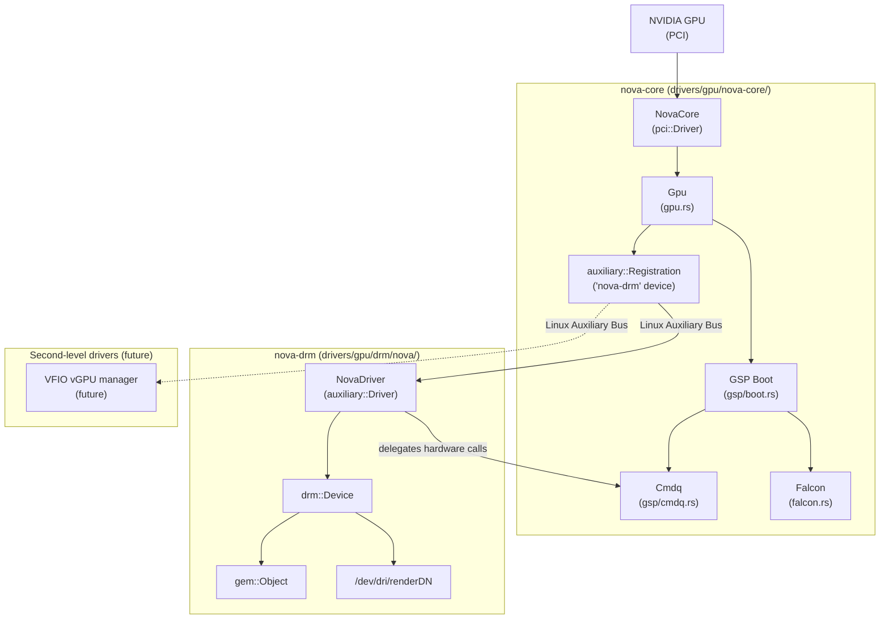
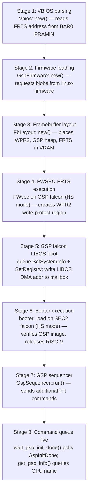
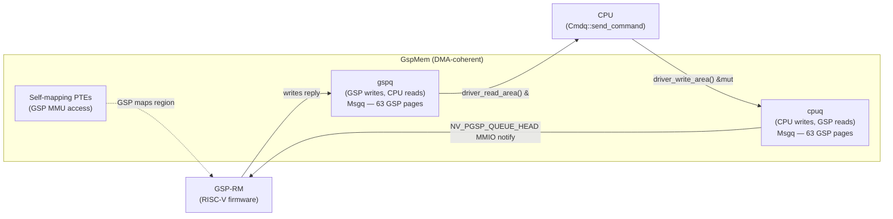
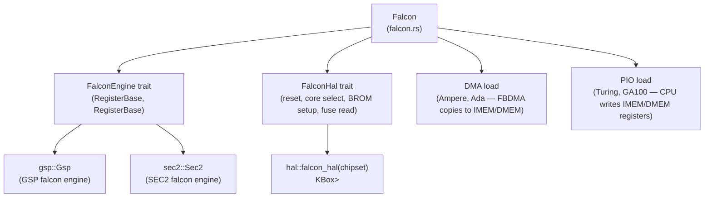
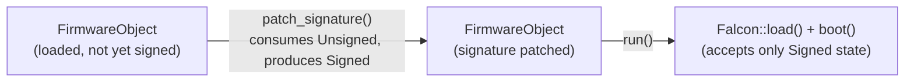

# Chapter 10: Nova — The Rust NVIDIA Kernel Driver

> **Part**: Part III — The Nouveau Story
> **Audience**: Systems developer — primarily kernel driver developers and Rust-in-kernel contributors evaluating the open NVIDIA hardware stack; also relevant to Vulkan driver developers who need to understand the kernel interface that NVK will eventually target
> **Status**: First draft — 2026-06-06

## Table of Contents

- [Overview](#overview)
- [1. Why Nova: Design Motivation and the Limits of Extending Nouveau](#1-why-nova-design-motivation-and-the-limits-of-extending-nouveau)
- [2. nova-core: The Hardware Abstraction Layer](#2-nova-core-the-hardware-abstraction-layer)
- [3. nova-drm: The DRM Graphics Driver](#3-nova-drm-the-drm-graphics-driver)
- [4. Rust Implementation: Abstractions and Safety Properties](#4-rust-implementation-abstractions-and-safety-properties)
- [5. GPU Generation Scope and Development Timeline](#5-gpu-generation-scope-and-development-timeline)
- [6. Nova in the Broader Rust-in-DRM Landscape](#6-nova-in-the-broader-rust-in-drm-landscape)
- [7. Co-existence with Nouveau and the Transition Path](#7-co-existence-with-nouveau-and-the-transition-path)
- [Integrations](#integrations)
- [References](#references)

---

## Overview

**Nova** is the most structurally significant change in Linux's NVIDIA driver landscape since the 2022 **nvidia-open** release. Where **nvidia-open** opened the CPU-side stub of NVIDIA's existing proprietary driver, **Nova** is a clean-sheet reimplementation: a two-component **Rust** driver that makes the **GSP-RM** firmware the sole source of hardware authority for **Turing** and later GPUs. It was merged in its initial form into **Linux 6.15** (May 2025), marking the first **Rust**-written **Direct Rendering Manager** (**DRM**) driver in the mainline kernel — a milestone both for the **Rust-for-Linux** project and for open NVIDIA GPU support. This chapter is directed at kernel driver developers and **Rust**-in-kernel contributors who need to understand **Nova**'s architecture at the source level; graphics application developers will find the chapter useful for understanding the kernel interface that the **Mesa** **NVK** **Vulkan** driver is expected to eventually target.

Section 1 examines the design motivation for **Nova**:

- **nvkm complexity** — accumulated across GPU generations from **NV04** through **Ada Lovelace** (Nouveau's internal hardware abstraction layer)
- **GSP-RM firmware** — presents a clean abstraction boundary for **Turing**+ hardware
- **Rust-for-Linux** maturity — a compelling fit for reference-counted **GEM** buffer objects and device lifetimes
- **nova-core / nova-drm split** — two separate kernel modules (`drivers/gpu/nova-core/` and `drivers/gpu/drm/nova/`) connected via the **Linux Auxiliary Bus**

Section 2 covers **nova-core** in depth:

- **source tree layout** — under `drivers/gpu/nova-core/`
- **PCI probe and GPU identification** — via `NV_PMC_BOOT_0` and `NV_PMC_BOOT_42` **MMIO** registers and the `Chipset` enum
- **firmware versioning** — pinned against **linux-firmware** version `570.144`
- **multi-stage GSP boot sequence** — VBIOS parsing, firmware loading, **WPR2** framebuffer layout, **FWSEC-FRTS** execution, **GSP** falcon **LIBOS** boot, booter execution on the **SEC2** falcon, **GspSequencer**, and command-queue establishment
- **dual circular-buffer command queue** — in `gsp/cmdq.rs` using **DMA**-coherent `GspMem`
- **DebugFS GSP log buffers** — `loginit`, `logintr`, `logrm` exposed via `debugfs::Scope`
- **`Falcon<E: FalconEngine>`** — generic abstraction covering both **DMA** and **PIO** firmware transfer modes and per-architecture **FalconHal** trait dispatch

Section 3 covers **nova-drm**:

- **auxiliary device registration** — binds to **nova-core**'s auxiliary device
- **`NovaDriver`** — implements `drm::Driver` with three current ioctls: `NOVA_GETPARAM`, `NOVA_GEM_CREATE`, `NOVA_GEM_INFO`
- **`gem::Object<NovaObject>`** — **GEM** buffer object implementation with **ARef**-based reference counting
- **minimal feature set** — render node at `/dev/dri/renderDN` with no command submission, no **GPUVM**, no **drm_syncobj**, no display/**KMS**, and no **PRIME**/**DMA-BUF** support

Section 4 analyses the **Rust** implementation techniques that distinguish **Nova** from its **C**-based counterparts:

- **DRM Rust abstraction layer types** — `drm::Device<T>`, `drm::gem::Object<T>`, `drm::File<T>`, `auxiliary::Driver`
- **`bounded_enum!` macro** — typed **MMIO** register access and validated hardware enum conversions in `bitfield.rs`
- **`PinInit` / `try_pin_init!`** — in-place initialization pattern for pinned structs
- **DMA-coherent memory safety** — discipline over shared memory in `Cmdq`
- **`FirmwareObject<F, S>` typestate pattern** — enforces firmware signature patching at compile time
- **comparison with Nouveau's C model** — for reference counting, error-path cleanup, and lock-discipline documentation

Section 5 covers GPU generation scope and development timeline:

- **Turing** — **TU102**–**TU116**, **SM 7.5**
- **Ampere** — **GA100**–**GA107**, **SM 8.x**
- **Ada Lovelace** — **AD102**–**AD107**, **SM 8.9**
- **explicitly unsupported** — pre-**Turing** hardware, **Hopper**/**GH100**, **Blackwell**/**GB100**/**GB202**, display/**KMS**, and **CUDA**
- **kernel-version history table** — tracing **Nova** milestones from **Linux 6.15** through **Linux 7.2**
- **comparison with nvidia-open** — both drivers consume the same **GSP-RM** firmware blobs but share no CPU-side code or abstraction model

Section 6 situates **Nova** in the broader **Rust**-in-**DRM** landscape:

- **`drm-rust-next`** — dedicated development tree for Rust DRM drivers
- **ARM Tyr driver** — parallel driver for **Mali CSF** hardware developed by Collabora
- **two-track contribution workflow** — spanning **DRM** maintainer review and **Rust-for-Linux** maintainer review

Section 7 addresses co-existence with **Nouveau** at runtime and the transition path:

- **runtime co-existence** — **Nova** and **Nouveau** operating simultaneously on different GPU generations
- **feature parity milestones** — GPU command submission, **GPUVM** integration via `drm_gpuvm`, **drm_syncobj** timeline synchronization, display/**KMS**, and **NVENC**/**NVDEC** video engine support
- **NVK backend transition** — once **nova-drm** reaches **UAPI** stability with `DRM_NOVA_EXEC` and **GPUVM** bind ioctls
- **module naming** — distinction between internal module names (`nova_core.ko`, `nova.ko`) and the informal project names used in mailing-list discussions

---

## 1. Why Nova: Design Motivation and the Limits of Extending Nouveau

### The Weight of nvkm's History

The Nouveau driver's internal hardware abstraction layer, nvkm, spans GPU generations from NV04 (RIVA TNT2, 1998) through Ada Lovelace. Every new GPU generation must be mapped onto abstractions originally designed for hardware that predates modern unified shader architectures. The practical consequence is visible in the source tree: `drivers/gpu/drm/nouveau/nvkm/` contains generation-specific vtable chains, per-GPU HWDB tables, and engine initialization sequences accumulated over two decades. The code is functional and well-maintained, but it carries the full weight of that history.

The Falcon firmware infrastructure is a representative example. For pre-Turing GPUs, Nouveau reverse-engineered firmware loading sequences: which registers to write, in which order, to place the Falcon microcontroller into a runnable state. For Turing and later, GSP-RM firmware took over much of the resource management that Falcon previously did under software control — but Nouveau's implementation of this is necessarily retrofitted into the existing nvkm engine model. The GSP subdevice (`nvkm_gsp`) must coexist with the software-managed engine paths for older hardware that share the same abstraction layer. Architecture complexity compounds: the GSP-enabled path and the software path must remain compatible, with `gsp_enabled` checks scattered throughout the engine initialization code. [Source](https://github.com/torvalds/linux/tree/master/drivers/gpu/drm/nouveau/nvkm/subdev/gsp)

### The GSP-RM Opportunity as a Clean Abstraction Boundary

On Turing and later hardware — every GPU from the GeForce RTX 20 series onward — the host driver's job, when GSP-RM is active, is reduced to three things: (a) load and boot the firmware, (b) manage the command queue, and (c) provide a DRM interface for userspace. Clock programming, voltage management, engine initialization, context management — all of this lives in the GSP-RM firmware. As Chapter 9 describes, once the GSP is running and the command queue is established, the CPU-side driver sends structured RPC calls and the firmware carries out the actual hardware operations.

This is a fundamentally simpler host-side model. It does not need to carry reverse-engineered register-level knowledge for Turing+ hardware; that knowledge lives in the firmware. A driver designed from the ground up for this model can dispense with the entire generation-spanning vtable hierarchy that nvkm requires.

This is the opportunity that Nova addresses. It is not a replacement for Nouveau — Nouveau handles pre-Turing hardware that Nova never targets, and Nouveau's GSP-RM support (described in Chapter 9) is a different and separately maintained code path. Nova answers a different question: what does an NVIDIA kernel driver look like when you can assume GSP-RM from the start, for hardware that has never known anything else?

### Why Rust, and Why Now

The Rust-for-Linux project reached a stable-enough state with Linux 6.1 (December 2022) to support production kernel drivers. GPU drivers are a high-value target for Rust adoption: GEM buffer objects, device references, and DRM objects are all reference-counted resources where C's manual ownership conventions are routinely violated under complex error paths. A missed `drm_gem_object_put()` on an error branch produces a kernel memory leak that survives until the next device probe. Rust's ownership model makes that class of error a compile-time failure rather than a test-time discovery.

Nova was initiated by Danilo Krummrich (Red Hat) and colleagues, with participation from NVIDIA engineers. The timing was deliberate: the clean-slate opportunity (GSP-RM enabling a simpler host model) and the Rust maturity coincided in 2023–2024, and the driver design could take advantage of both simultaneously. [Source](https://rust-for-linux.com/nova-gpu-driver)

### The nova-core / nova-drm Split

Nova is not a monolithic driver. It is two separate kernel modules with a precisely defined interface between them:

**nova-core** (`drivers/gpu/nova-core/`) is a PCI driver. It discovers NVIDIA GPUs via PCI class-and-vendor matching, boots the GSP-RM firmware, establishes the command queue, and then registers an **auxiliary device** on the Linux Auxiliary Bus. It is not a DRM driver; it does not register with `drm_register()` or appear in `/dev/dri/`.

**nova-drm** (`drivers/gpu/drm/nova/`) is an auxiliary device driver that binds to nova-core's auxiliary device. It implements standard DRM interfaces for userspace — GEM, render nodes, ioctls — by calling nova-core's command queue API. nova-drm does not interact with GPU hardware registers directly; it delegates all hardware communication to nova-core.

This split serves a concrete architectural purpose. nova-core's abstraction over the GPU hardware and firmware interface can serve multiple second-level drivers. A VFIO-based vGPU manager, for example, could bind to the same nova-core auxiliary device without needing any DRM knowledge. The firmware interface code is deduplicated by design. The Linux Auxiliary Bus is the kernel's canonical mechanism for exactly this kind of intra-driver dependency. [Source](https://github.com/torvalds/linux/blob/master/drivers/gpu/nova-core/driver.rs)



---

## 2. nova-core: The Hardware Abstraction Layer

### Source Tree Location and Structure

nova-core lives in `drivers/gpu/nova-core/`, not in `drivers/gpu/drm/`. This placement is deliberate: nova-core is not a DRM driver and does not belong in the DRM subtree. Its Kconfig option is `CONFIG_NOVA_CORE`, and it is listed in `drivers/gpu/Makefile` under `obj-$(CONFIG_NOVA_CORE) += nova-core/`.

The module is defined in `nova_core.rs`, the crate root. The internal module structure is:

```
drivers/gpu/nova-core/
├── nova_core.rs    — module root; PCI registration, DebugFS root init
├── driver.rs       — pci::Driver for NovaCore; probe/unbind
├── gpu.rs          — Gpu struct; Spec, Chipset, Architecture enums
├── falcon.rs       — Falcon<E: FalconEngine> generic; DMA/PIO load, boot
├── falcon/         — per-engine Falcon HAL (gsp.rs, sec2.rs, hal.rs)
├── firmware.rs     — FirmwareObject, FalconUCodeDesc V2/V3, ELF extraction
├── firmware/       — booter.rs, fwsec/, gsp.rs, riscv.rs
├── gsp.rs          — Gsp struct; LogBuffer, Cmdq, rmargs init
├── gsp/            — boot.rs, cmdq.rs, commands.rs, sequencer.rs, fw.rs
├── fb.rs           — FbLayout (VRAM layout for WPR2, GSP heap)
├── regs.rs         — MMIO register definitions (typed bitfields)
├── vbios.rs        — VBIOS parsing (needed for FRTS address)
├── bitfield.rs     — bounded_enum! macro for typed register fields
├── sbuffer.rs      — SBufferIter for circular-buffer read/write
└── num.rs          — safe integer conversion utilities
```

[Source](https://github.com/torvalds/linux/tree/master/drivers/gpu/nova-core)

### PCI Probe and GPU Identification

nova-core's entry point is `NovaCore::probe()` in `driver.rs`, implementing `pci::Driver`. The PCI ID table matches all NVIDIA GPUs by PCI class and vendor:

```rust
// drivers/gpu/nova-core/driver.rs
// nova-core PCI ID table and probe() implementation.
// NovaCore is the pci::Driver; it probes on VGA and 3D display class PCI devices from NVIDIA.

kernel::pci_device_table!(
    PCI_TABLE,
    MODULE_PCI_TABLE,
    <NovaCore as pci::Driver>::IdInfo,
    [
        (
            pci::DeviceId::from_class_and_vendor(
                Class::DISPLAY_VGA,
                ClassMask::ClassSubclass,
                Vendor::NVIDIA
            ),
            ()
        ),
        (
            pci::DeviceId::from_class_and_vendor(
                Class::DISPLAY_3D,
                ClassMask::ClassSubclass,
                Vendor::NVIDIA
            ),
            ()
        ),
    ]
);

impl pci::Driver for NovaCore {
    type IdInfo = ();
    const ID_TABLE: pci::IdTable<Self::IdInfo> = &PCI_TABLE;

    fn probe(pdev: &pci::Device<Core>, _info: &Self::IdInfo) -> impl PinInit<Self, Error> {
        pin_init::pin_init_scope(move || {
            pdev.enable_device_mem()?;
            pdev.set_master();
            unsafe { pdev.dma_set_mask_and_coherent(DmaMask::new::<GPU_DMA_BITS>())? };

            let bar = Arc::pin_init(
                pdev.iomap_region_sized::<BAR0_SIZE>(0, c"nova-core/bar0"),
                GFP_KERNEL,
            )?;

            Ok(try_pin_init!(Self {
                gpu <- Gpu::new(pdev, bar.clone(), bar.access(pdev.as_ref())?),
                _reg <- auxiliary::Registration::new(
                    pdev.as_ref(),
                    c"nova-drm",
                    AUXILIARY_ID_COUNTER.fetch_add(1, Relaxed),
                    crate::MODULE_NAME
                ),
            }))
        })
    }
}
```

The probe function maps BAR0 (16 MB, the GPU's primary MMIO aperture) and then constructs a `Gpu` object, which drives GPU identification and the complete GSP boot sequence. On successful boot, nova-core registers an auxiliary device named `"nova-drm"` on the Auxiliary Bus; this is the mechanism by which nova-drm learns that hardware is available and ready. [Source](https://github.com/torvalds/linux/blob/master/drivers/gpu/nova-core/driver.rs)

GPU identification occurs in `Gpu::new()` via `Spec::new()`, which reads the `NV_PMC_BOOT_0` and `NV_PMC_BOOT_42` MMIO registers to determine chipset and revision. The `Chipset` enum in `gpu.rs` enumerates all currently supported GPUs:

```rust
// drivers/gpu/nova-core/gpu.rs
// Chipset enum: all GPU variants currently supported by nova-core.
// Each variant maps to a numerical ID read from NV_PMC_BOOT_42.
// Hopper/Blackwell are NOT yet present in this enum (as of current mainline).

define_chipset!({
    // Turing
    TU102 = 0x162, TU104 = 0x164, TU106 = 0x166,
    TU117 = 0x167, TU116 = 0x168,
    // Ampere
    GA100 = 0x170, GA102 = 0x172, GA103 = 0x173,
    GA104 = 0x174, GA106 = 0x176, GA107 = 0x177,
    // Ada
    AD102 = 0x192, AD103 = 0x193, AD104 = 0x194,
    AD106 = 0x196, AD107 = 0x197,
});
```

If `NV_PMC_BOOT_42` does not match a known chipset, `probe()` returns `ENODEV` and nova-core declines to manage the device. Pre-Fermi GPUs are explicitly rejected by checking `boot0.is_older_than_fermi()` before consulting `boot42`. [Source](https://github.com/torvalds/linux/blob/master/drivers/gpu/nova-core/gpu.rs)

### Firmware Versioning

nova-core targets a single firmware version at a time. As of the current kernel, this is version `570.144`, defined as a constant in `firmware.rs`:

```rust
// drivers/gpu/nova-core/firmware.rs
pub(crate) const FIRMWARE_VERSION: &str = "570.144";
```

Firmware blobs are requested from `linux-firmware` using the path pattern `nvidia/<chipset_name>/gsp/<component>-570.144.bin`. Each supported chipset requires up to five components: `booter_load`, `booter_unload`, `bootloader`, `gsp`, and (for Turing/GA100) `gen_bootloader`. The `ModInfoBuilder` mechanism embeds the required firmware paths into the module's `MODULE_FIRMWARE` table so that distribution packaging tools can identify and package the correct blobs.

Support for multiple firmware versions simultaneously is explicitly deferred: the driver is still unstable, and multi-version support will be addressed once the driver approaches UAPI stability. [Source](https://github.com/torvalds/linux/blob/master/drivers/gpu/nova-core/firmware.rs)

### The GSP Boot Sequence

The GSP boot sequence in nova-core is substantially more intricate than Nouveau's, because nova-core builds it from scratch using typed Rust structures rather than C structs. The sequence in `gsp/boot.rs` proceeds through these stages:

**Stage 1: VBIOS parsing.** `Vbios::new()` reads the GPU's video BIOS from BAR0's PRAMIN aperture. The VBIOS contains the FRTS region address that the FWSEC-FRTS firmware needs to write-protect.

**Stage 2: Firmware loading.** `GspFirmware::new()` requests the GSP firmware components from `linux-firmware` via the `firmware::Firmware::request()` kernel abstraction. This includes the bootloader, the GSP ELF image, and the booter firmware.

**Stage 3: Framebuffer layout computation.** `FbLayout::new()` determines where in GPU VRAM to place the WPR2 (Write-Protected Region 2), the GSP heap, and the FRTS region. These layouts are GPU-architecture-specific.

**Stage 4: FWSEC-FRTS execution.** FWSEC-FRTS is a small firmware that runs on the GSP falcon in heavy-secured (HS) mode. It creates the WPR2 region that write-protects the GSP RM firmware image from CPU access after verification. For Turing and GA100 (which cannot load HS firmware directly via DMA), nova-core first runs a PIO-loaded `gen_bootloader` that then loads FWSEC-FRTS:

```rust
// drivers/gpu/nova-core/gsp/boot.rs
// Conditional FWSEC-FRTS boot path: Turing uses PIO-loaded bootloader.
if chipset.needs_fwsec_bootloader() {
    let fwsec_frts_bl = FwsecFirmwareWithBl::new(fwsec_frts, dev, chipset)?;
    fwsec_frts_bl.run(dev, falcon, bar)?;
} else {
    fwsec_frts.run(dev, falcon, bar)?;
}
```

**Stage 5: GSP falcon LIBOS boot.** Before the booter runs, nova-core queues `SetSystemInfo` and `SetRegistry` commands into the command queue (without waiting for replies), then resets the GSP falcon and writes the LIBOS argument structure's DMA address into the falcon mailbox registers. `gsp_falcon.boot()` starts the GSP bootstrap code. LIBOS (NVIDIA's embedded OS runtime) will start up on the GSP's RISC-V core; it cannot do so yet because the WPR2 region has not been authenticated — that is the booter's job in the next stage.

**Stage 6: Booter execution and RISC-V active wait.** The `booter_load` firmware runs on the SEC2 falcon in heavy-secured (HS) mode. nova-core loads `booter_load` via `sec2_falcon.load()`, passes the `GspFwWprMeta` DMA address through SEC2's mailbox registers, and starts SEC2 via `sec2_falcon.boot()`. The booter verifies the GSP RM image's cryptographic signature, copies the image into the WPR2 region, and releases the GSP's RISC-V core. The driver then polls `is_riscv_active()` until the core becomes active. The clear ordering here — GSP falcon libos boot first, SEC2 booter second, RISC-V active poll third — reflects that the booter is what grants the GSP permission to proceed, not the reverse.

**Stage 7: GSP sequencer.** `GspSequencer::run()` sends the sequence of additional commands (including the GSP bootloader run parameters) that completes GSP initialization.

**Stage 8: Command queue establishment and hello.** `commands::wait_gsp_init_done()` polls the status queue until the GSP posts a `GspInitDone` message. At this point, the command queue is live and the `SetSystemInfo`/`SetRegistry` commands queued in Stage 5 have been processed. `commands::get_gsp_info()` then queries basic GPU information (including the GPU marketing name string) for display in `dmesg`. [Source](https://github.com/torvalds/linux/blob/master/drivers/gpu/nova-core/gsp/boot.rs)



### The Command Queue Architecture

Once the GSP is running, all communication uses a pair of circular message queues in GPU-accessible DMA-coherent memory. nova-core's command queue implementation is in `gsp/cmdq.rs` and demonstrates several Rust kernel patterns simultaneously.

The shared memory region `GspMem` contains:
- A self-mapping page table (PTEs allowing the GSP to map the region through its own MMU)
- `cpuq`: the CPU-to-GSP command queue (CPU writes, GSP reads)
- `gspq`: the GSP-to-CPU message queue (GSP writes, CPU reads)

Each queue (`Msgq`) contains a circular buffer of `MSGQ_NUM_PAGES` (63) GSP pages (each 4 KB), a transmit header with a write pointer, and a receive header with a read pointer. The ownership discipline is enforced by Rust's borrowing model: `driver_write_area()` returns a mutable reference to the region the CPU owns, and `driver_read_area()` returns a shared reference to the region the GSP has written. Returning these references from the same struct via a `&mut self` receiver ensures that only one of the two can be obtained simultaneously.

```rust
// drivers/gpu/nova-core/gsp/cmdq.rs
// CommandToGsp trait: type-safe abstraction over GSP command messages.
// Each command type carries its FUNCTION discriminant, a Command struct
// to fill, a Reply type, and an initializer for any variable-length payload.

pub(crate) trait CommandToGsp {
    const FUNCTION: MsgFunction;
    type Command: FromBytes + AsBytes;
    type Reply;
    type InitError;

    fn init(&self) -> impl Init<Self::Command, Self::InitError>;

    fn variable_payload_len(&self) -> usize { 0 }

    fn init_variable_payload(
        &self,
        _dst: &mut SBufferIter<core::array::IntoIter<&mut [u8], 2>>,
    ) -> Result { Ok(()) }

    fn size(&self) -> usize {
        size_of::<Self::Command>() + self.variable_payload_len()
    }
}
```

The `Cmdq::send_command()` method acquires the inner mutex, writes the command into the available write area, updates the CPU write pointer, and writes to the `NV_PGSP_QUEUE_HEAD` MMIO register to notify the GSP. It then waits for the reply by polling `receive_msg::<M::Reply>()`. The checksum verification uses a 64-bit XOR accumulated over the entire message including header, providing a basic integrity check on the shared memory. [Source](https://github.com/torvalds/linux/blob/master/drivers/gpu/nova-core/gsp/cmdq.rs)



### DebugFS and GSP Log Buffers

nova-core exposes three GSP log buffers via DebugFS at `/sys/kernel/debug/nova_core/<device_name>/`:

- `loginit`: early GSP initialization log, written before the command queue is active
- `logintr`: interrupt handler log
- `logrm`: main GSP RM runtime log

These are binary buffers in the format expected by NVIDIA's log parsing tooling (`nvdecode`). Each buffer is a `LogBuffer`: a DMA-coherent allocation of `0x10` GSP pages (64 KB), whose first 8 bytes hold a write pointer ("put pointer"), followed by the physical address table for the buffer, followed by the encoded log data. The physical address table allows the GSP to locate the buffer via its own page table rather than requiring a contiguous virtual mapping.

DebugFS integration uses the `debugfs::Scope` Rust wrapper, which ensures that the DebugFS entries are removed when the `Gsp` structure is dropped, even on error paths. This is the Rust equivalent of manually calling `debugfs_remove_recursive()` in a cleanup handler, but enforced by the type system rather than by developer discipline. [Source](https://github.com/torvalds/linux/blob/master/drivers/gpu/nova-core/gsp.rs)

### The Falcon Abstraction

`Falcon<E: FalconEngine>` is a generic type parameterized over an engine type that provides the Falcon's register base addresses. This design allows a single `Falcon` implementation to cover both the GSP falcon (registers at the GSP base) and the SEC2 falcon (registers at the SEC2 base) without code duplication. The `FalconEngine` trait requires implementing `RegisterBase<PFalconBase>` and `RegisterBase<PFalcon2Base>`, where the base addresses are type-level constants distinguishing the two engines.

Firmware loading supports two transfer modes:
- **DMA**: the firmware image is placed in a DMA-coherent buffer and the Falcon's FBDMA engine copies it into IMEM/DMEM. Used on Ampere and Ada.
- **PIO (Programmed I/O)**: the CPU writes firmware bytes directly into the Falcon's IMEM/DMEM registers. Required on Turing and GA100, which do not support DMA-mode IMEM loading for the relevant firmware types.

The `FalconHal` trait (the hardware abstraction layer for per-architecture Falcon behaviour) covers engine reset sequences, core selection (Falcon vs RISC-V), the BROM parameter setup, and fuse version reading. Chipset dispatch at runtime uses `hal::falcon_hal(chipset)` which returns a `KBox<dyn FalconHal<E>>` — a heap-allocated trait object selected by the chipset identifier read at probe time. This is Rust's idiomatic equivalent of the per-generation vtable chains in nvkm. [Source](https://github.com/torvalds/linux/blob/master/drivers/gpu/nova-core/falcon.rs)



---

## 3. nova-drm: The DRM Graphics Driver

### Source Tree Location and Architecture

nova-drm lives in `drivers/gpu/drm/nova/` and is registered as an auxiliary device driver:

```rust
// drivers/gpu/drm/nova/nova.rs
// nova-drm module root.
// module_auxiliary_driver! registers NovaDriver as an auxiliary driver.
// It binds to the "nova-drm" auxiliary device that nova-core exposes after GSP boot.

kernel::module_auxiliary_driver! {
    type: NovaDriver,
    name: "Nova",
    authors: ["Danilo Krummrich"],
    description: "Nova GPU driver",
    license: "GPL v2",
}
```

The module name `"Nova"` (without the `-drm` suffix in the module metadata) is the public-facing name. Developers conventionally say "nova-drm" to distinguish it from nova-core; the kernel infrastructure uses the auxiliary device matching name `"nova-drm"` to bind the driver to the correct device.

nova-drm does not enumerate PCI devices and does not access GPU hardware registers. Its probe function (`NovaDriver::probe()` in `driver.rs`) receives an `auxiliary::Device` reference, wraps it in a `drm::Device<NovaDriver>`, registers it via `drm::Registration::new_foreign_owned()`, and exposes a render node in `/dev/dri/renderDN`. That is the extent of nova-drm's hardware interaction — everything else goes through nova-core's command queue. [Source](https://github.com/torvalds/linux/blob/master/drivers/gpu/drm/nova/driver.rs)

### DRM Driver Interface

`NovaDriver` implements `drm::Driver` with the following structure:

```rust
// drivers/gpu/drm/nova/driver.rs
// NovaDriver: DRM driver data types and ioctl registration.
// NovaData holds an ARef to the auxiliary device for lifetime tracking.

pub(crate) struct NovaDriver {
    drm: ARef<drm::Device<Self>>,
}

pub(crate) type NovaDevice = drm::Device<NovaDriver>;

#[pin_data]
pub(crate) struct NovaData {
    pub(crate) adev: ARef<auxiliary::Device>,
}

#[vtable]
impl drm::Driver for NovaDriver {
    type Data = NovaData;
    type File = File;
    type Object = gem::Object<NovaObject>;

    const INFO: drm::DriverInfo = drm::DriverInfo {
        major: 0, minor: 0, patchlevel: 0,
        name: c"nova", desc: c"Nvidia Graphics",
    };

    kernel::declare_drm_ioctls! {
        (NOVA_GETPARAM, drm_nova_getparam, ioctl::RENDER_ALLOW, File::get_param),
        (NOVA_GEM_CREATE, drm_nova_gem_create, ioctl::AUTH | ioctl::RENDER_ALLOW, File::gem_create),
        (NOVA_GEM_INFO, drm_nova_gem_info, ioctl::AUTH | ioctl::RENDER_ALLOW, File::gem_info),
    }
}
```

The driver version `0.0.0` signals that the UAPI is not yet stable. Three ioctls are currently exposed:

- `NOVA_GETPARAM` (`ioctl::RENDER_ALLOW`): queries driver and hardware parameters. Currently supports a single parameter, `NOVA_GETPARAM_VRAM_BAR_SIZE`, which returns the size of PCI BAR 1 (the GPU's VRAM BAR) by querying the parent PCI device through the auxiliary device reference chain.
- `NOVA_GEM_CREATE` (`ioctl::AUTH | ioctl::RENDER_ALLOW`): creates a new GEM buffer object of a requested size. Returns a GEM handle.
- `NOVA_GEM_INFO` (`ioctl::AUTH | ioctl::RENDER_ALLOW`): queries the size of an existing GEM object by handle.

[Source](https://github.com/torvalds/linux/blob/master/drivers/gpu/drm/nova/driver.rs)

### GEM Buffer Object Implementation

nova-drm's GEM objects are defined in `gem.rs`:

```rust
// drivers/gpu/drm/nova/gem.rs
// NovaObject: inner driver data for a DRM GEM object.
// gem::Object<NovaObject> wraps struct drm_gem_object at the C layer.
// NovaObject::new() returns an ARef<gem::Object<Self>> — the object is
// freed exactly when the last reference is dropped.

#[pin_data]
pub(crate) struct NovaObject {}

impl gem::DriverObject for NovaObject {
    type Driver = NovaDriver;
    type Args = ();

    fn new(_dev: &NovaDevice, _size: usize, _args: Self::Args) -> impl PinInit<Self, Error> {
        try_pin_init!(NovaObject {})
    }
}

impl NovaObject {
    pub(crate) fn new(dev: &NovaDevice, size: usize) -> Result<ARef<gem::Object<Self>>> {
        if size == 0 {
            return Err(EINVAL);
        }
        let aligned_size = page::page_align(size).ok_or(EINVAL)?;
        gem::Object::new(dev, aligned_size, ())
    }

    pub(crate) fn lookup_handle(
        file: &drm::File<File>,
        handle: u32,
    ) -> Result<ARef<gem::Object<Self>>> {
        gem::Object::lookup_handle(file, handle)
    }
}
```

The `NovaObject` inner struct is currently empty — a placeholder for the buffer-specific private data that will be added as nova-drm gains actual memory allocation and mapping capabilities. The significant point is the type: `gem::Object<NovaObject>` is the Rust binding to `struct drm_gem_object`. Its reference counting is managed through `ARef<gem::Object<NovaObject>>`, which wraps the atomic reference count embedded in the C struct. When the last `ARef` is dropped, the Rust drop glue calls `drm_gem_object_put()`, which decrements the reference count and eventually calls the driver's `free_object` callback. There is no possibility of a missed decrement on an error path because the reference is dropped unconditionally when it goes out of scope. [Source](https://github.com/torvalds/linux/blob/master/drivers/gpu/drm/nova/gem.rs)

### Current Feature Set and Scope

nova-drm in its current mainline form is a minimal skeleton. It provides:

- A render node (`/dev/dri/renderDN`) for unprivileged GPU access
- GEM object lifecycle management (`NOVA_GEM_CREATE`, `NOVA_GEM_INFO`)
- Parameter query (`NOVA_GETPARAM`)
- Correct auxiliary bus binding to nova-core

What it does not yet provide:

- GPU command submission (no exec ioctl)
- GPU virtual address space management (no GPUVM integration)
- Synchronization objects (`drm_syncobj` / timeline)
- Display/KMS modesetting (no display pipeline at all)
- PRIME buffer sharing and DMA-BUF import/export

This is intentional. The development strategy, as described by Danilo Krummrich in the LWN article "What the Nova GPU driver needs" [Source](https://lwn.net/Articles/990736/), is incremental: start with a stub that correctly initialises the hardware and establishes the command queue, then add features iteratively. Attempting a complete implementation upfront creates a chicken-and-egg problem where abstractions and their consumers must be merged simultaneously, stalling progress. The stub-first approach allows the DRM Rust abstraction layer to evolve alongside the driver, with each abstraction earning its design through actual use.

---

## 4. Rust Implementation: Abstractions and Safety Properties

### The DRM Rust Abstraction Layer

nova-core and nova-drm together exercise a substantial fraction of the DRM Rust abstraction layer in `rust/kernel/drm/`. The primary types involved are:

**`drm::Device<T>` / `drm::device::Device<T>`**: wraps `struct drm_device` with Rust ownership semantics. The type parameter `T` is the driver-specific data type (`NovaDriver` in nova-drm's case). `drm::Registration::new_foreign_owned()` creates the DRM device and registers it with the subsystem, returning a registration guard; dropping the guard unregisters the device. The "foreign-owned" variant is used when the DRM device's lifetime is managed by the driver's data structure rather than by the registration guard itself — the correct pattern for auxiliary device drivers where the DRM device lifetime is tied to the auxiliary device lifetime.

**`drm::gem::Object<T>` / `gem::DriverObject`**: the Rust binding to `struct drm_gem_object`. The `DriverObject` trait provides the driver-specific `new()` constructor and specifies the driver type, enabling type-safe resolution of the driver data from a GEM object reference. `ARef<gem::Object<T>>` is the reference-counted handle; it cannot be cloned into a raw pointer without going through unsafe code, preventing accidental ownership leaks.

**`drm::File<T>` / `drm::file::DriverFile`**: the per-open-file state. `File::open()` constructs the driver's file state; `drm::File<T>` holds it. The type parameter ensures that the file state type is matched to the driver type at compile time — you cannot pass a file handle from one driver to another driver's ioctl dispatch.

**`auxiliary::Driver` / `auxiliary::Device`**: the Linux Auxiliary Bus Rust bindings. `auxiliary::Driver` provides `probe()` and `remove()` for drivers that bind to auxiliary devices. `NovaDriver` implementing `auxiliary::Driver` allows it to bind to the `"nova-drm"` auxiliary device without any `unsafe` in the binding machinery itself. [Source](https://github.com/torvalds/linux/tree/master/drivers/gpu/drm/nova)

### Typed Register Access and `bounded_enum!`

nova-core's register access is entirely typed. Rather than `iowrite32(value, bar + OFFSET)`, nova-core uses `bar.write(reg_type, value)` where `reg_type` is a typed register descriptor. Register fields are accessed as `reg.field()` and mutated as `reg.with_field(value)`. This eliminates a class of bugs where the wrong register offset or field mask is used.

The `bounded_enum!` macro in `bitfield.rs` generates enums bounded by their valid range, with associated `TryFrom` conversions that return an error if the hardware reports a value outside the expected range:

```rust
// drivers/gpu/nova-core/falcon.rs
// bounded_enum! for Falcon security mode — compile-time guarantee that
// invalid security mode values from hardware registers cannot be silently ignored.

bounded_enum! {
    #[derive(Debug, Copy, Clone)]
    pub(crate) enum FalconSecurityModel with TryFrom<Bounded<u32, 2>> {
        None  = 0,  // Non-secure: unsigned code, no privileges
        Light = 2,  // Light-Secured (LS): signed, limited privileges
        Heavy = 3,  // Heavy-Secured (HS): signed, full privileges (BROM-verified)
    }
}
```

If the hardware reports security mode `1` (which is undefined), `FalconSecurityModel::try_from(1)` returns `Err(EINVAL)` rather than silently constructing an invalid enum value. In Nouveau's C equivalent, a missing case in a switch statement defaults to falling through, which may silently misinterpret the hardware state. The Rust enum exhaustiveness enforced by `bounded_enum!` is the compile-time equivalent of that runtime check. [Source](https://github.com/torvalds/linux/blob/master/drivers/gpu/nova-core/falcon.rs)

### `PinInit` and In-Place Initialization

nova-core makes extensive use of the `pin_init` crate's `PinInit` and `try_pin_init!` macros for constructing complex pinned structs. `Gpu::new()` returns an `impl PinInit<Self, Error>` rather than a `Result<Self>` — the struct is initialized directly into its final heap or stack location without an intermediate copy. This is necessary because `Gpu` contains pinned fields (the `Gsp` struct with pinned `Mutex` and `Cmdq` members).

The `try_pin_init!` macro deserializes cleanly at the call site: each field initializer runs in sequence, and if any initializer returns an error, the already-initialized fields are dropped in reverse order. In C, this pattern requires manually maintained `goto err_<N>` labels for each partially-initialized resource. The macro generates the correct cleanup automatically.

### Memory Safety in Shared DMA Memory

The command queue's shared DMA memory (`DmaGspMem`) illustrates how nova-core handles the inherent unsafety of shared hardware-mapped memory. The `GspMem` struct is wrapped in `Coherent<GspMem>`, which is the Rust kernel binding to a DMA-coherent allocation. `Coherent<T>` provides:

- `dma_handle()`: returns the physical DMA address for the hardware
- `as_ptr()` / `as_mut_ptr()`: returns a pointer to the CPU-side mapping

The `driver_write_area()` and `driver_read_area()` methods return mutable and shared references respectively to the regions the CPU is permitted to access. The invariant that the driver owns only its respective half of the queue is maintained through the pointer arithmetic in those methods. The `unsafe` blocks that create slice references from raw pointers carry explicit SAFETY comments explaining the ownership invariant that makes them sound, making it tractable to verify correctness during code review. [Source](https://github.com/torvalds/linux/blob/master/drivers/gpu/nova-core/gsp/cmdq.rs)

### Firmware Versioning Safety: `FirmwareObject<F, S>`

`firmware.rs` demonstrates compile-time state machines via phantom types. A loaded firmware image is represented as `FirmwareObject<F, S>` where `F` is the falcon type (GSP, SEC2) and `S` is the signed state (`Unsigned` or `Signed`). The `patch_signature()` method consumes a `FirmwareObject<F, Unsigned>` and returns a `FirmwareObject<F, Signed>`. The `run()` method (which actually loads the firmware onto the falcon) accepts only `FirmwareObject<F, Signed>`.

This means it is a compile-time error to attempt to run a firmware image that has not been patched with a valid signature. In Nouveau's C equivalent, signature patching is performed by calling a function that modifies a buffer in place, and the absence of such a call goes undetected until the firmware loads and the signature verification fails at runtime. The Rust typestate pattern converts a potential runtime failure into a compile-time error. [Source](https://github.com/torvalds/linux/blob/master/drivers/gpu/nova-core/firmware.rs)



### Comparison with Nouveau's C Model

The concrete safety improvement over Nouveau's corresponding C code is easiest to see in three specific areas:

**Reference counting.** Nouveau's `nouveau_bo_new()` returns a struct with an embedded `kref`. Every code path that exits early must call `nouveau_bo_ref()` on cleanup; a missing call produces a GEM object leak. nova-drm's `gem::Object::new()` returns an `ARef<gem::Object<NovaObject>>`; the object's reference count is decremented unconditionally when the `ARef` goes out of scope, regardless of which return path the code takes.

**Error-path resource cleanup.** Nouveau's `tu102_gsp_oneinit()` uses a sequence of `if (ret) goto fail_X;` labels with matching cleanup paths. nova-core's `Gpu::new()` uses `try_pin_init!`, which generates the corresponding cleanup automatically. If `gsp.boot()` fails, the already-initialized `gsp_falcon`, `sec2_falcon`, `spec`, and `sysmem_flush` fields are dropped in reverse initialization order.

**Invariant documentation.** In Nouveau's C, the comment `/* must hold gsp->mutex */` annotates functions that require a lock to be held. In nova-core's Rust, `Cmdq::send_command()` takes a `&self` and internally acquires `self.inner.lock()`. The mutex is always locked at the correct scope; there is no API surface for calling the function without the lock.

---

## 5. GPU Generation Scope and Development Timeline

### Supported GPU Generations

nova-core's `Chipset` enum (verified against the kernel tree) currently enumerates Turing (TU102–TU116), Ampere (GA100–GA107), and Ada Lovelace (AD102–AD107). This corresponds to the GeForce RTX 20 series through RTX 40 series, including the Ampere datacenter parts (A100/GA100) and Ada datacenter variants (L40/AD102). [Source](https://github.com/torvalds/linux/blob/master/drivers/gpu/nova-core/gpu.rs)

Turing, Ampere, and Ada share the fundamental GSP-based resource management model but differ in specific boot paths:

**Turing (TU102–TU116, SM 7.5)**: Introduced the GSP processor with Falcon v6 extended with limited RISC-V instructions. Falcon DMA loading is not available for IMEM on Turing, so nova-core uses PIO (`needs_fwsec_bootloader() == true` for Turing and GA100). A five-component firmware package is required, including a `gen_bootloader` that handles the Turing-specific HS firmware loading path. The Turing Falcon HAL was added incrementally: Linux 7.0 added Turing-specific firmware header parsing and the Turing Falcon HAL implementation; Linux 7.1 completed the GSP boot sequence hardening for Turing.

**Ampere (GA100–GA107, SM 8.x)**: Introduced a full RISC-V GSP core with a different boot architecture. DMA-mode IMEM loading is available on GA102 and later within Ampere; GA100 (the datacenter-only variant) shares the needs-bootloader path with Turing. The `Architecture::Ampere` branch in the Falcon HAL handles these differences.

**Ada Lovelace (AD102–AD107, SM 8.9)**: Follows Ampere's RISC-V boot path. Ada is notable in the Nouveau context for being the first generation where GSP-RM is the only supported initialization path (no software fallback), making it mandatory for any open driver targeting AD-class GPUs.

### What Nova Does Not Support

nova-core explicitly returns `ENODEV` for any GPU whose `NV_PMC_BOOT_42` value does not map to a known `Chipset` variant. At the time of writing, this includes:

**Pre-Turing hardware** (Maxwell, Pascal, Volta, NV04–NV50, Fermi, Kepler): these lack the GSP processor that Nova's design assumes. They remain Nouveau's domain and will never be Nova targets.

**Hopper (GH100) and Blackwell (GB100, GB202)**: these are not yet in the `Chipset` enum in current mainline. NVIDIA engineers have posted multiple patch series (reaching at least v12 as of June 2026) implementing Hopper and Blackwell enablement — FSP (Foundation Security Processor) boot path, EMEM operations, MCTP/NVDM message infrastructure — but the work was not yet merged into mainline at the time of writing. The chapter plan's assertion that Linux 7.2 added Hopper/Blackwell as merged features should be verified against the kernel tree at publication time; based on current trajectory, this appears optimistic. [Source](https://www.phoronix.com/news/Hopper-Blackwell-Nova-Closer)

**Display/KMS (any GPU)**: nova-drm does not implement KMS modesetting or any display output path. Users who need a display on Turing+ hardware still require either nvidia-open or Nouveau. This is a known and deliberate gap; display support is a future deliverable, not an oversight.

**CUDA**: Nova provides no CUDA interface. CUDA requires NVIDIA's proprietary `libcuda.so` userspace runtime and `nvidia-uvm.ko` unified memory module, neither of which Nova replaces. An open CUDA implementation at production performance levels does not exist regardless of kernel driver choice.

### Development Timeline and Kernel Version History

| Kernel | Key Nova Changes |
|--------|-----------------|
| 6.15 (May 2025) | Initial merge: nova-core PCI probe, BAR0 mapping, `Gpu` struct, GSP `LogBuffer`, `Cmdq` skeleton; nova-drm auxiliary driver skeleton with `NOVA_GEM_CREATE` and `NOVA_GEM_INFO` ioctls |
| 6.16 (Jul 2025) | nova-core command queue hardening; firmware parsing improvements; additional Rust abstraction additions |
| 6.17 (Sep 2025) | nova-drm GEM infrastructure fleshed out; `NOVA_GETPARAM` with `NOVA_GETPARAM_VRAM_BAR_SIZE`; nova-core GSP boot sequence improvements |
| 7.0 (Jan 2026) | Turing-specific firmware header parsing; Turing Falcon HAL; improved handling of unexpected firmware values |
| 7.1 (Apr 2026) | Large RPC support (messages exceeding one GSP page); GSP command queue hardening; DebugFS for GSP log buffers; Falcon firmware handling refactoring |
| 7.2 (mid-2026, merge window) | Hopper/Blackwell enablement patches (under review); GSP boot process refactoring into chipset-specific HAL; proper driver unload; module name kebab-case (`nova-core`, `nova-drm`) |

Note: Linux 7.x represents kernel versions beyond the author's training data; the above table is derived from Phoronix coverage [Source](https://www.phoronix.com/news/Linux-7.2-DRM-Rust), [Source](https://www.phoronix.com/news/Rust-DRM-For-Linux-7.1), [Source](https://www.phoronix.com/news/Rust-DRM-For-Linux-7.0) and the nova mailing list, and should be verified against the kernel changelog at publication time.

### Relationship to nvidia-open

Both Nova and the nvidia-open module use the same GSP-RM firmware blobs from `linux-firmware`. The critical distinction is on the CPU side. nvidia-open is NVIDIA's production driver kernel component, targeting the full NVIDIA software stack (Vulkan, CUDA, NVENC/NVDEC, display). Its CPU-side code is structured around NVIDIA's internal `NvRmApi`, `NvPort`, and GPU Manager abstractions — a substantial refactoring of the proprietary RM infrastructure for GPL compliance, but not a DRM-integrated driver in the mainline sense.

Nova is a clean-sheet DRM-native driver, structured for mainline integration from the ground up, written in Rust, and explicitly not carrying any of the nvidia-open module's abstraction model. The two cannot interoperate at the CPU-side level; they share only the firmware blobs and the GSP-RM RPC protocol that those blobs implement.

---

## 6. Nova in the Broader Rust-in-DRM Landscape

### The DRM Rust Development Tree

To accelerate development of Rust-written GPU and NPU drivers, the DRM subsystem maintains a dedicated `drm-rust-next` tree. This tree accepts the DRM Rust abstraction layer additions that Nova and other drivers depend on before those additions are ready for the main `drm-tip` tree. The tree allows abstractions and their first-level users to co-develop without needing a single large merge. [Source](https://www.phoronix.com/news/DRM-Rust-Kernel-Tree)

The primary contributor to the DRM Rust abstraction layer is Danilo Krummrich (Red Hat), who is also Nova's primary author. The abstractions (`drm::gem`, `drm::device`, `drm::file`, `drm::syncobj`, `drm::gpuvm`, `auxiliary`) are not Nova-specific; any new DRM driver in Rust uses them. The investment in these abstractions through Nova's development directly benefits the entire ecosystem of future Rust DRM drivers.

### The ARM Tyr Driver: A Parallel Story

Tyr is a Rust DRM driver for ARM Mali GPUs using the Command Stream Frontend (CSF) architecture — the same hardware class as the existing C-based Panthor driver. It was developed by Collabora with Google and ARM, and submitted for Linux 6.18 in its initial form [Source](https://www.phoronix.com/news/Rust-DRM-Drivers-Linux-6.18-Tyr). Tyr and Nova share several properties:

- Both are clean-sheet Rust drivers, not translations of existing C drivers
- Both target modern hardware (Mali CSF for Tyr, Turing+ for Nova) rather than spanning the full hardware generation range
- Both depend on the same `rust/kernel/drm/` abstraction layer
- Both develop in `drm-rust-next` before merging to mainline

The parallel development validates the DRM Rust abstractions against two independent hardware architectures, which strengthens confidence in their design. An abstraction that is only used by one driver could be tailored to that driver's needs; abstractions used by both Nova and Tyr are genuinely general. [Source](https://lwn.net/Articles/1055590/)

### Contribution Workflow

Contributing to Nova requires navigating two review tracks simultaneously:

**DRM maintainer review**: The `drivers/gpu/drm/nova/` changes are reviewed by the DRM maintainers (Danilo Krummrich for nova-drm itself) for DRM interface compliance — correct use of `drm_driver` flags, ioctl semantics, GEM lifecycle, and UAPI stability conventions. The `drivers/gpu/nova-core/` changes are reviewed for hardware correctness against the GSP-RM RPC protocol.

**Rust-for-Linux maintainer review**: Any changes to `rust/kernel/drm/` or `rust/kernel/auxiliary/` are reviewed by the Rust-for-Linux maintainers (Wedson Almeida Filho, among others) for Rust abstraction quality — soundness, API ergonomics, and adherence to Rust-in-kernel conventions. This review track has different standards from the DRM track, and patches may need multiple rounds of revision in both dimensions simultaneously.

The TODO list maintained on the Rust for Linux project page [Source](https://rust-for-linux.com/nova-gpu-driver) is the canonical list of open tasks for contributors. Contributors are expected to read both the DRM programming documentation and the Rust-for-Linux contribution guide before posting patches.

---

## 7. Co-existence with Nouveau and the Transition Path

The Linux kernel currently ships three distinct open NVIDIA kernel driver paths, each with a different design philosophy, hardware scope, and upstream status. Understanding the differences is essential for systems administrators choosing a driver configuration and for developers targeting the open NVIDIA stack. The table below summarises the key dimensions of each path as of Linux 7.x.

| Dimension | **Nouveau** | **Nova** | **nvidia-open (R555+)** |
|---|---|---|---|
| Implementation language | C (legacy codebase) | Rust (safe abstractions) | C (NVIDIA's own code, open-sourced 2022) |
| GSP-RM firmware dependency | Optional (used on Turing+ when available) | Required (Nova is GSP-only by design) | Required |
| GPU generation coverage | Tesla through Ada Lovelace (degraded on newer) | Turing and later (GSP era) | Turing and later |
| Reclocking / performance states | Problematic (historically broken; fixed on Turing+ via GSP) | Delegated to GSP-RM firmware | Full via GSP-RM |
| Display engine support | Full (nv50 display, tested broadly) | Planned (not yet complete) | Full |
| Wayland/explicit sync | Supported (linux-drm-syncobj) | Planned | Supported (driver also ships closed userspace) |
| Kernel upstream status | Fully upstream (`drivers/gpu/drm/nouveau/`) | In-progress (`drivers/gpu/drm/nova/` staging) | Out-of-tree (nvidia-open GitHub releases) |
| Long-term trajectory | Maintenance mode; users migrate to Nova as it matures | The future open NVIDIA kernel driver | Continues as NVIDIA's official open release; feeds GSP-RM interface knowledge to Nova/Nouveau |

### Current Co-existence

Both `nouveau` and nova (`nova_core` / `Nova` modules) are compiled into the kernel when their respective Kconfig options are enabled. At runtime on a Turing+ GPU, the two modules are mutually exclusive for a given device: the PCI subsystem will bind the first registered matching PCI driver. Distribution kernel configurations and module-loading policy determine which driver takes precedence; typically, if both are built, modprobe ordering or a module blacklist file is used to select one.

On hardware that Nova targets but does not yet support adequately — any GPU that needs display output, for example — administrators continue to use Nouveau (or nvidia-open). On hardware Nova does not target at all (pre-Turing), Nouveau is the only open option and will remain so indefinitely.

### Feature Parity as the Migration Gate

For Nova to become the default open driver for Turing+ hardware, it needs to reach functional parity with Nouveau's GSP-RM path on those GPU generations. The critical gaps are:

1. **GPU command submission**: an exec ioctl allowing userspace to submit GPU work
2. **GPUVM integration**: GPU virtual address space management using the `drm_gpuvm` framework
3. **Synchronization**: `drm_syncobj` and timeline semaphore support for explicit sync
4. **Display/KMS**: modesetting and output management (a longer-term item)
5. **Video encode/decode**: NVENC and NVDEC support via the GSP-RM video engine RPC interface

Items 1–3 are prerequisites for NVK integration; item 4 is a prerequisite for replacing Nouveau as a display driver; item 5 follows from the general RPC infrastructure. Estimating a timeline for this from the current development cadence is speculative, but NVK integration alone (which requires items 1–3) appears reachable by 2027–2028 based on the pace of development observed through Linux 7.x.

### The NVK Relationship

NVK (the Mesa Vulkan driver, Chapter 11) currently targets Nouveau's kernel interface — specifically the `DRM_NOUVEAU_EXEC` and `DRM_NOUVEAU_VM_BIND` ioctls. When nova-drm reaches a stable UAPI covering command submission and GPUVM, NVK will gain a Nova backend. The design intent, noted explicitly in the Phoronix coverage of Nova's DRM skeleton patches [Source](https://www.phoronix.com/news/Nova-DRM-Skeleton-Driver-Patch), is that the same Mesa Vulkan userspace can run over either kernel driver once the kernel interfaces are sufficiently aligned.

This transition is clean by architectural design. nova-drm's ioctl surface, when fully implemented, will cover the same operations as the relevant parts of Nouveau's UAPI. The difference will be in which kernel driver handles those ioctls — and the userspace Vulkan driver should be agnostic to that distinction. Until that point, NVK on Turing+ hardware continues to use Nouveau's GSP-RM path and benefits from the reclocking, engine initialization, and GPU performance that GSP-RM enables (as described in Chapter 9).

### Module Naming

The two modules are `NovaCore` and `Nova` in the kernel's module namespace (the internal names used by `MODULE_NAME` and the auxiliary bus). When referred to by `modprobe`, they use the `.ko` file names `nova_core.ko` and `nova.ko` respectively. The kebab-case names "nova-core" and "nova-drm" are the informal project names used in mailing list discussions, documentation, and this book for disambiguation; they are not the actual module names. Administrators who need to blacklist Nova should use `blacklist nova_core` and `blacklist nova` in their module configuration.

---

## Roadmap

### Near-term (6–12 months)

- **GPU command submission (DRM_NOVA_EXEC ioctl)**: The highest-priority open item is an exec ioctl allowing userspace to submit GPU work via the nova-drm interface. This is a prerequisite for any userspace Vulkan driver integration and is the focus of active development in the `drm-rust-next` tree as of mid-2026. [Source](https://rust-for-linux.com/nova-gpu-driver)
- **GPUVM integration via `drm_gpuvm`**: GPU virtual address space management using the kernel's `drm_gpuvm` framework is planned in parallel with command submission; the Linux 7.2 pull request already added a GPUVM immediate-mode abstraction to the DRM Rust layer in preparation. [Source](https://www.phoronix.com/news/Linux-7.2-DRM-Rust)
- **Hopper and Blackwell GPU enablement**: A multi-version patch series (v12+ as of March 2026) adding FSP boot path, MCTP/NVDM infrastructure, and Hopper/Blackwell Falcon HAL entries is progressing toward mainline inclusion, targeting Linux 7.3 or 7.4. [Source](https://lwn.net/Articles/1064636/) [Source](https://www.phoronix.com/news/Hopper-Blackwell-Nova-Closer)
- **`drm_syncobj` and timeline semaphore support**: Explicit synchronization primitives (`DRIVER_SYNCOBJ`, `DRIVER_SYNCOBJ_TIMELINE`) will be added once command submission is in place, enabling Nova to participate in the Wayland explicit-sync protocol. Note: needs verification for exact target kernel version.
- **End-user usability milestone**: With command submission and GPUVM integration landing, the Nova driver is expected to become useful to end-users for the first time in 2026 — transitioning from an infrastructure-only driver to one that can run real workloads. [Source](https://www.phoronix.com/news/Hopper-Blackwell-Nova-Prep)

### Medium-term (1–3 years)

- **NVK (Mesa Vulkan) Nova backend**: Once nova-drm reaches a stable UAPI covering command submission and GPUVM bind/unbind, NVK will gain a Nova kernel backend alongside its current Nouveau backend. The architectural intent — that the same Mesa Vulkan userspace runs over either kernel driver — has been stated explicitly by the Nova developers. [Source](https://www.phoronix.com/news/Nova-DRM-Skeleton-Driver-Patch)
- **Display/KMS support**: Modesetting, output management, and atomic commit support are planned but explicitly deferred until the compute/render path is stable. This is a prerequisite for Nova replacing Nouveau as a display driver on Turing+ hardware. Note: needs verification for specific design proposals.
- **VFIO vGPU manager as a second-level driver**: nova-core's auxiliary bus architecture was designed from the outset to support a VFIO-based virtual GPU manager binding to the same nova-core auxiliary device without DRM involvement. No public patch series exists yet, but the design intent is documented in upstream discussions. [Source](https://rust-for-linux.com/nova-gpu-driver)
- **NVENC/NVDEC video engine support**: Video encode and decode via the GSP-RM video engine RPC interface is planned as a follow-on once the general RPC infrastructure matures; no concrete patch series is public as of mid-2026. Note: needs verification.
- **Transition from Nouveau as default Turing+ driver**: Feature parity with Nouveau's GSP-RM path (items 1–3 above plus KMS) is the gate for Nova becoming the kernel's default open driver for Turing and later GPUs. The development cadence through Linux 7.x suggests this transition is reachable but not imminent. [Source](https://www.phoronix.com/news/Linux-7.2-DRM-Rust)

### Long-term

- **Full Rust DRM abstraction layer maturity**: Nova is the primary driver proving out the Rust DRM abstraction layer types (`drm::Device<T>`, `gem::Object<T>`, `auxiliary::Driver`). As the abstractions stabilise across Nova and the ARM Tyr driver, they will be adopted more broadly across DRM, potentially influencing how future drivers — including non-NVIDIA — are written in the Linux kernel. [Source](https://www.phoronix.com/news/DRM-Rust-Kernel-Tree)
- **Blackwell and future GPU architecture coverage**: The Hopper/Blackwell enablement work under way establishes the pattern for adding new GPU generations cleanly — replacing the generation-spanning vtable sprawl of nvkm with focused HAL additions to the `Falcon<E>` generic. Future NVIDIA architectures beyond Blackwell are expected to follow the same GSP-RM model and be supportable within Nova's existing framework. [Source](https://www.phoronix.com/news/Hopper-Blackwell-Nova-Closer)
- **Nova as the reference Rust DRM driver**: The `drm-rust-next` development tree positions Nova alongside Tyr as the two reference implementations for Rust-based DRM drivers. Long-term, Nova's design choices — the auxiliary bus split, `FirmwareObject<F, S>` typestate, typed MMIO via `bounded_enum!` — are likely to influence the Rust DRM driver conventions codified in `Documentation/gpu/nova/guidelines.rst`. [Source](https://docs.kernel.org/gpu/nova/guidelines.html)
- **Speculative: OpenCL and CUDA-adjacent compute paths**: CUDA support is explicitly out of scope for Nova and remains proprietary. However, as GSP-RM command infrastructure matures, community interest in supporting OpenCL compute workloads via the open firmware path is plausible, following the pattern of Nouveau's experimental CUDA support. Note: highly speculative, no public proposals as of 2026.

---

## Integrations

**Chapter 8 (nvkm Architecture)**: Nova is the architectural successor to nvkm for Turing+ GPUs. The generation-spanning object hierarchy in nvkm — described in Chapter 8, Section 2 — is precisely what Nova discards in favour of a flat, GSP-RM-centric design. The `drm_gpuvm` framework described in Chapter 8, Section 5 is the same framework that nova-drm will use when its GPUVM integration is implemented. nova-core's `Falcon<E>` generic, which dispatches per-architecture HAL implementations through Rust trait objects, is the Rust equivalent of nvkm's per-generation vtable chains, but covers only the two distinct boot paths (Turing/GA100 PIO vs. Ampere/Ada DMA) rather than the full generation spread of nvkm.

**Chapter 9 (GSP-RM Firmware)**: nova-core is the primary clean-sheet consumer of the GSP-RM firmware described in Chapter 9. The command queue architecture — `GspMem` with its dual circular buffers, `GspMsgElement` headers, and `MsgFunction` dispatch — is the same message-queue RPC interface that Nouveau's `nvkm_gsp` uses, but implemented from scratch in Rust. The firmware blobs (`nvidia/<chipset>/gsp/gsp-570.144.bin` and associated images) are identical between Nova and Nouveau; both drivers consume what `linux-firmware` provides. The key difference is design intent: Nouveau retrofitted GSP-RM support into nvkm; nova-core was designed for this interface from the ground up.

**Chapter 11 (NVK and the Open Vulkan Driver)**: NVK currently targets Nouveau's kernel interface and will gain a Nova backend when nova-drm reaches UAPI stability. Chapter 11 describes NVK's current kernel interface (`DRM_NOUVEAU_EXEC`, `DRM_NOUVEAU_VM_BIND`); the eventual Nova equivalent will cover the same functional operations — command submission, GPUVM bind/unbind, sync object management — but through nova-drm's typed Rust-based ioctl surface. GPU performance on Turing+ under NVK is jointly attributable to GSP-RM (for engine initialization and reclocking) and NVK's shader compiler; Nova changes the kernel driver but not the Mesa userspace, so performance should be comparable once Nova reaches feature parity.

**Chapter 1 (DRM Architecture)**: nova-drm registers with the DRM subsystem exactly as described in Chapter 1, but via the Rust abstraction layer rather than C directly. `drm::Registration::new_foreign_owned()` calls `drm_dev_register()` under the hood; `drm::Device<T>` wraps `struct drm_device`; `gem::Object<T>` wraps `struct drm_gem_object`. The Rust types are the safe surface of the same C structures Chapter 1 describes. The render node exposed as `/dev/dri/renderDN` is the standard DRM render node mechanism; nova-drm does not expose a primary node because it has no display output.

**Chapter 3 (Explicit Sync and Wayland)**: nova-drm will implement `DRIVER_SYNCOBJ` and `DRIVER_SYNCOBJ_TIMELINE` flags when command submission is added, enabling the explicit sync path for Wayland compositors described in Chapter 3. The auxiliary bus architecture means the sync object infrastructure is purely the DRM subsystem's business — nova-core has no opinion on synchronization semantics, which are entirely a DRM-layer concern. Until command submission is implemented, the explicit sync question does not arise for Nova.

**Chapter 32 (Contributing to the Open NVIDIA Stack)**: Contributing to Nova involves two distinct review tracks — the DRM maintainers for driver interface compliance, and the Rust-for-Linux maintainers for Rust abstraction quality. The dri-devel mailing list hosts both Nova-specific patches and DRM Rust abstraction proposals; the nouveau@lists.freedesktop.org list is the appropriate venue for nova-core and nova-drm patches. Chapter 32 covers the mechanics of both contribution workflows. The TODO list at [rust-for-linux.com/nova-gpu-driver](https://rust-for-linux.com/nova-gpu-driver) is the canonical list of open tasks.

---

## References

1. [Nova GPU Driver — Rust for Linux project](https://rust-for-linux.com/nova-gpu-driver) — Project overview, TODO list, contribution entry points, and design rationale from the Rust-for-Linux perspective

2. [nova NVIDIA GPU drivers — Linux Kernel Documentation](https://docs.kernel.org/gpu/nova/index.html) — Official upstream kernel documentation index for the Nova driver, including nova-core Falcon and VBIOS subdocumentation

3. [Linux kernel source: `drivers/gpu/nova-core/`](https://github.com/torvalds/linux/tree/master/drivers/gpu/nova-core) — Authoritative source for nova-core: driver probe, Gpu struct, Falcon infrastructure, firmware loading, GSP boot sequence, command queue

4. [Linux kernel source: `drivers/gpu/drm/nova/`](https://github.com/torvalds/linux/tree/master/drivers/gpu/drm/nova) — Authoritative source for nova-drm: auxiliary driver binding, DRM device registration, GEM implementation, ioctl dispatch

5. [What the Nova GPU driver needs — LWN.net](https://lwn.net/Articles/990736/) — Danilo Krummrich's 2024 design rationale article: the incremental development strategy, Rust firmware versioning approach, and clean-separation from legacy nvkm code

6. [The New Rust-Written NVIDIA "NOVA" Driver Submitted Ahead Of Linux 6.15 — Phoronix](https://www.phoronix.com/news/NOVA-Driver-For-Linux-6.15) — Coverage of the initial nova-core/nova-drm submission for Linux 6.15; first Rust DRM driver in mainline

7. [Open-Source Nova Driver In Linux 7.0 Continues Preparing For NVIDIA Turing GPU Support — Phoronix](https://www.phoronix.com/news/Rust-DRM-For-Linux-7.0) — Turing-specific firmware header parsing and Falcon HAL additions in Linux 7.0

8. [A Lot Of Rust Graphics Driver Changes For Linux 7.1, NVIDIA Nova Driver Additions — Phoronix](https://www.phoronix.com/news/Rust-DRM-For-Linux-7.1) — Large RPC support, command queue hardening, DebugFS additions in Linux 7.1

9. [NVIDIA's Nova Driver Continues Being Built Up In Linux 7.2 Along With Other DRM Rust Code — Phoronix](https://www.phoronix.com/news/Linux-7.2-DRM-Rust) — Linux 7.2 Nova changes including Hopper/Blackwell enablement work and GSP boot HAL refactoring

10. [NVIDIA Hopper & Blackwell GPU Support Moves Closer For Open-Source Nova Driver — Phoronix](https://www.phoronix.com/news/Hopper-Blackwell-Nova-Closer) — v12 of the Hopper/Blackwell enablement patch series, FSP boot path, MCTP/NVDM infrastructure

11. [Nova DRM Skeleton Patches Further Flesh Out This Open-Source NVIDIA Kernel Driver — Phoronix](https://www.phoronix.com/news/Nova-DRM-Skeleton-Driver-Patch) — nova-drm GEM skeleton, auxiliary bus binding design, and NVK backend intention

12. [gpu: nova-core: add Turing support — LWN.net patch coverage](https://lwn.net/Articles/1048997/) — Mailing list discussion of the Turing GSP support patch series (v10); FWSEC-FRTS, PIO loading, and Turing Falcon HAL design

13. [gpu: nova-core: process and prepare more firmwares to boot GSP — LWN.net patch coverage](https://lwn.net/Articles/1037379/) — Booter, GSP bootloader, and firmware preparation series; SEC2 sequencer design

14. [NVIDIA open-gpu-doc Repository](https://github.com/NVIDIA/open-gpu-doc) — Hardware class definitions and register documentation used for GSP-RM RPC encoding; the basis for `gsp/commands.rs` message structures

15. [NVIDIA open-gpu-kernel-modules Repository](https://github.com/NVIDIA/open-gpu-kernel-modules) — CPU-side open kernel module whose RPC stubs document the GSP-RM command protocol that nova-core implements independently

16. [Tyr Driver Being Submitted For Linux 6.18 As Rust-Based Arm Mali Driver — Phoronix](https://www.phoronix.com/news/Rust-DRM-Drivers-Linux-6.18-Tyr) — Tyr parallel story; context for the broader DRM Rust driver ecosystem

17. [The future for Tyr — LWN.net](https://lwn.net/Articles/1055590/) — Design comparison between Tyr and Nova; shared DRM Rust abstraction layer; validation of the abstractions across two independent drivers

18. [Linux's Current & Future Rust Graphics Drivers Getting Their Own Development Tree — Phoronix](https://www.phoronix.com/news/DRM-Rust-Kernel-Tree) — Announcement of the `drm-rust-next` tree for coordinating Nova, Tyr, and DRM Rust abstraction development

19. [Falcon (FAst Logic Controller) — Linux Kernel Documentation](https://docs.kernel.org/gpu/nova/core/falcon.html) — nova-core's Falcon documentation covering the microprocessor architecture, boot modes, DMA and PIO loading

20. [NVIDIA Nova Driver Progress & Other NVIDIA Linux News From 2025 — Phoronix](https://www.phoronix.com/news/NVIDIA-Linux-2025-Highlights) — Year-in-review summary of Nova milestones, Nouveau progress, and the broader NVIDIA open-source trajectory through 2025

---

*Copyright © 2026 jreuben11. Licensed under [CC BY 4.0](https://creativecommons.org/licenses/by/4.0/).*
