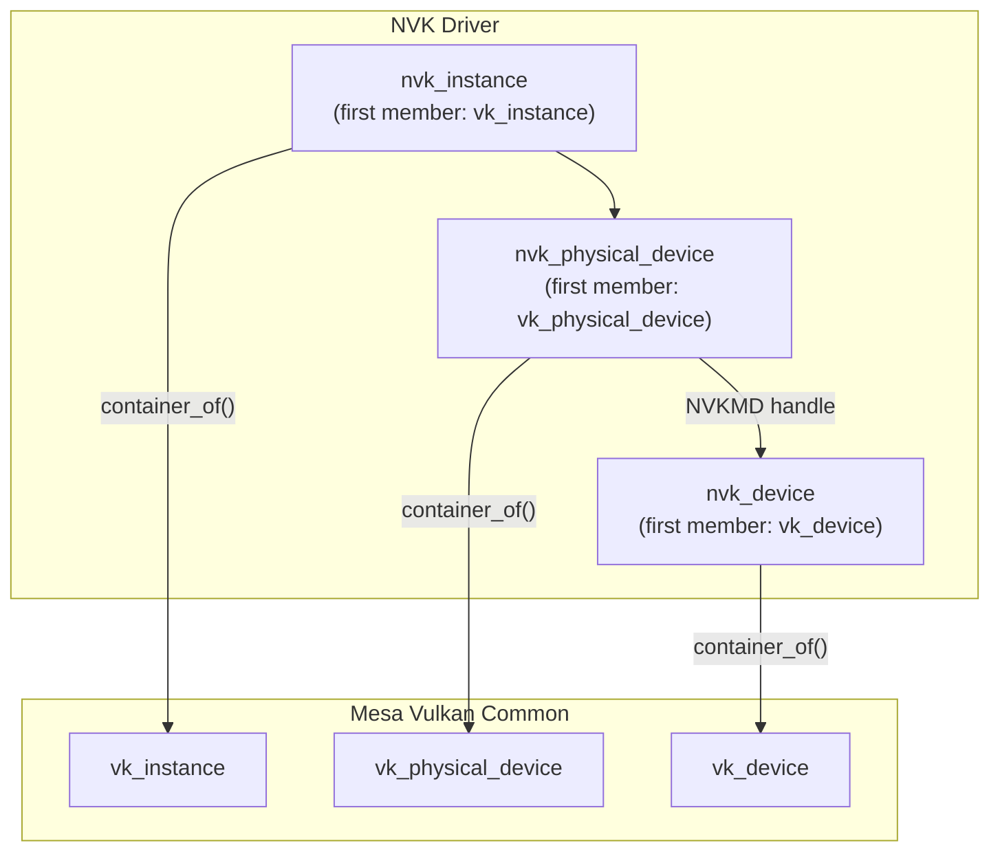
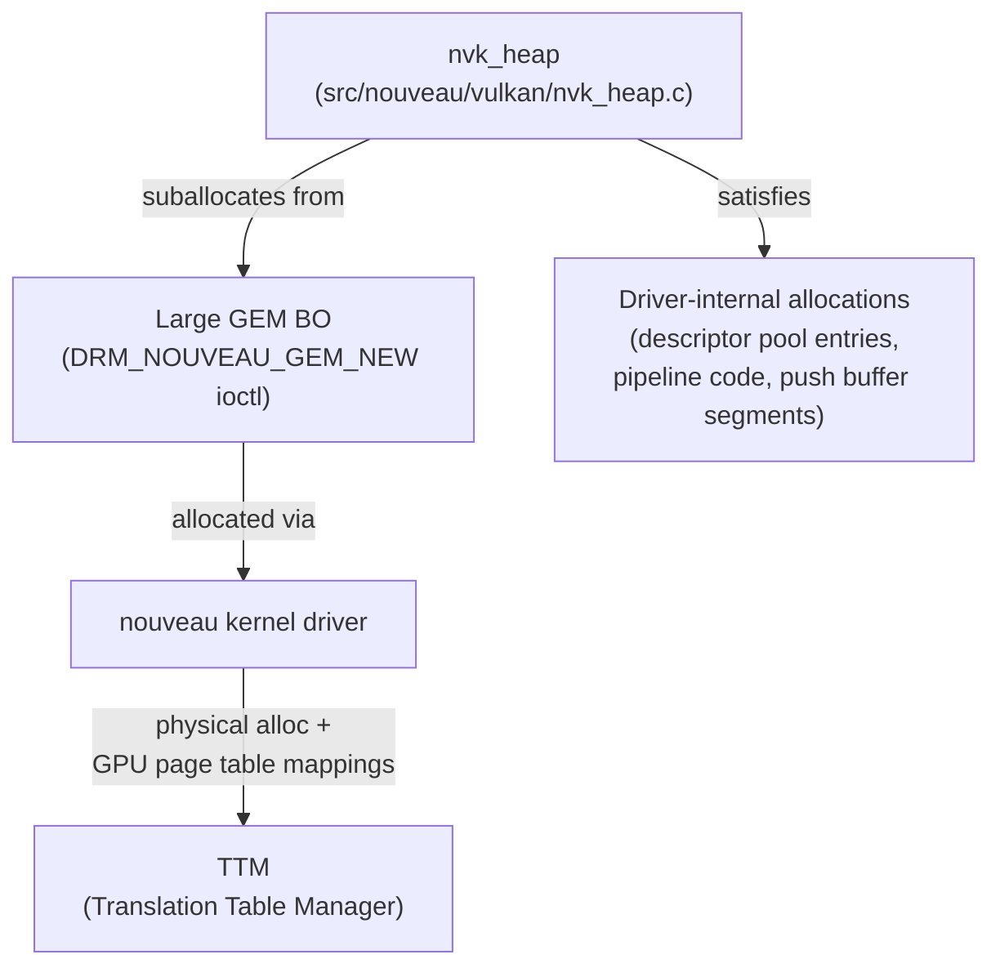
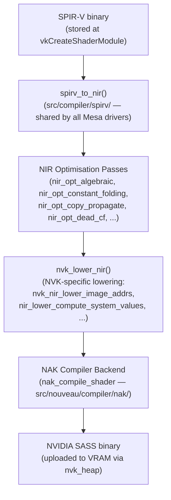
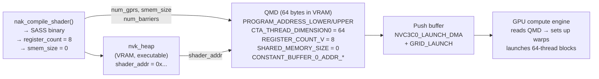
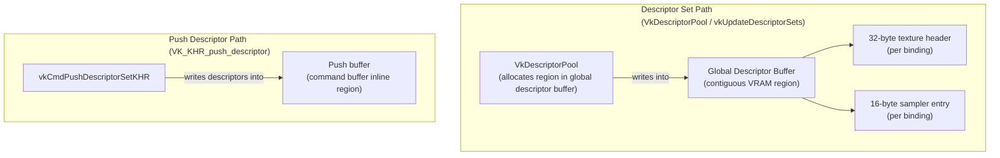
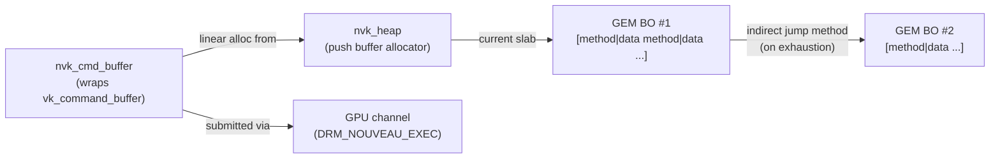
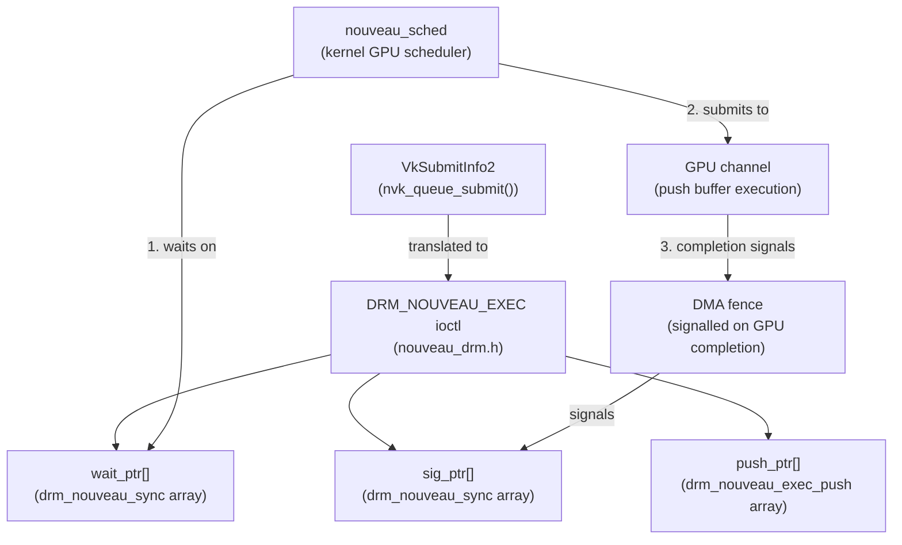
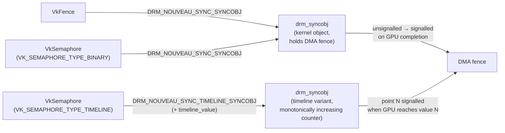

# Chapter 10: NVK: Building a Vulkan Driver from Scratch

> **Part**: Part III — The Nouveau Story
> **Audience**: Both — systems developers learn the internals of a new-generation Mesa Vulkan driver implementation; application developers learn what the NVK driver means for NVIDIA hardware support and what Vulkan guarantees it provides
> **Status**: First draft — 2026-06-06

## Table of Contents

- [Overview](#overview)
- [1. Motivation: Starting Fresh](#1-motivation-starting-fresh)
- [2. Object Model and Memory Heaps](#2-object-model-and-memory-heaps)
- [3. Shader Compilation: SPIR-V to NVIDIA ISA](#3-shader-compilation-spir-v-to-nvidia-isa)
- [4. Pipeline Objects and Command Recording](#4-pipeline-objects-and-command-recording)
- [5. Synchronisation on the Nouveau Channel Model](#5-synchronisation-on-the-nouveau-channel-model)
- [6. Vulkan Feature Coverage and Conformance Status](#6-vulkan-feature-coverage-and-conformance-status)
- [7. Lessons for New Mesa Vulkan Driver Authors](#7-lessons-for-new-mesa-vulkan-driver-authors)
- [Integrations](#integrations)
- [References](#references)

---

## Overview

**NVK** is the most technically ambitious project to emerge from the **Nouveau** ecosystem since the original kernel driver. Begun in 2022 by Faith Ekstrand — previously the lead developer of Intel's **ANV** Vulkan driver within **Mesa** — **NVK** is a clean-slate **Vulkan** driver for **NVIDIA** hardware built entirely within **Mesa**'s modern **Vulkan** common infrastructure. It is not a wrapper over the legacy **Gallium**-based **nouveau** driver, nor an adaptation of **NVIDIA**'s proprietary stack: it was designed from scratch with **Vulkan** semantics as the primary design constraint, and the entire **Mesa** GPU driver community as the intended audience.

This chapter examines **NVK** along seven major topics. Section 1 explains the architectural motivations: why starting over was preferable to extending the legacy **GL** driver (rooted in **nv50_ir**'s bespoke IR and the **Gallium** state tracker's impedance mismatch with **Vulkan** semantics), why the clean-sheet approach gave access to **Mesa**'s Vulkan common infrastructure in **src/vulkan/**, and how the hardware target range — **Kepler** through **Blackwell** — interacts with the **GSP-RM** (GPU System Processor Resource Manager) dependency for reclocking and full performance. Section 2 covers the **NVK** object model: the `nvk_instance`, `nvk_physical_device`, and `nvk_device` hierarchy that wraps the **Mesa** common base objects via `container_of()`, the three logical memory regions (**VRAM**, **BAR1**/ReBAR aperture, and **GART** system memory) exposed as **Vulkan** memory heaps and types, and the **GEM** object lifecycle including the `nvk_heap` suballocator that satisfies driver-internal allocations from large backing **BOs**. Section 3 provides a detailed technical walkthrough of shader compilation: the deferred-compilation model (`vkCreateShaderModule` stores **SPIR-V**; `vkCreateGraphicsPipeline`/`vkCreateComputePipeline` compiles), the four-stage pipeline from **SPIR-V** through `spirv_to_nir()` to **NIR** optimisation passes (`nir_opt_algebraic`, `nir_opt_constant_folding`, `nir_opt_copy_propagate`) to **NVK**-specific **NIR** lowering via `nvk_lower_nir()` (including `nvk_nir_lower_image_addrs()` for **NVIDIA**'s global descriptor table) to the **NAK** (**Nouveau Assembler Kit**) backend that generates **SASS** binaries, the **QMD** (Queue MetaData) descriptor required for compute dispatch, and integration with **Mesa**'s `vk_pipeline_cache` for the disk shader cache. Section 4 covers pipeline objects and command recording: descriptor sets mapped onto **NVIDIA**'s bindless global descriptor buffer via `VkDescriptorPool` and `vkUpdateDescriptorSets`, push descriptors via `VK_KHR_push_descriptor`, graphics pipeline state with extended dynamic state (`VK_EXT_extended_dynamic_state` through `VK_EXT_extended_dynamic_state3`), the `nvk_compute_pipeline` and `vkCmdDispatch` path, the push buffer linear allocator in `nvk_cmd_buffer` using the `DRM_NOUVEAU_EXEC` ioctl, and render pass handling through `VK_KHR_dynamic_rendering` and the `vk_render_pass` lowering layer. Section 5 covers synchronisation: how **Vulkan** fences, binary semaphores, timeline semaphores, events, and pipeline barriers are all mapped onto `drm_syncobj` and the `DRM_NOUVEAU_EXEC` submit interface, and how `VK_KHR_external_semaphore_fd` enables integration with the **Wayland** `wp_linux_drm_syncobj_v1` explicit sync protocol. Section 6 analyses **Vulkan** feature coverage and conformance status: the generation-stratified conformance from **Vulkan** 1.2 on **Kepler** through **Vulkan** 1.4 on **Turing** to **Blackwell**, the **dEQP-VK** CTS pass rates, extension coverage (including `VK_KHR_buffer_device_address`, `VK_EXT_descriptor_buffer`, `VK_KHR_cooperative_matrix`, and the absent `VK_KHR_ray_tracing_pipeline`), performance characteristics relative to **NVIDIA**'s proprietary driver, and compatibility with **DXVK** and **VKD3D-Proton** for Windows game translation. Section 7 extracts transferable lessons for new **Mesa** **Vulkan** driver authors — including the bringup checklist ordering (physical device enumeration → memory allocation → command submission → compute → graphics → **WSI** → descriptor sets → advanced sync), and how **NVK** serves as a reference for embedded **GPU** drivers such as **Qualcomm Adreno**, **ARM Mali**, and **PowerVR**.

By the end of this chapter, the reader will understand the full **NVK** architecture end-to-end, be able to navigate the **NVK** source tree effectively, know the current conformance status spanning **Kepler** through **Blackwell** GPUs, and carry a mental model of **Mesa** **Vulkan** driver development that applies beyond **NVIDIA** hardware entirely.

---

## 1. Motivation: Starting Fresh

### The Legacy Driver and Its Constraints

To understand why NVK was written from scratch, it is necessary to understand what it replaced — and why replacement was preferable to evolution. The legacy Nouveau Gallium driver, located in `src/gallium/drivers/nouveau/` in the Mesa tree, was written in an era before NIR, before Vulkan, before any of the modern Mesa infrastructure that now makes new driver development tractable. Its shader compiler, `nv50_ir/`, is a bespoke IR whose design predates Mesa's common NIR framework entirely. The path from GLSL source to NVIDIA machine code inside the legacy driver runs entirely through this proprietary IR, with no connection to NIR's optimisation passes, no shared infrastructure with other Mesa drivers, and no obvious seam at which a NIR-consuming Vulkan front end could be grafted on.

The structural problem runs deeper than the compiler. The Gallium state tracker encodes OpenGL-era concepts throughout its interface: render target bindings, the fixed-function blend state machine, per-stage texture unit management. These concepts are not merely inconvenient for a Vulkan driver — they are actively counterproductive. Implementing Vulkan over Gallium means translating Vulkan's explicit, application-controlled state model into Gallium's implicit, driver-managed model and then immediately unwinding that translation on the hardware side. Every layer of indirection adds latency, increases correctness risk, and makes debugging harder.

The practical consequence was that implementing Vulkan over the Gallium nouveau driver would have required reimplementing most of `nv50_ir/` to consume NIR, rearchitecting the Gallium state tracker to handle Vulkan's render pass model, and then layering Vulkan's synchronisation primitives onto a subsystem designed for OpenGL's implicit sync. This was, in Faith Ekstrand's assessment, approximately as much work as writing a new driver — with the added disadvantage of inheriting the legacy driver's technical debt.

### Why NVK Rather Than Vulkan-over-Gallium

The decisive advantage of the clean-sheet approach was access to Mesa's modern Vulkan common infrastructure, located in `src/vulkan/` in the Mesa tree. This infrastructure, developed primarily through the ANV (Intel) and RADV (AMD) drivers, handles a surprising amount of the Vulkan specification on behalf of any driver that chooses to use it. The `vk_render_pass` implementation handles legacy `VkRenderPass` objects by lowering them to the dynamic rendering operations that modern hardware actually supports. The `vk_pipeline_cache` provides a correct, serialisable pipeline cache from day one. Common extension implementations for `VK_KHR_maintenance4`, `VK_KHR_synchronization2`, and the extended dynamic state family are available to any driver that registers the appropriate function pointers.

NVK was designed to exercise every piece of this infrastructure. Faith Ekstrand's stated goal was not merely to produce a working NVIDIA Vulkan driver but to validate and improve the common infrastructure simultaneously, so that subsequent driver authors — for embedded GPUs, for new architectures, for experimental hardware — would find a more capable foundation waiting for them. This dual purpose shaped NVK's architecture in observable ways: the driver is deliberately minimal in the places where the common infrastructure already handles a concern, and deliberately explicit in the places where NVIDIA hardware requires driver-specific logic.

The shader compilation path illustrates this cleanly. With NIR as the common IR, the path from SPIR-V to GPU binary becomes: `spirv_to_nir()` (from `src/compiler/spirv/`, shared by every Mesa driver) followed by a set of NIR optimisation passes (also shared), followed by NVK-specific lowering passes, followed by the NAK backend (NVIDIA-specific). The legacy `nv50_ir/` IR is entirely absent. Each stage of the pipeline has clear inputs, clear outputs, and clear ownership, making the compiler tractable to debug and extend without touching unrelated parts of the driver.

### Hardware Target Range and the GSP-RM Dependency

NVK targets NVIDIA GPUs from Kepler (GK100, 2012) through Ada Lovelace (AD102, 2022) and, as of Mesa 25.2, extending to Blackwell (GB202, 2025). The driver achieves different Vulkan version conformance across this range: Kepler reaches Vulkan 1.2 due to hardware limitations (the lack of `vulkanMemoryModel` semantics in the older memory subsystem), Maxwell through Volta reach Vulkan 1.3, and Turing through Blackwell achieve full Vulkan 1.4 conformance.

The practical performance story, however, is significantly more stratified. Older GPUs — Kepler, Maxwell, Pascal — lack support for GSP-RM (GPU System Processor — Resource Manager), the firmware-based GPU management subsystem described in Chapter 9. Without GSP-RM, the nouveau kernel driver cannot perform GPU reclocking, which means these GPUs run at their boot clocks rather than at their rated performance clocks. On a Maxwell GPU this typically means operating at roughly one-third to one-half of rated performance. NVK runs correctly on these GPUs and passes conformance, but the performance ceiling is fundamentally limited by the kernel, not by the Mesa driver.

For Turing and newer GPUs, GSP-RM is supported, reclocking works, and NVK delivers the full compute and rasterisation throughput of the hardware. This is the primary production target for NVK today, and it is where the performance story versus NVIDIA's proprietary driver is most meaningful.

The hardware breadth — spanning a decade of NVIDIA microarchitectures — was also a deliberate design choice. A driver that correctly handles Kepler through Blackwell must have a principled abstraction layer between the Vulkan API and the hardware differences across generations. NVK's architecture delivers this: the core object model, memory allocation path, and synchronisation primitives are hardware-generation-agnostic, while the NAK compiler backend encodes generation-specific instruction encoding and register file differences in clearly bounded modules.

---

## 2. Object Model and Memory Heaps

### Source Location and Object Hierarchy

NVK's Mesa source lives in `src/nouveau/vulkan/`. The top-level objects follow the naming convention of every Mesa Vulkan driver: `nvk_instance`, `nvk_physical_device`, `nvk_device`. Each of these wraps the corresponding Mesa Vulkan common object (`vk_instance`, `vk_physical_device`, `vk_device`) as its first member, enabling the pervasive Mesa pattern of safe upcasting via `container_of()`. The common object carries the function table dispatch, the enabled extension set, and other cross-driver state; the `nvk_` wrapper adds NVIDIA-specific fields.



The `nvk_instance` object holds global driver state: the list of enumerated physical devices, debug flag parsing (from the `NVK_DEBUG` environment variable), and DRI option overrides. Debug flags include `push_dump` (dump push buffer contents to stderr), `push_sync` (insert synchronisation points after every push buffer submission for GPU fault isolation), `zero_memory` (zero all allocated BOs to catch uninitialised-memory bugs), and `trash_memory` (fill BOs with a pattern to surface use-after-free errors). These flags are indispensable during driver development and reflect lessons learned from the ANV and RADV development histories.

The `nvk_physical_device` object represents one enumerable GPU. It holds the GPU's capability flags, the memory type and heap table, the queue family descriptions, and the NVKMD (Nouveau Kernel Mode Driver) handle used for all subsequent kernel interactions. NVKMD is NVK's abstraction layer over the kernel UAPI — it wraps GPU initialisation, buffer object allocation, virtual address space management, and queue submission behind a function-pointer interface, enabling the driver to run against both the in-tree DRM kernel driver and, in principle, alternative kernel back ends.

### Memory Types and Heaps

Vulkan's explicit memory model requires every driver to enumerate its memory heaps and memory types at physical device initialisation time. NVIDIA hardware presents three logical memory regions to the driver, each with distinct performance characteristics that map onto distinct Vulkan memory type properties.

The first region is VRAM — the GPU's on-board GDDR or HBM memory. This is the fastest memory for GPU access: full bandwidth, low latency, not accessible to the CPU except through a limited aperture. In Vulkan terms, VRAM corresponds to `VK_MEMORY_PROPERTY_DEVICE_LOCAL_BIT` without host visibility. Applications should place all GPU-only resources (textures, render targets, geometry buffers consumed only by draw calls) here.

The second region is the BAR1 aperture — a PCIe window into VRAM that is simultaneously mapped to the CPU's address space. On older systems without Resizable BAR (ReBAR), this window is limited to 256 MB, making it suitable only for streaming upload buffers. On modern systems with ReBAR enabled in the UEFI firmware, the full VRAM is exposed through this aperture, typically 8–24 GB. NVK exposes BAR1 memory as `VK_MEMORY_PROPERTY_DEVICE_LOCAL_BIT | VK_MEMORY_PROPERTY_HOST_VISIBLE_BIT | VK_MEMORY_PROPERTY_HOST_COHERENT_BIT`. Application developers who understand this distinction — and Chapter 24 discusses it in detail — can use ReBAR memory for resources that are written once by the CPU and read many times by the GPU, avoiding the explicit upload copy that non-ReBAR workflows require.

The third region is system memory, allocated through the GART/IOMMU mapping. This memory is host-visible and host-coherent but not device-local: the GPU accesses it over the PCIe bus with much higher latency than VRAM. NVK exposes two variants: a coherent type (immediate CPU-GPU visibility) and a cached type (CPU-cached, requiring explicit cache flush/invalidate operations). System memory is the correct placement for staging buffers, readback buffers, and any resource that the CPU writes frequently and the GPU reads rarely.

The memory type enumeration happens in `nvk_physical_device.c`. The precise heap and type indices depend on whether the GPU is a discrete card or an integrated Tegra device, since Tegra uses unified memory architecture and has different coherency semantics. The important invariant is that NVK always exposes the full set of placement options the hardware supports, giving applications the information they need to make optimal allocation decisions.

### GEM Object Lifecycle and Suballocation

Every piece of GPU memory in NVK ultimately comes from a GEM buffer object. GEM BO allocation goes through the `DRM_NOUVEAU_GEM_NEW` ioctl, which accepts placement flags specifying the desired memory domain (VRAM, GART, or pinned system memory) and alignment requirements. The nouveau kernel driver allocates from TTM (Translation Table Manager), which handles the actual physical memory allocation and the GPU page table mappings.

For CPU access, `nvk_bo_map()` uses `mmap()` on the DRM file descriptor, mapping the BO's BAR1 or GART backing into the process address space. The mapping is persistent — NVK does not unmap BOs between uses, trading virtual address space for the elimination of map/unmap overhead on the critical path of command buffer submission.

Rather than allocating a fresh GEM BO for every small driver-internal allocation, NVK uses a suballocator: `nvk_heap`, implemented in `src/nouveau/vulkan/nvk_heap.c`. The heap maintains a list of large GEM BOs and satisfies driver-internal allocation requests (descriptor pool entries, pipeline code storage, push buffer segments) from these pools using a simple free-list allocator. This pattern — a large backing allocation suballocated for driver-internal use — is standard practice in Mesa Vulkan drivers and avoids the per-allocation overhead of GEM ioctl calls for the high-frequency internal allocations that occur during command buffer recording.



```c
/* Source: src/nouveau/vulkan/nvk_heap.c — nvk_heap_alloc() */
VkResult
nvk_heap_alloc(struct nvk_device *dev,
               struct nvk_heap *heap,
               uint64_t size,
               uint32_t alignment,
               uint64_t *addr_out,
               void **map_out)
{
    /* Try to satisfy from existing slabs first */
    simple_mtx_lock(&heap->mutex);
    uint64_t addr = util_vma_heap_alloc(&heap->vma_heap, size, alignment);
    if (addr != 0) {
        simple_mtx_unlock(&heap->mutex);
        *addr_out = addr;
        if (map_out)
            *map_out = (char *)heap->bo_map + (addr - heap->bo_addr);
        return VK_SUCCESS;
    }
    /* Grow the heap by allocating a new slab BO */
    /* ... */
    simple_mtx_unlock(&heap->mutex);
    return nvk_heap_grow_locked(dev, heap, size, alignment, addr_out, map_out);
}
```

For application-visible `VkDeviceMemory` allocations, NVK wraps the `vk_device_memory` base object. Large allocations (above a driver-tunable threshold) receive a dedicated GEM BO; small allocations are served from a pool allocator to avoid GEM BO proliferation, which would otherwise exhaust the kernel's per-process BO limit and degrade TTM performance.

---

## 3. Shader Compilation: SPIR-V to NVIDIA ISA

### The Compilation Pipeline Overview

Shader compilation in NVK spans two phases of the Vulkan API. At `vkCreateShaderModule` time, NVK simply stores the SPIR-V binary without processing it. The real compilation happens at `vkCreateGraphicsPipeline` or `vkCreateComputePipeline` time, when the driver has the full pipeline state available and can make informed decisions about register allocation, input/output layout, and hardware feature selection. This deferred-compilation approach is standard across Mesa Vulkan drivers and is fundamental to the correctness of the pipeline cache: the cache key includes not just the SPIR-V but the full pipeline state that influences code generation.

The compilation path proceeds through four major stages: SPIR-V to NIR translation, NIR optimisation, NVK-specific NIR lowering, and NAK code generation. Each stage has clear inputs and outputs, and each can be exercised independently for debugging purposes.



### SPIR-V to NIR

The first stage uses `spirv_to_nir()` from `src/compiler/spirv/`, the Mesa SPIR-V front end maintained by Faith Ekstrand and shared by every Mesa Vulkan driver. This function performs the structural translation from SPIR-V's typed SSA form to NIR's SSA form, resolving SPIR-V decorations (memory layout qualifiers, built-in variable identities, access qualifiers) into NIR intrinsics and variables.

NVK passes NVIDIA-specific capability flags to the SPIR-V front end: the driver advertises which SPIR-V extensions and capabilities it supports (such as `SPV_KHR_shader_draw_parameters`, `SPV_EXT_descriptor_indexing`, `SPV_KHR_vulkan_memory_model`), and the front end validates that the incoming SPIR-V does not use undeclared capabilities. The driver-level capability set is derived from the enabled Vulkan extensions and the hardware generation, ensuring that Kepler does not attempt to consume SPIR-V that requires Turing's bindless texture capabilities.

### NIR Optimisation Passes

After SPIR-V conversion, NVK applies a standard sequence of NIR optimisation passes. These passes are not NVK-specific; they are the same passes applied by RADV, ANV, and every other NIR-consuming Mesa driver. The key passes are: `nir_lower_vars_to_ssa()` (promotes variables to SSA values, enabling further optimisation), `nir_remove_dead_variables()` (eliminates unused interface variables), `nir_opt_algebraic()` (peephole algebraic simplifications), `nir_opt_constant_folding()` (folds constants at compile time), `nir_opt_copy_propagate()` (eliminates redundant copies), and `nir_opt_dead_cf()` (removes unreachable control flow). These passes are iterated until the NIR reaches a fixed point — typically two to four iterations suffice for typical shader workloads.

The NIR that emerges from this sequence is semantically equivalent to the input SPIR-V but structurally simpler: dead code is gone, constants are folded, and the variable model has been reduced to SSA. This simplification is valuable because the NVK-specific lowering passes and the NAK backend both work on NIR, and simpler NIR translates to faster compilation and better code quality.

### NVK-Specific NIR Lowering

Before handing NIR to the NAK backend, NVK applies a sequence of hardware-specific lowering passes through `nvk_lower_nir()` in `nvk_pipeline.c`. These passes transform NIR constructs that have no direct hardware equivalent into sequences that do.

The most significant lowering is `nvk_nir_lower_image_addrs()`, which translates Vulkan bindless image references into NVIDIA's hardware descriptor table format. NVIDIA GPUs use a global descriptor table (GDT) — a large buffer in VRAM that holds texture/sampler descriptors at fixed indices. When a shader accesses an image through a bindless descriptor, the hardware load instruction takes a 64-bit descriptor index; the lowering pass emits the NIR instructions that compute this index from the Vulkan descriptor set offset.

Other important lowering passes include: `nir_lower_clip_cull_distance_to_vec4()`, which maps Vulkan's per-component clip/cull distances to NVIDIA's hardware representation as packed vec4 values; `nir_lower_compute_system_values()`, which maps Vulkan's `gl_WorkGroupID`, `gl_LocalInvocationID`, and `gl_GlobalInvocationID` built-ins to the specific hardware registers where NVIDIA's compute engine deposits them; and the shared memory layout lowering, which translates NIR's abstract shared memory model to NVIDIA's banked LDS (Local Data Store) addressing.

### The NAK Compiler Backend

The NAK (Nouveau Assembler Kit) compiler, located in `src/nouveau/compiler/nak/`, is the most novel and technically ambitious component of NVK. It was added to Mesa in the 24.0 release cycle after approximately six months of development. It is notably written primarily in Rust — an unusual choice for Mesa, which is predominantly a C codebase — reflecting Faith Ekstrand's view that Rust's type system and memory safety guarantees reduce the class of compiler bugs that commonly afflict C-based compilers.

NAK defines its own intermediate representation, NAK IR, which sits between NIR's high-level SSA form and the final NVIDIA SASS (Shader ASSembly) binary encoding. NAK IR is an explicit-register IR: where NIR uses unlimited virtual SSA values, NAK IR uses named register files (GPR, predicate register, carry flag) with explicit operand slots. This representation is closer to the hardware and makes register allocation more straightforward because the allocator works on a representation that already encodes hardware constraints (register pair requirements for 64-bit values, predicate register separation from general registers).

The NAK compilation pipeline begins with `nak_compile_shader()`, which accepts a NIR shader and a set of driver options including the target architecture (Kepler SM 3.x through Blackwell SM 10.x). The function translates NIR instructions to NAK IR instructions using an instruction selector: each NIR opcode maps to one or more NAK IR instructions according to the capabilities of the target architecture. Memory instructions map to hardware load/store variants: `LDG` for global memory loads, `LDS` for shared memory loads (within a compute workgroup), `LDSM` for matrix loads on Turing and newer. Texture instructions map to the `TEX`, `TXD`, `TXL`, and `TXF` SASS instruction family depending on derivative and LOD requirements.

```c
/* Source: src/nouveau/compiler/nak/lib.rs — nak_compile_shader() conceptual flow */
/* NAK is primarily Rust; this is a conceptual C-style pseudocode representation */

/* Step 1: NIR → NAK IR (instruction selection) */
nak_ir = nak_select_instrs(nir_shader, target_sm);

/* Step 2: NIR-level optimizations on NAK IR */
nak_opt_copy_prop(nak_ir);
nak_opt_dce(nak_ir);

/* Step 3: Register allocation */
nak_ra_alloc(nak_ir, target_sm);     /* GPRs: up to 255 per thread */
nak_ra_alloc_pred(nak_ir);           /* Predicate registers: P0–P6 */

/* Step 4: Instruction scheduling (basic) */
nak_sched(nak_ir, target_sm);

/* Step 5: Binary encoding */
nak_encode(nak_ir, target_sm, out_binary);
```

Register allocation in NAK uses a variant of linear scan allocation. The NVIDIA GPU register file is organised as 255 general-purpose 32-bit registers per thread. 64-bit values occupy aligned pairs of GPRs (registers `n` and `n+1` where `n` is even). Texture coordinate vectors may require quadruples. NAK's allocator must respect these alignment constraints while also respecting the hardware limit on live register count — which determines warp occupancy and ultimately compute throughput. Predicate registers (P0 through P6 on most architectures) are allocated separately from GPRs, since they occupy a distinct hardware register file and are used exclusively for conditional instruction encoding.

One architecturally important feature of NVIDIA SASS that NAK must handle is the control code mechanism. On Maxwell and later architectures, the instruction stream contains scheduling control codes interspersed between groups of executable instructions. These control codes encode warp scheduling hints — stall counts, yield flags, read/write barriers — that the warp scheduler uses to determine when a warp can issue the next instruction without stalling. Correct control code generation is essential for both correctness (avoiding WAR/RAW hazards) and performance (maximising warp-level instruction-level parallelism). NAK generates conservative control codes that are correct but not maximally optimised compared to NVIDIA's proprietary compiler, which has access to detailed pipeline timing models.

### Worked Example: Tracing a Shader Through Each Compilation Stage

The following traces the simplest meaningful compute shader — single-precision floating-point vector addition — through every stage of the NVK compilation pipeline. The shader reads two input arrays from storage buffers and writes their element-wise sum to a third. Each stage is labelled with the tool or Mesa function that produces it.

> **Note on LLVM**: NAK deliberately avoids LLVM. LLVM's GPU backends target PTX, which still requires NVIDIA's proprietary `ptxas` to produce SASS — defeating the purpose of an open-source compiler. NAK generates SASS directly from NIR, in Rust, with no LLVM dependency. A pipeline using LLVM would describe the CUDA or old nv50-LLVM path, not NVK.

#### Stage 0: HLSL Compute Shader Source

HLSL compiled to SPIR-V via **DXC** (`dxc -T cs_6_0 -spirv`) is a first-class Vulkan shader path. `StructuredBuffer<T>` maps to a read-only SSBO; `RWStructuredBuffer<T>` to a read-write SSBO. The `[numthreads]` attribute emits `OpExecutionMode LocalSize` in SPIR-V.

```hlsl
// vadd.hlsl
// Compile: dxc -T cs_6_0 -E main -spirv -fvk-use-dx-layout vadd.hlsl -Fo vadd.spv

StructuredBuffer<float>   SrcA : register(t0, space0);  // set=0 binding=0 (SRV)
StructuredBuffer<float>   SrcB : register(t1, space0);  // set=0 binding=1
RWStructuredBuffer<float> Dst  : register(u0, space1);  // set=1 binding=0 (UAV)

[numthreads(64, 1, 1)]
void main(uint3 DTid : SV_DispatchThreadID)
{
    uint i = DTid.x;
    Dst[i] = SrcA[i] + SrcB[i];
}
```

The corresponding Vulkan application creates the compute pipeline in two calls. `vkCreateShaderModule` stores the SPIR-V verbatim; NAK compilation is deferred to `vkCreateComputePipeline`.

```cpp
// vadd.cpp — minimal Vulkan compute pipeline setup
std::vector<uint32_t> spirv = readFile("vadd.spv");

VkShaderModuleCreateInfo modCI{
    .sType    = VK_STRUCTURE_TYPE_SHADER_MODULE_CREATE_INFO,
    .codeSize = spirv.size() * sizeof(uint32_t),
    .pCode    = spirv.data(),
};
VkShaderModule shaderMod;
vkCreateShaderModule(device, &modCI, nullptr, &shaderMod);
// NVK: stores SPIR-V verbatim; no compilation yet

// Descriptor set layout: set=0 has two read-only SSBOs; set=1 has one RW SSBO
// (VkDescriptorSetLayoutCreateInfo omitted for brevity)

VkComputePipelineCreateInfo pipeCI{
    .sType  = VK_STRUCTURE_TYPE_COMPUTE_PIPELINE_CREATE_INFO,
    .stage  = {
        .sType  = VK_STRUCTURE_TYPE_PIPELINE_SHADER_STAGE_CREATE_INFO,
        .stage  = VK_SHADER_STAGE_COMPUTE_BIT,
        .module = shaderMod,
        .pName  = "main",
    },
    .layout = pipelineLayout,
};
VkPipeline pipeline;
vkCreateComputePipeline(device, VK_NULL_HANDLE, 1, &pipeCI, nullptr, &pipeline);
// NVK: spirv_to_nir → nir_opt_* → nvk_lower_nir → nak_compile_shader → SASS upload
```

#### Stage 1: SPIR-V Assembly (`spirv-dis vadd.spv`)

DXC's SPIR-V differs from glslangValidator's in three important ways: it uses the `StorageBuffer` storage class (not the legacy `Uniform`+`BufferBlock` approach); it decorates each buffer struct with `Block` rather than `BufferBlock`; and it wraps runtime arrays in a named struct per HLSL type (`type.StructuredBuffer.float`, `type.RWStructuredBuffer.float`). Mesa's `spirv_to_nir` handles both conventions and produces identical NIR.

```spirv
; SPIR-V  Version: 1.0   Generator: DXC; Bound: 38; Schema: 0
               OpCapability Shader
               OpExtension "SPV_KHR_storage_buffer_storage_class"
          %1 = OpExtInstImport "GLSL.std.450"
               OpMemoryModel Logical GLSL450
               OpEntryPoint GLCompute %main "main" %sv_dispatchthreadid
               OpExecutionMode %main LocalSize 64 1 1

               ; DXC emits HLSL type names as debug info
               OpName %main                            "main"
               OpName %type_StructuredBuffer_float     "type.StructuredBuffer.float"
               OpName %type_RWStructuredBuffer_float   "type.RWStructuredBuffer.float"
               OpName %SrcA "SrcA"
               OpName %SrcB "SrcB"
               OpName %Dst  "Dst"

               ; Descriptor bindings from HLSL register() annotations
               OpDecorate %SrcA DescriptorSet 0
               OpDecorate %SrcA Binding 0
               OpDecorate %SrcB DescriptorSet 0
               OpDecorate %SrcB Binding 1
               OpDecorate %Dst  DescriptorSet 1
               OpDecorate %Dst  Binding 0

               ; DXC: StorageBuffer storage class uses Block (not BufferBlock)
               OpDecorate %type_StructuredBuffer_float   Block
               OpDecorate %type_RWStructuredBuffer_float Block
               OpMemberDecorate %type_StructuredBuffer_float   0 Offset 0
               OpMemberDecorate %type_RWStructuredBuffer_float 0 Offset 0
               OpDecorate %_runtimearr_float ArrayStride 4
               OpDecorate %sv_dispatchthreadid BuiltIn GlobalInvocationId

               ; Type declarations
      %void = OpTypeVoid
    %fn_void = OpTypeFunction %void
     %float  = OpTypeFloat 32
      %uint  = OpTypeInt 32 0
     %v3uint = OpTypeVector %uint 3
       %int  = OpTypeInt 32 1
%_runtimearr_float = OpTypeRuntimeArray %float

               ; DXC wraps each StructuredBuffer as struct { float[] } — unlike GLSL
%type_StructuredBuffer_float   = OpTypeStruct %_runtimearr_float
%type_RWStructuredBuffer_float = OpTypeStruct %_runtimearr_float

%_ptr_SB_SrcType = OpTypePointer StorageBuffer %type_StructuredBuffer_float
%_ptr_SB_DstType = OpTypePointer StorageBuffer %type_RWStructuredBuffer_float
%_ptr_SB_float   = OpTypePointer StorageBuffer %float
%_ptr_In_v3uint  = OpTypePointer Input %v3uint
%_ptr_In_uint    = OpTypePointer Input %uint

%SrcA = OpVariable %_ptr_SB_SrcType StorageBuffer   ; set=0 binding=0
%SrcB = OpVariable %_ptr_SB_SrcType StorageBuffer   ; set=0 binding=1
%Dst  = OpVariable %_ptr_SB_DstType StorageBuffer   ; set=1 binding=0
%sv_dispatchthreadid = OpVariable %_ptr_In_v3uint Input

    %int_0  = OpConstant %int 0
    %uint_0 = OpConstant %uint 0

               ; main() — single basic block
      %main = OpFunction %void None %fn_void
       %bb0 = OpLabel
    %dtid_p = OpAccessChain %_ptr_In_uint %sv_dispatchthreadid %uint_0
       %i   = OpLoad %uint %dtid_p                           ; i = DTid.x

    %aptr   = OpAccessChain %_ptr_SB_float %SrcA %int_0 %i  ; &SrcA[i]  (struct member 0, index i)
    %a_val  = OpLoad %float %aptr

    %bptr   = OpAccessChain %_ptr_SB_float %SrcB %int_0 %i  ; &SrcB[i]
    %b_val  = OpLoad %float %bptr

    %sum    = OpFAdd %float %a_val %b_val

    %cptr   = OpAccessChain %_ptr_SB_float %Dst %int_0 %i   ; &Dst[i]
              OpStore %cptr %sum
              OpReturn
              OpFunctionEnd
```

The `%int_0` in `OpAccessChain` navigates member 0 of the DXC-generated wrapper struct; the second index `%i` is the runtime array element. `spirv_to_nir` strips both layers, producing a flat `(binding, byte_offset)` pair in NIR.

#### Stage 2: NIR After `spirv_to_nir()` (Unoptimised)

`spirv_to_nir()` translates both `StorageBuffer`+`Block` (DXC) and `Uniform`+`BufferBlock` (older GLSL) SPIR-V conventions into `load_ssbo`/`store_ssbo` NIR intrinsics. Enable with `NIR_DEBUG=print` in the environment (Mesa debug build) to capture this dump.

```text
; NIR text dump — nir_print_shader() after spirv_to_nir(), before any opt passes
; Produced by: src/compiler/spirv/spirv_to_nir.c

shader: MESA_SHADER_COMPUTE
name: main
workgroup_size: 64, 1, 1
shared_size: 0

decl_var ssbo INTERP_MODE_NONE float[] SrcA (set=0, binding=0, offset=0)
decl_var ssbo INTERP_MODE_NONE float[] SrcB (set=0, binding=1, offset=0)
decl_var ssbo INTERP_MODE_NONE float[] Dst  (set=1, binding=0, offset=0)

impl main {
    block b0:
    /* preds: */

    ; SV_DispatchThreadID == gl_GlobalInvocationID for Vulkan compute
    vec3 32 ssa_0 = intrinsic load_global_invocation_id () ()

    ; DTid.x (our index i)
    vec1 32 ssa_1 = mov ssa_0.x

    ; Widen i to 64-bit for pointer arithmetic
    vec1 64 ssa_2 = u2u64 ssa_1

    ; Byte offset: i * sizeof(float) == i * 4  (from OpDecorate ArrayStride 4)
    vec1 32 ssa_3 = load_const (0x00000004 = 4)
    vec1 64 ssa_4 = imul ssa_2, ssa_3

    ; Binding constants (NVK flattens descriptor sets to a single binding namespace)
    vec1 32 ssa_5 = load_const (0x00000000 = 0)   ; SrcA binding
    vec1 32 ssa_6 = load_const (0x00000001 = 1)   ; SrcB binding
    vec1 32 ssa_7 = load_const (0x00000002 = 2)   ; Dst binding (set 1 → flattened)

    ; Load SrcA[i] from storage buffer — will become LDG in SASS
    vec1 32 ssa_8 = intrinsic load_ssbo (ssa_5 /*binding*/, ssa_4 /*byte offset*/) \
                        (access=READ, align_mul=4, align_offset=0)

    ; Load SrcB[i]
    vec1 32 ssa_9 = intrinsic load_ssbo (ssa_6, ssa_4) \
                        (access=READ, align_mul=4, align_offset=0)

    ; Float add — maps directly to FADD in SASS
    vec1 32 ssa_10 = fadd ssa_8, ssa_9

    ; Store result to Dst[i] — will become STG in SASS
    intrinsic store_ssbo (ssa_10 /*value*/, ssa_7 /*binding*/, ssa_4 /*offset*/) \
                        (write_mask=0x1, access=WRITE, align_mul=4, align_offset=0)

    /* succs: */
}
```

The SPIR-V struct-wrapper layers (`OpAccessChain … %int_0 %i`) are gone; `spirv_to_nir` flattened them into a single `(binding, byte_offset)` pair per access. No hardware-specific lowering has occurred.

#### Stage 3: NIR After Optimisation Passes (`nir_opt_*`)

The optimisation loop runs `nir_lower_vars_to_ssa`, `nir_opt_copy_propagate`, `nir_opt_constant_folding`, `nir_opt_algebraic`, and `nir_opt_dead_cf` to a fixed point (typically 2–3 iterations for this shader). Changes relative to the unoptimised form are annotated.

```text
; NIR after nir_opt_* — changes annotated with <OPT>
shader: MESA_SHADER_COMPUTE
name: main
workgroup_size: 64, 1, 1

impl main {
    block b0:
    vec3 32 ssa_0 = intrinsic load_global_invocation_id () ()

    ; <OPT: copy_propagate> mov ssa_1 = mov ssa_0.x eliminated — .x used directly
    vec1 64 ssa_1 = u2u64 ssa_0.x

    ; <OPT: algebraic> imul ssa_1, 4  →  ishl ssa_1, 2  (multiply by 2^2 = shift)
    ; <OPT: constant_fold> load_const(4) inlined into shift amount; ssa_3 dead and removed
    vec1 64 ssa_2 = ishl ssa_1, load_const(0x2)

    ; <OPT: constant_fold> binding indices inlined at use sites; ssa_5/6/7 defs removed
    vec1 32 ssa_3 = intrinsic load_ssbo (load_const(0) /*binding 0*/, ssa_2) \
                        (access=READ, align_mul=4, align_offset=0)
    vec1 32 ssa_4 = intrinsic load_ssbo (load_const(1) /*binding 1*/, ssa_2) \
                        (access=READ, align_mul=4, align_offset=0)

    ; <OPT: copy_prop> ssa_2 (byte offset) shared between both loads — computed once
    vec1 32 ssa_5 = fadd ssa_3, ssa_4

    intrinsic store_ssbo (ssa_5, load_const(2) /*binding 2*/, ssa_2) \
                        (write_mask=0x1, access=WRITE, align_mul=4, align_offset=0)
}
```

For more complex shaders `nir_opt_dead_cf` prunes unreachable branches, `nir_opt_loop_unroll` unrolls bounded loops, and `nir_opt_if` canonicalises conditionals. This shader has none, so those passes are no-ops here.

#### Stage 4: NIR After `nvk_lower_nir()` (NVK-Specific Lowering)

`nvk_lower_nir()` in `src/nouveau/vulkan/nvk_pipeline.c` translates `load_ssbo(binding, offset)` into an explicit two-step sequence: (1) load the buffer's 64-bit GPU virtual address from NVK's constant-buffer descriptor table, (2) add the element byte offset, (3) issue a raw `load_global` / `store_global` on the resulting pointer. After this pass no binding-index abstraction remains — only raw GPU virtual addresses.

```text
; NIR after nvk_lower_nir() — all SSBOs lowered to raw 64-bit pointer ops
shader: MESA_SHADER_COMPUTE
name: main
workgroup_size: 64, 1, 1

impl main {
    block b0:
    vec3 32 ssa_0 = intrinsic load_global_invocation_id () ()
    vec1 64 ssa_1 = u2u64 ssa_0.x
    vec1 64 ssa_2 = ishl ssa_1, load_const(0x2)      ; byte offset

    ; --- nvk SSBO lowering: load 64-bit buffer base addresses from cbuf 0 ---
    ; NVK stores each binding's GPU vaddr in constant buffer 0 at 8-byte aligned slots.
    vec1 64 ssa_3 = intrinsic load_ubo (load_const(0) /*cbuf 0*/,
                        load_const(0x00) /*SrcA addr slot*/) (align_mul=8, align_offset=0)
    vec1 64 ssa_4 = intrinsic load_ubo (load_const(0),
                        load_const(0x08) /*SrcB addr slot*/) (align_mul=8, align_offset=0)

    ; 64-bit pointer arithmetic: ptr = base_addr + byte_offset
    vec1 64 ssa_5 = iadd64 ssa_3, ssa_2   ; ptr_a = &SrcA[i]
    vec1 64 ssa_6 = iadd64 ssa_4, ssa_2   ; ptr_b = &SrcB[i]

    ; Raw global memory loads — will emit LDG.E in SASS
    vec1 32 ssa_7 = intrinsic load_global (ssa_5) (access=READ, align_mul=4, align_offset=0)
    vec1 32 ssa_8 = intrinsic load_global (ssa_6) (access=READ, align_mul=4, align_offset=0)

    vec1 32 ssa_9 = fadd ssa_7, ssa_8

    vec1 64 ssa_10 = intrinsic load_ubo (load_const(0),
                        load_const(0x10) /*Dst addr slot*/)  (align_mul=8, align_offset=0)
    vec1 64 ssa_11 = iadd64 ssa_10, ssa_2  ; ptr_c = &Dst[i]

    ; Raw global memory store — will emit STG.E in SASS
    intrinsic store_global (ssa_9, ssa_11) (write_mask=0x1, access=WRITE, align_mul=4, align_offset=0)
}
```

The `load_ubo` intrinsics accessing `cbuf 0` will become `LD.C` (constant-buffer load) instructions in SASS, issued through the GPU's dedicated constant cache rather than the global L2 — an important performance distinction on NVIDIA hardware.

#### Stage 5: NAK IR — After Instruction Selection and Register Allocation

`nak_compile_shader()` in `src/nouveau/compiler/nak/lib.rs` translates the lowered NIR into NAK's explicit-register IR, runs copy propagation and DCE on that IR, allocates hardware registers, and encodes the result. After register allocation (SM75 / Turing target, 8 GPRs allocated), the NAK IR reads approximately as follows.

```text
; NAK IR — after instruction selection + register allocation (SM75, Mesa 24.x style)
; R0–R254: 32-bit GPRs; 64-bit values use aligned pairs Rn:R(n+1); P0–P6: predicate regs
; 8 GPRs allocated total — this determines warp occupancy recorded in the QMD

fn main() -> void {
  block @entry {
    ; Read hardware special registers
    R0 = S2R SR_TID_X       ; thread ID within block (0–63 for workgroup_size=64)
    R2 = S2R SR_CTAID_X     ; block (CTA = Cooperative Thread Array) ID

    ; globalInvocationID.x = blockID * blockDim.x + threadID.x
    ; c[0][0] holds blockDim.x, placed there by NVK at launch setup
    R0 = IMAD  R2, c[0][0], R0

    ; byte offset = i << 2  (i * 4, from ishl in optimised NIR)
    R1 = SHL   R0, 0x2

    ; Load SrcA base GPU virtual address (64-bit) from constant buffer slot 0
    R4 = MOV   c[0][0x160]           ; addr bits [31:0]
    R5 = MOV   c[0][0x164]           ; addr bits [63:32]
    ; 64-bit pointer add: R4:R5 += R1 (zero-extended)
    R4, R5 = IMAD.WIDE.U32  R1, 1, R4

    ; Load SrcA[i] from global memory
    R4 = LDG.E  [R4:R5]

    ; Load SrcB base address and compute pointer
    R6 = MOV   c[0][0x168]
    R7 = MOV   c[0][0x16c]
    R6, R7 = IMAD.WIDE.U32  R1, 1, R6
    R5 = LDG.E  [R6:R7]              ; R5 = SrcB[i]  (R4 = SrcA[i] still live)

    ; Float add
    R4 = FADD  R4, R5                ; R4 = SrcA[i] + SrcB[i]

    ; Load Dst base address and store result
    R5 = MOV   c[0][0x170]
    R6 = MOV   c[0][0x174]
    R5, R6 = IMAD.WIDE.U32  R1, 1, R5
    STG.E  [R5:R6], R4

    EXIT
  }
}
```

#### Stage 6: NVIDIA SASS Binary (`nvdisasm` output)

NAK encodes the NAK IR into the NVIDIA SASS binary using hardware class definitions from `open-gpu-doc`. On Turing (SM75) each instruction is 128 bits (16 bytes); every group of four instructions is preceded by a 64-bit control word encoding stall counts and scheduling flags. `nvdisasm` from the CUDA toolkit can disassemble NVK-produced SASS binaries.

```sass
; nvdisasm output — SM75 (Turing) SASS for vadd compute shader
; Source: nak_compile_shader() in src/nouveau/compiler/nak/, uploaded via nvk_heap
; QMD field SHI_REGISTERS=8  (8 GPRs → warp occupancy = floor(65536 / 8 / 32) warps/SM)

.section .text.main, "ax"
.sectioninfo @"SHI_REGISTERS=8"
.align 128

main:
        /*0000*/           MOV R1, c[0x0][0x28] ;          /* stack ptr — ABI requirement */
        /*0010*/           S2R R0, SR_TID.X ;               /* R0 = thread ID within block */
        /*0020*/           S2R R2, SR_CTAID.X ;             /* R2 = CTA (block) ID */
        /*0030*/           IMAD R0, R2, c[0x0][0x0], R0 ;  /* R0 = blockID*blockDim.x + threadID */
        /*0040*/           SHL R0, R0, 0x2 ;                /* R0 = globalInvocationID.x * 4 */
        /*0050*/           MOV R4, c[0x0][0x160] ;          /* SrcA base addr bits [31:0] */
        /*0060*/           MOV R5, c[0x0][0x164] ;          /* SrcA base addr bits [63:32] */
        /*0070*/           IMAD.WIDE.U32 R4, R0, 0x1, R4 ; /* R4:R5 = &SrcA[i] (64-bit add) */
        /*0080*/           LDG.E R4, [R4] ;                 /* R4 = SrcA[i] */
        /*0090*/           MOV R6, c[0x0][0x168] ;          /* SrcB base addr bits [31:0] */
        /*00a0*/           MOV R7, c[0x0][0x16c] ;          /* SrcB base addr bits [63:32] */
        /*00b0*/           IMAD.WIDE.U32 R6, R0, 0x1, R6 ; /* R6:R7 = &SrcB[i] */
        /*00c0*/           LDG.E R5, [R6] ;                 /* R5 = SrcB[i] */
        /*00d0*/           FADD R4, R4, R5 ;                /* R4 = SrcA[i] + SrcB[i] */
        /*00e0*/           MOV R5, c[0x0][0x170] ;          /* Dst base addr bits [31:0] */
        /*00f0*/           MOV R6, c[0x0][0x174] ;          /* Dst base addr bits [63:32] */
        /*0100*/           IMAD.WIDE.U32 R5, R0, 0x1, R5 ; /* R5:R6 = &Dst[i] */
        /*0110*/           STG.E [R5], R4 ;                 /* Dst[i] = SrcA[i] + SrcB[i] */
        /*0120*/           EXIT ;
```

**Instruction-to-stage mapping**:

| SASS instruction | Origin stage | Meaning |
|---|---|---|
| `S2R R0, SR_TID.X` | `load_global_invocation_id` (NIR) | Thread-within-block ID from SM special register |
| `S2R R2, SR_CTAID.X` | `load_global_invocation_id` (NIR) | Block ID from SM special register |
| `IMAD R0, R2, c[0x0][0x0], R0` | NIR int arithmetic | `globalID.x = blockID * blockDim.x + threadID` |
| `SHL R0, R0, 0x2` | `nir_opt_algebraic` → `ishl` | `i * 4`; algebraic optimisation preserved through NAK |
| `MOV R4, c[0x0][0x160]` | `load_ubo` (nvk_lower_nir) | SrcA base vaddr low 32 bits from NVK descriptor cbuf |
| `IMAD.WIDE.U32 R4, R0, 0x1, R4` | `iadd64` (nvk_lower_nir) | 64-bit pointer: `R4:R5 = R4:R5 + R0` |
| `LDG.E R4, [R4]` | `load_global` (nvk_lower_nir) | Float load from GPU virtual address |
| `FADD R4, R4, R5` | `fadd` (NIR) | Single-precision float add |
| `STG.E [R5], R4` | `store_global` (nvk_lower_nir) | Float store to GPU virtual address |
| `EXIT` | NAK block terminator | Warp terminates; SM scheduler picks the next warp |

The SASS binary for this shader is 304 bytes (19 instructions × 16 bytes). NVK allocates space in a `nvk_heap` VRAM slab (flagged executable), records the GPU virtual address, and constructs the QMD with `register_count=8` and `shared_size=0` before storing both in the `nvk_compute_pipeline` object for use at `vkCmdDispatch` time.

---

### Shader Binary Upload and the QMD

After NAK produces the SASS binary, NVK must upload it to VRAM and make it accessible to the GPU. Shader binaries are allocated from the `nvk_heap` suballocator in a region of VRAM flagged as executable. The virtual address of the binary is recorded in the pipeline object and referenced in the pipeline's push buffer methods at dispatch time.

For compute shaders, NVK must also construct a **QMD (Queue MetaData)** descriptor: a 64-byte (16 × uint32_t) hardware structure that the GPU's compute dispatch engine reads before launching any warps. The QMD encodes the thread block dimensions, the number of GPRs per thread (from NAK's register allocation result), the shared memory size (from NIR's `shared_size`), the per-thread local memory spill area size, the number of barriers, and the 64-bit GPU virtual address of the SASS binary. Graphics shaders use a different per-stage descriptor format; the QMD is compute-specific.

The QMD format is generation-specific. Turing uses **QMD version 2.03** (`NVC3C0_QMDV02_03`), Ampere version 3.00 (`NVA0C0_QMDV03_00`), and so on. NVK selects the right format at physical device initialisation time and uses the corresponding macro set from the `open-gpu-doc` class headers in `src/nouveau/headers/`.



#### QMD Construction for the `vadd` Shader

Continuing the worked example from the previous section: after NAK allocates 8 GPRs and produces the SASS binary at some GPU virtual address `shader_addr`, NVK fills the QMD as follows. The field names come from `src/nouveau/headers/nvidia/classes/clc3c0qmd.h` (Turing), which is part of the `open-gpu-doc` material NVK imports.

```c
/* src/nouveau/vulkan/nvk_compute_pipeline.c — QMD construction (Turing / NVC3C0)
 * Called from nvk_compute_pipeline_create() after nak_compile_shader() returns.
 * Source: https://gitlab.freedesktop.org/mesa/mesa/-/blob/main/src/nouveau/vulkan/nvk_compute_pipeline.c */

static void
nvk_fill_compute_qmd_turing(struct nvk_device *dev,
                             const struct nvk_shader *shader,
                             uint64_t shader_addr,   /* GPU vaddr from nvk_heap */
                             uint64_t cbuf_addr,     /* descriptor constant buffer vaddr */
                             uint32_t cbuf_size,     /* size of cbuf in bytes */
                             uint32_t qmd[16])       /* 64-byte output */
{
    memset(qmd, 0, 64);

    /* QMD version selects the hardware format */
    NVC3C0_QMDV02_03_DEF_SET(qmd, QMD_TYPE,    COMPUTE);
    NVC3C0_QMDV02_03_DEF_SET(qmd, QMD_VERSION, V02_03);

    /* Thread block (CTA) dimensions from HLSL [numthreads(64,1,1)]
     * which became OpExecutionMode LocalSize 64 1 1 in SPIR-V
     * and is carried through NIR as shader->info.cs.local_size[] */
    NVC3C0_QMDV02_03_VAL_SET(qmd, CTA_THREAD_DIMENSION0,
                              shader->info.cs.local_size[0]);  /* 64 */
    NVC3C0_QMDV02_03_VAL_SET(qmd, CTA_THREAD_DIMENSION1,
                              shader->info.cs.local_size[1]);  /* 1  */
    NVC3C0_QMDV02_03_VAL_SET(qmd, CTA_THREAD_DIMENSION2,
                              shader->info.cs.local_size[2]);  /* 1  */

    /* Register count from NAK register allocation.
     * vadd shader: 8 GPRs → warp occupancy = floor(65536 / (8 * 32)) = 256 warps/SM.
     * A shader allocating 32 GPRs would halve this to 64 warps/SM. */
    NVC3C0_QMDV02_03_VAL_SET(qmd, REGISTER_COUNT_V,
                              shader->info.num_gprs);          /* 8 */

    /* Shared memory (groupshared in HLSL) declared in the shader.
     * vadd uses no groupshared → 0. Non-zero for reduction kernels etc.
     * Hardware rounds up to 256-byte granularity. */
    NVC3C0_QMDV02_03_VAL_SET(qmd, SHARED_MEMORY_SIZE,
                              ALIGN(shader->info.cs.smem_size, 256)); /* 0 */

    /* Per-thread local memory — register spill area on SM75.
     * Non-zero only when NAK could not fit the shader into REGISTER_COUNT_V GPRs
     * and spilled some values to per-thread VRAM. vadd does not spill. */
    NVC3C0_QMDV02_03_VAL_SET(qmd, SHADER_LOCAL_MEMORY_LOW_SIZE,
                              ALIGN(shader->info.slm_size, 0x10));    /* 0 */

    /* Barrier count: GroupMemoryBarrierWithGroupSync() calls in HLSL → __syncthreads() in CUDA.
     * vadd has no synchronisation → 0. */
    NVC3C0_QMDV02_03_VAL_SET(qmd, BARRIER_COUNT,
                              shader->info.num_barriers);      /* 0 */

    /* SASS binary GPU virtual address — split into two 32-bit halves.
     * Points into the nvk_heap slab allocated earlier. */
    NVC3C0_QMDV02_03_VAL_SET(qmd, PROGRAM_ADDRESS_LOWER,
                              (uint32_t)(shader_addr & 0xffffffff));
    NVC3C0_QMDV02_03_VAL_SET(qmd, PROGRAM_ADDRESS_UPPER,
                              (uint32_t)(shader_addr >> 32));

    /* Constant buffer 0 — NVK's descriptor table, holding the three 64-bit buffer
     * addresses that nvk_lower_nir() emitted load_ubo intrinsics for.
     * cbuf 0 is the NVK convention for the descriptor table cbuf. */
    NVC3C0_QMDV02_03_VAL_SET(qmd, CONSTANT_BUFFER_VALID, 1u << 0);
    NVC3C0_QMDV02_03_VAL_SET(qmd, CONSTANT_BUFFER_0_ADDR_LOWER,
                              (uint32_t)(cbuf_addr & 0xffffffff));
    NVC3C0_QMDV02_03_VAL_SET(qmd, CONSTANT_BUFFER_0_ADDR_UPPER,
                              (uint32_t)(cbuf_addr >> 32));
    NVC3C0_QMDV02_03_VAL_SET(qmd, CONSTANT_BUFFER_0_SIZE_SHIFTED_4,
                              DIV_ROUND_UP(cbuf_size, 16));
    /* cbuf_size for vadd: 3 descriptors × 8 bytes = 24 bytes → SIZE_SHIFTED_4 = 2 */
}
```

The filled QMD for the `vadd` shader (pseudo-hexdump of the 64-byte layout):

```text
; QMD word layout for vadd on Turing (NVC3C0_QMDV02_03)
; Each row = one uint32_t word; bit fields shown symbolically

Word  0: [ QMD_VERSION=2 | QMD_TYPE=COMPUTE | ... ]
Word  1: [ CTA_THREAD_DIMENSION0=64 | CTA_THREAD_DIMENSION1=1 ]
Word  2: [ CTA_THREAD_DIMENSION2=1  | REGISTER_COUNT_V=8 | BARRIER_COUNT=0 ]
Word  3: [ SHARED_MEMORY_SIZE=0 | SHADER_LOCAL_MEMORY_LOW_SIZE=0 ]
Word  4: [ PROGRAM_ADDRESS_LOWER = shader_addr[31:0]  ]
Word  5: [ PROGRAM_ADDRESS_UPPER = shader_addr[63:32] ]
Word  6: [ CONSTANT_BUFFER_VALID = 0x1 (cbuf 0 active) ]
Word  7: [ CONSTANT_BUFFER_0_ADDR_LOWER = cbuf_addr[31:0]  ]
Word  8: [ CONSTANT_BUFFER_0_ADDR_UPPER = cbuf_addr[63:32] ]
Word  9: [ CONSTANT_BUFFER_0_SIZE_SHIFTED_4 = 2 (= 24 bytes / 16, rounded up) ]
Words 10–15: [ reserved / zero ]
```

#### Dispatch: Writing the QMD Address to the Push Buffer

The QMD itself lives in a `nvk_heap` VRAM allocation. At `vkCmdDispatch(commandBuffer, groupCountX, groupCountY, groupCountZ)` time, NVK writes a sequence of GPU methods into the command buffer's push buffer that (1) sets the QMD GPU virtual address on the compute class, (2) encodes the dispatch grid dimensions, and (3) triggers the launch. On Turing the compute class is `NVC3C0`:

```c
/* src/nouveau/vulkan/nvk_cmd_compute.c — vkCmdDispatch implementation (Turing)
 * push buffer method writes that trigger the compute dispatch */

void
nvk_CmdDispatch(VkCommandBuffer commandBuffer,
                uint32_t groupCountX,
                uint32_t groupCountY,
                uint32_t groupCountZ)
{
    struct nvk_cmd_buffer *cmd = ...;
    struct nvk_compute_pipeline *pipeline = cmd->state.cs.pipeline;
    uint64_t qmd_addr = pipeline->qmd_addr;   /* GPU vaddr of the filled QMD */

    /* Set the QMD address on the compute engine.
     * The GPU reads the full 64-byte QMD from this address before launching. */
    P_MTHD(push, NVC3C0, SET_OBJECT);
        P_NVC3C0_SET_OBJECT(push, pipeline->compute_class); /* NVC3C0 for Turing */

    P_MTHD(push, NVC3C0, LAUNCH_DESC_ADDRESS_UPPER);
        P_NVC3C0_LAUNCH_DESC_ADDRESS_UPPER(push, qmd_addr >> 32);
        P_NVC3C0_LAUNCH_DESC_ADDRESS_LOWER(push, qmd_addr & ~0xffULL);

    /* Encode the dispatch grid dimensions inline in the push buffer.
     * For vkCmdDispatch(16384, 1, 1) with workgroup_size=64:
     *   total threads = 16384 * 64 = 1,048,576  */
    P_MTHD(push, NVC3C0, SEND_PCAS_A);
        P_NVC3C0_SEND_PCAS_A(push, qmd_addr >> 8); /* QMD addr, 256-byte aligned */

    P_IMMD(push, NVC3C0, SEND_SIGNALING_PCAS2_B,
           NVDEF(NVC3C0, SEND_SIGNALING_PCAS2_B, INVALIDATE, TRUE) |
           NVDEF(NVC3C0, SEND_SIGNALING_PCAS2_B, SCHEDULE, TRUE));
    /* ^ The GPU scheduler is now signalled: it reads the QMD, validates register
     *   count and shared memory against SM resources, and begins issuing warps. */
}
```

When the GPU receives the `SEND_SIGNALING_PCAS2_B` method, the Partition-level Compute Arbiter Scheduler (PCAS) reads the QMD from `qmd_addr`, verifies that the requested `REGISTER_COUNT_V` (8) and `SHARED_MEMORY_SIZE` (0) fit within the SM's resource budget, partitions the `groupCountX × groupCountY × groupCountZ` CTA grid across the available SMs, and begins scheduling 32-thread warps. For `vadd` dispatched over 16,384 workgroups of 64 threads each, that is 32,768 warps total — the PCAS distributes these across all active SMs, two warps per CTA block.

### The Disk Shader Cache

NVK integrates with Mesa's `vk_pipeline_cache` from the Vulkan common layer. The cache maps a shader key — computed as the hash of the NIR shader after all frontend passes, combined with the driver version, hardware generation, and any driver-specific compilation flags — to the compiled SASS binary plus metadata (register count, QMD parameters). On a cache hit, the NAK compilation stage is skipped entirely, reducing pipeline creation latency by roughly the time of the NIR-to-binary compilation. Disk cache hit rates are high for repeated application runs with unchanged shaders, and the key includes enough hardware specificity that a cached binary for Turing is not incorrectly used on Ampere.

---

## 4. Pipeline Objects and Command Recording

### Descriptor Sets and the Bindless Model

NVIDIA hardware uses a fundamentally different descriptor model from AMD or Intel. Rather than per-stage descriptor tables with hardware-walked binding tables, NVIDIA GPUs use a global descriptor buffer: a contiguous region of VRAM that holds texture/sampler/buffer descriptors at indices used directly by shader instructions. This is the NVIDIA bindless model, and it predates Vulkan's `VK_EXT_descriptor_buffer` extension by years — the proprietary driver has always worked this way internally.

NVK maps Vulkan's descriptor set model onto this hardware reality. Each `VkDescriptorPool` allocates a region within a large driver-managed global descriptor buffer. When the application creates a descriptor set (`vkAllocateDescriptorSets`) and writes descriptors into it (`vkUpdateDescriptorSets`), NVK writes the hardware descriptor entries directly into the pre-allocated region of the global buffer. The `VkDescriptorSetLayout` records the byte offsets and descriptor formats for each binding, and `nvk_descriptor_set_layout.c` translates `VkDescriptorSetLayoutBinding` entries into NVIDIA's 32-byte texture header format and 16-byte sampler format.

Push descriptors (`VK_KHR_push_descriptor`) are handled by writing descriptors into a dedicated region of the command buffer's push buffer, which the GPU reads directly. This is more efficient for small, frequently-changing descriptor sets because it avoids the indirection through the global descriptor buffer.



### Graphics Pipeline State

The `nvk_graphics_pipeline` object stores the compiled shader binaries for all active stages, the hardware state register values for fixed-function pipeline stages (rasteriser, depth/stencil test, blend state), and the set of dynamic state flags indicating which state will be set at draw time rather than pipeline bind time.

Vulkan's extended dynamic state extensions (`VK_EXT_extended_dynamic_state`, `VK_EXT_extended_dynamic_state2`, `VK_EXT_extended_dynamic_state3`) allow applications to defer more and more pipeline state to draw time. NVK implements these extensions by recording state-setting method calls at `vkCmdDraw` time rather than at `vkCmdBindPipeline` time. The cost is slightly more work per draw call in exchange for fewer pipeline objects and better pipelining in applications that change state frequently. NVK's implementation records the full set of GPU register writes for dynamic state at draw time using the same push buffer mechanism as other commands.

### Compute Pipeline and Dispatch

The `nvk_compute_pipeline` object is simpler than the graphics pipeline: it holds the compiled compute shader binary, the QMD descriptor, and the shader's resource requirements. When the application calls `vkCmdDispatch(commandBuffer, groupCountX, groupCountY, groupCountZ)`, NVK writes a sequence of GPU methods into the command buffer that: sets the QMD virtual address, encodes the dispatch grid dimensions, and triggers the compute engine's launch mechanism through the appropriate GPU class method (class `NVC0C0` for Maxwell through Ampere, updated for later architectures).

### Command Buffers and the Push Buffer

The `nvk_cmd_buffer` object wraps Mesa's `vk_command_buffer` base with NVIDIA-specific push buffer management. NVIDIA's channel model sends work to the GPU by writing sequences of method–data pairs into a ring buffer (the push buffer or indirect buffer, IB). Each method encodes a hardware register address and subchannel; the data is the value to write into that register. The GPU processes these method writes sequentially within a channel, executing the hardware operations they trigger.

NVK's push buffer allocator is a simple linear allocator: each command buffer has a current BO from the `nvk_heap`, and writes methods at sequentially increasing offsets. When the current BO is exhausted, the allocator chains to a new BO by writing an indirect jump method. This design is simple, fast, and produces predictable memory usage patterns.



The method-writing API uses a family of macros that encode the hardware class and method name at compile time, providing type-checked access to the hardware register namespace. The macro system originated in envytools and was adapted for Mesa:

```c
/* Source: src/nouveau/vulkan/nvk_cmd_buffer.c — push buffer macro usage */

/* Begin a method sequence on subchannel 0 (3D class) */
P_MTHD(push, NV9097, SET_VIEWPORT_SCALE_X(0));
    P_NV9097_SET_VIEWPORT_SCALE_X(push, 0, fui(fb->width  * 0.5f));
    P_NV9097_SET_VIEWPORT_SCALE_Y(push, 0, fui(fb->height * 0.5f));
    P_NV9097_SET_VIEWPORT_SCALE_Z(push, 0, fui(0.5f));

/* Setting a single method with P_IMMD (immediate, one method) */
P_IMMD(push, NV9097, SET_RASTER_ENABLE, V_TRUE);
```

The `P_MTHD` macro emits an increasing-count method header followed by N consecutive data words. `P_IMMD` emits a single-method header and one data word. The method names (`NV9097_SET_VIEWPORT_SCALE_X`) are auto-generated from the `open-gpu-doc` hardware class headers that NVIDIA released publicly, ensuring correctness against the actual hardware specification.

### Render Passes

NVK has never implemented legacy `VkRenderPass` objects internally. Instead, it implements `VK_KHR_dynamic_rendering` natively and uses Mesa's `vk_render_pass` lowering layer from `src/vulkan/runtime/vk_render_pass.c` to convert legacy render pass API calls into dynamic rendering calls before they reach NVK's driver code. This is an example of the "never implement what the common infrastructure already handles" principle that shapes NVK's design throughout. The load/store operations specified in subpass attachments become explicit `vkCmdClearAttachments` or blit operations inserted by the lowering layer; NVK's rasteriser code only ever sees the lowered form. Multisampling resolve operations on NVIDIA hardware are handled through the copy engine (`NVC0B5_*` class methods), which has dedicated MSAA resolve capabilities.

---

## 5. Synchronisation on the Nouveau Channel Model

### The Fundamental Challenge

Vulkan's synchronisation model is explicit and rich: the application declares pipeline barriers, semaphore signals and waits, timeline semaphore points, and event completions, and the driver maps each of these to hardware primitives. The nouveau kernel driver, historically designed for OpenGL's implicit synchronisation model, did not originally provide the primitives needed for a correct Vulkan synchronisation implementation. The introduction of the `DRM_NOUVEAU_EXEC` interface and its `drm_syncobj`-based synchronisation was a prerequisite for NVK, developed in concert with NVK itself.

### drm_syncobj and the EXEC Interface

The foundational kernel primitive for NVK synchronisation is `drm_syncobj`, the DRM synchronisation object type available on all modern Linux DRM drivers. A `drm_syncobj` is a kernel object that holds a DMA fence, which transitions from unsignalled to signalled when a GPU operation completes. Timeline sync objects extend this with an integer payload: a monotonically increasing counter where different values represent different points in a timeline.

The `DRM_NOUVEAU_EXEC` ioctl is the interface through which NVK submits GPU work. Its parameters are:

```c
/* Source: include/uapi/drm/nouveau_drm.h */
struct drm_nouveau_exec_push {
    __u64 va;        /* GPU virtual address of the push buffer segment */
    __u32 va_len;    /* Length in bytes */
    __u32 flags;
#define DRM_NOUVEAU_EXEC_PUSH_NO_PREFETCH 0x1
};

struct drm_nouveau_sync {
    __u32 flags;
#define DRM_NOUVEAU_SYNC_SYNCOBJ          0x0
#define DRM_NOUVEAU_SYNC_TIMELINE_SYNCOBJ 0x1
#define DRM_NOUVEAU_SYNC_TYPE_MASK        0xf
    __u32 handle;          /* DRM syncobj handle */
    __u64 timeline_value;  /* For TIMELINE_SYNCOBJ: the timeline point */
};

struct drm_nouveau_exec {
    __u32 channel;
    __u32 push_count;
    __u32 wait_count;
    __u32 sig_count;
    __u64 wait_ptr;    /* pointer to array of drm_nouveau_sync (waits) */
    __u64 sig_ptr;     /* pointer to array of drm_nouveau_sync (signals) */
    __u64 push_ptr;    /* pointer to array of drm_nouveau_exec_push */
};
```

The kernel-side nouveau scheduler (`nouveau_sched`) processes this structure by first waiting for all `wait_ptr` sync objects to be signalled (blocking the job from executing until predecessor operations complete), then submitting the push buffer segments to the specified GPU channel for execution, then signalling all `sig_ptr` sync objects when the GPU completes the job. This maps exactly to Vulkan's `VkSubmitInfo2` structure, which NVK's `nvk_queue_submit()` translates into `DRM_NOUVEAU_EXEC` calls.



### Vulkan Synchronisation Primitive Mapping

NVK implements Vulkan's synchronisation primitives as follows. **Fences** (`VkFence`) are implemented as `drm_syncobj` handles; the GPU signals the syncobj by writing to it upon job completion, and `vkWaitForFences` blocks on the CPU until the signalled state is detected. **Binary semaphores** (`VkSemaphore` with type `VK_SEMAPHORE_TYPE_BINARY`) are also implemented as `drm_syncobj` handles; the signal and wait operations become `sig_ptr` and `wait_ptr` entries in `DRM_NOUVEAU_EXEC`. **Timeline semaphores** (`VkSemaphore` with type `VK_SEMAPHORE_TYPE_TIMELINE`) use `DRM_NOUVEAU_SYNC_TIMELINE_SYNCOBJ` with the `timeline_value` field encoding the specific timeline point being waited on or signalled.



**Events** (`VkEvent`) present a different challenge because they can be set and waited from both CPU and GPU sides. NVK implements GPU-set events by writing a sentinel value to a GPU-accessible memory location via a GPU method, and CPU-set events by writing the same sentinel from the CPU side. `vkCmdWaitEvents` polls this memory location from the GPU using a spin-wait method — a `while (mem_read(addr) != sentinel)` sequence encoded in the push buffer. This is correct but inefficient if events are waited for long periods; applications should prefer pipeline barriers for most synchronisation.

**Pipeline barriers** (`vkCmdPipelineBarrier`) are translated to GPU cache flush and invalidation methods. NVIDIA GPUs have a layered cache hierarchy: L1 per-SM (Streaming Multiprocessor) caches, an L2 unified cache shared across SMs, and the framebuffer compression engine. Different barrier types require different cache operations. A shader storage buffer write followed by a shader storage buffer read requires an L2 flush to ensure the writing SM's L1 data is visible to the reading SM's L2 view. A texture sample following a compute write requires additionally invalidating the texture cache (`NVA0C0_INVALIDATE_TEXTURE_HEADER_CACHE`) since the texture unit has its own cache separate from the compute data path.

### External Synchronisation and Wayland Integration

The `VK_KHR_external_semaphore_fd` and `VK_KHR_external_memory_fd` extensions allow NVK to export and import `drm_syncobj` handles as file descriptors. This capability is the foundation for NVK's integration with the Wayland `wp_linux_drm_syncobj_v1` protocol, described in Chapter 3.

The historical context is important here. NVIDIA's proprietary driver historically lacked `drm_syncobj` support, which blocked the adoption of the `wp_linux_drm_syncobj_v1` protocol for NVIDIA users on Wayland. The protocol allows the compositor to express explicit synchronisation requirements to the application: "you must signal this syncobj before I composite your buffer." Without syncobj export support in the Vulkan driver, applications on NVIDIA with Wayland had to rely on implicit synchronisation — which is slower, less correct under concurrent workloads, and fundamentally at odds with Vulkan's explicit synchronisation model.

NVK, by building on `drm_syncobj` from day one, provides correct `VK_KHR_external_semaphore_fd` support and thus full `wp_linux_drm_syncobj_v1` compatibility for open-driver NVIDIA users. This is one of the most immediately user-visible advantages of NVK over the legacy nouveau driver for Wayland desktop users, even before accounting for performance differences.

---

## 6. Vulkan Feature Coverage and Conformance Status

### Conformance Across the Hardware Generations

NVK's Khronos conformance story has progressed rapidly. The driver achieved Vulkan 1.3 conformance on Turing, Ampere, and Ada in early 2024, with the announcement explicitly framing this as "no hacks" — meaning the driver passes the full CTS without workarounds or test-category exclusions. By Mesa 25.0, NVK was advertising Vulkan 1.4 on Turing through Ada. By Mesa 25.1, Vulkan 1.4 conformance was extended back to Maxwell, Pascal, and Volta. Blackwell (RTX 50 series) joined the Vulkan 1.4 conformant list with Mesa 25.2.

The generation-stratified conformance reflects genuine hardware limitations. Kepler supports only Vulkan 1.2 because the Kepler memory model predates the `VK_KHR_vulkan_memory_model` extensions — the hardware does not provide the necessary memory ordering guarantees for the full Vulkan memory model. Kepler through Pascal and Volta lack `hostImageCopy` support, dropping them to Vulkan 1.3 at most. The full Vulkan 1.4 feature set, including all Vulkan 1.4 core promoted extensions, is available only on Turing and newer where GSP-RM provides reclocking and the hardware supports the full feature matrix.

Running the dEQP-VK conformance suite against NVK requires identifying the correct Vulkan physical device:

```bash
# Source: dEQP test runner invocation
# List available Vulkan devices first
deqp-vk --list-cases 2>&1 | head -5

# Run the full conformance suite against NVK on device 0
MESA_LOADER_DRIVER_OVERRIDE=nvk \
deqp-vk --deqp-surface-type=fbo \
         --deqp-vk-device-id=0 \
         --deqp-log-filename=nvk-results.qpa \
         dEQP-VK.*
```

The pass rate on Turing+ as of Mesa 24.x exceeded 99% of mandatory (non-skipped) test cases. Known failure categories included precision edge cases in transcendental shader math functions and occasional race conditions in synchronisation stress tests. Both categories shrank significantly across Mesa 24.x point releases as the NVK developers iterated on the test results.

### Extension Coverage

NVK supports over 40 Vulkan extensions. Notable supported extensions include the full `VK_KHR_synchronization2` family, `VK_KHR_timeline_semaphore`, `VK_KHR_buffer_device_address`, `VK_KHR_dynamic_rendering`, `VK_EXT_descriptor_buffer` (Maxwell A and later), `VK_EXT_extended_dynamic_state` through `VK_EXT_extended_dynamic_state3`, `VK_EXT_conservative_rasterization` (Maxwell B and later), `VK_KHR_fragment_shading_rate` (Turing and later), `VK_EXT_transform_feedback`, and `VK_KHR_cooperative_matrix` (Turing and later).

Hardware feature access that remains absent from NVK as of Mesa 25.x centres on the features that require undocumented or partially-documented hardware interfaces. **Ray tracing** (`VK_KHR_ray_tracing_pipeline`, `VK_KHR_acceleration_structure`) requires programming the RT cores present in Turing and later, and this portion of the hardware is not yet sufficiently documented even in the `open-gpu-doc` and `open-gpu-kernel-modules` repositories to enable a correct software implementation. This is an intrinsic limitation, not a driver maturity issue — the information needed to program the BVH traversal engine correctly is not yet available to the open-source community. **Video decode** (`VK_KHR_video_decode_queue`) requires interface to the NVDEC hardware, which similarly lacks sufficient public documentation. **Device-generated commands** (`VK_EXT_device_generated_commands`) has received preliminary work but was not complete as of Mesa 25.x.

### Performance Characteristics

NVK's performance on rasterisation and compute workloads as of Mesa 24.x–25.x is typically in the range of 60–80% of NVIDIA's proprietary Vulkan driver on Turing hardware for GPU-bound workloads. The primary sources of this gap are:

**Shader code quality**: The NAK compiler does not yet perform the instruction scheduling and pipeline filling optimisations that NVIDIA's proprietary compiler applies. NVIDIA's compiler has decades of GPU microarchitecture modelling; NAK is a few years old. The gap is largest on compute-heavy workloads where instruction scheduling matters most. On simple rasterisation, the gap is smaller because the hardware pipelines are naturally latency-tolerant.

**Pipeline creation latency**: NAK is faster than NVIDIA's proprietary compiler at creating pipelines, because it does fewer optimisation passes. This means lower stutter on first-time shader compilation but potentially lower peak GPU throughput. For titles that rely heavily on the proprietary driver's offline precompiled shader cache, NVK may exhibit more compilation hitches.

**Missing async compute features**: Some performance techniques that NVIDIA's proprietary driver uses internally (notably fine-grained preemption and compute/graphics interleaving) are not yet exposed through the open kernel interface in ways that NVK can exploit.

### DXVK and VKD3D-Proton

DXVK (the D3D9/D3D10/D3D11 to Vulkan translation layer) runs correctly on NVK, enabling Windows games through Proton. Faith Ekstrand invested specific effort during NVK's development to ensure DXVK's patterns work without driver workarounds — DXVK is an important compatibility target and its shader patterns stress test many Vulkan extension paths.

VKD3D-Proton (D3D12 to Vulkan translation) also runs on NVK with functional coverage for D3D12 feature level 12_1. The primary limitation is the absence of `VK_KHR_ray_tracing_pipeline`, which blocks D3D12 DXR ray tracing workloads. D3D12 games that do not require DXR typically run correctly on NVK through VKD3D-Proton, including titles that use mesh shaders, cooperative matrices, and other modern D3D12 features where NVK has extension coverage.

---

## 7. Lessons for New Mesa Vulkan Driver Authors

### Start with the Common Infrastructure

NVK's most important architectural lesson is also its simplest: use every piece of Mesa's Vulkan common infrastructure from day one, and implement custom code only where the hardware genuinely requires it. The common infrastructure in `src/vulkan/runtime/` handles more of the Vulkan specification than new driver authors often realise. The `vk_device`, `vk_physical_device`, and `vk_command_buffer` base objects carry the Vulkan API dispatch table, the enabled extension tracking, and a great deal of the API validation work. Embedding these as the first member of driver-specific structs and using the `container_of()` pattern to access the wrapping struct is the standard Mesa Vulkan idiom.

The `vk_render_pass` lowering layer is perhaps the single biggest piece of work the common infrastructure does on behalf of new drivers. Implementing legacy render pass support correctly — the load/store operation semantics, the subpass dependency model, the MSAA resolve rules — is a significant undertaking. New drivers should use `vk_render_pass` and implement only `VK_KHR_dynamic_rendering` natively. NVK demonstrated that this approach delivers full Vulkan render pass compatibility without a line of driver-specific render pass code.

The `vk_pipeline_cache` should be adopted from day one. Shader compilation is expensive; early-generation drivers that skip the cache save implementation time but create a user experience problem that is harder to fix later. The pipeline cache's key stability guarantees — that the same input NIR plus the same driver version produces a cache hit — are built into the common implementation, and preserving these guarantees requires only that the driver maintain a stable shader key format.

### Build Compute Before Rasterisation

NVK's development history makes a compelling case for implementing compute pipelines before graphics pipelines. Compute is simpler in almost every dimension: no vertex input, no rasterisation state, no render pass, no fragment output. A working compute pipeline validates the shader compilation pipeline end-to-end — SPIR-V ingestion, NIR optimisation, backend code generation, QMD construction, VRAM upload, queue submission, and result readback — without requiring the graphics pipeline infrastructure to be correct simultaneously. Once `vkCmdDispatch` produces correct results on a hello-world compute shader, the driver author has confidence in the compiler backend and can approach graphics pipeline complexity with a stable foundation.

### Use drm_syncobj Exclusively

NVK demonstrates that the full Vulkan synchronisation model — fences, binary semaphores, timeline semaphores, external semaphores — can be implemented entirely on top of `drm_syncobj` and timeline syncobj without any driver-private fence types. This matters because it keeps the kernel/userspace interface simple, enables automatic integration with the DRM scheduler's dependency tracking, and provides the foundation for external synchronisation with the compositor. New driver authors should resist the temptation to implement custom GPU-side fence objects; `drm_syncobj` is sufficient and correct.

### The Push Buffer as a Linear Allocator

NVK's push buffer allocator is deliberately simple: a linear allocator over a chain of GEM BOs, with no free list and no random-access modification. This design choice has important properties. It is simple enough to implement correctly in a few hundred lines of code. It is fast because allocation is a pointer increment. It is debuggable because the push buffer content is a sequential record of every GPU method write, making it easy to replay or diff for GPU fault analysis. And it is natural for command buffer semantics because Vulkan command buffers are write-once, execute-once structures — there is no need for the complexity of a general allocator.

### The Bringup Checklist

NVK's development history, from the first upstream commit in 2022 through Vulkan 1.3 conformance in 2024, implies a natural ordering for new Mesa Vulkan driver bringup:

1. Physical device enumeration: get `vkEnumeratePhysicalDevices` and `vkGetPhysicalDeviceProperties` returning correct values. This validates the NVKMD or equivalent kernel interface.
2. Memory allocation: implement GEM BO allocation and the Vulkan memory type table. Validate with `vkAllocateMemory` and map/unmap.
3. Command buffer recording and queue submission with fences: implement enough of the push buffer to submit a no-op command buffer. Validate with `vkQueueSubmit` and `vkWaitForFences`.
4. Compute pipeline: SPIR-V to backend compilation and `vkCmdDispatch`. Validate with a simple data-parallel computation and CPU readback.
5. Graphics pipeline: vertex input, rasterisation, fragment shader, render pass through dynamic rendering. Validate with a triangle.
6. Vulkan WSI: implement `VkSwapchainKHR` integration for at least one platform (Wayland or X11). The `nvk_wsi.c` file handles this for NVK, connecting to the `wsi_common` layer in Mesa's Vulkan runtime.
7. Descriptor sets: implement full descriptor pool and set management beyond push descriptors.
8. Advanced synchronisation: timeline semaphores, external semaphores, and compositor integration.

Each step builds on the previous ones and provides a clear go/no-go test. The ordering minimises the amount of unvalidated code that must be debugged simultaneously at any point in the development process.

### NVK as a Reference for Embedded GPU Authors

Authors developing Mesa Vulkan drivers for embedded GPUs — Qualcomm Adreno, ARM Mali, PowerVR, and future designs — can use NVK as a reference for how to structure the common infrastructure usage. The key patterns to study are: how `nvk_device` wraps `vk_device`; how `nvk_physical_device.c` enumerates capabilities and memory types; how `nvk_queue.c` maps Vulkan queue submission to the kernel UAPI; and how `nvk_pipeline.c` structures the NIR lowering sequence. These patterns are more directly applicable to new driver development than the NVIDIA-specific hardware details, and they represent the result of several years of Mesa Vulkan driver engineering lessons being encoded into reusable infrastructure.

---

## Roadmap

### Near-term (6–12 months)

- **NAK compiler register allocation improvements**: The primary bottleneck to closing the performance gap with NVIDIA's proprietary driver has been identified as register allocation quality in NAK. Developers have stated the gap can be closed through register allocation work; incremental improvements have already shipped, including a Turing-specific warp size fix in Mesa 26.0 that improved compute throughput. [Source](https://www.phoronix.com/news/Mesa-26-NVK-Compute-Warp-Size) Kepler instruction scheduling was merged in Mesa 25.2, and further generation-specific scheduling work is ongoing. [Source](https://www.phoronix.com/news/NVK-Status-Update-2025)
- **DLSS integration via `VK_NVX_binary_import` and `VK_NVX_image_view_handle`**: A developer implemented experimental DLSS support on NVK by enabling these two NVIDIA-proprietary Vulkan extensions, which expose the binary import mechanism that DLSS's CUDA kernels require. The `NVK_EXPERIMENTAL` environment variable already gates this path in the driver. Stabilisation and upstreaming is the near-term work item. [Source](https://www.gamingonlinux.com/2025/10/nvidia-dlss-support-in-progress-for-nvk-the-open-source-vulkan-driver-for-nvidia-gpus/)
- **`VK_KHR_maintenance10` and further extension coverage**: Mesa 26.0 landed `VK_EXT_discard_rectangles` and `VK_KHR_maintenance10` for NVK. The short-term pipeline continues extending extension coverage toward the set required for broader DXVK/VKD3D-Proton compatibility. [Source](https://www.phoronix.com/news/NVK-Status-Update-2025)
- **Nova kernel driver integration**: NVK is structured around the NVKMD abstraction layer specifically to support both the in-tree DRM Nouveau kernel driver and the emerging Rust-based Nova kernel driver (Chapter 10). Near-term work includes ensuring NVK's NVKMD back end compiles and runs against Nova's UAPI as that driver stabilises. Note: needs verification of current Nova UAPI compatibility status.
- **Zink/OpenGL regression triage**: The default switch to NVK+Zink for OpenGL on Turing+ in Mesa 25.1 exposed a class of Nouveau kernel driver bugs and rendering regressions. Clearing this backlog is an active near-term priority. [Source](https://www.phoronix.com/news/NVK-Status-Update-2025)

### Medium-term (1–3 years)

- **Vulkan Video decode (`VK_KHR_video_decode_h264`, `VK_KHR_video_decode_h265`)**: NVK has explicitly listed Vulkan Video support as a planned feature. NVIDIA's Turing and later GPUs contain a dedicated NVDEC video decode engine; exposing it through the `VK_KHR_video_queue` extension family would allow hardware-accelerated media decode without the proprietary NVDEC kernel module. This requires documentation of the NVDEC engine's class interface, which is partially available in `open-gpu-doc`. [Source](https://www.phoronix.com/news/NVK-Status-Update-2025)
- **Ray tracing (`VK_KHR_ray_tracing_pipeline`, `VK_KHR_acceleration_structure`)**: Ray tracing support is a stated goal but faces the hardest documentation barrier: the BVH traversal engine inside NVIDIA's RT Cores (Turing+) has not been sufficiently reverse-engineered to implement the shader-callable ray traversal (`traceRayEXT`) path. Some BVH construction reverse engineering work exists, but the shader interface remains opaque. [Source](https://www.phoronix.com/news/NVK-Status-Update-2025) Progress is contingent on either NVIDIA publishing RT Core documentation or community reverse engineering advancing further.
- **`VK_KHR_cooperative_matrix` stabilisation**: Basic cooperative matrix support was pushed to NVK in 2025, targeting the tensor core instructions available on Turing and later (used for AI/ML inference workloads). Medium-term work is extending coverage to Ada and Blackwell tensor core variants and validating against the CTS. [Source](https://www.phoronix.com/news/NVK-Status-Update-2025)
- **Performance parity with the proprietary driver on rasterisation workloads**: As of the 2025 status update, NVK achieves roughly 50% of proprietary driver performance in many gaming titles on Turing+. The roadmap targets closing this gap primarily through NAK compiler improvements (register allocation, instruction scheduling, spilling reduction) rather than architectural changes to the driver proper.

### Long-term

- **Full RT core and Mesh shader feature parity**: Once RT Core documentation becomes available — either through NVIDIA disclosure or sustained reverse engineering — implementing `VK_KHR_ray_tracing_pipeline` and `VK_KHR_ray_tracing_maintenance1` represents the largest remaining feature gap. Similarly, `VK_EXT_mesh_shader` support depends on documenting the task/mesh shader dispatch path for Ampere and later. Note: needs verification of current Mesh shader documentation status.
- **Nova as the primary kernel backend**: The long-term architectural direction for the Nouveau ecosystem is the Nova Rust kernel driver replacing the C-based DRM Nouveau driver for Turing and newer GPUs. Once Nova reaches production stability, NVK's NVKMD abstraction should allow the Mesa driver to run against it with minimal changes, yielding a fully Rust-capable open NVIDIA driver stack from kernel to Vulkan.
- **OpenCL and compute ecosystem via Rusticl**: NVK's NIR/NAK pipeline is architecturally compatible with Rusticl (Mesa's OpenCL implementation). Long-term integration would provide hardware-accelerated OpenCL on NVIDIA GPUs through the open driver stack, enabling use cases currently restricted to the proprietary CUDA/OpenCL runtime.
- **VKD3D-Proton DXR (DirectX Raytracing) compatibility**: Closing the `VK_KHR_ray_tracing_pipeline` gap would unblock D3D12 DXR workloads through VKD3D-Proton, making NVK a fully viable replacement for the proprietary driver in Windows game translation. This is the longest horizon item given the hardware documentation dependency.

---

## Integrations

**Chapter 8 (nvkm Architecture)**: NVK's entire hardware interface flows through the nvkm kernel driver described in Chapter 8. The `DRM_NOUVEAU_GEM_NEW` ioctl for BO allocation and the `DRM_NOUVEAU_EXEC` ioctl for queue submission are the two primary kernel interfaces NVK uses. NVK's NVKMD abstraction layer wraps these ioctls; the kernel-side implementation, including TTM integration and the `nouveau_sched` GPU scheduler that processes syncobj waits, is described in Chapter 8. NVK's channel allocation calls into nvkm's FIFO engine, which must be initialised (typically via GSP-RM on Turing+) before NVK can submit any GPU work.

**Chapter 9 (GSP-RM)**: The performance characteristics described in section 6 — 60–80% of proprietary driver performance on rasterisation workloads, full clock-speed execution on Turing+ — are conditional on GSP-RM being active, as described in Chapter 9. Without GSP-RM, the nouveau kernel driver cannot perform GPU reclocking on Turing and newer cards, severely constraining NVK's performance ceiling. The clean split between NVK (Mesa userspace) and GSP-RM (kernel firmware) is visible in the architecture: NVK makes no assumptions about clock management, leaving that entirely to the kernel driver layer.

**Chapter 14 (NIR)**: The shader compilation pipeline in section 3 — specifically the SPIR-V-to-NIR translation, the optimisation passes (`nir_opt_algebraic`, `nir_opt_constant_folding`, etc.), and the lowering passes (`nir_lower_io`, `nir_lower_vars_to_ssa`) — are all part of the NIR framework described in Chapter 14. NVK-specific lowering passes like `nvk_nir_lower_image_addrs()` follow the NIR lowering pass API described there. Readers who want to understand the NIR transformation model before reading section 3 should consult Chapter 14 first.

**Chapter 15 (ACO)**: NAK (Nouveau Assembler Kit) is structurally analogous to ACO (AMD Compiler for Optimised shaders), which is the RADV-specific NIR-consuming compiler described in Chapter 15. Both are Mesa-integrated hardware compilers that translate NIR to hardware-specific ISA, both replaced a less optimal LLVM-based backend, and both use a custom intermediate representation (NAK IR vs. ACO IR) that sits between NIR's SSA and the final binary encoding. Readers who understand ACO's architecture will find NAK's design choices immediately contextualised.

**Chapter 16 (Mesa Vulkan Common)**: Sections 2, 4, and 5 of this chapter build directly on the Mesa Vulkan common infrastructure described in Chapter 16. The `vk_device` base object, the `vk_render_pass` lowering layer, the `vk_pipeline_cache` implementation, and the common extension implementations (`VK_KHR_synchronization2`, maintenance4) are all from the common infrastructure. Chapter 16 provides the full specification of these components; the current chapter shows how NVK uses them.

**Chapter 3 (Explicit Sync)**: Section 5's discussion of `VK_KHR_external_semaphore_fd` and the Wayland `wp_linux_drm_syncobj_v1` protocol integration connects directly to Chapter 3's treatment of explicit synchronisation in the Linux graphics stack. NVK is the primary enabler of NVIDIA hardware's participation in the open-driver explicit sync ecosystem. `drm_syncobj` export from `nvk_queue_submit()` flows up through the WSI layer in `nvk_wsi.c` to the compositor, implementing the protocol that Chapter 3 describes from the compositor's perspective.

**Chapter 24 (Vulkan for Application Developers)**: The memory type discussion in section 2 — VRAM, BAR1/ReBAR, GART, and the performance implications of each — directly informs the application-level guidance in Chapter 24 on NVIDIA memory type selection. The ReBAR story is particularly important for application developers: on ReBAR-enabled systems, the `DEVICE_LOCAL | HOST_VISIBLE` memory type represents the full VRAM, making it the optimal allocation for resources written once per frame by the CPU and consumed many times by the GPU.

**Chapter 28 (Windows Compatibility)**: Section 6's discussion of DXVK and VKD3D-Proton on NVK connects to Chapter 28's coverage of those translation layers. The specific extension gaps discussed there — the absence of `VK_KHR_ray_tracing_pipeline` blocking D3D12 DXR workloads — are rooted in the hardware documentation situation described in this chapter: the BVH traversal engine in NVIDIA's RT cores is not yet sufficiently documented for open-source implementation.

**Chapter 31 (Conformance)**: Section 6's dEQP-VK discussion connects to Chapter 31's treatment of the Khronos CTS testing infrastructure and the Khronos conformance process. NVK's journey from zero to Vulkan 1.4 conformance is a case study in how a Mesa Vulkan driver moves through the CTS from early failures to submission-ready pass rates. The specific test runner invocation shown in section 6 corresponds to the workflow described in Chapter 31.

---

## References

1. [NVK source in Mesa](https://gitlab.freedesktop.org/mesa/mesa/-/tree/main/src/nouveau/vulkan) — The NVK Vulkan driver source tree: nvk_device.c, nvk_physical_device.c, nvk_cmd_buffer.c, nvk_queue.c, nvk_heap.c, nvk_pipeline.c, nvk_descriptor_set_layout.c, nvk_wsi.c

2. [NAK compiler source in Mesa](https://gitlab.freedesktop.org/mesa/mesa/-/tree/main/src/nouveau/compiler) — The Rust-based NAK (Nouveau Assembler Kit) compiler backend: instruction selection, register allocation, SASS binary encoding

3. [Mesa Vulkan common infrastructure](https://gitlab.freedesktop.org/mesa/mesa/-/tree/main/src/vulkan) — The shared Vulkan runtime used by NVK: vk_device, vk_render_pass, vk_pipeline_cache, common extension implementations

4. [NVK driver documentation — Mesa docs](https://docs.mesa3d.org/drivers/nvk.html) — Official NVK documentation: hardware support, debug flags, system requirements, extension status

5. [NVK external hardware docs — Mesa docs](https://docs.mesa3d.org/drivers/nvk/external_hardware_docs.html) — Hardware references for NVK development: NVIDIA architecture whitepapers, ISA documentation, envytools, open-gpu-doc

6. [Introducing NVK — Collabora blog](https://www.collabora.com/news-and-blog/news-and-events/introducing-nvk.html) — Faith Ekstrand's October 2022 introduction to NVK: motivation, design philosophy, common infrastructure approach

7. [NVK update: enabling extensions and conformance — Collabora blog](https://www.collabora.com/news-and-blog/news-and-events/nvk-update-enabling-new-extensions-conformance-status-more.html) — Detailed conformance status, extension enablement, and performance notes from early NVK development

8. [Rust-written NAK compiler merged for NVK in Mesa 24.0 — Phoronix](https://www.phoronix.com/news/NAK-Merged-Mesa-24.0) — Announcement of NAK's upstream merge: GPU support, status on Turing, relationship to NVK

9. [NVK open-source Vulkan driver ready for prime time — GamingOnLinux](https://www.gamingonlinux.com/2024/02/open-source-vulkan-driver-for-nvidia-hardware-in-mesa-nvk-is-now-ready-for-prime-time/) — Mesa 24.0 NVK stability announcement: Vulkan 1.3 conformance, DXVK support, hardware range

10. [NVK now Vulkan 1.4 conformant on Maxwell, Pascal, Volta — GamingOnLinux](https://www.gamingonlinux.com/2025/04/mesa-nvk-nvidia-vulkan-driver-now-vulkan-1-4-conformant-on-maxwell-pascal-and-volta-gpus/) — Mesa 25.1 extension of Vulkan 1.4 conformance to older GPU generations

11. [Mesa NVK Vulkan 1.4 for Blackwell — Phoronix](https://www.phoronix.com/news/Vulkan-1.4-NVK-Blackwell) — Mesa 25.2 Blackwell (RTX 50 series) support announcement

12. [DRM Nouveau kernel UAPI — nouveau_drm.h](https://github.com/torvalds/linux/blob/master/include/uapi/drm/nouveau_drm.h) — The kernel-userspace interface: DRM_NOUVEAU_EXEC ioctl, drm_nouveau_exec_push, drm_nouveau_sync structures

13. [Vulkan specification — synchronisation chapter](https://registry.khronos.org/vulkan/specs/1.3/html/) — The normative specification for Vulkan fences, semaphores, events, pipeline barriers, and the memory model

14. [NVIDIA PTX ISA guide](https://docs.nvidia.com/cuda/parallel-thread-execution/) — NVIDIA's parallel thread execution documentation: register file structure, memory instructions, warp model (useful cross-reference for NAK instruction mapping)

15. [NVIDIA CUDA binary utilities](https://docs.nvidia.com/cuda/cuda-binary-utilities/) — Hardware instruction descriptions via nvdisasm; reference for SASS encoding that NAK produces

16. [open-gpu-doc — NVIDIA](https://github.com/NVIDIA/open-gpu-doc) — NVIDIA's publicly released hardware class header files used by NVK for GPU method definitions (NV9097, NVC0C0, etc.)

17. [open-gpu-kernel-modules — NVIDIA](https://github.com/NVIDIA/open-gpu-kernel-modules) — NVIDIA's open-source kernel driver for Turing+: reference for hardware initialisation sequences and GSP-RM interaction

18. [envytools documentation](https://envytools.readthedocs.io/en/latest/hw/index.html) — Community reverse-engineered hardware documentation for Maxwell and earlier; foundational reference for pre-Turing NVK hardware support

19. [Vulkanised 2024: Faith Ekstrand and Iago Toral — Vulkan.org](https://vulkan.org/user/pages/09.events/vulkanised-2024/) — Presentation on NVK and Mesa Vulkan common infrastructure at the 2024 Vulkan Developer Conference

20. [dEQP-VK test runner documentation](https://android.googlesource.com/platform/external/deqp/) — The Khronos Vulkan Conformance Test Suite runner used to validate NVK conformance

---

*Copyright © 2026 jreuben11. Licensed under [CC BY 4.0](https://creativecommons.org/licenses/by/4.0/).*
