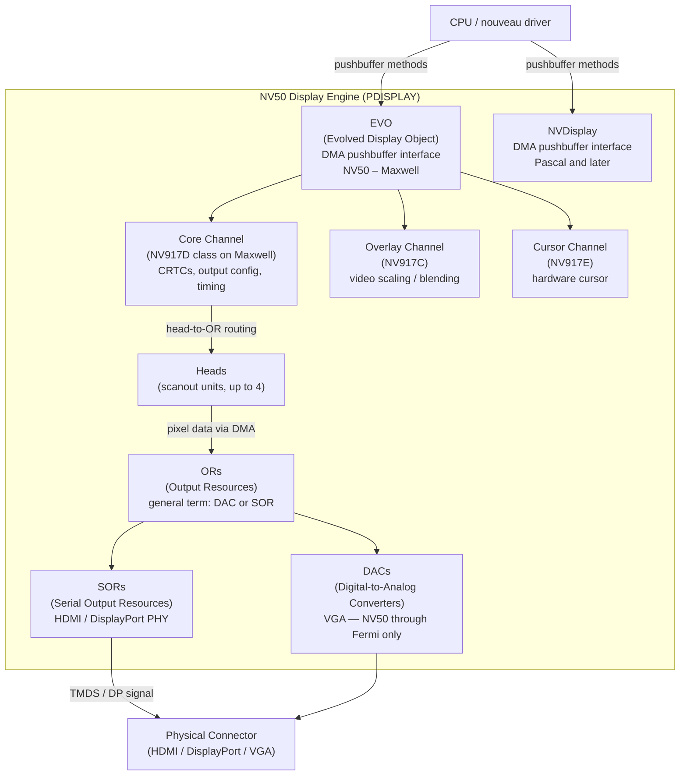
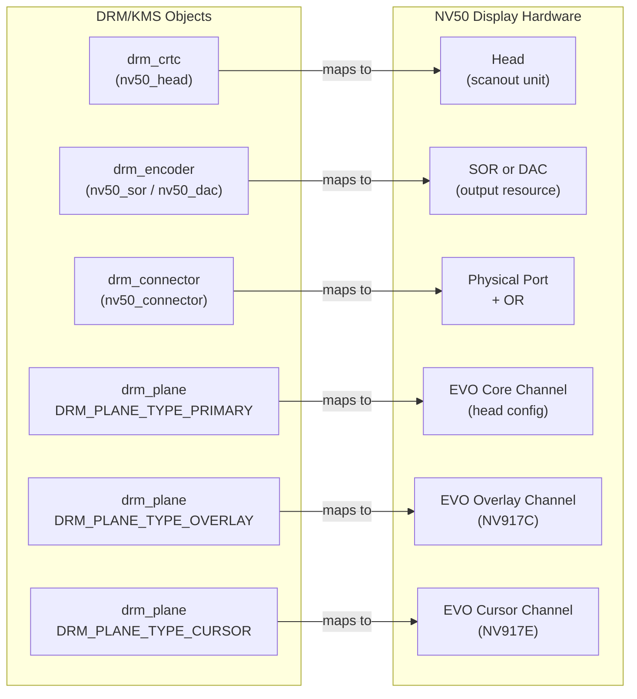
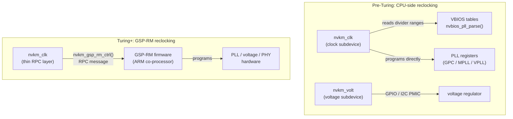
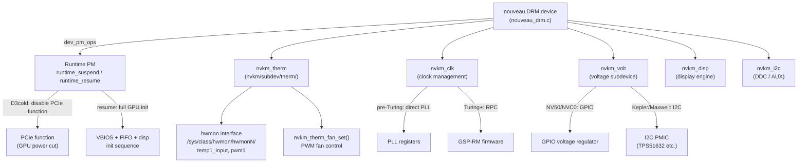

# Chapter 11: Display, Reclocking, and Power Management

> **Part**: Part III — The Nouveau Story
> **Audience**: Systems developer — primarily for kernel driver developers and those deploying NVIDIA hardware on Linux who need to understand the practical operational limits of the nouveau driver versus the proprietary alternative
> **Status**: First draft — 2026-06-06

## Table of Contents

- [Overview](#overview)
- [1. The NV50 Display Engine Architecture](#1-the-nv50-display-engine-architecture)
  - [1.1 What is the NV50 Display Engine?](#11-what-is-the-nv50-display-engine)
  - [1.2 What is Reclocking?](#12-what-is-reclocking)
  - [1.3 What is GSP-RM?](#13-what-is-gsp-rm)
- [2. KMS Integration: Connectors, Encoders, and CRTCs](#2-kms-integration-connectors-encoders-and-crtcs)
- [3. The Display PHY: HDMI and DisplayPort Signal Integrity](#3-the-display-phy-hdmi-and-displayport-signal-integrity)
- [4. Reclocking: The Central Challenge of nouveau Performance](#4-reclocking-the-central-challenge-of-nouveau-performance)
- [5. Reclocking via GSP-RM on Turing+](#5-reclocking-via-gsp-rm-on-turing)
- [6. Power Management: Runtime PM, Voltage, and Fans](#6-power-management-runtime-pm-voltage-and-fans)
- [7. Display Output Reliability and Known Issues](#7-display-output-reliability-and-known-issues)
- [Integrations](#integrations)
- [References](#references)

---

## Overview

This chapter completes the Nouveau section by examining the three operational concerns that most directly determine whether an NVIDIA GPU is actually usable under Linux with the open-source driver: display output, GPU performance through reclocking, and power management. These three topics are not independent — reclocking affects power consumption, power management gates available GPU performance, and display output depends on the GPU running at appropriate frequencies. Understanding all three together gives a realistic picture of **nouveau**'s capabilities and limitations on hardware spanning two decades of NVIDIA GPU generations.

The **NV50** display engine, introduced with the **G80** (GeForce 8800) generation in 2006 and still architecturally present in current NVIDIA hardware, is a major hardware block — called **PDISPLAY** — that is almost entirely separate from the shader and compute engines examined in earlier chapters. It has its own register space, its own **DMA** channel model, its own microcontrollers, and its own programming interface. Its core hardware components and programming interfaces are:

- **Heads** — scanout units that read pixel data from GPU memory, apply timing generation, and feed video to output resources
- **SORs** (Serial Output Resources) — PHY blocks driving **HDMI** and **DisplayPort**
- **DACs** (Digital-to-Analog Converters) — legacy analog output for **VGA** (NV50 through Fermi only)
- **ORs** (Output Resources) — general term for hardware output units (DAC or SOR)
- **EVO** (Evolved Display Object) — pushbuffer-based DMA programming interface on **NV50** through Maxwell, using DMA method streams
- **NVDisplay** — Pascal-and-later replacement for EVO, using different class IDs and method encodings

The nouveau team reverse-engineered this engine over many years, and the result — `nv50_display.c` in its original form, now split across the **`dispnv50/`** directory — remains one of the most complex pieces of the nouveau source tree.

Section 2 covers how **nouveau** maps the display hardware onto the **DRM/KMS** object model:

- **KMS CRTCs** correspond to display heads via **`nv50_head`**
- **KMS encoders** map to **SORs** and **DACs** via **`nv50_sor`** and **`nv50_dac`**
- **KMS connectors** map to physical ports via **`nv50_connector`**
- **KMS planes** map to **EVO** window channels
- Atomic modesetting is implemented through **`nv50_head_atomic_check()`** and **`nv50_atomic_commit_tail()`**
- Connector detection uses hot-plug detection via **HPD** interrupts, **EDID** retrieval over **DDC** (I2C) or **DP AUX**, and **DisplayPort** link training via **`nvkm_dp_train()`** in **`nvkm/engine/disp/dp.c`**, which negotiates lane count, link rate, driver voltage swing, and pre-emphasis through **DPCD** registers
- **VRR** (Variable Refresh Rate) / Adaptive Sync is supported on select hardware via **`drm_connector_attach_vrr_capable_property()`** and the **EVO**/**NVDisplay** timing registers

Section 3 examines the display **PHY** in detail:

- **SOR** power sequencing for **HDMI** and **DisplayPort**
- **TMDS** (Transition Minimised Differential Signalling) configuration via **`nv50_sor_hdmi_ctrl()`**
- **HDMI 2.0** scrambler enablement
- **AVI InfoFrame** / **Audio InfoFrame** programming via **`gv100_sor_hdmi_avi_infoframe()`**
- **DPHY**/**APHY** block providing programmable swing and pre-emphasis; supported link rates span **RBR**, **HBR**, **HBR2**, **HBR3**, and **UHBR10/13.5/20** per the **DP 2.0** specification
- **MST** (Multi-Stream Transport) with partial support via the **`drm_dp_mst_topology_mgr`** framework
- On Turing and later hardware, display engine initialisation and high-bandwidth link sequences are delegated to **GSP-RM** firmware, making correct display operation on **Turing+** dependent on **GSP-RM** being loaded

Reclocking is arguably the most visible operational gap between **nouveau** and the proprietary driver on pre-Turing hardware. Without it, the GPU runs at conservative boot-time **P-states** that represent a fraction of the hardware's rated performance. Section 4 covers **NVIDIA**'s clock tree and VBIOS reclocking infrastructure, and Section 5 describes how **GSP-RM** resolves reclocking on **Turing+**:

- **PLL** (Phase-Locked Loop) clock tree — including the **GPC** core clock, **MPLL** (memory interface clock), and **VPLL** (display pixel clock) — and **VBIOS** table parsing via **`nvbios_pll_parse()`** in **`nvkm/subdev/bios/pll.c`**
- **`/sys/kernel/debug/dri/0/pstate`** debugfs interface (added in Linux 4.5) for querying and setting performance states, implemented by **`nouveau_pstate_show()`** and **`nouveau_pstate_store()`**
- Reclocking status by generation: fully working on **NV50** and **Fermi**, partial on **Kepler**, effectively broken on **Maxwell** and later due to signed **PMU** firmware blobs for memory **PHY** equaliser training — a cryptographic barrier that cannot be overcome by additional reverse engineering
- **GSP-RM** on **Turing+** resolves this by handling P-state transitions via **RPC** (Remote Procedure Call) messages using **`nvkm_gsp_rm_ctrl()`**, closing the reclocking gap that was 5–8× on Maxwell
- Remaining gaps: partial **GPU Boost** exposure, absent per-application clock hinting, and no user-controlled **TDP** adjustment

Section 6 covers the power management subsystem:

- **Runtime PM** registered via **`dev_pm_ops`** in **`nouveau_drm.c`** with **`nouveau_pmops_runtime_suspend()`** and **`nouveau_pmops_runtime_resume()`**, putting the GPU into **D3cold** by disabling its **PCIe** function; resume latency of 200–500 ms limits usefulness to **PRIME** multi-GPU laptop configurations
- Voltage scaling via the **`nvkm_volt`** subdevice: **GPIO**-based resistor-ladder regulators on **NV50**/**NVC0**, **I2C PMIC** chips (e.g. **TPS51632**) on Kepler/early Maxwell, and signed **PMU** firmware on **GM20x** and later (making voltage scaling impossible without reclocking)
- Fan control and thermal monitoring via **`nvkm_therm`** in **`nvkm/subdev/therm/`**, with temperature from an internal **ADC** exposed via the Linux **`hwmon`** subsystem at **`/sys/class/hwmon/hwmonN/temp1_input`** and fan speed via **`nvkm_therm_fan_set()`**
- On **Maxwell+**, the absence of voltage scaling means software thermal throttling cannot be fully implemented — sustained compute workloads with inadequate cooling may trigger a hardware thermal shutdown rather than graceful performance reduction

Section 7 addresses display output reliability:

- Suspend/resume fragility on pre-**GSP-RM** hardware versus improved reliability on **Turing+**/**GSP-RM**
- **Wayland** compositing and explicit synchronisation via **`drm_syncobj`** and **`VK_EXT_external_semaphore_fd`** in **NVK**
- **HDR** support via the **`HDR_OUTPUT_METADATA`** **KMS** property and **HDMI HDR Static Metadata InfoFrame** (defined in **CTA-861-G**)
- Known operational issues including **DP MST** reliability, **HDMI** audio sync at high pixel clocks, **4K@144Hz** bandwidth requirements (**HDMI 2.1** or **HBR3**/**DisplayPort**), and the **EVO** vs. **NVDisplay** class-ID distinction in the shared **`dispnv50/`** codebase

After reading this chapter, you will understand not only the current capabilities of **nouveau** but the architectural and reverse-engineering reasons behind each limitation — and why some of those limitations are not merely a matter of additional engineering effort.

---

## 1. The NV50 Display Engine Architecture

### A Hardware Block Unto Itself

When NVIDIA designed the G80 GPU in 2006, they separated the display subsystem from the 3D and compute engine into a dedicated hardware block. This block, called the NV50 display engine or PDISPLAY, has been present in every NVIDIA GPU from the G80 generation onwards, evolving through multiple interface revisions but maintaining the same fundamental architecture. Understanding this separation is essential for understanding how nouveau drives display output.

The NV50 display engine has its own dedicated register space, distinct from the GPC (Graphics Processing Cluster) and memory controller registers accessed by the shader engine. Where shader commands flow through the FIFO (the command submission engine described in Chapter 8), display commands travel through a separate DMA channel system that operates in parallel. This design means that the display engine can update the screen independently of GPU compute activity, and that programming the display requires knowledge of an entirely different set of register definitions, class IDs, and sequencing constraints.

The display engine is responsible for the full pipeline from framebuffer scanout to signal transmission: reading pixel data from GPU memory via its own DMA engines, applying display processing (color conversion, cursor compositing, dithering), and driving the physical output blocks. It also handles HDCP key loading, audio data routing to HDMI/DP encoders, and hot-plug detection.

### Hardware Components

Several distinct hardware blocks compose the NV50 display engine, and understanding their relationship is necessary for understanding how the DRM/KMS object model maps to this hardware.

**Heads** are the scanout units. A head reads pixel data from a framebuffer allocation in GPU memory, applies timing generation, and feeds the resulting video signal to one or more output resources. High-end NVIDIA GPUs have up to four heads, meaning they can drive up to four independent display outputs simultaneously. Each head has its own timing generator, raster position tracker, and display control registers.

**DACs** (Digital-to-Analog Converters) are the legacy analog output blocks that drive VGA signals. Present on NV50 through Fermi-era GPUs, DACs were eliminated on Maxwell and later hardware as VGA output became obsolete. Each DAC can be connected to any head.

**SORs** (Serial Output Resources) are the PHY blocks that drive HDMI and DisplayPort. A SOR contains the high-speed serializer logic, clock recovery circuits, and signal conditioning hardware for high-bandwidth digital display protocols. The number of SORs varies by GPU SKU, and on high-end GPUs there may be four or more SORs.

**ORs** (Output Resources) is the general term for the hardware output unit, which can be either a DAC or a SOR. An OR connects to a physical connector on the GPU board and can be associated with a head. A critical architectural point: the association between a head and an OR is not fixed; it can be configured in software, which is what enables display routing flexibility.

**EVO** (Evolved Display Object) is the DMA-based programming interface used from NV50 through Maxwell. Rather than writing display state changes directly to registers, software prepares a pushbuffer — a sequence of method/data pairs encoding the desired state change — and kicks the EVO DMA engine to process it. This mirrors the FIFO pushbuffer model used for 3D commands, but uses entirely different method definitions and a separate address space. EVO replaced the simple register-write model of the NV04 through NV40 display engines.

**NVDisplay** is the replacement for EVO introduced with Pascal (GP100 and GP10x consumer GPUs, starting in 2016). While NVDisplay shares the same fundamental DMA pushbuffer model, it uses different class IDs, different method encodings, different channel types, and supports additional display features. The transition from EVO to NVDisplay is the primary architectural boundary in the Pascal generation, distinct from the compute engine changes.

### The EVO Channel Model

The EVO programming model is central to understanding how nouveau drives display output on pre-Pascal hardware. Display state is never modified by directly writing display engine registers from the CPU. Instead, all state changes are encoded as method streams in DMA pushbuffers, which the EVO DMA engine processes asynchronously.

EVO defines several channel types, each handling a different aspect of display state. The **core channel** (`NV917D` class on Maxwell, earlier variants on older hardware) handles CRTCs, output configuration, and display timing. The **overlay channel** (`NV917C`) handles video overlay scaling and blending. The **cursor channel** (`NV917E`) handles hardware cursor position and image. Each channel has its own pushbuffer ring in GPU memory, its own PUT/GET pointer pair, and its own interrupt line.

A modeset operation on NV50–Maxwell hardware therefore involves preparing a pushbuffer for the core channel that encodes the new display state — which head is active, which output resource is connected, what pixel clock to use, what frame buffer address to scan from — then writing the core channel's PUT pointer to notify the EVO engine that new commands are waiting. The display engine processes the commands and generates an interrupt when complete. The serialized nature of this interface is one source of the strict ordering requirements that make atomic commit on nouveau non-trivial.

### Source Organisation

The nouveau source tree organises display code across several directories that reflect both the hardware generation split and the layering between the nvkm hardware abstraction and the DRM/KMS interface:

- `drivers/gpu/drm/nouveau/nvkm/engine/disp/` contains the nvkm display engine implementation. This directory handles low-level display engine initialisation, EVO/NVDisplay channel management, SOR/DAC programming, and I2C/AUX infrastructure.
- `drivers/gpu/drm/nouveau/dispnv50/` contains the DRM/KMS interface for NV50 and later display hardware. Despite the `nv50` prefix, this directory covers all hardware from NV50 through Ada, because NVDisplay (Pascal+) is close enough in architecture to justify the shared codebase. The naming reflects the historical evolution of the code rather than a strict hardware generation boundary.
- `drivers/gpu/drm/nouveau/dispnv04/` contains the legacy NV04–NV40 display implementation for VGA, LVDS, and TV-out. This code handles a much simpler register-write display programming model.

The `nvkm_disp_chan` structure represents a single EVO or NVDisplay pushbuffer channel. The display engine's address space is managed separately from the GPU's main BAR1 address space: EVO channels use a dedicated IOVA space managed by the display engine's own IOMMU-like translation unit.



### Code Example: EVO Core Channel Method Push

The following fragment illustrates how EVO methods are pushed to the core channel to configure an output resource on Maxwell hardware:

```c
/* Source: drivers/gpu/drm/nouveau/dispnv50/core507d.c
 * Targets: Maxwell (GM10x/GM20x), kernel 5.x–6.x
 * The NV507D class is the EVO core channel for the "5070" display engine generation.
 * PUSH_MTHD expands to a macro that writes (method_offset | NV_METHOD_FLAG, data)
 * pairs into the EVO pushbuffer pointed to by `push`.
 */
static void
core507d_head_set_output(struct nvkm_push *push, int head, int or, int link)
{
    /* Set the head-to-OR routing: which serial output resource drives this head */
    PUSH_MTHD(push, NV507D, HEAD_SET_CONTROL_OUTPUT_RESOURCE(head),
        NVDEF(NV507D, HEAD_SET_CONTROL_OUTPUT_RESOURCE, CRC_MODE, COMPLETE_RASTER) |
        NVDEF(NV507D, HEAD_SET_CONTROL_OUTPUT_RESOURCE, HSYNC_POLARITY, POSITIVE_TRUE) |
        NVDEF(NV507D, HEAD_SET_CONTROL_OUTPUT_RESOURCE, VSYNC_POLARITY, POSITIVE_TRUE) |
        NVVAL(NV507D, HEAD_SET_CONTROL_OUTPUT_RESOURCE, COLOR_SPACE, 0) |
        NVVAL(NV507D, HEAD_SET_CONTROL_OUTPUT_RESOURCE, OR, or));
}
```

This pattern — where every display state change is encoded as a pushbuffer method rather than a direct register write — is what makes the EVO programming model fundamentally different from the register-mapped model used by simpler display controllers.

### 1.1 What is the NV50 Display Engine?

The NV50 display engine, also referred to as PDISPLAY, is a self-contained hardware block present in every NVIDIA GPU from the G80 (GeForce 8800, 2006) generation through current Ada Lovelace silicon. Unlike the shader and compute engines that share the GPC (Graphics Processing Cluster) architecture, PDISPLAY occupies its own register space, maintains its own DMA channel infrastructure, and contains dedicated microcontrollers for output sequencing. It is responsible for the complete pipeline from framebuffer readout to physical signal transmission: reading pixels from GPU memory via dedicated DMA engines, performing display processing such as color conversion and dithering, driving the PHY blocks that generate HDMI and DisplayPort signals, routing audio to digital output encoders, and detecting hot-plug events on physical connectors.

Within the Linux kernel, the display engine is exposed through the DRM/KMS subsystem. The nouveau driver implements KMS objects — CRTCs, encoders, connectors, and planes — that map onto PDISPLAY hardware blocks. The core kernel interface for applications and compositors is `/dev/dri/card0`, through which user space submits modesetting requests via `ioctl(DRM_IOCTL_MODE_SETCRTC)` or the atomic `DRM_IOCTL_MODE_ATOMIC`. Inside the driver, all display state changes are encoded as DMA pushbuffer methods directed at the EVO (Evolved Display Object) or NVDisplay channel rather than as direct register writes.

The architectural boundary between EVO (NV50 through Maxwell) and NVDisplay (Pascal and later) is the primary generational division within the PDISPLAY codebase and is reflected in the source layout under `drivers/gpu/drm/nouveau/dispnv50/`.

### 1.2 What is Reclocking?

Reclocking is the process of switching a GPU between different operating performance states, called P-states, each of which specifies a different set of GPU core clock, memory clock, voltage, and thermal parameters. At boot time or after a reset, firmware initialises the GPU at a conservative, low-power P-state — typically the minimum safe state that guarantees correct operation regardless of what software will subsequently do. For interactive graphics work or GPU compute, this boot P-state represents a small fraction of the hardware's rated throughput, often 10–20% of peak memory bandwidth and similar fractions of compute throughput.

In NVIDIA hardware, the set of valid P-states and the PLL (Phase-Locked Loop) configuration parameters required to reach each state are stored in the VBIOS (Video BIOS) as a set of binary tables. Reclocking to a higher P-state requires parsing these tables, reprogramming the GPC core PLL, the memory interface PLL (MPLL), and the display pixel clock PLLs (VPLLs), adjusting voltage through the appropriate regulator interface, and coordinating these changes so that the memory PHY remains operational during the transition.

The proprietary NVIDIA driver performs reclocking transparently in response to GPU workload. In nouveau, reclocking support is partial and generation-dependent: it works on NV50 and Fermi hardware, is limited on Kepler, and is effectively absent on Maxwell and later due to signed firmware requirements. The debugfs interface at `/sys/kernel/debug/dri/0/pstate` provides user-space control of the P-state on hardware where reclocking is implemented. Section 4 details the technical basis for each generation's limitation, and Section 5 describes how GSP-RM resolves the gap on Turing and later hardware.

### 1.3 What is GSP-RM?

GSP-RM is the GPU System Processor Resource Manager: proprietary NVIDIA firmware that runs on a dedicated management processor (the GSP, a RISC-V or Falcon core embedded in Turing and later GPUs) and handles resource management tasks that would otherwise require driver-level access to privileged GPU registers. On Ampere and later hardware, GSP-RM is mandatory for the proprietary driver; for nouveau, GSP-RM support was added to enable Turing+ GPUs to reclock and to allow correct display engine initialisation on those generations.

The GSP-RM firmware is distributed as a signed binary in the linux-firmware repository under `nvidia/GPUXXX/gsp.bin`. The firmware is loaded by the kernel driver at GPU initialisation time and then receives commands through a shared memory region. Driver-to-firmware communication uses an RPC (Remote Procedure Call) protocol implemented via `nvkm_gsp_rm_ctrl()` within the nvkm GSP subdevice at `drivers/gpu/drm/nouveau/nvkm/subdev/gsp/`.

For reclocking, GSP-RM handles P-state transitions on Turing+ hardware transparently: the driver requests a P-state change via RPC and GSP-RM performs the necessary PLL reprogramming, voltage adjustment, and memory PHY training that would otherwise require reverse-engineered knowledge of the signed PMU firmware blobs. For display, GSP-RM initialises the display engine and handles high-bandwidth DisplayPort link training on Turing+. The practical effect is that GSP-RM closes the reclocking performance gap on Turing and later while leaving Maxwell and earlier hardware dependent on the partial reclocking support described in Section 4.

---

## 2. KMS Integration: Connectors, Encoders, and CRTCs

### Mapping Hardware to the DRM Object Model

The DRM/KMS subsystem defines a hardware-neutral object model for display configuration (see Chapter 2 for the full model). nouveau maps this model onto the NV50 display engine hardware through a set of relationships that are worth spelling out explicitly, because the hardware-to-software mapping is not always obvious.

A **KMS CRTC** corresponds to a display head. On a GPU with four heads, nouveau creates four `drm_crtc` objects. Each CRTC has its own timing parameters, framebuffer source address, and pixel clock. The `nv50_head` structure (defined in `dispnv50/head.h`) extends `drm_crtc` with nouveau-specific state.

A **KMS encoder** corresponds to a SOR or DAC. On a GPU with four SORs, nouveau creates up to four encoder objects. Encoders are internal KMS objects that exist to express routing: which head drives which output resource. The `nv50_sor` and `nv50_dac` structures wrap `drm_encoder`.

A **KMS connector** corresponds to a physical port on the GPU card combined with its OR (output resource). A connector represents what the user sees: HDMI-A-1, DP-1, and so on. `nv50_connector` extends `drm_connector` and tracks the physical port, the attached OR, and the detected EDID.

A **KMS plane** corresponds to an EVO window channel. The overlay channel provides hardware-accelerated video scaling and format conversion; the cursor channel provides a hardware cursor. In the DRM model these appear as `drm_plane` objects of type `DRM_PLANE_TYPE_OVERLAY` and `DRM_PLANE_TYPE_CURSOR` respectively. The primary plane — the main scanout buffer — maps to the core channel's head configuration.



### Atomic Modesetting

nouveau implements the DRM atomic modesetting API, which requires that all display state changes be expressed as atomic state transitions: the driver validates a proposed new state, then commits it in a single step that either fully succeeds or leaves the hardware unchanged. This is conceptually clean but practically demanding, because the EVO core channel's method stream must be prepared and kicked atomically from the kernel's perspective.

The key function in the nouveau atomic commit path is `nv50_head_atomic_check()` in `dispnv50/head.c`. This function receives the proposed new `nv50_head_atom` state and validates it against display engine constraints. It checks that the requested pixel clock is achievable with the available PLL configuration, that the requested display format is supported by this generation's display engine, and that the combination of active heads and ORs does not exceed routing constraints. If validation succeeds, the state is marked as having been checked; if it fails, the atomic commit returns an error before any hardware is touched.

The commit itself is initiated by `nv50_atomic_commit_tail()`, the per-driver commit tail function registered via `drm_atomic_helper_setup_commit()`. This function serialises the hardware programming in the order required by the display engine: first disable heads and detach ORs from their current configuration, then program new clock settings, then re-enable ORs and heads with the new configuration. The serialisation is necessary because the EVO engine requires specific ordering of channel pushbuffers to avoid undefined states.

```c
/* Source: drivers/gpu/drm/nouveau/dispnv50/head.c
 * nv50_head_atomic_check() — validates proposed DRM atomic state against
 * NV50 display engine hardware constraints.
 * Kernel 5.10+; the function signature has been stable since the atomic
 * conversion in Linux 4.12.
 */
static int
nv50_head_atomic_check(struct drm_crtc *crtc, struct drm_atomic_state *state)
{
    struct drm_crtc_state *crtc_state =
        drm_atomic_get_new_crtc_state(state, crtc);
    struct nv50_head_atom *asyh = nv50_head_atom(crtc_state);
    struct nv50_head *head = nv50_head(crtc);

    if (!crtc_state->enable) {
        asyh->clr.mask = ~0;   /* disable all programmed resources */
        return 0;
    }

    /* Validate pixel clock: can we generate this frequency? */
    return nv50_head_atomic_check_mode(head, asyh);
}
```

### Connector Detection and EDID

Connector detection in nouveau is handled by `nv50_connector_detect()`, which is registered as the `detect` callback in the connector's `drm_connector_funcs`. For HDMI connectors, hot-plug detection uses a GPIO interrupt that signals when the HPD (Hot Plug Detect) pin changes state. The connector then reads EDID data via I2C over DDC (the display data channel embedded in the HDMI cable), using the `nvkm_i2c` subsystem to access the GPU's on-chip I2C controllers.

For DisplayPort connectors, hot-plug detection and EDID retrieval work differently. Hot-plug events arrive via the DP AUX channel, which supports a sideband protocol for reading DPCD registers and EDID data. The `nvkm_i2c_aux` subsystem implements the DP AUX transaction layer on top of the hardware AUX channel in the SOR block. DPCD (DisplayPort Configuration Data) registers at addresses 0x00000–0x000FF describe the sink's capabilities: supported link rates, maximum lane count, audio support, and HDCP capability.

### DisplayPort Link Training

DisplayPort requires a link training sequence before video transmission can begin. Link training establishes the optimal combination of link rate, lane count, driver amplitude, and pre-emphasis that delivers an error-free signal to the display. The sequence proceeds through Training Pattern 1 (clock recovery) and Training Pattern 2/3 (channel equalisation), with each step reading back DPCD status from the sink to determine whether the current settings are adequate.

The `nvkm_dp_train()` function in `nvkm/engine/disp/dp.c` orchestrates this sequence. It begins by reading the sink's capabilities from DPCD, then attempts link training at the highest supported rate. If training fails at the requested rate, it falls back to lower rates or fewer lanes. The function programs the SOR's DPHY/APHY blocks with the chosen amplitude and pre-emphasis values, which are GPU-board-specific signal conditioning parameters that are typically read from the VBIOS and may be overridden for specific display combinations.

```c
/* Source: drivers/gpu/drm/nouveau/nvkm/engine/disp/dp.c
 * nvkm_dp_train() entry — simplified to show the negotiation structure.
 * Actual implementation includes retry loops, compliance testing mode,
 * and fallback to reduced link rates.
 */
static int
nvkm_dp_train(struct nvkm_dp *dp, u32 datarate)
{
    struct nvkm_dp_state cstate = { .dp = dp };
    int ret;

    /* Read sink capabilities from DPCD registers 0x000–0x00D */
    ret = nvkm_dp_train_init(dp, &cstate);
    if (ret)
        return ret;

    /* Attempt training at maximum supported link rate and lane count.
     * If it fails, lnk_bw is reduced and the loop retries. */
    while (cstate.lnk_bw > 0) {
        ret = nvkm_dp_train_attempt(dp, &cstate);
        if (ret == 0)
            break;
        cstate.lnk_bw = nvkm_dp_train_fallback(dp, &cstate);
    }

    return ret;
}
```

HDMI connectors use a much simpler connection protocol: once the EDID has been read and the pixel clock has been programmed, the display is ready to receive video. The HDMI-specific programming involves writing AVI InfoFrames (audio/video information frames) and Audio InfoFrames into the SOR's InfoFrame registers so the sink knows the colorspace, aspect ratio, and audio format being transmitted.

### VRR (Variable Refresh Rate)

nouveau supports Adaptive Sync (the generic VRR mechanism) on select hardware/display combinations. The DRM `drm_connector_attach_vrr_capable_property()` function is called during connector initialisation for connectors that report VRR support via DPCD or EDID. VRR requires the display engine to hold the scanout at the end of the active area for a variable duration, extending the frame period to match the GPU's rendering time. This is programmed through the EVO/NVDisplay timing registers and requires the DRM atomic commit to carry the VRR enable property through the state check and commit paths.

---

## 3. The Display PHY: HDMI and DisplayPort Signal Integrity

### SOR Programming Sequence

Enabling a display output is a multi-step sequence that involves the SOR (Serial Output Resource) hardware. The SOR contains the high-speed analog frontend that generates the TMDS (Transition Minimised Differential Signalling) or DP electrical signal. Programming it correctly requires a power sequencing protocol that must be followed in precise order to avoid damage to the transmitter or undefined signal states.

For HDMI, the sequence is: assert the SOR power-up control in the EVO core channel, wait for the PHY to complete its internal calibration, configure the TMDS clock ratio (for HDMI 2.0 high-bandwidth modes where the TMDS clock runs at a fraction of the pixel clock), enable the scrambler (required for HDMI 2.0 at pixel clocks above 340 MHz), and finally enable video output. Each step involves either EVO pushbuffer methods or direct SOR register accesses via the nvkm display engine layer.

The `nv50_sor_hdmi_ctrl()` function in `nvkm/engine/disp/hdmi.c` implements the HDMI-specific SOR configuration. It programs the SOR's HDMI mode register, sets the clock recovery mode for TMDS, and if HDMI 2.0 is in use, enables the hardware scrambler. The scrambler is required by the HDMI 2.0 specification for pixel clocks above 340 MHz to reduce EMI; its programming sequence is one of the portions of the display engine that was difficult to reverse-engineer because the register values are highly timing-sensitive and the documentation in open-gpu-doc does not cover the display engine registers.

### HDMI InfoFrames

HDMI transmits metadata alongside the video signal in the form of InfoFrames — structured packets embedded in the blanking interval. The most important are the AVI InfoFrame, which describes the colorspace (BT.709, BT.2020), pixel format (RGB, YCbCr 4:4:4, 4:2:2), and aspect ratio; and the Audio InfoFrame, which describes the audio format being transmitted.

```c
/* Source: drivers/gpu/drm/nouveau/nvkm/engine/disp/hdmigv100.c (Turing variant)
 * The InfoFrame programming sequence writes the AVI InfoFrame
 * into the SOR's dedicated InfoFrame register bank.
 * Earlier generations use a similar pattern in hdmi.c.
 */
static void
gv100_sor_hdmi_infoframe_avi(struct nvkm_ior *ior, u32 freq)
{
    struct nvkm_device *device = ior->disp->engine.subdev.device;
    struct packed_hdmi_infoframe infoframe = {};
    int i;

    /* Build the CTA-861 AVI InfoFrame in a packed 32-bit array */
    hdmi_avi_infoframe_pack(&infoframe.avi, &infoframe.buf, sizeof(infoframe.buf));

    /* Write InfoFrame payload to SOR InfoFrame registers */
    for (i = 0; i < ARRAY_SIZE(infoframe.buf) / 4; i++) {
        nvkm_mask(device, 0x680000 + (ior->id * 0x800) + 0x000 + (i * 4),
                  ~0, infoframe.u32[i]);
    }
}
```

### DisplayPort Electrical Parameters

DisplayPort signal integrity is more complex than HDMI because the link parameters — lane count, link bandwidth, driver voltage swing, and pre-emphasis level — must be negotiated between the source and sink during link training. The SOR's DPHY/APHY block provides programmable swing and pre-emphasis settings that compensate for cable losses. The DPCD registers at address 0x103–0x106 (TRAINING_LANE0_SET through TRAINING_LANE3_SET) carry the requested settings from the sink back to the source during training.

Supported link rates as of the DP 2.0 specification include RBR (1.62 Gbps/lane), HBR (2.7 Gbps/lane), HBR2 (5.4 Gbps/lane), HBR3 (8.1 Gbps/lane), and UHBR10/13.5/20 (10, 13.5, 20 Gbps/lane). Nouveau's SOR driver supports up to HBR3 on most hardware. UHBR support requires LTTPR (Link Layer Training Pattern Relay) in DP 2.0 repeaters and uses Training Pattern 4, which is a newer equalisation scheme; this is present in newer NVIDIA hardware but the nouveau support is incomplete as of kernel 6.8.

Multi-Stream Transport (MST) — the DP feature that allows daisy-chaining multiple monitors on a single DP port — has partial support in nouveau. The `drm_dp_mst_topology_mgr` framework is used, but reliability issues with some MST hubs remain, and complex topologies are prone to link failures during modeset.

### GSP-RM and Display on Turing+

On Turing and later hardware, the GPU's display engine initialisation and some link training sequences are handled by GSP-RM (see Chapter 9 for the full GSP-RM architecture). The firmware contains NVIDIA's own display engine initialisation code and handles aspects of SOR power sequencing that were either reverse-engineered incompletely on pre-Turing hardware or that NVIDIA deliberately moved to firmware. The CPU-side nouveau code still manages DRM/KMS state and prepares NVDisplay pushbuffers, but critical display-engine bring-up operations — particularly around HDMI 2.1 and DP 2.0 high-bandwidth modes — are delegated to GSP-RM.

This delegation means that correct display operation on Turing+ depends on GSP-RM being loaded and functional. When GSP-RM is not available or fails to load, the display engine on Turing+ will initialise in a degraded mode with reduced bandwidth support. NVIDIA has not published the NVDisplay register documentation in open-gpu-doc; unlike the compute engine where some documentation is available, the display engine remains almost entirely reverse-engineered. The GSP-RM firmware provides the implementation for the portions that were reverse-engineered incompletely.

---

## 4. Reclocking: The Central Challenge of nouveau Performance

### What Reclocking Means and Why It Matters

Every NVIDIA GPU has multiple valid operating points: combinations of core clock, memory clock, and supply voltage that the GPU can sustain reliably within its thermal and power envelope. These operating points are called P-states (performance states) and are defined in the GPU's VBIOS. The proprietary driver selects among P-states dynamically based on workload, temperature, and power target, a system called GPU Boost.

Without reclocking, nouveau runs the GPU at a conservative P-state that is set at boot — typically based on the GPU's power-on safe frequency, which is substantially below the rated performance frequency. On a GeForce GTX 1080, for example, the boot clock may be 405 MHz where the rated boost clock is 1733 MHz. This is not a subtle performance difference: without reclocking, a GPU may be running at less than 25% of its rated frequency. The performance gap between nouveau without reclocking and the NVIDIA proprietary driver is commonly 5–8× on GPU-limited workloads.

This gap is the primary reason that nouveau has historically been unsuitable for serious 3D workloads on Maxwell and later hardware. It is important to understand that the gap is not caused by the reverse-engineering approach per se. On NV50 and Fermi-era hardware, reclocking works well and performance approaches the proprietary driver. The regression is specific to Maxwell and later, and it has a concrete technical explanation — not just "more reverse engineering needed."

### NVIDIA's Clock Architecture

NVIDIA GPUs use a PLL (Phase-Locked Loop) tree to generate the various clock domains from a reference oscillator. The primary clock domains are the GPC (Graphics Processing Cluster) core clock, the memory interface clock (MPLL), the display pixel clocks (VPLL per head), and the hub/uncore clock. On pre-Maxwell hardware the Shader PLL (SPLL) runs the shader processors at a multiplied frequency of the GPC clock.

Valid clock configurations are not freely programmable: the VBIOS contains tables that enumerate the supported P-states with their associated frequencies and voltages. The `nvkm/subdev/bios/` directory contains the VBIOS parsing infrastructure. The `nvbios_pll_parse()` function in `nvkm/subdev/bios/pll.c` parses the PLL configuration table from the VBIOS to extract valid PLL N/M/P divider settings for each clock domain. The memory clock table (MCT) and voltage table are parsed by corresponding functions in the same directory.

```c
/* Source: drivers/gpu/drm/nouveau/nvkm/subdev/bios/pll.c
 * nvbios_pll_parse() — reads the PLL configuration table from VBIOS
 * and fills in an nvbios_pll structure with valid N/M/P divider ranges.
 * This is the entry point for clock table parsing; called during
 * nvkm_clk initialisation on pre-Maxwell hardware.
 */
int
nvbios_pll_parse(struct nvkm_bios *bios, u32 type, struct nvbios_pll *info)
{
    struct nvkm_subdev *subdev = &bios->subdev;
    u8  ver, hdr, cnt, len;
    u32 data;

    data = nvbios_pll_table(bios, &ver, &hdr, &cnt, &len);
    if (!data)
        return -ENODEV;

    switch (ver) {
    case 0x10:
    case 0x20:
        return nvbios_pll_parse_20(bios, data, ver, hdr, cnt, len, type, info);
    case 0x30:
        return nvbios_pll_parse_30(bios, data, ver, hdr, cnt, len, type, info);
    case 0x40:
        return nvbios_pll_parse_40(bios, data, ver, hdr, cnt, len, type, info);
    default:
        nvkm_error(subdev, "unknown PLL table version %02x\n", ver);
        return -EINVAL;
    }
}
```

The VBIOS clock tables were reverse-engineered as part of the Envytools project. Martin Peres documented the voltage tables, and Roy Spliet contributed substantial work on memory reclocking. As of the Maxwell generation, NVIDIA changed the VBIOS format and the underlying clock management mechanism significantly enough that this reverse-engineered parsing became unreliable.

### The pstate Interface

nouveau exposes GPU performance state information and reclocking control through the debugfs filesystem. The interface is located at `/sys/kernel/debug/dri/0/pstate` (or `/sys/kernel/debug/dri/1/pstate` if the GPU is the second DRM device). This path has been in debugfs since Linux 4.5, when it was moved from sysfs (where it required setting `nouveau.pstate=1` as a kernel parameter) to debugfs (where it is always accessible when the GPU supports it).

Reading the pstate file shows the available performance states and the currently active one:

```bash
# Source: /sys/kernel/debug/dri/0/pstate — interface added in Linux 4.5
# Example output from an NV50-era GPU (GeForce 9600 GT):
$ cat /sys/kernel/debug/dri/0/pstate
AC: 0f *
DC: 05
0a: core 450 MHz shader 900 MHz memory 700 MHz
0f: core 600 MHz shader 1200 MHz memory 800 MHz
```

The asterisk marks the currently active P-state. Writing a P-state identifier to the file requests a clock change:

```bash
# Request maximum performance state
$ echo 0f > /sys/kernel/debug/dri/0/pstate
```

The pstate values (0a, 0f, AC, DC) correspond to NVIDIA's internal P-state numbering from the VBIOS. The `AC` and `DC` entries represent the states requested for AC power and DC (battery) power respectively, used when a notebook is running on battery. The `nouveau_pstate_show()` and `nouveau_pstate_store()` functions in `drivers/gpu/drm/nouveau/nouveau_debugfs.c` implement the read and write callbacks for this interface.

### Reclocking Status by GPU Generation

The actual reclocking capability varies dramatically by hardware generation, and understanding the precise boundaries is essential for deployment decisions.

**NV40 (GeForce 6/7 series, 2004–2007)**: Basic reclocking via PLL manipulation is functional. The clock tree on this hardware is straightforward enough to manipulate directly. Memory reclocking is available with some limitations. This generation is well past its useful deployment life.

**NV50 (GeForce 8/9/200 series, G80–GT2xx, 2006–2010)**: Reclocking is stable and well-supported. Both core and memory clocks can be changed via the pstate interface. Performance with reclocking approaches the proprietary driver within a few percent. This is the gold standard for nouveau reclocking; the reverse-engineering effort here was successful and complete.

**NVC0/Fermi (GeForce 400/500 series, 2010–2012)**: Reclocking is functional but limited. Core clock changes work; memory clock changes are fragile on some board configurations. The Fermi memory PHY training sequence was partially reverse-engineered. Usable for most workloads.

**NVE0/Kepler (GeForce 600/700 series, 2012–2014)**: Partial reclocking. Core clock changes are available on GK10x; memory reclocking is unreliable. Kepler introduced changes to the voltage controller interface that complicated full reclocking support. Functional for moderate workloads where max performance is not critical.

**GM20x/Maxwell (GeForce 900 series, 2014–2016)**: Reclocking is effectively broken. Maxwell introduced GPU Boost 2.0, which replaced the static P-state table with a dynamic frequency ramping system managed by an on-card microcontroller (the PMU or Power Management Unit). More critically, the memory PHY training sequence changed to use signed firmware blobs that cannot be reverse-engineered without hardware access. This is not a solvable problem through additional reverse-engineering effort in the traditional sense. The clock management system on Maxwell is fundamentally different from the PLL-based system on earlier hardware.

**GP10x/Pascal (GeForce 10 series, 2016–2018)**: No reclocking in the traditional CPU-side path. Pascal requires GSP-RM for power management (see Section 5). Without GSP-RM, the GPU runs at boot clocks. Pascal introduced further changes to the power management microcontroller that widened the gap.

**GV100+/Volta, Turing, Ampere, Ada (2017–present)**: Reclocking is handled entirely by GSP-RM (see Section 5). CPU-side reclocking code is not applicable.

### The Memory Reclocking Problem

Memory clock changes are harder than core clock changes because changing the GDDR5 or GDDR6 memory bus frequency requires re-training the memory PHY equaliser. The PHY includes programmable equalization filters that compensate for inter-symbol interference on the high-speed memory bus. The optimal filter settings depend on the frequency and are board-specific (they depend on PCB trace lengths and memory chip characteristics). When the memory clock changes, the filters must be recalibrated by running a training sequence that reads back error signals from the memory chips.

On NV50 hardware, this training sequence was reverse-engineered sufficiently to enable reliable memory clock changes. On Maxwell, the training sequence was replaced by one that runs a signed firmware blob on the PMU. The PMU verifies the signature before executing the blob, making it impossible to substitute custom training code. This is why Maxwell memory reclocking is blocked regardless of how much additional reverse engineering effort is applied: the gate is cryptographic, not informational.

---

## 5. Reclocking via GSP-RM on Turing+

### The GSP-RM Architecture for Power Management

The GSP-RM (GPU System Processor – Resource Manager) is NVIDIA's firmware that runs on an ARM-based co-processor embedded in Turing and later GPUs. Chapter 9 describes the GSP-RM architecture in detail. The key implication for power management is that the GSP-RM firmware contains NVIDIA's own power management code — the same code that drives P-state management in the proprietary driver. When GSP-RM is running, the CPU-side nouveau code can request performance state changes via RPC (Remote Procedure Call) messages, and the firmware handles the actual hardware programming: PLL configuration, voltage scaling, and memory PHY training.

This is a fundamentally different arrangement from the traditional nouveau reclocking path, which required CPU-side code to directly manipulate clock and voltage registers. With GSP-RM, the CPU-side code is decoupled from the hardware details — nouveau sends a high-level request, and GSP-RM translates it into the appropriate hardware sequence.

GSP-RM support for Turing and Ampere was integrated into mainline Linux with kernel 6.7 (released December 2023), with the firmware packages landing in linux-firmware. The `nouveau.config=NvGspRm=1` kernel parameter enables GSP-RM; as of Linux 6.18, this is the default for Turing and later GPUs.



### The RPC Interface

Communication between the CPU-side nouveau driver and GSP-RM uses a message queue protocol. Each message consists of a `r535_gsp_msg` header (named after the GSP firmware version), an `nvfw_gsp_rpc` RPC header that carries the function number and sequence ID, and a function-specific payload.

Power state requests are sent via specific RPC function IDs. The GSP-RM RPC interface for power management uses calls such as `NV2080_CTRL_PERF_GPUMON_PERFMON_UTIL_CTRL_TABLE` to query current performance metrics and related calls to request performance state transitions. The nouveau driver wraps these via `nvkm_gsp_rm_ctrl()`:

```c
/* Source: drivers/gpu/drm/nouveau/nvkm/subdev/gsp/r535.c
 * Sending a GSP-RM RPC to change the performance state on Turing+.
 * The rm_ctrl path is used for RM_API control calls that map to
 * NVIDIA's internal resman control interface.
 */
static int
r535_gsp_rpc_set_perf_state(struct nvkm_gsp *gsp, u32 client, u32 object,
                              u32 perf_state)
{
    struct {
        struct nvkm_gsp_rm_ctrl_hdr hdr;
        /* NV2080_CTRL_PERF_BOOST_PARAMS or equivalent */
        u32 flags;
        u32 duration;
        u32 targetFreq;
    } *args;
    int ret;

    args = nvkm_gsp_rm_ctrl_get(gsp, client, object,
                                 NV2080_CTRL_CMD_PERF_BOOST, sizeof(*args));
    if (IS_ERR(args))
        return PTR_ERR(args);

    args->flags    = NV2080_CTRL_PERF_BOOST_FLAGS_CUDA_YES;
    args->duration = 0;  /* 0 = persistent until next request */
    args->targetFreq = perf_state;

    return nvkm_gsp_rm_ctrl_push(gsp, args, 0);
}
```

The `nvkm_clk` subdevice on Turing+ hardware is implemented as a thin layer that translates nouveau's internal P-state concepts into the appropriate GSP-RM RPC calls rather than directly programming PLLs.

### Performance Results and Remaining Gaps

The practical performance improvement from GSP-RM reclocking is substantial. RTX 2080 (Turing) under nouveau with GSP-RM approaches proprietary driver performance at the maximum P-state for GPU-bound workloads — the reclocking gap that was 5–8× on Maxwell is largely closed. RTX 30xx (Ampere) performs similarly: GPU-compute workloads run near proprietary driver levels, though power efficiency features like GPU Boost fine-grained control are not fully exposed.

Several gaps remain between GSP-RM reclocking and the full proprietary driver power management experience. **GPU Boost** — NVIDIA's mechanism for dynamically ramping frequency above the base clock up to the boost clock based on power headroom and temperature — is only partially exposed via the GSP-RM RPC interface available to nouveau. The proprietary driver has access to additional control surfaces that allow it to sustain boost frequencies longer. **Per-application clock hinting**, which the proprietary driver uses to front-load clock increases when a GPU-intensive application launches, has no equivalent in the current nouveau/GSP-RM path. **User-controlled TDP adjustment** (the ability to set power limits above or below the VBIOS default, a feature accessible via `nvidia-smi` with the proprietary driver) is not yet implemented in nouveau's GSP-RM path.

On Ada Lovelace (RTX 40xx) hardware, GSP-RM support is present but the implementation is newer and some power management features are still being completed. Performance is functional but the gap to the proprietary driver is wider than on Turing/Ampere due to missing optimisations in the GSP-RM control path.

---

## 6. Power Management: Runtime PM, Voltage, and Fans

### DRM Runtime Power Management

The Linux kernel's driver model includes runtime power management (runtime PM), a mechanism that allows drivers to put hardware into a low-power state when it is not in use and resume it on demand. nouveau registers runtime PM callbacks via the `dev_pm_ops` structure in `nouveau_drm.c`:

```c
/* Source: drivers/gpu/drm/nouveau/nouveau_drm.c
 * Runtime PM callbacks registered for the nouveau DRM device.
 * These are called by the kernel's rpm_autosuspend mechanism when
 * the GPU becomes idle and the autosuspend delay expires.
 */
static const struct dev_pm_ops nouveau_pm_ops = {
    .suspend         = nouveau_pmops_suspend,
    .resume          = nouveau_pmops_resume,
    .freeze          = nouveau_pmops_freeze,
    .thaw            = nouveau_pmops_thaw,
    .poweroff        = nouveau_pmops_poweroff,
    .restore         = nouveau_pmops_restore,
    .runtime_suspend = nouveau_pmops_runtime_suspend,
    .runtime_resume  = nouveau_pmops_runtime_resume,
};
```

The `nouveau_pmops_runtime_suspend()` function puts the GPU into D3cold by disabling the GPU's PCIe function, which cuts power to the device. The `nouveau_pmops_runtime_resume()` function re-enables the PCIe function and runs the full GPU initialisation sequence: VBIOS execution, FIFO initialisation, display engine bring-up, and memory re-initialisation. This is not a trivial sequence; it takes 200–500 milliseconds on typical hardware.

This resume latency makes aggressive runtime PM autosuspend impractical for desktop use. A desktop compositor that renders every 16ms (60 Hz) would spend more time in resume overhead than in actual rendering if the GPU were aggressively suspended. In practice, nouveau's default autosuspend delay is several seconds, limiting runtime PM to cases where the GPU is genuinely idle for an extended period — typical of secondary GPUs in multi-GPU laptop systems (PRIME configurations).



### Voltage Scaling

The `nvkm_volt` subdevice manages GPU supply voltage. The hardware implementation varies significantly by generation, reflecting the evolution from simple GPIO-based voltage selection to sophisticated I2C PMIC (Power Management IC) control.

On GeForce 8/9/400-series hardware (NV50/NVC0), GPU core voltage is selected by driving a small number of GPIO lines that control a resistor-ladder-based analog voltage regulator. The `nvkm_volt_gpio` implementation in `nvkm/subdev/volt/gpio.c` reads the GPIO definitions from the VBIOS and programs the GPIO controller to output the voltage level corresponding to the target P-state.

On Kepler and early Maxwell hardware, voltage control moved to I2C-attached PMIC chips. The `nvkm_volt_pwm` implementation uses PWM signals on I2C-accessible regulators. The specific PMIC device and I2C address are read from the VBIOS; common devices include the TI TPS51632 and similar voltage regulators.

On GM20x Maxwell and all later hardware, GPU voltage is managed by an on-card microcontroller (the PMU) that intercepts voltage requests and applies its own safety limits. This microcontroller runs signed firmware and does not expose a programmable interface for voltage control to the GPU driver. As a result, nouveau cannot perform voltage scaling on Maxwell+ hardware — and without voltage scaling, full reclocking is not possible even if the clock programming were otherwise achievable.

### Fan Control and Thermal Management

The `nvkm_therm` subdevice in `nvkm/subdev/therm/` manages fan control and thermal monitoring. Its implementation covers both open-loop fan control (setting fan speed based on a VBIOS-defined fan curve) and closed-loop PID control (adjusting fan speed based on measured temperature).

GPU die temperature is read from an internal ADC (analog-to-digital converter) in the GPU's thermal sensor block. The `nvkm_temp` subdevice reads this sensor via a specific register, and the value is exposed to userspace via the Linux `hwmon` subsystem at `/sys/class/hwmon/hwmonN/temp1_input`.

The `hwmon` interface exposed by nouveau includes:
- `temp1_input`: current GPU die temperature in millidegrees Celsius
- `pwm1`: current fan PWM value (0–255)
- `pwm1_enable`: fan control mode (0=disabled, 1=manual, 2=automatic)
- `pwm1_min`, `pwm1_max`: minimum and maximum PWM limits from VBIOS

```c
/* Source: drivers/gpu/drm/nouveau/nvkm/subdev/therm/base.c
 * nvkm_therm_fan_set() — programs fan PWM speed.
 * Called either from the automatic temperature-following loop or
 * from the hwmon interface when pwm1_enable == 1 (manual control).
 */
int
nvkm_therm_fan_set(struct nvkm_therm *therm, bool immediate, int percent)
{
    struct nvkm_subdev *subdev = &therm->subdev;

    if (therm->fan->bios.nr_fan_trip == 0 &&
        therm->fan->bios.linear_min_temp == 0) {
        /* No fan table in VBIOS — hardware-controlled fan, do not touch */
        return -ENODEV;
    }

    return therm->func->fan_set(therm, percent);
}
```

The automatic fan control mode (pwm1_enable=2) runs a kernel workqueue that periodically reads the temperature, computes the target PWM from the VBIOS fan curve (a piecewise linear temperature-to-speed mapping), and calls `nvkm_therm_fan_set()` to apply it. The workqueue period is configurable; default is 1000ms.

### Thermal Limits and Throttling

**This section contains critical operational safety information for deployment decisions.**

On NV50 through Kepler hardware, nouveau implements thermal protection by reducing clock frequencies when the GPU approaches its thermal limit (TjMax, typically 80–90°C). The `nvkm_therm` subdevice monitors temperature and triggers a P-state reduction when the temperature exceeds the `temp_throttle` threshold defined in the VBIOS thermal table.

On Maxwell and later hardware, this thermal throttling mechanism does not function under nouveau because voltage control is not available. Dynamic throttling requires reducing both clock and voltage to meaningfully reduce power consumption; reducing the clock alone (without reducing voltage) has limited thermal benefit. Without voltage control, the thermal protection mechanism cannot be fully implemented.

**The practical consequence is severe**: a Maxwell+ GPU running a sustained compute workload under nouveau with a faulty or insufficient cooling solution may reach TjMax and trigger a hardware thermal shutdown (the GPU cuts power to protect itself), rather than gracefully throttling performance. On the NVIDIA proprietary driver, GPU Boost includes thermal headroom management that prevents this scenario. On nouveau, no equivalent protection is active on Maxwell+.

For production deployment of Maxwell or later GPUs under nouveau — in compute servers, rendering workstations, or any environment with sustained GPU load — independent thermal monitoring and external fan control are strongly recommended. Do not rely on nouveau's software thermal protection on these hardware generations.

### Power Consumption Characteristics

The power consumption profile of nouveau versus the proprietary driver is nuanced and depends on the workload and GPU generation. At idle, nouveau typically achieves similar idle power to the proprietary driver, because the display engine (which consumes most idle GPU power) is programmed identically, and the GPU can enter a low clock P-state in both cases.

Under load on pre-Maxwell hardware with working reclocking, power consumption under nouveau is comparable to the proprietary driver at the same performance level. On Maxwell+ without reclocking, the GPU runs at a lower clock frequency but at the same voltage (since voltage cannot be scaled), which means the power savings from the lower frequency are partially offset by the static voltage overhead. Some workloads that complete quickly at proprietary-driver performance levels will actually run at higher total energy cost under nouveau because the job takes longer.

There is a counterintuitive benefit for some workloads: if a task requires only the GPU's base clock frequency to complete in acceptable time, nouveau's fixed-clock operation is not a penalty, and the absence of GPU Boost means the GPU never exceeds its base power budget. For batch scientific computing where latency is not critical, this can be advantageous.

---

## 7. Display Output Reliability and Known Issues

### Suspend/Resume Display Reliability

Display output after system suspend and resume has been one of the historically most problematic areas of nouveau. The GPU's display engine must be completely reinitialised after a suspend that cuts GPU power (S3 or runtime D3cold), because the display hardware loses all register state. The reinitialisation sequence involves reprobing displays, rerunning link training for DisplayPort connections, and reprogramming the EVO/NVDisplay core channel with the current display configuration.

On pre-GSP-RM hardware, this sequence was implemented in CPU-side nouveau code and has historically been fragile. Specific GPU/display combinations — particularly those with complex DP link configurations or MST topologies — would fail to reinitialise correctly after suspend, resulting in a black screen that required a full reboot to recover. Many of these issues were fixed over the years as they were reported and debugged, but they remained a known category of reliability risk.

On Turing+ hardware with GSP-RM, the display reinitialisation is handled by the GSP-RM firmware, which runs NVIDIA's own tested initialisation sequence. This path is significantly more reliable because it uses the same code as the proprietary driver. The remaining display resume issues on Turing+/GSP-RM are typically in the boundary between the CPU-side DRM state and the GSP-RM state, rather than in the display hardware initialisation itself.

### Wayland Compositing and Explicit Sync

A longstanding issue with NVIDIA GPUs under open-source drivers on Wayland was the absence of proper explicit synchronisation. Wayland compositors use the `drm_syncobj` kernel infrastructure (see Chapter 3 and Chapter 22) to synchronise GPU rendering completion with display scanout. Without explicit sync, a compositor cannot reliably know when the GPU has finished rendering a frame before handing it to the display engine for scanout, leading to visual tearing.

On pre-NVK hardware, this was a fundamental limitation: the old Gallium `nouveau` driver did not implement the Vulkan or OpenGL fences needed for the full explicit sync chain. With NVK (the new Vulkan driver described in Chapter 10), proper `VK_EXT_external_semaphore_fd` support is available, and the explicit sync chain from GPU rendering completion through DRM/KMS to display scanout is complete. On Turing+/GSP-RM, `drm_syncobj` is fully supported, and Wayland tearing should be eliminated for properly-written compositors that use the explicit sync protocol.

### HDR Support

NVIDIA's display engine has supported HDR (High Dynamic Range) metadata transmission since Turing hardware. HDR requires programming the HDMI HDR Static Metadata InfoFrame (defined in CTA-861-G) into the SOR's InfoFrame registers, so the display knows to interpret the pixel data as HDR rather than SDR. The DRM/KMS infrastructure provides the `HDR_OUTPUT_METADATA` connector property for this purpose.

nouveau's HDR support is partial as of kernel 6.8. The KMS property is present and the HDMI InfoFrame can be programmed, but the full HDR pipeline — including the colorspace conversion from the rendering colorspace to the display's HDR transfer function — requires both display driver support and compositor support. On Turing+/GSP-RM, the path for sending HDR InfoFrames is present, but some aspects of the full HDR handling remain delegated to GSP-RM in ways that are not yet fully exposed to the CPU-side driver.

### Known Bugs and Operational Guidance

**DP MST reliability**: Multi-monitor daisy-chain setups using DisplayPort Multi-Stream Transport are functional on many hardware/hub combinations but known to be unreliable with some MST hubs. If MST is required, verify with the specific hardware before deployment. Single-monitor DP setups are much more reliable.

**HDMI audio sync**: On HDMI 2.0 connections at high pixel clocks (4K@60Hz), audio/video synchronisation issues have been reported with some display combinations. This is related to the interaction between the display engine's audio encoder and the ALSA `nvidia-hdmi` driver.

**4K@144Hz**: Requires either HDMI 2.1 (48 Gbps bandwidth) or DisplayPort HBR3 (three lanes at 8.1 Gbps each). HDMI 2.1 support in nouveau is limited; HBR3 over DisplayPort is functional on hardware where the SOR supports it (primarily Pascal and later). Verify 4K@144Hz capability with the specific GPU/display combination.

**NVDisplay vs. EVO**: A common source of confusion is that Pascal (GP10x) introduced NVDisplay to replace EVO, but the nouveau source code in `dispnv50/` covers both, because the DRM/KMS interface is similar enough to share code. The GPU generation determines which class IDs are used in pushbuffers and which hardware features are available. Pascal/Turing/Ampere/Ada all use NVDisplay with different class revisions; Maxwell and earlier use EVO.

---

## Roadmap

### Near-term (6–12 months)

- **GSP-RM as default for Turing+ (Linux 6.18+)**: Starting with Linux 6.18, nouveau defaults to using GSP-RM firmware on Turing and later GPUs, removing the need to set `nouveau.config=NvGspRm=1` manually. This brings automatic reclocking and display engine initialisation via NVIDIA firmware to a much wider installed base by default. [Source](https://itsfoss.gitlab.io/blog/linux-618-with-nouveau-driver-will-default-to-using-gsp-firmware/)
- **GA100 (Ampere data-centre) GSP bring-up**: NVIDIA's own engineers contributed patches to bring up the GA100 under nouveau using GSP, extending the coverage of the GSP reclocking path to NVIDIA's Ampere compute-class hardware. This broadens the set of GPUs that benefit from automatic P-state management. [Source](https://www.phoronix.com/news/Nouveau-GSP-NVIDIA-GA100)
- **Nova fwctl interface (March 2026 patches)**: Patches posted to LKML add a `fwctl` driver to `nova-core`, enabling userspace to issue GSP firmware RPC commands through the standard `fwctl` ioctl interface. This is the first step toward exposing power-management and reclocking controls to userspace tooling in the Nova driver. [Source](https://lkml.iu.edu/hypermail/linux/kernel/2603.0/09681.html)
- **Improved voltage scaling exposure**: Existing work on `nvkm_volt` voltage control for GM107 and later is ongoing; the goal is to expose GPU voltage as a writable hwmon attribute on Kepler/early Maxwell where I2C PMIC access is possible without PMU firmware. [Source](https://www.phoronix.com/news/Nouveau-Volt-GM107-Too)
- **DP MST reliability improvements**: Ongoing bug reports against the `drm_dp_mst_topology_mgr` integration in nouveau continue to receive fixes in mainline. Stability of multi-monitor DisplayPort daisy-chain setups is expected to improve incrementally with each kernel release. Note: needs verification for specific fix tracking numbers.

### Medium-term (1–3 years)

- **Nova as nouveau's successor for Turing+ hardware**: The Rust-based Nova driver (upstreamed in Linux 6.15 as infrastructure skeleton, actively expanding Turing support in Linux 6.17) is designed as a GSP-only driver and is intended to eventually supersede nouveau on Turing and later. As Nova matures, it is expected to subsume the reclocking and display concerns of this chapter for modern GPUs, while nouveau retains pre-Turing (Kepler/Maxwell/Pascal) support. [Source](https://www.phoronix.com/news/Linux-6.17-NOVA-Driver)
- **GPU Boost and per-application clock hinting via GSP RPC**: On Turing+ with GSP-RM, the remaining reclocking gap is the absence of GPU Boost exposure and per-application performance hints. RPC messages for these features exist in the GSP firmware; exposing them through the kernel driver interface — either via `nouveau.pstate` debugfs or a Wayland/Vulkan extension path — is a planned development area. Note: needs verification for specific RFC/patchset references.
- **HDR full pipeline support**: HDMI HDR InfoFrame programming is present but the full color-management pipeline (colorspace conversion, HDR transfer function, KMS `GAMMA_LUT`/`DEGAMMA_LUT` integration) requires coordinated work between the nouveau display driver, Mesa/NVK, and the Wayland color-management protocol. The Wayland `color-management-v1` protocol (currently in draft stage on freedesktop) is a prerequisite. [Source](https://gitlab.freedesktop.org/wayland/wayland-protocols/-/tree/main/staging/color-management)
- **UHBR10/13.5/20 (DisplayPort 2.0) bring-up on Ada**: Ada Lovelace GPUs support DP 2.0 UHBR link rates providing up to 80 Gbps aggregate bandwidth. Bring-up of UHBR link training in nouveau (and eventually Nova) requires both the PHY firmware support via GSP-RM and updated AUX/DPCD handling for the LTTPR (Link Training Tunable PHY Repeater) model. Note: needs verification for kernel patch status.
- **Runtime PM improvements for multi-GPU laptops**: The 200–500 ms D3cold resume latency that limits PRIME usefulness is expected to be reduced through improved GSP-RM suspend/resume sequences. Red Hat and NVIDIA engineers are both active in this area, motivated by the poor battery life that results from nouveau keeping the discrete GPU awake. [Source](https://www.phoronix.com/news/ODE1Nw)

### Long-term

- **Maxwell/Pascal reclocking via alternative approaches**: The cryptographic PMU firmware signing wall on Maxwell+ remains an architectural barrier to open-source memory reclocking. Long-term speculation centres on whether NVIDIA will open-source signed PMU microcode for legacy Maxwell hardware (as they did with the open GPU kernel modules for Turing+) or whether the VBIOS reclocking tables will eventually be reachable through some other firmware-assisted path. This is speculative and no concrete plans are known.
- **Nova display engine support**: Nova is currently a compute-only driver (no KMS/display). Adding a display engine implementation to Nova — covering NVDisplay, HDMI/DP SOR programming, and the full KMS atomic commit path — is a long-term goal that would require porting or rewriting the `dispnv50/` codebase in Rust within the Nova architecture. [Source](https://rust-for-linux.com/nova-gpu-driver)
- **Unified open-source power management across NVIDIA generations**: The long-term vision articulated by the nouveau and Nova developers is a unified power management layer — covering voltage, clocking, thermal, and fan — that works across Kepler through Ada under a single coherent abstraction, with GSP-RM handling the firmware-signed operations and the kernel driver exposing a clean userspace API. This architectural goal motivates much of the current `nvkm_subdev` restructuring work. Note: needs verification for specific design documents.
- **HDMI 2.1 (48 Gbps) full support**: HDMI 2.1 FRL (Fixed Rate Link) bring-up in nouveau for Ampere/Ada hardware, enabling 4K@144Hz and 8K@60Hz over a single HDMI cable, depends on GSP-RM exposing the FRL link training interface. This is expected to follow the Nova display bring-up trajectory rather than land in nouveau first. Note: needs verification for timeline.

---

## Integrations

**Chapter 2 (KMS: Connectors, Encoders, CRTCs, and Planes)**: The NV50 display engine's heads, SORs, DACs, and ORs are the concrete hardware that the abstract KMS objects described in Chapter 2 are mapped to. `nv50_head_atomic_check()` and `nv50_atomic_commit_tail()` are implementations of the `drm_crtc_helper_funcs` callbacks defined in the KMS framework. The EVO pushbuffer model is nouveau-specific, but the interface it presents to the DRM core — via `drm_crtc_state` and atomic commit — follows the same pattern as any KMS driver.

**Chapter 3 (Advanced Display Features: VRR, HDR, Explicit Sync)**: VRR support on nouveau (Section 2) uses `drm_connector_attach_vrr_capable_property()` and the atomic commit infrastructure described in Chapter 3. HDR support (Section 7) connects to Chapter 3's color management discussion: the `HDR_OUTPUT_METADATA` KMS property is set by the compositor and consumed by the display driver's InfoFrame programming code. Explicit sync (Section 7) is enabled by the `drm_syncobj` work described in Chapter 3, Section 5; NVK's `VK_EXT_external_semaphore_fd` closes the sync chain between Vulkan rendering and KMS scanout.

**Chapter 7 (Reverse Engineering: mmiotrace, Envytools, and HWDB)**: The VBIOS reclocking table parsing described in Section 4 — `nvbios_pll_parse()`, the memory clock table, the voltage table — is a direct product of the mmiotrace and HWDB methodology described in Chapter 7. The structural limit of this methodology is also illustrated here: the Maxwell+ firmware signing wall that blocks memory reclocking is precisely the kind of obstacle that mmiotrace cannot overcome, because the register trace shows the effects of firmware execution but not the firmware itself.

**Chapter 8 (nvkm Architecture)**: The `nvkm_subdev` pattern is used by every subsystem discussed in this chapter: `nvkm_therm` (thermal management), `nvkm_clk` (clock management), `nvkm_volt` (voltage), `nvkm_disp` (display engine), and `nvkm_i2c` (I2C for DDC/AUX). Chapter 8's description of the `nvkm_subdev` lifecycle — `oneinit()`, `init()`, `fini()` — applies directly to these subdevices. The runtime PM hooks in Section 6 integrate with the DRM driver interface from Chapter 8, Section 7.

**Chapter 9 (GSP-RM: NVIDIA's Firmware-Managed GPU)**: Sections 5 and 7 are direct applications of the GSP-RM infrastructure described in Chapter 9. Reclocking on Turing+ (Section 5) uses the `nvkm_gsp_rm_ctrl()` RPC mechanism from Chapter 9. Display reliability improvements on Turing+ (Section 7) are made possible by GSP-RM handling display engine initialisation with tested NVIDIA firmware. The `nvfw_gsp_rpc` message structure described in Chapter 9 is the transport for the power management calls in Section 5.

**Chapter 10 (NVK: A New Vulkan Driver)**: GPU performance at reclocked frequencies (Sections 4 and 5) directly determines NVK benchmark results. Comparing NVK performance to the proprietary Vulkan driver is meaningless without understanding the reclocking story: on Maxwell, the comparison is unfair because nouveau is clock-limited, not shader-throughput-limited. On Turing+ with GSP-RM, the comparison becomes meaningful. The explicit sync discussion in Section 7 connects to NVK's `VK_EXT_external_semaphore_fd` support, which enables tearing-free Wayland compositing.

**Chapter 22 (Production Compositors: Weston, KWin, and Mutter)**: Display reliability (Section 7), explicit sync, and VRR are directly relevant to compositor developers deploying on nouveau. The Wayland explicit sync fix via nouveau+NVK closes the long-standing tearing gap. Suspend/resume display reliability (Section 7) affects compositor developers who must handle display loss and reacquisition after system suspend.

**Chapter 26 (Hardware Video Encode/Decode: NVENC and NVDEC)**: Video decode and encode acceleration on NVIDIA hardware require the GPU to be running at adequate frequencies. Without reclocking on pre-Turing hardware, NVDEC throughput is severely limited because the memory bus runs at boot clocks, limiting DMA bandwidth for video surface transfers. Proper reclocking is therefore a prerequisite for practical hardware video acceleration.

---

## References

1. [nouveau kernel source — dispnv50](https://gitlab.freedesktop.org/drm/nouveau/kernel/-/tree/main/drivers/gpu/drm/nouveau/dispnv50) — DRM/KMS interface for NV50+ display hardware, including head, SOR, and connector implementations

2. [nouveau kernel source — nvkm/engine/disp](https://gitlab.freedesktop.org/drm/nouveau/kernel/-/tree/main/drivers/gpu/drm/nouveau/nvkm/engine/disp) — nvkm display engine, covering EVO/NVDisplay channels, SOR/DAC programming, and DP AUX

3. [nouveau kernel source — nvkm/subdev/bios](https://gitlab.freedesktop.org/drm/nouveau/kernel/-/tree/main/drivers/gpu/drm/nouveau/nvkm/subdev/bios) — VBIOS parsing infrastructure, including PLL tables, memory clock tables, and voltage tables

4. [nouveau kernel source — nvkm/subdev/therm](https://gitlab.freedesktop.org/drm/nouveau/kernel/-/tree/main/drivers/gpu/drm/nouveau/nvkm/subdev/therm) — thermal management subdevice: fan control, temperature monitoring, thermal protection

5. [Envytools hardware documentation — Display subsystem](https://envytools.readthedocs.io/en/latest/hw/display/index.html) — reverse-engineered documentation of the NV50 display engine, EVO channels, and related hardware

6. [Nouveau Reclocking wiki page](https://nouveau.freedesktop.org/Reclocking/) — community documentation of the pstate interface and reclocking status per GPU generation

7. [Nouveau Power Management wiki page](https://nouveau.freedesktop.org/PowerManagement.html) — per-generation power management feature matrix including voltage, clocking, and fan control status

8. [DRM KMS documentation](https://www.kernel.org/doc/html/latest/gpu/drm-kms.html) — upstream kernel documentation for the KMS object model, atomic commit infrastructure, and connector/encoder/CRTC semantics

9. [drm/nouveau kernel documentation](https://docs.kernel.org/gpu/nouveau.html) — official kernel documentation for the nouveau driver including GSP-RM RPC message structure

10. [Kernel thermal driver — nouveau_thermal](https://docs.kernel.org/driver-api/thermal/nouveau_thermal.html) — documentation for the hwmon interface exposed by nouveau for temperature and fan control

11. [Phoronix — How to Enable Nouveau GPU Re-Clocking for Linux 4.5+](https://www.phoronix.com/scan.php?page=news_item&px=linux-4.5-nouveu-pstate-howto) — historical documentation of the pstate debugfs interface when it moved from sysfs to debugfs

12. [Phoronix — Nouveau Patches for GSP-RM Firmware, Initial RTX 40 Ada Support](https://www.phoronix.com/news/Nouveau-Patches-Run-On-GSP-Blob) — news coverage of the GSP-RM integration patches

13. [LWN.net — NVIDIA and nouveau](https://lwn.net/Articles/910343/) — analysis of the nouveau/NVIDIA relationship, GSP-RM, and the path to open-source NVIDIA drivers

14. [XDC 2022 — Ben Skeggs on nouveau GSP-RM](https://indico.freedesktop.org/event/2/) — conference presentation on the GSP-RM integration architecture

15. [Freedesktop bug tracker — nouveau component](https://gitlab.freedesktop.org/drm/nouveau/kernel/-/issues) — upstream issue tracker for display bugs, reclocking issues, and power management reports

16. [Linux 6.18 nouveau defaults to GSP firmware — IT's FOSS](https://itsfoss.gitlab.io/blog/linux-618-with-nouveau-driver-will-default-to-using-gsp-firmware/) — coverage of the Linux 6.18 change making GSP-RM the default for Turing+ GPUs

17. [NVIDIA open-gpu-doc](https://github.com/NVIDIA/open-gpu-doc) — NVIDIA's partial hardware documentation (notably does not cover the display engine registers)

18. [nouveau-reclocking utility](https://github.com/ventureoo/nouveau-reclocking) — userspace utility demonstrating the pstate interface usage for GPU reclocking

---

*Copyright © 2026 jreuben11. Licensed under [CC BY 4.0](https://creativecommons.org/licenses/by/4.0/).*
