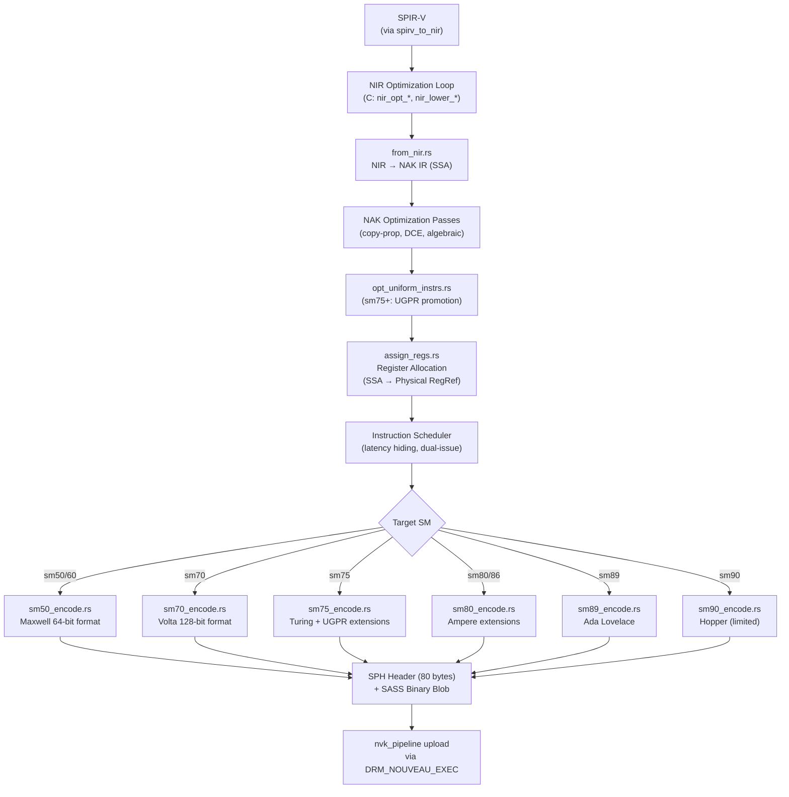

# Chapter 118: NAK — The Rust Shader Compiler for NVIDIA GPUs

> **Part**: Part III — The Open NVIDIA Stack
> **Audience**: Systems and driver developers, compiler engineers, GPU architecture researchers
> **Status**: First draft — 2026-06-19

## Table of Contents

- [Overview](#overview)
- [1. Why a New Compiler: The Case Against nv50\_ir](#1-why-a-new-compiler-the-case-against-nv50_ir)
- [2. NAK IR Design: SSA, Instructions, and Register Classes](#2-nak-ir-design-ssa-instructions-and-register-classes)
- [3. NIR to NAK: The Lowering Handoff](#3-nir-to-nak-the-lowering-handoff)
- [4. Optimization Passes in NAK](#4-optimization-passes-in-nak)
- [5. Register Allocation: Liveness, Spilling, and Bank Conflicts](#5-register-allocation-liveness-spilling-and-bank-conflicts)
- [6. Instruction Scheduling: Latency Hiding and Dual-Issue](#6-instruction-scheduling-latency-hiding-and-dual-issue)
- [7. ISA Encoding: Maxwell Through Ada Lovelace and Hopper](#7-isa-encoding-maxwell-through-ada-lovelace-and-hopper)
- [8. Key NVIDIA Instructions: FADD, IMAD, LDG/STG, MUFU, Predicates](#8-key-nvidia-instructions-fadd-imad-ldgstg-mufu-predicates)
- [9. Rust in Mesa: FFI Boundaries, Bindgen, and Meson](#9-rust-in-mesa-ffi-boundaries-bindgen-and-meson)
- [10. NVK Integration: nak\_compile\_shader() in the Pipeline Path](#10-nvk-integration-nak_compile_shader-in-the-pipeline-path)
- [11. Current Status and Roadmap](#11-current-status-and-roadmap)
- [Integrations](#integrations)
- [References](#references)

---

## Overview

This chapter targets compiler engineers, GPU architecture researchers, and systems developers who want to understand how the open-source NVIDIA graphics stack translates Vulkan shaders into hardware machine code. It assumes familiarity with SSA-form IR design and basic GPU shader compilation concepts.

**NAK** (the **N**vidia **A**wesome **K**ompiler) is the NVIDIA GPU shader compiler backend written in Rust and merged into Mesa 24.0 in February 2024. It replaced the legacy `nv50_ir` C++ compiler backend for the NVK Vulkan driver and extended the open-source NVIDIA stack's reach to Turing (sm75) and beyond — GPU generations that the old codegen could not support correctly. NAK ingests NIR (Mesa's common shader intermediate representation), applies NVIDIA-specific optimization and lowering, allocates registers, schedules instructions, and emits binary SASS (Streaming ASSembly) ready to be loaded by the GPU's command processor.

NAK is significant for three reasons beyond NVK itself. First, it is Mesa's first GPU compiler backend written in Rust, directly influencing KRAID (merged June 2026, ARM Mali Valhall) and the broader trajectory of Rust adoption in Mesa. Second, its clean SSA-throughout design and principled NIR handoff make it a model for new backend authors. Third, its support for NVIDIA's uniform register file (Turing+) and its post-release work on instruction scheduling bring the open-source stack to within measurement error of NVIDIA's proprietary compiler on compute-heavy workloads.

The chapter traces NAK from its motivation through its IR design, register allocator, ISA encoders, and NVK integration, grounding each claim in Mesa source locations and upstream presentations.

---

## 1. Why a New Compiler: The Case Against nv50\_ir

### The Legacy nv50\_ir Codebase

The shader compiler that NAK replaced lived at `src/gallium/drivers/nouveau/codegen/` in the Mesa tree. Its primary source files included `nv50_ir_from_nir.cpp`, `nv50_ir_from_tgsi.cpp`, and approximately 60,000 lines of supporting C++. Christoph Bumiller originally wrote this code to serve the `nv50` (Tesla/Fermi) and `nvc0` (Fermi and later) Gallium3D drivers. The IR was not NIR — it was a bespoke C++ class hierarchy that could accept either TGSI (Tungsten Graphics Shader Infrastructure, the pre-NIR Gallium IR) or a NIR frontend bolted on later via `nv50_ir_from_nir.cpp`.

The problems this created were structural, not incidental. Faith Ekstrand explained the situation directly in the XDC 2023 "Writing Compilers in Rust" presentation: "Modernizing the compiler and making it NIR-centric would require deep surgery and very broad refactoring, with quite a bit being done by the nv50 back-end itself that really should be done by NIR instead. There are serious problems with the register allocator where it just fails sometimes with no fallback. By the time all is said and done, there likely wouldn't be much of the original left, so it may be easier to rewrite with the old one as a reference than to try and slowly refactor it without breaking anything." [Source](https://indico.freedesktop.org/event/4/contributions/210/attachments/126/186/2023-10-17%20XDC%202023%20-%20Writing%20compilers%20in%20Rust.pdf)

### Specific Technical Deficiencies

**Register allocator correctness.** The nv50\_ir register allocator had hard-failure modes at high register pressure. When the allocator could not find a valid coloring it did not spill — it produced incorrect code or crashed. This was a known limitation accepted as "too hard to fix" in the C++ codebase.

**Early exit from SSA.** The old compiler left SSA form earlier than necessary, before several optimization passes ran, degrading their quality. Optimizations that NIR already provides — algebraic simplification, copy propagation, dead code elimination — were reimplemented per-GPU inside nv50\_ir instead of being shared across drivers.

**No support for Turing's uniform register file.** Turing (sm75) introduced a separate scalar integer datapath: 63 uniform GPRs (UR0–UR62) and 8 uniform predicate registers (UP0–UP7). These registers hold values that are provably identical across all threads in a warp, enabling more compact code and reduced register bank pressure. The nv50\_ir had no concept of these; adding them would have required invasive changes to the register allocator and instruction selection.

**sm75+ ISA encoding.** Volta (sm70) and Turing (sm75) changed the instruction format from 64-bit words to 128-bit words: 64 bits of instruction encoding plus 64 bits of embedded scheduling control. Every pre-Volta instruction emitter in nv50\_ir would have needed replacement. Pre-Volta cards use 64-bit instruction words; the two formats are entirely incompatible.

**Performance gap.** The performance consequences of these limitations were severe. LWN and Phoronix reported NAK enabling a transition "from 20 frames per second to over 1000" on certain workloads on Turing hardware that the old codegen could barely execute. [Source](https://www.phoronix.com/news/NAK-Merged-Mesa-24.0)

### The Decision to Use Rust

Faith Ekstrand's rationale for Rust (summarized from the XDC 2023 talk) was not ideological but practical:

- C is missing tagged union types. Representing an instruction's operand as "one of SSARef | RegRef | CBufRef | Imm32 | Zero" in C requires enum + void pointer, with no compiler enforcement that every case is handled. Rust `enum` provides this for free, making instruction traversal passes both concise and exhaustively checked.
- The borrow checker "becomes a code review buddy" — for a compiler IR where passes read data structures while potentially modifying them, the borrow checker eliminates entire categories of use-after-free and iterator invalidation bugs. The standard NIR "gather then modify" discipline (collect values into a temporary structure, then make all mutations) is enforced by the type system rather than being a social convention.
- Rust's standard library (`HashMap`, `Vec`, `BTreeMap`, iterators with `map`/`filter`/`flat_map`) is richer and better-designed than C's, reducing the amount of infrastructure code that must be written.
- C++ was considered and rejected: "C++ adds complexity and footguns" — template metaprogramming, implicit conversions, exception specifications, and the general complexity of the C++ abstract machine make large codebases harder to reason about than either C or Rust.

NAK was accepted into Mesa (a C/C++ codebase) over months of discussion about Rust toolchain requirements, build system integration, and long-term maintainability. The resolution was that Meson's Rust support was mature enough, the MSRV (Minimum Supported Rust Version) could be pinned at 1.82.0, and the 7-function FFI boundary was narrow enough to make Rust's presence self-contained. [Source](https://indico.freedesktop.org/event/4/contributions/210/attachments/126/186/2023-10-17%20XDC%202023%20-%20Writing%20compilers%20in%20Rust.pdf)

---

## 2. NAK IR Design: SSA, Instructions, and Register Classes

NAK's source lives at `src/nouveau/compiler/nak/` in the Mesa repository. [Source](https://gitlab.freedesktop.org/mesa/mesa/-/tree/main/src/nouveau/compiler) The IR is defined in `ir.rs` and is the hub around which all other NAK modules orbit.

### SSAValue and SSARef

The fundamental NAK IR unit is `SSAValue`, a 32-bit logical register identifying a single definition in SSA form:

```rust
// From src/nouveau/compiler/nak/ir.rs
// Each SSAValue represents one 32-bit SSA definition.
// The file (RegFile) determines which physical register class it targets.
pub enum RegFile {
    GPR,    // General-purpose 32-bit registers (R0–R254, R255 = zero)
    Pred,   // Predicate registers (P0–P6, P7 = PT always-true)
    UGPR,   // Uniform GPRs (UR0–UR62), Turing+ (sm75)
    UPred,  // Uniform predicate registers (UP0–UP7), Turing+ (sm75)
    Carry,  // Carry-out for multi-word integer arithmetic
    Bar,    // Barrier registers for Volta+ reconvergence
}

pub struct SSAValue {
    pub file: RegFile,
    pub index: u32,  // 29-bit SSA index, unique per-function
}
```

Multi-component values (64-bit FP, vec2/vec3/vec4) are represented as `SSARef`, which packs 1–4 `SSAValue`s into a compact structure implementing `Deref<[SSAValue]>`. This enables both element-wise access (for register allocation) and treated-as-unit access (for instruction definition). A 64-bit `double` value is an `SSARef` of length 2, both components in `RegFile::GPR`. A `vec4 float` is an `SSARef` of length 4.

### Source Operands

Instruction sources are `Src`, a Rust enum covering every operand type the NVIDIA ISA supports:

```rust
// From src/nouveau/compiler/nak/ir.rs (simplified)
pub enum Src {
    SSA(SSARef),          // Unallocated SSA value
    Reg(RegRef),          // Physical register (after RA)
    CBuf(CBufRef),        // Constant buffer: (cb_index, byte_offset)
    Imm32(u32),           // 32-bit immediate
    Zero,                 // Hardware zero (R255 or equivalent)
    True,                 // Predicate true (PT)
    False,                // Predicate false (!PT)
}

pub struct RegRef {
    pub file: RegFile,
    pub base: u8,     // First physical register
    pub comps: u8,    // Number of consecutive registers used
}

pub struct CBufRef {
    pub buf: u8,      // Constant buffer index (0–15)
    pub offset: u16,  // Byte offset (must be 32-bit aligned)
}
```

The key design choice here is that `SSARef` and `RegRef` share the source representation via the same enum. Before register allocation, all sources are `Src::SSA`. After allocation, all `Src::SSA` entries are rewritten to `Src::Reg`. Optimization passes run while sources are still in SSA form; encoding passes see only `RegRef` and `CBufRef` sources.

### Instructions

Each NAK instruction is a Rust struct embedded in a Rust enum. Instructions have named source and destination fields for type-safe access in instruction-specific passes, plus generic indexed access for passes like copy propagation that must iterate all sources without knowing the instruction type:

```rust
// Conceptual structure — NAK uses proc macros to generate the full enum
// and accessor traits from instruction definitions in ir.rs

pub struct FAdd {
    pub dst: Dst,          // Single FP32 destination
    pub src_a: Src,        // First FP32 source
    pub src_b: Src,        // Second FP32 source
    pub ftz: bool,         // Flush denormals to zero
    pub rnd_mode: FRndMode, // Rounding: RN, RM, RP, RZ
    pub saturate: bool,    // Clamp result to [0.0, 1.0]
}

pub enum Instr {
    FAdd(FAdd),
    FMul(FMul),
    FFma(FFma),
    DAdd(DAdd),   // FP64
    DMul(DMul),
    DFma(DFma),
    IMad(IMad),   // Integer multiply-add
    IAdd3(IAdd3), // 3-source integer add
    Lop3(Lop3),   // 3-source logical operation (NVIDIA sm50+)
    Ld(Ld),       // Generic load (LDG/LDS/LDC dispatched by space)
    St(St),       // Generic store
    Tex(Tex),     // Texture sample
    Mufu(Mufu),   // Multi-function unit: sin/cos/rcp/rsq/ex2/lg2
    Bra(Bra),     // Unconditional branch
    // ... ~80 total instruction variants
}
```

Proc macros auto-derive `Instr::srcs_as_slice()` (a `&[Src]` view of all sources) and `Instr::dsts_as_slice_mut()` (a `&mut [Dst]` view of all destinations) from the named field declarations. This gives constant-time generic access for optimization passes without requiring the pass to pattern-match every instruction type.

### CFG and Basic Block Structure

```rust
// From src/nouveau/compiler/nak/ir.rs
pub struct BasicBlock {
    pub id: u32,
    pub instrs: Vec<Box<Instr>>,
    pub phi: Vec<Phi>,       // SSA phi nodes at block entry
}

pub struct Function {
    pub ssa_alloc: SSAValueAllocator,
    pub cfg: CFG<BasicBlock>,
}

pub struct Shader {
    pub functions: Vec<Function>,
    pub info: ShaderInfo,   // SM target, stage type, SPH parameters
}
```

`CFG<T>` is a generic directed graph container holding predecessor and successor lists, dominance tree, and loop nesting information. It implements `Deref<[T]>` for iteration in reverse post-order, which is the standard traversal order for forward dataflow analyses.

NAK remains fully in SSA form — with phi nodes, SSA values, and no physical register references — from the time `from_nir.rs` constructs the initial IR until `assign_regs.rs` rewrites all `Src::SSA` to `Src::Reg` and removes phi nodes. This is a stronger invariant than the old nv50\_ir, which exited SSA early.



---

## 3. NIR to NAK: The Lowering Handoff

NIR (covered in depth in Chapter 14) is Mesa's SSA-based shader intermediate representation. The hand-off between NIR and NAK is well-defined: NVK runs a sequence of NIR lowering and optimization passes in C, then calls `nak_compile_shader()` which ingests the resulting NIR through Rust wrapper types.

### NIR Passes Required Before Hand-off

The following NIR passes must run (in C, before NAK sees the shader) for correct compilation:

```c
// Excerpt from NVK's NIR preparation sequence
// src/nouveau/vulkan/nvk_shader.c (conceptual; exact pass order varies by stage)

nir_lower_vars_to_ssa(nir);           // Promotes local vars to SSA definitions
nir_lower_phis_to_scalar(nir);        // NAK SSAValue is always 32-bit scalar
nir_lower_bool_to_int32(nir);         // NVIDIA has no 1-bit registers; i1 → i32
nir_convert_to_lcssa(nir, true, true);// Loop-closed SSA for uniform register opt
nir_lower_mediump(nir, ...);          // Lower mediump precision qualifiers
nir_lower_idiv(nir, nir_lower_idiv_fast); // Integer division → recip multiply
nir_lower_io(nir, ...);               // Lower I/O variables to load_input/store_output
nir_opt_algebraic(nir);               // a+0→a, a*1→a, etc.
nir_opt_constant_folding(nir);
nir_opt_copy_propagate(nir);
nir_opt_dce(nir);                     // Dead code elimination
nir_opt_dead_cf(nir);                 // Dead control-flow elimination

// For Volta+ (sm70+): classify values as uniform or divergent
// This drives the opt_uniform_instrs pass in NAK
if (nak->sm >= 70)
    nir_divergence_analysis(nir);
```

The `nir_lower_phis_to_scalar` pass is critical: NAK's `SSAValue` is always exactly 32 bits, matching NVIDIA's physical register granularity. NIR can represent vector phi nodes; NAK cannot. The scalarization must happen before `from_nir.rs` sees any phi nodes.

`nir_convert_to_lcssa` converts the shader to Loop-Closed SSA form, where all values defined inside a loop and used outside it are mediated by phi nodes at the loop exit. This is a precondition for NAK's `opt_uniform_instrs` pass (sm75+), which must be able to distinguish values that are uniform across an entire loop from values that vary per-iteration.

### from\_nir.rs: The Translation

`from_nir.rs` reads `nir_shader *` through read-only Rust wrappers that expose the C struct fields as safe Rust references. The translation is a recursive walk of the NIR CFG:

1. **Block structure**: For each `nir_block`, create a `BasicBlock` in the NAK CFG. Edge structure is copied from NIR's predecessor/successor lists.
2. **Phi nodes**: `nir_phi_instr` → `Phi { dst: SSAValue, srcs: Vec<(block_id, Src)> }`.
3. **Instructions**: Each `nir_instr` is matched on its type (`nir_instr_type_alu`, `nir_instr_type_intrinsic`, `nir_instr_type_tex`, etc.) and lowered to one or more NAK instructions.
4. **ALU operations**: `nir_op_fadd` → `Instr::FAdd`, `nir_op_fmul` → `Instr::FMul`, etc. Many NIR ops lower to a single NAK instruction; some require sequences (e.g., `nir_op_fdiv` → reciprocal + multiply on hardware that lacks native FP division).
5. **Intrinsics**: `nir_intrinsic_load_global` → `Instr::Ld` with `MemSpace::Global`, `nir_intrinsic_store_global` → `Instr::St`. Descriptor loads become constant buffer reads (CBuf) addressed via the NVK descriptor layout.
6. **Texture operations**: `nir_texop_tex` → `Instr::Tex`, with texture handle loaded from the bindless descriptor table.

```rust
// From src/nouveau/compiler/nak/from_nir.rs (conceptual excerpt)
fn lower_alu_instr(b: &mut InstrBuilder, alu: &nir_alu_instr) {
    match alu.op {
        nir_op_fadd => {
            let dst = b.alloc_ssa(RegFile::GPR, 1);
            let src_a = lower_alu_src(b, &alu.src[0]);
            let src_b = lower_alu_src(b, &alu.src[1]);
            b.push(FAdd {
                dst: dst.into(),
                src_a,
                src_b,
                ftz: alu.dest.saturate,  // approximate; real code checks stage
                rnd_mode: FRndMode::RN,
                saturate: false,
            });
        }
        nir_op_ffma => {
            // FFma is NVIDIA's native fused multiply-add; map directly
            // ...
        }
        nir_op_fdiv => {
            // No native fdiv on NVIDIA; lower to rcp + fmul
            let rcp = b.alloc_ssa(RegFile::GPR, 1);
            b.push(Mufu { dst: rcp.into(), src: lower_alu_src(b, &alu.src[1]),
                          op: MufuOp::Rcp });
            let dst = b.alloc_ssa(RegFile::GPR, 1);
            b.push(FMul { dst: dst.into(),
                          src_a: lower_alu_src(b, &alu.src[0]),
                          src_b: rcp.into(), .. });
        }
        // ~120 more NIR ALU opcodes
        _ => panic!("Unhandled NIR ALU op: {:?}", alu.op),
    }
}
```

### Control Flow and Volta+ Reconvergence

NVIDIA Volta+ uses barrier-based reconvergence instead of the execution-mask model used on Maxwell and Pascal. On pre-Volta hardware, divergent branches were handled by the hardware maintaining a convergence stack per warp; threads that take the not-taken path are masked out and resume at the reconvergence point. On Volta+, the compiler must emit explicit `BSSY` (Barrier Set SYnc) instructions at each divergent branch entry and `BSYNC` at each reconvergence point.

NAK represents this through barrier registers (`RegFile::Bar`) and block annotations. The `from_nir.rs` pass performs a structural analysis of the NIR CFG to identify single-entry, single-exit regions. Each such region is bracketed with `bar_set_nv` (the NAK name for BSSY) and `bar_sync_nv` (BSYNC) instructions. Supporting `VK_KHR_shader_maximal_reconvergence` required extending NIR's dominance analysis and adding `nir_jump_goto` instructions — work described in the Collabora blog post on Volta reconvergence. [Source](https://www.collabora.com/news-and-blog/blog/2024/04/25/re-converging-control-flow-on-nvidia-gpus/)

---

## 4. Optimization Passes in NAK

NAK's optimization passes operate on the NAK IR in SSA form. The passes follow a pattern that the Rust borrow checker enforces: a pass either visits instructions read-only and accumulates changes into a side table (Phase 1), then applies the changes (Phase 2), or uses the `map_instrs()` helper which provides `&mut Instr` access to one instruction at a time with no aliasing.

### Core Optimization Passes

**Copy propagation** (`opt_copy_prop`): When an instruction is a move (`Instr::Copy { dst, src }`), replace all uses of `dst` with `src` and remove the copy. This is the most frequently triggered pass after `from_nir.rs` introduces copies during phi elimination and I/O lowering.

**Dead code elimination** (`opt_dce`): Remove any instruction whose destination has no remaining uses. NAK's DCE is conservative for instructions with side effects (stores, texture writes, barriers).

**Algebraic simplification** (`opt_algebraic`): Pattern-match instruction combinations and replace with simpler forms. Examples:
- `FAdd { src_a: x, src_b: Zero }` → `Copy { dst, src: x }` (add-by-zero)
- `FMul { src_a: x, src_b: Imm32(1.0) }` → `Copy { dst, src: x }` (multiply-by-one)
- `IAdd3 { src_a: x, src_b: Zero, src_c: Zero }` → `Copy { dst, src: x }`
- `Lop3` constant-expression folding when all three sources are known immediates

**Constant folding**: When all sources of an instruction are `Src::Imm32`, evaluate the instruction at compile time and replace with a `Src::Imm32` result.

### Uniform Register Promotion (sm75+)

`opt_uniform_instrs` is NAK's most NVIDIA-specific optimization pass. [Source](https://docs.mesa3d.org/relnotes/24.0.0.html) It inspects the divergence classification attached to each SSA value by NIR's `nir_divergence_analysis` and identifies values that are provably uniform across all threads in a warp (i.e., all threads in the warp compute the same value). Such values are candidates for promotion to UGPR (uniform GPR) form.

Uniform values in UGPRs have two benefits: (1) they do not consume entries from the per-thread register file, increasing occupancy; (2) they can be used as the base pointer for bindless constant buffer accesses via the `LDC.U` instruction form (and related addressing modes on sm70+), enabling the hardware's fast constant buffer path.

The pass inserts `OpPin` and `OpUnpin` instructions around UGPR-resident values to communicate register file membership to the register allocator, which then assigns them to the `RegFile::UGPR` class.

---

## 5. Register Allocation: Liveness, Spilling, and Bank Conflicts

### The NVIDIA Register File

Every NVIDIA GPU thread has access to 255 general-purpose 32-bit registers (R0–R254; R255 is the zero register on Turing+). Register allocation quantum is 8: the GPU allocates registers per-shader-thread in increments of 8. A warp of 32 threads occupies 32 × (allocated\_register\_count) entries in the SM's register file. This determines occupancy: an SM with 65,536 register file entries can host 64 warps at 8 registers each, or 4 warps at 255 registers each. More registers per thread = better instruction-level parallelism per thread but lower warp-level concurrency, reducing the GPU's ability to hide memory latency by switching warps.

Turing (sm75) adds 63 uniform GPRs (UR0–UR62) shared per-warp (one copy for all 32 threads) and 8 uniform predicate registers (UP0–UP7). These do not count against per-thread register pressure. [Source](https://indico.freedesktop.org/event/4/contributions/175/attachments/124/184/2023-10-17%20XDC%202023%20-%20Nouveau%20NVK%20Update.pdf)

### NAK's Register Allocator

`assign_regs.rs` implements NAK's register allocator. [Source](https://gitlab.freedesktop.org/mesa/mesa/-/tree/main/src/nouveau/compiler/nak) Key algorithmic features:

**NextUseLiveness tracking.** The allocator uses `NextUseLiveness`, a data structure that tracks the distance (in instructions) to the next use of each live SSA value. Pressure-reduction decisions use next-use distance: when spilling is necessary, the allocator spills the value whose next use is farthest away (minimizing reload penalty). This is a generalization of Belady's optimal page replacement algorithm adapted to register allocation under SSA.

**Pre-allocation spilling pass.** Mesa 24.0 release notes document a pre-allocation pass that reduces GPR pressure before register assignment begins. [Source](https://docs.mesa3d.org/relnotes/24.0.0.html) This pass identifies values that are live across high-pressure points and introduces spill/reload pairs before the main allocator runs, avoiding the correctness failures that plagued nv50\_ir (which had no spilling at all).

**Multi-component placement.** SSARefs of length > 1 (64-bit values = 2 components, vectors = up to 4) must map to physically consecutive registers. The allocator enforces this by treating multi-component SSARefs as a unit during interval splitting and placement: a 64-bit double occupies two consecutive registers (R_n, R_{n+1}); a vec4 float occupies four (R_n through R_{n+3}).

**Parallel copy handling.** Phi nodes at block entries generate parallel copy instructions during SSA destruction. These are processed with a parallel-copy sequentialization algorithm that handles cycles (where phi destination x feeds phi source y which feeds phi destination z which feeds phi source x) by introducing a temporary register.

**SSA repair after spilling.** When spill/reload pairs are inserted for a value that is live across a block boundary, the resulting IR is no longer in correct SSA form (the reloaded value is a new definition not dominated by the original). NAK's spiller runs an incremental SSA repair pass (using iterated dominance frontiers) to restore SSA validity before the main allocation pass.

### Bank Conflict Avoidance (sm75+)

Turing GPUs partition the per-thread register file into two banks (even/odd index). An instruction with three register sources stalls for one cycle if any two of the three source register indices map to the same bank modulo 2. For FFMA (fused multiply-add with three sources: R_dst = R_a * R_b + R_c), a bank conflict stall on every instruction can halve throughput.

NAK's register allocator is aware of these constraints. During coloring, when assigning a physical register to an SSA value that will appear as a source of an FFMA-like instruction, the allocator preferentially assigns an index that avoids a three-source bank conflict with the other already-assigned sources of the same instruction. This does not require solving a hard constraint problem; it is implemented as a preference bias during the local assignment step. [Source](https://indico.freedesktop.org/event/4/contributions/210/attachments/126/186/2023-10-17%20XDC%202023%20-%20Writing%20compilers%20in%20Rust.pdf)

---

## 6. Instruction Scheduling: Latency Hiding and Dual-Issue

### Volta+ Scheduling Words

Every Volta+ instruction is 16 bytes: 8 bytes of instruction encoding and 8 bytes of scheduling control. The scheduling control word encodes:

- **Stall count** (4 bits): number of cycles to stall after this instruction before issuing the next. A value of 15 means "wait for the instruction's result to be ready" (full latency). A value of 1 means "issue the next instruction immediately" (useful for pipelined operations where the next instruction does not read this instruction's result yet).
- **Yield bit**: whether the SM should consider switching to another warp after this instruction.
- **Read dependency barriers** (3 bits): which of the SM's 6 read-barrier slots to wait on.
- **Write dependency barriers** (3 bits): which write-barrier slot this instruction writes into.
- **Wait mask** (6 bits): which barriers must have fired before this instruction can issue.

A naive compiler emits every instruction with a stall count equal to the full latency of the preceding instruction. A good scheduler identifies instructions that do not depend on the preceding result and reorders them into the stall window, improving throughput.

### NAK's Post-RA Scheduler

Mesa 24.2 and 25.0 received a post-register-allocation instruction scheduler for NAK, contributed by Mel (as cited in the XDC 2025 presentation). [Source](https://indico.freedesktop.org/event/10/contributions/401/attachments/264/352/2025-09-29%20-%20XDC%202025%20-%20Nouveau%20NVK%20Update.pdf) The scheduler:

1. Builds a dependence graph over the instructions in each basic block, with edges for RAW (read-after-write), WAR (write-after-read), and WAW (write-after-write) dependencies.
2. Performs list scheduling: at each step, selects the "best" instruction from the set of ready instructions (those whose all predecessors in the dependence graph have been scheduled). "Best" is defined by a priority function that considers estimated latency, register pressure, and the proximity to a long-latency operation.
3. Assigns stall counts to each scheduled instruction based on the instruction latency tables. NVIDIA provided official Turing instruction latency data that NAK now uses directly ("Thanks, NVIDIA!" — XDC 2025 slide).

The post-RA scheduler reduced estimated static cycle count by 14% on NAK's internal benchmarks at the time of the XDC 2025 presentation.

A pre-RA scheduler targeting register pressure reduction (enabling higher warp occupancy) was under review at that time. The pre-RA scheduler reorders instructions before register allocation to reduce the peak live range count, which directly translates to lower register count and higher occupancy.

### Dual-Issue (sm80+)

Ampere (sm80) introduced dual-issue: the SM can issue two instructions per clock cycle to the same warp if they satisfy the dual-issue rules:
- The two instructions must have no data dependencies between them.
- They must target different execution units (e.g., one FP32 and one integer ALU instruction).
- Neither can be a memory instruction (LDG/STG require the full issue slot).

NAK's scheduler tracks dual-issue eligibility and marks instruction pairs with the yield/barrier bits required to enable hardware dual-issue. This is recorded in the scheduling word. [Note: The exact Ampere dual-issue implementation in NAK was still maturing as of Mesa 25.2; full dual-issue utilization may require further scheduler tuning.]

---

## 7. ISA Encoding: Maxwell Through Ada Lovelace and Hopper

NAK supports every NVIDIA GPU generation from Maxwell (2014) through Blackwell (2025) via a family of per-SM encoder modules. The NVIDIA SASS (Streaming ASSembly) ISA was historically reverse-engineered — Envytools provides documentation for Kepler and Maxwell — and NVIDIA has released increasing amounts of official documentation, particularly for Turing+. [Source](https://docs.mesa3d.org/drivers/nvk/external_hardware_docs.html)

### ISA Evolution by Generation

```mermaid
graph LR
    A["Fermi (sm20)\n64-bit instructions\nSSY/SYNC ctrl flow"] --> B["Kepler A (sm30)\nFermi encoding\ndiff tex/image ops"]
    B --> C["Kepler B (sm32)\nOwn encoding\n40-bit addresses"]
    C --> D["Maxwell (sm50)\n64-bit instructions\nNew instruction format"]
    D --> E["Pascal (sm60/61)\nMaxwell + ext.\nNVLINK, FP16"]
    E --> F["Volta (sm70)\n128-bit instr words\nBSSY/BSYNC ctrl flow\nHMMA tensor cores"]
    F --> G["Turing (sm75)\nVolta encoding\n+UGPR/UPred\nBMMA, RT cores"]
    G --> H["Ampere (sm80/86)\n8 new instr\nInline cbuf fetch\nAsyncCopy LDGSTS"]
    H --> I["Ada (sm89)\nAda additions\nADA_NOFL, etc."]
    I --> J["Hopper (sm90)\n36 new instr\nCollective ops\nGlobal tensor mem"]
    J --> K["Blackwell (sm100+)\nBiggest ISA change\nNo inline cbuf\nMore UGPR sources\nOMMA/QMMA"]
```



| SM | Generation | Instruction Width | Control Flow | Uniform Regs |
|----|------------|-------------------|--------------|--------------|
| sm30–sm32 | Kepler | 64-bit | SSY/SYNC | No |
| sm50–sm52 | Maxwell | 64-bit | SSY/SYNC | No |
| sm60–sm61 | Pascal | 64-bit | SSY/SYNC | No |
| sm70 | Volta | 128-bit | BSSY/BSYNC | No |
| sm75 | Turing | 128-bit | BSSY/BSYNC | Yes (UR/UP) |
| sm80/86 | Ampere | 128-bit | BSSY/BSYNC | Yes |
| sm89 | Ada Lovelace | 128-bit | BSSY/BSYNC | Yes |
| sm90 | Hopper | 128-bit | BSSY/BSYNC | Yes + Collective |

### Maxwell (sm50): sm50\_encode.rs

The Maxwell encoder handles the 64-bit instruction format. Maxwell was the last major restructuring before Volta, changing the register encoding and immediate handling significantly from Kepler. Maxwell introduced the `LOP3` (3-source logical operation) instruction, which encodes an arbitrary 3-variable Boolean function as an 8-bit truth table — used extensively for bit manipulation shaders.

```rust
// Conceptual structure of a Maxwell FADD encoding
// From src/nouveau/compiler/nak/sm50_encode.rs
// NOTE: the opcode value, bit positions, and field widths below are
// illustrative only — the actual values differ per instruction variant
// and are derived from Envytools reverse-engineering. Verify against
// nvdisasm output before relying on any specific constant.
fn encode_fadd(instr: &FAdd, alloc: &RegAlloc) -> u64 {
    let mut word: u64 = 0;
    // Opcode field (high bits — exact position is variant-dependent)
    word |= FADD_OPCODE << OPCODE_SHIFT;
    // Destination register
    word |= (alloc.reg(instr.dst) as u64) << DST_SHIFT;
    // Source A register
    word |= (alloc.reg(instr.src_a) as u64) << SRC_A_SHIFT;
    // Source B: register, immediate, or cbuf
    // ... encode according to the source type
    word
}
```

### Volta/Turing (sm70/sm75): sm70\_encode.rs and sm75\_encode.rs

The Volta encoder emits 128-bit instruction words. The upper 64 bits encode the instruction; the lower 64 bits encode the scheduling control word:

```rust
// From src/nouveau/compiler/nak/sm70_encode.rs (conceptual)
// NOTE: opcode values and bit positions are illustrative — exact constants
// are validated against nvdisasm in NAK's test suite. Do not copy opcode
// hex values from this listing without verifying against the actual source.
struct VoltaInstrWord {
    encoding: u64,  // Instruction encoding, bits [127:64]
    sched: u64,     // Scheduling control word, bits [63:0]
}

fn encode_ffma(instr: &FFma, sched: SchedWord, alloc: &RegAlloc) -> VoltaInstrWord {
    let mut enc: u64 = 0;
    enc |= FFMA_OPCODE << OPCODE_SHIFT; // Opcode in high bits of encoding word
    enc |= (alloc.reg(instr.dst)   as u64) << DST_SHIFT;
    enc |= (alloc.reg(instr.src_a) as u64) << SRC_A_SHIFT;
    enc |= (alloc.reg(instr.src_b) as u64) << SRC_B_SHIFT;
    enc |= (alloc.reg(instr.src_c) as u64) << SRC_C_SHIFT;
    // FTZ, rounding mode, saturation bits occupy instruction-specific positions
    if instr.ftz { enc |= FTZ_BIT; }
    // ... etc.
    VoltaInstrWord { encoding: enc, sched: sched.encode() }
}
```

The sm75 encoder adds encoding for uniform register instructions: `R2UR` (move GPR to UGPR), `UMOV` (move between UGPRs), `UBMSK`/`UBREV`/`USHF` (bitwise operations on UGPRs), and `USEL` (uniform select using uniform predicate). [Source](https://indico.freedesktop.org/event/4/contributions/210/attachments/126/186/2023-10-17%20XDC%202023%20-%20Writing%20compilers%20in%20Rust.pdf)

### Kepler Support (2025 Addition)

In 2025, NAK gained Kepler A (sm30, using Fermi encoding with different texture/image operations) and Kepler B (sm32, with its own new encoding including 40-bit address arithmetic and split load/lock atomics) support. This extended NVK's GPU range back to the oldest supported NVIDIA hardware in the Nouveau kernel driver. [Source](https://www.collabora.com/news-and-blog/news-and-events/nvk-enabled-for-maxwell,-pascal,-and-volta-gpus.html)

### Validation Against nvdisasm

NAK validates its instruction encodings against `nvdisasm`, NVIDIA's CUDA binary disassembler (part of the CUDA toolkit). Test shaders are compiled by NAK, the resulting binary is passed to `nvdisasm`, and the disassembled output is compared against expected instruction text. This provides confidence that NAK's bitfield packing matches NVIDIA's hardware expectation, without requiring hardware execution for every test case.

---

## 8. Key NVIDIA Instructions: FADD, IMAD, LDG/STG, MUFU, Predicates

### Floating-Point Arithmetic

**FADD** (Float ADD): 2-source FP32 addition. Modifiers: `.FTZ` (flush denormals to zero), `.SAT` (clamp result to [0.0, 1.0]), `.RN`/`.RM`/`.RP`/`.RZ` (rounding mode), `.ABS`/`.NEG` per source (absolute value, negate). On Turing+, FADD can use a UGPR as one source.

**FMUL** (Float MULtiply): 2-source FP32 multiplication. Same modifiers as FADD except SAT and per-source NEG/ABS.

**FFMA** (Float Fused Multiply-Add): 3-source FP32 fused-multiply-add. `dst = src_a * src_b + src_c`. The critical instruction for linear algebra; throughput is 2 per clock per SM (1 per FP32 unit at 2 FP32 units per SM on most NVIDIA architectures). Subject to bank conflict stalls on Turing if all three sources are in the same bank.

**DADD, DMUL, DFMA**: FP64 equivalents. Available on all NVIDIA SM compute class hardware; FP64 throughput on consumer GPUs is typically 1/32 of FP32 throughput.

**HFMA2, HADD2, HMUL2**: FP16 SIMD-pair operations (two FP16 values per 32-bit register). Used for AI workloads. Blackwell (sm100+) added additional half-precision variants (FADD2, FFMA2, FMUL2, FHADD, FHFMA).

### Integer Arithmetic

**IMAD** (Integer Multiply-Add): 3-source integer multiply-add. `dst = src_a * src_b + src_c`. 32-bit × 32-bit with optional 32/64-bit result. The workhorse for address arithmetic and integer compute. Replaces the separate IMUL + IADD sequence from older ISAs.

**IADD3** (Integer ADD 3-source): 3-source integer add with optional carry-in. `dst = src_a + src_b + src_c`. Used in multi-word arithmetic alongside the carry register.

**LOP3** (LOgical-3-source): encodes an arbitrary 3-variable Boolean function as an 8-bit lookup table. `dst = LUT[{src_a[i], src_b[i], src_c[i]}]` for each bit position. Replaces AND/OR/XOR sequences with a single instruction. [Source](https://envytools.readthedocs.io/en/latest/hw/graph/maxwell/cuda/isa.html)

**SHF** (SHiFt): Funnel shift. `dst = (src_a:src_b)[src_c +: 32]` — extracts 32 bits from the 64-bit concatenation of two sources starting at a variable offset. Used for wide shifts and bit field extraction.

### Memory Operations

**LDG / STG** (Load/Store Global): Global memory load and store. The addressing mode on Volta+ is `base_reg + ugpr_offset + 32bit_immediate`, where the UGPR holds the upper bits of a 64-bit base address:

```
// Volta+ LDG addressing
// src[0] = GPR (32-bit offset or lower 32 bits of address)
// src[1] = UGPR (upper 32 bits of 64-bit address)
// imm    = signed 24-bit constant byte offset
// Effective address = ZeroExtend(ugpr) << 32 | gpr + SignExtend(imm)
LDG.E.64 R4, [R0+UR0+0x10];  // Load 64-bit value
```

The `.E` modifier enables the extended 64-bit address form. Cache hints (`.CA` = cache all, `.CG` = cache global only) control the L1/L2 cache interaction.

**LDS / STS** (Load/Store Shared): Shared memory (block-scope scratchpad). Addressing is 24-bit absolute within the block's shared memory allocation.

**LDC** (Load Constant buffer): Loads from a bound constant buffer. `LDC R0, c[0x4][0x10]` loads 4 bytes from constant buffer 4 at byte offset 16. The fast constant buffer path for uniform values uses `LDC.U` on sm75+ with a UGPR holding the base.

**LDGSTS** (LoaD Global, Store Shared): Ampere's async copy instruction. Initiates a DMA transfer from global memory to shared memory without occupying a register for the loaded value, enabling software pipelining of memory latency.

**LDTRAM** (Load TRiAngle Memory): Fragment-stage instruction for loading per-primitive interpolation data (varying attributes, barycentric coordinates, and flat-shaded values) from the triangle RAM — the on-chip storage holding rasterizer outputs for the current fragment's triangle. LDTRAM is the mechanism by which fragment shaders access values that the hardware interpolates between vertices rather than loading from memory. It is distinct from constant buffer and global memory loads, and is not part of the general-purpose memory hierarchy. > **Note: needs verification** — the precise LDTRAM encoding details and exact NAK handling path for LDTRAM vs. standard `nir_intrinsic_load_barycentric_*` intrinsics were not confirmed against current upstream source. Readers implementing fragment-shader interpolation in NAK should consult `from_nir.rs` directly and the Envytools documentation at [Source](https://envytools.readthedocs.io/en/latest/hw/graph/maxwell/cuda/isa.html) for Maxwell-era reference.

### The MUFU: Multi-Function Unit

**MUFU** (MUlti-Function Unit): Hardware implementation of transcendental functions via polynomial approximation. Available operations: `RCP` (reciprocal), `RSQ` (reciprocal square root), `SIN`, `COS`, `EX2` (2^x), `LG2` (log base 2), `RCP64H` (upper 32 bits of 64-bit reciprocal), `RSQRT64H`. Latency is approximately 4–8 cycles on most SM versions.

NAK lowers NIR's `nir_op_frcp`, `nir_op_frsq`, `nir_op_fsin`, `nir_op_fcos`, `nir_op_fexp2`, `nir_op_flog2` directly to `MUFU` with the corresponding operation code.

### Predicated Execution

Every NVIDIA instruction can be predicated. The syntax is `@Px` (execute if Px is true) or `@!Px` (execute if Px is false), where Px is one of P0–P7. P7 = PT (always-true predicate, used as the default when no predicate is specified). Instructions that are predicated-false on the entire warp are skipped (0 cycles), but on a divergent warp (some threads true, some false), predicated-false threads are masked out.

Turing+ uniform predicates (UP0–UP7) can predicate warp-uniform branches — where all threads in the warp take the same branch — without going through the divergence handling machinery. The compiler emits `UBRA @UPx label` for branches that are known-uniform, which can be issued through the scalar execution unit rather than the full warp SIMT unit.

NAK represents predicated execution in its IR through a `Pred` field on every instruction:

```rust
pub struct Pred {
    pub pred: Src,         // Src::Reg(P0-P6) or Src::True/Src::False
    pub is_not: bool,      // true for @!Px form
}
```

---

## 9. Rust in Mesa: FFI Boundaries, Bindgen, and Meson

### The 7-Function FFI Boundary

NAK's interface to the surrounding C codebase consists of exactly 7 functions. This minimalism was a design goal: a small FFI surface reduces the cognitive load for C developers working in NVK who do not know Rust, and it minimizes the amount of code that must be `unsafe`. The primary function is:

```c
// From src/nouveau/compiler/nak_private.h
struct nak_shader_bin *
nak_compile_shader(nir_shader *nir,
                   bool dump_asm,
                   const struct nak_compiler *nak,
                   nir_variable_mode robust2_modes,
                   const struct nak_fs_key *fs_key);
```

On the Rust side this appears as:

```rust
// Generated by bindgen; the #[no_mangle] extern "C" function is in lib.rs
#[no_mangle]
pub extern "C" fn nak_compile_shader(
    nir: *mut nir_shader,
    dump_asm: bool,
    nak: *const nak_compiler,
    robust2_modes: nir_variable_mode,
    fs_key: *const nak_fs_key,
) -> *mut nak_shader_bin {
    // The only unsafe block needed: converting raw pointers to references
    let nir = unsafe { &*nir };
    let nak = unsafe { &*nak };
    // All subsequent code is safe Rust
    compile_shader(nir, dump_asm, nak, robust2_modes, fs_key)
        .map_or(ptr::null_mut(), |bin| Box::into_raw(Box::new(bin)))
}
```

### Reading NIR Through Rust Wrappers

`from_nir.rs` reads C `nir_shader` structures through read-only Rust wrappers. These wrappers use `repr(transparent)` to ensure zero-cost mapping from C struct to Rust type, and expose safe methods:

```rust
// Conceptual wrappers in src/nouveau/compiler/nak/from_nir.rs
// (actual implementation uses bindgen-generated types plus impl blocks)

impl NirBlock {
    pub fn iter_instrs(&self) -> impl Iterator<Item = &NirInstr> {
        // Safe wrapper around exec_list_for_each_entry
        unsafe { ExecListIter::new(&self.instr_list) }
    }
}

impl NirInstr {
    pub fn as_alu(&self) -> Option<&NirAluInstr> {
        if self.type_ == nir_instr_type_alu {
            Some(unsafe { &*(self as *const _ as *const NirAluInstr) })
        } else {
            None
        }
    }
}

impl NirSrc {
    pub fn as_uint(&self) -> Option<u64> {
        // Extract constant value if the source is a load_const
        // ...
    }
}
```

The `exec_list` iterator (iterating NIR's doubly-linked instruction list) was contributed by Karol Herbst specifically for NAK. The read-only access pattern (`&nir_shader` not `&mut nir_shader`) means the Rust borrow checker verifies that NAK cannot accidentally modify the NIR that NVK will continue to use after compilation. [Source](https://indico.freedesktop.org/event/4/contributions/210/attachments/126/186/2023-10-17%20XDC%202023%20-%20Writing%20compilers%20in%20Rust.pdf)

### Bindgen and the Build System

Mesa's build uses Meson. NAK requires Meson ≥ 1.4.0 for full Rust support:

```python
# src/nouveau/compiler/meson.build (simplified)
nak_rust_lib = static_library(
    'nak',
    'nak/lib.rs',
    rust_edition: '2021',
    rust_crate_type: 'staticlib',
    dependencies: [
        idep_nir,
        idep_nouveau_compiler_c,
    ],
)
```

`bindgen` generates Rust bindings for NIR C structs at build time:

```bash
# Generated during Mesa build — not checked in
bindgen \
    --output src/nouveau/compiler/nak/bindings.rs \
    --allowlist-type "nir_.*" \
    --allowlist-type "gl_.*" \
    src/nouveau/compiler/nak/wrapper.h
```

The Shader Program Header (SPH) struct definitions are imported from NVIDIA's `open-gpu-doc` repository, also processed through bindgen to generate Rust struct definitions that match the hardware-documented binary layout.

**MSRV**: NAK requires Rust 1.82.0 minimum (enforced via `rust-version` in Cargo.toml and checked by `clippy.toml`). **Rust edition**: 2021.

**Proc macros**: NAK uses proc-macro crates (`syn`, `quote`, `proc-macro2`) to auto-derive:
- `#[derive(SrcsAsSlice)]` — generates `srcs_as_slice()` for each instruction struct
- `#[derive(DstsAsSlice)]` — generates `dsts_as_slice()` and `dsts_as_slice_mut()`
- ISA encoding tables (bitfield layouts for each instruction × SM version combination)

These proc macro crates are built from Meson subprojects to avoid requiring system-installed Rust crates.

**Mesa Rust precedent**: NAK was Mesa's first Rust GPU compiler backend. KRAID (merged to Mesa 26.2 on June 3, 2026), the Rust compiler for ARM Mali v9/Valhall targeting Panfrost/PanVK, explicitly modeled its design on NAK. [Source](https://www.phoronix.com/news/Mesa-Arm-Mali-KRAID) At the December 2025 Linux Kernel Maintainers Summit, DRM maintainer Dave Airlie stated the graphics subsystem was "about a year away" from discouraging new drivers written in C.

---

## 10. NVK Integration: nak\_compile\_shader() in the Pipeline Path

### Compilation Flow in NVK

NVK follows Mesa's standard Vulkan pipeline compilation model. `vkCreateShaderModule` stores SPIR-V; `vkCreateGraphicsPipeline` and `vkCreateComputePipeline` trigger actual compilation. The full pipeline:

```
vkCreateGraphicsPipeline()
  └─ nvk_pipeline_compile_shaders()
       └─ spirv_to_nir()              // src/compiler/spirv/spirv_to_nir.c
       └─ nvk_lower_nir()             // NVK-specific NIR lowering
       |   ├─ nvk_nir_lower_descriptors()  // bindless descriptor table layout
       |   ├─ nvk_nir_lower_image_addrs()  // NVIDIA texture handle format
       |   └─ [NIR optimization loop]
       └─ nak_compile_shader()        // Rust: NAK backend
       └─ nvk_upload_shader()         // Upload binary via DRM_NOUVEAU_EXEC
```

The `nvk_lower_nir()` step translates NVK's Vulkan descriptor model into NIR intrinsics that NAK understands. NVK uses bindless descriptors: descriptor set addresses are stored in constant buffer 0 (CB0). A texture access requires: (1) loading the descriptor set base address from CB0 into a uniform register (UGPR), (2) adding the in-set offset to obtain the 64-bit descriptor table entry address, (3) loading the 64-bit NVIDIA texture handle from the descriptor entry. `nvk_nir_lower_descriptors()` emits NIR for these steps, producing load\_global and load\_ubo intrinsics that NAK then lowers to LDG and LDC instructions.

### The Shader Program Header (SPH)

NVIDIA GPUs require an 80-byte Shader Program Header prepended to every shader binary. NAK generates the SPH as part of `nak_compile_shader()`. The SPH includes: [Source](https://nvidia.github.io/open-gpu-doc/Shader-Program-Header/Shader-Program-Header.html)

```c
// Conceptual SPH fields (from NVIDIA open-gpu-doc headers)
struct SphType0 {  // VTG (vertex/tessellation/geometry) shaders
    uint32_t sph_type              : 5;   // Shader type
    uint32_t version               : 5;
    uint32_t shader_type           : 4;   // Stage: vertex, geometry, etc.
    // ...
    uint32_t num_gprs              : 8;   // Allocated register count (affects occupancy)
    uint32_t num_barriers          : 4;   // Voltage+ barrier count
    uint32_t local_memory_size     : 20;  // Thread-private local memory (spill space)
    // Input/output attribute maps: which generic slots are read/written
    uint32_t imap_generic_vector[4];
    uint32_t omap_generic_vector[4];
    // ...
};
```

The `num_gprs` field directly encodes the register allocation result: after `assign_regs.rs` computes the maximum register index used, NAK sets this field, which controls how many warps the SM can host simultaneously from this shader (the occupancy calculation: max\_warps = SM\_register\_file\_size / (num\_gprs\_rounded\_up_to_8 × 32)).

### Pipeline Shader Cache

NVK uses Mesa's `vk_pipeline_cache` with a disk-backed store keyed on a hash of the NIR shader plus compilation parameters (target SM version, enabled extensions, fs\_key). Compiled NAK binaries — including the SPH — are serialized to the cache. On subsequent runs, if the cache key matches, NAK compilation is skipped entirely and the cached binary is uploaded directly. [Source](https://docs.mesa3d.org/drivers/nvk.html)

### Debug Flags

NAK exposes debugging through the `NAK_DEBUG` environment variable:

```bash
NAK_DEBUG=print     # Dump NAK IR after each compilation pass
NAK_DEBUG=serial    # Insert MEMBAR.SC between every instruction (correctness debugging)
NAK_DEBUG=spill     # Minimize GPR file to 8 registers, forcing maximum spilling
NAK_DEBUG=annotate  # Insert annotation pseudo-instructions labeling the last pass to modify each value
NAK_DEBUG=no_opt    # Disable optimization passes (for isolating miscompilation)
```

---

## 11. Current Status and Roadmap

### Performance vs. Proprietary Driver

As of the XDC 2025 presentation (September 2025), NVK+NAK achieved within 90% of NVIDIA's proprietary driver performance for cooperative matrix multiply operations (`VK_KHR_cooperative_matrix`). The post-RA instruction scheduler reduced estimated static cycles by 14%. On rasterization-heavy gaming workloads, NVK+NAK (with GSP-RM reclocking on Turing+) delivers 60–80% of proprietary driver performance, with the gap attributable primarily to shader code quality and the absence of NVIDIA's driver-internal geometry shader optimizations. [Source](https://indico.freedesktop.org/event/10/contributions/401/attachments/264/352/2025-09-29%20-%20XDC%202025%20-%20Nouveau%20NVK%20Update.pdf)

### SM Coverage and Generation Support

| SM | Generation | NVK/NAK Status (as of Mesa 25.x) |
|----|------------|-----------------------------------|
| sm30/sm32 | Kepler | Supported (added 2025); Vulkan 1.2 |
| sm50/sm52 | Maxwell | Vulkan 1.4 conformant (Mesa 25.1) |
| sm60/sm61 | Pascal | Vulkan 1.4 conformant (Mesa 25.1) |
| sm70 | Volta | Vulkan 1.4 conformant |
| sm75 | Turing | Primary target; full Vulkan 1.4 |
| sm80/sm86 | Ampere | Vulkan 1.4 conformant |
| sm89 | Ada Lovelace | Vulkan 1.4 conformant |
| sm90 | Hopper | Limited; no consumer hardware |
| sm100+ | Blackwell | Mesa 25.2; Vulkan 1.4 (Mesa 25.2) |

Blackwell (sm100+) required the most significant NAK changes since Turing: the removal of inline constant buffer fetch (requiring a separate UGPR load before each constant buffer reference), many new instructions requiring an additional UGPR source operand, new half-precision arithmetic variants (`FADD2`, `FFMA2`, `FMUL2`, `FHADD`, `FHFMA`), and new matrix multiply operations (`OMMA`, `QMMA`). [Source](https://www.phoronix.com/news/Vulkan-1.4-NVK-Blackwell)

### Missing Features

**Ray tracing**: `VK_KHR_ray_tracing_pipeline` is not implemented. The BVH (Bounding Volume Hierarchy) traversal hardware in NVIDIA's RT cores is not yet sufficiently documented for open-source implementation. The acceleration structure layout is partially reverse-engineered but the shader invocation semantics during traversal are not fully understood. This is the largest remaining gap between NVK and the proprietary driver for gaming workloads.

**Hopper tensor memory**: Hopper (sm90) introduced collective fence/acquire operations (`ACQBULK`, `ENDCOLLECTIVE`, `FENCE`) and global tensor memory instructions (`UTMALDG`, `UTMASTG`, `HGMMA`, `BGMMA`). These are not in the NAK path. Consumer Hopper hardware does not exist (Hopper is a data center generation), making this a non-issue for most users.

**Image compression (DCC)**: Color Delta Color Compression would provide up to 50% speedup in some games by reducing memory bandwidth for render targets, but requires kernel changes to the nouveau driver for DCC table management. This was in draft state at XDC 2025.

### Tinygrad and the Free Software NVIDIA Compute Path

In October 2025, Tinygrad's Mesa NIR backend was merged (Tinygrad 0.12, released January 2026). [Source](https://github.com/tinygrad/tinygrad/pull/12089) This backend emits NIR directly from Tinygrad's tensor IR, feeding it to NAK for compilation to NVIDIA SASS without requiring the CUDA toolchain, NVPTX, or any proprietary components. This makes NAK the critical enabler for a fully free-software NVIDIA GPU compute path for machine learning workloads.

### CTS Conformance Trajectory

Initial NAK targeting compute-only workloads (before NVK production readiness) showed: 313,148 dEQP-VK passes, 906 failures, 1,150 crashes. Subsequent runs after correctness fixes showed: 313,758 passes, 1,282 failures, 161 crashes — demonstrating that the crash-elimination work was effective even as the total test count grew. The ongoing improvement in CTS numbers tracks NAK's maturation toward full correctness on the long tail of Vulkan features. [Source](https://indico.freedesktop.org/event/4/contributions/175/attachments/124/184/2023-10-17%20XDC%202023%20-%20Nouveau%20NVK%20Update.pdf)

---

## Integrations

**Chapter 7 (Reverse-Engineering NVIDIA Hardware)**: Section 7 of this chapter describes NAK's ISA encoders for the NVIDIA SASS ISA — an ISA that was historically undocumented and required reverse engineering for Kepler through Pascal, with Volta+ later supplemented by NVIDIA-provided latency tables. Chapter 7 covers the reverse-engineering methodology (Envytools, nv_isa_solver, decuda, microbenchmarking) that produced the ISA knowledge NAK's encoders are built on. Readers who want to understand the provenance of the instruction encoding tables in `sm50_encode.rs` and `sm70_encode.rs` — why certain bit positions are known, which fields remain uncertain for less-common instruction forms — should read Chapter 7 first.

**Chapter 10 (NVK: Building a Vulkan Driver from Scratch)**: NAK is the shader compiler backend that NVK calls. The compilation path described in Chapter 10, Section 3 — SPIR-V → `spirv_to_nir()` → NIR optimization loop → `nvk_lower_nir()` → `nak_compile_shader()` — is the integration point between the two chapters. Chapter 10 covers NVK's descriptor model, object hierarchy, and synchronization primitives; this chapter covers what happens inside `nak_compile_shader()`. Readers should understand both chapters to follow the full path from a Vulkan application's draw call to hardware-executed SASS.

**Chapter 14 (NIR: Mesa's Shader Intermediate Representation)**: NAK is a NIR consumer. The NIR passes described in Section 3 of this chapter (`nir_lower_phis_to_scalar`, `nir_convert_to_lcssa`, `nir_divergence_analysis`) are part of the NIR framework described in Chapter 14. The `Src::SSA` form in NAK maps directly to NIR's SSA value concept: each `nir_def` becomes one or more 32-bit `SSAValue`s in NAK. Chapter 14's treatment of NIR's optimization pass infrastructure explains the shared optimization work that NAK does not need to replicate.

**Chapter 8 (The Nouveau Kernel Driver: nvkm Architecture)**: The compiled shader binary that NAK produces — SPH header followed by SASS instructions — is uploaded via `DRM_NOUVEAU_EXEC` to the GPU command stream managed by the nvkm kernel driver. The QMD (Queue MetaData) for compute shaders and the shader header for graphics shaders are GPU-accessible memory objects managed by the GEM/TTM system described in Chapter 8. The channel model and FIFO engine dispatch described in Chapter 8 are what actually execute the NAK-compiled binary on the hardware.

**Chapter 9 (GSP-RM Firmware)**: NAK's compiled binaries achieve their rated performance only when the GPU is running at full clock speed, which on Turing+ requires GSP-RM reclocking as described in Chapter 9. The register allocation quantum and occupancy calculation in Section 5 are meaningful only in the context of the full SM architecture that GSP-RM enables access to on modern hardware.

**Chapter 73 (Asahi Linux and the Apple Silicon AGX Driver)**: Asahi's compiler for Apple AGX, written in Rust and part of the Mesa Asahi driver, shares design principles with NAK: both consume NIR and emit hardware-specific ISA via a Rust-based IR. The two compilers developed partially in parallel and influenced each other. KRAID (ARM Mali Valhall), which explicitly modeled itself on NAK, represents the broader pattern of NAK establishing a template for Rust GPU compiler backends in Mesa.

**Chapter 15 (ACO: AMD's Optimized Shader Compiler)**: NAK and ACO occupy the same architectural position in their respective driver stacks — both are NIR-consuming, hardware-specific compiler backends replacing earlier LLVM-based paths. ACO (for RADV) and NAK (for NVK) are the two cleanest examples of this design in Mesa: custom IR, SSA-throughout register allocation, and hardware-specific ISA encoding. Readers who understand ACO's pipeline (NIR → ACO IR → GCN/RDNA binary) will recognize NAK's pipeline immediately.

**Chapter 77 (The Mesa Shader Toolchain)**: NAK exists within the broader Mesa shader compilation infrastructure described in Chapter 77. The SPIR-V frontend (`spirv_to_nir`), the shared NIR optimization passes, the disk cache infrastructure, and the Vulkan pipeline cache are all shared components that NAK relies on. Chapter 77's treatment of the complete Mesa shader path from SPIR-V to hardware binary provides the context within which NAK's role as a backend is most clearly understood.

---

## References

1. [NAK compiler source in Mesa](https://gitlab.freedesktop.org/mesa/mesa/-/tree/main/src/nouveau/compiler) — Primary source: `nak/ir.rs`, `nak/from_nir.rs`, `nak/assign_regs.rs`, `nak/sm70_encode.rs`, `nak/sm75_encode.rs`, `nak/sm50_encode.rs`

2. [XDC 2023 — Writing Compilers in Rust (Faith Ekstrand)](https://indico.freedesktop.org/event/4/contributions/210/attachments/126/186/2023-10-17%20XDC%202023%20-%20Writing%20compilers%20in%20Rust.pdf) — Motivation for NAK, Rust-in-Mesa rationale, FFI boundary design, borrow checker as code review tool, IR data structure design

3. [XDC 2023 — Nouveau/NVK Update (Ekstrand + Herbst)](https://indico.freedesktop.org/event/4/contributions/175/attachments/124/184/2023-10-17%20XDC%202023%20-%20Nouveau%20NVK%20Update.pdf) — NAK status at merge, CTS numbers, Turing uniform register architecture

4. [XDC 2025 — Nouveau/NVK Update](https://indico.freedesktop.org/event/10/contributions/401/attachments/264/352/2025-09-29%20-%20XDC%202025%20-%20Nouveau%20NVK%20Update.pdf) — Post-RA scheduler (14% cycle reduction), cooperative matrix performance (within 90% of proprietary), Blackwell ISA changes, DCC roadmap

5. [Mesa 24.0.0 Release Notes](https://docs.mesa3d.org/relnotes/24.0.0.html) — NAK merge announcement, pre-allocation spill pass, improved coalescing, parallel copy handling

6. [NVIDIA Shader Program Header specification](https://nvidia.github.io/open-gpu-doc/Shader-Program-Header/Shader-Program-Header.html) — Authoritative SPH format: SphType variants, IMAP/OMAP layout, num\_gprs, local memory size

7. [NVK external hardware docs](https://docs.mesa3d.org/drivers/nvk/external_hardware_docs.html) — Links to Envytools, nvdisasm, NVIDIA open-gpu-doc, and other ISA references used by NAK

8. [Rust-written NAK compiler merged for NVK in Mesa 24.0 — Phoronix](https://www.phoronix.com/news/NAK-Merged-Mesa-24.0) — Public announcement of NAK's merge, GPU support matrix, "20 FPS to 1000 FPS" performance quote

9. [Re-converging Control Flow on NVIDIA GPUs — Collabora](https://www.collabora.com/news-and-blog/blog/2024/04/25/re-converging-control-flow-on-nvidia-gpus/) — Volta+ BSSY/BSYNC reconvergence implementation in NAK, VK\_KHR\_shader\_maximal\_reconvergence

10. [NVK enabled for Maxwell, Pascal, and Volta GPUs — Collabora](https://www.collabora.com/news-and-blog/news-and-events/nvk-enabled-for-maxwell,-pascal,-and-volta-gpus.html) — Maxwell/Pascal/Volta enablement, including Kepler later added in 2025

11. [Envytools Maxwell ISA documentation](https://envytools.readthedocs.io/en/latest/hw/graph/maxwell/cuda/isa.html) — Community-reverse-engineered Maxwell instruction encoding; reference for sm50\_encode.rs

12. [NVIDIA open-gpu-doc](https://github.com/NVIDIA/open-gpu-doc) — Hardware class headers, SPH struct definitions, GPU method documentation; imported by NVK/NAK for hardware layout definitions

13. [Mesa KRAID — ARM Mali Rust compiler](https://www.phoronix.com/news/Mesa-Arm-Mali-KRAID) — KRAID merged June 2026 as the second Rust GPU compiler backend in Mesa, explicitly modeled on NAK

14. [Tinygrad Mesa NIR backend PR](https://github.com/tinygrad/tinygrad/pull/12089) — NAK as the backend for Tinygrad's free-software NVIDIA compute path, bypassing NVPTX

15. [Vulkan 1.4 NVK for Blackwell — Phoronix](https://www.phoronix.com/news/Vulkan-1.4-NVK-Blackwell) — Mesa 25.2 Blackwell support, NAK changes for sm100+ ISA (no inline cbuf, additional UGPR sources, new fp16 variants)

16. [NVK driver documentation — Mesa docs](https://docs.mesa3d.org/drivers/nvk.html) — Debug flags including NAK\_DEBUG, hardware support table, system requirements

17. [Introducing NVK — Collabora](https://www.collabora.com/news-and-blog/news-and-events/introducing-nvk.html) — NVK origin story, Faith Ekstrand's design philosophy, relationship to legacy Gallium driver and nv50\_ir

---

*Copyright © 2026 jreuben11. Licensed under [CC BY 4.0](https://creativecommons.org/licenses/by/4.0/).*
