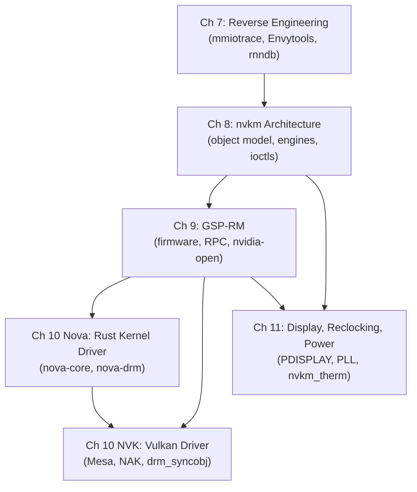

# Part III — The Nouveau Story: Open-Source NVIDIA

The **Linux** graphics stack is built on the premise that every layer — from kernel driver to compositor — can be inspected, audited, and modified. For most GPU vendors this is the default; for **NVIDIA** it has required twenty years of community effort. Part III traces that effort from its methodological foundations through its most recent architectural expressions, occupying the kernel driver tier of the broader stack that Parts I and II established with the **DRM/KMS** subsystem and the **TTM**/**GEM** memory managers. Without this layer, the higher-level APIs covered in Parts IV through VII — **Mesa**, **Vulkan**, **Wayland** compositing — would have no path to the most widely deployed discrete GPU hardware on the Linux desktop.

## Chapters in This Part

**Chapter 7 — Reverse-Engineering NVIDIA Hardware** opens the part by establishing the epistemological foundation on which everything else rests. It explains why **NVIDIA**'s proprietary **nvidia.ko** kernel module was intolerable in a mainline distribution, introduces the **mmiotrace** infrastructure for capturing **MMIO** register traffic, and examines the **Envytools** toolchain — **rnndb/** XML register database, **headergen2**, **envydis**, and **demmt** — that converts raw hardware observations into the symbolic register knowledge used throughout **nvkm**. It also examines the legal framework under **17 U.S.C. §1201(f)** and the EU Computer Programs Directive that protects this work, and closes with the ethical question that **GSP-RM** raises about what "open source" means when firmware blobs become load-bearing. Readers who already understand the politics of binary-only kernel modules can skim Section 1 but should read Sections 2–4 carefully before proceeding, as the symbolic constants and register conventions they introduce are assumed throughout later chapters.

**Chapter 8 — The Nouveau Kernel Driver: nvkm Architecture** is the technical centrepiece of the part. It covers the three-tier **nvkm_device** / **nvkm_subdev** / **nvkm_engine** / **nvkm_object** hierarchy that allows a single codebase to span GPU families from **NV04** through **Ada Lovelace**, the **Falcon** microcontroller abstraction layer in **drivers/gpu/drm/nouveau/nvkm/falcon/**, channel and pushbuffer management, **drm_sched** integration, **TTM**/**drm_gpuvm** memory management, and the full **DRM/KMS** ioctl surface from the legacy **DRM_NOUVEAU_GEM_PUSHBUF** path to the modern **DRM_NOUVEAU_VM_BIND** and **DRM_NOUVEAU_EXEC** ioctls. It explicitly marks where the software-managed path ends and the **GSP-RM**-managed path begins, so that Chapters 9 and 10 can be read as extending rather than replacing the **nvkm** foundation.

**Chapter 9 — GSP-RM, Firmware, and the nvidia-open Connection** examines the 2022 inflection point at which the terms of engagement with **NVIDIA** changed. It covers the **GPU System Processor Resource Manager** (**GSP-RM**) as a complete resource management stack running on a **Falcon** v6 processor embedded in the GPU die, the **RPC** message-queue protocol over dual **256 KB** circular queues in GPU memory, the **`nvkm_gsp`** subdevice hierarchy and the multi-stage boot sequence in **`tu102_gsp_wpr_meta_init()`** and **`tu102_gsp_booter_load()`**, and what the **nvidia-open** module release on May 19, 2022 actually opened versus what it left closed. Feature parity and the security trust model — including **IOMMU**-mediated **DMA** access and the comparison with **AMD PSP** and Intel **GuC**/**HuC** firmware — are addressed directly.

**Chapter 10 (Nova) — Nova: A Rust-Language NVIDIA Kernel Driver** covers the clean-sheet reimplementation introduced in **Linux 6.15**: a two-component **Rust** driver (**nova-core** under `drivers/gpu/nova-core/` and **nova-drm** under `drivers/gpu/drm/nova/`) connected via the **Linux Auxiliary Bus** that treats **GSP-RM** as the sole source of hardware authority for **Turing** and later GPUs. The chapter examines the **Rust** implementation techniques that distinguish **Nova** from **nvkm** — the `Falcon<E: FalconEngine>` generic abstraction, the `FirmwareObject<F, S>` typestate pattern, `PinInit`-based pinned initialization, and `bounded_enum!` for validated hardware enum conversions — and addresses the co-existence path with **Nouveau** and the intended **NVK** backend transition once **nova-drm** reaches **UAPI** stability.

**Chapter 10 (NVK) — NVK: Building a Vulkan Driver from Scratch** examines the userspace counterpart to the kernel work: a clean-slate **Vulkan** driver for **NVIDIA** hardware built within **Mesa**'s modern common infrastructure at **src/vulkan/**. It covers the four-stage shader compilation pipeline from **SPIR-V** through **NIR** to **NAK** (**Nouveau Assembler Kit**) **SASS** output, the bindless global descriptor buffer via **NVIDIA**'s hardware descriptor table, **`DRM_NOUVEAU_EXEC`**-based command submission, synchronisation via **drm_syncobj** and **`VK_KHR_external_semaphore_fd`**, and the generation-stratified conformance story from **Vulkan 1.2** on **Kepler** through **Vulkan 1.4** on **Turing**–**Blackwell**. The chapter also extracts transferable lessons for new **Mesa** Vulkan driver authors.

**Chapter 11 — Nouveau Display, Reclocking, and Power Management** closes the part by examining the three operational concerns that determine whether **NVIDIA** hardware is practically usable under **nouveau**: display output through the **NV50 PDISPLAY** engine (**EVO** on **NV50**–**Maxwell**, **NVDisplay** on **Pascal**+), GPU reclocking through **PLL** clock trees and **VBIOS** P-state tables, and the **`nvkm_therm`** / **`nvkm_volt`** power management subsystem. It explains exactly why reclocking is fully functional on **NV50** and **Fermi**, partial on **Kepler**, and effectively blocked on **Maxwell+** by signed **PMU** firmware, and documents how **GSP-RM** resolves this gap on **Turing** and later.

## How the Chapters Interrelate

The chapters in this part form a strict dependency chain at the conceptual level, even if a reader with specific goals can enter at a later point.

**Chapter 7** is the prerequisite for everything that follows because it establishes where the symbolic register knowledge in **nvkm** and **NVK** comes from. Without understanding the **rnndb/** XML-to-header pipeline, references to **nvkm_rd32** and **BAR0** register constants in Chapters 8 and 11 lack grounding.

**Chapter 8** is the structural backbone of the kernel tier. Its **nvkm_device_chip** chipset descriptor tables, **Falcon** abstraction, and **DRM_NOUVEAU_EXEC**/**DRM_NOUVEAU_VM_BIND** ioctl surface are the interfaces that both **Chapter 9** (extending the kernel driver with **GSP-RM** support) and **Chapter 11** (display and reclocking as **nvkm** subdevices) build directly upon.

**Chapter 9** is the pivot chapter. On the kernel side it explains how **GSP-RM** transforms the driver from a reverse-engineered register programmer into an **RPC** client, which is the prerequisite for understanding **Nova** in Chapter 10 (Nova) — which is a clean-sheet implementation of exactly that client model — and for understanding why **NVK** in Chapter 10 (NVK) achieves full performance only on **Turing+** hardware. On the display and reclocking side it explains why Chapter 11's treatment of **Turing+** is fundamentally different from its treatment of pre-**Turing** hardware.

**Chapter 10 (Nova)** and **Chapter 10 (NVK)** are parallel leaves in the dependency tree: both depend on Chapter 9, and Nova is loosely a prerequisite for the NVK backend discussion since **nova-drm** is the intended future kernel interface for **NVK**. **Chapter 11** depends on Chapter 8 for display subdevice architecture and on Chapter 9 for the **GSP-RM** reclocking path, but is otherwise independent of the Nova and NVK chapters and can be read by operators and integrators who have no interest in userspace driver internals.

Two themes run through all six chapters. First, the boundary between what the open-source community knows from first principles versus what it delegates to signed firmware blobs shifts progressively from Chapter 7 (everything reverse-engineered) through Chapter 9 (firmware as resource manager) to Chapter 10 Nova (firmware as the only permitted authority). Second, the **DRM/KMS** kernel interface established in Chapter 8 — the **drm_sched**, **drm_gpuvm**, **drm_syncobj**, and **DRM_NOUVEAU_EXEC** ioctl surface — is the stable contract that both userspace (**NVK**) and the display subsystem (**Chapter 11**) consume, making Chapter 8 the literal centre of the part.

## Prerequisites and What Comes Next

Readers should arrive here having read Part I (DRM/KMS architecture and kernel mode setting) and Part II (GPU memory management via **TTM** and **GEM**), as those parts establish the **drm_device**, **drm_gem_object**, **drm_sched**, and **drm_syncobj** abstractions that **nvkm**, **Nova**, and **NVK** all build upon. Familiarity with **PCI BAR** addressing and **DMA** coherency from Part II is assumed throughout Chapters 7–9. Parts IV through VII consume the kernel and Mesa interfaces this part defines: Part IV (Mesa and the Gallium/Vulkan stack) builds directly on **NVK** as the modern **NVIDIA** Mesa driver, Part VI (the Wayland compositor stack) relies on the **drm_syncobj** and explicit-sync interfaces established in Chapters 9–10, and the performance and power management picture painted in Chapter 11 provides essential grounding for the profiling and tooling chapters in Part IX.

---
