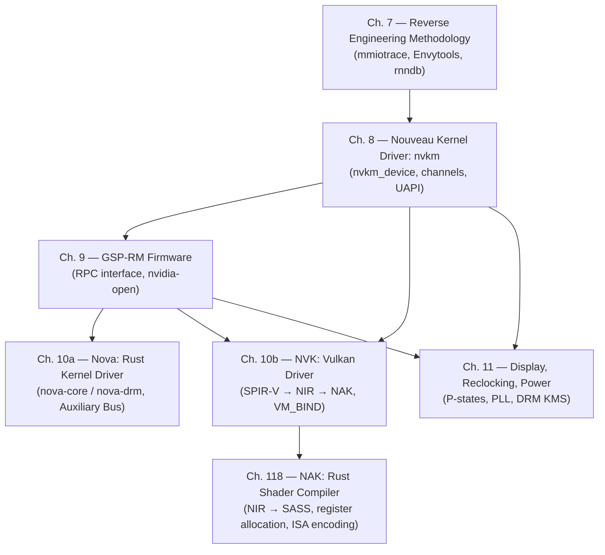

# Part III — The Open NVIDIA Stack

**Audiences:** Systems and driver developers; graphics application developers who need to understand
what makes NVIDIA hardware behave differently from AMD or Intel under open-source drivers.

---

## Table of Contents

1. [A Cautionary Tale — and a Triumph](#a-cautionary-tale--and-a-triumph)
2. [Key Concepts](#key-concepts)
   - [MMIO Registers and the BAR0 Window](#mmio-registers-and-the-bar0-window)
   - [Pushbuffers and the Host FIFO](#pushbuffers-and-the-host-fifo)
   - [PCI BAR Addressing and DMA Coherency](#pci-bar-addressing-and-dma-coherency)
   - [VBIOS, P-states, and PLL Clock Trees](#vbios-p-states-and-pll-clock-trees)
   - [Nouveau UAPI](#nouveau-uapi)
   - [Linux Auxiliary Bus](#linux-auxiliary-bus)
   - [Bindless Global Descriptor Buffer](#bindless-global-descriptor-buffer)
3. [The Narrative Arc of Part III](#the-narrative-arc-of-part-iii)
4. [Chapter Dependency Diagram](#chapter-dependency-diagram)
5. [Where Part III Fits in the Book](#where-part-iii-fits-in-the-book)

---

## A Cautionary Tale — and a Triumph

For the better part of two decades — from the first `nouveau` commits in 2006 through the GSP-RM
open-source release in 2022 — the NVIDIA graphics subsystem on Linux was the most capable GPU
hardware with the least capable open-source driver. Every other GPU class covered in this book
— Intel integrated graphics, AMD Radeon, Qualcomm Adreno, ARM Mali — eventually reached a state
where the open driver matched or approached proprietary performance. NVIDIA did not. The gap was
not the fault of the engineers who wrote Nouveau; it was the direct consequence of a business
decision to withhold hardware documentation while shipping a monolithic binary kernel module that
locked out any co-development.

The community response, sustained over 17 years, was systematic reverse engineering. Engineers
captured MMIO traffic from the proprietary driver using the `mmiotrace` infrastructure
[Source](https://www.kernel.org/doc/html/latest/trace/mmiotrace.html), decoded the register
sequences by hand, and built the Envytools suite — an XML register database (`rnndb/`), a
disassembler for NVIDIA's proprietary microcontroller ISAs (`envydis`), and a capture-analysis
tool (`demmt`) — to turn raw observations into symbolic kernel knowledge
[Source](https://github.com/envytools/envytools). The result was a kernel driver (`nouveau`) that
ran on every NVIDIA GPU since 2004 but could not reclock the GPU to its rated performance because
doing so required VBIOS P-state tables and signed PMU firmware that the community had never seen.

Then, in May 2022, NVIDIA opened the nvidia-open kernel module
[Source](https://developer.nvidia.com/blog/nvidia-releases-open-source-gpu-kernel-modules/), and in
the months that followed, Nouveau acquired the ability to boot using NVIDIA's own GSP-RM firmware,
unlocking reclocking and modern display support on Turing and later GPUs. Simultaneously, Faith
Ekstrand (then at Collabora) began building NVK — a clean-slate Vulkan driver for NVIDIA hardware
inside Mesa — that reached Vulkan 1.0 conformance in 2023 and has since become the recommended
path for open-source NVIDIA rendering [Source](https://www.collabora.com/news-and-blog/news-and-events/introducing-nvk.html).
The contrast with RADV (AMD's open Vulkan driver, written with full hardware documentation and
AMD engineering support, reaching conformance in roughly two years) illustrates the cost of
documentation: NVK required roughly the same calendar time as RADV, but only became possible
*after* the firmware documentation gap was partially closed by GSP-RM.

Part III tells this story in seven chapters: from the methodology of reverse engineering (Ch. 7),
through the nvkm kernel driver architecture (Ch. 8), the GSP-RM firmware turning point (Ch. 9),
the Nova clean-sheet Rust driver (Ch. 10a), the NVK Vulkan driver (Ch. 10b), the NAK Rust shader
compiler that forms the shader-compilation half of the NVK stack (Ch. 118), and finally the
display, reclocking, and power management picture that ties the hardware to the Linux power
management framework (Ch. 11). It is not merely a "how does the driver work" account — it is a
record of how an open driver was built despite systematic obstacles, and what the architecture
looks like now that those obstacles have partly lifted.

---

## Key Concepts

The following concepts are specific to NVIDIA hardware and the Nouveau/NVK approach. Later
chapters assume familiarity with them.

### MMIO Registers and the BAR0 Window

A **Memory-Mapped I/O (MMIO) register** is a GPU control register exposed at a fixed physical
address. The kernel maps this address into virtual address space with `ioremap()`, producing a
pointer through which register reads and writes generate PCIe transactions to the GPU. NVIDIA GPUs
expose their primary register file through **BAR0** (Base Address Register 0), a 16 MB or 32 MB
PCIe aperture that maps the NV_PBUS, NV_PFIFO, NV_PGRAPH, NV_PMC, and related register blocks.
Nouveau accesses this window through `nvif_rd32()` / `nvif_wr32()` which ultimately call
`ioread32()` / `iowrite32()` on the BAR0 mapping
[Source](https://github.com/torvalds/linux/blob/master/drivers/gpu/drm/nouveau/include/nvif/io.h).
A second aperture, **BAR1**, maps a configurable window into GPU VRAM that the CPU can read and
write directly — important for buffer allocation strategies where avoiding PCIe round-trips
matters. Chapter 7 explains how `mmiotrace` captures every BAR0 access the proprietary driver
makes, and Chapter 8 shows how those captured sequences are encoded as register operations in the
`nvkm` object model.

### Pushbuffers and the Host FIFO

NVIDIA GPUs do not accept individual register writes as rendering commands. Instead, the driver
assembles a **pushbuffer**: a contiguous block of GPU-accessible memory containing a stream of
*methods* — 32-bit words encoding (subchannel ID, method offset, data) tuples — that the GPU's
**host FIFO (PFIFO)** engine reads and dispatches to the appropriate hardware engine (graphics,
compute, copy). This is NVIDIA's equivalent of AMD's ring buffer or Intel's batchbuffer. The
driver submits work by writing the pushbuffer's GPU virtual address and length into a channel
control structure, then doorbell-ringing the PFIFO to schedule it.

In Nouveau, the pushbuffer mechanism is managed through `nvkm_chan` (channel) objects and the
`drm_sched` GPU scheduler [Source](https://github.com/torvalds/linux/blob/master/drivers/gpu/drm/nouveau/nvkm/engine/fifo/). The
modern userspace interface — `DRM_IOCTL_NOUVEAU_EXEC` — accepts an array of push buffer
descriptors from NVK and submits them as a single scheduler job. Understanding the pushbuffer
model is essential for Chapter 8 (how nvkm manages channels) and Chapter 10b (how NVK builds
command streams before submitting them).

### PCI BAR Addressing and DMA Coherency

PCIe **Base Address Registers (BARs)** are the physical address windows through which the CPU
accesses GPU resources. Beyond BAR0 (MMIO registers) and BAR1 (VRAM aperture), NVIDIA GPUs
expose a BAR2 aperture used for privileged register access (the DP/PRIV region). GPU drivers
declare a **DMA mask** (`dma_set_mask_and_coherent(dev, DMA_BIT_MASK(40))` or 64-bit equivalent)
to tell the kernel which address bits the GPU's DMA engine can use when writing into system RAM.

**DMA coherency** on PCIe is asymmetric: the GPU can write to system RAM via posted PCIe writes
that are not guaranteed to be visible to the CPU until the CPU executes a memory barrier (a fence)
or reads a completion register. This is why Nouveau's fence infrastructure exists: the GPU writes
a *fence value* to a system RAM location as the final operation in a pushbuffer, and the CPU
polls that location (or sleeps on it via `drm_syncobj` timeline semantics) to know when GPU work
is complete. Chapter 4 covers the DMA-BUF and implicit-sync fence infrastructure; Chapter 8
explains how Nouveau implements these abstractions.

### VBIOS, P-states, and PLL Clock Trees

The **Video BIOS (VBIOS)** is a firmware blob stored in a SPI flash chip on the GPU PCB and
shadowed into BAR0 at a fixed offset (typically `0x619xxx` on pre-Turing GPUs). It contains
tables describing the GPU's **performance states (P-states)**: P0 is maximum performance, P8 (or
higher) is idle/minimum. Each P-state entry records target frequencies for the GPU's clock
domains — GPC clock (shader clock), memory clock, and display clocks — as well as voltage targets
and fan speed parameters.

Clock generation uses **Phase-Locked Loop (PLL)** circuits. Each PLL multiplies a reference
oscillator (typically 27 MHz) by a rational factor encoded as a (M, N, P) coefficient triple.
Computing the correct PLL coefficients for a target frequency, writing them to the appropriate
BAR0 registers, and verifying phase lock is a multi-step sequence that requires knowing the
frequency limits of each PLL (found in the VBIOS). Because this table was never documented,
Nouveau could only reclock NV50 and Fermi GPUs (where the PLL sequence was fully reverse-engineered)
and could not boost Maxwell and later GPUs to their rated clocks without signed PMU firmware.
Chapter 11 covers reclocking in detail; Chapter 9 explains how GSP-RM finally resolves this gap.

### Nouveau UAPI

Nouveau exposes its kernel interface to userspace via DRM ioctls defined in
[`include/uapi/drm/nouveau_drm.h`](https://github.com/torvalds/linux/blob/master/include/uapi/drm/nouveau_drm.h).
The legacy ioctls (`DRM_IOCTL_NOUVEAU_GETPARAM`, `DRM_IOCTL_NOUVEAU_GEM_NEW`,
`DRM_IOCTL_NOUVEAU_GEM_PUSHBUF`) support the old Mesa GL driver. NVK uses a newer UAPI:
`DRM_IOCTL_NOUVEAU_VM_BIND` for GPU virtual address space management (allocating and mapping BO
ranges without a per-submission address fixup), and `DRM_IOCTL_NOUVEAU_EXEC` for command
submission with explicit `drm_syncobj` timeline acquire/release points. This VM_BIND-style UAPI
mirrors the direction taken by `i915` (for `xe`) and `amdgpu`; it permits the userspace driver to
manage a persistent GPU virtual address space and submit GPU work with explicit synchronisation
rather than relying on the kernel to emit implicit fence completions. Chapter 8 covers both the
old and new UAPI; Chapter 10b shows how NVK uses the new UAPI.

### Linux Auxiliary Bus

The **Linux Auxiliary Bus** (`drivers/base/auxiliary.c`) is a kernel mechanism for a parent
driver to create child sub-devices that bind their own separate drivers
[Source](https://www.kernel.org/doc/html/latest/driver-api/auxiliary_bus.html). A parent calls
`auxiliary_device_register()` to publish a named sub-device; a child driver calls
`auxiliary_driver_register()` and the kernel's probe machinery matches and binds them. NVIDIA uses
this in `nvidia-open` to split the kernel module into functional units; Nouveau uses it to
register the `nvkm_gsp` GSP-RM sub-device (which loads the GSP firmware and owns the RPC
channel) as an auxiliary child of the top-level `nvkm_device`. In Nova, the split between
`nova-core` (GSP firmware management, auxiliary device provider) and `nova-drm` (DRM interface,
auxiliary driver consumer) is the central architectural seam. Chapter 9 explains the GSP-RM use
of the auxiliary bus in depth; Chapter 10a (Nova) is built around it.

### Bindless Global Descriptor Buffer

Vulkan descriptor sets on most hardware are allocated from a pool, laid out in a format the driver
and hardware agree on, and bound to the pipeline before a draw call. NVIDIA's hardware supports a
**bindless** model where the shader directly indexes into a **global descriptor table** stored in
GPU VA space — a single large buffer in which each descriptor slot holds a (GPU VA, size, format)
tuple that the hardware can dereference without explicit descriptor set binding. NVK exploits this
to implement Vulkan descriptor sets efficiently: rather than copying descriptor data into a
hardware-specific layout at vkUpdateDescriptorSets time, NVK writes descriptors into a
heap-allocated slot in the global buffer and encodes the buffer address as a 64-bit push constant.
This eliminates descriptor set copies during `vkCmdBindDescriptorSets` for many workloads and
is a significant architectural divergence from AMD RADV, which must program hardware descriptor
tables via userspace ring buffer writes. Chapter 10b examines this in detail within NVK's
descriptor set implementation.

---

## The Narrative Arc of Part III

The seven chapters form a progression from epistemology to architecture to application:

**Chapter 7 — Reverse Engineering NVIDIA: History and Methodology** establishes where the
knowledge in everything that follows comes from. It is a chapter about method: how `mmiotrace`
works, how Envytools turns captured traces into a symbolic register database, how that database
becomes the header constants referenced throughout `nvkm`. It is also a chapter about limits: why
17 years of reverse engineering was insufficient to fully close the reclocking gap, and what that
tells us about the fundamental information asymmetry between a hardware vendor and an open-source
community without hardware documentation.

**Chapter 8 — The Nouveau Kernel Driver: nvkm Architecture** is the structural centre of the
part. It covers the `nvkm_device` / `nvkm_subdev` / `nvkm_engine` object hierarchy, Falcon
microcontroller abstractions, channel and pushbuffer management, `drm_sched` integration, and
the full DRM UAPI surface. The kernel abstractions Chapter 8 defines — channels, fences,
`drm_gpuvm` mappings — are the interfaces that Chapters 9, 10a, 10b, and 11 all build upon.

**Chapter 9 — GSP-RM, Firmware, and the nvidia-open Connection** is the pivot. It explains what
changed in 2022: NVIDIA's GPU System Processor runs a complete resource manager (GSP-RM) on an
embedded Falcon v6 core, exposing an RPC interface over dual 256 KB ring queues. The nvidia-open
release opened the host-side RPC client code; Nouveau acquired GSP-RM support shortly after.
Chapter 9 also draws the honest boundary between what is now open and what remains in signed
firmware blobs, and compares the trust model to AMD PSP and Intel HuC/GuC.

**Chapter 10a — Nova: The Rust NVIDIA Kernel Driver** examines the clean-sheet reimplementation
introduced in Linux 6.15. Nova treats GSP-RM as the sole hardware authority and encodes that
trust boundary in Rust's type system — `FirmwareObject<F, Loaded>` typestate, `PinInit`-based
pinned initialisation, `bounded_enum!`-validated hardware constants. The nova-core / nova-drm
split across the Linux Auxiliary Bus is the architectural statement: the two components have
different stability contracts and can evolve independently.

**Chapter 10b — NVK: Building a Vulkan Driver from Scratch** covers the Mesa counterpart. NVK
is what a Vulkan driver looks like when its authors can choose freely — no legacy GL state tracker
to preserve, no hardware workarounds inherited from a prior generation. The SPIR-V → NIR → NAK
(Nouveau Assembler Kit) shader compilation pipeline, the bindless descriptor heap, and VM_BIND
command submission are designed together rather than retrofitted. NVK also provides a worked
example of how to use Mesa's Vulkan common infrastructure, valuable to anyone writing a new Mesa
Vulkan driver.

**Chapter 118 — NAK: The Rust Shader Compiler for NVIDIA GPUs** is the shader-compilation half
of the NVK story. NVK hands compiled shaders off to NAK — the Nvidia Awesome Kompiler — which
ingests NIR, applies NVIDIA-specific optimization and lowering passes, allocates registers across
NVIDIA's banked GPR file and (on Turing+) the uniform register file, schedules instructions for
latency hiding, and emits binary SASS for Maxwell through Hopper ISAs. NAK is Mesa's first GPU
compiler backend written in Rust, merged in Mesa 24.0 (February 2024), and its clean
SSA-throughout design replaced the legacy nv50_ir C++ backend that could not correctly target
Turing or later GPU generations. The chapter covers NAK's IR design, its NIR-to-SASS lowering
pipeline (including `nak_compile_shader()` at the NVK call boundary), register allocation
correctness improvements over nv50_ir, Rust-in-Mesa FFI mechanics, and NAK's influence on
subsequent Mesa Rust compiler efforts such as KRAID (ARM Mali Valhall).

**Chapter 11 — Display, Reclocking, and Power Management** closes the part by anchoring the
hardware concerns that affect every NVIDIA user on Linux: can the display engine drive the
connected monitor correctly, can the GPU clock up to its rated performance, and does it idle
efficiently when not under load? The answer varies significantly by GPU generation — fully yes on
Turing+ with GSP-RM, partially on Maxwell/Pascal, and fully reverse-engineered only on NV50/Fermi.
Chapter 11 explains why the boundary falls where it does.

---

## Chapter Dependency Diagram

The diagram below shows the reading dependencies among Part III chapters. An arrow from A to B
means B builds on concepts or interfaces introduced in A.

Ch. 118 (NAK) depends on Ch. 10b (NVK) because NAK is the shader-compilation backend that NVK
invokes via `nak_compile_shader()`; understanding NVK's pipeline layout and descriptor model
provides the necessary context for why NAK's NIR ingestion interface is designed the way it is.
Readers focused specifically on compiler internals may read Ch. 118 after Ch. 7 (for ISA
background from Envytools) and before Ch. 10b, treating NVK as the consumer rather than the
prerequisite.

---

## Where Part III Fits in the Book

Part III occupies the same tier as Part II (GPU Drivers) in the kernel stack, but at a finer
granularity: where Part II surveys multiple GPU vendor drivers at a structural level, Part III
traces one vendor's driver in depth precisely because that driver's history is the most
illuminating case study in the cost of closed hardware documentation. The contrast with AMD (whose
RADV driver was written with hardware specifications and reached conformance quickly) and Intel
(whose open driver predates Mesa itself) is drawn explicitly in Chapter 7 and revisited in Chapter
10b.

Parts IV and V (Mesa Architecture, Mesa GPU Drivers) consume the kernel and Mesa interfaces this
part defines: NVK sits within the Part V Vulkan driver layer, and the GPU UAPI surface from
Chapter 8 is the kernel interface those Mesa chapters assume exists. NAK (Ch. 118) is also the
shader-compiler half of that driver layer — the NIR-to-SASS pipeline it defines is the NVIDIA
analogue of the NIR-to-ISA backends covered for AMD (ACO) and Intel (brw/elk) in Part V. Part VI
(Display Stack) relies on the `drm_syncobj` explicit-sync infrastructure explained in Chapters
9–10, which is what finally enabled first-class NVIDIA Wayland support. The power management
picture in Chapter 11 provides context for the profiling and tuning chapters in Part IX. NAK's
Rust-in-Mesa integration pattern (Chapter 118) is also a cross-cutting reference for Part IV
(Mesa Architecture) chapters that address the Mesa build system and compiler infrastructure.

Readers arriving directly at Part III should have read Parts I and II, particularly the DRM/KMS
architecture (Ch. 1–2), GPU memory management (Ch. 4), and the structural GPU driver survey
(Ch. 5). Those chapters establish the `drm_device`, `drm_gem_object`, `drm_sched`, and
`drm_syncobj` abstractions that nvkm, Nova, and NVK all build upon.

---

*Part III spans Chapters 7–11 and Chapter 118, totalling seven chapters and approximately 90–120 pages.*
