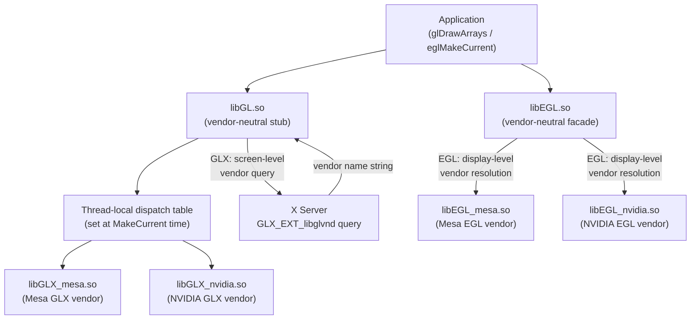
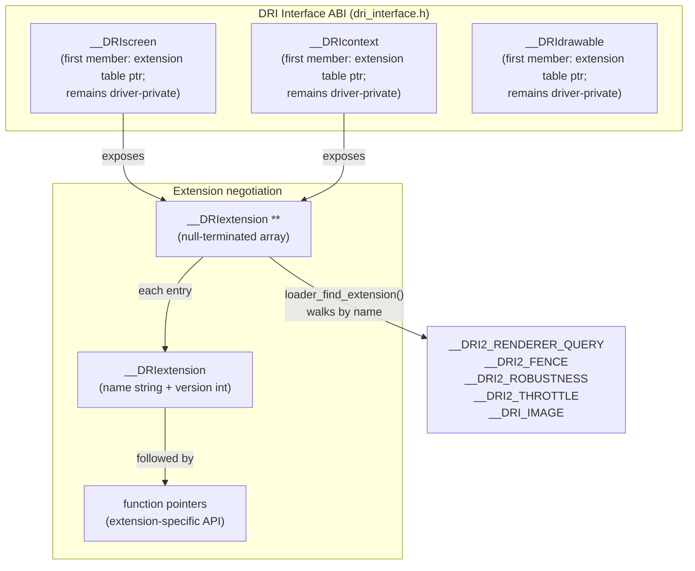
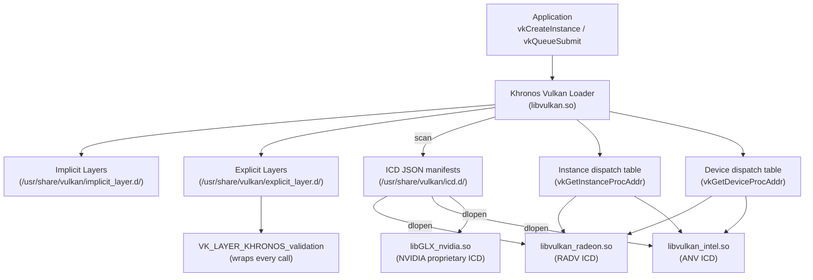
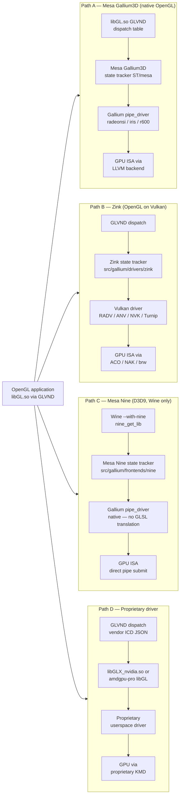
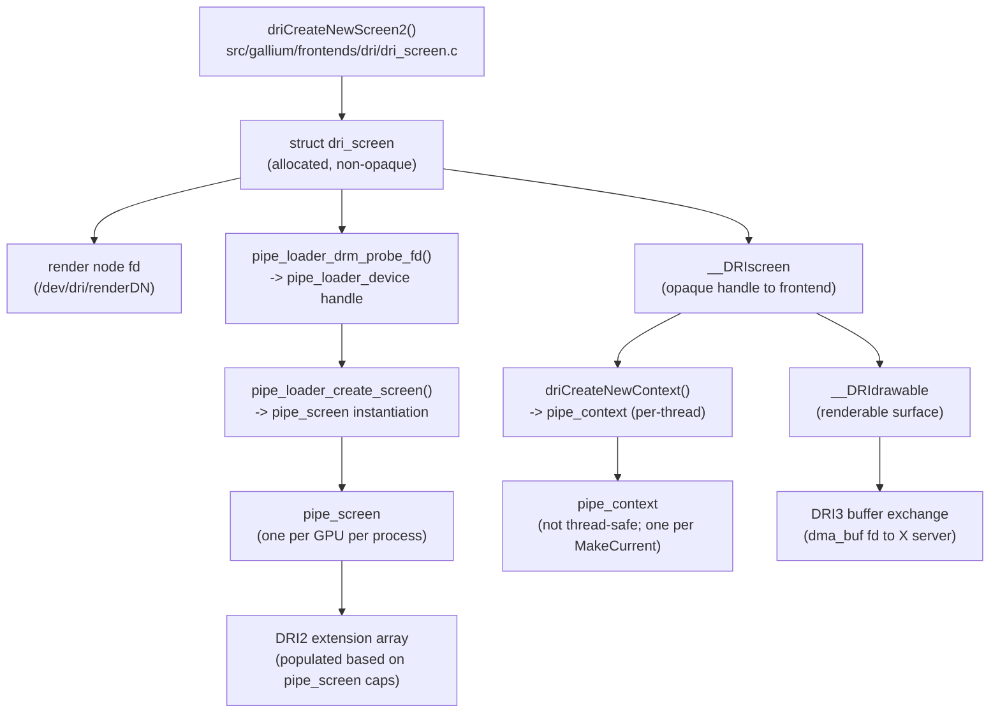
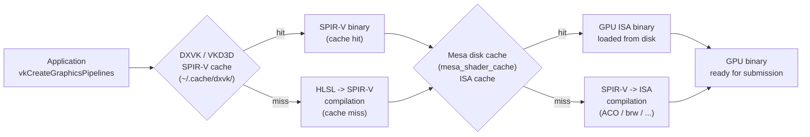
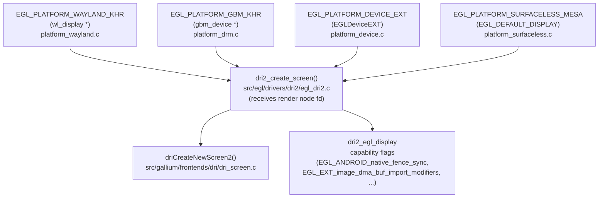

# Chapter 12: The Mesa Loader and Driver Dispatch

> **Part**: Part IV — Mesa Architecture
> **Audience**: Both — systems developers need the dispatch internals; application developers need the driver selection and coexistence model to understand why `VK_ICD_FILENAMES` or `MESA_LOADER_DRIVER_OVERRIDE` sometimes matters to them
> **Status**: First draft — 2026-06-06

## Table of Contents

- [Overview](#overview)
- [1. The OpenGL Dispatch Problem](#1-the-opengl-dispatch-problem)
- [2. Mesa's Entry Points and Frontend Architecture](#2-mesas-entry-points-and-frontend-architecture)
- [3. The Vulkan ICD and Loader Model](#3-the-vulkan-icd-and-loader-model)
- [4. Mesa's OpenGL Driver Selection](#4-mesas-opengl-driver-selection)
- [5. The DRI Screen, Context, and Drawable Lifecycle](#5-the-dri-screen-context-and-drawable-lifecycle)
- [6. Mesa's Disk Shader Cache](#6-mesas-disk-shader-cache)
- [7. Steam Shader Pre-Compilation and Cache Warming](#7-steam-shader-pre-compilation-and-cache-warming)
- [8. EGL Platform Architecture: From Display Handle to DRI Screen](#8-egl-platform-architecture-from-display-handle-to-dri-screen)
- [Integrations](#integrations)
- [References](#references)

---

## Overview

Before any shader compiles or any triangle rasterises, a significant machinery of dispatch and loader code runs to connect an application's **glDrawArrays** or **vkQueueSubmit** call to the correct GPU driver. This chapter dismantles that machinery in precise technical detail, covering both the **OpenGL** and **Vulkan** dispatch paths. Understanding this infrastructure is essential for anyone debugging driver selection, writing multi-GPU software, or optimising startup-time shader compilation.

On the **OpenGL** side, the chapter traces the historical evolution from a world where **libGL.so** was simultaneously the API definition and the implementation — making proprietary and open-source drivers mutually exclusive — to the **GLVND** (GL Vendor-Neutral Dispatch) solution that allows multiple **OpenGL** vendors to coexist on a single system. The **GLVND** model splits **libGL.so** into a vendor-neutral stub and per-vendor libraries such as **libGLX_mesa.so** and **libGLX_nvidia.so**, dispatching through a per-thread dispatch table set at **glXMakeCurrent** or **eglMakeCurrent** time. For **EGL**, vendor association happens at the display level via JSON vendor configuration files such as **50_mesa.json** in `/usr/share/glvnd/egl_vendor.d/`; the `__EGL_VENDOR_LIBRARY_DIRS` and `__EGL_VENDOR_LIBRARY_FILENAMES` environment variables override the search path. **EGL** dispatch within **GLVND** routes calls through **libEGL.so** to **libEGL_mesa.so** or the vendor equivalent based on the platform handle. **Mesa**'s role as a registered **GLVND** vendor, the **DRI** interface **ABI** defined in `include/GL/internal/dri_interface.h` (covering **__DRIscreen**, **__DRIcontext**, and **__DRIdrawable**), and the removal of all classic (non-**Gallium**) **DRI** drivers in **Mesa** 22 — including the Intel **i965** Classic, AMD **r100**/**r200**, and classic **nouveau** — are covered in depth.

**Mesa**'s entry-point and frontend architecture centres on the **Mesa** loader library in `src/loader/`, whose primary function **loader_get_driver_for_fd()** maps a **DRM** render node file descriptor to a driver name string by checking `MESA_LOADER_DRIVER_OVERRIDE`, consulting per-driver **PCI** ID tables such as **amd_pci_ids.h** and **intel_device_info.c**, and falling back to **drmGetVersion()**. Driver shared objects — named `<driver>_dri.so` (e.g., **radeonsi_dri.so**, **iris_dri.so**, **swrast_dri.so**) — are located via `LIBGL_DRIVERS_PATH` or the compiled-in `$DRI_DRIVER_SEARCH_DIR`. The chapter covers the full driver name resolution table for major hardware including **radeonsi** (**AMD** **GCN**+), **iris** (Intel **Gen8**+), **crocus** (Intel **Gen4**–**Gen7**), **r600** (pre-**GCN** **AMD**), **nouveau** (**NVIDIA**), and **virtio_gpu** (virtualised). The **Kopper** interface, merged into **Mesa** in 2022, is also explained: it is a **DRI** interface extension that allows **Zink** (**Mesa**'s **OpenGL**-over-**Vulkan** implementation) to create a **VkSurfaceKHR** and manage presentation through the **Vulkan WSI** stack — bypassing the **DRI2**/**DRI3** buffer exchange path — via `src/gallium/frontends/dri/kopper.c`.

On the **Vulkan** side, the **Khronos Vulkan** loader (**libvulkan.so**) is a separate project from **Mesa**. **Mesa** ships **Installable Client Drivers** (**ICD**s) — shared objects such as **libvulkan_radeon.so** (**RADV**) and **libvulkan_intel.so** (**ANV**) — accompanied by **JSON** discovery manifests in `/usr/share/vulkan/icd.d/`. The chapter explains **ICD** enumeration and `dlopen()` loading, the **vk_icdNegotiateLoaderICDInterfaceVersion** version-negotiation handshake, instance dispatch tables (populated via **vkGetInstanceProcAddr**) and device dispatch tables (populated via **vkGetDeviceProcAddr**), and the layer injection mechanism via **VK_LAYER_KHRONOS_validation** and manifest directories `/usr/share/vulkan/implicit_layer.d/` and `/usr/share/vulkan/explicit_layer.d/`. Multi-**GPU** systems and the environment variables that control **ICD** enumeration — `VK_ICD_FILENAMES`, `VK_DRIVER_FILES`, `VK_LAYER_PATH`, `VK_INSTANCE_LAYERS`, and `MESA_VK_DEVICE_SELECT` — are also detailed.

**Mesa**'s **OpenGL** driver selection covers the **DRI_PRIME** render-offload mechanism for hybrid-**GPU** laptops (selecting a non-default **GPU** by index, **PCI** bus address such as `pci-0000_01_00_0`, or the `DRI_PRIME=list` diagnostic mode) and the **driconf** per-application configuration system, which applies **XML**-based workarounds from `/usr/share/drirc.d/00-mesa-defaults.conf` and `~/.drirc` via **driParseConfigFiles()** in `src/util/xmlconfig.c`.

The **DRI** screen, context, and drawable lifecycle is traced from **driCreateNewScreen2()** in `src/gallium/frontends/dri/dri_screen.c` through **pipe_loader_drm_probe_fd()** and **pipe_loader_create_screen()** to the **Gallium** **pipe_screen** object. Context creation via **driCreateNewContext()** produces a **pipe_context** subject to the single-thread constraint enforced by the **EGL**/**GLX** make-current mechanism. Drawables and the **DRI3** buffer exchange protocol — using **dma_buf** file-descriptor passing via **xcb_dri3_pixmap_from_buffers** and **DRM** format modifier negotiation via **xcb_dri3_get_supported_modifiers** — replace the older **DRI2** protocol. **EGL** window surfaces on **Wayland** use the **zwp_linux_dmabuf_v1** protocol and a small buffer queue per surface; the **EGL_EXT_buffer_age** extension and **eglSetDamageRegionKHR()** enable partial-update optimisations, and the **__DRI2throttleExtension** ties **eglSwapInterval** to real **GPU**-scheduler feedback.

The chapter then covers **Mesa**'s disk shader cache, which amortises the expensive **SPIR-V**-to-machine-code compilation step — involving **NIR** optimisation passes and backend code generation (**ACO** for **RADV**, **brw** for **ANV**) — by storing compiled binaries in `$XDG_CACHE_HOME/mesa_shader_cache`. Cache key construction uses **SHA-1** over a driver identifier string, the `.note.gnu.build-id` **Mesa** binary hash, a `driver_keys_blob` encoding **GPU** family and compiler flags, and the shader source hash. Cache entries use an atomic `rename()` write strategy; size limits default to 1 GiB and are controlled by `MESA_SHADER_CACHE_MAX_SIZE` with **LRU** eviction. `MESA_SHADER_CACHE_DISABLE` and `MESA_SHADER_CACHE_SHOW_STATS` are the primary diagnostic environment variables. The Steam shader pre-caching system is also explained: Valve pre-compiles shader caches for known **GPU**/driver combinations (**AMD** **GCN**, **RDNA**, Intel **Xe**, etc.) and distributes them before first launch. The two-layer caching architecture — **DXVK** (`~/.cache/dxvk/`) and **VKD3D-Proton** (`VKD3D_SHADER_CACHE_PATH`) caching the **HLSL**-to-**SPIR-V** step above **Mesa**'s **ISA** cache — is diagrammed. **VK_EXT_graphics_pipeline_library** (**GPL**), supported by **RADV** and **ANV**, enables staged pipeline compilation and the "fast link then async replace" strategy that reduces first-draw hitching; `RADV_PERFTEST=gpl` enables it explicitly.

Finally, the **EGL** platform architecture is examined: the four production platforms — **EGL_PLATFORM_WAYLAND_KHR** (`platform_wayland.c`, using **wl_display \*** and **zwp_linux_dmabuf_v1**), **EGL_PLATFORM_GBM_KHR** (`platform_drm.c`, using **gbm_device \*** for direct **KMS**/**DRM** rendering), **EGL_PLATFORM_DEVICE_EXT** (`platform_device.c`, using **EGLDeviceEXT** handles enumerated via **eglQueryDevicesEXT()** for headless rendering), and **EGL_PLATFORM_SURFACELESS_MESA** (`platform_surfaceless.c`, using **EGL_DEFAULT_DISPLAY** for surfaceless compute) — all converge at **dri2_create_screen()** in `src/egl/drivers/dri2/egl_dri2.c`. Automatic platform detection from `WAYLAND_DISPLAY` and `DISPLAY` environment variables, headless **GPU** selection via **EGL_DRM_DEVICE_FILE_EXT**, **GBM**-backed surfaces for direct **KMS** scanout using **gbm_surface_create_with_modifiers2()** and **drmModeAddFB2WithModifiers()**, **Wayland** modifier negotiation via **zwp_linux_dmabuf_v1_get_default_feedback** for direct scanout, and **EGL_EXT_buffer_age** semantics under double and triple buffering are all covered.

After reading this chapter, the reader will understand: why multiple **OpenGL** vendors can coexist on one system without overwriting each other's **libGL.so**; how a **vkCreateInstance** call reaches **RADV** on an **AMD** **GPU** versus the proprietary **NVIDIA** **ICD** on a hybrid laptop; exactly where in the call stack **Mesa** selects a hardware driver; and what lands on disk when **Mesa** caches a compiled shader program.

---

## 1. The OpenGL Dispatch Problem

The fundamental tension in OpenGL deployment on Linux has always been that the OpenGL specification defines a single flat namespace of functions — `glBegin`, `glDrawArrays`, `glCreateShader` — yet multiple competing implementations must be able to coexist on one machine. For most of Linux's history, this was resolved by an informal convention: there was only ever one `libGL.so` installed, and it belonged to whichever driver owned the system. Installing the NVIDIA proprietary driver meant replacing Mesa's `libGL.so`; switching back required a reverse replacement. Package managers tried to manage this with alternatives systems, but the fundamental problem was architectural: the API library and the driver were fused into a single shared object.

The practical consequences were severe for users who needed both. A Wayland compositor using Mesa's `libEGL.so` for display composition would break if a user installed the proprietary NVIDIA driver. Scientists running CUDA applications alongside OpenGL workloads had to choose one or accept a fragile cohabitation managed by wrapper scripts. The problem is not hypothetical: it was the dominant complaint in Linux graphics for over a decade.

### The GLVND Solution

The GL Vendor-Neutral Dispatch library (GLVND), developed by NVIDIA and now hosted at `https://github.com/NVIDIA/libglvnd`, solves this by splitting the API library into two layers. The top layer is a thin, vendor-neutral `libGL.so` that provides the OpenGL entry points as stubs. This library does not implement OpenGL; it dispatches to a vendor library. The bottom layer consists of vendor-specific shared objects — named `libGLX_mesa.so` and `libGLX_nvidia.so` by convention — that contain the actual GL implementation for a particular driver.

The dispatch mechanism works per-context. When an application calls `glXMakeCurrent` or `eglMakeCurrent`, the GLVND layer records which vendor library owns the current context in a thread-local variable. Subsequent OpenGL calls on that thread are routed to the thread-local dispatch table, which was populated by the vendor library when the context was made current. This means two threads can simultaneously use different vendor implementations — one thread using Mesa for a software renderer, another using NVIDIA for compute — without interference.

For GLX specifically, the vendor association happens at the screen level: GLVND sends a `GLX_EXT_libglvnd` query to the X server to discover which vendor is responsible for a given `(Display, screen)` pair. The X server's GLX extension is augmented to respond with a vendor name string, and GLVND then loads the corresponding `libGLX_<vendor>.so` library. This query result is cached per display connection. For EGL, the vendor association happens at the display level: each call to `eglGetPlatformDisplayEXT` resolves to exactly one EGL vendor library, and all subsequent EGL operations on that display stay within that vendor's code.



### Mesa as a GLVND Vendor

Mesa participates in GLVND by installing JSON vendor configuration files. On an EGL system, Mesa installs `/usr/share/glvnd/egl_vendor.d/50_mesa.json`, which tells the GLVND runtime that `libEGL_mesa.so.0` is available as an EGL vendor. The filename prefix `50_` is a load-order hint; lower-numbered files are tried first, and `50_` gives NVIDIA (`10_nvidia.json`) priority on hybrid systems while ensuring Mesa is found on AMD and Intel systems. The JSON file format mirrors the Vulkan ICD manifest pattern: it names the library and the highest EGL version it supports.

On the GLX side, Mesa builds `libGLX_mesa.so` when configured with GLVND support, and the GLX_EXT_libglvnd extension in the Xorg server maps DRI-based screens to the Mesa vendor. Building Mesa with `-Dglvnd=true` in the Meson configuration activates these components; most distribution builds enable this flag.

The `__EGL_VENDOR_LIBRARY_DIRS` environment variable overrides the search path for EGL vendor JSON files, and `__EGL_VENDOR_LIBRARY_FILENAMES` specifies an explicit comma-separated list of JSON files. These are the GLVND-level override mechanisms — distinct from the Mesa-level `MESA_LOADER_DRIVER_OVERRIDE`, which operates one layer deeper.

### EGL Dispatch Within GLVND

Within the GLVND EGL path, `libEGL.so` is the vendor-neutral façade. When an application calls `eglGetPlatformDisplayEXT(EGL_PLATFORM_GBM_KHR, gbm_device, NULL)`, the GLVND EGL layer examines the platform enum and the native display handle to determine which vendor to route the call to. For Mesa-owned displays — those backed by a Mesa-opened DRM file descriptor — the call passes through to `libEGL_mesa.so`. From that point, all subsequent EGL operations on that display are handled entirely within Mesa's EGL implementation. The GLVND layer becomes invisible.

This architecture answers the "which driver am I using?" question that confuses many developers: if `glGetString(GL_RENDERER)` returns a Mesa renderer string, the thread's dispatch table is pointing into Mesa's vendor library. If it returns an NVIDIA renderer string, it points into the NVIDIA vendor library. Both can be true simultaneously in different threads of the same process.

---

## 2. Mesa's Entry Points and Frontend Architecture

Mesa's frontend architecture is a layered system in which the high-level API (GLX or EGL) delegates through a standardised DRI interface to a Gallium driver backend. The two boundary surfaces — the API-facing surface and the driver-facing surface — are defined by the DRI interface header and have been deliberately kept stable to allow binary separation between Mesa versions and system-installed drivers.

### The Mesa Loader Library

The `src/loader/` directory contains a small library — `loader.c`, `loader_dri_helper.c`, and associated headers — that performs the critical task of mapping a DRM render node file descriptor to a driver name string. This library is used by the GLX frontend, the EGL frontend, and the Vulkan frontends. Its primary public function is `loader_get_driver_for_fd()`.

The function accepts a file descriptor for a DRM device node (typically `/dev/dri/renderD128`) and returns a heap-allocated string naming the appropriate Mesa driver. The resolution strategy has several stages. First, the function checks the `MESA_LOADER_DRIVER_OVERRIDE` environment variable; if set, its value is returned immediately, bypassing all hardware detection. Second, it calls `drmGetVersion()` to retrieve the kernel DRM driver name — the name the kernel module registers with the DRM subsystem. For most AMD hardware, this is `amdgpu`; for Intel it is `i915`; for NVIDIA it is `nouveau`. Third, for PCI devices, it calls `loader_get_pci_id_for_fd()` to retrieve the vendor and device IDs, then consults a per-driver PCI ID table to map the hardware to its Mesa driver name.

```c
/* Source: src/loader/loader.c — loader_get_driver_for_fd() */
char *
loader_get_driver_for_fd(int fd)
{
   int vendor_id, chip_id;
   const char *override;
   char *driver;

   /* Environment variable override: useful for debugging and sw rendering */
   override = getenv("MESA_LOADER_DRIVER_OVERRIDE");
   if (override)
      return strdup(override);

   /* Try PCI ID lookup first: maps (vendor_id, chip_id) -> driver name */
   if (loader_get_pci_id_for_fd(fd, &vendor_id, &chip_id)) {
      driver = loader_get_driver_for_pci_id(vendor_id, chip_id);
      if (driver)
         return driver;
   }

   /* Fall back to kernel module name via drmGetVersion */
   drmVersionPtr version = drmGetVersion(fd);
   if (version) {
      driver = strndup(version->name, version->name_len);
      drmFreeVersion(version);
      return driver;
   }

   /* Final fallback: software rasteriser */
   return strdup("swrast");
}
```

The PCI ID tables are maintained per-driver. AMD hardware IDs live in `src/amd/common/amd_pci_ids.h`; Intel IDs are in `src/intel/dev/intel_device_info.c`; other drivers maintain similar tables within their source subtrees. The mapping is from PCI `(vendor_id, device_id)` to a driver name string such as `radeonsi`, `iris`, `nouveau`, `virtio_gpu`, or `etnaviv`. On ARM platforms lacking PCI, the loader uses a separate KMSRO (kernel modesetting render offload) table that maps display-only drivers — `vc4`, `lima`, `panfrost` — to separate render drivers.

```mermaid
graph TD
    FD["DRM render node fd\n(e.g. /dev/dri/renderD128)"]
    EnvCheck{"MESA_LOADER_DRIVER_OVERRIDE\nset?"}
    Override["return override string\n(bypass all detection)"]
    PCICheck{"loader_get_pci_id_for_fd()\nsucceeds?"}
    PCITable["PCI ID table lookup\n(amd_pci_ids.h,\nintel_device_info.c, ...)"]
    DRMVer["drmGetVersion()\nkernel module name"]
    Swrast["return \"swrast\"\n(final fallback)"]
    DriverName["driver name string\n(radeonsi / iris / nouveau / ...)"]

    FD --> EnvCheck
    EnvCheck -- "yes" --> Override
    EnvCheck -- "no" --> PCICheck
    PCICheck -- "yes" --> PCITable
    PCITable -- "match found" --> DriverName
    PCITable -- "no match" --> DRMVer
    PCICheck -- "no" --> DRMVer
    DRMVer -- "name returned" --> DriverName
    DRMVer -- "fails" --> Swrast
```

### The DRI Interface ABI

The boundary between Mesa's frontends and its driver backends is defined by `include/GL/internal/dri_interface.h`. This header defines the three fundamental DRI objects: `__DRIscreen`, `__DRIcontext`, and `__DRIdrawable`. Each is a C struct whose first member is a pointer to a function dispatch table, and whose remaining members are driver-private. The driver allocates and populates these objects; the frontend holds opaque pointers to them and calls through the function table.

The extension mechanism is the primary way DRI capabilities are negotiated at runtime. Every DRI object can advertise a list of extensions via a `__DRIextension **` array. An extension is a struct beginning with `__DRIextension` (which contains the extension name string and version integer), followed by function pointers for the extension's API. Frontends query for extensions by name using a helper that walks the null-terminated array:

```c
/* Source: src/gallium/frontends/dri/dri_screen.c — extension lookup pattern */
static const __DRIextension *
loader_find_extension(const __DRIextension **extensions,
                      const char *name)
{
   if (extensions == NULL)
      return NULL;

   for (int i = 0; extensions[i] != NULL; i++) {
      if (strcmp(extensions[i]->name, name) == 0)
         return extensions[i];
   }
   return NULL;
}

/* Usage: check for optional fence extension before using it */
const __DRI2fenceExtension *fence_ext =
   (const __DRI2fenceExtension *)
   loader_find_extension(screen->extensions, __DRI2_FENCE);
if (fence_ext && fence_ext->base.version >= 2)
   fence_ext->create_fence_fd(ctx, &fence_fd);
```

Major DRI extensions include `__DRI2_RENDERER_QUERY` for querying renderer capabilities, `__DRI2_FENCE` for GPU synchronisation fences, `__DRI2_ROBUSTNESS` for context reset notification, `__DRI2_THROTTLE` for scheduler-feedback swap interval implementation, and `__DRI_IMAGE` for the DRM image import/export path that underlies zero-copy buffer sharing.



### Classic DRI Removal

Mesa 22.0, released March 2022, removed all classic (non-Gallium) DRI drivers. The removed drivers were the Intel `i965` (Classic) and `i915` (Classic), AMD `r100` and `r200` (Classic Radeon), and `nouveau` (Classic). This removal excised over 49,000 lines of code from the tree. The replacement drivers had been in place and production-quality for years: `iris` for Intel Broadwell and newer (Gen8+), `crocus` for Intel Gen4 through Haswell (Gen7), `radeonsi` for AMD GCN and newer, `r600` for pre-GCN AMD hardware, and the Gallium-based `nouveau` for NVIDIA. The removals were prepared over multiple release cycles to avoid disrupting users, and a separate `mesa-amber` maintenance fork was created to provide security fixes to systems that genuinely needed the classic drivers (typically very old hardware or embedded systems).

The key architectural consequence of this removal is that there is now exactly one path from a DRI screen creation request to a hardware driver: the Gallium path. Every Mesa OpenGL driver is a Gallium state tracker driver. This simplifies the codebase enormously and means that the DRI frontend code in `src/gallium/frontends/dri/` is the sole owner of the DRI interface implementation.

### The Kopper Interface

The Kopper interface, merged into Mesa in 2022, solves a specific problem: Zink (Mesa's OpenGL-over-Vulkan implementation) needs to integrate with the DRI3/Present window system protocol, but it also needs to use Vulkan's native WSI (Window System Integration) mechanisms — `VkSurfaceKHR`, `VkSwapchainKHR`. The DRI3 path and the Vulkan WSI path are architecturally different: DRI3 negotiates buffer handles directly with the X server, while Vulkan WSI is a higher-level abstraction that wraps this negotiation.

Kopper is a DRI interface extension that provides just enough windowing system information to Zink for it to create a Vulkan swapchain. Instead of going through the full DRI2/DRI3 buffer exchange machinery, Kopper hands a native surface handle (an `xcb_window_t` for X11 or a `wl_surface *` for Wayland) to Zink's WSI layer, which then creates a `VkSurfaceKHR` and manages buffer presentation through Vulkan. The code lives in `src/gallium/frontends/dri/kopper.c` and `src/gallium/drivers/zink/zink_kopper.c`. This effectively skips most of the DRI2/DRI3 buffer negotiation path for Zink and enables proper triple-buffering and VRR support through the Vulkan WSI stack.

---

## 3. The Vulkan ICD and Loader Model

The Vulkan dispatch architecture differs fundamentally from OpenGL's GLVND model. In Vulkan, there is no monolithic API library that dispatches based on active context. Instead, the Khronos Vulkan loader — a separate open-source project maintained at `https://github.com/KhronosGroup/Vulkan-Loader` — acts as a multiplexer between applications and one or more Installable Client Drivers. The loader is not part of Mesa; it is a Khronos project that Mesa drivers target.

### ICD Discovery

The loader discovers available ICDs by scanning JSON manifest files in well-known directories. On Linux, the primary search path is `/usr/share/vulkan/icd.d/`. Each manifest file describes one ICD. Mesa installs separate manifests for each Vulkan driver: `radeon_icd.x86_64.json` for RADV, `intel_icd.x86_64.json` for ANV (Intel), and `intel_hasvk_icd.x86_64.json` for the Haswell-era Vulkan driver. The `x86_64` in the filename indicates architecture; matching 32-bit manifests coexist for multilib systems.



A typical RADV ICD manifest looks like this:

```json
/* Source: /usr/share/vulkan/icd.d/radeon_icd.x86_64.json */
{
    "file_format_version": "1.0.0",
    "ICD": {
        "library_path": "/usr/lib/libvulkan_radeon.so",
        "api_version": "1.3.277"
    }
}
```

The `library_path` field can be an absolute path, a relative path interpreted from the manifest file's directory, or a bare filename resolved through the linker's `LD_LIBRARY_PATH` and `/etc/ld.so.cache`. The `api_version` field tells the loader the maximum Vulkan API version the ICD claims to support; the loader uses this for `vkEnumerateInstanceVersion` reporting without needing to dlopen the library.

When the loader decides to use an ICD, it calls `dlopen()` on the library path to load the shared object into the process, then uses `dlsym()` to locate the ICD's exported entry points.

### The ICD Negotiation Protocol

The first function the loader calls on a newly opened ICD is `vk_icdNegotiateLoaderICDInterfaceVersion`. This function performs a version handshake: the loader passes the maximum interface version it supports, and the ICD returns the highest version it can work with. If no compatible version exists, the ICD returns `VK_ERROR_INCOMPATIBLE_DRIVER`. The interface version controls which features of the loader-ICD ABI are available — for example, version 4 introduced `vk_icdGetPhysicalDeviceProcAddr` for direct physical device dispatch.

```c
/* Source: src/vulkan/runtime/vk_instance.c — ICD negotiation entry point */
VKAPI_ATTR VkResult VKAPI_CALL
vk_icdNegotiateLoaderICDInterfaceVersion(uint32_t *pSupportedVersion)
{
   /* Mesa supports interface versions 1 through 6.
    * Report the minimum of what we support and what the loader requested. */
   *pSupportedVersion = MIN2(*pSupportedVersion, 6);
   return VK_SUCCESS;
}
```

After the version handshake, the loader calls `vkGetInstanceProcAddr(NULL, "vkCreateInstance")` to obtain the ICD's `vkCreateInstance` function pointer. This NULL-instance call is special: it retrieves pre-instance functions before any `VkInstance` has been created. The ICD is expected to handle this case explicitly.

### Instance and Device Dispatch Tables

The Vulkan loader maintains separate dispatch tables at the instance level and the device level. Instance-level functions such as `vkEnumeratePhysicalDevices` and `vkGetPhysicalDeviceProperties` are dispatched through the instance dispatch table, which the loader builds by calling `vkGetInstanceProcAddr` on the ICD after instance creation. Device-level functions such as `vkCmdDrawIndexed` and `vkQueueSubmit` are dispatched through a per-`VkDevice` dispatch table populated by `vkGetDeviceProcAddr`.

The dispatch mechanism uses a clever trick from the loader-driver interface design: every Vulkan dispatchable object (VkInstance, VkDevice, VkQueue, VkCommandBuffer) must be castable to `void **`, and the first word at that address must be a pointer to a dispatch table. The loader writes its own dispatch table pointer into that first word immediately after the ICD creates the object. This "trampoline" design means the loader adds zero overhead to hot-path device-level calls — the dispatch is a single indirect branch through the object's first word, and the ICD's table pointer bypasses the loader entirely for functions that don't need loader involvement.

### Layer Injection

Layers are shared objects that insert themselves between the application and the ICD on both the instance and device dispatch paths. The loader discovers layers by scanning `/usr/share/vulkan/implicit_layer.d/` (for layers that activate without application opt-in) and `/usr/share/vulkan/explicit_layer.d/` (for layers that require `VK_INSTANCE_LAYERS` or application-side `ppEnabledLayerNames`). Each layer has its own JSON manifest with the same basic structure as an ICD manifest.

`VK_LAYER_KHRONOS_validation` is the canonical example of a layer in practice. When enabled, it wraps every Vulkan call with parameter validation, object lifetime tracking, and synchronisation checking. It inserts itself by intercepting the `vkGetInstanceProcAddr` chain: the loader calls the layer's `vkGetInstanceProcAddr`, which returns a wrapper function pointer for each entry point. That wrapper validates its inputs, calls the next `vkGetInstanceProcAddr` in the chain (which may be another layer or the ICD), and validates outputs on return.

### Multi-GPU Systems and Environment Variables

On systems with multiple GPUs — an integrated Intel GPU and a discrete AMD or NVIDIA GPU, or a desktop with multiple cards — the loader enumerates all discovered ICDs and calls `vkEnumeratePhysicalDevices` on each. The results are aggregated into a single array returned to the application. This means a single `VkInstance` can see physical devices from multiple vendors simultaneously, and `vkCreateDevice` on any of them will route to the correct ICD.

Several environment variables control this enumeration:

- `VK_ICD_FILENAMES` (legacy) and `VK_DRIVER_FILES`: colon-separated list of ICD JSON files to load exclusively, bypassing the default scan paths. Used for testing a specific ICD or running a game with a particular driver.
- `VK_LAYER_PATH`: overrides the search path for layer JSON manifests.
- `VK_INSTANCE_LAYERS`: colon-separated list of layer names to enable, overriding the application's own layer list.
- `MESA_VK_DEVICE_SELECT`: Mesa-specific variable; set to `list` to print all enumerated Vulkan physical devices with their PCI IDs; set to `vid:did` to prefer a specific device.
- `DISABLE_LAYER_AMD_SWITCHABLE_GRAPHICS_1`: disables the AMD switchable graphics implicit layer that can interfere with PRIME setups.

---

## 4. Mesa's OpenGL Driver Selection

Once `loader_get_driver_for_fd()` returns a driver name string, Mesa must locate and load the corresponding shared object. This section covers the full decision tree from an open file descriptor to a running hardware driver, including all override mechanisms and fallback paths.

### The Driver Search Path

Mesa driver shared objects are named `<driver>_dri.so`. For example, the AMD Gallium driver is `radeonsi_dri.so`, the Intel Gallium driver is `iris_dri.so`, and the software rasteriser is `swrast_dri.so`. These are loaded via `dlopen()` by the DRI common loader code in `src/glx/dri_common.c` (the `driOpenDriver()` function). The search path for these `.so` files is:

1. The colon-separated list in `LIBGL_DRIVERS_PATH`, if set.
2. The path `$DRI_DRIVER_SEARCH_DIR` compiled into Mesa at build time, typically `/usr/lib/dri` or `/usr/lib/x86_64-linux-gnu/dri`.
3. A set of fallback paths including `/usr/lib/dri`, `/usr/lib64/dri`, and the Mesa build directory when running uninstalled.

### Driver Name Resolution for Major Hardware

The PCI ID lookup in `loader_get_driver_for_fd()` resolves to the following driver names for common hardware:

| Hardware | Kernel DRM Driver | Mesa Driver Name |
|---|---|---|
| AMD GCN and newer (RX 400+) | `amdgpu` | `radeonsi` |
| AMD pre-GCN (R600–R900) | `radeon` | `r600` |
| Intel Gen8+ (Broadwell+) | `i915` | `iris` |
| Intel Gen4–Gen7 (Sandy Bridge–Haswell) | `i915` | `crocus` |
| NVIDIA (open-source) | `nouveau` | `nouveau` |
| Virtio GPU (virtualised) | `virtio_gpu` | `virtio_gpu` |
| Display-only (ARM, no 3D engine) | various | `kms_swrast` |
| No 3D hardware | — | `swrast` |

The distinction between `kms_swrast` and `swrast` is important: `kms_swrast` is Mesa's software renderer layered on top of a KMS display driver, used for display-only devices (like the `pl111` ARM display controller) that have no GPU. `swrast` is the pure-CPU software renderer used as the final fallback when no DRM device is available at all.

### DRI_PRIME: Render Offload

`DRI_PRIME` is Mesa's mechanism for directing rendering to a non-default GPU, used primarily on hybrid laptop systems with both an integrated Intel/AMD GPU and a discrete GPU. When `DRI_PRIME` is set, the loader overrides the default GPU selection in favour of a secondary device.

`DRI_PRIME=1` selects the second GPU by enumeration index — the first non-default device in the list returned by `drmGetDevices2()`. This is the simplest form but is order-dependent; which GPU is index 1 can vary between boots on some systems.

`DRI_PRIME=pci-0000_01_00_0` selects a GPU by its PCI bus address — vendor-agnostic and stable across boots. The format is the string `pci-` followed by the PCI domain, bus, device, and function, with underscores replacing colons and periods. This is the recommended form for scripts and permanent configuration.

```bash
# Source: runtime environment — DRI_PRIME usage examples

# Software query: list all available GPUs and their DRI_PRIME addresses
DRI_PRIME=list glxinfo | grep "Device:"

# Run with the discrete GPU (index-based — order-dependent)
DRI_PRIME=1 glxinfo | grep "renderer string"

# Run with a specific GPU by PCI address (stable across reboots)
DRI_PRIME=pci-0000_01_00_0 vkcube

# Force Mesa's software rasteriser regardless of hardware
MESA_LOADER_DRIVER_OVERRIDE=swrast glxgears
```

When `DRI_PRIME` is set, Mesa opens the specified GPU's render node and runs all rendering on that device. The display output still happens through the primary display controller, so Mesa must copy or share the rendered frame from the discrete GPU to the integrated GPU's display memory. This cross-GPU copy is the cost of PRIME offload. On systems supporting `DMA_BUF_IOCTL_EXPORT_SYNC_FILE` and direct scanout, the copy can sometimes be avoided, but this depends on hardware and driver capabilities.

### driconf: Per-Application Configuration

Mesa's `driconf` system provides an XML-based mechanism for applying per-application and per-driver configuration options without modifying driver source code. Configuration files live in `/usr/share/drirc.d/` (system-wide) and `~/.drirc` (per-user). The `00-mesa-defaults.conf` file shipped with Mesa contains hundreds of per-application workarounds.

The XML schema uses a `<driconf>` root element containing `<device>` elements (scoped to specific drivers by the `driver` attribute) containing `<application>` elements (matched by executable name) containing `<option>` elements that set named configuration values:

```xml
<!-- Source: /usr/share/drirc.d/00-mesa-defaults.conf — driconf example -->
<driconf>
   <device driver="radeonsi">
      <!-- Disable shader throttling for applications that need low latency -->
      <application name="obs" executable="obs">
         <option name="disable_throttling" value="true" />
      </application>
      <!-- Allow GLSL extension directives in the middle of a shader source -->
      <application name="Unreal Engine 4" executable="UE4Game">
         <option name="allow_glsl_extension_directive_midshader" value="true" />
      </application>
   </device>
   <!-- Cross-driver option: zero-initialise all GLSL variables -->
   <device driver="*">
      <application name="BrokenApp" executable="broken_game">
         <option name="glsl_zero_init" value="true" />
      </application>
   </device>
</driconf>
```

The driconf system is processed at `__DRIscreen` creation time by `driParseConfigFiles()` in `src/util/xmlconfig.c`. The matched options are stored in the screen's `driOptionCache` and consulted by driver code throughout the driver's lifetime. The `MESA_DRICONF_EXECUTABLE_OVERRIDE` environment variable overrides the executable string used for matching, allowing users to force workarounds for applications that use unusual binary names or launch through wrapper scripts.

### OpenGL Dispatch Paths

When an application calls an OpenGL function, GLVND dispatches to one of four possible paths through Mesa (or past it to a proprietary driver). Each path has different performance characteristics and hardware requirements.



The four paths differ substantially in entry point, shader compilation strategy, hardware support, and when they are the appropriate choice:

| Path | Entry point | Shader path | Hardware support | When used |
|---|---|---|---|---|
| A — Gallium3D native | `libGL.so` → GLVND dispatch table → `libGLX_mesa.so` | GLSL → NIR → LLVM/ACO/brw ISA | AMD GCN+, Intel Gen8+, NVIDIA (nouveau), ARM (panfrost, etnaviv, lima) | Default OpenGL on Mesa-supported hardware |
| B — Zink | GLVND dispatch → Zink Gallium state tracker | GLSL → NIR → SPIR-V → Vulkan driver (ACO/NAK/brw) | Any hardware with a Mesa Vulkan ICD: RADV, ANV, NVK, Turnip | Portability/testing layer; hardware with Vulkan but no dedicated Gallium OpenGL driver (e.g. Apple AGX via Honeykrisp) |
| C — Mesa Nine | Wine D3D9 → `nine_get_lib` → Mesa Nine frontend | D3D9 bytecode → NIR → pipe_driver ISA (no GLSL translation) | AMD GCN+ and Intel GPU with Gallium pipe_driver (Wine only) | Wine D3D9 games using the native D3D9 state tracker for lower CPU overhead |
| D — Proprietary | GLVND dispatch → vendor ICD JSON → `libGLX_nvidia.so` / amdgpu-pro | Vendor-specific compiler (NVVM, AMDIL) | NVIDIA (proprietary), AMD (amdgpu-pro), others | Systems with proprietary drivers installed; coexists with Mesa via GLVND |

**Path B (Zink)** is used as a portability and testing layer — it is especially useful on hardware such as Apple AGX (exposed through the Honeykrisp driver) that ships a Vulkan ICD but has no dedicated Gallium OpenGL state tracker. By running OpenGL through Zink → Vulkan, Apple Silicon Macs running Asahi Linux obtain full OpenGL 4.6 support without a hand-written Gallium OpenGL driver. Zink also serves as a conformance testing aid: any OpenGL CTS failure on Zink that does not reproduce on Path A indicates a Vulkan driver bug, while a failure that reproduces on both paths points to a Mesa frontend issue.

**Path C (Mesa Nine)** is Wine-specific and bypasses GLSL translation entirely. D3D9 bytecode is converted directly to NIR without going through any GLSL parsing step, reducing CPU overhead for shader compilation and avoiding the GLSL front-end as a source of bugs. Path C requires Wine to be built with `--with-nine` and the application to select the Nine D3D9 backend; it is not accessible to native Linux OpenGL applications.

---

## 5. The DRI Screen, Context, and Drawable Lifecycle

The DRI screen, context, and drawable are the three stateful objects through which Mesa manages per-GPU, per-thread, and per-surface state. Their lifecycle maps directly onto the Gallium `pipe_screen`, `pipe_context`, and the surface state at the Gallium level.

### Screen Creation

`__DRIscreen` creation is initiated when an EGL display or GLX screen is initialised. The frontend calls `driCreateNewScreen2()` in `src/gallium/frontends/dri/dri_screen.c`. This function:

1. Allocates a `struct dri_screen` (Mesa's internal, non-opaque structure behind the `__DRIscreen` handle).
2. Opens the render node file descriptor if not already open.
3. Calls `pipe_loader_drm_probe_fd()` to load the Gallium driver and create a `pipe_loader_device` handle.
4. Calls `pipe_loader_create_screen()` to instantiate the `pipe_screen` — the Gallium object representing one GPU.
5. Initialises the extension array that will be exposed to the frontend: which DRI2 extensions are available depends on what the `pipe_screen` reports it supports.

The `pipe_screen` is the central Gallium object. It is created exactly once per GPU per process (though multiple DRI screens can share a `pipe_screen` on systems that support it). It owns the per-GPU resource allocator, the shader compiler cache at the Gallium level, and the hardware configuration data.



### Context Creation and Threading Constraints

`__DRIcontext` creation calls `driCreateNewContext()`, which calls the `pipe_screen`'s `context_create` function to produce a `pipe_context`. The crucial constraint is that a `pipe_context` is not thread-safe: it must only be used from a single thread at a time. The DRI layer enforces this implicitly through the GLX/EGL make-current mechanism — making a context current binds it to the calling thread, and attempting to make the same context current on two threads simultaneously is a client error. Mesa checks for this condition in debug builds and logs warnings.

Context creation accepts a list of attribute flags: the robustness flags (`__DRI_CTX_FLAG_ROBUST_BUFFER_ACCESS`) request that the driver handle GPU-side out-of-bounds accesses without crashing the application; the `__DRI_CTX_FLAG_NO_ERROR` flag disables expensive validation for applications that are known-correct and want maximum performance; the debug flag `__DRI_CTX_FLAG_DEBUG` enables additional driver-side checking. These flags flow through from `eglCreateContext`'s `EGL_CONTEXT_FLAGS_KHR` attribute list.

### Drawables and DRI3 Buffer Exchange

`__DRIdrawable` represents a renderable surface — an X window, a pbuffer, or a pixmap. The DRI3 buffer exchange protocol replaces the older DRI2 protocol: where DRI2 used X protocol requests to exchange buffer contents between the GPU and the X server, DRI3 passes file descriptors directly. The client (Mesa) allocates a GEM buffer, exports it as a `dma_buf` fd via `DRM_IOCTL_PRIME_HANDLE_TO_FD`, and passes the fd to the X server via `xcb_dri3_pixmap_from_buffers`. The X server imports the fd into its own address space and uses the buffer for direct scanout or compositing — no data copy is required.

The buffer exchange for DRI3 windows is managed by `dri3_get_buffers()` in `src/glx/dri3_glx.c`. This function negotiates the front buffer, back buffers, and any auxiliary buffers (depth/stencil, if the compositing manager needs them) with the X server. The `xcb_dri3_get_supported_modifiers` call allows Mesa to negotiate DRM format modifiers with the X server — selecting a tiled or compressed buffer format that both the GPU and the display engine can handle efficiently.

```c
/* Source: src/glx/dri3_glx.c — simplified DRI3 buffer negotiation */
static int
dri3_get_buffers(struct loader_dri3_drawable *draw,
                 unsigned int *attachments, int count,
                 int *out_width, int *out_height)
{
   /* Query which modifiers the X server can scanout for this format */
   xcb_dri3_get_supported_modifiers_reply_t *mod_reply =
      xcb_dri3_get_supported_modifiers_reply(draw->conn,
         xcb_dri3_get_supported_modifiers(draw->conn, draw->window,
                                          draw->depth, 32), NULL);

   /* Allocate a back buffer GEM BO matching a supported modifier */
   draw->back = dri3_alloc_render_buffer(draw, draw->width, draw->height,
                                         draw->depth, modifier);

   /* Export the BO as a dma_buf fd and send to X server */
   if (draw->back->fence_fd >= 0) {
      xcb_dri3_pixmap_from_buffers(draw->conn, draw->back->pixmap,
                                   draw->window, 1,
                                   draw->width, draw->height,
                                   stride, offset, depth, bpp,
                                   modifier, &fd);
   }
   return true;
}
```

### EGL Window Surfaces on Wayland

On Wayland, EGL window surfaces follow a different protocol path. Mesa allocates `gbm_bo` objects backed by GEM BOs, exports them as `dma_buf` fds, and attaches them to the Wayland surface via the `zwp_linux_dmabuf_v1` protocol. The compositor imports these fds and passes them to KMS for scanout. There is no X server intermediate.

Mesa maintains a small buffer queue per Wayland EGL surface — typically two or three buffers for double or triple buffering. After `eglSwapBuffers()`, Mesa locks the rendered back buffer, submits it to the compositor as the new front buffer, and picks an idle buffer from the queue to be the next back buffer. The `EGL_EXT_buffer_age` extension allows the application to query the age (in frames) of the current back buffer, enabling partial update optimisations: the application can accumulate only the changed screen regions and submit a damage rectangle via `eglSetDamageRegionKHR()`, reducing memory bandwidth especially on tiled-memory mobile displays.

The `__DRI2throttleExtension` integration is worth noting: Mesa uses feedback from the kernel GPU scheduler — available via `DRM_IOCTL_WAIT_VBLANK` or the implicit fence completion time — to implement the EGL swap interval. This ties the EGL-level `eglSwapInterval` setting to real GPU-scheduler data rather than a naive sleep, which improves both power efficiency and latency consistency.

---

## 6. Mesa's Disk Shader Cache

Compiling SPIR-V or GLSL to GPU-specific machine code is expensive. For a complex fragment shader on a modern GPU, the SPIR-V-to-ISA compilation path — involving the SPIR-V reader, NIR optimisation passes, backend code generation (ACO for RADV, brw for ANV, etc.), and register allocation — can take tens to hundreds of milliseconds. A game with thousands of unique shader pipelines would take minutes to compile on its first run if Mesa had to do this work fresh every launch. The disk shader cache is Mesa's solution: compiled shader binaries are stored on disk and reused on subsequent launches.

### Cache Location and Structure

By default, Mesa stores the shader cache in `$XDG_CACHE_HOME/mesa_shader_cache` or `$HOME/.cache/mesa_shader_cache` if `XDG_CACHE_HOME` is not set. The `MESA_SHADER_CACHE_DIR` environment variable overrides this path entirely — useful for network filesystems or CI systems that want cache sharing between builds.

The cache uses a two-level directory structure. Each cache entry's key is a 20-byte SHA-1 hash. The first two hexadecimal characters of the hash become the first-level subdirectory name (e.g., `a3/`), and the remaining 38 characters form the filename. This partitioning caps the number of entries per directory at approximately 256 × (total entries / 256), which prevents single-directory entry count from growing large enough to degrade filesystem performance on FAT and FAT-adjacent filesystems, where large directories are slow to scan.

Cache entry filenames have a `.cache` extension. A companion `.cache.tmp` file may appear transiently during writes: Mesa writes the full serialised entry to the `.tmp` file, then performs an atomic `rename()` to the final path. This ensures that a reader never sees a partially-written cache entry.

### Cache Key Construction

The cache key is designed to encode everything that distinguishes one compiled shader from another. A change to any of these inputs must produce a different key, or the cache would return a stale binary. The key is computed as the SHA-1 of the following concatenated inputs:

1. **Driver identifier string**: a short ASCII string identifying the Mesa driver, such as `"radeonsi"` or `"anv"`. This ensures radeonsi and ANV never share cache entries.
2. **Mesa build identifier**: the `.note.gnu.build-id` section value from Mesa's shared libraries, uniquely identifying the exact binary build. Any Mesa upgrade — even a patch-level security fix — produces a new build ID and therefore new cache keys for all entries. This is a deliberate conservative design: it is better to miss the cache and recompile than to use a binary compiled against an old ABI.
3. **Driver-specific key data**: a driver-specific blob encoding compiler flags, GPU generation, enabled hardware features, and the set of active extensions. This blob is constructed during `__DRIscreen` initialisation and placed in `cache->driver_keys_blob`. For radeonsi this includes the GPU family, shader model flags, and the set of performance debug flags; for ANV it includes the PCI device ID and the engine workaround bitfield.
4. **Shader source hash**: a hash of the shader's source, including after any substitutions from the `driconf` layer.

The cache key encodes four inputs that must all match for a cache hit to be valid:

```mermaid
graph LR
    DriverID["Driver identifier string\n(e.g. \"radeonsi\", \"anv\")"]
    BuildID[".note.gnu.build-id\n(Mesa binary build hash;\ninvalidated on any upgrade)"]
    DriverKeys["driver_keys_blob\n(GPU family, compiler flags,\nextension bitfield, workarounds)"]
    ShaderSrc["Shader source hash\n(after driconf substitutions)"]
    SHA1["SHA-1\n_mesa_sha1_update / _mesa_sha1_final"]
    CacheKey["cache_key\n(20-byte hash -> 2-char dir / 38-char filename)"]

    DriverID --> SHA1
    BuildID --> SHA1
    DriverKeys --> SHA1
    ShaderSrc --> SHA1
    SHA1 --> CacheKey
```

The final key is computed using Mesa's `_mesa_sha1_update` / `_mesa_sha1_final` API:

```c
/* Source: src/util/disk_cache.c — cache key construction */
void
disk_cache_compute_key(struct disk_cache *cache,
                       const void *data, size_t size,
                       cache_key key_out)
{
   struct mesa_sha1 ctx;
   _mesa_sha1_init(&ctx);

   /* Mix in the driver-specific keys (GPU generation, compiler flags, etc.) */
   _mesa_sha1_update(&ctx, cache->driver_keys_blob,
                     cache->driver_keys_blob_size);

   /* Mix in the shader source hash */
   _mesa_sha1_update(&ctx, data, size);

   _mesa_sha1_final(&ctx, key_out);
}
```

The `disk_cache_put()` function serialises the compiled binary blob (NIR serialisation for intermediate formats, or the driver's native binary representation), writes it to the `.tmp` file with a metadata header, and renames it into place. `disk_cache_get()` constructs the same key from the current inputs, looks up the file path, reads the header to validate the format version, and deserialises the blob.

### Size Limits and Eviction

The cache size limit defaults to 1 GiB and is controlled by `MESA_SHADER_CACHE_MAX_SIZE`, which accepts suffixes `K`, `M`, and `G`. When the cache grows beyond its limit, Mesa's eviction policy is LRU (least recently used) based on file modification timestamps. Mesa periodically checks the total cache size after writes and deletes the oldest `.cache` files until the total size is within the limit. This eviction check is not performed on every put — it runs probabilistically, approximately once every 1,000 put operations, to avoid the overhead of a full cache directory scan on every shader compilation.

The cache is thread-safe for concurrent reads and writes. Writes use advisory lock files (`flock()` on the `.tmp` file) to serialise concurrent writes to the same key, which can occur when multiple threads compile the same pipeline simultaneously. The atomic rename ensures that a competing reader always sees either the old entry or the new entry, never a partial write.

Two environment variables bypass the cache entirely: `MESA_SHADER_CACHE_DISABLE=true` disables all cache lookups and stores, forcing every pipeline to be recompiled from scratch. This is the first step when debugging a suspected cache corruption issue. `MESA_SHADER_CACHE_SHOW_STATS=true` prints cache hit/miss counters when the application exits, useful for profiling how effective the cache is for a given workload.

One important caveat on cache integrity: Mesa's cache invalidation is conservative but not adversarial. A malicious actor with write access to `~/.cache/mesa_shader_cache` could in principle replace a cache entry with a crafted binary. Mesa does not cryptographically verify cache entries. This is considered an acceptable risk in the typical single-user desktop scenario — the cache directory has the same permissions as other user data — but is worth noting for containerised or multi-tenant deployments. For such cases, `MESA_SHADER_CACHE_DIR` should point to a directory outside shared storage.

---

## 7. Steam Shader Pre-Compilation and Cache Warming

Even with a disk shader cache, the first launch of a game presents a problem: the cache is empty. The user observes hitching — brief freezes as the driver compiles pipelines on-demand during gameplay — which can last seconds to minutes for games with thousands of unique shaders. Steam's shader pre-caching system addresses this by downloading pre-compiled shader caches before the game first runs.

### How Steam Pre-Caching Works

Valve maintains a fleet of Linux machines running production Mesa drivers on known GPU hardware (AMD GCN, RDNA, Intel Xe, etc.). For each game update, Valve submits every shader pipeline in the game to each driver/GPU combination in the fleet. The resulting disk cache entries — the accumulated output of `disk_cache_put()` calls for every pipeline — are packaged into a per-game, per-driver cache bundle. When a user with a matching driver and GPU downloads the game, Steam also downloads the appropriate pre-compiled cache bundle and injects its contents into the user's `mesa_shader_cache` directory before the game first launches.

The matching key is built from the Steam app ID combined with a GPU/driver fingerprint derived from `glGetString(GL_RENDERER)` or the equivalent Vulkan device properties. A game that runs on RADV on an RX 6800 will request the pre-compiled cache bundle generated for `radeonsi` or `RADV` on the RDNA2 family; a different bundle is provided for Intel ANV users on Xe hardware.

### VKD3D-Proton and DXVK Interaction

On Windows-game translation layers, the shader cache picture becomes more complex. DXVK (which translates Direct3D 9/10/11 to Vulkan) and VKD3D-Proton (which translates Direct3D 12 to Vulkan) have their own shader cache layers on top of Mesa's. DXVK caches translated shader binaries in `~/.cache/dxvk/` using its own keying strategy. `VKD3D_SHADER_CACHE_PATH` overrides VKD3D-Proton's cache location. These caches store the output of the HLSL-to-SPIR-V translation step; Mesa's disk cache then sits below them, caching the SPIR-V-to-ISA step. A pipeline typically passes through both caches on a hit, which makes the end-to-end pipeline compilation path look like:

```
Application                  DXVK/VKD3D             Mesa disk cache
vkCreateGraphicsPipelines -> SPIR-V cache hit? ---> ISA cache hit? -> GPU binary loaded
                             no -> HLSL->SPIR-V     no -> SPIR-V->ISA compiled
```

This two-layer caching is why even with a warm Mesa cache, the first-ever launch after a game update may still hitch: the DXVK/VKD3D SPIR-V cache miss forces both layers to recompile.



### VK_EXT_graphics_pipeline_library and Async Compilation

`VK_EXT_graphics_pipeline_library` (GPL) is a Vulkan extension that allows a pipeline to be compiled in stages. Instead of requiring a fully linked pipeline before any rendering can begin, GPL splits compilation into vertex input, pre-rasterisation shaders, fragment shaders, and fragment output interfaces. RADV and ANV both support GPL.

The key benefit for reducing hitches is that GPL enables a "fast link" strategy: when an application calls `vkCreateGraphicsPipelines`, the driver returns a partially optimised pipeline immediately (linking pre-compiled library stages takes microseconds rather than milliseconds), then asynchronously compiles a fully optimised replacement on a background thread. When the background compilation completes, the driver transparently swaps in the optimised pipeline on the next draw call. The application's first draw with a new pipeline is fast — it uses the unoptimised version — and subsequent draws use the optimised binary.

`RADV_PERFTEST=gpl` enables GPL in RADV on hardware or software paths where it might not be default-enabled. As of Mesa 23+, GPL is available in both RADV and ANV but the aggressive "fast link then async replace" strategy requires matching application support — the application must use `VK_PIPELINE_CREATE_LINK_TIME_OPTIMIZATION_BIT_EXT` and `VK_PIPELINE_CREATE_RETAIN_LINK_TIME_OPTIMIZATION_INFO_BIT_EXT` to fully exploit the extension. Games using DXVK 2.0+ and VKD3D-Proton 2.8+ do use GPL when available, which is why the first-launch experience has improved substantially on Mesa 23+ systems.

---

## 8. EGL Platform Architecture: From Display Handle to DRI Screen

An EGL platform is the abstraction over the OS windowing system. The application selects a platform at `eglGetPlatformDisplayEXT` time by passing a platform enum and a platform-specific display handle. Mesa supports four production platforms, each implemented in a dedicated source file under `src/egl/drivers/dri2/`.

### The Four Platforms

**`EGL_PLATFORM_WAYLAND_KHR`** targets Wayland-native applications. The display handle is a `wl_display *` obtained from `wl_display_connect()`. Mesa's Wayland platform code in `platform_wayland.c` uses the `zwp_linux_dmabuf_v1` protocol for buffer passing between the GPU driver and the compositor. On older compositors that predate `zwp_linux_dmabuf_v1`, Mesa falls back to the legacy `wl_drm` protocol, which does not support explicit DRM format modifiers and forces linear buffer layouts. The `wl_drm` path is present in `platform_wayland.c` for compatibility but is effectively deprecated; modern Wayland compositors (wlroots-based, KWin 5.21+, GNOME Shell 41+) all support `zwp_linux_dmabuf_v1`.

**`EGL_PLATFORM_GBM_KHR`** (also advertised as `EGL_PLATFORM_GBM_MESA`) serves KMS/DRM direct rendering without a compositor. A `gbm_device *` pointer, created by `gbm_create_device(drm_fd)`, serves as the EGL display handle. This platform is the correct choice for DRM-native applications: Wayland compositors themselves, kiosk applications that own the display directly, and hardware encode/decode pipelines that need GPU access without a desktop environment. The source file is `platform_drm.c`.

**`EGL_PLATFORM_DEVICE_EXT`** enables headless or server-side rendering. An `EGLDeviceEXT` handle, enumerated via `eglQueryDevicesEXT()`, identifies a specific GPU by its DRM render node path. This platform does not require any windowing system to be present. It is the correct choice for scientific computing, ML inference, video transcoding, and CI systems. The source file is `platform_device.c`.

**`EGL_PLATFORM_SURFACELESS_MESA`** is for surfaceless compute contexts. No windowing system is needed; the display handle is `EGL_DEFAULT_DISPLAY`. Unlike `EGL_PLATFORM_DEVICE_EXT`, which selects a GPU by explicit enumeration, `EGL_PLATFORM_SURFACELESS_MESA` relies on Mesa's internal device selection (which obeys `DRI_PRIME` and `MESA_LOADER_DRIVER_OVERRIDE`). Only `EGL_NO_SURFACE` contexts are permitted — there is no window to render to, only offscreen work via `EGL_KHR_pbuffer` or compute operations. The source file is `platform_surfaceless.c`.

The distinction between `EGL_PLATFORM_DEVICE_EXT` and `EGL_PLATFORM_SURFACELESS_MESA` confuses many developers because both are used for headless rendering. The practical difference is control: `DEVICE` gives precise GPU selection via `EGLDeviceEXT` handles and the `EGL_DRM_DEVICE_FILE_EXT` attribute, while `SURFACELESS` uses Mesa's automatic selection and respects the same override environment variables as interactive OpenGL.



### Automatic Platform Detection

When an application calls the legacy `eglGetDisplay(EGL_DEFAULT_DISPLAY)`, Mesa must auto-detect the platform from the process environment. The heuristic checks environment variables in order:

1. If `WAYLAND_DISPLAY` is set, the process is running inside a Wayland session; Mesa selects `EGL_PLATFORM_WAYLAND_KHR`.
2. If `DISPLAY` is set (and `WAYLAND_DISPLAY` is not), the process is in an X11 session; Mesa selects the X11 platform backed by DRI3.
3. If neither is set, Mesa falls back to `EGL_PLATFORM_SURFACELESS_MESA`.

This heuristic fails when an application intentionally uses a different platform from the session type — for example, a headless renderer running inside a Wayland compositor process. The `EGL_PLATFORM` environment variable overrides the auto-detection entirely: `EGL_PLATFORM=surfaceless` forces surfaceless regardless of session type.

### The Common Path: dri2_create_screen()

Regardless of which platform initiated the EGL display creation, all paths converge at `dri2_create_screen()` in `src/egl/drivers/dri2/egl_dri2.c`. This function receives a render node file descriptor and calls through to `driCreateNewScreen2()` in the Gallium DRI frontend to create the `__DRIscreen`. It then queries the screen's extension array to populate the EGL driver's capability flags — does this driver support `EGL_ANDROID_native_fence_sync`? Does it support `EGL_EXT_image_dma_buf_import_modifiers`? — and stores the results in the `dri2_egl_display` structure.

The render node fd handled by `dri2_create_screen()` is the same fd that `loader_get_driver_for_fd()` examined to determine the driver name. The loader, the screen creation, and the Gallium driver instantiation all operate on the same kernel file description for the same GPU. The EGL display lifetime manages the lifetime of this fd.

### Headless EGL with EGL_PLATFORM_DEVICE_EXT

Selecting a specific GPU for headless rendering with the device platform requires enumerating `EGLDeviceEXT` objects and matching against the desired DRM path:

```c
/* Source: application code using EGL_PLATFORM_DEVICE_EXT for headless GPU selection */
#include <EGL/egl.h>
#include <EGL/eglext.h>

EGLDeviceEXT devices[32];
EGLint num_devices;

PFNEGLQUERYDEVICESEXTPROC eglQueryDevicesEXT =
    (PFNEGLQUERYDEVICESEXTPROC)eglGetProcAddress("eglQueryDevicesEXT");
PFNEGLQUERYDEVICESTRINGEXTPROC eglQueryDeviceStringEXT =
    (PFNEGLQUERYDEVICESTRINGEXTPROC)eglGetProcAddress("eglQueryDeviceStringEXT");
PFNEGLGETPLATFORMDISPLAYEXTPROC eglGetPlatformDisplayEXT =
    (PFNEGLGETPLATFORMDISPLAYEXTPROC)eglGetProcAddress("eglGetPlatformDisplayEXT");

eglQueryDevicesEXT(32, devices, &num_devices);

EGLDeviceEXT target_device = EGL_NO_DEVICE_EXT;
for (int i = 0; i < num_devices; i++) {
    const char *dev_path =
        eglQueryDeviceStringEXT(devices[i], EGL_DRM_DEVICE_FILE_EXT);
    /* EGL_DRM_DEVICE_FILE_EXT returns the render node path */
    if (dev_path && strcmp(dev_path, "/dev/dri/renderD128") == 0) {
        target_device = devices[i];
        break;
    }
}

/* Create a headless display on the selected device */
EGLDisplay display =
    eglGetPlatformDisplayEXT(EGL_PLATFORM_DEVICE_EXT, target_device, NULL);
eglInitialize(display, NULL, NULL);
```

### GBM-Backed Surface for Direct KMS Scanout

The GBM platform path underpins all compositor rendering and direct-scanout kiosk applications. The full flow from DRM fd to KMS page-flip is:

```c
/* Source: application code — GBM platform from open fd to KMS page-flip */
#include <gbm.h>
#include <EGL/egl.h>
#include <xf86drm.h>
#include <xf86drmMode.h>

/* Step 1: Open the primary DRM node (not renderD*, but card*) for KMS */
int drm_fd = open("/dev/dri/card0", O_RDWR);

/* Step 2: Create a GBM device — this is the display handle for EGL */
struct gbm_device *gbm = gbm_create_device(drm_fd);

/* Step 3: Query supported modifiers for the KMS plane */
uint64_t modifiers[64];
unsigned int mod_count;
/* (modifier query via drmModeGetPlane / drmModeObjectGetProperties) */

/* Step 4: Create a GBM surface with explicit modifiers */
struct gbm_surface *gbm_surf =
    gbm_surface_create_with_modifiers2(gbm,
                                       1920, 1080, GBM_FORMAT_XRGB8888,
                                       modifiers, mod_count,
                                       GBM_BO_USE_SCANOUT | GBM_BO_USE_RENDERING);

/* Step 5: Wrap in EGL */
EGLDisplay egl_display =
    eglGetPlatformDisplayEXT(EGL_PLATFORM_GBM_KHR, gbm, NULL);
eglInitialize(egl_display, NULL, NULL);
EGLSurface egl_surface =
    eglCreateWindowSurface(egl_display, config, gbm_surf, NULL);

/* ... render a frame ... */
eglSwapBuffers(egl_display, egl_surface);

/* Step 6: Lock the front buffer and submit KMS atomic commit */
struct gbm_bo *bo = gbm_surface_lock_front_buffer(gbm_surf);
uint32_t fb_id;
/* drmModeAddFB2WithModifiers() to register the GEM BO with KMS */
drmModeAddFB2WithModifiers(drm_fd, 1920, 1080, DRM_FORMAT_XRGB8888,
                           &gbm_bo_get_handle(bo).u32, &stride,
                           &offset, &gbm_bo_get_modifier(bo), &fb_id, 0);
/* drmModeAtomicCommit() to flip to this buffer */
```

After `gbm_surface_lock_front_buffer()`, the application owns a `gbm_bo` reference to the rendered frame. It registers this BO with KMS via `drmModeAddFB2WithModifiers()` and submits it as a plane framebuffer in an atomic commit. The modifier is propagated through the entire chain: GBM allocates the buffer with the modifier Mesa and KMS agreed on, and `drmModeAddFB2WithModifiers` tells the display engine which modifier (and therefore which tiling layout) to expect. See Chapter 4 for `gbm_surface_create_with_modifiers2()` in depth, and Chapter 5 for the KMS atomic commit side.

### Wayland Platform and Modifier Negotiation

The Wayland platform is the most protocol-intensive. When Mesa initialises a Wayland EGL display, it binds the `zwp_linux_dmabuf_v1` global from the Wayland compositor's registry and sends a `zwp_linux_dmabuf_v1_get_default_feedback` request to learn which `(format, modifier)` pairs the compositor and its KMS backend support for rendering and direct scanout. Mesa intersects this set with the formats and modifiers the GPU driver can render to (queried from the `pipe_screen` via `DRM_IOCTL_MODE_GETFORMAT_MODIFIERS` or equivalent), selects the highest-priority mutually supported modifier, and allocates all surface buffers with that modifier via `gbm_bo_create_with_modifiers`.

For surfaces where the compositor advertises a scanout-capable modifier (typically `DRM_FORMAT_MOD_LINEAR` for universal compatibility or a driver-specific tile layout like `AMD_FMT_MOD` with scan-out bit set), Mesa prefers that modifier to allow the compositor to perform direct scanout — bypassing the GPU copy that compositing would otherwise require. This is the mechanism behind "direct scan-out" or "unredirection" in Wayland compositors: when the client surface occupies the full display and uses a scanout modifier, the compositor's KMS atomic commit can reference the client's GBM BO directly as the plane framebuffer.

### Buffer Aging for Partial Rendering

`EGL_EXT_buffer_age` enables partial rendering optimisations. After `eglMakeCurrent()`, the application queries `EGL_BUFFER_AGE_EXT` from the current surface. The returned integer indicates how many frames ago the current back buffer was last rendered into. Under double buffering this is 1 (the back buffer is always the one rendered two frames ago); under triple buffering it is 2 (the back buffer was last used three frames ago). An age of 0 means the buffer contents are undefined.

A critical detail: when age is 2 (triple buffering), the damage accumulation must cover the dirty regions from the last two rendered frames, not just the most recent frame. An application that assumes age == 1 under triple buffering and only submits single-frame damage will produce rendering artefacts where stale regions of frame N-2 appear in the final output. The correct approach is to maintain a per-buffer damage accumulator and submit the union of the accumulated damage for as many frames as `EGL_BUFFER_AGE_EXT` reports.

---

## Integrations

**Chapter 1 (DRM Render Nodes)**: `loader_get_driver_for_fd()` opens `/dev/dri/renderDN` and the file descriptor is the fundamental entry point into Mesa's driver stack. The loader's PCI ID resolution calls `DRM_IOCTL_VERSION` (via `drmGetVersion()`) to retrieve the kernel module name, which is the fallback driver identification mechanism when PCI enumeration cannot match a device. Understanding render node access permissions and the separation of render nodes from control nodes (Chapter 1) is a prerequisite for understanding why Mesa opens `renderD128` rather than `card0` for all rendering work.

**Chapter 4 (GBM)**: The GBM platform EGL path described in Section 8 creates a `gbm_device` on the same fd the Mesa loader resolved, and surface allocation uses `gbm_surface_create_with_modifiers2()`. The loader is the prerequisite for understanding GBM's context: the `gbm_device` wraps the same Gallium `pipe_screen` that the DRI frontend creates. The modifier negotiation covered in Section 8's Wayland discussion is the EGL client side of the GBM API Chapter 4 documents.

**Chapter 5 (KMS/DRM Display)**: The GBM platform EGL path in Section 8 terminates at a KMS atomic page-flip commit. The `gbm_surface_lock_front_buffer()` → `drmModeAddFB2WithModifiers()` → `drmModeAtomicCommit()` sequence is the join point between Mesa's rendering pipeline and the display pipeline. Chapter 5 covers the KMS side of this handoff in depth: plane configuration, atomic commit semantics, and display timing.

**Chapter 6 (Wayland Compositor Internals)**: The `zwp_linux_dmabuf_v1` modifier negotiation described in Section 8 is the client side of the protocol the compositor implements. Chapter 6 explains how the compositor's KMS backend generates the feedback event that Mesa consumes in `platform_wayland.c`. Readers who understand both sides can follow a rendered buffer from GPU allocation, through Wayland protocol, to KMS plane assignment and physical display output.

**Chapter 13 (Gallium State Tracker)**: The DRI frontend's `driCreateNewScreen2()` and `pipe_loader_create_screen()` calls are exactly where the Gallium `pipe_screen` object is instantiated. The DRI interface is the seam between the loader/dispatch layer and the Gallium driver; `dri2_create_screen()` from Section 8 is the common convergence point. Chapter 13 documents what happens on the Gallium side of that call: how `pipe_screen::context_create` works, what `pipe_context` owns, and how Gallium manages per-resource lifetimes.

**Chapter 14 (NIR) and Chapter 15 (ACO)**: The disk shader cache described in Section 6 stores the compiled output of the NIR optimisation and ACO assembly pipelines. The cache key includes the compiler flag blob set during `__DRIscreen` creation, which includes NIR optimisation level flags and ACO backend selection switches. A change to any compiler pass that affects output binary will result in a different build ID and therefore cache invalidation.

**Chapter 16 (Mesa Vulkan Common)**: The ICD manifest loading and `vk_icdNegotiateLoaderICDInterfaceVersion` handshake described in Section 3 are the entry points into the Mesa Vulkan common layer. The `VkInstance` created by `vkCreateInstance` after negotiation is a `vk_instance` object (defined in `src/vulkan/runtime/vk_instance.c`) from the common layer; all Mesa Vulkan drivers inherit from this base.

**Chapter 18 (Vulkan Drivers — RADV and ANV)**: RADV and ANV are the Mesa ICDs whose JSON manifests, negotiation functions, and dispatch tables are described in Section 3. The async pipeline compilation via `VK_EXT_graphics_pipeline_library` discussed in Section 7 is implemented in RADV's and ANV's pipeline creation code. Chapter 18 covers the RADV and ANV implementations in depth; this chapter explains the loader framework they operate within.

**Chapter 19 (OpenGL Drivers — radeonsi and iris)**: `radeonsi` and `iris` are loaded via the DRI path described in Sections 2 and 4. `MESA_LOADER_DRIVER_OVERRIDE=radeonsi` forces the driver selection mechanism in `loader_get_driver_for_fd()` to skip PCI lookup; Chapter 19 documents what happens inside `radeonsi_dri.so` once the DRI screen is created.

**Chapter 24 (EGL for Application Developers)**: `eglCreateContext` traces back through EGL main, the `dri2` backend, and the DRI frontend to the Gallium `pipe_context`. Chapter 24 treats platform selection as a black box; this chapter explains the full path from `eglGetPlatformDisplayEXT` through `dri2_create_screen()` to `driCreateNewScreen2()`. Section 8 unifies the platform selection step that Chapter 24 leaves implicit.

**Chapter 28 (DXVK and Proton)**: DXVK's `VkDevice` creation exercises the Vulkan ICD dispatch path described in Section 3. Steam's shader pre-compilation workflow described in Section 7 is a core component of the Proton deployment infrastructure. The two-layer cache architecture (DXVK SPIR-V cache + Mesa ISA cache) is a practical consequence of layering an additional translation step above Mesa's Vulkan ICD.

**Chapter 30 (Debugging and Tracing)**: `MESA_DEBUG`, `LIBGL_DEBUG=verbose`, `MESA_SHADER_CACHE_DISABLE`, `MESA_SHADER_CACHE_SHOW_STATS`, and `EGL_PLATFORM` are all loader/cache-layer environment variables introduced in this chapter. Chapter 30's GPU tracing and debugging techniques are more effective when the reader understands which layer of the stack each variable controls. `eglQueryDevicesEXT()` enumeration and `DRI_PRIME=list` are first-line diagnostic tools for multi-GPU EGL configuration problems.

---

## References

1. [Mesa source — loader](https://gitlab.freedesktop.org/mesa/mesa/-/tree/main/src/loader) — `loader.c`, `loader_dri_helper.c`; the `loader_get_driver_for_fd()` implementation and PCI ID resolution
2. [Mesa source — Gallium DRI frontend](https://gitlab.freedesktop.org/mesa/mesa/-/tree/main/src/gallium/frontends/dri) — `dri_screen.c`, `dri_context.c`, `dri_drawable.c`, `kopper.c`; the DRI interface implementation for Gallium drivers
3. [Mesa source — EGL main](https://gitlab.freedesktop.org/mesa/mesa/-/tree/main/src/egl/main) — `eglapi.c`; EGL entry points and platform dispatch
4. [Mesa source — EGL DRI2 platform backends](https://gitlab.freedesktop.org/mesa/mesa/-/tree/main/src/egl/drivers/dri2) — `platform_wayland.c`, `platform_drm.c`, `platform_device.c`, `platform_surfaceless.c`, `egl_dri2.c`
5. [Mesa source — disk shader cache](https://gitlab.freedesktop.org/mesa/mesa/-/blob/main/src/util/disk_cache.c) — `disk_cache_put()`, `disk_cache_get()`, key construction, and eviction logic
6. [Mesa source — DRI interface header](https://gitlab.freedesktop.org/mesa/mesa/-/blob/main/include/GL/internal/dri_interface.h) — the `__DRIscreen`, `__DRIcontext`, `__DRIdrawable` ABI; all DRI2 extension structs
7. [GLVND project](https://github.com/NVIDIA/libglvnd) — the libglvnd README explains the vendor dispatch model and EGL ICD enumeration; the `src/EGL/icd_enumeration.md` file covers the JSON vendor config format
8. [Khronos Vulkan Loader — LoaderDriverInterface.md](https://github.com/KhronosGroup/Vulkan-Loader/blob/main/docs/LoaderDriverInterface.md) — ICD manifest format, `vk_icdNegotiateLoaderICDInterfaceVersion` specification, device dispatch table design
9. [Khronos Vulkan Loader — LoaderApplicationInterface.md](https://github.com/KhronosGroup/Vulkan-Loader/blob/main/docs/LoaderApplicationInterface.md) — application-level loader interaction; layer enumeration; environment variables
10. [Mesa documentation — environment variables](https://docs.mesa3d.org/envvars.html) — authoritative reference for all Mesa environment variables including `MESA_SHADER_CACHE_*`, `DRI_PRIME`, `MESA_LOADER_DRIVER_OVERRIDE`, `LIBGL_DRIVERS_PATH`
11. [Mesa documentation — driconf](https://docs.mesa3d.org/driconf.html) — the driconf XML schema, per-application option documentation, and file locations
12. [Mesa 22.0.0 Release Notes](https://docs.mesa3d.org/relnotes/22.0.0.html) — documents the removal of classic DRI drivers (i965, i915, r100, r200, nouveau classic) and the consolidation into Gallium-only
13. [LWN — "A vendor-neutral OpenGL dispatch library"](https://lwn.net/Articles/654970/) — the 2015 article introducing GLVND; explains the motivation and the per-context dispatch design
14. [Phoronix — "Kopper Merged Into Mesa"](https://www.phoronix.com/forums/forum/linux-graphics-x-org-drivers/opengl-vulkan-mesa-gallium3d/1318103-kopper-merged-into-mesa-as-a-big-win-for-zink) — the merge announcement and technical summary of the Kopper WSI interface for Zink
15. [Christian Schaller — "Why is Kopper and Zink important?"](https://blogs.gnome.org/uraeus/2022/04/07/why-is-kopper-and-zink-important-aka-the-future-of-opengl/) — architectural explanation of Kopper's role in the OpenGL-over-Vulkan stack
16. [VK_EXT_graphics_pipeline_library specification](https://registry.khronos.org/vulkan/specs/1.3-extensions/man/html/VK_EXT_graphics_pipeline_library.html) — the Vulkan extension enabling staged pipeline compilation and async optimised replacement
17. [EGL_EXT_device_enumeration specification](https://registry.khronos.org/EGL/extensions/EXT/EGL_EXT_device_enumeration.txt) — the extension that defines `eglQueryDevicesEXT()` and `EGLDeviceEXT`
18. [EGL_EXT_device_drm specification](https://registry.khronos.org/EGL/extensions/EXT/EGL_EXT_device_drm.txt) — the `EGL_DRM_DEVICE_FILE_EXT` attribute for mapping `EGLDeviceEXT` to DRM device paths
19. [EGL_EXT_buffer_age specification](https://registry.khronos.org/EGL/extensions/EXT/EGL_EXT_buffer_age.txt) — buffer age query semantics; the triple-buffering age-2 case
20. [EGL_KHR_partial_update specification](https://registry.khronos.org/EGL/extensions/KHR/EGL_KHR_partial_update.txt) — `eglSetDamageRegionKHR()` and partial surface update protocol
21. [zwp_linux_dmabuf_v1 Wayland protocol](https://gitlab.freedesktop.org/wayland/wayland-protocols/-/blob/main/unstable/linux-dmabuf/linux-dmabuf-unstable-v1.xml) — the protocol XML for client-compositor dmabuf buffer passing and modifier negotiation
22. [Igalia developer log — "Driver loading and querying in Mesa"](https://blogs.igalia.com/itoral/2014/09/04/driver-loading-and-querying-in-mesa/) — older but still relevant walkthrough of `loader_get_driver_for_fd()` mechanics
23. [Fedora Wiki — Changes/Vendor Neutral libGL](https://fedoraproject.org/wiki/Changes/Vendor_Neutral_libGL) — the distribution-level transition to GLVND; explains the `50_mesa.json` vendor registration file and the `libEGL_mesa.so`/`libGLX_mesa.so` split

---

*Copyright © 2026 jreuben11. Licensed under [CC BY 4.0](https://creativecommons.org/licenses/by/4.0/).*
