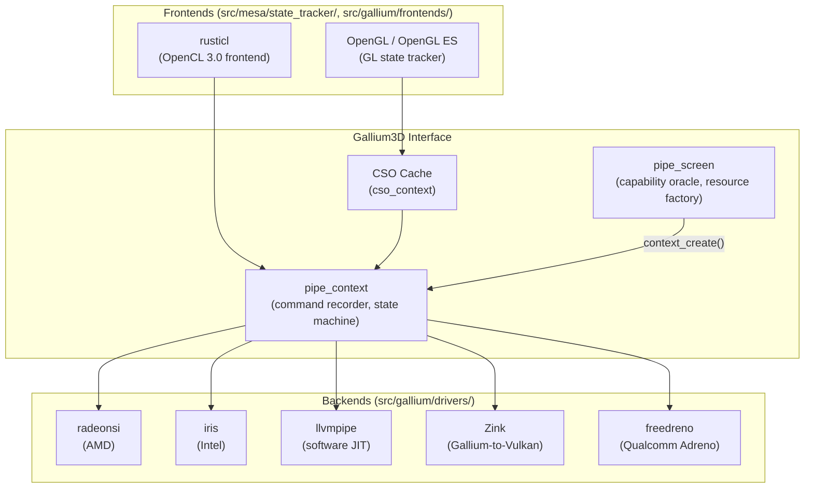
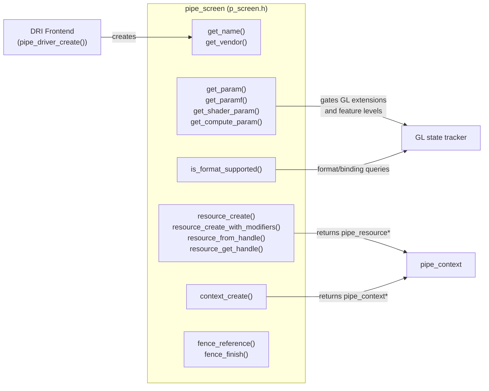
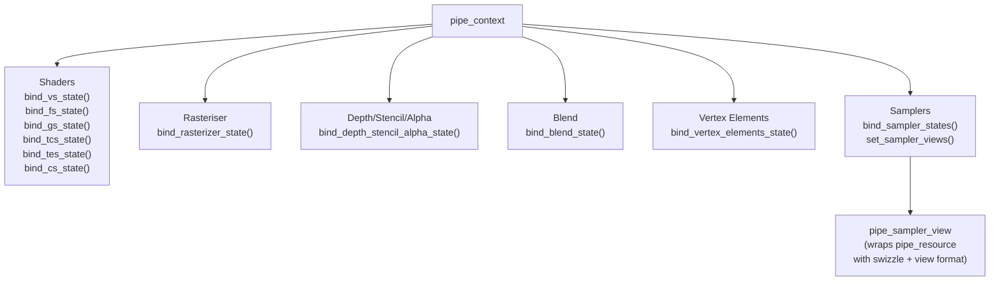
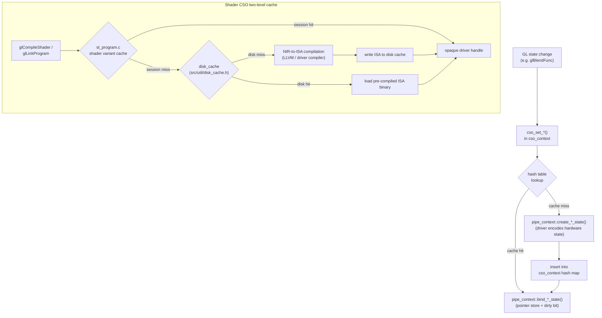
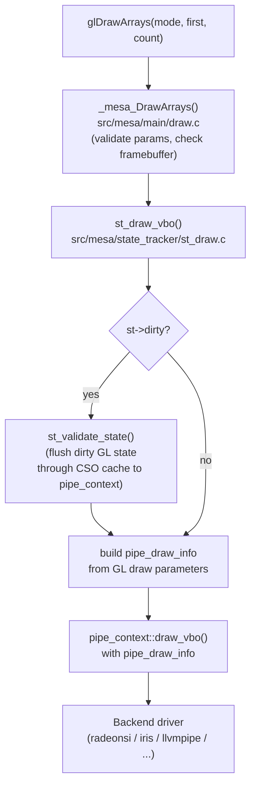
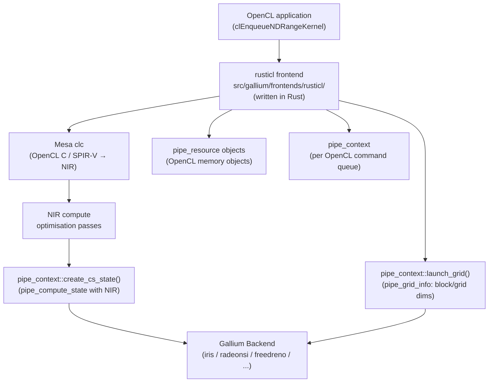
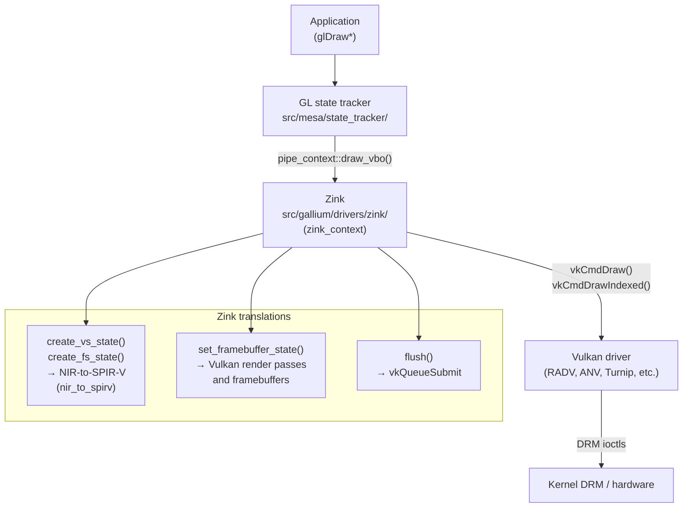

# Chapter 13: Gallium3D: The OpenGL State Tracker

> **Part**: Part IV — Mesa Architecture
> **Audience**: Systems developer — primarily targets driver developers implementing Gallium backends or frontends; application developers benefit from understanding why OpenGL state changes carry the cost they do
> **Status**: First draft — 2026-06-06

## Table of Contents

- [Overview](#overview)
- [1. Design Goals and History](#1-design-goals-and-history)
- [2. The pipe_screen Interface](#2-the-pipe_screen-interface)
- [3. The pipe_context Interface](#3-the-pipe_context-interface)
- [4. CSO: Constant State Objects](#4-cso-constant-state-objects)
- [5. The OpenGL and OpenGL ES Frontends](#5-the-opengl-and-opengl-es-frontends)
- [6. u_blitter and u_transfer_helper](#6-u_blitter-and-u_transfer_helper)
- [7. Gallium Pipe Drivers: What a Backend Must Implement](#7-gallium-pipe-drivers-what-a-backend-must-implement)
- [8. Alternative Frontends: rusticl and Zink](#8-alternative-frontends-rusticl-and-zink)
- [Integrations](#integrations)
- [References](#references)

---

## Overview

**Gallium3D** is the structural spine of **Mesa**'s userspace graphics stack. Introduced in **Mesa** 7.1 around 2008 to replace an increasingly fragmented collection of per-driver implementations, it imposes a principled separation between API-level state management — the "state tracker" or, in modern parlance, the "frontend" — and the hardware-specific rendering code that actually talks to the GPU, the "pipe driver" or "backend." That separation has proved extraordinarily durable: it is what allows a single **OpenGL** implementation to run correctly on a Raspberry Pi, a Radeon RX 7900, an Intel Arc GPU, and a software **JIT** renderer, all without the frontend code knowing anything about the GPU's command encoding or shader **ISA**.

This chapter dissects **Gallium3D** from the interface contract outward. We begin with the historical problem that motivated the design and the goals Whitwell and Rusin set in 2008, then move through the two central objects — **`pipe_screen`** (the per-device capability oracle and resource factory) and **`pipe_context`** (the per-thread command recorder) — and the mechanisms that make them fast in practice: the **CSO** (Constant State Object) cache. We then examine how the **OpenGL** and **OpenGL ES** frontends drive those interfaces, how utility libraries like **`u_blitter`** and **`u_transfer_helper`** paper over hardware limitations, and what a new backend driver must actually implement. The chapter closes with an architectural tour of the two most interesting non-OpenGL **Gallium** frontends: **rusticl** (an **OpenCL** 3.0 implementation written in **Rust**) and **Zink** (a backend that translates Gallium calls to **Vulkan**).

For **`pipe_screen`**, the chapter covers the complete lifecycle from the **`pipe_driver_create()`** entry point through **`pipe_reference`** counting, the **`pipe_cap`** and **`pipe_shader_cap`** capability query enumerations exposed via **`get_param()`**, **`get_shader_param()`**, and **`get_paramf()`**, the **`pipe_resource`** struct and the **`resource_create()`** and **`resource_create_with_modifiers()`** allocation paths with their **`PIPE_BIND_*`** and **`PIPE_USAGE_*`** flags, the **`is_format_supported()`** format query interface, and the thread-safety contract that allows multiple **`pipe_context`** objects to share a single **`pipe_screen`**.

For **`pipe_context`**, the chapter traces state binding through the **CSO** model — shaders bound via **`bind_vs_state()`**, **`bind_fs_state()`**, **`bind_gs_state()`**, **`bind_tcs_state()`**, **`bind_tes_state()`**, and **`bind_cs_state()`**; fixed-function state via **`bind_rasterizer_state()`**, **`bind_depth_stencil_alpha_state()`**, and **`bind_blend_state()`**; textures via **`bind_sampler_states()`** and **`set_sampler_views()`** with **`pipe_sampler_view`** objects — then draw dispatch through **`draw_vbo()`** with **`pipe_draw_info`** and the fast-path **`draw_vertex_state()`** and **`multi_draw()`** entry points, framebuffer binding via **`set_framebuffer_state()`** with **`pipe_surface`** and **`pipe_framebuffer_state`**, viewport and scissor setup via **`set_viewport_states()`** and **`set_scissor_states()`**, CPU–GPU data movement through **`buffer_map()`**, **`texture_map()`**, and **`PIPE_MAP_*`** flags including the buffer-orphaning **`PIPE_MAP_DISCARD_RANGE`** and **`PIPE_MAP_DISCARD_WHOLE_RESOURCE`** flags, submission and synchronisation via **`flush()`** and **`pipe_fence_handle`**, and compute dispatch via **`launch_grid()`** with **`pipe_grid_info`**.

For the **CSO** mechanism, the chapter explains the **`create_*_state()`** / **`bind_*_state()`** / **`delete_*_state()`** triplet, the **`cso_context`** hash-map cache in **`src/gallium/auxiliary/cso_cache/`** that eliminates redundant state compilation, and the two-level shader cache formed by the session-level **`cso_context`** combined with the persistent **`disk_cache`** in **`src/util/disk_cache.h`**.

For the **OpenGL** and **OpenGL ES** frontends in **`src/mesa/state_tracker/`**, the chapter walks through **`st_create_context()`** context creation bridging **`gl_context`** to **`pipe_context`** via **`st_context`**, the canonical **`glDrawArrays`** → **`_mesa_DrawArrays()`** → **`st_draw_vbo()`** → **`st_validate_state()`** → **`pipe_context::draw_vbo()`** draw call path, **`MESA_FORMAT_*`** to **`pipe_format`** translation via **`st_mesa_format_to_pipe_format()`**, texture upload through **`st_texture_object`** and **`pipe_context::texture_subdata()`**, framebuffer object management via **`st_framebuffer`** and **`st_update_framebuffer()`**, shader compilation through the **GLSL** front end and **`glsl_to_nir()`** producing **NIR** in a **`pipe_shader_state`** passed to **`create_fs_state()`**, and the **OpenGL ES** 2.0/3.x profile handled through the same state tracker via **`src/mapi/es2api/`**.

For the utility libraries, the chapter describes how **`u_blitter`** (in **`src/gallium/auxiliary/util/u_blitter.c`**) implements generic **`util_blitter_copy_texture()`**, **`util_blitter_clear()`**, **`util_blitter_fill_texture()`**, and **`util_blitter_blit()`** operations by driving the driver's own **`draw_vbo()`** path with a state save/restore cycle, and how **`u_transfer_helper`** (in **`src/gallium/auxiliary/util/u_transfer_helper.c`**) intercepts **`buffer_map()`** and **`texture_map()`** to perform CPU-side depth-stencil deinterleave, **RGBX**-to-**RGBA** expansion, and **YUV** planar format conversion.

For Gallium backend implementation, the chapter defines the minimum viable function-pointer set across **`pipe_screen`** and **`pipe_context`**, explains conservative **`PIPE_CAP`** reporting as the correct bringup strategy, covers **NIR**-to-**ISA** compilation and **`disk_cache`** integration, describes the winsys layer in **`src/gallium/winsys/`** and its use of **`libdrm`**, **GEM** buffer object allocation via **`DRM_IOCTL_*_GEM_CREATE`**, **DMA-BUF** interop, and command submission ioctls such as **`DRM_IOCTL_AMDGPU_CS`** and **`DRM_IOCTL_I915_GEM_EXECBUFFER2`**, and surveys the three reference implementations: **`llvmpipe`** (in **`src/gallium/drivers/llvmpipe/`**), **`softpipe`** (in **`src/gallium/drivers/softpipe/`**), and **`freedreno`** (in **`src/gallium/drivers/freedreno/`**).

After reading this chapter you will understand how a single **`glDrawArrays`** call decomposes into a sequence of **Gallium** pipe interface calls, what data structures cross the frontend/backend boundary, and what a new hardware backend must implement to support **OpenGL**, **OpenGL ES**, or **OpenCL** through the **Gallium** interface. The companion chapters on **NIR** (Chapter 14), **radeonsi** and **iris** (Chapter 19), **llvmpipe** (Chapter 17), and **rusticl** (Chapter 25) each pick up one thread that this chapter introduces.



---

## 1. Design Goals and History

By 2007, Mesa's classic driver model had accumulated fifteen or so hardware-specific drivers, each one a near-complete reimplementation of the OpenGL rasteriser, texture manager, state machine, and shader compiler. The i965 driver handled Intel GPU generations. The r300, r600, and radeon drivers tracked AMD's successive GPU architectures. The nouveau driver handled NVIDIA hardware in various states of completeness. Each driver implemented its own version of every fixed-function operation: mipmap generation, stencil routing, format conversion, blending. When OpenGL ES 2.0 appeared, the work of adding ES support needed to happen in each driver independently. When shader hardware evolved, each driver needed its own IR, its own optimisation pipeline, its own register allocator.

The rot was not merely cosmetic. Subtle regressions in one driver would go unnoticed because the test suites ran per-driver and the code paths did not share logic. New GPU families required a new driver from scratch. Attracting contributors was hard because the barrier to entry — understanding one driver's idiosyncratic internals — was high.

Keith Whitwell and Zack Rusin, then at Tungsten Graphics, published the Gallium3D design in 2008. The architectural influences were explicit: Direct3D 10's pipeline model had demonstrated that a clean separation of pipeline stages and an immutable-state-object model could reduce driver overhead substantially. Gallium adapted those ideas to an open source, multi-API world. The central insight was that there is a natural split between what every OpenGL API call must do — interpret API state, validate, and produce a normalised description of a draw call — and what is irreducibly hardware-specific — encoding that description into GPU commands.

The design had four explicit goals. First, one canonical OpenGL implementation: frontend code that handles `glBlendFunc`, `glTexImage2D`, and `glDrawArrays` should be written once and shared across all hardware backends. Second, multiple API frontends sharing one backend interface: the same pipe driver that handles OpenGL should also handle OpenCL compute dispatches and, eventually, any future API. Third, hardware format and tiling abstraction: the resource interface should hide GPU-specific tiling modes and swizzle patterns from frontends, exposing only format capabilities through a query interface. Fourth, shader IR independence: the interface should pass shader programs in a representation that the backend can compile or interpret, without the frontend knowing or caring about the backend's instruction set.

Gallium deliberately does not standardise certain things. Shader ISA is entirely backend-specific: the pipe interface passes NIR (see Chapter 14) into the backend and receives an opaque handle back; what the backend does with NIR — whether it calls LLVM, runs a custom register allocator, or emits microcode in a proprietary format — is its own business. Memory management is similarly left to the backend: the `resource_create` interface describes what memory is needed, but how the backend allocates it from the kernel — through GEM, through DMA-BUF, through a slab allocator — is unspecified. GPU command encoding is entirely hidden.

In the years since the original design, Gallium has become the only path for hardware OpenGL in Mesa. All Mesa hardware OpenGL drivers — radeonsi, iris, nouveau, freedreno, etnaviv, panfrost, lima, vc4, v3d, and many others — are Gallium backends. All Mesa OpenCL uses Gallium, first through the legacy Clover frontend and now through rusticl (see Section 8). Zink, a Gallium backend that translates pipe calls to Vulkan, enables OpenGL on hardware where only a Vulkan driver exists. The only paths in Mesa that bypass Gallium entirely are the Vulkan drivers (RADV, ANV, Turnip, and others), which have their own independent infrastructure and do not use `pipe_context` at all.

The terminology around Gallium has shifted. The Mesa source tree uses `state_tracker` in directory names (`src/mesa/state_tracker/`) — this was the original term for the OpenGL-to-Gallium translation layer. Around 2020, the Mesa community standardised on "frontend" as the preferred term, with "backend" replacing "pipe driver." The directory names were not uniformly renamed; both `src/mesa/state_tracker/` and `src/gallium/frontends/` exist in the current tree. This chapter uses "frontend" and "backend" in prose and uses the source paths verbatim.

---

## 2. The `pipe_screen` Interface

The `pipe_screen` object represents the context-independent part of a Gallium device. There is one `pipe_screen` per physical GPU (or per GPU instance in a multi-GPU system). It is created when the Mesa driver is first loaded, and it persists until the last reference to it is dropped. Its source definition lives in `src/gallium/include/pipe/p_screen.h`.



### Lifecycle and Entry Point

The `pipe_screen` is constructed by the driver's `pipe_driver_create()` entry point, which is called by the DRI frontend during screen creation. The DRI frontend (see Chapter 12) locates the driver shared object, calls `pipe_driver_create()`, and receives back a `pipe_screen*` pointer. The lifetime of that pointer is managed by a reference count embedded in the struct via `pipe_reference`. The reference counting is subtle in the DRI integration: the EGL/GLX display and each `pipe_context` hold references, so the screen lives until the display is destroyed and all contexts have been released.

```c
/* Source: src/gallium/include/pipe/p_screen.h — pipe_screen struct */
struct pipe_screen {
    /* Driver name and vendor strings */
    const char *(*get_name)(struct pipe_screen *screen);
    const char *(*get_vendor)(struct pipe_screen *screen);
    const char *(*get_device_vendor)(struct pipe_screen *screen);

    /* Capability queries */
    int (*get_param)(struct pipe_screen *screen, enum pipe_cap param);
    float (*get_paramf)(struct pipe_screen *screen, enum pipe_capf param);
    int (*get_shader_param)(struct pipe_screen *screen,
                            enum pipe_shader_type shader,
                            enum pipe_shader_cap param);
    int (*get_compute_param)(struct pipe_screen *screen,
                             enum pipe_shader_ir ir_type,
                             enum pipe_compute_cap param,
                             void *ret);

    /* Resource management */
    struct pipe_resource *(*resource_create)(struct pipe_screen *screen,
                                             const struct pipe_resource *templat);
    struct pipe_resource *(*resource_create_with_modifiers)(
                            struct pipe_screen *screen,
                            const struct pipe_resource *templat,
                            const uint64_t *modifiers,
                            int count);
    bool (*resource_from_handle)(struct pipe_screen *screen,
                                 const struct pipe_resource *templat,
                                 struct winsys_handle *handle,
                                 unsigned usage);
    bool (*resource_get_handle)(struct pipe_screen *screen,
                                struct pipe_context *context,
                                struct pipe_resource *resource,
                                struct winsys_handle *handle,
                                unsigned usage);

    /* Context creation */
    struct pipe_context *(*context_create)(struct pipe_screen *screen,
                                           void *priv, unsigned flags);

    /* Format support */
    bool (*is_format_supported)(struct pipe_screen *screen,
                                enum pipe_format format,
                                enum pipe_texture_target target,
                                unsigned sample_count,
                                unsigned storage_sample_count,
                                unsigned bindings);

    /* Fence operations */
    void (*fence_reference)(struct pipe_screen *screen,
                            struct pipe_fence_handle **ptr,
                            struct pipe_fence_handle *fence);
    int (*fence_finish)(struct pipe_screen *screen,
                        struct pipe_context *context,
                        struct pipe_fence_handle *fence,
                        uint64_t timeout);
};
```

### Capability Queries

The `get_param()` function is the primary capability oracle. It takes a value from the `pipe_cap` enumeration and returns an integer. The `pipe_cap` enum is defined in `src/gallium/include/pipe/p_defines.h` and contains over two hundred entries covering every aspect of GPU feature support. A driver that returns 0 for `PIPE_CAP_GLSL_FEATURE_LEVEL` will prevent the OpenGL frontend from advertising GLSL at all; a driver that returns 460 indicates full GLSL 4.60 support. Similarly, `PIPE_CAP_MAX_TEXTURE_2D_SIZE` sets the maximum texture dimension that the frontend will allow, `PIPE_CAP_MAX_RENDER_TARGETS` controls how many simultaneous colour attachments `glDrawBuffers` permits, and `PIPE_CAP_PRIMITIVE_RESTART` gates the `GL_PRIMITIVE_RESTART` path.

The `get_shader_param()` function handles per-stage capabilities. It takes both a shader stage (`PIPE_SHADER_VERTEX`, `PIPE_SHADER_FRAGMENT`, `PIPE_SHADER_COMPUTE`, and so on) and a `pipe_shader_cap` value. A backend can report different instruction limits or register file sizes for different stages, reflecting real hardware asymmetries: many GPUs have a larger vertex shader register file than the fragment shader file, for example.

Float-valued capabilities come through `get_paramf()` using the `pipe_capf` enum. This handles things like maximum line width, maximum point size, and anisotropy limits that cannot be expressed as integers without loss of precision.

Getting capability queries right is one of the most critical and most commonly mishandled parts of a new Gallium backend. Underreporting — returning 0 for a capability the hardware actually supports — silently disables GL extensions and causes conformance failures. Overreporting — claiming support for a capability the hardware cannot reliably deliver — causes crashes or rendering corruption during stress testing. Capability queries should be verified against the hardware documentation, cross-checked against the CTS (OpenGL Conformance Test Suite), and reviewed against similar drivers targeting the same GPU generation.

### Resource Creation and `pipe_resource`

The `resource_create()` function allocates a GPU-side resource (a texture or buffer) from a template descriptor. The `pipe_resource` struct is defined in `src/gallium/include/pipe/p_state.h` and encapsulates everything the driver needs to know to allocate and access the resource:

```c
/* Source: src/gallium/include/pipe/p_state.h — pipe_resource struct */
struct pipe_resource {
    struct pipe_reference reference;       /* reference count */
    struct pipe_screen *screen;            /* owning screen */
    enum pipe_texture_target target;       /* PIPE_BUFFER, PIPE_TEXTURE_2D, etc. */
    enum pipe_format format;               /* PIPE_FORMAT_R8G8B8A8_UNORM, etc. */
    unsigned width0;                       /* width (or buffer size in bytes) */
    unsigned height0;                      /* height */
    unsigned depth0;                       /* depth (for 3D textures) */
    unsigned array_size;                   /* array layers */
    unsigned last_level;                   /* number of mipmap levels minus 1 */
    unsigned nr_samples;                   /* MSAA sample count (0 = no MSAA) */
    unsigned nr_storage_samples;           /* separate storage sample count */
    unsigned usage;                        /* PIPE_USAGE_DEFAULT, _STREAM, etc. */
    unsigned bind;                         /* PIPE_BIND_* flags bitmask */
    unsigned flags;                        /* additional PIPE_RESOURCE_FLAG_* */
};
```

The `bind` field is a bitmask of `PIPE_BIND_*` flags that communicate the intended uses of the resource. The most important flags are `PIPE_BIND_RENDER_TARGET` (the resource will be used as a colour attachment), `PIPE_BIND_DEPTH_STENCIL` (depth or stencil attachment), `PIPE_BIND_SAMPLER_VIEW` (texture sampling), `PIPE_BIND_VERTEX_BUFFER` (vertex attribute data), `PIPE_BIND_INDEX_BUFFER` (index data), `PIPE_BIND_CONSTANT_BUFFER` (shader uniform block), `PIPE_BIND_SHADER_BUFFER` (storage buffer for compute), and `PIPE_BIND_DISPLAY_TARGET` (scanout-capable, passed to the display engine). A driver allocates memory with all required bind flags in mind; for tiled architectures this often means choosing a different tiling mode depending on whether the resource will be used as a render target versus a sampled texture.

The `usage` field is a hint about the access pattern. `PIPE_USAGE_DEFAULT` means GPU-optimal (the driver picks the best memory placement), `PIPE_USAGE_IMMUTABLE` means the contents are fixed after initial upload, `PIPE_USAGE_DYNAMIC` means the CPU will write frequently and the GPU will read multiple times per write, `PIPE_USAGE_STREAM` means the GPU will read exactly once per CPU write (typical for per-frame constant buffers), and `PIPE_USAGE_STAGING` is an explicit request for CPU-accessible memory used as a transfer staging buffer.

The `resource_create_with_modifiers()` variant is used when the resource needs a specific memory layout modifier (a DRM format modifier, see Chapter 6 on KMS and buffer sharing). This is required when a scanout buffer must match a specific layout that the display engine expects, or when importing/exporting buffers between processes via DMA-BUF.

### Format Support Queries

The `is_format_supported()` function is called extensively by the OpenGL frontend to determine which texture formats, render target formats, and depth formats the hardware supports. The query takes a `pipe_format`, a `pipe_texture_target`, a sample count, a storage sample count, and a bitmask of `PIPE_BIND_*` flags. The function must return true only if the hardware can actually use the specified format for all the requested bindings at the requested sample count.

A common implementation error here is to return true for a format/binding combination based only on the format, ignoring the sample count. A driver that reports `PIPE_BIND_RENDER_TARGET` support for `PIPE_FORMAT_R16G16B16A16_FLOAT` without checking whether the hardware supports MSAA for that format will mislead the frontend into advertising `GL_RGBA16F` as an MSAA-renderable format. The subsequent application will call `glRenderbufferStorageMultisample()` and receive a framebuffer completeness failure that is difficult to diagnose.

### Thread Safety

`pipe_screen` methods are required to be thread-safe. The GL specification allows multiple OpenGL contexts to share textures, and each context may live in a different thread. Because all contexts from the same screen share the `pipe_screen`, screen-level operations like `resource_create`, `is_format_supported`, and the capability queries must be safe to call concurrently. The `pipe_context` objects themselves are not thread-safe — each context must be driven from exactly one thread — but the screen serves all of them.

---

## 3. The `pipe_context` Interface

If `pipe_screen` is the factory, `pipe_context` is the assembly line. It represents a single stream of GPU work: a command buffer, a command ring, or whatever the hardware uses to sequence rendering operations. Its definition lives in `src/gallium/include/pipe/p_context.h`. In practice there is one `pipe_context` per OpenGL context, and OpenGL contexts map one-to-one to threads when multi-threaded rendering is used.

A `pipe_context` is not thread-safe. This constraint is fundamental to its design: the state machine semantics of OpenGL mean that every draw call implicitly reads the currently-bound shader, the currently-bound vertex buffers, the current blend state, and dozens of other bindings. Enforcing thread safety for all of those implicit reads would require pervasive locking that would be prohibitively expensive. The contract is instead that the caller guarantees single-threaded access. Frontend implementations that want to call into a `pipe_context` from multiple threads — for example, to compile shaders concurrently — must use separate contexts or synchronise externally.

### State Binding

The `pipe_context` state machine is structured around the CSO model (see Section 4): immutable state objects are created once on a separate code path, and `bind_*_state()` calls switch the active state by pointer. The state types and their binding functions are:

- **Shaders**: `bind_vs_state()`, `bind_fs_state()`, `bind_gs_state()`, `bind_tcs_state()`, `bind_tes_state()`, `bind_cs_state()` — each takes an opaque handle returned by the corresponding `create_*_state()` call.
- **Rasteriser**: `bind_rasterizer_state()` — controls polygon winding, culling mode, fill mode (solid/wireframe), line width, stipple, and flat/smooth shading.
- **Depth/stencil/alpha**: `bind_depth_stencil_alpha_state()` — wraps `pipe_depth_stencil_alpha_state` covering depth compare function, depth write enable, stencil front/back operations, and alpha test.
- **Blend**: `bind_blend_state()` — wraps `pipe_blend_state`, covering per-render-target blend equations and colour write masks, plus logic operations.
- **Vertex elements**: `bind_vertex_elements_state()` — defines the vertex attribute layout: for each attribute, the buffer binding slot, the byte offset within the buffer, the stride, and the `pipe_format` describing the element's data type and component count.
- **Samplers**: `bind_sampler_states()` sets the sampler parameters (filter mode, address mode, border colour, LOD bias, anisotropy limit); `set_sampler_views()` binds the actual texture data via `pipe_sampler_view` objects that wrap `pipe_resource` with a swizzle and a view format.

The split between `bind_sampler_states()` and `set_sampler_views()` reflects an important architectural point. A sampler encodes how to read from a texture (filtering, wrapping), while a sampler view encodes which texture to read from and how to interpret its format. This separation lets the driver precompile sampler state into hardware registers independently of texture binding, which matters when a single sampler is applied to many different textures.



### Draw Calls

The primary draw entry point is `draw_vbo()`. It takes a `pipe_draw_info` struct and an optional `pipe_draw_indirect_info` struct:

```c
/* Source: src/gallium/include/pipe/p_context.h — draw_vbo signature */
void (*draw_vbo)(struct pipe_context *pipe,
                 const struct pipe_draw_info *info,
                 unsigned drawid_offset,
                 const struct pipe_draw_indirect_info *indirect,
                 const struct pipe_draw_start_count_bias *draws,
                 unsigned num_draws);
```

The `pipe_draw_info` struct carries the primitive type, the instance count, flags indicating whether the draw is indexed or not, the vertex restart index if primitive restart is enabled, and addressing information for the vertex data. When `indirect` is non-NULL, the draw parameters are sourced from a GPU buffer rather than from the CPU call site, enabling multi-draw-indirect and draw-count-indirect patterns.

Two additional draw entry points exist for performance paths. `draw_vertex_state()` handles a fast-path vertex state object that bundles the vertex buffer and vertex element state together; this reduces per-draw-call overhead in scenarios where only the vertex binding changes (common in geometry-heavy scenes). `multi_draw()` packages multiple primitive ranges into a single call, reducing the driver overhead per primitive range compared to issuing individual `draw_vbo()` calls. Frontends should prefer these paths when available, as indicated by the `PIPE_CAP_DRAW_VERTEX_STATE` and `PIPE_CAP_MULTI_DRAW_INDIRECT` capabilities.

### Framebuffer, Scissors, and Viewports

`set_framebuffer_state()` binds the render targets. It takes a `pipe_framebuffer_state` containing up to `PIPE_MAX_COLOR_BUFS` colour surface pointers and one depth/stencil surface pointer. Each surface is a `pipe_surface` — a view onto a `pipe_resource` that specifies the mip level and array layer being rendered to, plus the sample count.

Scissors and viewports are set with `set_scissor_states()` and `set_viewport_states()`, both accepting arrays to handle multiple viewports (for geometry shaders that emit `gl_Layer` or `gl_ViewportIndex`).

### Resource Transfers

Moving data between CPU and GPU goes through the transfer interface. `buffer_map()` and `texture_map()` request a CPU-accessible mapping of a resource region. The caller passes `PIPE_MAP_*` flags that communicate the intended access:

- `PIPE_MAP_READ`: CPU will read from the mapping.
- `PIPE_MAP_WRITE`: CPU will write to the mapping.
- `PIPE_MAP_DISCARD_RANGE`: the driver may discard the specified subrange and return a new backing store; used for streaming updates that do not need to preserve old data.
- `PIPE_MAP_DISCARD_WHOLE_RESOURCE`: like `DISCARD_RANGE` but the entire resource is discarded.
- `PIPE_MAP_PERSISTENT`: the mapping remains valid across draw calls.
- `PIPE_MAP_COHERENT`: GPU and CPU see each other's writes without an explicit flush.
- `PIPE_MAP_UNSYNCHRONISED`: the driver will not wait for pending GPU operations; the caller takes responsibility for synchronisation.

The `DISCARD_RANGE` and `DISCARD_WHOLE_RESOURCE` flags enable buffer orphaning, a technique used by OpenGL implementations to avoid GPU/CPU synchronisation stalls when updating dynamic vertex or constant buffers. Instead of waiting for the GPU to finish reading the old buffer, the driver allocates a new backing store and returns it immediately. The buffer mapping documentation in Mesa (accessible at `docs.mesa3d.org/gallium/buffermapping.html`) analyses real-game traces to show how Portal 2, Terraria, Hollow Knight, and other titles use this pattern and how different driver strategies affect frame time.

### Flush and Fence

`flush()` submits all pending work to the GPU. It accepts flags — `PIPE_FLUSH_END_OF_FRAME` (hint that a frame boundary is occurring, may trigger performance-relevant actions), `PIPE_FLUSH_DEFERRED` (defer submission until forced), `PIPE_FLUSH_ASYNC` — and optionally returns a `pipe_fence_handle*`. The fence handle can later be passed to `pipe_screen::fence_finish()` to block the CPU until the GPU work completes. The fence model is deliberately coarse-grained at this level; fine-grained synchronisation between pipeline stages within a single context is handled internally by the driver.

`flush_resource()` is a narrower call that transitions a specific texture from render-target state to shader-readable state without flushing the entire context. It is used by the GL state tracker when a texture that was just rendered to will be sampled in the next draw call.

### Compute Dispatch

`launch_grid()` dispatches a compute kernel. It takes a `pipe_grid_info` struct specifying the grid dimensions (a 3D block and grid structure), the number of work items, and a pointer to kernel arguments:

```c
/* Source: src/gallium/include/pipe/p_context.h — launch_grid */
void (*launch_grid)(struct pipe_context *pipe,
                    const struct pipe_grid_info *info);

/* Source: src/gallium/include/pipe/p_state.h — pipe_grid_info */
struct pipe_grid_info {
    unsigned work_dim;
    unsigned block[3];       /* work group dimensions (local size) */
    unsigned last_block[3];  /* dimensions of the last (partial) work group */
    unsigned grid[3];        /* grid dimensions (number of work groups) */
    struct pipe_resource *indirect;  /* indirect dispatch buffer, or NULL */
    unsigned indirect_offset;
};
```

The compute state is set via `bind_cs_state()` with a CSO handle created from `pipe_compute_state` containing a NIR shader. Both rusticl (Section 8) and OpenGL compute shaders exercise this path through the same `pipe_context` interface.

---

## 4. CSO: Constant State Objects

Gallium's CSO mechanism solves a fundamental performance problem inherent in the OpenGL state machine. OpenGL applications may call `glBlendFunc`, `glDepthFunc`, `glFrontFace`, and `glPolygonMode` many times per frame, often re-setting the same values. Naive driver implementations that translate each such call into hardware register writes or command-buffer entries burn CPU time on work that produces no observable change. The CSO model eliminates this waste by precompiling state into an opaque hardware-ready object and reducing bind operations to pointer comparisons.

### The Mechanism

For each category of pipeline state, Gallium defines a `create_*_state()` function, a `bind_*_state()` function, and a `destroy_*_state()` function on `pipe_context`. The create function receives a fully-specified state descriptor struct, compiles it into a driver-specific opaque object, and returns an opaque handle. The bind function switches the active state to the provided handle. The destroy function frees the handle when the application no longer needs it.

```c
/* Source: src/gallium/include/pipe/p_context.h — CSO triplet for rasteriser */
void *(*create_rasterizer_state)(struct pipe_context *,
                                 const struct pipe_rasterizer_state *);
void  (*bind_rasterizer_state)(struct pipe_context *, void *handle);
void  (*delete_rasterizer_state)(struct pipe_context *, void *handle);
```

From the driver's perspective, `create_rasterizer_state()` is the expensive call: the driver reads the `pipe_rasterizer_state` struct and encodes it as hardware commands or register values. The `bind_rasterizer_state()` call is then cheap — often just a pointer store followed by setting a dirty bit so the hardware state is updated at the next draw call boundary.

### The CSO Cache

The caching layer that sits above the pipe interface is implemented in `src/gallium/auxiliary/cso_cache/cso_cache.c` and `cso_context.c`. The GL state tracker creates a `cso_context` (from `src/gallium/auxiliary/cso_cache/cso_context.c`) to avoid redundant `create_*_state` calls. The `cso_context` maintains a hash map for each CSO type, keyed on the contents of the state descriptor struct. When the GL state tracker wants to bind a new rasteriser state, it calls `cso_set_rasterizer()`, which:

1. Hashes the `pipe_rasterizer_state` struct by its raw bytes.
2. Looks up the hash in the rasteriser cache.
3. On a cache hit, calls `pipe_context::bind_rasterizer_state()` with the cached handle.
4. On a cache miss, calls `pipe_context::create_rasterizer_state()` to produce a new handle, inserts the handle into the cache, then binds it.

This makes the common case — re-binding the same state that was active three draw calls ago — O(1): a hash computation, a hash table lookup, and a pointer store. The cache operates per-`cso_context`, which corresponds one-to-one to a `pipe_context`.

The cached state types are: `pipe_rasterizer_state`, `pipe_blend_state`, `pipe_depth_stencil_alpha_state`, `pipe_sampler_state`, and `pipe_vertex_element` arrays. Shaders are a special case: they are created by `create_*_state()` and their handles are cached by the GL state tracker's shader variant cache (in `src/mesa/state_tracker/st_program.c`), which uses the combination of GL shader source and compile-time options as the cache key.

### Shader CSOs and the Disk Cache

Shader CSO creation is where Mesa's disk shader cache (see Chapter 12) integrates with the Gallium interface. When the GL state tracker calls `pipe_context::create_fs_state()` with a `pipe_shader_state` containing NIR, the driver first computes a cache key from the NIR and the hardware-specific compile parameters, then queries the disk cache. On a hit, the driver can skip NIR-to-ISA compilation entirely and load the pre-compiled binary from the cache. On a miss, it compiles the NIR to ISA, writes the result to the disk cache, and returns the opaque handle.

The interaction between the CSO cache (which avoids redundant pipe-level state creation within a session) and the disk cache (which persists compiled shaders across sessions) forms a two-level cache for shader compilation. A cold-start application that has never run before pays full NIR-to-ISA compilation cost and a disk-cache write. A warm-start on the same hardware pays only a disk-cache read and the driver-internal work of reconstructing the opaque handle from the binary. A warm-start where the same shader was already used in the same session pays only the `cso_context` hash lookup.



---

## 5. The OpenGL and OpenGL ES Frontends

The GL state tracker in `src/mesa/state_tracker/` is the largest and most important Gallium frontend. It is the code that transforms every OpenGL API call into one or more operations on a `pipe_context`. The frontend is not a separate shared library: it is compiled into `libgallium.a` along with the backend driver, forming a single `.so` that the Mesa loader selects at runtime (see Chapter 12). Because the GL state tracker and the pipe driver share a link unit, the interface between them is not ABI-stable; it is a C function pointer table, but the compiler can inline through it and the linker can apply link-time optimisation across it.

### Context Creation

The entry point for the GL state tracker is `st_create_context()` in `src/mesa/state_tracker/st_context.c`. This function receives a `gl_context` — Mesa's internal representation of all OpenGL state, several thousand fields covering every aspect of the GL specification — and a `pipe_context`, and constructs an `st_context` that bridges them. The `st_context` holds pointers to both, plus state that is specific to the GL-Gallium bridge: format translation tables, shader variant caches, and the `cso_context` through which all pipe state changes flow.

### The Draw Call Path

The canonical draw call path is one of the most-exercised code paths in any OpenGL workload. Starting from `glDrawArrays(mode, first, count)`:

1. `glDrawArrays` calls `_mesa_DrawArrays` in `src/mesa/main/draw.c`, which validates parameters and checks the current framebuffer state.
2. `_mesa_DrawArrays` calls `st_draw_vbo()` in `src/mesa/state_tracker/st_draw.c` (or the fast-path equivalent in newer Mesa).
3. `st_draw_vbo()` constructs a `pipe_draw_info` struct from the GL draw parameters, resolving the GL primitive type to a `pipe_prim_type`, encoding the first vertex index and count.
4. Before the draw, `st_validate_state()` is called to flush any dirty GL state to the `pipe_context`. This is where pending GL state changes — a newly bound texture, a changed blend mode — get translated into pipe state and pushed through the CSO cache.
5. `pipe_context::draw_vbo()` is called with the `pipe_draw_info`.



The state validation step (step 4) is where most of the per-draw-call work concentrates for state-heavy workloads. Each dirty flag in the `st_context` corresponds to a specific type of GL state that must be re-translated and re-bound via the `cso_context`. For a workload that changes only the transformation matrices (constant buffer update) with each draw, `st_validate_state()` will touch only the constant buffer path and return quickly. For a workload that changes shader, texture bindings, and blend state with every draw — as might occur in a 2D UI rendering loop — every dirty category triggers a `cso_set_*` call.

```c
/* Source: src/mesa/state_tracker/st_draw.c — st_draw_vbo() simplified */
void st_draw_vbo(struct gl_context *ctx,
                 const struct _mesa_prim *prims, unsigned nr_prims,
                 const struct _mesa_index_buffer *ib, ...)
{
    struct st_context *st = st_context(ctx);
    struct pipe_draw_info info;
    struct pipe_draw_start_count_bias draw;

    /* Validate and flush dirty GL state to pipe */
    if (unlikely(st->dirty))
        st_validate_state(st, ST_PIPELINE_RENDER);

    /* Build pipe_draw_info from GL parameters */
    util_draw_init_info(&info);
    info.mode = translate_prim(ctx, prims[0].mode);
    info.index_size = ib ? (1 << ib->index_size_shift) : 0;
    info.instance_count = 1;

    draw.start = prims[0].start;
    draw.count = prims[0].count;
    draw.index_bias = prims[0].basevertex;

    /* Dispatch to the pipe driver */
    st->pipe->draw_vbo(st->pipe, &info, 0, NULL, &draw, 1);
}
```

### Format Translation

One of the most error-prone aspects of the GL state tracker is format translation. Mesa internally uses `MESA_FORMAT_*` values (defined in `src/mesa/main/formats.h`) to describe texture and renderbuffer formats. Gallium uses `pipe_format` values (defined in `src/gallium/include/pipe/p_format.h`, with a large generated table in `src/util/format/u_format_table.c`). These two spaces overlap substantially but are not identical: some Mesa formats have no Gallium equivalent and must be emulated; some Gallium formats are used internally by drivers for tiling and compression but are never exposed to the GL level.

The translation function `st_mesa_format_to_pipe_format()` in `src/mesa/state_tracker/st_mesa_to_tgsi.c` (historically) and its modern equivalent map between the two spaces. When the translation fails for a given format and a driver does not support the closest Gallium format, the GL state tracker must fall back to software conversion on the CPU during texture upload. This is a known source of latency on applications that use obscure packed formats.

### Texture Objects and Uploads

GL texture objects are represented by `st_texture_object` (a subclass of `gl_texture_object`) in `src/mesa/state_tracker/st_texture.c`. When a `glTexImage2D` call stores image data, `st_TexImage` in `st_cb_texture.c` creates or replaces the corresponding `pipe_resource` by calling `pipe_screen::resource_create()`, then performs a resource transfer via `pipe_context::texture_subdata()` to upload the data. For large textures on discrete GPUs, this involves copying the data into a staging buffer in CPU-accessible memory and then scheduling a DMA transfer to GPU-local memory — all hidden behind the `texture_subdata()` abstraction.

### Framebuffer Objects

GL framebuffer objects are represented by `st_framebuffer` (wrapping `gl_framebuffer`). When `glBindFramebuffer` binds a framebuffer, the GL state tracker marks the framebuffer state dirty. At the next draw call, `st_validate_state()` calls `st_update_framebuffer()`, which builds a `pipe_framebuffer_state` from the framebuffer's colour and depth/stencil attachments — each attachment is a `pipe_surface` derived from the relevant `st_renderbuffer`'s `pipe_resource` — and calls `pipe_context::set_framebuffer_state()`.

### Shader Compilation

When `glCompileShader` and `glLinkProgram` are called, the GL state tracker runs the GLSL front end (in `src/compiler/glsl/`) to parse and validate the shader, produces GLSL IR, then runs GLSL IR lowering passes, and finally converts to NIR via `glsl_to_nir()` (in `src/compiler/glsl/`). The NIR goes through a series of standardised optimisation and lowering passes (see Chapter 14) before being placed in a `pipe_shader_state`:

```c
/* Source: src/mesa/state_tracker/st_program.c — shader hand-off */
static struct st_fp_variant *
st_create_fp_variant(struct st_context *st,
                     struct gl_program *fp,
                     const struct st_fp_variant_key *key)
{
    struct pipe_shader_state state = { 0 };

    /* Hand NIR to the pipe driver */
    state.type = PIPE_SHADER_IR_NIR;
    state.ir.nir = nir_shader_clone(NULL, fp->nir);

    /* Apply driver-requested NIR lowering passes */
    st_finalize_nir(st, fp, prog, state.ir.nir, true);

    /* Create the shader CSO — driver compiles NIR to ISA */
    variant->driver_shader = st->pipe->create_fs_state(st->pipe, &state);
    return variant;
}
```

The `pipe_shader_state` struct carries a `type` field indicating the IR type (`PIPE_SHADER_IR_NIR`) and a union containing the pointer to the NIR shader or, for drivers that still accept other formats (rare and deprecated), a different representation. TGSI, the original Gallium shader IR, was removed from all active Mesa drivers in the Mesa 23 cycle and should be treated as historical. Any driver developed today receives NIR.

### OpenGL ES

Mesa implements OpenGL ES 2.0, 3.0, 3.1, and 3.2 as profiles of the same GL state tracker. The `src/mapi/es1api/` and `src/mapi/es2api/` directories contain thin wrappers that adjust the function dispatch table for ES profile rules — removing unavailable functions, adding ES-specific extensions. Internally, the same `st_context`, `st_draw_vbo`, and CSO path handle all ES draw calls.

---

## 6. u_blitter and u_transfer_helper

Writing a complete GPU driver means handling every combination of source format, destination format, source texture target, and destination texture target for blit, copy, and clear operations. For a driver targeting a GPU that has efficient hardware paths for common blits, implementing those paths is worthwhile. For less common combinations — blitting a depth texture to a colour texture, clearing a 3D texture slice, copying from a multisample target to a single-sample target — the cost of hardware implementation is hard to justify when the path is rarely exercised. Gallium provides two utility libraries to handle these cases: `u_blitter` and `u_transfer_helper`.

### u_blitter

The `u_blitter` library lives in `src/gallium/auxiliary/util/u_blitter.c`. Its design is based on a simple observation: any blit, clear, or copy that can be expressed as a draw call can be implemented using the driver's own `draw_vbo()` path. `u_blitter` saves the entire `pipe_context` state (all bound shaders, framebuffer, blend state, rasteriser, depth/stencil state, vertex elements, and samplers), sets up a minimal state for a fullscreen quad or compute dispatch, performs the requested operation, and restores the original state. Because it uses the driver's own pipe interface for the draw, any hardware path that works for normal rendering also works for the blitter operation.

The primary operations are:

- `util_blitter_copy_texture()`: copies a region of one texture to another, with format conversion if the formats are compatible at the pipe level.
- `util_blitter_clear()`: clears a framebuffer attachment using a fullscreen quad with a constant output colour or depth value.
- `util_blitter_fill_texture()`: fills a texture region with a constant value using a compute pass.
- `util_blitter_blit()`: the most general form, accepting a `pipe_blit_info` describing the full operation including source and destination rects, format, filter, and layering.

Drivers integrate `u_blitter` by calling `util_blitter_create()` at context creation time. In their `blit()` implementation they check whether the hardware can handle the requested blit natively; if not, they delegate to `util_blitter_blit()`. A driver that has no hardware 2D engine at all can implement its `blit()` entry point entirely by delegating to `u_blitter`:

```c
/* Source: src/gallium/drivers/softpipe/sp_blit.c — u_blitter integration */
static void
softpipe_blit(struct pipe_context *pipe, const struct pipe_blit_info *info)
{
    struct softpipe_context *sp = softpipe_context(pipe);

    if (util_try_blit_via_copy_region(pipe, info, sp->render_cond_query)) {
        return; /* simple case handled directly */
    }

    if (!util_blitter_is_blit_supported(sp->blitter, info)) {
        debug_printf("softpipe: blit unsupported %s -> %s\n",
                     util_format_short_name(info->src.format),
                     util_format_short_name(info->dst.format));
        return;
    }

    util_blitter_save_blend(sp->blitter, sp->blend);
    util_blitter_save_depth_stencil_alpha(sp->blitter, sp->depth_stencil);
    util_blitter_save_rasterizer(sp->blitter, sp->rasterizer);
    util_blitter_save_fragment_shader(sp->blitter, sp->fs);
    util_blitter_save_vertex_shader(sp->blitter, sp->vs);
    util_blitter_save_framebuffer(sp->blitter, &sp->framebuffer);
    util_blitter_save_fragment_sampler_states(sp->blitter, ...);
    util_blitter_save_fragment_sampler_views(sp->blitter, ...);

    util_blitter_blit(sp->blitter, info);
}
```

The state-save/restore pattern is verbose but necessary: `u_blitter` drives the driver through the same `pipe_context` interface as the application, so any draw the blitter performs will overwrite the application's bound state. The save functions record the current state handles (by pointer, cheaply), and the restore functions re-bind them after the blitter draw completes.

### u_transfer_helper

The `u_transfer_helper` utility (in `src/gallium/auxiliary/util/u_transfer_helper.c`) addresses a different class of problem: CPU-side format conversions during resource transfers. Many GPU hardware formats do not match the formats that applications expect at the CPU level. The canonical example is depth-stencil interleaving. Vulkan and many GPU hardware designs store depth and stencil as a single interleaved surface (e.g., `PIPE_FORMAT_Z24_UNORM_S8_UINT` packed into 32 bits per sample). OpenGL, however, allows applications to map depth and stencil separately. When an application calls `glReadPixels` with `GL_DEPTH_COMPONENT` format on a depth-stencil surface, it expects to receive only the depth values in a separate buffer.

`u_transfer_helper` wraps the driver's `buffer_map` and `texture_map` entry points with intercepting handlers. The `u_transfer_helper_create()` function takes a callback table describing which format conversions the driver needs help with. When a map request arrives for a format that the helper handles, it intercepts the call, maps the underlying resource at the driver level, performs the in-memory format conversion (depth/stencil deinterleave, RGBA-to-RGBX stripping, half-float expansion, etc.), and returns the converted data to the caller. The caller sees a clean, linearly-laid-out CPU buffer in the expected format without needing to know about the GPU's internal storage layout.

The operational coverage of `u_transfer_helper` includes: depth-stencil interleave/deinterleave (for depth-only or stencil-only reads on combined surfaces), RGBX-to-RGBA expansion (many GPUs ignore the X channel but OpenGL expects it to be opaque), and YUV planar format interconversion for video textures. Drivers set up the helper once at context creation time and use it to wrap their transfer entry points; afterwards, all transfer requests flow through the helper before reaching the driver.

The trade-off is that `u_transfer_helper` adds a CPU-side conversion step that hardware-native implementations avoid. For read-back-heavy workloads, this matters. But for drivers that lack hardware format conversion support, the alternative is leaving these operations unsupported or implementing them per-driver with duplicate code. The utility library approach provides a correct, maintainable baseline that drivers can override with hardware acceleration selectively.

---

## 7. Gallium Pipe Drivers: What a Backend Must Implement

A Gallium backend is any shared library or compilation unit that provides a `pipe_screen` and the `pipe_context` objects that `pipe_screen::context_create()` produces. In practice, implementing a minimal but correct backend requires filling in approximately two hundred function pointers across the two vtables, plus the winsys layer that connects the driver to the kernel DRM subsystem. This section describes what a backend must provide and where to start.

### Minimum Viable Backend

The practical minimum is: a `pipe_screen` with all capability queries returning reasonable values; `resource_create()` and `resource_destroy()`; `context_create()` returning a `pipe_context`; all CSO create/bind/delete triplets; `set_framebuffer_state()`, `set_viewport_states()`, `set_scissor_states()`, `set_vertex_buffers()`; `draw_vbo()`; `flush()`; and the transfer functions `buffer_map()`, `buffer_unmap()`, `texture_map()`, `texture_unmap()`.

Capability queries, while not "missing" in the crash sense, are often the subtlest part of a bringup. The rule is: if you do not understand whether the hardware supports a feature, return 0 (not supported). An underreporting driver produces incorrect GL conformance results — GLSL extensions missing, texture formats unsupported — but these are correctable. An overreporting driver causes crashes or GPU hangs in conformance tests that exercise the claimed capability. Start conservative and expand incrementally as each capability is verified.

### Shader Compilation

When the GL state tracker calls `pipe_context::create_fs_state()` with a `pipe_shader_state` containing NIR, the backend must compile that NIR to its hardware ISA. The backend receives a `nir_shader*` from the `pipe_shader_state` and returns an opaque handle. The backend owns the lifetime of that handle: the frontend will call `destroy_fs_state()` when the shader is no longer needed, and the backend must free all associated resources.

What the backend does with the NIR is entirely its prerogative. Simple backends (llvmpipe, softpipe) run the NIR through Mesa's utility functions (`nir_opt_*` passes, `nir_lower_*` passes), then feed it to their JIT or interpreter. Production hardware drivers run driver-specific compilation pipelines: radeonsi uses LLVM to compile NIR to AMD GCN/RDNA ISA; iris uses LLVM or, recently, a direct NIR-to-GEN compiler; freedreno uses the Mesa NIR backend for Qualcomm Adreno. The Gallium interface is deliberately agnostic about all of this.

NIR-to-ISA compilation is typically the most expensive operation a backend performs during application startup. This is why disk cache integration matters: the disk cache saves compiled ISA blobs keyed on the NIR hash and the hardware parameters, so warm-start applications skip the compilation step entirely. New backends should integrate with Mesa's `disk_cache` API (in `src/util/disk_cache.h`) early in the development process.

### Buffer Allocation and the Winsys Layer

`pipe_screen::resource_create()` must allocate GPU-accessible memory. On Linux, this means calling into the kernel DRM subsystem via `libdrm`. The connection between the Gallium driver and `libdrm` is provided by the driver's winsys layer, which lives in `src/gallium/winsys/`. Each driver family has its own winsys: `src/gallium/winsys/amdgpu/` for AMD (shared between radeonsi and potentially other AMD Gallium drivers), `src/gallium/winsys/svga/` for VMware virtual hardware, and so on. Older drivers use a `radeon_winsys.h`-style interface; newer drivers tend to have thinner winsys layers and call `libdrm` more directly.

The winsys abstracts the GEM buffer object lifecycle: allocation via `DRM_IOCTL_*_GEM_CREATE`, mapping via `DRM_IOCTL_*_GEM_MMAP`, prime handle exchange for DMA-BUF interop, and command submission via driver-specific ioctls (`DRM_IOCTL_AMDGPU_CS`, `DRM_IOCTL_I915_GEM_EXECBUFFER2`, etc.). From the Gallium interface perspective, these are implementation details of `resource_create()` and `flush()`.

### Reference Implementations

Three Gallium backends are worth studying for their pedagogical clarity. `llvmpipe` (in `src/gallium/drivers/llvmpipe/`) is the most complete reference: it implements the full Gallium interface, supports all GLSL feature levels through LLVM JIT, and has no hardware dependencies. Reading `lp_screen.c`, `lp_context.c`, and `lp_texture.c` together gives the most direct picture of how a conformant Gallium backend is structured.

`softpipe` (in `src/gallium/drivers/softpipe/`) is even simpler: it is a pure software renderer with an interpreter rather than a JIT compiler. It is slower than llvmpipe but conceptually easier to follow, with no LLVM dependencies. It is no longer actively developed (llvmpipe has superseded it) but remains in the tree as a reference and a test baseline.

`freedreno` (in `src/gallium/drivers/freedreno/`) is a clean ARM GPU implementation for Qualcomm Adreno hardware that has been developed with careful attention to the Gallium conventions. It demonstrates how a production hardware driver handles command buffer management, tile-based rendering, and render pass optimisation within the Gallium interface. For developers implementing a new ARM GPU driver, freedreno is the most relevant reference.

---

## 8. Alternative Frontends: rusticl and Zink

Gallium's most elegant architectural property is that it is not specific to OpenGL. The `pipe_context` compute path (`launch_grid()`, `bind_cs_state()`, shader buffer and image bindings) is a complete GPGPU compute interface. The render path handles the full programmable pipeline. Any API that can be expressed in terms of these primitives can be implemented as a Gallium frontend and will automatically run on every hardware backend that implements the pipe interface.

Two particularly significant frontends demonstrate this extensibility.

### rusticl: OpenCL 3.0 in Rust

rusticl (source: `src/gallium/frontends/rusticl/`) is Mesa's modern OpenCL frontend. It was written by Karol Herbst and merged into Mesa in September 2022. Unlike the previous OpenCL frontend (Clover, which was limited to OpenCL 1.x and is now deprecated), rusticl targets OpenCL 3.0 conformance and is written almost entirely in Rust, with thin C/C++ glue where necessary for Gallium interface calls.

The rusticl architecture mirrors the GL state tracker's relationship to Gallium. It creates `pipe_context` objects to represent OpenCL command queues, `pipe_resource` objects to represent OpenCL memory objects, and shader CSOs to represent compiled OpenCL kernels. OpenCL C source code or SPIR-V binaries are compiled to NIR using Mesa's `clc` (Mesa OpenCL Compiler) infrastructure, the NIR passes through a set of compute-oriented optimisation passes, and the result is passed to `pipe_context::create_cs_state()` as a `pipe_compute_state`. When an OpenCL `clEnqueueNDRangeKernel` call arrives, rusticl translates it directly to `pipe_context::launch_grid()`.

By 2024, rusticl had achieved OpenCL 3.0 conformance on Intel 12th-generation hardware (via the iris Gallium driver) and had also passed the OpenCL 3.0 test suite on radeonsi. The Freedreno driver (Qualcomm Adreno) gained rusticl support in Mesa 24.3. This represents a dramatic improvement over the Clover era, when OpenCL conformance was limited to a small number of hardware families, and demonstrates how a well-designed Gallium interface enables a new frontend to immediately support every hardware backend without any hardware-specific code.

The use of Rust in rusticl is significant beyond the language choice itself. Rust's ownership model eliminates entire classes of use-after-free and double-free bugs that have historically appeared in both OpenCL implementations and GPU driver code. The Mesa project's decision to admit Rust as a first-class implementation language, starting with rusticl, signals an ongoing shift in how infrastructure software at this level is written.



### Zink: OpenGL over Vulkan

Zink (`src/gallium/drivers/zink/`) is a Gallium backend — not a frontend — that translates Gallium pipe calls into Vulkan API calls. This makes it a backend from Gallium's perspective but a frontend from Vulkan's perspective: it sits between the OpenGL state tracker and a Vulkan driver.

The motivation for Zink is threefold. First, it enables OpenGL on hardware or platforms where a Vulkan driver exists but a native OpenGL driver does not. Apple Silicon Macs, for example, do not have a native Mesa OpenGL driver; Zink over MoltenVK (which translates Vulkan to Metal) provides one. Second, it serves as a correctness reference: any Gallium state that causes correct rendering through Zink by definition maps correctly to Vulkan semantics, which can help isolate whether a rendering bug is in the frontend (the GL state tracker) or the backend. Third, it provides a way to get OpenGL support "for free" on any new hardware for which a Vulkan driver is written first.



The Zink `pipe_context` (`zink_context`, derived from `pipe_context`) translates each pipe call to the Vulkan equivalent. `create_vs_state()` and `create_fs_state()` receive NIR and compile it to SPIR-V using Mesa's `nir_to_spirv` pass (in `src/compiler/spirv/`). `draw_vbo()` records a `vkCmdDraw` or `vkCmdDrawIndexed` into a Vulkan command buffer. `set_framebuffer_state()` manages Vulkan render passes and framebuffers. `flush()` submits the Vulkan command buffer via `vkQueueSubmit`.

The translation is not always trivial. Vulkan's explicit memory barrier model is quite different from Gallium's implicit synchronisation model (where the driver handles all hazard tracking). Zink must infer Vulkan pipeline barriers from the sequence of Gallium operations. Managing Vulkan render pass begin/end calls from a stateful pipe interface that has no explicit render pass concept is another non-trivial mapping. Mike Blumenkrantz, the primary Zink developer, has written extensively about these challenges on the supergoodcode.com blog; the posts are listed in the References section and are recommended reading for anyone interested in the translation layer design.

The architectural elegance of Zink + the GL state tracker illustrates Gallium's value proposition in its most extreme form. The OpenGL state tracker — one of the most complex pieces of Mesa, handling decades of accumulated GL specification semantics — runs unchanged over Zink, which in turn runs over any Vulkan driver. A new GPU family that invests in a Vulkan driver automatically gets OpenGL (and, via rusticl, OpenCL) for the cost of a single, well-tested translation layer. This is the dividend that the Gallium interface design has been paying since 2008.

---

## Integrations

**Chapter 12 (The Mesa Loader and DRI)**: `pipe_screen` creation is triggered by the DRI frontend's `driCreateNewScreen2()` call. The Mesa loader locates the driver shared object (e.g., `radeonsi_dri.so`), calls its `pipe_driver_create()` entry point, and receives a `pipe_screen*`. The DRI frontend then calls `pipe_screen::context_create()` for each EGL or GLX rendering context that is created. The `pipe_reference` counting on `pipe_screen` ensures it lives until all contexts referencing it are destroyed. The disk shader cache integration in `src/util/disk_cache.c` is activated during `create_*_state()` calls on the `pipe_context`.

**Chapter 14 (NIR: The New Internal Representation)**: `pipe_shader_state` is the mechanism by which NIR crosses from the frontend to the backend. The GL state tracker runs a set of standardised NIR optimisation and lowering passes (see `st_finalize_nir()` in `src/mesa/state_tracker/st_glsl_to_nir.cpp`) before placing the NIR in the `pipe_shader_state`. The backend may run additional driver-specific NIR passes after receiving it. The division of responsibility — which NIR passes run in the frontend versus the backend — is driver-declared: each driver calls `nir_shader_gather_info()` and sets options in the `nir_shader_compiler_options` struct it returns from `get_compiler_options()` to influence what the frontend lowers before handoff.

**Chapter 15 (ACO and the RADV Shader Compiler)**: ACO is RADV's shader compiler, and RADV is a Vulkan driver, not a Gallium driver. From the Gallium perspective, the relevant AMD production backend is radeonsi, which uses LLVM rather than ACO to compile NIR to AMD GCN/RDNA ISA. This chapter defines what radeonsi receives from Gallium — a `pipe_shader_state` containing NIR — and Chapter 15 explains what ACO does within RADV with a similar NIR input. The two compilation paths are structurally parallel but share no runtime code.

**Chapter 17 (Software Renderers: llvmpipe and lavapipe)**: llvmpipe is the canonical reference Gallium backend. Reading Section 7 of this chapter and the llvmpipe source together — `lp_screen.c`, `lp_context.c`, `lp_texture.c`, `lp_state_rasterizer.c` — provides the most complete picture of what a conformant Gallium backend looks like in practice. Lavapipe is the software Vulkan driver; it uses llvmpipe's rendering infrastructure beneath Vulkan's API, making the llvmpipe Gallium backend a component of both software rendering paths.

**Chapter 19 (Production OpenGL Drivers: radeonsi and iris)**: radeonsi (AMD) and iris (Intel) are the two most widely used production Gallium backends. This chapter defines the complete interface they implement — every function pointer in `pipe_screen` and `pipe_context`, every PIPE_CAP, every CSO type. Chapter 19 explains how radeonsi and iris implement those interfaces against their respective hardware command processors, shader compilers, and memory management systems.

**Chapter 25 (GPU Compute: OpenCL and rusticl)**: rusticl reuses `pipe_context::launch_grid()`, `bind_cs_state()`, `set_shader_buffers()`, and `set_shader_images()` — the same calls that OpenGL compute shaders use. This chapter defines those interfaces. Chapter 25 explains how rusticl translates OpenCL's NDRange semantics, event synchronisation model, and memory object types into the Gallium compute interface.

**Chapter 28 (Wine, DXVK, and Windows Compatibility)**: Wine's wined3d OpenGL path calls into the GL state tracker (`src/mesa/state_tracker/`), which calls into a Gallium backend like radeonsi or iris. Each wined3d draw call traverses the full GL-to-Gallium-to-hardware path: GL API call → Mesa validation → GL state tracker → CSO cache → pipe driver → LLVM/hardware ISA. This chapter quantifies the cost of that path. The contrast with DXVK — which calls Vulkan directly, bypassing both the GL state tracker and Gallium entirely — illustrates precisely which layers are eliminated and why DXVK typically outperforms wined3d for 3D workloads.

---

## References

1. [Gallium — The Mesa 3D Graphics Library documentation](https://docs.mesa3d.org/gallium/index.html) — The authoritative Gallium3D documentation: screen, context, CSO, resources, and format interfaces.

2. [Screen — The Mesa 3D Graphics Library documentation](https://docs.mesa3d.org/gallium/screen.html) — Detailed coverage of `pipe_screen` methods, `pipe_cap` capabilities, and thread safety requirements.

3. [Context — The Mesa 3D Graphics Library documentation](https://docs.mesa3d.org/gallium/context.html) — Detailed coverage of `pipe_context` methods including `draw_vbo`, state binding, transfers, and compute dispatch.

4. [CSO — The Mesa 3D Graphics Library documentation](https://docs.mesa3d.org/gallium/cso.html) — The Constant State Object model: blend, depth/stencil/alpha, rasteriser, sampler, shader, and vertex element state types.

5. [Resources and derived objects — The Mesa 3D Graphics Library documentation](https://docs.mesa3d.org/gallium/resources.html) — `pipe_resource`, resource targets, surfaces, and sampler views.

6. [Buffer mapping patterns — The Mesa 3D Graphics Library documentation](https://docs.mesa3d.org/gallium/buffermapping.html) — Analysis of buffer transfer flag patterns from real game traces; the most practical guide to the `PIPE_MAP_DISCARD_*` flags.

7. [LLVMpipe — The Mesa 3D Graphics Library documentation](https://docs.mesa3d.org/drivers/llvmpipe.html) — llvmpipe driver overview; the canonical reference implementation of a complete Gallium backend.

8. [Mesa source — Gallium include: src/gallium/include/pipe/](https://gitlab.freedesktop.org/mesa/mesa/-/tree/main/src/gallium/include/pipe) — The authoritative source for `p_screen.h`, `p_context.h`, `p_state.h`, and `p_defines.h`.

9. [Mesa source — GL state tracker: src/mesa/state_tracker/](https://gitlab.freedesktop.org/mesa/mesa/-/tree/main/src/mesa/state_tracker) — The OpenGL frontend: `st_context.c`, `st_draw.c`, `st_program.c`, `st_texture.c`, `st_cb_texture.c`.

10. [Mesa source — CSO cache: src/gallium/auxiliary/cso_cache/](https://gitlab.freedesktop.org/mesa/mesa/-/tree/main/src/gallium/auxiliary/cso_cache) — The `cso_context` and `cso_cache` implementation: hash map, state lookup, and bind.

11. [Mesa source — u_blitter: src/gallium/auxiliary/util/u_blitter.c](https://gitlab.freedesktop.org/mesa/mesa/-/blob/main/src/gallium/auxiliary/util/u_blitter.c) — The generic blit/clear/copy utility using the draw path.

12. [Mesa source — llvmpipe driver: src/gallium/drivers/llvmpipe/](https://gitlab.freedesktop.org/mesa/mesa/-/tree/main/src/gallium/drivers/llvmpipe) — The reference software Gallium backend: `lp_screen.c`, `lp_context.c`, `lp_texture.c`.

13. [Mesa source — rusticl frontend: src/gallium/frontends/rusticl/](https://gitlab.freedesktop.org/mesa/mesa/-/tree/main/src/gallium/frontends/rusticl) — The OpenCL 3.0 frontend written in Rust; the modern replacement for Clover.

14. [Mesa source — Zink driver: src/gallium/drivers/zink/](https://gitlab.freedesktop.org/mesa/mesa/-/tree/main/src/gallium/drivers/zink) — The Vulkan-backend Gallium driver; the Gallium-to-Vulkan translation layer.

15. [Zink — The Mesa 3D Graphics Library documentation](https://docs.mesa3d.org/drivers/zink.html) — Zink architecture overview, prerequisites, and known limitations.

16. [Original Gallium3D design, freedesktop.org wiki](https://wiki.freedesktop.org/www/Software/gallium/) — Archived design overview from the Gallium3D originators.

17. [LWN: "Gallium3D" (2009)](https://lwn.net/Articles/329985/) — Early LWN overview of the Gallium3D architecture from the Mesa 7.x era.

18. [Introducing Zink, an OpenGL implementation on top of Vulkan (Collabora, 2018)](https://www.collabora.com/news-and-blog/blog/2018/10/31/introducing-zink-opengl-implementation-vulkan.html) — Erik Faye-Lund's original announcement and design rationale for Zink.

19. [Mike Blumenkrantz — supergoodcode.com](https://www.supergoodcode.com/) — A series of deep-dive posts on Zink internals: render pass management, descriptor handling, performance optimisation, and the challenges of translating stateful GL to explicit Vulkan.

20. [Rusticl — The Mesa 3D Graphics Library documentation](https://docs.mesa3d.org/rusticl.html) — rusticl setup, driver support matrix, and conformance status.

21. [Getting started with OpenCL using mesa/rusticl (nullr0ute's blog, 2023)](https://nullr0ute.com/2023/12/getting-started-with-opencl-using-mesa-rusticl/) — Practical guide to enabling and testing rusticl on AMD and Intel hardware.

22. [Mesa source — AMD winsys: src/gallium/winsys/amdgpu/](https://gitlab.freedesktop.org/mesa/mesa/-/tree/main/src/gallium/winsys/amdgpu) — The winsys layer connecting radeonsi to the AMDGPU kernel driver via libdrm_amdgpu.

23. [Gallium pipe_context struct reference — freedesktop.org](https://dri.freedesktop.org/docs/gallium/structpipe__context.html) — Doxygen-generated reference for all `pipe_context` function pointers.

24. [Mesa source — freedreno driver: src/gallium/drivers/freedreno/](https://gitlab.freedesktop.org/mesa/mesa/-/tree/main/src/gallium/drivers/freedreno) — Clean ARM GPU Gallium implementation; recommended reference for new embedded GPU backends.

---

*Copyright © 2026 jreuben11. Licensed under [CC BY 4.0](https://creativecommons.org/licenses/by/4.0/).*
