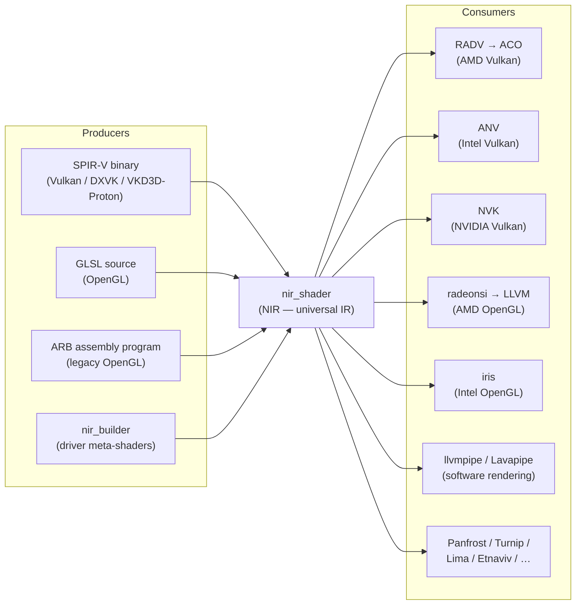
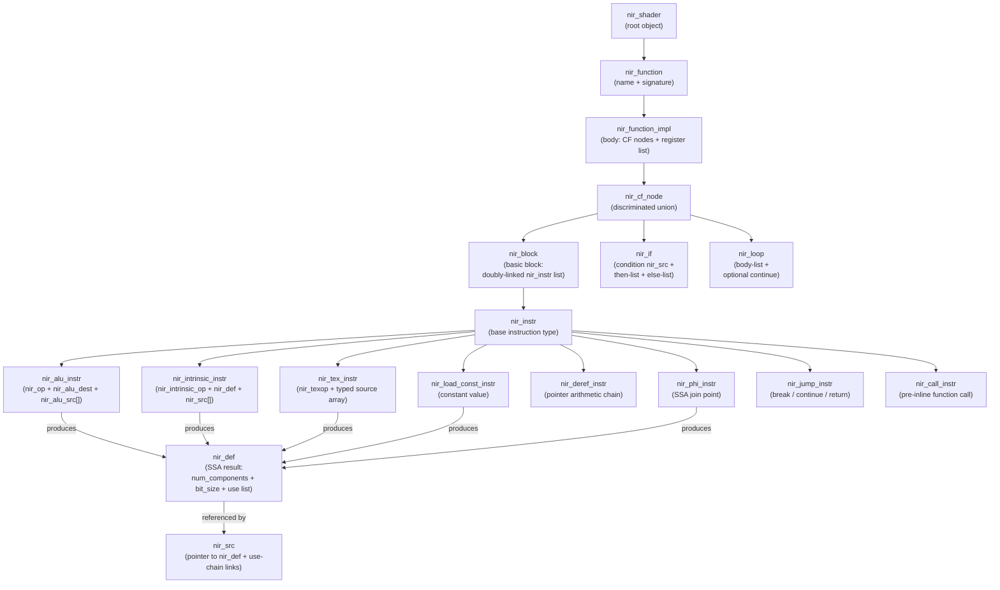
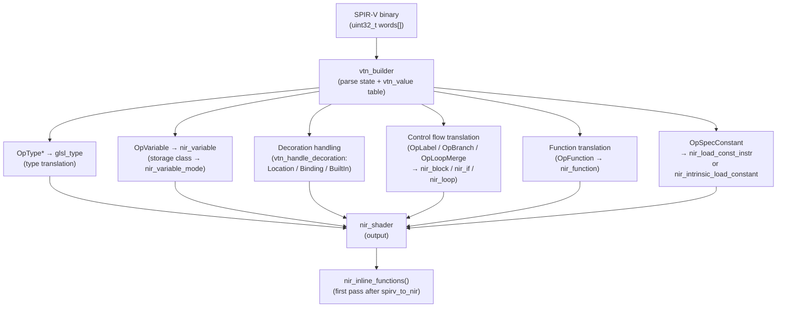
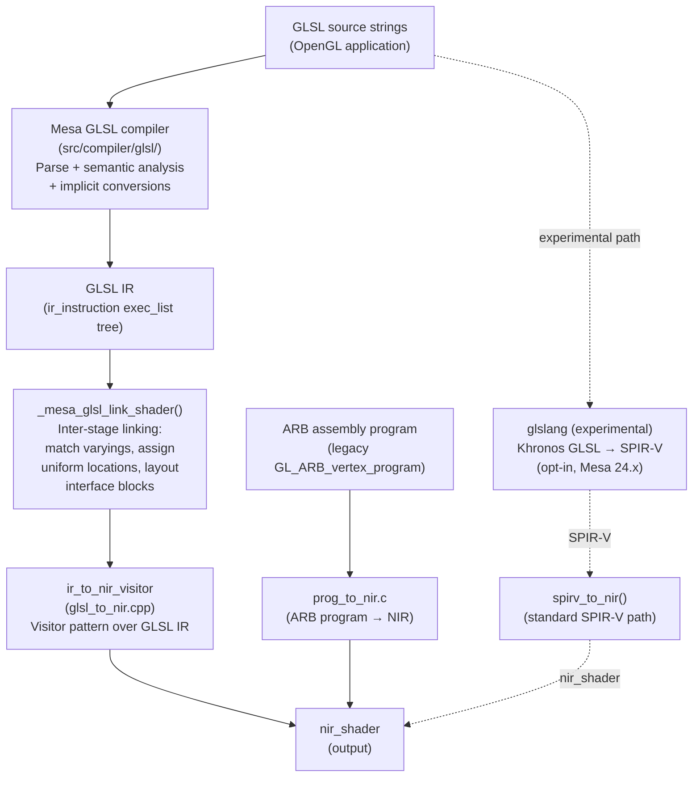
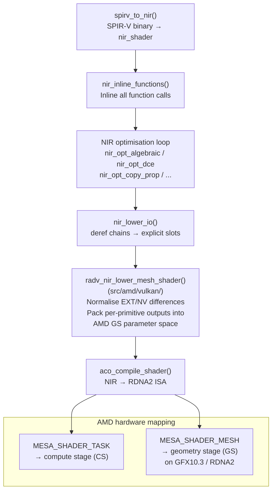

# Chapter 14: NIR: Mesa's Shader Intermediate Representation

> **Part**: Part IV — Mesa Architecture
> **Audience**: Systems developer — primarily driver developers, compiler contributors, and advanced tool developers; application developers benefit from understanding why shader compilation costs what it does and what MESA_SHADER_DUMP can reveal
> **Status**: First draft — 2026-06-06

## Table of Contents

- [Overview](#overview)
- [1. Why Mesa Needed a New IR: Limitations of TGSI](#1-why-mesa-needed-a-new-ir-limitations-of-tgsi)
- [2. NIR Data Structures: The In-Memory Representation](#2-nir-data-structures-the-in-memory-representation)
- [3. The SPIR-V to NIR Front End](#3-the-spir-v-to-nir-front-end)
- [4. The GLSL to NIR Front End](#4-the-glsl-to-nir-front-end)
- [5. NIR Optimisation Passes](#5-nir-optimisation-passes)
- [6. NIR Lowering Passes](#6-nir-lowering-passes)
- [7. NIR Debugging and Dump Infrastructure](#7-nir-debugging-and-dump-infrastructure)
- [8. NIR as Universal Interchange](#8-nir-as-universal-interchange)
- [9. Tessellation and Geometry Shaders in NIR](#9-tessellation-and-geometry-shaders-in-nir)
- [9.1 Mesh and Task Shaders in NIR](#91-mesh-and-task-shaders-in-nir)
- [Integrations](#integrations)
- [References](#references)

---

## Overview

**NIR** — the New Intermediate Representation — is the pivot point of **Mesa**'s entire compiler stack. Every shader that enters **Mesa**, whether written in **GLSL** for an **OpenGL** application, **SPIR-V** for a **Vulkan** game, or embedded **GLSL** inside a driver for internal meta-operations, is translated into **NIR** before any hardware-specific compilation begins. Every **Mesa** driver — **RADV** for **AMD** Vulkan, **ANV** for **Intel** Vulkan, **NVK** for **NVIDIA** Vulkan, **radeonsi** for **AMD** OpenGL, **iris** for **Intel** OpenGL, **llvmpipe** for software rendering — consumes **NIR** and compiles it onward to its target machine code. **NIR** is where the common compiler infrastructure lives, and understanding it is a prerequisite for understanding nearly everything else in the **Mesa** compiler ecosystem.



This chapter explains **NIR** from first principles. It covers why **TGSI** (Tungsten Graphics Shader Infrastructure), the earlier **Gallium** shader **IR**, became inadequate as **GPU** hardware evolved; the complete in-memory data structure hierarchy from **`nir_shader`** down to **`nir_function`**, **`nir_block`**, **`nir_if`**, **`nir_loop`**, and the individual instruction types — **`nir_alu_instr`**, **`nir_intrinsic_instr`**, **`nir_tex_instr`**, **`nir_deref_instr`**, **`nir_phi_instr`**, and **`nir_jump_instr`** — together with **`nir_variable`** and the **`nir_variable_mode`** storage class system; the two primary front ends that produce **NIR** (**SPIR-V** via **`spirv_to_nir()`** and **GLSL** via **`glsl_to_nir()`**); the library of optimisation passes — **`nir_opt_algebraic`**, **`nir_opt_copy_prop`**, **`nir_opt_dce`**, **`nir_opt_cse`**, **`nir_opt_constant_folding`**, **`nir_opt_if`**, and **`nir_opt_loop_unroll`** — that transform **NIR** toward more efficient code; the lowering passes — **`nir_lower_io()`**, **`nir_lower_system_values()`**, **`nir_lower_ubo_vec4()`**, **`nir_lower_int64()`**, **`nir_lower_doubles()`**, **`nir_lower_tex()`**, and **`nir_lower_indirect_derefs()`** — that encode hardware constraints from the **`nir_shader_compiler_options`** struct; and the debugging and validation infrastructure — **`nir_print_shader()`**, **`nir_validate_shader()`**, **`MESA_SHADER_DUMP_PATH`**, **`NIR_DEBUG`**, **`RADV_DEBUG`**, **`ANV_DEBUG`** — that makes **NIR** development tractable. The chapter also covers **NIR** as the universal interchange layer, explaining its architectural position between all producers and consumers and the implications of its non-**ABI** nature for the **Mesa** disk cache. Finally, the chapter covers how **NIR** represents tessellation control shaders (**TCS**), tessellation evaluation shaders (**TES**), and geometry shaders (**GS**) — including the **`nir_lower_gs_intrinsics()`** and **`nir_lower_tess_coord_z()`** passes — as well as the modern mesh and task shader pipeline introduced by **`VK_EXT_mesh_shader`** and **`VK_NV_mesh_shader`**, including **RADV**'s **RDNA2** (**GFX10.3**) mesh shader lowering path via **`aco_compile_shader()`**.

The chapter also covers important recent history: the **`nir_ssa_def`** type was renamed to **`nir_def`** in **Mesa 23.1**, and legacy documentation, blog posts, and older driver code universally use the former name. Readers following any pre-2023 tutorial will need to mentally translate between the two.

After reading this chapter, you will be able to read a raw **NIR** dump and understand what each line means; trace the path a **Vulkan** shader takes from **`vkCreateShaderModule`** through **`spirv_to_nir()`** to driver-specific machine code emission; understand what each category of **NIR** pass does and in what order passes typically run; and write a simple **NIR** pass using the **`nir_builder`** API. With these foundations in place, Chapter 15 (ACO) and Chapter 19 (OpenGL drivers) will be substantially easier to follow.

---

## 1. Why Mesa Needed a New IR: Limitations of TGSI

To understand NIR, it helps to understand what it replaced and why that replacement was necessary. Mesa's original universal shader IR was TGSI, the Tungsten Graphics Shader Infrastructure, inherited from the Tungsten Graphics implementation of Gallium3D. TGSI was designed around the register-based, assembly-like ISAs of GPUs circa 2005–2010: a sequence of instructions that each read from and write to numbered registers, with a limited set of control flow constructs. For the hardware of its era, TGSI was adequate.

The problems accumulated as GPU hardware evolved. TGSI had no notion of static single assignment (SSA) form, the property that each variable is assigned exactly once, which is the algebraic foundation of virtually every modern compiler optimisation. Without SSA, passes like constant propagation, dead code elimination, and common subexpression elimination required conservative data flow analyses that were both slow and imprecise. TGSI also had no native representation for function calls: all shaders were flat sequences of instructions after inlining, which was impossible to avoid. There was no pointer or dereference model, making it extremely awkward to represent the uniform buffer objects, shader storage buffer objects, and variable-length arrays that Vulkan and modern OpenGL introduced. TGSI's type system was limited to 32-bit floats and integers with swizzles and write masks but no concept of 16-bit or 64-bit operations as first-class values. Perhaps most consequentially, TGSI could not natively represent Vulkan descriptor sets, push constants, or the storage class system that SPIR-V brought with it.

The decision to build NIR was taken in 2014. Eric Anholt, then at Intel, initiated the design with the explicit goals of providing a clean SSA-form IR, a rich type system with explicit bit widths, a pointer and dereference model sufficient for the full range of modern GPU memory models, and a modular pass infrastructure where optimisation passes could be written once and reused across all drivers. The initial implementation was largely the work of Connor Abbott during a summer internship, and the first public discussion of NIR appeared around Mesa 10.3. SPIR-V support was added in 2016, driven by the need to support early Vulkan drivers, and the SPIR-V-to-NIR path is now the primary compilation route for all Vulkan shaders in Mesa.

The transition from TGSI to NIR was gradual and took nearly a decade to complete. The GLSL-to-NIR path was added alongside the existing GLSL-to-TGSI path, and drivers migrated individually. The Intel i965 driver moved to NIR first. AMD's radeonsi followed. Drivers that could not migrate fully used a NIR-to-TGSI translation bridge. The GLSL-to-TGSI path was finally removed in Mesa 22.2, representing the deletion of over twenty thousand lines of code and ending a decade-long transition. Any remaining TGSI-consuming driver goes through a NIR-to-TGSI bridge, so NIR is now on every compilation path. Understanding this history is important because you will encounter references to TGSI in older documentation and in the handful of legacy drivers still on the NIR-to-TGSI path; the code for those is in `src/gallium/auxiliary/nir/tgsi_to_nir.c`.

---

## 2. NIR Data Structures: The In-Memory Representation

NIR is defined almost entirely in a single header: `src/compiler/nir/nir.h`. This file runs to several thousand lines and contains every struct, enum, and inline function that makes up the IR. The organisation is hierarchical: a shader contains functions, functions contain control flow nodes, control flow nodes contain instructions, and instructions produce and consume SSA definitions.



### The Top-Level Shader

`nir_shader` is the root object. It contains a list of `nir_function` objects (typically one `main` function for graphics shaders, potentially more for compute or when function calls have not yet been inlined), a `nir_shader_info` struct recording metadata such as the shader stage (`gl_shader_stage` enum: `MESA_SHADER_VERTEX`, `MESA_SHADER_FRAGMENT`, `MESA_SHADER_COMPUTE`, `MESA_SHADER_MESH`, `MESA_SHADER_TASK`, and others), lists of `nir_variable` objects for inputs, outputs, uniforms, and other storage classes, and a constant data blob for initialised variables. The `nir_shader` also holds a pointer to the `nir_shader_compiler_options` struct, which communicates hardware constraints from the driver back to the pass infrastructure (see Section 6).

### Functions and Control Flow

`nir_function` records a name and a signature (parameter and return types). `nir_function_impl` owns the actual body: a list of control flow nodes and the register list. The body is not a flat list of instructions but rather a structured control flow tree using `nir_cf_node` as the discriminated union base type with three variants: `nir_block`, `nir_if`, and `nir_loop`.

`nir_block` is a basic block containing a doubly-linked list of `nir_instr` objects. Blocks are the unit of sequential execution: control enters at the top and exits at the bottom, with no branches in between except the final jump. Each block has a set of predecessor and successor blocks forming the CFG. `nir_if` contains a condition (an `nir_src` naming the SSA def that holds the boolean), a then-list of `nir_cf_node` children, and an else-list. `nir_loop` contains a body list and an optional continue construct. This structured representation means NIR does not require a separate dominator tree construction to identify loops; the loop nesting is explicit in the IR.

### Instructions

`nir_instr` is the base type for all instructions. It contains an `nir_instr_type` enum identifying the subtype, a pointer to the parent block, a sequence index used by passes that need total instruction ordering, and flags used by analysis passes. The concrete subtypes are:

`nir_alu_instr` represents arithmetic and logic operations. It contains an `nir_op` opcode (there are hundreds, covering everything from integer addition to trigonometric functions to pack/unpack operations), a destination of type `nir_alu_dest`, and an array of sources of type `nir_alu_src`. ALU sources carry a swizzle (which components of a vector def are consumed) and optional absolute-value and negate modifiers that GPUs support natively. The destination carries a write mask for vector operations.

`nir_intrinsic_instr` represents operations that do not fit into pure ALU semantics: memory accesses, system value reads, synchronisation barriers, and hardware-specific operations. It contains an `nir_intrinsic_op` identifying the operation, a variable-length source array, an `nir_def` for the result (if any), and a `const_index[]` array carrying side-channel integer parameters specific to the intrinsic (for example, the access flags for a load intrinsic, or the base location for an I/O intrinsic). There are hundreds of intrinsics defined in `src/compiler/nir/nir_intrinsics.py`, which is the authoritative source; this Python file is parsed at build time to generate C enums and tables.

`nir_tex_instr` represents texture sampling and fetching operations. It contains an `nir_texop` enum (sample, fetch, gather, query, and others), a typed source array where each source has an `nir_tex_src_type` tag (coordinate, sampler, texture, level of detail, offset, and others), the number of components in the result, and the destination format. The separation of source types into a typed array rather than positional arguments makes texture instruction manipulation robust to reordering.

`nir_load_const_instr` represents compile-time constant values. It contains an `nir_def` result and a union of typed constant component arrays. Constant values can be 1, 8, 16, 32, or 64 bits wide and up to four components.

`nir_deref_instr` represents pointer arithmetic on shader variables. A deref chain starts with a variable deref (`nir_deref_type_var`) naming a `nir_variable`, then chains through array derefs (`nir_deref_type_array`), struct member derefs (`nir_deref_type_struct`), and cast derefs (`nir_deref_type_cast`). The chain terminates at the actual access, which is a separate intrinsic (`nir_intrinsic_load_deref`, `nir_intrinsic_store_deref`). This model lets NIR represent full C-like pointer arithmetic on uniform buffers, SSBOs, and local variables before lowering collapses it to concrete addressing.

`nir_jump_instr` carries an `nir_jump_type`: `nir_jump_break`, `nir_jump_continue`, or `nir_jump_return`. These terminate basic blocks by exiting structured control flow nodes.

`nir_phi_instr` is the SSA phi function, placed at join points in the CFG. It has a list of `nir_phi_src` entries, each pairing an `nir_src` with the predecessor block it comes from, and a result `nir_def`. Understanding phi nodes is essential: in SSA form, when two control flow paths rejoin and both paths may have assigned different values to the same logical variable, a phi node is inserted at the join point to select which definition reaches the subsequent code. For example, after an if-else that assigns different values to a loop counter, the block following the if-else will have a phi node whose sources are the two possible values.

`nir_call_instr` represents a function call before inlining. It names the callee `nir_function` and carries a source array for the arguments. After `nir_inline_functions()` runs, all call instructions are replaced with the callee's body inline.

### SSA Definitions: nir_def (Formerly nir_ssa_def)

Every instruction that produces a value does so through an embedded `nir_def` struct. This struct records the number of components (`num_components`, 1–16), the bit width (`bit_size`: 1, 8, 16, 32, or 64), the parent instruction pointer, a sequential index within the function, and — critically — a list of `nir_src` objects that use this definition. This use list enables O(1) iteration over all consumers of a value, which is what makes SSA-based optimisations efficient.

Before Mesa 23.1, this struct was named `nir_ssa_def`. It was renamed to `nir_def` as part of a broader cleanup that eliminated the non-SSA register path (`nir_register`) that older code still supported. The rename is pervasive: every blog post, talk, and tutorial written before mid-2023 uses `nir_ssa_def`. The Mesa codebase itself has backward-compatibility typedefs for a transition window, but current code uses `nir_def` exclusively. This distinction matters when reading older driver code or when following any compiler talk slide deck from XDC or FOSDEM.

`nir_src` is the source operand type. After the SSA-only cleanup it is simply a pointer to an `nir_def`, plus list links for the use chain. An `nir_src` is always used through a set of accessor macros and helper functions to ensure the use list stays consistent.

### Variables and Variable Modes

`nir_variable` represents a GLSL-level named object: an input varying, an output, a uniform, a UBO member, an image binding, or a local variable. It carries a `glsl_type` pointer, a name string, a `nir_variable_mode` bitmask, and a `nir_variable_data` struct with layout qualifiers: location, binding, descriptor set, component, interpolation mode, and numerous flags.

The `nir_variable_mode` enum has values for every storage class the GLSL and Vulkan memory models define: `nir_var_shader_in`, `nir_var_shader_out`, `nir_var_uniform`, `nir_var_mem_ubo`, `nir_var_mem_ssbo`, `nir_var_image`, `nir_var_mem_shared`, `nir_var_mem_global`, `nir_var_system_value`, `nir_var_function_temp`, `nir_var_mem_task_payload`, and others. These mode bits are what the lowering passes (Section 6) key on when deciding how to translate a deref chain into concrete hardware accesses.

### Code Example: Core NIR Data Structures

```c
/* Source: src/compiler/nir/nir.h — key struct definitions (Mesa main, 2024) */

/* The SSA definition — every instruction result is one of these.
 * Named nir_ssa_def before Mesa 23.1. */
typedef struct nir_def {
   /** The parent instruction that produces this value */
   struct nir_instr *parent_instr;

   /** List of all nir_src that point to this def (the use list) */
   struct list_head uses;

   /** Sequential index within the function; set by nir_index_ssa_defs() */
   unsigned index;

   /** Number of vector components: 1–16 */
   uint8_t num_components;

   /** Bit width: 1 (bool), 8, 16, 32, or 64 */
   uint8_t bit_size;

   /** True if this def is divergent (non-uniform across a subgroup) */
   bool divergent;
} nir_def;

/* An ALU instruction — arithmetic and logic */
typedef struct nir_alu_instr {
   nir_instr         instr;        /* base; instr.type == nir_instr_type_alu */
   nir_op            op;           /* opcode: nir_op_fadd, nir_op_imul, ... */
   bool              exact;        /* IEEE exact flag */
   bool              no_signed_wrap;
   bool              no_unsigned_wrap;
   nir_alu_dest      dest;         /* destination + write_mask */
   nir_alu_src       src[];        /* variable-length source array */
} nir_alu_instr;

/* An intrinsic instruction — I/O, memory, sync, hw-specific ops */
typedef struct nir_intrinsic_instr {
   nir_instr            instr;     /* base; instr.type == nir_instr_type_intrinsic */
   nir_intrinsic_op     intrinsic; /* opcode: nir_intrinsic_load_input, ... */
   nir_def              def;       /* result definition (if has_dest) */
   unsigned             num_components; /* result component count */
   int                  const_index[NIR_INTRINSIC_MAX_CONST_INDEX];
   nir_src              src[];     /* variable-length source array */
} nir_intrinsic_instr;
```

---

## 3. The SPIR-V to NIR Front End

SPIR-V is the binary shader format that Vulkan mandates. Applications call `vkCreateShaderModule()` with a SPIR-V binary, and the Mesa Vulkan driver calls `spirv_to_nir()` to translate it into an `nir_shader`. This is now the primary path through which shaders enter Mesa for any Vulkan application, including games using DXVK or VKD3D-Proton (which generate SPIR-V from Direct3D shaders).

The SPIR-V front end lives in `src/compiler/spirv/`, with `spirv_to_nir.c` as the primary entry point and a collection of `vtn_*.c` files handling specific capability domains: arithmetic types, memory access, control flow, built-ins, images, atomics, ray tracing, mesh shaders, and others. The entry point function signature is approximately:

```c
/* Source: src/compiler/spirv/spirv_to_nir.c */
nir_shader *
spirv_to_nir(const uint32_t *words, size_t word_count,
             struct nir_spirv_specialization *spec, unsigned num_spec,
             gl_shader_stage stage, const char *entry_point_name,
             const struct spirv_to_nir_options *options,
             const nir_shader_compiler_options *nir_options);
```

The `spirv_to_nir_options` struct communicates which SPIR-V capabilities and extensions the driver supports, robustness requirements, and various behaviour flags. The `nir_shader_compiler_options` struct communicates hardware constraints, as described in Section 6.

The parser builds a `vtn_builder` that holds the parse state throughout the single-pass traversal of the SPIR-V word stream. SPIR-V is a binary format of 32-bit words; the first five words are the magic number, version, generator ID, bound (the maximum result ID + 1), and a reserved zero. Every subsequent instruction begins with a word encoding the opcode and word count. The parser builds a flat `vtn_value` table indexed by SPIR-V result IDs; when an instruction produces a result, its entry in this table is filled.



Type translation converts SPIR-V `OpType*` instructions to `glsl_type` objects: `OpTypeFloat` with a width of 32 becomes `glsl_type::float_type`, `OpTypeVector` of two floats becomes `glsl_type::vec2_type`, `OpTypeStruct` becomes a named struct type with member types, and `OpTypePointer` encodes both the storage class (which becomes the `nir_variable_mode`) and the pointee type. This type translation is the foundation on which all subsequent translation rests.

Variable declaration (`OpVariable`) produces an `nir_variable`. The storage class determines the `nir_variable_mode`: `StorageBuffer` maps to `nir_var_mem_ssbo`, `Uniform` to `nir_var_mem_ubo`, `UniformConstant` to `nir_var_uniform`, `Input` to `nir_var_shader_in`, `Output` to `nir_var_shader_out`, `Workgroup` to `nir_var_mem_shared`, `Private` to `nir_var_function_temp`, `TaskPayloadWorkgroupEXT` to `nir_var_mem_task_payload`.

Decoration handling in `vtn_handle_decoration()` populates the `nir_variable_data` fields: `Location` decorations set the interpolation slot, `Binding` sets the binding index, `DescriptorSet` sets the descriptor set index, `BuiltIn` sets the built-in semantic (for example, `SpvBuiltInPosition` maps to the `VARYING_SLOT_POS` slot on the output variable), and `Interpolate*` decorations set the interpolation mode. All of this information is preserved in the `nir_variable` and made available to subsequent passes.

Control flow translation maps SPIR-V structured control flow to NIR's structured control flow representation. `OpLabel` creates an `nir_block`. `OpBranchConditional` driving a `OpSelectionMerge`-marked merge block becomes an `nir_if` node. `OpBranch` driving an `OpLoopMerge` block becomes an `nir_loop` node. SPIR-V's requirement that all control flow be structured (no arbitrary jumps into the middle of a selection or loop) maps cleanly to NIR's structured control flow model. The translator must handle the occasional case where SPIR-V code generators produce slightly non-standard structured control flow and applies normalization.

Function translation creates `nir_function` objects for each `OpFunction`. The call graph is built across all functions. After `spirv_to_nir()` returns, `nir_inline_functions()` is typically the first pass run, inlining all callees into `main`. This is acceptable for GPU shaders because recursion is forbidden by both GLSL and SPIR-V.

One feature of the SPIR-V-to-NIR path worth noting explicitly is that `OpSpecConstant` (specialization constants) are handled at this stage. If the driver provides specialization values in the `nir_spirv_specialization` array, those constants are folded into `nir_load_const_instr` nodes; unspecialized constants become `nir_intrinsic_load_constant` intrinsics that subsequent passes can fold. This is how Vulkan's `VkSpecializationInfo` mechanism works under the hood.

The SPIR-V front end also handles `VK_EXT_robustness2` buffer bounds checking. When the `options->robust_buffer_access` flag is set, the translator wraps buffer load and store intrinsics with bounds checks, producing conditional selects that return zero (or leave the destination undefined) for out-of-bounds accesses. This robustness work is done at the IR level rather than in hardware for drivers that do not have native robust access support.

---

## 4. The GLSL to NIR Front End

OpenGL applications submit GLSL source strings, not SPIR-V. The GLSL-to-NIR front end is older than the SPIR-V path and more complex, reflecting GLSL's semantically richer source language. The translation happens in two stages. First, the Mesa GLSL compiler (in `src/compiler/glsl/`) parses the GLSL source into an AST, performs semantic analysis, resolves overloaded function calls, handles implicit type conversions, and produces GLSL IR — a tree-based IR of `ir_instruction` objects living in `exec_list` chains. Second, `glsl_to_nir()` in `src/compiler/glsl/glsl_to_nir.cpp` walks the GLSL IR and emits NIR instructions.

The `ir_to_nir_visitor` class is the heart of the second stage. It implements the visitor pattern over GLSL IR node types: `visit(ir_assignment *)`, `visit(ir_call *)`, `visit(ir_if *)`, `visit(ir_loop *)`, `visit(ir_expression *)`, and so on for each GLSL IR node type. Each visitor method emits the corresponding NIR instructions using the `nir_builder` API (see Section 7). Assignment becomes an `nir_intrinsic_store_deref` or an `nir_intrinsic_store_output` depending on whether the destination is a memory variable or a shader output. A GLSL function call to a built-in like `sin()` becomes an `nir_op_fsin` ALU instruction; a call to a user-defined function becomes an `nir_call_instr` that later inlining will eliminate.

Before the `glsl_to_nir()` translation occurs, the GLSL program must be linked. `_mesa_glsl_link_shader()` performs the inter-stage linking that GLSL requires: matching input and output varyings between stages by name, assigning uniform locations, laying out interface blocks, and resolving `gl_PerVertex` built-ins. This linking step determines the `location` fields that end up on `nir_variable` objects after translation. It is this pre-translation linking requirement that makes the GLSL path more complex than SPIR-V: in SPIR-V, locations and bindings are declared in the source and do not require a linking step.

GLSL ES (the version of GLSL used on mobile OpenGL ES hardware) uses the same front end with a different language version enum. ES precision qualifiers (`lowp`, `mediump`, `highp`) are recorded on the GLSL type and propagate to the NIR bit width: `mediump float` may become a 16-bit float type in NIR on hardware that supports it, triggering a different code generation path. This is one of the places where the `nir_shader_compiler_options.lower_mediump_io` flag is relevant.

The GLSL front end also handles ARB assembly programs (the `GL_ARB_vertex_program` and related extensions) via a separate `prog_to_nir.c` translation path. This path is primarily for compatibility with very old OpenGL applications that never moved to GLSL; it translates fixed-function assembly-like program objects into the same NIR representation.

The long-term trajectory of the GLSL front end is to converge on the SPIR-V path: modern builds of Mesa can optionally route GLSL shaders through an internal Khronos reference GLSL compiler (glslang) that produces SPIR-V, which then goes through the same `spirv_to_nir()` path. This eliminates the GLSL IR intermediate representation entirely. As of Mesa 24.x this remains an opt-in experimental path rather than the default.



---

## 5. NIR Optimisation Passes

NIR's optimisation passes are the most directly reusable part of the Mesa compiler stack. A driver author implementing a new backend does not need to write a new algebraic simplifier, dead code eliminator, or copy propagator. These passes are already written, tested across millions of shaders, and available simply by calling the relevant functions on an `nir_shader *`. This section covers the most important passes and their interactions.

Every NIR optimisation pass has the same signature pattern: it takes an `nir_shader *` and returns a `bool` indicating whether the shader was modified. This uniformity enables passes to be composed into loops that run until a fixpoint (no pass reports a modification). Drivers typically do this with a pattern like:

```c
/* Source: a representative driver pass loop, typical of multiple drivers */
bool progress;
do {
    progress = false;
    NIR_PASS(progress, nir, nir_opt_copy_prop);
    NIR_PASS(progress, nir, nir_opt_dce);
    NIR_PASS(progress, nir, nir_opt_constant_folding);
    NIR_PASS(progress, nir, nir_opt_algebraic);
    NIR_PASS(progress, nir, nir_opt_cse);
    NIR_PASS(progress, nir, nir_opt_if, nir_opt_if_aggressive_last_continue);
} while (progress);
```

The `NIR_PASS` macro handles metadata invalidation (see Section 7) and integrates with the NIR validation infrastructure in debug builds.

### The Algebraic Pass: nir_opt_algebraic

The most important single pass is `nir_opt_algebraic`, implemented in `src/compiler/nir/nir_opt_algebraic.c`. This file is not written by hand; it is generated by the Python script `src/compiler/nir/nir_opt_algebraic.py` during the Meson build. The generated file is therefore not present in the Mesa source tree, only in the build directory — readers who clone Mesa and look for `nir_opt_algebraic.c` will not find it in `src/compiler/nir/`.

The Python generator uses a pattern description language where each optimisation rule is a tuple of the form `(pattern, replacement)` or `(pattern, replacement, condition)`. Patterns match instruction trees; replacements describe what to substitute. A small selection of rules illustrates the syntax:

```python
# Source: src/compiler/nir/nir_opt_algebraic.py — selected algebraic rules
optimizations = [
   # Additive identity
   (('fadd', a, 0.0), a),
   # Multiplicative identity
   (('fmul', a, 1.0), a),
   # Multiplicative zero
   (('fmul', a, 0.0), 0.0),
   # Double negation
   (('fneg', ('fneg', a)), a),
   # fadd(a, fneg(a)) → 0.0
   (('fadd', a, ('fneg', a)), 0.0),
   # fmul by 2.0 becomes fadd
   (('fmul', a, 2.0), ('fadd', a, a)),
   # min/max absorption: min(max(a, b), b) → b
   (('fmin', ('fmax', a, b), b), b),
   # Boolean AND with false
   (('iand', a, False), False),
   # Integer multiply by power of two → shift
   (('imul', a, 2), ('ishl', a, 1)),
   (('imul', a, 4), ('ishl', a, 2)),
   # Comparison simplification
   (('ine', ('ine', a, b), False), ('ine', a, b)),
]
```

The Python generator traverses these patterns and produces a C search-and-replace engine using a hash-keyed dispatch table. Each rule generates a C match function that checks the opcode and recurses through source operands; if the match succeeds, the replacement is applied by building new instructions with `nir_builder` and replacing the instruction result in the use list. The generated code handles swizzle matching and component-wise application automatically.

### Copy Propagation: nir_opt_copy_prop

`nir_copy_prop()` traverses the function in dominator order and replaces uses of SSA defs that are themselves copies of other defs. In NIR, a "copy" is an ALU move (`nir_op_mov`) or a deref load followed by a store to an SSA value. SSA form makes copy propagation particularly efficient: because each def is written exactly once, if a def is a copy of another def that dominates it, every use of the copy can be replaced with the original without any data flow analysis beyond dominator checking.

### Dead Code Elimination: nir_opt_dce

`nir_opt_dce()` removes instructions whose result `nir_def` has an empty use list. Starting from all instructions that have side effects (stores, intrinsics, jumps, and phi nodes), it works backward through the use-def chains. Any instruction whose result is not reachable from a side-effectful instruction is removed. Because the use list on each `nir_def` is maintained incrementally, DCE can identify dead instructions in a single backwards pass. After `nir_opt_algebraic` runs and produces constant results for many expressions, the instructions computing those expressions typically become dead; DCE removes them.

### Common Subexpression Elimination: nir_opt_cse

`nir_opt_cse()` walks the function identifying instructions that compute identical results. In SSA form, two instructions compute the same result if they have the same opcode and their source defs are the same (after applying copy propagation). When duplicates are found, the second instruction is replaced with the first, and the second instruction's def references are updated to point to the first instruction's def. CSE is particularly effective after loop unrolling, where the same address calculation may be repeated in each unrolled iteration.

### Constant Folding: nir_opt_constant_folding

`nir_opt_constant_folding()` evaluates instructions whose all source operands are `nir_load_const_instr` results. If an `nir_op_iadd` has two constant sources, it is replaced by a new `nir_load_const_instr` holding the sum. This interacts strongly with algebraic: algebraic may introduce a constant subtraction that constant folding then evaluates, which algebraic can then simplify further.

### If Simplification and Loop Optimisation

`nir_opt_if()` performs several if-statement simplifications: removing dead branches where the condition is a compile-time constant, merging consecutive if statements with identical conditions, and short-circuiting trivially-always-executed branches. `nir_opt_loop()` and `nir_opt_loop_unroll()` handle loop-level optimisations including unrolling small loops with statically-known trip counts. Loop unrolling is particularly important for GPU shaders where the hardware does not have branch prediction and loop overhead is significant.

`nir_opt_peephole_select()` converts small if-then-else blocks to `bcsel` (boolean conditional select) instructions. On GPU hardware, which is typically SIMD and executes both sides of a branch simultaneously, converting small branches to select instructions avoids divergence overhead. The pass has a configurable threshold for how many instructions in the then- and else-branches it is willing to speculate.

### Other Passes

`nir_remove_dead_variables()` removes `nir_variable` objects that are never referenced by any instruction in the shader. This is important after SPIR-V translation, where the input variable list may contain built-ins and I/O variables that earlier passes determined are not actually used. `nir_lower_vars_to_ssa()` promotes `nir_variable` accesses that can be shown not to alias into SSA values, enabling the SSA-based optimisations above to apply to what was previously a memory operation. `nir_opt_shrink_vectors()` reduces the number of components produced by vector instructions when the consuming instructions only use a subset, reducing register pressure.

---

## 6. NIR Lowering Passes

Optimisation passes improve the code without changing its meaning or making it more hardware-specific. Lowering passes are different in kind: they make NIR more concrete and less portable, encoding constraints of the target hardware into the IR. Lowering is not primarily about performance; it is about correctness. An instruction that is perfectly valid in NIR may be illegal on the target GPU, and the lowering pass is what translates it to something legal.

The bridge between driver hardware capabilities and lowering pass behaviour is the `nir_shader_compiler_options` struct. Every NIR pass that has hardware-dependent behaviour accepts or queries this struct, which lives in `src/compiler/nir/nir.h`. Drivers fill this struct with values reflecting their hardware capabilities and pass it to the front end at the start of compilation; it is then available on every `nir_shader` via `nir->options`. A representative partial definition:

```c
/* Source: src/compiler/nir/nir.h — nir_shader_compiler_options (abridged) */
typedef struct nir_shader_compiler_options {
   /* If true, the driver does not have native 64-bit integer support;
    * nir_lower_int64() must be called to decompose to 32-bit pairs */
   bool lower_int64;

   /* If true, mediump I/O (16-bit) must be lowered to 32-bit */
   bool lower_mediump_io;

   /* Decompose doubles into float pairs for drivers without FP64 hardware */
   nir_lower_doubles_options lower_doubles_options;

   /* Replace ffloor(x) with x - fract(x) etc. for hardware lacking flrp */
   bool lower_flrp32;
   bool lower_flrp64;

   /* Use interpolated input intrinsics rather than load_input for FS */
   bool use_interpolated_input_intrinsics;

   /* Vectorize 16-bit pairs to 32-bit ops where possible */
   bool vectorize_vec2_16bit;

   /* Lower TCS patch outputs to temporary variables */
   bool lower_patch_outputs_to_temps;

   /* Number of ALU components for vectorization (driver-dependent) */
   uint8_t vector_alu_components;

   /* ... dozens more fields ... */
} nir_shader_compiler_options;
```

### I/O Lowering

The most universally applied lowering pass is `nir_lower_io()`, implemented in `src/compiler/nir/nir_lower_io.c`. Before this pass runs, shader inputs and outputs are represented as `nir_variable` objects with `nir_var_shader_in` and `nir_var_shader_out` modes, accessed through `nir_intrinsic_load_deref` and `nir_intrinsic_store_deref` instructions that walk deref chains. After `nir_lower_io()` runs, those deref-based accesses are replaced with `nir_intrinsic_load_input` and `nir_intrinsic_store_output` intrinsics carrying explicit byte-offset arithmetic. This converts the memory-model view of I/O (uniform memory spaces accessible via pointers) to the register-model view (numbered slots in a hardware I/O interface). The pass computes byte offsets taking into account the `glsl_type`'s layout (row-major vs. column-major, array stride, etc.) and the variable's location and component.

### System Value Lowering

`nir_lower_system_values()` replaces intrinsic loads of GL/Vulkan built-ins (`gl_VertexIndex`, `gl_DrawID`, `gl_LocalInvocationID`, `gl_SubgroupID`, etc.) with hardware-specific intrinsics that the driver's backend understands. The built-in to intrinsic mapping is hardware-dependent: `gl_VertexID` on some hardware is provided by a hardware register read, while on others it must be computed from a base offset and the hardware-supplied vertex index.

### UBO and SSBO Lowering

`nir_lower_ubo_vec4()` converts UBO member accesses that operate in terms of the GLSL type layout to explicit vec4-aligned loads from a buffer descriptor, which is what older Gallium drivers expect. More modern drivers use `nir_lower_explicit_io()` for uniform buffer and SSBO access, which lowers the deref chain to a base pointer (the buffer descriptor) plus an offset scalar and generates `nir_intrinsic_load_global` or `nir_intrinsic_load_ssbo` with computed addresses. The choice between these lowering strategies is recorded in `nir_shader_compiler_options.use_bindless_io` and related flags.

### Bit Width Lowering

`nir_lower_int64()` decomposes 64-bit integer operations into pairs of 32-bit operations for hardware that does not support native 64-bit integers. An `nir_op_iadd` on 64-bit values becomes two 32-bit additions with a carry propagation sequence. This transformation significantly increases instruction count but is required for correctness on hardware like many mobile GPUs and some older desktop parts. Similarly, `nir_lower_doubles()` handles hardware without FP64 support by emulating double-precision operations in software using 32-bit parts.

### Texture Lowering

`nir_lower_tex()` normalises texture instruction forms to match what the backend expects. It can insert LOD bias, normalise 2D array texture coordinates, convert projective texture coordinates by dividing by q, add comparison mode logic for shadow samplers, and transform texture coordinate types. The set of normalisations applied is controlled by an `nir_lower_tex_options` struct, which drivers fill based on their hardware's texture unit capabilities.

### Indirect Array Lowering

`nir_lower_indirect_derefs()` handles variable-index array accesses into uniform arrays or shader I/O. When the array index is a non-constant SSA value, some hardware cannot handle it directly. The pass converts such accesses to explicit if-chains comparing the index against each possible value and selecting the corresponding constant-indexed access, or to driver-specific indirect addressing intrinsics depending on the `nir_lower_indirect_temp_modes` argument.

### Geometry and Tessellation Lowering

`nir_lower_gs_intrinsics()` rewrites `emit_vertex` and `end_primitive` intrinsics into explicit vertex counter increments and per-vertex memory stores. This is required by drivers that implement geometry shaders using ring buffers managed in the shader program. `nir_lower_tess_coord_z()` reconstructs the third barycentric coordinate of a tessellated triangle for hardware that provides only two of the three.

---

## 7. NIR Debugging and Dump Infrastructure

NIR's debugging infrastructure is one of its most practically important features for driver developers. Understanding how to trigger and read NIR dumps is essential for diagnosing shader compilation bugs.

### Human-Readable Text Format

`nir_print_shader()` in `src/compiler/nir/nir_print.c` prints an `nir_shader` to a FILE stream in a human-readable text format. The format uses a notation roughly similar to LLVM IR but adapted to GPU shader semantics. An annotated example of a simple vertex shader dump illustrates the format:

```c
/* Example: NIR dump of a simple vertex transform shader
 * produced by nir_print_shader() — Mesa 24.x format */

shader: MESA_SHADER_VERTEX
name: GLSL1
inputs: 2
outputs: 2

decl_var shader_in INTERP_MODE_NONE vec4 in_position (VERT_ATTRIB_GENERIC0.xyzw, 0)
decl_var shader_in INTERP_MODE_NONE vec2 in_texcoord (VERT_ATTRIB_GENERIC1.xy, 1)
decl_var shader_out INTERP_MODE_NONE vec4 gl_Position (VARYING_SLOT_POS.xyzw, 0)
decl_var shader_out INTERP_MODE_NONE vec2 out_texcoord (VARYING_SLOT_VAR0.xy, 4)

impl main {
    block b0:   /* preds: */
    /* Load the position input from hardware register slot 0 */
    %0 = intrinsic load_input (zero) (0, 0, 160) (io sem={location=0 ..})
    /* %0 is vec4 32-bit, the xyzw components of in_position */

    /* Multiply position by the MVP matrix — simplified to single mul */
    %1 = load_const (4x32) [1.0, 0.0, 0.0, 0.0]  /* mvp row 0 */
    %2 = fdot4 %0.xyzw, %1.xyzw                    /* dot(pos, row0) */
    /* ... more dot products for y, z, w components ... */

    /* Store gl_Position output */
    intrinsic store_output (%4) (0, 0, 15, 160) (io sem={location=0 ...})

    /* Load texcoord input */
    %5 = intrinsic load_input (zero) (1, 0, 32) (io sem={location=1 ...})

    /* Store texcoord output */
    intrinsic store_output (%5) (4, 0, 3, 32) (io sem={location=4 ...})

    /* All blocks end with a jump; the function return is implicit */
    /* block b0 succs: */
}
```

In this notation, `%0`, `%1`, etc. are SSA defs numbered by `nir_index_ssa_defs()`. Each def has an implicit type derived from the instruction producing it. Intrinsics show their source SSA defs in parentheses, then their `const_index[]` values in a second parenthesised list.

### Environment Variable Triggers

The most common way to obtain NIR dumps is through environment variables recognised by Mesa at runtime:

`MESA_SHADER_DUMP_PATH=/tmp/shaders` causes Mesa to dump every shader (at compile time, in NIR text format) to files in the specified directory. File names encode the shader stage and a hash of the NIR. This is invaluable for examining exactly what a game or application is compiling.

`NIR_DEBUG=print` triggers NIR printing inside the optimisation pass pipeline, controlled by the pass infrastructure. This can produce verbose output but shows the IR at intermediate stages.

`RADV_DEBUG=shaders` is AMD-specific and prints NIR plus ACO-generated assembly for every compiled shader. The output includes both the pre-ACO NIR and the final ISA, making it possible to trace a single optimisation through both levels.

`ANV_DEBUG=dump-shaders` provides similar functionality for Intel's ANV Vulkan driver.

### The NIR Validator

`nir_validate_shader()` in `src/compiler/nir/nir_validate.c` is an extensive assertion-based validator. It checks that every `nir_src` that claims to use a `nir_def` is actually on that def's use list; that every SSA def has exactly one parent instruction; that the types of instruction operands are consistent; that the CFG structure is well-formed (no block appears in both the then and else branches of an if); that phi node sources come from the correct predecessor blocks; and dozens of other invariants. The validator is run automatically in debug builds (when Mesa is configured with `-Dbuildtype=debugoptimized` or `-Dbuildtype=debug`) after each pass in the `NIR_PASS` macro. In release builds it is compiled out.

A validation failure produces output that includes the invalid instruction and the invariant that was violated. For example:

```text
VALIDATION ERROR: ssa_def 'nir_def' bit_size mismatch
  Instruction (load_input) produces 32-bit result
  Source in (fadd) expects 16-bit operand
  Shader: MESA_SHADER_VERTEX
  Function: main
  Block: b0
```

Reading this output requires understanding that the error points to the consuming instruction (the `fadd`) and the mismatched source operand type, not merely that a type error occurred somewhere.

### The nir_builder API

`nir_builder` (defined in `src/compiler/nir/nir_builder.h`) is the API for programmatically constructing NIR instructions. Every NIR pass that modifies or creates instructions uses it. The key functions are:

```c
/* Source: src/compiler/nir/nir_builder.h — nir_builder basics */

/* Initialize a builder positioned at a specific instruction */
nir_builder b = nir_builder_at(nir_before_instr(instr));

/* Build an fadd instruction: returns the result nir_def* */
nir_def *sum = nir_fadd(&b, a, b_val);

/* Build an intrinsic load */
nir_def *val = nir_load_var(&b, var);

/* Build a load_const */
nir_def *c = nir_imm_float(&b, 2.0f);

/* Replace all uses of old_def with new_def and remove old_def's instruction */
nir_def_rewrite_uses(old_def, new_def);
nir_instr_remove(old_def->parent_instr);
```

A complete skeleton of a simple NIR pass that replaces `a * 2.0` with `a + a` illustrates the pass structure:

```c
/* Source: pedagogical example — structure of a NIR optimisation pass */
static bool
lower_fmul_two_to_fadd(nir_builder *b, nir_instr *instr, void *data)
{
   /* Only care about ALU instructions */
   if (instr->type != nir_instr_type_alu)
      return false;

   nir_alu_instr *alu = nir_instr_as_alu(instr);
   if (alu->op != nir_op_fmul)
      return false;

   /* Check that one source is the constant 2.0 */
   nir_alu_src *src0 = &alu->src[0];
   nir_alu_src *src1 = &alu->src[1];

   nir_def *non_const = NULL;
   if (nir_src_is_const(src1->src) &&
       nir_src_as_float(src1->src) == 2.0) {
      non_const = src0->src.ssa;
   } else if (nir_src_is_const(src0->src) &&
              nir_src_as_float(src0->src) == 2.0) {
      non_const = src1->src.ssa;
   } else {
      return false;
   }

   /* Position the builder after this instruction */
   b->cursor = nir_after_instr(instr);

   /* Build the replacement: a + a */
   nir_def *result = nir_fadd(b, non_const, non_const);

   /* Replace all uses of the old fmul result and remove it */
   nir_def_rewrite_uses(&alu->def, result);
   nir_instr_remove(instr);
   return true;
}

bool
nir_lower_fmul_two(nir_shader *shader)
{
   return nir_shader_instructions_pass(
      shader, lower_fmul_two_to_fadd,
      nir_metadata_block_index | nir_metadata_dominance,
      NULL);
}
```

### Metadata and Invalidation

Passes declare which metadata analyses they require (via `nir_metadata_require()`) and which they preserve (via `nir_metadata_preserve()`). The metadata bits are flags on the `nir_function_impl`: `nir_metadata_block_index` (sequential block numbering), `nir_metadata_dominance` (dominator tree), `nir_metadata_live_defs` (liveness analysis). If a pass modifies the CFG — inserting or removing blocks — it must invalidate these bits; otherwise subsequent passes that query the dominator tree will get stale results, producing subtle correctness bugs that are extremely difficult to diagnose.

---

## 8. NIR as Universal Interchange

Mesa's compiler stack has accumulated several shader intermediate representations over its lifetime, each designed to solve a different problem at a different level of abstraction. Understanding where NIR sits relative to TGSI, SPIR-V, LLVM IR, ACO IR, and NAK IR is essential for reading driver code, interpreting debug dumps, and grasping why NIR occupies a uniquely privileged position in the compilation pipeline. The table below summarises the key properties of each IR currently relevant to Mesa.

| **IR** | **SSA form** | **Type system** | **Where produced** | **Where consumed** | **Hardware-agnostic?** | **Status in Mesa** |
|---|---|---|---|---|---|---|
| TGSI (Tungsten Graphics Shader Infrastructure) | No | Loosely typed (TGSI registers) | Legacy GLSL compiler, state tracker | Gallium pipe drivers (still used by r300, older paths) | Yes | Deprecated; being replaced by NIR |
| NIR (New IR) | Yes (phi nodes) | Typed (int/float/bool, explicit bit-width) | GLSL→NIR, SPIR-V→NIR front ends | All Mesa Vulkan and Gallium backends | Yes | Primary Mesa IR; universal interchange |
| SPIR-V | Yes | Strongly typed (decorations, storage classes) | Vulkan/OpenCL applications, glslang, DXC | SPIR-V→NIR translation (spir-v.c) | Yes | Input to Mesa; not used internally after ingestion |
| LLVM IR | Yes | Typed (LLVM type system) | clang, mesa's LLVM path | LLVM amdgpu/radeonsi backends | No (target-specific passes needed) | Used by RadeonSI/llvmpipe; not the primary Mesa path for Vulkan |
| ACO IR | Partial (uses SSA for values) | Close to GCN/RDNA ISA types | NIR→ACO lowering in RADV | ACO instruction emitter | No (AMD-specific) | RADV Vulkan driver only |
| NAK IR | Yes (SSA throughout) | Typed (NVIDIA reg classes: UGPR, SGPR, UReg) | NIR→NAK lowering in NVK | NAK ISA encoder | No (NVIDIA-specific) | NVK Vulkan driver; Rust implementation |

NIR occupies a unique architectural position: it is the only representation that every Mesa compiler producer and every Mesa compiler consumer interacts with. This universality is what makes NIR so central to the Mesa ecosystem.

On the producer side: GLSL source compiles to NIR via the GLSL IR intermediate. SPIR-V compiles to NIR via `spirv_to_nir()`. ARB programs compile to NIR via `prog_to_nir()`. Mesa Vulkan drivers generate NIR directly via `nir_builder` for internal meta-shaders — the shaders used to implement clears, blits, buffer copies, and other driver-internal operations. This last use case is significant: drivers routinely build tens or hundreds of small NIR shaders at initialisation time to have compiled and cached for frequent use.

On the consumer side: RADV hands NIR to the ACO backend (Chapter 15) via `aco_compile_shader()`. radeonsi passes NIR to the LLVM backend via `si_compile_shader()`. iris passes NIR to Intel's EU assembly generator. ANV passes NIR to either LLVM or ACO. NVK passes NIR to NVIDIA's hardware-specific backend. Panfrost, Turnip (Adreno Vulkan), Lima, Etnaviv, and the software renderers llvmpipe and Lavapipe all consume NIR. Every Mesa driver that has migrated from TGSI is a NIR consumer.

The universality comes with a constraint: NIR is not an ABI. It is compiled into each driver and its data structures, pass signatures, and intrinsic definitions are not stable across Mesa versions. A shader represented as an `nir_shader` in Mesa 23.x is not bitwise compatible with Mesa 24.x. The disk cache (Chapter 12) does not cache NIR directly; it caches either the shader source hash (causing recompilation from NIR on cache miss) or the final compiled binary. Understanding this non-ABI nature is important when reading caching code or when writing tools that process NIR outside of the normal compilation pipeline.

The interchange model also simplifies driver development substantially. When writing a new driver backend, the implementer can rely on the full suite of NIR optimisation passes having already run; the NIR arriving at the backend entry point is already in SSA form with dead code eliminated, constants folded, I/O lowered to explicit slots, and system values translated to hardware intrinsics. The backend writer focuses on instruction selection (mapping NIR opcodes and intrinsics to ISA instructions) and register allocation, not on re-implementing algebraic simplification.

---

## 9. Tessellation and Geometry Shaders in NIR

Modern OpenGL 4.x and Vulkan pipelines include four additional shader stages beyond the basic vertex-fragment pair: the tessellation control shader (TCS, also called the hull shader in Direct3D), the tessellation evaluation shader (TES, also called the domain shader), and the geometry shader (GS). Each has a distinct execution model that NIR must represent faithfully before lowering to hardware.

### Tessellation Control Shaders

The TCS operates on patches: groups of input vertices over which it computes per-patch and per-vertex output data. The `nir_shader.info.tess.tcs_vertices_out` field records the output patch vertex count declared by `layout(vertices = N) out` in GLSL. This value constrains hardware resource allocation.

TCS outputs have two distinct kinds. Per-vertex outputs are `nir_variable` objects with `nir_var_shader_out` mode; they are indexed by both the patch vertex index and the output variable. Per-patch outputs are distinguished by the `nir_variable.data.patch` flag set to true; they are not indexed by vertex and carry single values per patch. The tessellation level arrays `gl_TessLevelOuter[4]` and `gl_TessLevelInner[2]` are per-patch outputs assigned the `VARYING_SLOT_TESS_LEVEL_OUTER` and `VARYING_SLOT_TESS_LEVEL_INNER` built-in slots.

After `nir_lower_io()` processes a TCS, the deref-based accesses are replaced by `nir_intrinsic_store_per_vertex_output` and `nir_intrinsic_store_per_patch_output` intrinsics. These carry the per-vertex index (the invocation ID) and per-patch index as sources, separating the two data streams clearly. The separation is important because hardware processes them differently: per-vertex outputs typically go into a per-vertex ring buffer indexed by `gl_InvocationID`, while per-patch outputs go into a per-patch area.

Invocation synchronisation is represented by `nir_intrinsic_barrier` with execution scope `NIR_SCOPE_WORKGROUP` and memory scope `NIR_SCOPE_WORKGROUP`. This barrier separates the phase of the TCS that computes per-vertex outputs from the phase that reads other invocations' outputs.

```c
/* Source: illustrative NIR dump of TCS output variables and lowered intrinsics */

/* Per-vertex output — nir_variable before nir_lower_io() */
decl_var shader_out INTERP_MODE_NONE vec4 gl_out[].Position
   (VARYING_SLOT_POS.xyzw, patch=0, per_vertex=1)

/* Per-patch output — nir_variable.data.patch = true */
decl_var shader_out INTERP_MODE_NONE float[4] gl_TessLevelOuter
   (VARYING_SLOT_TESS_LEVEL_OUTER, patch=1, per_vertex=0)

/* After nir_lower_io(): per-vertex store intrinsic */
/* (sources: value, vertex_index, offset_src) */
intrinsic store_per_vertex_output (%pos_value, %invoc_id, zero) (0, 15, 160)

/* After nir_lower_io(): per-patch store intrinsic */
intrinsic store_per_patch_output (%tl_outer_val, zero) (slot=TESS_LEVEL_OUTER, 1, 32)
```

On AMD hardware, the LS (Local Shader) and HS (Hull Shader) stages correspond to the VS feeding the TCS and the TCS itself. The TCS is compiled to the HS stage, and NIR is lowered to HS-specific semantics before RADV passes it to ACO. The `ac_nir_lower_tess_io_to_mem.c` pass (in `src/amd/common/`) handles this AMD-specific lowering, converting the generic TCS output intrinsics to explicit LDS (Local Data Share) and VRAM stores that the AMD HS stage expects.

### Tessellation Evaluation Shaders

The TES runs once per tessellated vertex. It receives a `(u, v)` (or `(u, v, w)` for triangles) barycentric coordinate from the fixed-function tessellator, reads per-vertex and per-patch data from the TCS, and computes the final vertex position. The primitive mode, spacing mode, and winding order are stored as metadata in the `nir_shader_info` struct: `info.tess.primitive_mode` (`TESS_PRIMITIVE_TRIANGLES`, `TESS_PRIMITIVE_QUADS`, `TESS_PRIMITIVE_ISOLINES`), `info.tess.spacing`, and `info.tess.ccw`. These are purely metadata; they do not produce NIR instructions but are read by the hardware setup code.

`nir_intrinsic_load_tess_coord` loads the barycentric coordinate. On hardware that provides three coordinates for triangles, the third coordinate w = 1 − u − v can be computed from the first two; `nir_lower_tess_coord_z()` inserts this computation for hardware that does not provide all three.

Per-vertex data from the TCS is read via `nir_intrinsic_load_per_vertex_input`, which takes the vertex index as a source. Per-patch data is read via `nir_intrinsic_load_per_patch_output`. On AMD hardware, the TES compiles to the ES (Export Shader) stage; RADV applies AMD-specific lowering analogous to what it does for the TCS.

### Geometry Shaders

The GS receives assembled primitives (points, lines, or triangles) and can emit a variable number of output primitives. Several NIR metadata fields describe the GS configuration: `nir_shader.info.gs.input_primitive` records the input primitive type (`SHADER_PRIM_POINTS`, `SHADER_PRIM_LINES`, `SHADER_PRIM_TRIANGLES`, `SHADER_PRIM_LINES_ADJACENCY`, `SHADER_PRIM_TRIANGLES_ADJACENCY`), `nir_shader.info.gs.output_primitive` records the output type, and `nir_shader.info.gs.vertices_out` records the declared maximum vertex count.

Vertex emission is represented by `nir_intrinsic_emit_vertex` (the basic form) or `nir_intrinsic_emit_vertex_with_counter` (which carries an explicit vertex counter as an SSA def source). The counter form was added to allow drivers that need to manage an explicit output vertex buffer pointer to track position without a hidden mutable state variable. Ending a primitive strip is `nir_intrinsic_end_primitive` or `nir_intrinsic_end_primitive_with_counter`. A GS that emits a single triangle strip might look like:

```c
/* Source: illustrative NIR dump of a geometry shader — emit_vertex_with_counter form */

impl main {
    block b0:
    /* Initialize vertex counter */
    %counter_init = load_const (1x32) [0]

    /* Write first vertex outputs (gl_Position, etc.) */
    intrinsic store_output (%v0_pos) (VARYING_SLOT_POS, ...)

    /* Emit vertex 0 — counter is 0, result is counter+1 */
    %counter_1 = intrinsic emit_vertex_with_counter (%counter_init)

    /* Write second vertex outputs */
    intrinsic store_output (%v1_pos) (VARYING_SLOT_POS, ...)
    %counter_2 = intrinsic emit_vertex_with_counter (%counter_1)

    /* Write third vertex outputs */
    intrinsic store_output (%v2_pos) (VARYING_SLOT_POS, ...)
    %counter_3 = intrinsic emit_vertex_with_counter (%counter_2)

    /* End the primitive strip */
    intrinsic end_primitive_with_counter (%counter_3)
}
```

`nir_lower_gs_intrinsics()` in `src/compiler/nir/nir_lower_gs_intrinsics.c` rewrites these emit/end intrinsics into explicit vertex counter arithmetic and memory stores. After this lowering, `emit_vertex` becomes an increment of a vertex counter and a set of stores to a per-vertex output region in a ring buffer. The lowering is what bridges the GS semantic model (emit primitives) to the hardware execution model (write to a fixed-size output buffer).

Transform feedback (XFB) allows GS outputs to be captured to a buffer before rasterisation. When transform feedback is active, GS output variables have a `nir_variable.data.stream` field identifying which of the four output streams they belong to. The `emit_vertex_with_counter` intrinsic includes a stream index for multi-stream GS programs.

AMD GCN and RDNA hardware natively support geometry shaders via a dedicated GS stage in the VGT (Vertex Geometry Topology) block. Intel hardware supports GS from Gen8 onward. NVIDIA hardware has native GS support. On hardware lacking GS support (some mobile GPUs), NIR provides software fallback paths.

---

## 9.1 Mesh and Task Shaders in NIR

Mesh and task shaders are the newest pipeline stages in NIR, introduced with the `VK_NV_mesh_shader` and `VK_EXT_mesh_shader` Vulkan extensions. They replace the traditional vertex-geometry pipeline with a more flexible compute-like model. Mesa's support for mesh and task shaders in NIR was built incrementally from 2022 to 2024; Mesa 24.x represents the stable baseline where the core lowering infrastructure is complete.

### Mesh Shader Representation

The mesh shader stage is identified by `nir_shader.info.stage == MESA_SHADER_MESH`, a value in the `gl_shader_stage` enum defined in `src/compiler/shader_enums.h`. The mesh shader runs as a cooperative work group; `nir_shader.info.workgroup_size[3]` records the declared local size.

The unique feature of mesh shaders compared to legacy GS is the distinction between per-vertex and per-primitive outputs. Per-vertex outputs are `nir_var_shader_out` variables with `nir_variable.data.per_vertex = true`; they carry per-vertex attributes like position, colour, and texture coordinates. Per-primitive outputs have `nir_variable.data.per_primitive = true`; they carry per-triangle attributes like `gl_PrimitiveID` and user-defined per-primitive varyings. The per-primitive output concept has no direct analogue in legacy GS.

Primitive connectivity is expressed through primitive index output variables. In the EXT extension, `gl_PrimitiveTriangleIndicesEXT` is an array of `uvec3` values, each naming three vertex indices that form a triangle; this maps to a `nir_var_shader_out` at location `VARYING_SLOT_PRIMITIVE_INDICES` with a `uvec3` array type. The NV extension uses `gl_PrimitiveIndicesNV`, a flat array of `uint` indices.

The maximum vertex and primitive counts are declared by `SetMeshOutputsNV()` (NV) or are implicit from the work group size in EXT; these are recorded as `nir_shader.info.mesh.max_vertices_out` and `nir_shader.info.mesh.max_primitives_out`.

### Task Shader Representation

The task shader stage (`MESA_SHADER_TASK`) precedes the mesh shader and determines how many mesh shader work groups to dispatch. Its primary operation is `EmitMeshTasksEXT(groupCountX, groupCountY, groupCountZ, payload)`, which is lowered to `nir_intrinsic_emit_mesh_tasks_ext` with three SSA def sources for the group counts. In the NV variant, `DispatchMesh()` lowers to `nir_intrinsic_set_vertex_and_primitive_count` (though the naming reflects that the NV semantic conflates vertex/primitive counts with dispatch counts in early versions of the extension).

The payload passed between task and mesh shaders is a `nir_var_mem_task_payload` variable. Both the task shader and the mesh shader can access it; the variable mode distinguishes task payload memory from other memory spaces during lowering.

```c
/* Source: illustrative NIR representation of task/mesh intrinsics */

/* Task shader: dispatch 4x4x1 mesh shader work groups with a payload */
decl_var mem_task_payload MyPayload payload  /* nir_var_mem_task_payload */

/* Store to payload before dispatch */
intrinsic store_deref (%value, deref payload.myField) (...)

/* Dispatch — nir_intrinsic_emit_mesh_tasks_ext */
/* Sources: groupCountX, groupCountY, groupCountZ */
intrinsic emit_mesh_tasks_ext (%4, %4, %1)

/* ------------------------------------------------------------------ */
/* Mesh shader: per-primitive output variable */
decl_var shader_out INTERP_MODE_NONE uint gl_PrimitiveID
   (VARYING_SLOT_PRIMITIVE_ID, per_primitive=1)

/* Set vertex and primitive counts: SetMeshOutputsNV */
intrinsic set_vertex_and_primitive_count (%vert_count, %prim_count)
```

### NV vs. EXT Mesh Shader Semantics in NIR

The two mesh shader extension families have different semantics that require careful handling in NIR. The key differences are in how primitive indices are represented, how counts are declared, and whether a typed payload exists.

NIR provides `nir_lower_mesh_shader_intrinsics()` (and related passes in `src/compiler/nir/nir_lower_mesh_shader.c`) to normalise NV and EXT mesh shader intrinsics toward a common form that hardware-specific lowering can then target. Drivers that need to support both extensions call this pass before their own lowering. The pass converts EXT `gl_PrimitiveTriangleIndicesEXT` (array of uvec3) to the NV flat-array form or vice versa depending on what the hardware's lowering expects.

### RADV Mesh Shader Lowering: GFX10.3 and RDNA2+

AMD RDNA2 (GFX10.3) hardware natively supports mesh shaders through a redefined geometry pipeline. RADV's compilation path for mesh shaders illustrates how the generic NIR mesh representation becomes AMD-specific machine code:



```c
/* Source: conceptual RADV mesh shader compilation pipeline
 * See: src/amd/vulkan/radv_shader.c and src/amd/vulkan/radv_pipeline_graphics.c */

spirv_to_nir()               /* SPIR-V binary → nir_shader */
    ↓
nir_inline_functions()        /* Inline all function calls */
    ↓
NIR optimisation loop         /* algebraic, DCE, copy prop, ... */
    ↓
nir_lower_io()               /* deref chains → explicit slots */
    ↓
/* RADV-specific mesh lowering: normalise EXT/NV differences,
   pack per-primitive outputs into AMD GS parameter space */
radv_nir_lower_mesh_shader() /* (in src/amd/vulkan/) */
    ↓
/* AMD hardware maps: MESA_SHADER_TASK → compute stage (CS)
                      MESA_SHADER_MESH → geometry stage (GS) on GFX10.3 */
aco_compile_shader()          /* NIR → RDNA2 ISA via ACO */
```

On RDNA2, the task shader compiles to an AMD compute shader that writes dispatch parameters into a task control buffer. The mesh shader compiles to a geometry shader stage consuming the mesh pipeline's output, with the `VGT_GS_OUT_PRIM_TYPE` hardware register set from `nir_shader.info.mesh.primitive_type`. Per-primitive attribute packing to fit AMD's GS parameter space is handled by RADV-specific lowering passes before ACO sees the NIR; the details of this packing depend on the number and types of per-primitive outputs and are documented primarily in the RADV source code (`src/amd/vulkan/`).

NVIDIA (NVK) maps task and mesh shaders to native Tesla/Ampere hardware mesh pipeline stages, taking a different path that exercises different NIR lowering. Comparing the RADV and NVK paths through the same mesh shader NIR is instructive for understanding the range of what hardware-specific lowering must do.

---

## Integrations

**Chapter 12 (Disk Cache)**: The Mesa disk cache stores compiled shader binaries keyed by a hash that includes the `nir_shader_compiler_options` values. The compiler options struct feeds into the cache key because different hardware (or different driver option sets) that would produce different binaries from the same SPIR-V must not share a cached binary. The NIR compilation result itself, or the final hardware binary derived from it, is what the cache stores. `nir_serialize()` and `nir_deserialize()` functions in `src/compiler/nir/nir_serialize.c` handle the case where NIR itself must be stored to disk.

**Chapter 13 (Gallium)**: The Gallium state tracker bridges OpenGL application calls to the NIR compilation pipeline. `pipe_shader_state` carries an `nir_shader *` across the Gallium frontend/backend boundary. The state tracker runs NIR optimisation passes before handing the shader to the pipe driver's `create_*_state()` calls. The `pipe_screen.get_compiler_options()` function returns the driver's `nir_shader_compiler_options`, which the state tracker uses to configure both the GLSL front end and the initial pass sequence. This is the mechanism by which, for example, radeonsi declares that it has native 64-bit integer support (`lower_int64 = false`) while a software renderer declares that it does not.

**Chapter 15 (ACO)**: ACO's entry point is `aco_compile_shader()`, which accepts an `nir_shader *` that has already gone through RADV's lowering pipeline. ACO performs its own instruction selection by walking the NIR control flow graph and translating each `nir_instr` to an ACO IR instruction. The relationship between NIR and ACO is not passive: RADV performs AMD-specific NIR lowering passes (`ac_nir_lower_*`) that are distinct from the generic Mesa NIR passes; these passes encode AMD hardware stage semantics (LS/HS/ES/GS stage naming) and per-primitive packing before ACO sees the NIR. Understanding that NIR reaching ACO is already AMD-stage-specific is essential for reading ACO source without confusion about why it sees HS-specific intrinsics rather than TCS intrinsics.

**Chapter 16 (Mesa Vulkan Common)**: The Vulkan common infrastructure in `src/vulkan/` uses NIR for two purposes. First, render pass emulation shaders (the meta-shaders for load/store/clear operations) are built using `nir_builder` at driver initialisation time. Second, the pipeline cache serialises compiled shaders using NIR as the interchange format between the pipeline creation request and the final cached binary. The `nir_shader_serialize()` interface enables the Vulkan common layer to cache and replay NIR without knowing the details of any specific driver backend.

**Chapter 17 (Software Renderers)**: llvmpipe and Lavapipe consume NIR as their shader input and translate it to LLVM IR via the `gallivm` layer in `src/gallium/auxiliary/gallivm/`. The same generic NIR optimisation passes run before LLVM sees the shader; LLVM then applies its own optimisation pipeline on top. The key difference from hardware drivers is that `lower_int64` is false for LLVM (LLVM handles 64-bit natively) but `lower_mediump_io` is irrelevant (software rendering does not benefit from 16-bit types). Lavapipe specifically runs as a Vulkan software renderer using the same SPIR-V-to-NIR path as hardware Vulkan drivers.

**Chapter 18 (Vulkan Drivers)**: RADV, ANV, NVK, and Turnip all begin shader compilation with a call to `spirv_to_nir()`, apply driver-specific NIR lowering, and pass NIR to their respective backends. The shared infrastructure means a fix to a generic NIR optimisation pass benefits all four drivers simultaneously. The RADV mesh shader pipeline described in Section 9.1 exemplifies how a driver extends the common NIR foundation with hardware-specific lowering passes while still benefiting from the generic pass infrastructure for algebraic simplification, DCE, and constant folding.

**Chapter 19 (OpenGL Drivers)**: radeonsi and iris receive NIR from the Gallium state tracker's GLSL compilation path. radeonsi's `si_compile_shader()` is the NIR-to-LLVM entry point; it applies radeonsi-specific lowering before calling into the LLVM backend. The GLSL front end path (GLSL → GLSL IR → NIR) means these drivers see NIR that passed through a slightly different translation than the SPIR-V path, though the optimisation and lowering pass sequences applied afterward are largely the same.

**Chapter 20 (OpenGL Geometry Features)**: Tessellation and geometry shaders are core OpenGL 4.x features compiled via the GLSL front end. The NIR representations described in Section 9 — TCS per-vertex vs. per-patch outputs, TES load intrinsics, GS emit_vertex intrinsics — are exactly what the GLSL front end produces when compiling GLSL TCS, TES, and GS programs. The `glsl_to_nir()` translation maps GLSL's `barrier()` to `nir_intrinsic_barrier`, `EmitVertex()` to `nir_intrinsic_emit_vertex`, and the patch output arrays to per-vertex and per-patch output variables.

**Chapter 24 (Vulkan for Application Developers)**: SPIR-V specialisation constants (`VkSpecializationInfo`) are processed during `spirv_to_nir()`. Push constant layout is determined at the same stage; push constant loads become `nir_intrinsic_load_push_constant` with a byte-offset const_index that the driver uses to generate the hardware load. Understanding that these Vulkan mechanisms are resolved at the NIR level (not in the Vulkan API layer) is important for understanding shader compilation performance and why specialisation can reduce compile time.

**Chapter 28 (DXVK/VKD3D-Proton)**: DXVK translates Direct3D 9/10/11 calls to Vulkan and compiles HLSL shaders to SPIR-V via DXC or its own SPIR-V backend. VKD3D-Proton does the same for Direct3D 12. The resulting SPIR-V enters the Mesa SPIR-V-to-NIR pipeline exactly as any Vulkan application's shader would. Translation quality at the SPIR-V level directly affects what NIR the Mesa driver sees; suboptimal SPIR-V can prevent NIR-level optimisations from firing, which is why DXVK shader compilation and Mesa shader compilation performance are coupled.

**Chapter 30 (Debugging)**: `MESA_SHADER_DUMP_PATH`, `NIR_DEBUG`, and driver-specific variables like `RADV_DEBUG=shaders` and `ANV_DEBUG=dump-shaders` are the primary tools for inspecting the NIR pipeline at runtime. The NIR text format produced by `nir_print_shader()` is the primary debug artefact. Interpreting a dump correctly requires understanding the SSA def numbering, the intrinsic argument encoding (const_index values), and the instruction type system described in Section 2.

**Chapter 31 (Conformance Testing)**: Many OpenGL and Vulkan conformance failures trace to incorrect NIR optimisation pass behaviour — an algebraic rule that misidentifies when it is safe to apply, a lowering pass that generates incorrect offset arithmetic, or a metadata invalidation bug that causes a later pass to see stale analysis results. The NIR validator is the first tool used when bisecting a regression: enabling `NIR_VALIDATE=1` and running the failing test often reveals the specific invariant violation that identifies which pass introduced the bug.

---

## References

1. [NIR: A new compiler IR for Mesa (Jason Ekstrand / gfxstrand.net)](https://gfxstrand.net/faith/projects/mesa/nir-notes/) — Design notes and architectural overview of NIR from one of its primary contributors; essential background reading.

2. [NIR Intermediate Representation — The Mesa 3D Graphics Library Documentation](https://docs.mesa3d.org/nir/index.html) — Official Mesa documentation entry point for NIR, with links to ALU instruction reference, texture instruction reference, and unit testing guide.

3. [NIR ALU Instructions — The Mesa 3D Graphics Library Documentation](https://docs.mesa3d.org/nir/alu.html) — Complete reference for all `nir_op` values and their semantics.

4. [Mesa source — NIR header: src/compiler/nir/nir.h](https://gitlab.freedesktop.org/mesa/mesa/-/blob/main/src/compiler/nir/nir.h) — The single authoritative header defining all NIR data structures; the primary reference for this chapter.

5. [Mesa source — SPIR-V front end directory: src/compiler/spirv/](https://gitlab.freedesktop.org/mesa/mesa/-/tree/main/src/compiler/spirv) — Contains `spirv_to_nir.c` and all `vtn_*.c` capability handlers.

6. [Mesa source — GLSL to NIR: src/compiler/glsl/glsl_to_nir.cpp](https://gitlab.freedesktop.org/mesa/mesa/-/blob/main/src/compiler/glsl/glsl_to_nir.cpp) — The GLSL IR to NIR translation visitor.

7. [Mesa source — algebraic optimisation Python source: src/compiler/nir/nir_opt_algebraic.py](https://gitlab.freedesktop.org/mesa/mesa/-/blob/main/src/compiler/nir/nir_opt_algebraic.py) — The pattern-description source from which `nir_opt_algebraic.c` is generated at build time; the generated C file is not in the source tree.

8. [Mesa source — NIR validator: src/compiler/nir/nir_validate.c](https://gitlab.freedesktop.org/mesa/mesa/-/blob/main/src/compiler/nir/nir_validate.c) — Assertion-heavy validation of NIR invariants; triggered by `NIR_VALIDATE=1` or in debug builds.

9. [Mesa source — NIR builder API: src/compiler/nir/nir_builder.h](https://gitlab.freedesktop.org/mesa/mesa/-/blob/main/src/compiler/nir/nir_builder.h) — The instruction-building API used by all NIR passes.

10. [Mesa source — nir_lower_io: src/compiler/nir/nir_lower_io.c](https://gitlab.freedesktop.org/mesa/mesa/-/blob/main/src/compiler/nir/nir_lower_io.c) — The I/O lowering pass converting deref-based I/O to explicit slot intrinsics.

11. [Mesa source — GS intrinsics lowering: src/compiler/nir/nir_lower_gs_intrinsics.c](https://gitlab.freedesktop.org/mesa/mesa/-/blob/main/src/compiler/nir/nir_lower_gs_intrinsics.c) — Rewrites emit_vertex/end_primitive to explicit ring buffer operations.

12. [Mesa source — tessellation coordinate lowering: src/compiler/nir/nir_lower_tess_coord_z.c](https://gitlab.freedesktop.org/mesa/mesa/-/blob/main/src/compiler/nir/nir_lower_tess_coord_z.c) — Reconstructs the third barycentric coordinate for triangular tessellation.

13. [Mesa source — mesh shader lowering: src/compiler/nir/nir_lower_mesh_shader.c](https://gitlab.freedesktop.org/mesa/mesa/-/blob/main/src/compiler/nir/nir_lower_mesh_shader.c) — Normalises NV/EXT mesh shader intrinsic differences.

14. [Mesa source — shader stage enums: src/compiler/shader_enums.h](https://gitlab.freedesktop.org/mesa/mesa/-/blob/main/src/compiler/shader_enums.h) — Defines `gl_shader_stage` including `MESA_SHADER_MESH` and `MESA_SHADER_TASK`.

15. [Mesa source — intrinsic definitions: src/compiler/nir/nir_intrinsics.py](https://gitlab.freedesktop.org/mesa/mesa/-/blob/main/src/compiler/nir/nir_intrinsics.py) — The Python file that defines all NIR intrinsic opcodes and their source/destination signatures; generates the C intrinsic table at build time.

16. [Mesa source — I/O to temporaries lowering: src/compiler/nir/nir_lower_io_to_temporaries.c](https://gitlab.freedesktop.org/mesa/mesa/-/blob/main/src/compiler/nir/nir_lower_io_to_temporaries.c) — Used by drivers that cannot use in-place TCS output addressing.

17. [SPIR-V Unified Specification](https://registry.khronos.org/SPIR-V/specs/unified1/SPIRV.html) — The normative reference for SPIR-V opcodes, storage classes, and decorations that `spirv_to_nir.c` translates.

18. [Vulkan VK_EXT_mesh_shader Specification](https://registry.khronos.org/vulkan/specs/latest/man/html/VK_EXT_mesh_shader.html) — Defines the cross-vendor mesh shader extension whose semantics are represented in NIR's mesh shader infrastructure.

19. [Vulkan VK_NV_mesh_shader Specification](https://registry.khronos.org/vulkan/specs/latest/man/html/VK_NV_mesh_shader.html) — The NVIDIA-proprietary first-generation mesh shader extension; also represented in NIR for NVK compatibility.

20. [Mesa source — RADV shader compilation: src/amd/vulkan/radv_shader.c](https://gitlab.freedesktop.org/mesa/mesa/-/blob/main/src/amd/vulkan/radv_shader.c) — Entry point for RADV shader compilation including the mesh/task shader path and the `spirv_to_nir()` call site.

21. [Mesa source — AMD tessellation I/O lowering: src/amd/common/ac_nir_lower_tess_io_to_mem.c](https://gitlab.freedesktop.org/mesa/mesa/-/blob/main/src/amd/common/ac_nir_lower_tess_io_to_mem.c) — AMD-specific tessellation I/O lowering converting generic TCS/TES intrinsics to LDS and VRAM accesses.

22. [LWN: "A look at Mesa's NIR compiler"](https://lwn.net/Articles/659474/) — A LWN article covering NIR's introduction and early development; useful historical context.

23. [Phoronix: Mesa Prepares To Drop Old GLSL-To-TGSI](https://www.phoronix.com/news/Mesa-Stripping-GLSL-To-TGSI) — Coverage of the TGSI removal project that completed Mesa's transition to NIR as the universal shader IR.

24. [Introducing Mesa Intermediate Representations on Intel Drivers](https://blogs.igalia.com/apinheiro/2016/06/introducing-mesa-intermediate-representations-on-intel-drivers-with-a-practical-example/) — Igalia blog post explaining NIR's role in Intel driver compilation with a practical example; useful for understanding the pass pipeline concept.

---

*Copyright © 2026 jreuben11. Licensed under [CC BY 4.0](https://creativecommons.org/licenses/by/4.0/).*
