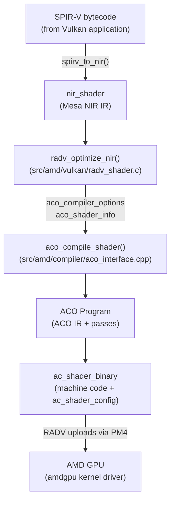
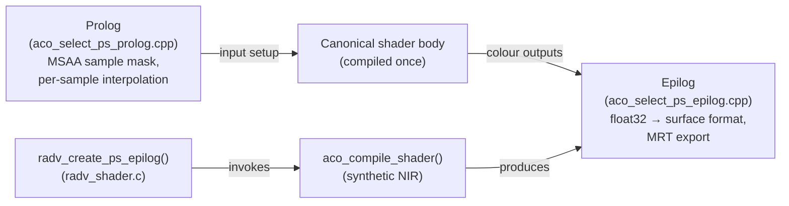
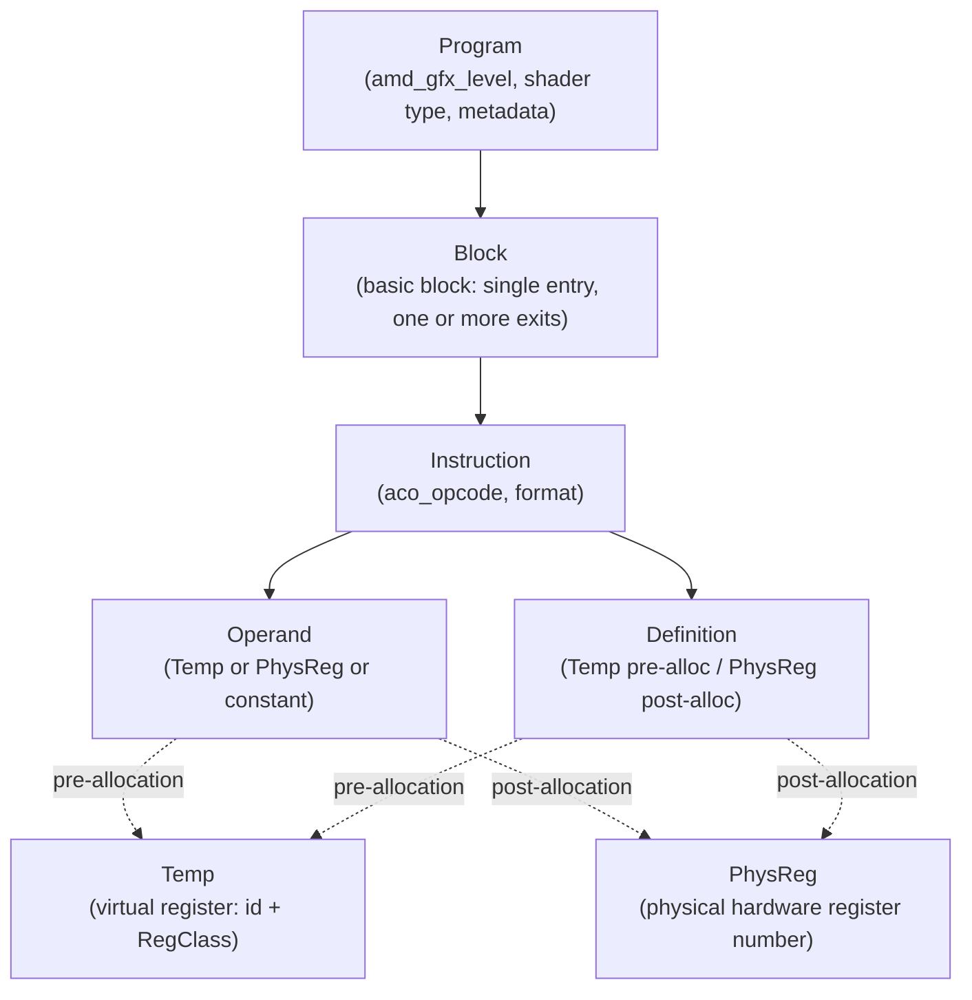
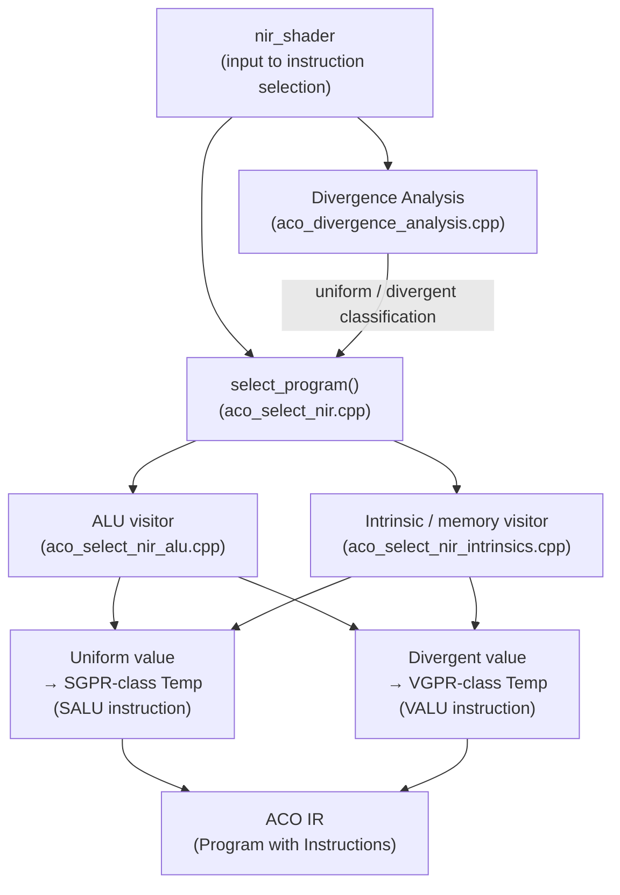
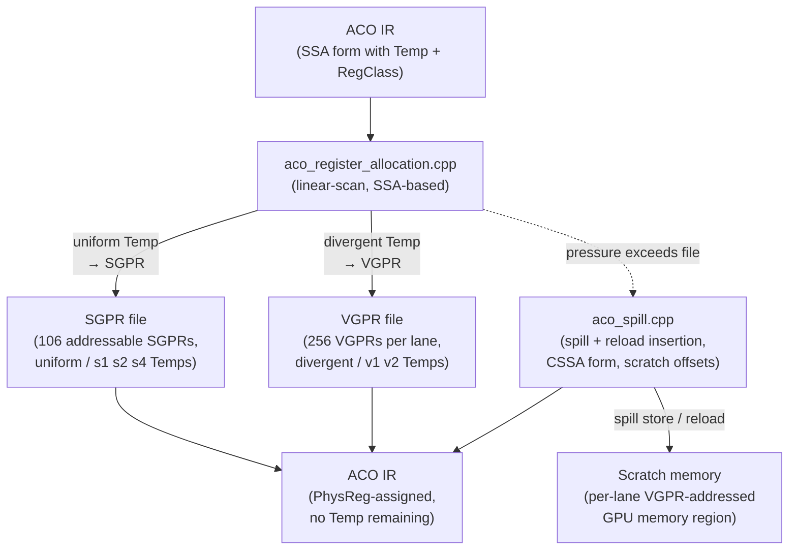
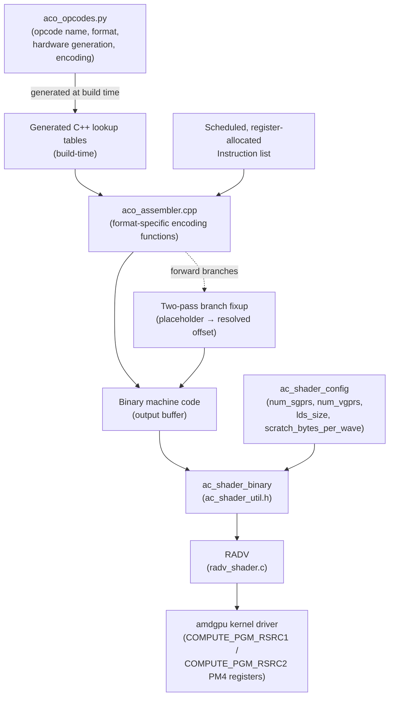

# Chapter 15: ACO: AMD's Optimising Compiler

> **Part**: Part IV — Mesa Architecture
> **Audience**: Systems developer — targets compiler engineers, driver developers, and GPU-savvy developers who want to understand how Mesa turns NIR into AMD GCN/RDNA machine code; application developers benefit from the performance and shader compilation time discussion
> **Status**: First draft — 2026-06-06

## Table of Contents

- [Overview](#overview)
- [1. Motivation: Why Not LLVM?](#1-motivation-why-not-llvm)
- [2. ACO's Place in the RADV Pipeline](#2-acos-place-in-the-radv-pipeline)
- [3. ACO IR: The Internal Representation](#3-aco-ir-the-internal-representation)
- [4. Instruction Selection: NIR to ACO IR](#4-instruction-selection-nir-to-aco-ir)
- [5. Register Allocation: The VGPR/SGPR Split](#5-register-allocation-the-vgprsgpr-split)
- [6. Instruction Scheduling](#6-instruction-scheduling)
- [7. Code Emission: GCN/RDNA Assembly](#7-code-emission-gcnrdna-assembly)
- [8. Benchmark Impact: Compile Time and Runtime Performance](#8-benchmark-impact-compile-time-and-runtime-performance)
- [Integrations](#integrations)
- [References](#references)

---

## Overview

**ACO** (**AMD Compiler**) is **Mesa**'s purpose-built shader compiler backend for **AMD** **GCN** and **RDNA** GPUs. It was introduced into **RADV** — **Mesa**'s **AMD** **Vulkan** driver — beginning in 2019, developed primarily by Timur Kristóf with Valve's sponsorship. Within eighteen months of its introduction **ACO** became the default **RADV** backend, replacing a compilation path that had routed through **LLVM**'s **AMDGPU** backend since **RADV**'s inception. Today, **ACO** handles virtually every shader compiled by **RADV**, from simple vertex programs to complex mesh shaders and ray tracing traversal routines.

The case for building a new compiler from scratch rather than continuing to patch **LLVM** was, at its core, an argument about ownership, latency, and specificity. **GPU** shader compilers face a distinctive challenge that general-purpose compilers do not: they must complete compilation fast enough not to interrupt an interactive session. When a player launches a **Vulkan** game and the title submits two thousand pipeline objects at startup, each requiring compilation, the cumulative latency determines whether the game launches in three seconds or thirty. **LLVM** was designed for ahead-of-time compilation of large programs, not for sub-millisecond just-in-time shader compilation. **ACO** was designed with that constraint as a first-class requirement. The environment variable **`RADV_DEBUG=llvm`** forces **LLVM** for debugging and regression comparison; otherwise all **RADV** **Vulkan** shader compilation — graphics and compute — uses **ACO** by default.

This chapter covers the complete **ACO** compilation pipeline: its design philosophy, its place in the **RADV** pipeline (including **`aco_compile_shader()`**, **`VK_EXT_graphics_pipeline_library`**, and asynchronous pipeline compilation), its internal representation (the **`Program`**, **`Block`**, **`Instruction`**, **`Temp`**, **`PhysReg`**, and **`RegClass`** types in **`aco_ir.h`**), its instruction selection pass, its register allocator, its scheduler, and the binary emission step that produces the **GCN**/**RDNA** machine code the **GPU** executes.

The instruction selection stage (rooted in **`select_program()`** in **`src/amd/compiler/instruction_selection/`**) begins with divergence analysis that classifies every **NIR** **SSA** value as uniform (→ **SGPR**-class) or divergent (→ **VGPR**-class), then selects **SALU** or **VALU** instructions accordingly for **ALU** operations. Memory instruction selection covers buffer loads via **`buffer_load_dword`** with **128-bit** **`s4`** buffer descriptors, image loads and samples using the **MIMG** format, **LDS** access via **`ds_read_b32`**/**`ds_write_b32`**, and intrinsic lowering for **`nir_intrinsic_load_push_constant`**, **`nir_intrinsic_store_output`**, and descriptor-set loads.

Register allocation in **`aco_register_allocation.cpp`** operates on **SSA** form using a linear-scan algorithm, assigning uniform values to the **SGPR** file (106 addressable **SGPRs** on **GFX10**) and divergent values to the **VGPR** file (256 **VGPRs** per lane). When pressure exceeds the physical file, the spiller (**`aco_spill.cpp`**) inserts spill stores and reloads targeting per-lane scratch memory. Special registers — **`vcc`** (the vector condition code), **`scc`** (the scalar condition code), **`exec`** (the execution mask), and **`m0`** — require careful tracking, as do aligned multi-register types such as the **128-bit** **`s4`** buffer descriptor and the **256-bit** **`s8`** image descriptor. On **RDNA** (**GFX10+**) the compiler selects between **wave32** and **wave64** execution modes; **wave32** halves **VGPR** pressure and increases occupancy for memory-bound shaders.

The instruction scheduler (**`aco_scheduler.cpp`**) performs pressure-bounded list scheduling to hide memory latency within a single wavefront. Specific sub-passes cover **VALU**/**SALU** interleaving (exploiting the independent scalar and vector execution units), clause formation via **`s_clause`** for grouped **VMEM** accesses on **GFX10+**, export scheduling that keeps **`exp`** instructions as late as possible, and **GFX11**-specific handling of **`s_delay_alu`** hazard instructions and **VOPD** dual-issue vector instruction pairing.

Code emission (**`aco_assembler.cpp`**) encodes the scheduled instruction list into binary words using format-specific routines for **SOP2**, **SOPK**, **VOP2**, **VOP3**, **MUBUF**, **SMEM**, **DS**, **EXP**, and **MIMG** instruction formats. Forward branches are resolved by a two-pass fixup. The opcode table is maintained in **`aco_opcodes.py`** and regenerated at build time into **C++** lookup tables. The output is packaged as an **`ac_shader_binary`** (defined in **`ac_shader_util.h`**) containing machine code alongside an **`ac_shader_config`** header with **SGPR** count, **VGPR** count, **LDS** size, and scratch-bytes-per-wave values that the **amdgpu** kernel driver uses to program **`COMPUTE_PGM_RSRC1`** and **`COMPUTE_PGM_RSRC2`** **PM4** registers. Setting **`RADV_DEBUG=shaders`** dumps **NIR**, the **ACO IR**, and final **GCN**/**RDNA** disassembly via **LLVM**'s disassembler.

Readers will also find coverage of **RDNA**-specific features: the **NGG** (**Next-Generation Geometry**) pipeline and its **`nir_lower_ngg()`** preparation pass, **NGG** culling with **LDS** barriers and two-pass primitive compaction, and the fragment shader prolog/epilog split that compiles the shader body once in canonical form while separate prolog and epilog objects (**`aco_select_ps_prolog.cpp`**, **`aco_select_ps_epilog.cpp`**) handle **MSAA** sample mask setup and render-target format conversion. The chapter closes with benchmark evidence from **Phoronix** and the **`shader-db`** corpus comparing **ACO** against **LLVM** on compile time and runtime performance, notes on workloads where **LLVM** retains advantages (compute-intensive kernels on **radeonsi** and **ROCm**), preparatory work for **GFX12** (**RDNA4**), and known gaps including **BVH** traversal shaders for **`VK_KHR_ray_tracing_pipeline`** and **GDS** (**Global Data Share**) usage.

After reading this chapter, the reader will understand how **ACO** turns **NIR** into working **AMD** **GPU** code, why the **VGPR**/**SGPR** register model makes **AMD** compilation harder than most other targets, and where **ACO** sits relative to **LLVM** across the **AMD** software stack.

---

## 1. Motivation: Why Not LLVM?

To understand why ACO exists, it helps to understand what the RADV team was living with before it. RADV launched in 2016 and used LLVM's AMDGPU backend as its shader compiler. LLVM was a natural choice: it had an AMD-maintained backend, it was already integrated into Mesa for other drivers, and the engineering cost of writing a new compiler from scratch was enormous. The arrangement worked well enough for OpenGL workloads compiled well ahead of runtime. For Vulkan, it was a different story.

Vulkan's pipeline model exposes shader compilation to the application. Games that port their D3D11 rendering to Vulkan, or that run under translation layers like DXVK or VKD3D-Proton, submit pipeline state objects in bulk. A single game title might require hundreds or thousands of unique shader programs at startup. Under LLVM, each pipeline object required the full LLVM compilation pipeline: IR construction, optimisation passes, register allocation using LLVM's generic allocator, and code emission. For a moderately complex game shader that process consumed between 100 milliseconds and 500 milliseconds of wall-clock time. With hundreds of shaders to compile, the game appeared to hang during load. Users reported stutter, long load screens, and frame-time spikes whenever a shader not yet seen during the session was encountered mid-game.

The compile time problem alone would have been enough to motivate a replacement, but it was not the only issue. LLVM's register allocator is a general-purpose graph-colouring allocator. AMD GCN and RDNA GPUs have a fundamentally split register architecture: vector registers (VGPRs) hold per-lane divergent data, and scalar registers (SGPRs) hold data that is uniform across all lanes in a wavefront. LLVM's allocator was not designed with this split in mind. It frequently assigned data to VGPRs when SGPR allocation was possible, increased VGPR pressure unnecessarily, and produced code with lower occupancy than optimal. Occupancy — the number of concurrent wavefronts resident on a compute unit — is the primary mechanism by which GPUs hide memory latency. Suboptimal VGPR allocation directly translated to fewer concurrent wavefronts and worse memory latency hiding.

The modification barrier made the situation worse. Contributing changes to LLVM's AMDGPU backend requires upstream code review and approval. Turnaround for Mesa-specific optimisations was slow. RADV-specific lowering that would benefit RADV shader patterns was not a priority for the LLVM project maintainers. The result was that driver engineers could not iterate quickly on compiler improvements.

ACO's stated goals at its 2019 introduction were concrete: achieve two to ten times faster pipeline compilation compared to LLVM; maintain equal or better runtime performance; and place full control of the compiler within Mesa's own repository. The last point is easy to underestimate. Owning the compiler means that a RADV engineer who identifies a miscompilation or a missed optimisation can write, test, and ship a fix in the same merge request as the rest of the driver change, without needing upstream approval from a separate project.

It is important to be precise about ACO's scope. ACO is a RADV compiler backend — it compiles shaders for the Vulkan driver only. It does not replace LLVM for radeonsi, Mesa's OpenGL driver for AMD hardware. Radeonsi continues to use LLVM for every shader it compiles, including graphics and compute workloads. Similarly, ROCm's HIP compiler and the OpenCL stack on AMD hardware use LLVM or their own compiler infrastructure entirely distinct from ACO. Developers profiling compilation latency in an OpenCL workload will not see ACO at all; the cost they observe is LLVM's. The boundary matters because readers who work on compute-heavy AMD workloads may encounter LLVM-specific issues that ACO cannot address.

---

## 2. ACO's Place in the RADV Pipeline

The authoritative source for ACO's design is `src/amd/compiler/README.md` in the Mesa repository, a developer-written overview maintained alongside the code. The ACO source lives entirely under `src/amd/compiler/`. This directory contains the IR definition, all compiler passes, the opcode table, and the assembler — a self-contained compiler implementation that depends on NIR and Mesa's AMD common utilities but not on LLVM.

The path a shader takes from a Vulkan application to executing on AMD hardware passes through several components. A Vulkan application provides SPIR-V bytecode. RADV calls `spirv_to_nir()` to translate the SPIR-V into NIR, Mesa's common intermediate representation described in Chapter 14. RADV then applies a series of driver-specific NIR optimisation and lowering passes, collected in `radv_optimize_nir()` within `src/amd/vulkan/radv_shader.c`. These passes include dead code elimination, algebraic simplification, constant folding, and RADV-specific lowering of Vulkan-specific NIR intrinsics. Only after this NIR preprocessing stage does control reach ACO.

The ACO entry point is `aco_compile_shader()` defined in `src/amd/compiler/aco_interface.cpp`. This function accepts a `nir_shader` pointer, a set of `aco_compiler_options` describing the target hardware and compilation flags, and a set of `aco_shader_info` describing the shader's runtime properties. It initialises an ACO `Program` and runs the complete compilation pipeline, returning the final machine code in an `ac_shader_binary` structure that RADV uploads to the GPU.



```cpp
/* Source: src/amd/compiler/aco_interface.cpp — aco_compile_shader() */
void aco_compile_shader(const struct aco_compiler_options *options,
                        const struct aco_shader_info *info,
                        unsigned shader_count,
                        struct nir_shader *const *shaders,
                        const struct ac_shader_args *args,
                        aco_callback *build_binary,
                        void **binary);
```

ACO supports several compilation scenarios that go beyond single-shader compilation. Under `VK_EXT_graphics_pipeline_library`, RADV can compile individual shader stages early, before the full pipeline state is known. ACO receives the partially-lowered NIR for each stage at that point and produces a code object that is later linked. This early compilation avoids the full-pipeline compile cost at pipeline finalisation time, reducing the latency spike that users experience.

Asynchronous pipeline compilation is another important mechanism. When a game requests a pipeline that has not been seen before, RADV can return a "fast" pipeline compiled synchronously with reduced optimisation — acceptable for the first few frames while the shader is rare — and simultaneously submit a background thread that runs ACO with full optimisations. When the optimised compile completes, the fast pipeline is swapped out. This async path, implemented in RADV's pipeline compilation infrastructure, was designed with DXVK and VKD3D-Proton workloads in mind (see Chapter 28).

**NGG: The Next-Generation Geometry Pipeline**

RDNA (GFX10) introduced the Next-Generation Geometry pipeline, or NGG. On traditional GCN hardware, the geometry pipeline consisted of separate hardware stages: vertex shader, hull shader, domain shader, geometry shader, each with its own fixed-function handoff. NGG collapses the programmable geometry stages into a single primitive shader stage — a compute-like wavefront that accepts input primitives, can optionally cull them in shader code before rasterisation, and exports the surviving primitives and their vertex attributes to the rasteriser.

From ACO's perspective, NGG is handled by a unified shader entry point. The NIR pass `nir_lower_ngg()` (implemented in `src/compiler/nir/nir_lower_ngg.c`) prepares the shader before ACO instruction selection, inserting the workgroup management logic, LDS synchronisation, and the `s_sendmsg(gs_alloc_req)` call that informs the hardware how many output vertices and primitives to allocate in the parameter cache. ACO then performs instruction selection on this enriched NIR as it would for any other shader stage.

NGG culling is the most performance-sensitive NGG feature. Rather than submitting all primitives to the rasteriser and relying on fixed-function culling, NGG culling performs the cull decision in shader code. Each invocation fetches vertex positions, transforms them to clip space, checks visibility conditions (backface, viewport frustration, zero-area), and writes a culled flag into LDS. A second pass over the LDS data compacts the surviving primitives before export. The two-pass structure requires an LDS barrier between the cull decision and the compaction — a `ds_ordercount` or `s_barrier` instruction — which ACO emits as part of the NGG lowering sequence. On RDNA2, NGG culling is the default path for RADV graphics pipelines. Timur Kristóf's 2022 blog post measured 3–5% performance improvements in games like Doom Eternal from NGG culling, with larger gains in geometry-bound scenes.

**Fragment Shader Prolog and Epilog**

ACO implements a prolog/epilog split for fragment shaders that is architecturally distinct from how LLVM handles the same problem. A fragment shader's behaviour depends on per-pipeline state that is not known until pipeline creation: the MSAA sample count, whether per-sample shading is enabled, and the format of each render target. Under a monolithic compilation model, every combination of these parameters would require a separately compiled shader variant. The combinatorial explosion — considering all MSAA counts, all possible render target formats across all active MRT slots — makes this impractical.

ACO's solution is to compile the shader body once in canonical form, and compile separate prolog and epilog objects that handle the state-dependent portions. The prolog handles input setup: under `VK_SAMPLE_SHADING_ENABLE`, it reads the sample mask and computes per-sample interpolation offsets. The epilog handles output: it converts the shader's float32 colour outputs to the target surface format (packed UNORM8, SNORM16, etc.) and organises them for MRT export. These prolog and epilog objects are small, fast to compile, and cover the format-specific logic that would otherwise require full shader recompilation. ACO compiles them using dedicated instruction selection paths in `src/amd/compiler/instruction_selection/aco_select_ps_prolog.cpp` and `aco_select_ps_epilog.cpp`. RADV calls the epilog compilation path in `radv_shader.c` via `radv_create_ps_epilog()`, which invokes `aco_compile_shader()` with a synthetic NIR representing only the export logic.



**When LLVM Is Used**

By default, all RADV Vulkan shader compilation — graphics and compute — uses ACO. The environment variable `RADV_DEBUG=llvm` forces LLVM for debugging and regression comparison. Compute shaders compiled for `VkPipeline` objects with `VK_SHADER_STAGE_COMPUTE_BIT` use ACO, not LLVM; this is a common misconception among developers who associate AMD GPU compute with LLVM. On GFX11 (RDNA3) and earlier, ray tracing traversal shaders are also compiled by ACO.

---

## 3. ACO IR: The Internal Representation

ACO's internal representation is defined in `src/amd/compiler/aco_ir.h`. It is purpose-built for GCN/RDNA code generation and is not shared with any other Mesa component. The IR is SSA-based during the early compilation passes and transitions to a physical-register representation after register allocation.

The top-level compilation unit is `Program`. A `Program` contains a vector of `Block` objects, the target hardware generation (encoded as an `amd_gfx_level` enum covering GFX6 through GFX12), the register file description, shader-type information, and accumulated metadata used by later passes. The `Block` type represents a basic block: a straight-line sequence of instructions with a single entry and one or more exits. Each `Block` holds a `std::vector<aco_ptr<Instruction>>` and records its predecessors and successors for control flow analysis.

`Instruction` is a polymorphic base class. Each instruction carries an `aco_opcode` identifying the hardware instruction or pseudo-instruction to perform, a list of `Operand` objects describing its inputs, and a list of `Definition` objects describing its outputs. Instruction subclasses — `VOP1_instruction`, `VOP2_instruction`, `MUBUF_instruction`, `SMEM_instruction`, `DS_instruction`, `EXP_instruction`, and others — extend the base with format-specific fields such as addressing modifiers, format fields, and encoding variants. The subclass hierarchy maps closely to the GCN/RDNA instruction format categories defined in AMD's ISA reference manuals.

```cpp
/* Source: src/amd/compiler/aco_ir.h — Instruction, Operand, Definition */
struct Instruction {
   aco_opcode opcode;
   Format format;
   uint8_t operands_count;
   uint8_t definitions_count;
   /* ... format-specific fields in derived classes ... */
};

/* An Operand can be a virtual Temp, a physical PhysReg, or a constant */
struct Operand {
   union { Temp temp; PhysReg physReg; };
   /* ... */
};

/* A Definition is the output: a Temp pre-allocation, PhysReg post-allocation */
struct Definition {
   Temp temp;
   PhysReg physReg;
   /* ... */
};
```

The most important type in the IR from a compilation-correctness standpoint is `Temp`. A `Temp` is a virtual register: it has a unique identifier and a `RegClass` that encodes both its register type (VGPR or SGPR) and its size. The `RegClass` encoding is compact and descriptive:

| Class      | Type | Width   | Typical use                                        |
|------------|------|---------|----------------------------------------------------|
| `s1`       | SGPR | 32-bit  | Uniform integer or float                           |
| `s2`       | SGPR | 64-bit  | Uniform 64-bit value or buffer descriptor pair     |
| `s4`       | SGPR | 128-bit | Buffer descriptor (four SGPRs)                     |
| `v1`       | VGPR | 32-bit  | Divergent integer or float, one per lane           |
| `v2`       | VGPR | 64-bit  | Divergent 64-bit value                             |
| `v2b`      | VGPR | 16-bit  | Sub-dword, 16-bit value in lower half of VGPR      |
| `v1_linear`| VGPR | 32-bit  | Linear VGPR used for spilling and WWM              |

`PhysReg` is a simple integer encoding a physical hardware register. After register allocation, every `Temp` in every `Operand` and `Definition` is replaced with a `PhysReg`. Register numbers 0–255 address VGPRs; register numbers starting at 256 address SGPRs on GFX10/RDNA (the exact SGPR count is 106 addressable registers plus special-purpose registers). Special registers — `exec` (the execution mask), `vcc` (the vector condition code, a 64-bit SGPR pair on wave64 or 32-bit on wave32), `scc` (the scalar condition code bit), and `m0` (a general-purpose addressing register) — have reserved `PhysReg` numbers.

ACO maintains two distinct control flow graphs throughout compilation, a design choice motivated by AMD's execution model. The logical CFG is a direct translation of the structured control flow from NIR and reflects the programmer's intent. The linear CFG, following the "whole-function vectorisation" model described by Karrenberg and Hack, models actual GPU execution with the additional control flow blocks needed to handle wave divergence. When a conditional branch diverges — different lanes taking different paths — the GPU does not actually branch; instead, both paths execute with the inactive lanes masked out by the `exec` register. The linear CFG makes this explicit, adding reconvergence blocks and tracking the `exec` mask modifications that ACO must generate.



---

## 4. Instruction Selection: NIR to ACO IR

Instruction selection is the largest single component of ACO, spanning files in `src/amd/compiler/instruction_selection/`. The principal entry point is `select_program()` in `aco_select_nir.cpp`, which iterates over the NIR shader's basic blocks and dispatches each NIR instruction to the appropriate visitor function. Visitor functions are named after the NIR instruction categories they handle: ALU operations in `aco_select_nir_alu.cpp`, memory intrinsics and system-value loads in `aco_select_nir_intrinsics.cpp`.

Before any visitor runs, instruction selection performs divergence analysis (`src/amd/compiler/aco_divergence_analysis.cpp`). Divergence analysis determines, for each NIR SSA value, whether that value is uniform — identical across all active lanes in a wavefront — or divergent — potentially different per lane. This classification is what drives the fundamental VGPR/SGPR assignment: a uniform value will live in an SGPR-class `Temp`; a divergent value will live in a VGPR-class `Temp`. The classification propagates through data flow: an operation whose inputs are both uniform is itself uniform; an operation with any divergent input is divergent. System values like `gl_WorkgroupID` are uniform (the entire workgroup shares one ID); values derived from `gl_LocalInvocationID` or `gl_FragCoord` are divergent (each lane has a distinct value).



**ALU Instruction Selection**

The ALU visitor selects GCN/RDNA ALU instructions based on the NIR opcode, the data type, and the divergence classification of the result. A `nir_op_iadd` on uniform integers produces `s_add_u32`, a scalar ALU instruction that operates on SGPRs and takes one clock cycle. The same `nir_op_iadd` on divergent integers produces `v_add_u32`, a vector ALU instruction that performs an independent 32-bit addition for each active lane. The distinction is not cosmetic: SALU and VALU instructions execute on different hardware units, use different register files, and have different throughput characteristics. Selecting the wrong type wastes register pressure and may prevent certain optimisations.

```cpp
/* Source: src/amd/compiler/instruction_selection/aco_select_nir_alu.cpp
   Simplified illustration of the divergent/uniform branch in emit_alu() */
if (nir_dest_is_divergent(alu->dest)) {
   /* divergent result: use VALU instruction, VGPR output */
   Temp dst = bld.tmp(v1);
   bld.vop2(aco_opcode::v_add_u32, Definition(dst), src0, src1);
} else {
   /* uniform result: use SALU instruction, SGPR output */
   Temp dst = bld.tmp(s1);
   bld.sop2(aco_opcode::s_add_u32, Definition(dst), bld.def(s1, scc), src0, src1);
}
```

16-bit arithmetic maps to packed VALU instructions on RDNA. When the NIR shader contains `float16` or `int16` operations, the instruction selector emits `v_pk_add_f16` (packed dual 16-bit float add), `v_pk_fma_f16`, or their integer equivalents. These packed instructions process two 16-bit values in a single 32-bit VGPR slot, doubling throughput for half-precision workloads. On GFX11 (RDNA3), the VOPD extension goes further: two full 32-bit VALU instructions can be issued in the same clock cycle when they have no data dependency, effectively doubling peak ALU throughput for wave32 workloads. ACO's VOPD scheduler, merged into Mesa 24.1, exploits this with a post-register-allocation pass that pairs compatible instructions.

64-bit operations present a different challenge. GCN/RDNA's VALU cannot natively handle 64-bit arithmetic in a single instruction for all operations. Instead, the instruction selector decomposes 64-bit NIR values into pairs of 32-bit VGPRs (or SGPR pairs for uniform values) and emits instruction sequences that operate on the two halves, threading carry bits through for addition and subtraction.

The `nir_op_bcsel` conditional selection maps to `v_cndmask_b32` for divergent results, which reads the `vcc` (vector condition code) register and selects from two source VGPRs per lane. For uniform conditionals, it maps to `s_cselect_b32`, a scalar instruction.

**Memory Instruction Selection**

Buffer loads are among the most complex instruction selections. A Vulkan storage buffer is accessed through a buffer descriptor, a 128-bit constant held in four SGPRs (an `s4` class `Temp`). The instruction selector constructs this descriptor from the descriptor set binding that RADV provides and emits `buffer_load_dword` (or the appropriate width variant) with the descriptor as an SGPR operand and the byte offset as a VGPR operand for divergent accesses, or an immediate/SGPR offset for uniform accesses. On GFX9+ (Vega and later), global memory loads can also be issued via `global_load_dword` using a 64-bit address in a VGPR pair; this path is selected for Vulkan buffer device address pointers.

Image loads and samples involve a two-part descriptor: an image descriptor (also an `s8` SGPR octet) and a sampler descriptor (another `s4`). The instruction selector emits `image_load` or `image_sample` instructions — falling under the MIMG instruction format in the GCN ISA — and sets encoding fields for dimensionality, format, and the LOD/bias/offset operands.

LDS (Local Data Share) access maps to `ds_read_b32` and `ds_write_b32` for 32-bit data, with the LDS address in a VGPR. For larger access widths, `ds_read2_b32` can issue two consecutive LDS reads in one instruction with separate offsets, a detail the instruction selector exploits for performance.

**Intrinsic Lowering**

Vulkan-specific NIR intrinsics require instruction sequences rather than single opcodes. `nir_intrinsic_load_push_constant` expands to an SMEM load from the push constant base address, which RADV places at a known SGPR pair. `nir_intrinsic_load_descriptor_set_address_amd` emits an SGPR-to-SGPR move from the preloaded descriptor set pointer register. `nir_intrinsic_store_output` maps to `exp` (export) instructions for fragment colour and position outputs, with the export target encoded in the instruction's `target` field.

---

## 5. Register Allocation: The VGPR/SGPR Split

Register allocation on GCN/RDNA is among the most technically demanding aspects of AMD GPU compilation. The register file is not a uniform bank of general-purpose registers. It is two separate files with different sizes, different access widths, different latencies, and different implications for occupancy.

The VGPR file on RDNA2/GFX10.3 contains 256 architectural VGPRs per lane per SIMD unit. With wave32 (32-lane wavefronts), the file is effectively 256 × 32-bit per lane; with wave64, it is 256 × 32-bit per lane for 64 lanes. The occupancy model creates a direct tension: each additional 4 VGPRs used by a shader reduces the maximum concurrent wavefront count by one. At 24 VGPRs per shader, a compute unit can host the maximum number of wavefronts — typically 16 waves on RDNA2 — hiding memory latency through wavefront switching. At 64 VGPRs, occupancy halves, and at 96+ VGPRs, fewer than four waves can reside simultaneously, leaving the compute unit idle during memory operations.

The SGPR file is substantially smaller — 106 addressable SGPRs on GFX10 — but operates at scalar throughput and does not contribute to VGPR pressure. Uniform data held in SGPRs allows descriptor loads, constant buffer reads, and control flow predicates to execute on the scalar unit without consuming VGPR slots. A good register allocator therefore keeps as much data in SGPRs as the divergence classification permits.

ACO's register allocator, implemented in `src/amd/compiler/aco_register_allocation.cpp`, operates on SSA form — a departure from LLVM's approach, which operates on virtual registers after SSA destruction. SSA-based allocation allows the allocator to exploit the SSA property that each value is defined exactly once: register classes and live range boundaries are well-defined from the SSA structure without the phi-function complications that virtual-register allocators must handle separately. The ACO README notes that SSA allocation "works on SSA (as opposed to LLVM's which works on virtual registers)" and that the allocator inserts shuffle code (parallel copies) where needed at block joins, rather than sacrificing a wave to reduce register pressure.

The linear-scan algorithm processes instructions in program order, maintaining a set of "active" live ranges. When a new value is defined, the allocator finds a free physical register of the correct class and assigns it. When a value's live range ends at the last use, its register is freed. The algorithm's linear time complexity — as opposed to the exponential worst case of graph colouring — is central to ACO's compile-time advantage.



**Spilling**

When register pressure exceeds the physical file size, the allocator must spill. VGPR spilling stores the excess value to scratch memory — a per-lane VGPR-addressed region in GPU memory that the hardware sets aside for this purpose. Spilling is expensive because scratch memory accesses use the VGPR address path and have the same latency as global memory loads. The spiller (`src/amd/compiler/aco_spill.cpp`) works in two phases: it identifies values that must be evicted based on live range analysis and "CSSA form" transformation that inserts explicit spill and reload instructions; then it assigns scratch offsets. ACO works hard to minimise spilling because a shader that spills heavily may perform worse than its VGPR-register-pressure budget would suggest — the spill loads reintroduce the memory latency that good occupancy was meant to hide.

**VCC and SGPR Pairs**

AMD GPUs have several architecturally special registers that require careful handling. The vector condition code register, `vcc`, is a 64-bit SGPR pair (two SGPRs) on wave64, or a 32-bit single SGPR on wave32. Comparison instructions in the `v_cmp_*` family write their bitmask result to `vcc` by default. Explicit SGPR-target comparisons (using the three-operand VOP3 variant) write to an arbitrary SGPR pair instead. ACO tracks these conventions explicitly: whenever it selects a comparison that will feed a `v_cndmask_b32`, it ensures the `vcc` operand is correctly assigned, avoiding the need for explicit SGPR moves.

Buffer descriptors — required for buffer loads and stores — are 128-bit values occupying four consecutive SGPRs. The allocator enforces 4-SGPR alignment for these `s4` class temporaries. Image descriptors occupying eight SGPRs enforce 8-SGPR alignment. Misaligned descriptor loads produce silent incorrect results or GPU faults, so the allocator's alignment logic is correctness-critical.

**Wave32 versus Wave64**

On RDNA (GFX10+), the wave size is not fixed by hardware — the shader compiler selects it. Wave32 processes 32 lanes per wavefront; wave64 processes 64. The trade-off is occupancy versus SIMD utilisation: wave32 halves VGPR pressure relative to wave64 (each wave uses fewer slots in the register file), which increases occupancy and generally improves performance for memory-bound shaders. Wave64 can better utilise the SIMD unit when the shader has low instruction-level parallelism but high data parallelism.

ACO's wave size selection is guided by RADV's heuristics in `radv_shader.c`. Fragment shaders default to wave64 because the ps_wave_size device property is typically 64 — fragment shaders benefit from the coherent execution of neighbouring pixels at wave64. Vertex and tessellation shaders follow the `ge_wave_size` device property. Compute shaders use wave32 when the workgroup size is at most 32 threads, and otherwise apply a policy that weighs VGPR usage against estimated occupancy. ACO receives the selected wave size as part of `aco_shader_info` before instruction selection begins.

---

## 6. Instruction Scheduling

GCN/RDNA memory instructions have high latency. A global load from DRAM can take 300 to 500 clock cycles to complete. The GPU's primary strategy for tolerating this latency is wavefront switching: when one wavefront stalls waiting for a load, the hardware context-switches to another wavefront whose operands are ready. If enough wavefronts are resident on the compute unit (i.e., if occupancy is high enough), the latency is effectively hidden.

Within a single wavefront, however, there are still opportunities to improve performance through instruction ordering. If a load instruction is scheduled as early as possible, the subsequent instructions that do not depend on the load result can execute while the load is in flight. When the dependent instruction finally arrives, the latency has been (partially) hidden by independent work. ACO's scheduler, implemented in `src/amd/compiler/aco_scheduler.cpp`, performs this intra-wavefront latency hiding.

The scheduler operates as a list scheduling algorithm on a partial dependency graph. It builds a data dependency graph from the instruction list of each basic block — edges represent def-use relationships — and then selects instructions for emission using a priority function that favours moving memory loads early. The scheduler is constrained by register pressure: moving a load earlier lengthens the live range of its result, consuming a register slot for more instructions. The scheduler therefore caps how far it is willing to move an instruction upward: it estimates the register pressure that would result from each candidate move and avoids moves that would push pressure above a configurable limit. This "pressure-bounded" scheduling avoids the common failure mode of aggressive schedulers, which sacrifice occupancy in the pursuit of latency hiding.

**VALU/SALU Interleaving**

The scalar ALU and vector ALU are independent execution units that can operate in parallel when there is no data dependency between their instructions. The scheduler exploits this by interleaving SALU instructions — descriptor loads, uniform arithmetic, control flow predicates — with VALU instruction sequences. An SALU instruction running in the background while the VALU executes independently costs zero additional cycles.

**Clause Formation**

GFX10 introduced "VMEM clauses" — a hardware feature allowing consecutive memory instructions with the same base descriptor to be grouped. When the hardware detects a clause, it can pre-fetch subsequent accesses and issue them with reduced overhead. ACO's scheduler includes a clause-formation pass that identifies sequences of related buffer or image loads and groups them. The `s_clause` instruction (inserted by ACO's performance-hints pass as a post-scheduling step on GFX10+) signals the start of such a group to the hardware.

**Export Scheduling**

Fragment shader `exp` (export) instructions export colour and depth values to the render backend. Exports must appear as late as possible in the instruction stream — the hardware requires that all preceding computations affecting the exported values have completed before the export is committed. The scheduler treats exports as "sink" nodes in the dependency graph and prevents them from being moved above any instruction that produces their operands.

**GFX11 Specifics**

RDNA3/GFX11 changes the hazard model. On earlier GCN generations, many read-after-write hazards between SALU instructions were hidden automatically by the hardware. GFX11 removes this behaviour: the software must explicitly insert `s_delay_alu` instructions to signal to the hardware that a dependent instruction is about to read the result of a recent ALU operation. ACO implements this via the hazard resolution pass that runs after scheduling, inserting `s_delay_alu` with the correct delay operand derived from the dependency distance. GFX11 also introduces VOPD — dual-issue vector instructions — handled by the post-register-allocation VOPD scheduling pass.

---

## 7. Code Emission: GCN/RDNA Assembly

The final stage of ACO compilation translates the scheduled, register-allocated instruction list into binary machine code. This work is implemented in `src/amd/compiler/aco_assembler.cpp`.

GCN and RDNA define multiple instruction encoding formats, each covering a category of instructions:

- **SOP2** (Scalar Operation, 2 sources): scalar arithmetic; 32-bit encoding with 7-bit opcode and two 8-bit source fields
- **SOPK** (Scalar with Immediate): scalar instructions with a 16-bit immediate; `s_movk_i32`, `s_addk_i32`
- **VOP2** (Vector Operation, 2 sources): 32-bit encoding for common vector ALU
- **VOP3** (Vector Operation, 3 sources / modifiers): 64-bit encoding for three-source ALU and instructions with float modifiers (`abs`, `neg`, `clamp`, `omod`)
- **MUBUF** (Memory Untyped Buffer): buffer load/store with full addressing modes; 64-bit encoding
- **SMEM** (Scalar Memory): SGPR-addressed constant buffer and descriptor loads; 64-bit encoding
- **DS** (Data Share): LDS and GDS operations; 64-bit encoding with two 8-bit offsets
- **EXP** (Export): fragment and position export; 64-bit encoding with target, `en` mask, and done/valid_mask flags
- **MIMG** (Memory Image): image load, sample, gather; variable width depending on address components

The assembler iterates over each `Instruction` in the final program, dispatches to a format-specific encoding function, and writes the binary words into an output buffer. Each encoding function extracts the physical register numbers from the instruction's `Operand` and `Definition` fields (which are now fully populated with `PhysReg` values after register allocation) and places them in the bit positions defined by the format specification.

Branch instructions present a special case. Forward branches must be emitted before the target address is known. The assembler uses a two-pass approach: the first pass emits all instructions with placeholder offsets for forward branches, recording a fixup list. After all instructions are placed and their offsets are known, a second pass walks the fixup list and patches each branch with the correct relative offset.

The opcode table is maintained in `src/amd/compiler/aco_opcodes.py`, a Python script that encodes each opcode's name, instruction format, hardware generation availability, and encoding constants. Build-time scripts generate C++ lookup tables from this file. The Python source is the single authoritative record: when a new hardware generation introduces a new instruction or changes an opcode's encoding, `aco_opcodes.py` is updated and the generated tables regenerate automatically. This separation of opcode data from compilation logic simplifies the maintenance of the large (hundreds of entries) opcode table.

**Shader Binary Header**

The output of ACO compilation is not raw machine code. It is packaged in an `ac_shader_binary` structure (defined in `src/amd/common/ac_shader_util.h`) that includes the machine code alongside a header of hardware setup parameters. These parameters are consumed by RADV — and ultimately by the amdgpu kernel driver — to configure the GPU before the shader executes:

```c
/* Source: src/amd/common/ac_shader_util.h — shader binary metadata */
struct ac_shader_config {
   unsigned num_sgprs;      /* SGPR count used by the shader          */
   unsigned num_vgprs;      /* VGPR count used by the shader          */
   unsigned num_shared_vgprs; /* Shared VGPR count (GFX10+)           */
   unsigned lds_size;       /* LDS allocation in units (compute)      */
   unsigned scratch_bytes_per_wave; /* Scratch memory requirement      */
   /* ... wave size, export counts, etc. ... */
};
```

The SGPR and VGPR counts in this header flow directly from ACO's register allocator: the allocator tracks the highest physical register number assigned to each file and reports the maximum. The kernel driver uses these counts to set the `COMPUTE_PGM_RSRC1` and `COMPUTE_PGM_RSRC2` PM4 registers (for compute dispatches) or equivalent graphics pipeline registers, which control how much of the register file each wavefront occupies. Incorrect values here are fatal: reporting too few registers causes the shader to overwrite adjacent wavefronts' registers, producing corrupted rendering.



**Debugging and Disassembly**

Setting `RADV_DEBUG=shaders` in the environment instructs RADV to dump shader internals at compile time. The dump includes the NIR before ACO, the ACO IR after instruction selection, and the final GCN/RDNA disassembly. Disassembly is performed using LLVM's disassembler (`src/amd/common/ac_llvm_util.c`), which supports all GCN and RDNA generations. ACO's own IR printer (`src/amd/compiler/aco_print_ir.cpp`) produces a human-readable representation of the ACO IR at any pass boundary. For performance analysis, `RADV_PERFTEST=nggc` enables NGG culling, and `RADV_DEBUG=nodcc` disables DCC compression to isolate bandwidth behaviour — both affect which shader paths ACO selects.

---

## 8. Benchmark Impact: Compile Time and Runtime Performance

When ACO was introduced in 2019 and merged into Mesa 19.3, the benchmark evidence was compelling. Phoronix testing showed compile time improvements of 2–5x for typical game shaders compared to LLVM, with the largest gains on shaders submitted by DXVK and VKD3D-Proton, which generate large numbers of unique pipeline objects. Games with hundreds of distinct shaders — Dota 2, DOOM Eternal, Shadow of the Tomb Raider — showed the most visible reductions in load time stutter because the cumulative savings across many shaders aggregated into seconds of reduced load time.

The runtime performance results were more nuanced. For most games, ACO produced code of equal or better quality to LLVM's AMDGPU backend. The improvements came from several sources: better VGPR pressure management (reducing VGPR usage allowed higher occupancy); wave32 selection on RDNA (ACO was able to select wave32 earlier and more aggressively than LLVM, doubling the wavefront count for memory-bound shaders); and a set of AMD-specific peephole optimisations and instruction combinations that ACO could implement without upstream negotiation.

The wave32 selection impact deserves specific attention. On RDNA hardware, a shader that uses 48 VGPRs per lane under wave64 occupies enough register file space that the hardware can accommodate only a moderate number of concurrent waves. The same shader compiled for wave32 uses half the register file space, allowing twice as many wavefronts. For shaders with substantial memory access latency — which describes the majority of fragment and compute shaders in gaming workloads — the doubled wavefront count translates directly to better latency hiding and higher throughput. ACO's ability to select wave32 confidently, backed by accurate VGPR usage prediction from the linear-scan allocator, was a material source of its runtime advantage over LLVM in the RDNA generation.

**The `shader-db` Tool**

Mesa maintains a shader quality tracking database at `https://gitlab.freedesktop.org/mesa/shader-db`. This tool compiles a large corpus of representative shaders using multiple compiler backends and records instruction counts, estimated cycle counts, VGPR pressure, and spill statistics. The ACO development team uses `shader-db` to catch regressions between patches and to compare ACO against LLVM for specific shader patterns. The shader-db numbers show that the quality gap between ACO and LLVM, once substantial in ACO's favour for most metrics, has narrowed as LLVM's AMDGPU backend has been improved in response to ACO's influence. As of current Mesa development, LLVM and ACO produce comparable code quality for typical game shaders, with ACO retaining a meaningful advantage on compile speed.

**Where LLVM Retains Advantages**

LLVM remains preferable for certain workloads. Its loop vectoriser and auto-vectorisation passes produce better code for compute-intensive kernels with regular iteration patterns — the kinds of workloads encountered in scientific computing, machine learning inference, and image processing. These workloads often have no divergence, regular memory access patterns, and benefit from LLVM's more aggressive loop transformations. For radeonsi (the OpenGL driver), LLVM handles all shaders by default, and the OpenCL compute stack on AMD hardware continues to use LLVM.

**RDNA4/GFX12 and Ongoing Development**

As of 2024, ACO has seen preparatory work for GFX12 (RDNA4), including updates to workgroup barriers, subgroup shader clock support, and revised instruction encoding for new GFX12 instructions. The pattern of ACO tracking new AMD hardware generations within Mesa mirrors LLVM's own AMDGPU backend updates, but with the advantage that ACO changes can be made and shipped as part of a single Mesa patch series without waiting for a separate upstream project's release cycle.

**Depth Notes on Known Gaps**

Ray tracing traversal shaders on RDNA2+ use dedicated BVH (Bounding Volume Hierarchy) traversal hardware exposed through AMD-specific ray tracing instructions. ACO generates these instructions for `VK_KHR_ray_tracing_pipeline` workloads, but the details of BVH traversal shader compilation are complex enough to warrant coverage in a dedicated treatment. The interaction between ACO's function-call support (the `p_call` pseudo-instruction described above) and ray tracing's callable shader ABI is particularly intricate.

GDS (Global Data Share) is a fixed-function unit for cross-workgroup atomic operations. ACO generates GDS instructions for specific Vulkan synchronisation primitives, but GDS usage is niche enough that most shader programs never encounter it.

---

## Integrations

**Chapter 5 (amdgpu Kernel Driver)**: The `ac_shader_config` header that ACO populates — SGPR count, VGPR count, LDS size, scratch size — feeds directly into the PM4 command stream that RADV submits to amdgpu. The kernel driver uses `COMPUTE_PGM_RSRC1` and `COMPUTE_PGM_RSRC2` register fields derived from these values to allocate the correct amount of register file space per wavefront before dispatch. An understanding of ACO's register accounting is necessary to diagnose amdgpu dispatch failures or corruption that trace back to incorrect resource declarations.

**Chapter 12 (Mesa Disk Cache)**: The binary that ACO produces — the raw machine code plus `ac_shader_binary` header — is what Mesa serialises into the disk shader cache. The cache key includes the RADV compiler options (`aco_compiler_options`) that ACO was invoked with, ensuring that cache entries are not reused across incompatible compilation configurations. Because ACO is substantially faster than LLVM, cache misses are less catastrophic: a missed cache entry that would have cost 300ms under LLVM costs 60–100ms under ACO.

**Chapter 14 (NIR)**: ACO's input is NIR, and ACO's instruction selection is deeply coupled to NIR's instruction set and type system. The divergence analysis that drives VGPR/SGPR classification operates on NIR SSA values using NIR's divergence metadata. Readers who want to follow the instruction selection logic in detail should treat Chapter 14 as a prerequisite — specifically, the sections on NIR's SSA form, its intrinsic system, and the divergence analysis infrastructure.

**Chapter 16 (Mesa Vulkan Common)**: The Vulkan pipeline cache stores serialised ACO binaries. When an application calls `vkCreateGraphicsPipelines` with a pipeline cache populated from a previous run, the Vulkan common layer deserialises the ACO binary and hands it directly to RADV without recompiling. The pipeline cache serialisation format must accommodate the `ac_shader_binary` structure and the associated metadata that ACO produces.

**Chapter 18 (RADV)**: ACO is RADV's compiler backend. RADV's pipeline compilation path — the code in `radv_pipeline.c` and `radv_shader.c` that coordinates stage merging, NGG setup, prolog/epilog dispatch, and async compilation — is the consumer of everything ACO produces. Chapter 18 describes the RADV side of the interface; this chapter describes the ACO internals that Chapter 18 invokes.

**Chapter 19 (Tessellation and Geometry Shaders in RADV)**: The NGG pipeline described in Section 2 of this chapter is the hardware mechanism that implements tessellation evaluation shaders and geometry shaders on RDNA hardware. Chapter 19's coverage of TCS/TES/GS pipeline setup assumes the NGG entry point structure that ACO generates, including the `s_sendmsg(gs_alloc_req)` call, the LDS layout for inter-invocation communication, and the two-pass culling structure. The NGG discussion here and Chapter 19's pipeline setup discussion are complementary: this chapter explains what ACO emits; Chapter 19 explains what RADV configures for ACO to emit it correctly.

**Chapter 20 (MSAA and Sample Shading)**: The fragment shader prolog that ACO compiles — the code that reads the sample mask and interpolates varyings at per-sample positions — is the mechanism behind `VK_SAMPLE_SHADING_ENABLE` in RADV. The prolog/epilog split compilation model described in Section 2 explains why RADV can support arbitrary MSAA configurations without per-combination full-shader recompilation. Chapter 20's coverage of MSAA should be read alongside this chapter's prolog/epilog description to understand the full path from API state to shader instructions.

**Chapter 25 (GPU Compute)**: Vulkan compute pipelines in RADV use ACO for all shader compilation, including compute-specific intrinsics such as `nir_intrinsic_load_workgroup_id`, `nir_intrinsic_load_local_invocation_id`, and `nir_intrinsic_load_subgroup_id`. These map to SGPR loads from the compute dispatch argument block. The wave32 versus wave64 selection discussed in Section 5 has the largest performance impact for compute shaders, because compute occupancy is more directly tied to VGPR pressure than in graphics workloads.

**Chapter 28 (DXVK/VKD3D-Proton)**: ACO's compile-time improvements were primarily motivated by the shader submission patterns of DXVK and VKD3D-Proton. These translation layers convert Direct3D shader bytecode to SPIR-V and submit large numbers of Vulkan pipeline objects. ACO's asynchronous compilation path — returning a fast-compiled placeholder pipeline while optimised compilation runs in the background — was designed specifically to eliminate the load-time hitches that DXVK users experienced under LLVM.

**Chapter 31 (Conformance)**: ACO register allocation bugs and instruction selection errors manifest as Vulkan conformance failures in the dEQP-VK test suite. Understanding ACO's pass structure — divergence analysis, instruction selection, linear-scan allocation, spill/reload — helps diagnose the class of error a failing test exposes. A test failure in `dEQP-VK.spirv_assembly.instruction.compute.vector_variable_indexing` points to instruction selection or divergence analysis; a failure in `dEQP-VK.memory_model.*` points to wait-count insertion or memory ordering.

---

## References

1. [ACO README — Developer Overview](https://android.googlesource.com/platform/external/mesa3d/+/refs/heads/master/src/amd/compiler/README.md) — Authoritative developer-written overview of ACO's design, pipeline phases, and control flow model; the primary technical reference for this chapter.

2. [Mesa Source — ACO Directory](https://gitlab.freedesktop.org/mesa/mesa/-/tree/main/src/amd/compiler) — Complete ACO source including IR, all compiler passes, opcode table, and assembler.

3. [ACO Announcement (Valve/Timur Kristóf, 2019)](https://steamcommunity.com/games/221410/announcements/detail/1602634609636894200) — Original public announcement of ACO on Steam, describing goals and early benchmark results.

4. [XDC 2019 ACO Talk (Timur Kristóf)](https://xdc2019.x.org/event/5/contributions/338/) — Conference presentation describing ACO's design philosophy and early implementation results.

5. [Mesa Source — radv_shader.c](https://gitlab.freedesktop.org/mesa/mesa/-/blob/main/src/amd/vulkan/radv_shader.c) — RADV shader compilation entry point; contains NIR preprocessing, wave size selection, and ACO invocation logic.

6. [Mesa Source — ACO instruction selection](https://gitlab.freedesktop.org/mesa/mesa/-/blob/main/src/amd/compiler/aco_instruction_selection.cpp) — Core instruction selection for ALU, memory, and intrinsic operations (historical monolithic file; current structure splits into `instruction_selection/` subdirectory).

7. [Mesa Source — ACO register allocator](https://gitlab.freedesktop.org/mesa/mesa/-/blob/main/src/amd/compiler/aco_register_allocation.cpp) — Linear-scan register allocation for VGPR/SGPR files.

8. [Mesa Source — ACO divergence analysis](https://gitlab.freedesktop.org/mesa/mesa/-/blob/main/src/amd/compiler/aco_divergence_analysis.cpp) — Divergence analysis pass that classifies NIR values as uniform or divergent.

9. [Mesa Source — nir_lower_ngg.c](https://gitlab.freedesktop.org/mesa/mesa/-/blob/main/src/compiler/nir/nir_lower_ngg.c) — NIR lowering pass that prepares shaders for the NGG hardware pipeline before ACO instruction selection.

10. [Mesa Source — RADV NGG implementation](https://gitlab.freedesktop.org/mesa/mesa/-/blob/main/src/amd/vulkan/radv_ngg.c) — RADV-side NGG setup code that coordinates with ACO's NGG entry point structure.

11. [AMD RDNA Shader ISA Reference Manual](https://developer.amd.com/wp-content/resources/RDNA_Shader_ISA_5November2019.pdf) — Instruction encoding reference for GFX10 (RDNA1) covering all instruction formats used by ACO's assembler.

12. [AMD RDNA2 ISA Reference Manual](https://developer.amd.com/wp-content/resources/RDNA2_Shader_ISA_November2020.pdf) — GFX10.3 (RDNA2) ISA extensions including new instructions and encoding changes.

13. [AMD GPU Open — ISA Documentation](https://gpuopen.com/amd-isa-documentation/) — Landing page for AMD's public ISA documentation including RDNA3 ISA reference (covers GFX11 `s_delay_alu` and VOPD encoding).

14. [shader-db — Mesa Shader Quality Tracking](https://gitlab.freedesktop.org/mesa/shader-db) — Shader quality regression database used by ACO developers to compare instruction count, VGPR pressure, and estimated cycles against LLVM.

15. [Phoronix — RADV ACO Performance on Mesa 19.3](https://www.phoronix.com/review/radv-aco-okt) — Early benchmark results comparing ACO versus LLVM for compile time and runtime FPS.

16. [What is NGG and shader culling on AMD RDNA GPUs? (Timur Kristóf, 2022)](https://timur.hu/blog/2022/what-is-ngg) — Developer blog post by ACO's primary author explaining the NGG pipeline, primitive shader execution model, and shader culling performance results on RDNA2.

17. [VOPD Scheduler Merged Into Mesa 24.1 — Phoronix](https://www.phoronix.com/news/RADV-ACO-VOPD-Scheduler) — News article describing the post-RA VOPD scheduling pass for GFX11 dual-issue vector instruction pairing.

18. [ACO: AMD Compiler Optimizer — DeepWiki/Mesa](https://deepwiki.com/bminor/mesa-mesa/4.2-aco-amd-compiler-optimizer) — Structural overview of ACO's pipeline stages, data structures, and source file organisation derived from the Mesa codebase.

19. [RADV Pipeline and Shader Compilation — DeepWiki/Mesa](https://deepwiki.com/bminor/mesa-mesa/2.1.3-radv-pipeline-and-shader-compilation) — Overview of RADV's pipeline compilation infrastructure, NIR preprocessing, wave size selection, and ACO integration point.

20. [Function Call Support in RADV/ACO — Mesa Documentation](https://docs.mesa3d.org/drivers/amd/function-calls.html) — Official Mesa documentation for ACO's function call ABI, the `p_call` pseudo-instruction, and the register preservation conventions used by ray tracing callable shaders.

21. [Mesa 26.0 Ray Tracing Wave32 Optimisation](https://portallinuxferramentas.blogspot.com/2026/01/mesa-260-unlocks-major-ray-tracing.html) — Report on Mesa 26.0 improvements enabling wave32 for RDNA ray tracing shaders, demonstrating ACO's continued performance tuning for newer hardware.

---

*Copyright © 2026 jreuben11. Licensed under [CC BY 4.0](https://creativecommons.org/licenses/by/4.0/).*
