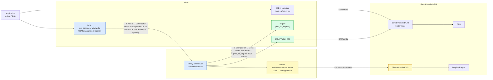
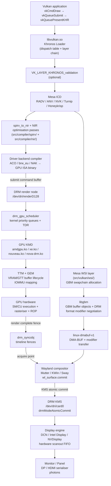

# Chapter 159: The Vulkan–Mesa–DRM Stack: A Full Vertical Slice

**Audiences:** Systems and driver developers; graphics application developers; anyone who needs a unified mental model of how a `vk*` call travels from application code through the Mesa Vulkan runtime, the DRM kernel interface, GPU-specific kernel modules, and finally to pixels on screen.

---

## Table of Contents

1. [Why a Vertical Slice?](#1-why-a-vertical-slice)
2. [Layer Zero: The Vulkan Loader](#2-layer-zero-the-vulkan-loader)
   - 2.1 [ICD Discovery and JSON Manifests](#21-icd-discovery-and-json-manifests)
   - 2.2 [Dispatch Table Construction](#22-dispatch-table-construction)
   - 2.3 [Validation and Implicit Layers](#23-validation-and-implicit-layers)
3. [The Mesa Vulkan Common Runtime](#3-the-mesa-vulkan-common-runtime)
   - 3.1 [Shared Object Hierarchy](#31-shared-object-hierarchy)
   - 3.2 [Driver Registration](#32-driver-registration)
4. [Shader Compilation: SPIR-V to GPU ISA](#4-shader-compilation-spir-v-to-gpu-isa)
   - 4.1 [spirv_to_nir: The Universal Entry Point](#41-spirv_to_nir-the-universal-entry-point)
   - 4.2 [NIR Optimisation Passes](#42-nir-optimisation-passes)
   - 4.3 [Driver-Specific Backends](#43-driver-specific-backends)
   - 4.4 [Pipeline State Objects: When Compilation Fires](#44-pipeline-state-objects-when-compilation-fires)
5. [Command Buffer Recording: From vkCmdDraw to GPU Packets](#5-command-buffer-recording-from-vkcmddraw-to-gpu-packets)
   - 5.1 [The Recording Lifecycle](#51-the-recording-lifecycle)
   - 5.2 [VK_KHR_dynamic_rendering vs Render Passes](#52-vk_khr_dynamic_rendering-vs-render-passes)
   - 5.3 [Command Buffer Pools and Secondary Buffers](#53-command-buffer-pools-and-secondary-buffers)
6. [Descriptor Sets and Resource Binding](#6-descriptor-sets-and-resource-binding)
   - 6.1 [Descriptor Layout, Pool, and Set](#61-descriptor-layout-pool-and-set)
   - 6.2 [How Drivers Implement Descriptors in GPU Memory](#62-how-drivers-implement-descriptors-in-gpu-memory)
   - 6.3 [Push Constants and Push Descriptors](#63-push-constants-and-push-descriptors)
7. [Pipeline Barriers, Image Layouts, and Hazard Tracking](#7-pipeline-barriers-image-layouts-and-hazard-tracking)
   - 7.1 [Execution and Memory Dependencies](#71-execution-and-memory-dependencies)
   - 7.2 [Image Layouts and Their Hardware Meaning](#72-image-layouts-and-their-hardware-meaning)
   - 7.3 [How Drivers Implement Barriers in Hardware](#73-how-drivers-implement-barriers-in-hardware)
8. [GPU Rasterisation Pipeline and Cache Hierarchy](#8-gpu-rasterisation-pipeline-and-cache-hierarchy)
   - 8.1 [Fixed-Function Stages](#81-fixed-function-stages)
   - 8.2 [Fragment Shader Invocation and Quads](#82-fragment-shader-invocation-and-quads)
   - 8.3 [Render Output and Framebuffer Compression](#83-render-output-and-framebuffer-compression)
   - 8.4 [GPU Cache Hierarchy](#84-gpu-cache-hierarchy)
9. [DRM: The Kernel Rendezvous](#9-drm-the-kernel-rendezvous)
   - 9.1 [Render Nodes vs Primary Nodes](#91-render-nodes-vs-primary-nodes)
   - 9.2 [GEM: Buffer Lifecycle in the Kernel](#92-gem-buffer-lifecycle-in-the-kernel)
   - 9.3 [Command Submission Ioctls](#93-command-submission-ioctls)
   - 9.4 [drm_gpu_scheduler](#94-drm_gpu_scheduler)
10. [GBM and DMA-BUF: Allocation and Sharing](#10-gbm-and-dma-buf-allocation-and-sharing)
    - 10.1 [GBM API and Format Modifiers Negotiation](#101-gbm-api-and-format-modifier-negotiation)
    - 10.2 [PRIME: Cross-Device Buffer Sharing](#102-prime-cross-device-buffer-sharing)
11. [Explicit GPU Synchronisation: drm_syncobj](#11-explicit-gpu-synchronisation-drm_syncobj)
    - 11.1 [The Death of Implicit Fences](#111-the-death-of-implicit-fences)
    - 11.2 [Timeline Syncobjs and Vulkan Semaphores](#112-timeline-syncobjs-and-vulkan-semaphores)
    - 11.3 [linux-drm-syncobj-v1 Wayland Protocol](#113-linux-drm-syncobj-v1-wayland-protocol)
12. [NVIDIA: Three Driver Stacks in Coexistence](#12-nvidia-three-driver-stacks-in-coexistence)
    - 12.1 [Proprietary Closed Stack](#121-proprietary-closed-stack)
    - 12.2 [nvidia-open: Open Kernel, Closed Userspace](#122-nvidia-open-open-kernel-closed-userspace)
    - 12.3 [nouveau + NVK: The Fully Open Path](#123-nouveau--nvk-the-fully-open-path)
    - 12.4 [GSP Firmware: The Hidden Third Actor](#124-gsp-firmware-the-hidden-third-actor)
13. [The Present Path: vkQueuePresentKHR to Photons](#13-the-present-path-vkqueuepresentkhr-to-photons)
    - 13.1 [vkAcquireNextImageKHR: Opening the Frame](#131-vkacquirenextimagekhr-opening-the-frame)
    - 13.2 [Mesa WSI and Swapchain Allocation](#132-mesa-wsi-and-swapchain-allocation)
    - 13.3 [Wayland: linux-dmabuf-v1 and Compositor Import](#133-wayland-linux-dmabuf-v1-and-compositor-import)
    - 13.4 [KMS Atomic Commit and Display Engine Scanout](#134-kms-atomic-commit-and-display-engine-scanout)
    - 13.5 [Frame Timing and the Triple-Buffer Pipeline](#135-frame-timing-and-the-triple-buffer-pipeline)
14. [Supporting Subsystems](#14-supporting-subsystems)
    - 14.1 [Resizable BAR and Smart Access Memory](#141-resizable-bar-and-smart-access-memory)
    - 14.2 [IOMMU: DMA Safety](#142-iommu-dma-safety)
    - 14.3 [GPU Firmware Microcode](#143-gpu-firmware-microcode)
15. [Memory Types, Heaps, and the VkMemoryAllocateInfo Path](#15-memory-types-heaps-and-the-vkmemoryallocateinfo-path)
    - 15.1 [VkPhysicalDeviceMemoryProperties and Heap Topology](#151-vkphysicaldevicememoryproperties-and-heap-topology)
    - 15.2 [Allocation Strategy in Practice](#152-allocation-strategy-in-practice)
    - 15.3 [Staging Buffer Uploads: Getting Data to VRAM](#153-staging-buffer-uploads-getting-data-to-vram)
16. [Debugging the Full Stack](#16-debugging-the-full-stack)
    - 16.1 [Tracing the Ioctl Surface](#161-tracing-the-ioctl-surface)
    - 16.2 [GPU Hang Debugging](#162-gpu-hang-debugging)
    - 16.3 [Shader Disassembly and NIR Dumps](#163-shader-disassembly-and-nir-dumps)
17. [Mesa and Wayland: The Bidirectional Relationship](#17-mesa-and-wayland-the-bidirectional-relationship)
    - 17.1 [Apps Presenting Frames: Mesa WSI as a Wayland Client](#171-apps-presenting-frames-mesa-wsi-as-a-wayland-client)
    - 17.2 [The Compositor as a Mesa Consumer](#172-the-compositor-as-a-mesa-consumer)
    - 17.3 [What Wayland Core Does Not Know About Mesa](#173-what-wayland-core-does-not-know-about-mesa)
18. [Common Patterns: Feeding the Critical Path at Scale](#18-common-patterns-feeding-the-critical-path-at-scale)
    - 18.1 [Persistent Mapped Uniform Buffers](#181-persistent-mapped-uniform-buffers)
    - 18.2 [Indirect Draw: GPU-Driven Rendering](#182-indirect-draw-gpu-driven-rendering)
    - 18.3 [Multi-Threaded Command Recording](#183-multi-threaded-command-recording)
19. [Full Stack Diagram](#19-full-stack-diagram)
20. [Integrations](#20-integrations)

---

## 1. Why a Vertical Slice?

The Linux graphics stack is routinely described as a set of horizontal layers — kernel DRM, libdrm, Mesa, Wayland, compositors — each with its own chapter. That layering is correct but incomplete: understanding what happens when an application calls `vkDraw*` and pixels appear on screen requires tracing a path that cuts *vertically* through every layer simultaneously. A bug that looks like a compositor artifact may root-cause in a kernel fence; a performance regression visible as a frame-rate drop may originate in the GLSL front-end or the GEM memory allocator.

This chapter follows a single notional `vkCmdDraw` → `vkQueueSubmit` → `vkQueuePresentKHR` sequence from the application's perspective down to the display engine's scanout FIFO, naming every structure, ioctl, and kernel subsystem it touches along the way. NVIDIA receives extra attention because it presents three simultaneous driver stacks — proprietary closed, nvidia-open with closed userspace, and the fully open nouveau + NVK path — that share the same GPU but interact with the kernel and Mesa in fundamentally different ways.

---

## 2. Layer Zero: The Vulkan Loader

### 2.1 ICD Discovery and JSON Manifests

The first thing a Vulkan application links against is *not* a GPU driver. It links against `libvulkan.so.1`, the **Khronos Vulkan Loader** — a thin dispatch library maintained at [https://github.com/KhronosGroup/Vulkan-Loader](https://github.com/KhronosGroup/Vulkan-Loader). The loader's job is ICD (Installable Client Driver) discovery, layer insertion, and per-device dispatch table construction.

On Linux, ICD discovery reads JSON manifests from a set of well-known paths in priority order: directories from `$VK_ICD_FILENAMES` (colon-separated), `$XDG_DATA_DIRS/vulkan/icd.d/`, `/usr/share/vulkan/icd.d/`, and `/etc/vulkan/icd.d/`. A typical system has:

```
/usr/share/vulkan/icd.d/
├── radeon_icd.x86_64.json          # Mesa RADV (AMD)
├── intel_icd.x86_64.json           # Mesa ANV (Intel)
├── nouveau_icd.x86_64.json         # Mesa NVK (NVIDIA open)
└── nvidia_icd.json                 # NVIDIA proprietary ICD
```

Each JSON manifest contains the path to the shared library and the API version it implements:

```json
{
    "file_format_version": "1.0.0",
    "ICD": {
        "library_path": "/usr/lib/x86_64-linux-gnu/libvulkan_radeon.so",
        "api_version": "1.3.289"
    }
}
```

[Source: Vulkan-Loader ICD discovery documentation](https://github.com/KhronosGroup/Vulkan-Loader/blob/main/docs/LoaderInterfaceArchitecture.md)

The loader `dlopen()`s each ICD library and calls `vk_icdGetInstanceProcAddr` to bootstrap the dispatch chain. All physical devices from all ICDs are merged into a single enumeration returned by `vkEnumeratePhysicalDevices`.

### 2.2 Dispatch Table Construction

Once `vkCreateDevice` selects a physical device, the loader builds a **per-device dispatch table** — a struct of function pointers, one per Vulkan command. Subsequent `vk*` calls are resolved via a hidden first-pointer trick: every `VkCommandBuffer`, `VkQueue`, and `VkDevice` begins in memory with a pointer to its dispatch table. The loader stamps this pointer at object creation time; subsequent calls dispatch through it without an additional lookup.

```c
/* Loader internal representation (simplified) */
struct loader_device {
    struct loader_dispatch_table   dispatch;  /* must be first member */
    VkDevice                       device;
    struct loader_icd_term        *icd_term;
};
```

[Source: loader_device in Vulkan-Loader `src/loader/loader.h`](https://github.com/KhronosGroup/Vulkan-Loader/blob/main/loader/loader.h)

### 2.3 Validation and Implicit Layers

Between the application and the ICD sit **layers**: middleware shared libraries that intercept every dispatch-table call. Layers are discovered similarly to ICDs via JSON manifests in `layer.d/` directories. The most important is `VK_LAYER_KHRONOS_validation`, which performs:

- Parameter validation against the Vulkan specification
- Object lifetime tracking (double-free, use-after-free detection)
- Synchronisation hazard detection (`VK_VALIDATION_FEATURE_ENABLE_SYNCHRONIZATION_VALIDATION_EXT`)
- `VK_EXT_debug_utils` message routing

Layers can be stacked arbitrarily. Each layer implements the loader-layer interface (`vk_layerGetPhysicalDeviceProcAddr`) and forwards calls it does not intercept. The overhead is one indirect function-pointer call per Vulkan command per layer — negligible for most workloads but measurable in CPU-bound command-recording tight loops.

---

## 3. The Mesa Vulkan Common Runtime

### 3.1 Shared Object Hierarchy

All Mesa Vulkan drivers — RADV (AMD), ANV (Intel), NVK (NVIDIA), Turnip (Qualcomm), Honeykrisp (Apple AGX), and v3dv (Broadcom V3D) — share a **common runtime** in `src/vulkan/runtime/`. This avoids re-implementing thousands of lines of object-lifecycle, descriptor-set, render-pass, and queue-family boilerplate per driver.

The shared runtime defines base structs that each driver embeds as their first member:

```c
/* src/vulkan/runtime/vk_device.h  (Mesa, tag mesa-24.1.0) */
struct vk_device {
    struct vk_object_base               base;
    struct vk_physical_device          *physical;
    struct vk_device_dispatch_table     dispatch_table;

    /* Enabled extensions, features */
    struct vk_device_extension_table    enabled_extensions;

    /* Command-buffer pool and allocator */
    struct vk_command_pool_ops         *command_pool_ops;

    /* Logging / debug utils */
    struct vk_device_debug_utils        debug_utils;

    /* ... */
};
```

[Source: `src/vulkan/runtime/vk_device.h` in Mesa mainline](https://gitlab.freedesktop.org/mesa/mesa/-/blob/main/src/vulkan/runtime/vk_device.h)

RADV's device struct begins:

```c
/* src/amd/vulkan/radv_device.c  (Mesa, tag mesa-24.1.0) */
struct radv_device {
    struct vk_device         vk;   /* must be first — shares dispatch table */
    struct radeon_winsys    *ws;
    struct radv_physical_device *physical_device;
    /* AMD-specific state ... */
};
```

The same pattern applies to `vk_queue` → `radv_queue`, `vk_command_buffer` → `radv_cmd_buffer`, and every other object type. Because the base struct is always the first member, a `VkDevice` handle can be cast to `struct vk_device *` and then `container_of`'d to the driver-private struct.

### 3.2 Driver Registration

Each Mesa Vulkan driver exposes a `VkIcdNegotiateLoaderICDInterfaceVersion` entry point and a static `vk_physical_device_dispatch_table` plus a `vk_instance_dispatch_table`. At build time, Mesa generates these dispatch tables via Python scripts that parse the Vulkan XML registry (`vk.xml`), ensuring every new extension command is automatically wired up.

Driver entry points are exported with the `PUBLIC` macro and must match the Vulkan spec's function naming exactly. The loader resolves them via `dlsym` after loading the ICD shared library.

---

## 4. Shader Compilation: SPIR-V to GPU ISA

### 4.1 spirv_to_nir: The Universal Entry Point

All Mesa Vulkan drivers compile shaders by calling a single entry point:

```c
/* src/compiler/spirv/spirv_to_nir.h  (Mesa mainline) */
nir_shader *spirv_to_nir(const uint32_t *words, size_t word_count,
                          struct nir_spirv_specialization *spec,
                          unsigned num_spec,
                          gl_shader_stage stage,
                          const char *entry_point_name,
                          const struct spirv_to_nir_options *options,
                          const nir_shader_compiler_options *nir_options);
```

[Source: `src/compiler/spirv/spirv_to_nir.h`](https://gitlab.freedesktop.org/mesa/mesa/-/blob/main/src/compiler/spirv/spirv_to_nir.h)

`spirv_to_nir` walks the SPIR-V binary word stream, resolves OpType* instructions into NIR types, lowers OpFunction blocks into NIR functions, and produces a `nir_shader` — Mesa's typed static single-assignment IR. Specialisation constants (`OpSpecConstant`) are resolved at this stage using the values provided in `VkSpecializationInfo`.

### 4.2 NIR Optimisation Passes

NIR (described fully in Chapter 14) is not merely a translation target — it hosts the majority of Mesa's driver-independent shader optimisations. After `spirv_to_nir`, a typical driver runs a standard sequence:

```c
/* Typical NIR optimisation pipeline (simplified from src/amd/vulkan/radv_pipeline.c) */
NIR_PASS(progress, nir, nir_lower_returns);
NIR_PASS(progress, nir, nir_inline_functions);
NIR_PASS(progress, nir, nir_copy_prop);
NIR_PASS(progress, nir, nir_opt_constant_folding);
NIR_PASS(progress, nir, nir_opt_dce);        /* dead code elimination */
NIR_PASS(progress, nir, nir_opt_if, NULL);
NIR_PASS(progress, nir, nir_opt_loop_unroll);
NIR_PASS(progress, nir, nir_lower_phis_to_scalar, false, NULL);
NIR_PASS(progress, nir, nir_opt_algebraic);
```

The `NIR_PASS` macro runs a pass and sets `progress` to true if any IR changes occurred; the pipeline repeats until fixpoint. Passes are functions declared in `src/compiler/nir/nir_opt_*.c` and `nir_lower_*.c`.

### 4.3 Driver-Specific Backends

After NIR optimisation, each driver lowers NIR to its own GPU instruction set:

| Driver | Backend | Language | Source path | GPU targets |
|--------|---------|----------|-------------|-------------|
| RADV | ACO | C++ | `src/amd/compiler/` | GCN4 through RDNA4 |
| ANV | brw_eu / ELK | C | `src/intel/compiler/` | Gen7 through Xe2 |
| NVK | NAK | Rust | `src/nouveau/compiler/` | SM50 (Maxwell) through SM90 (Hopper) |
| Turnip | ir3 | C | `src/freedreno/ir3/` | Adreno A6xx/A7xx |
| Honeykrisp | AGX ISA | C | `src/asahi/compiler/` | Apple M1–M4 series |
| v3dv | QPU | C | `src/broadcom/compiler/` | Raspberry Pi 4/5 (VideoCore VI/VII) |

**ACO** (AMD Compiler) is notable for producing better register allocation and ILP than LLVM for AMD hardware. It was written specifically to fix LLVM's spilling behaviour on GCN/RDNA, where the extremely large register file (256 SGPRs + 256 VGPRs per CU) made spill decisions critical to wave occupancy.

**NAK** (Nouveau/NVK Compiler) is written in Rust using the `bitflags`, `rustc-hash`, and `indexmap` crates. It lowers NIR through a custom SSA IR to NVIDIA PTX-equivalent machine instructions, targeting the Shader Model 5.0 (Maxwell) through SM90 (Hopper/Ada Lovelace) ISAs. NAK was merged into Mesa mainline in 2024 alongside NVK reaching Vulkan 1.3 conformance.

[Source: NAK in Mesa `src/nouveau/compiler/`](https://gitlab.freedesktop.org/mesa/mesa/-/tree/main/src/nouveau/compiler)

---

### 4.4 Pipeline State Objects: When Compilation Fires

Shader compilation does not happen when `vkCreateShaderModule` is called — it happens when `vkCreateGraphicsPipelines` or `vkCreateComputePipelines` is called. These functions receive a `VkGraphicsPipelineCreateInfo` that specifies not just the shaders but the entire fixed-function state of the pipeline: vertex input bindings and attributes, primitive topology, viewport and scissor counts, rasterisation state (polygon mode, cull mode, front face), depth and stencil operations, and colour blend attachments. All of this state is compiled together with the shaders into a single GPU state record — the **Pipeline State Object (PSO)**.

```c
/* VkGraphicsPipelineCreateInfo: the complete PSO specification */
VkGraphicsPipelineCreateInfo pipeline_info = {
    .sType               = VK_STRUCTURE_TYPE_GRAPHICS_PIPELINE_CREATE_INFO,
    .stageCount          = 2,
    .pStages             = shader_stages,     /* vertex + fragment VkShaderModule */
    .pVertexInputState   = &vertex_input,     /* VkVertexInputBindingDescription[] */
    .pInputAssemblyState = &input_assembly,   /* topology: TRIANGLE_LIST */
    .pViewportState      = &viewport_state,
    .pRasterizationState = &rasterization,    /* cullMode, frontFace, polygonMode */
    .pDepthStencilState  = &depth_stencil,    /* depthTestEnable, depthWriteEnable */
    .pColorBlendState    = &color_blend,      /* blendEnable, srcColorBlendFactor */
    .layout              = pipeline_layout,   /* descriptor set layouts + push constants */
    .renderPass          = VK_NULL_HANDLE,    /* NULL for dynamic rendering */
};
vkCreateGraphicsPipelines(device, pipeline_cache, 1, &pipeline_info, NULL, &pipeline);
```

Inside RADV, `vkCreateGraphicsPipelines` calls `radv_graphics_pipeline_compile`, which invokes `spirv_to_nir` for each shader stage, runs the NIR optimisation pipeline, and calls ACO to produce the final RDNA ISA binary. The pipeline's fixed-function state is translated into a set of `SET_CONTEXT_REG` PM4 packets that RADV pre-bakes into the command buffer at `vkCmdBindPipeline` time. By doing this work at PSO creation, the per-draw cost of `vkCmdBindPipeline` is reduced to a DMA copy of pre-assembled register packets.

[Source: `src/amd/vulkan/radv_pipeline_graphics.c`](https://gitlab.freedesktop.org/mesa/mesa/-/blob/main/src/amd/vulkan/radv_pipeline_graphics.c)

**Pipeline caches** (`VkPipelineCache`) serialise the compiled ISA binaries to an opaque byte blob that can be saved to disk and reloaded on the next run, avoiding recompilation of the same shader permutations. RADV stores the ACO ISA binary alongside a hash of the NIR and pipeline state as the cache key. The cache is driver-specific — a cache produced by RADV cannot be consumed by ANV.

**Shader stutter** is the perceptible frame hitch that occurs when a PSO is compiled on the first draw that needs it. The compilation can take 10–500 ms for complex shaders. Solutions are: pre-warm the pipeline cache at load time, use `VK_EXT_pipeline_creation_cache_control` to compile asynchronously, or use Mesa's background compilation thread (`radv_async_shader_compilation`). Bevy and Godot 4 both implement pipeline pre-warming using Vulkan pipeline cache serialisation between runs.

---

## 5. Command Buffer Recording: From vkCmdDraw to GPU Packets

Command buffers are the primary unit of work in Vulkan. All GPU commands — draw calls, compute dispatches, resource transitions, and copies — are recorded into a `VkCommandBuffer` on the CPU, then submitted in batch to a queue. This separation of record-time and submit-time is fundamental: multiple threads can record command buffers in parallel, and recorded buffers can be reused across frames.

### 5.1 The Recording Lifecycle

```c
/* Typical per-frame command buffer recording */
VkCommandBufferBeginInfo begin_info = {
    .sType = VK_STRUCTURE_TYPE_COMMAND_BUFFER_BEGIN_INFO,
    .flags = VK_COMMAND_BUFFER_USAGE_ONE_TIME_SUBMIT_BIT,
};
vkBeginCommandBuffer(cmd, &begin_info);

/* Transition swapchain image to colour attachment */
VkImageMemoryBarrier2 barrier = {
    .sType         = VK_STRUCTURE_TYPE_IMAGE_MEMORY_BARRIER_2,
    .srcStageMask  = VK_PIPELINE_STAGE_2_COLOR_ATTACHMENT_OUTPUT_BIT,
    .dstStageMask  = VK_PIPELINE_STAGE_2_COLOR_ATTACHMENT_OUTPUT_BIT,
    .dstAccessMask = VK_ACCESS_2_COLOR_ATTACHMENT_WRITE_BIT,
    .oldLayout     = VK_IMAGE_LAYOUT_UNDEFINED,
    .newLayout     = VK_IMAGE_LAYOUT_COLOR_ATTACHMENT_OPTIMAL,
    .image         = swapchain_image,
};
VkDependencyInfo dep = { .imageMemoryBarrierCount = 1, .pImageMemoryBarriers = &barrier };
vkCmdPipelineBarrier2(cmd, &dep);

/* Begin render pass (or VK_KHR_dynamic_rendering equivalent) */
vkCmdBeginRendering(cmd, &rendering_info);   /* Vulkan 1.3 dynamic rendering */

vkCmdBindPipeline(cmd, VK_PIPELINE_BIND_POINT_GRAPHICS, pipeline);
vkCmdBindDescriptorSets(cmd, VK_PIPELINE_BIND_POINT_GRAPHICS,
                         pipeline_layout, 0, 1, &descriptor_set, 0, NULL);
vkCmdBindVertexBuffers(cmd, 0, 1, &vertex_buf, &offset);
vkCmdBindIndexBuffer(cmd, index_buf, 0, VK_INDEX_TYPE_UINT32);
vkCmdDrawIndexed(cmd, index_count, 1, 0, 0, 0);

vkCmdEndRendering(cmd);
vkEndCommandBuffer(cmd);
```

Inside a Mesa driver, each `vkCmd*` call does not touch the GPU at all. It writes into a CPU-side **command buffer stream** — a driver-managed allocation in host memory. The stream format is GPU-specific:

- **RADV (AMD)**: the stream contains **PM4 packets** — AMD's Packet Manager 4 protocol. `vkCmdDraw` emits a `DRAW_INDEX_AUTO` or `DRAW_INDEX_2` packet. `vkCmdBindPipeline` emits `SET_CONTEXT_REG` packets for all pipeline state registers (SPI_SHADER_COL_FORMAT, PA_SC_LINE_CNTL, etc.). The entire stream is assembled in a GEM buffer (`drm_amdgpu_gem_create`) that later becomes an **IB** (Indirect Buffer) submitted to the kernel.
- **ANV (Intel)**: uses **MI commands** and **3DSTATE_*** packets from Intel's Graphics Core documentation. `vkCmdDraw` emits `3DPRIMITIVE`. State is emitted lazily: RADV and ANV both use a "dirty bit" system where pipeline bind marks state as dirty and the next draw call flushes accumulated state packets.
- **NVK (NVIDIA)**: uses **NVC0 method buffers** — Fermi/Maxwell/Turing FIFO command encoding. Methods are (class, offset, data) tuples. `vkCmdDraw` emits `NVC0_3D_VERTEX_BEGIN_GL` + `NVC0_3D_VERTEX_BUFFER_FIRST` + `NVC0_3D_VERTEX_END_GL`.

### 5.2 VK_KHR_dynamic_rendering vs Render Passes

The original Vulkan render pass model (`vkCmdBeginRenderPass` / `vkCmdEndRenderPass`) was designed for tile-based GPUs that benefit from knowing all attachments and subpass dependencies up front. For immediate-mode desktop GPUs (AMD, Intel, NVIDIA), subpass dependencies translate to pipeline barriers with little hardware benefit.

`VK_KHR_dynamic_rendering` (Vulkan 1.3 core) eliminates render pass objects and framebuffers entirely. `vkCmdBeginRendering` takes a `VkRenderingInfo` with attachment formats and load/store ops inline. Mesa drivers (RADV, ANV, NVK) implement this natively — RADV even prefers it internally, internally converting legacy render passes to dynamic rendering where the hardware differences are negligible.

### 5.3 Command Buffer Pools and Secondary Buffers

Command buffers are allocated from `VkCommandPool` objects, which are not thread-safe — each thread needs its own pool. Secondary command buffers (`VK_COMMAND_BUFFER_LEVEL_SECONDARY`) can be pre-recorded once and executed via `vkCmdExecuteCommands` from a primary buffer, enabling parallel recording patterns where each thread records a secondary buffer for its object list, and a final thread assembles them.

[Source: RADV command buffer implementation `src/amd/vulkan/radv_cmd_buffer.c`](https://gitlab.freedesktop.org/mesa/mesa/-/blob/main/src/amd/vulkan/radv_cmd_buffer.c)

---

## 6. Descriptor Sets and Resource Binding

Descriptor sets are the mechanism by which shaders access resources — textures, buffers, samplers, and images. They are the Vulkan replacement for OpenGL's global bind points (`glBindTexture`, `glUniformBlockBinding`), and their hardware implementation reveals a great deal about how modern GPU driver design differs across vendors.

### 6.1 Descriptor Layout, Pool, and Set

The application declares the shape of its resource bindings in a `VkDescriptorSetLayout`, allocates sets from a `VkDescriptorPool`, and fills them via `vkUpdateDescriptorSets`:

```c
/* Layout: binding 0 = uniform buffer, binding 1 = combined image sampler */
VkDescriptorSetLayoutBinding bindings[] = {
    { 0, VK_DESCRIPTOR_TYPE_UNIFORM_BUFFER,         1, VK_SHADER_STAGE_VERTEX_BIT,   NULL },
    { 1, VK_DESCRIPTOR_TYPE_COMBINED_IMAGE_SAMPLER, 1, VK_SHADER_STAGE_FRAGMENT_BIT, NULL },
};
VkDescriptorSetLayoutCreateInfo layout_info = {
    .bindingCount = 2, .pBindings = bindings,
};
vkCreateDescriptorSetLayout(device, &layout_info, NULL, &set_layout);

/* Allocate and write */
vkAllocateDescriptorSets(device, &alloc_info, &descriptor_set);

VkWriteDescriptorSet writes[] = {
    { .dstBinding = 0, .descriptorType = VK_DESCRIPTOR_TYPE_UNIFORM_BUFFER,
      .pBufferInfo = &(VkDescriptorBufferInfo){ .buffer = ubo, .range = VK_WHOLE_SIZE } },
    { .dstBinding = 1, .descriptorType = VK_DESCRIPTOR_TYPE_COMBINED_IMAGE_SAMPLER,
      .pImageInfo  = &(VkDescriptorImageInfo){ .imageView = tex_view, .sampler = sampler,
                                               .imageLayout = VK_IMAGE_LAYOUT_SHADER_READ_ONLY_OPTIMAL } },
};
vkUpdateDescriptorSets(device, 2, writes, 0, NULL);
```

### 6.2 How Drivers Implement Descriptors in GPU Memory

The hardware reality behind `VkDescriptorSet` differs significantly between GPU families:

**AMD (RADV)**: Each descriptor is a contiguous block of DWORD-sized words in a GPU-visible buffer (GTT or VRAM). A sampled image descriptor is 8 DWORDs (32 bytes) containing the surface base address, tiling info, format, dimensions, and sampler state. `vkUpdateDescriptorSets` writes these 8 DWORDs into the descriptor set's backing buffer. At draw time, `vkCmdBindDescriptorSets` emits a `SET_SH_REG` PM4 packet pointing the shader USER_DATA registers at the descriptor set buffer's GPU address. The shader then loads descriptors via `s_load_dwordx8` instructions.

**Intel (ANV)**: Uses a descriptor heap model where descriptors live in a large pre-allocated GPU buffer (the "surface state heap" and "sampler state heap"). On Xe2 (Battlemage and later), ANV implements `VK_EXT_descriptor_buffer`, which exposes the raw descriptor layout to the application, enabling zero-copy descriptor updates.

**NVIDIA (NVK/proprietary)**: Descriptors are represented as GPU virtual addresses embedded in the shader's constant buffer. A `VkImageView` is a 64-bit VA pointing to the surface descriptor block in VRAM. The NVIDIA shader hardware accesses resources via `TEX` instructions that take these VAs.

### 6.3 Push Constants and Push Descriptors

**Push constants** (`vkCmdPushConstants`) provide a small, frequently-updated constant block (up to 128–256 bytes depending on driver) that is embedded directly in the command stream rather than requiring a buffer allocation. RADV implements them as `SET_SH_REG` packets writing to USER_DATA registers; ANV as inline data in the 3DSTATE command stream.

**Push descriptors** (`VK_KHR_push_descriptor`) allow descriptor updates inline in the command buffer without a `VkDescriptorPool`. They are ideal for per-draw resources that change every call (e.g., the per-object transform matrix buffer address).

[Source: RADV descriptor implementation `src/amd/vulkan/radv_descriptor_set.c`](https://gitlab.freedesktop.org/mesa/mesa/-/blob/main/src/amd/vulkan/radv_descriptor_set.c)

---

## 7. Pipeline Barriers, Image Layouts, and Hazard Tracking

Pipeline barriers are Vulkan's explicit mechanism for ordering GPU operations and managing cache coherency. Understanding them is essential for both correctness (barriers prevent read-after-write and write-after-read hazards) and performance (incorrect or over-broad barriers are a leading cause of GPU pipeline stalls).

### 7.1 Execution and Memory Dependencies

`vkCmdPipelineBarrier2` (Vulkan 1.3, `VK_KHR_synchronization2`) takes a `VkDependencyInfo` with three types of dependency:

- **Memory barriers** (`VkMemoryBarrier2`): flush and invalidate caches for all resources.
- **Buffer memory barriers** (`VkBufferMemoryBarrier2`): scoped to a buffer range.
- **Image memory barriers** (`VkImageMemoryBarrier2`): scoped to an image subresource, and additionally specify an `oldLayout` → `newLayout` transition.

Each barrier specifies:
- `srcStageMask`: which pipeline stages must complete before the barrier
- `srcAccessMask`: which memory writes those stages produced (triggers cache flush)
- `dstStageMask`: which pipeline stages must wait after the barrier
- `dstAccessMask`: which memory reads those stages will perform (triggers cache invalidation)

```c
/* Barrier: transition from color attachment write to shader read */
VkImageMemoryBarrier2 barrier = {
    .srcStageMask  = VK_PIPELINE_STAGE_2_COLOR_ATTACHMENT_OUTPUT_BIT,
    .srcAccessMask = VK_ACCESS_2_COLOR_ATTACHMENT_WRITE_BIT,
    .dstStageMask  = VK_PIPELINE_STAGE_2_FRAGMENT_SHADER_BIT,
    .dstAccessMask = VK_ACCESS_2_SHADER_READ_BIT,
    .oldLayout     = VK_IMAGE_LAYOUT_COLOR_ATTACHMENT_OPTIMAL,
    .newLayout     = VK_IMAGE_LAYOUT_SHADER_READ_ONLY_OPTIMAL,
    .image         = render_target,
    .subresourceRange = { VK_IMAGE_ASPECT_COLOR_BIT, 0, 1, 0, 1 },
};
```

### 7.2 Image Layouts and Their Hardware Meaning

Vulkan image layouts are not purely abstract — they map to real hardware compression and tiling states:

| Vulkan layout | AMD hardware state | Intel hardware state |
|---------------|-------------------|---------------------|
| `UNDEFINED` | Any (contents discarded) | Any (contents discarded) |
| `COLOR_ATTACHMENT_OPTIMAL` | DCC-compressed, CB metadata valid | CCS-compressed, renderable |
| `SHADER_READ_ONLY_OPTIMAL` | DCC-compressed or decompressed, TC-compatible | CCS or uncompressed, sampler-readable |
| `TRANSFER_SRC_OPTIMAL` | Decompressed for blit engine | Uncompressed or resolved |
| `PRESENT_SRC_KHR` | DCC or linear, KMS-scannable modifier | CCS or X-tiled, KMS-scannable |

A layout transition is often a GPU-side decompression or recompression pass. RADV inserts `DECOMPRESS_DCC` draw calls when transitioning out of `COLOR_ATTACHMENT_OPTIMAL` to an incompatible layout. ANV similarly manages CCS (Color Control Surface) state. Getting transitions wrong — missing a barrier or using the wrong layout — typically manifests as visual corruption, black textures, or intermittent GPU hangs.

### 7.3 How Drivers Implement Barriers in Hardware

Barriers translate to hardware synchronisation primitives specific to each GPU:

- **AMD**: `EVENT_WRITE_EOP` (End-Of-Pipe event) combined with cache flush bits in the CS_PARTIAL_FLUSH and CB_DB_CACHE_FLUSH packets. The event writes a 64-bit value to a GPU memory address when the specified pipeline stage completes; the next submission can `WAIT_REG_MEM` on that address.
- **Intel**: `PIPE_CONTROL` packet with bitmask flags for Post-Sync Operation, Render Target Cache Flush, Texture Cache Invalidation, and CS Stall. Intel's GPU architecture is deeply pipelined and PIPE_CONTROL can flush/stall any subset of stages.
- **NVIDIA**: `NVC0_3D_WAIT_FOR_IDLE` combined with method-based cache flush sequences. NVK uses Fermi/Maxwell's memory barrier model adapted for Vulkan's synchronisation2 semantics.

[Source: RADV barrier implementation `src/amd/vulkan/radv_cmd_buffer.c` — `radv_emit_cache_flush()`](https://gitlab.freedesktop.org/mesa/mesa/-/blob/main/src/amd/vulkan/radv_cmd_buffer.c)

---

## 8. GPU Rasterisation Pipeline and Cache Hierarchy

After command buffer submission (§9 below), the GPU hardware executes the recorded commands through a fixed-function rasterisation pipeline followed by programmable shader stages. This section covers what happens inside the GPU from draw-call execution through framebuffer write.

### 8.1 Fixed-Function Stages

The geometry emitted by the vertex shader passes through several fixed-function stages before fragment shading:

1. **Primitive Assembly**: vertices are grouped into triangles (or lines/points), handling triangle strips and fans.
2. **Viewport Transform and Clipping**: clip-space coordinates are divided by W (perspective divide), transformed to viewport NDC space, and clipped against the view frustum. The guard band allows extended clipping to avoid over-clipping for very large primitives.
3. **Rasterisation**: the rasteriser walks each triangle's pixel coverage using Bresenham-style edge equations. On AMD RDNA, this is the **Primitive Shader** (NGG — Next-Gen Geometry) path when mesh shaders or NGG are active. The output is a set of *fragments* — (x, y, sample mask) tuples.
4. **Early-Z / Hi-Z**: before fragment shader invocation, the GPU checks the depth buffer. If all samples in a fragment are occluded by previously-written closer geometry, the fragment is killed early. AMD calls this the **Depth Block** or **Hi-Z pyramid**; Intel calls it the **Hierarchical Depth Buffer (HiZ)**. Early-Z requires no `discard` in the fragment shader and no depth writes in the shader.

### 8.2 Fragment Shader Invocation and Quads

Fragment shaders execute in **quads** — groups of 2×2 adjacent fragments — regardless of whether all four fragments are actually covered. This is required to correctly compute screen-space derivatives (`dFdx`, `dFdy`, `texture()` implicit LOD). Covered fragments execute normally; uncovered "helper invocations" execute the shader but their writes are discarded. Helper invocations can be queried via `gl_HelperInvocation` (GLSL) or `IsHelper` (HLSL/SPIR-V).

On AMD RDNA, fragment shaders execute in **waves** of 32 or 64 threads (quads). Each wave is scheduled on a **Compute Unit (CU)**, which has 4 SIMD-16 units (RDNA2) or 2 SIMD-32 units (RDNA3). Wave occupancy — how many waves can simultaneously reside on a CU — depends on register file usage. ACO's register allocator (§4) optimises specifically to maximise occupancy.

### 8.3 Render Output and Framebuffer Compression

After the fragment shader writes colour and depth, the **ROP** (Render Output Unit / Color Backend on AMD, Raster Operations Pipeline on Intel) performs:
- **Depth and stencil test**: compare against the depth buffer; discard if failing.
- **Blending**: if `VkPipelineColorBlendAttachmentState` is enabled, blend the fragment output with the existing framebuffer value using the configured blend equation.
- **Framebuffer write**: write the blended colour to the render target.

Modern GPUs apply lossy or lossless framebuffer compression transparently:
- **AMD DCC (Delta Colour Compression)**: lossless; stores deltas between adjacent tiles. The DCC metadata buffer tracks per-tile compression state. Enabled automatically when the render target uses a DCC-capable GBM modifier.
- **Intel CCS (Color Control Surface)**: a parallel metadata surface tracking which 4×4 pixel tiles contain uniform colour (for fast clears) or are compressed. Xe2 introduces hierarchical CCS.
- **NVIDIA**: per-tile ZCULL for depth, ROP-level lossless compression for colour. NVK exposes this via the standard DRM modifier negotiation path.

### 8.4 GPU Cache Hierarchy

The GPU memory system has multiple levels of cache between the shader units and VRAM/DRAM:

| Level | AMD RDNA3 | Intel Xe2 | NVIDIA Ada |
|-------|-----------|-----------|------------|
| L1 (per-CU/Xe-core) | 32 KB vector + scalar | 64 KB shared L1 | 128 KB L1/shared |
| L2 (per-shader-array) | 4 MB (GCD) | 512 KB per L2 bank | 6 MB |
| L3 / LLC | 64–96 MB Infinity Cache | 32–48 MB LLC | 96 MB L2 (Ada) |
| VRAM | GDDR6/HBM3 | GDDR6 / LPDDR5 | GDDR6X |

Pipeline barriers that specify `srcAccessMask = VK_ACCESS_2_COLOR_ATTACHMENT_WRITE_BIT` and `dstAccessMask = VK_ACCESS_2_SHADER_READ_BIT` translate to cache flush/invalidate sequences that ensure the L1 texture cache sees the updated framebuffer data written by the ROP. Without this, a shader sampling from a render target that was just written would read stale cached data.

---


<br>

## 9. DRM: The Kernel Rendezvous

### 5.1 Render Nodes vs Primary Nodes

The DRM subsystem exposes GPU hardware through two device-node types:

- **Primary node** (`/dev/dri/card0`, `card1`, …): Full DRM access including modesetting (KMS). Privileged — only the display server or compositor should open it. Ownership is determined by `DRM_MASTER` capability, acquired via `drmSetMaster`.
- **Render node** (`/dev/dri/renderD128`, `renderD129`, …): Render-only access. No KMS ioctls. Unprivileged — any process in the `video` group (or with appropriate udev rules) can open it. Mesa Vulkan drivers open only the render node; the compositor separately opens the primary node for KMS.

The split was introduced in Linux 3.12 specifically to allow GPU access without requiring a running display server.

### 5.2 GEM: Buffer Lifecycle in the Kernel

**GEM** (Graphics Execution Manager) is the kernel's GPU buffer manager, living in `drivers/gpu/drm/drm_gem.c`. Every GPU-resident buffer — vertex data, textures, framebuffers, shader ISA, command buffers — is represented as a **GEM object** identified by a per-file `gem_handle` (a `uint32_t`) or globally by a `dma_buf` file descriptor.

The lifecycle:

```
vkCreateBuffer / vkCreateImage
    │
    └─ Mesa calls driver-specific GEM create ioctl:
       AMD: DRM_IOCTL_AMDGPU_GEM_CREATE → struct drm_amdgpu_gem_create
       Intel: DRM_IOCTL_I915_GEM_CREATE_EXT → struct drm_i915_gem_create_ext
       NVIDIA: DRM_IOCTL_NOUVEAU_GEM_NEW → struct drm_nouveau_gem_new
       (or NVK via nova-drm: DRM_IOCTL_NOVA_GEM_CREATE)
            │
            └─ Kernel: drm_gem_object_init() → allocates struct drm_gem_object
                        backed by shmem (system RAM) or TTM (VRAM/GTT)
```

**TTM** (Translation Table Manager) manages the physical placement of GEM objects across VRAM, GTT (aperture-mapped system RAM), and CPU-visible mappings. It handles eviction when VRAM pressure is high, migrating objects to GTT and back as needed, and maintains IOMMU mappings throughout.

[Source: `drivers/gpu/drm/drm_gem.c`](https://github.com/torvalds/linux/blob/master/drivers/gpu/drm/drm_gem.c)
[Source: `drivers/gpu/drm/ttm/ttm_bo.c`](https://github.com/torvalds/linux/blob/master/drivers/gpu/drm/ttm/ttm_bo.c)

### 5.3 Command Submission Ioctls

Compiled GPU command buffers (ISA + state packets) are submitted via driver-specific ioctls on the render node:

```c
/* AMD amdgpu command submission  (linux/amdgpu_drm.h) */
struct drm_amdgpu_cs_in {
    uint32_t  ctx_id;           /* GPU context */
    uint32_t  bo_list_handle;   /* list of GEM BOs to pin for this submit */
    uint32_t  num_chunks;
    uint32_t  _pad;
    uint64_t  chunks;           /* array of drm_amdgpu_cs_chunk */
};
/* Submitted via: ioctl(fd, DRM_IOCTL_AMDGPU_CS, &cs_in) */
```

The `chunks` array can carry: IB (Indirect Buffer — pointer to the command buffer GEM object), syncobj signals/waits (for Vulkan semaphores and fences), and scheduler priority hints.

Intel i915 uses `DRM_IOCTL_I915_GEM_EXECBUFFER2` with a `drm_i915_gem_execbuffer2` struct that lists all GEM objects referenced by the command stream. The newer `xe` driver (replacing i915 from Meteor Lake forward) uses `DRM_IOCTL_XE_EXEC` with a cleaner `drm_xe_exec` struct.

```c
/* Intel Xe command submission (linux/xe_drm.h, kernel 6.8+) */
struct drm_xe_exec {
    uint64_t  exec_queue_id;    /* hardware engine queue */
    uint64_t  num_syncs;
    uint64_t  syncs;            /* array of drm_xe_sync (syncobj-based) */
    uint64_t  num_batch_buffer;
    uint64_t  batch_buf;        /* GEM handle of command buffer */
};
```

[Source: `include/uapi/drm/xe_drm.h`](https://github.com/torvalds/linux/blob/master/include/uapi/drm/xe_drm.h)

### 5.4 drm_gpu_scheduler

Command buffer submissions do not go directly to hardware. They enter the **DRM GPU Scheduler** (`drivers/gpu/drm/scheduler/gpu_scheduler.c`), a kernel subsystem providing:

- **Priority queues**: real-time, high, normal, low priority rings
- **Fair sharing**: round-robin across multiple clients sharing the same engine
- **Timeout detection (TDR)**: if a job does not complete within a configurable timeout (default 10 seconds on most drivers), the scheduler triggers GPU reset via `amdgpu_device_gpu_recover` or equivalent
- **Preemption** (on hardware that supports it): inserting context-switch packets between submissions

```
App process 1: submit job A (normal priority)
App process 2: submit job B (normal priority)
Compositor:    submit job C (high priority)

drm_gpu_scheduler queues: [C] → [A, B]
Hardware execution: C first, then A and B interleaved per time-slice
```

[Source: `drivers/gpu/drm/scheduler/gpu_scheduler.c`](https://github.com/torvalds/linux/blob/master/drivers/gpu/drm/scheduler/gpu_scheduler.c)

---

## 10. GBM and DMA-BUF: Allocation and Sharing

### 6.1 GBM API and Format Modifier Negotiation

**GBM** (Generic Buffer Manager), in Mesa's `src/gbm/`, is a userspace library providing a GPU-agnostic API for allocating buffers suitable for scanout (display) or rendering. It wraps the DRM GEM create ioctls with format-aware logic:

```c
/* Allocate a tiled, modifier-aware scanout buffer */
struct gbm_device *gbm = gbm_create_device(drm_render_fd);

uint64_t modifiers[] = { DRM_FORMAT_MOD_AMD_GFX9_64K_S, DRM_FORMAT_MOD_LINEAR };
struct gbm_bo *bo = gbm_bo_create_with_modifiers2(
    gbm,
    1920, 1080,
    GBM_FORMAT_XRGB8888,
    modifiers, ARRAY_SIZE(modifiers),
    GBM_BO_USE_SCANOUT | GBM_BO_USE_RENDERING);

int dmabuf_fd   = gbm_bo_get_fd(bo);
uint64_t mod    = gbm_bo_get_modifier(bo);   /* which modifier was selected */
uint32_t stride = gbm_bo_get_stride(bo);
```

[Source: `src/gbm/gbm.h` in Mesa](https://gitlab.freedesktop.org/mesa/mesa/-/blob/main/src/gbm/gbm.h)

**DRM format modifiers** are 64-bit vendor-defined tokens encoding a buffer's internal tiling and compression layout. Common values:

| Modifier | GPU | Meaning |
|----------|-----|---------|
| `DRM_FORMAT_MOD_LINEAR` | Any | Row-major, no tiling |
| `DRM_FORMAT_MOD_AMD_GFX9_64K_S` | AMD GFX9 (Vega) | 64KB swizzle mode S |
| `AMD_FMT_MOD` with DCC bits | AMD RDNA2+ | Delta colour compression on top of tiling |
| `I915_FORMAT_MOD_X_TILED` | Intel | X-tiled (legacy scanout) |
| `I915_FORMAT_MOD_4_TILED` | Intel Xe2 | 4K tile (Arc/Meteor Lake) |
| `DRM_FORMAT_MOD_NVIDIA_BLOCK_LINEAR_2D(…)` | NVIDIA | Block-linear with height/GOB parameters |

The compositor and KMS engine must agree on the modifier. `zwp_linux_dmabuf_v1` carries the modifier alongside the DMA-BUF fd during Wayland buffer creation so the compositor can correctly import and either GPU-composite or KMS-scanout the buffer.

### 6.2 PRIME: Cross-Device Buffer Sharing

**PRIME** (introduced in Linux 3.12) enables buffer sharing across different DRM devices — the mechanism underlying Reverse PRIME, zero-copy video decode, and cross-API interop. It works via DMA-BUF file descriptors:

```c
/* Exporting a GEM buffer as a DMA-BUF fd */
struct drm_prime_handle export_req = {
    .handle = gem_handle,
    .flags  = DRM_CLOEXEC | DRM_RDWR,
    .fd     = -1,
};
ioctl(drm_fd, DRM_IOCTL_PRIME_HANDLE_TO_FD, &export_req);
int dmabuf_fd = export_req.fd;  /* sharable fd; can be sent via SCM_RIGHTS */

/* Importing on a different DRM device (e.g., iGPU importing from dGPU) */
struct drm_prime_handle import_req = { .fd = dmabuf_fd, .handle = 0 };
ioctl(other_drm_fd, DRM_IOCTL_PRIME_FD_TO_HANDLE, &import_req);
uint32_t imported_gem = import_req.handle;
```

The kernel `dma_buf` infrastructure (in `drivers/dma-buf/`) maintains a reference-counted page list shared between the two GEM objects. The IOMMU maps the physical pages into both devices' IOVA spaces, enabling true zero-copy cross-device access.

---

## 11. Explicit GPU Synchronisation: drm_syncobj

### 7.1 The Death of Implicit Fences

The original DRM synchronisation mechanism was **implicit fences**: every GEM buffer had an embedded `dma_fence` pointer (or a `dma_resv` reservation object with shared read fences and one exclusive write fence). The kernel enforced cross-process ordering automatically whenever a buffer was submitted to two different engines or two different processes.

Implicit fences had two fatal problems for Vulkan:
1. **Opacity**: userspace could not observe, export, or compose fence states. Validation was impossible.
2. **Wrong granularity**: Vulkan's explicit sync model requires precise control over which operations the app declares produce/consume which resources.

`drm_syncobj` was introduced in Linux 4.12 to replace implicit fences for modern drivers.

### 7.2 Timeline Syncobjs and Vulkan Semaphores

A `drm_syncobj` is a kernel object (identified by a `uint32_t` handle) containing a `dma_fence` pointer. In **binary** mode it is either signaled or unsignaled. In **timeline** mode it holds a monotonically increasing 64-bit counter backed by a chain of `dma_fence_chain` objects; waiting for timeline point N means waiting for the fence at counter ≥ N.

Vulkan synchronisation primitives map to DRM syncobjs as follows:

| Vulkan primitive | drm_syncobj type | Key ioctl |
|-----------------|-----------------|-----------|
| `VkFence` | Binary syncobj | `DRM_IOCTL_SYNCOBJ_WAIT` |
| `VkSemaphore` (binary) | Binary syncobj | Signaled/waited in CS ioctl chunks |
| `VkSemaphore` (timeline) | Timeline syncobj | `DRM_IOCTL_SYNCOBJ_TIMELINE_WAIT` |
| `VkSemaphore` exported via `VK_EXTERNAL_SEMAPHORE_HANDLE_TYPE_SYNC_FD_BIT` | `sync_file` fd (wrapping a `dma_fence`) | `DRM_IOCTL_SYNCOBJ_EXPORT_SYNC_FILE` |

```c
/* Creating a syncobj for a VkFence */
struct drm_syncobj_create sc = { .flags = 0 };
ioctl(drm_fd, DRM_IOCTL_SYNCOBJ_CREATE, &sc);
uint32_t syncobj_handle = sc.handle;

/* Attaching it to a command submission so the kernel signals it on completion */
struct drm_amdgpu_cs_chunk_sem signal_sem = {
    .handle = syncobj_handle,
};
/* ... included as DRM_AMDGPU_CHUNK_ID_SYNCOBJ_OUT in cs_in.chunks */
```

[Source: `drivers/gpu/drm/drm_syncobj.c`](https://github.com/torvalds/linux/blob/master/drivers/gpu/drm/drm_syncobj.c)

### 7.3 linux-drm-syncobj-v1 Wayland Protocol

Passing a rendered frame to the compositor historically required exporting a `sync_file` fd (representing the GPU's render-complete fence) and attaching it to the Wayland buffer submission. This was fragile and compositor-specific.

The `linux-drm-syncobj-v1` Wayland protocol extension (merged in wlroots and being adopted by Mutter/KWin as of 2024–2025) formalises this:

- The compositor advertises `wp_linux_drm_syncobj_manager_v1`
- The client creates a `wp_linux_drm_syncobj_timeline_v1` backed by a DRM timeline syncobj fd
- On each `wl_surface.commit` the client attaches an **acquire point** (GPU must wait until this timeline point before reading the buffer) and a **release point** (compositor signals this point when it is done with the buffer)

This gives compositors safe, race-free knowledge of when a buffer is GPU-ready, enabling them to schedule KMS commits that arrive exactly at vblank.

[Source: Wayland protocol `staging/linux-drm-syncobj/linux-drm-syncobj-v1.xml`](https://gitlab.freedesktop.org/wayland/wayland-protocols/-/blob/main/staging/linux-drm-syncobj/linux-drm-syncobj-v1.xml)

---

## 12. NVIDIA: Three Driver Stacks in Coexistence

NVIDIA hardware can be driven by three entirely separate software stacks. On a single machine with a single NVIDIA GPU, only one stack is active at boot, but understanding all three is essential for driver developers, CI system operators, and users navigating the NVIDIA ecosystem on Linux.

### 8.1 Proprietary Closed Stack

The original and still most widely deployed path:

```
libvulkan_nvidia.so  (proprietary ICD, binary-only)
        │
        │  ioctl()
        ▼
nvidia.ko  (proprietary kernel module, loaded via DKMS)
        │
        │  MMIO / PCIe
        ▼
NVIDIA GPU hardware
```

The proprietary kernel module (`nvidia.ko`) implements an internal **Resource Manager (RM)** in kernelspace — handling memory management, power, PCIe link, and display — that was originally developed for Windows and ported to Linux. It communicates with the GPU via a proprietary command protocol not exposed to the DRM subsystem. Consequently, `nvidia.ko` historically did not implement the standard DRM KMS interface, requiring the `nvidia-drm.ko` shim module to bridge to KMS for Wayland compositor support.

Since NVIDIA driver version 495 (released 2021), `nvidia-drm.ko` properly implements DRM atomic modesetting, enabling Wayland compositors to use the standard KMS path. Since driver 525 (2022), GBM support was added, allowing Mesa WSI to allocate NVIDIA swapchain buffers via the same `gbm_create_device(drm_fd)` path used for AMD and Intel.

### 8.2 nvidia-open: Open Kernel, Closed Userspace

Starting with driver R515 (2022), NVIDIA open-sourced the kernel module under MIT + GPLv2 dual license. The repository is at [https://github.com/NVIDIA/open-gpu-kernel-modules](https://github.com/NVIDIA/open-gpu-kernel-modules).

```
libvulkan_nvidia.so  (same proprietary ICD — unchanged)
        │
        ▼
nvidia-open.ko  (open source, same RM architecture, uses GSP firmware)
        │
        ▼
NVIDIA GPU + GSP firmware (gsp_*.bin loaded at module init)
```

`nvidia-open` implements the same RM interface as the closed module and is ABI-compatible with the same proprietary userspace (`libvulkan_nvidia.so`, `libGL_nvidia.so`, `libcuda.so`). The key difference is that the kernel-userspace interface is now auditable and patchable by distributions and kernel developers.

From the user's perspective, switching from `nvidia.ko` to `nvidia-open.ko` is transparent — the ICD JSON path does not change. NVIDIA recommends nvidia-open for Turing (RTX 20xx) and later GPUs; pre-Turing (Pascal and Volta) GPUs retain the closed module.

### 8.3 nouveau + NVK: The Fully Open Path

The third stack is entirely open:

```
libvulkan_nouveau.so  (NVK in Mesa — Vulkan 1.3 conformant since 2024)
        │
        │  ioctl via DRM render node /dev/dri/renderD128
        ▼
nouveau.ko  (open DRM driver in upstream Linux)
(or nova-drm.ko  — new Rust DRM driver, upstream in-progress as of 2025)
        │
        ▼
NVIDIA GPU + GSP firmware (required for Turing+; nouveau bootstraps GSP)
```

**NVK** was written by Faith Ekstrand (Collabora, then NVIDIA) beginning in 2022 and landed in Mesa mainline in late 2023. It is structured like other Mesa Vulkan drivers (embedding `vk_device`, sharing the WSI layer, using `spirv_to_nir`) but uses the **NAK** shader compiler written in Rust. NVK achieved Vulkan 1.3 conformance (all required tests passing in the Khronos CTS) in July 2024.

**nova-drm** is a new Rust kernel driver being developed to replace nouveau's aging C codebase. It aims to implement the DRM render-node interface cleanly and work exclusively via GSP firmware (no direct RM reimplementation in the kernel). As of Linux 6.14 (early 2025), nova-drm is in the `drivers/gpu/nova-drm/` staging area.

[Source: NVK in Mesa `src/nouveau/vulkan/`](https://gitlab.freedesktop.org/mesa/mesa/-/tree/main/src/nouveau/vulkan)
[Source: nova-drm Linux kernel `drivers/gpu/nova-drm/`](https://github.com/torvalds/linux/tree/master/drivers/gpu/nova-drm)

### 8.4 GSP Firmware: The Hidden Third Actor

For NVIDIA GPUs from Turing (RTX 20xx) onwards, all three stacks share a dependency: **GSP** (GPU System Processor), an ARM Cortex-A microcontroller embedded on the GPU die that runs a proprietary firmware blob (`gsp_tu10x.bin` for Turing, `gsp_ga10x.bin` for Ampere, `gsp_ad10x.bin` for Ada Lovelace, etc.).

GSP handles operations that were previously performed in the kernel driver's RM:
- PCIe link training and power state management
- GPU clock gating and DVFS
- Memory management and fault handling
- Display engine setup (for the proprietary stack)

Both `nvidia-open.ko` and `nouveau.ko` load the GSP firmware via `request_firmware()` during device init and communicate with it via a private RPC protocol over NVLink/PCIE. The firmware blobs are distributed in the NVIDIA driver package and are required for operation on Turing+ with the open kernel module.

```
nouveau.ko (kernel init sequence):
    1. Identify GPU architecture (Turing → GSP required)
    2. request_firmware("nvidia/tu102/gsp/booter_load-xxx.bin")
    3. Bootstrap GSP: DMA booter to FB, issue UNIT_RESET to GSP engine
    4. Load gsp_tu10x.bin via GSP bootstrap protocol
    5. GSP signals READY; nouveau proceeds with device init via GSP RPC
```

[Source: `drivers/gpu/drm/nouveau/nvkm/subdev/gsp/` in Linux kernel](https://github.com/torvalds/linux/tree/master/drivers/gpu/drm/nouveau/nvkm/subdev/gsp)

---

## 13. The Present Path: vkQueuePresentKHR to Photons

### 9.1 vkAcquireNextImageKHR: Opening the Frame

Every frame begins with `vkAcquireNextImageKHR`, which returns the index of the next swapchain image available for rendering. "Available" means the compositor has finished reading from that image — it is no longer being scanned out or GPU-composited. This is the back-pressure mechanism that couples the application's render rate to the display's vblank cadence.

```c
uint32_t image_index;
vkAcquireNextImageKHR(device, swapchain, UINT64_MAX,
                       image_available_semaphore,   /* signaled when image is ready */
                       VK_NULL_HANDLE,
                       &image_index);
/* Now safe to render into swapchain_images[image_index] */
```

Inside Mesa WSI, `vkAcquireNextImageKHR` blocks (or polls with a timeout) on the `wl_buffer.release` event from the Wayland compositor for the returned image. The compositor sends `release` when it has latched the next frame and no longer needs the previous buffer. Mesa's WSI implementation maintains a per-image state machine:

```
ACQUIRED → (render) → PRESENTED → (compositor latches next) → RELEASED → ACQUIRED
```

With `VK_PRESENT_MODE_FIFO_KHR` (the only mode guaranteed by spec), at most `swapchainImageCount - 1` images can be in flight simultaneously, providing natural flow control: if the GPU or compositor falls behind, `vkAcquireNextImageKHR` blocks until one image completes the full cycle.

### 9.2 Mesa WSI and Swapchain Allocation

When a Vulkan application calls `vkCreateSwapchainKHR` on a Wayland surface (`VkSurfaceKHR` created via `vkCreateWaylandSurfaceKHR`), the call enters Mesa's **shared WSI layer** in `src/vulkan/wsi/`. Mesa WSI:

1. Queries the Wayland compositor for supported DMA-BUF formats and modifiers via `zwp_linux_dmabuf_v1.get_formats` + feedback events
2. Allocates swapchain images as GBM buffer objects using a modifier compatible with both the GPU (for rendering) and the compositor (for import/scanout)
3. Wraps each GBM BO as a `VkImage` backed by a GEM handle imported into the driver's device memory allocator

The swapchain image count (typically 2–3) determines pipeline depth. With 2 images the compositor can scan out image N while the GPU renders into image N+1. The driver internally manages which image is "available" (returned by `vkAcquireNextImageKHR`) and which is "presented" (currently scanned out or being imported by the compositor).

[Source: `src/vulkan/wsi/wsi_common_wayland.c`](https://gitlab.freedesktop.org/mesa/mesa/-/blob/main/src/vulkan/wsi/wsi_common_wayland.c)

### 9.3 Wayland: linux-dmabuf-v1 and Compositor Import

`vkQueuePresentKHR` (with a Mesa driver on Wayland) executes roughly:

```
1. Wait on VkSemaphore(s) — resolved to drm_syncobj timeline wait
2. Export render-complete fence as sync_file fd
   (DRM_IOCTL_SYNCOBJ_EXPORT_SYNC_FILE)
3. Attach sync_file as acquire fence on the Wayland buffer
   (via linux-drm-syncobj-v1 if compositor supports it, else implicit)
4. wl_surface.attach(buffer)
5. wl_surface.damage_buffer(0, 0, width, height)
6. wl_surface.commit()
7. Block on wl_buffer.release event (signals when compositor is done)
   — wl_display_dispatch() in a background thread or Mesa internal thread
```

The compositor (e.g., Mutter/GNOME Shell) receives the `wl_surface.commit` and:
1. Imports the DMA-BUF fd as a `drm_framebuffer` via `drmModeAddFB2WithModifiers` (for scanout) or as an EGLImage (for GPU compositing)
2. Waits on the acquire fence before reading from the buffer
3. On the next vblank opportunity, either assigns it as a KMS overlay plane or GPU-composites it with other surfaces

### 9.4 KMS Atomic Commit and Display Engine Scanout

The compositor assembles the final frame by building a KMS **atomic commit** — a description of the complete display state: which framebuffer on which plane on which CRTC, at which position, with which colour space, colour range, and rotation.

```c
/* Compositor: atomic modesetting commit (libdrm wrappers) */
drmModeAtomicReqPtr req = drmModeAtomicAlloc();

/* Assign client window's DMA-BUF as an overlay plane */
drmModeAtomicAddProperty(req, overlay_plane_id, FB_ID,   fb_id);
drmModeAtomicAddProperty(req, overlay_plane_id, CRTC_ID, crtc_id);
drmModeAtomicAddProperty(req, overlay_plane_id, SRC_X,   0 << 16);
drmModeAtomicAddProperty(req, overlay_plane_id, SRC_Y,   0 << 16);
drmModeAtomicAddProperty(req, overlay_plane_id, SRC_W,   width  << 16);
drmModeAtomicAddProperty(req, overlay_plane_id, SRC_H,   height << 16);
drmModeAtomicAddProperty(req, overlay_plane_id, CRTC_X,  dst_x);
drmModeAtomicAddProperty(req, overlay_plane_id, CRTC_Y,  dst_y);
drmModeAtomicAddProperty(req, overlay_plane_id, CRTC_W,  dst_width);
drmModeAtomicAddProperty(req, overlay_plane_id, CRTC_H,  dst_height);

drmModeAtomicCommit(drm_fd, req, DRM_MODE_ATOMIC_NONBLOCK | DRM_MODE_PAGE_FLIP_EVENT, NULL);
```

Inside the kernel, `DRM_IOCTL_MODE_ATOMIC` validates the request, checks for hardware capability, and programs the display engine registers at the next vblank interrupt. For AMD hardware this is the **DCN** (Display Core Next) block; for Intel it is the **display IP** in the PIPES/PLANES register space; for NVIDIA it is the **NVDisplay** / EVO engine.

The physical scanout loop runs entirely in hardware: the display engine reads pixel data line by line from the framebuffer's IOVA (IOMMU-mapped physical addresses), optionally running through a hardware scaler and colour transformation matrix (CTM), and serialises it onto DisplayPort or HDMI as differential pairs. This loop continues autonomously at the panel's refresh rate until a new page-flip commit arrives.

### 13.5 Frame Timing and the Triple-Buffer Pipeline

The critical path is not a sequential pipeline — it is a **temporal overlap** of three concurrent activities across consecutive frames. Understanding this overlap is essential for reasoning about latency, throughput, and where CPU-GPU synchronisation bottlenecks occur.

```
Timeline (60 Hz display, ~16.6 ms per frame):

         0ms        16ms       33ms       50ms
CPU:  [record N+1][record N+2][record N+3]...
GPU:     [render N]  [render N+1][render N+2]...
Display:   [scan N-1]  [scan N]    [scan N+1]...
            ↑ vblank    ↑ vblank    ↑ vblank
```

With three swapchain images (triple buffering), the CPU can record frame N+1 while the GPU executes frame N while the display scans out frame N-1. The GPU never idles waiting for CPU work, and the CPU never stalls waiting for the GPU — as long as each stage completes within one frame period.

**Present modes** control how `vkQueuePresentKHR` interacts with vblank:

| Mode | Behaviour | Tearing | Latency | Typical use |
|------|-----------|---------|---------|-------------|
| `VK_PRESENT_MODE_FIFO_KHR` | Queue frames; present at next vblank; blocks if queue full | None | 1–2 frames | Default; VSync-locked |
| `VK_PRESENT_MODE_MAILBOX_KHR` | Replace queued frame if new one arrives before vblank; non-blocking | None | <1 frame | Low-latency gaming with headroom |
| `VK_PRESENT_MODE_IMMEDIATE_KHR` | Present immediately, no vblank wait | Possible | Minimal | Benchmarking; uncapped frame rate |
| `VK_PRESENT_MODE_FIFO_RELAXED_KHR` | FIFO, but tears if frame arrives late | On late | 1–2 frames | Prefer smooth over tear-free when slow |

**In-flight frame limiting**: to bound GPU memory usage and limit input latency, applications cap the number of frames simultaneously "in flight" (submitted but not yet presented). Two frames in flight is the common choice: one being rendered on GPU, one waiting in the present queue. Implemented via a pool of `N` semaphore pairs and a `vkWaitForFences` before reusing resources:

```c
/* Wait for the oldest in-flight frame before recording a new one */
vkWaitForFences(device, 1, &in_flight_fences[current_frame], VK_TRUE, UINT64_MAX);
vkResetFences(device, 1, &in_flight_fences[current_frame]);
/* Now safe to reuse command buffer, uniform buffer, etc. for current_frame slot */
```

**Variable Refresh Rate (VRR / Adaptive Sync)**: when the compositor enables FreeSync or G-Sync Compatible via the KMS `VRR_ENABLED` connector property, the display's scanout period stretches or compresses to match the compositor's commit cadence — within the panel's supported range (e.g., 48–144 Hz). This eliminates stutter for frames that arrive slightly early or late relative to a fixed vblank, at the cost of the display no longer having a fixed refresh period. See Chapter 112 for the full VRR pipeline.

---

## 14. Supporting Subsystems

### 10.1 Resizable BAR and Smart Access Memory

GPU VRAM is exposed to the CPU as a **PCI BAR** (Base Address Register) — a memory-mapped IO window through which the CPU can read/write GPU memory. Historically, BAR1 on discrete GPUs was limited to 256 MB by PCI configuration space constraints, meaning `vkMapMemory` on device-local allocations required a staging-buffer roundtrip for data larger than 256 MB.

**Resizable BAR** (rBAR, also marketed as AMD Smart Access Memory and NVIDIA Resizable BAR) is a PCIe 4.0 feature that allows the OS to configure BAR1 to cover all VRAM (16 GB, 24 GB, etc.). With rBAR enabled:
- The kernel's DRM driver calls `pci_resize_resource` during device init to expand BAR1
- `vkMapMemory` on `VK_MEMORY_PROPERTY_DEVICE_LOCAL_BIT | VK_MEMORY_PROPERTY_HOST_VISIBLE_BIT` allocations maps directly into VRAM via MMIO
- CPU writes go directly to VRAM over PCIe without staging, saving a full VRAM allocation plus a copy

On AMD hardware, rBAR is visible in the `amdgpu` driver as `amdgpu_vis_vram_size` matching `amdgpu_vram_size`. Verify with:

```bash
lspci -v | grep -A2 "VGA\|3D controller" | grep "Memory.*prefetchable"
# With rBAR: Memory at e0000000 (64-bit, prefetchable) [size=16G]
# Without:   Memory at e0000000 (64-bit, prefetchable) [size=256M]
```

### 10.2 IOMMU: DMA Safety

The **IOMMU** (Input-Output Memory Management Unit — VT-d on Intel platforms, AMD-Vi on AMD) gives each PCIe device its own virtual address space for DMA. When a GPU command buffer references a GEM object's address, it is referencing an IOVA (IO Virtual Address) that the IOMMU translates to a physical page.

The IOMMU provides two critical guarantees:
1. **Safety**: a GPU cannot DMA to arbitrary physical memory — only to IOVAs mapped by the kernel driver for that device. A malformed command buffer cannot exfiltrate kernel memory.
2. **PRIME isolation**: when a DMA-BUF is imported by a second device (e.g., iGPU importing from dGPU), the kernel maps the same physical pages into the second device's IOVA space. No copying occurs.

Mesa (and NVIDIA's userspace) are aware that GPU addresses are IOVAs; they manage their own virtual address space within the device's IOMMU domain using an internal VM allocator (e.g., `amdgpu_vm` for radeonsi/RADV on AMD).

### 10.3 GPU Firmware Microcode

Every GPU requires firmware blobs loaded during device initialisation. These blobs are loaded via the kernel's `request_firmware` infrastructure from `/lib/firmware/`:

| GPU family | Firmware components | Path example |
|-----------|--------------------|----|
| AMD RDNA3 (RX 7000) | GFX, SDMA, VCN (video), DCN (display), RLC (power), PSP (security) | `/lib/firmware/amdgpu/gc_11_0_0_pfp.bin` |
| Intel Arc (Xe) | GuC (command submission), HuC (video decode auth), DMC (display power) | `/lib/firmware/i915/dg2_guc_70.bin` |
| NVIDIA Turing+ | GSP (GPU System Processor) | `/lib/firmware/nvidia/tu102/gsp/gsp-535.bin` |
| Qualcomm Adreno | A7xx microcode | `/lib/firmware/qcom/a740_sqe.fw` |

**GuC** (Graphics Microcontroller, Intel) submits command buffers to the execution engines on behalf of the kernel driver, enabling fine-grained hardware preemption. **HuC** handles authenticated decoding of protected content. **RLC** (Runlist Controller, AMD) manages compute queue scheduling on RDNA GPUs, enabling the ring-buffer-based work submission that RADV targets.

Firmware loading failures are a common cause of GPU init failures on new kernels against older firmware packages. The error surfaces as `amdgpu 0000:03:00.0: amdgpu: Failed to load firmware "amdgpu/gc_11_0_0_pfp.bin"` in `dmesg`.

---

## 15. Memory Types, Heaps, and the VkMemoryAllocateInfo Path

### 11.1 VkPhysicalDeviceMemoryProperties and Heap Topology

Vulkan exposes GPU memory to applications via `VkPhysicalDeviceMemoryProperties`, which describes a set of **memory heaps** (physical pools, e.g., VRAM and system RAM) and **memory types** (views of those heaps with specific property flags). The application chooses a memory type index when calling `vkAllocateMemory`. Understanding what is under each type is essential for performance-correct resource management.

A typical discrete AMD GPU (RDNA3) exposes:

```
Heaps:
  [0] VRAM            size=16 GiB  VK_MEMORY_HEAP_DEVICE_LOCAL_BIT
  [1] GTT (system)    size=32 GiB  (no DEVICE_LOCAL flag)
  [2] Visible VRAM    size=256 MiB VK_MEMORY_HEAP_DEVICE_LOCAL_BIT (BAR)

Memory types:
  [0] heap=0  DEVICE_LOCAL                                  — GPU VRAM, not CPU-mappable
  [1] heap=2  DEVICE_LOCAL | HOST_VISIBLE | HOST_COHERENT  — 256 MB BAR window into VRAM
  [2] heap=1  HOST_VISIBLE | HOST_COHERENT                 — CPU system RAM (for staging)
  [3] heap=1  HOST_VISIBLE | HOST_COHERENT | HOST_CACHED   — CPU RAM with CPU cache
```

With Resizable BAR enabled, heap 2 expands from 256 MiB to the full VRAM size (e.g., 16 GiB), and type 1 becomes mappable into the entire VRAM. This eliminates the need for a separate staging buffer when uploading texture data or mesh data that exceeds 256 MB.

Intel integrated GPUs present a unified memory architecture with a single heap that is simultaneously `DEVICE_LOCAL` and `HOST_VISIBLE`, because CPU and GPU share the same DRAM:

```
Heaps:
  [0] Unified DRAM  size=16 GiB  VK_MEMORY_HEAP_DEVICE_LOCAL_BIT

Memory types:
  [0] heap=0  DEVICE_LOCAL | HOST_VISIBLE | HOST_COHERENT | HOST_CACHED
```

This zero-copy architecture means there is no staging buffer cost at all for uploads — CPU writes are directly visible to the GPU via cache coherency protocols on the ring bus.

[Source: Vulkan spec §VkPhysicalDeviceMemoryProperties](https://registry.khronos.org/vulkan/specs/1.3/html/vkspec.html#VkPhysicalDeviceMemoryProperties)

### 11.2 Allocation Strategy in Practice

When `vkAllocateMemory` is called, Mesa drivers translate the Vulkan memory type index to a driver-internal placement flag:

```c
/* RADV translation (simplified from src/amd/vulkan/radv_device_memory.c) */
VkMemoryPropertyFlags props = memory_type->propertyFlags;

uint32_t domain = 0;
if (props & VK_MEMORY_PROPERTY_DEVICE_LOCAL_BIT)
    domain |= RADEON_DOMAIN_VRAM;
if (props & VK_MEMORY_PROPERTY_HOST_VISIBLE_BIT)
    domain |= RADEON_DOMAIN_GTT;
if (props & VK_MEMORY_PROPERTY_HOST_CACHED_BIT)
    flags |= RADEON_FLAG_CPU_ACCESS;

/* Call into radeon_winsys to issue DRM_IOCTL_AMDGPU_GEM_CREATE */
ws->buffer_create(ws, size, alignment, domain, flags, &bo);
```

Memory allocators built on top of Vulkan — notably **VMA** (Vulkan Memory Allocator, [https://github.com/GPUOpen-LibrariesAndSDKs/VulkanMemoryAllocator](https://github.com/GPUOpen-LibrariesAndSDKs/VulkanMemoryAllocator)) — sub-allocate from a small number of large `vkAllocateMemory` blocks to avoid hitting the `maxMemoryAllocationCount` limit (as low as 4096 on some implementations). Mesa's own WSI and some internal paths use VMA directly. Bevy and wgpu use it via `gpu-allocator` (Rust crate).

The `VkMemoryRequirements.memoryTypeBits` bitmask returned by `vkGetBufferMemoryRequirements` or `vkGetImageMemoryRequirements` indicates which memory types are *compatible* with the resource. The driver sets bits corresponding to types it can back the resource from — e.g., a `VK_IMAGE_TILING_OPTIMAL` image on AMD cannot be in host-visible GTT (the GPU's fixed-function texture sampler cannot sample from GTT), so the HOST_VISIBLE type bits are cleared.

### 15.3 Staging Buffer Uploads: Getting Data to VRAM

Device-local (`DEVICE_LOCAL`) memory is fast for the GPU but not directly CPU-writable on discrete GPUs without Resizable BAR. The standard pattern for uploading vertex data, index data, and textures is a **staging buffer**: a temporary `HOST_VISIBLE | HOST_COHERENT` allocation that the CPU writes into, followed by a GPU copy into a `DEVICE_LOCAL` destination.

```c
/* 1. Allocate staging buffer in CPU-visible memory */
VkBufferCreateInfo staging_info = {
    .size  = data_size,
    .usage = VK_BUFFER_USAGE_TRANSFER_SRC_BIT,
};
vkCreateBuffer(device, &staging_info, NULL, &staging_buf);
vkAllocateMemory(device, &(VkMemoryAllocateInfo){
    .allocationSize  = mem_reqs.size,
    .memoryTypeIndex = find_memory_type(HOST_VISIBLE | HOST_COHERENT),
}, NULL, &staging_mem);
vkBindBufferMemory(device, staging_buf, staging_mem, 0);

/* 2. Map, write, unmap */
void *mapped;
vkMapMemory(device, staging_mem, 0, data_size, 0, &mapped);
memcpy(mapped, cpu_data, data_size);
vkUnmapMemory(device, staging_mem);
/* HOST_COHERENT: no explicit flush needed; CPU writes are visible to GPU */

/* 3. Record GPU copy on the transfer queue (or graphics queue) */
vkCmdCopyBuffer(cmd, staging_buf, device_buf,
    1, &(VkBufferCopy){ .size = data_size });

/* 4. For textures: CopyBufferToImage with layout transition */
vkCmdCopyBufferToImage(cmd, staging_buf, texture_image,
    VK_IMAGE_LAYOUT_TRANSFER_DST_OPTIMAL, 1, &region);
```

The GPU copy (`vkCmdCopyBuffer`, `vkCmdCopyBufferToImage`) executes on a **DMA engine**, not the shader engines. On AMD this is the **SDMA** (System DMA) unit — a dedicated copy engine that can move data between GTT (staging buffer) and VRAM (device-local buffer) at full memory bandwidth without occupying compute units. Intel calls this the **Blitter engine** (BCS ring). NVIDIA uses a dedicated **Copy Engine** (CE).

Dedicated transfer queues (`VK_QUEUE_TRANSFER_BIT`) without `VK_QUEUE_GRAPHICS_BIT` map to the SDMA/Blitter engine exclusively, freeing the graphics queue for concurrent rendering. The transfer completes asynchronously; a `vkCmdPipelineBarrier` with `srcStageMask = VK_PIPELINE_STAGE_2_COPY_BIT` and `dstStageMask = VK_PIPELINE_STAGE_2_FRAGMENT_SHADER_BIT` ensures the graphics queue's fragment shaders do not sample the texture until the copy finishes.

**`HOST_COHERENT` vs `HOST_CACHED`**: memory types marked `HOST_COHERENT` require no explicit flush — CPU writes are immediately visible to the GPU via PCIe write-combining. Memory marked `HOST_CACHED` (but not `HOST_COHERENT`) allows the CPU to cache reads for speed but requires `vkFlushMappedMemoryRanges` before the GPU reads, and `vkInvalidateMappedMemoryRanges` before the CPU reads GPU-written data. For pure upload buffers `HOST_COHERENT` is preferred. For readback buffers (GPU → CPU), `HOST_CACHED` is preferred because the CPU reads cached data rather than uncached PCIe MMIO.

[Source: Vulkan spec §Synchronization of Host and Device Memory](https://registry.khronos.org/vulkan/specs/1.3/html/vkspec.html#memory-device-hostaccess)

---

## 16. Debugging the Full Stack

### 12.1 Tracing the Ioctl Surface

The boundary between Mesa userspace and the DRM kernel is the ioctl interface on `/dev/dri/renderD128`. Two tools capture and decode this traffic:

**`strace`** captures raw ioctl calls. For GPU-intensive workloads, limit to DRM ioctls to reduce noise:

```bash
strace -e trace=ioctl -e ioctl-decoding=verbose \
    -P /dev/dri/renderD128 \
    vkcube 2>&1 | grep -E "DRM_IOCTL|AMDGPU|I915|PRIME|SYNCOBJ"
```

**`umr`** (Usermode Register Debugger) is AMD-specific and provides rich decoding of amdgpu command submissions, including disassembling the PM4 packets in submitted command buffers. Install from [https://gitlab.freedesktop.org/tomstdenis/umr](https://gitlab.freedesktop.org/tomstdenis/umr):

```bash
sudo umr -wa 0xC0001000  # read ring buffer head/tail
sudo umr --dump-ib       # disassemble last submitted IB (indirect buffer)
```

For Intel, **`intel_gpu_top`** and **`intel_dump_gpu`** (from `intel-gpu-tools`) serve equivalent roles.

**Perfetto + DRM tracepoints**: The Linux kernel emits `tracepoint:drm_*` events readable by Perfetto (`tracefs`). These include `drm_vblank_event`, `drm_atomic_commit_start`, and driver-specific CS (command submission) events. Capture with:

```bash
perfetto -c - --txt -o trace.pftrace <<EOF
buffers { size_kb: 65536 }
data_sources {
  config { name: "linux.ftrace"
    ftrace_config {
      ftrace_events: "drm/drm_vblank_event"
      ftrace_events: "amdgpu/amdgpu_cs_ioctl"
      ftrace_events: "amdgpu/amdgpu_sched_run_job"
    }
  }
}
duration_ms: 5000
EOF
```

### 12.2 GPU Hang Debugging

When the GPU hangs (a job does not complete within the `drm_gpu_scheduler` timeout), the kernel:

1. Calls the driver's `.gpu_recover` callback (`amdgpu_device_gpu_recover`, `i915_gem_gpu_reset`, etc.)
2. Resets the GPU ring buffers and power state
3. Logs a detailed crash dump to `dmesg`, including:
   - The command buffer contents that were executing
   - Register state at the time of reset
   - Active fence states

On AMD, `amdgpu` additionally writes a binary GPU crash dump if `amdgpu.ras_enable=1` and the RAS (Reliability, Availability, Serviceability) infrastructure is active. The dump can be decoded with `umr --read-crash-dump`.

At the Mesa level, `RADV_DEBUG=hang` causes RADV to save the last submitted command buffer to `/tmp/radv_capture*.bin` when a device-lost event is reported via `vkQueueSubmit` returning `VK_ERROR_DEVICE_LOST`. This binary can then be submitted in isolation for bisection:

```bash
RADV_DEBUG=hang vkcube  # triggers hang, writes /tmp/radv_capture_0.bin
radv_replay /tmp/radv_capture_0.bin  # replay the captured command buffer
```

`VK_ERROR_DEVICE_LOST` is the Vulkan API signal for a GPU hang or device reset. Applications and drivers should handle it by destroying and recreating the `VkDevice` and all associated resources.

### 12.3 Shader Disassembly and NIR Dumps

Mesa provides extensive shader debugging via environment variables that dump intermediate representations at each stage of the pipeline:

```bash
# RADV: dump NIR and ACO disassembly for all compiled shaders
RADV_DEBUG=shaders vkcube

# RADV: dump only ACO final ISA (readable GCN/RDNA assembly)
RADV_DEBUG=asmstats vkcube

# ANV (Intel): dump NIR
INTEL_DEBUG=vs,fs vkcube       # dump vertex and fragment shaders

# NVK: dump NIR and NAK disassembly
NVK_DEBUG=nak_ir,nak_asm vkcube

# All Mesa drivers: dump SPIR-V binary (write to /tmp/mesa_spirv_*.spv)
MESA_SPIRV_DUMP_PATH=/tmp vkcube
```

The SPIR-V dumps can be disassembled with `spirv-dis` (from `spirv-tools`) and re-optimised with `spirv-opt`. The NIR text output is valid for visual inspection and can identify missed constant folding, vectorisation failures, or unexpected control flow lowering.

For driver developers, `NIR_PASS` runs can be individually enabled/disabled at compile time via Mesa build options, and `nir_validate_shader` (enabled in debug builds) checks internal NIR consistency invariants after every pass — a critical tool for finding NIR pass bugs.

[Source: RADV debug environment variables in `src/amd/vulkan/radv_debug.h`](https://gitlab.freedesktop.org/mesa/mesa/-/blob/main/src/amd/vulkan/radv_debug.h)

---

## 17. Mesa and Wayland: The Bidirectional Relationship

Mesa and Wayland are often described as adjacent layers in the graphics stack, but the relationship is more precisely bidirectional and operates at multiple specific protocol and library seams. Neither subsystem contains the other: `libwayland-server` and `libwayland-client` have zero dependency on Mesa, while Mesa's WSI and EGL backends depend on `libwayland-client` and the `wayland-protocols` XML files. Understanding the exact touch-points prevents common misconceptions — for example, that Wayland "provides GPU access" (it does not; DRM does) or that Mesa "implements the Wayland protocol" (it implements a Wayland client and uses compositor-facing protocol extensions, but does not implement the compositor server side).

Arrow ① shows Mesa pushing frames **to** the compositor (Mesa as Wayland client). Arrow ② shows the compositor calling **back into** Mesa for its own rendering (Mesa as library). Both arrows cross between the same two containers in opposite directions.



Blue: the frame-submission path (Mesa WSI → compositor). Green: the compositor-calls-Mesa path (GBM import + EGL/Vulkan). Yellow: the KMS path that bypasses Mesa entirely.

### 13.1 Apps Presenting Frames: Mesa WSI as a Wayland Client

When an application calls `eglCreateWindowSurface` on a `wl_surface`, or creates a `VkSwapchainKHR` via `VK_KHR_wayland_surface`, Mesa becomes a **Wayland client** on the application's behalf. It opens a connection to the compositor's Unix socket, binds to the relevant global objects, and exchanges Wayland protocol messages to negotiate buffer formats and submit rendered frames. Three protocol extensions drive this:

**`zwp_linux_dmabuf_v1`** (linux-dmabuf protocol): Mesa queries the compositor for its supported `{format, modifier}` pairs via the feedback mechanism introduced in `zwp_linux_dmabuf_v1` version 4. The compositor reports which DMA-BUF format modifier combinations it can import and scan out. Mesa then allocates swapchain images as GBM buffer objects using a mutually agreeable modifier — ensuring the compositor can consume the buffer without a detiling blit.

```c
/* Mesa Vulkan WSI: bind to linux-dmabuf-v1 globals
   src/vulkan/wsi/wsi_common_wayland.c  (Mesa mainline) */
wsi_display = wl_registry_bind(registry, name,
    &zwp_linux_dmabuf_v1_interface, version);

/* Request per-surface modifier feedback (v4+) */
wsi->dmabuf_feedback = zwp_linux_dmabuf_v1_get_default_feedback(wsi_display);
zwp_linux_dmabuf_feedback_v1_add_listener(wsi->dmabuf_feedback,
    &dmabuf_feedback_listener, wsi);
```

[Source: `src/vulkan/wsi/wsi_common_wayland.c`](https://gitlab.freedesktop.org/mesa/mesa/-/blob/main/src/vulkan/wsi/wsi_common_wayland.c)

**`wl_egl_window`** / **`libwayland-egl`**: The `eglCreateWindowSurface(display, config, native_window, NULL)` path receives a `wl_egl_window *` as `native_window`. `wl_egl_window` (provided by `libwayland-egl`, a small shim) wraps a `wl_surface` and a width/height, and Mesa's EGL Wayland platform (`src/egl/drivers/dri2/platform_wayland.c`) uses it to attach swapchain buffers to the surface. Resizing is handled by `wl_egl_window_resize`.

**`wp_linux_drm_syncobj_manager_v1`** (drm-syncobj-v1 protocol, 2024): Mesa's WSI attaches DRM timeline syncobj acquire and release points to each buffer commit, replacing the older `EGL_ANDROID_native_fence_sync` hack that exported `sync_file` fds as implicit fences. The compositor waits on the acquire point (GPU render-complete) before reading the buffer, and signals the release point when the buffer is no longer needed for display, allowing Mesa to recycle it into the swapchain:

```
Mesa WSI:
  1. GPU render finishes → syncobj timeline point N signaled
  2. wl_surface.attach(buffer)
  3. zwp_linux_surface_synchronization_v1.set_acquire_fence(syncobj_fd, point=N)
  4. wl_surface.commit()
  Compositor:
  5. Waits on acquire point N
  6. KMS atomic commit → scanout
  7. Next vblank: signals release point → Mesa recycles buffer
```

[Source: `staging/linux-drm-syncobj/linux-drm-syncobj-v1.xml` in wayland-protocols](https://gitlab.freedesktop.org/wayland/wayland-protocols/-/blob/main/staging/linux-drm-syncobj/linux-drm-syncobj-v1.xml)

At build time, Mesa's Meson build system generates C binding code from these Wayland protocol XML files using `wayland-scanner`, making `wayland-protocols` a **build-time dependency** of Mesa. The generated headers and glue functions live in Mesa's build directory and are not installed to the system.

### 13.2 The Compositor as a Mesa Consumer

The Wayland compositor is simultaneously a Mesa **client** for its own rendering. It is not privileged in any Mesa sense — it uses the same EGL, Vulkan, and GBM APIs as any other application. Three roles:

**Buffer allocation via `libgbm`**: The compositor calls `gbm_create_device(drm_fd)` on its DRM primary node and allocates framebuffers, cursor buffers, and test surfaces via GBM. It also calls `gbm_bo_import(GBM_BO_IMPORT_FD_MODIFIER, …)` to import DMA-BUF fds received from clients as GBM buffer objects, from which it derives EGLImages for GPU compositing or KMS framebuffers for direct scanout.

```c
/* Compositor: import client DMA-BUF for GPU compositing (wlroots pattern) */
struct gbm_import_fd_modifier_data import_data = {
    .width    = width,
    .height   = height,
    .format   = DRM_FORMAT_ARGB8888,
    .num_fds  = 1,
    .fds      = { client_dmabuf_fd },
    .strides  = { stride },
    .offsets  = { 0 },
    .modifier = modifier,
};
struct gbm_bo *bo = gbm_bo_import(gbm, GBM_BO_IMPORT_FD_MODIFIER,
                                  &import_data, GBM_BO_USE_RENDERING);
EGLImageKHR img = eglCreateImageKHR(egl_display, EGL_NO_CONTEXT,
    EGL_NATIVE_PIXMAP_KHR, bo, NULL);
/* Bind img to a GL texture for compositing */
```

**Rendering the desktop via Mesa EGL/Vulkan**: The compositor draws window decorations, shadows, blur effects, and the desktop background using Mesa as its rendering library:
- **Mutter (GNOME Shell)**: uses Cogl (an OpenGL abstraction layer) → Mesa GLES2/3 via EGL. Since GNOME 46 (2024), Mutter also has a native Vulkan renderer path using Mesa Vulkan drivers.
- **KWin (KDE Plasma)**: has had an OpenGL backend (Mesa EGL) since KDE 4, and a Vulkan backend (via Mesa) since Plasma 6.
- **wlroots-based compositors (Sway, Hyprland, labwc)**: use `wlr_renderer`, which is an EGL/GLES2 or Vulkan renderer backed entirely by Mesa.

The compositor's rendering submits to the GPU via Mesa/DRM exactly as any other application would, using the same render-node ioctl path described in §5. The compositor is not distinguished at the DRM level from any other GPU client — except that it additionally holds `DRM_MASTER` on the primary node for KMS access.

**Direct KMS scanout without Mesa**: The compositor's final step — `drmModeAtomicCommit` — does **not** go through Mesa. The compositor calls libdrm directly. Mesa is not involved in modesetting or display engine programming. This is the sharp boundary: Mesa's job ends when the compositor has a renderable or scanout-capable GBM buffer object; from there, KMS takes over.

### 13.3 What Wayland Core Does Not Know About Mesa

The Wayland core libraries (`libwayland-server`, `libwayland-client`) are intentionally GPU-agnostic. They implement a generic object-capability protocol over Unix sockets, with no notion of DMA-BUF, DRM, or GPU commands. Key implications:

- A Wayland compositor can use **any GPU driver** as its rendering backend — Mesa, NVIDIA's proprietary Vulkan ICD, a software rasteriser like LLVMpipe, or even no GPU at all (a CPU-only compositor running `wl_shm` buffers). The Wayland protocol imposes no constraint.
- Similarly, a Wayland client application can use **any Mesa driver** — RADV, ANV, NVK, Turnip, Zink, LLVMpipe — without the compositor being aware of which driver is active. What the compositor receives is always a DMA-BUF fd and a modifier; the driver that produced it is invisible.
- **`wl_shm`** (the shared-memory buffer protocol) predates DMA-BUF and requires zero GPU involvement: both the client and compositor interact via an `mmap`'d file, and the compositor uploads the pixels to GPU using a plain `glTexImage2D` or Vulkan buffer copy if it wants to GPU-composite. This is why Mesa is not a hard runtime requirement for Wayland — a Wayland session can run with purely software-rendered clients on `wl_shm`.

The architecture thus achieves a clean separation: Wayland defines *how* clients and compositors communicate buffer ownership and frame timing; Mesa and DRM define *how* those buffers are allocated and rendered. The DMA-BUF fd is the handoff artifact — a kernel-mediated, driver-agnostic handle to GPU-resident memory.

| Interaction | Mesa component | Wayland side | Direction |
|-------------|---------------|--------------|-----------|
| App frame submission | `wsi_common_wayland.c`, EGL Wayland platform | `zwp_linux_dmabuf_v1`, `wl_surface.commit` | Mesa → compositor |
| GPU fence handoff | syncobj fd export (`drm_syncobj`) | `wp_linux_drm_syncobj_manager_v1` | Mesa → compositor |
| Compositor buffer alloc | `libgbm` | Internal compositor logic | Compositor → Mesa |
| Compositor rendering | Mesa EGL/Vulkan ICD | Internal compositor draw calls | Compositor → Mesa |
| Client buffer import | `gbm_bo_import` | `zwp_linux_dmabuf_v1` receive | Compositor → Mesa |
| Protocol glue (build) | Wayland-generated C bindings | `wayland-protocols` XML | Build dependency |
| KMS atomic commit | **Not Mesa** — libdrm directly | DRM primary node | Compositor → kernel |

## 18. Common Patterns: Feeding the Critical Path at Scale

The critical path described in §§4–13 handles one draw call from one thread updating one uniform buffer. Real applications manage hundreds of draw calls, many threads, and data that changes every frame. Three patterns solve the most common scaling problems.

### 18.1 Persistent Mapped Uniform Buffers

Uniform buffer objects (UBOs) carry per-frame CPU-side data — camera view/projection matrices, elapsed time, light positions. Uploading them via a staging buffer each frame wastes CPU cycles on allocation and a DMA submit for a few hundred bytes. The **persistent mapped buffer** pattern avoids this entirely.

Allocate a `HOST_VISIBLE | HOST_COHERENT` buffer large enough for N frames' worth of UBO data (where N equals the number of frames in flight), map it once at startup, and never unmap:

```c
/* Allocate a persistent UBO for 2 frames in flight */
const VkDeviceSize aligned_ubo = align_up(sizeof(FrameUBO),
    device_props.limits.minUniformBufferOffsetAlignment);
const VkDeviceSize total = aligned_ubo * FRAMES_IN_FLIGHT;

VkBufferCreateInfo ubo_info = {
    .size  = total,
    .usage = VK_BUFFER_USAGE_UNIFORM_BUFFER_BIT,
};
vkCreateBuffer(device, &ubo_info, NULL, &ubo_buf);
/* bind to HOST_VISIBLE | HOST_COHERENT memory type */

void *ubo_mapped;
vkMapMemory(device, ubo_mem, 0, total, 0, &ubo_mapped);
/* Never call vkUnmapMemory — keep mapped for the application lifetime */
```

Each frame writes directly into its slot:

```c
uint32_t slot = current_frame % FRAMES_IN_FLIGHT;
FrameUBO *dst = (FrameUBO *)((char *)ubo_mapped + slot * aligned_ubo);
dst->view       = camera.view_matrix;
dst->projection = camera.proj_matrix;
dst->time       = elapsed_seconds;
/* HOST_COHERENT: write is immediately visible to GPU; no flush needed */
```

The descriptor set for each frame slot points to the matching offset:

```c
VkDescriptorBufferInfo buf_info = {
    .buffer = ubo_buf,
    .offset = slot * aligned_ubo,
    .range  = sizeof(FrameUBO),
};
```

`HOST_COHERENT` memory guarantees the GPU sees the CPU write without an explicit `vkFlushMappedMemoryRanges` call. The alignment requirement (`minUniformBufferOffsetAlignment`, typically 64 or 256 bytes depending on GPU) must be satisfied for the per-slot offset used in `VkDescriptorBufferInfo.offset`.

For data smaller than the driver's push-constant limit (query `maxPushConstantsSize`, minimum 128 bytes guaranteed by spec), **push constants** are preferable — zero allocation, zero buffer binding, just a `vkCmdPushConstants` that embeds the data directly in the command stream. Per-object transform matrices (16 floats = 64 bytes) are the canonical push-constant use case.

### 18.2 Indirect Draw: GPU-Driven Rendering

In a naïve renderer the CPU iterates all visible objects, calls `vkCmdDrawIndexed` once per object, and submits. At 10,000 objects this generates 10,000 individual draw calls, each adding CPU overhead (driver state tracking, packet emission) and a GPU context switch. **Indirect draw** inverts the model: the GPU determines what to draw.

`vkCmdDrawIndexedIndirect` reads its draw parameters from a `VkBuffer` rather than inline arguments:

```c
/* One VkDrawIndexedIndirectCommand per object in a GPU-resident buffer */
typedef struct {
    uint32_t indexCount;
    uint32_t instanceCount;  /* 0 to cull this object on GPU */
    uint32_t firstIndex;
    int32_t  vertexOffset;
    uint32_t firstInstance;
} VkDrawIndexedIndirectCommand;

/* Issue up to max_draws draws; GPU reads parameters from indirect_buf */
vkCmdDrawIndexedIndirect(cmd, indirect_buf, 0,
                          max_draws,
                          sizeof(VkDrawIndexedIndirectCommand));
```

A compute shader running earlier in the frame populates `indirect_buf`, performing per-object frustum culling and occlusion culling entirely on the GPU:

```glsl
/* compute shader: cull.comp */
layout(set=0, binding=0) buffer DrawCmds { VkDrawIndexedIndirectCommand cmds[]; };
layout(set=0, binding=1) readonly buffer Objects { ObjectData objects[]; };

void main() {
    uint id = gl_GlobalInvocationID.x;
    cmds[id].instanceCount = frustum_cull(objects[id].bounds) ? 1 : 0;
}
```

`vkCmdDrawIndexedIndirectCount` (Vulkan 1.2 core) additionally reads the draw count from a second buffer, allowing the compute shader to compactly pack surviving draws and set the count, eliminating even the fixed `max_draws` overhead.

A pipeline barrier with `srcStageMask = VK_PIPELINE_STAGE_2_COMPUTE_SHADER_BIT` and `dstStageMask = VK_PIPELINE_STAGE_2_DRAW_INDIRECT_BIT` separates the culling compute dispatch from the indirect draw, ensuring the GPU has finished writing draw parameters before the draw-indirect hardware reads them.

[Source: GPU-driven rendering techniques in Mesa context — Chapter 154]

### 18.3 Multi-Threaded Command Recording

`VkCommandPool` is not thread-safe — concurrent recording requires one pool per thread. The standard pattern assigns a pool-per-thread-per-frame-slot:

```c
/* At startup: one command pool per thread, per frame in flight */
for (int frame = 0; frame < FRAMES_IN_FLIGHT; frame++) {
    for (int thread = 0; thread < NUM_THREADS; thread++) {
        VkCommandPoolCreateInfo pool_info = {
            .queueFamilyIndex = graphics_family,
            .flags = VK_COMMAND_POOL_CREATE_RESET_COMMAND_BUFFER_BIT,
        };
        vkCreateCommandPool(device, &pool_info, NULL,
                            &thread_pools[frame][thread]);
        vkAllocateCommandBuffers(device, &(VkCommandBufferAllocateInfo){
            .commandPool = thread_pools[frame][thread],
            .level       = VK_COMMAND_BUFFER_LEVEL_SECONDARY,
            .commandBufferCount = 1,
        }, &thread_cmds[frame][thread]);
    }
}
```

Each worker thread records its portion of the scene into its secondary command buffer:

```c
/* Worker thread N: record objects [start, end) */
VkCommandBufferInheritanceInfo inherit = {
    .renderPass  = VK_NULL_HANDLE,   /* dynamic rendering — no renderpass object */
    .framebuffer = VK_NULL_HANDLE,
};
VkCommandBufferBeginInfo begin = {
    .flags = VK_COMMAND_BUFFER_USAGE_ONE_TIME_SUBMIT_BIT |
             VK_COMMAND_BUFFER_USAGE_RENDER_PASS_CONTINUE_BIT,
    .pInheritanceInfo = &inherit,
};
vkBeginCommandBuffer(thread_cmds[frame][thread_id], &begin);
for (int i = start; i < end; i++) {
    vkCmdBindDescriptorSets(..., &per_object_sets[i], ...);
    vkCmdPushConstants(..., &objects[i].transform, ...);
    vkCmdDrawIndexed(...);
}
vkEndCommandBuffer(thread_cmds[frame][thread_id]);
```

The main thread waits for all workers (via a barrier or semaphore), then assembles the primary command buffer:

```c
/* Main thread: after all workers finish */
vkCmdBeginRendering(primary_cmd, &rendering_info);
vkCmdExecuteCommands(primary_cmd, NUM_THREADS, thread_cmds[frame]);
vkCmdEndRendering(primary_cmd);
vkEndCommandBuffer(primary_cmd);
/* Submit primary_cmd as usual */
```

`vkCmdExecuteCommands` replays the secondary buffers in-order on the GPU — the GPU sees them as a single contiguous stream of commands. At the Mesa driver level (RADV, ANV, NVK), `vkCmdExecuteCommands` emits an `INDIRECT_BUFFER` call pointing to the secondary buffer's GEM object, so the GPU directly DMA-reads the pre-assembled PM4/MI/NVC0 stream with no additional CPU translation.

The practical speedup scales with thread count up to roughly the point where command recording time equals submit overhead. For scenes with 5,000–50,000 draw calls per frame, 4–8 recording threads typically reduces CPU frame time by 3–6×.

---

## 19. Full Stack Diagram

The complete data-flow from application to photons on a Mesa + Wayland system:



---

## Roadmap

### Near-term (6–12 months)

- **Vulkan 1.4 baseline across all major Mesa ICDs.** Mesa 26.1 (May 2026) landed full Vulkan 1.4 conformance in RADV, ANV, NVK, Turnip, and HoneyKrisp. The immediate near-term work is closing the remaining extension gaps in PanVK and Venus to reach parity. [Source](https://www.phoronix.com/news/Mesa-26.1-Released)
- **NVK ray-tracing and Vulkan Video.** NVK's open NVIDIA Vulkan driver still has ray-tracing and Vulkan Video acceleration as explicit work-in-progress items on Faith Ekstrand's public status board; both are expected to land in Mesa 26.x or 27.0. [Source](https://www.phoronix.com/news/NVK-Status-Update-2025)
- **Nova driver reaching end-user utility for Hopper/Blackwell.** The twelfth iteration of Hopper and Blackwell enablement patches for the Rust-based nova-drm kernel driver was posted in mid-2026; the series is converging on merge and is expected to make Nova useful to end-users on these GPU generations within the year. [Source](https://www.phoronix.com/news/Hopper-Blackwell-Nova-Closer)
- **`VK_EXT_present_timing` across the display path.** Mesa 26.1 exposed `VK_EXT_present_timing` on RADV, ANV, NVK, and Turnip; the near-term integration work is plumbing precise frame-delivery timestamps through the KMS atomic commit path and the Wayland `linux-dmabuf-v1` feedback mechanism. [Source](https://linuxiac.com/mesa-26-1-graphics-stack-brings-vulkan-and-opengl-improvements/)
- **DRM colour-pipeline API and NVIDIA proprietary support.** NVIDIA's 610.43 driver series (May 2026) added support for the upstream DRM colour pipeline API, enabling HDR compositing on Wayland without compositor-side workarounds. Full KMS atomic integration for wide-gamut and tone-mapping metadata is the remaining milestone. [Source](https://www.gamingonlinux.com/2026/05/nvidia-driver-610-43-02-arrives-for-linux-with-vulkan-upgrades-drm-colour-pipeline-api-support/)

### Medium-term (1–3 years)

- **Khronos Vulkan Roadmap 2026 milestone adoption.** Khronos published the Vulkan Roadmap 2026 milestone, which mandates variable-rate shading, host-image copies (`VK_EXT_host_image_copy`), and additional maintenance extensions as baseline for "modern" Vulkan hardware. Mesa drivers are tracking conformance with this milestone across RADV, ANV, and NVK. [Source](https://www.phoronix.com/news/Vulkan-Roadmap-2026)
- **Nova as a drop-in Nouveau replacement with NVK.** The longer-term NVIDIA open-source strategy is for Nova to supersede the classic Nouveau DRM driver for Turing and later GPUs, with NVK consuming the Nova userspace API directly rather than the older Nouveau ioctl surface. NVIDIA is supplying NDA documentation to Red Hat to accelerate NVK feature completeness. [Source](https://www.phoronix.com/news/NVIDIA-Linux-2025-Highlights)
- **GPU-driven rendering and mesh shaders in Mesa.** Upstream Mesa and Vulkan extension work on `VK_EXT_mesh_shader`, `VK_NV_mesh_shader`, and multi-draw indirect with count (`VK_KHR_draw_indirect_count`) is ongoing across RADV and ANV; the medium-term goal is full GPU-driven pipeline support without CPU round-trips. Note: needs verification for specific merge targets.
- **DRM Rust abstraction layer maturity.** Linux 7.2 continues expanding DRM Rust bindings (GPUVM immediate mode, HRT support), laying groundwork for new drivers (nova-drm, future drm-nova replacement) to be written in safe Rust without C shim layers. [Source](https://www.phoronix.com/news/Linux-7.2-DRM-Rust)
- **VirtIO-GPU native-context for all Mesa drivers.** Mesa 26.1 added native-context VirtIO-GPU support for Intel's Iris, Crocus, and ANV; the roadmap extends this to RADV and NVK so that paravirtualised guests can use the full Mesa Vulkan stack without host-side translation overhead. [Source](https://linuxiac.com/mesa-26-1-graphics-stack-brings-vulkan-and-opengl-improvements/)

### Long-term

- **Unified GSP firmware interface across open and proprietary NVIDIA stacks.** As Nova matures, a longer-term architectural goal is a stable ABI between the GSP firmware (running on the GPU's internal microcontroller) and both the open kernel driver and the proprietary blob, reducing the current triplication of firmware interaction code. Note: needs verification — no public RFC yet.
- **Explicit sync as universal default and removal of implicit fence paths.** The `linux-drm-syncobj-v1` Wayland protocol has made explicit synchronisation the default for compositors on modern hardware; the long-term goal is to remove all implicit-fence fallback paths from Mesa WSI, the KMS pageflip path, and DMA-BUF importers, simplifying the synchronisation model to a single explicit timeline. [Source](https://github.com/torvalds/linux/blob/master/drivers/gpu/drm/drm_syncobj.c)
- **Full Vulkan compute stack for AI/ML workloads via open drivers.** As NVK approaches feature parity with the NVIDIA proprietary Vulkan driver on Turing/Ampere/Hopper, the open-source stack becomes viable for compute-heavy Vulkan workloads (cooperative matrices, subgroup operations, Vulkan shader objects) currently requiring the closed driver. This depends on both NVK feature completeness and Nova kernel stability.
- **Cross-vendor GPU scheduling and memory pressure APIs.** Linux memory pressure and GPU scheduling work (building on `drm_gpu_scheduler`, cgroup GPU accounting, and unified memory APIs) aims to provide OS-level fairness between display, compute, and media workloads across AMD, Intel, and NVIDIA hardware in a common framework. Note: needs verification for specific kernel version targets.

---

## 20. Integrations

This chapter is a cross-cutting integration reference. It synthesises content from, and should be read alongside:

- **Chapter 1 (DRM Architecture)**: The `drm_device`, `drm_driver`, and ioctl dispatch infrastructure underlying everything described in §5.
- **Chapter 12 (Mesa Loader and Dispatch)**: The GLVND dispatch mechanism and how GLVND and the Vulkan loader differ in architecture.
- **Chapter 14 (NIR Shader IR)**: The NIR IR itself — data types, SSA form, pass infrastructure — which §4 assumes familiarity with.
- **Chapter 15 (ACO Compiler)**: Deep dive into ACO's register allocator, instruction selection, and wave occupancy optimisation for AMD.
- **Chapter 16 (Mesa Vulkan Common)**: The shared runtime structures — `vk_device`, `vk_queue`, `vk_cmd_buffer` — and how driver authors extend them.
- **Chapter 10a (Nova: NVIDIA's New Rust Driver)**: nova-drm's architecture and its relationship to NVK.
- **Chapter 118 (NAK — Nouveau/NVK Rust Shader Compiler)**: The NAK compiler's IR design and how it differs from ACO and brw_eu.
- **Chapter 119 (Zink — OpenGL on Vulkan)**: How Zink sits between the OpenGL state tracker and Vulkan ICDs, reusing the entire stack described in this chapter.
- **Chapter 120 (GPU Memory Management — TTM, GEM, BAR)**: The full TTM eviction policy, GEM object refcounting, and BAR management described briefly in §5.2 and §10.1.
- **Chapter 22 (Production Compositors)**: How Mutter, KWin, and Sway consume DMA-BUFs and construct KMS atomic commits as described in §9.
- **Chapter 75 (Explicit GPU Sync)**: The full `drm_syncobj` and `linux-drm-syncobj-v1` story expanded with timeline semaphore edge cases and debugging techniques.
- **Chapter 148 (Vulkan Synchronisation: A Complete Developer Reference)**: The application-facing view of the fences, semaphores, and pipeline barriers that map to the syncobj infrastructure described in §7.
- **Chapter 150 (EGL Architecture and DMA-BUF)**: The EGL / OpenGL equivalent of the WSI present path described in §9.1–9.2.

---

*Copyright © 2026 jreuben11. Licensed under [CC BY 4.0](https://creativecommons.org/licenses/by/4.0/).*
