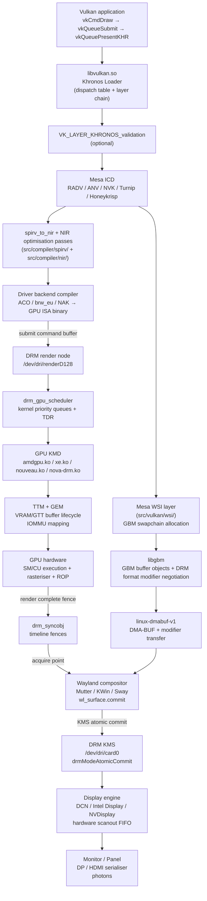

# Chapter 159: The Vulkan–Mesa–DRM Stack: A Full Vertical Slice

**Audiences:** Systems and driver developers; graphics application developers; anyone who needs a unified mental model of how a `vk*` call travels from application code through the Mesa Vulkan runtime, the DRM kernel interface, GPU-specific kernel modules, and finally to pixels on screen.

---

## Table of Contents

1. [Why a Vertical Slice?](#1-why-a-vertical-slice)
2. [Layer Zero: The Vulkan Loader](#2-layer-zero-the-vulkan-loader)
   - 2.1 [ICD Discovery and JSON Manifests](#21-icd-discovery-and-json-manifests)
   - 2.2 [Dispatch Table Construction](#22-dispatch-table-construction)
   - 2.3 [Validation and Implicit Layers](#23-validation-and-implicit-layers)
3. [The Mesa Vulkan Common Runtime](#3-the-mesa-vulkan-common-runtime)
   - 3.1 [Shared Object Hierarchy](#31-shared-object-hierarchy)
   - 3.2 [Driver Registration](#32-driver-registration)
4. [Shader Compilation: SPIR-V to GPU ISA](#4-shader-compilation-spir-v-to-gpu-isa)
   - 4.1 [spirv_to_nir: The Universal Entry Point](#41-spirv_to_nir-the-universal-entry-point)
   - 4.2 [NIR Optimisation Passes](#42-nir-optimisation-passes)
   - 4.3 [Driver-Specific Backends](#43-driver-specific-backends)
5. [DRM: The Kernel Rendezvous](#5-drm-the-kernel-rendezvous)
   - 5.1 [Render Nodes vs Primary Nodes](#51-render-nodes-vs-primary-nodes)
   - 5.2 [GEM: Buffer Lifecycle in the Kernel](#52-gem-buffer-lifecycle-in-the-kernel)
   - 5.3 [Command Submission Ioctls](#53-command-submission-ioctls)
   - 5.4 [drm_gpu_scheduler](#54-drm_gpu_scheduler)
6. [GBM and DMA-BUF: Allocation and Sharing](#6-gbm-and-dma-buf-allocation-and-sharing)
   - 6.1 [GBM API and Format Modifiers Negotiation](#61-gbm-api-and-format-modifier-negotiation)
   - 6.2 [PRIME: Cross-Device Buffer Sharing](#62-prime-cross-device-buffer-sharing)
7. [Explicit GPU Synchronisation: drm_syncobj](#7-explicit-gpu-synchronisation-drm_syncobj)
   - 7.1 [The Death of Implicit Fences](#71-the-death-of-implicit-fences)
   - 7.2 [Timeline Syncobjs and Vulkan Semaphores](#72-timeline-syncobjs-and-vulkan-semaphores)
   - 7.3 [linux-drm-syncobj-v1 Wayland Protocol](#73-linux-drm-syncobj-v1-wayland-protocol)
8. [NVIDIA: Three Driver Stacks in Coexistence](#8-nvidia-three-driver-stacks-in-coexistence)
   - 8.1 [Proprietary Closed Stack](#81-proprietary-closed-stack)
   - 8.2 [nvidia-open: Open Kernel, Closed Userspace](#82-nvidia-open-open-kernel-closed-userspace)
   - 8.3 [nouveau + NVK: The Fully Open Path](#83-nouveau--nvk-the-fully-open-path)
   - 8.4 [GSP Firmware: The Hidden Third Actor](#84-gsp-firmware-the-hidden-third-actor)
9. [The Present Path: vkQueuePresentKHR to Photons](#9-the-present-path-vkqueuepresentkhr-to-photons)
   - 9.1 [Mesa WSI and Swapchain Allocation](#91-mesa-wsi-and-swapchain-allocation)
   - 9.2 [Wayland: linux-dmabuf-v1 and Compositor Import](#92-wayland-linux-dmabuf-v1-and-compositor-import)
   - 9.3 [KMS Atomic Commit and Display Engine Scanout](#93-kms-atomic-commit-and-display-engine-scanout)
10. [Supporting Subsystems](#10-supporting-subsystems)
    - 10.1 [Resizable BAR and Smart Access Memory](#101-resizable-bar-and-smart-access-memory)
    - 10.2 [IOMMU: DMA Safety](#102-iommu-dma-safety)
    - 10.3 [GPU Firmware Microcode](#103-gpu-firmware-microcode)
11. [Memory Types, Heaps, and the VkMemoryAllocateInfo Path](#11-memory-types-heaps-and-the-vkmemoryallocateinfo-path)
    - 11.1 [VkPhysicalDeviceMemoryProperties and Heap Topology](#111-vkphysicaldevicememoryproperties-and-heap-topology)
    - 11.2 [Allocation Strategy in Practice](#112-allocation-strategy-in-practice)
12. [Debugging the Full Stack](#12-debugging-the-full-stack)
    - 12.1 [Tracing the Ioctl Surface](#121-tracing-the-ioctl-surface)
    - 12.2 [GPU Hang Debugging](#122-gpu-hang-debugging)
    - 12.3 [Shader Disassembly and NIR Dumps](#123-shader-disassembly-and-nir-dumps)
13. [Full Stack Diagram](#13-full-stack-diagram)
14. [Integrations](#14-integrations)

---

## 1. Why a Vertical Slice?

The Linux graphics stack is routinely described as a set of horizontal layers — kernel DRM, libdrm, Mesa, Wayland, compositors — each with its own chapter. That layering is correct but incomplete: understanding what happens when an application calls `vkDraw*` and pixels appear on screen requires tracing a path that cuts *vertically* through every layer simultaneously. A bug that looks like a compositor artifact may root-cause in a kernel fence; a performance regression visible as a frame-rate drop may originate in the GLSL front-end or the GEM memory allocator.

This chapter follows a single notional `vkCmdDraw` → `vkQueueSubmit` → `vkQueuePresentKHR` sequence from the application's perspective down to the display engine's scanout FIFO, naming every structure, ioctl, and kernel subsystem it touches along the way. NVIDIA receives extra attention because it presents three simultaneous driver stacks — proprietary closed, nvidia-open with closed userspace, and the fully open nouveau + NVK path — that share the same GPU but interact with the kernel and Mesa in fundamentally different ways.

---

## 2. Layer Zero: The Vulkan Loader

### 2.1 ICD Discovery and JSON Manifests

The first thing a Vulkan application links against is *not* a GPU driver. It links against `libvulkan.so.1`, the **Khronos Vulkan Loader** — a thin dispatch library maintained at [https://github.com/KhronosGroup/Vulkan-Loader](https://github.com/KhronosGroup/Vulkan-Loader). The loader's job is ICD (Installable Client Driver) discovery, layer insertion, and per-device dispatch table construction.

On Linux, ICD discovery reads JSON manifests from a set of well-known paths in priority order: directories from `$VK_ICD_FILENAMES` (colon-separated), `$XDG_DATA_DIRS/vulkan/icd.d/`, `/usr/share/vulkan/icd.d/`, and `/etc/vulkan/icd.d/`. A typical system has:

```
/usr/share/vulkan/icd.d/
├── radeon_icd.x86_64.json          # Mesa RADV (AMD)
├── intel_icd.x86_64.json           # Mesa ANV (Intel)
├── nouveau_icd.x86_64.json         # Mesa NVK (NVIDIA open)
└── nvidia_icd.json                 # NVIDIA proprietary ICD
```

Each JSON manifest contains the path to the shared library and the API version it implements:

```json
{
    "file_format_version": "1.0.0",
    "ICD": {
        "library_path": "/usr/lib/x86_64-linux-gnu/libvulkan_radeon.so",
        "api_version": "1.3.289"
    }
}
```

[Source: Vulkan-Loader ICD discovery documentation](https://github.com/KhronosGroup/Vulkan-Loader/blob/main/docs/LoaderInterfaceArchitecture.md)

The loader `dlopen()`s each ICD library and calls `vk_icdGetInstanceProcAddr` to bootstrap the dispatch chain. All physical devices from all ICDs are merged into a single enumeration returned by `vkEnumeratePhysicalDevices`.

### 2.2 Dispatch Table Construction

Once `vkCreateDevice` selects a physical device, the loader builds a **per-device dispatch table** — a struct of function pointers, one per Vulkan command. Subsequent `vk*` calls are resolved via a hidden first-pointer trick: every `VkCommandBuffer`, `VkQueue`, and `VkDevice` begins in memory with a pointer to its dispatch table. The loader stamps this pointer at object creation time; subsequent calls dispatch through it without an additional lookup.

```c
/* Loader internal representation (simplified) */
struct loader_device {
    struct loader_dispatch_table   dispatch;  /* must be first member */
    VkDevice                       device;
    struct loader_icd_term        *icd_term;
};
```

[Source: loader_device in Vulkan-Loader `src/loader/loader.h`](https://github.com/KhronosGroup/Vulkan-Loader/blob/main/loader/loader.h)

### 2.3 Validation and Implicit Layers

Between the application and the ICD sit **layers**: middleware shared libraries that intercept every dispatch-table call. Layers are discovered similarly to ICDs via JSON manifests in `layer.d/` directories. The most important is `VK_LAYER_KHRONOS_validation`, which performs:

- Parameter validation against the Vulkan specification
- Object lifetime tracking (double-free, use-after-free detection)
- Synchronisation hazard detection (`VK_VALIDATION_FEATURE_ENABLE_SYNCHRONIZATION_VALIDATION_EXT`)
- `VK_EXT_debug_utils` message routing

Layers can be stacked arbitrarily. Each layer implements the loader-layer interface (`vk_layerGetPhysicalDeviceProcAddr`) and forwards calls it does not intercept. The overhead is one indirect function-pointer call per Vulkan command per layer — negligible for most workloads but measurable in CPU-bound command-recording tight loops.

---

## 3. The Mesa Vulkan Common Runtime

### 3.1 Shared Object Hierarchy

All Mesa Vulkan drivers — RADV (AMD), ANV (Intel), NVK (NVIDIA), Turnip (Qualcomm), Honeykrisp (Apple AGX), and v3dv (Broadcom V3D) — share a **common runtime** in `src/vulkan/runtime/`. This avoids re-implementing thousands of lines of object-lifecycle, descriptor-set, render-pass, and queue-family boilerplate per driver.

The shared runtime defines base structs that each driver embeds as their first member:

```c
/* src/vulkan/runtime/vk_device.h  (Mesa, tag mesa-24.1.0) */
struct vk_device {
    struct vk_object_base               base;
    struct vk_physical_device          *physical;
    struct vk_device_dispatch_table     dispatch_table;

    /* Enabled extensions, features */
    struct vk_device_extension_table    enabled_extensions;

    /* Command-buffer pool and allocator */
    struct vk_command_pool_ops         *command_pool_ops;

    /* Logging / debug utils */
    struct vk_device_debug_utils        debug_utils;

    /* ... */
};
```

[Source: `src/vulkan/runtime/vk_device.h` in Mesa mainline](https://gitlab.freedesktop.org/mesa/mesa/-/blob/main/src/vulkan/runtime/vk_device.h)

RADV's device struct begins:

```c
/* src/amd/vulkan/radv_device.c  (Mesa, tag mesa-24.1.0) */
struct radv_device {
    struct vk_device         vk;   /* must be first — shares dispatch table */
    struct radeon_winsys    *ws;
    struct radv_physical_device *physical_device;
    /* AMD-specific state ... */
};
```

The same pattern applies to `vk_queue` → `radv_queue`, `vk_command_buffer` → `radv_cmd_buffer`, and every other object type. Because the base struct is always the first member, a `VkDevice` handle can be cast to `struct vk_device *` and then `container_of`'d to the driver-private struct.

### 3.2 Driver Registration

Each Mesa Vulkan driver exposes a `VkIcdNegotiateLoaderICDInterfaceVersion` entry point and a static `vk_physical_device_dispatch_table` plus a `vk_instance_dispatch_table`. At build time, Mesa generates these dispatch tables via Python scripts that parse the Vulkan XML registry (`vk.xml`), ensuring every new extension command is automatically wired up.

Driver entry points are exported with the `PUBLIC` macro and must match the Vulkan spec's function naming exactly. The loader resolves them via `dlsym` after loading the ICD shared library.

---

## 4. Shader Compilation: SPIR-V to GPU ISA

### 4.1 spirv_to_nir: The Universal Entry Point

All Mesa Vulkan drivers compile shaders by calling a single entry point:

```c
/* src/compiler/spirv/spirv_to_nir.h  (Mesa mainline) */
nir_shader *spirv_to_nir(const uint32_t *words, size_t word_count,
                          struct nir_spirv_specialization *spec,
                          unsigned num_spec,
                          gl_shader_stage stage,
                          const char *entry_point_name,
                          const struct spirv_to_nir_options *options,
                          const nir_shader_compiler_options *nir_options);
```

[Source: `src/compiler/spirv/spirv_to_nir.h`](https://gitlab.freedesktop.org/mesa/mesa/-/blob/main/src/compiler/spirv/spirv_to_nir.h)

`spirv_to_nir` walks the SPIR-V binary word stream, resolves OpType* instructions into NIR types, lowers OpFunction blocks into NIR functions, and produces a `nir_shader` — Mesa's typed static single-assignment IR. Specialisation constants (`OpSpecConstant`) are resolved at this stage using the values provided in `VkSpecializationInfo`.

### 4.2 NIR Optimisation Passes

NIR (described fully in Chapter 14) is not merely a translation target — it hosts the majority of Mesa's driver-independent shader optimisations. After `spirv_to_nir`, a typical driver runs a standard sequence:

```c
/* Typical NIR optimisation pipeline (simplified from src/amd/vulkan/radv_pipeline.c) */
NIR_PASS(progress, nir, nir_lower_returns);
NIR_PASS(progress, nir, nir_inline_functions);
NIR_PASS(progress, nir, nir_copy_prop);
NIR_PASS(progress, nir, nir_opt_constant_folding);
NIR_PASS(progress, nir, nir_opt_dce);        /* dead code elimination */
NIR_PASS(progress, nir, nir_opt_if, NULL);
NIR_PASS(progress, nir, nir_opt_loop_unroll);
NIR_PASS(progress, nir, nir_lower_phis_to_scalar, false, NULL);
NIR_PASS(progress, nir, nir_opt_algebraic);
```

The `NIR_PASS` macro runs a pass and sets `progress` to true if any IR changes occurred; the pipeline repeats until fixpoint. Passes are functions declared in `src/compiler/nir/nir_opt_*.c` and `nir_lower_*.c`.

### 4.3 Driver-Specific Backends

After NIR optimisation, each driver lowers NIR to its own GPU instruction set:

| Driver | Backend | Language | Source path | GPU targets |
|--------|---------|----------|-------------|-------------|
| RADV | ACO | C++ | `src/amd/compiler/` | GCN4 through RDNA4 |
| ANV | brw_eu / ELK | C | `src/intel/compiler/` | Gen7 through Xe2 |
| NVK | NAK | Rust | `src/nouveau/compiler/` | SM50 (Maxwell) through SM90 (Hopper) |
| Turnip | ir3 | C | `src/freedreno/ir3/` | Adreno A6xx/A7xx |
| Honeykrisp | AGX ISA | C | `src/asahi/compiler/` | Apple M1–M4 series |
| v3dv | QPU | C | `src/broadcom/compiler/` | Raspberry Pi 4/5 (VideoCore VI/VII) |

**ACO** (AMD Compiler) is notable for producing better register allocation and ILP than LLVM for AMD hardware. It was written specifically to fix LLVM's spilling behaviour on GCN/RDNA, where the extremely large register file (256 SGPRs + 256 VGPRs per CU) made spill decisions critical to wave occupancy.

**NAK** (Nouveau/NVK Compiler) is written in Rust using the `bitflags`, `rustc-hash`, and `indexmap` crates. It lowers NIR through a custom SSA IR to NVIDIA PTX-equivalent machine instructions, targeting the Shader Model 5.0 (Maxwell) through SM90 (Hopper/Ada Lovelace) ISAs. NAK was merged into Mesa mainline in 2024 alongside NVK reaching Vulkan 1.3 conformance.

[Source: NAK in Mesa `src/nouveau/compiler/`](https://gitlab.freedesktop.org/mesa/mesa/-/tree/main/src/nouveau/compiler)

---

## 5. DRM: The Kernel Rendezvous

### 5.1 Render Nodes vs Primary Nodes

The DRM subsystem exposes GPU hardware through two device-node types:

- **Primary node** (`/dev/dri/card0`, `card1`, …): Full DRM access including modesetting (KMS). Privileged — only the display server or compositor should open it. Ownership is determined by `DRM_MASTER` capability, acquired via `drmSetMaster`.
- **Render node** (`/dev/dri/renderD128`, `renderD129`, …): Render-only access. No KMS ioctls. Unprivileged — any process in the `video` group (or with appropriate udev rules) can open it. Mesa Vulkan drivers open only the render node; the compositor separately opens the primary node for KMS.

The split was introduced in Linux 3.12 specifically to allow GPU access without requiring a running display server.

### 5.2 GEM: Buffer Lifecycle in the Kernel

**GEM** (Graphics Execution Manager) is the kernel's GPU buffer manager, living in `drivers/gpu/drm/drm_gem.c`. Every GPU-resident buffer — vertex data, textures, framebuffers, shader ISA, command buffers — is represented as a **GEM object** identified by a per-file `gem_handle` (a `uint32_t`) or globally by a `dma_buf` file descriptor.

The lifecycle:

```
vkCreateBuffer / vkCreateImage
    │
    └─ Mesa calls driver-specific GEM create ioctl:
       AMD: DRM_IOCTL_AMDGPU_GEM_CREATE → struct drm_amdgpu_gem_create
       Intel: DRM_IOCTL_I915_GEM_CREATE_EXT → struct drm_i915_gem_create_ext
       NVIDIA: DRM_IOCTL_NOUVEAU_GEM_NEW → struct drm_nouveau_gem_new
       (or NVK via nova-drm: DRM_IOCTL_NOVA_GEM_CREATE)
            │
            └─ Kernel: drm_gem_object_init() → allocates struct drm_gem_object
                        backed by shmem (system RAM) or TTM (VRAM/GTT)
```

**TTM** (Translation Table Manager) manages the physical placement of GEM objects across VRAM, GTT (aperture-mapped system RAM), and CPU-visible mappings. It handles eviction when VRAM pressure is high, migrating objects to GTT and back as needed, and maintains IOMMU mappings throughout.

[Source: `drivers/gpu/drm/drm_gem.c`](https://github.com/torvalds/linux/blob/master/drivers/gpu/drm/drm_gem.c)
[Source: `drivers/gpu/drm/ttm/ttm_bo.c`](https://github.com/torvalds/linux/blob/master/drivers/gpu/drm/ttm/ttm_bo.c)

### 5.3 Command Submission Ioctls

Compiled GPU command buffers (ISA + state packets) are submitted via driver-specific ioctls on the render node:

```c
/* AMD amdgpu command submission  (linux/amdgpu_drm.h) */
struct drm_amdgpu_cs_in {
    uint32_t  ctx_id;           /* GPU context */
    uint32_t  bo_list_handle;   /* list of GEM BOs to pin for this submit */
    uint32_t  num_chunks;
    uint32_t  _pad;
    uint64_t  chunks;           /* array of drm_amdgpu_cs_chunk */
};
/* Submitted via: ioctl(fd, DRM_IOCTL_AMDGPU_CS, &cs_in) */
```

The `chunks` array can carry: IB (Indirect Buffer — pointer to the command buffer GEM object), syncobj signals/waits (for Vulkan semaphores and fences), and scheduler priority hints.

Intel i915 uses `DRM_IOCTL_I915_GEM_EXECBUFFER2` with a `drm_i915_gem_execbuffer2` struct that lists all GEM objects referenced by the command stream. The newer `xe` driver (replacing i915 from Meteor Lake forward) uses `DRM_IOCTL_XE_EXEC` with a cleaner `drm_xe_exec` struct.

```c
/* Intel Xe command submission (linux/xe_drm.h, kernel 6.8+) */
struct drm_xe_exec {
    uint64_t  exec_queue_id;    /* hardware engine queue */
    uint64_t  num_syncs;
    uint64_t  syncs;            /* array of drm_xe_sync (syncobj-based) */
    uint64_t  num_batch_buffer;
    uint64_t  batch_buf;        /* GEM handle of command buffer */
};
```

[Source: `include/uapi/drm/xe_drm.h`](https://github.com/torvalds/linux/blob/master/include/uapi/drm/xe_drm.h)

### 5.4 drm_gpu_scheduler

Command buffer submissions do not go directly to hardware. They enter the **DRM GPU Scheduler** (`drivers/gpu/drm/scheduler/gpu_scheduler.c`), a kernel subsystem providing:

- **Priority queues**: real-time, high, normal, low priority rings
- **Fair sharing**: round-robin across multiple clients sharing the same engine
- **Timeout detection (TDR)**: if a job does not complete within a configurable timeout (default 10 seconds on most drivers), the scheduler triggers GPU reset via `amdgpu_device_gpu_recover` or equivalent
- **Preemption** (on hardware that supports it): inserting context-switch packets between submissions

```
App process 1: submit job A (normal priority)
App process 2: submit job B (normal priority)
Compositor:    submit job C (high priority)

drm_gpu_scheduler queues: [C] → [A, B]
Hardware execution: C first, then A and B interleaved per time-slice
```

[Source: `drivers/gpu/drm/scheduler/gpu_scheduler.c`](https://github.com/torvalds/linux/blob/master/drivers/gpu/drm/scheduler/gpu_scheduler.c)

---

## 6. GBM and DMA-BUF: Allocation and Sharing

### 6.1 GBM API and Format Modifier Negotiation

**GBM** (Generic Buffer Manager), in Mesa's `src/gbm/`, is a userspace library providing a GPU-agnostic API for allocating buffers suitable for scanout (display) or rendering. It wraps the DRM GEM create ioctls with format-aware logic:

```c
/* Allocate a tiled, modifier-aware scanout buffer */
struct gbm_device *gbm = gbm_create_device(drm_render_fd);

uint64_t modifiers[] = { DRM_FORMAT_MOD_AMD_GFX9_64K_S, DRM_FORMAT_MOD_LINEAR };
struct gbm_bo *bo = gbm_bo_create_with_modifiers2(
    gbm,
    1920, 1080,
    GBM_FORMAT_XRGB8888,
    modifiers, ARRAY_SIZE(modifiers),
    GBM_BO_USE_SCANOUT | GBM_BO_USE_RENDERING);

int dmabuf_fd   = gbm_bo_get_fd(bo);
uint64_t mod    = gbm_bo_get_modifier(bo);   /* which modifier was selected */
uint32_t stride = gbm_bo_get_stride(bo);
```

[Source: `src/gbm/gbm.h` in Mesa](https://gitlab.freedesktop.org/mesa/mesa/-/blob/main/src/gbm/gbm.h)

**DRM format modifiers** are 64-bit vendor-defined tokens encoding a buffer's internal tiling and compression layout. Common values:

| Modifier | GPU | Meaning |
|----------|-----|---------|
| `DRM_FORMAT_MOD_LINEAR` | Any | Row-major, no tiling |
| `DRM_FORMAT_MOD_AMD_GFX9_64K_S` | AMD GFX9 (Vega) | 64KB swizzle mode S |
| `AMD_FMT_MOD` with DCC bits | AMD RDNA2+ | Delta colour compression on top of tiling |
| `I915_FORMAT_MOD_X_TILED` | Intel | X-tiled (legacy scanout) |
| `I915_FORMAT_MOD_4_TILED` | Intel Xe2 | 4K tile (Arc/Meteor Lake) |
| `DRM_FORMAT_MOD_NVIDIA_BLOCK_LINEAR_2D(…)` | NVIDIA | Block-linear with height/GOB parameters |

The compositor and KMS engine must agree on the modifier. `zwp_linux_dmabuf_v1` carries the modifier alongside the DMA-BUF fd during Wayland buffer creation so the compositor can correctly import and either GPU-composite or KMS-scanout the buffer.

### 6.2 PRIME: Cross-Device Buffer Sharing

**PRIME** (introduced in Linux 3.12) enables buffer sharing across different DRM devices — the mechanism underlying Reverse PRIME, zero-copy video decode, and cross-API interop. It works via DMA-BUF file descriptors:

```c
/* Exporting a GEM buffer as a DMA-BUF fd */
struct drm_prime_handle export_req = {
    .handle = gem_handle,
    .flags  = DRM_CLOEXEC | DRM_RDWR,
    .fd     = -1,
};
ioctl(drm_fd, DRM_IOCTL_PRIME_HANDLE_TO_FD, &export_req);
int dmabuf_fd = export_req.fd;  /* sharable fd; can be sent via SCM_RIGHTS */

/* Importing on a different DRM device (e.g., iGPU importing from dGPU) */
struct drm_prime_handle import_req = { .fd = dmabuf_fd, .handle = 0 };
ioctl(other_drm_fd, DRM_IOCTL_PRIME_FD_TO_HANDLE, &import_req);
uint32_t imported_gem = import_req.handle;
```

The kernel `dma_buf` infrastructure (in `drivers/dma-buf/`) maintains a reference-counted page list shared between the two GEM objects. The IOMMU maps the physical pages into both devices' IOVA spaces, enabling true zero-copy cross-device access.

---

## 7. Explicit GPU Synchronisation: drm_syncobj

### 7.1 The Death of Implicit Fences

The original DRM synchronisation mechanism was **implicit fences**: every GEM buffer had an embedded `dma_fence` pointer (or a `dma_resv` reservation object with shared read fences and one exclusive write fence). The kernel enforced cross-process ordering automatically whenever a buffer was submitted to two different engines or two different processes.

Implicit fences had two fatal problems for Vulkan:
1. **Opacity**: userspace could not observe, export, or compose fence states. Validation was impossible.
2. **Wrong granularity**: Vulkan's explicit sync model requires precise control over which operations the app declares produce/consume which resources.

`drm_syncobj` was introduced in Linux 4.12 to replace implicit fences for modern drivers.

### 7.2 Timeline Syncobjs and Vulkan Semaphores

A `drm_syncobj` is a kernel object (identified by a `uint32_t` handle) containing a `dma_fence` pointer. In **binary** mode it is either signaled or unsignaled. In **timeline** mode it holds a monotonically increasing 64-bit counter backed by a chain of `dma_fence_chain` objects; waiting for timeline point N means waiting for the fence at counter ≥ N.

Vulkan synchronisation primitives map to DRM syncobjs as follows:

| Vulkan primitive | drm_syncobj type | Key ioctl |
|-----------------|-----------------|-----------|
| `VkFence` | Binary syncobj | `DRM_IOCTL_SYNCOBJ_WAIT` |
| `VkSemaphore` (binary) | Binary syncobj | Signaled/waited in CS ioctl chunks |
| `VkSemaphore` (timeline) | Timeline syncobj | `DRM_IOCTL_SYNCOBJ_TIMELINE_WAIT` |
| `VkSemaphore` exported via `VK_EXTERNAL_SEMAPHORE_HANDLE_TYPE_SYNC_FD_BIT` | `sync_file` fd (wrapping a `dma_fence`) | `DRM_IOCTL_SYNCOBJ_EXPORT_SYNC_FILE` |

```c
/* Creating a syncobj for a VkFence */
struct drm_syncobj_create sc = { .flags = 0 };
ioctl(drm_fd, DRM_IOCTL_SYNCOBJ_CREATE, &sc);
uint32_t syncobj_handle = sc.handle;

/* Attaching it to a command submission so the kernel signals it on completion */
struct drm_amdgpu_cs_chunk_sem signal_sem = {
    .handle = syncobj_handle,
};
/* ... included as DRM_AMDGPU_CHUNK_ID_SYNCOBJ_OUT in cs_in.chunks */
```

[Source: `drivers/gpu/drm/drm_syncobj.c`](https://github.com/torvalds/linux/blob/master/drivers/gpu/drm/drm_syncobj.c)

### 7.3 linux-drm-syncobj-v1 Wayland Protocol

Passing a rendered frame to the compositor historically required exporting a `sync_file` fd (representing the GPU's render-complete fence) and attaching it to the Wayland buffer submission. This was fragile and compositor-specific.

The `linux-drm-syncobj-v1` Wayland protocol extension (merged in wlroots and being adopted by Mutter/KWin as of 2024–2025) formalises this:

- The compositor advertises `wp_linux_drm_syncobj_manager_v1`
- The client creates a `wp_linux_drm_syncobj_timeline_v1` backed by a DRM timeline syncobj fd
- On each `wl_surface.commit` the client attaches an **acquire point** (GPU must wait until this timeline point before reading the buffer) and a **release point** (compositor signals this point when it is done with the buffer)

This gives compositors safe, race-free knowledge of when a buffer is GPU-ready, enabling them to schedule KMS commits that arrive exactly at vblank.

[Source: Wayland protocol `staging/linux-drm-syncobj/linux-drm-syncobj-v1.xml`](https://gitlab.freedesktop.org/wayland/wayland-protocols/-/blob/main/staging/linux-drm-syncobj/linux-drm-syncobj-v1.xml)

---

## 8. NVIDIA: Three Driver Stacks in Coexistence

NVIDIA hardware can be driven by three entirely separate software stacks. On a single machine with a single NVIDIA GPU, only one stack is active at boot, but understanding all three is essential for driver developers, CI system operators, and users navigating the NVIDIA ecosystem on Linux.

### 8.1 Proprietary Closed Stack

The original and still most widely deployed path:

```
libvulkan_nvidia.so  (proprietary ICD, binary-only)
        │
        │  ioctl()
        ▼
nvidia.ko  (proprietary kernel module, loaded via DKMS)
        │
        │  MMIO / PCIe
        ▼
NVIDIA GPU hardware
```

The proprietary kernel module (`nvidia.ko`) implements an internal **Resource Manager (RM)** in kernelspace — handling memory management, power, PCIe link, and display — that was originally developed for Windows and ported to Linux. It communicates with the GPU via a proprietary command protocol not exposed to the DRM subsystem. Consequently, `nvidia.ko` historically did not implement the standard DRM KMS interface, requiring the `nvidia-drm.ko` shim module to bridge to KMS for Wayland compositor support.

Since NVIDIA driver version 495 (released 2021), `nvidia-drm.ko` properly implements DRM atomic modesetting, enabling Wayland compositors to use the standard KMS path. Since driver 525 (2022), GBM support was added, allowing Mesa WSI to allocate NVIDIA swapchain buffers via the same `gbm_create_device(drm_fd)` path used for AMD and Intel.

### 8.2 nvidia-open: Open Kernel, Closed Userspace

Starting with driver R515 (2022), NVIDIA open-sourced the kernel module under MIT + GPLv2 dual license. The repository is at [https://github.com/NVIDIA/open-gpu-kernel-modules](https://github.com/NVIDIA/open-gpu-kernel-modules).

```
libvulkan_nvidia.so  (same proprietary ICD — unchanged)
        │
        ▼
nvidia-open.ko  (open source, same RM architecture, uses GSP firmware)
        │
        ▼
NVIDIA GPU + GSP firmware (gsp_*.bin loaded at module init)
```

`nvidia-open` implements the same RM interface as the closed module and is ABI-compatible with the same proprietary userspace (`libvulkan_nvidia.so`, `libGL_nvidia.so`, `libcuda.so`). The key difference is that the kernel-userspace interface is now auditable and patchable by distributions and kernel developers.

From the user's perspective, switching from `nvidia.ko` to `nvidia-open.ko` is transparent — the ICD JSON path does not change. NVIDIA recommends nvidia-open for Turing (RTX 20xx) and later GPUs; pre-Turing (Pascal and Volta) GPUs retain the closed module.

### 8.3 nouveau + NVK: The Fully Open Path

The third stack is entirely open:

```
libvulkan_nouveau.so  (NVK in Mesa — Vulkan 1.3 conformant since 2024)
        │
        │  ioctl via DRM render node /dev/dri/renderD128
        ▼
nouveau.ko  (open DRM driver in upstream Linux)
(or nova-drm.ko  — new Rust DRM driver, upstream in-progress as of 2025)
        │
        ▼
NVIDIA GPU + GSP firmware (required for Turing+; nouveau bootstraps GSP)
```

**NVK** was written by Faith Ekstrand (Collabora, then NVIDIA) beginning in 2022 and landed in Mesa mainline in late 2023. It is structured like other Mesa Vulkan drivers (embedding `vk_device`, sharing the WSI layer, using `spirv_to_nir`) but uses the **NAK** shader compiler written in Rust. NVK achieved Vulkan 1.3 conformance (all required tests passing in the Khronos CTS) in July 2024.

**nova-drm** is a new Rust kernel driver being developed to replace nouveau's aging C codebase. It aims to implement the DRM render-node interface cleanly and work exclusively via GSP firmware (no direct RM reimplementation in the kernel). As of Linux 6.14 (early 2025), nova-drm is in the `drivers/gpu/nova-drm/` staging area.

[Source: NVK in Mesa `src/nouveau/vulkan/`](https://gitlab.freedesktop.org/mesa/mesa/-/tree/main/src/nouveau/vulkan)
[Source: nova-drm Linux kernel `drivers/gpu/nova-drm/`](https://github.com/torvalds/linux/tree/master/drivers/gpu/nova-drm)

### 8.4 GSP Firmware: The Hidden Third Actor

For NVIDIA GPUs from Turing (RTX 20xx) onwards, all three stacks share a dependency: **GSP** (GPU System Processor), an ARM Cortex-A microcontroller embedded on the GPU die that runs a proprietary firmware blob (`gsp_tu10x.bin` for Turing, `gsp_ga10x.bin` for Ampere, `gsp_ad10x.bin` for Ada Lovelace, etc.).

GSP handles operations that were previously performed in the kernel driver's RM:
- PCIe link training and power state management
- GPU clock gating and DVFS
- Memory management and fault handling
- Display engine setup (for the proprietary stack)

Both `nvidia-open.ko` and `nouveau.ko` load the GSP firmware via `request_firmware()` during device init and communicate with it via a private RPC protocol over NVLink/PCIE. The firmware blobs are distributed in the NVIDIA driver package and are required for operation on Turing+ with the open kernel module.

```
nouveau.ko (kernel init sequence):
    1. Identify GPU architecture (Turing → GSP required)
    2. request_firmware("nvidia/tu102/gsp/booter_load-xxx.bin")
    3. Bootstrap GSP: DMA booter to FB, issue UNIT_RESET to GSP engine
    4. Load gsp_tu10x.bin via GSP bootstrap protocol
    5. GSP signals READY; nouveau proceeds with device init via GSP RPC
```

[Source: `drivers/gpu/drm/nouveau/nvkm/subdev/gsp/` in Linux kernel](https://github.com/torvalds/linux/tree/master/drivers/gpu/drm/nouveau/nvkm/subdev/gsp)

---

## 9. The Present Path: vkQueuePresentKHR to Photons

### 9.1 Mesa WSI and Swapchain Allocation

When a Vulkan application calls `vkCreateSwapchainKHR` on a Wayland surface (`VkSurfaceKHR` created via `vkCreateWaylandSurfaceKHR`), the call enters Mesa's **shared WSI layer** in `src/vulkan/wsi/`. Mesa WSI:

1. Queries the Wayland compositor for supported DMA-BUF formats and modifiers via `zwp_linux_dmabuf_v1.get_formats` + feedback events
2. Allocates swapchain images as GBM buffer objects using a modifier compatible with both the GPU (for rendering) and the compositor (for import/scanout)
3. Wraps each GBM BO as a `VkImage` backed by a GEM handle imported into the driver's device memory allocator

The swapchain image count (typically 2–3) determines pipeline depth. With 2 images the compositor can scan out image N while the GPU renders into image N+1. The driver internally manages which image is "available" (returned by `vkAcquireNextImageKHR`) and which is "presented" (currently scanned out or being imported by the compositor).

[Source: `src/vulkan/wsi/wsi_common_wayland.c`](https://gitlab.freedesktop.org/mesa/mesa/-/blob/main/src/vulkan/wsi/wsi_common_wayland.c)

### 9.2 Wayland: linux-dmabuf-v1 and Compositor Import

`vkQueuePresentKHR` (with a Mesa driver on Wayland) executes roughly:

```
1. Wait on VkSemaphore(s) — resolved to drm_syncobj timeline wait
2. Export render-complete fence as sync_file fd
   (DRM_IOCTL_SYNCOBJ_EXPORT_SYNC_FILE)
3. Attach sync_file as acquire fence on the Wayland buffer
   (via linux-drm-syncobj-v1 if compositor supports it, else implicit)
4. wl_surface.attach(buffer)
5. wl_surface.damage_buffer(0, 0, width, height)
6. wl_surface.commit()
7. Block on wl_buffer.release event (signals when compositor is done)
   — wl_display_dispatch() in a background thread or Mesa internal thread
```

The compositor (e.g., Mutter/GNOME Shell) receives the `wl_surface.commit` and:
1. Imports the DMA-BUF fd as a `drm_framebuffer` via `drmModeAddFB2WithModifiers` (for scanout) or as an EGLImage (for GPU compositing)
2. Waits on the acquire fence before reading from the buffer
3. On the next vblank opportunity, either assigns it as a KMS overlay plane or GPU-composites it with other surfaces

### 9.3 KMS Atomic Commit and Display Engine Scanout

The compositor assembles the final frame by building a KMS **atomic commit** — a description of the complete display state: which framebuffer on which plane on which CRTC, at which position, with which colour space, colour range, and rotation.

```c
/* Compositor: atomic modesetting commit (libdrm wrappers) */
drmModeAtomicReqPtr req = drmModeAtomicAlloc();

/* Assign client window's DMA-BUF as an overlay plane */
drmModeAtomicAddProperty(req, overlay_plane_id, FB_ID,   fb_id);
drmModeAtomicAddProperty(req, overlay_plane_id, CRTC_ID, crtc_id);
drmModeAtomicAddProperty(req, overlay_plane_id, SRC_X,   0 << 16);
drmModeAtomicAddProperty(req, overlay_plane_id, SRC_Y,   0 << 16);
drmModeAtomicAddProperty(req, overlay_plane_id, SRC_W,   width  << 16);
drmModeAtomicAddProperty(req, overlay_plane_id, SRC_H,   height << 16);
drmModeAtomicAddProperty(req, overlay_plane_id, CRTC_X,  dst_x);
drmModeAtomicAddProperty(req, overlay_plane_id, CRTC_Y,  dst_y);
drmModeAtomicAddProperty(req, overlay_plane_id, CRTC_W,  dst_width);
drmModeAtomicAddProperty(req, overlay_plane_id, CRTC_H,  dst_height);

drmModeAtomicCommit(drm_fd, req, DRM_MODE_ATOMIC_NONBLOCK | DRM_MODE_PAGE_FLIP_EVENT, NULL);
```

Inside the kernel, `DRM_IOCTL_MODE_ATOMIC` validates the request, checks for hardware capability, and programs the display engine registers at the next vblank interrupt. For AMD hardware this is the **DCN** (Display Core Next) block; for Intel it is the **display IP** in the PIPES/PLANES register space; for NVIDIA it is the **NVDisplay** / EVO engine.

The physical scanout loop runs entirely in hardware: the display engine reads pixel data line by line from the framebuffer's IOVA (IOMMU-mapped physical addresses), optionally running through a hardware scaler and colour transformation matrix (CTM), and serialises it onto DisplayPort or HDMI as differential pairs. This loop continues autonomously at the panel's refresh rate until a new page-flip commit arrives.

---

## 10. Supporting Subsystems

### 10.1 Resizable BAR and Smart Access Memory

GPU VRAM is exposed to the CPU as a **PCI BAR** (Base Address Register) — a memory-mapped IO window through which the CPU can read/write GPU memory. Historically, BAR1 on discrete GPUs was limited to 256 MB by PCI configuration space constraints, meaning `vkMapMemory` on device-local allocations required a staging-buffer roundtrip for data larger than 256 MB.

**Resizable BAR** (rBAR, also marketed as AMD Smart Access Memory and NVIDIA Resizable BAR) is a PCIe 4.0 feature that allows the OS to configure BAR1 to cover all VRAM (16 GB, 24 GB, etc.). With rBAR enabled:
- The kernel's DRM driver calls `pci_resize_resource` during device init to expand BAR1
- `vkMapMemory` on `VK_MEMORY_PROPERTY_DEVICE_LOCAL_BIT | VK_MEMORY_PROPERTY_HOST_VISIBLE_BIT` allocations maps directly into VRAM via MMIO
- CPU writes go directly to VRAM over PCIe without staging, saving a full VRAM allocation plus a copy

On AMD hardware, rBAR is visible in the `amdgpu` driver as `amdgpu_vis_vram_size` matching `amdgpu_vram_size`. Verify with:

```bash
lspci -v | grep -A2 "VGA\|3D controller" | grep "Memory.*prefetchable"
# With rBAR: Memory at e0000000 (64-bit, prefetchable) [size=16G]
# Without:   Memory at e0000000 (64-bit, prefetchable) [size=256M]
```

### 10.2 IOMMU: DMA Safety

The **IOMMU** (Input-Output Memory Management Unit — VT-d on Intel platforms, AMD-Vi on AMD) gives each PCIe device its own virtual address space for DMA. When a GPU command buffer references a GEM object's address, it is referencing an IOVA (IO Virtual Address) that the IOMMU translates to a physical page.

The IOMMU provides two critical guarantees:
1. **Safety**: a GPU cannot DMA to arbitrary physical memory — only to IOVAs mapped by the kernel driver for that device. A malformed command buffer cannot exfiltrate kernel memory.
2. **PRIME isolation**: when a DMA-BUF is imported by a second device (e.g., iGPU importing from dGPU), the kernel maps the same physical pages into the second device's IOVA space. No copying occurs.

Mesa (and NVIDIA's userspace) are aware that GPU addresses are IOVAs; they manage their own virtual address space within the device's IOMMU domain using an internal VM allocator (e.g., `amdgpu_vm` for radeonsi/RADV on AMD).

### 10.3 GPU Firmware Microcode

Every GPU requires firmware blobs loaded during device initialisation. These blobs are loaded via the kernel's `request_firmware` infrastructure from `/lib/firmware/`:

| GPU family | Firmware components | Path example |
|-----------|--------------------|----|
| AMD RDNA3 (RX 7000) | GFX, SDMA, VCN (video), DCN (display), RLC (power), PSP (security) | `/lib/firmware/amdgpu/gc_11_0_0_pfp.bin` |
| Intel Arc (Xe) | GuC (command submission), HuC (video decode auth), DMC (display power) | `/lib/firmware/i915/dg2_guc_70.bin` |
| NVIDIA Turing+ | GSP (GPU System Processor) | `/lib/firmware/nvidia/tu102/gsp/gsp-535.bin` |
| Qualcomm Adreno | A7xx microcode | `/lib/firmware/qcom/a740_sqe.fw` |

**GuC** (Graphics Microcontroller, Intel) submits command buffers to the execution engines on behalf of the kernel driver, enabling fine-grained hardware preemption. **HuC** handles authenticated decoding of protected content. **RLC** (Runlist Controller, AMD) manages compute queue scheduling on RDNA GPUs, enabling the ring-buffer-based work submission that RADV targets.

Firmware loading failures are a common cause of GPU init failures on new kernels against older firmware packages. The error surfaces as `amdgpu 0000:03:00.0: amdgpu: Failed to load firmware "amdgpu/gc_11_0_0_pfp.bin"` in `dmesg`.

---

## 11. Memory Types, Heaps, and the VkMemoryAllocateInfo Path

### 11.1 VkPhysicalDeviceMemoryProperties and Heap Topology

Vulkan exposes GPU memory to applications via `VkPhysicalDeviceMemoryProperties`, which describes a set of **memory heaps** (physical pools, e.g., VRAM and system RAM) and **memory types** (views of those heaps with specific property flags). The application chooses a memory type index when calling `vkAllocateMemory`. Understanding what is under each type is essential for performance-correct resource management.

A typical discrete AMD GPU (RDNA3) exposes:

```
Heaps:
  [0] VRAM            size=16 GiB  VK_MEMORY_HEAP_DEVICE_LOCAL_BIT
  [1] GTT (system)    size=32 GiB  (no DEVICE_LOCAL flag)
  [2] Visible VRAM    size=256 MiB VK_MEMORY_HEAP_DEVICE_LOCAL_BIT (BAR)

Memory types:
  [0] heap=0  DEVICE_LOCAL                                  — GPU VRAM, not CPU-mappable
  [1] heap=2  DEVICE_LOCAL | HOST_VISIBLE | HOST_COHERENT  — 256 MB BAR window into VRAM
  [2] heap=1  HOST_VISIBLE | HOST_COHERENT                 — CPU system RAM (for staging)
  [3] heap=1  HOST_VISIBLE | HOST_COHERENT | HOST_CACHED   — CPU RAM with CPU cache
```

With Resizable BAR enabled, heap 2 expands from 256 MiB to the full VRAM size (e.g., 16 GiB), and type 1 becomes mappable into the entire VRAM. This eliminates the need for a separate staging buffer when uploading texture data or mesh data that exceeds 256 MB.

Intel integrated GPUs present a unified memory architecture with a single heap that is simultaneously `DEVICE_LOCAL` and `HOST_VISIBLE`, because CPU and GPU share the same DRAM:

```
Heaps:
  [0] Unified DRAM  size=16 GiB  VK_MEMORY_HEAP_DEVICE_LOCAL_BIT

Memory types:
  [0] heap=0  DEVICE_LOCAL | HOST_VISIBLE | HOST_COHERENT | HOST_CACHED
```

This zero-copy architecture means there is no staging buffer cost at all for uploads — CPU writes are directly visible to the GPU via cache coherency protocols on the ring bus.

[Source: Vulkan spec §VkPhysicalDeviceMemoryProperties](https://registry.khronos.org/vulkan/specs/1.3/html/vkspec.html#VkPhysicalDeviceMemoryProperties)

### 11.2 Allocation Strategy in Practice

When `vkAllocateMemory` is called, Mesa drivers translate the Vulkan memory type index to a driver-internal placement flag:

```c
/* RADV translation (simplified from src/amd/vulkan/radv_device_memory.c) */
VkMemoryPropertyFlags props = memory_type->propertyFlags;

uint32_t domain = 0;
if (props & VK_MEMORY_PROPERTY_DEVICE_LOCAL_BIT)
    domain |= RADEON_DOMAIN_VRAM;
if (props & VK_MEMORY_PROPERTY_HOST_VISIBLE_BIT)
    domain |= RADEON_DOMAIN_GTT;
if (props & VK_MEMORY_PROPERTY_HOST_CACHED_BIT)
    flags |= RADEON_FLAG_CPU_ACCESS;

/* Call into radeon_winsys to issue DRM_IOCTL_AMDGPU_GEM_CREATE */
ws->buffer_create(ws, size, alignment, domain, flags, &bo);
```

Memory allocators built on top of Vulkan — notably **VMA** (Vulkan Memory Allocator, [https://github.com/GPUOpen-LibrariesAndSDKs/VulkanMemoryAllocator](https://github.com/GPUOpen-LibrariesAndSDKs/VulkanMemoryAllocator)) — sub-allocate from a small number of large `vkAllocateMemory` blocks to avoid hitting the `maxMemoryAllocationCount` limit (as low as 4096 on some implementations). Mesa's own WSI and some internal paths use VMA directly. Bevy and wgpu use it via `gpu-allocator` (Rust crate).

The `VkMemoryRequirements.memoryTypeBits` bitmask returned by `vkGetBufferMemoryRequirements` or `vkGetImageMemoryRequirements` indicates which memory types are *compatible* with the resource. The driver sets bits corresponding to types it can back the resource from — e.g., a `VK_IMAGE_TILING_OPTIMAL` image on AMD cannot be in host-visible GTT (the GPU's fixed-function texture sampler cannot sample from GTT), so the HOST_VISIBLE type bits are cleared.

---

## 12. Debugging the Full Stack

### 12.1 Tracing the Ioctl Surface

The boundary between Mesa userspace and the DRM kernel is the ioctl interface on `/dev/dri/renderD128`. Two tools capture and decode this traffic:

**`strace`** captures raw ioctl calls. For GPU-intensive workloads, limit to DRM ioctls to reduce noise:

```bash
strace -e trace=ioctl -e ioctl-decoding=verbose \
    -P /dev/dri/renderD128 \
    vkcube 2>&1 | grep -E "DRM_IOCTL|AMDGPU|I915|PRIME|SYNCOBJ"
```

**`umr`** (Usermode Register Debugger) is AMD-specific and provides rich decoding of amdgpu command submissions, including disassembling the PM4 packets in submitted command buffers. Install from [https://gitlab.freedesktop.org/tomstdenis/umr](https://gitlab.freedesktop.org/tomstdenis/umr):

```bash
sudo umr -wa 0xC0001000  # read ring buffer head/tail
sudo umr --dump-ib       # disassemble last submitted IB (indirect buffer)
```

For Intel, **`intel_gpu_top`** and **`intel_dump_gpu`** (from `intel-gpu-tools`) serve equivalent roles.

**Perfetto + DRM tracepoints**: The Linux kernel emits `tracepoint:drm_*` events readable by Perfetto (`tracefs`). These include `drm_vblank_event`, `drm_atomic_commit_start`, and driver-specific CS (command submission) events. Capture with:

```bash
perfetto -c - --txt -o trace.pftrace <<EOF
buffers { size_kb: 65536 }
data_sources {
  config { name: "linux.ftrace"
    ftrace_config {
      ftrace_events: "drm/drm_vblank_event"
      ftrace_events: "amdgpu/amdgpu_cs_ioctl"
      ftrace_events: "amdgpu/amdgpu_sched_run_job"
    }
  }
}
duration_ms: 5000
EOF
```

### 12.2 GPU Hang Debugging

When the GPU hangs (a job does not complete within the `drm_gpu_scheduler` timeout), the kernel:

1. Calls the driver's `.gpu_recover` callback (`amdgpu_device_gpu_recover`, `i915_gem_gpu_reset`, etc.)
2. Resets the GPU ring buffers and power state
3. Logs a detailed crash dump to `dmesg`, including:
   - The command buffer contents that were executing
   - Register state at the time of reset
   - Active fence states

On AMD, `amdgpu` additionally writes a binary GPU crash dump if `amdgpu.ras_enable=1` and the RAS (Reliability, Availability, Serviceability) infrastructure is active. The dump can be decoded with `umr --read-crash-dump`.

At the Mesa level, `RADV_DEBUG=hang` causes RADV to save the last submitted command buffer to `/tmp/radv_capture*.bin` when a device-lost event is reported via `vkQueueSubmit` returning `VK_ERROR_DEVICE_LOST`. This binary can then be submitted in isolation for bisection:

```bash
RADV_DEBUG=hang vkcube  # triggers hang, writes /tmp/radv_capture_0.bin
radv_replay /tmp/radv_capture_0.bin  # replay the captured command buffer
```

`VK_ERROR_DEVICE_LOST` is the Vulkan API signal for a GPU hang or device reset. Applications and drivers should handle it by destroying and recreating the `VkDevice` and all associated resources.

### 12.3 Shader Disassembly and NIR Dumps

Mesa provides extensive shader debugging via environment variables that dump intermediate representations at each stage of the pipeline:

```bash
# RADV: dump NIR and ACO disassembly for all compiled shaders
RADV_DEBUG=shaders vkcube

# RADV: dump only ACO final ISA (readable GCN/RDNA assembly)
RADV_DEBUG=asmstats vkcube

# ANV (Intel): dump NIR
INTEL_DEBUG=vs,fs vkcube       # dump vertex and fragment shaders

# NVK: dump NIR and NAK disassembly
NVK_DEBUG=nak_ir,nak_asm vkcube

# All Mesa drivers: dump SPIR-V binary (write to /tmp/mesa_spirv_*.spv)
MESA_SPIRV_DUMP_PATH=/tmp vkcube
```

The SPIR-V dumps can be disassembled with `spirv-dis` (from `spirv-tools`) and re-optimised with `spirv-opt`. The NIR text output is valid for visual inspection and can identify missed constant folding, vectorisation failures, or unexpected control flow lowering.

For driver developers, `NIR_PASS` runs can be individually enabled/disabled at compile time via Mesa build options, and `nir_validate_shader` (enabled in debug builds) checks internal NIR consistency invariants after every pass — a critical tool for finding NIR pass bugs.

[Source: RADV debug environment variables in `src/amd/vulkan/radv_debug.h`](https://gitlab.freedesktop.org/mesa/mesa/-/blob/main/src/amd/vulkan/radv_debug.h)

---

## 13. Full Stack Diagram

The complete data-flow from application to photons on a Mesa + Wayland system:



---

## 14. Integrations

This chapter is a cross-cutting integration reference. It synthesises content from, and should be read alongside:

- **Chapter 1 (DRM Architecture)**: The `drm_device`, `drm_driver`, and ioctl dispatch infrastructure underlying everything described in §5.
- **Chapter 12 (Mesa Loader and Dispatch)**: The GLVND dispatch mechanism and how GLVND and the Vulkan loader differ in architecture.
- **Chapter 14 (NIR Shader IR)**: The NIR IR itself — data types, SSA form, pass infrastructure — which §4 assumes familiarity with.
- **Chapter 15 (ACO Compiler)**: Deep dive into ACO's register allocator, instruction selection, and wave occupancy optimisation for AMD.
- **Chapter 16 (Mesa Vulkan Common)**: The shared runtime structures — `vk_device`, `vk_queue`, `vk_cmd_buffer` — and how driver authors extend them.
- **Chapter 10a (Nova: NVIDIA's New Rust Driver)**: nova-drm's architecture and its relationship to NVK.
- **Chapter 118 (NAK — Nouveau/NVK Rust Shader Compiler)**: The NAK compiler's IR design and how it differs from ACO and brw_eu.
- **Chapter 119 (Zink — OpenGL on Vulkan)**: How Zink sits between the OpenGL state tracker and Vulkan ICDs, reusing the entire stack described in this chapter.
- **Chapter 120 (GPU Memory Management — TTM, GEM, BAR)**: The full TTM eviction policy, GEM object refcounting, and BAR management described briefly in §5.2 and §10.1.
- **Chapter 22 (Production Compositors)**: How Mutter, KWin, and Sway consume DMA-BUFs and construct KMS atomic commits as described in §9.
- **Chapter 75 (Explicit GPU Sync)**: The full `drm_syncobj` and `linux-drm-syncobj-v1` story expanded with timeline semaphore edge cases and debugging techniques.
- **Chapter 148 (Vulkan Synchronisation: A Complete Developer Reference)**: The application-facing view of the fences, semaphores, and pipeline barriers that map to the syncobj infrastructure described in §7.
- **Chapter 150 (EGL Architecture and DMA-BUF)**: The EGL / OpenGL equivalent of the WSI present path described in §9.1–9.2.
