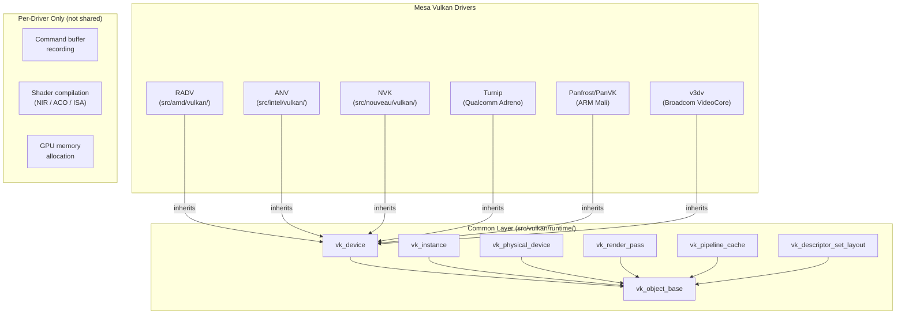
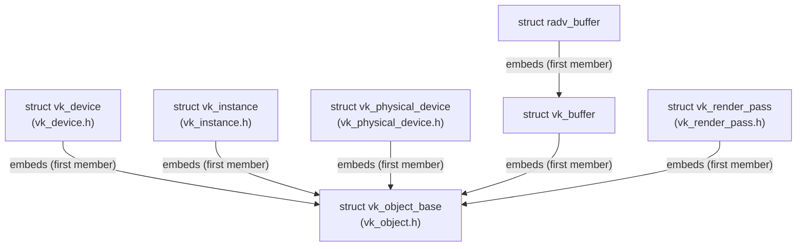
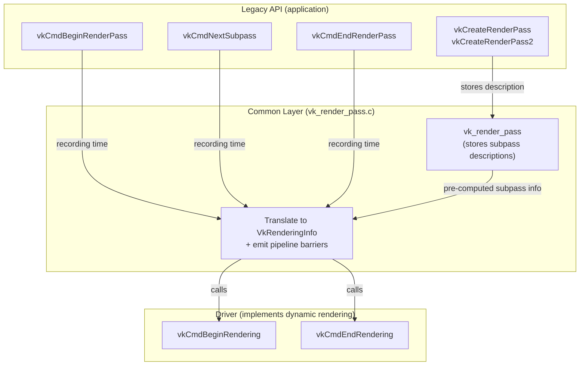
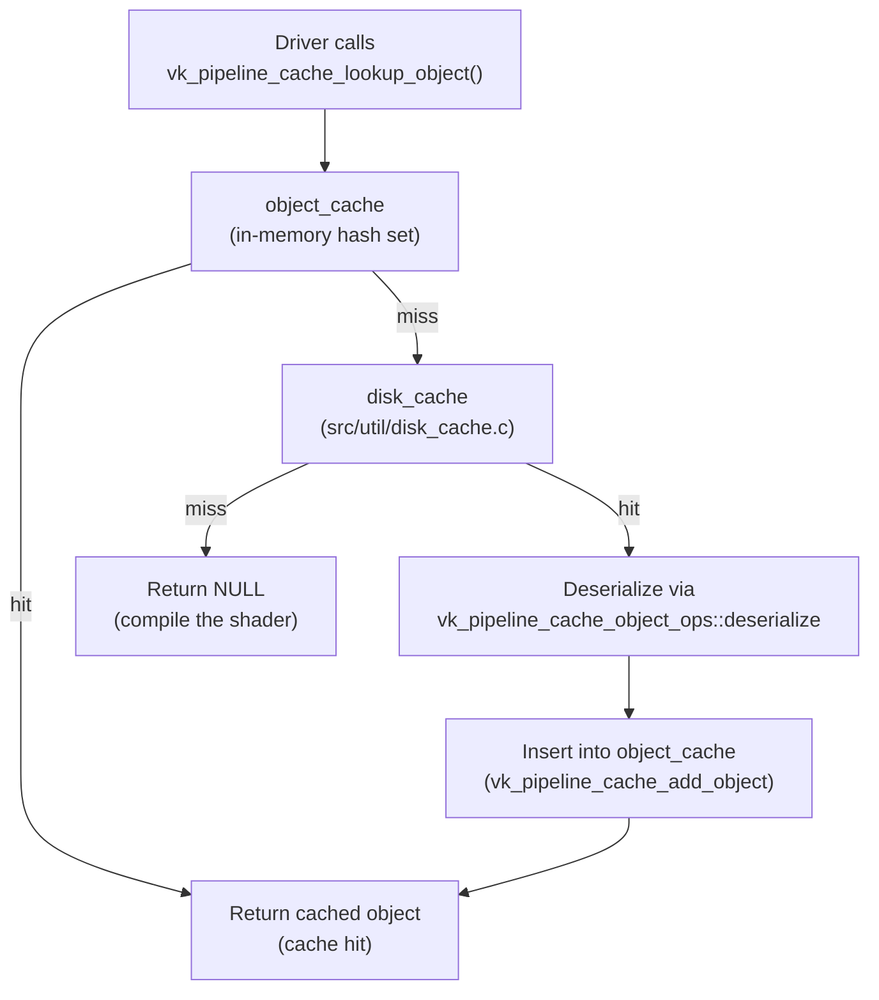
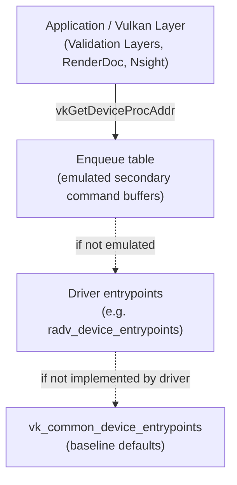

# Chapter 16: Mesa's Vulkan Common Infrastructure

> **Part**: Part IV — Mesa Architecture
> **Audience**: Systems developer — primarily Vulkan driver developers and contributors to Mesa; application developers benefit from understanding why certain Vulkan operations are "free" vs. expensive and how driver-side validation works
> **Status**: First draft — 2026-06-06

## Table of Contents
- [Overview](#overview)
- [1. The Problem: Vulkan Driver Boilerplate Before the Common Layer](#1-the-problem-vulkan-driver-boilerplate-before-the-common-layer)
  - [1.1 What is Vulkan?](#11-what-is-vulkan)
  - [1.2 What is Mesa?](#12-what-is-mesa)
  - [1.3 What is a Vulkan ICD?](#13-what-is-a-vulkan-icd)
- [2. The vk_object Model: Type-Tagged Allocation and Lifetime](#2-the-vk_object-model-type-tagged-allocation-and-lifetime)
- [3. Render Pass Lowering](#3-render-pass-lowering)
- [4. Descriptor Set Infrastructure](#4-descriptor-set-infrastructure)
- [5. Pipeline Cache: Serialisation and Cross-Driver Portability](#5-pipeline-cache-serialisation-and-cross-driver-portability)
- [6. Extensions Implemented in Common](#6-extensions-implemented-in-common)
- [7. The Dispatch Table and Driver Override Mechanism](#7-the-dispatch-table-and-driver-override-mechanism)
- [8. The Vulkan Registry and Code Generation Pipeline](#8-the-vulkan-registry-and-code-generation-pipeline)
- [Integrations](#integrations)
- [References](#references)

---

## Overview

Writing a **Vulkan** driver is an exercise in implementing two distinct categories of code simultaneously. The first category is genuinely hardware-specific: scheduling command packets to the **GPU** ring buffer, encoding descriptor table entries in the format the hardware's texture units expect, translating shaders from **Mesa**'s intermediate representation to the chip's native **ISA**. The second category is **Vulkan** specification semantics that have nothing to do with hardware: tracking object lifetimes, converting the legacy render pass object model to the pipeline barrier sequences it implies, managing the host-side layout of descriptor sets, and correctly serialising a pipeline cache to disk. Before approximately **Mesa** 21, every **Mesa** **Vulkan** driver implemented both categories in full, in its own source tree. **RADV** and **ANV** each maintained their own render pass validators, their own descriptor set layout representations, their own pipeline cache file formats — and each had its own subtly different bugs.

**Mesa**'s **Vulkan** common infrastructure, rooted at **`src/vulkan/runtime/`**, exists to eliminate the duplication in that second category. The layer provides shared C implementations of every **Vulkan** entry point whose correct behaviour can be defined purely in terms of the **Vulkan** specification, without reference to what any particular **GPU** does. Its key facilities include:

- **`vk_object_base`** — a type-tagged base structure that participates in a unified allocation and lifetime system, shared by all **Vulkan** objects.
- **`VkRenderPass`** — a complete implementation that stores subpass descriptions and lowers them to dynamic rendering calls when recording begins.
- **Pipeline cache** — backed by an extensible object-serialisation framework that integrates with **Mesa**'s disk cache.
- **Extension implementations** — **`VK_EXT_private_data`**, **`VK_EXT_debug_utils`**, **`VK_KHR_synchronization2`**, and many maintenance extensions, each implemented once and shared across every **Mesa** driver.
- **`vk_device_dispatch_table`** — a generated dispatch table mechanism with a layered driver override system that installs common defaults at **`vk_device_init()`** time, allowing drivers to selectively override individual entry points while inheriting all unimplemented ones from the common layer.

This chapter dissects the design and implementation of that common layer. After reading it, you will understand what the common layer provides to a driver author, where the boundary between shared and per-driver code falls, and how the layer makes it possible for a new driver like **NVK** to reach **Vulkan** 1.3 conformance without implementing render passes, pipeline caches, or extension boilerplate from scratch. The code examples throughout use actual structures and signatures from the **Mesa** source, drawn from **`src/vulkan/runtime/`**.

---

## 1. The Problem: Vulkan Driver Boilerplate Before the Common Layer

A Vulkan installable client driver (ICD) must implement approximately 300 entry points. Many of those entry points interact with hardware in ways that only the driver engineer knows: `vkCmdDraw` must generate the correct draw packets for the GPU's command processor; `vkAllocateMemory` must call the kernel DRM ioctl that maps to the GPU's memory allocator; `vkCreateImage` must compute the tiling and compression metadata layout for images in GPU-local memory. These are genuinely hardware-specific, and no shared code can implement them.

But consider `vkCreateRenderPass`. The function allocates a `VkRenderPass` object, stores the attachment descriptions, subpass descriptions, and subpass dependencies passed by the application, validates that they satisfy the Vulkan specification, and returns a handle. Nothing about this operation touches the GPU. The stored data is later consumed at `vkCmdBeginRenderPass` time to emit the correct load operations, image layout transitions, and pipeline barriers to the command buffer. The logic for all of that is specified entirely in the Vulkan specification; it is the same logic regardless of whether the GPU is an AMD Radeon, an Intel integrated graphics part, or an NVIDIA discrete GPU.

Before the Vulkan common layer existed, RADV (the AMD open-source Vulkan driver, residing in `src/amd/vulkan/`) and ANV (the Intel open-source Vulkan driver, in `src/intel/vulkan/`) each had their own `radv_render_pass.c` and `anv_pass.c` implementing this logic independently. The same was true for descriptor set layout computation, pipeline cache serialisation, and the body of maintenance extension entry points. This duplication was not merely inconvenient — it produced divergent behaviour. A render pass validation bug in RADV might not exist in ANV, or vice versa, leaving application developers with driver-specific test failures that obscured the source of the problem.

The common layer's development was accelerated by Faith Ekstrand's work on NVK, the clean-slate Mesa Vulkan driver for NVIDIA hardware (see Chapter 10). Writing a new driver forced a clear-eyed accounting of what is hardware-specific versus what is Vulkan-semantics boilerplate. Ekstrand's approach, articulated on his blog and in Mesa merge request discussions, was to treat any code he was tempted to copy-paste from ANV as a signal that the code should be factored into a shared library instead. NVK was written from day one to use the common layer maximally: it implements dynamic rendering and delegates all legacy render pass handling to the common code; it registers its shader binaries with the common pipeline cache framework; it embeds the common dispatch table infrastructure without exception.

What the common layer is not is equally important to understand. It does not implement command buffer recording in hardware terms — the actual encoding of GPU commands remains entirely per-driver. It does not implement shader compilation; NIR lowering, variant selection, and ISA generation are per-driver or delegated to per-driver compiler backends like ACO (see Chapter 15). It does not manage GPU memory allocation or buffer/image tiling. These are the parts of a Vulkan driver that genuinely require knowledge of the underlying GPU, and the common layer makes no attempt to abstract them.

As of Mesa 25, every Mesa Vulkan driver — RADV, ANV, NVK, Turnip (Qualcomm Adreno), Panfrost/PanVK (ARM Mali), v3dv (Broadcom VideoCore) — builds on this common foundation. All of them inherit from `vk_device`, `vk_instance`, and `vk_physical_device`. All of them use `vk_object_base` for object tagging. The migration has been gradual for older drivers: RADV predates the common layer and retains some parallel implementations of things the common layer now provides. Readers browsing the RADV source will occasionally find RADV-specific implementations of entry points that the common layer handles for newer drivers. This is a historical artefact of the incremental migration strategy, not an architectural decision.



### 1.1 What is Vulkan?

Vulkan is a low-overhead, explicit graphics and compute API developed by the Khronos Group and first published in 2016. Unlike its predecessor OpenGL, Vulkan exposes the GPU at a level of abstraction closely aligned with modern GPU hardware architecture: applications manage memory explicitly, construct command buffers that record GPU work before submission, synchronise resource access through barriers and semaphores they control, and pre-compile shader pipelines into opaque objects the driver can submit without per-draw state validation. This explicitness eliminates the hidden state machine that OpenGL drivers maintained internally, transferring the bookkeeping burden to the application in exchange for lower CPU overhead and more predictable frame timing.

On Linux, a Vulkan implementation is loaded through the Vulkan Loader, a shared library that reads JSON manifest files to locate installable client drivers (ICDs) installed on the system. Each ICD exposes a set of Vulkan entry points corresponding to the GPUs it supports. The Loader multiplexes calls across physical devices from multiple ICDs if more than one GPU is present. The Vulkan specification, maintained at `https://registry.khronos.org/vulkan/`, defines around 300 entry points and the precise semantics each must implement. Every driver that claims Vulkan conformance — verified through the Khronos Conformance Test Suite — must implement those semantics identically regardless of the underlying GPU.

This chapter is specifically concerned with the entry points whose semantics are entirely specified by the Vulkan specification without reference to hardware: render pass management, descriptor set layout, pipeline cache serialisation, and extension boilerplate. These form the domain of Mesa's Vulkan common layer.

### 1.2 What is Mesa?

Mesa is the open-source implementation of graphics APIs for Linux and other operating systems. It provides userspace drivers for OpenGL, OpenGL ES, Vulkan, OpenCL, and related APIs, spanning a wide range of GPU hardware from embedded processors to discrete high-performance graphics cards. Mesa lives at `https://gitlab.freedesktop.org/mesa/mesa` and follows a monorepo structure: hardware-specific drivers for AMD (RADV, RadeonSI), Intel (ANV, Iris), NVIDIA (NVK, Nouveau), Qualcomm (Turnip), ARM Mali (PanVK), and Broadcom VideoCore (v3dv) all share a single source tree.

Mesa is structured around a separation between generic GPU infrastructure and per-hardware driver code. The generic layers — compiler infrastructure based on the NIR intermediate representation, the Gallium3D OpenGL state tracker, and the Vulkan common runtime in `src/vulkan/runtime/` — implement API semantics that are hardware-independent. Per-driver directories implement only the hardware-specific portions: command encoding, memory management, and ISA code generation. This layering is both an engineering discipline and a quality multiplier: a bug fixed in the common layer is fixed for every driver that uses it simultaneously.

The Mesa version numbering follows calendar versioning tied to quarterly releases. Mesa 25, the version current during this chapter's writing, marks a point at which all major Mesa Vulkan drivers have substantially migrated to the Vulkan common infrastructure described in the remainder of this chapter.

### 1.3 What is a Vulkan ICD?

A Vulkan Installable Client Driver (ICD) is the loadable shared library that implements the Vulkan API for a specific GPU. The Vulkan architecture places a loader between applications and ICDs: the loader (`libvulkan.so.1` on Linux) reads driver discovery manifests from well-known filesystem paths such as `/usr/share/vulkan/icd.d/`, loads each discovered ICD shared object, queries it for a negotiation entry point (`vk_icdNegotiateLoaderICDInterfaceVersion`), and builds a per-device dispatch table from the function pointers the ICD exposes. Applications call into the loader, which forwards calls to the correct ICD for the chosen physical device.

From the ICD's perspective, it must expose a well-known symbol (`vk_icdGetInstanceProcAddr`) that returns function pointers for every Vulkan entry point the driver supports. The ICD is entirely responsible for implementing those entry points correctly according to the Vulkan specification. No validation is provided by the loader itself — the optional Vulkan Validation Layers are a separate ICD-like component that intercepts calls before forwarding them to the real driver, checking specification compliance.

In Mesa, each Vulkan driver compiles to its own shared library (`radeon_icd.x86_64.so` for RADV, `intel_icd.x86_64.so` for ANV, `nouveau_icd.x86_64.so` for NVK, and so on). The entry point tables these libraries expose are assembled by the code-generation infrastructure described in §8, and the dispatch mechanism that routes calls within the driver after ICD entry is detailed in §7.

---

## 2. The vk_object Model: Type-Tagged Allocation and Lifetime

Every object that a Mesa Vulkan driver exposes to the Vulkan client begins with the same four-byte structure: `vk_object_base`. This struct, defined in `src/vulkan/runtime/vk_object.h`, is the foundation of the entire object model:

```c
/* Source: src/vulkan/runtime/vk_object.h */
struct vk_object_base {
   VK_LOADER_DATA _loader_data;

   /** Type of this object
    *
    * This is used for runtime type checking when casting to and from Vulkan
    * handle types since compile-time type checking doesn't always work.
    */
   VkObjectType type;

   /* True if this object is fully constructed and visible to the client */
   bool client_visible;

   /** Pointer to the device in which this object exists, if any
    *
    * This is NULL for instances and physical devices but should point to a
    * valid vk_device for almost everything else.
    */
   struct vk_device *device;

   /** Pointer to the instance in which this object exists */
   struct vk_instance *instance;

   /* For VK_EXT_private_data */
   struct util_sparse_array private_data;

   /* VK_EXT_debug_utils */
   char *object_name;
};
```

The `VK_LOADER_DATA` prefix is a requirement imposed by the Vulkan loader: dispatchable handle types must begin with this field so the loader can read and write the function pointer table address used to dispatch device-level calls. The `type` field stores the `VkObjectType` enum value corresponding to this object, enabling runtime assertions when casting between handle types. The `client_visible` flag is set when the object's handle is first returned to the application, which enables the `VK_EXT_debug_utils` naming path to detect objects that were named before they were fully initialised. The `private_data` field is a sparse array backing the `VK_EXT_private_data` extension, allowing the application to attach driver-opaque 64-bit values to any Vulkan handle. The `object_name` pointer stores the string passed to `vkSetDebugUtilsObjectNameEXT`, making it available to validation and debugging tools.

The inheritance model in C lacks the language support that C++ classes would provide, so Mesa uses a carefully enforced struct embedding convention. Every driver-specific object struct embeds the common base struct — or a more specific common object struct that itself embeds `vk_object_base` — as its first member:

```c
/* Source: src/vulkan/runtime/vk_object.h — VK_DEFINE_NONDISP_HANDLE_CASTS macro */

/* The common render pass object for all drivers that use the common layer */
struct vk_render_pass {
   struct vk_object_base base;   /* must be first */
   /* ... render pass fields ... */
};

/* A driver-specific buffer in a driver that inherits from the common vk_buffer */
struct radv_buffer {
   struct vk_buffer vk;          /* vk_buffer embeds vk_object_base as its first member */
   /* ... RADV-specific fields ... */
};
```

Because the base struct is always first, a pointer to a driver-specific struct is also a valid pointer to the base struct — no arithmetic is required. Recovery in the opposite direction, from a base pointer to the driver struct, uses the `container_of()` macro, which computes the offset of the embedded member and subtracts it from the pointer.



Type-safe casting macros are generated by two macros defined in `vk_object.h`. For dispatchable handles (those that carry a dispatch table pointer for the loader), `VK_DEFINE_HANDLE_CASTS` generates `struct_from_handle()` and `struct_to_handle()` helpers. For non-dispatchable handles, `VK_DEFINE_NONDISP_HANDLE_CASTS` generates the equivalent. Both macros call `vk_object_base_assert_valid()` in debug builds to verify at runtime that the object's `type` field matches the expected `VkObjectType`:

```c
/* Source: src/vulkan/runtime/vk_object.h — VK_DEFINE_HANDLE_CASTS macro */
#define VK_DEFINE_HANDLE_CASTS(__driver_type, __base, __VkType, __VK_TYPE) \
   static inline struct __driver_type *                                    \
   __driver_type ## _from_handle(__VkType _handle)                         \
   {                                                                       \
      struct vk_object_base *base = (struct vk_object_base *)_handle;      \
      vk_object_base_assert_valid(base, __VK_TYPE);                        \
      STATIC_ASSERT(offsetof(struct __driver_type, __base) == 0);          \
      return (struct __driver_type *) base;                                \
   }
```

The `STATIC_ASSERT(offsetof(...) == 0)` is the enforcement mechanism that the embedding convention is respected: if a driver accidentally places the common struct at a non-zero offset within its driver struct, the compile fails. The `VK_FROM_HANDLE` convenience macro wraps the from-handle pattern into a single declaration:

```c
/* Source: src/vulkan/runtime/vk_object.h */
#define VK_FROM_HANDLE(__driver_type, __name, __handle) \
   struct __driver_type *__name = __driver_type ## _from_handle(__handle)
```

Object allocation is centralised through two functions: `vk_object_alloc()` and `vk_object_zalloc()`, both declared in `vk_object.h` and implemented in `vk_object.c`. These wrappers allocate memory from the device's allocator (using the application-provided `VkAllocationCallbacks` if one was given, or the system allocator otherwise) and then call `vk_object_base_init()` to populate the type tag, device pointer, instance pointer, and private data array:

```c
/* Source: src/vulkan/runtime/vk_object.h */
void *
vk_object_alloc(struct vk_device *device,
                const VkAllocationCallbacks *alloc,
                size_t size,
                VkObjectType vk_obj_type);

void *
vk_object_zalloc(struct vk_device *device,
                const VkAllocationCallbacks *alloc,
                size_t size,
                VkObjectType vk_obj_type);

void
vk_object_free(struct vk_device *device,
               const VkAllocationCallbacks *alloc,
               void *data);
```

For objects requiring multiple discontiguous allocations, `vk_object_multialloc()` and `vk_object_multizalloc()` integrate with Mesa's `vk_multialloc` facility, which packs multiple allocations into a single `malloc` call. This is the standard pattern for objects that embed variable-length arrays (such as a pipeline that stores N shader stages inline in its allocation).

The `vk_object_base_finish()` call is the counterpart to `vk_object_base_init()`: it cleans up the private data sparse array and frees the object name string. Drivers must call it before freeing any object allocation. For objects that are recycled — command buffers returned to their pool for reuse — `vk_object_base_recycle()` resets the client-visible flag and reinitialises the object name, giving the object a clean slate when the client receives it as though it were a new allocation.

The `vk_device`, `vk_instance`, and `vk_physical_device` structs are defined in their own headers (`vk_device.h`, `vk_instance.h`, `vk_physical_device.h`) and all embed `vk_object_base` as their first member through the same pattern. `vk_device` contains the allocator, a pointer to the parent physical device, the dispatch table, pointers to driver-provided vtables for command buffer operations and shader compilation, and fields supporting features like timeline semaphore emulation, trace capture, and device-loss detection. `vk_physical_device` carries the extension table of supported device extensions, supported features, supported properties, and WSI device integration. `vk_instance` carries the application info, the instance-level dispatch table, and the debug logging configuration.

The device pointer in `vk_object_base` is NULL for instance-level and physical-device-level objects, because those objects are not owned by a `VkDevice`. The instance pointer, conversely, is NULL for device-level objects; its purpose is to make the instance's allocator reachable when freeing instance-level data. This split avoids requiring device-level objects to carry a back-pointer to an object they do not own.

---

## 3. Render Pass Lowering

Vulkan 1.0 introduced `VkRenderPass` — a static, fully pre-declared description of a framebuffer's attachment formats, sample counts, load and store operations, subpasses, and the dependencies between those subpasses. The idea was to give drivers a complete picture of a rendering pass at pipeline creation time, enabling tiling GPU architectures (particularly those used in mobile devices) to schedule on-chip memory use without inspecting the command buffer at recording time. In practice, implementing the full render pass model correctly is one of the most specification-intensive tasks in a Vulkan driver: subpass dependencies must be translated into the correct pipeline barriers, attachment layout transitions must be coalesced with load and store operations, and multiview render passes require additional iteration over the view mask.

Vulkan 1.3 formalised `VK_KHR_dynamic_rendering`, which provides a much simpler model: the application calls `vkCmdBeginRendering()` immediately before recording draw commands, passing attachment information at that moment rather than through a pre-declared render pass object. Most modern GPU hardware does not actually benefit from the static render pass declaration — it is the tiling scheduler that needs the information, and on desktop-class hardware the tiling decision is made by the hardware itself. For drivers targeting such hardware, dynamic rendering is the natural internal model.

The common layer's solution bridges these two worlds. Rather than requiring each driver to implement the full `VkRenderPass` state machine, the common layer provides a complete `vk_render_pass` implementation in `src/vulkan/runtime/vk_render_pass.c`. Drivers that wish to use this implementation need only advertise `VK_KHR_dynamic_rendering` support and implement `vkCmdBeginRendering()` and `vkCmdEndRendering()`. The common layer handles all legacy render pass entry points — `vkCreateRenderPass`, `vkCreateRenderPass2`, `vkCmdBeginRenderPass`, `vkCmdNextSubpass`, `vkCmdEndRenderPass` — by storing the description and translating at recording time.



The `vk_render_pass` struct, defined in `vk_render_pass.h`, stores the complete render pass description:

```c
/* Source: src/vulkan/runtime/vk_render_pass.h */
struct vk_render_pass {
   struct vk_object_base base;

   /** True if this render pass uses multiview */
   bool is_multiview;

   /** Views used by this render pass or 1 for non-multiview */
   uint32_t view_mask;

   uint32_t attachment_count;
   struct vk_render_pass_attachment *attachments;

   uint32_t subpass_count;
   struct vk_subpass *subpasses;

   uint32_t dependency_count;
   struct vk_subpass_dependency *dependencies;

   /** VkRenderPassFragmentDensityMapCreateInfoEXT::fragmentDensityMapAttachment */
   VkAttachmentReference fragment_density_map;
};
```

Each `vk_subpass` struct stores per-subpass attachment references with full type information — input attachments, colour attachments, colour resolve attachments, depth-stencil attachment and its resolve, a fragment shading rate attachment, and the view mask. Critically, the `vk_subpass` struct pre-computes two derived structures at render pass creation time:

```c
/* Source: src/vulkan/runtime/vk_render_pass.h */
struct vk_subpass {
   /* ... attachment arrays ... */

   /** VkPipelineRenderingCreateInfo for this subpass
    *
    * Returned by vk_get_pipeline_rendering_create_info() if
    * VkGraphicsPipelineCreateInfo::renderPass != VK_NULL_HANDLE.
    */
   VkPipelineRenderingCreateInfo pipeline_info;

   /** VkCommandBufferInheritanceRenderingInfo for this subpass */
   VkCommandBufferInheritanceRenderingInfo inheritance_info;
};
```

The `pipeline_info` field means that a driver using the common render pass implementation can call `vk_get_pipeline_rendering_create_info()` at pipeline creation time and receive a correctly populated `VkPipelineRenderingCreateInfo`, regardless of whether the pipeline is being created with a legacy render pass or with the dynamic rendering pNext chain. This is the key enabler: the driver's pipeline compilation path sees only the dynamic rendering attachment format description, regardless of which API path the application took.

When the application calls `vkCmdBeginRenderPass`, the common layer translates the subpass into a `VkRenderingInfo` and calls the driver's `vkCmdBeginRendering` implementation. Attachment load and store operations are mapped to their dynamic rendering equivalents. Image layout transitions — the mismatch between an attachment's current layout and the layout declared in the render pass — are emitted as pipeline barriers before the `vkCmdBeginRendering` call.

A subtlety arises here that the Mesa documentation surfaces explicitly: combining the initial layout transition with the attachment clear (`LOAD_OP_CLEAR`) is important for performance on both Intel and AMD hardware, because it lets the driver schedule the memory write without first reading the existing content. To enable this combination, the common layer uses a Mesa-internal pseudo-extension: `VkRenderingAttachmentInitialLayoutInfoMESA`. This structure chains into `VkRenderingAttachmentInfo` and specifies the initial layout of an attachment at the start of a dynamic rendering pass. The driver is responsible for transitioning from `initialLayout` to `imageLayout` as part of the clear operation. This is an internal protocol between the common render pass lowering code and the driver; applications never see it.

Subpass dependencies are translated to explicit `vkCmdPipelineBarrier2` calls injected at `vkCmdNextSubpass` transitions. The `vk_subpass_dependency` struct records the dependency with 64-bit `VkPipelineStageFlags2` and `VkAccessFlags2` fields, which are the pipeline synchronisation2 types. The helper function `vk_subpass_dependency_is_fb_local()` classifies a dependency as framebuffer-local (respecting `VK_DEPENDENCY_BY_REGION_BIT`) or not, which determines whether the emitted barrier needs to cover the full image or only the framebuffer region.

Input attachments (subpass inputs, accessed via `subpassLoad` in GLSL/SPIR-V) are a particularly complex aspect of the render pass model. The common layer largely ignores their translation, instead expecting the driver to call `nir_lower_input_attachments()` during shader compilation. This NIR pass converts `subpassLoad` operations into texture sampling operations against the currently bound framebuffer attachments. The driver must support simultaneous texturing and rendering to the same attachment for subpass self-dependencies. This approach pushes the complexity into the shader compiler pipeline rather than the command buffer recording path.

Multiview render passes, using `VK_KHR_multiview`, use a view mask encoding where each bit corresponds to a layer of the framebuffer. The common layer stores view masks throughout: `vk_render_pass::view_mask` is the union of all subpass view masks; individual `vk_subpass::view_mask` fields track which layers each subpass writes to. For non-multiview render passes, the convention is to store a view mask of 1 (not 0), which simplifies comparisons — the `is_multiview` boolean on `vk_render_pass` is the authoritative indicator of whether multiview is active.

The pipeline state integration point for render-pass-free drivers is `vk_graphics_pipeline_state_fill()`, defined in `vk_graphics_pipeline_state.c`. This function populates a `vk_graphics_pipeline_state` structure from both the legacy render pass path and the dynamic rendering path, presenting a unified view to the driver's pipeline compilation code. The state structure is guaranteed to have valid attachment format information regardless of which Vulkan API path the application used.

---

## 4. Descriptor Set Infrastructure

Descriptor sets are how Vulkan binds resources — textures, buffers, samplers — to shaders. The `VkDescriptorSetLayout` object describes the binding schema for a descriptor set: how many bindings exist, what type each binding holds (sampled image, storage buffer, uniform buffer, and so on), how many descriptors each binding contains, and which shader stages can access it. The layout determines the in-memory size and alignment of a descriptor set allocation.

The common layer provides `vk_descriptor_set_layout`, defined in `src/vulkan/runtime/vk_descriptor_set_layout.h`, as a base struct that drivers embed in their own layout objects:

```c
/* Source: src/vulkan/runtime/vk_descriptor_set_layout.h */
struct vk_descriptor_set_layout {
   struct vk_object_base base;

   VkDescriptorSetLayoutCreateFlags flags;

   /** Number of dynamic descriptors in this layout */
   uint32_t dynamic_descriptor_count;

   /* BLAKE3 hash of the descriptor set layout, used by the common
    * pipeline code to properly cache shaders.  Must be populated by
    * the driver to avoid pipeline cache collisions. */
   blake3_hash blake3;

   void (*destroy)(struct vk_device *device,
                   struct vk_descriptor_set_layout *layout);

   /** Reference count */
   uint32_t ref_cnt;
};
```

The `dynamic_descriptor_count` field tracks the number of `VK_DESCRIPTOR_TYPE_UNIFORM_BUFFER_DYNAMIC` and `VK_DESCRIPTOR_TYPE_STORAGE_BUFFER_DYNAMIC` descriptors, which have their offsets supplied at bind time rather than in the descriptor set itself. The common layer validates the count against the limits in `VkPhysicalDeviceLimits` at layout creation time.

The `blake3` field is particularly important for pipeline cache correctness. When a driver compiles a shader variant that depends on a descriptor set layout — for example, because it specialises binding offset computation into the shader — it must incorporate the layout into the cache key. Rather than hashing the entire layout creation info structure each time, the common infrastructure pre-hashes it at creation time using BLAKE3, and the driver reads this hash when computing pipeline cache keys. The plan's mention of earlier SHA1 hashing has been superseded by BLAKE3 in current Mesa.

The reference counting via `ref_cnt` exists because descriptor sets must retain a pointer to their layout. The Vulkan specification does not require the application to keep the `VkDescriptorSetLayout` alive after the descriptor set is allocated from it, but the driver may need layout information when updating descriptors via `vkUpdateDescriptorSets`. Since `vkUpdateDescriptorSets` does not pass the layout as a parameter, the driver must have stored it. Storing a pointer requires lifetime management; `vk_descriptor_set_layout_ref()` and `vk_descriptor_set_layout_unref()` are inlined helpers that increment and decrement the reference count, calling `layout->destroy()` when the count hits zero.

Allocation helpers are provided via `vk_descriptor_set_layout_zalloc()` and `vk_descriptor_set_layout_multizalloc()`. These functions allocate storage for the driver's layout struct (which embeds `vk_descriptor_set_layout`), initialise the base struct's type tag and allocation callbacks, and populate the `dynamic_descriptor_count` from the create info. The driver fills in the hardware-specific fields — descriptor sizes, binding offsets in GPU memory, inline uniform block data — after calling one of these helpers.

The separation of responsibilities here is the key distinction that confuses readers new to the common layer: the common infrastructure handles the *host-side layout object* — its allocation, reference counting, hash computation, and Vulkan object semantics — but it does not define or understand the *GPU-side descriptor encoding*. What a descriptor looks like in GPU-accessible memory (its size, alignment, and field layout) is entirely per-driver. A sampled image descriptor on AMD hardware has a different binary encoding than on Intel or NVIDIA hardware. The common layer has no concept of those encodings; it provides the framework into which the driver installs them.

The `VkDescriptorUpdateTemplate` optimisation pre-computes the copy path for a common descriptor update pattern: the application updates a fixed set of descriptors in a fixed order, every frame. Without a template, each call to `vkUpdateDescriptorSets` must walk through `pDescriptorWrites`, interpreting types and offsets each time. With a template, the offsets and types are computed once at template creation time, and `vkUpdateDescriptorSetWithTemplate` can perform a tightly-coded copy loop. The common layer implements `VkDescriptorUpdateTemplate` creation and validates the template entries against the layout, but the actual copy implementation is per-driver, because copying descriptors requires knowing their GPU-side encoding.

Push descriptors (`VK_KHR_push_descriptor`) allow the application to supply descriptor data directly in the command buffer via `vkCmdPushDescriptorSetKHR`, bypassing the descriptor pool allocation model. The common layer implements the Vulkan entry point and validates the descriptor writes against the push descriptor layout, then calls a driver-provided hook to encode the descriptors into the command buffer. From the driver's perspective, push descriptors are a descriptor update that goes directly into command stream storage rather than a pool-backed descriptor set.

Descriptor indexing (`VK_EXT_descriptor_indexing`) extends the layout model with variable descriptor counts, partially-bound descriptors, and the ability to update descriptors after binding. The `VkDescriptorSetLayoutCreateFlags` field in `vk_descriptor_set_layout` stores flags like `VK_DESCRIPTOR_SET_LAYOUT_CREATE_UPDATE_AFTER_BIND_POOL_BIT`, which the common layer uses to validate pool compatibility during allocation. Descriptor buffer (`VK_EXT_descriptor_buffer`) represents a different approach: descriptors are written by the application into a plain GPU buffer rather than through pool allocation, and the driver uses device addresses to locate them. Supporting descriptor buffer does not fundamentally change the layout model — the `vk_descriptor_set_layout` hash is still needed for pipeline caching — but it bypasses the pool allocation path entirely.

---

## 5. Pipeline Cache: Serialisation and Cross-Driver Portability

The Vulkan specification requires every conformant driver to implement `VkPipelineCache`, an object that can store compiled pipeline binaries and reload them on subsequent runs, reducing the time spent recompiling shaders. The common layer provides a complete `vk_pipeline_cache` implementation in `src/vulkan/runtime/vk_pipeline_cache.c`, derived from the original ANV implementation and extended to support a broader range of cached object types.

The architecture of the common pipeline cache is built around two abstractions. The first is `vk_pipeline_cache_object`, a base struct for anything that can be stored in the cache:

```c
/* Source: src/vulkan/runtime/vk_pipeline_cache.h */
struct vk_pipeline_cache_object {
   const struct vk_pipeline_cache_object_ops *ops;
   struct vk_pipeline_cache *weak_owner;
   uint32_t ref_cnt;

   uint32_t data_size;
   const void *key_data;
   uint32_t key_size;
};
```

The second abstraction is `vk_pipeline_cache_object_ops`, an operations table that defines how an object type is serialised, deserialised, and destroyed:

```c
/* Source: src/vulkan/runtime/vk_pipeline_cache.h */
struct vk_pipeline_cache_object_ops {
   /** Writes this cache object to the given blob */
   bool (*serialize)(struct vk_pipeline_cache_object *object,
                     struct blob *blob);

   /** Constructs an object from cached data */
   struct vk_pipeline_cache_object *(*deserialize)(struct vk_pipeline_cache *cache,
                                                   const void *key_data,
                                                   size_t key_size,
                                                   struct blob_reader *blob);

   /** Destroys the object when ref_cnt hits 0 */
   void (*destroy)(struct vk_device *device,
                   struct vk_pipeline_cache_object *object);
};
```

This design is an instance of the kernel-style virtual dispatch pattern: the `ops` pointer on each object identifies its type and provides its type-specific behaviours, without needing a C++ vtable or compile-time polymorphism. A driver can define as many object types as it needs by defining different `vk_pipeline_cache_object_ops` tables. RADV, for example, stores compiled ACO shader binaries as one cache object type and complete compiled pipeline state as another. The common layer does not need to know anything about the binary format of these objects; it delegates serialisation and deserialisation entirely to the driver through the ops table.

The `vk_pipeline_cache` struct itself is a `vk_object_base`-derived object containing a `simple_mtx_t` mutex, a hash set (`struct set *object_cache`) that maps keys to `vk_pipeline_cache_object` pointers, creation flags, and a pointer to the Mesa disk cache:

```c
/* Source: src/vulkan/runtime/vk_pipeline_cache.h */
struct vk_pipeline_cache {
   struct vk_object_base base;

   VkPipelineCacheCreateFlags flags;
   bool weak_ref;
   bool skip_disk_cache;
   struct disk_cache *disk_cache;

   struct vk_pipeline_cache_header header;

   simple_mtx_t lock;
   struct set *object_cache;
};
```

Cache lookups are performed through `vk_pipeline_cache_lookup_object()`, which takes a key blob, the expected ops table, and returns a reference to the cached object (or NULL on a miss). When the driver sets `vk_device.disk_cache`, a miss in the in-memory hash set triggers a secondary lookup in Mesa's disk cache (`src/util/disk_cache.c`; discussed as Chapter 12 in this book). If the disk cache finds a match, `cache_hit` is set to false (indicating the object was not in the fast in-memory cache), and the object is deserialised via the ops table before being inserted into the in-memory hash set. On subsequent lookups for the same key within the same process run, the object will be found in the in-memory hash set without a disk access.



The lookup-and-insert pattern is documented in the API comments and illustrates how the cache interacts with concurrent pipeline compilation:

```c
/* Source: src/vulkan/runtime/vk_pipeline_cache.h — usage pattern from API docs */

/* Compute a key from shader stages, pipeline layout, and specialisation constants */
key = compute_pipeline_key(create_info, layout);

struct vk_pipeline_cache_object *cached =
   vk_pipeline_cache_lookup_object(cache, &key, sizeof(key),
                                   &driver_shader_ops, &cache_hit);
if (cached != NULL)
   return container_of(cached, driver_shader, base);

/* Cache miss: compile the shader */
driver_shader *shader = compile_shader(create_info, layout);

/* Add to cache, resolving races with other threads that compiled the same key */
cached = vk_pipeline_cache_add_object(cache, &shader->cache_base);
return container_of(cached, driver_shader, base);
```

The `vk_pipeline_cache_add_object()` function acquires the cache mutex, inserts the new object, and returns a reference to whichever object won the race if two threads compiled the same key concurrently. The caller's compiled object may be discarded if another thread's object is already in the cache; this is safe because the compiled output for a given key is deterministic.

The `vk_pipeline_cache_header` embedded in `vk_pipeline_cache` stores a pipeline cache UUID — a 16-byte identifier that the driver sets via `vk_physical_device` to uniquely identify its current compilation environment. The UUID must change whenever the driver's binary format changes: a new compiler version, a new hardware feature flag, a change in NIR lowering options that affects shader code generation. When the application calls `vkCreatePipelineCache` with initial data from a previous run, the common layer validates the UUID against the current physical device's `pipelineCacheUUID`. If they do not match, the initial data is discarded and the cache starts empty. This is the conservative invalidation strategy: it may discard more cached data than strictly necessary, but it prevents stale binaries from causing rendering corruption.

Integration with Mesa's disk cache works through the `skip_disk_cache` flag and the `disk_cache` pointer in `vk_pipeline_cache`. When a driver creates a `vk_pipeline_cache` for the application-visible `VkPipelineCache` object, it typically provides a `disk_cache` pointer obtained from `vk_physical_device`. Objects with serialisable ops tables are written to the disk cache on insertion, keyed by the pipeline UUID plus the object key. Objects without `serialize` implementations (those with `NULL` serialize pointers in their ops table) are cached in memory but never written to disk and never exported via `vkGetPipelineCacheData()`.

The common layer also supports a special `vk_raw_data_cache_object` type with `vk_raw_data_cache_object_ops`, which stores opaque byte blobs. Drivers can use this for simple serialisation cases without implementing a full ops table. NIR shader caching is provided as a first-class feature via `vk_pipeline_cache_add_nir()` and `vk_pipeline_cache_lookup_nir()`, which serialise and deserialise NIR shader modules using NIR's built-in blob serialisation. This is particularly useful for drivers that cache at the NIR level before the hardware-specific backend compilation stage.

The `vkMergePipelineCaches` entry point is implemented entirely in the common layer. It iterates over all objects in each source cache and calls `vk_pipeline_cache_add_object()` on the destination cache, correctly handling reference counting for objects that appear in multiple caches. The weak-reference mode — a configuration option in `vk_pipeline_cache_create_info` — is designed for driver-internal global caches used for shader deduplication across pipeline objects. In weak-reference mode, the cache does not hold a strong reference to its entries; objects are removed from the cache when their last external reference is dropped.

---

## 6. Extensions Implemented in Common

A design principle governs what belongs in the common layer: if an extension's correct implementation requires only Vulkan-level semantics — object creation, object lifetime, command recording logic expressible in terms of other Vulkan commands — then it belongs in the common layer. If it requires knowledge of GPU hardware layouts, hardware-specific registers, or GPU memory encoding, it belongs in the driver.

Applying this criterion to Mesa 25's extension landscape yields a substantial set of extensions implemented entirely in `src/vulkan/runtime/`. The following are the most significant.

**Maintenance extensions** (`VK_KHR_maintenance1` through `VK_KHR_maintenance5`) collect specification clarifications, new query entry points, and optional feature promotions. Entry points like `vkGetDeviceBufferMemoryRequirements` and `vkGetDeviceImageMemoryRequirements` (from maintenance4) query memory requirements without creating the object first; the common layer implements these by constructing the relevant creation info and calling the driver's existing memory requirement queries. Most maintenance extension entry points are aliases or thin wrappers around core Vulkan functionality, making them natural fits for the common layer.

**`VK_KHR_synchronization2`** modernises Vulkan's synchronisation model by introducing 64-bit `VkPipelineStageFlags2` and `VkAccessFlags2` types, new entry points (`vkCmdPipelineBarrier2`, `vkQueueSubmit2`, `vkCmdSetEvent2`, `vkCmdWaitEvents2`), and cleaner pipeline stage semantics. The common layer implements these entry points for drivers that have not yet adopted the sync2 model natively. The implementation adapts sync2 barriers to legacy `vkCmdPipelineBarrier` calls by narrowing the 64-bit stage and access masks to their 32-bit Vulkan 1.0 equivalents. Drivers that have adopted sync2 natively override the common layer implementations in the dispatch table. Because `VK_KHR_synchronization2` was promoted to Vulkan 1.3 core, a driver advertising Vulkan 1.3 is guaranteed to expose the new entry points; the common layer adaptation removes the burden of a clean sync2 rewrite from drivers that are still migrating.

**`VK_EXT_private_data`** provides per-object private data slots, allowing application or layer code to attach arbitrary 64-bit values to any Vulkan object handle. The backing storage is the `util_sparse_array private_data` field inside every `vk_object_base`. The common layer implements `vkCreatePrivateDataSlot`, `vkDestroyPrivateDataSlot`, `vkSetPrivateData`, and `vkGetPrivateData` entirely using this pre-allocated storage. No driver code is required; the feature is available to any driver that uses `vk_object_base`.

**`VK_EXT_debug_utils`** provides object naming, debug region labelling, and message callbacks. Object naming flows through `vkSetDebugUtilsObjectNameEXT`, which stores the name string in `vk_object_base::object_name`. The common layer implements the entry point by copying the name string into that field using the device allocator. `vk_object_base_name()` is the accessor function for reading back the name. Debug region labels (`vkCmdBeginDebugUtilsLabelEXT`, `vkCmdEndDebugUtilsLabelEXT`) are implemented by the common layer and either no-op (if no callback is registered) or dispatch to registered message callbacks. This gives tools like RenderDoc and Nsight a consistent object naming interface regardless of which Mesa driver is in use.

**`VK_EXT_tooling_info`** (`vkGetPhysicalDeviceToolProperties`) reports Mesa version and debugging capability metadata. The common layer implements the base reporting; tools like RenderDoc that inject themselves as Vulkan layers extend the chain with their own tool records.

**`VK_KHR_dynamic_rendering_local_read`** is an extension of the dynamic rendering model that allows shaders to read back from the current colour and depth attachments within the same rendering pass. This is the dynamic rendering equivalent of subpass input attachments — the mechanism that allows a fragment shader in one draw call to sample the output of a previous draw call without a full render pass barrier. The common layer implements the extension's entry points and the associated pipeline barrier injection for local reads; the driver must support the underlying simultaneous read-write attachment operation, which requires hardware capable of framebuffer fetch or pixel local storage.

The **`vk_common_*` naming convention** applies when the common layer provides a default implementation of a Vulkan entry point. The function is named `vk_common_vkCreateDescriptorSetLayout`, `vk_common_vkCmdPipelineBarrier2`, and so on. Drivers install these into the dispatch table as defaults when calling `vk_device_init()`, but they can override any entry by installing a higher-priority function in the dispatch table at `vkCreateDevice` time. It is worth noting that the naming convention is not perfectly consistent across the codebase: some functions use the full `vk_common_` prefix, others use a plain `vk_` prefix. Readers browsing the source will encounter both; the distinction does not carry semantic weight.

Extensions that cannot be shared include `VK_KHR_ray_tracing_pipeline` (which requires knowledge of the hardware's BVH node layout and shader binding table encoding), `VK_KHR_video_decode_queue` (codec register programming), `VK_KHR_fragment_shading_rate` (variable-rate shading tile configuration), and `VK_KHR_mesh_shader` (mesh and task shader payload layout). The common layer boundary shifts with each Mesa release as more extension implementations are lifted from individual drivers into the shared runtime. As of Mesa 25, work is ongoing to move partial `VK_KHR_video_*` support and additional acceleration structure entry points into the common layer.

---

## 7. The Dispatch Table and Driver Override Mechanism

The Vulkan API does not have a single global dispatch table. The Vulkan loader, which sits between the application and the ICD, resolves function pointers per-instance and per-device using `vkGetInstanceProcAddr` and `vkGetDeviceProcAddr`. Inside the driver, Mesa implements its own dispatch table mechanism on top of this, providing both the default common implementations and the mechanism by which drivers override specific entry points.

The dispatch table is generated at build time by a Python code generator that reads the Vulkan `vk.xml` specification. The generator produces `vk_dispatch_table.h` and related headers in `src/vulkan/dispatch_table/`, containing structs of function pointers for every Vulkan entry point, organised by dispatch level (instance, physical device, device). The device-level struct, `vk_device_dispatch_table`, has one function pointer for every device-level Vulkan command. Aliased entry points (such as `vkResetQueryPool` and its KHR alias `vkResetQueryPoolEXT`) are represented with union members pointing to the same function pointer slot, ensuring that enabling a core feature automatically exposes its extension alias.

The entry point priority system controls which implementation wins when multiple sources provide the same entry point. When `vk_device_init()` runs at `vkCreateDevice` time, it populates the dispatch table in layers:

1. The common layer's entry points (`vk_common_device_entrypoints`) are installed as the baseline. This provides defaults for every entry point that has a common implementation.
2. The driver installs its own entry points table, which overwrites the entries the driver implements natively. The principle is "first definition wins" — once a driver entry is in the table, subsequent common defaults do not overwrite it.
3. If the device uses emulated secondary command buffers, an additional enqueue table is installed above the driver table.

This ordering means that drivers get common implementations of everything they do not explicitly implement, while retaining full ability to override any entry point. The dispatch mechanism documentation captures this as: "the common table is added last as part of `vk_*_init()` so that the driver implementation will always be used, if there is one."



The driver side of the dispatch table interaction is illustrated by the RADV driver. RADV registers its own entry points for buffer creation, image creation, command buffer recording, and memory management through the `radv_device_entrypoints` table generated from RADV-specific vk.xml annotations. Entry points that RADV does not implement natively — including the full render pass handling on modern configurations, maintenance extension wrappers, and private data — fall through to the common layer's defaults.

The `vkGetDeviceProcAddr` implementation walks through three stages. First, a static hash table maps function names to entry point indices. Second, an optional check validates that the requested function is supported given the device's enabled API version and extensions. Third, a compaction table maps entry point indices to dispatch table indices, handling aliased entry points. The functions `vk_device_dispatch_table_get()` and `vk_device_dispatch_table_get_if_supported()` encapsulate these three stages. This design means that a query for `vkCmdPipelineBarrier2` on a device that does not have `VK_KHR_synchronization2` or Vulkan 1.3 enabled will return NULL, which is the correct loader-transparent behaviour.

Vulkan layers — Validation Layers, RenderDoc, Nsight — insert themselves above the dispatch table. A layer installs itself using `vk_*_dispatch_table_load()`, which calls through to the underlying `vkGet*ProcAddr` to populate a layer-internal dispatch table for the functions it does not intercept. Layers are transparent to the common layer's dispatch infrastructure: the common layer sees only its own dispatch table, with the layer's function pointers invisible to it. The `client_visible` flag on `vk_object_base` is relevant here: it is set when an object handle is first returned to the layer (and by extension, the application), enabling the layer to reason about object state.

The physical device and instance levels have analogous dispatch table structures: `vk_physical_device_dispatch_table` and `vk_instance_dispatch_table`. The common layer provides default implementations of physical device enumeration, feature query, and property query through `vk_physical_device_dispatch_table`, and `vkGetInstanceProcAddr` is implemented through the common `vk_instance_get_proc_addr()` function.

---

## 8. The Vulkan Registry and Code Generation Pipeline

Every C struct, enum value, bitmask bit, and function signature in `vulkan.h` is derived mechanically from a single XML file: `vk.xml`, maintained in the [KhronosGroup/Vulkan-Docs](https://github.com/KhronosGroup/Vulkan-Docs/blob/main/xml/vk.xml) repository alongside the human-readable specification prose. The schema that governs `vk.xml` is documented at `https://registry.khronos.org/vulkan/specs/latest/registry.html`. Understanding this schema is the prerequisite for reading Mesa's dispatch table generator, the `ash` Rust binding crate, `vulkan.hpp`, and any other tool that consumes or extends the Vulkan API surface.

### 8.1 The vk.xml Schema

The root element `<registry>` contains a fixed set of child elements, each defining a different dimension of the API:

**`<types>`** — every C-level type used by the API. The `category` attribute classifies each entry:

```xml
<!-- Base type alias -->
<type requires="stdint.h" name="uint32_t"/>

<!-- Opaque dispatchable handle -->
<type category="handle" objtypeenum="VK_OBJECT_TYPE_BUFFER">
    <type>VK_DEFINE_NON_DISPATCHABLE_HANDLE</type>(<name>VkBuffer</name>)
</type>

<!-- Struct with annotated members -->
<type category="struct" name="VkBufferCreateInfo">
    <member values="VK_STRUCTURE_TYPE_BUFFER_CREATE_INFO">
        <type>VkStructureType</type> <name>sType</name>
    </member>
    <member optional="true"><type>void</type>* <name>pNext</name></member>
    <member optional="true"><type>VkBufferCreateFlags</type> <name>flags</name></member>
    <member><type>VkDeviceSize</type> <name>size</name></member>
    <member><type>VkBufferUsageFlags</type> <name>usage</name></member>
    <member><type>VkSharingMode</type> <name>sharingMode</name></member>
    <!-- len= encodes the array-size parameter for pointer members -->
    <member optional="true" len="queueFamilyIndexCount">
        const <type>uint32_t</type>* <name>pQueueFamilyIndices</name>
    </member>
</type>
```

The `optional="true"` attribute on a `<member>` tells validation-layer generators that the pointer may be NULL; the `len=` attribute on an array pointer names the sibling member that carries the element count. These annotations drive the validation layer's automatic pointer-validity checks without any hand-written per-struct code.

**`<enums>`** — named value sets and bitmasks:

```xml
<enums name="VkBufferUsageFlagBits" type="bitmask">
    <enum value="0x00000001" name="VK_BUFFER_USAGE_TRANSFER_SRC_BIT"/>
    <enum value="0x00000002" name="VK_BUFFER_USAGE_TRANSFER_DST_BIT"/>
    <enum value="0x00000020" name="VK_BUFFER_USAGE_UNIFORM_BUFFER_BIT"/>
    <!-- Extensions add values here via <require> blocks in <extensions> -->
</enums>
```

**`<commands>`** — function signatures with parameter annotations:

```xml
<command successcodes="VK_SUCCESS" errorcodes="VK_ERROR_OUT_OF_HOST_MEMORY,...">
    <proto><type>VkResult</type> <name>vkCreateBuffer</name></proto>
    <param><type>VkDevice</type> <name>device</name></param>
    <param>const <type>VkBufferCreateInfo</type>* <name>pCreateInfo</name></param>
    <param optional="true">const <type>VkAllocationCallbacks</type>*
        <name>pAllocator</name></param>
    <param><type>VkBuffer</type>* <name>pBuffer</name></param>
</command>
```

The `successcodes` and `errorcodes` attributes enumerate the valid return codes; validation-layer generators use these to flag unexpected returns without maintaining a separate per-command table.

**`<feature>`** — the contents of each core Vulkan version:

```xml
<feature api="vulkan" name="VK_VERSION_1_3" number="1.3">
    <require>
        <command name="vkCmdPipelineBarrier2"/>
        <command name="vkCmdBeginRendering"/>
        <type name="VkRenderingInfo"/>
        <!-- ... all 1.3 core types and commands -->
    </require>
</feature>
```

**`<extensions>`** — every `KHR_`, `EXT_`, and vendor extension, with `promotedto` linking an extension to the core version that absorbed it:

```xml
<extension name="VK_KHR_synchronization2" number="315" type="device"
           supported="vulkan" promotedto="VK_VERSION_1_3">
    <require>
        <command name="vkCmdPipelineBarrier2KHR"/>
        <enum extends="VkStructureType"
              name="VK_STRUCTURE_TYPE_DEPENDENCY_INFO_KHR"
              alias="VK_STRUCTURE_TYPE_DEPENDENCY_INFO"/>
    </require>
</extension>
```

When an extension is promoted, the promoted command (`vkCmdPipelineBarrier2`) is added to the `<feature>` block, and the extension command becomes an alias:

```xml
<command name="vkCmdPipelineBarrier2KHR" alias="vkCmdPipelineBarrier2"/>
```

This alias mechanism is what Section 7 described as "union members pointing to the same function pointer slot" in the dispatch table: the generator sees both the canonical name and its aliases, and emits a `union` so that querying either name returns the same pointer.

**`<formats>`** — every `VkFormat` value with plane layout, block dimensions, and component descriptions. Used by `VK_KHR_format_feature_flags2` tooling and by image-copy validation.

**`<spirvcapabilities>` / `<spirvextensions>`** — mapping between SPIR-V capability names and the Vulkan extensions that enable them. Used by the validation layer to verify that a shader's SPIR-V capability declarations are covered by the device's enabled extensions.

**`<sync>`** — pipeline stage flags and access flags for `VK_KHR_synchronization2`. The generator uses these to produce the `VkPipelineStageFlags2` bitmask and the stage–access compatibility table used by `syncval`.

### 8.2 The Khronos Header Generator

The upstream generator lives in `Vulkan-Docs/xml/` as a set of Python scripts:

- `reg.py` — parses `vk.xml` into an in-memory object graph
- `generator.py` — abstract base class for output generators
- `cgenerator.py` — C header generator; produces `vulkan.h`, `vulkan_core.h`, platform headers (`vulkan_wayland.h`, `vulkan_xlib.h`, etc.)
- `cppgenerator.py` — produces `vulkan.hpp` (C++20 bindings with RAII wrappers and `ResultValue<T>`)

Running `python3 genvk.py -registry vk.xml vulkan.h` instantiates `COutputGenerator`, walks the feature and extension require blocks in version order, and emits the type definitions and command prototypes in the order mandated by C's single-pass compilation model. The resulting `vulkan.h` is what every Vulkan application includes; it is a generated file, not a hand-written one.

The `vulkan-headers` [GitHub repository](https://github.com/KhronosGroup/Vulkan-Headers) packages the generator output — the `.h` files — for downstream distribution via package managers (`libvulkan-dev` on Debian/Ubuntu). `vk.xml` is also shipped in `vulkan-headers` so that projects can run their own code generators against it.

### 8.3 Mesa's Dispatch Table Generator

Mesa's codegen lives at `src/vulkan/dispatch_table/` and consumes `vk.xml` via the Khronos `reg.py` module. The primary script, `vk_dispatch_table_gen.py`, generates:

- `vk_dispatch_table.h` — C structs (`vk_instance_dispatch_table`, `vk_physical_device_dispatch_table`, `vk_device_dispatch_table`) with one `PFN_vk*` function pointer per command, at the correct dispatch level (instance, physical device, or device)
- `vk_dispatch_table.c` — `vk_*_dispatch_table_load()` implementations that call `vkGet*ProcAddr` for every pointer
- `vk_entrypoints.h` — per-table enum of entry point indices used by `vkGetDeviceProcAddr`'s name-to-index hash

For aliased commands, the generator emits a `union` member in the dispatch table struct:

```c
/* Generated by vk_dispatch_table_gen.py — do not edit */
struct vk_device_dispatch_table {
    /* ... */
    union {
        PFN_vkCmdPipelineBarrier2    CmdPipelineBarrier2;
        PFN_vkCmdPipelineBarrier2KHR CmdPipelineBarrier2KHR;
    };
    /* ... */
};
```

Both names map to the same memory location. `vk_device_dispatch_table_get_if_supported()` returns a pointer only if the queried command is listed in the device's enabled API version or enabled extension set, enforcing the loader contract that `vkGetDeviceProcAddr` returns NULL for unsupported commands.

Per-driver entrypoint tables — `radv_device_entrypoints`, `anv_device_entrypoints`, `nvk_device_entrypoints` — are generated from Mesa-specific Python scripts that annotate `vk.xml` entries with the driver's implementation status. A driver entry point annotated `driver="true"` in these scripts generates a typed function pointer in the driver's entrypoint table; an unannotated entry falls through to the common layer default at `vk_device_init()` time.

### 8.4 Language Binding Generators

`vk.xml` is the source for every language's Vulkan binding:

| Binding | Language | Generator |
|---|---|---|
| `ash` | Rust | [`ash-rs/generator`](https://github.com/ash-rs/ash/tree/main/ash-generator) — emits `unsafe` `extern "C"` fn pointers via `quote!` macro |
| `vulkan4j` | Java | [`KhronosGroup/vulkan4j`](https://github.com/KhronosGroup/vulkan4j) — emits Panama foreign-function interface stubs |
| `vulkan-go` | Go | `vulkan-go/vulkan` — CGo bindings generated from `vk.xml` |
| `pyVulkan` / `vulkan` | Python | `KhronosGroup/Vulkan-Hpp`-derived ctypes stubs |
| `vulkan.hpp` | C++20 | Khronos upstream `cppgenerator.py` — RAII wrappers, `vk::raii::Buffer`, `ResultValue<T>` |

The `ash` generator is the most relevant on Linux. It reads `vk.xml` and emits one Rust module per dispatch level (`instance.rs`, `device.rs`) containing typed function pointer structs loaded via `vkGetInstanceProcAddr` / `vkGetDeviceProcAddr`. Every new Vulkan extension lands in `ash` automatically when `vk.xml` is updated — no manual FFI work is needed. Bevy's wgpu Vulkan backend (Ch40) and Monado (Ch27) both depend on `ash` for this reason.

### 8.5 Reading vk.xml for Extension Research

`vk.xml` is the fastest way to look up which core version or extension introduced a command, what its valid-usage annotations are, and what aliases exist. Given a command name like `vkGetMemoryFdKHR`:

```bash
# In a local clone of Vulkan-Docs:
grep -A6 'name="vkGetMemoryFdKHR"' xml/vk.xml
# Reveals: defined in VK_KHR_external_memory_fd, no promotedto → still extension-only
```

The `<extension>` block for `VK_KHR_external_memory_fd` shows its number (74), its required instance extensions, and the struct types it introduces. Cross-referencing with the `<feature>` blocks immediately shows whether a command is available in core Vulkan 1.x or only via an extension, which is the first question any application developer or driver implementor must answer.

[Source: Vulkan Registry schema — KhronosGroup/Vulkan-Docs xml/](https://github.com/KhronosGroup/Vulkan-Docs/tree/main/xml)
[Source: Mesa dispatch table generator](https://gitlab.freedesktop.org/mesa/mesa/-/tree/main/src/vulkan/dispatch_table)
[Source: ash Rust Vulkan bindings generator](https://github.com/ash-rs/ash/tree/main/ash-generator)

---

## Roadmap

### Near-term (6–12 months)

- **Vulkan 1.4 consolidation across all Mesa drivers**: Mesa 26.1 (released May 2026) completed Vulkan 1.4 conformance for ANV, RADV, NVK, and Turnip. The common layer's extension dispatch infrastructure now covers the full Vulkan 1.4 promoted set; the near-term focus is propagating 1.4 support to smaller drivers (PanVK, v3dv) through the same `vk_device_dispatch_table` mechanism. [Source](https://docs.mesa3d.org/relnotes/26.1.0.html)
- **`VK_EXT_shader_object` (ESO) common runtime expansion**: NVK's landing of ESO and `VK_EXT_graphics_pipeline_library` introduced new common runtime entry points where drivers implement a non-Vulkan interface and the actual Vulkan entrypoints live in the runtime layer. This pattern is expected to be extended to additional drivers over the next release cycle. [Source](https://www.phoronix.com/news/NVK-ESO-GPL-Support)
- **Mesa 26.2 ray-tracing and pipeline-library improvements**: The next feature release (expected mid-2026) targets continued work on pipeline libraries and link-time optimisation in the common cache, improving cache hit rates for applications that use `VK_EXT_graphics_pipeline_library` with link-time optimisation enabled. [Source](https://blog.desdelinux.net/en/Mesa-26.1-supports-Vulkan-1.4-and-accelerates-graphics-in-virtual-machines/)
- **Ongoing RADV common-layer migration**: RADV retains parallel implementations of several entry points that the common layer now provides for newer drivers. Active Mesa development continues to migrate remaining RADV-specific render pass and descriptor set code into `src/vulkan/runtime/`, shrinking the driver-specific surface. Note: specific MR numbers need verification.

### Medium-term (1–3 years)

- **`VK_EXT_descriptor_heap` support in the common descriptor infrastructure**: Khronos published the `VK_EXT_descriptor_heap` extension alongside the Vulkan Roadmap 2026 milestone as a complete overhaul of the descriptor system, providing direct access to descriptor memory. Because Mesa's `vk_descriptor_set_layout` is the shared abstraction, adopting this extension will require significant changes to the common layer's descriptor infrastructure before per-driver adoption is feasible. [Source](https://www.khronos.org/blog/vulkan-introduces-roadmap-2026-and-new-descriptor-heap-extension)
- **Vulkan Roadmap 2026 feature promotion**: The Roadmap 2026 milestone mandates variable-rate shading, host image copies, and extended synchronisation features beyond the Vulkan 1.4 baseline. Common implementations of newly promoted entry points (following the same pattern as `VK_KHR_synchronization2` promotion in Mesa) are expected to land in `src/vulkan/runtime/` as the milestone matures. [Source](https://www.phoronix.com/news/Vulkan-Roadmap-2026)
- **Continued ESO-style architecture expansion**: The ESO pattern — where driver-implemented structs are not Vulkan entrypoints and the runtime owns the API surface — is under active discussion as a possible foundation for a broader "new Gallium for Vulkan" architecture. The `mesa-dev` thread from 2024 initiated this conversation; medium-term development may formalise the interface between runtime-owned dispatch and driver-owned shader/state objects. [Source](https://lists.freedesktop.org/archives/mesa-dev/2024-January/226101.html)
- **Pipeline cache format versioning and cross-driver portability improvements**: Current pipeline cache UUIDs are per-driver and per-compiler-flags, preventing cache sharing between driver versions. Discussions on mesa-dev have raised the possibility of a more structured cache namespace that could survive minor driver updates; this would build on the existing `blake3`-based key infrastructure in `vk_pipeline_cache`. Note: no concrete MR exists yet — needs verification.

### Long-term

- **Common Vulkan runtime as a first-class shared library**: The long-term architectural goal discussed in Faith Ekstrand's 2024 mesa-dev thread is whether the Mesa Vulkan common layer should become a standalone shared library (analogous to Gallium for OpenGL drivers), rather than a set of statically compiled translation units included by each driver. This would allow common-layer bug fixes to be deployed without recompiling individual drivers. [Source](https://www.mail-archive.com/mesa-dev@lists.freedesktop.org/msg224619.html)
- **Unified memory model and `VK_EXT_descriptor_heap` as the dominant path**: If `VK_EXT_descriptor_heap` is promoted to core Vulkan in a future version, the common layer's `vk_descriptor_set_layout` abstraction would need to support both the legacy set-based model and the new heap-based model in a unified type hierarchy, representing a significant rearchitecting of the shared descriptor infrastructure. [Source](https://vulkan.org/features/latest/features/proposals/VK_EXT_descriptor_heap.html)
- **Rust components in the common runtime**: The broader Mesa project is evaluating Rust for safety-critical subsystems (the Nova kernel driver is one example). Over a longer horizon, portions of the Vulkan common runtime — particularly object lifetime tracking and hash table management — are candidates for Rust rewrite, building on the precedent set by Nova and by the Rust NIR bindings under development. Note: no formal proposal yet — speculative direction.

---

## Integrations

**Chapter 10 (NVK)**: NVK is the canonical example of a driver built entirely on the common layer. It implements dynamic rendering natively and uses the common render pass lowering (`src/vulkan/runtime/vk_render_pass.c`) for all `VkRenderPass` entry points. It registers all compiled shader binaries with the common `vk_pipeline_cache` using `vk_pipeline_cache_add_object()`. Its `nvk_device` struct embeds `vk_device` as its first member, and its shader object struct embeds `vk_pipeline_cache_object`. NVK's development philosophy — to treat any copy-paste from ANV as an indication that code should be factored into the common layer — has been a primary driver of the common layer's growth since Mesa 22.

**Chapter 12 (Mesa's disk shader cache)**: The `vk_pipeline_cache` integrates with Mesa's disk cache through the `disk_cache` pointer in `vk_pipeline_cache` and the `skip_disk_cache` flag in `vk_pipeline_cache_create_info`. When a driver provides a `disk_cache` via `vk_physical_device`, missed in-memory lookups in `vk_pipeline_cache_lookup_object()` fall through to the disk cache. The pipeline cache UUID (`vk_pipeline_cache_header::pipeline_cache_uuid`) mirrors the version-hash invalidation strategy used by the disk cache's `cache_key` mechanism — both use opaque hashes to detect when cached data is incompatible with the current compilation environment.

**Chapter 14 (NIR)**: The common pipeline cache provides `vk_pipeline_cache_add_nir()` and `vk_pipeline_cache_lookup_nir()` as first-class NIR caching functions, serialising and deserialising `nir_shader` objects using NIR's built-in blob format. The pipeline cache key for NIR-derived objects must incorporate NIR compiler options and lowering passes, ensuring that two builds with different NIR semantics generate different cache keys. The `blake3` hash in `vk_descriptor_set_layout` is part of this key for drivers that specialise descriptors into shaders.

**Chapter 15 (ACO)**: The ACO binary format — the compiled RDNA ISA produced by RADV's ACO compiler backend — is stored in the common pipeline cache via RADV-specific `vk_pipeline_cache_object_ops` tables. The `serialize` callback writes the ACO binary to a `blob`; the `deserialize` callback reconstructs it. The common layer's cache infrastructure (hash table, mutex, disk cache integration, `vkMergePipelineCaches` implementation) applies to ACO binaries without the common layer needing to know anything about the ACO binary format itself.

**Chapter 18 (Vulkan drivers — RADV, ANV, Turnip, NVK)**: All four drivers build on the common layer, but with different levels of adoption reflecting their histories. ANV contributed much of the original common layer infrastructure; RADV, being older, retains more parallel implementations of features that the common layer now provides for newer drivers. Turnip uses the common render pass lowering on modern Adreno hardware that supports dynamic rendering natively. The common infrastructure differences between drivers are precisely what separates them at the implementation level: RADV uses its own descriptor encoding (not shared with the common layer), ANV uses a different GPU command packet format, NVK uses NVIDIA's channel-based submission model.

**Chapter 24 (Vulkan for application developers)**: `VkRenderPass` creation, descriptor set allocation, and `VkPipelineCache` management are the user-visible Vulkan objects whose implementations this chapter explains. The application developer's mental model — that render passes are "expensive" to create and should be pre-created, that pipeline caches accelerate subsequent runs — is grounded in what the common layer actually does: pre-computes subpass rendering info, stores layout hashes, and integrates with the disk cache.

**Chapter 28 (DXVK and VKD3D-Proton)**: DXVK and VKD3D-Proton are heavy consumers of the pipeline cache. DXVK compiles thousands of shader variants from Direct3D 11 state, caching the results aggressively via `vkCreatePipelineCache`. The common pipeline cache's thread safety (via `simple_mtx_t`) and its compare-and-swap insertion behaviour ensure that concurrent compilations from multiple application threads do not corrupt the cache state. DXVK's caching patterns exercise the `vkMergePipelineCaches` path when combining separately compiled pipeline state objects into a single application-visible cache.

**Chapter 30 (Debugging and profiling)**: Vulkan Validation Layers hook in above the common layer's dispatch table, intercepting entry points before they reach the driver. The `VK_EXT_debug_utils` implementation in the common layer (`vkSetDebugUtilsObjectNameEXT` storing names in `vk_object_base::object_name`) means that any object named by the application or by a tool is named consistently across all Mesa drivers. RenderDoc reads these names when displaying resource lists and barrier diagrams. `vk_object_base_name()` provides the accessor that debug output code calls to annotate validation messages with object names.

**Chapter 31 (Conformance and dEQP)**: Render pass lowering bugs are among the most common sources of `dEQP-VK` (the Vulkan conformance test suite) failures. The common layer's render pass lowering code must handle every combination of attachment load/store operations, layout transitions, multiview configurations, and subpass dependency patterns described in the dEQP tests. New drivers that use the common render pass implementation inherit both the common layer's conformance wins and its conformance failures. This is why the ongoing maintenance of `vk_render_pass.c` is a shared concern across the Mesa community: a bug fix benefits every driver that relies on the common implementation.

---

## References

1. [Mesa Vulkan runtime source tree](https://gitlab.freedesktop.org/mesa/mesa/-/tree/main/src/vulkan/runtime) — Canonical location of all common layer source files
2. [vk_object.h](https://cgit.freedesktop.org/mesa/mesa/plain/src/vulkan/runtime/vk_object.h?h=main) — Base object struct, allocation helpers, and handle cast macros; read via cgit
3. [vk_render_pass.h](https://cgit.freedesktop.org/mesa/mesa/plain/src/vulkan/runtime/vk_render_pass.h?h=main) — Render pass struct definitions, subpass structs, and lowering helper function declarations
4. [vk_pipeline_cache.h](https://cgit.freedesktop.org/mesa/mesa/plain/src/vulkan/runtime/vk_pipeline_cache.h?h=main) — Pipeline cache object model, ops tables, and cache API
5. [vk_descriptor_set_layout.h](https://cgit.freedesktop.org/mesa/mesa/plain/src/vulkan/runtime/vk_descriptor_set_layout.h?h=main) — Descriptor set layout base struct with BLAKE3 hash and reference counting
6. [Mesa Vulkan base object structs documentation](https://docs.mesa3d.org/vulkan/base-objs.html) — Official Mesa documentation on vk_object_base, vk_instance, vk_physical_device, vk_device
7. [Mesa Vulkan render pass documentation](https://docs.mesa3d.org/vulkan/renderpass.html) — Official documentation on the render pass lowering mechanism and the MESA initial layout pseudo-extension
8. [Mesa Vulkan dispatch table documentation](https://docs.mesa3d.org/vulkan/dispatch.html) — Dispatch table mechanism, driver override system, and layer interaction
9. [How to write a Vulkan driver in 2022 (Collabora)](https://www.collabora.com/news-and-blog/blog/2022/03/23/how-to-write-vulkan-driver-in-2022/) — Faith Ekstrand's walkthrough of the common layer from a new-driver perspective
10. [Introducing NVK (Collabora)](https://www.collabora.com/news-and-blog/news-and-events/introducing-nvk.html) — NVK's design philosophy and use of the common infrastructure
11. [Future direction of the Mesa Vulkan runtime](https://www.mail-archive.com/mesa-dev@lists.freedesktop.org/msg224619.html) — Faith Ekstrand's mesa-dev post on the architectural direction of the common layer
12. [Mesa Vulkan common pipeline cache merge request (!13184)](https://gitlab.freedesktop.org/mesa/mesa/-/merge_requests/13184) — Original common pipeline cache implementation
13. [Vulkan specification — VK_KHR_dynamic_rendering](https://registry.khronos.org/vulkan/specs/1.3-extensions/man/html/VK_KHR_dynamic_rendering.html) — The extension that makes render pass lowering possible
14. [Vulkan specification — VK_KHR_synchronization2](https://registry.khronos.org/vulkan/specs/1.3-extensions/man/html/VK_KHR_synchronization2.html) — The synchronisation model implemented in the common layer
15. [Vulkan Registry schema documentation](https://registry.khronos.org/vulkan/specs/latest/registry.html) — The XML grammar for vk.xml: type, command, feature, extension, format, and sync elements
16. [vk.xml — KhronosGroup/Vulkan-Docs](https://github.com/KhronosGroup/Vulkan-Docs/blob/main/xml/vk.xml) — The canonical machine-readable Vulkan API definition
17. [Mesa dispatch table generator source](https://gitlab.freedesktop.org/mesa/mesa/-/tree/main/src/vulkan/dispatch_table) — Python scripts that parse vk.xml and emit vk_dispatch_table.h
18. [ash Vulkan Rust bindings generator](https://github.com/ash-rs/ash/tree/main/ash-generator) — Rust binding generator driven by vk.xml; used by wgpu and Monado
19. [vulkan-headers — KhronosGroup](https://github.com/KhronosGroup/Vulkan-Headers) — Packages generated vulkan.h, vulkan.hpp, and vk.xml for downstream consumers
15. [Mesa dispatch table generator source](https://gitlab.freedesktop.org/mesa/mesa/-/tree/main/src/vulkan/dispatch_table) — Code generator for dispatch table structs from vk.xml
16. [RADV source tree](https://gitlab.freedesktop.org/mesa/mesa/-/tree/main/src/amd/vulkan) — AMD Vulkan driver demonstrating common layer usage with driver-specific extensions
17. [NVK source tree](https://gitlab.freedesktop.org/mesa/mesa/-/tree/main/src/nouveau/vulkan) — NVIDIA Vulkan driver as a clean-slate common-layer consumer
18. [LWN article on Mesa's Vulkan common layer](https://lwn.net/Articles/893080/) — Accessible overview of the common infrastructure for Linux kernel readers
19. [Robust pipeline cache serialization (zeux.io)](https://zeux.io/2019/07/17/serializing-pipeline-cache/) — Background on pipeline cache serialisation design considerations applicable to the Mesa implementation

---

*Copyright © 2026 jreuben11. Licensed under [CC BY 4.0](https://creativecommons.org/licenses/by/4.0/).*
