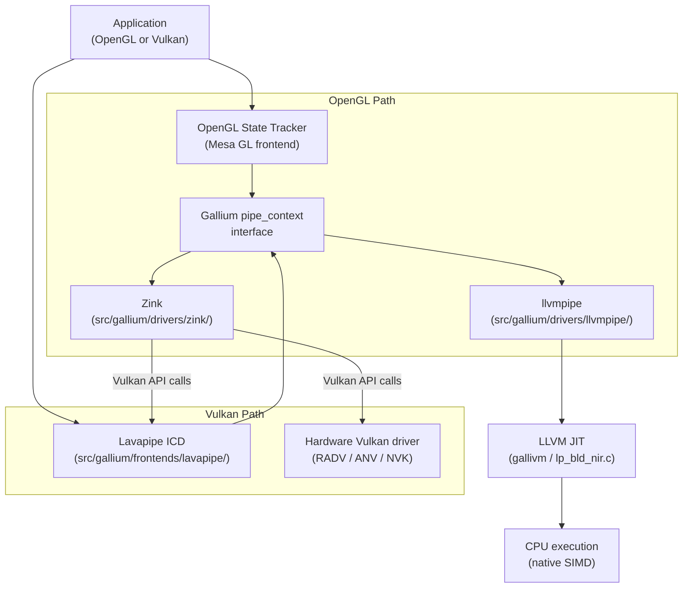
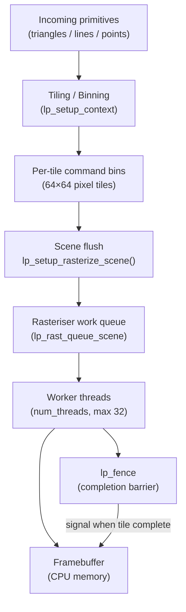
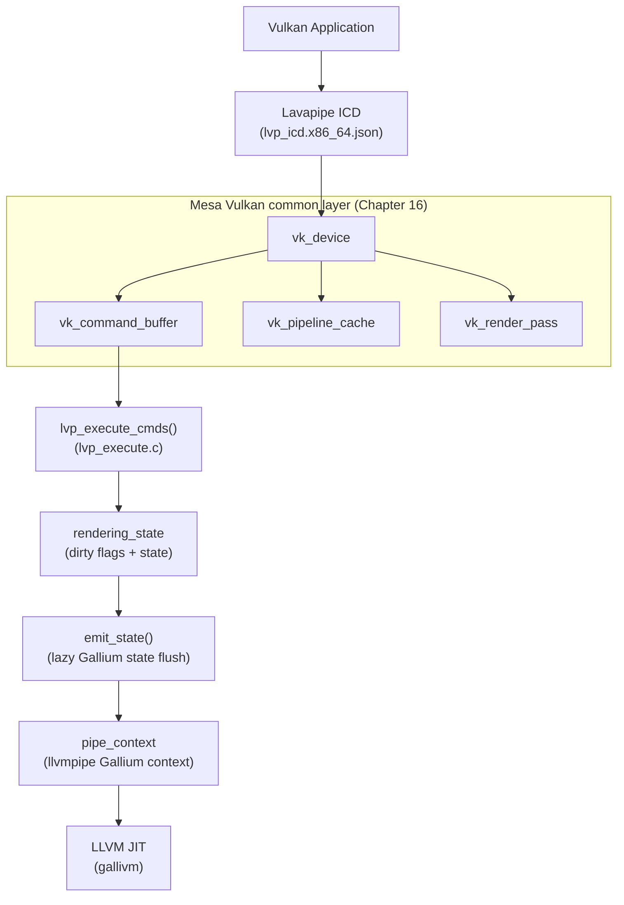
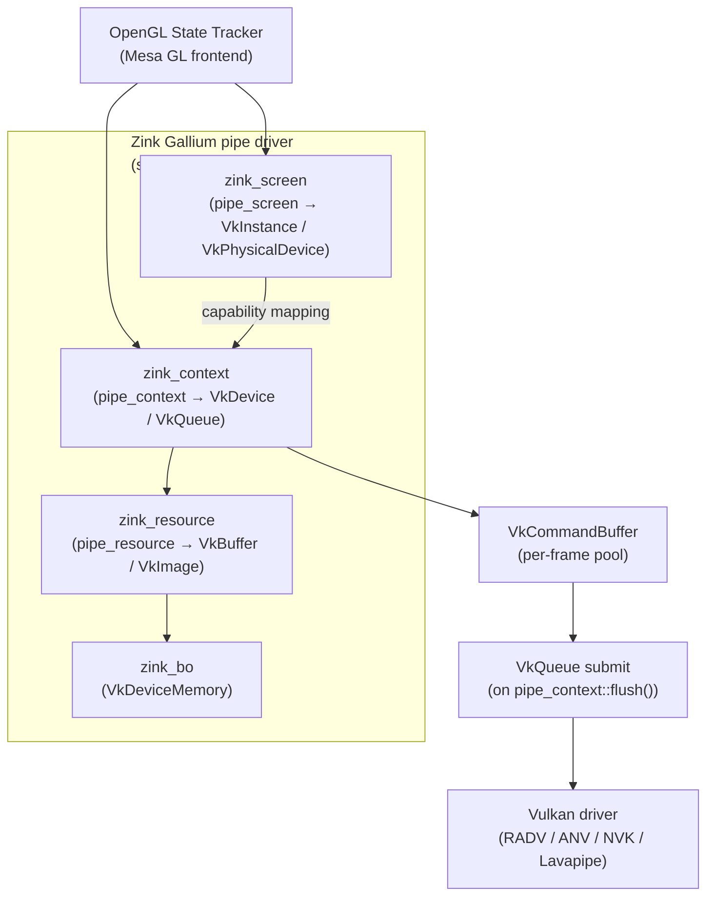

# Chapter 17: Software Renderers

**Part**: IV — Mesa Architecture  
**Audiences**: Systems and driver developers (architecture, CI integration); application developers (when software rendering activates, performance characteristics, and ensuring a hardware path)

---

## Table of Contents

1. [Why Software Renderers Matter](#1-why-software-renderers-matter)
2. [llvmpipe: Architecture and Design](#2-llvmpipe-architecture-and-design)
3. [llvmpipe Performance Characteristics](#3-llvmpipe-performance-characteristics)
4. [Lavapipe: CPU-Based Vulkan](#4-lavapipe-cpu-based-vulkan)
5. [Zink: OpenGL on Vulkan](#5-zink-opengl-on-vulkan)
6. [NIR to SPIR-V: The Zink Shader Pipeline](#6-nir-to-spir-v-the-zink-shader-pipeline)
7. [Software Renderers in Mesa's CI Pipeline](#7-software-renderers-in-mesas-ci-pipeline)
8. [Integrations](#integrations)
9. [References](#references)

---

## 1. Why Software Renderers Matter

The phrase "software renderer" conjures the idea of a last-resort fallback: slow, limited, barely functional. Mesa's software renderers are none of these things. They are sophisticated pieces of production engineering that exist at the intersection of CPU microarchitecture, compiler technology, and graphics API conformance. Their most important role today is not fallback rendering — it is enabling the entire Mesa continuous integration system.

Consider what Mesa CI must do. Every merge request against Mesa's GitLab repository triggers a pipeline that runs thousands of OpenGL and Vulkan conformance tests. Many of those runners are shared GitLab instances in cloud environments with no GPU whatsoever. Without software renderers, CI would require dedicated GPU hardware for every test run — expensive, flaky, and geographically constrained. Instead, Mesa uses llvmpipe for OpenGL testing and Lavapipe for Vulkan testing. These renderers produce deterministic output on any x86-64 host, can run under AddressSanitizer and Valgrind without special kernel drivers, and scale across all available CPU cores. The result is a CI system that catches conformance regressions in minutes on commodity hardware.

Beyond CI, software renderers serve several distinct real-world roles. A Wayland compositor running in a virtual machine without GPU passthrough needs to composite the desktop somewhere; wlroots and Mutter both fall back to llvmpipe in this situation. A developer debugging a GPU driver crash might reproduce the problem with Lavapipe to determine whether the bug is in the Vulkan common layer or in the hardware-specific code. An application targeting OpenGL on a platform where only a Vulkan driver exists — certain embedded ARM configurations, or Mesa on macOS via MoltenVK — can run through Zink, the OpenGL-on-Vulkan translation layer. Each renderer plays a specific architectural role; none are simply duplicates of the others.

There are three distinct software renderers to understand:

- **llvmpipe**: A Gallium pipe driver that implements OpenGL (and indirectly Vulkan via Lavapipe) entirely on the CPU, using LLVM to JIT-compile shaders to native SIMD machine code.
- **Lavapipe**: A Vulkan ICD that uses llvmpipe as its rasterisation backend. Lavapipe presents a full Vulkan API to applications and translates Vulkan commands into Gallium pipe calls executed synchronously on the calling CPU thread.
- **Zink**: A Gallium pipe driver that translates Gallium calls into Vulkan API calls. Zink is not a rasteriser at all — it is a translation layer. It can run on top of any Vulkan driver, whether that is hardware (RADV, ANV, NVK) or software (Lavapipe).



A fourth renderer, **softpipe** (`src/gallium/drivers/softpipe/`), predates llvmpipe. It is a pure software Gallium driver written without LLVM, used historically as a reference implementation. It still exists in the tree but is unmaintained and not used by default anywhere. New code should not target softpipe; it exists primarily for archaeology.

Historically, Lavapipe was briefly known as "vallium" during its earliest development in 2020. Readers encountering early blog posts or commit messages from that period will see this name; it was renamed to Lavapipe before the first Mesa release containing it.

---

## 2. llvmpipe: Architecture and Design

Source: `src/gallium/drivers/llvmpipe/`

llvmpipe is a Gallium pipe driver — it implements the `pipe_screen` and `pipe_context` interfaces described in Chapter 13 and receives shaders as NIR. What distinguishes it from hardware Gallium drivers is that instead of emitting GPU command streams, it emits LLVM IR that is compiled to native x86-64 (or ppc64le) machine code at runtime. The resulting code is executed directly on the CPU.

### The Tiling Engine

The fundamental architectural choice in llvmpipe is tile-based rendering. The framebuffer is divided into a grid of 64×64-pixel tiles. Work is organised as a scene: before any rendering happens, primitives are "binned" — each triangle is tested against each tile and placed into that tile's command bin if it overlaps it. Once a frame is complete (or the scene memory fills up), the bins are dispatched to worker threads for rasterisation. Each worker thread independently processes tiles from the work queue.

This architecture is described in the `lp_setup.c` file header comment, which calls it a "tiling engine" that "builds per-tile display lists and executes them on calls to `lp_setup_flush()`." The `lp_setup_context` structure tracks the state of the tiling engine; it is created by `lp_setup_create()`:

```c
/* src/gallium/drivers/llvmpipe/lp_setup.c (Mesa 25.2) */
struct lp_setup_context *
lp_setup_create(struct pipe_context *pipe,
                struct draw_context *draw)
{
   struct llvmpipe_screen *screen = llvmpipe_screen(pipe->screen);
   struct lp_setup_context *setup = CALLOC_STRUCT(lp_setup_context);
   /* ... */
   setup->num_threads = screen->num_threads;
   setup->vbuf = draw_vbuf_stage(draw, &setup->base);
   /* ... */
   setup->scenes[0] = lp_scene_create(setup);
   setup->triangle = first_triangle;
   setup->line     = first_line;
   setup->point    = first_point;
   setup->dirty = ~0U;
   return setup;
}
```

The `num_threads` field is read from `screen->num_threads`, which defaults to the number of logical CPU cores up to a platform maximum (32 as of Mesa 25). Each scene carries an `lp_fence` that worker threads decrement when they complete a tile; the rendering thread waits on this fence when it needs to read the framebuffer. Scene dispatch flows through `lp_rast_queue_scene()`, which places the filled scene into the rasteriser's work queue under a mutex:

```c
/* src/gallium/drivers/llvmpipe/lp_setup.c (Mesa 25.2) */
static void
lp_setup_rasterize_scene(struct lp_setup_context *setup)
{
   struct lp_scene *scene = setup->scene;
   struct llvmpipe_screen *screen = llvmpipe_screen(scene->pipe->screen);

   lp_scene_end_binning(scene);

   mtx_lock(&screen->rast_mutex);
   lp_rast_queue_scene(screen->rast, scene);
   mtx_unlock(&screen->rast_mutex);

   lp_setup_reset(setup);
}
```

The rationale for tiles is cache coherency. At 64×64 pixels with 4 bytes per pixel, one color tile is 16 KiB; with depth this approximately doubles. All memory accesses for a tile fit in L2 cache on most modern CPUs. Processing tiles sequentially avoids the framebuffer thrashing that would result from full-scanline traversal of large buffers.



### The LLVM JIT Compilation Path

Fragment shaders in llvmpipe are compiled to native code on demand via LLVM. The `lp_state_fs.c` file manages shader variant creation. Each unique combination of fragment shader and pipeline state produces a new `lp_fs_variant`; the JIT engine is set up via `gallivm_create()`:

```c
/* src/gallium/drivers/llvmpipe/lp_state_fs.c (Mesa 25.2) */
char module_name[64];
snprintf(module_name, sizeof(module_name), "fs%u_variant%u",
         shader->no, shader->variants_created);
variant->gallivm = gallivm_create(module_name, &lp->context, &cached);
```

The `gallivm_create()` function lives in `src/gallium/auxiliary/gallivm/lp_bld_init.c`. It initialises an LLVM module and JIT execution engine targeting the host CPU, with native SIMD feature detection — SSE4.1, AVX2, or AVX-512 depending on what the CPU supports. Mesa's meson build requires LLVM >= 5.0.0 for the default llvmpipe/Lavapipe (swrast) path (as of Mesa 25, where the minimum was bumped from 3.9 to 5.0); the higher requirement of >= 11 applies to AMD Vulkan (RADV) and RadeonSI. LLVM 16 and later enable additional SIMD code generation paths.

The shader compilation pipeline for fragment shaders is:

1. The OpenGL state tracker passes a NIR shader to llvmpipe via `pipe_context::create_fs_state()`.
2. llvmpipe calls into `lp_bld_nir.c` — specifically `lp_build_nir_soa()` — which walks the NIR instruction stream and emits LLVM IR using the `gallivm_state` builder.
3. The LLVM IR is handed to the LLVM JIT, which applies its own optimisation passes and emits native machine code.
4. The resulting function pointer is stored in the fragment shader variant (`lp_fs_variant`) and called directly during rasterisation.


The shader operates in a Structure-of-Arrays (SoA) layout. Rather than processing one pixel at a time, llvmpipe builds LLVM vector types whose width matches the host SIMD register width. On an AVX2 system, a `float` vector has 8 lanes; on AVX-512, 16 lanes. All 8 or 16 pixels in a SIMD group are processed simultaneously in each vector operation. This is the primary source of llvmpipe's performance advantage over scalar software renderers like softpipe.

The JIT cache is in-process: compiled LLVM modules are keyed by a hash of the shader state and reused if the same shader state is submitted again. The Mesa disk shader cache (`src/util/disk_cache.c`) is also consulted at shader creation time, allowing compiled modules to survive process restart (Chapter 12 discusses the disk cache architecture).

Vertex shaders follow a symmetric path through `lp_build_nir_soa()`, but are compiled to process arrays of vertices rather than arrays of pixels. The vertex shader JIT function receives a batch of input vertices and writes transformed outputs back to a staging buffer.

### The `lp_build_fs_llvm_iface` Interface

The fragment shader JIT interface is abstracted through `struct lp_build_fs_llvm_iface` defined in `lp_state_fs.c`. This structure provides function pointers for texture sampling, image access, and buffer reads, all of which must be lowered to CPU memory access patterns. The interface ensures that the NIR-to-LLVM translation in `lp_bld_nir.c` remains reusable across llvmpipe, Lavapipe, and any future gallivm consumer.

The `lp_bld_nir_soa.c` translation handles divergence analysis — identifying whether values differ across SIMD lanes — to enable targeted optimisations. Intrinsic operations such as SSBO atomics, shared memory access, and image loads map to helper functions or direct memory operations rather than hardware-specific instructions, making the translated code entirely portable across any CPU that LLVM targets.

---

## 3. llvmpipe Performance Characteristics

llvmpipe is not competitive with discrete GPU hardware for production workloads. A modern GPU achieves 50–200 billion pixels per second of fill rate; llvmpipe on a 16-core Zen 4 workstation achieves roughly 5–15 million pixels per second for shaders of non-trivial complexity. This is a gap of four to five orders of magnitude. For CI purposes, this is entirely acceptable — a test that draws a 256×256 framebuffer runs in microseconds regardless of the renderer.

The primary performance bottlenecks in llvmpipe are:

**JIT warm-up**: The first draw with a new shader state combination is slow because LLVM must compile the shader. On a complex GLSL shader, this can take tens of milliseconds. Subsequent draws reuse the compiled code and are fast. CI test suites experience this overhead heavily at the start of each test; the disk cache mitigates it across test runs.

**SIMD width**: AVX-512 paths process 16 pixels per vector lane-iteration, nearly doubling throughput over AVX2 (8 pixels). The `LP_NATIVE_VECTOR_WIDTH` environment variable overrides the default vector width; documentation notes that "sometimes llvmpipe can be fastest by using 128-bit vectors yet use AVX instructions" because of register pressure effects. This non-obvious tuning opportunity is worth exploring for specific workloads.

**Memory bandwidth**: Even with tiling, framebuffer operations are memory-bound for fill-heavy scenes. Depth/stencil reads and writes are particularly expensive. The tile size of 64×64 pixels was chosen empirically to fit working state in L2 cache; changing it significantly degrades performance.

**Thread scaling**: llvmpipe scales approximately linearly to 8 cores for typical scenes. Beyond that, the overhead of distributing work across tiles — each tile dispatched as an independent task — begins to exceed the rendering time for simple scenes. The `LP_NUM_THREADS` environment variable controls the thread count; setting it to 4–8 is typical for CI jobs.

Additional debugging and tuning environment variables:

| Variable | Effect |
|---|---|
| `LP_NUM_THREADS` | Number of rasteriser worker threads (default: CPU core count, max 32) |
| `LP_NATIVE_VECTOR_WIDTH` | Override SIMD vector width in bits (128, 256, 512) |
| `LP_NO_RAST=1` | Skip actual rasterisation (measures binning/setup overhead only) |
| `GALLIUM_OVERRIDE_CPU_CAPS` | Override CPU feature detection |
| `LIBGL_ALWAYS_SOFTWARE=1` | Force llvmpipe for all OpenGL (via Mesa loader) |
| `JIT_SYMBOL_MAP_DIR` | Write JIT symbol map for Linux perf FlameGraph |

For interactive use at 1080p with simple scenes, llvmpipe is usable — compositors running in VMs use it for desktop rendering. For 3D applications with per-fragment lighting, shadows, and post-processing, the frame rate falls well below interactive levels. Understanding this performance envelope is essential for any developer who needs to distinguish "rendering is slow because of llvmpipe" from "rendering is slow because of an algorithmic problem in the application."

---

## 4. Lavapipe: CPU-Based Vulkan

Source: `src/gallium/frontends/lavapipe/`

Lavapipe is Mesa's CPU-based Vulkan driver. It presents a conformant Vulkan implementation to applications — exposed as an ICD via the JSON manifest `lvp_icd.x86_64.json` — while executing all rendering on the CPU using llvmpipe as the rasterisation backend.

### Position in the Stack

Lavapipe is a full Mesa Vulkan driver in the sense defined in Chapter 16 (Mesa Vulkan common infrastructure). It uses `vk_device`, `vk_render_pass`, `vk_pipeline_cache`, `vk_command_buffer`, and all the other common-layer objects. Lavapipe was historically the first Mesa Vulkan driver to systematically adopt the Vulkan common layer — the common infrastructure was, in many cases, developed alongside Lavapipe to support its needs. This means that Lavapipe conformance catches bugs not just in Lavapipe itself but in the common infrastructure shared by RADV, ANV, NVK, and every other Mesa Vulkan driver.

Lavapipe is conformant to **Vulkan 1.3** (in the Khronos sense, submitted and listed in the conformance database). As of Mesa 25, Lavapipe exposes all extensions promoted to Vulkan 1.4 core but has not been formally submitted for 1.4 conformance. Practically, an application requesting Vulkan 1.4 promoted features will find them available, though the official conformance certificate references 1.3.



### The Synchronous Execution Model

The fundamental difference between Lavapipe and any hardware Vulkan driver is the execution model. In a hardware driver, `vkQueueSubmit` records a command stream and sends it to the GPU; execution is asynchronous and the CPU continues while the GPU works. In Lavapipe, there is no GPU — so `vkQueueSubmit` executes the command buffer **synchronously** on a dedicated execution thread. Fences and semaphores are trivially satisfied because execution is complete before the submit call returns to the queue thread.

The core execution function is `lvp_execute_cmds()` in `src/gallium/frontends/lavapipe/lvp_execute.c`:

```c
/* src/gallium/frontends/lavapipe/lvp_execute.c (Mesa 25.2) */
VkResult lvp_execute_cmds(struct lvp_device *device,
                          struct lvp_queue *queue,
                          struct lvp_cmd_buffer *cmd_buffer)
{
   struct rendering_state *state = queue->state;
   memset(state, 0, sizeof(*state));
   state->pctx = queue->ctx;
   state->device = device;
   state->uploader = queue->uploader;
   state->cso = queue->cso;
   state->blend_dirty = true;
   state->dsa_dirty = true;
   state->rs_dirty = true;
   state->vp_dirty = true;
   state->sample_mask_dirty = true;
   state->min_samples_dirty = true;
   state->sample_mask = UINT32_MAX;
   state->poison_mem = device->poison_mem;
   /* ... default state initialisation ... */
   state->rs_state.line_width = 1.0;
   state->rs_state.flatshade_first = true;
   state->rs_state.front_ccw = true;
   state->blend_state.independent_blend_enable = true;

   lvp_execute_cmd_buffer(&cmd_buffer->vk.cmd_queue.cmds, state, device->print_cmds);

   finish_fence(state);
   /* ... cleanup ... */
}
```

The `rendering_state` structure is the central state tracker for command buffer execution. It holds a `pipe_context *pctx` (the llvmpipe Gallium context), along with dirty flags for every piece of graphics state: blend (`blend_dirty`), rasteriser (`rs_dirty`), depth-stencil-alpha (`dsa_dirty`), vertex buffers (`vb_dirty`), scissors, viewports, and push constants. Each dirty flag is set when the corresponding Vulkan command modifies state, and cleared by `emit_state()` which issues the actual Gallium state calls:

```c
/* src/gallium/frontends/lavapipe/lvp_execute.c (Mesa 25.2) */
static void emit_state(struct rendering_state *state)
{
   if (state->blend_dirty) {
      cso_set_blend(state->cso, &state->blend_state);
      state->blend_dirty = false;
   }
   if (state->rs_dirty) {
      cso_set_rasterizer(state->cso, &state->rs_state);
      state->rs_dirty = false;
   }
   if (state->dsa_dirty) {
      cso_set_depth_stencil_alpha(state->cso, &state->dsa_state);
      state->dsa_dirty = false;
   }
   if (state->vp_dirty) {
      state->pctx->set_viewport_states(state->pctx, 0,
                                       state->num_viewports,
                                       state->viewports);
      state->vp_dirty = false;
   }
   if (state->scissor_dirty) {
      state->pctx->set_scissor_states(state->pctx, 0,
                                      state->num_scissors,
                                      state->scissors);
      state->scissor_dirty = false;
   }
   /* ... vertex buffers, push constants, constbufs ... */
}
```

`emit_state()` is called immediately before every draw or dispatch command to flush accumulated state changes into the Gallium context. This lazy state emission model mirrors what a hardware driver does with command buffer construction, but here everything runs on the CPU and is immediately available to llvmpipe.

The design is intentionally straightforward. Dave Airlie (the original author, writing under the "airlied" pseudonym) described the synchronous model as "horrible" but deliberately chosen: the overhead of the sequential playback is insignificant compared to the cost of CPU rasterisation, so there is no benefit to a more complex asynchronous design. From the Lavapipe perspective, the "GPU" is always the calling thread.

### Shader Pipeline

Lavapipe's shader pipeline is: `SPIR-V → NIR (via spirv_to_nir) → llvmpipe gallivm JIT`. This is the standard Mesa SPIR-V front-end path described in Chapter 14. The Vulkan pipeline object (`lvp_pipeline`) compiles shaders at pipeline creation time using `lvp_spirv_to_nir()` followed by the same `gallivm` infrastructure as llvmpipe. The compiled fragment and vertex shader variants are stored in the pipeline object and bound to the llvmpipe Gallium context when the pipeline is bound via `vkCmdBindPipeline`.

### Memory Model

Because Lavapipe has no GPU memory, all `VkDeviceMemory` allocations are backed by `aligned_malloc`. Every memory type has `VK_MEMORY_PROPERTY_HOST_VISIBLE_BIT | VK_MEMORY_PROPERTY_HOST_COHERENT_BIT` set — there is no device-local memory requiring explicit transfer. Descriptor sets are CPU data structures containing pointers to buffers and images; no descriptor encoding for GPU consumption is required. Image memory uses 64-byte alignment for standard images and 64 KB alignment for sparse images. The common Vulkan layer handles the host-side descriptor model (Chapter 16).

### Vulkan Extension Coverage and Ray Tracing

Lavapipe's extension coverage is broad and grows with each Mesa release. As of Mesa 24.1–25, Lavapipe exposes:

- `VK_KHR_acceleration_structure` and `VK_KHR_ray_query`: implemented via a software BVH using `lvp_bvh_box_node` (internal traversal nodes) and `lvp_bvh_triangle_node` (leaf geometry nodes), with radix sort for geometry organisation. Ray queries lower to BVH traversal loops within standard compute/graphics shaders.
- `VK_KHR_ray_tracing_pipeline`: exposed, with software traversal of the BVH.
- `VK_EXT_mesh_shader`, `VK_EXT_shader_object`, `VK_EXT_device_generated_commands`.

The software ray tracing implementation is real but pathologically slow. Running Quake II RTX via Lavapipe's ray tracing path achieves approximately 1 frame per second — sufficient to confirm that an application reaches its rendering code, but not for interactive use. The implementation is ported from RADV's emulated ray tracing for pre-hardware-RT Radeon cards, and carries known precision limitations in ray-triangle intersection transforms (reduced transform precision causes intersection misses in degenerate configurations).

### Environment Variables

| Variable | Effect |
|---|---|
| `VK_DRIVER_FILES=/usr/share/vulkan/icd.d/lvp_icd.x86_64.json` | Select Lavapipe as the Vulkan ICD |
| `MESA_VK_ABORT_ON_DEVICE_LOST=1` | Abort on device-lost (converts silent errors to assertions) |
| `MESA_VK_DEVICE_SELECT=llvmpipe` | Used with `VK_LAYER_MESA_device_select` layer |
| `MESA_SHADER_CAPTURE_PATH=/tmp/shaders` | Capture SPIR-V shaders for offline analysis |
| `MESA_SHADER_CACHE_DISABLE=1` | Disable disk cache (force recompilation) |

---

## 5. Zink: OpenGL on Vulkan

Source: `src/gallium/drivers/zink/`

Zink occupies a different conceptual position from llvmpipe and Lavapipe. It is not a rasteriser: it does not execute any pixel processing on the CPU. Instead, Zink is a Gallium pipe driver that translates every Gallium API call into Vulkan API calls, then submits them to a real Vulkan driver — which may be hardware (RADV, ANV, NVK) or software (Lavapipe). Zink makes OpenGL available on any platform where Vulkan is available.

### Architecture

`zink_screen` implements `pipe_screen` and creates a `VkInstance` and `VkPhysicalDevice` at initialisation. It queries the physical device's Vulkan capabilities and uses them to fill in the Gallium capability flags that the OpenGL state tracker queries (texture format support, maximum texture size, compute shader capabilities, etc.). This capability mapping is non-trivial: some Gallium capabilities have no direct Vulkan counterpart and must be approximated.

`zink_context` implements `pipe_context` and holds a `VkDevice`, a set of `VkQueue`s, and per-frame command buffer pools. Each Gallium draw call maps to one or more Vulkan commands recorded into the current command buffer. When the Gallium context is flushed (e.g. at frame boundary or on explicit `pipe_context::flush()`), Zink submits the accumulated Vulkan command buffer to the queue.

`zink_resource` wraps Vulkan buffers and images with metadata for surface creation and memory tracking. Memory allocation includes debugging instrumentation tracking allocation sizes and sites through `zink_debug_mem_add` and `zink_debug_mem_print_stats`, useful for diagnosing memory leaks and over-allocation.



### When Zink Is Used

Zink appears in production in several distinct configurations:

**OpenGL on platforms without native OpenGL drivers**: On some ARM Mali configurations and on macOS via MoltenVK, only a Vulkan driver is available. Zink provides OpenGL 4.6 support on top of it. On macOS, OpenGL applications that have not been ported to Metal can run through the chain: OpenGL → Zink → MoltenVK → Metal. The macOS and MoltenVK specifics are outside this book's scope.

**Default backend experiments**: Fedora experimented with making Zink the default OpenGL backend for Intel and AMD hardware in some configurations. This experiment was controversial and subsequently reverted. The performance caveats that prompted reversion are real: for workloads where the native `iris` or `radeonsi` driver applies OpenGL-specific optimisations (blending shortcuts, early-Z promotion, GL-specific texture path fast paths), Zink's generic Vulkan translation can be measurably slower. The lesson: Zink's translation overhead is workload-dependent, and for performance-sensitive applications the native OpenGL driver remains preferable.

**Correctness testing**: Running an application through Zink atop RADV or ANV and comparing output against the native OpenGL driver is a useful correctness check. Divergence points to a bug in the OpenGL state tracker, Zink's translation, or the underlying Vulkan driver.

**OpenGL atop Lavapipe**: The full software path — Mesa OpenGL → Gallium → Zink → Lavapipe — is used in CI when testing Zink correctness without any GPU. This combination is deterministic, sanitizer-compatible, and exercises the full OpenGL-to-Vulkan translation stack.

### NIR-to-SPIR-V: Reverse Translation

Hardware Mesa Vulkan drivers (RADV, ANV, NVK) translate SPIR-V to NIR on the way in: the application provides SPIR-V, which is converted to NIR for optimisation and then to the driver's hardware ISA. Zink does the opposite. The OpenGL state tracker produces NIR from GLSL; Zink must translate that NIR *back* to SPIR-V so that the underlying Vulkan driver can consume it. This round-trip — GLSL → NIR → SPIR-V → NIR (in the Vulkan driver) — introduces both overhead and potential semantic mismatches, discussed in Section 6.

### State Translation

The central challenge in Zink is that Gallium and Vulkan represent pipeline state very differently. Gallium uses mutable context state — blending, depth-stencil, rasteriser, and shader bindings can all change independently at any time. Vulkan uses largely immutable pipeline objects. Each time a Gallium draw call arrives with new state, Zink must either create a new `VkPipeline` or use dynamic state extensions to update the existing pipeline.

Zink relies heavily on `VK_EXT_extended_dynamic_state` (and its successors) to handle the Gallium mutable state model. Without these extensions, Zink would need to create a new `VkPipeline` for every unique combination of rasteriser state, depth-stencil state, and blend state — an explosion of pipeline variants. With dynamic state, most per-draw state is emitted via `vkCmdSet*` calls rather than pipeline creation.

The draw pipeline orchestrates the Gallium-to-Vulkan translation through sequential stages before each draw: `barrier_draw_buffers()` ensures index and indirect buffers have transitioned to the required layouts; `zink_bind_vertex_buffers()` issues `vkCmdBindVertexBuffers2` commands; push constants with draw IDs propagate via `update_drawid()`; finally either `vkCmdDrawIndexed` or `vkCmdDraw` is issued depending on whether an index buffer is present.

The pipeline creation cost problem is further addressed by `VK_EXT_graphics_pipeline_library`. Zink uses pipeline libraries to split pipeline compilation into fast pre-compilation phases (vertex input, pre-rasterisation, fragment output) and a slower linking phase. This amortises shader compilation across draws that share partial pipeline state. The environment flag `ZINK_DEBUG=pipeline_library` forces pipeline library usage for all shaders to test this path.

Render passes present another translation challenge. Zink prefers `VK_KHR_dynamic_rendering` when the underlying Vulkan driver supports it, which eliminates the need to create `VkRenderPass` objects and `VkFramebuffer` objects explicitly. When dynamic rendering is unavailable, Zink creates render pass objects using a compatibility hash to avoid redundant creation.

### Resource Management

Gallium `pipe_resource` objects map to either `VkBuffer` (for buffer resources) or `VkImage` (for textures) via `zink_resource`. Backing memory (`zink_bo`) wraps `VkDeviceMemory`. Buffer and image usage flags must be set conservatively at creation time because Gallium does not always declare all future uses; Zink errs toward setting broad usage masks (`VK_BUFFER_USAGE_STORAGE_BUFFER_BIT | VK_BUFFER_USAGE_VERTEX_BUFFER_BIT | ...`).

Surface creation maps Gallium texture targets to Vulkan image view types via `vviewtype_from_pipe()`, then initialises `VkImageViewCreateInfo` structures through `create_ivci()`.

Descriptor management uses three configurable strategies selectable via `ZINK_DESCRIPTORS`:

- `auto`: Zink selects the strategy based on device capabilities.
- `lazy`: Descriptors are updated only when needed, minimising CPU overhead at the cost of potentially more descriptor set allocations.
- `db`: Uses `VK_EXT_descriptor_buffer` when available, placing descriptors directly in a CPU-visible buffer rather than using descriptor pools. This is the preferred path on hardware that supports it, offering lower overhead and better cache behaviour.

Synchronisation uses `VK_KHR_synchronization2`. Gallium fence semantics (a fence is signalled when all commands submitted before it complete) map to Vulkan timeline semaphores, which Zink uses to express cross-queue dependencies and to synchronise CPU readback.

### Performance

Zink's performance on real hardware has improved dramatically through Mesa 22–25. On Mesa 22.1 with a Radeon RX 6800 XT and RADV, Zink achieved roughly 70–100% of the native RadeonSI Gallium driver's performance on synthetic benchmarks, with some games like DDNet slightly *outperforming* RadeonSI due to Zink triggering better Vulkan code paths in RADV. By Mesa 23.1, further CPU overhead reductions and vRAM usage improvements brought Zink to competitive parity for many workloads.

The remaining overhead concentrates in three areas: pipeline creation frequency (Zink creates more pipeline objects than a native GL driver because of the state explosion); SPIR-V size (Zink-generated SPIR-V is often larger than what an application would provide directly, causing the Vulkan driver's SPIR-V parser to do more work); and synchronisation (Zink issues more barriers than a hand-optimised Vulkan application because it must be conservative about resource hazards). The pipeline library work has significantly addressed the first problem; descriptor buffer work (`db` mode) has reduced CPU overhead; explicit synchronisation refinements continue to reduce unnecessary barriers.

Mike Blumenkrantz, Zink's primary developer, maintains an extensive technical blog at `https://www.supergoodcode.com/` covering Zink architecture, the pipeline library implementation, descriptor management redesigns, and ongoing optimisation work. This blog is an essential resource for anyone working on Zink internals.

---

## 6. NIR to SPIR-V: The Zink Shader Pipeline

Source: `src/gallium/drivers/zink/nir_to_spirv/nir_to_spirv.c`

The NIR-to-SPIR-V translation in Zink is the inverse of the SPIR-V-to-NIR translation that hardware Vulkan drivers perform (described in Chapter 14). Where `spirv_to_nir()` lowers Khronos's portable binary format to Mesa's internal SSA representation, Zink's `nir_to_spirv()` raises Mesa's internal representation back to the portable format for consumption by the underlying Vulkan driver.

### The `ntv_context` Structure

All translation state is held in `struct ntv_context`:

```c
/* src/gallium/drivers/zink/nir_to_spirv/nir_to_spirv.c (Mesa 25.2) */
struct ntv_context {
   void *mem_ctx;
   bool spirv_1_4_interfaces;  /* SPIR-V 1.4+ requires all globals in OpEntryPoint */
   bool have_spirv16;
   bool explicit_lod;          /* force explicit lod=0 for texture() */

   struct spirv_builder builder;
   nir_shader *nir;

   /* Per-resource SpvIds, indexed by binding/slot */
   SpvId ubos[PIPE_MAX_CONSTANT_BUFFERS][5];   /* [binding][component_size_idx] */
   SpvId ssbos[5];
   SpvId images[PIPE_MAX_SHADER_IMAGES];
   SpvId samplers[PIPE_MAX_SHADER_SAMPLER_VIEWS];

   /* Interface variable tracking for OpEntryPoint */
   SpvId entry_ifaces[PIPE_MAX_SHADER_INPUTS * 4 + PIPE_MAX_SHADER_OUTPUTS * 4];
   size_t num_entry_ifaces;

   /* NIR SSA def → SpvId mapping */
   SpvId *defs;
   nir_alu_type *def_types;
   size_t num_defs;

   struct hash_table *vars;  /* nir_variable → SpvId */

   /* Loop control */
   SpvId loop_break, loop_cont;

   /* Built-in variable SpvIds */
   SpvId front_face_var, instance_id_var, vertex_id_var,
         sample_id_var, sample_pos_var, sample_mask_in_var,
         local_invocation_id_var, global_invocation_id_var,
         workgroup_id_var, num_workgroups_var;
};
```

The `defs` array maps each NIR SSA definition index to its corresponding SPIR-V `SpvId`. The `vars` hash table maps `nir_variable` pointers to SPIR-V variable IDs for global (interface) variables. `entry_ifaces` accumulates the list of interface variables that SPIR-V 1.4 and later requires to be listed in the `OpEntryPoint` instruction.

```mermaid
graph LR
    GLSL["GLSL shader\n(application source)"]
    NIR["NIR\n(Mesa internal SSA)"]
    NtvCtx["ntv_context\n(translation state)"]
    SpvBuilder["spirv_builder\n(src/compiler/spirv/)"]
    SPIRV["SPIR-V binary\n(spirv_shader)"]
    VkDriver["Vulkan driver\n(RADV / ANV / Lavapipe)"]
    NIR2["NIR\n(re-lowered in Vulkan driver)"]

    GLSL -- "GLSL → NIR\n(Mesa GL frontend)" --> NIR
    NIR -- "nir_to_spirv()" --> NtvCtx
    NtvCtx -- "defs[] / vars\nhash_table" --> SpvBuilder
    SpvBuilder --> SPIRV
    SPIRV -- "spirv_to_nir()" --> NIR2
    NIR2 --> VkDriver
```



### The Entry Point

The translation entry point is `nir_to_spirv()`:

```c
/* src/gallium/drivers/zink/nir_to_spirv/nir_to_spirv.c (Mesa 25.2) */
struct spirv_shader *
nir_to_spirv(struct nir_shader *s,
             const struct zink_shader_info *sinfo,
             const struct zink_screen *screen)
{
   const uint32_t spirv_version = screen->spirv_version;
   struct ntv_context ctx = {0};
   ctx.mem_ctx = ralloc_context(NULL);
   ctx.nir = s;
   ctx.spirv_1_4_interfaces = spirv_version >= SPIRV_VERSION(1, 4);
   ctx.have_spirv16 = spirv_version >= SPIRV_VERSION(1, 6);

   spirv_builder_emit_cap(&ctx.builder, SpvCapabilityShader);

   /* Stage-specific capability declarations */
   switch (s->info.stage) {
   case MESA_SHADER_FRAGMENT:
      if (s->info.fs.uses_sample_shading)
         spirv_builder_emit_cap(&ctx.builder, SpvCapabilitySampleRateShading);
      if (s->info.fs.uses_discard &&
          screen->info.have_EXT_shader_demote_to_helper_invocation) {
         spirv_builder_emit_extension(&ctx.builder,
                                      "SPV_EXT_demote_to_helper_invocation");
         spirv_builder_emit_cap(&ctx.builder,
                                SpvCapabilityDemoteToHelperInvocation);
      }
      break;
   case MESA_SHADER_TESS_CTRL:
   case MESA_SHADER_TESS_EVAL:
      spirv_builder_emit_cap(&ctx.builder, SpvCapabilityTessellation);
      break;
   case MESA_SHADER_VERTEX:
      if (BITSET_TEST(s->info.system_values_read, SYSTEM_VALUE_INSTANCE_ID))
         spirv_builder_emit_cap(&ctx.builder, SpvCapabilityDrawParameters);
      break;
   /* ... other stages ... */
   }
   /* ... declare types, translate instructions, emit entry point ... */
}
```

The function queries `screen->spirv_version` to determine which SPIR-V version to target — determined by what the underlying Vulkan driver supports. SPIR-V 1.4 introduced mandatory listing of interface variables in `OpEntryPoint`; SPIR-V 1.6 merged several previously extension-only features into core.

### Translation Challenges

**Type strictness**: SPIR-V has a stricter type system than NIR. NIR frequently reinterprets values with different types (e.g. treating a `float32` as `uint32` for bit manipulation). Zink must insert explicit SPIR-V type conversion operations wherever NIR performs implicit reinterpretation. The `def_types` array in `ntv_context` tracks the semantic type of each value to enable correct insertion of `OpBitcast` instructions.

**Structured control flow**: SPIR-V requires structured control flow — loops and conditionals must have explicit `OpLoopMerge` and `OpSelectionMerge` instructions identifying the merge blocks. NIR's CFG is an arbitrary SSA graph. Zink must reconstruct the dominance structure and identify loop headers and merge points before it can emit valid SPIR-V. The `block_ids` array and `loop_break`/`loop_cont` fields in `ntv_context` track this during translation.

**Built-in variable mapping**: NIR intrinsics that read or write system values must be mapped to SPIR-V built-in variables. For example, `nir_intrinsic_load_front_face` maps to a variable decorated with `SpvBuiltInFrontFacing` (tracked in `front_face_var`); `nir_intrinsic_load_sample_id` maps to `SpvBuiltInSampleId` (tracked in `sample_id_var`). The `ntv_context` structure pre-declares SpvId fields for each possible built-in and populates them on first use. When the underlying Vulkan driver re-ingests this SPIR-V, it will perform the reverse mapping: SPIR-V built-in → NIR intrinsic.

**Extension requirements**: OpenGL supports features that Vulkan only exposes via extensions. When a GLSL extension is used (image atomics, sparse texture, `gl_SampleMask` writes, `EXT_shader_demote_to_helper_invocation`), Zink must verify that the underlying Vulkan driver supports the corresponding SPIR-V extension and capability, and emit `OpExtension` and `OpCapability` instructions accordingly. The `screen->info` struct carries the device feature query results for this purpose.

### The `spirv_builder` API

Zink constructs SPIR-V using the `spirv_builder` API (`src/compiler/spirv/spirv_builder.h`). This API is shared with Mesa test tools and the compiler team, and provides word-level SPIR-V emission:

```c
/* src/compiler/spirv/spirv_builder.h */
void spirv_builder_emit_cap(struct spirv_builder *b, SpvCapability cap);
void spirv_builder_emit_extension(struct spirv_builder *b, const char *ext);
void spirv_builder_emit_entry_point(struct spirv_builder *b,
                                    SpvExecutionModel exec_model,
                                    SpvId entry_point,
                                    const char *name,
                                    const SpvId *ifaces,
                                    size_t num_ifaces);
SpvId spirv_builder_emit_load(struct spirv_builder *b,
                               SpvId result_type, SpvId pointer);
SpvId spirv_builder_emit_store(struct spirv_builder *b,
                                SpvId pointer, SpvId val);
```

In debug builds, Zink can run the generated SPIR-V through `spirv-val` before submission (`ZINK_DEBUG=spirv`), catching translation errors before they reach the Vulkan driver. This validation pass has been invaluable in finding subtle type mismatch bugs during Zink development.

---

## 7. Software Renderers in Mesa's CI Pipeline

Mesa's GitLab CI system runs thousands of OpenGL and Vulkan conformance tests on every merge request. The majority of these tests run on shared GitLab runners — standard x86-64 VMs with no GPU available. Software renderers make this possible.

### llvmpipe CI Jobs

OpenGL CI jobs that run on llvmpipe include:

- **piglit** test suite: covers Mesa's OpenGL implementation across rendering, state management, and extension behaviour.
- **`glcts`** (OpenGL CTS): Khronos's official OpenGL Conformance Test Suite; Mesa runs the GL 4.6 suite on llvmpipe to verify conformance.
- **Zink-over-Lavapipe**: OpenGL application tests with Zink translating to Lavapipe, exercising the full OpenGL→Vulkan translation path without GPU hardware.

The environment to activate llvmpipe is straightforward:

```bash
# Force OpenGL to use llvmpipe
export LIBGL_ALWAYS_SOFTWARE=1

# Verify with glxinfo
glxinfo -B | head -5
# Expected output:
# OpenGL vendor string: Mesa/X.org
# OpenGL renderer string: llvmpipe (LLVM 18.1, 256 bits)
# OpenGL version string: 4.5 (Compatibility Profile) Mesa 25.2.0
```

### Lavapipe CI Jobs

Lavapipe CI jobs run the **dEQP-VK** (drawElements Quality Programme — Vulkan) conformance suite. dEQP-VK is the Khronos-provided Vulkan conformance test suite; it contains over 1 million test cases covering Vulkan 1.0 through 1.3 and beyond. Mesa runs a subset on every merge request (full runs take hours) and maintains YAML allowlists of known failures via the `deqp-runner` tool.

```bash
# Force Vulkan to use Lavapipe ICD
export VK_DRIVER_FILES=/usr/share/vulkan/icd.d/lvp_icd.x86_64.json

# Verify with vulkaninfo
vulkaninfo --summary | grep "GPU id"
# Expected: GPU id : 0 (llvmpipe (LLVM 18.1, 256 bits))

# Run a dEQP-VK subset with deqp-runner
deqp-runner run \
  --deqp /path/to/deqp-vk \
  --caselist dEQP-VK.pipeline.*.txt \
  --output /tmp/results \
  --skips known-failures.yaml \
  --jobs 8
```

The `deqp-runner` tool (`https://gitlab.freedesktop.org/mesa/deqp-runner`) parallelises test execution across CPU cores and manages expectation files. An allowlist YAML entry for a known failure looks like:

```yaml
# Known failure: precision edge case in interpolation
dEQP-VK.glsl.interpolation.*.mediump: Fail
```

Lavapipe's near-100% pass rate on dEQP-VK Vulkan 1.3 core tests means that a Lavapipe failure in CI reliably indicates a regression in the Vulkan common layer (Chapter 16) rather than a Lavapipe-specific issue. This is Lavapipe's most valuable CI property: it acts as a canary for the shared infrastructure.

### Sanitizer Builds

Lavapipe can run under AddressSanitizer and UndefinedBehaviourSanitizer without any GPU driver involvement. A sanitizer-instrumented Lavapipe run exercises:

- The Vulkan common layer (descriptor set management, render pass lowering, pipeline caching)
- NIR optimisation passes
- The spirv_to_nir frontend
- The gallivm JIT infrastructure

Hardware GPU drivers cannot be run under Valgrind because the kernel driver's ioctl interface and shared memory model are incompatible with Valgrind's shadow memory tracking. Lavapipe has no such constraints. This makes it the primary tool for finding memory safety bugs in Mesa's upper layers.

The recommended build configuration for sanitizer testing:

```bash
# Build Mesa with AddressSanitizer
meson setup builddir \
  -Db_sanitize=address \
  -Db_lundef=false \
  -Dvulkan-drivers=swrast \
  -Dgallium-drivers=llvmpipe,zink
ninja -C builddir

# Run dEQP under ASAN with Lavapipe
VK_DRIVER_FILES=$PWD/builddir/src/gallium/frontends/lavapipe/lvp_icd.x86_64.json \
ASAN_OPTIONS=detect_leaks=0 \
MESA_VK_ABORT_ON_DEVICE_LOST=1 \
./builddir/deqp-vk --deqp-caselist=dEQP-VK.pipeline.*.txt
```

Setting `MESA_VK_ABORT_ON_DEVICE_LOST=1` converts device-lost events from silent errors (which can cause subsequent tests to produce wrong results) into immediate aborts with a stack trace. This is particularly useful with Lavapipe because device-lost in a CPU renderer always indicates a Mesa bug rather than a transient hardware fault.

### Docker-Based CI Containers

Mesa's CI uses Docker containers to provide a reproducible environment. Container images for llvmpipe and Lavapipe jobs include Mesa (built from source or as a distribution package), the dEQP/VK-GL-CTS test binaries, and the `deqp-runner` tool. The `LIBGL_ALWAYS_SOFTWARE=1` and `VK_DRIVER_FILES` variables are set in the container's environment. Documentation at `https://docs.mesa3d.org/ci/` describes the container build and CI job configuration in detail.

Because dEQP-VK's full suite takes several hours, CI jobs use `deqp-runner`'s parallel fraction mode: each job processes a specified fraction of the test list, with multiple parallel job instances collectively covering the full suite. A single dEQP-VK job typically takes 6–12 minutes on a 4-core shared runner processing one-sixth of the full test list. This distributes what would be a multi-hour sequential run into dozens of parallel runners completing well within the GitLab CI timeout budget.

The Mesa CI documentation (`https://docs.mesa3d.org/ci/`) provides the canonical reference for how CI containers are built, how test jobs are defined, and how the `deqp-runner` allowlist files are structured and updated when new failures are found or resolved.

---

## Integrations

**Chapter 12 (Mesa disk shader cache)**: llvmpipe and Lavapipe use the Mesa disk shader cache to persist compiled LLVM modules between runs. The first run with a new shader compiles via LLVM (slow); subsequent runs load the serialised bitcode from disk and JIT-compile it (fast). `MESA_SHADER_CACHE_DISABLE=1` forces recompilation. Chapter 12 covers the cache key design and eviction policy.

**Chapter 13 (Gallium)**: llvmpipe is the canonical minimal Gallium pipe driver. It implements every interface that `pipe_screen` and `pipe_context` require and is the recommended starting point for understanding what a Gallium driver must provide. Zink is also a Gallium pipe driver from the state tracker's perspective — the OpenGL state tracker cannot distinguish Zink from a hardware Gallium driver. Chapter 13 covers the Gallium interface contract.

**Chapter 14 (NIR)**: Both llvmpipe and Lavapipe receive NIR shaders and compile them via LLVM JIT. Zink receives NIR and translates it to SPIR-V. The same NIR optimisation passes that run before hardware drivers also run before all three software renderers. The NIR-to-LLVM path in `lp_bld_nir.c` and the NIR-to-SPIR-V path in `nir_to_spirv.c` are conceptually symmetric operations. Chapter 14 covers the NIR optimisation infrastructure.

**Chapter 16 (Mesa Vulkan common)**: Lavapipe was the first Mesa Vulkan driver to systematically use the Vulkan common infrastructure. Render pass lowering, pipeline caching, descriptor set infrastructure, and `vk_command_buffer` recording were all co-developed with Lavapipe's needs. A Lavapipe CI regression frequently indicates a bug in the common layer, not in Lavapipe itself. Chapter 16 covers the common layer.

**Chapter 18 (Vulkan drivers)**: Lavapipe is the CPU counterpart to RADV, ANV, and NVK. "Lavapipe passes but RADV fails" immediately isolates a regression to RADV-specific code rather than the Vulkan common layer or NIR passes. This bisection pattern is fundamental to Mesa Vulkan debugging workflow.

**Chapter 19 (OpenGL drivers)**: Zink is an alternative to radeonsi and iris for providing OpenGL. On hardware where only a Vulkan driver is available, Zink provides full OpenGL 4.6. Chapter 19 covers the native OpenGL Gallium drivers and their relationship to Zink.

**Chapter 21 (wlroots compositors)**: wlroots falls back to llvmpipe (via `wlr_renderer_autocreate()`) when no GPU KMS backend is available — most commonly in VMs without GPU passthrough. Chapter 21 covers the wlroots software rendering fallback path.

**Chapter 22 (production compositors)**: Mutter (GNOME) and KWin (KDE) similarly fall back to llvmpipe when running without a GPU. Desktop compositing at 1080p with llvmpipe is usable for basic tasks but cannot sustain smooth animation at high frame rates. Chapter 22 covers how these compositors handle the software rendering fallback.

**Chapter 30 (debugging)**: Lavapipe is the recommended Vulkan implementation for running under Valgrind and AddressSanitizer. `MESA_VK_ABORT_ON_DEVICE_LOST=1` converts silent device-lost events to aborts. Chapter 30 covers the full Mesa debugging toolchain.

**Chapter 31 (conformance)**: llvmpipe and Lavapipe are Mesa's primary CI conformance targets. Chapter 31 covers the dEQP test framework, the `deqp-runner` tool, and how Mesa manages the expected-failure allowlists that distinguish known issues from new regressions.

---

## References

1. Mesa documentation — llvmpipe: [https://docs.mesa3d.org/drivers/llvmpipe.html](https://docs.mesa3d.org/drivers/llvmpipe.html)

2. Mesa documentation — Zink: [https://docs.mesa3d.org/drivers/zink.html](https://docs.mesa3d.org/drivers/zink.html)

3. Mesa source — llvmpipe driver: `src/gallium/drivers/llvmpipe/` — canonical source for `lp_setup.c`, `lp_state_fs.c`, `lp_rast.c`. [https://gitlab.freedesktop.org/mesa/mesa/-/tree/main/src/gallium/drivers/llvmpipe](https://gitlab.freedesktop.org/mesa/mesa/-/tree/main/src/gallium/drivers/llvmpipe)

4. Mesa source — lavapipe frontend: `src/gallium/frontends/lavapipe/` — canonical source for `lvp_execute.c`, `lvp_private.h`. [https://gitlab.freedesktop.org/mesa/mesa/-/tree/main/src/gallium/frontends/lavapipe](https://gitlab.freedesktop.org/mesa/mesa/-/tree/main/src/gallium/frontends/lavapipe)

5. Mesa source — Zink driver: `src/gallium/drivers/zink/` [https://gitlab.freedesktop.org/mesa/mesa/-/tree/main/src/gallium/drivers/zink](https://gitlab.freedesktop.org/mesa/mesa/-/tree/main/src/gallium/drivers/zink)

6. Mesa source — Zink NIR-to-SPIR-V: `src/gallium/drivers/zink/nir_to_spirv/nir_to_spirv.c` — translation entry point `nir_to_spirv()`, `ntv_context` structure. Verified from Mesa 25.2 source tree. [https://gitlab.freedesktop.org/mesa/mesa/-/tree/main/src/gallium/drivers/zink/nir_to_spirv](https://gitlab.freedesktop.org/mesa/mesa/-/tree/main/src/gallium/drivers/zink/nir_to_spirv)

7. Mesa source — gallivm LLVM JIT utilities: `src/gallium/auxiliary/gallivm/` — `lp_bld_init.c` (`gallivm_create()`), `lp_bld_nir.c` (`lp_build_nir_soa()`). [https://gitlab.freedesktop.org/mesa/mesa/-/tree/main/src/gallium/auxiliary/gallivm](https://gitlab.freedesktop.org/mesa/mesa/-/tree/main/src/gallium/auxiliary/gallivm)

8. Airlied blog — Lavapipe (vallium) FAQ (2020): Technical rationale for the synchronous execution model and the Gallium frontend design. [https://airlied.blogspot.com/2020/08/vallium-software-swrast-vulkan-layer-faq.html](https://airlied.blogspot.com/2020/08/vallium-software-swrast-vulkan-layer-faq.html)

9. Mike Blumenkrantz's Zink blog: Primary developer documentation on Zink architecture, pipeline library implementation, descriptor management, and optimisation. [https://www.supergoodcode.com/](https://www.supergoodcode.com/)

10. LWN — "Zink: OpenGL on Vulkan" (2019): Early architectural overview of Zink. [https://lwn.net/Articles/792535/](https://lwn.net/Articles/792535/)

11. Collabora blog — Introducing Zink, an OpenGL implementation on top of Vulkan (2018): Original design rationale from the initial author. [https://www.collabora.com/news-and-blog/blog/2018/10/31/introducing-zink-opengl-implementation-vulkan/](https://www.collabora.com/news-and-blog/blog/2018/10/31/introducing-zink-opengl-implementation-vulkan/)

12. Phoronix — Mesa's CPU-Based Vulkan Driver Now Supports Ray-Tracing (2024): Report on Lavapipe `VK_KHR_ray_tracing` in Mesa 24.1. [https://www.phoronix.com/news/Mesa-Lavapipe-Vulkan-RayTracing](https://www.phoronix.com/news/Mesa-Lavapipe-Vulkan-RayTracing)

13. Phoronix — Zink OpenGL-On-Vulkan Mesa 22.1 benchmarks: Performance comparison Zink vs RadeonSI on Radeon RX 6800 XT. [https://www.phoronix.com/review/zink-mesa-221](https://www.phoronix.com/review/zink-mesa-221)

14. Collabora blog — Mesa CI and the power of pre-merge testing (2024): Overview of Mesa's CI pipeline including deqp-runner usage and test parallelism. [https://www.collabora.com/news-and-blog/blog/2024/10/08/mesa-ci-and-the-power-of-pre-merge-testing/](https://www.collabora.com/news-and-blog/blog/2024/10/08/mesa-ci-and-the-power-of-pre-merge-testing/)

15. Mesa CI documentation: [https://docs.mesa3d.org/ci/](https://docs.mesa3d.org/ci/)

16. deqp-runner tool: GitLab repository for the Mesa CI test runner that parallelises dEQP runs and manages failure allowlists. [https://gitlab.freedesktop.org/mesa/deqp-runner](https://gitlab.freedesktop.org/mesa/deqp-runner)

17. Khronos Vulkan conformance database — Lavapipe: [https://www.khronos.org/conformance/adopters/conformant-products/vulkan](https://www.khronos.org/conformance/adopters/conformant-products/vulkan)

18. LLVM code generation documentation: [https://llvm.org/docs/CodeGenerator.html](https://llvm.org/docs/CodeGenerator.html)

19. VK_EXT_graphics_pipeline_library — Vulkan Documentation Project: [https://docs.vulkan.org/features/latest/features/proposals/VK_EXT_graphics_pipeline_library.html](https://docs.vulkan.org/features/latest/features/proposals/VK_EXT_graphics_pipeline_library.html)

---

*Copyright © 2026 jreuben11. Licensed under [CC BY 4.0](https://creativecommons.org/licenses/by/4.0/).*
