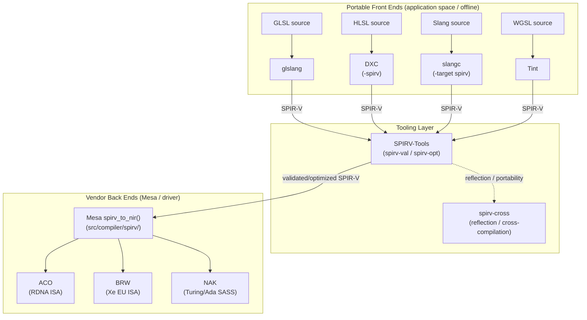
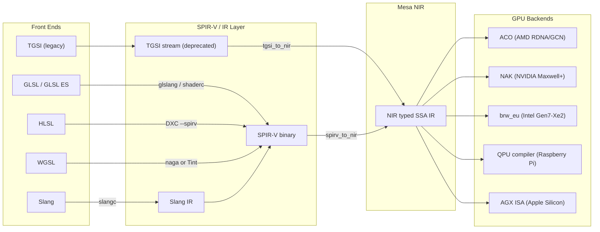
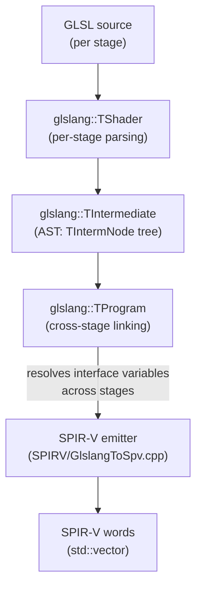
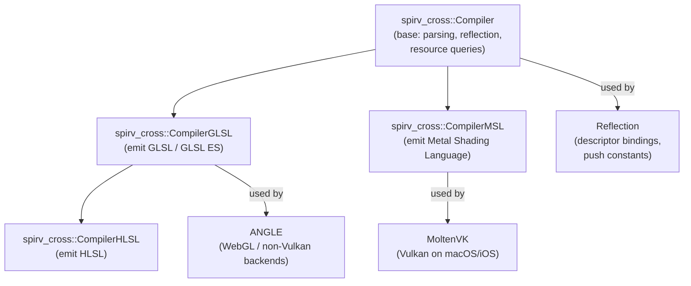
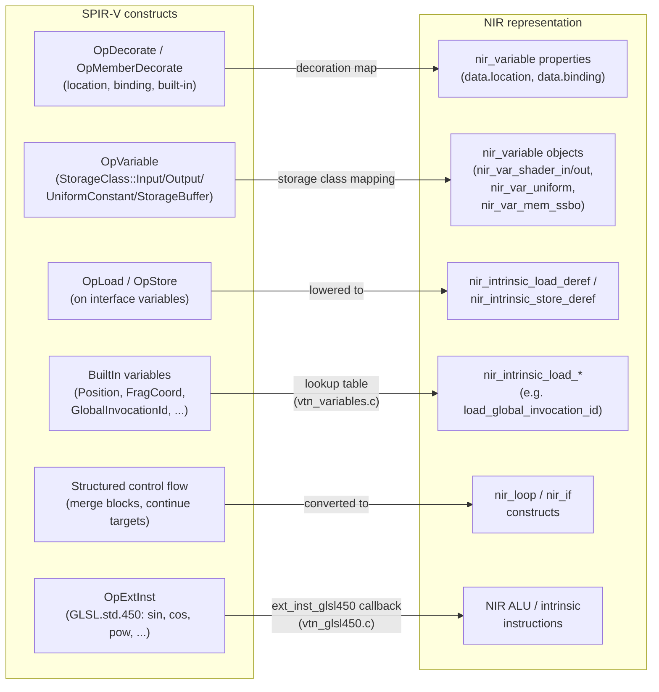
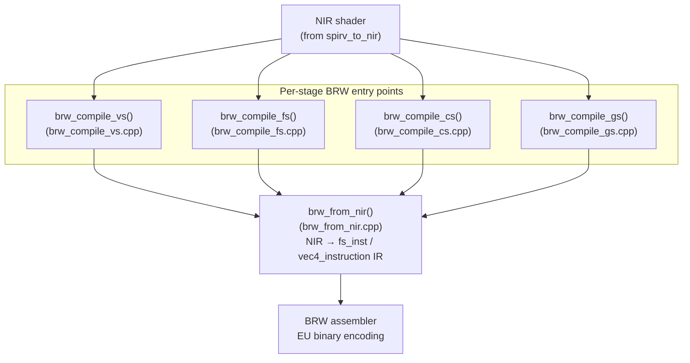
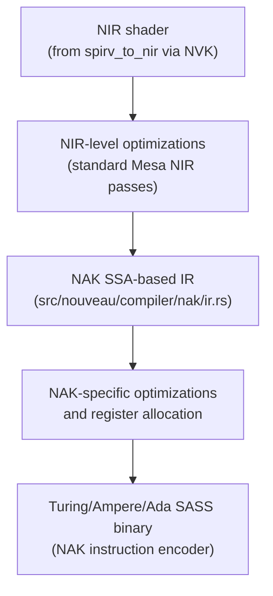
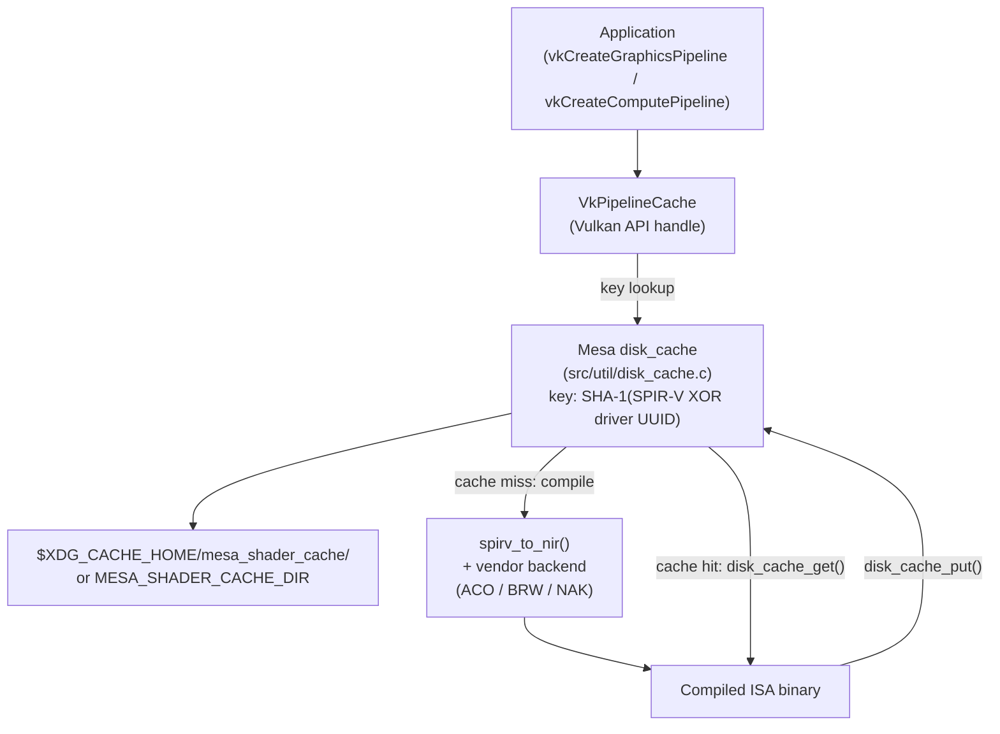

# Chapter 77: Shader Source-to-ISA: The Complete Compilation Toolchain

> **Part**: Part IV — Mesa Architecture (addition)
> **Audience**: Systems and driver developers who need to understand the end-to-end shader compilation pipeline; graphics application developers choosing between glslang, DXC, and offline pre-compilation strategies; browser and gaming-layer engineers dealing with HLSL-to-SPIR-V in DXVK and vkd3d-Proton; anyone debugging shader-quality regressions or integrating Fossilize-based cache warming.
> **Status**: First draft — 2026-06-17

## Table of Contents

- [Overview](#overview)
- [1. The Compilation Landscape](#1-the-compilation-landscape)
- [2. glslang: Reference GLSL→SPIR-V Compiler](#2-glslang-reference-glslspir-v-compiler)
- [3. DXC — DirectX Shader Compiler (HLSL→SPIR-V)](#3-dxc--directx-shader-compiler-hlslspir-v)
- [3.5 GLSL or HLSL for Vulkan? Making the Choice](#35-glsl-or-hlsl-for-vulkan-making-the-choice)
- [4. SPIRV-Tools: Optimizer and Validator](#4-spirv-tools-optimizer-and-validator)
- [5. spirv-cross: Cross-Compilation and Reflection](#5-spirv-cross-cross-compilation-and-reflection)
- [6. Mesa's SPIR-V→NIR Translation](#6-mesas-spir-vnir-translation)
- [7. Per-Vendor ISA Backends](#7-per-vendor-isa-backends)
- [8. The Shader Cache](#8-the-shader-cache)
- [9. Shader-db and Regression Testing](#9-shader-db-and-regression-testing)
- [10. Slang: NVIDIA's Differentiable Shading Language](#10-slang-nvidias-differentiable-shading-language)
- [Integrations](#integrations)
- [References](#references)

---

## Overview

- **glslang** — Khronos reference GLSL→SPIR-V compiler; exposes a `glslangValidator` CLI and a C++ runtime API (`glslang::TShader` / `GlslangToSpv()`); HLSL front end deprecated April 2026 — use DXC for HLSL.
- **DXC** — LLVM-based HLSL→SPIR-V (and DXIL) compiler; the sole correct choice for SM 6.x wave intrinsics, mesh shaders, and DXR; used by DXVK and vkd3d-Proton at runtime via `IDxcCompiler3`.
- **shaderc** — build-system integration wrapper around glslang (and DXC for HLSL); not a replacement for either compiler's native API.
- **SPIRV-Tools** (`spirv-val` / `spirv-opt`) — Khronos SPIR-V validator and optimizer; Mesa uses it to validate ingested SPIR-V and to legalize HLSL-originated SPIR-V before `spirv_to_nir()`.
- **spirv-cross** — SPIR-V *decompiler* (the reverse of glslang/DXC); emits GLSL, HLSL, or MSL; used by MoltenVK (SPIR-V→Metal) and ANGLE; not a substitute for a front-end compiler.
- **`spirv_to_nir()`** — Mesa's SPIR-V→NIR translator; the single driver-facing entry point for all Vulkan shaders, regardless of source language or front-end tool.
- **ACO** (AMD) — custom 12-stage NIR→RDNA/GCN ISA compiler bypassing LLVM; used by RADV; lower per-compile overhead and better divergence analysis than the LLVM AMDGPU backend.
- **BRW** (Intel) — NIR→Intel EU ISA compiler used by ANV and iris; being superseded by the Rust-based Jay compiler on Xe-class hardware.
- **NAK** (NVIDIA) — Rust-written NIR→Turing/Ada/Blackwell SASS compiler for NVK; emits SASS directly without going through PTX.
- **Mesa `disk_cache` + `VkPipelineCache`** — SHA-1-keyed ISA binary store; layered beneath Fossilize for offline Steam pre-compilation to eliminate first-play stutter.
- **shader-db** — real-world shader regression suite; CI-integrated on bare metal to prevent instruction-count regressions in ACO, BRW, and NAK.
- **Slang** — HLSL superset with a module system and automatic differentiation; `slangc` emits SPIR-V, DXIL, GLSL, CUDA, and Metal; used by NVIDIA RTX Kit for neural/differentiable rendering.

A shader written in **GLSL** or **HLSL** by an application developer travels through a surprisingly long chain of compilers, validators, linkers, and code generators before it becomes the binary that the GPU actually executes. No single compiler performs all of this work. Instead, the industry has settled on a layered model in which each compiler stage has a well-defined input and output contract, making it possible to swap components, add optimization layers, and share infrastructure across GPU vendors. Section 1 maps this landscape and explains why the split between portable front ends and vendor back ends — separated by the **SPIR-V** binary **IR** — is the right design.

The source-language front ends are covered in Sections 2 and 3. **glslang** is the **Khronos** reference implementation for **GLSL**-to-**SPIR-V** compilation. It exposes both the **`glslangValidator`** command-line tool for offline shader compilation and a **C++** library **API** (via **`glslang::TShader`**, **`glslang::TProgram`**, and **`glslang::GlslangToSpv()`**) for runtime compilation inside Vulkan engines. Its **HLSL** support covers **Shader Model 5** but lacks **Shader Model 6.x** features such as wave intrinsics, mesh shaders, and **DXR** ray-tracing. For production **HLSL**, **DXC** (the **DirectX Shader Compiler**, forked from **LLVM**/**Clang**) is the correct choice: it emits both **DXIL** (for **Direct3D 12**) and **SPIR-V** via its **`-spirv`** flag. DXC exposes the **`IDxcCompiler3`** **COM** interface for runtime compilation, which is used by translation layers such as **DXVK** and **vkd3d-Proton** to compile game **HLSL** shaders into **SPIR-V** at launch.

Section 4 covers **SPIRV-Tools**, the **Khronos** reference tooling suite for **SPIR-V** assembly, disassembly, validation, and optimization. The **`spirv-val`** validator checks modules against the full **SPIR-V** specification — verifying **SSA** dominance, capability declarations, and control-flow structure — via the **`spvValidateBinary()`** **C API**. The **`spirv-opt`** optimizer applies configurable passes including dead-code elimination (**ADCE**), constant propagation (**CCP**), scalar replacement, loop unrolling, loop fusion, loop fission, and inlining. **Mesa** links **SPIRV-Tools** to validate **SPIR-V** on ingestion (controlled by **`MESA_DEBUG=spirv_val`** and **`MESA_SPIRV_DUMP_PATH`**) and to legalize **HLSL**-compiled **SPIR-V** before passing it to **`spirv_to_nir()`**.

Section 5 covers **spirv-cross**, which performs the inverse of **glslang** and **DXC**: it takes **SPIR-V** as input and emits **GLSL**, **HLSL**, or **Metal Shading Language** (**MSL**). Its class hierarchy — **`spirv_cross::Compiler`** (base), **`spirv_cross::CompilerGLSL`**, **`spirv_cross::CompilerHLSL`**, and **`spirv_cross::CompilerMSL`** — covers all major cross-compilation targets. The **`ShaderResources`** reflection API extracts descriptor binding layouts, push constant offsets, and interface variable names from **SPIR-V** without source-language emission. **MoltenVK** uses **`CompilerMSL`** to translate **Vulkan** **SPIR-V** to **Metal** for **macOS**/**iOS**; **ANGLE** uses it on non-**Vulkan** backends, with integration living in **`src/compiler/translator/spirv/`**.

The centerpiece of the second half is **Mesa**'s **SPIR-V**-to-**NIR** translator (Section 6), whose primary entry point is **`spirv_to_nir()`** in **`src/compiler/spirv/`**. The **`spirv_to_nir_options`** struct lets each driver advertise its hardware capability bits (ray query, mesh shading, fragment shader pixel interlock, and many more), controlling which **SPIR-V** capabilities are legal and how they are lowered. Key translation mechanisms include: decoration handling (**`OpDecorate`**/**`OpMemberDecorate`** → **`nir_variable`** properties); **`OpVariable`** storage-class mapping (**`StorageClass::Input`**/**`Output`** → **`nir_var_shader_in`**/**`nir_var_shader_out`**; **`StorageClass::StorageBuffer`** → **`nir_var_mem_ssbo`**); **`OpLoad`**/**`OpStore`** lowering to **`nir_intrinsic_load_deref`**/**`nir_intrinsic_store_deref`**; built-in variable mapping via a lookup table in **`vtn_variables.c`** (e.g., **`BuiltIn GlobalInvocationId`** → **`nir_intrinsic_load_global_invocation_id`**); structured control-flow conversion to **`nir_loop`**/**`nir_if`**; and **`OpExtInst`** handling for **`GLSL.std.450`** via **`vtn_glsl450.c`**.

Section 7 covers the three main per-vendor **ISA** back ends. **ACO** (**AMD Compiler Optimizer**), used by **RADV**, is a custom twelve-stage pipeline — instruction selection, value numbering, optimization, reduction temporaries, live-variable analysis, spilling, instruction scheduling, register allocation, **SSA** elimination, hardware lowering, wait-state insertion (**`s_waitcnt`**), and assembly emission — that targets **GCN** and **RDNA** **ISA** without going through **LLVM**. **BRW** (the Intel **EU** compiler), used by **ANV** and **iris**, exposes per-stage entry points **`brw_compile_vs()`**, **`brw_compile_fs()`**, **`brw_compile_cs()`**, and **`brw_compile_gs()`**, and lowers **NIR** to **`fs_inst`**/**`vec4_instruction`** **IR** via **`brw_from_nir()`**, with Intel-specific concerns including predicated execution (**`BRW_OPCODE_IF`**/**`BRW_OPCODE_ENDIF`**), **SEND** messages for memory and texturing, and register regioning. **NAK** (**Nouveau Accelerated Kompiler**), used by **NVK**, is the first **Rust**-based **GPU** compiler back end in **Mesa**: it targets **NVIDIA** **Turing** (**SM75**) and newer (**Ampere**, **Ada**, **Blackwell**), emitting **SASS** (**Streaming ASSembler**) directly (bypassing **PTX**) using reverse-engineered encodings from the **Envytools** project; its **Rust** static library integrates via **`cbindgen`**-generated **C** headers.

Section 8 covers the shader cache. **Mesa**'s **`disk_cache`** **API** (**`src/util/disk_cache.c`**) stores compiled **ISA** binaries keyed by a **SHA-1** hash of **SPIR-V** XOR'd with a driver **UUID**. Cache storage follows the **XDG** Base Directory Specification (default: **`$XDG_CACHE_HOME/mesa_shader_cache/`**), with the path overridable via **`MESA_SHADER_CACHE_DIR`** and the cache disableable via **`MESA_SHADER_CACHE_DISABLE=1`**. At the **Vulkan** **API** level, **`VkPipelineCache`** is the application-visible handle; drivers implement it on top of **`disk_cache`**, consulting it during **`vkCreateGraphicsPipeline()`** and **`vkCreateComputePipeline()`**. **Fossilize** (Valve) extends this by serializing the complete set of **Vulkan** state objects — **`VkShaderModule`**, **`VkDescriptorSetLayout`**, **`VkPipelineLayout`**, **`VkRenderPass`**, **`VkSampler`**, **`VkPipeline`** — into **`.foz`** archives that **Steam** distributes for offline pre-compilation via **`fossilize-replay`**; the **`VK_LAYER_fossilize`** capture layer intercepts **`vkCreate*`** calls to record shader state from running games.

Section 9 covers **shader-db**, a collection of real-world **GLSL** and **SPIR-V** shaders used for regression testing **Mesa** compiler back ends. Supported drivers include **Intel i965**/**ANV**, **AMD radeonsi**/**RADV**, **freedreno** (**Qualcomm Adreno**), and **v3d** (**Broadcom VideoCore VI**). Post-compile statistics — instruction count, peak **VGPR**/**SGPR** usage, code size — are compared against a baseline using **`si-report.py`** (for **RDNA**/**GCN**) and **`anv-report-fossil.py`** (for **ANV** Fossil captures). **Mesa**'s **GitLab CI** runs shader-db automatically on every merge request touching the shader compilers, with jobs labeled **`shader-db:radv`** and **`shader-db:anv`** executing on bare-metal hardware.

Section 10 introduces **Slang**, **NVIDIA Research**'s open-source shading language. **Slang** is a superset of **HLSL** with a module system (`.slang` files with explicit `import` statements), pre-checked generics and interfaces, and automatic differentiation via **`[ForwardDifferentiable]`** and **`[BackwardDifferentiable]`** annotations. The **`slangc`** compiler emits **SPIR-V**, **DXIL**, **HLSL**, **GLSL**, **CUDA C++**, and **Metal**. **Slang** is used in production by **NVIDIA**'s **RTX Kit** (for **NeuralVDB**, **NRC** — Neural Radiance Cache — and related **RTX** effects), by the **Falcor** real-time rendering research framework, and by **slangtorch** (a **Python**/**PyTorch** binding for **GPU** shader-backed loss functions). From **Mesa**'s perspective, **Slang**-compiled **SPIR-V** is indistinguishable from **glslang** or **DXC** output and flows through **`spirv_to_nir()`** via the standard **Vulkan** pipeline creation path.

---

## 1. The Compilation Landscape

### 1.1 Why Multiple Compilers?

The GPU shading pipeline is unusual among software compilation domains in that no single organization owns the entire toolchain. Source languages (GLSL, HLSL, Slang, WGSL), GPU ISAs (RDNA, Xe, Blackwell, Apple AGX), and runtime APIs (Vulkan, OpenGL, Metal, D3D12) are all governed by different entities — Khronos, Microsoft, AMD, Intel, NVIDIA, Apple — under different licensing terms. A monolithic source-to-ISA compiler would need to embed proprietary GPU documentation, carry legally sensitive hardware details, and be updated simultaneously by every stakeholder. SPIR-V solves this by defining a stable, open, binary IR that sits at the boundary between the application ecosystem and the GPU driver.

The result is a two-stage model:

1. **Portable front end** (glslang, DXC, Slang, Tint): converts source language to SPIR-V. This stage can run entirely in application space, offline, or in a shader compilation service. The output is portable: any Vulkan implementation can consume it.
2. **Vendor back end** (Mesa NIR + ACO/BRW/NAK, proprietary drivers): converts SPIR-V to machine code for a specific GPU. This stage may happen at draw time, at pipeline-creation time, or — with caching — only once per {SPIR-V, hardware, driver version} triple.

The additional tooling layer between them — SPIRV-Tools for validation/optimization, spirv-cross for reflection and portability — fills practical gaps: drivers may reject invalid SPIR-V that front ends accidentally emit; applications may need to inspect descriptor bindings at runtime; non-Vulkan platforms (Metal, D3D11) need the SPIR-V translated back to their own shading languages.



The front-end compiler landscape has grown substantially beyond the original Khronos reference tools. Each compiler occupies a distinct niche defined by its source language(s), optimization depth, and licensing constraints. The table below summarises the five compilers that application and engine developers encounter most frequently when targeting Vulkan or other GPU APIs on Linux.

| **Tool** | **Source language(s)** | **Primary output** | **Optimisation tier** | **Differentiable shading** | **Licence** | **Primary use case** |
|---|---|---|---|---|---|---|
| glslang | GLSL, GLSL ES | SPIR-V | Minimal (reference) | No | BSD | Reference compiler; Vulkan validation layer |
| DXC (DirectX Shader Compiler) | HLSL | SPIR-V, DXBC, DXIL | Full (LLVM-based) | No | MIT/LLVM | Porting HLSL shaders to Vulkan; used by VKD3D-Proton |
| shaderc | GLSL, HLSL (via glslang/DXC) | SPIR-V | Passes through glslang/DXC | No | Apache 2.0 | Build-system integration; Vulkan SDK |
| Slang | Slang (HLSL superset) | SPIR-V, HLSL, GLSL, WGSL, CUDA, Metal | Full (Slang IR) | Yes (automatic differentiation) | Apache 2.0 | ML shaders, research, multi-backend deployment |
| naga (wgpu/Firefox) | WGSL, GLSL, SPIR-V (import) | SPIR-V, WGSL, GLSL, MSL, HLSL | Moderate (Rust-native) | No | MIT/Apache 2.0 | Firefox WebGPU (wgpu-core); Bevy engine |

> **shaderc vs. glslang C++ API**: shaderc (`libshaderc`) is a thin build-system wrapper around glslang (for GLSL) and optionally DXC (for HLSL). It does not add optimisation or validation beyond what those underlying tools provide; it simply bundles them behind a stable C API suitable for CMake `find_package` integration. If you are using glslang's C++ runtime API (`glslang::TShader`, `GlslangToSpv()`) in an engine, adding shaderc as well is redundant — use one or the other. shaderc's primary advantage is that it is versioned alongside the Vulkan SDK, giving a single dependency that tracks Khronos releases.
>
> **Slang vs. DXC for HLSL→SPIR-V**: Both Slang (`slangc -target spirv`) and DXC (`dxc -spirv`) accept HLSL and emit SPIR-V — they are genuinely competing tools for the same source language. Choose DXC when you need SM 6.x features (wave intrinsics, DXR, SM 6.6 atomics) without Slang's additional abstractions; choose Slang when you want its module system, pre-checked generics, or automatic differentiation. Using both in the same shader library for plain HLSL sources is unnecessary duplication — pick one HLSL→SPIR-V path and standardise on it.

### 1.2 End-to-End Compilation Paths

Despite the variety of front-end tools, all practical compilation paths converge on two landmarks before reaching a GPU: **SPIR-V** as the portable binary IR that crosses the application/driver boundary, and **Mesa NIR** as the typed SSA IR that every Mesa driver backend consumes. The TGSI path (used by older Gallium-based drivers) is a historical exception that is being removed driver-by-driver and is treated here for completeness only.



The table below maps each source language to its front-end tool, whether it transits SPIR-V, its NIR entry point, the primary backend it targets, and its typical use case:

| **Source** | **Front-end tool** | **SPIR-V?** | **NIR entry point** | **Backend** | **Primary use case** |
|---|---|---|---|---|---|
| GLSL / GLSL ES | glslang, shaderc | Yes | `spirv_to_nir()` | ACO, BRW, NAK, QPU | OpenGL/Vulkan application shaders |
| HLSL | DXC (`--spirv`) | Yes | `spirv_to_nir()` | ACO, BRW, NAK | DXVK, vkd3d-Proton, game porting |
| WGSL | naga (wgpu/Firefox) or Tint (Chrome/Dawn) | Yes | `spirv_to_nir()` | ACO, BRW, NAK | WebGPU in Firefox and Chrome |
| Slang | slangc → Slang IR → SPIR-V | Yes (via Slang IR) | `spirv_to_nir()` | ACO, BRW, NAK | ML/research shaders, Falcor, RTX Kit |
| TGSI | Mesa Gallium state tracker | No (TGSI stream) | `tgsi_to_nir()` | ACO, BRW (legacy), QPU | Legacy OpenGL on older Gallium drivers |

> **Note on TGSI deprecation.** The TGSI (Tungsten Graphics Shader Infrastructure) path is actively being removed from Mesa. Most drivers have already migrated: `radeonsi` completed the transition in Mesa 23.x, `iris` never used TGSI, and `v3d` (Raspberry Pi) transitioned in Mesa 24.x. New drivers (NVK, Asahi AGX) were written exclusively against NIR. The `tgsi_to_nir()` bridge in `src/gallium/auxiliary/tgsi/tgsi_to_nir.c` exists solely for the remaining in-flight transitions. All modern workloads — Vulkan, WebGPU, and post-transition OpenGL — converge on NIR before reaching any GPU backend.

### 1.3 The Full Pipeline

```
GLSL ──► glslang ──────────────────────►┐
HLSL ──► DXC (with -spirv) ────────────►┤  SPIR-V binary
Slang ─► slangc ──────────────────────►┤
WGSL ──► Tint ─────────────────────────►┘
                                         │
                        ┌────────────────▼────────────────┐
                        │  SPIRV-Tools (spirv-opt, -val)  │
                        └────────────────┬────────────────┘
                                         │ validated/optimized SPIR-V
                                         │
                            ┌────────────▼────────────┐
                            │  Mesa spirv_to_nir()    │  (src/compiler/spirv/)
                            └────────────┬────────────┘
                                         │ NIR shader
                                         │
                    ┌────────────────────┼────────────────────┐
                    ▼                    ▼                    ▼
              ACO (AMD)          BRW (Intel)          NAK (NVIDIA)
                    │                    │                    │
              RDNA ISA binary    Xe EU binary       Turing/Ada ISA binary
```

Portability is achieved at the SPIR-V boundary. Optimization can happen at every layer: glslang/DXC eliminate dead code before emitting SPIR-V; spirv-opt applies cross-vendor passes; each vendor backend runs its own target-specific optimizations.

---

## 2. glslang: Reference GLSL→SPIR-V Compiler

### 2.1 Architecture

glslang is the Khronos reference implementation for GLSL (and partial HLSL) parsing and SPIR-V code generation. [Source](https://github.com/KhronosGroup/glslang). It contains:

- **Front-end parser**: a hand-written recursive-descent parser for GLSL (all OpenGL and Vulkan versions) and a partial HLSL parser
- **AST (Abstract Syntax Tree)**: represented by `glslang::TIntermediate`, a tree of `TIntermNode` objects
- **SPIR-V emitter**: in `SPIRV/GlslangToSpv.cpp`, walks the `TIntermediate` AST and emits SPIR-V words into a `std::vector<uint32_t>`

The split between the `TShader` object (per-stage parsing) and the `TProgram` object (cross-stage linking) mirrors the GLSL pipeline: each stage can be parsed independently, but the linker resolves interface variables across stages and validates that outputs from one stage match inputs of the next before SPIR-V is generated.



### 2.2 glslangValidator Command-Line Tool

For offline compilation, glslang ships the `glslangValidator` binary (also aliased as `glslang` in recent SDK releases). File extensions determine the shader stage automatically:

```bash
# Compile a vertex shader to SPIR-V for Vulkan (SPIR-V 1.5, Vulkan 1.2)
glslangValidator -V -o triangle.vert.spv --target-env vulkan1.2 triangle.vert

# Generate human-readable SPIR-V assembly alongside binary
glslangValidator -V -H -o main.comp.spv main.comp

# Compile HLSL (partial support — prefer DXC for production HLSL)
glslangValidator -D -e main -S vert -o out.spv input.hlsl
```

Key flags:
- `-V` — target Vulkan SPIR-V (as opposed to OpenGL SPIR-V)
- `--target-env vulkan1.3` — set the Vulkan environment version and minimum SPIR-V level
- `-G` — target OpenGL SPIR-V (differs in built-in decoration conventions)
- `-H` — print human-readable SPIR-V alongside binary

### 2.3 C++ API for Runtime Compilation

For Vulkan engines that compile shaders at startup or hot-reload them during development, glslang exposes a C++ API from `<glslang/Public/ShaderLang.h>` and `<glslang/SPIRV/GlslangToSpv.h>`:

```cpp
// src: inline example based on glslang public API
// Refs: https://github.com/KhronosGroup/glslang
//       https://www.andrewhuang.llc/vulkan/integrating-glslang-for-runtime-shader-compilation/

#include <glslang/Public/ShaderLang.h>
#include <glslang/Public/ResourceLimits.h>
#include <glslang/SPIRV/GlslangToSpv.h>
#include <vector>

// Must be called exactly once per process
void InitGlslang() { glslang::InitializeProcess(); }
void FinalizeGlslang() { glslang::FinalizeProcess(); }

std::vector<uint32_t> CompileGLSLToSPIRV(const char* source,
                                          EShLanguage stage) {
    glslang::TShader shader(stage);
    shader.setStrings(&source, 1);

    // Environment: Vulkan 1.3, SPIR-V 1.6
    shader.setEnvInput(glslang::EShSourceGlsl, stage,
                       glslang::EShClientVulkan, 100);
    shader.setEnvClient(glslang::EShClientVulkan,
                        glslang::EShTargetVulkan_1_3);
    shader.setEnvTarget(glslang::EShTargetSpv,
                        glslang::EShTargetSpv_1_6);

    if (!shader.parse(GetDefaultResources(), 460, false, EShMsgDefault)) {
        throw std::runtime_error(shader.getInfoLog());
    }

    glslang::TProgram program;
    program.addShader(&shader);
    if (!program.link(EShMsgDefault)) {
        throw std::runtime_error(program.getInfoLog());
    }

    std::vector<uint32_t> spirv;
    glslang::SpvOptions options;
    options.generateDebugInfo = false;
    options.optimizeSize      = false;
    glslang::GlslangToSpv(*program.getIntermediate(stage), spirv, &options);
    return spirv;
}
```

`GetDefaultResources()` returns a `TBuiltInResource` struct populated with conservative GPU limits; applications can supply tighter limits to reduce the search space for the validator.

### 2.4 Limitations vs. DXC for HLSL

glslang's HLSL support is partial. It handles Shader Model 5 reasonably well, but lacks support for:

- **Shader Model 6.x features**: wave intrinsics, mesh/amplification shaders, raytracing (DXR), HLSL 2021 generics
- **Complex HLSL templates and preprocessor idioms** used in production engines like Unreal Engine
- **Accurate DXIL semantics**: glslang's HLSL path targets GLSL semantics, not DXIL, leading to subtle behavioral differences

For production HLSL (games running through DXVK or vkd3d-Proton), DXC is the only correct choice.

---

## 3. DXC — DirectX Shader Compiler (HLSL→SPIR-V)

### 3.1 Overview

The DirectX Shader Compiler (DXC) is Microsoft's open-source HLSL compiler, forked from LLVM and Clang. [Source](https://github.com/microsoft/DirectXShaderCompiler). Its native output is DXIL — a LLVM bitcode dialect consumed by Direct3D 12 — but it also includes a full SPIR-V code generation backend, maintained jointly by Microsoft, Google, and the community, enabling HLSL shaders to run on Vulkan.

The SPIR-V backend in DXC is documented at [SPIR-V CodeGen wiki page](https://github.com/microsoft/DirectXShaderCompiler/wiki/SPIR-V-CodeGen) and lives in `tools/clang/lib/CodeGen/CGHLSLMSFinishCodeGen.cpp` and `lib/SPIRV/`. The code path converts the LLVM IR produced by Clang's HLSL frontend into SPIR-V using a custom LLVM-to-SPIR-V translation layer.

### 3.2 Command-Line Usage

```bash
# Compile a vertex shader (HLSL SM 6.0) to SPIR-V
dxc -spirv -T vs_6_0 -E VSMain triangle.hlsl -Fo triangle.vert.spv

# Compile a compute shader (HLSL SM 6.6) to SPIR-V
dxc -spirv -T cs_6_6 -E CSMain compute.hlsl -Fo compute.comp.spv

# Ray-tracing library shader (SM 6.3+)
dxc -spirv -T lib_6_3 raytrace.hlsl -Fo raytrace.spv \
    -fspv-extension=SPV_KHR_ray_tracing

# Enable scalar block layout (required by many Vulkan drivers for UBO/SSBO)
dxc -spirv -T ps_6_0 -E PSMain pixel.hlsl -Fo pixel.frag.spv \
    -fvk-use-scalar-layout
```

Key `-fvk-*` flags extend SPIR-V output with Vulkan-specific mapping:
- `-fvk-use-scalar-layout` — use scalar layout for UBOs and SSBOs (matches `VK_EXT_scalar_block_layout`)
- `-fvk-b-shift <n> <set>` — shift `b` register bindings by `n` in descriptor set `<set>`
- `-fspv-extension=<ext>` — emit optional SPIR-V extensions

### 3.3 IDxcCompiler3 Runtime API

For runtime compilation — used by DXVK and vkd3d-Proton to compile game shaders at launch — the C++ `IDxcCompiler3` COM interface provides programmatic access:

```cpp
// Runtime compilation via IDxcCompiler3
// Ref: https://github.com/microsoft/DirectXShaderCompiler (include/dxc/dxcapi.h)
// Simplified; error handling omitted for clarity.

#include <dxc/dxcapi.h>
#include <wrl/client.h>

Microsoft::WRL::ComPtr<IDxcUtils>     utils;
Microsoft::WRL::ComPtr<IDxcCompiler3> compiler;
DxcCreateInstance(CLSID_DxcUtils,     IID_PPV_ARGS(&utils));
DxcCreateInstance(CLSID_DxcCompiler3, IID_PPV_ARGS(&compiler));

// Load HLSL source
Microsoft::WRL::ComPtr<IDxcBlobEncoding> source;
utils->LoadFile(L"shader.hlsl", nullptr, &source);

DxcBuffer sourceBuffer = {
    .Ptr      = source->GetBufferPointer(),
    .Size     = source->GetBufferSize(),
    .Encoding = DXC_CP_ACP,
};

// Arguments: target profile, entry point, Vulkan SPIR-V output
LPCWSTR args[] = {
    L"shader.hlsl",
    L"-E", L"main",
    L"-T", L"cs_6_6",
    L"-spirv",
    L"-fvk-use-scalar-layout",
};

Microsoft::WRL::ComPtr<IDxcResult> result;
compiler->Compile(&sourceBuffer, args, ARRAYSIZE(args),
                  nullptr, IID_PPV_ARGS(&result));

// Extract SPIR-V blob
Microsoft::WRL::ComPtr<IDxcBlob> spirvBlob;
result->GetResult(&spirvBlob);

// spirvBlob->GetBufferPointer() / GetBufferSize() give the SPIR-V words
VkShaderModuleCreateInfo smci = {
    .sType    = VK_STRUCTURE_TYPE_SHADER_MODULE_CREATE_INFO,
    .codeSize = spirvBlob->GetBufferSize(),
    .pCode    = (uint32_t*)spirvBlob->GetBufferPointer(),
};
```

### 3.4 How DXVK and vkd3d-Proton Use DXC

DXVK translates Direct3D 9 and 11 HLSL to SPIR-V, but historically did so through its own built-in GLSL emitter. Since DXVK 2.0, DXVK has primarily used its internal SPIR-V code generation for D3D9/11. vkd3d-Proton, the D3D12 layer used in Proton (Valve's Wine-based compatibility layer), uses DXC as an external library for compiling D3D12 HLSL shaders (DXIL → SPIR-V path): vkd3d-Proton also implements its own DXIL-to-SPIR-V converter called `vkd3d-shader`, which translates DXIL bitcode directly without recompiling HLSL. Both approaches share the same `-spirv` output destination.

---

## 3.5 GLSL or HLSL for Vulkan? Making the Choice

Both GLSL (via glslang/shaderc) and HLSL (via DXC) compile to SPIR-V and are fully supported by Mesa's `spirv_to_nir()` translator. From the driver's perspective the two are equivalent: the same ACO, BRW, and NAK backends consume the resulting SPIR-V without distinguishing its origin. The choice is therefore made entirely at the application-developer level, driven by toolchain maturity, language ergonomics, team background, and specific feature requirements.

### 3.5.1 Feature Coverage Matrix

| Feature | GLSL 4.60 (glslang) | HLSL SM 6.6 (DXC) |
|---|---|---|
| Vulkan push constants | `layout(push_constant)` | `[[vk::push_constant]]` |
| Specialization constants | `layout(constant_id=N)` | `[[vk::constant_id(N)]]` |
| Descriptor set + binding | `layout(set=S, binding=B)` | `[[vk::binding(B,S)]]` |
| Wave/subgroup intrinsics | `subgroupBallot()` etc. (GLSL_EXT_shader_subgroup_basic) | `WaveActiveBallot()` etc. (SM 6.0+) |
| Mesh + amplification shaders | `GL_EXT_mesh_shader` | `ms_6_5` / `as_6_5` target profiles |
| Ray tracing (DXR/GLSL RT) | `GL_EXT_ray_tracing` | `lib_6_3` target with DXR intrinsics |
| Cooperative matrix (MMA) | `GL_KHR_cooperative_matrix` | `[[vk::ext_extension(...)]]` + manual SPIR-V decoration |
| Integer 64-bit atomics | `GL_EXT_shader_atomic_int64` | `InterlockedAdd64` (SM 6.6) |
| HLSL 2021 generics / templates | Not applicable | Native |
| Module system | `#include` only | `#include` only (Slang adds modules) |
| `printf` debugging | `debugPrintfEXT` (VK_EXT_debug_printf) | `printf` (DXC maps to same extension) |
| Scalar block layout | `scalar` qualifier (GL_EXT_scalar_block_layout) | `-fvk-use-scalar-layout` flag |
| Row-major matrices | Column-major default; `row_major` qualifier | Row-major **default**; `column_major` qualifier |
| Half-precision (`float16`) | `float16_t` (GL_EXT_shader_explicit_arithmetic_types) | `half` / `min16float` (SM 6.2+) |
| Toolchain status (2026) | Maintained; HLSL front end **deprecated** April 2026 | Actively developed; SM 6.7 in progress |

### 3.5.2 Language Syntax Comparison — Vulkan Compute Shader

The same compute shader written in both languages illustrates the mapping between concepts:

```glsl
// GLSL — image convolution kernel
// File: convolution.comp  (compiled with: glslangValidator -V --target-env vulkan1.3)
#version 460
#extension GL_KHR_shader_subgroup_basic : require

layout(local_size_x = 8, local_size_y = 8) in;

layout(push_constant) uniform Params {
    uint  width;
    uint  height;
    float scale;
} params;

layout(set = 0, binding = 0, rgba8) uniform readonly  image2D srcImage;
layout(set = 0, binding = 1, rgba8) uniform writeonly image2D dstImage;

void main() {
    ivec2 coord = ivec2(gl_GlobalInvocationID.xy);
    if (coord.x >= int(params.width) || coord.y >= int(params.height)) return;

    vec4 accum = vec4(0.0);
    for (int dy = -1; dy <= 1; dy++) {
        for (int dx = -1; dx <= 1; dx++) {
            accum += imageLoad(srcImage, coord + ivec2(dx, dy));
        }
    }
    imageStore(dstImage, coord, accum * (params.scale / 9.0));
}
```

```hlsl
// HLSL — equivalent convolution kernel
// File: convolution.hlsl  (compiled with: dxc -spirv -T cs_6_6 -E CSMain)

[[vk::push_constant]]
struct Params {
    uint  width;
    uint  height;
    float scale;
} params;

[[vk::binding(0, 0)]] Texture2D<float4>   srcImage : register(t0);
[[vk::binding(1, 0)]] RWTexture2D<float4> dstImage : register(u1);

[numthreads(8, 8, 1)]
void CSMain(uint3 dispatchID : SV_DispatchThreadID) {
    uint2 coord = dispatchID.xy;
    if (coord.x >= params.width || coord.y >= params.height) return;

    float4 accum = float4(0, 0, 0, 0);
    for (int dy = -1; dy <= 1; dy++) {
        for (int dx = -1; dx <= 1; dx++) {
            accum += srcImage[int2(coord) + int2(dx, dy)];
        }
    }
    dstImage[coord] = accum * (params.scale / 9.0);
}
```

Key differences visible in the side-by-side:

- **Matrix default order**: GLSL is column-major throughout; HLSL is row-major by default. Any `mat4`/`float4x4` passed in a uniform buffer has opposite memory layout by default — mismatching this silently produces wrong transforms. Use `layout(row_major)` in GLSL or `-fvk-use-scalar-layout` / explicit `column_major` in HLSL to align them.
- **Resource binding syntax**: GLSL uses `layout(set=S, binding=B)` decorations; HLSL uses register slots (`t`, `u`, `b`, `s`) with optional `[[vk::binding(B,S)]]` annotations. Without the `[[vk::binding]]` annotation, DXC auto-assigns descriptor set 0, which may conflict with multi-set layouts.
- **Image vs. Texture types**: GLSL `image2D` and HLSL `RWTexture2D` map to the same `OpTypeImage` with `Dim=2D, Sampled=2`, but the GLSL form requires a format qualifier (`rgba8`); the HLSL form infers it from the template argument (`float4`).
- **Entry point naming**: GLSL entry points are always named `main`; HLSL supports arbitrary entry point names selected via `-E` at compile time.
- **`gl_GlobalInvocationID` vs. `SV_DispatchThreadID`**: These are equivalent built-ins, mapped to `BuiltIn GlobalInvocationId` in SPIR-V. Appendix Q §5 lists the full built-in mapping table.

### 3.5.3 Decision Guide

**Choose GLSL when:**

- Your project already uses a GLSL shader library (many open-source Vulkan demos, Sascha Willems samples, LearnOpenGL material are all GLSL).
- You are targeting OpenGL alongside Vulkan — GLSL is the only common source language between them.
- You want the smallest possible toolchain dependency: glslang ships in every major Linux distribution's package repositories (`apt install glslang-tools`).
- Your shaders are primarily graphics pipeline stages (vertex, fragment, geometry) where GLSL's `in`/`out` qualifier model is idiomatic.
- Your team has OpenGL background and wants familiar syntax.

**Choose HLSL (via DXC) when:**

- You are porting an existing Direct3D codebase (game, engine, rendering research) to Vulkan. Rewriting shaders to GLSL is often more work than switching the compile flag.
- You need **Shader Model 6.x features**: wave intrinsics (`WaveActiveBallot`, `WaveActiveMax`), mesh/amplification shaders, DXR ray tracing (`TraceRayInline`), Shader Model 6.6 integer 64-bit atomics, or Shader Model 6.7 helpers.
- You target **multiple APIs**: DXC can emit DXIL (D3D12), SPIR-V (Vulkan), and optionally GLSL/MSL (via spirv-cross downstream). One source compiles everywhere.
- Your team comes from a Direct3D background where HLSL syntax is familiar.
- You use **Slang** (Chapter 117): Slang is a strict superset of HLSL, so HLSL shaders compile through `slangc` unchanged, gaining Slang's module system and autodiff on top.

**Do not use glslang's HLSL frontend.** As of April 2026, the glslang HLSL parser is officially deprecated. It handled SM 5 only, with numerous known gaps in preprocessor behaviour and template semantics. Any HLSL source should go through DXC. [Source: KhronosGroup/glslang PR #3793](https://github.com/KhronosGroup/glslang/pull/3793)

**Consider Slang (§10) when:**

- You want a single source language that covers GLSL and HLSL features, adds a module system, and supports automatic differentiation for ML-adjacent rendering work.
- See Chapter 117 for Slang in depth.

### 3.5.4 Vulkan-Specific Gotchas

**Push constants**: In GLSL, each push constant block must be declared `layout(push_constant)`; only one push constant block is allowed per pipeline. In HLSL, `[[vk::push_constant]]` on any `struct` achieves the same, but DXC allows the annotation on a function parameter rather than a global, which can simplify API usage in modular shader code.

**Specialization constants**: GLSL uses `layout(constant_id=N) const T name = default_value;` at global scope. HLSL uses `[[vk::constant_id(N)]] const T name = default_value;`. Both lower to `OpSpecConstant` in SPIR-V, which `spirv_to_nir()` handles identically. [Source: SPIR-V spec §3.32.7, OpSpecConstant](https://registry.khronos.org/SPIR-V/specs/unified1/SPIRV.html)

**Descriptor indexing** (`VK_EXT_descriptor_indexing`, core in Vulkan 1.2): GLSL requires `#extension GL_EXT_nonuniform_qualifier : require` and the `nonuniformEXT()` qualifier on dynamically indexed arrays. HLSL simply indexes `Texture2D textures[] : register(t0, space0)` with an integer; DXC emits `NonUniform` decoration when the index is provably non-uniform. The GLSL path makes the non-uniformity explicit; the HLSL path is more concise but the compiler may miss cases where `NonUniform` is needed.

**Scalar block layout**: GLSL with `GL_EXT_scalar_block_layout` allows `layout(scalar, set=0, binding=0) buffer` blocks that pack struct members without std140/std430 alignment padding. The equivalent DXC flag is `-fvk-use-scalar-layout`. Mismatching layout rules between the application's C++ struct and the shader buffer definition is a common source of silent corruption; always verify with `spirv-cross --reflect` that offsets match.

```bash
# Verify GLSL buffer layout
glslangValidator -V --target-env vulkan1.3 shader.comp -o shader.spv
spirv-cross --reflect shader.spv | python3 -m json.tool | grep -A4 '"members"'

# Verify HLSL buffer layout compiled by DXC
dxc -spirv -T cs_6_6 -E main shader.hlsl -Fo shader.spv
spirv-cross --reflect shader.spv | python3 -m json.tool | grep -A4 '"members"'
```

---

## 4. SPIRV-Tools: Optimizer and Validator

### 4.1 Role in the Pipeline

SPIRV-Tools is the Khronos reference implementation for SPIR-V tooling: assembly, disassembly, validation, optimization, and fuzzing. [Source](https://github.com/KhronosGroup/SPIRV-Tools). Mesa links against SPIRV-Tools at compile time for validation during shader ingestion and for several optimization passes applied before the SPIR-V reaches `spirv_to_nir()`.

### 4.2 spirv-val: The Validator

`spirv-val` checks SPIR-V binary modules against the full specification, catching:

- Invalid capability declarations
- Mismatched type usage (e.g., passing a `vec4` where a `float` is expected)
- Violation of SSA dominance rules
- Incorrectly formed control flow (e.g., loops without merge blocks)
- Missing `OpDecorate` for built-in variables

```bash
# Validate a SPIR-V binary
spirv-val --target-env vulkan1.3 shader.spv

# Validate against Vulkan Memory Model
spirv-val --target-env vulkan1.3 --spirv-val-options="--before-hlsl-legalization" shader.spv
```

The C API exposes validation through `spvValidateBinary()`:

```c
// Ref: https://github.com/KhronosGroup/SPIRV-Tools (include/spirv-tools/libspirv.h)
spv_context ctx = spvContextCreate(SPV_ENV_VULKAN_1_3);
spv_diagnostic diag = nullptr;

spv_result_t result = spvValidateBinary(
    ctx,
    spirv_words,   /* uint32_t* */
    word_count,    /* size_t    */
    &diag
);
if (result != SPV_SUCCESS) {
    fprintf(stderr, "SPIR-V validation error: %s\n", diag->error);
    spvDiagnosticDestroy(diag);
}
spvContextDestroy(ctx);
```

### 4.3 spirv-opt: The Optimizer

`spirv-opt` applies a configurable sequence of optimization passes to a SPIR-V binary. Passes are organized into several families:

**Simplification passes:**
- `--eliminate-dead-code-aggressive` — aggressive dead code elimination (ADCE): removes instructions whose results are never consumed
- `--eliminate-dead-branches` — removes unreachable branch targets
- `--eliminate-dead-functions` — removes functions that are never called

**Constant folding and propagation:**
- `--scalar-replacement` — replaces aggregate variables with scalar components
- `--simplify-instructions` — constant folds arithmetic on known-constant operands
- `--ccp` — conditional constant propagation (sparse CCP algorithm)
- `--unify-const` — deduplicates identical constant definitions

**Loop transformations:**
- `--loop-unroll` — unrolls loops with statically-known iteration counts
- `--loop-unroll-partial` — partial unroll with a configurable factor
- `--loop-fission` — splits loops that touch multiple independent arrays (improves cache behavior)
- `--loop-fusion` — fuses adjacent loops over the same range (reduces loop overhead)
- `--loop-invariant-code-motion` — hoists loop-invariant computations

**Inlining:**
- `--inline-entry-points-exhaustive` — inlines all function calls reachable from entry points (required for legalization of HLSL shaders)

High-level optimization recipes:

```bash
# Performance-oriented optimization
spirv-opt -O shader.spv -o shader_opt.spv

# Size-oriented optimization (smaller SPIR-V, faster loading)
spirv-opt -Os shader.spv -o shader_small.spv

# Individual passes
spirv-opt --eliminate-dead-code-aggressive \
          --scalar-replacement \
          --ccp \
          --loop-unroll \
          shader.spv -o shader_optimized.spv
```

### 4.4 How Mesa Uses SPIRV-Tools

Mesa links SPIRV-Tools as a required dependency. The integration points are:

1. **`spirv_to_nir()`** calls SPIRV-Tools validation before translation when `MESA_DEBUG=spirv_val` is set or when `spirv_options::validate` is true.
2. **DXC HLSL legalization**: HLSL shaders compiled with DXC contain HLSL-specific SPIR-V idioms (memory model extensions, non-uniform control flow) that must be legalized using spirv-opt's `--inline-entry-points-exhaustive` and `--eliminate-dead-code-aggressive` passes before Mesa can consume them.
3. **`MESA_SPIRV_DUMP_PATH`**: when set, Mesa dumps the raw SPIR-V to disk before and after optimization, enabling engineers to run `spirv-dis` or `spirv-opt --print-all` on the exact binary that failed compilation.

---

## 5. spirv-cross: Cross-Compilation and Reflection

### 5.1 Purpose

spirv-cross performs the inverse of glslang/DXC: it takes SPIR-V binary as input and emits high-level shading code in GLSL, HLSL, Metal Shading Language (MSL), or C++ (for CPU-side reference). [Source](https://github.com/KhronosGroup/SPIRV-Cross). Its primary use cases are:

- **MoltenVK**: translates Vulkan SPIR-V to Metal Shading Language for macOS/iOS
- **ANGLE**: translates Vulkan SPIR-V back to GLSL ES for WebGL and non-Vulkan backends
- **Reflection**: extracting descriptor binding layouts, push constant offsets, and interface variable names from SPIR-V without running a full compiler

> **Direction note:** spirv-cross is a *decompiler*, not a compiler — its data flow runs opposite to glslang and DXC. It is not a substitute for either and is never part of the forward GLSL/HLSL→SPIR-V→GPU compilation chain on Linux. Its role is portability across non-Vulkan backends (Metal, GLSL ES) and offline reflection. Compiling GLSL to SPIR-V with glslang and then immediately decompiling back to GLSL with spirv-cross would be circular; the round-trip is lossy and exists only as an explicit portability step in tools like MoltenVK and ANGLE.

### 5.2 Compiler Classes

spirv-cross exposes a class hierarchy of compilers:

```
spirv_cross::Compiler         (base: parsing, reflection, resource queries)
├── spirv_cross::CompilerGLSL (emit GLSL / GLSL ES)
│   └── spirv_cross::CompilerHLSL  (emit HLSL from GLSL subclass)
└── spirv_cross::CompilerMSL  (emit Metal Shading Language)
```



### 5.3 Compilation Example (SPIR-V → GLSL ES)

```cpp
// Ref: https://github.com/KhronosGroup/SPIRV-Cross (README.md)
#include "spirv_glsl.hpp"

// spirv_binary: std::vector<uint32_t> from file or compilation
spirv_cross::CompilerGLSL glsl(std::move(spirv_binary));

// Set output options
spirv_cross::CompilerGLSL::Options opts;
opts.version = 310;   // GLSL ES 3.10
opts.es      = true;
glsl.set_common_options(opts);

// Emit GLSL source
std::string glsl_source = glsl.compile();
```

### 5.4 Reflection and ShaderResources

The reflection API retrieves binding metadata without performing any source-language emission:

```cpp
// Ref: https://github.com/KhronosGroup/SPIRV-Cross (README.md)
spirv_cross::CompilerGLSL glsl(std::move(spirv_binary));
spirv_cross::ShaderResources resources = glsl.get_shader_resources();

// Iterate sampled image bindings
for (auto& img : resources.sampled_images) {
    uint32_t set     = glsl.get_decoration(img.id,
                           spv::DecorationDescriptorSet);
    uint32_t binding = glsl.get_decoration(img.id,
                           spv::DecorationBinding);
    printf("Sampled image '%s': set=%u binding=%u\n",
           img.name.c_str(), set, binding);
}

// Inspect push constant block
for (auto& pc : resources.push_constant_buffers) {
    auto ranges = glsl.get_active_buffer_ranges(pc.id);
    for (auto& r : ranges)
        printf("  push constant range: offset=%zu size=%zu\n",
               r.offset, r.range);
}
```

`ShaderResources` exposes categorized resource vectors: `uniform_buffers`, `storage_buffers`, `stage_inputs`, `stage_outputs`, `sampled_images`, `storage_images`, `separate_images`, `separate_samplers`, `push_constant_buffers`, and `acceleration_structures`.

### 5.5 ANGLE Integration

ANGLE (the OpenGL ES implementation used by Chrome for WebGL) uses spirv-cross extensively on non-Vulkan backends. Its Metal backend invokes `CompilerMSL` to translate SPIR-V (produced by its internal GLSL→SPIR-V step using glslang) into Metal shaders. The Vulkan backend uses spirv-cross for reflection to build pipeline layouts without calling into the driver. ANGLE's spirv-cross integration lives in `src/compiler/translator/spirv/` in the ANGLE source tree. [Source](https://chromium.googlesource.com/angle/angle).

---

## 6. Mesa's SPIR-V→NIR Translation

### 6.1 Entry Point: `spirv_to_nir()`

Mesa's SPIR-V translator lives in `src/compiler/spirv/` and is the bridge between the portable SPIR-V world and Mesa's internal NIR representation. [Source](https://gitlab.freedesktop.org/mesa/mesa/-/tree/main/src/compiler/spirv). The primary entry point is declared in `src/compiler/spirv/nir_spirv.h`:

```c
/* src/compiler/spirv/nir_spirv.h (Mesa, approximately Mesa 24.x) */
nir_shader *
spirv_to_nir(const uint32_t *words, size_t word_count,
             struct nir_spirv_specialization *spec,
             unsigned num_spec,
             gl_shader_stage stage,
             const char *entry_point_name,
             const struct spirv_to_nir_options *options,
             const nir_shader_compiler_options *nir_options);
```

Key parameters:

- `words` / `word_count`: the raw SPIR-V binary
- `spec` / `num_spec`: specialization constant overrides (`VkSpecializationInfo` equivalent)
- `stage`: the pipeline stage (e.g., `MESA_SHADER_VERTEX`, `MESA_SHADER_COMPUTE`)
- `entry_point_name`: the `OpEntryPoint` name to instantiate (a single SPIR-V module can contain multiple entry points)
- `options`: a `spirv_to_nir_options` struct with driver capability flags (see below)
- `nir_options`: the driver's `nir_shader_compiler_options`, controlling which NIR features the backend supports

### 6.2 `spirv_to_nir_options`

The `spirv_to_nir_options` struct (`src/compiler/spirv/nir_spirv.h`) exposes dozens of capability bits and callbacks that drivers set to advertise their hardware capabilities:

```c
/* Abbreviated from Mesa src/compiler/spirv/nir_spirv.h */
struct spirv_to_nir_options {
   /* Capability flags: set to true if the hardware supports the feature */
   bool caps_frag_shading_rate;
   bool caps_fragment_shader_pixel_interlock;
   bool caps_geometry_streams;
   bool caps_image_ms_array;
   bool caps_ray_query;
   bool caps_ray_tracing;
   bool caps_mesh_shading;
   bool caps_workgroup_memory_explicit_layout;
   /* ... many more capability bits ... */

   /* Address size for physical storage buffer pointers (32 or 64) */
   unsigned int physical_storage_buffer_address_format;

   /* Callback to resolve OpExtInst extended instructions */
   nir_def *(*ext_inst_glsl450)(struct vtn_builder *b,
                                 enum GLSLstd450 entrypoint,
                                 unsigned num_src, nir_def **src);

   /* Controls whether to validate the input before translating */
   bool validate;
};
```

Every Mesa Vulkan driver constructs a `spirv_to_nir_options` matching its hardware feature set, then calls `spirv_to_nir()`. The translator uses the capability bits to determine which SPIR-V capabilities are legal and how to lower them to NIR intrinsics.

### 6.3 Key Translation Mechanisms

**Decoration handling**: SPIR-V decorations (`OpDecorate`, `OpMemberDecorate`) are collected during a first pass over the module. Location, binding, descriptor set, and built-in decorations are stored in a per-variable decoration map, then applied as NIR variable properties (`nir_variable::data.location`, `nir_variable::data.binding`, etc.).

**OpVariable and memory**: SPIR-V `OpVariable` instructions become `nir_variable` objects in the appropriate storage class. Variables in `StorageClass::Input` and `StorageClass::Output` become NIR `nir_var_shader_in`/`nir_var_shader_out`; `StorageClass::UniformConstant` becomes `nir_var_uniform`; `StorageClass::StorageBuffer` becomes `nir_var_mem_ssbo`.

**OpLoad/OpStore lowering**: `OpLoad` and `OpStore` on interface variables are lowered to `nir_intrinsic_load_deref` and `nir_intrinsic_store_deref` instructions, which subsequent NIR passes further lower to driver-specific load/store intrinsics (e.g., `nir_intrinsic_load_input` for simple vertex inputs).

**Built-in variables**: SPIR-V built-ins (e.g., `BuiltIn Position`, `BuiltIn FragCoord`, `BuiltIn GlobalInvocationId`) are mapped to NIR system values via a lookup table in `src/compiler/spirv/vtn_variables.c`. For example, `BuiltIn GlobalInvocationId` becomes `nir_intrinsic_load_global_invocation_id`.

**Control flow**: SPIR-V structured control flow (merge blocks, continue targets) is converted to NIR's `nir_loop` and `nir_if` constructs. The translator must correctly handle SPIR-V's explicit merge/break structure, which is more constrained than NIR's.

**Extended instruction sets**: `OpExtInst` instructions from `GLSL.std.450` (sin, cos, pow, etc.) are handled by the `ext_inst_glsl450` callback or by the built-in GLSL 450 handler in `src/compiler/spirv/vtn_glsl450.c`, which emits the corresponding NIR ALU or intrinsic instructions.



---

## 7. Per-Vendor ISA Backends

Once a shader is in NIR form, Mesa's per-driver backends compile it to GPU machine code. The three main open-source backends are ACO (AMD), BRW (Intel), and NAK (NVIDIA/NVK).

### 7.1 ACO: AMD Compiler Optimizer (RADV)

ACO is a custom compiler backend for AMD GCN and RDNA GPUs, used exclusively by the RADV Vulkan driver. [Source](https://gitlab.freedesktop.org/mesa/mesa/-/tree/main/src/amd/compiler). It was merged into Mesa 20.0 after being developed as an alternative to the LLVM/AMDGPU backend.

**Why not LLVM?** Three reasons drove the creation of ACO: (1) LLVM's AMDGPU backend has high per-compile overhead unsuited to draw-time compilation; (2) LLVM's divergence analysis (which variables are uniform across GPU lanes vs. divergent) was less accurate than what ACO implements; (3) fixing LLVM issues requires working through the upstream release cycle, whereas ACO can be fixed within a Mesa release.

**ACO compilation stages** (from `src/amd/compiler/README.md`):

1. **Instruction selection** (`aco_instruction_selection.cpp`): walks NIR and emits ACO IR pseudo-instructions. Divergence analysis determines which values are scalar (uniform) vs. vector (per-lane), directly affecting register class assignment.
2. **Value numbering** (`aco_value_numbering.cpp`): global value numbering for CSE.
3. **Optimization** (`aco_optimizer.cpp`): combines instructions (e.g., folding a multiply-add into a VFMA3 instruction), inlines constants into instruction operands.
4. **Reduction temporaries** (`aco_reduce_assign.cpp`): sets up temporaries for subgroup reduction operations.
5. **Live-variable analysis** (`aco_live_var_analysis.cpp`): computes live ranges for register allocation.
6. **Spilling** (`aco_spill.cpp`): inserts spill/reload code when register pressure exceeds available registers.
7. **Instruction scheduling** (`aco_scheduler.cpp`): reorders instructions to maximize instruction-level parallelism and hide memory latency.
8. **Register allocation** (`aco_register_allocation.cpp`): linear-scan allocator operating on SSA form, supporting 8-bit, 16-bit, 32-bit, and 64-bit register classes across SGPR and VGPR banks.
9. **SSA elimination** / **Hardware lowering** (`aco_lower_to_hw_instr.cpp`): replaces pseudo-instructions with real hardware instructions (e.g., pseudo-copies become `s_mov_b32`/`v_mov_b32`).
10. **Wait state insertion** (`aco_insert_waitcnt.cpp`): inserts `s_waitcnt` instructions to synchronize between VMEM, SMEM, export, and LDS operations.
11. **Hazard resolution** (`aco_insert_NOPs.cpp`): inserts NOP instructions required by RDNA errata.
12. **Assembly emission** (`aco_assembler.cpp`): encodes final ACO IR into RDNA/GCN machine code words.

```mermaid
graph TD
    NIR_IN["NIR shader\n(from spirv_to_nir)"]
    InstrSel["1. Instruction Selection\n(aco_instruction_selection.cpp)\nNIR → ACO IR pseudo-instructions\ndivergence analysis: scalar vs. vector"]
    ValNum["2. Value Numbering\n(aco_value_numbering.cpp)\nGlobal value numbering / CSE"]
    Opt["3. Optimization\n(aco_optimizer.cpp)\nInstruction combining, constant inlining"]
    ReduceTemp["4. Reduction Temporaries\n(aco_reduce_assign.cpp)\nSubgroup reduction setup"]
    LiveVar["5. Live-Variable Analysis\n(aco_live_var_analysis.cpp)\nLive ranges for register allocation"]
    Spill["6. Spilling\n(aco_spill.cpp)\nSpill/reload when register pressure exceeds limit"]
    Sched["7. Instruction Scheduling\n(aco_scheduler.cpp)\nMaximize ILP, hide memory latency"]
    RegAlloc["8. Register Allocation\n(aco_register_allocation.cpp)\nLinear-scan SSA allocator\nSGPR + VGPR banks"]
    HWLower["9. SSA Elimination / HW Lowering\n(aco_lower_to_hw_instr.cpp)\nPseudo-instructions → real HW instructions"]
    WaitCnt["10. Wait State Insertion\n(aco_insert_waitcnt.cpp)\ns_waitcnt for VMEM/SMEM/LDS sync"]
    Hazard["11. Hazard Resolution\n(aco_insert_NOPs.cpp)\nNOP insertion for RDNA errata"]
    Assemble["12. Assembly Emission\n(aco_assembler.cpp)\nACO IR → RDNA/GCN machine code"]

    NIR_IN --> InstrSel --> ValNum --> Opt --> ReduceTemp --> LiveVar --> Spill --> Sched --> RegAlloc --> HWLower --> WaitCnt --> Hazard --> Assemble
```



**ACO IR example**: A simple multiply-add in ACO IR looks like this after instruction selection (conceptual; ACO IR is an in-memory C++ object graph, not a textual format):

```
// Conceptual ACO IR for: result = a * b + c (fragment shader, 32-bit float)
// Temporaries have explicit register classes: v1 = VGPR dword, s1 = SGPR dword
//
// After register allocation, v1(%0) might be assigned to v[0], etc.
//
VOP3A vfma_f32  v1(%result), v1(%a), v1(%b), v1(%c)
//           │       │          │       │       │
//           │       │          │       │       └── addend (VGPRs only)
//           │       │          │       └── multiplicand
//           │       │          └── multiplier
//           │       └── destination register class (v1 = VGPR dword)
//           └── VOP3A format: three-source ALU instruction
```

After register allocation, the abstract temporaries are replaced with physical `v[n]` (VGPR) or `s[n]` (SGPR) register numbers, and the assembler emits the 64-bit RDNA VOP3A instruction encoding.

**ACO vs. LLVM parity**: As of Mesa 24.x, ACO is used by default for all RDNA and GCN GPU generations in RADV. RadeonSI (the OpenGL driver) also switched to using ACO by default for pre-RDNA GPUs as of Mesa 24.1. LLVM remains available via `RADV_DEBUG=llvm` for comparison.

> **ACO vs. LLVM:** ACO and the LLVM AMDGPU backend are alternative AMD ISA compilers — not complementary components. ACO is Mesa's primary choice because it has lower per-compile latency (no LLVM IR construction overhead), better divergence analysis, and is faster to iterate within the Mesa release cadence. LLVM's AMDGPU backend still exists in Mesa as a fallback and comparison tool; it occasionally generates better code for specific shader patterns (e.g., complex loop nests that LLVM's loop vectoriser handles better). RADV never uses both simultaneously: `RADV_DEBUG=llvm` is a debugging and A/B comparison switch, not a production configuration.

### 7.2 BRW: Intel EU Compiler (ANV, iris)

The BRW compiler handles compilation for Intel's EU (Execution Unit) architecture, from Broadwell through current Xe. [Source](https://gitlab.freedesktop.org/mesa/mesa/-/tree/main/src/intel/compiler). It is used by both the ANV Vulkan driver and the iris OpenGL driver.

The primary compilation entry points are:

- `brw_compile_vs()` — vertex shader (in `brw_compiler.h` / `brw_compile_vs.cpp`)
- `brw_compile_fs()` — fragment shader (`brw_compile_fs.cpp`)
- `brw_compile_cs()` — compute shader (`brw_compile_cs.cpp`)
- `brw_compile_gs()` — geometry shader (`brw_compile_gs.cpp`)

The main NIR-to-EU-IR lowering entry point is `brw_from_nir()` (renamed from `brw_fs_nir.cpp` to `brw_from_nir.cpp` in Mesa 25.x). The function walks NIR instructions and emits Intel's internal `fs_inst` / `vec4_instruction` IR, which the BRW assembler then encodes into EU binaries.



Key compilation characteristics:

- **Explicit predication**: Intel EU shaders use predicated execution (IF/ENDIF blocks in the EU ISA) rather than branch-based divergence. The BRW compiler converts NIR `nir_if` to `BRW_OPCODE_IF` / `BRW_OPCODE_ENDIF` and manages the EU's control flow stack.
- **Send messages**: memory accesses, texture lookups, and typed surface accesses are issued via `SEND` instructions that go to specific EU functional units (sampler, data port, URB). The BRW compiler lowers NIR memory intrinsics to typed `SEND` messages.
- **Register regioning**: Intel EU registers support 2D addressing regions (`<width, hstride, vstride>`), enabling efficient transposition and broadcasting. The BRW register allocator is aware of these constraints.
- **Vec4 backend removal**: Mesa 24.x completed the removal of the old vec4 backend for older pre-Skylake GPUs; all Intel code generation now goes through the scalar (SIMD8/16/32) backend.

### 7.3 NAK: NVIDIA Assembler Kompiler (NVK)

NAK (Nouveau Accelerated Kompiler) is Mesa's shader compiler for NVIDIA GPUs, written in Rust. [Source](https://gitlab.freedesktop.org/mesa/mesa/-/tree/main/src/nouveau/compiler). It was merged into Mesa 24.0 in January 2024, authored primarily by Faith Ekstrand (Collabora), and is the first Rust-based GPU compiler backend in Mesa's history.

NAK targets NVIDIA's Turing (SM75) and newer GPU microarchitectures (Ampere, Ada, Blackwell), which are supported by NVK. For older NVIDIA GPUs (Kepler, Maxwell, Pascal, Volta), the Nouveau Gallium3D driver continues to use the older `codegen` C++ compiler.

**NAK pipeline**:
1. Accepts NIR from `spirv_to_nir()` (via the NVK driver's Vulkan pipeline creation path)
2. Performs NIR-level optimizations and lowering through standard Mesa NIR passes
3. Converts NIR to NAK's own SSA-based IR (`src/nouveau/compiler/nak/ir.rs`)
4. Applies NAK-specific optimizations and register allocation
5. Emits Turing/Ampere/Ada SASS (Streaming ASSembler) binary code via NAK's own instruction encoder



**NAK vs. PTX**: Earlier open-source NVIDIA compilation approaches relied on PTX (Parallel Thread Execution), NVIDIA's virtual ISA. NAK bypasses PTX entirely and emits SASS directly, giving it full control over instruction scheduling, register allocation, and code generation — the same approach that NVIDIA's proprietary compiler takes. This is possible because Nouveau has reverse-engineered NVIDIA's SASS encoding through the Envytools project. [Source](https://github.com/envytools/envytools).

**Rust integration**: NAK's Rust code compiles to a static library that links into Mesa's C/C++ build. The build system uses `cbindgen` to generate C headers for the Rust-exported functions, and NAK exposes a C-callable entry point that the NVK driver calls during pipeline compilation.

---

## 8. The Shader Cache

### 8.1 Why Cache?

Shader compilation is expensive: a typical desktop game may have thousands of unique SPIR-V variants (due to specialization constants, pipeline permutations, and render state combinations), and compiling each one can take tens to hundreds of milliseconds. Without caching, first-run shader stuttering is severe. Mesa's disk cache stores compiled shader binaries keyed by a hash of the SPIR-V plus a driver-specific UUID, so that subsequent runs skip recompilation entirely.

### 8.2 Mesa's `disk_cache` API

The disk cache implementation lives in `src/util/disk_cache.c` and `src/util/disk_cache.h`. [Source](https://gitlab.freedesktop.org/mesa/mesa/-/blob/main/src/util/disk_cache.h). The public API is:

```c
/* src/util/disk_cache.h (Mesa) */

/* Create a cache for the given driver. driver_id is a string like "radv",
 * timestamp is used to invalidate the cache when the driver changes,
 * and driver_flags are driver-specific flags affecting serialization. */
struct disk_cache *
disk_cache_create(const char *driver_id, const char *timestamp,
                  uint64_t driver_flags);

void disk_cache_destroy(struct disk_cache *cache);

/* Compute a cache key from an arbitrary byte blob (e.g., SPIR-V + spec constants) */
void disk_cache_compute_key(struct disk_cache *cache,
                            const void *data, size_t size,
                            cache_key key);  /* cache_key = uint8_t[20] */

/* Store compiled binary in the cache under the given key */
void disk_cache_put(struct disk_cache *cache,
                    const cache_key key,
                    const void *data, size_t size,
                    struct cache_item_metadata *metadata);

/* Retrieve a previously cached binary; returns NULL on miss.
 * Caller must free() the returned buffer. */
void *disk_cache_get(struct disk_cache *cache,
                     const cache_key key, size_t *size);
```

The `cache_key` is a SHA-1 hash (20 bytes) computed from the SPIR-V binary XOR'd with the driver UUID. The driver UUID incorporates the PCI device ID, driver version, and a compile-time constant, ensuring that cache entries from one driver version are never used by another.

### 8.3 Cache Locations and Modes

Mesa respects the XDG Base Directory Specification. By default, caches go to `$XDG_CACHE_HOME/mesa_shader_cache/` (typically `~/.cache/mesa_shader_cache/`). The `MESA_SHADER_CACHE_DIR` environment variable overrides the path, and `MESA_SHADER_CACHE_DISABLE=1` disables the cache entirely.

Mesa 24.x switched the default cache backend from a flat multi-file layout (one file per cache entry) to a single database file (`mesa_shader_cache_db`) to reduce inode consumption. If the single-file database causes performance issues on a full cache, `MESA_DISK_CACHE_DATABASE=0` reverts to the multi-file layout. Mesa 25.0 temporarily reverted the default back to multi-file due to performance concerns and added `MESA_DISK_CACHE_DATABASE=1` as an opt-in for the database mode.

### 8.4 Vulkan Pipeline Cache Integration

At the Vulkan API level, `VkPipelineCache` is the application-visible handle for caching compiled pipeline state. Drivers implement `VkPipelineCache` on top of Mesa's disk_cache: when `vkCreateGraphicsPipeline()` is called, the driver computes a key from the `VkGraphicsPipelineCreateInfo` structure hash, looks up the disk cache, and either retrieves a pre-compiled shader binary or compiles from SPIR-V and stores the result.



### 8.5 Fossilize: Serializing Entire Pipeline State

Mesa's disk cache stores the compiled ISA binary but not the full `VkPipeline` creation state. Fossilize, developed by Valve, fills this gap by serializing the complete set of Vulkan state objects needed to recreate a pipeline. [Source](https://github.com/ValveSoftware/Fossilize).

Fossilize serializes:
- `VkShaderModule` (as SPIR-V, varint-encoded for compactness)
- `VkDescriptorSetLayout`
- `VkPipelineLayout`
- `VkRenderPass`
- `VkSampler`
- `VkPipeline` (graphics and compute)

All objects are referenced by content hash; the `.foz` file format is a binary database containing deflate-compressed JSON for create-info structures and varint-encoded SPIR-V blobs for shader modules.

**Steam shader pre-compilation**: Steam uses Fossilize to distribute shader state alongside games. When a player downloads a game on Linux, Steam pre-fetches Fossilize archives captured on other players' machines, then uses `fossilize-replay` to compile all pipelines offline before the game launches:

```bash
# Steam's pre-compilation invocation (conceptual)
fossilize-replay \
    --num-threads 8 \
    --pipeline-cache pipeline.cache \
    game_shaders.foz
```

This nearly eliminates first-play shader stuttering on Linux by ensuring all GPU-specific compilation happens before the player enters the game.

> **VkPipelineCache vs. Fossilize:** These two caching mechanisms are layered, not competing. `VkPipelineCache` is an application-managed runtime cache: it stores compiled ISA binaries keyed by pipeline state hash, persisted to disk by the application across runs. Fossilize sits *above* `VkPipelineCache` in the stack: it serialises the full set of Vulkan creation-info structures (shader modules, descriptor set layouts, render passes) needed to recreate a pipeline from scratch, enabling offline pre-compilation on a different machine before the application is ever launched. Steam's pre-compilation workflow uses `fossilize-replay` to drive `vkCreateGraphicsPipelines` calls against a driver, which internally fills the `VkPipelineCache`. The Fossilize archive is the input; the populated `VkPipelineCache` on disk is the output; both are present and non-redundant in a fully optimised deployment.

**The `VK_LAYER_fossilize` capture layer**: For developers capturing a game's shader state, Fossilize provides a Vulkan layer that intercepts `vkCreate*` calls and silently records the creation parameters to a `.foz` database:

```bash
VK_INSTANCE_LAYERS=VK_LAYER_fossilize \
FOSSILIZE_DUMP_PATH=/tmp/game_shaders.foz \
./game
```

---

## 9. Shader-db and Regression Testing

### 9.1 What Is Shader-db?

`shader-db` is a collection of real-world shaders extracted from applications, used to measure the quality of Mesa's shader compiler backends. [Source](https://gitlab.freedesktop.org/mesa/shader-db). The repository contains thousands of shaders in GLSL and SPIR-V form, collected from games, benchmarks, and graphics demos.

Shader-db measures "ISA quality" by compiling each shader with the current Mesa backend and comparing the output to a baseline:

- **Instruction count**: total number of ALU, memory, and control-flow instructions emitted
- **Register pressure**: peak VGPR and SGPR usage (for AMD), affecting GPU occupancy
- **Code size**: total binary size of the compiled shader

A patch that improves shader quality is expected to show reductions in instruction count; a regression causes increases. Developers routinely include shader-db before/after statistics in Mesa commit messages.

### 9.2 Supported Drivers

Shader-db supports multiple Mesa drivers:

- **Intel i965 / ANV**: using `i965_dri.so` or the ANV Vulkan driver with fossil capture
- **AMD radeonsi / RADV**: `si-report.py` aggregates statistics from RDNA/GCN compilation; `anv-report-fossil.py` handles Vulkan Fossil captures for RADV
- **freedreno**: Qualcomm Adreno open-source driver
- **v3d**: Broadcom VideoCore VI driver

### 9.3 Usage

```bash
# Clone shader-db
git clone https://gitlab.freedesktop.org/mesa/shader-db
cd shader-db

# Compile the 'run' binary against current Mesa build
make

# Run all shaders through radeonsi and save statistics
./run -j8 shaders/ > baseline.txt

# After making compiler changes, run again
./run -j8 shaders/ > after.txt

# Compare instruction counts for RDNA
./si-report.py baseline.txt after.txt
```

Example `si-report.py` output (hypothetical):

```
Totals from 4238 shaders:
  Instructions: 1,023,441 -> 1,018,209 (-0.51%)
  VGPRs:           42,901 ->    42,756 (-0.34%)
  SGPRs:           28,322 ->    28,298 (-0.08%)
```

### 9.4 Mesa CI Integration

Mesa's GitLab CI runs shader-db automatically on AMD and Intel hardware for every merge request that touches the shader compilers. The CI job compiles all shaders from the shader-db collection and reports any instruction-count regressions as a pipeline failure, preventing quality regressions from landing undetected.

The CI definition lives in `.gitlab-ci/` in the Mesa repository. Shader-db jobs are labeled `shader-db:radv` and `shader-db:anv` and run on Mesa's dedicated bare-metal hardware CI farm.

---

## 10. Slang: NVIDIA's Differentiable Shading Language

### 10.1 What Is Slang?

Slang is an open-source shading language developed through collaboration between NVIDIA Research, Carnegie Mellon University, Stanford, MIT, and others. [Source](https://github.com/shader-slang/slang). It is designed as a superset of HLSL (most valid HLSL is valid Slang) with extensions for modularity, generics, and — its most distinctive feature — automatic differentiation.

Slang is used by NVIDIA's RTX Kit (formerly RTXNS / RTX Neural Shaders, see Ch70) for neural rendering pipelines that require differentiating rendering computations with respect to scene parameters (e.g., differentiable rasterization, NeRF-style inverse rendering). The ability to compute gradients of a shading function purely within the shader language, without hand-writing backward passes, is the key innovation that Slang brings to the GPU shading domain.

### 10.2 Language Features

**Module system**: Slang files (`.slang`) can be organized into named modules with explicit `import` statements, enabling separate compilation:

```slang
// material.slang
module material;

export struct PBRMaterial {
    float3 baseColor;
    float  roughness;
    float  metallic;
};

export float3 evalBRDF(PBRMaterial mat, float3 wi, float3 wo, float3 n);
```

```slang
// main.slang
import material;

[shader("compute")]
void CSMain(uint3 id : SV_DispatchThreadID) {
    PBRMaterial mat = loadMaterial(id.xy);
    // ...
}
```

**Generics and interfaces**: Unlike HLSL templates (which use duck typing), Slang generics are pre-checked against declared interfaces, giving early error messages:

```slang
interface ILight {
    float3 illuminate(float3 pos, float3 n, out float3 dir, out float dist);
}

struct PointLight : ILight {
    float3 position;
    float3 color;
    float3 illuminate(float3 pos, float3 n, out float3 dir, out float dist) { /* ... */ }
};

[ForwardDifferentiable]
float3 shade<L : ILight>(L light, float3 pos, float3 n) {
    float3 dir; float dist;
    float3 radiance = light.illuminate(pos, n, dir, dist);
    return radiance * max(0.0, dot(n, dir));
}
```

**Automatic differentiation**: The `[ForwardDifferentiable]` and `[BackwardDifferentiable]` annotations instruct the Slang compiler to generate derivative code automatically:

```slang
[BackwardDifferentiable]
float3 renderPixel(CameraParams cam, SceneParams scene, uint2 pixel);

// Slang generates:
// void bwd_renderPixel(inout DifferentialPair<CameraParams> cam,
//                      inout DifferentialPair<SceneParams>  scene,
//                      uint2 pixel, float3 dOut);
```

The backward pass accumulates gradients using the chain rule, handling arbitrary control flow and dynamic dispatch through differentiable programming primitives. This enables gradient descent directly on GPU shaders — for example, optimizing scene parameters to match a target image.

### 10.3 Compilation Targets

The `slangc` compiler emits:

| Target | Flag | Use |
|--------|------|-----|
| SPIR-V | `-target spirv` | Vulkan (RADV, ANV, NVK) |
| DXIL | `-target dxil` | Direct3D 12 |
| HLSL | `-target hlsl` | Intermediate for further processing |
| GLSL | `-target glsl` | Legacy OpenGL |
| CUDA C++ | `-target cuda` | CUDA compute |
| Metal | `-target metal` | macOS/iOS (experimental) |

```bash
# Compile Slang module to SPIR-V for Vulkan 1.3
slangc -target spirv -profile glsl_460 \
       -entry main -stage compute \
       compute.slang -o compute.spv

# Compile to DXIL for D3D12
slangc -target dxil -profile sm_6_6 \
       -entry main -stage compute \
       compute.slang -o compute.dxil
```

### 10.4 Slang and the Linux Graphics Stack

Slang is primarily used on NVIDIA hardware (through NVK or proprietary drivers) but its SPIR-V output is fully compatible with any Vulkan driver. As of 2025, Slang is used by:

- **RTX Kit**: NVIDIA's neural rendering toolkit (see Ch70) uses Slang for differentiable shading in NeuralVDB, NRC (Neural Radiance Cache), and related RTX effects.
- **Falcor**: NVIDIA's real-time rendering framework for research uses Slang as its primary shading language.
- **slangtorch**: A Python/PyTorch binding that allows training ML models whose loss functions involve GPU shader execution.

Slang is not yet part of the Mesa compilation toolchain — its SPIR-V output passes through `spirv_to_nir()` via the standard Vulkan pipeline creation path, exactly like glslang or DXC output. The Slang compiler is an external tool; from Mesa's perspective, Slang-compiled SPIR-V is indistinguishable from any other SPIR-V.

---

## Roadmap

### Near-term (6–12 months)

- **Intel Jay compiler reaching end-user readiness**: Jay, a new ground-up NIR-based shader compiler for Intel Xe GPU architectures, was merged into Mesa 26.1-devel in early 2026 as an experimental backend. Initial benchmarks already show dramatically fewer emitted instructions and roughly 3x faster compilation times compared to BRW; the next milestone is enabling it by default for Xe2 (Battlemage) hardware. [Source](https://www.phoronix.com/news/Intel-Jay-Mesa-Shader-Compiler)
- **ARM Mali KRAID Rust compiler stabilisation**: KRAID, a Rust-written NIR-to-ISA backend for ARM Mali Valhall (v9+) GPUs, was merged into the Mesa 26.2 development tree in June 2026, making it the second Rust-based GPU compiler backend in Mesa after NAK. Near-term work focuses on correctness hardening and enabling it for Mali v9/v10 production use. [Source](https://www.techtimes.com/articles/317763/20260604/arm-mali-open-source-driver-gets-first-rust-shader-compiler-mesa-history.htm)
- **DXC Shader Model 6.9 SPIR-V support**: DXC now carries production support for SM 6.9 long vectors (up to 1024-element), Work Graphs, and the expanded `WaveSizeRange` attribute; SPIR-V codegen for these features is receiving correctness and ABI fixes tracked in the DirectXShaderCompiler repository. [Source](https://github.com/microsoft/DirectXShaderCompiler/releases)
- **Slang MaterialX integration and symposium**: MaterialX gained a dedicated Slang shader generator in January 2026, and the inaugural Khronos Shading Languages Symposium (co-located with Vulkanised 2026) will focus on Slang standardisation progress and emerging shading language topics. [Source](https://www.khronos.org/news/press/inaugural-shading-language-symposium-siggraph-2025)
- **SPIRV-Tools maximal reconvergence and quad-control validation**: Khronos shipped the `SPV_KHR_maximal_reconvergence` and `SPV_KHR_quad_control` extensions; SPIRV-Tools validation and optimizer passes for these features are being upstreamed and the Mesa `spirv_to_nir()` path needs corresponding lowering. [Source](https://www.khronos.org/blog/khronos-releases-maximal-reconvergence-and-quad-control-extensions-for-vulkan-and-spir-v)

### Medium-term (1–3 years)

- **Slang becoming a Khronos standard**: The Khronos Group launched a formal Slang Initiative in November 2024 to move Slang from NVIDIA-originated open-source software into a multi-vendor standard with open governance, analogous to how SPIR-V and GLSL are governed. Formal specification drafts and Working Group activity are expected to mature over this period. [Source](https://www.khronos.org/news/press/khronos-group-launches-slang-initiative-hosting-open-source-compiler-contributed-by-nvidia)
- **Jay replacing BRW as Intel's primary Mesa compiler**: Once correctness and performance parity with BRW are demonstrated on the full CTS suite, Intel engineers plan to enable Jay as the default ANV/iris compiler for Xe-class and newer GPUs, retiring the aging BRW register allocator and ISA lowering code. Note: needs verification against upstream Intel driver roadmap.
- **`VK_EXT_shader_object` broad adoption and Fossilize integration**: As `VkShaderEXT` objects replace monolithic pipeline objects in more Mesa drivers, the Fossilize serialisation format is expected to be extended to capture `VkShaderEXT` state alongside the existing `VkPipeline` graph, enabling pre-compilation cache warming for engines that adopt shader objects. [Source](https://docs.vulkan.org/features/latest/features/proposals/VK_EXT_shader_object.html)
- **Rust compiler backends converging on shared NIR infrastructure**: With NAK (NVK) and KRAID (Mali) both being Rust NIR backends and Jay (Intel) written in C but architecturally similar, there is ongoing discussion in the Mesa community about extracting shared Rust utilities (register allocator, liveness analysis, instruction scheduling) into a common crate that multiple backends can depend on. Note: needs verification against Mesa GitLab issue tracker.
- **SPIR-V 1.7 / Vulkan 1.4 capability uplift in SPIRV-Tools**: Ongoing extension additions to the SPIR-V registry — including cooperative matrix shapes, typed buffer access extensions, and mesh/task shader expansions — will require corresponding SPIRV-Tools validation rules and optimizer canonicalisations as Vulkan 1.4 driver adoption widens. [Source](https://registry.khronos.org/SPIR-V/)

### Long-term

- **Differentiable shading as a first-class pipeline stage**: Slang's automatic differentiation (`[ForwardDifferentiable]`/`[BackwardDifferentiable]`) points toward a future where derivative computation is not a research artifact but a standard GPU pipeline feature, potentially requiring SPIR-V extensions and Mesa NIR intrinsics to represent gradient accumulation, atomic scatter operations, and dual-number types natively. Note: needs verification.
- **Unified IR beyond NIR**: The proliferation of Rust NIR backends (NAK, KRAID) and new C backends (Jay) designed with the same philosophy may eventually motivate a successor to NIR — possibly a Rust-native typed SSA IR — that can be shared across all Mesa backends with stronger type safety guarantees and easier FFI from both C and Rust driver code. Note: speculative, based on architectural trends.
- **Convergence of offline and online compilation**: The long-term trajectory of `VK_EXT_graphics_pipeline_library`, Fossilize pre-compilation, and Steam's shader pre-caching infrastructure points toward a model where essentially all shader compilation is offline, leaving only fast link steps at draw time; this would require the glslang/DXC/Slang ecosystem to emit richer reflection metadata to enable link-time specialisation without recompilation. Note: speculative direction.

---

## Integrations

This chapter connects to many others in the book:

- **Ch14 — NIR: Mesa's Shader Intermediate Representation**: `spirv_to_nir()` (Section 6) is the gateway from the portable SPIR-V world into NIR. Ch14 covers NIR data structures, optimization passes, and lowering infrastructure that all vendor backends (ACO, BRW, NAK) rely on before emitting ISA.

- **Ch15 — ACO Compiler**: Section 7.1 gives an overview of ACO's pipeline stages; Ch15 covers ACO in full depth, including its register allocator, wait-count insertion, and RDNA-specific instruction encoding.

- **Ch16 — Mesa Vulkan Common**: The Vulkan pipeline creation path (`vkCreateGraphicsPipelines`, `vkCreateComputePipeline`) is implemented in Mesa's common Vulkan layer. It coordinates SPIR-V ingestion, `spirv_to_nir()` invocation, disk cache lookup, and the handoff to per-driver backends described in Sections 7 and 8.

- **Ch17 — Software Renderers (llvmpipe/lavapipe)**: llvmpipe uses LLVM's JIT backend instead of ACO/BRW/NAK. It still goes through `spirv_to_nir()` and NIR, but the backend path (LLVM IR, MCJIT) is entirely different.

- **Ch18 — Vulkan Drivers**: The RADV, ANV, and NVK driver chapters cover how each driver constructs `spirv_to_nir_options`, sets driver-specific NIR options, and calls into the ACO, BRW, and NAK backends respectively.

- **Ch28 — Windows Compatibility (DXVK, vkd3d-Proton)**: Section 3.4 covers how DXVK and vkd3d-Proton use DXC to translate HLSL from Direct3D games into SPIR-V for Vulkan. Ch28 covers the broader D3D-to-Vulkan translation architecture.

- **Ch61 — SPIR-V Ecosystem**: Ch61 covers SPIR-V as a specification — its binary encoding, module layout, capability system, and extension mechanism. This chapter focuses on the tools that consume and produce SPIR-V; together they give a complete picture.

- **Ch70 — RTX Kit (NVIDIA Neural Rendering)**: Section 10 introduces Slang and its use in RTX Kit. Ch70 covers RTX Kit in depth, including NRC, NeuralVDB, and how Slang-generated SPIR-V flows through NVK and the NAK compiler.

- **Ch71 — Intel Graphics Stack**: The BRW compiler (Section 7.2) is the compiler component of the Intel driver stack. Ch71 covers the Intel GPU architecture, Xe LP/HP microarchitecture, and the ANV/iris driver architecture that BRW serves.

- **Ch76 — Modern Vulkan Extensions**: `VkPipelineCache` (Section 8.4) and shader object extensions (`VK_EXT_shader_object`) affect how and when per-driver compilation happens. Ch76 covers `VK_EXT_graphics_pipeline_library` and `VK_EXT_shader_object`, which give applications fine-grained control over the pipeline compilation timeline.

---

## References

- KhronosGroup/glslang — Reference GLSL/SPIR-V compiler: [https://github.com/KhronosGroup/glslang](https://github.com/KhronosGroup/glslang)
- Andrew Huang, "Integrating glslang for Runtime Shader Compilation": [https://www.andrewhuang.llc/vulkan/integrating-glslang-for-runtime-shader-compilation/](https://www.andrewhuang.llc/vulkan/integrating-glslang-for-runtime-shader-compilation/)
- Eric Liang, "Translate GLSL to SPIR-V for Vulkan at Runtime": [https://lxjk.github.io/2020/03/10/Translate-GLSL-to-SPIRV-for-Vulkan-at-Runtime.html](https://lxjk.github.io/2020/03/10/Translate-GLSL-to-SPIRV-for-Vulkan-at-Runtime.html)
- microsoft/DirectXShaderCompiler: [https://github.com/microsoft/DirectXShaderCompiler](https://github.com/microsoft/DirectXShaderCompiler)
- DXC SPIR-V CodeGen wiki: [https://github.com/microsoft/DirectXShaderCompiler/wiki/SPIR-V-CodeGen](https://github.com/microsoft/DirectXShaderCompiler/wiki/SPIR-V-CodeGen)
- Vulkan Documentation — HLSL in Vulkan: [https://docs.vulkan.org/guide/latest/hlsl.html](https://docs.vulkan.org/guide/latest/hlsl.html)
- KhronosGroup/SPIRV-Tools: [https://github.com/KhronosGroup/SPIRV-Tools](https://github.com/KhronosGroup/SPIRV-Tools)
- LunarG, "SPIR-V Shader Size Reduction Using spirv-opt": [https://www.lunarg.com/wp-content/uploads/2017/12/SPIR-V-Shader-Size-Reduction-Using-spirv-opt_v1.1-1.pdf](https://www.lunarg.com/wp-content/uploads/2017/12/SPIR-V-Shader-Size-Reduction-Using-spirv-opt_v1.1-1.pdf)
- KhronosGroup/SPIRV-Cross: [https://github.com/KhronosGroup/SPIRV-Cross](https://github.com/KhronosGroup/SPIRV-Cross)
- ARM Developer, "SPIRV-Cross, Working with SPIR-V in Your App": [https://developer.arm.com/community/arm-community-blogs/b/mobile-graphics-and-gaming-blog/posts/spirv-cross-working-with-spir-v-in-your-app](https://developer.arm.com/community/arm-community-blogs/b/mobile-graphics-and-gaming-blog/posts/spirv-cross-working-with-spir-v-in-your-app)
- Mesa SPIR-V Debugging documentation: [https://docs.mesa3d.org/spirv/index.html](https://docs.mesa3d.org/spirv/index.html)
- Mesa src/compiler/spirv/ (GitLab): [https://gitlab.freedesktop.org/mesa/mesa/-/tree/main/src/compiler/spirv](https://gitlab.freedesktop.org/mesa/mesa/-/tree/main/src/compiler/spirv)
- Mesa src/amd/compiler/ README: [https://cgit.freedesktop.org/mesa/mesa/tree/src/amd/compiler/README.md](https://cgit.freedesktop.org/mesa/mesa/tree/src/amd/compiler/README.md)
- ACO DeepWiki (sailfishos-mirror): [https://deepwiki.com/sailfishos-mirror/mesa/4.2-amd-aco-compiler-backend](https://deepwiki.com/sailfishos-mirror/mesa/4.2-amd-aco-compiler-backend)
- Intel BRW compiler — brw_fs_generator.cpp: [https://github.com/mesa3d/mesa/blob/main/src/intel/compiler/brw_fs_generator.cpp](https://github.com/mesa3d/mesa/blob/main/src/intel/compiler/brw_fs_generator.cpp)
- Phoronix, "Rust-Written NAK Compiler Merged For Nouveau/NVK In Mesa 24.0": [https://www.phoronix.com/news/NAK-Merged-Mesa-24.0](https://www.phoronix.com/news/NAK-Merged-Mesa-24.0)
- Envytools (NVIDIA GPU hardware documentation): [https://github.com/envytools/envytools](https://github.com/envytools/envytools)
- ValveSoftware/Fossilize: [https://github.com/ValveSoftware/Fossilize](https://github.com/ValveSoftware/Fossilize)
- Fossilize DeepWiki overview: [https://deepwiki.com/ValveSoftware/Fossilize/1-overview](https://deepwiki.com/ValveSoftware/Fossilize/1-overview)
- Mesa disk_cache.h (bminor mirror): [https://github.com/bminor/mesa-mesa/blob/main/src/util/disk_cache.h](https://github.com/bminor/mesa-mesa/blob/main/src/util/disk_cache.h)
- Phoronix, "Mesa Falling Back To Its Multi-File Cache Due To Performance Reasons": [https://www.phoronix.com/news/Mesa-Single-File-Cache-Issue](https://www.phoronix.com/news/Mesa-Single-File-Cache-Issue)
- CyberSys/mesa-shader-db: [https://github.com/CyberSys/mesa-shader-db](https://github.com/CyberSys/mesa-shader-db)
- shader-slang/slang: [https://github.com/shader-slang/slang](https://github.com/shader-slang/slang)
- Themaister, "My personal hell of translating DXIL to SPIR-V – part 1": [https://themaister.net/blog/2021/09/05/my-personal-hell-of-translating-dxil-to-spir-v-part-1/](https://themaister.net/blog/2021/09/05/my-personal-hell-of-translating-dxil-to-spir-v-part-1/)

---

*Copyright © 2026 jreuben11. Licensed under [CC BY 4.0](https://creativecommons.org/licenses/by/4.0/).*
