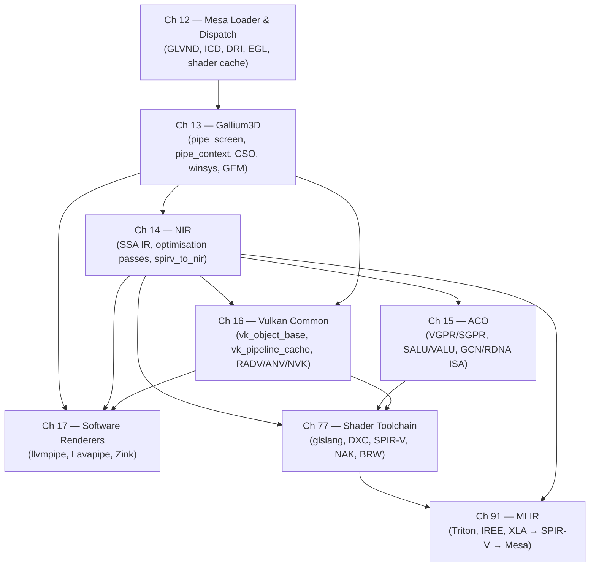

# Part IV — Mesa Architecture

**Mesa** is the userspace half of the Linux graphics stack. It is the layer that receives an application's **OpenGL**, **Vulkan**, or **OpenCL** call, validates it, compiles the attached shaders, records GPU commands, and hands the encoded work to the kernel's **DRM** subsystem for execution. No other software component spans the stack as completely: Mesa contains an API frontend for every major open graphics standard, a shared shader compiler middle-end used by every driver, and a collection of vendor-specific backends that each target a distinct GPU microarchitecture. On a typical Linux desktop, every frame rendered — whether by a Wayland compositor, a game, a browser, or an AI inference workload — passes through Mesa.

Parts I–III established the kernel half: how the **DRM** subsystem exposes GPU memory through **GEM** buffer objects, how the **GPU Scheduler** fairness-queues command submissions across processes, and how the **KMS** display pipeline drives scan-out from framebuffers to pixels on a monitor. Part IV moves one level up and examines how Mesa is built — not through a tour of individual drivers, but through the shared architecture that all Mesa components inherit. Parts V–IX then consume these foundations: hardware-specific drivers implement the Gallium and Vulkan interfaces exposed here, Wayland compositors use the EGL platform layer defined here, and browser and gaming layers build on the shader compilation pipeline traced here.

## The Problem Mesa Solved

By 2007, the Mesa tree had accumulated roughly fifteen hardware-specific OpenGL drivers, each one a near-complete reimplementation of the same rasteriser, texture manager, state machine, and shader compiler. The **i965** driver handled Intel GPUs. The **r300**, **r600**, and **radeon** drivers tracked successive AMD GPU generations. The **nouveau** driver covered NVIDIA hardware in varying states of completeness. Each driver had its own version of every fixed-function operation — mipmap generation, stencil routing, format conversion, blending — and its own shader intermediate representation with its own optimiser and register allocator. When a new GPU appeared, a new driver had to be written almost from scratch. When OpenGL ES 2.0 was standardised, the work of adding ES support fell on every driver independently.

The deeper problem was correctness. Regressions in one driver went unnoticed because test suites ran per-driver and the code paths did not share logic. Attracting contributors was hard because the entry barrier was understanding one driver's idiosyncratic internals rather than a shared abstraction.

Keith Whitwell and Zack Rusin, then at Tungsten Graphics, published the **Gallium3D** design in 2008. The central insight was that there is a natural split between what every OpenGL call must do — validate API state and produce a normalised description of a draw — and what is irreducibly hardware-specific — encoding that description into GPU commands. Gallium institutionalised this split. Every API frontend (the *state tracker*) now spoke to every GPU backend through a single pair of interfaces. A single OpenGL ES frontend ran unchanged on a Raspberry Pi, an AMD Radeon, an Intel Arc, and a software JIT renderer. The fifteen duplicated rasterisers collapsed into one.

NIR came later, solving the analogous problem in the shader compiler: Mesa had accumulated multiple per-driver intermediate representations, each with its own optimisation passes. **NIR** unified them into a single IR with a single optimisation pass library, letting every driver share dead-code elimination, constant propagation, and loop unrolling without duplicating the code.

## Cluster 1 — Platform and Loader: EGL, DRI, and the Mesa Dispatch Layer

Before any Gallium or Vulkan code runs, Mesa must be discovered, loaded, and connected to the application's windowing system. This is the job of two interlocking subsystems: **EGL** and **DRI**.

**EGL** is the Khronos platform-neutral API for creating GPU rendering contexts and surfaces without relying on X11's GLX or any other platform-specific extension. An application calls `eglGetDisplay()` to obtain a handle to a display backend, then `eglCreateContext()` and `eglCreateWindowSurface()` (or the surfaceless variant) to set up a rendering context. Mesa implements EGL in [`src/egl/`](https://gitlab.freedesktop.org/mesa/mesa/-/tree/main/src/egl) through four platform backends: Wayland/DRM (`PLATFORM_WAYLAND`), X11/GLX (`PLATFORM_X11`), a native GBM platform for headless and embedded use, and the surfaceless EGLDevice path used by GPU compute workloads and Wayland compositors that drive KMS directly.

**DRI** (Direct Rendering Infrastructure) is the historical mechanism through which the Mesa loader talks to kernel DRM drivers without going through an X server. **DRI2** established a buffer-management protocol where the compositor and the application negotiated buffer handles over the X11 connection. **DRI3** (2013) replaced DRI2's handle negotiation with explicit **dma-buf** file-descriptor passing: the application calls `gbm_bo_get_fd()` or `EGL_LINUX_DMA_BUF_EXT` to export a GEM buffer object as a DMA-BUF fd, passes that fd to the Wayland compositor over a Unix socket, and the compositor imports it directly into the kernel's DMA-BUF framework for KMS scanout — no X server in the loop. Mesa's DRI driver `.so` files (e.g., `radeonsi_dri.so`, loaded by [`src/loader/`](https://gitlab.freedesktop.org/mesa/mesa/-/tree/main/src/loader)) are the boundary objects at which the dispatch layer hands off to a concrete hardware driver.

**GEM buffer objects** are the kernel-managed GPU memory allocations that flow through this entire path. Mesa allocates GEM BOs via **libdrm** (`drmIoctl(fd, DRM_IOCTL_GEM_CREATE, ...)`) or through **GBM** (`gbm_bo_create()`), which wraps the same ioctl. GEM provides an opaque handle within a DRM file descriptor; to cross process boundaries, that handle is exported as a **dma-buf** file descriptor (`DRM_IOCTL_PRIME_HANDLE_TO_FD`), imported by a second process (`DRM_IOCTL_PRIME_FD_TO_HANDLE`), and eventually mapped to KMS for display. The full pipeline — GBM allocation → DMA-BUF export → Wayland protocol buffer attach → KMS scanout — runs on every frame presented through a Wayland compositor.

On top of DRI, **GLVND** (GL Vendor-Neutral Dispatch) separates `libGL.so` into a vendor-neutral stub that dispatches at runtime to per-vendor libraries such as `libGLX_mesa.so`. The **Vulkan ICD** mechanism is analogous: `libvulkan.so` reads JSON manifests under `/usr/share/vulkan/icd.d/` and dlopen-loads `libvulkan_radeon.so`, `libvulkan_intel.so`, or `libvulkan_nouveau.so` as appropriate.

**Chapter 12** covers this entire loader, dispatch, and platform layer in full.

## Cluster 2 — Gallium3D: The Shared OpenGL and Compute Framework

**Gallium3D** defines the interface contract between every API frontend and every GPU backend in Mesa's OpenGL and OpenCL stacks. It does so through two central objects and one optimisation mechanism.

**`pipe_screen`** represents a single GPU device. It is the per-device capability oracle — application code queries it via `get_param()` with `PIPE_CAP_*` constants to learn what texture formats, sample counts, and geometry shader features the GPU supports. It is also the resource factory: `resource_create()` allocates a `pipe_resource` (which wraps a GEM BO internally) with a combination of `PIPE_BIND_*` usage flags that tell the driver whether the buffer will be used as a vertex buffer, render target, shader image, or scanout surface.

**`pipe_context`** represents a single thread's rendering context. It is the command recorder: API-level draw calls arrive at `draw_vbo()` through a `pipe_draw_info` struct; compute dispatches arrive at `launch_grid()` through `pipe_grid_info`. Between draw calls, the frontend binds state through explicit state-object handles rather than OpenGL's historically mutable per-parameter state.

**CSO (Constant State Objects)** are the key mechanism that makes Gallium efficient. Instead of the OpenGL model of accumulating individual state parameter changes and revalidating everything at draw time, Gallium requires the driver to bake all rasteriser configuration into an opaque `pipe_rasterizer_state` object, all depth/stencil configuration into `pipe_depth_stencil_alpha_state`, and all blend configuration into `pipe_blend_state` — each created once, optimised and pre-compiled by the driver, then bound and rebound arbitrarily without re-compilation. The `cso_context` hash-map cache in [`src/gallium/auxiliary/cso_cache/`](https://gitlab.freedesktop.org/mesa/mesa/-/tree/main/src/gallium/auxiliary/cso_cache) avoids redundant state re-creation across draw calls.

**Blitting** is the mechanism through which Gallium handles pixel copies — texture uploads, mipmap generation, format conversion, and blit-based surface presentation. `pipe_context::blit()` accepts a `pipe_blit_info` struct describing source and destination resources with format and region fields; drivers that cannot handle a particular blit natively fall back to the `u_blitter` utility library in [`src/gallium/auxiliary/util/u_blitter.c`](https://gitlab.freedesktop.org/mesa/mesa/-/tree/main/src/gallium/auxiliary/util), which implements the blit by driving the driver's own `draw_vbo()` path with a temporary fullscreen quad.

**Vertex Buffer Objects (VBOs)** are the GPU buffers that hold per-vertex data. In Gallium, a VBO is a `pipe_resource` allocated with `PIPE_BIND_VERTEX_BUFFER`. Its layout is described to the pipeline through `pipe_vertex_element` structs (one per attribute, carrying `src_offset`, `instance_divisor`, `vertex_buffer_index`, and `src_format`). The `set_vertex_buffers()` call binds a `pipe_vertex_buffer` array carrying the actual BO and stride.

The **winsys** layer sits beneath `pipe_screen` and handles GPU-specific memory management and command submission. Each hardware driver pairs a `pipe_screen` implementation with a winsys backend: `radeon_drm_winsys` and `amdgpu_winsys` for AMD hardware, `intel_drm_bo_alloc` for Intel. The winsys allocates display-scannable BOs via the DRM ioctl layer and submits command buffers through driver-specific submit ioctls (`DRM_IOCTL_AMDGPU_CS`, `DRM_IOCTL_I915_GEM_EXECBUFFER2`).

**Chapter 13** traces all of these interfaces through a complete `glDrawArrays` call, from the OpenGL state tracker through `st_draw_vbo()` to `pipe_context::draw_vbo()` to command-buffer encoding in a hardware driver.

## Cluster 3 — NIR and the Shader Compiler Pipeline

Every shader that enters Mesa — whether **GLSL** from an OpenGL application or **SPIR-V** from a Vulkan driver or game — is immediately translated into a single canonical intermediate representation before any hardware-specific compilation begins. That representation is **NIR** (New Intermediate Representation), defined in [`src/compiler/nir/`](https://gitlab.freedesktop.org/mesa/mesa/-/tree/main/src/compiler/nir).

NIR was introduced to replace **TGSI** (Tungsten Graphics Shader Infrastructure), Mesa's earlier per-driver IR. TGSI was too low-level and ISA-like to support useful high-level optimisations: it lacked a type system expressive enough for modern compute, did not represent control flow in a form amenable to loop analysis, and had no standard optimisation pass library. NIR replaced it with a fully structured, **SSA**-form IR.

**SSA (Static Single Assignment)** means every variable in NIR (`nir_def *`) is assigned exactly once. This property — guaranteed by construction — is what makes classical compiler optimisations cheap and correct: Global Value Numbering (GVN) can deduplicate identical computations by simple equality checks; Dead Code Elimination (DCE) needs only a single backwards sweep; Sparse Conditional Constant Propagation (SCCP) can reason about values without alias analysis. `nir_alu_instr` represents arithmetic; `nir_intrinsic_instr` represents memory accesses and system value reads; `nir_tex_instr` represents texture operations. The NIR pass infrastructure runs a chain of `nir_shader_instructions_pass()` callbacks, each implementing one optimisation or lowering.

The full **shader compilation pipeline** is: GLSL source → GLSL frontend → `glsl_to_nir()` → NIR; or SPIR-V binary → `spirv_to_nir()` → NIR. From NIR, drivers run their own lowering and optimisation passes and then call a hardware-specific backend: **ACO** for AMD RADV, **BRW** for Intel ANV and iris, **NAK** (written in Rust) for NVK on NVIDIA, and **gallivm** (LLVM-based JIT) for llvmpipe.

The AMD path introduces two pairs of register types that are central to GPU shader compilation. **VGPR (Vector General Purpose Register)** values exist per-lane within a wavefront — in RDNA, each wavefront executes 32 lanes simultaneously, so a VGPR value is 32 independent values. **SGPR (Scalar General Purpose Register)** values are shared across all lanes of a wavefront; they hold uniform data such as descriptor table pointers, buffer base addresses, and loop induction variables that are the same for every lane. High **VGPR pressure** — too many live vector values simultaneously — reduces the number of wavefronts that can be co-resident on a Compute Unit, reducing GPU occupancy and performance. The ACO compiler's register allocator explicitly tracks VGPR and SGPR pressure as separate dimensions.

**SALU (Scalar ALU)** and **VALU (Vector ALU)** are the two execution units that operate on these register types respectively. SALU instructions execute once per wavefront (e.g., adding a constant to a buffer address pointer shared by all lanes). VALU instructions execute once per active lane (e.g., multiplying per-vertex position components). Mesa's NIR-to-ACO instruction selection includes a **divergence analysis** pass that identifies which values are uniform across all lanes — these can use SALU and SGPRs — and which are per-lane — these must use VALU and VGPRs. Misclassification in either direction produces incorrect results; accurate divergence analysis reduces VGPR pressure and improves occupancy.

**GCN (Graphics Core Next)** and **RDNA** are the two AMD GPU ISA families that ACO targets. GCN (used in Volcanic Islands, Fiji, and Polaris GPUs) runs wavefronts of 64 lanes. RDNA (Navi and later) introduced a default wavefront width of 32 lanes and improved instructions-per-clock. ACO targets both through the same NIR lowering path, diverging at instruction selection to emit GCN or RDNA opcodes. The AMD **common code** layer in [`src/amd/common/`](https://gitlab.freedesktop.org/mesa/mesa/-/tree/main/src/amd/common) provides GPU-family feature tables and register file definitions shared between the Gallium **radeonsi** driver and the Vulkan **RADV** driver.

Mesa's **on-disk shader cache** (`~/.cache/mesa_shader_cache/` by default, overridden via `$MESA_SHADER_CACHE_DIR`) stores compiled ISA binaries keyed by a hash of the driver version, GPU device ID, shader source, and compile-time flags. Across process restarts, a cache hit lets Mesa skip the entire NIR → ISA compilation path, replacing a multi-millisecond compile with a filesystem lookup. The cache integrates with Vulkan's `VkPipelineCache` serialisation in Chapter 16.

**Chapters 14 and 15** cover NIR internals and the ACO backend in full. **Chapter 77** covers the full source-to-ISA toolchain including glslang, DXC, SPIRV-Tools, and all three hardware ISA backends.

## Cluster 4 — The Mesa Vulkan Common Layer

Mesa's second major shared architecture is the Vulkan common layer at [`src/vulkan/runtime/`](https://gitlab.freedesktop.org/mesa/mesa/-/tree/main/src/vulkan/runtime). This C library provides implementations of every Vulkan API entry point whose correct behaviour is determined solely by the Vulkan specification — independent of what GPU hardware executes the resulting work.

The five Mesa Vulkan drivers — **RADV** (AMD), **ANV** (Intel), **NVK** (NVIDIA), **Turnip** (Qualcomm Adreno), and **v3dv** (Raspberry Pi V3D) — all inherit from `vk_device`, `vk_instance`, and `vk_physical_device`. The common layer provides: the `vk_object_base` lifetime tracking system; `vk_render_pass` lowering that converts application-created `VkRenderPass` objects to the dynamic rendering path; `vk_pipeline_cache` serialisation and lookup; descriptor set layout infrastructure; command buffer recording helpers; and implementations of dozens of extensions including `VK_EXT_debug_utils`, `VK_KHR_synchronization2`, and `VK_KHR_timeline_semaphore`. Hardware-specific drivers implement only the portions that touch GPU command encoding, memory allocation, and shader binary submission.

**NVK** was written from day one with maximal use of the common layer, making it one of the cleanest examples of the architecture: roughly 40% of its total code is inherited unchanged from `src/vulkan/runtime/`. **Turnip** and **v3dv** followed similar strategies. **ANV** and **RADV** predate the common layer and have been progressively migrated toward it.

**Chapter 16** documents the common layer's API surface and extension coverage in detail.

## How the Chapters Interrelate

The chapters in this part form a layered dependency graph that matches the actual Mesa call stack from dispatch down to machine code.

**Chapter 12** is the entry point: it establishes how applications find and invoke Mesa at all. It introduces the DRI interface, the disk shader cache, and the EGL platform layer — concepts that all downstream chapters assume. Read it first.

**Chapter 13** is the structural backbone. Once an application call has been dispatched by Chapter 12's machinery, Gallium3D's `pipe_screen` and `pipe_context` interfaces define exactly how that call is forwarded through the stack. Chapter 13 introduces the frontend/backend split that every later chapter presupposes. Readers need to understand `pipe_context::draw_vbo()` before Chapter 14's shader compilation output makes sense, and `pipe_shader_state` before Chapter 15's ACO emission target is clear.

**Chapter 14** is the compiler middle-end that ties all driver chapters together. NIR is the single data structure that GLSL frontends, SPIR-V importers, optimisation passes, and ISA backends all share. Chapter 14 must be read before Chapter 15 (which begins where NIR ends, at instruction selection for AMD hardware) and before Chapter 77 (which covers both the front-end tools that produce SPIR-V and the back-end path through `spirv_to_nir()` into NIR).

**Chapters 15 and 16** are parallel specialisations. Chapter 15 dives into ACO as the AMD Vulkan compiler backend; Chapter 16 examines the shared Vulkan runtime infrastructure that hosts ACO output alongside Intel's BRW and NVIDIA's NAK. Neither depends on the other, but both depend on Chapters 13 and 14.

**Chapter 17** sits at the intersection of Chapters 13 and 14: **llvmpipe** is a Gallium backend that JIT-compiles NIR to CPU SIMD code. **Lavapipe** adds the Vulkan common layer on top. **Zink** inverts the relationship, using Gallium as an OpenGL frontend that emits Vulkan calls — understandable only after Chapters 13 and 16 are both clear.

**Chapter 77** spans the whole part: it begins above Mesa (glslang, DXC, SPIRV-Tools) and traces through `spirv_to_nir()` and all three ISA backends. It is best read after Chapters 14 and 15 and serves as a synthesis chapter for the whole shader compilation arc.

**Chapter 91** sits above all others and is best read last. It examines ML-framework compiler stacks (Triton, IREE, XLA) that produce SPIR-V for Mesa to consume.

## Prerequisites and What Comes Next

Readers should arrive at this part with a working understanding of the **DRM** subsystem (Part I), **GEM** buffer objects and **dma-buf** sharing (Parts I–II), and the **KMS** display pipeline (Part II) — Chapter 12 assumes that DRM render nodes and DRM format modifiers are already familiar concepts. Part V (Hardware Drivers) builds directly on the Gallium3D and NIR foundations laid here, examining how **radeonsi**, **iris**, **NVK**, and other drivers implement the `pipe_screen` and `pipe_context` interfaces for specific GPU families. Parts VI and VII (Display Stack, Application APIs) consume the EGL and Vulkan infrastructure introduced here, and Part VIII (Gaming Layer) relies on the complete shader compilation toolchain traced in Chapter 77.

---
