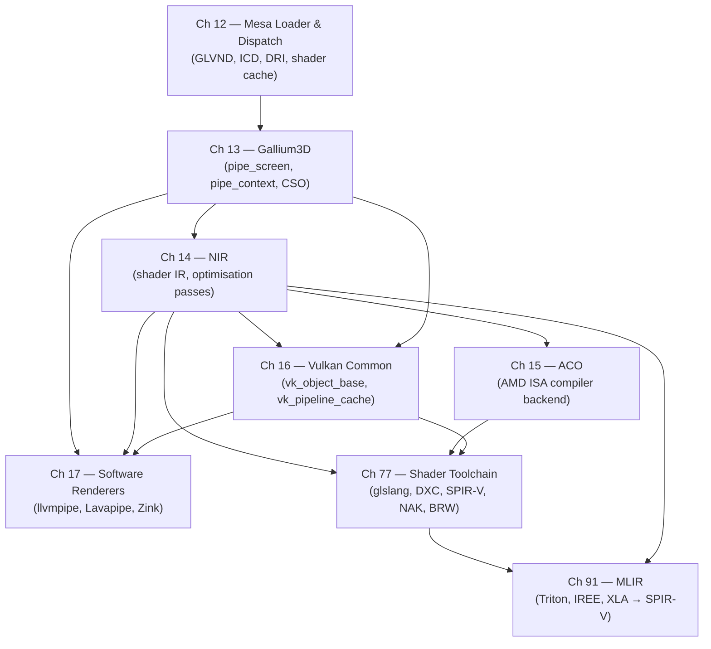

# Part IV — Mesa Architecture

**Mesa** sits at the centre of the Linux userspace graphics stack. It is the layer that receives an application's **OpenGL** or **Vulkan** call, validates it, schedules shader compilation, encodes GPU commands, and hands the result to the kernel's **DRM** subsystem for execution. Parts I–III established how the kernel allocates GPU memory, schedules command submissions, and drives display outputs through the **DRM/KMS** subsystem. Part IV moves one level up to examine how **Mesa** is constructed: its dispatch infrastructure, its driver framework, its compiler middle-end and back-ends, and the software-rendering paths that make the whole system testable without GPU hardware. Parts V–IX then consume **Mesa** as a foundation, building hardware-specific drivers, Wayland compositors, browser graphics, and gaming translation layers on top of it.

## Chapters in This Part

**Chapter 12 — The Mesa Loader, glvnd, and API Dispatch** explains how a **glDrawArrays** or **vkQueueSubmit** call reaches the correct driver on a system with multiple GPU vendors installed simultaneously. It traces the **GLVND** (GL Vendor-Neutral Dispatch) split of **libGL.so** into vendor-neutral stubs and per-vendor libraries such as **libGLX_mesa.so**, the **EGL** vendor JSON discovery mechanism under `/usr/share/glvnd/egl_vendor.d/`, and the **Vulkan ICD** model where **libvulkan.so** loads **libvulkan_radeon.so** or **libvulkan_intel.so** from `/usr/share/vulkan/icd.d/`. It also covers driver name resolution, the **DRI** screen and drawable lifecycle, **Mesa**'s disk shader cache under `$XDG_CACHE_HOME/mesa_shader_cache`, and the four **EGL** platform backends (**Wayland**, **GBM**, **EGLDevice**, surfaceless).

**Chapter 13 — Gallium3D: The Driver Framework** dissects the structural backbone of **Mesa**'s OpenGL stack. The **Gallium3D** interface imposes a clean separation between API-level state management ("frontends") and hardware-specific command encoding ("backends") through two central objects: **`pipe_screen`** (the per-device capability oracle and resource factory) and **`pipe_context`** (the per-thread command recorder). The chapter covers the **CSO** (Constant State Object) cache that eliminates redundant GPU-state compilations, the canonical **`glDrawArrays`** → **`st_draw_vbo()`** → **`pipe_context::draw_vbo()`** call path, utility libraries **`u_blitter`** and **`u_transfer_helper`**, the winsys layer and **GEM** buffer management, and the two non-OpenGL **Gallium** frontends: **rusticl** (OpenCL 3.0 in Rust) and **Zink** (Gallium-to-Vulkan translation).

**Chapter 14 — NIR: Mesa's Universal Shader IR** covers the pivot point of the entire **Mesa** compiler stack. **NIR** (New Intermediate Representation) is the single IR that every shader entering **Mesa** — whether **GLSL** from an **OpenGL** application or **SPIR-V** from a **Vulkan** game — is translated into before any hardware-specific compilation begins. The chapter explains the **NIR** data structures (**`nir_shader`**, **`nir_function`**, **`nir_block`**, **`nir_instr`**, **`nir_ssa_def`**), the **`spirv_to_nir()`** and **`glsl_to_nir()`** front-end translators, the optimisation and lowering pass infrastructure, debugging tools such as **`MESA_SHADER_DUMP`**, and the role of **NIR** as the universal interchange format consumed by every **Mesa** driver backend.

**Chapter 15 — ACO: AMD's Optimising Shader Compiler** examines **Mesa**'s purpose-built shader compiler backend for **AMD GCN** and **RDNA** GPUs. Developed with Valve's sponsorship beginning in 2019, **ACO** replaced **LLVM** as **RADV**'s compilation backend by targeting the specific constraints of interactive GPU compilation: sub-millisecond latency, correct handling of the **VGPR**/**SGPR** register split, and full ownership within the **Mesa** repository. The chapter covers all twelve pipeline stages from instruction selection (divergence analysis, **SALU**/**VALU** assignment) through register allocation (**`aco_register_allocation.cpp`**), instruction scheduling (**`aco_scheduler.cpp`**), and binary emission (**`aco_assembler.cpp`**) producing an **`ac_shader_binary`** with **GCN**/**RDNA** machine code.

**Chapter 16 — Mesa Vulkan Common Infrastructure** describes how **Mesa** eliminates duplicated **Vulkan** boilerplate across its multiple Vulkan drivers. The common layer at **`src/vulkan/runtime/`** provides shared C implementations of every **Vulkan** entry point whose correct behaviour is defined purely by the **Vulkan** specification and not by GPU hardware: the **`vk_object_base`** lifetime system, **`vk_render_pass`** lowering to dynamic rendering, **`vk_pipeline_cache`** serialisation, descriptor set layout infrastructure, and implementations of dozens of extensions including **`VK_EXT_debug_utils`** and **`VK_KHR_synchronization2`**. The chapter shows how drivers such as **RADV**, **ANV**, **NVK**, **Turnip**, and **v3dv** all inherit from **`vk_device`**, **`vk_instance`**, and **`vk_physical_device`**, and how **NVK** was written from day one to use the common layer maximally.

**Chapter 17 — Software Renderers: LLVMpipe, Softpipe, and Lavapipe** examines **Mesa**'s CPU-based rendering paths, which are the foundation of **Mesa**'s entire continuous integration system. **llvmpipe** is a **Gallium** pipe driver that JIT-compiles shaders to native **SIMD** machine code via the **gallivm** infrastructure, rendering through a tile-based engine that distributes 64×64-pixel tiles across CPU threads. **Lavapipe** is a fully conformant **Vulkan 1.3 ICD** that drives **llvmpipe** as its rasteriser and exposes the complete **SPIR-V** → **NIR** → **gallivm** pipeline. **Zink** is a **Gallium** backend that translates **Gallium** pipe calls to **Vulkan**, enabling the OpenGL → Gallium → Zink → Lavapipe full-software CI path as well as deployment on platforms without native OpenGL drivers.

**Chapter 77 — Shader Source-to-ISA: The Complete Compilation Toolchain** maps the entire journey a shader takes from source language to executed machine code, covering all the tools that sit between the application and **Mesa**. It examines **glslang** (the **Khronos** reference **GLSL**-to-**SPIR-V** compiler), **DXC** (the **DirectX Shader Compiler** for **HLSL**-to-**SPIR-V** used by **DXVK** and **vkd3d-Proton**), **SPIRV-Tools** (validation and optimisation), **spirv-cross** (reflection and cross-compilation), and **Slang** (**NVIDIA**'s differentiable shading language). It then traces how **SPIR-V** enters **Mesa** through **`spirv_to_nir()`** and reaches the three main ISA backends — **ACO** (AMD/RADV), **BRW** (Intel/ANV and iris), and **NAK** (NVIDIA/NVK, written in Rust). The chapter closes with the shader cache architecture and the **shader-db** regression-testing corpus.

**Chapter 91 — MLIR and the Emerging GPU Compiler Infrastructure** covers the layer above **Mesa**: the compiler frameworks used by ML workloads to generate **SPIR-V** or GPU assembly that **Mesa** then consumes. It explains **MLIR**'s dialect hierarchy (from `**linalg**` and `**vector**` down through `**gpu**` to `**spirv**` or `**llvm**`), the progressive lowering philosophy, **OpenAI Triton**'s Python-to-GPU compilation pipeline, **IREE**'s **MLIR**-based inference path to **Vulkan**, and **XLA**/**StableHLO**. The chapter shows precisely where **MLIR**-generated **SPIR-V** enters **Mesa**'s **`spirv_to_nir()`** front end and what constraints that places on upstream compilers.

## How the Chapters Interrelate

The chapters in this part form a layered dependency graph that matches the actual Mesa call stack from dispatch down to machine code.

**Chapter 12** is the entry point: it establishes how applications find and invoke **Mesa** at all. It introduces the **DRI** interface, the disk shader cache, and the **EGL** platform layer — concepts that all downstream chapters assume. Read it first.

**Chapter 13** is the structural backbone. Once an application call has been dispatched to a driver by Chapter 12's machinery, **Gallium3D**'s **`pipe_screen`** and **`pipe_context`** interfaces define exactly how that call is forwarded through the stack. Chapter 13 introduces the frontend/backend split that every later chapter presupposes. Readers need to understand **`pipe_context::draw_vbo()`** before Chapter 14's shader compilation output makes sense, and they need to understand **`pipe_shader_state`** before Chapter 15's ACO emission target is clear.

**Chapter 14** is the compiler middle-end that ties all driver chapters together. **NIR** is the single data structure that **GLSL** frontends, **SPIR-V** importers, optimisation passes, and ISA backends all share. Chapter 14 must be read before Chapter 15 (which begins where **NIR** ends, at the instruction selection stage for AMD hardware) and before Chapter 77 (which covers both the front-end tools that produce **SPIR-V** and the back-end path through **`spirv_to_nir()`** into NIR). Understanding **NIR**'s **SSA** form and pass infrastructure also clarifies why the software renderers in Chapter 17 follow the same shader compilation path as hardware drivers.

**Chapter 15** and **Chapter 16** are parallel specialisations. Chapter 15 dives into **ACO** as the AMD Vulkan compiler backend; Chapter 16 examines the shared **Vulkan** runtime infrastructure that hosts **ACO** output alongside Intel's **BRW** and NVIDIA's **NAK**. Neither depends on the other, but both depend on Chapters 13 and 14. Chapter 16 in particular provides the **`vk_pipeline_cache`** and **`vk_object_base`** machinery that Chapter 77's cache discussion and Chapter 91's SPIR-V ingestion path build on.

**Chapter 17** sits at the intersection of Chapters 13 and 14: **llvmpipe** is a Gallium backend (Chapter 13) that JIT-compiles **NIR** (Chapter 14) to CPU SIMD code. **Lavapipe** adds the **Vulkan** common layer (Chapter 16) on top. **Zink** inverts the relationship, using Gallium as an OpenGL frontend that emits Vulkan calls — making it understandable only after Chapters 13 and 16 are both clear.

**Chapter 77** spans the whole part: it begins above **Mesa** (glslang, DXC, SPIRV-Tools) and traces through **`spirv_to_nir()`** (Chapter 14) and all three ISA backends (Chapter 15 for ACO, plus BRW and NAK). It is best read after Chapters 14 and 15 and serves as a synthesis chapter for the whole shader compilation arc.

**Chapter 91** sits above all others and is best read last. It examines ML-framework compiler stacks that produce **SPIR-V** for Mesa to consume, making it a forward-looking companion to Chapters 14 and 77 rather than a prerequisite for any of them.

## Prerequisites and What Comes Next

Readers should arrive at this part with a working understanding of the **DRM** subsystem (Part I), **GEM** buffer objects and **dma-buf** sharing (Part II), and the **KMS** display pipeline (Part III) — Chapter 12 assumes that **DRM** render nodes and **DRM** format modifiers are already familiar concepts. Part V (Hardware Drivers) builds directly on the **Gallium3D** and **NIR** foundations laid here, examining how **radeonsi**, **iris**, **NVK**, and other drivers implement the **`pipe_screen`** and **`pipe_context`** interfaces for specific GPU families. Parts VI and VII (Display Stack, Application APIs) consume the **EGL** and **Vulkan** infrastructure introduced here, and Part VIII (Gaming Layer) relies on the complete shader compilation toolchain traced in Chapter 77.

---
