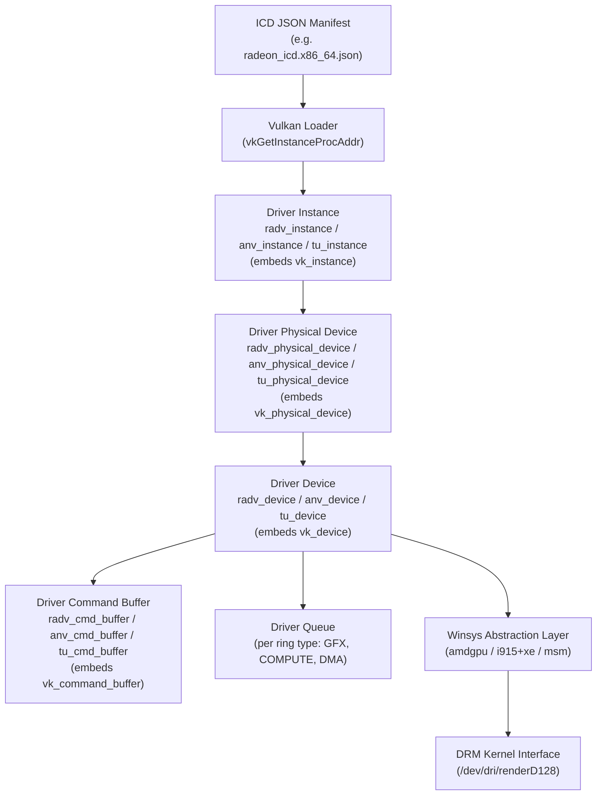
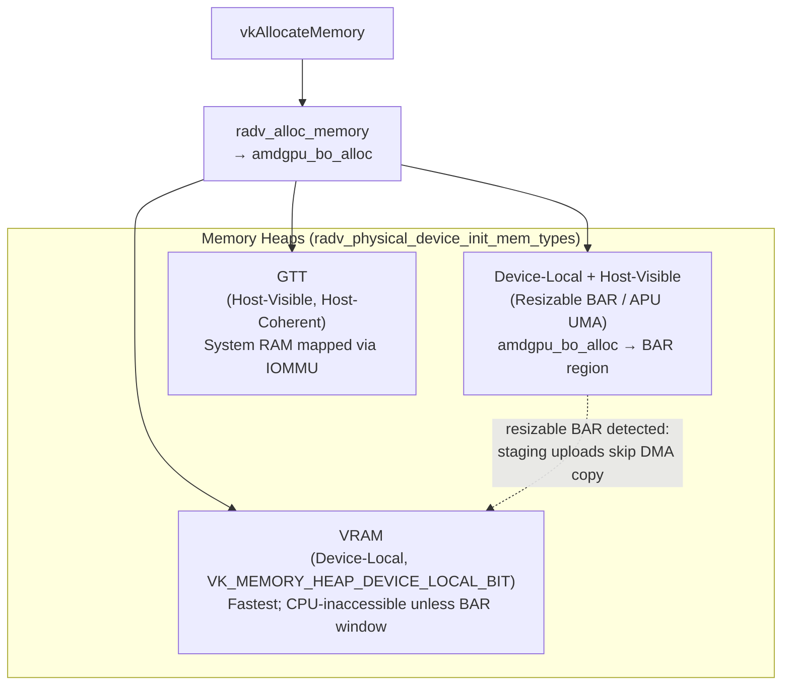
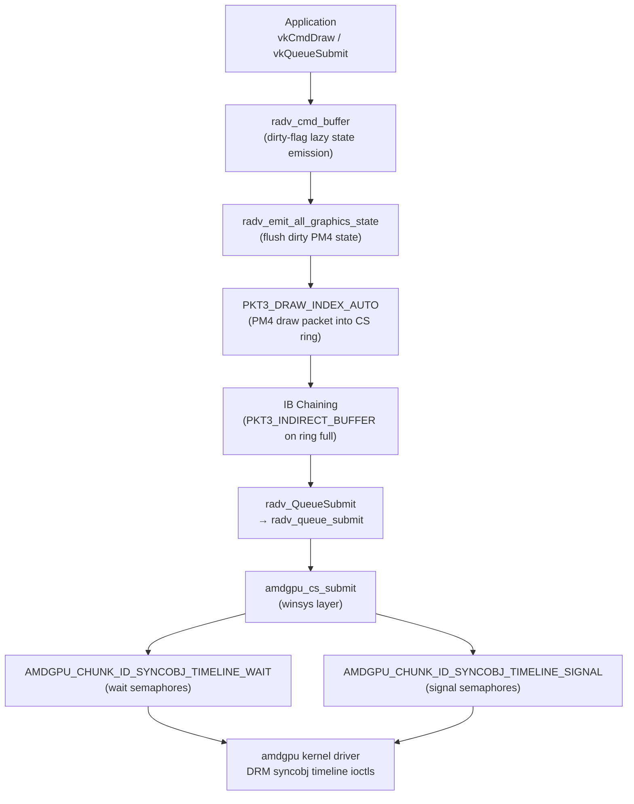
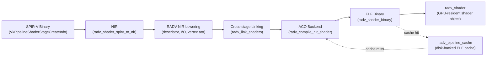
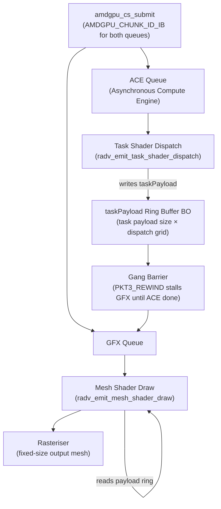
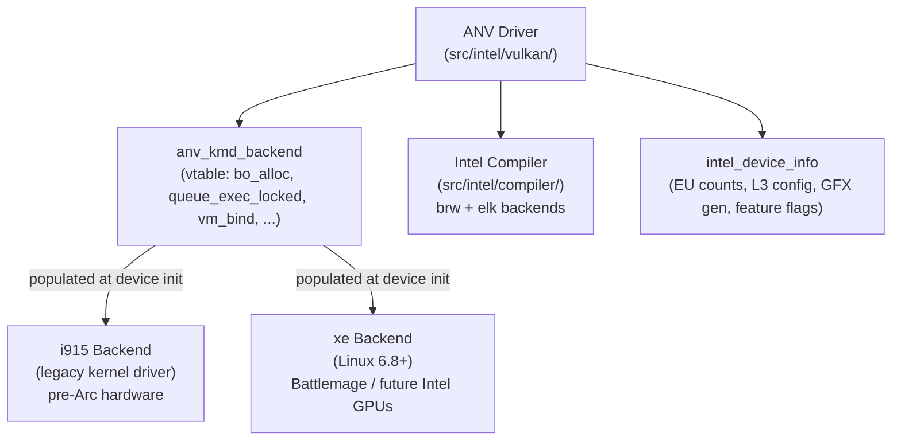
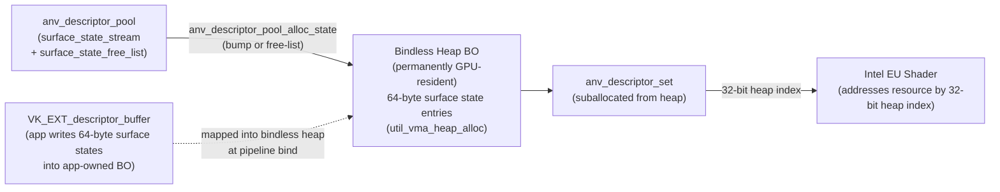
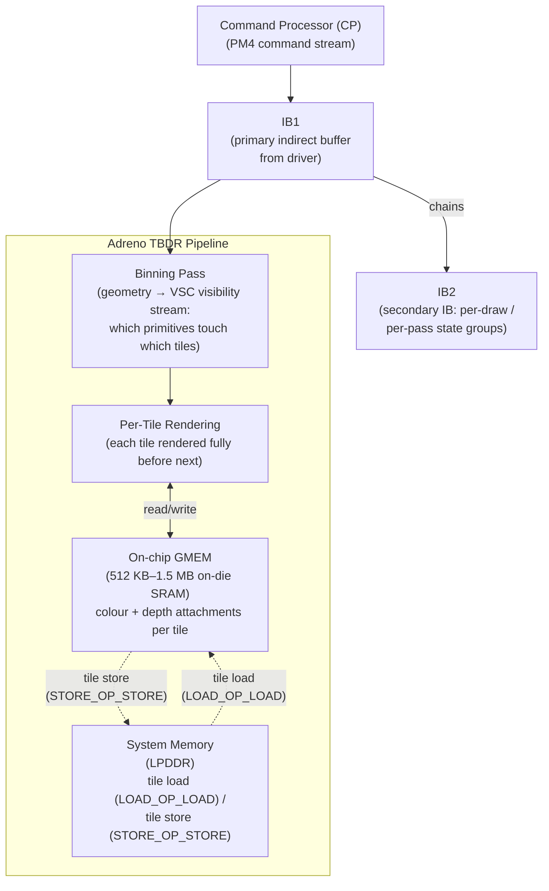
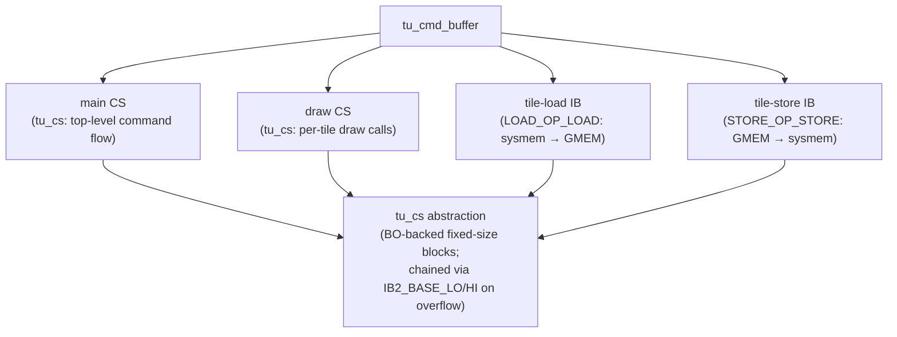
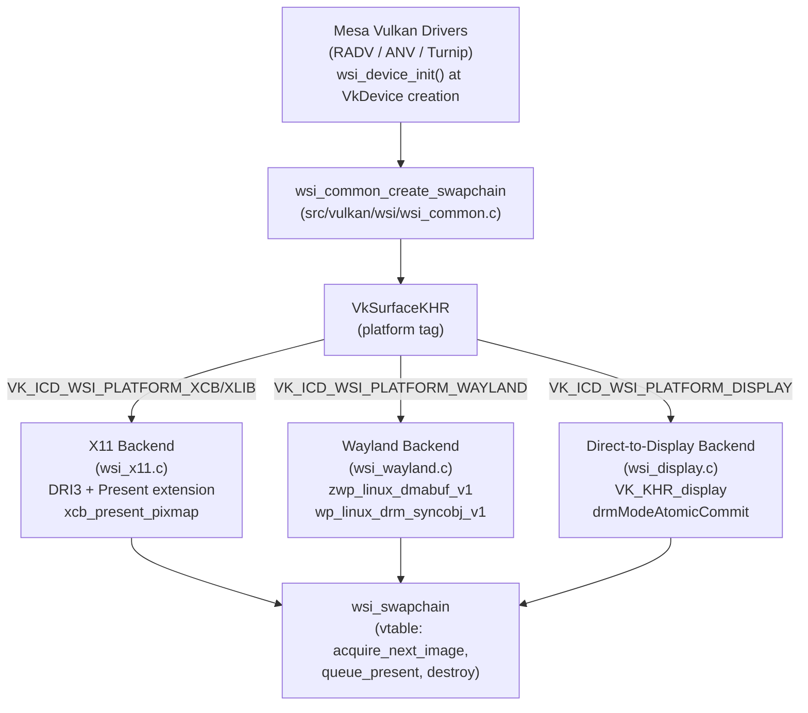

# Chapter 18: Vulkan Drivers

> **Part**: Part V — Mesa GPU Drivers
> **Audience**: Both — systems developers get deep driver internals; application developers understand what Mesa Vulkan drivers do on their behalf
> **Status**: First draft — 2026-06-06

## Table of Contents

- [Overview](#overview)
- [1. The Anatomy of a Mesa Vulkan Driver](#1-the-anatomy-of-a-mesa-vulkan-driver)
- [2. RADV: AMD Vulkan in Mesa](#2-radv-amd-vulkan-in-mesa)
  - [2.1 Architecture Overview](#21-architecture-overview)
  - [2.2 Memory Management](#22-memory-management)
  - [2.3 Command Buffer Recording and Submission](#23-command-buffer-recording-and-submission)
  - [2.4 Descriptor Set Architecture](#24-descriptor-set-architecture)
  - [2.5 Pipeline Compilation and Caching](#25-pipeline-compilation-and-caching)
  - [2.6 Mesh Shaders and Task Shaders](#26-mesh-shaders-and-task-shaders)
  - [2.7 Ray Tracing](#27-ray-tracing)
  - [2.8 RADV Debug and Performance Environment Variables](#28-radv-debug-and-performance-environment-variables)
  - [2.9 NGG: Next Generation Geometry Pipeline](#29-ngg-next-generation-geometry-pipeline)
- [3. ANV: Intel Vulkan](#3-anv-intel-vulkan)
  - [3.1 Architecture Overview](#31-architecture-overview)
  - [3.2 The Bindless Heap Design](#32-the-bindless-heap-design)
  - [3.3 Command Buffer Encoding and Batch Buffers](#33-command-buffer-encoding-and-batch-buffers)
  - [3.4 Shader Compilation](#34-shader-compilation)
  - [3.5 Xe2 Architecture Changes (Battlemage)](#35-xe2-architecture-changes-battlemage)
  - [3.6 Hardware Workarounds](#36-hardware-workarounds)
- [4. Turnip: Qualcomm Adreno Vulkan](#4-turnip-qualcomm-adreno-vulkan)
  - [4.1 The Adreno Architecture](#41-the-adreno-architecture)
  - [4.2 Sysmem vs. GMEM Rendering](#42-sysmem-vs-gmem-rendering)
  - [4.3 Command Buffer Recording](#43-command-buffer-recording)
  - [4.4 Descriptor Sets and Resource Binding](#44-descriptor-sets-and-resource-binding)
  - [4.5 Shader Compilation](#45-shader-compilation)
  - [4.6 Synchronisation and Fences](#46-synchronisation-and-fences)
- [5. Common Bringup Patterns: Writing a New Mesa Vulkan Driver](#5-common-bringup-patterns-writing-a-new-mesa-vulkan-driver)
- [6. Conformance Testing with dEQP-VK](#6-conformance-testing-with-deqp-vk)
- [7. Cross-Driver Topics: Synchronisation, Present, and Debug Markers](#7-cross-driver-topics-synchronisation-present-and-debug-markers)
- [8. Mesa Vulkan WSI: The Window System Integration Layer](#8-mesa-vulkan-wsi-the-window-system-integration-layer)
- [Integrations](#integrations)
- [References](#references)

---

## Overview

Chapter 18 examines the three major production Vulkan drivers in Mesa: RADV for AMD hardware, ANV for Intel, and Turnip for Qualcomm Adreno. These drivers sit at the boundary between the Vulkan API and the GPU hardware: they receive commands from applications through the loader, translate them into hardware-specific instruction streams, and submit those streams through the kernel DRM interfaces described in Chapters 5 and 6. By the time a reader arrives here, they will have absorbed the shared Mesa Vulkan infrastructure from Chapter 16, the NIR compiler pipeline from Chapter 14, and the ACO backend from Chapter 15. This chapter assembles those foundations into the complete, conformant Vulkan implementations that power the overwhelming majority of Linux gaming, compute, and professional workloads.

Each driver is examined on its own terms, because each one embodies a distinct set of hardware trade-offs. RADV is the reference point for state-of-the-art AMD support: the ACO compilation backend that delivers sub-millisecond pipeline compile times, the NGG (Next Generation Geometry) pipeline that unifies vertex and geometry stages on a compute-like execution model, gang-submit for mesh shaders, and hardware ray tracing on RDNA2 and later. ANV reveals Intel's distinctive bindless heap design, where a permanently-mapped surface state region allows shaders to access resources without the binding table round-trip that characterises most other GPU architectures. Turnip shows the design pressures unique to tile-based deferred rendering hardware, where the decision to render into on-chip GMEM or directly into system memory touches correctness, bandwidth, and performance simultaneously.

The chapter closes with a synthesis of common bringup patterns applicable to any new Mesa Vulkan driver, the dEQP-VK conformance workflow that every merge request must clear, cross-driver topics including explicit synchronisation and present timing, and a thorough treatment of the Mesa WSI layer, which handles all swapchain, surface, and window system interactions on behalf of every Mesa Vulkan driver. After reading this chapter, systems developers will understand how Vulkan command recording, descriptor management, pipeline compilation, and synchronisation are each implemented at the driver level, and why certain design choices were made. Application developers will understand why driver-visible behaviour — compile stalls, pipeline cache misses, memory type selection — looks the way it does, and how to structure Vulkan usage to get the most from each driver.

---

## 1. The Anatomy of a Mesa Vulkan Driver

Before examining any individual driver, it is worth understanding what a Mesa Vulkan driver structurally consists of, because all three drivers described in this chapter share the same registration mechanism, the same physical and logical device hierarchy, and the same conventions for mapping Vulkan objects to kernel resources.

A Mesa Vulkan driver exposes itself to the Vulkan loader as an Installable Client Driver (ICD) through a JSON manifest file, typically installed at `/usr/share/vulkan/icd.d/radeon_icd.x86_64.json` (for RADV) or `intel_icd.x86_64.json` (for ANV). The loader discovers these manifests, opens the named shared library, and calls `vk_icdGetInstanceProcAddr` to obtain the driver's entry points. From that point, the loader and driver co-operate according to the ICD interface version negotiated during initialisation (see Chapter 16 for the loader dispatch table machinery).

Every Mesa Vulkan driver defines a physical device structure that embeds the common `vk_physical_device` base type defined in the shared infrastructure (`src/vulkan/runtime/vk_physical_device.h`). RADV has `radv_physical_device`, ANV has `anv_physical_device`, and Turnip has `tu_physical_device`. The embedding means that a pointer to the driver-specific struct can be cast to `vk_physical_device *` anywhere the common infrastructure operates on physical devices, and vice-versa via the standard `container_of` pattern. The same relationship holds at the device and command buffer levels: `radv_device` embeds `vk_device`, `radv_cmd_buffer` embeds `vk_command_buffer`, and so on.

Physical device initialisation follows a consistent pattern across all three drivers. A driver-specific init function opens the DRM render node (`/dev/dri/renderD128`, for example) using `open(2)`, verifies that the kernel driver on the other side is the expected one (amdgpu, i915, or xe for Intel; msm for Adreno), and then queries hardware capabilities through a combination of DRM ioctls and vendor-specific kernel interfaces. For RADV, this means calling into the amdgpu winsys layer to populate `struct radeon_info` with GPU family, VRAM size, compute unit count, and feature flags. For ANV, the equivalent is `intel_get_device_info()` which populates `struct intel_device_info` with Gfx generation, execution unit configuration, and cache topology. Turnip queries the MSM kernel driver for GPU identification and feature registers.

`VkDevice` creation maps directly to DRM object creation. RADV calls `amdgpu_device_initialize()` to obtain a device handle, then `amdgpu_cs_ctx_create2()` to create hardware contexts corresponding to each Vulkan queue. ANV opens the render node and either uses `i915_gem_context_create_ext` on older kernels or the newer `xe_engine_create` ioctl on the Xe driver. Turnip's `tu_CreateDevice` calls `tu_drm_queue_init()` which creates per-ring MSM submit queues.

Queue families expose the hardware's ring types as Vulkan queues. RADV maps graphics and compute operations to the GFX ring (which can execute both), a separate COMPUTE ring for async compute (the ACE engine on RDNA hardware), and one or more DMA rings for transfer operations. ANV exposes render and compute engines on Intel hardware. Turnip presents a graphics+compute queue on the Adreno CP and, on A7xx hardware capable of it, a separate compute queue. The queue family properties — `VkQueueFlags`, `timestampValidBits`, `minImageTransferGranularity` — are populated from hardware capabilities at physical device init time.

```c
/* Source: src/amd/vulkan/radv_device.c — radv_physical_device_init() */
static VkResult
radv_physical_device_init(struct radv_physical_device *device,
                           struct radv_instance *instance,
                           drmDevicePtr drm_device)
{
   const char *path = drm_device->nodes[DRM_NODE_RENDER];
   int fd = open(path, O_RDWR | O_CLOEXEC);

   /* Verify amdgpu kernel driver is present */
   device->ws = radv_amdgpu_winsys_create(fd, instance->debug_flags, ...);
   device->ws->query_info(device->ws, &device->rad_info);

   /* Populate memory heaps: VRAM, visible VRAM (BAR), GTT */
   radv_physical_device_init_mem_types(device);

   /* Map hardware ring types to Vulkan queue families */
   radv_physical_device_init_queue_family_properties(device);
   return VK_SUCCESS;
}
```

The full lifecycle from `vkCreateInstance` through to `vkGetDeviceQueue` is thus: the loader discovers the ICD manifest; the driver creates a `radv_instance` (or `anv_instance`, `tu_instance`) that embeds `vk_instance`; `vkEnumeratePhysicalDevices` scans DRM devices matching the driver's hardware IDs and populates an array of driver physical device structs; `vkCreateDevice` opens the render node, creates hardware contexts, and initialises per-queue command submission state; `vkGetDeviceQueue` simply returns a pointer to the already-created queue struct. At no point in this lifecycle does the Vulkan API deal directly with kernel objects — every kernel interaction is mediated through the winsys abstraction layer, enabling kernel version adaptation without touching the API layer.



---

## 2. RADV: AMD Vulkan in Mesa

### 2.1 Architecture Overview

RADV began as an independent, community-driven AMD Vulkan implementation in Mesa, launched around 2016 when AMD's own AMDVLK driver was not yet open-source and the proprietary AMDGPU-Pro Vulkan driver was not widely trusted for gaming workloads. The project attracted contributors from Valve, Red Hat, and the broader Mesa community. Over time RADV overtook AMDVLK in conformance, performance, and feature coverage; it became the default AMD Vulkan driver in nearly every Linux distribution and is now the exclusive Vulkan driver on Steam Deck (RDNA2 hardware).

RADV supports AMD GPUs from GCN1 (Southern Islands, GFX6) through RDNA4 (GFX12), with feature gating via the `amd_gfx_level` enum that progresses through `GFX6`, `GFX7`, `GFX8`, `GFX9`, `GFX10`, `GFX10_3` (RDNA2), `GFX11` (RDNA3), `GFX11_5`, and `GFX12` (RDNA4). GFX6 and GFX7 hardware achieves Vulkan 1.3; GFX8 and newer achieves Vulkan 1.4. The three-tier object hierarchy — `radv_instance` for global state, `radv_physical_device` for per-GPU static capabilities, `radv_device` for per-logical-device runtime state — mirrors the Vulkan object model precisely and embeds the common `vk_*` base types from Chapter 16 at each tier.

### 2.2 Memory Management

RADV's memory type layout reflects the physical memory architecture of AMD discrete GPUs: device-local memory (VRAM, the fastest, inaccessible from the CPU unless it falls within the 256 MB or resizable BAR window), host-visible/host-coherent memory (GTT, system RAM mapped into GPU address space via IOMMU), and device-local+host-visible memory (the BAR window, or on integrated GPUs and APUs with UMA, the entire VRAM). `radv_physical_device_init_mem_types()` walks the GPU's memory heap information from `struct radeon_info` and constructs the `VkMemoryType` and `VkMemoryHeap` arrays that `vkGetPhysicalDeviceMemoryProperties` returns to applications.

`vkAllocateMemory` calls through to `radv_alloc_memory()` which ultimately invokes `amdgpu_bo_alloc()` in the winsys layer. The buffer object (BO) is then `amdgpu_va_range_alloc`'d to obtain a virtual GPU address, and a page table mapping is established. RADV caches small BOs in a per-device BO cache to amortise kernel round-trip cost. On systems with resizable BAR enabled (exposing the full VRAM as a CPU-accessible BAR region), RADV detects this during physical device init and adjusts its preferred heap for upload buffers: staging allocations that would ordinarily go to GTT can instead go to device-local+host-visible memory, eliminating a DMA copy step for streaming geometry and texture data.

Sparse binding support (`VK_FEATURE_sparseBinding`, `VK_FEATURE_sparseResidencyBuffer`) is implemented through the amdgpu virtual memory management path. Sparse buffer binds accumulate into a list of `amdgpu_va_op` operations that are submitted in a single `amdgpu_vm_update_pte` batch, keeping the number of kernel round-trips proportional to the number of unique sparse bind operations rather than the number of GPU virtual pages touched.



### 2.3 Command Buffer Recording and Submission

The `radv_cmd_buffer` structure contains, among other things, a `radv_cs_entry *cs` pointer to the current command stream and a large set of dirty flags — `RADV_CMD_DIRTY_*` bits for pipeline-level state (bound pipeline, vertex buffers, index buffer, descriptor sets) and `RADV_DYNAMIC_*` bits for Vulkan dynamic state (viewport, scissor, depth bias, blend constants). This two-tier dirty tracking implements lazy state emission: state changes record dirty bits but do not immediately emit hardware packets; packets are only emitted when the draw or dispatch command forces a flush. This pattern substantially reduces redundant state programming when applications call `vkCmdSetViewport` or `vkCmdBindDescriptorSets` between draw calls.

`vkCmdDraw` calls down to `radv_CmdDraw()`, which first calls `radv_emit_all_graphics_state()` to flush any accumulated dirty state, then emits a `PKT3_DRAW_INDEX_AUTO` (or the appropriate PM4 draw packet for the generation) into the current CS ring buffer. The CS ring is allocated from a winsys ring buffer abstraction that requests GPU-accessible memory from the kernel and maps it into CPU address space for packet encoding.

For very long command buffers, RADV employs IB (indirect buffer) chaining: when the current CS ring fills, RADV emits a `PKT3_INDIRECT_BUFFER` packet pointing to a freshly allocated continuation ring and begins encoding into the new buffer. The kernel driver sees a chain of IBs and traverses them in order during execution. This avoids the need to pre-allocate a worst-case buffer size.

Submission travels through `radv_QueueSubmit()` to `radv_queue_submit()` which calls `amdgpu_cs_submit()` in the winsys. Each submission carries a list of CS IBs, a set of wait semaphores expressed as `AMDGPU_CHUNK_ID_SYNCOBJ_TIMELINE_WAIT` chunks, and a set of signal semaphores expressed as `AMDGPU_CHUNK_ID_SYNCOBJ_TIMELINE_SIGNAL` chunks. Timeline semaphores map directly to DRM syncobj timeline points: the Vulkan semaphore handle wraps a `uint32_t syncobj` kernel object, and waiting/signalling a specific timeline value translates to the corresponding `drm_syncobj_timeline_wait` and `drm_syncobj_timeline_signal` ioctl calls (see Chapter 5).



### 2.4 Descriptor Set Architecture

RADV's descriptor model is based on GPU-visible buffer objects. A `radv_descriptor_pool` owns a BO that is divided into fixed-size slots for each descriptor type. When `vkAllocateDescriptorSets` is called, RADV sub-allocates from the pool's BO using a bump allocator, assigning each binding a GPU virtual address and size that the shader uses to access resources.

Descriptor sizes on AMD hardware are determined by the SRD (Shader Resource Descriptor) format, which is not Vulkan-defined but is specified in the AMD hardware programmer's guides. On GCN and RDNA, a buffer SRD (used for UBOs, SSBOs, and storage buffers) is 4 DWORDs (16 bytes); a texture SRD (sampled image) is 8 DWORDs (32 bytes); a sampler SRD is 4 DWORDs (16 bytes); a combined image+sampler pair is 12 DWORDs (48 bytes). These sizes are hardcoded in `radv_descriptor_set.c` and directly control the stride used when indexing into the descriptor BO.

`VK_EXT_descriptor_indexing` (bindless arrays) is supported by storing descriptors in a global heap BO that remains resident for the lifetime of the device. Descriptor set 0 is reserved for the global heap VA, and shaders that use non-uniform indexing load the SRD directly from this heap rather than from a per-set binding table. `VK_EXT_descriptor_buffer`, supported in RADV since Mesa 23.0, goes further: it exposes the raw SRD layout to the application, letting applications write descriptor data directly into a BO they own — matching precisely what RADV does internally for `VK_EXT_descriptor_indexing`.

```c
/* Source: src/amd/vulkan/radv_descriptor_set.c — radv_descriptor_set layout (pedagogical) */
/*
 * On RDNA, descriptor sizes in bytes:
 *   Buffer SRD (UBO/SSBO):       16  bytes  (4 DWORDs)
 *   Texture SRD (sampled image): 32  bytes  (8 DWORDs)
 *   Sampler SRD:                 16  bytes  (4 DWORDs)
 *   Combined image+sampler:      48  bytes  (12 DWORDs)
 *   Storage image:               32  bytes  (8 DWORDs)
 *
 * Descriptor set BO layout for a set with bindings:
 *   binding 0: 2x UBO         → offset 0,   stride 16, total 32 bytes
 *   binding 1: 4x sampled img → offset 32,  stride 32, total 128 bytes
 *   binding 2: 1x sampler     → offset 160, stride 16, total 16 bytes
 */
struct radv_descriptor_set {
   struct vk_descriptor_set             vk;        /* common base */
   struct radv_buffer_range             bo_range;  /* suballocation in pool BO */
   uint64_t                             va;        /* GPU virtual address */
   uint32_t                             size;      /* total bytes */
   /* per-binding dynamic offset tracking */
   uint32_t                            *dynamic_descriptors;
};
```

### 2.5 Pipeline Compilation and Caching

The RADV pipeline compilation path is the most performance-critical code path in the driver, because it runs on every `vkCreateGraphicsPipelines` or `vkCreateComputePipelines` call that results in a cache miss. The pipeline consumes a `VkGraphicsPipelineCreateInfo`, extracts each `VkPipelineShaderStageCreateInfo`, loads the SPIR-V binary, and passes it through `radv_shader_spirv_to_nir()` which calls into Mesa's SPIR-V-to-NIR translator and applies Vulkan-specific lowering passes. The resulting NIR is then refined through RADV-specific passes (descriptor lowering, I/O lowering, vertex attribute loading), linked across stages to resolve interface variables, and passed to the ACO backend (Chapter 15) for machine code generation.

A crucial design decision is the shader key: RADV computes a hash of the pipeline state that affects code generation (vertex input format, blend state, depth test configuration, sample count for MSAA) and includes this hash in the cache lookup key. Two `vkCreateGraphicsPipelines` calls for the same SPIR-V shaders but different blend equations will produce different cache entries and different compiled binaries. This is necessary because AMD hardware bakes some fixed-function state into the shader microcode.

The pipeline cache (`radv_pipeline_cache`) serialises compiled shader binaries as ELF blobs into a disk-backed binary cache. Cache hit rate in real workloads is high because DXVK (Chapter 28) and Proton submit the same SPIR-V on every game launch. When a miss occurs, RADV optionally compiles on a background thread pool (async compilation), returning a placeholder NOP pipeline that emits a single triangle draw and swapping in the real pipeline when compilation finishes. The `RADV_DEBUG=noasyncshaders` flag disables this and forces synchronous compilation, which is useful for reproducing GPU hangs that only occur with the real shader code.

`VK_EXT_graphics_pipeline_library` allows splitting a pipeline into independently-compiled fragments (vertex input, pre-rasterisation, fragment, fragment output) that are linked at draw time. RADV supports both monolithic compilation (compile once with full state known) and fast-link (combine pre-compiled fragments with a minimal linker pass), choosing monolithic for cache-warm paths and fast-link for the pipeline library scenario where compile latency matters more than code quality.



```c
/* Source: src/amd/vulkan/radv_pipeline.c — shader compilation call chain (simplified) */
static VkResult
radv_pipeline_compile_shaders(struct radv_device *device,
                               struct radv_pipeline *pipeline,
                               const VkGraphicsPipelineCreateInfo *info,
                               struct radv_pipeline_cache *cache)
{
   /* 1. SPIR-V → NIR per stage */
   for (uint32_t i = 0; i < info->stageCount; i++) {
      stages[i].nir = radv_shader_spirv_to_nir(device, &info->pStages[i], ...);
      radv_lower_nir(device, stages[i].nir, pipeline_layout, ...);
   }

   /* 2. Cross-stage linking (varyings, builtins) */
   radv_link_shaders(device, stages, stage_count, ...);

   /* 3. Per-stage: NIR → ACO → ELF binary → shader object */
   for (uint32_t i = 0; i < stage_count; i++) {
      struct radv_shader_binary *binary;
      radv_compile_nir_shader(device, stages[i].nir, &binary, ...); /* invokes ACO */
      pipeline->shaders[i] = radv_shader_create(device, binary, ...);
   }
   return VK_SUCCESS;
}
```

### 2.6 Mesh Shaders and Task Shaders

`VK_EXT_mesh_shader` became available in RADV by default on Mesa 23.0 with RDNA2 (GFX10_3) hardware. (Mesa 23.1 subsequently added task/mesh shader support for RDNA3/GFX11.) The earlier Mesa 22.3 release contained the initial implementation but it was gated behind `RADV_PERFTEST=ext_ms` because the required gang-submit kernel support had not yet landed. The feature requires the AMD ACE (Asynchronous Compute Engine) queue in addition to the main GFX queue. Task shaders are compute shaders that run on ACE and produce a `taskPayload` structure for each mesh shader workgroup they dispatch; the mesh shaders run on the GFX queue and produce a fixed-size output mesh that feeds the rasteriser directly.

The challenge is synchronising two independent hardware queues. RADV implements a gang-submit mechanism: the task and mesh workloads are submitted as a single gang to the kernel (using `AMDGPU_CHUNK_ID_IB` for both queues in a single `amdgpu_cs_submit` call) with an internal synchronisation point encoded as a `PKT3_REWIND` that stalls the GFX queue until the ACE queue has produced task outputs. The ring buffer between task and mesh stages is a BO allocated by RADV with size proportional to the maximum task payload size multiplied by the dispatch grid dimensions.



```c
/* Source: src/amd/vulkan/radv_pipeline_graphics.c — gang-submit for mesh shaders (simplified) */
/* Task shader dispatch runs on ACE queue, writes payload ring */
radv_emit_task_shader_dispatch(cmd_buffer, x, y, z);

/* Synchronise ACE → GFX: encode a barrier in the GFX stream that waits
 * for the ACE queue's semaphore value to reach the task dispatch count */
radv_emit_gang_barrier(cmd_buffer);

/* Mesh shader reads from payload ring on GFX queue */
radv_emit_mesh_shader_draw(cmd_buffer, payload_ring_va, ...);
```

### 2.7 Ray Tracing

`VK_KHR_ray_tracing_pipeline` and `VK_KHR_acceleration_structure` are supported on RDNA2 (GFX10_3) and later, requiring Mesa 21.3+ and Linux 5.15+. Acceleration structure builds are implemented as compute shader dispatches: `vkCmdBuildAccelerationStructuresKHR` calls `radv_CmdBuildAccelerationStructuresKHR()` which emits a series of compute dispatches from pre-compiled BVH build shaders stored in `src/amd/vulkan/bvh/`. These shaders sort primitives, build AABB nodes, and write the BVH into the destination buffer in the AMD BVH format that the hardware traversal unit expects.

RDNA2 introduced dedicated `rtit` (ray tracing intersection test) hardware instructions that accelerate BVH traversal. RADV emits inline ray tracing traversal code that calls these instructions when targeting RDNA2+. For hardware that predates RDNA2 or for the software emulation path (`RADV_PERFTEST=emulate_rt`), RADV substitutes a software traversal loop compiled through ACO. The shader binding table layout — ray generation record, miss records, hit group records — is packed by RADV according to the alignment requirements in the Vulkan ray tracing specification, with hit group strides rounded up to 32-byte boundaries to satisfy RDNA SRD alignment.

### 2.8 RADV Debug and Performance Environment Variables

RADV is extensively instrumented through environment variables. `RADV_DEBUG` accepts a comma-separated list of flags: `llvm` forces the LLVM backend instead of ACO; `noop` replaces all draw calls with NOPs, useful for isolating GPU-side from CPU-side bottlenecks; `nodcc` disables delta colour compression; `notccompatible` disables TC-compatible HTILE; `forcecompress` forces depth compression on all surfaces regardless of heuristics; `hang` enables CS dumps on GPU hang, writing the ring buffer contents to `/tmp/`; `syncshaders` forces synchronous shader compilation, disabling the background compile thread pool.

`RADV_PERFTEST` gates experimental optimisations: `aco` was the historic flag to opt into ACO before it became the default; `bouncedprt` enables bounced sparse residency textures; `nosam` disables smart-access-memory (resizable BAR) even when available; `emulate_rt` enables software ray tracing on hardware without RDNA2 RT units; `nggc` enables NGG culling on RDNA1 where it is not default (see §2.9). `RADV_DEBUG=hang` combined with `RADV_DEBUG=shaders` is the standard first-response to a GPU hang: the driver dumps the failing CS and disassembles shader binaries against the IB offset, enabling correlation between the faulting packet and the shader instruction.

### 2.9 NGG: Next Generation Geometry Pipeline

NGG, the Next Generation Geometry pipeline, is the RDNA hardware's replacement for the legacy GCN VGT (Vertex and Geometry Topology) engine. On legacy GCN, the geometry pipeline executed as a sequence of fixed-function stages — LS, HS, ES, GS, VS, and the primitive assembler — with off-chip ring buffers between stages consuming significant bandwidth. NGG collapses the pre-rasteriser geometry work into a single "primitive shader" stage that executes on the SIMD compute units with full workgroup semantics, access to LDS (Local Data Share), and the `s_sendmsg(gs_alloc_req)` instruction to declare output vertex and primitive counts before exporting.

A common misconception is that NGG always improves performance. NGG is mandatory on RDNA2+ for ray tracing correctness (the RT traversal unit requires the NGG execution model), and RADV enables NGG by default for all geometry stages on RDNA3+ (GFX11+) from Mesa 23.0. On RDNA1 (GFX10, Navi 1x), NGG is opt-in via `RADV_PERFTEST=nggc`. However, for workloads with complex geometry shaders that produce variable-count output primitives, or for highly tessellated meshes that already saturate the primitive cache, the legacy VGT pipeline can outperform NGG due to NGG's higher LDS pressure and the additional complexity of the culling path. RADV's `radv_use_ngg()` predicate in `radv_pipeline_graphics.c` implements heuristics to fall back to the legacy path in these cases.

NGG culling is a software culling pass that executes inside the NGG kernel before position export, eliminating primitives that the rasteriser would cull anyway. RADV implements three culling modes: backface culling (the triangle normal points away from the camera, computed using the cross product of edge vectors in NDC space), frustum culling (the primitive falls entirely outside one of the six view frustum planes), and small-primitive culling (the projected area of the triangle is less than one pixel, preventing tiny triangles from generating expensive rasteriser work). The culling pass uses a ballot-and-prefix-sum algorithm: each lane in the wave determines whether its primitive survives, a wave-level ballot identifies the surviving lanes, a prefix sum computes the compacted output index for each survivor, and only survivors export their vertices and write to the output LDS.

The prolog/epilog design enables efficient code reuse. RADV synthesises per-pipeline NGG prologs (which handle vertex attribute fetching and instance step rates) and epilogs (which handle position write-back and viewport transform) as separate ACO-compiled code objects that are appended to the application shader during `vkCreateGraphicsPipelines`. This synthesis replaced an earlier LLVM-based path; the ACO NGG prolog/epilog rewrite landed in Mesa 23.3.

```c
/* Source: src/amd/vulkan/ngg.c — NGG backface culling kernel fragment (pedagogical) */
/*
 * Each lane holds one primitive. Compute face normal in NDC:
 *   edge0 = v1.xy - v0.xy
 *   edge1 = v2.xy - v0.xy
 *   facing = edge0.x * edge1.y - edge0.y * edge1.x
 *
 * Positive facing → front face (for CW winding / VIEWPORT_Y_UP convention).
 * LDS ballot: emit 1 for surviving primitives, 0 for culled.
 */
uint32_t prim_alive = (facing > 0.0f) || !cull_backface;
uint64_t surviving_mask = ac_ballot(ctx, prim_alive); /* s_ballot_b64 */
uint32_t num_surviving  = util_bitcount64(surviving_mask);

/* Allocate output: declare vertex/primitive counts to hardware */
if (gl_SubgroupInvocationID == 0)
   ac_sendmsg_gs_alloc_req(ctx, num_surviving_vertices, num_surviving);

/* Compacted index via prefix sum: each surviving lane gets a unique slot */
uint32_t output_index = ac_mbcnt64(ctx, surviving_mask); /* mbcnt64 = popcount of lower lanes */
if (prim_alive)
   emit_primitive(output_index, ...);
```

---

## 3. ANV: Intel Vulkan

### 3.1 Architecture Overview

ANV (the name derives from "Anvil," an internal Intel codename) launched alongside Skylake (Gen9) hardware as the first complete Vulkan 1.0 driver implementation in Mesa. Unlike RADV, ANV was developed primarily within Intel's open-source graphics team and represents a collaboration between the team that owns the hardware and the Mesa community. ANV has supported hardware going back to Gen7.5 (Haswell, GFX7.5) and, as of Mesa 24.2, extends through Xe2 (Battlemage, GFX20). The `intel_device_info` structure enumerates the complete capability set for each supported generation, including execution unit counts, L3 cache configurations, thread dispatch widths, and feature flags for features like ray tracing, matrix extensions, and AV1 decode.

A key structural feature of ANV is the `anv_kmd_backend` abstraction layer. ANV must support two distinct kernel driver interfaces: the legacy `i915` driver (still in widespread use on pre-Arc hardware) and the modern `xe` driver (Linux 6.8+, required for Battlemage and future Intel GPUs). Rather than scattering `if (xe_driver)` conditionals throughout the code, ANV defines a vtable of kernel interface functions (`bo_alloc`, `queue_exec_locked`, `vm_bind`, etc.) that is populated with either `i915` or `xe` implementations at device initialisation time. This clean separation made the Xe bringup substantially simpler than if ANV had been written with i915 assumptions baked in.



### 3.2 The Bindless Heap Design

Intel GPU hardware supports what the programming reference manuals call "bindless" resource access: shaders can address surface states and samplers by index into a globally-mapped heap rather than going through a per-draw binding table populated by the command streamer. ANV exploits this by maintaining a large, permanently GPU-resident BO called the bindless heap (or surface state pool). When a descriptor set is allocated, ANV suballocates 64-byte surface state entries from this heap using `util_vma_heap_alloc()` on `pool->bo_heap`. The 64-byte surface state is written with the surface format, tiling, base address, and dimension information that the Intel EU (Execution Unit) needs to issue a load or store message.

The bindless heap architecture is why ANV's descriptor design diverges so sharply from RADV's. RADV creates a new BO for each descriptor pool and suballocates within it; when that pool is destroyed, the BO is freed. ANV allocates into a single, long-lived heap. The trade-off is memory: the ANV bindless heap may hold surface states for descriptor sets that were freed (the pool bump allocator does not compact), but it enables the critical property that shaders can reference any descriptor by a 32-bit heap index without needing to rebind anything. Hot re-binding in scenes with many materials — a common pattern in DXVK translation of D3D12 games that rely on descriptor heaps — is essentially free in ANV because no command stream state changes.



```c
/* Source: src/intel/vulkan/anv_descriptor_set.c — bindless surface state allocation (simplified) */
static struct anv_state
anv_descriptor_pool_alloc_state(struct anv_descriptor_pool *pool)
{
   /* Try the free list first (recycled surface state slots) */
   struct anv_state state = anv_state_table_get(&pool->surface_state_table,
                                                 pool->surface_state_free_list);
   if (state.alloc_size > 0) {
      pool->surface_state_free_list = ((struct anv_free_entry *)state.map)->next;
      return state;
   }

   /* Fall back to bump allocation from the surface_state_stream */
   return anv_state_stream_alloc(&pool->surface_state_stream,
                                  ANV_SURFACE_STATE_SIZE,   /* 64 bytes */
                                  ANV_SURFACE_STATE_SIZE);
}
```

`VK_EXT_descriptor_buffer` on ANV exposes the internal surface state heap layout to applications. An application using `VK_EXT_descriptor_buffer` gets a device address for a buffer it owns, into which it writes surface states in the exact 64-byte format the Intel EU expects. ANV validates that the writes are coherent and maps the application buffer into the bindless heap region during pipeline binding. This extension allows game engines and DXVK to manage descriptor memory themselves, further reducing driver overhead on descriptor-heavy workloads.

### 3.3 Command Buffer Encoding and Batch Buffers

ANV encodes Intel GPU commands using the `anv_batch` abstraction, which tracks the current write pointer into a batch buffer BO and the space remaining. The `anv_batch_emit` macro (and its typed variants generated from the `genxml` Intel GPU register XML definitions) expands to a structure initialisation plus a `memcpy` or store into the batch buffer. For example, emitting a `COMPUTE_WALKER` command on Xe-HP or newer hardware:

```c
/* Source: src/intel/vulkan/genX_cmd_buffer.c — COMPUTE_WALKER emission (simplified) */
anv_batch_emit(&cmd_buffer->batch, GENX(COMPUTE_WALKER), cw) {
   cw.SIMDSize                = SIMD32;
   cw.ThreadGroupIDXDimension = dispatch.x;
   cw.ThreadGroupIDYDimension = dispatch.y;
   cw.ThreadGroupIDZDimension = dispatch.z;
   cw.InterfaceDescriptor     = *interface_desc;
   /* InlineData carries push constants directly in the command packet */
   cw.InlineDataStartDWORD    = push_const_dword_offset;
}
```

The `GENX()` macro selects the appropriate structure layout for the current generation, since Intel GPU command encoding has changed across generations. This code is compiled multiple times via C preprocessor tricks with `GFX_VER` set to each supported generation, enabling the same source file (`genX_cmd_buffer.c`) to produce generation-specific code paths without runtime branching.

For long command buffers, ANV uses chain batches: when the current batch buffer is exhausted, ANV emits a `MI_BATCH_BUFFER_START` command pointing to a freshly allocated continuation batch, links the two buffers together, and continues encoding into the new buffer. Submission to the kernel assembles the chain head address and submits it via `i915_gem_execbuffer2` (on i915) or `xe_exec` (on the Xe driver). On pre-Gen12 hardware, relocations were required to patch GPU addresses into batch buffers before submission; Gen12 introduced canonical 48-bit GPU VA and eliminated relocations, substantially reducing CPU overhead on every queue submission.

### 3.4 Shader Compilation

ANV does not use ACO. Intel hardware uses its own compiler, located in `src/intel/compiler/`, which was developed in tandem with the hardware and understands the Intel EU ISA at a level that a generic backend cannot match. The pipeline from NIR to Intel machine code passes through several stages: NIR is lowered through Intel-specific passes that handle binding table indices, pull constant loads, and generation-specific idioms; the resulting NIR feeds into the `brw_compile_*` functions (`brw_compile_vs`, `brw_compile_fs`, `brw_compile_cs`) which perform register allocation, instruction scheduling, and binary emission for the Intel EU instruction set.

Starting with Mesa 24.x, the Intel compiler was split into two backends: `elk` (covering legacy Gfx7–Gfx8 hardware, where the instruction set predates the modern three-source format) and `brw` (Gfx9 and later, covering the modern EU ISA with its 128-bit instruction encoding, three-source ALU instructions, send messages for memory access, and flag register management for predication). This split reduced the complexity of maintaining backwards compatibility with decade-old hardware in the hot path for current-generation code.

Thread dispatch width selection (SIMD8, SIMD16, SIMD32) is determined by the compiler's register pressure analysis: narrower SIMD width uses fewer registers per instruction but launches more threads; wider SIMD executes more work per instruction but requires more general-purpose registers (GRFs). The compiler tries SIMD8 first (which always succeeds) and then attempts SIMD16 and SIMD32 if register pressure allows, preferring the widest feasible width for fill-rate-bound fragment shaders.

Push constants in ANV are encoded into a dedicated region of the batch buffer (the "push constant" memory) that is uploaded to EU GRFs at kernel dispatch time. Pull constants (for data too large for push) use `untyped surface reads` that go through the surface state heap. The `anv_push_constants` layout is constructed at pipeline creation time by analysing the SPIR-V push constant block and packing fields into the minimum number of GRF slots.

### 3.5 Xe2 Architecture Changes (Battlemage)

Intel's Xe2 architecture (Battlemage, GFX20) brought significant changes to both the EU ISA and the programming model. Xe2 EUs feature 512-bit SIMD registers (compared to the 256-bit registers of Xe/Alchemist), new vector and matrix instructions for AI inference workloads, and native hardware ray tracing units that eliminate the need for software BVH traversal loops. The GuC (Graphics Micro-Controller) firmware version 70.6.3 or later is required for Xe2 operation under the `xe` kernel driver.

ANV's response to Xe2 is concentrated in `GFX_VER >= 20` guards throughout `genX_cmd_buffer.c` and the compiler backend. New batch encoding paths were added for the updated `COMPUTE_WALKER` encoding that specifies 512-bit SIMD groups. The `intel_device_info` entry for Battlemage PCI IDs was added in Mesa 24.2 and no longer requires the `INTEL_FORCE_PROBE` override that was necessary during early development enabling. The `xe` DRM driver provides VM bind operations (`XE_VM_BIND`) that allow fine-grained management of GPU virtual address space without the per-BO pin model that i915 used, reducing memory overhead and improving support for sparse and residency management.

Cache coherency on Xe2 changed with the introduction of a unified L2 cache shared between the EU and fixed-function units. Flush sequences that were necessary on previous generations to ensure GPU-CPU coherence were revised, and ANV's command buffer emit code was updated accordingly. The `intel_wa.c` workaround database (§3.6) acquired several Xe2-specific entries during the bring-up period.

### 3.6 Hardware Workarounds

Intel hardware ships with errata that require software workarounds, and ANV has accumulated an extensive database of these in `src/intel/dev/intel_wa.c` and `intel_wa.h`. Each workaround is identified by a unique number (e.g., `WA_14016820455` for a Gfx12 depth stall ordering issue, `WA_18012556883` for a Xe2 cache flush requirement) and is annotated with the affected hardware stepping range, the required mitigation, and a reference to the internal Intel bug tracking entry.

Workarounds are applied at two points: compile time (where the affected code path is simply not emitted for non-affected hardware, gated by `GFX_VER` macros) and runtime (where a check against `anv_device::info::verx10` determines whether to emit a workaround stall or flush packet). The `intel_workaround_log` mechanism, enabled with `INTEL_DEBUG=wm_stall` or equivalent flags, prints a trace of which workarounds fired during command buffer recording, making it possible to attribute unexpected stalls to specific hardware errata during performance analysis.

---

## 4. Turnip: Qualcomm Adreno Vulkan

### 4.1 The Adreno Architecture

Turnip is the Mesa Vulkan driver for Qualcomm Adreno GPUs, built on top of the freedreno DRM infrastructure described in Chapter 6. Supported hardware spans A5xx through A8xx, with A6xx (Adreno 6xx series, found in Snapdragon 865, 888, and 8 Gen 1) being the primary development target through Mesa 23.x, A7xx (Snapdragon 8 Gen 2 and 8 Gen 3) gaining full support in Mesa 24.0/24.2, and preliminary A8xx work ongoing. A common misconception is that Turnip only runs on mobile devices. In 2024 and 2025, the Snapdragon X Elite laptop platform (with Adreno X1-85 / A740-class GPU) brought Adreno to the PC form factor, and Turnip's sysmem rendering path runs well on these systems.

Adreno GPUs are tile-based deferred renderers (TBDR). Rather than writing each pixel immediately as triangles are rasterised (as immediate-mode renderers like AMD and Intel GPUs do), an Adreno GPU processes geometry in a "binning pass" that determines which primitives fall into each screen tile, then renders each tile completely before moving to the next. The per-tile rendering happens in on-chip GMEM (Graphical Memory), which is an on-die SRAM of 512 KB to 1.5 MB depending on the Adreno generation. GMEM is orders of magnitude faster and more energy-efficient to access than LPDDR system memory, making GMEM utilisation the central performance concern in Turnip's design.

The command processor (CP) is a microcontroller that reads PM4 command streams from IBs (Indirect Buffers) linked together in memory. IB1 (primary indirect buffers) are submitted by the driver and contain the top-level command stream; IB2 (secondary IBs) are chained from IB1 and contain per-draw or per-pass state groups. This hierarchy maps naturally to Vulkan's primary and secondary command buffer model.



### 4.2 Sysmem vs. GMEM Rendering

The most important performance decision Turnip makes is whether a render pass uses GMEM (tile-based) or sysmem (immediate) rendering. GMEM rendering is preferred when the combined size of all colour and depth attachments for a single tile fits within the on-chip GMEM budget. If it does not fit, Turnip must fall back to sysmem, writing directly to main memory, which is much slower for bandwidth-intensive passes.

The decision is made in `tu_render_pass_decide_layout()` in `src/freedreno/vulkan/tu_pass.c`. The static heuristic checks render area dimensions and attachment count against the available GMEM size, divided by the number of tiles. This calculation is exact: given 512 KB of GMEM, a 1920×1080 render with 4x MSAA colour (RGBA8 = 4 bytes per sample × 4 samples = 16 bytes per pixel) and depth (D24S8 = 4 bytes per sample × 4 samples = 16 bytes per pixel) requires 32 bytes per pixel × (1920×1080 / tile_count) bytes per tile. When this exceeds 512 KB for any tile, sysmem is mandatory.

Turnip's autotune system refines this static decision using actual GPU performance feedback. The autotune system hashes each render pass by its attachment formats, MSAA count, and load/store operations (using XXH64), and maintains a database mapping pass signatures to observed rendering costs in both modes. On subsequent frames, Turnip can prefer the mode that performed better historically, avoiding cases where the static heuristic was wrong because the pass was trivially short or the application drew only a small portion of the render area.

```c
/* Source: src/freedreno/vulkan/tu_pass.c — tu_render_pass_decide_layout() (pedagogical) */
static void
tu_render_pass_decide_layout(struct tu_render_pass *pass,
                              const struct tu_tiling_config *tiling)
{
   uint32_t total_gmem_bytes = 0;
   for (uint32_t i = 0; i < pass->attachment_count; i++) {
      /* bytes per pixel × MSAA samples per attachment */
      total_gmem_bytes += pass->attachments[i].cpp * pass->attachments[i].samples;
   }

   uint32_t tile_width  = tiling->tile0.width;
   uint32_t tile_height = tiling->tile0.height;
   uint32_t bytes_per_tile = total_gmem_bytes * tile_width * tile_height;

   if (bytes_per_tile > A6XX_GMEM_SIZE) {
      pass->gmem_pixels = 0;  /* cannot fit: force sysmem */
   } else {
      pass->gmem_pixels = tile_width * tile_height;
   }
}
```

`STORE_OP_DONT_CARE` is a critical optimisation for depth and stencil attachments when the contents do not need to survive the render pass. On GMEM mode, a depth attachment with `STORE_OP_DONT_CARE` simply never gets copied out from GMEM to system memory — saving the full bandwidth of storing a D24S8 buffer. Conversely, `LOAD_OP_DONT_CARE` skips the tile load at the start of a pass, saving bandwidth on the input side. These flags directly affect Turnip's PM4 command sequence at render pass boundaries.

### 4.3 Command Buffer Recording

A `tu_cmd_buffer` contains several `tu_cs` (command stream) objects: the main CS for top-level command flow, a draw CS for per-tile rendering commands, a tile-load IB for loading GMEM from system memory at render pass start, and a tile-store IB for flushing GMEM to system memory at render pass end. The `tu_cs` abstraction manages a list of BO-backed fixed-size blocks; when the current block fills, a new BO is allocated and chained with an `IB2_BASE_LO/HI` reference.



`vkBeginRenderPass` calls `tu_BeginRenderPass()` which determines the GMEM layout, emits the binning pass setup into the main CS (programming the VSC visibility stream buffers that the binning pass writes to indicate which tiles each primitive touches), and begins encoding the per-tile draw state preamble. `vkEndRenderPass` calls `tu_EndRenderPass()` which emits the tile store sequence: for each tile, Turnip sets the tile's GMEM base address via `CP_SET_MARKER`, dispatches the tile-load IB (if `LOAD_OP_LOAD`), chains in the draw IB (the accumulated per-tile draw calls), then chains the tile-store IB (if `STORE_OP_STORE`).

Turnip's draw state system uses `CP_SET_DRAW_STATE` packets to group pre-compiled register writes and shader binaries into named state groups. At draw time, only groups with changed state need to be re-emitted. This dramatically reduces the CPU-side overhead for scenes that change only a few state groups between draw calls (for example, updating just the per-object transform push constant without changing the pipeline or descriptor sets).

```c
/* Source: src/freedreno/vulkan/tu_cmd_buffer.c — tile pass loop (pedagogical) */
for (uint32_t tile_y = 0; tile_y < tiling->tile_count_y; tile_y++) {
   for (uint32_t tile_x = 0; tile_x < tiling->tile_count_x; tile_x++) {
      /* Set tile render area and GMEM base address */
      tu_cs_emit_pkt7(&cs, CP_SET_MARKER, 1);
      tu_cs_emit(&cs, A6XX_CP_SET_MARKER_0_MODE(RM6_GMEM));

      /* Emit tile-load IB (loads attachments from sysmem → GMEM if LOAD_OP_LOAD) */
      tu_cs_emit_call(&cs, &cmd_buffer->tile_load_ib);

      /* Emit the draw CS (all recorded draw calls for this tile) */
      tu_cs_emit_call(&cs, &cmd_buffer->draw_cs);

      /* Emit tile-store IB (resolves GMEM → sysmem if STORE_OP_STORE) */
      tu_cs_emit_call(&cs, &cmd_buffer->tile_store_ib);
   }
}
```

### 4.4 Descriptor Sets and Resource Binding

Turnip's descriptor sets are backed by GPU-visible BOs in a bindless model. Each descriptor set occupies a contiguous range in a BO, and descriptor indices are computed at draw time from the set base VA, the binding offset within the set, and any dynamic offset. Most descriptors on A6xx occupy 16 DWORDs (64 bytes), holding the texture or sampler constant data (TEX_CONST, SAMP_CONST) in the exact hardware format. Dynamic UBOs and SSBOs are collected into a reserved descriptor set and patched at draw time with the current dynamic offsets, avoiding the need to re-write the main descriptor BO on every offset change.

`VK_EXT_descriptor_indexing` on A6xx+ is implemented with a global bindless table: a large BO containing a flat array of texture/sampler descriptors, addressed by a 32-bit index from the shader. Inline uniform blocks and Vulkan push constants are encoded directly into the command stream as `CP_LOAD_STATE6` packets, which instruct the CP to load data into the shader constant registers without going through a BO. This avoids a memory round-trip for small per-draw constant data.

### 4.5 Shader Compilation

Turnip uses the `ir3` compiler backend (`src/freedreno/ir3/`) for all shader stages. The compilation path from SPIR-V is: SPIR-V → NIR (via Mesa's shared translator with Turnip-specific Vulkan lowering passes for descriptor accesses and resource indexing) → ir3 IR → register allocation and instruction scheduling → binary emission.

The ir3 IR is an SSA-based representation tailored to the Adreno instruction set. It carries instruction flags for half-precision operations (`.half`), shared register accesses, and repeat counts. The Adreno pipeline is in-order, meaning that a shader instruction that reads a register written by a previous instruction must wait for that instruction to complete; ir3's scheduler inserts `nop` instructions and reorders instructions to hide latency by interleaving independent operations. A6xx has 96 vec4 VGPRs (96 × 4 × 4 bytes = 1536 bytes per wave) available to each wave; when register pressure exceeds this, ir3 spills to "GPR memory" (a BO-backed scratch area), which is significantly more expensive than register accesses.

`ir3_const.c` handles the "const file" — the region of Adreno constant registers used for push constants, UBO bindings, and driver-injected values (such as the viewport transform). The const file has a fixed number of entries depending on the Adreno generation; ir3 must pack push constants, UBO load addresses, and image metadata into these registers within the hardware limit. The `tu_shader` structure wraps the ir3-compiled binary and connects it to the Vulkan pipeline object, recording the const file layout, resource counts, and the variant key (the combination of pipeline state that affects code generation).

### 4.6 Synchronisation and Fences

Adreno synchronisation is event-based at the PM4 level. The most common synchronisation primitives are `PC_CCU_FLUSH_COLOR_TS` (flush the colour cache coherency unit and write a timestamp to memory), `CACHE_FLUSH_TS`, and `RB_DONE_TS`, each of which triggers a write to a GPU-accessible fence BO when the preceding work completes. Turnip uses these to implement Vulkan fences and semaphores: `vkQueueSubmit` appends a final `RB_DONE_TS` event that writes to a per-submission fence value in the global sync BO; the CPU polls or waits on this value using `drm_syncobj_wait` on the MSM kernel driver's syncobj.

Timeline semaphores require DRM syncobj timeline support, which the MSM kernel driver (freedreno) provides. Turnip implements `VkSemaphore` timeline operations using the generic DRM syncobj timeline ioctls (`DRM_IOCTL_SYNCOBJ_TIMELINE_WAIT`, `DRM_IOCTL_SYNCOBJ_TIMELINE_SIGNAL`) that the MSM driver exposes alongside the `MSM_SUBMIT_SYNCOBJ_IN` / `MSM_SUBMIT_SYNCOBJ_OUT` flags on the `drm_msm_gem_submit` ioctl, which convey syncobj wait and signal points as part of the submission. For Wayland explicit synchronisation (`wp_linux_drm_syncobj_v1`, Chapter 3), Turnip passes the DRM syncobj handle and acquire timeline point directly through the `wp_linux_drm_syncobj_surface_v1` protocol, allowing the compositor to GPU-wait for Turnip's rendering to complete without CPU intervention.

The CCU (Cache Coherency Unit) is a known source of bugs on Adreno. The CCU caches colour attachment writes for bandwidth reduction, but it must be explicitly flushed before memory dependencies (e.g., a texture read after a render pass that wrote to the same image). Missing a `PC_CCU_FLUSH_COLOR_TS` in the correct place produces silent corruption. Turnip's render pass begin/end sequences contain careful CCU flush and invalidate sequences whose order — flush, invalidate, wait for idle (A6xx only), reprogram CCU control — was determined by extensive hardware testing and must not be reordered.

---

## 5. Common Bringup Patterns: Writing a New Mesa Vulkan Driver

The Mesa Vulkan infrastructure (Chapter 16) has been designed with new driver bringup in mind. The `vk_instance`, `vk_physical_device`, `vk_device`, and `vk_command_buffer` base types provide default implementations for many entry points, meaning a new driver only needs to implement the parts that differ from those defaults. This section describes the standard phase-by-phase approach that RADV, ANV, Turnip, and more recently NVK (NVIDIA Vulkan) and Honeykrisp (Apple AGX) have followed.

Phase 0 is the skeleton driver: define `my_physical_device` embedding `vk_physical_device`, register a single fake physical device with `vkEnumeratePhysicalDevices`, and return `VK_SUCCESS` from `vkCreateDevice`. Nothing renders; nothing crashes. This phase validates that the ICD manifest is correct, the loader accepts the driver, and the object hierarchy compiles.

```c
/* Pedagogical skeleton — minimum viable physical device for bringup */
struct my_physical_device {
   struct vk_physical_device  vk;          /* MUST be first field */
   int                        drm_fd;      /* DRM render node */
   struct my_device_info      info;        /* hardware capabilities */
};

static VkResult
my_enumerate_physical_devices(struct vk_instance *instance,
                               uint32_t *count,
                               struct vk_physical_device **out)
{
   /* Open /dev/dri/renderD128, verify hardware, populate struct */
   *count = 1;
   out[0] = &my_singleton_physical_device.vk;
   return VK_SUCCESS;
}
```

Phase 1 adds memory allocation: implement `vkAllocateMemory`, `vkFreeMemory`, `vkMapMemory`, and `vkUnmapMemory` backed by `mmap`-ed system memory (no GPU yet). Test with a simple program that allocates a `VK_MEMORY_PROPERTY_HOST_VISIBLE_BIT` buffer and writes to it.

Phase 2 introduces command buffers and submission: `vkBeginCommandBuffer`/`vkEndCommandBuffer` that record into a simple linear array; `vkQueueSubmit` that submits the buffer to the kernel and waits for a fence. At this point the GPU executes an empty command stream and signals the fence successfully.

Phase 3 is the first triangle. This requires a minimal graphics pipeline, a render pass, framebuffer, vertex buffer, and a single `vkCmdDraw`. The vertex and fragment shaders can be the simplest possible SPIR-V. Getting this working end-to-end validates the shader compilation backend, the pipeline state encoding, and the command buffer draw-call path simultaneously. Most driver bugs in the first triangle involve synchronisation between the host and GPU, vertex attribute format encoding, or render pass attachment layout.

Phase 4 begins conformance: run `dEQP-VK.api.*` and `dEQP-VK.pipeline.*` subsets and categorise failures. The first hundred failing tests will typically reveal a small number of systematic gaps (missing or incorrectly encoded pipeline state, unsupported image formats, incorrect barrier semantics) rather than one hundred independent bugs. Fixing the systematic gaps clears many failures at once.

Phase 5 adds extensions. The recommended order is `VK_KHR_maintenance1` through `VK_KHR_maintenance7` (these add small capability fixes), then `VK_KHR_dynamic_rendering` (which simplifies the render pass model), then `VK_KHR_synchronization2` (the revised barrier API that is simpler to implement correctly than the original). The `vk_meta` helpers in the shared infrastructure provide copy, blit, clear, and resolve operations as compute shaders, avoiding the need to implement these as fixed-function paths.

Faith Ekstrand's NVK bringup blog posts and the Honeykrisp Apple AGX bringup notes are the most detailed public documentation of this process applied to real hardware. Both projects demonstrate that the Mesa Vulkan common infrastructure reduces a new driver to roughly 30,000–50,000 lines of driver-specific code rather than the 200,000+ lines a clean-room Vulkan implementation would require.

---

## 6. Conformance Testing with dEQP-VK

The Khronos Conformance Test Suite for Vulkan (dEQP-VK, part of VK-GL-CTS) is the gating mechanism for every RADV, ANV, and Turnip merge request. Mesa's GitLab CI runs dEQP-VK on RADV (`radv`), ANV (`anv`), and the software rasteriser Lavapipe (`llvmpipe`) on every merge request, with hardware runners for each supported GPU family.

The dEQP-VK test tree is organised by feature area: `dEQP-VK.api.*` tests API correctness (object creation, error handling, feature enumeration); `dEQP-VK.pipeline.*` tests graphics and compute pipelines; `dEQP-VK.synchronization.*` tests barrier semantics, semaphores, fences, and events; `dEQP-VK.ray_tracing.*` tests BVH build and traversal; `dEQP-VK.spirv_assembly.*` tests SPIR-V instruction coverage. Individual test cases are invoked with `--deqp-case`, for example: `--deqp-case=dEQP-VK.pipeline.shader_object.*` runs all shader object tests.

Test results are one of: `Pass`, `Fail`, `QualityWarning` (result is correct but deviates from the expected quality), `CompatibilityWarning` (result is compatible but not fully conformant), or `NotSupported` (the test requires an extension the driver does not claim). `Fail` is the only result that blocks conformance submission; `NotSupported` is acceptable for extensions not yet implemented.

The `deqp-runner` tool used by Mesa CI parallelises test execution across CPU cores, handles flaky tests by re-running failing cases, and compares results against a per-driver "expected" list stored in `src/amd/ci/`, `src/intel/ci/`, and `src/freedreno/ci/`. A merge request that introduces a new `Fail` not in the expected list blocks the CI pipeline. The `--deqp-base-seed` flag randomises test ordering, which is essential for surfacing order-dependent failures like missing cache flushes or incorrect initial layout transitions.

Formal Khronos conformance submission requires running the full `mustpass` list (roughly 300,000 test cases for Vulkan 1.3) on the target hardware, submitting results through the Khronos conformance portal, and allowing a 30-day review window. Waivers can be filed for known hardware-specific deviations, but every waiver requires justification. RADV first achieved Vulkan 1.3 conformance for RDNA2 hardware in 2022; ANV has been conformant since Gfx9; Turnip achieved Vulkan 1.3 conformance for A6xx in 2023.

When a conformance failure traces back to a shader compilation bug, the diagnostic workflow is: reproduce with `NIR_DEBUG=print` to capture the NIR entering the backend; if the bug is in ACO or ir3, compare the output ISA (via `RADV_DEBUG=shaders` or `ir3_shader_debug`) against the expected semantics; if the bug is in a NIR pass, bisect which pass is at fault using `NIR_DEBUG=preoptir` to print NIR before optimisation. This workflow applies uniformly across RADV, ANV, and Turnip because all three share the same NIR frontend.

---

## 7. Cross-Driver Topics: Synchronisation, Present, and Debug Markers

All three Mesa Vulkan drivers implement `VK_KHR_external_semaphore_fd` and DRM syncobj export, enabling the explicit synchronisation that Wayland compositors require. When a Vulkan application on Wayland calls `vkQueuePresentKHR` on a compositor that supports `wp_linux_drm_syncobj_v1` (Chapter 3), the WSI layer (§8) passes the DRM syncobj handle and render-complete timeline point directly via `wp_linux_drm_syncobj_surface_v1::set_acquire_point`. The compositor GPU-waits on that timeline point before scanning out the buffer, eliminating CPU round-trips from the present path. On older compositors that only support `zwp_linux_explicit_synchronization_v1`, the WSI falls back to exporting a `sync_file` fd via `DRM_IOCTL_SYNCOBJ_EXPORT_SYNC_FILE` and passing it as the acquire fence.

`VK_KHR_present_wait` and `VK_KHR_present_id` allow applications to wait for a specific frame to be displayed. RADV and ANV implement this via KMS vblank counters: the WSI layer records the CRTC vblank count at the time each frame is submitted and provides it as the `presentId`; `vkWaitForPresentKHR` blocks until the kernel reports that the vblank count has reached the target value, which occurs when the flip associated with that frame has been committed by the display controller. This enables precise frame pacing without busy-waiting.

`VK_EXT_debug_utils` names, labels, and regions are stored in per-object debug name strings within the driver's base `vk_object_base` metadata. When RenderDoc captures a frame, it calls the `vkSetDebugUtilsObjectNameEXT` entry point, and the driver stores the name alongside the object. On GPU hang, `RADV_DEBUG=hang` includes the debug names of active command buffers and pipeline objects in the CS dump, making it easier to identify which render pass or draw call triggered the fault.

`VK_EXT_device_fault` provides structured GPU hang information. For RADV, `vkGetDeviceFaultInfoEXT` calls into the amdgpu kernel's `amdgpu_cs_query_fence_status` and then reads the GPU fault address registers to reconstruct which virtual address caused the fault. For ANV, `intel_debug_decode_batch` can parse the captured batch buffer state from the kernel's per-context error state into human-readable output. Turnip's CCU breadcrumb system writes GPU progress markers that survive a GPU reset and can be read after the hang to determine which PM4 packet was in-flight at the time of the fault.

The `MESA_VK_WSI_PRESENT_MODE` environment variable overrides the swapchain present mode at runtime, bypassing `VkSwapchainCreateInfoKHR::presentMode`. Setting it to `mailbox` or `immediate` is useful for testing whether present mode is the cause of tearing or latency artefacts without modifying application code. `MESA_VK_WSI_DEBUG=blit` forces the WSI layer to use a blit-based presentation path even when zero-copy would normally be available, which is useful for isolating modifier negotiation failures.

---

## 8. Mesa Vulkan WSI: The Window System Integration Layer

Every Mesa Vulkan driver relies on the shared WSI (Window System Integration) layer in `src/vulkan/wsi/` for swapchain management, surface creation, and presentation to the display. Rather than each driver implementing its own `vkCreateSwapchainKHR`, all drivers call `wsi_device_init()` during `VkDevice` creation to attach the shared WSI implementation. This design ensures that improvements to the WSI layer — new present modes, explicit sync integration, format modifier negotiation — benefit all drivers simultaneously.

The central WSI object is `wsi_swapchain`, initialised by `wsi_common_create_swapchain()`. This function inspects the `VkSurfaceKHR` handle, determines whether it represents an X11 window, a Wayland surface, or a direct-to-display surface, and dispatches to the appropriate platform backend. Each backend returns a `wsi_swapchain` subclass with a vtable (`acquire_next_image`, `queue_present`, `destroy`) that is called by the shared `vkAcquireNextImageKHR` and `vkQueuePresentKHR` implementations.



```c
/* Source: src/vulkan/wsi/wsi_common.c — swapchain backend dispatch (simplified) */
VkResult
wsi_common_create_swapchain(struct wsi_device *wsi,
                             VkDevice device,
                             const VkSwapchainCreateInfoKHR *pCreateInfo,
                             const VkAllocationCallbacks *pAllocator,
                             VkSwapchainKHR *pSwapchain)
{
   ICD_FROM_HANDLE(wsi_surface, surface, pCreateInfo->surface);
   /* Dispatch to platform backend based on surface type tag */
   switch (surface->platform) {
   case VK_ICD_WSI_PLATFORM_XCB:
   case VK_ICD_WSI_PLATFORM_XLIB:
      return wsi_x11_create_swapchain(wsi, device, pCreateInfo, ...);
   case VK_ICD_WSI_PLATFORM_WAYLAND:
      return wsi_wayland_create_swapchain(wsi, device, pCreateInfo, ...);
   case VK_ICD_WSI_PLATFORM_DISPLAY:
      return wsi_display_create_swapchain(wsi, device, pCreateInfo, ...);
   }
}
```

**The X11 backend** (`wsi_x11.c`) uses the DRI3 and Present X11 extensions. `xcb_dri3_open_reply_t` obtains the DRM render node fd matching the X screen's GPU, confirming that the application and X server are using the same physical device. Swapchain images are allocated as DRM BOs, exported as DMA-BUF fds, and imported by the X server as DRI3 pixmaps. `xcb_present_pixmap` submits a pixmap for display with a target MSC (media stream counter, equivalent to the vblank count) and returns a serial used to track completion via the Present extension's completion event. Fence synchronisation uses the X11 Sync extension: `xcb_sync_create_fence` creates a CPU-GPU-synchronised fence object, and the Present extension signals this fence when the displayed image is released.

**The Wayland backend** (`wsi_wayland.c`) uses `zwp_linux_dmabuf_v1` for zero-copy buffer sharing between the Vulkan driver and the Wayland compositor. Buffer negotiation follows the `zwp_linux_dmabuf_v1` feedback mechanism (introduced in linux-dmabuf protocol version 4): the compositor advertises a table of (format, modifier) pairs it can efficiently scanout or composite; the WSI layer selects a compatible modifier and allocates swapchain images with `gbm_bo_create_with_modifiers2` or the equivalent GBM call, ensuring the tiling layout matches what the compositor expects for zero-copy import. A mismatch here — for example, the driver allocating linearly tiled images while the compositor needs modifier-tiled images — degrades to a blit on the compositor side, negating the zero-copy benefit.

Present mode semantics on Wayland are implemented through frame callbacks and explicit synchronisation. FIFO mode (mandatory for Vulkan conformance on Wayland) uses `wl_surface::frame` callbacks: the WSI layer submits a frame callback before presenting; `vkQueuePresentKHR` blocks until the previous frame callback fires (indicating the compositor has consumed the previous frame), then sends the new buffer. This provides vblank synchronisation without polling. MAILBOX mode (where at most one pending frame exists and older pending frames are dropped) requires an extra image slot and is implemented by Turnip on Adreno platforms where low-latency rendering is preferred over strict pacing. IMMEDIATE mode bypasses the frame callback and may tear.

For compositors that support `wp_linux_drm_syncobj_v1` (KDE Plasma 6.1+, wlroots 0.18+, requiring Mesa 24.1+), Wayland explicit sync eliminates CPU-side waits entirely. The `wp_linux_drm_syncobj_v1` protocol operates at the DRM syncobj timeline level rather than with `sync_file` fds: the WSI layer creates a DRM syncobj for the acquire point and another for the release point, exports them via `DRM_IOCTL_SYNCOBJ_FD_TO_HANDLE`, and attaches them to the surface via `wp_linux_drm_syncobj_surface_v1::set_acquire_point` and `set_release_point`. The compositor GPU-waits on the acquire syncobj timeline point before scanning out the buffer, and signals the release point when the buffer is no longer in use — all without CPU involvement. This is distinct from the older, deprecated `zwp_linux_explicit_synchronization_v1` protocol that used `sync_file` fds; the new protocol avoids the need to materialise a `sync_file` at all, keeping synchronisation entirely in the DRM syncobj domain.

```c
/* Source: src/vulkan/wsi/wsi_wayland.c — wp_linux_drm_syncobj present path (pedagogical) */
static VkResult
wsi_wl_swapchain_queue_present_explicit_sync(struct wsi_wl_swapchain *chain,
                                              uint32_t image_index,
                                              VkSemaphore render_done)
{
   /* The acquire syncobj timeline point signals when rendering is done.
    * Export the DRM syncobj handle for the render-done semaphore. */
   uint32_t syncobj_handle = wsi_semaphore_to_drm_syncobj(render_done);
   uint64_t acquire_point  = chain->images[image_index].timeline_point;

   /* Pass the syncobj handle + point to the compositor via the protocol */
   wp_linux_drm_syncobj_surface_v1_set_acquire_point(
      chain->drm_syncobj_surface,
      syncobj_handle >> 16,   /* DRM fd slot (high bits) */
      syncobj_handle & 0xffff, /* handle within fd */
      acquire_point);

   /* Submit the wl_buffer — compositor GPU-waits on acquire_point */
   wl_surface_attach(chain->wl_surface, chain->images[image_index].buffer, 0, 0);
   wl_surface_commit(chain->wl_surface);
   return VK_SUCCESS;
}
```

**The direct-to-display backend** (`wsi_display.c`) implements `VK_KHR_display` and `VK_KHR_display_swapchain`, bypassing the compositor entirely and driving KMS (Kernel Mode Setting) planes directly via `drmModePageFlip` or `drmModeAtomicCommit`. This path is used by Monado (Chapter 27) for its KMS compositor path in OpenXR HMD applications, where the latency of passing through a Wayland compositor is unacceptable. Direct-to-display allocates swapchain images as GBM BOs, imports them as KMS framebuffers with `drmModeAddFB2WithModifiers`, and flips them at vblank. The interaction with DRM atomic modesetting is non-obvious: the `VK_PRESENT_MODE_IMMEDIATE_KHR` path calls `drmModeAtomicCommit` with `DRM_MODE_ATOMIC_ASYNC_PAGE_FLIP` to request an immediate flip without waiting for vblank, while `VK_PRESENT_MODE_FIFO_KHR` waits for the `DRM_EVENT_FLIP_COMPLETE` event before queuing the next image.

A widespread misconception is that the WSI layer is merely a thin wrapper. In practice it handles DRM format modifier negotiation, explicit sync protocol integration, present mode semantics, swapchain recreation, image count management, and fence lifetime tracking. The `VK_KHR_swapchain_maintenance1` extension, implemented in `wsi_common.c` since Mesa 23.3, adds per-present fences (`VkSwapchainPresentFenceInfoEXT`) that fire when the image is no longer displayed, runtime swapchain image count changes without recreation, and per-present mode switching (`VkSwapchainPresentModeInfoEXT`). Bugs in the WSI layer — for example, a missing fence release on swapchain destruction, or incorrect modifier selection — affect all Mesa Vulkan drivers simultaneously because the WSI code is shared.

---

## Integrations

**Chapter 3 (Wayland Explicit Sync)**: The `wp_linux_drm_syncobj_v1` protocol described in Chapter 3 is consumed directly by `wsi_wayland.c`. The protocol passes DRM syncobj timeline points (acquire and release) between the Vulkan driver and the Wayland compositor, allowing the compositor to GPU-wait on rendering completion without a CPU round-trip. The syncobj timeline handles produced by RADV's, ANV's, and Turnip's DRM syncobj-based `VkSemaphore` implementations are the signals passed through this protocol path (§8).

**Chapter 5 (amdgpu, i915, msm Kernel Drivers)**: Every GEM allocation, CS submission, and syncobj operation in this chapter flows through the interfaces described in Chapter 5. RADV's `amdgpu_bo_alloc`, `amdgpu_cs_submit`, `AMDGPU_CHUNK_ID_SYNCOBJ_TIMELINE_*` chunks; ANV's `i915_gem_execbuffer2` and `xe_exec`; Turnip's MSM `drm_msm_gem_new` and `drm_msm_gem_submit` — all are kernel ABI that Chapter 5 specifies.

**Chapter 6 (freedreno/Turnip)**: The Adreno CP microcontroller, PM4 command stream, IB1/IB2 chaining, binning pass, and IOMMU setup described in Chapter 6 are the hardware substrate on which §4 (Turnip) operates. The `msm` kernel driver's syncobj timeline extension, discussed in Chapter 6 in the context of the kernel interface, is what Turnip uses for `VkSemaphore` and `VkFence` on Wayland.

**Chapter 14 (NIR)**: All three drivers receive shaders as NIR after the shared SPIR-V translator runs. The `nir_validate`, `nir_print_shader`, and `NIR_DEBUG=print` calls referenced in this chapter's debugging sections are the NIR infrastructure from Chapter 14. The conformance debug workflow in §6 (NIR_DEBUG → dEQP failure → bisect) depends on Chapter 14's introspection capabilities.

**Chapter 15 (ACO)**: RADV's compilation pipeline terminates in the ACO backend. The register allocator, instruction scheduler, and machine code emitter described in Chapter 15 produce the ELF binaries that RADV submits to the amdgpu kernel. ACO's fast compilation path was specifically optimised for DXVK's async shader compilation workload, which is why `RADV_DEBUG=noasyncshaders` is the diagnostic tool for ACO-related GPU hangs.

**Chapter 16 (Vulkan Common Infrastructure)**: The `vk_device`, `vk_command_buffer`, `vk_descriptor_set`, `vk_pipeline`, and `vk_queue` base types used throughout this chapter are defined in Chapter 16's shared infrastructure. The `vk_meta` blit, clear, and resolve helpers used by all three drivers as defaults avoid each driver reimplementing fixed-function operations.

**Chapter 19 (radeonsi, iris)**: RADV and ANV are the Vulkan counterparts to the OpenGL drivers. Comparing ANV's bindless surface state heap (§3.2) with iris's surface state management shows continuity in the Intel hardware design: the same 64-byte surface state format is used by both. RADV's NGG pipeline (§2.9) shares infrastructure with radeonsi's NGG path; understanding RADV's prolog/epilog synthesis directly illuminates how radeonsi handles the same hardware feature.

**Chapter 20 (Wayland Protocols)**: The `zwp_linux_dmabuf_v1` format/modifier negotiation in `wsi_wayland.c` (§8) directly implements the protocol described in Chapter 20. The compositor's `wl_drm_feedback` mechanism that advertises compatible (format, modifier) pairs is the protocol-level mechanism; `wsi_wayland.c`'s modifier selection is the Vulkan driver's implementation of the corresponding client side.

**Chapter 22 (gamescope)**: All three drivers are gamescope render targets. RADV is the primary driver for Steam Deck (RDNA2 hardware), and gamescope's Vulkan compute compositor submits workloads through the RADV pipeline. The RADV ACO-compiled shaders run the FSR2 upscaling pass that gamescope applies to Steam Deck game output.

**Chapter 24 (Vulkan for Application Developers)**: The memory type selection advice in Chapter 24 directly maps to the heap layouts documented in §2.2 (RADV), §3.2 (ANV), and §4.4 (Turnip). The recommendation to prefer `DEVICE_LOCAL` for render targets and `HOST_COHERENT | HOST_VISIBLE` for staging buffers corresponds to the VRAM and GTT heap assignments described here.

**Chapter 28 (DXVK/VKD3D-Proton)**: RADV is the most demanding DXVK target. ACO's sub-millisecond pipeline compilation (Chapter 15) was motivated by DXVK's async compilation workload, where compile stalls are visible as frame hitches. The `RADV_DEBUG=noasyncshaders` flag discussed in §2.5 is a DXVK diagnostic tool. VKD3D-Proton relies on RADV's `VK_EXT_descriptor_buffer` implementation (§2.4) for its D3D12-compatible descriptor heap management.

**Chapter 30 (Debugging)**: `RADV_DEBUG`, `ANV_DEBUG`, RenderDoc frame capture, and Vulkan Validation Layers all operate at the API boundary these drivers expose. §2.8 and §7 describe the primary RADV/ANV/Turnip debug flags; Chapter 30 provides the broader context of how these interact with external tools including Perfetto, RenderDoc, and GDB.

**Chapter 31 (Conformance)**: dEQP-VK CI runs described in §6 are the gate for every RADV, ANV, and Turnip merge request. Chapter 31 provides the formal Khronos conformance submission process context; §6 provides the per-driver CI integration details.

---

## References

1. [Mesa source — RADV: `src/amd/vulkan/`](https://gitlab.freedesktop.org/mesa/mesa/-/tree/main/src/amd/vulkan) — Primary source for RADV implementation including radv_device.c, radv_pipeline.c, radv_cmd_buffer.c, radv_descriptor_set.c, and ngg.c
2. [Mesa source — ANV: `src/intel/vulkan/`](https://gitlab.freedesktop.org/mesa/mesa/-/tree/main/src/intel/vulkan) — Primary source for ANV including anv_device.c, anv_descriptor_set.c, anv_batch_chain.c, genX_cmd_buffer.c, and anv_pipeline.c
3. [Mesa source — Turnip: `src/freedreno/vulkan/`](https://gitlab.freedesktop.org/mesa/mesa/-/tree/main/src/freedreno/vulkan) — Primary source for Turnip including tu_device.c, tu_pass.c, tu_cmd_buffer.c, tu_cs.c, and tu_shader.c
4. [Mesa source — WSI: `src/vulkan/wsi/`](https://gitlab.freedesktop.org/mesa/mesa/-/tree/main/src/vulkan/wsi) — Shared WSI layer: wsi_common.c, wsi_x11.c, wsi_wayland.c, wsi_display.c
5. [RADV Driver Documentation — Mesa 3D](https://docs.mesa3d.org/drivers/radv.html) — Official Mesa documentation including environment variables, hardware support matrix, and Vulkan version coverage
6. [ANV Driver Documentation — Mesa 3D](https://docs.mesa3d.org/drivers/anv.html) — Official Mesa documentation for Intel ANV including GuC firmware requirements and Xe2 status
7. [Freedreno Driver Documentation — Mesa 3D](https://docs.mesa3d.org/drivers/freedreno.html) — Official Mesa documentation for freedreno and Turnip
8. [Bas Nieuwenhuizen, "RADV: A year in review" — XDC 2019](https://xdc2019.x.org/event/5/contributions/290/) — Early RADV architecture overview and design decisions
9. [Faith Ekstrand, "NVK: Nouveau Vulkan Driver" — XDC 2022](https://indico.freedesktop.org/event/2/contributions/55/) — NVK bringup approach demonstrating Mesa common infrastructure; reference for §5
10. [Connor Abbott, "Turnip: A Freedreno Vulkan Driver" — XDC 2019](https://xdc2019.x.org/event/5/contributions/298/) — Original Turnip design presentation covering GMEM/sysmem architecture
11. [Timur Kristóf, "What is NGG and shader culling on AMD RDNA GPUs?"](https://timur.hu/blog/2022/what-is-ngg) — Detailed technical explanation of the NGG primitive shader model and culling algorithm
12. [Bas Nieuwenhuizen, "RADV ray tracing" — XDC 2021](https://indico.freedesktop.org/event/1/contributions/61/) — RDNA2 hardware ray tracing implementation in RADV
13. [AMD GPU ISA Reference Manuals (RDNA)](https://developer.amd.com/resources/developer-guides-manuals/) — Hardware ISA documentation for SRD formats, NGG instructions, and ray tracing ISA
14. [Intel Open-Source Graphics Programmer's Reference Manuals](https://www.intel.com/content/www/us/en/docs/graphics-for-linux/developer-reference/1-0/overview.html) — Intel EU ISA, batch buffer encoding, surface state formats, and workaround documentation; PDFs also mirrored at https://github.com/Igalia/intel-osrc-gfx-prm
15. [Vulkan Specification — Khronos Registry](https://registry.khronos.org/vulkan/specs/) — Normative specification for all Vulkan features and extensions referenced in this chapter
16. [VK-GL-CTS — Khronos Group GitHub](https://github.com/KhronosGroup/VK-GL-CTS) — dEQP-VK conformance test suite source
17. [Mesa CI Configuration](https://gitlab.freedesktop.org/mesa/mesa/-/tree/main/.gitlab-ci) — GitLab CI configuration showing dEQP-VK runner setup for RADV, ANV, and Turnip
18. [Mesa Environment Variables Reference](https://docs.mesa3d.org/envvars.html) — Comprehensive list of RADV_DEBUG, RADV_PERFTEST, ANV_DEBUG, TU_DEBUG flags
19. [`zwp_linux_dmabuf_v1` Wayland Protocol](https://wayland.app/protocols/linux-dmabuf-v1) — DMA-BUF buffer sharing protocol used by wsi_wayland.c for zero-copy swapchain presentation
20. [`wp_linux_drm_syncobj_v1` Explicit Sync Protocol](https://gitlab.freedesktop.org/wayland/wayland-protocols/-/blob/main/staging/linux-drm-syncobj/linux-drm-syncobj-v1.xml) — GPU timeline fence passing between Vulkan drivers and Wayland compositors
21. [Mesa 24.2 Release Notes](https://docs.mesa3d.org/relnotes/24.2.0.html) — Battlemage (Intel Xe2/BMG) and A7xx Adreno enablement confirmation
22. [Improving VK_KHR_display in Mesa — Maister's Graphics Adventures](https://themaister.net/blog/2018/07/02/improving-vk_khr_display-in-mesa-or-lets-make-drm-better/) — Direct-to-display WSI path and DRM atomic modesetting integration

---

*Copyright © 2026 jreuben11. Licensed under [CC BY 4.0](https://creativecommons.org/licenses/by/4.0/).*
