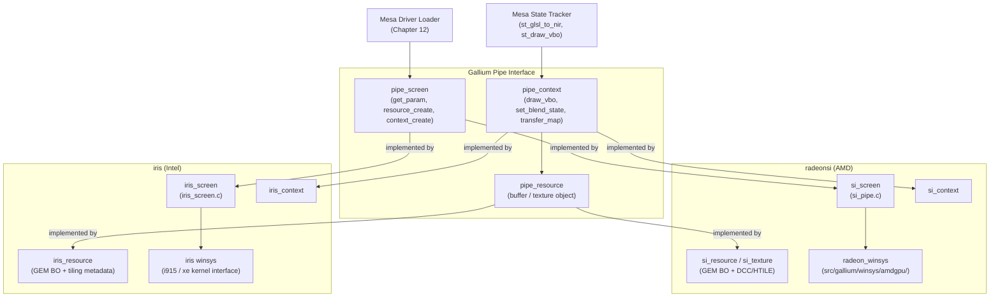
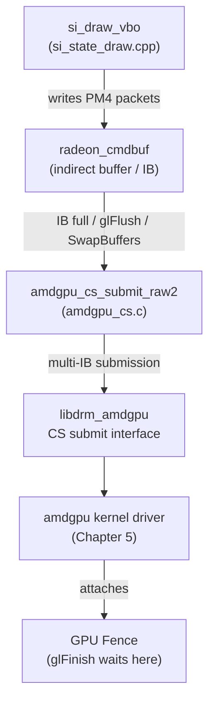
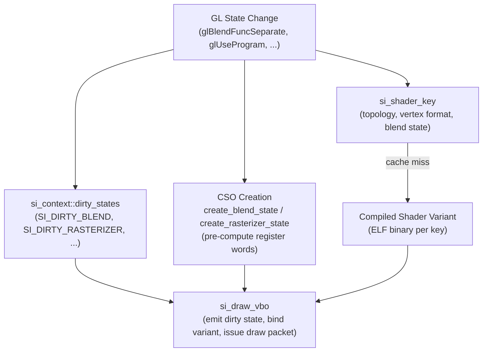
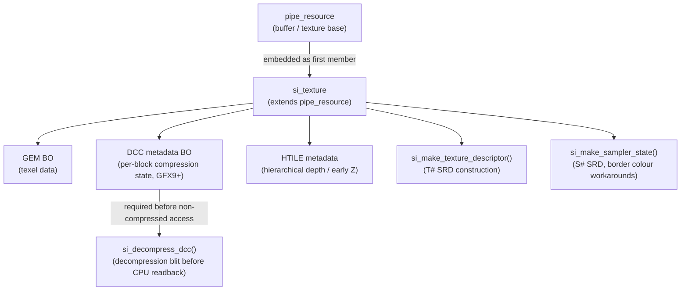
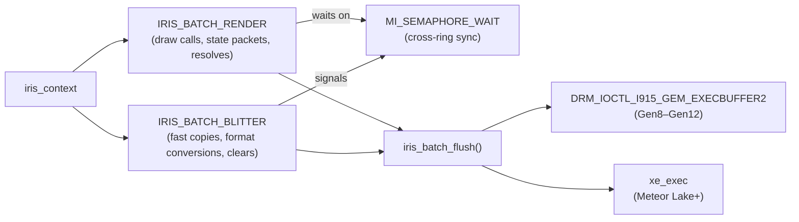
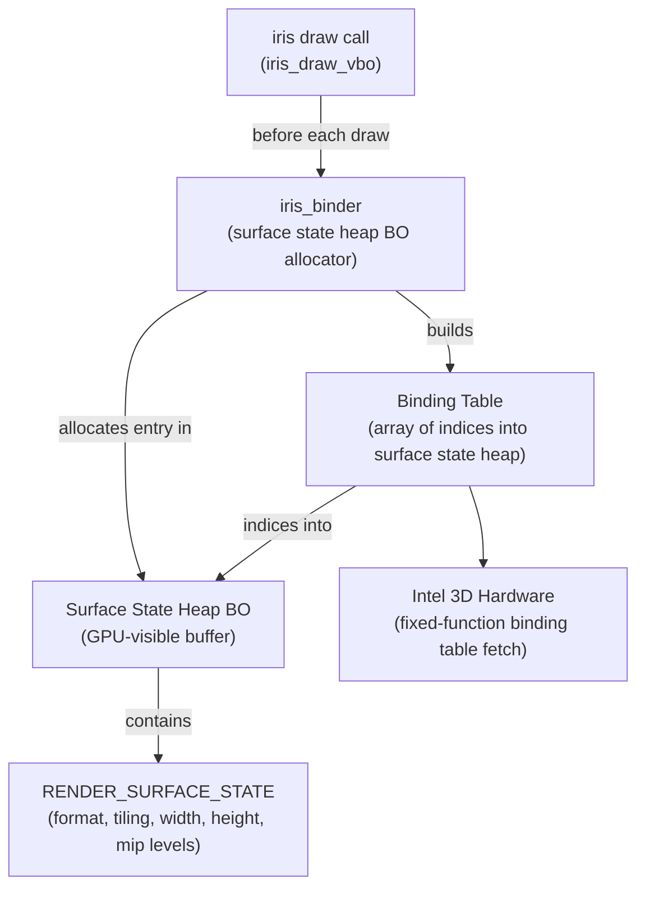
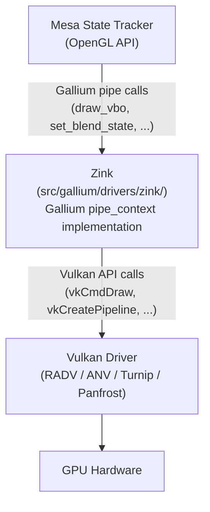
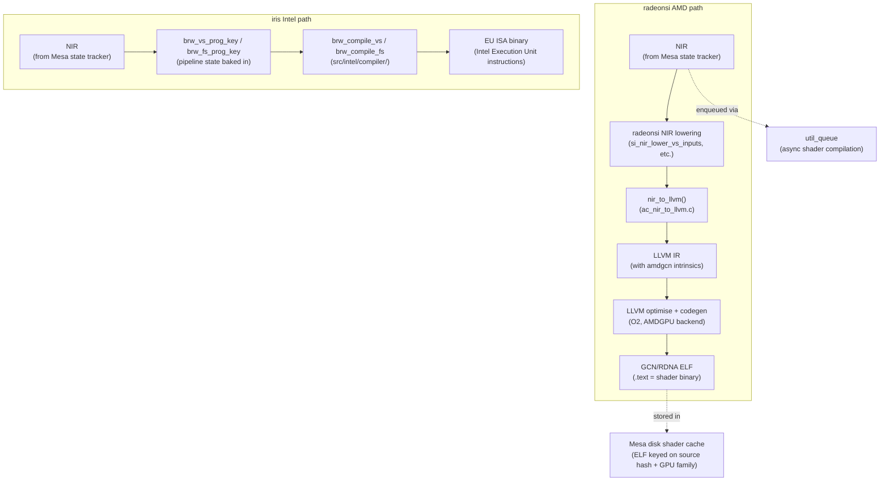
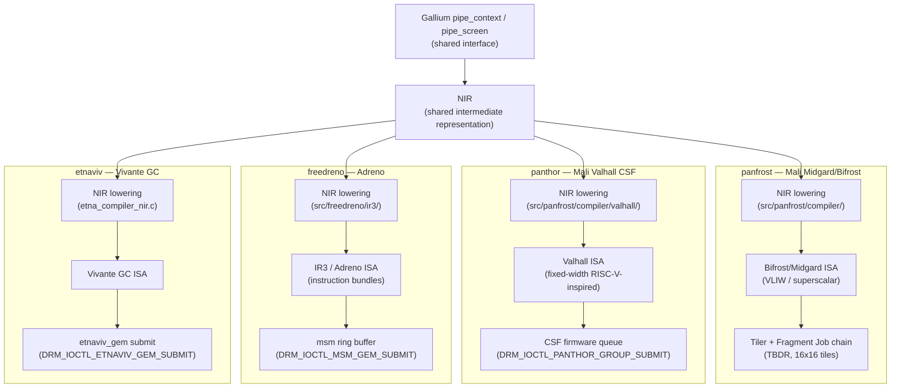

# Chapter 19: OpenGL and Compatibility Drivers

**Part V — Mesa GPU Drivers**

OpenGL is thirty years old, yet it remains the rendering API for a substantial fraction of GPU workloads on Linux:

- **native OpenGL games** — including many titles from the Steam back catalogue
- **Wine's D3D8/D3D9 path**
- **scientific and engineering applications**
- **embedded and automotive displays**
- **X11 applications** — accelerated through Glamor inside XWayland

This chapter covers the three Mesa components that keep OpenGL alive and performant on modern AMD and Intel hardware:

- **radeonsi** — AMD's OpenGL/ES Gallium driver
- **iris** — Intel's modern Gallium driver for Gen8+
- **Zink** — Mesa's Vulkan-backed OpenGL implementation

Together they represent the concrete realisation of the Gallium3D abstractions introduced in Chapter 13, now running against real hardware through the amdgpu and i915/xe kernel drivers described in Chapter 5.

---

## 1. The Gallium Pipe Driver Interface in Practice

Chapter 13 introduced **Gallium3D**'s three central abstractions — **`pipe_screen`**, **`pipe_context`**, and **`pipe_resource`** — as interfaces between the hardware-independent **Mesa** state tracker and hardware-specific driver code. This section explains how **radeonsi** and **iris** satisfy those interfaces in practice, covering loader entry points, the **`PIPE_CAP_*`** capability system, and the full lifecycle of **`pipe_resource`** objects backed by **GEM** buffer objects through the **`radeon_winsys`** and iris winsys abstraction layers.

The chapter then examines each of the three drivers that keep **OpenGL** alive on modern Linux hardware. For **radeonsi** (AMD's **OpenGL**/**GLES** **Gallium** driver), this includes: command submission via **`radeon_cmdbuf`** and **`amdgpu_cs_submit_raw2`**; **CSO** (Constant State Object) caching and **`si_shader_key`**-based shader variant compilation; **NIR** lowering through the **ACO** compiler backend (default since Mesa 26.0; previously **LLVM**); texture and sampler management with **DCC** (Delta Colour Compression) and **HTILE** metadata; **rusticl** integration for **OpenCL** compute via **`pipe_context::launch_grid()`**; and the **Shader DB** regression-tracking system that guards **VGPR** count and instruction-count regressions across the **GFX6**–**GFX12** hardware range. A dedicated deep-dive section later in this chapter covers **PM4 command packet encoding** (`PKT3_SET_CONTEXT_REG`, `si_emit_draw_packets()`), **OpenGL 4.6 extension internals** (`GL_ARB_bindless_texture` via `si_bindless.c`, `GL_ARB_indirect_parameters`, `GL_ARB_sparse_buffer`), **glthread** (`u_threaded_context`) CPU-offload architecture, and the **shared/divergent boundary between radeonsi and RADV**. For **iris** (Intel's **Gallium** driver for **Gen8** through **Xe2**/**Battlemage**), the chapter covers: dual batch ring management (**`IRIS_BATCH_RENDER`** and **`IRIS_BATCH_BLITTER`**) synchronised via **`MI_SEMAPHORE_WAIT`**; the **`iris_binder`** surface state heap and per-draw binding table construction using **`RENDER_SURFACE_STATE`**; shader compilation through the purpose-built **`brw_compile_vs`**/**`brw_compile_fs`** **EU ISA** compiler shared with **ANV**; push-constant versus pull-constant **UBO** handling; and hardware workarounds (**WA_1607087103**, **WA_14010840176**, **CCS_E**) encoded in the **`genX(3DSTATE_*)`** emission functions. Section 3.6 and Section 9 address **Glamor**, the **X server** extension that implements **X11** 2D operations (**XRender**, **XCopyArea**) via **OpenGL ES** on the **DRM** render node (**`/dev/dri/renderD128`**), enabling hardware-accelerated **X11** 2D for all **XWayland** clients.

**Zink** — **Mesa**'s **Vulkan**-backed **OpenGL** implementation — is examined next. Its translation of **Gallium** calls to **Vulkan** API calls (**`vkCmdDraw`**, **`vkCreatePipeline`**, **`VkRenderPass`**, **`VK_KHR_dynamic_rendering`**, **`VK_EXT_graphics_pipeline_library`**) is dissected alongside **GLSL**→**NIR**→**SPIR-V** shader translation via **`nir_to_spirv()`**. The implicit-to-explicit synchronisation bridging (**`zink_resource_image_barrier()`**, **`vkCmdPipelineBarrier`**) and two descriptor management modes (**LAZY** and **DB** via **`VK_EXT_descriptor_buffer`**) are described, together with **Zink**'s performance ceiling in draw-call-limited workloads and its **OpenGL 4.6** conformance milestones with **RADV** (Mesa 23.1) and **ANV** (Mesa 24.0).

Section 5 covers the continuing cost of **OpenGL 4.6** maintenance: the **`GL_ARB_gl_spirv`** and **`GL_ARB_bindless_texture`** extension burden, compatibility-profile emulation of **`glBegin`**/**`glEnd`** and display lists in **`src/mesa/main/`**, and the **`mesa_glthread`** asynchronous GL thread mechanism that decouples application **GL** calls from **`pipe_context`** operations. Section 6 compares **radeonsi** vs. **Zink**-on-**RADV** and **iris** vs. **Zink**-on-**ANV** to guide driver selection, including **Zink** as a portability target for **Panfrost** (**Mali**) and **Turnip** (**Adreno**). Section 7 addresses **OpenGL ES 3.2** support in **radeonsi** and **iris**, and embedded-critical extensions such as **`GL_OES_EGL_image`**, **`GL_OES_EGL_sync`**, and **`GL_EXT_buffer_storage`**.

Section 8 dissects **LLVM** as **radeonsi**'s shader compilation backend: **`nir_to_llvm()`** in **`ac_nir_to_llvm.c`**, **GCN** intrinsics (**`llvm.amdgcn.image.load.*`**, **`llvm.amdgcn.interp.p1`**), the **`LLVMTargetMachine`** selected via **`ac_create_target_machine()`** for **GFX6**–**GFX12**, async compilation via **`util_queue`**, and **Mesa**'s disk shader cache that amortises **LLVM**'s 50–200 ms per-shader cost. The section contrasts this with **iris**/**ANV**'s purpose-built **`brw_compile_*`** **EU ISA** compiler (no **LLVM** in the hot path) and closes with **llvmpipe**/**Lavapipe**'s **LLVM** JIT via the **`lp_bld_*`** infrastructure in **`src/gallium/auxiliary/gallivm/`**.

Section 10 surveys **Mesa**'s ARM and embedded **OpenGL ES** drivers, all sharing the **Gallium** **`pipe_context`** interface and **NIR** but diverging at the ISA layer: **panfrost** for **Mali Midgard**/**Bifrost** **TBDR** architectures with **VLIW** and superscalar ISAs; **panthor** for **Mali Valhall CSF** with **`DRM_IOCTL_PANTHOR_GROUP_SUBMIT`** firmware queues; **lima** for **Mali Utgard** (**Mali-400**/**Mali-450**) at **OpenGL ES 2.0**; **etnaviv** for **Vivante GC** cores on **NXP i.MX** SoCs; and **freedreno** for **Qualcomm Adreno** (**A3xx**–**A7xx**) using the **IR3** compiler and **`DRM_IOCTL_MSM_GEM_SUBMIT`** ring buffer submission via the **`msm`** kernel **DRM** driver.

### Registration and Loader Entry Points

Every Gallium pipe driver exposes a single C entry point that the Mesa driver loader (Chapter 12) calls to obtain a `pipe_screen *`. For radeonsi this entry point is `radeonsi_screen_create()` in `src/gallium/drivers/radeonsi/si_pipe.c`. For iris it is `iris_screen_create()` in `src/gallium/drivers/iris/iris_screen.c`. The loader discovers these symbols by name after `dlopen()`-ing the driver `.so`; the `GALLIUM_DRIVER` environment variable can override which driver `.so` is opened, enabling Zink to be substituted at runtime with `GALLIUM_DRIVER=zink`.

Inside `radeonsi_screen_create()`, the driver allocates an `si_screen` — a struct that embeds a `pipe_screen` as its first member — and fills in every function pointer on `pipe_screen`: `get_name`, `get_vendor`, `get_param`, `resource_create`, `context_create`, and so on. The same pattern applies to iris's `iris_screen`. This C-struct-as-vtable layout is Gallium's design throughout.

### The `pipe_screen` Capability System

`pipe_screen::get_param()` queries hardware capabilities through the `PIPE_CAP_*` enumeration. A driver returns an integer from this function for each cap — for example `PIPE_CAP_MAX_TEXTURE_2D_SIZE`, `PIPE_CAP_COMPUTE`, `PIPE_CAP_TGSI_VS_LAYER_VIEWPORT`. The state tracker reads these caps during context creation and at extension-query time to decide which OpenGL extensions to advertise.

Shader capabilities use a parallel `PIPE_SHADER_CAP_*` enumeration queried through `get_shader_param()`: maximum number of uniforms, maximum input/output registers, whether the driver supports integers in shaders, and so on. A driver that returns 0 for `PIPE_SHADER_CAP_MAX_SHADER_BUFFERS` disables `GL_ARB_shader_storage_buffer_object` at the state tracker level.

Source paths for these cap tables: `src/gallium/include/pipe/p_defines.h` for the enumerations; `src/gallium/drivers/radeonsi/si_get.c` for radeonsi's answers; `src/gallium/drivers/iris/iris_screen.c` for iris's answers.

### `pipe_context` and `pipe_resource` Lifecycle

`pipe_context` is created per OpenGL context; it is not thread-safe. All draw calls, state changes, and resource uploads flow through `pipe_context` function pointers. Key operations: `draw_vbo` (the draw call dispatcher), `set_blend_state`, `set_rasterizer_state`, `create_sampler_state`, `texture_subdata`.

`pipe_resource` is the generic buffer/texture object. The lifecycle is: `screen->resource_create()` → use → `context->resource_copy_region()` or `context->transfer_map()` → `screen->resource_destroy()`. Under the hood, every `pipe_resource` in radeonsi is an `si_resource` backed by a GEM buffer object (BO) allocated through the `radeon_winsys` layer in `src/gallium/winsys/amdgpu/`. In iris it is an `iris_resource` backed by a GEM BO through the i915 or Xe kernel driver.

The winsys abstraction (`radeon_winsys` for AMD, the iris-internal equivalent for Intel) insulates the driver from kernel-level BO allocation details, providing a clean interface for BO creation, mapping, and command stream attachment — the same boundary at which Chapter 5's kernel driver discussion ends.



---

## 2. radeonsi: AMD OpenGL/ES

### 2.1 Architecture and Supported Hardware

radeonsi replaced the older r600g driver in Mesa and supports every AMD GPU from the GCN1 generation (Southern Islands, GFX6) through the current RDNA4 (GFX12). It is, alongside RADV (Chapter 18), the primary path by which AMD GPUs are used on Linux.

The object hierarchy mirrors the Gallium pattern with AMD-specific extensions:

- `si_screen` (embeds `pipe_screen`): per-GPU global state, GPU info (`radeon_info`), the shader disk cache, LLVM target machine reference
- `si_context` (embeds `pipe_context`): per-context command stream, dirty state bitmask, CSO caches, descriptor ring
- `si_resource` / `si_texture` (embeds `pipe_resource` / `pipe_texture`): GEM BOs with additional AMD-specific metadata (DCC, HTILE)

Hardware generation gating uses the `gfx_level` field (values `GFX6` through `GFX12`) from `radeon_info`, the same enumeration that RADV uses. Code paths guarded by `sscreen->info.gfx_level >= GFX10` versus `>= GFX11` are common throughout radeonsi.

radeonsi and RADV share significant infrastructure under `src/amd/common/` (hardware register definitions, format tables, NIR lowering passes) and `src/amd/llvm/` (the LLVM backend, detailed in Section 8). This sharing means a fix to, say, GFX11 image descriptor construction benefits both drivers simultaneously.

### 2.2 Command Submission and the CS Pipeline

The radeonsi command stream is represented by `radeon_cmdbuf` (historically called `radeon_cs`). Each `si_context` has a primary command buffer for rendering. The winsys layer manages allocation of indirect buffers (IBs) from a ring allocator; the driver writes PM4 packets directly into these IBs.

Flush is triggered by: the IB reaching capacity, an explicit `glFlush` or `glFinish`, or an implicit flush at `SwapBuffers` time. The flush function calls through to `amdgpu_cs_submit_raw2` in `src/gallium/winsys/amdgpu/drm/amdgpu_cs.c`, which packages the IB list into a multi-IB submission and calls `libdrm_amdgpu`'s CS submit interface. Fences are attached per submission; `glFinish` waits on the most recently submitted fence.

Conditional rendering (`glBeginConditionalRender`) is implemented in hardware: the occlusion query result BO is used as a predicate for `DRAW_INDIRECT` with a conditional bit, avoiding a CPU readback.

Transform feedback (streamout) is handled by `si_emit_streamout_begin` for pre-GFX11 hardware. GFX11 (RDNA3) rearchitected NGG streamout, requiring a separate code path in `si_state_draw.cpp` to handle the new packet-level differences.

Source: `src/gallium/drivers/radeonsi/si_state_draw.cpp`, `src/gallium/winsys/amdgpu/drm/amdgpu_cs.c`.



### 2.3 State Management and CSO Caching

Gallium's Constant State Object (CSO) pattern works as follows: the state tracker calls a `create_*_state` function once when a GL state object is created (e.g., on first call to `glBlendFuncSeparate` with a given combination), receiving an opaque CSO pointer. radeonsi pre-compiles the blend equations, rasteriser settings, and depth/stencil state into packed register words at CSO creation time — this defers the register-encoding work away from the draw call hot path.

Key CSO creation functions: `si_create_blend_state`, `si_create_rasterizer_state`, `si_create_depth_stencil_alpha_state`. Each returns a driver-internal struct containing the pre-computed register values.

Dirty state tracking uses `si_context::dirty_states` — a bitmask of flags such as `SI_DIRTY_BLEND`, `SI_DIRTY_RASTERIZER`, `SI_DIRTY_VIEWPORT`. `si_draw_vbo` consults this bitmask and calls the corresponding emit function for each dirty bit before issuing the draw packet. This per-bit emission pattern keeps the critical draw path fast: only changed state is re-emitted.

**Shader variant keys** are central to radeonsi's performance model. A shader's compiled binary is not unique to the GLSL source alone; it is keyed on the combination of source and pipeline state that is baked into the shader (primitive topology, vertex buffer formats, blend state, etc.). The `si_shader_key` struct encodes this information; when any key field changes, radeonsi compiles a new shader variant. This allows the compiler to emit optimised code for specific state combinations — for example, inlining blend constants when they are known at compile time — at the cost of potentially many variants per shader.



```c
// src/gallium/drivers/radeonsi/si_shader.h (simplified)
union si_shader_key {
    struct {
        // Vertex shader key fields
        uint8_t  vs_export_prim_id : 1;
        uint8_t  vs_as_ls          : 1;   // VS used as LS for tessellation
        uint8_t  vs_as_es          : 1;   // VS used as ES for geometry
        // ... vertex buffer format fields per-attrib ...
    } vs;
    struct {
        // Fragment shader key fields
        uint8_t  ps_clamp_color      : 1;
        uint8_t  ps_alpha_to_one     : 1;
        uint32_t ps_blend_func_rgb;       // encoded blend equation
        // ...
    } ps;
};
```

### 2.4 Shader Compilation: NIR Backend

GLSL shaders arrive at radeonsi already translated to NIR by the Mesa state tracker (`st_glsl_to_nir`). radeonsi then runs its own NIR lowering passes before handing the IR to the LLVM backend (Section 8 covers this path in depth).

radeonsi-specific NIR passes include: `si_nir_lower_vs_inputs` (maps vertex buffer descriptors and instance divisors into NIR), `si_nir_lower_ps_color_input` (handles fragment shader colour input interpolation variants), and various GLSL-to-hardware varying packing passes.

Asynchronous shader compilation is implemented via `util_queue`: when a new shader variant is needed, radeonsi enqueues the compilation job on a background thread pool and substitutes a NOP (no-operation) shader for the first few frames until compilation completes. The `RADEONSI_DEBUG=noshaderqueue` flag disables async compilation for debugging — replacing it with synchronous compilation so hangs are easier to attribute.

Source: `src/gallium/drivers/radeonsi/si_shader_nir.c`, `src/amd/llvm/`, `src/amd/common/ac_nir*.c`.

### 2.5 Texture and Sampler Management

`si_texture` extends `pipe_resource` with AMD-specific fields: the GEM BO containing the texel data, a separate BO for DCC metadata, and flag fields recording whether DCC or HTILE is active.

**DCC (Delta Colour Compression)** is AMD's lossless colour compression, available from GFX9 onward on most formats. The DCC metadata buffer stores per-block compression state; a hardware DCC decompression pass is required before formats become accessible to non-compressed paths (e.g., CPU readback, format conversion blits). radeonsi tracks whether DCC is active on a texture and inserts decompress blits where needed — the `si_decompress_dcc` function handles this.

**HTILE** (Hierarchical Depth) provides lossless depth buffer compression and early depth rejection. The HTILE compatibility rules constrain which operations can be performed while HTILE is active; radeonsi disables HTILE when operations violate those rules (e.g., certain depth-stencil copies).

Texture descriptors (`T#` SRDs in GCN terminology) are constructed by `si_make_texture_descriptor()`. Sampler descriptors are constructed by `si_make_sampler_state()`, which includes workarounds for border colour hardware limitations on some GFX generations (border colours are indexed from a hardware table on older GCN, not encoded directly in the sampler descriptor).



### 2.6 Compute in radeonsi: rusticl Integration

rusticl (Mesa's OpenCL implementation, covered in Chapter 25) attaches to radeonsi through the same `pipe_context` interface that OpenGL uses. Compute dispatches use `PIPE_SHADER_COMPUTE` and the `pipe_context::launch_grid()` function pointer, which in radeonsi calls `si_emit_compute_state` and issues a `DISPATCH_DIRECT` PM4 packet.

The integration is seamless from radeonsi's perspective: storage buffers, images, and constant buffers are bound through the same resource descriptor mechanism used for graphics shaders. A compute dispatch and a draw call from the same `si_context` see the same resource binding infrastructure.

### 2.7 Shader DB and Regression Tracking

**Shader DB** is a regression-tracking system maintained alongside Mesa. It consists of a collection of canonical GLSL shader programs and a script that compiles them through the driver's shader compiler, measuring ISA-level metrics: instruction count, VGPR (vector register) count, SGPR (scalar register) count, and scratch memory usage.

The critical metric for GPU performance is VGPR count: GCN GPUs can run more wavefronts concurrently (higher "occupancy") when each wavefront uses fewer VGPRs. A patch that increases VGPR count for a common fragment shader reduces occupancy and causes a measurable performance regression even if no functional test fails.

Before merging a radeonsi patch, developers run shader-db against the full corpus and compare output. A typical regression report looks like:

```text
# shader-db comparison (radeonsi, GFX10 / Navi10)
shaders/game_title/uber_fragment.glsl  VGPR: 48 -> 56  (+8, -16% occupancy)
shaders/game_title/terrain_vs.glsl     VGPR: 24 -> 24  (no change)
shaders/game_title/shadow_ps.glsl      Code: 1024 -> 896  (-12%, regression fixed)
```

The `RADEONSI_DEBUG=vs,ps,cs` flags dump the final compiled ISA for each shader stage to stderr, enabling manual comparison when shader-db output is ambiguous.

Source: `src/tools/glsl_trace/`; shader-db repository: https://gitlab.freedesktop.org/mesa/shader-db.

---

## 3. iris: Intel OpenGL/ES on Gen8+

### 3.1 Architecture and Supported Hardware

iris replaced the older i965 driver as Intel's primary OpenGL/ES implementation. While i965 still handles Gen4 through Gen7.5 (Ivy Bridge, Haswell), iris covers Gen8 (Broadwell) through the current Xe2 (Battlemage) generation. iris uses the same kernel driver (i915 for Gen8–Gen12, the new `xe` DRM driver for Meteor Lake and later) as the ANV Vulkan driver (Chapter 18).

The object hierarchy:

- `iris_screen` (embeds `pipe_screen`): per-GPU state, `intel_device_info`, shader cache
- `iris_context` (embeds `pipe_context`): render and blitter batch rings, dirty state, shader programs, resource binding
- `iris_resource` (embeds `pipe_resource`): GEM BO, tiling/compression metadata

`intel_device_info` is shared between iris and ANV. It encodes the GPU's capability flags, per-subslice thread counts, workaround tables, and constants derived from Intel's PRMs. This shared structure means that hardware detection code and workaround flags are maintained once and benefit both drivers.

Source: `src/gallium/drivers/iris/`.

### 3.2 Batch Execution and Ring Management

`iris_batch` is the analogue of ANV's batch buffer management. Unlike radeonsi, which uses a single command stream, iris maintains **two batch rings per context**:

- `IRIS_BATCH_RENDER`: commands for 3D rendering (draw calls, state packets, resolves)
- `IRIS_BATCH_BLITTER`: commands for the GPU's fixed-function copy engine (fast memory copies, format conversions, clear operations)

Separating the render and blitter rings allows the blitter to run concurrently with rendering on hardware that supports it, and simplifies synchronisation reasoning. The two rings synchronise via `MI_SEMAPHORE_WAIT` packets: the render ring waits on a semaphore value written by the blitter ring after a copy completes, and vice versa.



`iris_batch_flush()` is called to submit outstanding commands. It constructs the final batch buffer, attaches relocations (for Gen8–Gen11 which require relocation) or directly encodes GPU virtual addresses (for Gen12+, which has 48-bit PPGTT), and calls either `DRM_IOCTL_I915_GEM_EXECBUFFER2` (i915 driver) or `xe_exec` (Xe driver). The `xe_exec` path was added in Mesa 24.1 to support Meteor Lake and later hardware running the Xe DRM kernel driver.

Source: `src/gallium/drivers/iris/iris_batch.c`, `src/gallium/drivers/iris/iris_fence.c`.

### 3.3 Surface State Heap and the Binding Table

Intel's 3D hardware uses a fixed-function binding table: an array of indices into a surface state heap buffer object, where each index points to a `RENDER_SURFACE_STATE` structure describing a texture or render target.

`iris_binder` is the iris allocator for the surface state heap BO. Before each draw call, iris constructs a binding table mapping resource bindings to surface state entries. Each entry encodes format, tiling mode, width, height, mip levels, and other surface properties, all packed according to the hardware format described in Intel's Graphics PRMs.

This approach contrasts with ANV's global bindless heap: ANV (using `VK_EXT_descriptor_indexing`) can maintain a persistent descriptor heap and avoid per-draw binding table construction. iris uses per-draw binding tables for OpenGL compatibility — OpenGL's implicit binding model requires re-examining bindings at each draw call, while Vulkan's explicit model allows pre-built persistent descriptor sets.

The performance implication is that binding table construction is in the critical draw-call path for iris. At very high draw-call rates this becomes a measurable CPU overhead, which is one reason iris benefits significantly from `mesa_glthread` (Section 5).



### 3.4 Shader Compilation

iris and ANV share the same Intel compiler infrastructure: `src/intel/compiler/brw_compile_*.c`. This is a purpose-built compiler that lowers NIR directly to EU (Execution Unit) ISA — Intel's internal GPU instruction set — without LLVM as an intermediate. Section 8.7 discusses why this is significant for compile-time latency.

The iris entry points are `iris_compile_vs`, `iris_compile_fs`, `iris_compile_cs`, and their tessellation/geometry equivalents. Each constructs a `brw_vs_prog_key` (or `brw_fs_prog_key`, etc.) from current pipeline state — the same role as radeonsi's `si_shader_key` — and passes it to the shared `brw_compile_*` functions.

Push constants versus pull constants: Intel EU has a fixed-size push constant register file. Small uniform buffer objects (UBOs) whose contents fit in the push register file are inlined at draw time; larger UBOs are accessed via "pull" data port messages during shader execution. The compiler makes this decision based on UBO size at compile time.

The `IRIS_DEBUG=bat,pc,state` flags enable tracing of batch contents, push constants, and state packets, respectively.

```c
// src/gallium/drivers/iris/iris_program.c (simplified)
static void
iris_compile_vs(struct iris_screen *screen,
                struct iris_uncompiled_shader *ish,
                const struct brw_vs_prog_key *key)
{
    struct brw_compile_vs_params params = {
        .base = {
            .mem_ctx    = mem_ctx,
            .nir        = nir,               // NIR from state tracker
            .log_data   = &screen->dev_info,
        },
        .key       = key,
        .prog_data = &prog_data,
    };
    // Calls into src/intel/compiler/brw_compile_vs.c
    const unsigned *assembly = brw_compile_vs(screen->compiler, &params);
    // Store compiled binary in iris_shader_state cache
}
```

### 3.5 Hardware Workarounds in iris

Intel GPUs accumulate errata (bugs and limitations) that software must work around. iris encodes these in the `genX(3DSTATE_*)` emission functions, annotated with workaround identifiers from Intel's internal bug database.

Examples relevant to OpenGL:

- **WA_1607087103** (Gfx11): depth buffer format restrictions; iris emits an additional depth format state packet on Gfx11 to avoid a hardware bug with certain depth format configurations.
- **WA_14010840176** (Gfx12): stencil resolve operation must be done with a specific stencil-only attachment configuration; iris inserts a synchronisation stall before the resolve.

`iris_resolve_color` and `iris_resolve_depth` handle the two resolution operations that Intel hardware requires: render target (MCS) resolves to make render output accessible to sampling, and HiZ (hierarchical Z) resolves to synchronise the depth pyramid with the full-resolution depth buffer.

Gen12 (Tiger Lake) introduced **CCS_E** (Compressed Clear State E), a new multi-sample compression format that changed the semantics of colour clears and resolves. The CCS_E support required significant iris changes landing in Mesa 21.0; older Mesa on Gen12 hardware had known correctness issues with certain render target operations.

Source: `src/gallium/drivers/iris/iris_resolve.c`.

### 3.6 Glamor: 2D X11 Acceleration via OpenGL ES

Glamor is an X server extension that implements X11 2D drawing operations using OpenGL or OpenGL ES rather than a dedicated 2D hardware engine. XWayland uses Glamor to accelerate 2D operations for X11 clients running under a Wayland compositor.

Glamor reaches iris (and radeonsi) through an EGL context created on the DRM render node (`/dev/dri/renderD128`). The context is created with `EGL_OPENGL_ES_API` — specifically GLES2 or GLES3 — which routes through the same `iris_context` code path as any other GLES application. X11 Render `CompositeTriangles` operations become GLES triangle draws in Glamor; `XCopyArea` becomes a textured-quad draw.

The architectural advantage: any GPU with a working GLES implementation gets hardware-accelerated X11 2D for free, without a separate 2D driver. The trade-off: GPU dispatch overhead makes Glamor slower than software for very small, frequent `XCopyArea` operations. Section 9 covers Glamor architecture in full breadth; this section focuses on how iris's GLES path is exercised.

---

## 4. Zink: OpenGL on Vulkan

### 4.1 Design Goals and Architecture

Zink is a Gallium pipe driver that implements the pipe interface not by generating GPU-specific command streams, but by translating Gallium calls into Vulkan API calls. The underlying GPU is addressed entirely through Vulkan.

The motivation is strategic: as new GPU families arrive, they often have Vulkan drivers (via community efforts like Turnip for Adreno, Panfrost for Mali) before native OpenGL drivers. Zink gives those GPUs full OpenGL support immediately. More broadly, Mesa developers view Zink as the long-term path for OpenGL: rather than maintaining separate OpenGL and Vulkan code paths for every GPU family, the OpenGL layer is written once (Zink), and hardware work concentrates on Vulkan drivers.

Zink's position in the stack: it sits between the Mesa state tracker (which produces Gallium calls) and a Vulkan driver (which accepts Vulkan calls). It does not call into any hardware-specific code directly.



Source: `src/gallium/drivers/zink/`.

### 4.2 Translating Gallium to Vulkan

**Resources**: `pipe_resource` maps to either `VkBuffer` (for buffer objects) or `VkImage` (for textures and render targets). Allocation goes through `vkAllocateMemory` (or, on drivers supporting `VK_EXT_memory_budget`, through a Mesa-internal allocator on top of that extension).

**Draw calls**: `pipe_draw_info` translates to `vkCmdDraw` or `vkCmdDrawIndexed`. The base vertex and base instance fields, which Vulkan encodes as push constants rather than as draw call parameters, are uploaded immediately before the draw command.

**Render passes**: Zink builds `VkRenderPass` objects (or uses `VK_KHR_dynamic_rendering` when available) from Gallium framebuffer state. Dynamic rendering avoids the explicit render pass object creation and is preferred when the underlying Vulkan driver supports Vulkan 1.3 or the extension.

**Pipeline objects**: This is Zink's most complex mapping challenge. Gallium CSOs correspond to sub-parts of a Vulkan graphics pipeline. Zink uses `VK_EXT_graphics_pipeline_library` when available to build pipelines incrementally from independently-cached sub-pipelines (vertex input, pre-rasterisation, fragment output, fragment shader), amortising the cost of full pipeline compilation across CSO changes.

```c
// src/gallium/drivers/zink/zink_draw.cpp (simplified call flow)
void zink_draw_vbo(struct pipe_context *pctx,
                   const struct pipe_draw_info *dinfo,
                   ...)
{
    struct zink_context *ctx = zink_context(pctx);

    // 1. Ensure all resource image layouts are correct (insert barriers if needed)
    zink_update_barriers(ctx, false, dinfo->index.resource, ...);

    // 2. Update descriptor sets (lazy or descriptor-buffer mode)
    zink_descriptors_update(ctx, false);

    // 3. Bind the current graphics pipeline
    vkCmdBindPipeline(cmdbuf, VK_PIPELINE_BIND_POINT_GRAPHICS, ctx->gfx_pipeline);

    // 4. Upload push constants (base vertex, base instance, etc.)
    vkCmdPushConstants(cmdbuf, layout, stages, 0, sizeof(push), &push);

    // 5. Issue the draw
    if (dinfo->index_size)
        vkCmdDrawIndexed(cmdbuf, dinfo->count, dinfo->instance_count, ...);
    else
        vkCmdDraw(cmdbuf, dinfo->count, dinfo->instance_count, ...);
}
```

Source: `src/gallium/drivers/zink/zink_draw.cpp`, `src/gallium/drivers/zink/zink_pipeline.c`.

### 4.3 Shader Translation: GLSL → NIR → SPIR-V

GLSL shaders arrive at Zink as NIR (already translated by the state tracker). Zink compiles NIR to SPIR-V using `nir_to_spirv()` in `src/compiler/spirv/nir_to_spirv.c`, then passes the SPIR-V to `vkCreateShaderModule` in the underlying Vulkan driver, which re-compiles it to machine code.

The full round-trip is: GLSL → (Mesa state tracker) → NIR → (Zink) → SPIR-V → (Vulkan driver) → NIR → machine code. This is longer than radeonsi's or iris's path, but the NIR optimisation passes running before SPIR-V emission mean the SPIR-V Zink produces is typically cleaner than raw GLSL-to-SPIR-V translations.


`ZINK_DEBUG=spirv` dumps the emitted SPIR-V for each shader to stderr, useful for diagnosing incorrect shader output or inspecting what Vulkan extensions Zink requires the underlying driver to support.

### 4.4 Synchronisation Model Mismatch

OpenGL's synchronisation model is **implicit**: the driver is responsible for ensuring that a texture written by a draw call is visible when that texture is subsequently sampled. Vulkan's model is **explicit**: the application must insert pipeline barriers between operations that write and read the same resource, specifying source/destination pipeline stages and access masks.

Zink must bridge this gap entirely in software. It tracks the image layout and pending access type for every `VkImage` in a per-resource state object. Before each draw call and before each image read, `zink_resource_image_barrier()` compares the current and required layouts and inserts `vkCmdPipelineBarrier` calls as needed.

```c
// src/gallium/drivers/zink/zink_resource.c (conceptual)
void zink_resource_image_barrier(struct zink_context *ctx,
                                 struct zink_resource *res,
                                 VkImageLayout new_layout,
                                 VkAccessFlags new_access,
                                 VkPipelineStageFlags new_stage)
{
    if (res->layout == new_layout &&
        res->access == new_access)
        return;  // no transition needed

    VkImageMemoryBarrier barrier = {
        .sType            = VK_STRUCTURE_TYPE_IMAGE_MEMORY_BARRIER,
        .oldLayout        = res->layout,
        .newLayout        = new_layout,
        .srcAccessMask    = res->access,
        .dstAccessMask    = new_access,
        .image            = res->obj->image,
        .subresourceRange = full_range,
    };
    vkCmdPipelineBarrier(cmdbuf,
                         res->access_stage, new_stage,
                         0, 0, NULL, 0, NULL, 1, &barrier);
    res->layout       = new_layout;
    res->access       = new_access;
    res->access_stage = new_stage;
}
```

Over-synchronisation (inserting barriers that are more conservative than strictly necessary) is the primary correctness-for-performance trade-off in Zink. The synchronisation code has been progressively refined to be less conservative, but it remains one of Zink's headline overheads in high-throughput rendering.

### 4.5 Descriptor Management

Zink implements two descriptor management modes, selected via the `ZINK_DESCRIPTORS` environment variable:

- **LAZY** (default): Descriptor sets are allocated from pools and updated with `vkUpdateDescriptorSets` before each draw call. Zink maintains a cache keyed on the current resource binding state to avoid redundant updates, but the overhead is still proportional to the number of unique binding combinations seen per frame.
- **DB** (descriptor buffer): Uses `VK_EXT_descriptor_buffer` to write descriptors directly into a GPU-visible buffer, bypassing descriptor pool management. This mode reduces CPU overhead for descriptor writes at the cost of requiring driver support for the extension.

Push descriptors (`VK_KHR_push_descriptor`) provide a fast path for frequently-changing bindings — Zink uses them for uniforms and other per-draw data when the extension is available.

`ZINK_DEBUG=descriptor` traces descriptor allocation and update operations.

### 4.6 Performance Ceiling and Known Limitations

The fundamental overhead of Zink's translation layer is CPU-time: state translation, barrier insertion, and descriptor management all happen on the CPU at draw time. In workloads with few draw calls and expensive GPU shaders, this overhead is negligible. In draw-call-limited workloads (many small objects, immediate-mode rendering, display lists), Zink's CPU overhead can cause meaningful performance regression versus native radeonsi or iris.

Areas where Zink is competitive: compute-heavy workloads, large-batch rendering, workloads on hardware that lacks a native GL driver (Mali/Panfrost, Adreno/Turnip), and CI/conformance testing via Lavapipe+Zink.

Zink achieved OpenGL 4.6 conformance with RADV as the backing driver in Mesa 23.1, and with ANV in Mesa 24.0. These represent full official conformance, not just extension coverage. `GALLIUM_DRIVER=zink` and `MESA_LOADER_DRIVER_OVERRIDE=zink` force Zink for testing purposes.

---

## 5. The Long Tail: Maintaining OpenGL 4.6 on Modern Hardware

OpenGL 4.6 is not a legacy API that Linux has abandoned — it is actively required. Steam's Linux game catalogue includes many titles that use OpenGL directly; Wine uses OpenGL for D3D8 and D3D9 games; scientific software (MATLAB, ParaView, Blender's EEVEE legacy path) requires it; automotive and industrial Linux deployments depend on GLES 3.x. The Mesa developers who maintain radeonsi, iris, and Zink are funding full-time OpenGL maintenance.

**The extension burden**: OpenGL 4.6 mandates `GL_ARB_gl_spirv` (SPIR-V shader ingestion), `GL_ARB_bindless_texture` (bindless texture handles), and `GL_ARB_direct_state_access` (DSA). These are not lightweight additions — SPIR-V ingestion requires a full SPIR-V → NIR round-trip path, and bindless textures require hardware support or software emulation of non-indexed texture access.

**Deprecated paths that persist**: The OpenGL compatibility profile requires that `glBegin`/`glEnd` immediate mode, display lists, feedback mode, and selection mode all continue to work. Mesa handles these through the state tracker's compatibility profile emulation layer (`src/mesa/main/`). Coverage is partial: Mesa's compatibility profile is sufficient for most legacy applications but does not pass the full `GL_ARB_compatibility` CTS.

**`mesa_glthread`**: The asynchronous GL thread feature, implemented in `src/mesa/main/glthread.c`, decouples the application's GL API calls from the driver's `pipe_context` operations. When enabled (controlled by driconf or `mesa_glthread=true`), OpenGL calls from the application thread are serialised into a work queue; a background thread dequeues them and calls the actual pipe driver. This reduces stalls on applications whose GL submission is CPU-bound (the application waits for each GL call to return before making the next one).

`mesa_glthread` helps latency-bound single-threaded applications. It can hurt multi-threaded applications or those that call `glFinish` frequently, because `glFinish` on the main thread must flush the queue and wait, adding a round-trip through the queue.

**Version override environment variables**: `MESA_GL_VERSION_OVERRIDE=4.6` forces Mesa to report OpenGL 4.6 even if the driver has not fully qualified it. `MESA_GLSL_VERSION_OVERRIDE=460` similarly overrides the GLSL version. These are useful for testing and for applications that refuse to run if the reported version is below a threshold — but they do not enable extensions the hardware does not support. Using them to run applications that actually exercise unimplemented extension paths will cause crashes or incorrect rendering.

---

## 6. Comparing the Drivers: When to Use Which

**radeonsi vs. Zink-on-RADV for AMD OpenGL**: radeonsi is the production AMD OpenGL driver: mature, fully conformant, with a decades-long history of performance work and the shader-db regression system. Zink-on-RADV is the emerging path; it passed OpenGL 4.6 conformance in Mesa 23.1 and has been improving rapidly. For desktop gaming and mature applications, radeonsi is the right choice today. Zink-on-RADV is preferred for: testing Vulkan driver correctness, running OpenGL on hardware that only has a Vulkan driver, and as a migration path when radeonsi LLVM compilation time is a concern.

**iris vs. Zink-on-ANV for Intel OpenGL**: The same argument applies. iris is the production Intel OpenGL driver with Xe2 support and known-good hardware workarounds. Zink-on-ANV reached OpenGL 4.6 conformance in Mesa 24.0. The direction of travel is the same: Zink is the future, iris is production today.

**Zink as a portability target**: Zink is already the primary OpenGL implementation for Panfrost (Mali GPU family) and was the first OpenGL path for Turnip (Adreno), which later added its own native OpenGL support. For any new GPU family with a working Vulkan driver, Zink provides OpenGL automatically.

**The future trajectory**: Mesa developers are increasingly treating Zink as the universal OpenGL implementation. Long-term, native GL drivers will concentrate on performance-critical paths while Zink handles conformance. This mirrors the industry-wide consolidation around Vulkan as the baseline GPU interface.

---

## 7. OpenGL ES and the Embedded Target

radeonsi and iris support OpenGL ES 3.2 using the same driver code as desktop OpenGL. The distinction is made at context creation time: `eglCreateContext` with `EGL_OPENGL_ES3_BIT` in the config attribute requests a GLES3 context, which Mesa routes to the same `si_context` or `iris_context` with GLES-specific capability reporting.

Important GLES extensions for Android compatibility layers and embedded Linux:

- `GL_OES_EGL_image`: allows EGL images (dmabuf-backed) to be imported as GLES textures; critical for camera, media decode, and compositor integration
- `GL_OES_EGL_sync`: EGL sync objects for cross-process GPU synchronisation; used by gralloc-based buffer sharing
- `GL_EXT_buffer_storage`: persistent, coherent buffer mapping, enabling zero-copy data paths between CPU and GPU

Non-Android embedded Linux contexts include automotive infotainment systems (many use GLES2/3 for cluster and IVI displays), digital signage, and kiosk applications. These often run on Intel Atom or AMD Embedded Radeon hardware where iris and radeonsi are the GPU drivers.

---

## 8. LLVM as a Mesa Compiler Backend

### 8.1 radeonsi Compiler Backend History: LLVM to ACO

ACO (the AMD compiler in RADV, described in Chapter 15) was designed for the Vulkan driver's requirements: predictable, low-latency compilation with a self-contained code generator. It was originally not available in radeonsi; radeonsi used LLVM exclusively until Mesa 23.2 added an opt-in `AMD_DEBUG=useaco` flag, followed by Mesa 24.0 making ACO feature-complete for radeonsi OpenGL, and finally Mesa 26.0 making ACO the **default** for all radeonsi shader compilation. [Source: Phoronix, "AMD RadeonSI Driver Now Defaults To Enabling ACO"](https://www.phoronix.com/news/RadeonSI-ACO-Default-Mesa-26.0)

**Current state (Mesa 26.0+):** radeonsi defaults to ACO for all shader stages. LLVM remains available as a fallback via `AMD_DEBUG=usellvm` for debugging and correctness comparison. The historical LLVM-first design is preserved in the codebase (`src/amd/llvm/`, `src/gallium/drivers/radeonsi/si_shader_llvm.c`) and Section 8.2 onwards documents that path, which remains authoritative for the LLVM backend's mechanics.

The transition matters for understanding radeonsi's performance model: ACO's roughly 8× lower compile latency means first-frame shader stutter is now much reduced compared to the LLVM era. The async shader queue and disk cache (Section 8.5) are still present and still help with cache-miss cold starts, but their role is less critical than when LLVM could take 50–200 ms per shader.

The OpenGL compilation model also differs from Vulkan's: OpenGL shaders are compiled on first use, with implicit caching. radeonsi's async shader queue (Section 2.4) and disk cache (Section 8.5) mitigate per-shader cost in a way that is less applicable to Vulkan's explicit pipeline model, where the application controls pipeline compilation timing.

### 8.2 The radeonsi LLVM Path

The entry point is in `src/gallium/drivers/radeonsi/si_shader_llvm.c`, which calls into `src/amd/llvm/` for shared AMD LLVM infrastructure. The central function is `nir_to_llvm()` in `src/amd/llvm/ac_nir_to_llvm.c`, which walks NIR instructions and emits LLVM IR using the LLVM C API.

The `ac_llvm_context` struct (in `src/amd/llvm/ac_llvm_build.c`) wraps the LLVM `LLVMContextRef`, `LLVMModuleRef`, and the AMD-specific intrinsic function list. It is shared between radeonsi and RADV's LLVM path, ensuring that both drivers exercise the same backend code when RADV uses LLVM for debugging.

### 8.3 LLVM IR Generation: NIR Intrinsics to GCN Intrinsics

The NIR-to-LLVM translation covers each NIR opcode and intrinsic:

- **Image loads** (`nir_intrinsic_image_load`): emit `llvm.amdgcn.image.load.*` intrinsics with the resource descriptor (T#) as an argument. The intrinsic encodes the image dimension (1D/2D/3D/Cube) and the data format.
- **Atomic operations** (`nir_intrinsic_image_atomic_*`): map to `llvm.amdgcn.image.atomic.*`; buffer atomics use `llvm.amdgcn.buffer.atomic.*`.
- **Interpolation** (`nir_intrinsic_load_interpolated_input`): translates to the two-phase `llvm.amdgcn.interp.p1` / `llvm.amdgcn.interp.p2` intrinsics, matching GCN's hardware interpolation model.
- **Control flow**: NIR structured control flow (`nir_if`, `nir_loop`) is lowered to LLVM basic blocks and branches using `ac_build_if()` / `ac_build_bgnloop()` helper functions in `ac_llvm_build.c`.

Divergence: `nir_divergence_analysis` determines which values are wave-uniform (eligible for SGPRs) versus lane-varying (require VGPRs). The LLVM AMDGPU backend also performs its own divergence analysis, but Mesa's pre-pass guides which code path is taken before LLVM applies its register assignment.

### 8.4 The LLVMTargetMachine for GCN/RDNA

The AMDGPU backend (`lib/Target/AMDGPU/` in the LLVM tree) supports GFX6 through GFX12. Mesa creates the target machine via `ac_create_target_machine()` in `src/amd/llvm/ac_llvm_util.c`, selecting the appropriate `-mcpu=` string:

```text
GFX6  (Southern Islands)  → -mcpu=tahiti
GFX9  (Vega)              → -mcpu=gfx906
GFX10 (RDNA1)             → -mcpu=gfx1010
GFX11 (RDNA3)             → -mcpu=gfx1100
GFX12 (RDNA4)             → -mcpu=gfx1200
```

Target features such as `-mattr=+wavefrontsize64` (wave64 mode, required for pre-GFX10) and `-mattr=+cumode` (CU-mode scheduling) are set in `si_shader_llvm.c` based on the runtime `radeon_info`.

The optimisation level is `O2` for release builds and `O0` for debug. The output is an ELF object; Mesa extracts the `.text` section as the shader binary and reads shader metadata (SGPR/VGPR counts, LDS usage, scratch usage) from ELF `.note` sections.

### 8.5 Compile-Time Cost and Disk Cache Amortisation

LLVM compilation is significantly slower than ACO: a complex fragment shader may take 50–200 ms through LLVM versus 5–20 ms through ACO, with the difference dominated by LLVM's IR optimisation passes. This is the principal motivation for radeonsi's async shader queue — compilation runs on a background thread, and the application sees a NOP shader (no output rendered) for the first few frames of a new shader variant rather than a hard stall.

Mesa's disk shader cache stores compiled ELF binaries keyed on (shader source hash, driver version, GPU family). On a cache hit, LLVM is bypassed entirely; the ELF is loaded from disk and used immediately. This is the radeonsi equivalent of Vulkan's `VkPipelineCache`.

Relevant environment variables:

| Variable | Effect |
|---|---|
| `MESA_SHADER_CACHE_DISABLE=1` | Disables disk shader cache |
| `MESA_SHADER_CACHE_DIR` | Overrides cache directory path |
| `RADEONSI_DEBUG=noshaderqueue` | Forces synchronous (blocking) compilation |

First-run stutter (compiling all shaders on first encounter) is eliminated on subsequent runs from the warm cache. A Mesa upgrade invalidates the cache (the driver version component of the key changes), causing one more first-run stutter cycle.

### 8.6 When LLVM Is Used for RADV

By default, RADV uses ACO for all shader stages in graphics and compute pipelines. LLVM is available via `RADV_DEBUG=llvm` for correctness comparison and debugging. The precise set of cases where RADV delegates to LLVM changes between Mesa releases as ACO's coverage expands; to determine the current boundary, consult `src/amd/vulkan/radv_shader.c` in the Mesa tree at build time.

### 8.7 The Intel Shader Compiler: Not LLVM

iris and ANV use the purpose-built Intel compiler (`src/intel/compiler/brw_*.c`) that lowers NIR directly to EU ISA without LLVM. `brw_compile_vs`, `brw_compile_fs`, and related functions are the compilation entry points.

This makes Intel shader compilation substantially faster than radeonsi's LLVM path — iris historically shows lower first-frame stutter than radeonsi on shader-heavy games. LLVM appears in Intel's Mesa code only in performance measurement infrastructure (`src/intel/perf/`) and offline tooling, not in the hot compilation path.



### 8.8 llvmpipe and Lavapipe LLVM Usage

(Cross-reference Chapter 17 for full coverage.)

llvmpipe JIT-compiles fragment programs to CPU SIMD using LLVM. Tiles are rasterised in software; each tile's fragment program is compiled via the `lp_bld_*` infrastructure in `src/gallium/auxiliary/gallivm/` to use AVX2 or AVX-512 vector instructions. Key files: `lp_bld_arit.c` (arithmetic), `lp_bld_sample.c` (texture sampling), `lp_bld_flow.c` (control flow).

Lavapipe (the llvmpipe-backed Vulkan driver) follows the same path: NIR is lowered through `lp_bld_*` and compiled to CPU SIMD via LLVM. Lavapipe's LLVM dependency is why distributions must ship a compatible LLVM version with Mesa. The minimum LLVM version for llvmpipe is tracked in `src/gallium/auxiliary/gallivm/lp_bld_init.c`.

---

## 9. Glamor: OpenGL-Accelerated 2D for XWayland

Glamor is an X server extension (`glamor/` in the xserver tree) that implements X11 2D drawing operations — `XRender`, `XCopyArea`, `XPutImage`, pixmap compositing — using OpenGL or OpenGL ES rather than a dedicated hardware 2D engine. Eliminating the hardware 2D engine requirement means any GPU with a working GL/GLES implementation gets hardware-accelerated X11 2D for free via Glamor.

### XWayland Integration

`xwayland_glamor_init()` in `hw/xwayland/xwayland-glamor.c` (xserver tree) sets up a Glamor context when XWayland starts. All X11 pixmap operations for X11 clients running under XWayland are routed through Glamor. The EGL context Glamor creates uses `EGL_OPENGL_ES_API` on the DRM render node (`/dev/dri/renderD128`), avoiding root-privilege requirements and separating 2D compositing from display management:

```c
// hw/xwayland/xwayland-glamor.c (skeleton)
static Bool
xwayland_glamor_init(struct xwl_screen *xwl_screen)
{
    // Open the DRM render node
    int fd = open("/dev/dri/renderD128", O_RDWR);

    // Get the EGL display from the render node fd
    EGLDisplay dpy = eglGetDisplay((EGLNativeDisplayType)egl_display_from_fd(fd));
    eglInitialize(dpy, NULL, NULL);

    // Bind OpenGL ES API
    eglBindAPI(EGL_OPENGL_ES_API);

    // Create context — this resolves to iris or radeonsi pipe driver
    EGLint attribs[] = { EGL_CONTEXT_CLIENT_VERSION, 3, EGL_NONE };
    EGLContext ctx = eglCreateContext(dpy, config, EGL_NO_CONTEXT, attribs);

    // Hand context to Glamor
    glamor_init(screen, GLAMOR_USE_EGL_SCREEN);
    return TRUE;
}
```

### How Glamor Translates X11 Operations

X11 Render `CompositeTriangles` and similar operations become GLES triangle draws with Glamor-internal shaders. `XCopyArea` and `XCopyPlane` become textured-quad draws (`glamor_copy.c`). Glamor maintains a small set of GLSL programs compiled at init time; these are cached in the GL driver's shader cache. The shaders are simple enough that LLVM compilation time is not a concern.

### Performance Characteristics

GPU-accelerated 2D via Glamor outperforms software 2D for: large pixmap copies, compositing-heavy applications (Qt with OpenGL disabled, legacy GTK2 apps), and text rendering with many glyphs. Glamor can be slower than software for very small, very frequent `XCopyArea` operations — the GPU dispatch overhead dominates for sub-millisecond operations that a CPU can complete in nanoseconds.

Debugging:

- `GLAMOR_DEBUG=1` (or higher) enables Glamor-internal tracing
- `XWAYLAND_NO_GLAMOR=1` disables Glamor in XWayland to force the software 2D path

Connection to XWayland (Chapter 23): Glamor is the mechanism by which XWayland achieves hardware 2D acceleration. Without Glamor, all X11 pixmap operations would be performed in software by the CPU, making X11 applications running under XWayland visually correct but slow under compositing-heavy workloads.

---

## 10. ARM and Embedded OpenGL ES Drivers

The desktop-oriented drivers — radeonsi, iris, Zink — share a common assumption: dedicated PCIe GPU with large VRAM. ARM and embedded platforms operate under completely different constraints: tiny SRAMs, tiled GPU architectures, shared CPU/GPU physical memory, and power envelopes measured in milliwatts. Mesa's Gallium pipe driver model accommodates these differences through dedicated drivers for each GPU family, all sharing NIR and the same `pipe_context` API but differing radically in their register programming, shader compilation, and memory management strategies.

### panfrost: Mali Midgard and Bifrost

**panfrost** covers Mali GPUs from Midgard (T600/T700/T800 series) through Bifrost (G31/G51/G52/G71/G76) — the dominant GPU in mid-range Android devices from 2013 to 2020. The driver was written from scratch by Alyssa Rosenzweig and contributors starting in 2018 using the Panfrost reverse-engineering effort.

The Midgard architecture is a VLIW design; shaders compile to a compact VLIW bundle format. The Bifrost architecture switched to a superscalar in-order design with 128-bit register files and a different instruction encoding. Both architectures use tiled rendering: the GPU divides the framebuffer into 16×16 tiles and processes each tile's geometry and fragment work entirely from on-chip storage, writing the finished tile to DRAM in a single burst. This tile-based deferred rendering (TBDR) model requires the driver to hold all geometry data until the tile pass is dispatched.

The panfrost shader compiler pipeline: GLSL → `glsl_to_nir()` → NIR → Bifrost/Midgard ISA lowering (in Mesa's `src/panfrost/compiler/`). NIR passes handle specific Midgard/Bifrost constraints — for example, Midgard requires a specific register allocation that matches VLIW slot constraints, handled by `midgard_schedule_program()`. The resulting binary is placed in a Tiler Job or Fragment Job descriptor structure that the hardware's job manager fetches from a job chain in DRAM.

```c
/* Mesa: src/panfrost/lib/pan_job.c — job chain submission */
struct panfrost_batch *batch = panfrost_get_batch_for_fbo(ctx);
panfrost_flush_jobs(batch);
/* Emits a SUBMIT_JOB ioctl with the job chain address */
```

[Source: Mesa `src/panfrost/`](https://gitlab.freedesktop.org/mesa/mesa/-/tree/main/src/panfrost)

panfrost implements OpenGL ES 3.1 on Bifrost; Midgard support is capped at OpenGL ES 3.0. Conformance testing against the dEQP suite runs continuously in Mesa's CI. The `PAN_MESA_DEBUG=trace` and `PAN_MESA_DEBUG=dump` environment variables enable batch-level tracing.

### panthor: Mali Valhall CSF

**panthor** is the Mesa OpenGL ES and Vulkan driver for Mali Valhall (G57/G68/G77/G78 and later) and the newer 5th-generation Mali (G310/G510/G615/G715) which use a Command Stream Frontend (CSF) architecture. The CSF replaced the old job manager with a firmware-based command queue; applications submit ring-buffer commands to a set of firmware queues that the GPU's CSF interprets.

panthor splits into a kernel driver (`drivers/gpu/drm/panthor/` in the Linux kernel, merged in 6.8) and a Mesa userspace driver. The kernel driver manages firmware loading, queue scheduling, and IOMMU table management. The Mesa driver submits graphics and compute command streams through the `DRM_IOCTL_PANTHOR_GROUP_SUBMIT` ioctl to a firmware queue group.

The panthor shader compilation pipeline is shared with panfrost at the NIR level but diverges at the ISA layer: Valhall uses a new fixed-width RISC-V-inspired instruction encoding rather than the Bifrost VLIW format. The compiler lives in `src/panfrost/compiler/valhall/`. Valhall supports OpenGL ES 3.2, Vulkan 1.0, and (on some implementations) Vulkan 1.1.

[Source: Linux kernel `drivers/gpu/drm/panthor/`](https://github.com/torvalds/linux/tree/master/drivers/gpu/drm/panthor), [Mesa `src/panfrost/`](https://gitlab.freedesktop.org/mesa/mesa/-/tree/main/src/panfrost)

### lima: Mali Utgard (Mali-400/450)

**lima** targets Mali Utgard GPUs (Mali-400 MP, Mali-450 MP) — the oldest architecture still in production in ultra-low-cost SoCs (Allwinner A10/A20, Rockchip RK3066). Mali-400 is a fixed-function vertex processor plus a programmable fragment shader (no vertex shaders in the modern sense; vertex processing is done by a separate VPP block). This unusual architecture required a dedicated driver.

lima supports OpenGL ES 2.0 only. The fragment shader compiler targets the Mali-200/400 ISA: shaders pass through NIR and are lowered by `src/gallium/drivers/lima/ir/` to Lima IR, then to binary. Buffer objects and textures are allocated from the SoC's shared CMA memory; there is no separate GPU VRAM.

[Source: Mesa `src/gallium/drivers/lima/`](https://gitlab.freedesktop.org/mesa/mesa/-/tree/main/src/gallium/drivers/lima)

### etnaviv: Vivante GC series

**etnaviv** covers Vivante GC GPU cores embedded in NXP i.MX SoCs and similar platforms. Vivante GC400/GC800/GC2000/GC7000 are the common targets. Vivante is a classic tile-accelerated design with per-pipe shader processors; the GC7000 supports OpenCL 1.x.

etnaviv implements OpenGL ES 2.0/3.0 and, on GC7000+, OpenGL ES 3.1. The shader compiler uses a Vivante-specific NIR lowering pass in `src/gallium/drivers/etnaviv/etna_compiler_nir.c`. The driver leverages the `etnaviv_gem` kernel driver (`drivers/gpu/drm/etnaviv/` in mainline since 4.7) for GEM buffer management and GPU command submission.

```c
/* etnaviv: src/gallium/drivers/etnaviv/etna_cmd_stream.c */
etna_cmd_stream_flush(stream, prsc->fence_fd, out_fence_fd);
/* Wraps DRM_IOCTL_ETNAVIV_GEM_SUBMIT with fence sync support */
```

[Source: Mesa `src/gallium/drivers/etnaviv/`](https://gitlab.freedesktop.org/mesa/mesa/-/tree/main/src/gallium/drivers/etnaviv)

### freedreno: Qualcomm Adreno (upstream OpenGL ES)

**freedreno** is the Mesa driver for Qualcomm Adreno GPUs (A3xx through A7xx series) — the GPU in Snapdragon SoCs. The driver was begun by Rob Clark in 2012 using microcode dumps from the Qualcomm blob and has grown into one of the most featureful embedded GPU drivers in Mesa.

freedreno supports OpenGL ES 3.2 on Adreno A5xx/A6xx and is the upstream path for OpenGL on non-Android Adreno platforms (Qualcomm laptops, ARM developer boards). The shader compiler pipeline targets the Adreno ISA (called "IR3" after the internal Mesa compiler): NIR is lowered by `src/freedreno/ir3/` to IR3, then to Adreno machine code. IR3 handles the Adreno register file layout, instruction bundles, and predication.

The `msm` kernel DRM driver (`drivers/gpu/drm/msm/`) manages Adreno ring buffer submission, GPU fault recovery, and GPU power management. freedreno userspace uses `DRM_IOCTL_MSM_GEM_SUBMIT` with a command stream packet format (pm4).

```bash
# freedreno trace capture
FD_GPU_TRACEPOINTS=1 FD_MESA_DEBUG=instr <application>
# Captures Adreno command streams; view with fdperf or Perfetto
```

[Source: Mesa `src/freedreno/`](https://gitlab.freedesktop.org/mesa/mesa/-/tree/main/src/freedreno)

Notably, the Vulkan path on Adreno is handled by the separate **tu** (Turnip) driver (`src/freedreno/vulkan/`) — the split mirrors the radeonsi/RADV and iris/ANV architecture on AMD and Intel. OpenCL on Adreno uses the same pipe driver through rusticl (Chapter 25).

### Shared Infrastructure: CSO, NIR, and the Gallium Pipe Model

All of these drivers share the Gallium `pipe_context` and `pipe_screen` interfaces, the CSO (Constant State Object) system for pre-compiled states, and NIR as the intermediate representation at the shader compiler entry point. The differences are entirely below NIR: each driver implements its own `nir_to_<isa>` lowering, its own command-stream packer, and its own memory allocator tailored to the SoC's IOMMU and CMA constraints. The shared infrastructure means that improvements to NIR optimisation passes (algebraic simplifications, loop unrolling, load/store vectorisation) benefit all of these drivers simultaneously.



The `MESA_LOADER_DRIVER_OVERRIDE` and the libGL/EGL Gallium driver selection mechanism (Chapter 12) also applies to these drivers, enabling them to be loaded by the Mesa loader on any platform where the DRM kernel driver is present.

---

## radeonsi: AMD's Gallium OpenGL Driver — Deep Dive

Sections 2 and 8 introduced radeonsi's high-level architecture and LLVM compilation path. This section goes deeper on four areas that those sections left implicit: how PM4 command packets are actually constructed inside the draw path; which OpenGL 4.6 extensions require driver-level work beyond the Gallium state tracker; how the `u_threaded_context` (glthread) layer reduces CPU-side stall; and what exactly radeonsi and RADV share versus where they diverge. The section also records the compiler-backend transition that landed in Mesa 26.0.

**Audience:** Systems and driver developers who want implementation-level detail beyond the architectural overview; performance engineers investigating radeonsi CPU overhead.

**Related sections:** §2 (architecture overview, CSO caching, si_context/si_screen, shader variant keys), §2.4 (NIR lowering, async queue), §2.5 (si_texture, DCC, HTILE), §8 (LLVM/ACO backend, disk cache).

### Command Buffer Encoding: PM4 Packets and the `radeon_cmdbuf`

AMD GPUs consume commands from an Indirect Buffer (IB) as sequences of **PM4 packets**. PM4 is the command language shared across all GCN, RDNA, and CDNA GPU generations; the packet set has grown with each generation but the framing format (a 32-bit header encoding packet type, sub-opcode, and word count, followed by payload words) has remained stable since GCN1. [Source: AMD RDNA3 ISA Reference, PM4 Command Stream chapter](https://developer.amd.com/resources/developer-guides-manuals/)

Inside radeonsi, PM4 emission is wrapped by a pair of macros defined in `src/amd/common/sid.h` and used throughout `src/gallium/drivers/radeonsi/`:

```c
// Simplified from src/amd/common/sid.h and src/gallium/winsys/amdgpu/drm/amdgpu_cs.h
#define radeon_begin(cs)   uint32_t *__cs_ptr = (cs)->current.buf + (cs)->current.cdw
#define radeon_end()       /* commits __cs_ptr back; cdw updated */
#define radeon_emit(value) *__cs_ptr++ = (value)

// PKT3 header macro: type, sub-opcode, count (number of payload dwords minus 1)
#define PKT3(op, count, pred) \
    (0xC0000000u | (((count) & 0x3FFF) << 16) | ((op) << 8) | ((pred) & 1))
```

The two most common context-register-setting opcodes are:

- **`PKT3_SET_CONTEXT_REG`** (`op = 0x69`): sets one or more registers in the GPU's per-draw context register space (base offset `0xA000`). This is how blend state, rasteriser state, colour-buffer format, primitive topology, and almost all per-draw state is programmed. radeonsi emits these in the CSO emit functions (`si_emit_blend_state`, `si_emit_rasterizer_state`, etc.) triggered by the dirty-bit mechanism described in §2.3.
- **`PKT3_SET_CONFIG_REG`** (`op = 0x68`): sets registers in the GPU's configuration register space (base offset `0x2000`). Used less frequently than `SET_CONTEXT_REG`; covers GPU-wide or compute configuration registers.

The draw-packet emission itself is in **`si_emit_draw_packets()`**, a heavily-templated C++ function in `src/gallium/drivers/radeonsi/si_state_draw.cpp`. The template parameters encode the GFX generation (`GFX_VERSION`), whether tessellation or geometry shaders are active (`HAS_TESS`, `HAS_GS`), and whether NGG (Next-Generation Geometry) is in use. This template instantiation replaces runtime conditionals with compile-time branches, eliminating conditional overhead from the hot draw path. [Source: `mesa/src/gallium/drivers/radeonsi/si_state_draw.cpp`](https://github.com/FireBurn/mesa/blob/main/src/gallium/drivers/radeonsi/si_state_draw.cpp)

```c
// Conceptual structure of si_emit_draw_packets (simplified from si_state_draw.cpp)
template <amd_gfx_level GFX_VERSION, si_has_tess HAS_TESS, si_has_gs HAS_GS, si_has_ngg NGG>
static void si_emit_draw_packets(struct si_context *sctx,
                                  const struct pipe_draw_info *info,
                                  unsigned drawid_base,
                                  const struct pipe_draw_indirect_info *indirect,
                                  const struct pipe_draw_start_count_bias *draws,
                                  unsigned num_draws)
{
    struct radeon_cmdbuf *cs = &sctx->gfx_cs;

    radeon_begin(cs);

    // 1. Primitive type — SET_CONTEXT_REG VGT_PRIMITIVE_TYPE
    radeon_set_uconfig_reg(R_030908_VGT_PRIMITIVE_TYPE,
                           si_conv_pipe_prim(info->mode));

    // 2. Index buffer binding (if indexed draw)
    if (info->index_size) {
        radeon_emit(PKT3(PKT3_INDEX_TYPE, 0, 0));
        radeon_emit(index_type_and_size);
        radeon_emit(PKT3(PKT3_INDEX_BASE, 1, 0));
        radeon_emit(index_buffer_va_lo);
        radeon_emit(index_buffer_va_hi);
    }

    // 3. Actual draw packet
    if (indirect) {
        radeon_emit(PKT3(PKT3_DRAW_INDIRECT, 3, render_cond_bit));
        // ... indirect args
    } else {
        radeon_emit(PKT3(PKT3_DRAW_INDEX_AUTO, 1, render_cond_bit));
        radeon_emit(draws[0].count);
        radeon_emit(V_0287F0_DI_SRC_SEL_AUTO_INDEX);
    }

    radeon_end();
}
```

The full draw path from a GL `glDrawArrays` call to IB submission is:

```
glDrawArrays()
  → st_draw_vbo()             [Mesa state tracker, st_draw.c]
  → si_draw_vbo()             [radeonsi, si_state_draw.cpp]
      → si_update_shaders()   [bind compiled shader variants]
      → si_emit_all_states()  [flush dirty CSO bits → PKT3_SET_CONTEXT_REG]
      → si_emit_draw_packets() [emit PKT3_DRAW_INDEX_AUTO or PKT3_DRAW_INDIRECT]
  → radeon_cmdbuf grows; flushed at IB capacity or glFlush
  → amdgpu_cs_submit_raw2()   [winsys, amdgpu_cs.c]
  → DRM_IOCTL_AMDGPU_CS       [kernel, amdgpu KMS driver]
```

[Source: `src/gallium/drivers/radeonsi/si_state_draw.cpp`, `src/gallium/winsys/amdgpu/drm/amdgpu_cs.c`](https://gitlab.freedesktop.org/mesa/mesa/-/tree/main/src/gallium/drivers/radeonsi)

### NIR Lowering Passes: ABI and Resource Lowering

Between the Mesa state tracker's NIR output and the compiler backend (ACO since Mesa 26.0; previously LLVM — see §8), radeonsi runs several driver-specific NIR lowering passes. The two most architecturally significant are:

**`si_nir_lower_abi()`** (`src/gallium/drivers/radeonsi/si_nir_lower_abi.c`): Lowers abstract ABI references — system values, built-in inputs, shader-stage calling conventions — into AMD GCN-specific load intrinsics. For example, `load_vertex_id` in NIR becomes an SGPR load from the draw-call parameter block; `load_instance_id` becomes an SGPR load from a separate system SGPR. The pass also handles merged shader stages (LS+HS for tessellation, ES+GS before NGG) where two shader stages execute in a single hardware wave and must share SGPR inputs.

**`si_nir_lower_resource()`** (`src/gallium/drivers/radeonsi/si_nir_lower_resource.c`): Lowers abstract texture, buffer, and sampler accesses into AMD-specific descriptor loads. A NIR `load_ubo` becomes a load from the UBO descriptor ring at the correct slot; a `tex` instruction is translated into a load from the T# (texture descriptor) SRD at the sampler binding offset in the descriptor ring. This pass understands the per-shader descriptor layout that `si_context`'s `si_descriptors` array implements. [Source: Mesa GitLab, `src/gallium/drivers/radeonsi/`](https://gitlab.freedesktop.org/mesa/mesa/-/tree/main/src/gallium/drivers/radeonsi)

Early NIR lowering passes shared with the AMD common layer include `nir_lower_io` (maps GLSL I/O variables to load/store intrinsics), `nir_lower_tex` (lowers texture operations to explicit coordinates), and `ac_nir_lower_intrinsics_to_args` (translates Vulkan-style ABI intrinsics to the GCN hardware calling convention).

### OpenGL 4.6 Feature Coverage

radeonsi achieves full **OpenGL 4.6 conformance on GCN4 (GFX8, Fiji/Polaris) and later**, and OpenGL 4.5 on earlier GCN1–GCN3 hardware. The hardware feature that gates the jump from 4.5 to 4.6 is primarily `GL_ARB_gl_spirv` (SPIR-V shader ingestion), which landed in radeonsi via the shared `spirv_to_nir()` path in `src/compiler/spirv/`.

Three extensions in the 4.6 mandate require significant radeonsi-specific driver work:

**`GL_ARB_bindless_texture`** — implemented in `src/gallium/drivers/radeonsi/si_bindless.c`. Bindless textures replace the classic texture unit model: the application calls `glGetTextureHandleARB()` to receive a 64-bit handle encoding the texture descriptor, then passes that handle to shaders as a `uint64_t` uniform. The shader dereferences the handle directly without going through a texture unit binding. In radeonsi, `si_bindless.c` implements the handle allocation (handles are indices into a persistent descriptor heap backed by a GEM BO), the `glMakeTextureHandleResidentARB()` tracking (which adds the backing BO to the CS relocation list), and the NIR lowering that converts `load_texture_handle` to a direct descriptor load. The primary performance challenge is that every bindless texture's backing BO must be listed in the CS submission's relocation list; at large counts this can dominate amdgpu ioctl overhead. [Source: Mesa mailing list, "RFC PATCH 00/65 ARB_bindless_texture for RadeonSI"](https://lists.freedesktop.org/archives/mesa-dev/2017-May/156260.html)

**`GL_ARB_indirect_parameters`** — enables `glMultiDrawArraysIndirectCountARB()` and `glMultiDrawElementsIndirectCountARB()`, where the draw count itself lives in a GPU buffer and is only read by the GPU at draw time. On GCN hardware this is implemented via the `PKT3_DRAW_INDIRECT_MULTI` packet with a count sourced from a VRAM buffer address, avoiding CPU readback. The implementation sits in `si_state_draw.cpp` inside the `indirect` draw path and requires `GFX_VERSION >= GFX9` for full HW support.

**`GL_ARB_sparse_buffer`** — sparse (committed/uncommitted page) buffer objects. radeonsi implements this through the amdgpu winsys layer's virtual memory management: a sparse `pipe_resource` is backed by a GEM BO with `AMDGPU_GEM_CREATE_VM_ALWAYS_VALID` and per-page commit/decommit operations mapped to `AMDGPU_VA_OP_MAP`/`AMDGPU_VA_OP_UNMAP` ioctls. The `PIPE_CAP_SPARSE_BUFFER_PAGE_SIZE` capability reports the GPU's 64 KB (on GCN) or 64 KB (on RDNA) page granularity. [Source: `src/gallium/drivers/radeonsi/si_get.c`](https://gitlab.freedesktop.org/mesa/mesa/-/blob/main/src/gallium/drivers/radeonsi/si_get.c)

### glthread: `u_threaded_context` Integration

OpenGL's API contract is synchronous: each GL call must return before the application can issue the next one. On CPU-bound applications that submit many small draw calls, this forces the GPU to idle while the CPU processes the next batch of GL calls — the classic "CPU-bound GL" bottleneck.

radeonsi addresses this with `u_threaded_context` (also called "glthread" in Mesa's documentation), enabled by default since Mesa 22.3. The mechanism is defined in `src/gallium/auxiliary/util/u_threaded_context.c` and is a Gallium-level wrapper that any pipe driver can opt into. [Source: Phoronix, "Mesa 22.3 RadeonSI Enables OpenGL Threading By Default"](https://www.phoronix.com/news/Mesa-22.3-RadeonSI-glthread-On)

The architecture inserts a producer/consumer queue between the Mesa state tracker and the `si_context`:

```
Application thread                  Background (driver) thread
─────────────────                   ──────────────────────────
glDraw*() ──→ tc_draw_vbo()  ──→   [work queue]  ──→  si_draw_vbo()
glBind*() ──→ tc_bind_*()    ──→   [work queue]  ──→  si_bind_*()
                                                        ↓
                                              radeon_cmdbuf emission
                                                        ↓
                                              amdgpu_cs_submit_raw2()
```

The `threaded_context` (`struct threaded_context *tc`) field in `si_context` holds the wrapper object. When glthread is active, `pipe_context` function pointers installed at context creation point to `tc_*` wrapper functions that serialise calls into a ring buffer; the background thread reads from the ring and calls the real `si_*` pipe functions.

radeonsi must declare which `pipe_context` calls are safe to defer and which require a synchronous "batch flush" (for example, buffer mapping with CPU-visible coherent flags). The driver registers `si_replace_buffer_storage()` as the callback for buffer invalidation — the glthread layer can substitute a freshly allocated buffer for an in-use one (an "implicit orphaning") rather than stalling to wait for GPU completion. This is the principal mechanism by which glthread avoids the `GL_MAP_UNSYNCHRONIZED_BIT`-less buffer-map stall.

Performance characteristics:
- **CPU-bound workloads**: glthread typically reduces frame time 10–30%; Phoronix reported a ~30% improvement in Minecraft Java Edition. The gain comes from overlapping the application's GL API processing with the driver's command stream encoding.
- **GPU-bound workloads**: No benefit; the GPU is the bottleneck regardless.
- **`glFinish`-heavy applications**: Can hurt; `glFinish` must flush the threaded queue and wait, adding one round-trip through the ring buffer to an already-serialising operation.

The `mesa_glthread=false` driconf key (or `GALLIUM_THREAD=0` environment variable) disables glthread for applications that perform poorly with it. `GALLIUM_HUD=GPU-load,CPU-load` can be used alongside glthread debugging to visualise whether the stall has shifted from GPU to CPU.

A separate radeonsi performance mechanism, **`si_decompress_textures()`** (in `si_descriptors.c`), handles the case where a texture rendered to via a framebuffer attachment is subsequently sampled: the function checks whether DCC or HTILE metadata on each sampled texture is compatible with the current read operation, and if not, issues a decompression blit (either `si_decompress_dcc` or `si_decompress_depth_textures`) before the draw. This is called unconditionally at the top of `si_draw_vbo()` for any texture marked dirty-for-read after a render; the cost is small when no decompression is needed (a bitmask check), but can add blit operations when render-to-texture patterns mix compressed and uncompressed access.

### Relationship to RADV: Same Hardware, Different Stack

RADV (Chapter 18) and radeonsi target identical AMD GPU hardware — the same GFX6–GFX12 range, the same VRAM, the same compute units. The divergence is entirely in software stack and design goals.

**Shader compilation backend**: radeonsi defaults to **ACO** since Mesa 26.0 (released February 2026), the same compiler RADV has used as its default since Mesa 20.2. ACO offers roughly 8× lower compile latency than LLVM for typical shaders, and produces code with better register allocation (fewer VGPR spills) due to a purpose-built register allocator tuned for AMD's wavefront model. LLVM remains available in radeonsi as a fallback via `AMD_DEBUG=usellvm` for cases where ACO produces incorrect output. RADV retains LLVM as a fallback via `RADV_DEBUG=llvm`. [Source: Phoronix, "AMD RadeonSI Driver Now Defaults To Enabling ACO"](https://www.phoronix.com/news/RadeonSI-ACO-Default-Mesa-26.0)

**API interface layer**: radeonsi implements the **Gallium `pipe_context`** interface. RADV implements **Vulkan dispatch tables** (`vkCmdDraw`, `vkBeginCommandBuffer`, etc.). These are entirely separate code paths; radeonsi never calls Vulkan dispatch functions, and RADV never calls Gallium pipe functions.

**Shared infrastructure under `src/amd/`**: Despite the interface split, the two drivers share a substantial amount of code:

| Component | Location | Shared by |
|---|---|---|
| GPU hardware info | `src/amd/common/ac_gpu_info.c` — `radeon_info` struct | radeonsi + RADV |
| Hardware register definitions | `src/amd/registers/` | radeonsi + RADV |
| NIR → AMDGPU lowering passes | `src/amd/common/ac_nir_*.c` | radeonsi + RADV |
| Format tables | `src/amd/common/ac_surface.c` | radeonsi + RADV |
| ACO compiler | `src/amd/compiler/` | radeonsi + RADV (since Mesa 26.0 for radeonsi) |
| LLVM backend (fallback) | `src/amd/llvm/` | radeonsi + RADV (via `AMD_DEBUG=usellvm` / `RADV_DEBUG=llvm`) |
| Video decode/encode | `src/gallium/drivers/radeonsi/radeon_vcn_*.c` | radeonsi (RADV has separate video path) |

[Source: Mesa GitLab, `src/amd/common/`](https://gitlab.freedesktop.org/mesa/mesa/-/tree/main/src/amd/common)

The `radeon_info` struct (`src/amd/common/ac_gpu_info.h`) is the single source of truth for hardware capabilities queried from the `amdgpu` kernel driver via `DRM_IOCTL_AMDGPU_INFO`. Both drivers call `ac_query_gpu_info()` at screen/device creation and then read from the resulting `radeon_info` for all hardware-generation decisions. A fix to `ac_gpu_info.c` — for example correcting the RDNA4 wave size constants — benefits both radeonsi and RADV simultaneously.

```c
// src/amd/common/ac_gpu_info.h (excerpt — simplified)
struct radeon_info {
    /* PCI identity */
    uint32_t pci_id;
    enum amd_gfx_level  gfx_level;    /* GFX6..GFX12 */
    enum radeon_family   family;       /* CHIP_TAHITI .. CHIP_GFX1201 */

    /* Shader engine counts */
    uint32_t num_se;                   /* shader engines */
    uint32_t num_cu_per_sh;            /* CUs per shader array */
    uint32_t num_simd_per_compute_unit;

    /* Memory */
    uint64_t vram_size_kb;
    uint32_t max_alloc_size;

    /* Feature flags used by both radeonsi and RADV */
    bool     has_dcc;                  /* Delta Colour Compression available */
    bool     has_rbplus;               /* RB+ (render backend+) present */
    bool     has_ngg;                  /* NGG geometry pipeline */
    bool     has_mesh_shader;          /* mesh/task shader support */
    uint32_t ib_size_alignment;        /* IB alignment requirement */
    /* ... many more fields ... */
};
```

The `gfx_level` field is the primary branch point throughout both drivers: code blocks guarded by `info->gfx_level >= GFX10` enable RDNA1-specific paths in both radeonsi's CSO emit functions and RADV's pipeline creation code.

**The amdgpu winsys** (`src/gallium/winsys/amdgpu/drm/`) is exclusively used by radeonsi (RADV has its own direct `libdrm_amdgpu` calls in `src/amd/vulkan/radv_device.c`), but both ultimately call the same set of `DRM_IOCTL_AMDGPU_*` ioctls. The radeonsi winsys provides the `radeon_winsys` abstraction that insulates the driver from direct libdrm calls, while RADV calls libdrm functions directly as is conventional in Vulkan driver implementations.

---

## Summary

This chapter has traced the OpenGL pipeline from the Gallium pipe interface down to hardware in radeonsi and iris, examined Zink's Vulkan-translation approach, and explored the infrastructure (LLVM backend, Shader DB, Glamor) that surrounds these drivers. The key architectural contrasts to keep in mind:

- **radeonsi** now defaults to the ACO compiler (since Mesa 26.0), mitigated by async queues and disk cache; state is pre-compiled into CSOs; shader variants encode baked pipeline state.
- **iris** uses Intel's purpose-built NIR-to-EU compiler, giving lower compile-time latency; batch management separates render and blitter rings; per-draw binding tables trade memory bandwidth for OpenGL compatibility.
- **Zink** adds a translation layer but provides OpenGL on any Vulkan driver; its primary overheads are synchronisation barrier insertion and descriptor management.

Forward references: Chapter 20 (Wayland) will show how radeonsi and iris present rendered frames via `eglSwapBuffers` and `linux-dmabuf`; Chapter 23 (XWayland) expands on Glamor's role in XWayland acceleration; Chapter 25 (GPU Compute) shows rusticl's use of the same `pipe_context` that serves OpenGL draw calls; Chapter 28 (Wine) traces how Wine's OpenGL path reaches radeonsi and iris.

---

## Roadmap

### Near-term (6–12 months)

- **radeonsi defaults to ACO shader compiler.** Mesa 26.0 switched radeonsi's default shader compilation backend from LLVM to Valve's ACO compiler (the same backend RADV has used since Mesa 20.2), yielding faster shader compilation and reduced game-load stuttering while retaining LLVM as a fallback via `AMD_DEBUG=usellvm`. [Source](https://www.phoronix.com/news/RadeonSI-ACO-Default-Mesa-26.0)
- **Zink as the default OpenGL stack for additional hardware families.** Following Mesa 25.1's switch of Nouveau OpenGL from the legacy `nvc0` Gallium driver to Zink+NVK, the community is evaluating similar transitions for other drivers where the Vulkan driver is more actively maintained than the direct OpenGL Gallium driver. [Source](https://mesa-zink-nvk-switch) [Source](https://9to5linux.com/mesa-25-1-to-replace-nouveau-driver-with-zink-nvk-by-default-for-nvidia-gpus)
- **iris VirtIO-GPU native-context support.** Mesa 26.1 added VirtIO-GPU native-context support for iris (and crocus/ANV), enabling hardware-accelerated Intel GPU paravirtualisation inside virtual machines without a full GPU passthrough. [Source](https://docs.mesa3d.org/relnotes/26.1.0.html)
- **Wider `cl_khr_subgroup` coverage via rusticl.** Mesa 26.1 landed several `cl_khr_subgroup_*` extensions across radeonsi, iris, llvmpipe, Asahi, and Zink, broadening the OpenCL 3.0 surface available through rusticl's `pipe_context::launch_grid()` path. [Source](https://www.phoronix.com/news/Mesa-26.1-Released)
- **`GL_NV_timeline_semaphore` on radeonsi.** The Mesa 26.1 release added `GL_NV_timeline_semaphore` support to radeonsi, allowing applications that use this timeline-based synchronisation extension (common in ported Windows titles) to run without falling back to less efficient fence polling. [Source](https://docs.mesa3d.org/relnotes/26.1.0.html)

### Medium-term (1–3 years)

- **ACO completion and LLVM deprecation path in radeonsi.** Now that ACO is the default in Mesa 26.0, the medium-term goal is to deprecate the LLVM NIR-to-LLVM IR path (`ac_nir_to_llvm.c`) for graphics shaders in radeonsi, reducing the radeonsi binary's LLVM linkage requirement. The LLVM path is expected to be retained for compute (OpenCL via rusticl) for the foreseeable future. Note: needs verification against upstream mailing-list discussion.
- **Zink `VK_EXT_descriptor_buffer` (DB mode) as universal default.** Zink's DB descriptor mode, enabled on RADV and ANV, reduces per-draw CPU overhead significantly. The plan is to make DB mode the default when the underlying Vulkan driver advertises the extension, replacing the older LAZY descriptor path as the primary code path. [Source](https://deepwiki.com/bminor/mesa-mesa/3.2-zink-opengl-to-vulkan-translation-layer)
- **OpenGL ES 2.0 via Zink for additional embedded/SoC Vulkan drivers.** Mesa 26.1 demonstrated this with PowerVR; the same approach is being pursued for other SoC Vulkan drivers (e.g., Mali with Panvk, Adreno with Turnip) that lack a mature direct GLES Gallium driver, allowing Zink to serve as the unified GLES compatibility layer on embedded Linux platforms. [Source](https://9to5linux.com/mesa-26-1-open-source-graphics-stack-officially-released-heres-whats-new)
- **iris expansion to Intel Nova Lake (Xe3 architecture).** Intel's Nova Lake P experimental support appeared in Mesa 26.1 for the Vulkan ANV driver; the iris Gallium OpenGL driver is expected to follow as the hardware reaches broader availability and the `genX()` code-generation infrastructure is extended to the new hardware generation. [Source](https://www.phoronix.com/news/Mesa-26.1-Released)
- **`GL_ARB_bindless_texture` and sparse texture extensions in Zink.** The remaining gap between Zink's OpenGL 4.6 conformance and full ARB extension coverage includes bindless texture and ARB_sparse_texture; both depend on Vulkan equivalents (`VK_EXT_descriptor_indexing` for bindless, `VK_EXT_image_2d_view_of_3d` / sparse image extensions) that are now broadly supported on desktop Vulkan drivers. Note: needs verification against Mesa issue tracker.

### Long-term

- **Consolidation of OpenGL state trackers around Zink.** The strategic direction endorsed by Mesa maintainers is to converge OpenGL support onto a single, well-maintained state tracker (Zink on Vulkan) rather than sustaining dozens of per-driver Gallium OpenGL implementations with divergent bug sets. Hardware-specific Gallium drivers would then only need a Vulkan backend, not a separate OpenGL one. [Source](https://www.collabora.com/news-and-blog/news-and-events/goodbye-nouveau-gl-hello-zink.html)
- **OpenGL compatibility-profile emulation improvements.** The `glBegin`/`glEnd` and display-list paths in `src/mesa/main/` remain the hardest part of GL compatibility support for Zink (which must translate immediate-mode calls into buffered Vulkan draws). Long-term investment is expected in smarter batching and deferred-evaluation of display lists to close the performance gap with native radeonsi/iris for legacy scientific and CAD workloads.
- **Shader-model evolution: ACO as a shared backend across radeonsi and RADV.** ACO was designed for RADV but now serves radeonsi. The long-term trajectory is deeper unification of the ACO NIR-to-GCN/RDNA backend, reducing duplication between the two AMD Mesa drivers and making future AMD GPU generation support land simultaneously in both. Note: needs verification against upstream roadmap discussions.
- **iris/ANV EU compiler convergence for future Intel architectures.** The `brw_compile_*` EU ISA compiler is shared between iris (OpenGL) and ANV (Vulkan). As Intel's GPU architecture evolves beyond Xe2/Battlemage toward next-generation designs, maintaining this shared compiler infrastructure becomes increasingly important for keeping the OpenGL driver current without separate porting effort.

---

## References

1. Mesa source — radeonsi: `src/gallium/drivers/radeonsi/` — https://gitlab.freedesktop.org/mesa/mesa/-/tree/main/src/gallium/drivers/radeonsi
2. Mesa source — iris: `src/gallium/drivers/iris/` — https://gitlab.freedesktop.org/mesa/mesa/-/tree/main/src/gallium/drivers/iris
3. Mesa source — Zink: `src/gallium/drivers/zink/` — https://gitlab.freedesktop.org/mesa/mesa/-/tree/main/src/gallium/drivers/zink
4. Mesa source — AMD LLVM shared backend: `src/amd/llvm/` — https://gitlab.freedesktop.org/mesa/mesa/-/tree/main/src/amd/llvm
5. Mesa source — llvmpipe gallivm: `src/gallium/auxiliary/gallivm/` — https://gitlab.freedesktop.org/mesa/mesa/-/tree/main/src/gallium/auxiliary/gallivm
6. Glamor source in xserver: `glamor/` — https://gitlab.freedesktop.org/xorg/xserver/-/tree/master/glamor
7. XWayland Glamor integration: `hw/xwayland/xwayland-glamor.c` — https://gitlab.freedesktop.org/xorg/xserver/-/blob/master/hw/xwayland/xwayland-glamor.c
8. Kenneth Graunke, "iris: A New Intel OpenGL Driver" — XDC 2019: https://xdc2019.x.org/event/5/contributions/296/
9. Mike Blumenkrantz, "Zink: OpenGL over Vulkan in Mesa" — XDC 2020: https://indico.freedesktop.org/event/2/contributions/46/
10. LWN.net "The iris driver" (2019): https://lwn.net/Articles/793947/
11. LWN.net "Zink: OpenGL on Vulkan" (2020): https://lwn.net/Articles/832340/
12. Mesa Shader DB repository: https://gitlab.freedesktop.org/mesa/shader-db
13. Gallium3D documentation in Mesa tree: `src/gallium/docs/` — https://gitlab.freedesktop.org/mesa/mesa/-/tree/main/src/gallium/docs
14. LLVM AMDGPU backend documentation: https://llvm.org/docs/AMDGPUUsage.html
15. Marek Olšák, "AMD OpenGL performance tuning" — FOSDEM 2020: https://fosdem.org/2020/schedule/event/amd_opengl/
16. Tomeu Vizoso, "rusticl and the Gallium compute pipe" — XDC 2022: https://indico.freedesktop.org/event/2/contributions/67/
17. AMD RDNA3 ISA Reference Guide: https://developer.amd.com/resources/developer-guides-manuals/
18. Intel Graphics Developer Reference Manual (Gen9 through Xe2): https://01.org/linuxgraphics/documentation
19. Marek Olšák, "Optimising radeonsi" — XDC 2018: https://xdc2018.x.org/talks.html
20. Tom Stellard, "LLVM AMDGPU backend overview" — LLVM Developer Conference 2014: https://llvm.org/devmtg/2014-10/#talk18

---

*Copyright © 2026 jreuben11. Licensed under [CC BY 4.0](https://creativecommons.org/licenses/by/4.0/).*
