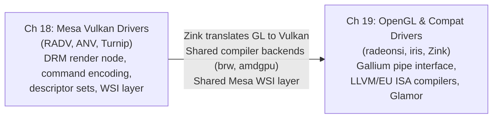

# Part V — Mesa GPU Drivers

Part V sits at the heart of the userspace graphics stack. By the time execution reaches this layer, the **Linux kernel DRM** subsystem (Parts I–II) has already allocated GPU memory, scheduled work, and provided authenticated access to hardware through render nodes such as **`/dev/dri/renderD128`**. The shared **Mesa** infrastructure (Part IV) has lowered **GLSL** and **WGSL** to **NIR**, compiled shaders through backends such as **ACO** and the **Intel EU ISA** compiler, and provided the **Gallium3D** pipe interface. Part V is where those abstractions become concrete: real hardware is programmed, real command streams are assembled, and real pixels are produced. These two chapters cover the full span of modern Mesa driver implementations — from the explicit, low-level **Vulkan** driver layer through to the classic **OpenGL** drivers that continue to serve the majority of installed GPU workloads.

## Chapters in This Part

**Chapter 18 — Mesa Vulkan Drivers: RADV, ANV, and the Driver Landscape**
targets both systems developers and graphics application developers. It opens by establishing the anatomy shared by every **Mesa** **Vulkan** driver — how an **ICD** manifest is discovered by the **Vulkan** loader, how driver-specific physical device structs embed the shared **`vk_physical_device`** base type, and how each driver opens a **DRM** render node and queries capabilities through **DRM** ioctls. The bulk of the chapter dissects three production drivers in depth: **RADV** for **AMD** hardware (**GCN1/GFX6** through **RDNA4/GFX12**), covering memory management across **VRAM**, **GTT**, and resizable **BAR** heaps, **PM4** command encoding, **SRD**-based descriptor sets, **ACO**-compiled pipelines, **NGG** geometry, and hardware ray tracing; **ANV** for **Intel** (**Gen9** through **Xe2/Battlemage**), covering the bindless heap design, **genxml**-generated packet emission, **EU ISA** shader compilation, and the **i915**/**xe** kernel backend split; and **Turnip** for **Qualcomm Adreno**, covering **TBDR** sysmem-vs-**GMEM** rendering decisions, the **ir3** compiler, and **CCU** flush ordering. The chapter closes with common driver bringup patterns (illustrated by **NVK** and **Honeykrisp**), **dEQP-VK** conformance workflows, and a thorough treatment of the shared **Mesa WSI** layer covering **X11**, **Wayland**, and direct-to-display swapchain backends.

**Chapter 19 — OpenGL Compatibility Drivers: RadeonSI, iris, and Zink**
targets systems developers and application developers who need to understand why **OpenGL** on Linux remains fast and conformant three decades after the API's introduction. It covers the three Mesa components that sustain **OpenGL** on modern hardware: **radeonsi** (AMD's **Gallium** driver), including **`radeon_cmdbuf`** submission, **CSO** caching, **LLVM**-backed **NIR** lowering, **DCC** and **HTILE** metadata management, and the **Shader DB** regression-tracking system; **iris** (Intel's **Gallium** driver for **Gen8** through **Xe2**), including dual batch ring management, the **`iris_binder`** surface state heap, and the purpose-built **EU ISA** compiler shared with **ANV**; and **Zink**, Mesa's **Vulkan**-backed **OpenGL** implementation, covering **Gallium**-to-**Vulkan** call translation, **GLSL**→**NIR**→**SPIR-V** shader paths, and its role as a portability layer for ARM drivers such as **Panfrost** and **Turnip**. The chapter also addresses **Glamor** (X11 2D acceleration via **OpenGL ES** on the **DRM** render node), **OpenGL ES 3.2** support, ARM and embedded **OpenGL ES** drivers (**panfrost**, **panthor**, **lima**, **etnaviv**, **freedreno**), and **mesa_glthread** asynchronous dispatch.

## How the Chapters Interrelate

The two chapters in Part V share a common dependency base but serve complementary API surfaces that rarely overlap at the driver level.

Chapter 18 (Vulkan drivers) is the natural starting point for systems developers, because it exposes the lowest-level hardware interaction in userspace. The **RADV**, **ANV**, and **Turnip** drivers all operate with explicit lifetimes, explicit synchronisation via **DRM** syncobj timelines, and explicit memory management — there is no hidden state machine between the application and the hardware command stream. Understanding how **RADV** assembles a **PM4** command buffer and submits it through **amdgpu_cs_submit_raw2** is prerequisite knowledge for understanding the contrasts that appear in Chapter 19.

Chapter 19 (OpenGL drivers) builds on Chapter 18 in two distinct ways. First, **radeonsi** and **iris** share their shader compiler backends with **RADV** and **ANV** respectively: **radeonsi** uses the **`ac_nir_to_llvm()`** path from the same **`src/amd/`** compiler tree; **iris** uses **`brw_compile_vs()`** and **`brw_compile_fs()`** from **`src/intel/compiler/`** — the identical functions that **ANV** calls. Readers who have absorbed the **ANV** shader compilation section in Chapter 18 will find the **iris** treatment in Chapter 19 a natural continuation, not a repetition. Second, **Zink** sits directly on top of the Vulkan drivers from Chapter 18: its entire rendering path routes through **`vkCmdDraw`**, **`vkCreatePipeline`**, and the **Mesa WSI** layer — any performance characteristic of **RADV** or **ANV** is directly visible through a **Zink**-on-**RADV** or **Zink**-on-**ANV** deployment. Chapter 19's driver comparison section (radeonsi vs. Zink-on-RADV, iris vs. Zink-on-ANV) can only be appreciated after Chapter 18 has established what lies beneath **Zink**.

The two chapters also share a set of horizontal themes. Both layers consume the **NIR** IR produced by the compiler infrastructure of Part IV. Both rely on the winsys abstraction (**`radeon_winsys`** for AMD, an **iris**-internal equivalent and **anv_kmd_backend** for Intel) to insulate driver logic from kernel-level **GEM** buffer object allocation. Both expose hardware through the **DRM** render node device file and submit work through **DRM** ioctls — the continuity with Parts I–II is direct. Synchronisation, in particular, is a thread that runs across both chapters: explicit **DRM** syncobj timelines in the Vulkan drivers become the implicit synchronisation contracts of the **Gallium** **`pipe_context`** in the OpenGL drivers, with **Zink** bridging the two models.

## Prerequisites and What Comes Next

Readers should arrive at Part V having worked through Part II (kernel **DRM** drivers, **GEM** buffer objects, and **DRM** ioctl submission paths), Part III (the **Mesa** driver loader and the **EGL**/**GLX** entry points that invoke the drivers), and Part IV (the **NIR** compiler IR, the **ACO** and **EU ISA** backends, and the **Gallium3D** pipe interface abstractions). Without this background, the winsys layers and compiler integration discussed here will lack grounding. Part VI (the display and compositor stack) builds directly on Part V by consuming the **DMA-BUF** handles and **DRM** framebuffers that these drivers produce; Part VII (application APIs including **Vulkan** extensions, **VA-API**, and **OpenXR**) relies on the driver capabilities and extension support established here.

---
