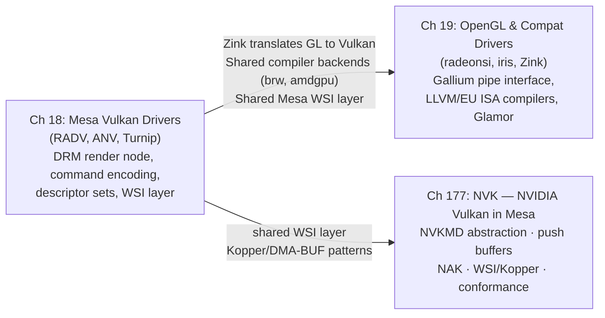

# Part V — Mesa GPU Drivers

Part IV built the infrastructure every Mesa driver relies on: the **GLVND**/**ICD** dispatch machinery, the **Gallium3D** pipe interface, the **NIR** shader IR, and the **ACO** and **EU ISA** compiler backends. Part V is where those abstractions become concrete. Real hardware is programmed, real command streams are assembled, and real pixels are produced. These two chapters span the full range of modern Mesa driver implementations — from the explicit, low-level **Vulkan** driver layer to the classic **OpenGL** drivers that continue to serve the majority of installed GPU workloads on desktops, laptops, and embedded SoCs.

## Chapters in This Part

**Chapter 18 — Mesa Vulkan Drivers: RADV, ANV, and the Driver Landscape** dissects three production Vulkan drivers. **RADV** (AMD) covers VRAM/GTT/BAR memory management, PM4 command encoding, SRD-based descriptor sets, NGG geometry, and hardware ray tracing on RDNA2+. **ANV** (Intel) covers the bindless surface-state heap, genxml packet emission, and EU ISA shader compilation. **Turnip** (Qualcomm Adreno) covers TBDR sysmem-vs-GMEM rendering, the ir3 compiler, and CCU flush ordering. The chapter closes with dEQP-VK conformance workflows and the shared Mesa WSI layer (X11, Wayland, direct-to-display).

**Chapter 177 — NVK: NVIDIA Vulkan in Mesa — Architecture, WSI, and Conformance** provides in-depth coverage of NVK beyond the origin-story treatment in Chapter 10b. It examines the **NVKMD abstraction layer** (`nvkmd_dev`, `nvkmd_mem`, `nvkmd_timeline`) that decouples NVK from any specific kernel ABI — enabling the same Mesa driver to target both the new `DRM_IOCTL_NOUVEAU_EXEC`/`DRM_IOCTL_NOUVEAU_VM_BIND` uAPI (Linux 6.6+) and potential future kernel interfaces. The **push buffer encoding** layer (`nv_push`, class headers derived from envytools rnndb) is examined in detail, explaining how NVK encodes `GROBJ`, `QMDV3_00`, and 3D-class methods into the DMA-ring that GSP-RM firmware submits to the hardware. A dedicated section covers **NAK integration** — how NVK hands NIR to the Rust NAK backend for Maxwell–Blackwell, while falling back to the GLSL path for Kepler — including the NIR lowering passes specific to NVIDIA's SASS ISA (WARP divergence, register file allocation, `s2r` lane ID injection). **WSI integration** via the **Kopper** layer, explicit **DMA-BUF** import/export, and the **Wayland explicit sync** path (`wp_linux_drm_syncobj_v1` + `VK_EXT_external_fence_fd`) is traced end-to-end, showing how a frame produced by NVK reaches a Wayland compositor without requiring timeline semaphore emulation. The conformance and deployment history tracks the driver from its Mesa 23.3 experimental landing through Vulkan 1.3 in Mesa 24.1, Vulkan 1.4 in Mesa 25.x, and Kepler/Blackwell enablement in Mesa 25.x–26.x. The chapter closes with a practical guide to building NVK, running dEQP-VK, and diagnosing hangs via `nv.dbg.gpuHangDump`.

**Chapter 19 — OpenGL Compatibility Drivers: RadeonSI, iris, and Zink** covers the Mesa components that sustain OpenGL on modern hardware. **radeonsi** (AMD Gallium) addresses `radeon_cmdbuf` submission, DCC/HTILE metadata, and the Shader DB regression system. **iris** (Intel Gallium, Gen8–Xe2) covers dual batch ring management and the `iris_binder` surface-state heap. **Zink** (Gallium-on-Vulkan) covers Gallium-to-Vulkan translation and its role as a portability layer for ARM drivers. The chapter also covers panfrost, lima, etnaviv, freedreno, mesa_glthread, Glamor, and VA-API.

## Key Concepts Introduced in Part V

Part IV introduced concepts that are common to all Mesa drivers. Part V introduces concepts that are **GPU-vendor-specific** — hardware formats, command encoding conventions, and driver-level design patterns that only make sense in the context of a particular GPU microarchitecture. This section defines the vocabulary used throughout Chapters 18 and 19.

### Shader Languages and the ICD Dispatch Model

**GLSL (OpenGL Shading Language)** is the C-like shading language for OpenGL, standardised by Khronos. A `#version 460 core` preamble marks a shader as targeting OpenGL 4.6. Mesa's `glsl_to_nir()` front end translates GLSL into NIR for all downstream drivers. [Source](https://registry.khronos.org/OpenGL/specs/gl/GLSLangSpec.4.60.pdf)

**WGSL (WebGPU Shading Language)** is the shader language for the WebGPU API; its `struct`/`fn`/`var` syntax is closer to Rust than C. WGSL is compiled by **Tint** (part of the Dawn project) into SPIR-V, which then enters Mesa via `spirv_to_nir()`. WGSL is not yet a first-class Mesa input on the desktop, but it flows through the same NIR pipeline once converted. [Source](https://gpuweb.github.io/gpuweb/wgsl/)

**ICD (Installable Client Driver)** is the Vulkan mechanism by which multiple GPU drivers coexist on a single system. The **Vulkan loader** (`libvulkan.so`) reads JSON manifest files from `/usr/share/vulkan/icd.d/` at startup — for example `radeon_icd.x86_64.json` for RADV and `intel_icd.x86_64.json` for ANV. Each manifest records the path to the driver shared library and its supported `apiVersion`. The loader resolves per-instance and per-device function pointers by calling the driver's `vkGetInstanceProcAddr` entry point. The `VK_ICD_FILENAMES` environment variable overrides the search path, which is how Mesa developers test local driver builds without installation. [Source](https://github.com/KhronosGroup/Vulkan-Loader/blob/main/docs/LoaderDriverInterface.md)

**GLX** is the X11 OpenGL binding; `glXCreateContext` and `glXSwapBuffers` are the entry points that X11 applications call. Mesa implements GLX in `src/glx/`, and the **GLVND** (GL Vendor-Neutral Dispatch) layer routes GLX calls to the correct per-vendor library. GLX remains relevant for legacy X11 applications running under XWayland. [Source](https://www.khronos.org/registry/OpenGL/extensions/ARB/GLX_ARB_multisample.txt)

### AMD-Specific Concepts

**VRAM, GTT, and BAR heaps** are the three GPU-visible memory domains on AMD hardware. **VRAM** (Video RAM) is GPU-local GDDR/HBM — fastest for render targets and textures, not directly CPU-writable on discrete GPUs. **GTT** (Graphics Translation Table) is CPU system memory mapped into the GPU's virtual address space via the IOMMU — slower than VRAM but large and writable by both CPU and GPU, used for upload and readback buffers. **BAR** (PCIe Base Address Register aperture) is a CPU-accessible window into VRAM; without **ReBAR** (Resizable BAR), the window is limited to 256 MB regardless of VRAM size. RADV's heap selection policy: render targets and textures → VRAM; upload/staging buffers → GTT; CPU readback → GTT. [Source](https://gitlab.freedesktop.org/mesa/mesa/-/tree/main/src/amd/vulkan)

**PM4 commands** are AMD's packet format for the command processor (CP) that orchestrates the graphics and compute engines. A PM4 packet begins with a header word encoding the packet type, opcode, and length. Key opcodes include `SET_CONTEXT_REG` (sets a hardware register in the context register space), `DRAW_INDEX_AUTO` (triggers an indexed draw), and `DISPATCH_DIRECT` (launches a compute dispatch). RADV and RadeonSI emit PM4 into a `radeon_cmdbuf` structure using `radeon_emit()` helpers. [Source](https://gitlab.freedesktop.org/mesa/mesa/-/blob/main/src/amd/common/ac_pm4.h)

**SRD (Shader Resource Descriptor)** is AMD's 128-bit (4 × 32-bit words) descriptor format encoding everything the shader needs to sample a texture or read a buffer: base GPU virtual address, format, dimensions, swizzle, and resource type. SRDs are stored in GPU-visible descriptor buffers and indexed by the shader. RADV populates SRDs when `vkUpdateDescriptorSets` is called, writing them into per-set backing buffers allocated from VRAM or GTT. [Source](https://gitlab.freedesktop.org/mesa/mesa/-/blob/main/src/amd/vulkan/radv_descriptor_set.c)

**Descriptor sets** (`VkDescriptorSet`) are collections of SRDs (and equivalent structures on non-AMD hardware) bound to a pipeline so shaders can access textures, buffers, and samplers. `vkUpdateDescriptorSets` writes the descriptors into GPU-visible memory. RADV uses per-set backing buffers; NVK uses a single global bindless heap (see below). [Source](https://registry.khronos.org/vulkan/specs/latest/html/vkspec.html#descriptorsets)

**NGG (Next-Gen Geometry)** is AMD's RDNA unified geometry pipeline. Instead of running separate Vertex Shader and Geometry Shader stages on dedicated fixed-function hardware, NGG combines them into a single programmable shader stage running on compute units in wave32 mode, performing primitive culling on-chip before rasterisation. RADV enables NGG on RDNA1+ and uses it as the foundation for **mesh shaders** (`VK_EXT_mesh_shader`). [Source](https://gitlab.freedesktop.org/mesa/mesa/-/blob/main/src/amd/vulkan/radv_ngg.c)

**Hardware ray tracing (BVH traversal)** on RDNA2+ (and Intel DG2+/Arc) exposes dedicated fixed-function units that walk a **BVH (Bounding Volume Hierarchy)** acceleration structure to find ray–triangle intersections. The Vulkan `VK_KHR_ray_tracing_pipeline` extension exposes these units. A ray tracing pipeline dispatches a *ray generation shader*, traverses the BVH (calling *intersection*, *any-hit*, and *closest-hit* shaders at each hit), and invokes a *miss shader* if no geometry is hit. The **SBT (Shader Binding Table)** is a GPU buffer mapping geometry/instance indices to the shader handles to call. RADV and ANV both implement BVH build (`vkBuildAccelerationStructuresKHR`) and ray dispatch (`vkCmdTraceRaysKHR`). [Source](https://registry.khronos.org/vulkan/specs/latest/html/vkspec.html#ray-tracing)

**DCC and HTILE** are AMD hardware compression schemes that reduce memory bandwidth for colour and depth buffers respectively. **DCC (Delta Color Compression)** stores per-4×4-tile difference data in a separate metadata surface, allowing the GPU to skip writing pixels that haven't changed. **HTILE (Hierarchical Tile)** stores per-tile minimum/maximum depth values to accelerate early-Z rejection, allowing the depth test to discard entire tiles before running fragment shaders. RADV enables DCC and HTILE based on image format, usage flags, and hardware generation. [Source](https://gitlab.freedesktop.org/mesa/mesa/-/blob/main/src/amd/vulkan/radv_image.c)

**Dual batch ring (IB1/IB2)** is AMD's two-level command buffer submission model. The primary ring (IB1 — Indirect Buffer 1) holds the top-level PM4 stream; it references secondary buffers (IB2) via `INDIRECT_BUFFER` PM4 packets. RADV maps primary Vulkan command buffers to IB1 and secondary command buffers to IB2. The kernel's `amdgpu_cs_submit_raw2` ioctl accepts the IB list and submits it to the CP. [Source](https://gitlab.freedesktop.org/mesa/mesa/-/blob/main/src/amd/vulkan/radv_cs.h)

**Shader DB** is Mesa's database of compiled real-world shaders from shipped games, used to measure compiler quality by tracking instruction count, VGPR usage, and spill rates between Mesa revisions. The `shader-db` tool runs a before/after comparison when evaluating ACO or LLVM backend changes. Commit messages for shader compiler patches routinely include Shader DB results. [Source](https://gitlab.freedesktop.org/mesa/shader-db)

### Intel-Specific Concepts

**genxml and packet emission** is Intel's approach to type-safe hardware packet construction. Hardware packet layouts for every GPU generation (Gen7 through Xe2) are described in XML files under `src/intel/genxml/`. The build system generates C structs and `GENX()` macros from these XMLs. Drivers use `iris_pack_*` and `anv_batch_emit()` macros to fill packet structs and DMA them into the batch buffer, with compile-time type checking catching field-width mistakes. [Source](https://gitlab.freedesktop.org/mesa/mesa/-/tree/main/src/intel/genxml)

**EU ISA (Execution Unit Instruction Set Architecture)** is Intel's GPU shader ISA, executed on the Execution Units (EUs) that make up Intel's GPU shader cores. Key instructions include `mov`, `send` (memory and message sends), `math`, and `sync`. EUs execute in SIMD8, SIMD16, or SIMD32 thread widths; each SIMD lane corresponds to one shader invocation. Mesa's `brw_compile_vs()` / `brw_compile_fs()` functions (the BRW/ELK/LKF backends in `src/intel/compiler/`) lower NIR to EU ISA assembly, shared between ANV (Vulkan) and iris (OpenGL). [Source](https://gitlab.freedesktop.org/mesa/mesa/-/tree/main/src/intel/compiler)

**Surface-state heap** is Intel's per-context heap of 32-byte surface state descriptors that describe each texture or buffer visible to EU shaders. ANV allocates surface states from a `anv_state_pool` and records their heap offsets into binding tables; iris uses the `iris_binder` for the same purpose. The GPU's binding table base address register points into this heap, and each shader indexes into it by slot. [Source](https://gitlab.freedesktop.org/mesa/mesa/-/blob/main/src/intel/vulkan/anv_state.c)

### Qualcomm (Adreno / Turnip)-Specific Concepts

**Sysmem vs. GMEM rendering** is the fundamental trade-off in Qualcomm's Adreno TBDR (Tile-Based Deferred Renderer) architecture. **GMEM** is a small (e.g., 512 KB–1 MB) on-chip tile buffer: rendering into GMEM is very fast because it avoids external memory bandwidth, but the tile's contents must be resolved to system memory at the end of each render pass. **Sysmem** rendering routes all reads/writes directly to system RAM, bypassing the tile buffer — less efficient for typical rendering but necessary for framebuffers too large to tile. The Turnip driver chooses between the two paths per render pass based on attachment count, format, and tile memory pressure. [Source](https://gitlab.freedesktop.org/mesa/mesa/-/blob/main/src/freedreno/vulkan/tu_cmd_buffer.c)

**CCU flush (Color Cache Unit flush)** is a required GPU event on Adreno hardware between render passes that share the same memory region. The CCU caches in-flight color data on-chip; without an explicit `CCU_FLUSH` event in the command stream, a subsequent render pass reading the same attachment may see stale data. Turnip must insert CCU flushes at render pass boundaries and when resolving GMEM to sysmem. Missing a flush is a common source of corruption bugs during Adreno driver development. [Source](https://gitlab.freedesktop.org/mesa/mesa/-/blob/main/src/freedreno/vulkan/tu_barrier.c)

### Cross-Vendor Concepts

**Bindless heap** is an alternative descriptor model where all descriptors — textures, buffers, samplers — live in a single large GPU-visible buffer indexed by a flat integer (a "bindless handle"). This avoids the overhead of copying descriptors between sets and binding descriptor sets at draw time. NVK uses a global bindless heap as its primary descriptor model. RADV optionally exposes bindless via `VK_EXT_descriptor_buffer`. Bindless is the natural model for GPU-driven rendering pipelines where the CPU does not know at record time which resources a shader will access. [Source](https://registry.khronos.org/vulkan/specs/latest/man/html/VK_EXT_descriptor_buffer.html)

**WSI (Window System Integration)** is the Mesa layer that implements `VkSwapchainKHR` for each platform. Shared code in `src/vulkan/wsi/` provides `wsi_common_wayland.c` (allocates swapchain images as GBM BOs, presents via `linux-dmabuf`), `wsi_common_x11.c` (presents via DRI3/Present), and `wsi_common_drm.c` (direct-to-display). Every Mesa Vulkan driver inherits WSI support from this common layer rather than implementing it per-driver. [Source](https://gitlab.freedesktop.org/mesa/mesa/-/tree/main/src/vulkan/wsi)

**Direct-to-display swapchain** (`VK_KHR_display` / `VK_EXT_acquire_drm_display`) allows a Vulkan application to scanout framebuffers directly to a KMS plane, bypassing the Wayland compositor entirely. This is used by VR compositors (Monado), kiosk applications, and benchmarking tools that need to eliminate compositor latency. Mesa's `wsi_common_drm.c` implements this path.

**DRM syncobj** is a kernel mechanism for GPU synchronisation that generalises DMA-BUF fences. A `drm_syncobj` is a container for a `dma_fence`; it can be waited on and signalled via `DRM_IOCTL_SYNCOBJ_WAIT` / `DRM_IOCTL_SYNCOBJ_SIGNAL`. Mesa Vulkan drivers use syncobjs to back `VkSemaphore` and `VkFence` objects, and expose them to the Wayland compositor via the `wp_linux_drm_syncobj_v1` protocol (Chapter 3, Chapter 46). [Source](https://www.kernel.org/doc/html/latest/gpu/drm-mm.html#drm-sync-objects)

**VA-API (Video Acceleration API)** is the Linux API for hardware video decode and encode. Mesa exposes VA-API through `libva-mesa-driver`, which maps VA-API surface operations to the video hardware blocks on AMD (`radeon_vcn`, `radeon_vce`, `radeon_uvd`) and Intel (`intel_media`) GPUs through the same kernel DRM interface used for 3D rendering. VA-API surfaces are DMA-BUF-backed and can be zero-copy imported into Vulkan or handed directly to KMS for display (Chapter 26). [Source](https://intel.github.io/libva/)

## How the Chapters Interrelate

Chapter 18 (Vulkan drivers) is the natural starting point for systems developers: RADV, ANV, and Turnip operate with explicit lifetimes, explicit DRM syncobj synchronisation, and explicit memory management, leaving no hidden state between the application and the hardware command stream. Understanding how RADV assembles a PM4 command buffer and submits it through `amdgpu_cs_submit_raw2` is prerequisite knowledge for the contrasts in Chapter 19.

Chapter 177 (NVK) extends the Chapter 18 survey with a dedicated deep dive into NVIDIA's Mesa Vulkan driver. Where Chapter 18 provides a comparative treatment of RADV, ANV, and Turnip, Chapter 177 goes significantly deeper on the NVKMD abstraction, GSP-RM command submission, NAK compiler integration, and the WSI/Kopper explicit-sync path — topics that Chapter 18 touches on but does not develop fully. Chapter 177 also provides the conformance history that Chapter 18 can only summarise. Readers focused on NVIDIA open-source Vulkan on Linux should read 18 → 177 in sequence; readers working on other drivers may treat Chapter 177 as an optional deep-dive reference.

Chapter 19 (OpenGL drivers) builds on Chapter 18 in two ways. First, radeonsi and iris share their shader compiler backends with RADV and ANV: radeonsi calls `ac_nir_to_llvm()` from the same `src/amd/` tree; iris calls `brw_compile_vs()` / `brw_compile_fs()` from `src/intel/compiler/` — the identical functions ANV uses. Second, Zink sits directly on top of the Vulkan drivers from Chapter 18, routing all rendering through `vkCmdDraw` and `vkCreatePipeline`: any RADV or ANV performance characteristic is visible through Zink-on-RADV or Zink-on-ANV.

## Prerequisites and What Comes Next

Readers should arrive having worked through Part II (kernel DRM drivers, GEM buffer objects, ioctl submission), **Part III** (the NVIDIA story — GSP-RM, NVK architecture, Nova kernel driver), and Part IV (Mesa loader, EGL/GLX dispatch, NIR, ACO, EU ISA, Gallium3D). Part VI (display and compositor stack) consumes the DMA-BUF handles and DRM framebuffers these drivers produce; Part VII (Vulkan extensions, VA-API, OpenXR) relies on the driver capabilities and extension support established here.

**NVIDIA in this part**: Chapter 10b in Part III introduced NVK as a narrative about driver construction under hardware opacity. Chapter 177 in this part (Part V) is the architectural deep-dive: NVKMD abstraction, push buffer encoding, NAK compiler integration, WSI/Kopper explicit-sync, and the full conformance history. Readers working specifically on NVIDIA open-source Vulkan should read Part III (Ch. 7–11, 118) first, then return here for Chapter 177's architectural treatment.

Readers interested in **comparing NVIDIA's approach with AMD, Intel, and Qualcomm** will find the most complete side-by-side picture by reading Chapter 18 (RADV/ANV/Turnip) and Chapter 177 (NVK) together: descriptor model (SRD tables vs bindless heap vs surface-state heap vs bindless global buffer), submission path (IB1/IB2 ring vs EU batch vs CSF firmware vs GSP-RM FIFO), and shader compiler backend (ACO vs BRW/ELK vs ir3 vs NAK) are the four axes that most sharply differentiate the driver families.

---

## GPU Vendor Open-Source Strategy: A Cross-Vendor Analysis

The chapters in Part V cover individual drivers in depth. This section steps back and asks the cross-cutting strategic question: **why does each GPU vendor engage with the open-source Linux graphics stack the way it does, and where is each vendor's strategy heading?**

### Three Axes of Comparison

Every GPU vendor's Linux strategy can be characterised along three axes:

1. **Kernel driver model** — who writes and maintains the DRM kernel driver, and how much hardware knowledge it requires
2. **Mesa userspace model** — whether the vendor drives, participates in, or is absent from Mesa Vulkan/OpenGL development
3. **Firmware posture** — the boundary between open driver code and closed firmware blobs, and how that boundary is shifting

### Per-Vendor Positions

**Intel** occupies the most open position on all three axes. The i915 driver (now transitioning to the clean-slate Xe driver, with Xe2/Battlemage as its first full-generation deployment) is entirely open-source, including GuC firmware source since 2021. Intel engineers are the top contributors to Mesa NIR, the EU ISA compiler backend shared between ANV (Vulkan) and iris (OpenGL), and the genxml packet-generation infrastructure. There is no proprietary Intel graphics userspace alternative on Linux — Intel's business interest is to make Linux a first-class platform for its GPU hardware, which means contributing the driver stack rather than controlling it. The strategic risk for Intel is thin: being upstream-first means slower ability to differentiate on proprietary features, but the Linux developer mindshare Intel earns from being the "most open" vendor has indirect business value in the data-centre and workstation markets.

**AMD** is the second-most open vendor and has undergone the most visible strategic shift over the past decade. The amdgpu kernel driver is fully open; firmware blobs (GFX, SDMA, VCN video, DCN display) are required but distributed through `linux-firmware` under binary redistribution licences. In Mesa, AMD does not own RADV — it is a community driver, originated by Bas Nieuwenhuizen and Dave Airlie and now maintained by a team including Valve, Collabora, and individual contributors — but AMD engineers participate and AMD's ACO compiler was contributed upstream. AMD's one attempt at a parallel proprietary Vulkan driver, AMDVLK, was effectively archived in 2024 after it failed to achieve feature or performance parity with the community RADV. The strategic lesson: **AMD tried to maintain two Vulkan drivers and the community one won.** ROCm (CUDA competitor for compute) remains the area where AMD's proprietary investment is highest, because ROCm is the competitive moat AMD holds against NVIDIA in HPC/ML — not desktop graphics.

**NVIDIA** is the most strategically complex vendor and the one undergoing the most active transition. Until 2022, NVIDIA's Linux position was binary: the proprietary `nvidia.ko` kernel driver and proprietary userspace, or the community reverse-engineered Nouveau driver with limited capability. The 2022 release of `nvidia-open` changed the kernel driver from a completely opaque blob to an open-source module — but `nvidia-open` is not a clean-room driver: it is built around the GSP (GPU System Processor) firmware that runs a proprietary GPU operating system, and the open kernel module is primarily a thin IPC layer that sends commands to the GSP via a mailbox. The consequence is structurally significant: **NVIDIA's open kernel driver is a firmware-RPC client, not a hardware programming layer.** This is architecturally different from Intel or AMD kernel drivers, which contain the actual command-stream encoding. On the Mesa side, NVK has moved from zero to Vulkan 1.4 conformance in approximately two years, driven largely by Faith Ekstrand (ex-Intel ANV) and NVIDIA engineers who joined the effort starting in 2023. The NAK Rust shader compiler, replacing LLVM for NVIDIA ISA, is the first new Rust-language compiler backend in Mesa. NVIDIA's proprietary moat — CUDA, OptiX, DLSS, and the compute software stack — remains entirely closed; the open-sourcing is limited to the graphics path, which NVIDIA views as a cost centre on Linux rather than a competitive differentiator.

**Qualcomm (Adreno)** has followed a similar trajectory to AMD but from a mobile-first starting point. The freedreno kernel driver was originally reverse-engineered by Rob Clark; Qualcomm engineers began contributing after 2018. Turnip (Mesa Vulkan for Adreno) was likewise community-started and Qualcomm has since embedded engineers in the Mesa project. The proprietary Qualcomm Adreno driver continues to ship on Android, making Linux support a secondary concern — but the commercial importance of Linux on Snapdragon (Windows on ARM, automotive SoCs, AI Edge devices) is pushing Qualcomm toward more active Mesa engagement. Turnip's TBDR architecture — sysmem vs. GMEM rendering — represents genuinely novel design patterns that benefited Mesa by introducing the first production tile-based Vulkan driver into the codebase.

**Broadcom (VideoCore / v3dv)** is a cooperative but resource-constrained vendor. Igalia has been the primary implementer of v3dv (Mesa Vulkan for VideoCore VI/VII) under contract with Raspberry Pi and with Broadcom's hardware documentation support. The strategy is vendor-cooperative but not vendor-led: Broadcom provides hardware access and documentation, the Linux/Mesa community does the implementation. v3dv reaching Vulkan 1.3 conformance on Raspberry Pi 5 is a landmark in making Broadcom a full participant in the Mesa Vulkan ecosystem despite limited internal GPU software engineering resources.

**ARM (Mali)** remains the most reluctant participant. Panfrost (Midgard/Bifrost OpenGL ES) and Panthor (Valhall CSF, adding Vulkan) are community reverse-engineering efforts; ARM's cooperation has been improving since approximately 2022 but ARM still ships a proprietary Mali userspace driver on Android and has not made definitive commitments to upstream-first development. The firmware model for Mali Valhall (CSF — Command Stream Frontend) requires firmware for the CSF itself, adding another opaque layer. The strategic risk for ARM is reputational: as Android moves toward Vulkan and the proprietary driver has a long history of security vulnerabilities and poor upstream engagement, the pressure to open-source increases. PanVK (Mesa Vulkan for Mali) is the community bet that eventually ARM will follow the AMD/NVIDIA trajectory.

**Apple (AGX)** is the adversarial case. Asahi Linux's AGX driver (Mesa Vulkan) and Lina kernel driver (Rust-language DRM driver) were reverse-engineered from hardware behaviour, public documentation, and macOS kernel driver analysis — with no cooperation from Apple, which has no business interest in Linux. The AGX Mesa driver is significant beyond its user base: it demonstrated that a fully conformant, performance-competitive Mesa Vulkan driver can be built through fuzzing and hardware-level reverse engineering in under three years, a pace that would have seemed implausible before Asahi began. The techniques developed — GPU command stream fuzzing, register-level coverage tracing, macOS hypervisor-based hardware observation — are relevant to any future reverse-engineering effort.

### The Convergent Trend: Firmware-as-GPU-OS

The most important structural trend across all vendors is the shift toward **firmware-as-GPU-OS**: the GPU runs an embedded processor (NVIDIA GSP, AMD PSP/SMU, Intel GuC/HuC) that owns the hardware scheduling and power management, and the kernel driver is increasingly a message-passing layer into that firmware rather than a hardware programmer. This trend has consequences:

- **Debugging becomes harder**: hardware registers that were previously accessible to the kernel driver are now only accessible to the GPU firmware. Debugging a GPU hang requires reading firmware logs, not just DRM debugfs state.
- **Open-source audibility is reduced**: even with an open kernel driver, the firmware executing on the GPU is a closed binary. NVIDIA's `nvidia-open` is the extreme case; AMD and Intel are heading in the same direction with expanding firmware scope.
- **Third-party driver feasibility decreases**: Nouveau's historical approach — reverse-engineering hardware registers — becomes less viable as more state moves behind firmware interfaces. NVK's path (open kernel module + GSP firmware RPC) is the model that future open-source NVIDIA GPU drivers will follow.
- **Interoperability improves**: firmware-mediated submission standardises the ABI between the kernel and the hardware, making it easier for multiple contexts (DRM render nodes, compute contexts, display) to share the GPU without kernel driver conflicts.

### Strategic Outlook

**The near-term destination is clear**: all discrete GPU vendors are converging on DRM kernel driver + Mesa Vulkan as the Linux graphics stack, with firmware blobs handling an increasing share of hardware management. Intel is already there. AMD completed the transition with AMDVLK's de facto retirement. NVIDIA is mid-transition, with NVK accelerating past the point where it can be ignored. Qualcomm is following on mobile SoCs. ARM is the laggard.

**The medium-term competition shifts to compute**: Once Vulkan graphics coverage is comparable across vendors (2–3 years), the open-source differentiation moves to compute — ROCm vs. CUDA vs. Vulkan compute vs. OpenCL. This is where vendor proprietary moats will be contested and where open-source community leverage is weakest, because CUDA's ecosystem lock-in is not a technical problem that Mesa can solve.

**The Zink convergence accelerates the transition**: As Zink-on-Vulkan becomes the default OpenGL implementation (Mesa 25.1 replaced Nouveau's OpenGL with Zink-on-NVK; the same pattern is being applied to Turnip, PanVK, and v3dv), the number of code paths requiring hardware-specific maintenance halves. A vendor that maintains a good Vulkan driver gets OpenGL support for free. This strengthens the incentive for every vendor to invest in Mesa Vulkan rather than maintaining parallel OpenGL state trackers.

**The Rust inflection**: NAK (for NVK) and the Nova kernel driver (Ch10a) are the first production Rust-language GPU software components in the Linux kernel and Mesa. If they succeed — particularly if NAK outperforms LLVM on NVIDIA ISA quality — it will accelerate the question of whether ACO (AMD, C++) and the BRW backend (Intel, C++) should eventually be rewritten in Rust. The answer is not imminent, but the trajectory is set: Rust is entering the GPU driver stack from the NVIDIA side.

---

## Part Roadmap Summary

*Synthesised from the Roadmap sections of this part's chapters.*

### Near-term (6–12 months)

- **Vulkan 1.4 baseline consolidation**: Mesa 26.0–26.1 completed Vulkan 1.4 conformance for RADV, ANV, NVK, and Turnip. Near-term effort shifts to closing extension gaps on newer hardware generations — RDNA4 (GFX12), Xe2 (Battlemage), and Adreno A8xx (Snapdragon 8 Elite) — and achieving CTS sign-off for each.
- **ACO becomes the default across AMD OpenGL and Vulkan**: Mesa 26.0 switched radeonsi from LLVM to ACO, unifying RADV and radeonsi on the same compilation backend; near-term work hardens the shared pipeline and reduces game-load stuttering, while retaining LLVM as a fallback for compute.
- **Synchronisation extension rollout**: `VK_EXT_present_timing` landed across RADV, ANV, NVK, Turnip, and PanVK in Mesa 26.1; `GL_NV_timeline_semaphore` arrived for radeonsi; and `VK_EXT_descriptor_buffer` heap mode is being stabilised for RADV behind `RADV_EXPERIMENTAL=heap`, directly benefiting VKD3D-Proton D3D12 descriptor-heap paths.
- **Zink expands as the universal OpenGL compatibility layer**: Mesa 25.1 already replaced Nouveau OpenGL with Zink+NVK; the same pattern is being evaluated for other drivers (Turnip for Adreno, Panvk for Mali) where the Vulkan backend is more actively maintained than a direct Gallium OpenGL driver.
- **VirtIO-GPU native-context support**: Mesa 26.1 added hardware-accelerated paravirtualised GPU support for both ANV and iris, enabling Intel GPU pass-through inside QEMU/crosvm VMs without a full physical pass-through.
- **NVK ray-tracing and NAK scheduler progress**: Turing RT Core command-stream reverse engineering and NAK instruction scheduling improvements (cross-basic-block pre-pass scheduler landed in Mesa 26.0) are the highest-profile NVK near-term items; NAK latency hiding and warp-occupancy estimation for Ampere/Ada are active development targets.

### Medium-term (1–3 years)

- **Compiler backend consolidation**: ACO's role will deepen — the LLVM NIR-to-LLVM-IR graphics path (`ac_nir_to_llvm.c`) in radeonsi is a candidate for deprecation once ACO covers all RDNA generations, while the shared BRW/ELK/LKF EU ISA compiler will be extended to Xe3 (Nova Lake) for both ANV and iris simultaneously. The goal across both AMD and Intel is a single compiler path per vendor, shared between the Vulkan and OpenGL drivers.
- **Zink as the default OpenGL state tracker**: The strategic direction endorsed by Mesa maintainers is to converge OpenGL support onto Zink-on-Vulkan rather than sustaining per-driver Gallium OpenGL implementations. Near-term enablements (PowerVR, Adreno, Mali) pave the way; medium-term work addresses `VK_EXT_descriptor_buffer` DB mode as the default descriptor path in Zink and closes remaining OpenGL 4.6 ARB extension gaps (bindless textures, sparse textures).
- **Vulkan video encode/decode stabilisation**: `VK_KHR_video_encode_queue` promotion from EXT to KHR is under active Khronos specification work; RADV and ANV are tracking it. Turnip is adding `VK_KHR_video_decode_h264/h265` via the Adreno multimedia engine, and NVK is progressing H.264/H.265 decode from experimental toward stable.
- **Nova kernel driver NVKMD backend for NVK**: The NVKMD abstraction layer was designed to decouple NVK from any specific kernel ABI. Once the Rust-language Nova driver (targeting GSP-based Turing+ GPUs) exposes stable DRM uAPIs, a Nova NVKMD backend will let NVK target either nouveau or Nova without Vulkan-layer changes.
- **RDNA4 ray-tracing and Xe2 mesh-shader performance**: RDNA4-specific BVH build heuristics, compressed acceleration structures, and `VK_KHR_ray_tracing_maintenance2` are active RADV targets; ANV medium-term work on Xe2 focuses on `VK_EXT_mesh_shader` performance tuning across the enlarged EU geometry pipeline and XE_VM_BIND range-based eviction.

### Long-term

- **Full Nova transition and nouveau maintenance mode**: Once Nova ships in a kernel LTS release, nouveau is expected to enter maintenance mode for legacy generations while Nova becomes the primary driver for Turing and later. NVK's NVKMD layer would point exclusively at Nova, and the Rust-based kernel/userspace architecture becomes the reference model for future NVIDIA open-source work.
- **GPU-agnostic BVH and cooperative-matrix extensions**: A hardware-neutral BVH build/traversal library (reusing `src/amd/vulkan/bvh/` shaders with driver-neutral wrappers) would enable `VK_KHR_ray_tracing_pipeline` on compute-only drivers such as Lavapipe and PanVK. In parallel, `VK_KHR_cooperative_matrix` landing on Xe2 (ANV) and RDNA4 WMMA (RADV), together with NVK's Hopper/Blackwell tensor-core support, feeds into on-GPU ML inference inside Linux desktop pipelines.
- **Consolidation of OpenGL around Zink and deprecation of legacy Gallium drivers**: The ultimate endpoint of the Zink expansion is a Mesa tree where per-driver Gallium OpenGL state trackers are retired in favour of a single Zink path, with hardware-specific Gallium drivers providing only a Vulkan backend.
- **Hardware mesh shading and video encoding on NVK**: Full `VK_EXT_mesh_shader` and `VK_KHR_video_encode_h264/h265` for NVIDIA hardware are long-horizon goals contingent on command-stream reverse engineering for Turing/Ampere mesh pipelines and Ada/Blackwell encoder paths.

---

*Copyright © 2026 jreuben11. Licensed under [CC BY 4.0](https://creativecommons.org/licenses/by/4.0/).*
