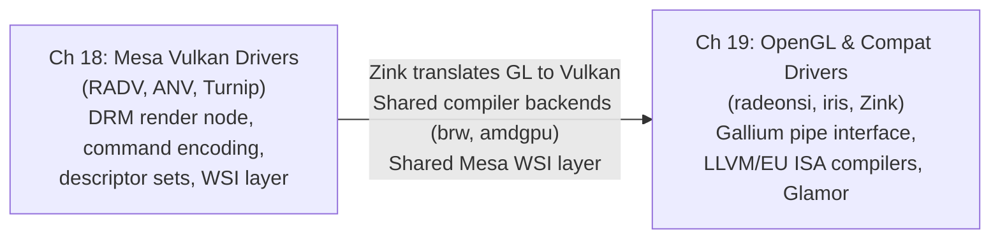

# Part V — Mesa GPU Drivers

Part IV built the infrastructure every Mesa driver relies on: the **GLVND**/**ICD** dispatch machinery, the **Gallium3D** pipe interface, the **NIR** shader IR, and the **ACO** and **EU ISA** compiler backends. Part V is where those abstractions become concrete. Real hardware is programmed, real command streams are assembled, and real pixels are produced. These two chapters span the full range of modern Mesa driver implementations — from the explicit, low-level **Vulkan** driver layer to the classic **OpenGL** drivers that continue to serve the majority of installed GPU workloads on desktops, laptops, and embedded SoCs.

## Chapters in This Part

**Chapter 18 — Mesa Vulkan Drivers: RADV, ANV, and the Driver Landscape** dissects three production Vulkan drivers. **RADV** (AMD) covers VRAM/GTT/BAR memory management, PM4 command encoding, SRD-based descriptor sets, NGG geometry, and hardware ray tracing on RDNA2+. **ANV** (Intel) covers the bindless surface-state heap, genxml packet emission, and EU ISA shader compilation. **Turnip** (Qualcomm Adreno) covers TBDR sysmem-vs-GMEM rendering, the ir3 compiler, and CCU flush ordering. The chapter closes with dEQP-VK conformance workflows and the shared Mesa WSI layer (X11, Wayland, direct-to-display).

**Chapter 19 — OpenGL Compatibility Drivers: RadeonSI, iris, and Zink** covers the Mesa components that sustain OpenGL on modern hardware. **radeonsi** (AMD Gallium) addresses `radeon_cmdbuf` submission, DCC/HTILE metadata, and the Shader DB regression system. **iris** (Intel Gallium, Gen8–Xe2) covers dual batch ring management and the `iris_binder` surface-state heap. **Zink** (Gallium-on-Vulkan) covers Gallium-to-Vulkan translation and its role as a portability layer for ARM drivers. The chapter also covers panfrost, lima, etnaviv, freedreno, mesa_glthread, Glamor, and VA-API.

## Key Concepts Introduced in Part V

Part IV introduced concepts that are common to all Mesa drivers. Part V introduces concepts that are **GPU-vendor-specific** — hardware formats, command encoding conventions, and driver-level design patterns that only make sense in the context of a particular GPU microarchitecture. This section defines the vocabulary used throughout Chapters 18 and 19.

### Shader Languages and the ICD Dispatch Model

**GLSL (OpenGL Shading Language)** is the C-like shading language for OpenGL, standardised by Khronos. A `#version 460 core` preamble marks a shader as targeting OpenGL 4.6. Mesa's `glsl_to_nir()` front end translates GLSL into NIR for all downstream drivers. [Source](https://registry.khronos.org/OpenGL/specs/gl/GLSLangSpec.4.60.pdf)

**WGSL (WebGPU Shading Language)** is the shader language for the WebGPU API; its `struct`/`fn`/`var` syntax is closer to Rust than C. WGSL is compiled by **Tint** (part of the Dawn project) into SPIR-V, which then enters Mesa via `spirv_to_nir()`. WGSL is not yet a first-class Mesa input on the desktop, but it flows through the same NIR pipeline once converted. [Source](https://gpuweb.github.io/gpuweb/wgsl/)

**ICD (Installable Client Driver)** is the Vulkan mechanism by which multiple GPU drivers coexist on a single system. The **Vulkan loader** (`libvulkan.so`) reads JSON manifest files from `/usr/share/vulkan/icd.d/` at startup — for example `radeon_icd.x86_64.json` for RADV and `intel_icd.x86_64.json` for ANV. Each manifest records the path to the driver shared library and its supported `apiVersion`. The loader resolves per-instance and per-device function pointers by calling the driver's `vkGetInstanceProcAddr` entry point. The `VK_ICD_FILENAMES` environment variable overrides the search path, which is how Mesa developers test local driver builds without installation. [Source](https://github.com/KhronosGroup/Vulkan-Loader/blob/main/docs/LoaderDriverInterface.md)

**GLX** is the X11 OpenGL binding; `glXCreateContext` and `glXSwapBuffers` are the entry points that X11 applications call. Mesa implements GLX in `src/glx/`, and the **GLVND** (GL Vendor-Neutral Dispatch) layer routes GLX calls to the correct per-vendor library. GLX remains relevant for legacy X11 applications running under XWayland. [Source](https://www.khronos.org/registry/OpenGL/extensions/ARB/GLX_ARB_multisample.txt)

### AMD-Specific Concepts

**VRAM, GTT, and BAR heaps** are the three GPU-visible memory domains on AMD hardware. **VRAM** (Video RAM) is GPU-local GDDR/HBM — fastest for render targets and textures, not directly CPU-writable on discrete GPUs. **GTT** (Graphics Translation Table) is CPU system memory mapped into the GPU's virtual address space via the IOMMU — slower than VRAM but large and writable by both CPU and GPU, used for upload and readback buffers. **BAR** (PCIe Base Address Register aperture) is a CPU-accessible window into VRAM; without **ReBAR** (Resizable BAR), the window is limited to 256 MB regardless of VRAM size. RADV's heap selection policy: render targets and textures → VRAM; upload/staging buffers → GTT; CPU readback → GTT. [Source](https://gitlab.freedesktop.org/mesa/mesa/-/tree/main/src/amd/vulkan)

**PM4 commands** are AMD's packet format for the command processor (CP) that orchestrates the graphics and compute engines. A PM4 packet begins with a header word encoding the packet type, opcode, and length. Key opcodes include `SET_CONTEXT_REG` (sets a hardware register in the context register space), `DRAW_INDEX_AUTO` (triggers an indexed draw), and `DISPATCH_DIRECT` (launches a compute dispatch). RADV and RadeonSI emit PM4 into a `radeon_cmdbuf` structure using `radeon_emit()` helpers. [Source](https://gitlab.freedesktop.org/mesa/mesa/-/blob/main/src/amd/common/ac_pm4.h)

**SRD (Shader Resource Descriptor)** is AMD's 128-bit (4 × 32-bit words) descriptor format encoding everything the shader needs to sample a texture or read a buffer: base GPU virtual address, format, dimensions, swizzle, and resource type. SRDs are stored in GPU-visible descriptor buffers and indexed by the shader. RADV populates SRDs when `vkUpdateDescriptorSets` is called, writing them into per-set backing buffers allocated from VRAM or GTT. [Source](https://gitlab.freedesktop.org/mesa/mesa/-/blob/main/src/amd/vulkan/radv_descriptor_set.c)

**Descriptor sets** (`VkDescriptorSet`) are collections of SRDs (and equivalent structures on non-AMD hardware) bound to a pipeline so shaders can access textures, buffers, and samplers. `vkUpdateDescriptorSets` writes the descriptors into GPU-visible memory. RADV uses per-set backing buffers; NVK uses a single global bindless heap (see below). [Source](https://registry.khronos.org/vulkan/specs/latest/html/vkspec.html#descriptorsets)

**NGG (Next-Gen Geometry)** is AMD's RDNA unified geometry pipeline. Instead of running separate Vertex Shader and Geometry Shader stages on dedicated fixed-function hardware, NGG combines them into a single programmable shader stage running on compute units in wave32 mode, performing primitive culling on-chip before rasterisation. RADV enables NGG on RDNA1+ and uses it as the foundation for **mesh shaders** (`VK_EXT_mesh_shader`). [Source](https://gitlab.freedesktop.org/mesa/mesa/-/blob/main/src/amd/vulkan/radv_ngg.c)

**Hardware ray tracing (BVH traversal)** on RDNA2+ (and Intel DG2+/Arc) exposes dedicated fixed-function units that walk a **BVH (Bounding Volume Hierarchy)** acceleration structure to find ray–triangle intersections. The Vulkan `VK_KHR_ray_tracing_pipeline` extension exposes these units. A ray tracing pipeline dispatches a *ray generation shader*, traverses the BVH (calling *intersection*, *any-hit*, and *closest-hit* shaders at each hit), and invokes a *miss shader* if no geometry is hit. The **SBT (Shader Binding Table)** is a GPU buffer mapping geometry/instance indices to the shader handles to call. RADV and ANV both implement BVH build (`vkBuildAccelerationStructuresKHR`) and ray dispatch (`vkCmdTraceRaysKHR`). [Source](https://registry.khronos.org/vulkan/specs/latest/html/vkspec.html#ray-tracing)

**DCC and HTILE** are AMD hardware compression schemes that reduce memory bandwidth for colour and depth buffers respectively. **DCC (Delta Color Compression)** stores per-4×4-tile difference data in a separate metadata surface, allowing the GPU to skip writing pixels that haven't changed. **HTILE (Hierarchical Tile)** stores per-tile minimum/maximum depth values to accelerate early-Z rejection, allowing the depth test to discard entire tiles before running fragment shaders. RADV enables DCC and HTILE based on image format, usage flags, and hardware generation. [Source](https://gitlab.freedesktop.org/mesa/mesa/-/blob/main/src/amd/vulkan/radv_image.c)

**Dual batch ring (IB1/IB2)** is AMD's two-level command buffer submission model. The primary ring (IB1 — Indirect Buffer 1) holds the top-level PM4 stream; it references secondary buffers (IB2) via `INDIRECT_BUFFER` PM4 packets. RADV maps primary Vulkan command buffers to IB1 and secondary command buffers to IB2. The kernel's `amdgpu_cs_submit_raw2` ioctl accepts the IB list and submits it to the CP. [Source](https://gitlab.freedesktop.org/mesa/mesa/-/blob/main/src/amd/vulkan/radv_cs.h)

**Shader DB** is Mesa's database of compiled real-world shaders from shipped games, used to measure compiler quality by tracking instruction count, VGPR usage, and spill rates between Mesa revisions. The `shader-db` tool runs a before/after comparison when evaluating ACO or LLVM backend changes. Commit messages for shader compiler patches routinely include Shader DB results. [Source](https://gitlab.freedesktop.org/mesa/shader-db)

### Intel-Specific Concepts

**genxml and packet emission** is Intel's approach to type-safe hardware packet construction. Hardware packet layouts for every GPU generation (Gen7 through Xe2) are described in XML files under `src/intel/genxml/`. The build system generates C structs and `GENX()` macros from these XMLs. Drivers use `iris_pack_*` and `anv_batch_emit()` macros to fill packet structs and DMA them into the batch buffer, with compile-time type checking catching field-width mistakes. [Source](https://gitlab.freedesktop.org/mesa/mesa/-/tree/main/src/intel/genxml)

**EU ISA (Execution Unit Instruction Set Architecture)** is Intel's GPU shader ISA, executed on the Execution Units (EUs) that make up Intel's GPU shader cores. Key instructions include `mov`, `send` (memory and message sends), `math`, and `sync`. EUs execute in SIMD8, SIMD16, or SIMD32 thread widths; each SIMD lane corresponds to one shader invocation. Mesa's `brw_compile_vs()` / `brw_compile_fs()` functions (the BRW/ELK/LKF backends in `src/intel/compiler/`) lower NIR to EU ISA assembly, shared between ANV (Vulkan) and iris (OpenGL). [Source](https://gitlab.freedesktop.org/mesa/mesa/-/tree/main/src/intel/compiler)

**Surface-state heap** is Intel's per-context heap of 32-byte surface state descriptors that describe each texture or buffer visible to EU shaders. ANV allocates surface states from a `anv_state_pool` and records their heap offsets into binding tables; iris uses the `iris_binder` for the same purpose. The GPU's binding table base address register points into this heap, and each shader indexes into it by slot. [Source](https://gitlab.freedesktop.org/mesa/mesa/-/blob/main/src/intel/vulkan/anv_state.c)

### Qualcomm (Adreno / Turnip)-Specific Concepts

**Sysmem vs. GMEM rendering** is the fundamental trade-off in Qualcomm's Adreno TBDR (Tile-Based Deferred Renderer) architecture. **GMEM** is a small (e.g., 512 KB–1 MB) on-chip tile buffer: rendering into GMEM is very fast because it avoids external memory bandwidth, but the tile's contents must be resolved to system memory at the end of each render pass. **Sysmem** rendering routes all reads/writes directly to system RAM, bypassing the tile buffer — less efficient for typical rendering but necessary for framebuffers too large to tile. The Turnip driver chooses between the two paths per render pass based on attachment count, format, and tile memory pressure. [Source](https://gitlab.freedesktop.org/mesa/mesa/-/blob/main/src/freedreno/vulkan/tu_cmd_buffer.c)

**CCU flush (Color Cache Unit flush)** is a required GPU event on Adreno hardware between render passes that share the same memory region. The CCU caches in-flight color data on-chip; without an explicit `CCU_FLUSH` event in the command stream, a subsequent render pass reading the same attachment may see stale data. Turnip must insert CCU flushes at render pass boundaries and when resolving GMEM to sysmem. Missing a flush is a common source of corruption bugs during Adreno driver development. [Source](https://gitlab.freedesktop.org/mesa/mesa/-/blob/main/src/freedreno/vulkan/tu_barrier.c)

### Cross-Vendor Concepts

**Bindless heap** is an alternative descriptor model where all descriptors — textures, buffers, samplers — live in a single large GPU-visible buffer indexed by a flat integer (a "bindless handle"). This avoids the overhead of copying descriptors between sets and binding descriptor sets at draw time. NVK uses a global bindless heap as its primary descriptor model. RADV optionally exposes bindless via `VK_EXT_descriptor_buffer`. Bindless is the natural model for GPU-driven rendering pipelines where the CPU does not know at record time which resources a shader will access. [Source](https://registry.khronos.org/vulkan/specs/latest/man/html/VK_EXT_descriptor_buffer.html)

**WSI (Window System Integration)** is the Mesa layer that implements `VkSwapchainKHR` for each platform. Shared code in `src/vulkan/wsi/` provides `wsi_common_wayland.c` (allocates swapchain images as GBM BOs, presents via `linux-dmabuf`), `wsi_common_x11.c` (presents via DRI3/Present), and `wsi_common_drm.c` (direct-to-display). Every Mesa Vulkan driver inherits WSI support from this common layer rather than implementing it per-driver. [Source](https://gitlab.freedesktop.org/mesa/mesa/-/tree/main/src/vulkan/wsi)

**Direct-to-display swapchain** (`VK_KHR_display` / `VK_EXT_acquire_drm_display`) allows a Vulkan application to scanout framebuffers directly to a KMS plane, bypassing the Wayland compositor entirely. This is used by VR compositors (Monado), kiosk applications, and benchmarking tools that need to eliminate compositor latency. Mesa's `wsi_common_drm.c` implements this path.

**DRM syncobj** is a kernel mechanism for GPU synchronisation that generalises DMA-BUF fences. A `drm_syncobj` is a container for a `dma_fence`; it can be waited on and signalled via `DRM_IOCTL_SYNCOBJ_WAIT` / `DRM_IOCTL_SYNCOBJ_SIGNAL`. Mesa Vulkan drivers use syncobjs to back `VkSemaphore` and `VkFence` objects, and expose them to the Wayland compositor via the `wp_linux_drm_syncobj_v1` protocol (Chapter 3, Chapter 46). [Source](https://www.kernel.org/doc/html/latest/gpu/drm-mm.html#drm-sync-objects)

**VA-API (Video Acceleration API)** is the Linux API for hardware video decode and encode. Mesa exposes VA-API through `libva-mesa-driver`, which maps VA-API surface operations to the video hardware blocks on AMD (`radeon_vcn`, `radeon_vce`, `radeon_uvd`) and Intel (`intel_media`) GPUs through the same kernel DRM interface used for 3D rendering. VA-API surfaces are DMA-BUF-backed and can be zero-copy imported into Vulkan or handed directly to KMS for display (Chapter 26). [Source](https://intel.github.io/libva/)

## How the Chapters Interrelate

Chapter 18 (Vulkan drivers) is the natural starting point for systems developers: RADV, ANV, and Turnip operate with explicit lifetimes, explicit DRM syncobj synchronisation, and explicit memory management, leaving no hidden state between the application and the hardware command stream. Understanding how RADV assembles a PM4 command buffer and submits it through `amdgpu_cs_submit_raw2` is prerequisite knowledge for the contrasts in Chapter 19.

Chapter 19 (OpenGL drivers) builds on Chapter 18 in two ways. First, radeonsi and iris share their shader compiler backends with RADV and ANV: radeonsi calls `ac_nir_to_llvm()` from the same `src/amd/` tree; iris calls `brw_compile_vs()` / `brw_compile_fs()` from `src/intel/compiler/` — the identical functions ANV uses. Second, Zink sits directly on top of the Vulkan drivers from Chapter 18, routing all rendering through `vkCmdDraw` and `vkCreatePipeline`: any RADV or ANV performance characteristic is visible through Zink-on-RADV or Zink-on-ANV.

## Prerequisites and What Comes Next

Readers should arrive having worked through Part II (kernel DRM drivers, GEM buffer objects, ioctl submission), Part III (Mesa loader, EGL/GLX dispatch), and Part IV (NIR, ACO, EU ISA, Gallium3D). Part VI (display and compositor stack) consumes the DMA-BUF handles and DRM framebuffers these drivers produce; Part VII (Vulkan extensions, VA-API, OpenXR) relies on the driver capabilities and extension support established here.

---
