# Chapter 123: Screen Capture and Remote Desktop on Linux

**Target audiences**: Application developers who need to capture or share display output; Wayland compositor authors implementing capture protocols; OBS and streaming engineers; remote desktop and WebRTC infrastructure engineers.

---

## Table of Contents

1. [Introduction: The Isolation Problem](#1-introduction-the-isolation-problem)
2. [X11 Screen Capture (Legacy)](#2-x11-screen-capture-legacy)
3. [KMS Writeback Connectors](#3-kms-writeback-connectors)
4. [wlr-screencopy Protocol](#4-wlr-screencopy-protocol)
5. [ext-image-copy-capture Protocol](#5-ext-image-copy-capture-protocol)
6. [PipeWire Screencast](#6-pipewire-screencast)
7. [xdg-desktop-portal ScreenCast](#7-xdg-desktop-portal-screencast)
8. [OBS Studio on Wayland](#8-obs-studio-on-wayland)
9. [WebRTC Screen Sharing](#9-webrtc-screen-sharing)
10. [Remote Desktop: RDP, VNC, and Game Streaming](#10-remote-desktop-rdp-vnc-and-game-streaming)
    - [Sunshine](#sunshine-gpu-accelerated-game-streaming)
    - [Moonlight](#moonlight-the-game-streaming-client)
    - [Steam Remote Play](#steam-remote-play)
    - [Parsec](#parsec)
    - [Chiaki: PlayStation Remote Play](#chiaki-playstation-remote-play-for-linux)
    - [Looking Glass](#looking-glass-near-zero-latency-gpu-passthrough-display)
    - [VNC vs RDP: Protocol Comparison](#vnc-vs-rdp-protocol-comparison)
    - [Efforts to Bring VNC to RDP Parity](#efforts-to-bring-vnc-to-rdp-parity)
    - [Beyond VNC and RDP: The Broader Landscape](#beyond-vnc-and-rdp-the-broader-remote-display-landscape)
    - [SPICE: VM Display Protocol](#spice-vm-display-protocol)
    - [Waypipe: Wayland Protocol Forwarding](#waypipe-wayland-protocol-forwarding-over-ssh)
    - [FreeRDP: The Open RDP Implementation](#freerdp-the-open-rdp-implementation)
    - [Apache Guacamole: Clientless Remote Desktop Gateway](#apache-guacamole-clientless-remote-desktop-gateway)
    - [Comparison table](#comparing-remote-desktop-and-game-streaming-approaches)
11. [Container and VDI Desktop Streaming](#11-container-and-vdi-desktop-streaming)
    - [Kasm Workspaces](#kasm-workspaces)
    - [Xpra: Persistent Rootless Sessions](#xpra-persistent-rootless-sessions)
    - [VirtIO-GPU and Cloud VM Display](#virtio-gpu-and-cloud-vm-display)
    - [GPU Partitioning for VDI (SR-IOV and vGPU)](#gpu-partitioning-for-vdi-sr-iov-and-vgpu)
    - [Headless GPU Containers](#headless-gpu-containers)
    - [Capture from a Containerised Wayland Compositor](#capture-from-a-containerised-wayland-compositor)
    - [Comparison and Recommendations](#container-vdi-comparison-and-recommendations)
12. [Integrations](#12-integrations)

---

## 1. Introduction: The Isolation Problem

Screen capture is a deceptively deep problem on Linux. For nearly three decades under X11 the answer was trivial: any client could call `XGetImage` on any window or the root window and receive pixel data immediately, with no permission check and no user consent. This worked because X11's security model trusts all local clients equally — a design decision that made sense in the era of shared terminal servers but is entirely unsuitable for modern desktops where untrusted applications run alongside password managers, banking software, and private communications.

Wayland made a different choice. Every Wayland compositor enforces strict client isolation: a client can only access its own surfaces. There is no analogue to `XGetImage` in the core Wayland protocol. If you want to capture the screen you must go through the compositor, and compositors are free — and encouraged — to prompt the user for permission before granting access.

This architectural change forced a complete reimagining of how screen capture works. The modern stack has several layers:

- **Kernel layer**: KMS writeback connectors allow the display controller hardware to write composed frames to a GEM buffer object, bypassing the 3D engine entirely.
- **Compositor protocols**: `wlr-screencopy-v1` (wlroots family) and the now-standard `ext-image-copy-capture-v1` (merged into wayland-protocols staging) define how clients request frame data from the compositor.
- **PipeWire**: acts as the universal video bus, brokering screen capture streams between the compositor (producer) and applications (consumers) using negotiated formats including zero-copy DMA-BUF.
- **xdg-desktop-portal**: provides a D-Bus permission gate so that sandboxed applications (Flatpak, Snap, browsers) can request a screencasting session subject to user consent.
- **Applications**: OBS Studio, WebRTC browsers, and remote desktop servers sit at the top, consuming PipeWire streams or sending them over the network.

This chapter traces the complete path from kernel write-back all the way to network-transmitted H.264, covering each layer's API, implementation status, and performance characteristics.

### Screen Capture Pipeline Paths

Four fundamentally different architectures exist for capturing compositor or display output on Linux. Each makes different trade-offs across security, copy overhead, hardware-encoder compatibility, and compositor dependency. Understanding which path a tool uses determines what permission model it requires and what performance it can achieve.

```mermaid
flowchart TD
    CompGPU["Compositor GPU framebuffer"]
    KMS["KMS / DRM render node"]

    CompGPU --> PathA
    CompGPU --> PathB
    CompGPU --> PathC
    KMS --> PathD

    subgraph PathA ["Path A: PipeWire Portal (sandboxed)"]
        A1["xdg-desktop-portal ScreenCast\n(D-Bus: CreateSession → SelectSources → Start)"]
        A2["Compositor screencopy\n(ext-image-copy-capture-v1 or wlr-screencopy-v1)"]
        A3["PipeWire pw_stream\n(SPA_DATA_DmaBuf or SPA_DATA_MemPtr)"]
        A4["App: DMA-BUF fd (zero-copy)\nor CPU fallback (mapped memory)"]
        A1 --> A2 --> A3 --> A4
    end

    subgraph PathB ["Path B: wlr-screencopy (privileged)"]
        B1["zwlr_screencopy_manager_v1\n(direct Wayland protocol, no portal)"]
        B2["DMA-BUF (linux-dmabuf v3+)\nor wl_shm CPU copy"]
        B3["App receives buffer direct\n(no PipeWire brokering)"]
        B1 --> B2 --> B3
    end

    subgraph PathC ["Path C: X11 XComposite (legacy)"]
        C1["XCompositeRedirectWindow\nor XGetImage / XShmGetImage"]
        C2["CPU pixel copy\n(socket copy or POSIX shm segment)"]
        C3["App XImage CPU buffer\n(BGRA pixels in system RAM)"]
        C1 --> C2 --> C3
    end

    subgraph PathD ["Path D: DRM render node (headless/CI)"]
        D1["open /dev/dri/renderD128\n(no compositor required)"]
        D2["EGL / Vulkan offscreen render\n(pbuffer or image surface)"]
        D3["DMA-BUF export or readPixels\n(glReadPixels CPU fallback)"]
        D4["App / file — no compositor\n(CI pipelines, headless servers)"]
        D1 --> D2 --> D3 --> D4
    end
```



The four paths compared across the properties that most affect design decisions:

| Path | Sandbox-safe | DMA-BUF | HW encoder compatible | Requires compositor | Wayland-native |
|---|---|---|---|---|---|
| A: PipeWire Portal | Yes | Yes (negotiated) | Yes | Yes | Yes |
| B: wlr-screencopy | No | Yes (v3+) | Yes | Yes (wlroots family) | Yes |
| C: X11 XComposite | No | No | No | Yes (X11 compositing WM) | No |
| D: DRM render node | No | Yes | Yes | No | N/A |

**Path A** (PipeWire Portal) is the only sandbox-safe path: the xdg-desktop-portal gate enforces user consent and the Flatpak/Snap permission model. It is the mandatory path for OBS Studio running as a Flatpak, Firefox `getDisplayMedia()`, and any sandboxed recorder. The DMA-BUF sub-path within it enables a full zero-copy pipeline from compositor GPU memory to the hardware video encoder.

**Path B** (wlr-screencopy) is simpler — one Wayland protocol call, no D-Bus round-trip — but requires a privileged (unsandboxed) client and a wlroots-family compositor. It is the workhorse for command-line tools like `grim`, `wf-recorder`, and `wl-screenrec` running outside a sandbox.

**Path C** (X11 XComposite / XShmGetImage) is the legacy X11 approach: zero-copy relative to the X11 socket via MIT-SHM, but inherently CPU-land and carrying no access control. It persists under XWayland for legacy tool compatibility, but cannot capture the full Wayland desktop.

**Path D** (DRM render node) bypasses the compositor entirely, making it the only option for headless rendering in CI pipelines, cloud rendering servers, and GPU benchmark tools. Because no compositor is involved, there is no window system overhead and no display output — only GPU memory that can be read back or exported as a DMA-BUF for file output or hardware encoding.

---

## 2. X11 Screen Capture (Legacy)

Despite being a legacy path, X11 screen capture is still relevant because XWayland provides an X11 translation layer for legacy applications, and many existing tools have not yet been ported.

### XGetImage and XShmGetImage

The fundamental X11 capture call is `XGetImage`:

```c
XImage *XGetImage(Display *display, Drawable drawable,
                  int x, int y,
                  unsigned int width, unsigned int height,
                  unsigned long plane_mask,
                  int format);   /* XYPixmap or ZPixmap */
```

This requests that the X server copy pixel data from any `Drawable` — including the root window (`DefaultRootWindow(display)`) — into client memory. The call crosses the Unix socket, copies data from the X server's framebuffer, and delivers it to the client. At 4K resolution (3840×2160 × 4 bytes) a single frame transfer is roughly 31 MB, making this unsuitable for video capture at 60 fps.

`XShmGetImage` from the MIT-SHM extension eliminates the socket copy by sharing a POSIX shared memory segment between the X server and client. The server writes directly into the shared segment and the client reads from it in place. This was the dominant approach for X11 screen recorders, video capture tools, and remote desktop servers for two decades.

```c
/* Allocate shared image */
XShmSegmentInfo shminfo;
XImage *img = XShmCreateImage(dpy, DefaultVisual(dpy, screen),
                               DefaultDepth(dpy, screen), ZPixmap,
                               NULL, &shminfo, width, height);
shminfo.shmid = shmget(IPC_PRIVATE,
                        img->bytes_per_line * img->height,
                        IPC_CREAT | 0777);
shminfo.shmaddr = img->data = shmat(shminfo.shmid, NULL, 0);
shminfo.readOnly = False;
XShmAttach(dpy, &shminfo);

/* Capture */
XShmGetImage(dpy, DefaultRootWindow(dpy), img, 0, 0, AllPlanes);
/* img->data now contains BGRA pixels */
```

### XComposite and Damage-Tracked Capture

When a compositing window manager is running, windows are redirected off-screen. The `XComposite` extension's `XCompositeNameWindowPixmap` function returns a reference to a window's backing pixmap, enabling tools like screenshot utilities to capture individual windows as they appear on-screen rather than clipping the root window. This is the mechanism that tools like GNOME's screenshot tool used on X11.

The XComposite extension's off-screen redirection also introduces a subtle race condition for continuous capture. A capture tool that calls `XGetImage` on the root window captures the compositor's output buffer — the fully composited scene including all window stacking, opacity, and effects. This is correct for "what the user sees" but if the compositor is mid-composite, the root window may contain a partially updated frame. `XShmGetImage` has the same race because it is not synchronized to the compositor's render cycle.

More sophisticated tools avoided this race by using `XCompositeRedirectSubwindows(display, root, CompositeRedirectAutomatic)` together with damage notifications via the `XDamage` extension. When `XDamageNotify` arrives, the tool knows the compositor has updated the root pixmap and can safely capture. This `XDamage` + `XShmGetImage` pattern was used by VNC servers (x11vnc), remote desktop clients, and OBS's `xshm` source.

### CLI Capture Tools

`xwd` (X Window Dump) and ImageMagick's `import` command use `XGetImage`. `scrot` uses `XShmGetImage` for speed. On X11, `ffmpeg -f x11grab` uses XShm for screen recording:

```bash
ffmpeg -f x11grab -r 30 -s 1920x1080 -i :0.0+0,0 -c:v libx264 output.mp4
```

OBS Studio's `xshm` source type wraps the same `XShmGetImage` interface, polling for new frames at the configured capture framerate.

### The Security Problem

Any X11 client — whether it arrived legitimately or was injected as malware — can capture any window's pixels, log keystrokes via `XGrabKeyboard` or `XQueryKeymap`, and synthesize arbitrary input events via `XSendEvent`. There is no prompt, no permission, no audit trail. This is the primary security motivation for Wayland's isolation model and the elaborate portal machinery described in later sections.

The attack surface is not theoretical. A malicious X11 application installed in a user's session can capture passwords typed into other applications, take screenshots of banking sessions, and inject keystrokes. Because X11 grants equal trust to all local connections, there is no runtime distinction between the system's login screen and a rogue application. [Source](https://wayland.freedesktop.org/faq.html)

### The XWayland Bridge

Under Wayland with XWayland, X11 screen capture tools see a limited subset of the full desktop. XWayland provides each X11 application its own X11 screen backed by a Wayland sub-surface; `XGetImage` on the XWayland root captures only the X11 composited image, not the Wayland desktop behind it. Legacy capture tools like `scrot` running inside XWayland see only the XWayland virtual screen — a contained subsection of the display. For full-desktop capture under Wayland, the portal path (Section 7) is mandatory.

---

## 3. KMS Writeback Connectors

Before touching compositor-level protocols, it is worth understanding the hardware path that makes efficient screen capture possible: the KMS writeback connector.

### Concept

A writeback connector is a DRM connector of type `DRM_MODE_CONNECTOR_WRITEBACK` that, instead of driving a physical panel, writes the composed display output to a GEM buffer object. The display controller's hardware blender — the same engine that layers cursor planes, overlay planes, and primary planes together for scan-out — also writes its output to a memory buffer accessible to the CPU and GPU. This enables hardware-accelerated capture of the fully composed framebuffer without any shader passes, CPU copies, or compositor involvement beyond configuring the connector. [Source](https://www.kernel.org/doc/html/latest/gpu/drm-kms-helpers.html)

### Kernel Structures

The core data types are defined in `include/drm/drm_writeback.h` in the kernel tree:

```c
struct drm_writeback_connector {
    struct drm_connector base;
    struct drm_encoder encoder;
    struct drm_property_blob *pixel_formats_blob_ptr;
    spinlock_t job_lock;
    struct list_head job_queue;
    unsigned int fence_context;
    spinlock_t fence_lock;
    unsigned long fence_seqno;
    char timeline_name[32];
};

struct drm_writeback_job {
    struct drm_writeback_connector *connector;
    bool prepared;
    struct work_struct cleanup_work;
    struct list_head list_entry;
    struct drm_framebuffer *fb;    /* output framebuffer */
    struct dma_fence *out_fence;   /* signals when write is done */
    void *priv;
};
```

[Source](https://raw.githubusercontent.com/torvalds/linux/master/include/drm/drm_writeback.h)

Drivers initialise a writeback connector with:

```c
int drm_writeback_connector_init(struct drm_device *dev,
    struct drm_writeback_connector *wb_connector,
    const struct drm_connector_funcs *con_funcs,
    const struct drm_encoder_helper_funcs *enc_helper_funcs,
    const u32 *formats, int n_formats,
    u32 possible_crtcs);
```

The `formats` array lists the pixel formats the writeback engine supports (e.g., `DRM_FORMAT_XRGB8888`, `DRM_FORMAT_NV12`). These are exposed to userspace as the `WRITEBACK_PIXEL_FORMATS` blob property. A managed allocator variant `drmm_writeback_connector_init` uses devres to handle lifetime automatically.

### Atomic Commit Integration

Writeback is driven through the standard atomic modesetting path. Userspace sets the `WRITEBACK_FB_ID` connector property to the GEM-backed framebuffer it wants the hardware to write into, and the `WRITEBACK_OUT_FENCE_PTR` property to an address where the kernel will store a sync file fd. The atomic commit then includes the writeback connector in the plane/CRTC reconfiguration. The helper `drm_atomic_helper_commit_writebacks()` iterates connectors in the new atomic state and calls the driver's encoder `atomic_commit` hook for each pending writeback job. Drivers signal completion via `drm_writeback_signal_completion()`, which resolves the out-fence. [Source](https://www.kernel.org/doc/html/latest/gpu/drm-kms-helpers.html)

### Hardware Support

Writeback connector support in mainline Linux is limited to hardware that physically implements the feature in its display controller. The authoritative list comes from drivers that call `drm_writeback_connector_init` or `drmm_writeback_connector_init` in the kernel tree (as of Linux 6.10):

- **ARM Mali Display Processor** (`drivers/gpu/drm/arm/malidp_mw.c`, DP500/DP550/DP650): one of the first writeback implementations, merged for Linux 4.19.
- **Arm Komeda display processor** (`drivers/gpu/drm/arm/display/komeda/komeda_wb_connector.c`): the successor to Mali-DP, used on the D71 and D32 display processors. The Komeda driver's documentation explicitly describes the writeback layer (`wb5`) that writes composition output to memory. [Source](https://docs.kernel.org/gpu/komeda-kms.html)
- **Broadcom VideoCore IV** (`drivers/gpu/drm/vc4/vc4_txp.c`): the TXP (Transposer) block on Raspberry Pi 4 and CM4 implements writeback; it is exposed as a writeback connector in the `vc4` DRM driver.
- **AMD AMDGPU Display Manager** (`drivers/gpu/drm/amd/display/amdgpu_dm/amdgpu_dm_wb.c`): AMD added writeback connector support to amdgpu-dm for supported APU/GPU display engines.
- **Renesas R-Car** (`drivers/gpu/drm/renesas/rcar-du/rcar_du_writeback.c`): the R-Car display unit exposes a writeback path on select SoCs.
- **Qualcomm Snapdragon DPU** (`drivers/gpu/drm/msm/disp/dpu1/dpu_writeback.c`): the Display Processing Unit 1 in modern Snapdragon SoCs supports writeback.
- **VKMS** (`drivers/gpu/drm/vkms/vkms_writeback.c`): the virtual KMS driver implements writeback for testing and CI use — it writes to memory rather than a display.

Desktop-class Intel GPUs do not expose KMS writeback connectors. On Intel platforms (and any platform not listed above), compositors must use CPU-side readbacks or GPU render passes for capture.

### Use Case: Compositor Capture

A compositor that knows the hardware supports writeback can attach a writeback connector to its KMS CRTC and receive composed frames in a GEM buffer as part of its normal atomic commit — zero CPU cycles for the pixel transfer, and completed within the display controller's output timing. The compositor then imports the GEM buffer as a DMA-BUF and passes it directly into a PipeWire source node. This is the lowest-latency, most power-efficient capture path available on supported hardware.

---

## 4. wlr-screencopy Protocol

Before an upstream standard existed, the wlroots project defined its own screen capture protocol: `zwlr_screencopy_manager_v1`. This became the de-facto standard for the wlroots family of compositors (Sway, Hyprland, labwc, Wayfire, River) and spawned a rich ecosystem of capture tools. [Source](https://gitlab.freedesktop.org/wlroots/wlr-protocols)

### Protocol Objects

**`zwlr_screencopy_manager_v1`** (interface version 3) is a factory. Its two key requests are:

```text
capture_output(frame, overlay_cursor, output)
capture_output_region(frame, overlay_cursor, output, x, y, width, height)
```

Both produce a **`zwlr_screencopy_frame_v1`** object representing one frame to be captured from a `wl_output`.

**`zwlr_screencopy_frame_v1`** drives the copy lifecycle:

- The compositor sends a `buffer` event that specifies the required wl_shm format, width, height, and stride that the client must use.
- From version 3, the compositor also sends `linux_dmabuf` events listing DMA-BUF formats and modifiers, followed by `buffer_done` to indicate all format options have been enumerated.
- The client allocates a conforming `wl_buffer` (either a wl_shm buffer or a dmabuf-backed buffer).
- The client calls `copy(buffer)` to begin the transfer. The compositor captures the next rendered frame into that buffer.
- The compositor sends `flags` (indicating `y_invert` if needed), optionally `damage` (the changed rectangle), and finally `ready(tv_sec_hi, tv_sec_lo, tv_nsec)` with the frame timestamp.
- If capture fails, the compositor sends `failed`.

Version 2 added `copy_with_damage`: the copy only proceeds once the compositor detects that the output has changed (damage), enabling power-efficient polling. Version 3 added DMA-BUF buffer negotiation so that capture can proceed without CPU-visible copies on hardware that supports it.

### Tools in the Ecosystem

**grim** ([https://sr.ht/~emersion/grim/](https://sr.ht/~emersion/grim/)) is the reference screenshot tool. It opens `zwlr_screencopy_manager_v1`, creates a frame, allocates a wl_shm buffer, copies the frame, and writes a PNG. It composes with `slurp` for interactive region selection:

```bash
grim -g "$(slurp)" ~/screenshot.png
```

**wf-recorder** ([https://github.com/ammen99/wf-recorder](https://github.com/ammen99/wf-recorder)) uses wlr-screencopy for frame acquisition and FFmpeg for encoding. It only requests new frames when damage arrives (`copy_with_damage`), producing a variable-framerate output that FFmpeg timestamps accurately.

**wl-screenrec** ([https://github.com/russelltg/wl-screenrec](https://github.com/russelltg/wl-screenrec)) is a Rust-native alternative that takes the DMA-BUF path: it allocates GBM-backed buffers, presents them as wl_buffer objects via the linux-dmabuf protocol, and then passes the captured DMA-BUF directly to the VA-API encoder — achieving zero CPU copies end to end.

### Deprecation Status

`wlr-screencopy` is formally deprecated in favour of `ext-image-copy-capture-v1` (Section 5), but continues to be maintained in `wlr-protocols` for backward compatibility. It remains the only capture protocol supported by `xdg-desktop-portal-wlr`, so it underpins PipeWire screencasting on wlroots compositors in production today.

---

## 5. ext-image-copy-capture Protocol

After nearly three years of development and iteration, the Wayland community merged two complementary protocols into `wayland-protocols` (staging status): `ext-image-capture-source-v1` and `ext-image-copy-capture-v1`. These supersede `wlr-screencopy` with a cleaner session-based design, proper cursor capture, and broad compositor adoption. [Source](https://wayland.app/protocols/ext-image-copy-capture-v1)

### Separation of Source and Copy

The design separates *what to capture* from *how to capture it*:

**`ext-image-capture-source-v1`** is an opaque handle representing a capturable image source — a `wl_output`, a toplevel window handle, or any other resource a compositor wants to expose. It is created by source-specific managers:

- `ext_output_image_capture_source_manager_v1::create_source(output)` — captures an output.
- `ext_foreign_toplevel_image_capture_source_manager_v1::create_source(toplevel_handle)` — captures an application window, referenced via `ext_foreign_toplevel_handle_v1`.

[Source](https://wayland.app/protocols/ext-image-capture-source-v1)

The source object is then passed to the copy machinery.

### Copy Manager and Sessions

**`ext_image_copy_capture_manager_v1`** has two factory requests:

```text
create_session(session, source, options)
create_pointer_cursor_session(cursor_session, source, pointer)
```

The `options` bitfield currently defines `paint_cursors` (value 1), which asks the compositor to paint the software cursor into captured frames.

**`ext_image_copy_capture_session_v1`** represents an ongoing capture relationship. The compositor advertises buffer constraints through events before any frames are captured:

- `buffer_size(width, height)` — pixel dimensions required.
- `shm_format(drm_format)` — a supported shared-memory format (repeating).
- `dmabuf_device(dev)` — the DRM device node for DMA-BUF allocation.
- `dmabuf_format(format, modifier)` — a supported DMA-BUF format/modifier pair (repeating).
- `done` — all constraints have been sent; client may now allocate buffers.
- `stopped` — the source is gone; destroy the session.

This constraint-advertisement model is a key improvement over wlr-screencopy: the client knows the exact buffer requirements before it allocates memory, avoiding wasted allocations if the compositor changes resolution or format.

### Frame Lifecycle

The client calls `create_frame()` on the session to get a **`ext_image_copy_capture_frame_v1`**. The protocol enforces one live frame at a time (`duplicate_frame` error if violated). The frame lifecycle is:

```text
attach_buffer(buffer)     -- attach a wl_buffer meeting constraints
damage_buffer(x, y, w, h) -- optionally declare which region needs capture
capture()                 -- begin the capture
```

The compositor responds with:

- `transform(wl_output_transform)` — buffer transformation in effect.
- `damage(x, y, w, h)` — rectangles that changed (full frame for first capture).
- `presentation_time(tv_sec_hi, tv_sec_lo, tv_nsec)` — when the frame was presented.
- `ready` — frame data is available in the buffer.
- `failed(reason)` — capture failed: `unknown` (0), `buffer_constraints` (1, buffer was wrong), or `stopped` (2, session ended).

### Cursor Capture Session

`create_pointer_cursor_session` creates an `ext_image_copy_capture_cursor_session_v1` which manages cursor appearance separately. Its events track:

- `enter` / `leave` — cursor entering or leaving the captured area.
- `position(x, y)` — cursor position in buffer coordinates.
- `hotspot(x, y)` — offset from cursor image origin to pointer tip.

This allows remote desktop clients to render the cursor independently with sub-pixel accuracy, or to include it in the video stream, at the client's choice.

### Compositor Support

As of 2025, `ext-image-copy-capture-v1` is implemented by a broad set of compositors: Sway, Hyprland, labwc, KWin (KDE), Mutter (GNOME), COSMIC, Wayfire, Niri, Jay, river, Phoc, Weston, Cage, GameScope, Louvre, Mir, Muffin, and Treeland. This breadth reflects the community's convergence on this protocol as the successor standard. [Source](https://wayland.app/protocols/ext-image-copy-capture-v1)

---

## 6. PipeWire Screencast

PipeWire is the universal multimedia bus on modern Linux systems. For screen capture, it provides the transport layer between the compositor (which produces frames via the protocols above) and applications that consume those frames (OBS, browser tabs, recording tools). [Source](https://pipewire.pages.freedesktop.org/pipewire/)

### Architecture

The compositor or its portal backend creates a **source node** in PipeWire — a `pw_node` that produces video buffers. Applications create a **sink node** or connect an input `pw_stream` to that source node. WirePlumber, the session manager, links producer and consumer nodes when the policy permits it.

The video pipeline is implemented as:

```text
compositor ──[ext-image-copy or wlr-screencopy]──► portal backend
portal backend ──────────────────────────────────► PipeWire source node
PipeWire ────────────────────────────────────────► consumer pw_stream
```

There is no PipeWire module that independently pulls frames from the compositor. The compositor (or the portal backend acting on its behalf) pushes frames into PipeWire.

### pw_stream API for Video Consumers

An application consuming a screencast stream calls:

```c
struct pw_stream *stream;
stream = pw_stream_new(core, "screen-consumer",
                       pw_properties_new(
                           PW_KEY_MEDIA_TYPE, "Video",
                           PW_KEY_MEDIA_CATEGORY, "Capture",
                           NULL));

static const struct pw_stream_events stream_events = {
    PW_VERSION_STREAM_EVENTS,
    .process = on_process,   /* called when a buffer is ready */
};
pw_stream_add_listener(stream, &hook, &stream_events, NULL);

/* Format parameters describing what we can accept */
uint8_t buffer[1024];
struct spa_pod_builder b = SPA_POD_BUILDER_INIT(buffer, sizeof(buffer));
const struct spa_pod *params[1];
params[0] = spa_format_video_raw_build(&b, SPA_PARAM_EnumFormat,
    &SPA_VIDEO_INFO_RAW_INIT(
        .format = SPA_VIDEO_FORMAT_BGRA,
        .size = { 1920, 1080 },
        .framerate = { 0, 1 }));

pw_stream_connect(stream,
                  PW_DIRECTION_INPUT,
                  target_node_id,   /* PipeWire node id from portal */
                  PW_STREAM_FLAG_AUTOCONNECT |
                  PW_STREAM_FLAG_MAP_BUFFERS,
                  params, 1);
```

In the `process` callback:

```c
static void on_process(void *userdata) {
    struct pw_stream *stream = userdata;
    struct pw_buffer *buf = pw_stream_dequeue_buffer(stream);
    if (!buf) return;

    struct spa_buffer *sbuf = buf->buffer;
    /* sbuf->datas[0].type is SPA_DATA_MemPtr or SPA_DATA_DmaBuf */
    /* sbuf->datas[0].data for memory-mapped, or .fd for DMA-BUF */

    /* ... consume frame ... */

    pw_stream_queue_buffer(stream, buf);   /* release back to producer */
}
```

[Source](https://pipewire.pages.freedesktop.org/pipewire/group__pw__stream.html)

### DMA-BUF Zero-Copy Path

When both the compositor and the consumer support DMA-BUF, PipeWire negotiates `SPA_DATA_DmaBuf` buffers. The compositor allocates GEM buffers backed by device memory; PipeWire exports them as DMA-BUF file descriptors; the consumer (e.g., OBS or a WebRTC encoder) imports the fd as a GPU texture (via `EGL_EXT_image_dma_buf_import` or Vulkan's external memory) and reads the pixels directly on the GPU without any CPU copy.

DMA-BUF format/modifier negotiation is a two-party protocol between producer and consumer, mediated by PipeWire. The producer advertises supported `(format, modifier)` pairs; the consumer filters to those it can import; PipeWire allocates conforming buffers using the agreed modifier. Because the optimal modifier for a given `(format, use-flags)` combination can only be determined by the allocator, PipeWire delegates buffer allocation to the party that is responsible — typically the compositor. [Source](https://pipewire.pages.freedesktop.org/pipewire/page_dma_buf.html)

### Video Format Support

Common negotiated video formats for screen capture:

| `spa_video_format` constant | Description |
|---|---|
| `SPA_VIDEO_FORMAT_BGRA` | 32-bit BGRA, alpha channel unused; most common for shared-memory path |
| `SPA_VIDEO_FORMAT_BGRX` | Same without alpha |
| `SPA_VIDEO_FORMAT_RGBx` / `RGBA` | Less common, some compositors |
| `SPA_VIDEO_FORMAT_NV12` | YUV 4:2:0 planar; preferred for hardware encoders |
| `SPA_VIDEO_FORMAT_xRGB` / `XBGR` | 32-bit variants |

### Building a SPA Video Format Pod

The format negotiation between producer and consumer is carried in SPA POD (Plain Old Data) objects. A consumer building a format parameter for screen capture declares what formats it can accept:

```c
#include <spa/param/video/format-utils.h>
#include <spa/pod/builder.h>

/* Build an EnumFormat pod that lists acceptable video formats */
static const struct spa_pod *build_video_format(struct spa_pod_builder *b)
{
    struct spa_pod_frame frame;
    spa_pod_builder_push_object(b, &frame,
                                SPA_TYPE_OBJECT_Format,
                                SPA_PARAM_EnumFormat);
    spa_pod_builder_add(b,
        SPA_FORMAT_mediaType,    SPA_POD_Id(SPA_MEDIA_TYPE_video),
        SPA_FORMAT_mediaSubtype, SPA_POD_Id(SPA_MEDIA_SUBTYPE_raw),
        SPA_FORMAT_VIDEO_format, SPA_POD_CHOICE_ENUM_Id(3,
                                     SPA_VIDEO_FORMAT_BGRA,
                                     SPA_VIDEO_FORMAT_BGRx,
                                     SPA_VIDEO_FORMAT_NV12),
        SPA_FORMAT_VIDEO_size, SPA_POD_CHOICE_RANGE_Rectangle(
                                     &SPA_RECTANGLE(320, 240),
                                     &SPA_RECTANGLE(1, 1),
                                     &SPA_RECTANGLE(8192, 4320)),
        SPA_FORMAT_VIDEO_framerate, SPA_POD_CHOICE_RANGE_Fraction(
                                     &SPA_FRACTION(0, 1),
                                     &SPA_FRACTION(0, 1),
                                     &SPA_FRACTION(240, 1)),
        0);
    return spa_pod_builder_pop(b, &frame);
}
```

The producer (compositor side) responds with a single fixed format that satisfies both sides. PipeWire stores the negotiated format as the stream's active format, which both sides then use to allocate buffers.

### WirePlumber Session Management

WirePlumber monitors the PipeWire graph for source nodes tagged as screencasts and applies policy rules before linking them to consumers. By default, screencasting requires an active portal session to be established — WirePlumber checks that the consumer node was authorized by a portal call before completing the link. This is how the portal permission dialog translates into PipeWire graph topology.

When the portal backend creates the PipeWire source node, it sets node properties including `media.role = "Screen"` and `portal.is-default-permitted = false`. WirePlumber's default policy module holds the link in a pending state until a matching portal permission record exists for the requesting application's PID. Only then does WirePlumber call `pw_link_create()` to connect producer and consumer, completing the graph. [Source](https://pipewire.pages.freedesktop.org/wireplumber/design/understanding_session_management.html)

---

## 7. xdg-desktop-portal ScreenCast

The xdg-desktop-portal project defines a set of D-Bus interfaces that sandboxed applications can call to request privileged operations — screen capture, file access, printing — subject to user confirmation. For screen capture, the key interface is `org.freedesktop.portal.ScreenCast`. [Source](https://flatpak.github.io/xdg-desktop-portal/docs/doc-org.freedesktop.portal.ScreenCast.html)

### ScreenCast Portal Interface

The portal exposes two relevant properties:

- `AvailableSourceTypes` — bitmask: `1` = MONITOR, `2` = WINDOW, `4` = VIRTUAL (virtual monitor, since v4).
- `AvailableCursorModes` — bitmask (since v2): `1` = Hidden, `2` = Embedded (cursor baked into stream), `4` = Metadata (cursor position delivered separately via PipeWire metadata).

The session lifecycle:

**Step 1: `CreateSession`**

```text
bus.call("org.freedesktop.portal.ScreenCast",
         "/org/freedesktop/portal/desktop",
         "org.freedesktop.portal.ScreenCast",
         "CreateSession",
         options: { "handle_token": "token1",
                    "session_handle_token": "session1" })
```

Returns a session handle (`/org/freedesktop/portal/desktop/session/...`).

**Step 2: `SelectSources`**

```text
SelectSources(session_handle, options: {
    "types":        dbus.UInt32(1 | 2),  /* MONITOR | WINDOW */
    "multiple":     dbus.Boolean(False),
    "cursor_mode":  dbus.UInt32(2),      /* Embedded */
    "persist_mode": dbus.UInt32(2),      /* persist until revoked */
    "restore_token": previous_token      /* remember user choice */
})
```

**Step 3: `Start`**

`Start(session_handle, parent_window, options)` triggers the compositor's source-selection UI. Upon user confirmation, it returns an array of stream descriptors. Each descriptor includes:

- `id` — PipeWire node ID (the source node to connect to).
- `position` (width, height of the source in logical pixels).
- `source_type` — which type was selected.
- `pipewire-serial` (since v6) — the PipeWire global serial for identifying the node.

**Step 4: `OpenPipeWireRemote`**

```text
fd = OpenPipeWireRemote(session_handle, options: {})
```

Returns a file descriptor for a PipeWire remote. The application calls `pw_context_connect_fd(context, fd, NULL, 0)` to connect to the PipeWire session, then connects a `pw_stream` to the node ID from step 3. All subsequent frame delivery happens over PipeWire — the D-Bus portal is no longer involved.

### persist_mode and Remembered Permissions

Since portal v4, `SelectSources` accepts `persist_mode`:

- `0`: No persistence — the user must approve every session.
- `1`: Persist while the application is running.
- `2`: Persist until revoked by the user (stored by the portal backend).

When `persist_mode` ≥ 1, `Start` returns a `restore_token` string. Passing that token back in the next `SelectSources` call skips the user dialog if the permission is still valid.

### RemoteDesktop Portal

`org.freedesktop.portal.RemoteDesktop` works alongside `ScreenCast` to enable full remote control. It adds input injection on top of the video stream. [Source](https://flatpak.github.io/xdg-desktop-portal/docs/doc-org.freedesktop.portal.RemoteDesktop.html)

`SelectDevices(session, options: { "types": KEYBOARD | POINTER | TOUCHSCREEN })` requests which device types to control. After `Start`, the caller can inject events:

```text
NotifyKeyboardKeycode(session, options, keycode, key_state)
NotifyKeyboardKeysym(session, options, keysym, key_state)
NotifyPointerMotion(session, options, dx, dy)
NotifyPointerMotionAbsolute(session, options, stream, x, y)
NotifyPointerButton(session, options, button, button_state)
NotifyTouchDown(session, options, stream, slot, x, y)
```

Since portal v2, `ConnectToEIS(session, options)` returns a file descriptor for `libei` (Linux Event Interface), a more efficient binary protocol for injecting input events rather than individual D-Bus calls.

### Portal Backend Implementations

The portal interface is implemented by desktop-specific backends:

- **`xdg-desktop-portal-gnome`**: uses Mutter's internal screencasting API (a private D-Bus interface to GNOME Shell). Mutter captures frames using its own render pass and pushes them into PipeWire.
- **`xdg-desktop-portal-kde`**: hooks into KWin's screencasting infrastructure, which similarly uses an internal compositor API.
- **`xdg-desktop-portal-wlr`** ([https://github.com/emersion/xdg-desktop-portal-wlr](https://github.com/emersion/xdg-desktop-portal-wlr)): uses `zwlr_screencopy_v1` to pull frames from wlroots compositors. It is the portal backend for Sway, Hyprland, labwc, and related compositors. (Migration to `ext-image-copy-capture` is in progress.)

---

## 8. OBS Studio on Wayland

OBS Studio is the dominant open-source streaming and recording application. Its Wayland integration evolved substantially since OBS 27 (2021), when the `obs-xdg-portal` plugin was merged into the main codebase. [Source](https://feaneron.com/2021/03/30/obs-studio-on-wayland/)

### Source Types

OBS on Wayland offers the following relevant capture sources:

- **`pipewire-capture`**: the primary Wayland capture source. Internally calls the `org.freedesktop.portal.ScreenCast` D-Bus interface, obtains a PipeWire node ID, and connects an OBS input to that node.
- **`xshm`**: X11 shared-memory capture for applications running under XWayland. Still available as a fallback.
- **`v4l2`**: captures from V4L2 devices — webcams, capture cards, and V4L2 loopback virtual cameras.

### Portal to Texture Pipeline

When the user adds a Screen Capture source, OBS:

1. Calls `org.freedesktop.portal.ScreenCast::CreateSession`, then `SelectSources`, then `Start`.
2. Calls `OpenPipeWireRemote` to get a PipeWire fd.
3. Creates a `pw_stream` connected to the returned node ID. Sets up a `process` callback.
4. On each `process` callback, dequeues the `pw_buffer`.
5. If `sbuf->datas[0].type == SPA_DATA_DmaBuf`: imports the fd as an EGL external image using the `EGL_EXT_image_dma_buf_import` or `EGL_EXT_image_dma_buf_import_modifiers` extension:

```c
EGLImageKHR img = eglCreateImageKHR(
    egl_display, EGL_NO_CONTEXT,
    EGL_LINUX_DMA_BUF_EXT, NULL,
    attribs  /* DMA-BUF fd, format, width, height, modifier */);
glEGLImageTargetTexture2DOES(GL_TEXTURE_2D, img);
/* Texture is now backed by compositor GPU memory — zero CPU copy */
```

The OBS rendering pipeline then uses this texture as a source for its scene graph. The `gs_texture_create_from_dmabuf()` function in OBS's graphics subsystem wraps this sequence.

6. If DMA-BUF is unavailable (software path): the buffer `data` pointer is a CPU-mapped pixel array. OBS uploads it to a texture via `glTexImage2D`.

### Output Encoding

OBS encodes the captured stream via selectable encoders:

- **VA-API** (`obs-vaapi`): sends frames to the hardware video encoder via `libva`, producing H.264 or HEVC bitstreams with very low CPU overhead.
- **NVENC** (via FFmpeg): uses NVIDIA's NVENC fixed-function encoder over FFmpeg's `AVCodecContext`.
- **Software x264 / x265**: CPU encoding; high quality but high CPU load.
- **AV1 via VA-API**: available on Intel Arc and AMD RDNA3+ hardware.

When the DMA-BUF path is active, the GPU memory containing the captured frame never touches system RAM: the compositor writes to GPU memory, PipeWire passes the DMA-BUF fd, OBS imports it as an EGL texture, and VA-API reads it from GPU memory for encoding. [Source](https://github.com/obsproject/rfcs/pull/14)

### Virtual Camera

OBS can output its composed scene as a virtual V4L2 camera using the `v4l2loopback` kernel module. After loading the module:

```bash
sudo modprobe v4l2loopback devices=1 video_nr=10 card_label="OBS Virtual Camera"
```

OBS writes frames into the loopback device at `/dev/video10`. Any V4L2 consumer — video conferencing apps, other OBS instances, `ffplay` — sees it as a standard camera.

---

## 9. WebRTC Screen Sharing

WebRTC's `getDisplayMedia()` is the standard JavaScript API for browser-based screen sharing. On Linux its implementation routes through xdg-desktop-portal. [Source](https://www.w3.org/TR/screen-capture/)

### Chromium Implementation

When a web page calls `navigator.mediaDevices.getDisplayMedia()` in Chromium, the browser invokes a PipeWire-based desktop capturer class (located under `content/browser/media/capture/` in the Chromium source tree). This implementation: [Source](https://source.chromium.org/chromium/chromium/src/+/main:content/browser/media/capture/)

1. Opens the `org.freedesktop.portal.ScreenCast` D-Bus interface using a helper in the browser process.
2. Performs the `CreateSession` → `SelectSources` → `Start` sequence, presenting the compositor's source-selection UI to the user.
3. Calls `OpenPipeWireRemote` to receive a PipeWire fd.
4. Connects a `pw_stream` in the GPU process to the node ID returned by `Start`.
5. On each incoming frame, imports the buffer — preferring `SPA_DATA_DmaBuf` to avoid GPU→CPU copies.

The captured texture enters Chromium's compositing pipeline as a `SharedImage`, flows through the Viz display compositor, and is delivered to the WebRTC encoder (typically `libvpx` for VP8/VP9, or OpenH264 / hardware VA-API for H.264).

The feature is gated by the `--enable-features=WebRTCPipeWireCapturer` flag in older Chromium builds; in current versions (2024+) it is enabled by default when `XDG_SESSION_TYPE=wayland` is detected.

### Firefox Implementation

Firefox uses a similar path. On Wayland it calls the `org.freedesktop.portal.ScreenCast` portal via its GTK/GDK integration layer (specifically through `GdkWaylandDisplay`). The resulting PipeWire stream is decoded into a `webrtc::VideoFrame` and fed into Firefox's libwebrtc fork.

### Cursor Metadata

When `cursor_mode` is set to `4` (Metadata), PipeWire delivers cursor position as side-channel information in the buffer's metadata map rather than compositing it into the pixel data. Chromium's `PipeWireDesktopCapturer` reads this metadata and synthesizes a separate `MouseCursor` region that WebRTC can encode or transmit separately, enabling remote viewers to render a native-resolution cursor instead of a cursor baked at the stream resolution.

### Latency Budget

The complete latency path for a WebRTC screen share session:

| Stage | Typical Latency |
|---|---|
| Compositor frame rendering | 2–8 ms |
| ext-image-copy-capture or wlr-screencopy | 1–3 ms |
| PipeWire buffer handoff | < 0.5 ms |
| Browser GPU import (DMA-BUF) | < 0.5 ms |
| WebRTC video encoder (VP9/H.264) | 5–15 ms |
| RTP packetization and transmission | 1–50 ms (local LAN to internet) |
| Receiver decode and playout buffer | 10–30 ms |
| **Total (LAN)** | **~25–60 ms** |

The dominant variable is network latency. The DMA-BUF path eliminates a full GPU→CPU→GPU cycle that would otherwise add 10–30 ms on high-resolution displays.

---

## 10. Remote Desktop: RDP, VNC, and Game Streaming

Remote desktop is screen capture plus input injection plus network transport plus decoder on the client side. The following covers the major Linux implementations.

### GNOME Remote Desktop

`gnome-remote-desktop` (GRD) is GNOME's built-in RDP and VNC server, enabled by default in GNOME 46 and later. [Source](https://gitlab.gnome.org/GNOME/gnome-remote-desktop)

**Architecture**: GRD runs as a user daemon (`gnome-remote-desktop-daemon`). It creates a `org.freedesktop.portal.ScreenCast` session to capture the active GNOME Shell session, and a `org.freedesktop.portal.RemoteDesktop` session to inject input events from the remote client.

**Encoding**: For RDP connections, GRD encodes the desktop stream using H.264 (AVC) via the RDP Graphics Pipeline Extension (EGFX). Hardware encoding is supported via VA-API using the `libva` interface, or via a Vulkan + VA-API path for zero-copy rendering. The server advertises both `H264 (AVC444)` and `H264 (AVC420)` capabilities during RDP capability exchange. [Source](https://gitlab.gnome.org/GNOME/gnome-remote-desktop/-/merge_requests/294)

**Headless mode**: Since GNOME 46, GRD supports headless remote login sessions that start independently of an attached display, driven by GDM. This enables cloud desktop and VDI scenarios without requiring a physical monitor.

**Client compatibility**: Any RDP client works — Windows built-in Remote Desktop Connection, FreeRDP, Remmina, and GNOME Connections. The default port is 3389.

```bash
# Enable GNOME Remote Desktop (Wayland session)
grdctl rdp enable
grdctl rdp set-credentials <username> <password>
grdctl status
```

### xrdp (X11-Based)

`xrdp` ([https://github.com/neutrinolabs/xrdp](https://github.com/neutrinolabs/xrdp)) is the traditional Linux RDP server targeting X11 sessions. It runs alongside a display manager and spawns X11 sessions for each authenticated user.

**Architecture**: `xrdp-sesman` authenticates via PAM, then launches an X11 session through a configurable backend:
- **Xvfb** (X Virtual Framebuffer): a headless X server that renders into shared memory.
- **xorgxrdp**: a specialized Xorg video driver (`xrdp-glamor`) that captures the X11 framebuffer directly.
- **Xvnc**: bridges xrdp to a VNC session.

`xrdp` uses the `xorgxrdp` module to capture BGRA pixel data from the Xorg framebuffer, compresses it using RemoteFX or raw RDP bitmaps, and sends it over the Microsoft RDP protocol. Hardware acceleration via Glamor (OpenGL 2D acceleration for Xorg) can be active in the X session, but the final capture is still a CPU readback.

The latest stable release is xrdp 0.10.4.1 (July 2025). Xrdp does not support Wayland sessions natively; for Wayland, use GNOME Remote Desktop or a Wayland-native solution.

### KDE Plasma Remote Desktop

KDE's Plasma desktop exposes remote desktop via `xdg-desktop-portal-kde`. The `krfb` application provides VNC-based desktop sharing. For RDP, KWin implements `ext-image-copy-capture-v1` and exports the desktop stream via PipeWire; third-party RDP servers can consume it. [Source](https://bugs.kde.org/show_bug.cgi?id=513785)

### Sunshine: GPU-Accelerated Game Streaming

**Sunshine** ([https://github.com/LizardByte/Sunshine](https://github.com/LizardByte/Sunshine)) is an open-source self-hosted implementation of NVIDIA's discontinued GameStream protocol, compatible with the **Moonlight** client family. It targets ultra-low-latency game streaming rather than productivity remote desktop.

**Capture**: On Linux/Wayland, Sunshine captures via the KMS DRM path (direct framebuffer read using libdrm) or via the xdg-desktop-portal on compositors that support it. The capture is designed to run at the game's native framerate (up to 120 fps).

**Encoding**: Sunshine supports multiple hardware encoders:

| Encoder | Hardware | Codec |
|---|---|---|
| NVENC | NVIDIA (any modern GPU) | H.264, HEVC, AV1 |
| VA-API | AMD, Intel | H.264, HEVC, AV1 |
| Vulkan Video | Any Vulkan-capable GPU (v2026+) | H.264, HEVC |
| Software | CPU | H.264, HEVC |

Sunshine v2026.413 introduced Vulkan Video encode support (`VK_KHR_video_encode_h264`) as an alternative to VA-API. [Source](https://github.com/LizardByte/Sunshine/releases)

**Protocol**: The GameStream protocol uses RTSP for signaling and RTP over UDP for video/audio. Moonlight clients (Linux, Windows, macOS, Android, iOS, Steam Link) negotiate the stream parameters including resolution, codec, and bitrate.

**Latency breakdown for game streaming**:

| Stage | Typical Latency |
|---|---|
| GPU render completion | 5–16 ms (game frame time) |
| Frame capture (KMS path) | 1–2 ms |
| Hardware encode (NVENC/VA-API) | 2–5 ms |
| Network transmission (LAN) | 0.5–2 ms |
| Client decode (hardware) | 2–5 ms |
| Display scan-out | 0–16 ms |
| **Total (LAN)** | **~15–40 ms** |

LAN game streaming can approach the same perceived latency as local play when GPU and network conditions cooperate.

### Moonlight: The Game Streaming Client

**Moonlight** ([https://github.com/moonlight-stream/moonlight-qt](https://github.com/moonlight-stream/moonlight-qt)) is the open-source client side of the Sunshine/GameStream ecosystem. The Qt/QML-based `moonlight-qt` binary runs natively on Wayland via Qt's Wayland QPA, X11, Windows, macOS, Android, iOS, tvOS, and Raspberry Pi.

**Decode pipeline on Linux**: Moonlight-qt wraps FFmpeg for all video decode and selects the hardware backend by probing in priority order:

| Backend | Hardware | Codecs |
|---|---|---|
| NVDEC (`h264_nvdec`, `hevc_nvdec`, `av1_nvdec`) | NVIDIA | H.264, HEVC, AV1 |
| VA-API (`h264_vaapi`, `hevc_vaapi`, `av1_vaapi`) | AMD, Intel | H.264, HEVC, AV1 |
| VDPAU (`h264_vdpau`) | Legacy NVIDIA (X11 only) | H.264 |
| Software (`h264`, `hevc`, `av1`) | CPU | H.264, HEVC, AV1 |

The decoded frame arrives as a `AVFrame` with `hw_frames_ctx` attached. Moonlight maps it to an EGL image via `eglCreateImageKHR(EGL_LINUX_DMA_BUF_EXT)` for zero-copy presentation, avoiding a GPU→CPU→GPU round-trip.

**Protocol**: The GameStream / NVIDIA HomeStream protocol uses DTLS 1.2 for the control and input channel and RTP over UDP for the video and audio streams. Moonlight negotiates resolution, codec, bitrate cap, and frame-rate cap during the RTSP handshake with Sunshine. Dynamic bitrate adaptation probes available bandwidth using RTCP receiver reports and backs off on packet loss.

**HDR path**: When the Sunshine server encodes in H.265 Main 10 or AV1 with HDR metadata, Moonlight-qt selects `VK_COLOR_SPACE_HDR10_ST2084_EXT` on the Vulkan swapchain (if the display supports it) and passes `VkHdrMetadataEXT` MaxCLL/MaxFALL values sourced from the RTP HDR SEI NAL unit.

**Input**: Moonlight injects input via Sunshine's custom `INPUT_DATA` control-channel messages (keyboard scancodes, absolute mouse, gamepad axis/button state). On the client side, SDL2 polls gamepad events; SDL haptic rumble maps to Sunshine's `RUMBLE_DATA` packets for DualShock/DualSense via the Sunshine host driver.

### Steam Remote Play

**Steam Remote Play** ([https://store.steampowered.com/remoteplay](https://store.steampowered.com/remoteplay)) is Valve's built-in game streaming system. No separate server install is needed — any Steam installation acts as a host when another device connects.

**Server capture on Linux (SteamOS/Steam on Wayland)**: The Steam client on SteamOS 3 captures via `wlr-screencopy-unstable-v1` when running under Gamescope, or via the xdg-desktop-portal ScreenCast path on desktop compositors. Captured frames are handed to the encode pipeline without an intermediate CPU copy when the compositor returns a DMA-BUF buffer.

**Encode**: Steam uses an internal encoder abstraction that selects NVENC (NVIDIA), AMF/VCE (AMD), QuickSync (Intel), or software x264/x265. On Linux the VA-API path is used for AMD and Intel GPUs; on SteamOS the AMD AMF path is available via ROCm. The default codec is H.264; HEVC is offered when both endpoints advertise support.

**Clients**: The **Steam Link app** (Android, iOS, Samsung TV, Raspberry Pi) and **Steam itself** running on another PC. The original Steam Link hardware dongle (discontinued 2018) also supports the protocol. The Steam Link app on Android uses MediaCodec for hardware H.264/HEVC decode.

**Network transport**: Steam Remote Play uses the Valve Data Protocol (VDP) over UDP with Steam's relay infrastructure for NAT traversal. Unlike Sunshine/Moonlight which requires port-forwarding for internet play, Steam's relay servers negotiate the connection automatically using the same peer-to-peer infrastructure as Steam Voice.

**Remote Play Together**: A per-game feature that allows a host to share their local multiplayer game with online friends. Steam injects virtual gamepad and keyboard inputs from remote players as if they were seated locally — implemented via uinput virtual device creation on Linux.

### Parsec

**Parsec** ([https://parsec.app](https://parsec.app)) is a proprietary low-latency remote desktop and game streaming client with a free personal tier and paid Teams/Warp tiers. The Parsec client for Linux (`parsec-bin` in AUR) connects to Windows or macOS hosts; **there is no Linux server** — Parsec does not support hosting a stream from a Linux machine.

**Protocol**: Parsec uses a custom UDP protocol called BUD (Binary UDP) with aggressive forward error correction, designed to sustain sub-20 ms glass-to-glass latency on a good internet connection. The control channel uses TLS 1.3 via Parsec's relay infrastructure; the video stream is direct peer-to-peer when NAT allows.

**Client decode on Linux**: The Linux client uses NVDEC (NVIDIA), VA-API (AMD/Intel), or software FFmpeg for H.264/HEVC decode. Frames are presented via OpenGL or Vulkan depending on the client version.

**Warp (cloud gaming)**: Parsec Warp is a cloud gaming tier that provisions on-demand GPU instances (NVIDIA A10G on AWS) rather than streaming from a local machine. The Linux client connects identically; the difference is the server location.

**Limitations on Linux**: Because Parsec has no Linux server implementation, it cannot be used to stream games running on a Linux host. It is useful primarily for connecting a Linux desktop to a Windows gaming PC.

### Chiaki: PlayStation Remote Play for Linux

**Chiaki** ([https://git.sr.ht/~thestr4ng3r/chiaki](https://git.sr.ht/~thestr4ng3r/chiaki)) and its maintained fork **chiaki-ng** reverse-engineer Sony's Remote Play protocol to provide a native Linux client for PS4 and PS5 streaming. The **chiaki4deck** variant targets Steam Deck with a touch-friendly UI and controller mapping optimised for the built-in controls.

**Protocol internals**: Sony's Remote Play uses a proprietary binary protocol called TAKION carried over SRTP (Secure Real-Time Protocol). The TLS handshake uses a device-specific PSK derived from the console's AccountID and a one-time Registration PIN entered on the console. Once authenticated, the stream negotiates codec, resolution, and frame rate via a custom SDP-like exchange.

**Video decode**:
- PS4: H.264 at up to 1080p@60
- PS5: H.265/HEVC at up to 1080p@60 (4K@60 on PS5 Pro with supported client)
- Chiaki uses FFmpeg with VA-API (hardware), CUDA (NVDEC), or software fallback

**Audio**: Opus codec, decoded by libopus, output via SDL2 or PipeWire on Linux.

**Input**: SDL2 polls DualShock 4 / DualSense inputs; the Linux kernel's `hid-playstation` driver exposes the DualSense as a `js*` + `event*` pair with haptic access via the force-feedback uapi. Chiaki maps SDL haptic to the TAKION haptic feedback packets for PS5 rumble (basic intensity only — adaptive triggers require the proprietary HID vendor report path currently unsupported on Linux).

**Registration**: Requires a PSN account's `AccountID` (64-bit, readable via `chiaki-ng --psn-account-id`) and a Remote Play PIN generated on the console's Settings menu. After registration, the session token is stored locally and LAN streaming works without PSN connectivity. Internet streaming routes via Sony's relay servers (requires PSN sign-in).

### Looking Glass: Near-Zero-Latency GPU-Passthrough Display

**Looking Glass** ([https://looking-glass.io](https://looking-glass.io)) is not a network streaming tool — it is a shared-memory framebuffer relay for VFIO GPU-passthrough virtual machines. It allows a Windows guest VM with a dedicated GPU to render at full speed while the host Linux desktop displays the guest's output in a window with ~1 ms additional latency.

**Architecture**:

```
┌─────────────────────────────────────┐
│ Host Linux (KVM/QEMU)               │
│  ┌─────────────┐  IVSHMEM (PCIe)   │
│  │ looking-    │◄──────────────────┐│
│  │ glass-client│                   ││
│  │ (EGL/Vulkan)│                   ││
│  └─────────────┘                   ││
└────────────────────────────────────┼┘
                                     │ shared memory
┌────────────────────────────────────┼┐
│ Windows Guest VM                   ││
│  ┌─────────────┐  DXGI capture     ││
│  │ kvmfr.dll   │──────────────────►││
│  │ (host driver│   frame + cursor  ││
│  │  in guest)  │                   ││
│  └─────────────┘                   ││
└─────────────────────────────────────┘
```

**KVMFR kernel module**: The host loads `kvmfr.ko` which creates a `/dev/kvmfr0` character device backed by a contiguous memory region. QEMU exposes this region to the guest as an IVSHMEM PCI device. The guest's `kvmfr.dll` DXGI capture hook writes compressed frames into the shared region; the host `looking-glass-client` reads them directly from mapped memory — no DMA, no network, no encode/decode.

**Frame format**: Looking Glass B6 (2024) transmits raw BGRA or compressed frames. The host client renders via an EGL path (using `eglCreateImageKHR` on a client-side `EGL_LINUX_DMA_BUF_EXT` for zero-copy GPU upload) or a Vulkan path with `VK_KHR_external_memory_fd`. HDR passthrough is supported when the host display and guest GPU both support `VK_COLOR_SPACE_HDR10_ST2084_EXT`.

**Input**: Mouse and keyboard are injected into the guest via SPICE's `vdagent` or via a dedicated Looking Glass input channel. The host client captures mouse input using `wl_pointer.set_cursor(NULL)` for cursor confinement on Wayland.

**Requirements**: Two physical GPUs (one for host desktop, one passed to guest via VFIO/IOMMU); an IOMMU-capable CPU+motherboard; a QEMU/KVM setup with `ivshmem-plain` device. This rules it out for laptops or systems with a single GPU.

**Latency**: Because there is no encode/decode and no network hop, the added latency is limited to the shared-memory write/read cycle (~0.1 ms) plus the host display pipeline. Total glass-to-glass latency is typically 2–5 ms above native, compared to 15–40 ms for Sunshine/Moonlight over LAN.

### Comparing Remote Desktop and Game Streaming Approaches

| Solution | Server OS | Client OS | Protocol | Capture path | Encode | Latency (LAN) | Linux server |
|---|---|---|---|---|---|---|---|
| gnome-remote-desktop | Linux | Any (RDP) | RDP + VNC | Portal → PipeWire | H.264 VA-API | 20–50 ms | Yes |
| xrdp | Linux (X11) | Any (RDP) | RDP | X11 framebuffer | RemoteFX / bitmaps | 20–80 ms | Yes (X11 only) |
| wayvnc | Linux | Any (VNC) | VNC | wlr-screencopy / ext | Tight / zlib | 10–30 ms | Yes |
| RustDesk | Any | Any | Proprietary | Portal ScreenCast | VP9 / H.264 | 20–60 ms | Yes |
| **Sunshine** | Linux/Win/macOS | Moonlight clients | GameStream (RTSP/RTP) | KMS DRM / portal | H.264/HEVC/AV1 NVENC or VA-API | 15–40 ms | Yes |
| **Moonlight** | — (client only) | Linux/Win/macOS/Android/iOS | GameStream | — | VA-API / NVDEC decode | — | — |
| **Steam Remote Play** | Linux/Win/macOS | Steam Link / Steam | Valve VDP (UDP) | wlr-screencopy / portal | H.264/HEVC NVENC/AMF/VA-API | 15–40 ms | Yes |
| **Parsec** | Windows/macOS only | Linux/Win/macOS/Android | BUD (UDP) | DXGI / CoreGraphics | H.264/HEVC NVENC/AMF | 10–25 ms | No |
| **Chiaki / chiaki-ng** | PS4 / PS5 | Linux/Win/macOS/Android | TAKION (SRTP) | Console GPU | H.264 (PS4), HEVC (PS5) | 20–50 ms | N/A (console) |
| **Looking Glass** | Windows VM (KVM) | Host Linux only | Shared memory | DXGI → IVSHMEM | None (raw frames) | ~2–5 ms | VFIO only |

**Key trade-offs**:
- **Lowest latency self-hosted**: Looking Glass (~2–5 ms, no encode) if you have a VFIO setup; otherwise Sunshine + Moonlight (~15–40 ms LAN)
- **Easiest setup**: Steam Remote Play (zero config if Steam is already installed on both ends)
- **Best internet performance**: Parsec (BUD protocol with aggressive FEC) or Sunshine with AV1
- **Console access from Linux**: Chiaki/chiaki-ng is the only option for PS4/PS5
- **No Linux server**: Parsec — Linux users can connect *to* Windows/macOS hosts but cannot *host* from Linux

### Input Injection in Remote Desktop

All Wayland-native remote desktop solutions must inject input events through the compositor's input path. The options are:

1. **`org.freedesktop.portal.RemoteDesktop` D-Bus methods** (`NotifyKeyboardKeycode`, `NotifyPointerMotion`, etc.) — simple but adds D-Bus overhead per event.
2. **`ConnectToEIS`** — returns a `libei` fd. The caller speaks the EIS (Event Input Stream) binary protocol, which the compositor's `libeis` implementation delivers to the focused window. This is the preferred path for high-frequency mouse input.
3. **`zwlr_virtual_keyboard_v1`** and **`zwlr_virtual_pointer_v1`** (wlr-protocols): lower-level protocol extensions that compositors supporting wlroots protocols can implement. Used by wayvnc and other tools on wlroots compositors.

### WayVNC

**wayvnc** ([https://github.com/any1/wayvnc](https://github.com/any1/wayvnc)) is a VNC server for Wayland that uses `ext-image-copy-capture-v1` (or `wlr-screencopy` as fallback) for capture and `zwlr_virtual_keyboard_v1` / `zwlr_virtual_pointer_v1` for input. It demonstrates the minimal viable Wayland remote desktop stack without the complexity of RDP or the overhead of a portal.

wayvnc's encoding path supports tight, zlib, and raw VNC encodings. It does not use hardware-accelerated video encoding; the resulting bitrate is much higher than RDP/H.264 but the implementation is simpler and latency is lower for LAN connections without network constraints.

### VNC vs RDP: Protocol Comparison

VNC and RDP solve the same problem — remote display access — but from fundamentally different design philosophies: VNC ships pixels, RDP ships a display model.

**VNC (Virtual Network Computing)** uses the RFB (Remote Framebuffer) protocol, an open standard originally from AT&T Labs Cambridge (1998). The server captures a framebuffer region and transmits changed rectangles to the client using a negotiated encoding:

- **Raw**: literal RGBA pixels — maximum compatibility, worst bandwidth
- **CopyRect**: signals a rect has moved from another screen position — zero bytes for scrolling
- **Tight**: JPEG for photo content, zlib for flat areas — good compression, CPU-intensive
- **ZRLE**: run-length encoded zlib — fast for desktop content
- **H.264** (TigerVNC extension, non-standard): hardware-accelerated encode bolt-on

The RFB protocol has no concept of audio, USB redirection, or clipboard beyond text/images. Security is a bolt-on — VNC passwords are notoriously weak (8-character max in the original spec); production deployments tunnel over SSH or TLS.

**RDP (Remote Desktop Protocol)** is Microsoft's protocol, based on the ITU T.128 standard, extended heavily. Rather than shipping pixels, RDP transmits drawing commands and resources:

- **Virtual channels**: independent named channels multiplex audio redirection, clipboard (CF_HDROP file transfer), USB redirection (RDPUSB), smartcard, printer spooling, and dynamic channel plugins over a single TLS/TCP connection
- **RemoteFX** (RDP 7.1): H.264-based codec for the graphics surface, enabling hardware-accelerated encode (VA-API/NVENC on Linux via FreeRDP/gnome-remote-desktop) — not to be confused with Microsoft's software RemoteFX vGPU
- **GFX AVC420/AVC444** (RDP 8.0+): H.264 4:2:0 or 4:4:4 encode for the entire desktop surface, with progressive decode support; this is what gnome-remote-desktop uses via VA-API
- **UDP transport** (RDP 8.0+): parallel UDP channel for video, falling back to TCP for control — reduces latency under packet loss compared to pure TCP VNC

| Dimension | VNC (RFB) | RDP |
|---|---|---|
| Origin | AT&T Labs Cambridge, 1998 (open standard) | Microsoft, 1996 (ITU T.128 base) |
| Transport | TCP | TCP + optional UDP (RDP 8.0+) |
| Pixel encoding | Raw / Tight / ZRLE / CopyRect | RemoteFX, GFX AVC420/AVC444 (H.264) |
| GPU acceleration | No (CPU blit only) | Yes (VA-API, NVENC via FreeRDP/gnome-remote-desktop) |
| Audio | Not in base protocol | First-class (RDPSND channel, Opus/AAC) |
| Clipboard | Text + images | Full (file transfer via CLIPRDR channel) |
| USB/device redirection | No | Yes (RDPUSB, printers, smartcards) |
| Multi-monitor | Limited | Native (independent virtual screens per session) |
| Authentication | VNC password (historically weak) | NLA (Network Level Auth), Kerberos, TLS certificates |
| Bandwidth at 1080p | 5–50 Mbps (raw/Tight) | 2–10 Mbps (H.264 hardware encode) |
| Latency (LAN) | 10–30 ms | 20–50 ms (codec pipeline overhead) |
| Linux server | tigervnc, wayvnc, libvncserver | gnome-remote-desktop, xrdp, krdp |
| Linux client | tigervnc-viewer, Remmina, KRDC | Remmina (FreeRDP), `xfreerdp`, Vinagre |
| Wayland-native server | wayvnc (`ext-image-copy-capture-v1`) | gnome-remote-desktop (portal), krdp |

**When to use VNC**: LAN administration, headless server access, simple setups where audio and GPU acceleration are unnecessary. VNC's simplicity makes it easy to implement and debug — `wayvnc` is ~4,000 lines of C.

**When to use RDP**: Remote work over internet connections, GPU workstation access (hardware H.264 encode dramatically reduces bandwidth), Windows VM access, or where audio/USB/clipboard redirection matters. gnome-remote-desktop and FreeRDP bring near-parity with Windows RDP on the Linux side.

**The Linux gap**: RDP on Linux still lags Windows Terminal Services in two areas: multi-session hosting (one RDP session per compositor instance, no shared kernel session) and GPU passthrough for 3D applications inside the RDP session (Microsoft's RemoteFX vGPU has no Linux equivalent). Both are long-term roadmap items noted in the Roadmap section below.

### Efforts to Bring VNC to RDP Parity

The fundamental obstacle for VNC parity is architectural: RFB is a pull model (the client polls for frame updates) with no concept of virtual channels. Adding audio, USB redirection, and multi-monitor as first-class features requires protocol extensions that break compatibility with standard VNC clients — at which point the result is effectively a new protocol.

**KasmVNC** ([https://github.com/kasmtech/KasmVNC](https://github.com/kasmtech/KasmVNC)) is the most serious parity attempt. It is a TigerVNC fork that adds:

- H.264, VP9, and AV1 video encode via `x264`/`libvpx`/hardware paths — dramatically reducing bandwidth versus Tight/ZRLE
- Opus audio streaming over a WebSocket sidecar channel
- A WebRTC transport option for browser-native clients (no VNC viewer install required)
- HTTP Basic / token authentication replacing VNC's historically weak password scheme
- Server-side frame-rate cap and quality control API

KasmVNC is widely deployed as the display backend in containerised desktop environments (Kasm Workspaces). It remains incompatible with standard VNC clients when H.264 or WebRTC modes are active. USB redirection and virtual channels are absent — the protocol ceiling persists.

**RFB protocol evolution** is largely stalled. TigerVNC, LibVNCServer, and UltraVNC have each published proprietary encoding extensions (H.264 in TigerVNC, ZSTD compression in LibVNCServer, audio in UltraVNC), but there is no coordinated RFB 4.0 effort and the extensions do not interoperate across implementations. [Source](https://github.com/rfbproto/rfbproto)

### Beyond VNC and RDP: The Broader Remote Display Landscape

Several protocols and tools occupy the space between VNC and RDP or target specific use cases (VM display, WAN-optimised forwarding, enterprise GPU workstations):

| Protocol / Tool | Model | Audio | USB redir | GPU accel | Linux server | Primary use case |
|---|---|---|---|---|---|---|
| **SPICE** | VM display (QXL/VirtIO) | Yes (Opus) | Yes (USB/IP) | Yes (QXL, VirtIO-GPU) | QEMU/KVM only | KVM virtual machines (oVirt, virt-manager, libvirt) |
| **Waypipe** | Wayland protocol forward | No | No | Partial (client GPU renders) | Yes (any Wayland compositor) | SSH-forwarded Wayland apps; like X11 forwarding for Wayland |
| **KasmVNC** | RFB + H.264/WebRTC | Yes (Opus) | No | Yes (H.264 SW/HW) | Yes | Containerised desktops, browser-native VNC clients |
| **X2Go** | NX protocol (X11) | Yes (PulseAudio) | No | No | Yes (X11 only) | Efficient X11 session; Wayland unsupported |
| **Apache Guacamole** | Browser proxy gateway | Via backend | Via RDP backend | Via RDP backend | Yes (proxy) | Clientless browser access; proxies RDP, VNC, SSH |
| **NoMachine NX** | NX4 hybrid | Yes | Yes | Yes | Yes (free personal tier) | High-latency WAN links; proprietary but free tier |
| **NICE DCV** | Proprietary (Amazon) | Yes | Yes | Yes (NVIDIA/AMD) | Yes | AWS EC2 GPU workstations, HPC visualisation |
| **PCoIP** | Proprietary (HP/Teradici) | Yes | Yes | Yes | Yes (agent) | Enterprise/healthcare; UDP-based; hardware zero-clients |
| **Citrix ICA/HDX** | Proprietary (Citrix) | Yes | Yes | Yes (HDX 3D Pro) | Yes (agent) | Enterprise VDI standard; HDX 3D Pro for GPU |
| **RustDesk** | Open source relay | Yes | Partial | VP9 / H.264 | Yes | Self-hostable TeamViewer alternative |

See the dedicated subsections below for SPICE and Waypipe. **NICE DCV** (formerly NICE EnginFrame Display Client) is Amazon's proprietary high-performance remote display protocol, used on AWS EC2 GPU instances. It supports H.264/HEVC/AV1 hardware encode via NVIDIA NVENC or AMD AMF, delivers USB redirection, and has a web client. For Linux GPU workstation access (CAD, ML, HPC visualisation) without the complexity of PCoIP hardware, DCV is the enterprise answer. The server agent runs on Linux and is free on EC2. [Source](https://aws.amazon.com/hpc/dcv/)

### SPICE: VM Display Protocol

**SPICE** (Simple Protocol for Independent Computing Environments, [https://www.spice-space.org](https://www.spice-space.org)) is Red Hat's open remote display protocol designed specifically for KVM virtual machines. Unlike RDP or VNC — which treat the server as a physical desktop — SPICE integrates deeply with the QEMU/KVM hypervisor to provide near-native VM display performance with full audio, USB, and clipboard redirection.

**Protocol channel architecture**: SPICE multiplexes independent named channels over a single TLS/TCP connection (or Unix socket for local VMs). Each channel handles one concern:

| Channel | Purpose |
|---|---|
| `main` | Session control, VM migration, agent communication |
| `display` | Frame updates, surface management, video streaming |
| `inputs` | Keyboard scancodes, relative/absolute mouse, tablet |
| `cursor` | Hardware cursor shape and position (avoids compositing cost) |
| `playback` | Audio from guest to client (Opus/CELT/raw PCM) |
| `record` | Microphone from client to guest |
| `usbredir` | USB device forwarding via usbredir protocol |
| `smartcard` | Smart card reader forwarding |

The `display` channel transmits drawing commands (SPICE drawing primitives: `SpiceMsgDisplayDrawFill`, `SpiceMsgDisplayCopy`, `SpiceMsgDisplayVideo`) when using the QXL driver, or raw JPEG/LZ4-compressed framebuffer regions when using VirtIO-GPU in non-3D mode.

**QXL: the paravirtualised GPU**: The `qxl` kernel module implements a DRM/KMS driver for the QXL paravirtualised GPU exposed by QEMU. Rather than emulating real GPU registers, QXL exposes a ring buffer of drawing commands that `spice-server` (the server-side library embedded in QEMU) processes:

```c
/* qxl_ring_push — push a drawing command into the QXL command ring
 * (drivers/gpu/drm/qxl/qxl_cmd.c) */
void qxl_ring_push(struct qxl_ring *ring, const void *new_elt)
{
    struct qxl_ring_header *header = ring->header;
    uint32_t prod = le32_to_cpu(header->prod) & ring->prod_mask;
    memcpy((uint8_t *)ring->start + prod * ring->element_size,
           new_elt, ring->element_size);
    smp_wmb();
    header->prod = cpu_to_le32(le32_to_cpu(header->prod) + 1);
    /* notify QEMU via ioeventfd */
    write(ring->notify_fd, &(uint64_t){1}, sizeof(uint64_t));
}
```

`spice-server` reads these commands, rasterises vector operations server-side, compresses resulting bitmaps using LZ, GLZ (global LZ across frames — strong inter-frame compression for desktop content), or JPEG, and streams them over the `display` channel. For video regions, SPICE auto-detects motion and switches to a streaming codec (MJPEG or VP8) transparently.

**VirtIO-GPU and virgl: 3D acceleration**: QXL is 2D-only. For OpenGL/Vulkan in a VM, the modern path is VirtIO-GPU with `virgl` (Virtual GL):

```
Guest: Mesa virgl Gallium driver
       → serialises GL commands into a virgl command buffer
       → writes to VirtIO-GPU virtqueue

Host QEMU virglrenderer library:
       → deserialises GL commands
       → replays against host Mesa (any GPU driver)
       → result in host GBM/EGL surface
       → SPICE display channel streams the framebuffer
```

The guest Mesa `virgl` driver (`src/gallium/drivers/virgl/`) implements the Gallium3D state tracker and emits `VIRGL_CCMD_*` commands into a `PIPE_BUFFER` that QEMU's `virglrenderer` library (`https://gitlab.freedesktop.org/virgl/virglrenderer`) replays on the host OpenGL context. OpenGL 4.6 and OpenGL ES 3.2 are supported; Vulkan passthrough is handled by the separate `VK_MESA_venus` extension (`venus` protocol in `virglrenderer`). [Source](https://gitlab.freedesktop.org/virgl/virglrenderer)

**spice-vdagent**: A small daemon running inside the guest (`spice-vdagent`, [https://gitlab.freedesktop.org/spice/linux/vd_agent](https://gitlab.freedesktop.org/spice/linux/vd_agent)) communicates with the host via the SPICE `main` channel's agent sub-protocol. It handles:
- **Clipboard**: bidirectional copy-paste between guest and host (text, images, file references)
- **Display configuration**: responds to host resize events by calling `xrandr` (X11) or emitting a `wl_output` geometry change
- **File transfer**: drag-and-drop from host file manager into the VM window (via `virtio-serial` device)
- **Audio**: the `playback`/`record` channels deliver audio independently of `vdagent`

**Client**: `virt-viewer` and `virt-manager` use `spice-gtk` ([https://gitlab.freedesktop.org/spice/spice-gtk](https://gitlab.freedesktop.org/spice/spice-gtk)), a GTK widget that embeds a full SPICE client. The widget handles display channel rendering into a `GtkDrawingArea`, input forwarding, USB redirection via `usbredir`, and smart card forwarding via `libcacard`. Remote Viewer (`remote-viewer spice://localhost:5900`) is the standalone client.

**USB redirection** uses the `usbredir` protocol: the client captures a USB device via `libusb`, wraps it in `usbredir` packets, and sends them over the `usbredir` SPICE channel. The VM sees the device as a native USB device attached via `qemu-xhci`. This is how a USB smartcard, webcam, or audio interface can be transparently forwarded to a KVM guest. [Source](https://www.spice-space.org/usbredir.html)

**Deployment**: In `virt-manager`, adding a `Spice Server` display device and a `QXL` or `VirtIO` video device is sufficient. For headless QEMU:

```bash
qemu-system-x86_64 \
  -device virtio-vga-gl,xres=1920,yres=1080 \
  -display sdl,gl=on \
  -device virtio-serial \
  -chardev spicevmc,id=vdagent,debug=0,name=vdagent \
  -device virtserialport,chardev=vdagent,name=com.redhat.spice.0 \
  -spice port=5900,disable-ticketing=on
```

The `-device virtio-vga-gl` + `-display sdl,gl=on` combination enables VirtIO-GPU with host OpenGL acceleration via virglrenderer.

### Waypipe: Wayland Protocol Forwarding over SSH

**Waypipe** ([https://gitlab.freedesktop.org/mstoeckl/waypipe](https://gitlab.freedesktop.org/mstoeckl/waypipe)) forwards individual Wayland application windows over an SSH connection, analogous to `ssh -X` for X11 but for native Wayland clients. Unlike every other tool in this chapter, Waypipe does not capture or encode frames — it forwards the Wayland protocol messages themselves, letting the client-side compositor render the final pixels using the client's own GPU.

**Conceptual model**:

```
Remote server                          Local client machine
─────────────────────────────────────  ──────────────────────────────────
gtk4-demo                              Wayland compositor (e.g. Sway)
  │ Wayland protocol                     │
  ▼                                      ▼
waypipe server                         waypipe client
  │ (intercepts wl_buffer commits)       │ (stub compositor socket)
  │                                      │
  └──── SSH tunnel (compressed) ────────►│
         lz4 / zstd / uncompressed        renders via host GPU
```

The remote `waypipe server` process interposes between the remote Wayland app and a stub compositor socket. When the app commits a `wl_buffer`, Waypipe intercepts the buffer, compresses its pixel data, and forwards it over the SSH tunnel. The local `waypipe client` presents a stub compositor socket to the local Wayland compositor, which receives the buffer and composites it as a normal client window.

**Buffer handling — wl_shm vs DMA-BUF**: Wayland apps use one of two buffer types:

- **`wl_shm`** (shared memory): The app writes ARGB pixels into a `memfd`/`shm_open` region. Waypipe reads these pixels, compresses them (lz4 by default, zstd for better ratio), and sends them. On the client side, a new `wl_shm` buffer is created and the decompressed pixels written in.

- **`dmabuf`** (GPU memory, `zwp_linux_dmabuf_v1`): Waypipe must linearise the DMA-BUF to CPU-accessible memory before it can compress and send it. It does this by `mmap()`-ing the DMA-BUF (if the driver allows linear mapping) or by issuing a GPU blit to a `wl_shm` staging buffer. This adds latency compared to CPU-side `wl_shm` buffers, and means GPU-composited surfaces are slower to forward than software-rendered ones.

**Compression**: Waypipe supports three modes selectable at connection time:

```bash
waypipe --compress lz4    ssh user@host gtk4-demo   # fast, lower ratio
waypipe --compress zstd   ssh user@host gtk4-demo   # slower, better ratio
waypipe --compress none   ssh user@host gtk4-demo   # LAN / loopback
```

For delta compression (only sending changed pixels), Waypipe tracks the previous frame and XORs changed regions before compression — similar to VNC's damage-tracking model but applied at the Wayland buffer level rather than the framebuffer level.

**SSH integration**: The `waypipe ssh` subcommand wraps `ssh`, setting `WAYLAND_DISPLAY` to the forwarded socket on the remote side:

```bash
# Single remote app
waypipe ssh user@remotehost firefox

# Persistent relay daemon (reuse for multiple apps)
waypipe --socket /tmp/waypipe.sock server &
ssh -R /tmp/remote-waypipe.sock:/tmp/waypipe.sock user@remotehost
# On remote:
WAYLAND_DISPLAY=/tmp/remote-waypipe.sock gtk4-demo
```

The relay daemon model avoids re-establishing the SSH connection per application, which matters on high-latency links.

**Comparison with SSH X11 forwarding**: X11 forwarding (`ssh -X`) intercepts X11 protocol messages and forwards them over SSH. Waypipe does the same for Wayland. The key difference is that X11 forwarding sends *drawing commands* (XDrawString, XCopyArea) — which are compact but require a full X11 client/server implementation on both ends. Waypipe sends *pixel buffers* — which are larger but require only that both ends speak Wayland, with no GPU-side protocol at all.

| | SSH X11 Forwarding | Waypipe |
|---|---|---|
| Protocol forwarded | X11 drawing commands | Wayland buffer commits |
| Bandwidth (document/terminal) | Very low (compact commands) | Low-medium (compressed pixels) |
| Bandwidth (GPU-rendered app) | Low (hardware accel on server) | Medium (must linearise DMA-BUF) |
| Audio | No | No |
| Full desktop | No | No |
| Security | Weak (X11 has no ACL) | SSH-grade (forwarded over SSH) |
| Wayland-native apps | No (requires XWayland) | Yes |
| HiDPI / fractional scale | Poor | Good (protocol-level) |

**Limitations**:
- No full-desktop remoting — individual app windows only, not an entire compositor session
- No audio forwarding (must use PulseAudio/PipeWire network sink separately)
- DMA-BUF linearisation overhead for GPU-rendered surfaces
- No input method (IME) protocol forwarding — text input in remote apps is limited
- Wayland protocol version negotiation can fail if server and client compositor versions differ significantly

**Use cases**: Remote development on a powerful workstation (compile + run a GUI debugger remotely, display locally); running Wayland-native apps on HPC clusters where only SSH access is available; forwarding a single app from a headless server to a local compositor without setting up a full remote desktop stack.

**Waypipe and Docker containers**: Waypipe interoperates with containerised apps the same way it does with bare-metal processes — via socket exposure — but containers do not require Waypipe for local display access. Two patterns apply:

*Pattern 1 — local container with direct socket bind-mount* (no Waypipe needed): Mount the host compositor's `WAYLAND_DISPLAY` socket into the container. The containerised app speaks Wayland directly to the host compositor with no forwarding layer:

```bash
docker run --rm \
  -v $XDG_RUNTIME_DIR/$WAYLAND_DISPLAY:/run/user/1000/wayland-0 \
  -e WAYLAND_DISPLAY=wayland-0 \
  -e XDG_RUNTIME_DIR=/run/user/1000 \
  --device /dev/dri/renderD128 \
  myimage gtk4-demo
```

`--device /dev/dri/renderD128` exposes the render node so Mesa can use GPU acceleration inside the container. No Waypipe, no encoding, no latency beyond the socket IPC.

*Pattern 2 — remote container accessed over SSH*: Waypipe runs **on the SSH host** (not inside the container). The container's Wayland socket is bind-mounted to a path on the host; Waypipe intercepts it and forwards it over SSH to the local compositor. The container itself needs no knowledge of Waypipe:

```bash
# On remote host: start container with socket exposed on host path
docker run -d \
  -v /tmp/app-wayland.sock:/run/wayland-0 \
  -e WAYLAND_DISPLAY=wayland-0 \
  myimage long-running-app

# From local machine: waypipe proxies the host socket over SSH
waypipe --socket /tmp/waypipe.sock server &
ssh -R /tmp/remote.sock:/tmp/app-wayland.sock user@remotehost \
  WAYLAND_DISPLAY=/tmp/remote.sock waypipe client
```

The DMA-BUF linearisation cost applies here as it does in any Waypipe session: GPU-rendered surfaces from inside the container must be blitted to CPU-accessible memory before they can be compressed and forwarded. For streaming-heavy containerised workloads this overhead makes purpose-built solutions (KasmVNC, Xpra, Guacamole) preferable to Waypipe.

### FreeRDP: The Open RDP Implementation

**FreeRDP** ([https://www.freerdp.com](https://www.freerdp.com)) is the dominant open-source RDP implementation on Linux, providing both a client library (`libfreerdp`) and a server library (`libfreerdp-server`). It underpins `xfreerdp` (CLI client), Remmina's RDP plugin, gnome-remote-desktop's RDP server, and `xrdp`'s RDP frontend. Understanding FreeRDP's architecture is prerequisite to understanding how Linux RDP actually works.

**Library architecture**: FreeRDP is structured as layered libraries:

```
libfreerdp-client     — high-level client context (rdp_client_entry_points)
libfreerdp            — core RDP protocol (PDU parsing, channels, codec)
libfreerdp-server     — server-side PDU generation and channel hosting
winpr                 — Windows Portability Runtime (SSPI auth, registry, streams)
```

`winpr` abstracts Windows-specific APIs (SSPI for NLA authentication, registry access, synchronisation primitives) so that the RDP protocol implementation can share code with the Windows reference. It is a non-trivial abstraction layer — FreeRDP would not exist without it.

**Virtual channel plugin architecture**: RDP's extensibility lives in virtual channels. FreeRDP loads channel plugins dynamically via `FreeRDPLoadChannelAddinEntry()`. Each channel plugin implements the `IWTSPlugin` or `FreeRDP_VirtualChannel` interface:

| Channel plugin | Function | Library |
|---|---|---|
| `rdpgfx` | GFX pipeline (H.264 AVC420/AVC444, RFX Progressive) | `channels/rdpgfx/` |
| `cliprdr` | Clipboard redirection (text, image, file transfer) | `channels/cliprdr/` |
| `rdpsnd` / `audin` | Audio output / input (AAC, Opus, PCMA) | `channels/rdpsnd/` |
| `drive` | Drive redirection (host filesystem mounts in session) | `channels/drive/` |
| `drdynvc` | Dynamic virtual channel multiplexer | `channels/drdynvc/` |
| `rdpei` | Extended input (multitouch, pen) | `channels/rdpei/` |
| `urbdrc` | USB device redirection (via usb-redirector) | `channels/urbdrc/` |
| `disp` | Display control (resolution changes in-session) | `channels/disp/` |
| `rdpecam` | Camera redirection (webcam forwarding) | `channels/rdpecam/` |

**GFX pipeline and H.264**: The `rdpgfx` channel implements the RDP Graphics Pipeline Extension (MS-RDPEGFX). When the server negotiates `RDPGFX_CAPSET_VERSION10` or later, it sends compressed surfaces using:

- **AVC420** (`RDPGFX_CODECID_AVC420`): H.264 4:2:0, full surface encode. On Linux servers (gnome-remote-desktop), encoded via VA-API `h264_vaapi` or software `libx264`. On the client, decoded via VA-API, NVDEC, or FFmpeg software.
- **AVC444** (`RDPGFX_CODECID_AVC444`): H.264 4:4:4 chroma — sharper text rendering; encodes luma and chroma planes separately. Higher CPU/encode cost but visibly better for desktop content.
- **RFX Progressive** (`RDPGFX_CODECID_RFXPROGRESSIVE`): RemoteFX wavelet codec with progressive quality refinement — good for slow networks where partial-quality frames are preferable to dropped frames.

```c
/* FreeRDP client: handle incoming GFX surface update
 * (libfreerdp/core/graphics.c, simplified) */
static UINT gfx_recv_surface_cmd(RdpgfxClientContext *ctx,
                                  const RDPGFX_SURFACE_COMMAND *cmd)
{
    switch (cmd->codecId) {
    case RDPGFX_CODECID_AVC420:
        return gfx_decode_avc420(ctx, cmd);   /* → FFmpeg/VA-API */
    case RDPGFX_CODECID_AVC444:
        return gfx_decode_avc444(ctx, cmd);
    case RDPGFX_CODECID_UNCOMPRESSED:
        return gfx_blit_raw(ctx, cmd);
    }
}
```

**NLA authentication**: FreeRDP implements Network Level Authentication via `winpr`'s SSPI layer. NLA uses CredSSP (MS-CSSP) over TLS — the client proves its identity *before* the RDP session is established, preventing unauthenticated desktop exposure. On Linux, NLA credentials are supplied via `xfreerdp /u:user /p:pass` or via a credential manager; Kerberos (`/sec:nla /k`) is supported for AD-joined Linux clients.

```bash
# Connect with NLA, H.264 GFX, dynamic display resize, drive redirection
xfreerdp /v:server.example.com /u:alice /sec:nla \
  /gfx:avc444 /bpp:32 /dynamic-resolution \
  /drive:home,/home/alice \
  /sound:sys:pulse /microphone:sys:pulse \
  +clipboard
```

**Server-side: libfreerdp-server**: The server library is used by gnome-remote-desktop (`grd-rdp-*.c`) and xrdp. It handles PDU generation, channel negotiation, and surface command encoding. gnome-remote-desktop's RDP path is:

```
PipeWire ScreenCast frame
  → GBM DMA-BUF
  → VA-API h264_vaapi encode (RDPGFX_CODECID_AVC420/444)
  → libfreerdp-server: wrap in RDPGFX_SURFACE_COMMAND PDU
  → TLS/TCP to client
```

**RemoteFX (legacy)**: The original RemoteFX codec (MS-RDPRFX, distinct from RFX Progressive) uses a discrete wavelet transform and was the first GPU-accelerated RDP codec. It is deprecated in favour of GFX AVC444 but still supported in FreeRDP for compatibility with Windows Server 2008 R2 SP1 and older xrdp servers.

**xfreerdp CLI reference** for Linux graphics engineers:

```bash
# Benchmark: measure frame rate and latency
xfreerdp /v:host /u:user /p:pass /gfx /fps-limit:0 /timer /log-level:DEBUG 2>&1 | grep fps

# Force software decode (disable VA-API)
xfreerdp /v:host /u:user /gfx:avc420 /rfx /no-avc /codec-cache:nsc

# Inspect negotiated codec
FREERDP_LOG_LEVEL=DEBUG xfreerdp /v:host /u:user 2>&1 | grep -i "codec\|gfx\|avc"
```

### Apache Guacamole: Clientless Remote Desktop Gateway

**Apache Guacamole** ([https://guacamole.apache.org](https://guacamole.apache.org)) is a clientless remote desktop gateway: users access RDP, VNC, SSH, and Kubernetes pod terminals through a standard web browser with no client-side plugin. It is widely deployed for corporate jump-host access, Kubernetes-native development environments, and secure bastion-host patterns.

**Architecture**: Guacamole decouples the protocol implementation from the browser UI with a three-tier design:

```
Browser (HTML5 + JavaScript)
  │  Guacamole protocol (WebSocket or HTTP tunnel)
  ▼
guacamole-client (Java web application, Tomcat/Jetty)
  │  Guacamole protocol (Unix socket or TCP)
  ▼
guacd  (native proxy daemon, C)
  │  RDP (FreeRDP), VNC (libvncclient), SSH (libssh2), Kubernetes exec
  ▼
Remote desktop server (Linux RDP, VNC, SSH host, K8s pod)
```

**guacd — the proxy daemon**: `guacd` is the C-language proxy process that speaks native remote desktop protocols on one side and the Guacamole wire protocol on the other. It links against `libfreerdp` for RDP, `libvncclient` for VNC, and `libssh2` for SSH. Each connection spawns a `guacd` plugin (`libguac-client-rdp.so`, `libguac-client-vnc.so`, `libguac-client-ssh.so`) loaded via `dlopen()`.

**Guacamole wire protocol**: The browser and `guacamole-client` communicate using a compact text protocol over WebSocket (or HTTP long-poll as fallback). Instructions are comma-separated: `opcode,arg1,arg2,...;`. The display model is a set of *layers* (composited client-side in a `<canvas>`):

```
# Guacamole instruction examples (wire format)
4.size,1.0,4.1920,4.1080;          # set layer 0 size to 1920×1080
4.jpeg,1.0,1.0,3.100,1.0,1.0,…;   # draw JPEG tile at (0,0) on layer 0
3.key,1.65,1.1;                     # key press: 'A' (keysym 65), pressed
4.sync,13.1718000000000;            # sync timestamp
```

The server sends JPEG or WebP tiles for changed screen regions (damage-driven, similar to VNC Tight encoding), PNG for UI elements and transparent regions, and audio as base64-encoded Ogg Vorbis packets.

**RDP path via FreeRDP**: When `guacd` connects to an RDP server, it uses `libfreerdp` internally. Decoded frames (H.264 AVC420 or raw bitmap) are re-encoded as JPEG/WebP tiles by `guacd` and sent to the browser as Guacamole draw instructions. This double-encode (RDP H.264 decode → JPEG re-encode) adds CPU cost and quality loss, but is unavoidable given the browser-canvas delivery model.

**Clipboard and file transfer**: Guacamole supports bidirectional clipboard via its own `clipboard` instruction and file upload/download via a virtual drive channel exposed to the remote desktop session. File transfer goes: browser → WebSocket `file` instruction → guacamole-client → Guacamole protocol → guacd → RDP drive channel → remote filesystem.

**Kubernetes integration**: `guacamole-client` supports `kubernetes` connections that exec into a running pod via the Kubernetes API (`/api/v1/namespaces/{ns}/pods/{pod}/exec` WebSocket). This is a terminal-only connection (no display), but makes Guacamole a common choice for browser-based kubectl access without exposing SSH.

**Authentication and session recording**: Guacamole supports LDAP, SAML, TOTP, and RADIUS authentication extensions. Session recording stores the Guacamole protocol stream as a `.guac` file, which can be replayed in the browser or converted to video via `guacenc`. This provides a full audit trail of every keypress and screen change without recording raw video.

**Deployment**: Typically Dockerised (`guacamole/guacd` + `guacamole/guacamole` containers) behind an NGINX/Traefik reverse proxy with TLS termination. `guacd` and `guacamole-client` communicate via TCP (default port 4822) or Unix socket.

## 11. Container and VDI Desktop Streaming

Running a full Linux desktop inside a container or VM and streaming it to a browser or thin client is a common pattern for cloud development environments, VDI deployments, and secure isolated workspaces. The graphics stack challenge is delivering GPU-accelerated display output from a containerised or virtualised context with acceptable latency. The solutions span three tiers: per-container display streaming (Kasm, Xpra), cloud-VM display protocols (NICE DCV, Chrome Remote Desktop), and enterprise GPU partitioning for multi-user VDI (NVIDIA vGPU, Intel SR-IOV, AMD MxGPU).

### Kasm Workspaces

Kasm ([https://www.kasmweb.com](https://www.kasmweb.com)) is the leading open-core containerised desktop streaming platform. Each *workspace* is a Docker container running a full Linux desktop (Ubuntu/Debian with XFCE or KDE). Display is delivered via KasmVNC — Kasm's H.264/VP9/AV1/WebRTC fork of TigerVNC — over WebSocket or WebRTC to any browser. The platform layer on top of Docker handles workspace lifecycle (start, pause, resume, per-user quota), session recording, file sharing via a virtual drive mount, and LDAP/SAML integration.

**KasmVNC as display backend**: Inside each container, an Xvfb or Xwayland virtual framebuffer backs a lightweight window manager (typically Openbox). KasmVNC's server connects to this X display, captures damaged regions via the X Damage extension, and encodes them. When H.264 hardware encoding is available (via VA-API or NVENC), KasmVNC routes dirty rectangles through a hardware encoder and delivers them as H.264 NAL units over WebSocket. The browser-side decoder uses the WebCodecs API (`VideoDecoder`, added Chrome 94) for GPU-accelerated H.264 decode. This avoids the double-encode penalty of Guacamole because KasmVNC's browser client speaks H.264 natively.

**GPU acceleration paths inside containers**: The three main paths differ in how GPU work is routed:

*NVIDIA Container Toolkit*: The toolkit ([https://github.com/NVIDIA/nvidia-container-toolkit](https://github.com/NVIDIA/nvidia-container-toolkit)) injects a container-runtime hook that mounts `/dev/nvidia*`, `/dev/nvidiactl`, and `/dev/nvidia-uvm` into the container and sets `LD_PRELOAD` to redirect CUDA library calls. With `--gpus all` (or `--gpus '"device=0"'` for a specific GPU), Mesa EGL, CUDA, and OpenGL are all available:

```bash
docker run --gpus all \
  -e DISPLAY=:1 \
  -v /tmp/.X11-unix:/tmp/.X11-unix \
  kasmweb/ubuntu-jammy-desktop:1.15.0 \
  glxinfo | grep "OpenGL renderer"
# OpenGL renderer string: NVIDIA GeForce RTX 4090/PCIe/SSE2
```

*AMD/Intel render node passthrough*: Expose the DRM render node:

```bash
docker run \
  --device /dev/dri/card0 \
  --device /dev/dri/renderD128 \
  -e DISPLAY=:1 \
  kasmweb/ubuntu-jammy-desktop:1.15.0 \
  glxinfo | grep renderer
# OpenGL renderer string: AMD Radeon RX 7900 XTX (radeonsi, navi31, ...)
```

The container's Mesa stack (installed in the image) uses the host kernel's DRM driver via the render node. No special toolkit is needed — the `--device` flag is sufficient for open-source drivers.

**Vulkan ICD discovery in containers**: The Vulkan loader (`libvulkan.so`) finds drivers via ICD JSON manifests in `/usr/share/vulkan/icd.d/` or via `VK_ICD_FILENAMES`. For NVIDIA containers, the toolkit injects `nvidia_icd.json` alongside the NVIDIA Vulkan library from the host:

```bash
# NVIDIA Vulkan works automatically inside --gpus containers
docker run --gpus all nvidia/cuda:12.3-base-ubuntu22.04 \
  vulkaninfo --summary 2>/dev/null | grep "GPU id"
# GPU id  : 0 (NVIDIA GeForce RTX 4090)
```

For AMD/Intel, the Mesa Vulkan drivers (RADV, ANV) are part of the container image (`mesa-vulkan-drivers` package). Their ICD manifests live in `/usr/share/vulkan/icd.d/radeon_icd.x86_64.json` and `intel_icd.x86_64.json` respectively — no host injection needed, but the container image must include them:

```bash
docker run \
  --device /dev/dri/renderD128 \
  ubuntu:22.04 \
  bash -c "apt-get install -y mesa-vulkan-drivers vulkan-tools && \
           VK_ICD_FILENAMES=/usr/share/vulkan/icd.d/radeon_icd.x86_64.json \
           vulkaninfo --summary 2>/dev/null | grep 'GPU id'"
# GPU id  : 0 (AMD Radeon RX 7900 XTX)
```

`VK_ICD_FILENAMES` can enumerate multiple ICDs: `VK_ICD_FILENAMES=/path/a.json:/path/b.json`. The loader queries each in order and the application selects via `VkPhysicalDevice` enumeration.

*VirtualGL (VGL)*: VirtualGL ([https://www.virtualgl.org](https://www.virtualgl.org)) is used when a container needs OpenGL but running a full X server or granting `/dev/dri` access is undesirable. VGL intercepts `glX*` calls via `LD_PRELOAD=libvglfaker.so`, redirects OpenGL rendering to the host GPU (via a local X connection to `:0` or a `renderD*` device), reads back the rendered pixels via `glReadPixels` or `DRI3`, and blits them into the container's virtual framebuffer display. This adds 5–15 ms readback latency but provides a clean abstraction:

```dockerfile
FROM kasmweb/ubuntu-jammy-desktop:1.15.0
ENV KASM_VNC_PORT=6901
ENV VGL_DISPLAY=egl        # use EGL renderD128 instead of X :0
RUN apt-get install -y virtualgl
# Launch: vglrun glxgears — VirtualGL handles GPU routing
```

`VGL_DISPLAY=egl` selects EGL device-platform rendering (no display server on the host required), using the DRM render node directly. This is the preferred headless GPU path on Kasm servers where the host has no compositor.

**Workspace isolation and networking**: Each Kasm container gets its own network namespace. Inter-workspace communication is blocked by default. The Kasm API server (`kasm_api`) manages container start/stop, injects per-session credentials (VNC password derived from session token), and proxies the WebSocket stream through the Kasm nginx layer with TLS termination.

### Xpra: Persistent Rootless Sessions

Xpra ([https://xpra.org](https://xpra.org)) is a *rootless* remote display server — it forwards individual application windows rather than a full desktop session. Unlike VNC or RDP (which present a virtual desktop), Xpra forwards each top-level window as a native window on the client, managed by the client's own window manager. Sessions persist across disconnects and reconnects, analogous to `tmux` for terminal sessions.

**Display capture**: On Linux, Xpra's server process runs either:
- A headless Xvfb display, capturing via the X Composite extension (`XCompositeNameWindowPixmap`) to get per-window pixmaps
- An Xwayland display, capturing via Wayland's wlr-screencopy or xdg-output (less common — native Wayland support is experimental as of Xpra 6.x)

For each top-level window, Xpra reads the composited pixmap, diffs it against the previous frame, and encodes only damaged regions. The encoder pipeline supports:

| Encoding | Codec | Hardware path | Use case |
|---|---|---|---|
| `h264` | H.264 via x264 | VA-API (`h264_vaapi`), NVENC | Video, moving content |
| `vp8` / `vp9` | VP8/VP9 via libvpx | VA-API | Lower-latency with smaller segments |
| `av1` | AV1 via libaom | VA-API (limited) | Best quality at low bitrate |
| `png` | Lossless PNG | CPU | Text, UI elements (lossless mode) |
| `rgb` | Raw RGB | CPU | LAN, ultra-low latency |
| `webp` | WebP | CPU (libwebp) | Mixed content, good compression |

Xpra switches encoders per-window based on content type: text/UI areas get lossless PNG, video/OpenGL areas get H.264. This *content-adaptive encoding* is similar to what RDP's GFX pipeline does, but implemented entirely in userspace.

```bash
# Start persistent Xpra session: H.264 with VA-API, audio, HTML5 client
xpra start :100 \
  --bind-tcp=0.0.0.0:14500 \
  --encoding=h264 \
  --video-encoders=vaapi \
  --speaker=pulseaudio \
  --clipboard=yes \
  --file-transfer=yes \
  --html=on \
  --daemon=yes \
  --start=firefox

# Attach from a remote machine (native client)
xpra attach tcp://user@host:14500/100

# Attach via browser (HTML5 client — no install needed)
# Navigate to: https://host:14500/
```

**Audio and clipboard**: Xpra forwards PulseAudio output via a network sink: the server creates a `module-null-sink` in the container's PulseAudio instance, encodes the sink monitor as Opus or Vorbis, and streams it alongside video. On the client, PulseAudio plays the decoded audio through the local sink. Clipboard is forwarded as plain text and image content via Xpra's own clipboard protocol layered on the connection.

**Shadow sessions**: `xpra shadow :0` attaches to an existing running X display (rather than starting a headless one), capturing and forwarding its output. This is equivalent to VNC "shadow mode" — multiple observers can view the same session. Unlike VNC, each Xpra shadow client gets its own window in their local WM rather than a full-screen remote desktop view.

**HPC cluster usage**: On HPC systems where only SSH access is available and X11 forwarding over SSH is too slow for GUI apps, Xpra is the standard solution. The server runs on the compute node (started via a job scheduler like SLURM), and the user attaches from their workstation. The session persists if the SSH connection drops:

```bash
# On compute node (via salloc/srun)
xpra start :10 --daemon=yes --bind-tcp=0.0.0.0:10010 --encoding=h264
# From workstation
xpra attach tcp://compute-node-01:10010/10
# Disconnect and reconnect freely — session persists
```

### VirtIO-GPU and Cloud VM Display

Cloud VM instances expose a virtual GPU device to the guest OS. The display path depends heavily on whether a physical GPU is attached to the host.

**VirtIO-GPU without physical GPU (software rendering)**: Most general-purpose cloud VMs (AWS t3, GCP e2, Azure B-series) provide only VirtIO-GPU backed by the host CPU. The guest driver (`drivers/gpu/drm/virtio/`) exposes a `/dev/dri/card0` device. Mesa's `llvmpipe` or `softpipe` drivers handle OpenGL/Vulkan rendering in software. Performance is acceptable for 2D desktop work but insufficient for 3D applications.

The display output is captured by the hypervisor from the VirtIO-GPU framebuffer and forwarded to the cloud console (AWS EC2 Instance Connect console, GCP Serial Console visual display, etc.) — this path has high latency (1–5 s refresh) and is intended only for emergency access. For actual remote desktop access, a separate protocol agent (NICE DCV, Chrome Remote Desktop, xrdp) is installed in the VM.

**VirtIO-GPU with virgl (3D acceleration)**: When the QEMU/KVM host has a GPU and `virglrenderer` is installed, VirtIO-GPU exposes a `virgl` 3D context to the guest. The guest Mesa stack (specifically the `virgl` Gallium driver, `src/gallium/drivers/virgl/`) translates OpenGL/Vulkan commands to `VIRGL_CCMD_*` opcodes sent over the VirtIO-GPU virtqueue:

```
Guest Mesa virgl Gallium driver
  → VIRGL_CCMD_DRAW_VBO, VIRGL_CCMD_SET_FRAMEBUFFER_STATE, …
  → VirtIO-GPU virtqueue (shared memory ring)
  → QEMU virtio-gpu device emulation
  → virglrenderer (host library)
  → host Mesa/GL (executes commands on host GPU)
  → framebuffer → display / SPICE / VNC
```

The QEMU launch flags for virgl-enabled VirtIO-GPU:

```bash
qemu-system-x86_64 \
  -machine q35,accel=kvm \
  -device virtio-vga-gl,xres=1920,yres=1080 \
  -display sdl,gl=on \
  -device virtio-serial \
  -chardev spicevmc,id=vdagent,name=vdagent \
  -device virtserialport,chardev=vdagent,name=com.redhat.spice.0
```

`virtio-vga-gl` is the VirtIO-GPU device with OpenGL passthrough via virglrenderer. `-display sdl,gl=on` tells QEMU to render its display output using the host's OpenGL (enabling virgl). Without `gl=on`, virgl is unavailable.

**VK_MESA_venus: Vulkan over VirtIO-GPU**: The virgl protocol (`VIRGL_CCMD_*`) is a Gallium/OpenGL-level transport — it does not carry Vulkan commands. Vulkan passthrough in a VM requires a separate protocol: **Venus** (`VK_MESA_venus`). Venus is a Vulkan command serialisation protocol that runs over the VirtIO-GPU transport alongside virgl, implemented in both Mesa and `virglrenderer`. [Source](https://gitlab.freedesktop.org/virgl/virglrenderer/-/blob/main/docs/venus.md)

```
Guest: Mesa Venus Vulkan driver (src/vulkan/runtime/ + src/venus/)
  → serialises vkCreateBuffer, vkCmdDraw, vkQueueSubmit, ...
  → VirtIO-GPU virtqueue (VK_MESA_venus feature bit set)
  → QEMU virtio-gpu device
  → virglrenderer (host): venus protocol decoder
  → host Vulkan driver (RADV, ANV, NVIDIA) executes commands
  → result returned via virtqueue response ring
```

Venus preserves the full Vulkan object model across the VM boundary: the guest allocates `VkBuffer` objects which are backed by host Vulkan memory, command buffers are serialised and replayed on the host, and GPU execution happens on the host GPU. From the guest application's perspective, Venus is indistinguishable from a native Vulkan driver.

Enabling Venus in QEMU requires virglrenderer built with `--enable-venus` and the `venus` feature exposed in the VirtIO-GPU device:

```bash
qemu-system-x86_64 \
  -machine q35,accel=kvm \
  -device virtio-vga-gl,xres=1920,yres=1080 \
  -display sdl,gl=on \
  -object memory-backend-memfd,id=mem,size=4G,share=on \
  -machine memory-backend=mem
# Inside guest: check Venus Vulkan availability
vulkaninfo --summary 2>/dev/null | grep "GPU id"
# GPU id  : 0 (virtio-gpu-venus — host RADV AMD Radeon RX 7900 XTX)
```

Venus supports Vulkan 1.3 including `VK_KHR_synchronization2`, `VK_KHR_dynamic_rendering`, and sparse binding (as of virglrenderer 1.0). `VK_KHR_ray_tracing_pipeline` is not forwarded — ray tracing is not supported in Venus. Performance overhead from serialisation is approximately 5–15% compared to native Vulkan on the host GPU, depending on command buffer complexity.

**Lavapipe (software Vulkan)**: When no GPU is available in the VM — VirtIO-GPU without virgl/venus, or a cloud VM with only VirtIO-VGA — Mesa's `lavapipe` driver (`src/gallium/frontends/lavapipe/`) provides a fully-conformant software Vulkan 1.3 implementation using LLVM JIT. It is automatically selected by the Vulkan loader when no hardware Vulkan driver is present:

```bash
# Force lavapipe (useful for CI and test containers with no GPU)
VK_ICD_FILENAMES=/usr/share/vulkan/icd.d/lvp_icd.x86_64.json vulkaninfo --summary
# GPU id  : 0 (llvmpipe (LLVM 17.0.6, 256 bits))
```

Lavapipe is Vulkan 1.3 conformant and passes the Khronos CTS. Performance is CPU-bound (~1/10th of a mid-range GPU) but sufficient for CI render tests, unit tests of Vulkan application logic, and development environments where GPU access is unavailable.

**GPU-accelerated cloud VM instances**: Cloud instances with attached GPUs bypass VirtIO-GPU entirely. The physical GPU is passed to the guest via VFIO (or AWS/Azure/GCP proprietary hypervisors), and the guest NVIDIA/AMD driver talks to it directly over PCIe:

| Cloud | Instance family | GPU | Recommended display protocol |
|---|---|---|---|
| AWS | G4dn (T4), G5 (A10G), P3 (V100) | NVIDIA | NICE DCV (free on EC2) |
| GCP | A2 (A100), G2 (L4) | NVIDIA | Chrome Remote Desktop or NICE DCV |
| Azure | NV-series (M60/T4), NC-series | NVIDIA | Azure Virtual Desktop (AVD) |
| AWS | Inf1/Trn1 | Inferentia/Trainium | No display (ML only) |

**NICE DCV** (NICE Desktop Cloud Visualisation, formerly NICE EnginFrame) is Amazon's proprietary protocol for cloud workstation access. On Linux GPU instances, it captures frames via the NVIDIA capture API or DRM/KMS, encodes with NVENC (H.264 or HEVC), and delivers via its own UDP/TCP protocol with a web client. NICE DCV is free when running on EC2; a licence is required for on-premises deployment. Key advantage over SPICE: the capture path is GPU-native (no CPU readback), giving ~16 ms total pipeline latency on a co-located client.

### GPU Partitioning for VDI (SR-IOV and vGPU)

Enterprise VDI allocates a physical GPU among multiple concurrent VM sessions. The partitioning mechanism is GPU-model-specific:

**NVIDIA vGPU (GRID/vCS)**: NVIDIA's proprietary vGPU technology partitions a physical GPU into virtual GPU instances, each presented to a VM as a PCIe VF with its own VRAM slice. The partition sizes are fixed per GPU profile:

```
Physical GPU: NVIDIA A16 (64 GB GDDR6, 4 GPUs on one card)
  vGPU profiles per A16 GPU:
    A16-1Q  — 1 GB VRAM,  16 instances per GPU
    A16-4Q  — 4 GB VRAM,   4 instances per GPU
    A16-8Q  — 8 GB VRAM,   2 instances per GPU
    A16-16Q — 16 GB VRAM,  1 instance  per GPU
```

Each VM installs the standard NVIDIA Linux driver, which binds to the VF as if it were a physical GPU. CUDA, OpenGL, and Vulkan all work. The host runs the NVIDIA vGPU manager kernel module (`nvidia-vgpu-mgr`) which schedules time-multiplexed access to the physical GPU across VFs. This requires a GRID vApps or vPC licence (subscription, per-user or per-concurrent-session).

The display output is captured via the NVIDIA capture API in the VM guest and streamed via NICE DCV, Citrix HDX, or VMware Blast Extreme to the thin client. SPICE is not an option — it requires QXL or VirtIO-GPU, not a passed-through NVIDIA VF.

**Intel SR-IOV (Xe and Arc GPUs)**: Intel Xe-generation GPUs (Tiger Lake integrated, Alder Lake, Arc discrete) support SR-IOV natively. On Linux, the host enables VFs via sysfs:

```bash
# Enable 4 VFs on Intel Arc A770
echo 4 > /sys/bus/pci/devices/0000:03:00.0/sriov_numvfs

# VFs appear as separate PCI devices
lspci | grep -i "intel.*graphics"
# 03:00.0 VGA compatible controller: Intel Corporation Arc A770 (Physical Function)
# 03:00.1 VGA compatible controller: Intel Corporation Arc A770 (Virtual Function)
# 03:00.2 VGA compatible controller: Intel Corporation Arc A770 (Virtual Function)
```

Each VF is passed to a VM via VFIO (`vfio-pci` driver on host). The guest `i915` driver or `xe` driver binds to the VF and exposes a full DRM device. Unlike NVIDIA vGPU, no proprietary licence is required — Intel SR-IOV is open-source in both the host kernel driver and the guest driver. The VRAM allocation is managed by the host `i915`/`xe` driver's global GTT (Graphics Translation Table).

```bash
# QEMU: pass Intel VF to VM via VFIO
qemu-system-x86_64 \
  -device vfio-pci,host=03:00.1 \
  -device virtio-serial \
  -spice port=5900,disable-ticketing=on
```

Display capture in the guest follows the normal DRM/KMS path: the VM's compositor (KWin, Mutter, or weston) outputs to the VF's display engine, and SPICE (via QXL's sibling port, not the VF itself) or RDP/NICE DCV captures and streams the output.

**AMD MxGPU (SRIOV)**: AMD's SR-IOV implementation (`amdgpu` host driver, `amdgpu` guest driver) is available on RDNA 2/3 server SKUs (Radeon PRO W6000/W7000 series) and CDNA (MI200/MI300). The mechanism is analogous to Intel SR-IOV: enable VFs via sysfs, bind host VFs with `amdgpu_sriov_vf=1`, pass to VM. The guest driver uses ROCm for compute or the standard Mesa RadeonSI/RADV for OpenGL/Vulkan. AMD MxGPU is available in Citrix XenServer, VMware ESXi, and KVM configurations, though the open-source KVM path requires out-of-tree patches on some kernel versions.

**SR-IOV display output capture**: A VF typically does not have its own display output connector — the physical GPU's display engine is retained by the PF (Physical Function, host). The VM's display output is virtualised: the guest writes to a VirtIO-GPU display plane or a special VF scanout buffer, which the hypervisor reads and forwards to the streaming protocol. This is why enterprise VDI still requires SPICE, NICE DCV, or Citrix HDX even with SR-IOV GPU partitioning — there is no physical cable to plug into the VF.

### Headless GPU Containers

For containers that need GPU compute or rendering without an attached display (ML training pipelines, CI rendering tests, simulation environments), the display initialisation path determines whether OpenGL is available at all.

**The OpenGL display dependency problem**: Most OpenGL implementations historically required a window system connection (`Display*` on X11, `EGLDisplay` on EGL) before any rendering context could be created. This made headless GPU rendering awkward — containers needed a fake X server or Xvfb even when no display output was required.

**EGL surfaceless and device platform** (preferred modern path): EGL 1.5 added `EGL_EXT_platform_device`, which allows creating an `EGLDisplay` directly from a DRM device without any window system:

```c
#include <EGL/egl.h>
#include <EGL/eglext.h>

/* Enumerate EGL device platform adapters (no display server needed) */
PFNEGLQUERYDEVICESEXTPROC eglQueryDevicesEXT =
    (PFNEGLQUERYDEVICESEXTPROC)eglGetProcAddress("eglQueryDevicesEXT");
PFNEGLGETPLATFORMDISPLAYEXTPROC eglGetPlatformDisplayEXT =
    (PFNEGLGETPLATFORMDISPLAYEXTPROC)eglGetProcAddress("eglGetPlatformDisplayEXT");

EGLDeviceEXT devices[8];
EGLint num_devices;
eglQueryDevicesEXT(8, devices, &num_devices);   /* finds /dev/dri/renderD128 etc. */

EGLDisplay dpy = eglGetPlatformDisplayEXT(EGL_PLATFORM_DEVICE_EXT,
                                           devices[0], NULL);
eglInitialize(dpy, NULL, NULL);

/* Create surfaceless context — no window, no Xvfb, no Wayland compositor */
EGLContext ctx = eglCreateContext(dpy, config, EGL_NO_CONTEXT, ctx_attribs);
eglMakeCurrent(dpy, EGL_NO_SURFACE, EGL_NO_SURFACE, ctx);

/* Render to an FBO, read pixels back via glReadPixels or export DMA-BUF */
```

This path is natively supported by Mesa (all drivers via `src/egl/drivers/dri2/platform_device.c`) and by the NVIDIA proprietary EGL implementation. No display server, no `DISPLAY` variable, no `WAYLAND_DISPLAY`. This is the recommended approach for all headless GPU workloads (ML model training that uses CUDA + OpenGL interop, CI rendering tests, offline GPU benchmark suites).

```bash
# Verify EGL device platform availability
docker run --gpus all nvcr.io/nvidia/cuda:12.3-devel-ubuntu22.04 \
  bash -c "apt-get install -y libegl1 && eglinfo | grep -A2 'Device platform'"
# EGL client APIs: OpenGL OpenGL_ES
# EGL_PLATFORM_DEVICE_EXT: /dev/nvidia0
```

**Xvfb (legacy software framebuffer path)**: For applications that hardcode X11 and cannot be modified to use EGL device platform, `Xvfb` provides a software-backed X display. With VirtualGL (`vglrun`), OpenGL calls are intercepted and redirected to the GPU:

```bash
Xvfb :99 -screen 0 1920x1080x24 &
export DISPLAY=:99
# Without VirtualGL: OpenGL falls back to software (Mesa llvmpipe/softpipe)
glxgears -display :99    # CPU rendering, ~300 FPS
# With VirtualGL: OpenGL executes on GPU, result read back for Xvfb
vglrun glxgears           # GPU rendering, ~60,000+ FPS
```

VirtualGL's readback step (`glReadPixels` from GPU VRAM to CPU RAM) costs 1–3 ms per frame at 1080p and is the dominant overhead. For render-and-save workloads (offline raytracing, CI screenshot tests) this is acceptable; for interactive display it is superseded by native Wayland/EGL paths.

**NVIDIA Container Toolkit hooks**: When a container is launched with `--gpus`, the toolkit inserts an OCI prestart hook (`nvidia-container-runtime-hook`) that:
1. Resolves which GPU devices to expose based on `NVIDIA_VISIBLE_DEVICES`
2. Bind-mounts `/dev/nvidia*` device nodes and `/proc/driver/nvidia/` into the container
3. Mounts the NVIDIA userspace libraries (libcuda, libGL, libEGL, libvulkan) from the host into `/usr/local/nvidia/lib64/` inside the container and sets `LD_LIBRARY_PATH` via an `ldconfig` wrapper

This means the NVIDIA userspace libraries are **always from the host**, not from the container image — container images do not need to bundle NVIDIA drivers, only the CUDA/OpenGL application code. This is intentional: the userspace libraries must match the host kernel driver version.

**Headless Vulkan (no window system required)**: Unlike OpenGL, Vulkan has no fundamental dependency on a window system. `VkInstance`, `VkPhysicalDevice`, and `VkDevice` can all be created without any display server connection. Only swapchain creation (`VkSwapchainKHR`) requires a surface — and for headless workloads no swapchain is needed at all:

```c
/* Headless Vulkan compute — no VkSurface, no display server */
VkInstance instance;
vkCreateInstance(&(VkInstanceCreateInfo){
    .sType = VK_STRUCTURE_TYPE_INSTANCE_CREATE_INFO,
    /* No VK_KHR_surface, no VK_KHR_xcb_surface — not needed */
}, NULL, &instance);

VkPhysicalDevice phys_dev;
uint32_t count = 1;
vkEnumeratePhysicalDevices(instance, &count, &phys_dev);

VkDevice device;
vkCreateDevice(phys_dev, &(VkDeviceCreateInfo){
    .sType = VK_STRUCTURE_TYPE_DEVICE_CREATE_INFO,
    /* compute queue only — no present queue */
    .queueCreateInfoCount = 1,
    .pQueueCreateInfos = &(VkDeviceQueueCreateInfo){
        .sType = VK_STRUCTURE_TYPE_DEVICE_QUEUE_CREATE_INFO,
        .queueFamilyIndex = compute_queue_family,
        .queueCount = 1,
        .pQueuePriorities = &(float){1.0f},
    },
}, NULL, &device);
/* No DISPLAY, no WAYLAND_DISPLAY, no EGL initialisation needed */
```

For cases where a Vulkan application requires a swapchain (e.g. rendering to an offscreen target using the WSI presentation path), `VK_EXT_headless_surface` provides a null surface that accepts presentation without displaying anything:

```c
/* VK_EXT_headless_surface: fake WSI surface for headless rendering */
VkSurfaceKHR surface;
vkCreateHeadlessSurfaceEXT(instance,
    &(VkHeadlessSurfaceCreateInfoEXT){
        .sType = VK_STRUCTURE_TYPE_HEADLESS_SURFACE_CREATE_INFO_EXT,
    }, NULL, &surface);

/* Swapchain creation proceeds normally; presentMode = FIFO or MAILBOX */
/* Present calls succeed; images are discarded */
```

`VK_EXT_headless_surface` is supported by Mesa RADV, ANV, and the NVIDIA driver. It is particularly useful for testing Vulkan rendering pipelines in CI containers without any window system.

### Capture from a Containerised Wayland Compositor

When a containerised desktop runs a Wayland compositor in headless mode, screen capture uses the same Wayland protocols as physical hosts. The compositor renders to an offscreen buffer (DMA-BUF or shared memory), and capture protocols drain that buffer for encoding and streaming.

**Headless Weston**: Weston's `headless` backend (`--backend=headless-backend.so`) runs a full Wayland compositor without a physical display or DRM device. It allocates shared memory buffers for output scanout and supports `wlr-screencopy-unstable-v1` for capture:

```bash
# Run headless Weston inside a container
docker run -d \
  --name kiosk \
  -e WAYLAND_DISPLAY=wayland-1 \
  -v /tmp/weston-runtime:/run \
  myimage \
  weston --backend=headless-backend.so \
         --width=1920 --height=1080 \
         --socket=wayland-1
```

A capture agent (KasmVNC server, wf-recorder, or a custom process) connects to `wayland-1` and uses `wlr_screencopy_manager_v1` to receive frame callbacks:

```c
/* wlr-screencopy capture loop (pseudocode) */
struct zwlr_screencopy_manager_v1 *mgr = ...;
struct zwlr_screencopy_frame_v1 *frame =
    zwlr_screencopy_manager_v1_capture_output(mgr, 0, wl_output);

zwlr_screencopy_frame_v1_add_listener(frame, &frame_listener, NULL);
// listener.buffer_done → allocate wl_shm buffer
// listener.ready → frame is in buffer → encode → stream
```

**GPU-backed headless compositor**: For GPU-accelerated rendering inside a container, `weston --backend=drm-backend.so` with `--drm-device=renderD128` uses the render node (no display connector needed) and allocates DMA-BUF outputs. Capture via `wlr-screencopy` on a DMA-BUF output copies from GPU VRAM to a shared memory buffer — the same linearisation cost as Waypipe's DMA-BUF path.

**Cloud IDE architecture (GitHub Codespaces, Google Cloud Workstations)**: These products follow a consistent pattern:

```
Container (per-user, per-repo)
  ├── Linux desktop (XFCE/KDE + Xwayland)
  ├── VS Code server / JetBrains Gateway
  ├── Headless Xvfb or Wayland compositor
  └── VNC/WebRTC streaming agent (KasmVNC, noVNC, or proprietary)
                                   │ WebSocket / WebRTC
                          Reverse proxy (Nginx + TLS)
                                   │
                          Browser (HTML5 client)
```

The capture-encode-stream pipeline runs entirely inside the container. GPU access is via NVIDIA Container Toolkit or DRI render node passthrough. The VNC/WebRTC agent captures the virtual display, H.264-encodes dirty regions, and pushes frames to the browser via the platform's WebSocket relay. Total added latency from compositor to browser: 20–60 ms on a co-located server, dominated by encode time at typical 1080p/30fps settings.

### Container/VDI Comparison and Recommendations

The right technology depends on the isolation unit (container vs VM), who controls the client, and whether GPU acceleration is required.

| Approach | Isolation unit | Display transport | GPU acceleration | Client requirement | Best for |
|---|---|---|---|---|---|
| **Kasm Workspaces** | Docker container | KasmVNC → H.264/WebRTC | NVIDIA CT, AMD/Intel DRI node | Browser | Per-user containerised desktop; cloud dev environments; browser-native kiosk apps |
| **Xpra** | Process / container | Custom (H.264/VP9/PNG per-window) | VA-API, NVENC via render node | xpra client or browser HTML5 | Persistent app sessions on HPC; rootless per-window forwarding with session persistence |
| **Apache Guacamole** | Any (wraps RDP/VNC/SSH) | Guacamole protocol → WebSocket | Via RDP AVC444 or VNC H.264 | Browser only | Clientless jump-host access; full audit trail; Kubernetes pod terminal access |
| **NICE DCV** | Bare-metal / VM (EC2) | Proprietary UDP/TCP | NVIDIA NVENC, DRM/KMS | DCV client or browser | GPU workstation access on AWS; ML/HPC visualisation |
| **SPICE + VirtIO-GPU** | QEMU/KVM VM | SPICE channels | virgl (OpenGL 4.6), Venus (Vulkan 1.3) | virt-viewer / remote-viewer | On-premises KVM VMs; oVirt/libvirt; full VM isolation with 3D |
| **NVIDIA vGPU (GRID)** | VM (any hypervisor) | NICE DCV / Citrix HDX | NVIDIA VF (full CUDA/Vulkan/GL) | DCV/Citrix client | Enterprise multi-user VDI; CAD/DCC workloads; GPU density |
| **Intel SR-IOV** | VM (KVM/XenServer) | SPICE or RDP | Intel ANV Vulkan, Mesa GL | Standard RDP/SPICE client | Open-source multi-tenant GPU VDI; no licence required |
| **Waypipe** | Process / container | Wayland protocol over SSH | GPU on client (renders locally) | waypipe + local compositor | Single Wayland-native app over SSH; HPC; no VNC infrastructure |
| **Headless EGL / Venus** | Container / VM | None — offscreen compute only | Full GPU (EGL device, Venus Vulkan) | None | ML training, CI render tests, offline benchmark; no display overhead |

**Recommendations by use case**:

*Cloud development environment (browser access, per-user isolation)*: **Kasm Workspaces** is the primary choice. KasmVNC's H.264/WebCodecs browser client avoids double-encode overhead; Docker isolation is operationally well understood; NVIDIA Container Toolkit and DRI render node passthrough cover both GPU vendors without special driver configuration. Where existing RDP/VNC server infrastructure is already in place (enterprise RDS farms, VDI pools), **Guacamole** adds a clientless browser gateway without replacing that infrastructure.

*Remote application sessions on HPC/research clusters*: **Xpra** for persistent sessions — its per-window content-adaptive encoding (lossless PNG for text/UI, H.264 for OpenGL regions) and session-survives-SSH-disconnect model are unmatched. **Waypipe** is preferable for Wayland-native applications on low-latency links: it eliminates all encode overhead by rendering on the local GPU, forwarding only Wayland buffer commits over SSH.

*On-premises KVM virtual machines*: **SPICE + VirtIO-GPU** for standard desktops; add `virglrenderer --features=venus` for Vulkan 1.3 support inside VMs (`VK_MESA_venus`). For single-user high-performance workloads (3D CAD, ML inference requiring CUDA), full GPU passthrough via VFIO is the fallback — Venus's ~10% serialisation overhead and absence of ray-tracing extension support make it unsuitable for those workloads.

*Enterprise multi-user VDI (NVIDIA GPUs)*: **NVIDIA vGPU (GRID)** with NICE DCV or Citrix HDX. The fixed-VRAM-slice partition model is the only solution providing full CUDA, Vulkan, and OpenGL to multiple simultaneous users from one physical GPU. Intel SR-IOV (`i915-sriov-dkms`) is the open-source alternative for workloads that do not require CUDA — no licence cost, Vulkan via ANV, limited to Intel Xe/Arc hardware.

*CI and headless GPU rendering*: **EGL `EGL_PLATFORM_DEVICE_EXT`** (surfaceless) for OpenGL; native `VkDevice` without a surface for Vulkan compute. Both eliminate the display server entirely. For Vulkan CI tests that need a swapchain, `VK_EXT_headless_surface` provides a null presentation target. Lavapipe (`lvp_icd.json`) covers Vulkan CTS-conformant software rendering when no GPU is available.

*Security-conscious clientless remote access with audit trail*: **Guacamole** with LDAP/SAML auth and `.guac` session recording (replayable via `guacenc` to video). The guacd/guacamole-client separation keeps native protocol parsing in an isolated C daemon, reducing the web-tier attack surface. Clipboard and file transfer go through Guacamole's own channel — no raw RDP clipboard exposure to the browser.

The fundamental latency floor for any remote desktop system is determined by two factors: the capture interval (time from frame composition to buffer readiness) and the encode time (time to compress the captured frame into a transmittable bitstream).

**Capture interval**: With `ext-image-copy-capture-v1`, the compositor signals `ready` as soon as the framebuffer write completes — typically within 1–3 ms of the VBLANK that presented the frame. With `wlr-screencopy copy_with_damage`, capture only triggers when the compositor detects damage, which can save power but doesn't change the latency for actively changing content.

**Encode time**: H.264 hardware encoding (VA-API or NVENC) takes 2–5 ms end-to-end including DMA-BUF import. Software H.264 (x264) takes 10–40 ms depending on preset. AV1 hardware encoding (on Intel Arc or RDNA3) is comparable to H.264 hardware in latency but produces smaller bitstreams at equal quality, becoming preferred for bandwidth-constrained remote desktop.

**Network transport**: RDP uses TCP, which adds variable latency under packet loss. Game streaming protocols (Sunshine/Moonlight) use RTP over UDP with custom FEC (Forward Error Correction) and retransmission, enabling sub-100 ms round-trip latency on LAN and sub-150 ms on good internet connections.

---

## Roadmap

### Near-term (6–12 months)

- **`wlr-screencopy-unstable-v1` deprecation**: Now that `ext-image-copy-capture-v1` and `ext-image-capture-source-v1` were merged into wayland-protocols in August 2024, the wlroots project is expected to drop `wlr-screencopy-unstable-v1` in favour of the standardised ext protocols. `grim`, `wf-recorder`, and `wayvnc` are tracking this migration. [Source](https://www.phoronix.com/news/Wayland-Merges-Screen-Capture)
- **FreeRDP AV1 hardware acceleration**: FreeRDP 3.25 introduced software-only AV1 via libaom. Near-term work targets VA-API and NVENC-backed AV1 encode paths so that gnome-remote-desktop and KRdp can deliver AV1 RDP streams using Intel Arc and AMD RDNA 4 hardware encoders. [Source](https://www.phoronix.com/news/FreeRDP-3.25-Released)
- **KRdp NVIDIA hardware encoding**: KDE's `krdp` limits H.264 hardware encoding to VA-API; NVIDIA GPUs fall back to software. NVENC support via FFmpeg or a direct NvAPI path is an open work item. [Source](https://discuss.kde.org/t/remote-desktop-using-the-rdp-protocol-for-plasma-wayland/3616)
- **Cursor-metadata protocol extension**: `ext-image-copy-capture-v1` exposes a cursor-overlay boolean today. A staging protocol for per-frame cursor position, hotspot, and image data would let remote desktop consumers composite or suppress the cursor independently. Note: needs verification of MR status.
- **xdg-desktop-portal PipeWire mandatory feature clarification**: Open issue [#869](https://github.com/flatpak/xdg-desktop-portal/issues/869) calls for documenting which PipeWire buffer types and SPA pod fields are mandatory vs optional, reducing fragmentation across portal backends (GNOME, KDE, wlr, COSMIC).
- **Guacamole WebCodecs H.264 decode**: Apache Guacamole's browser client currently re-encodes all RDP/VNC frames as JPEG/WebP tiles decoded by the Canvas 2D API — a double-encode that adds quality loss and CPU load. Integrating the WebCodecs `VideoDecoder` API (available in all modern browsers) would let `guacamole-client` stream H.264 NAL units from the RDP GFX pipeline directly to the browser without re-encoding, matching the efficiency of KasmVNC's browser client. Note: no upstream MR as of mid-2026.
- **Waypipe audio forwarding**: Waypipe forwards Wayland protocol buffers but has no audio channel. Users must set up a separate PipeWire or PulseAudio network sink. An in-discussion extension to Waypipe would forward PipeWire audio streams over the same SSH tunnel as the Wayland protocol, bringing Waypipe to parity with Xpra and RDP for remote development workflows.
- **Venus (`VK_MESA_venus`) wider libvirt/QEMU integration**: Venus is available in QEMU with manual flags but is not yet the default Vulkan path in `virt-manager` or libvirt XML configurations. Near-term work in virglrenderer 1.1 targets automatic Venus capability advertisement when a host Vulkan driver is present, so that `virt-manager` VM guests get Vulkan 1.3 without manual QEMU arguments. [Source](https://gitlab.freedesktop.org/virgl/virglrenderer)

### Medium-term (1–3 years)

- **`ext-image-copy-capture-v2` with damage-aware zero-copy**: The `v1` protocol copies the full frame into a client-supplied buffer. A proposed `v2` revision aims to expose region-damage information at the protocol level, allowing consumers to submit partial-update buffers and skip unchanged tiles — reducing compositor-to-PipeWire bandwidth by 50–80% for static desktop content. [Source](https://wayland.app/protocols/ext-image-copy-capture-v1)
- **COSMIC compositor screen capture integration**: The COSMIC desktop adopted `ext-image-copy-capture-v1` at launch; medium-term roadmap includes privileged capture for accessibility tools and a native RDP server integrated with COSMIC's remote-access offering. Note: needs verification of specific timeline.
- **RDP AV1 hardware encode in gnome-remote-desktop / KRdp**: As Intel Arc and AMD RDNA 3/4 AV1 encoders become the installed base, both GNOME and KDE remote desktop servers are expected to advertise the RDP GFX-AV1 codec extension, targeting LAN-quality display at half the bitrate of H.264. [Source](https://monodes.com/predaelli/2026/02/25/remote-desktop-on-wayland-in-2026/2/)
- **Sunshine `VK_KHR_video_encode_av1`**: Sunshine's 2026 release added `VK_KHR_video_encode_h264`. Ongoing work targets AV1 via `VK_KHR_video_encode_av1`, decoupling Sunshine's encode stack entirely from VA-API and enabling cross-vendor Vulkan Video. [Source](https://github.com/LizardByte/Sunshine/releases)
- **WebRTC `getDisplayMedia()` region capture**: The W3C Screen Capture spec is adding `cropTarget` and `RestrictionTarget` for single-element or sub-region capture. Firefox and Chromium are implementing these on Linux via the PipeWire portal path, requiring compositor support for per-window capture sources with sub-region geometry.
- **Containerised desktop Wayland-native capture**: Kasm Workspaces and similar platforms currently use an X11/Xwayland stack inside containers with KasmVNC capturing via X Damage. Medium-term migration to a headless Wayland compositor (`weston --backend=drm-backend --drm-device=renderD128`) with `ext-image-copy-capture-v1` capture would eliminate the X11 layer, reduce capture latency, and enable Wayland-native applications in containerised desktops.
- **Venus Vulkan feature completeness**: Venus currently forwards Vulkan 1.3 core plus a subset of extensions. Medium-term virglrenderer roadmap targets `VK_KHR_acceleration_structure` and `VK_KHR_ray_tracing_pipeline` forwarding — architecturally challenging because acceleration structure memory layouts differ between vendors and must be abstracted by the Venus host side. Sparse binding (`VK_KHR_buffer_device_address`) support is closer-term. Note: needs verification of specific extension roadmap.
- **Intel SR-IOV display output without SPICE intermediary**: Currently, VF-based Intel SR-IOV guests capture display via a VirtIO-GPU display plane that the hypervisor reads and forwards via SPICE or RDP. A proposed DRM VF display path would allow the hypervisor to capture the guest's KMS scanout buffer directly via a shared GEM handle, enabling NICE DCV-style GPU-native display capture for open-source SR-IOV — potentially eliminating the SPICE/RDP intermediary entirely for LAN VDI.

### Long-term

- **Kernel KMS writeback per-plane export**: The current DRM writeback connector captures the fully composited scanout buffer, including hardware overlay planes. Long-term KMS API evolution may expose per-plane writeback targets, enabling capture tools to access individual DRM plane outputs (e.g., video underlay without UI overlay) for accessibility, remote desktop, or ML vision pipelines without compositor involvement. Note: speculative; no upstream RFC as of mid-2026.
- **Trusted-path hardware video encode for screen capture**: A future architecture would allow the compositor to hand a DMA-BUF reference directly to a hardware video encoder kernel driver via a `dma_fence`-synchronised handoff, with no intermediate CPU-accessible buffer — a fully in-GPU capture-and-encode pipeline. This requires kernel-level coordination between DRM, V4L2, and media driver subsystems. Note: speculative architectural goal.
- **Native multi-seat remote desktop in Wayland**: Current Wayland remote desktop is bolted on top of single-seat assumptions. A long-term freedesktop.org goal is a native multi-seat protocol exposing independent virtual seats to remote clients within a single compositor instance, analogous to Windows Terminal Services multi-session hosting. Note: speculative; no concrete Wayland protocol RFC as of mid-2026.
- **Venus Vulkan Video (hardware decode/encode in VMs)**: VirtIO-GPU Venus currently forwards general Vulkan compute and graphics. Forwarding Vulkan Video extensions (`VK_KHR_video_decode_h264`, `VK_KHR_video_encode_h264`) over Venus would allow VM guests to use the host GPU's hardware video codec — enabling hardware-accelerated video playback and stream encoding inside VMs without VA-API passthrough. Note: speculative; no virglrenderer RFC.
- **Confidential computing display path**: AMD SEV-SNP and Intel TDX confidential VMs encrypt VM memory from the hypervisor. The current SPICE/VirtIO-GPU display path requires the hypervisor to read the VM's framebuffer, violating the confidentiality model. A trusted display path for confidential VMs — where only the remote client can decrypt the display stream — is an open research area. NVIDIA Confidential Computing (H100 CC mode) is a step in this direction for GPU workloads. Note: speculative; active research area as of 2026.
- **AI-assisted adaptive encode in streaming**: Sunshine and remote desktop servers are beginning to experiment with ML-based perceptual quality metrics (VMAF) for adaptive bitrate control. Long-term integration of GPU-resident ML inference via Vulkan Cooperative Matrices or CUDA for real-time per-frame quality optimisation — without CPU readback — is an active research direction. Note: speculative.

---

## 12. Integrations

**Ch2 (KMS: The Display Pipeline)**: The KMS writeback connector (Section 3) is a first-class DRM object — a `drm_connector` with `DRM_MODE_CONNECTOR_WRITEBACK` type. It participates in atomic commits alongside CRTCs and planes, and its framebuffer output is a GEM buffer object in the DRM memory management system. Understanding KMS atomic modesetting is prerequisite to implementing writeback capture.

**Ch20 (Wayland Protocol Fundamentals)**: The `ext-image-copy-capture-v1` and `ext-image-capture-source-v1` protocols (Section 5) are Wayland protocol extensions built on core Wayland object lifecycle rules. `wl_buffer`, `wl_output`, and `ext_foreign_toplevel_handle_v1` are all core or staging Wayland objects. The linux-dmabuf protocol (Ch20 §10) underlies DMA-BUF buffer sharing in wlr-screencopy and ext-image-copy-capture.

**Ch21 (Building Compositors with wlroots)**: The `wlr-screencopy-v1` protocol (Section 4) originates in the wlroots project and remains a wlroots-family protocol. Compositors built on wlroots (Sway, Hyprland, labwc) implement it via wlroots's `wlr_screencopy_manager_v1` API. `xdg-desktop-portal-wlr` (Section 7) similarly depends on wlroots screencopy.

**Ch22 (Production Compositors)**: GNOME Shell (Mutter), KWin, and Sway each implement screen capture differently. Mutter uses its private screencasting D-Bus API; KWin implements `ext-image-copy-capture-v1` directly; Sway delegates to wlroots. The remote desktop implementations in Section 10 (gnome-remote-desktop, KDE's portal) sit on top of these compositor capture paths.

**Ch23 (Legacy and Sandboxed App Support)**: The xdg-desktop-portal (Section 7) is the security boundary that enables sandboxed Flatpak and Snap applications to request screen capture with user consent. The `org.freedesktop.portal.ScreenCast` and `org.freedesktop.portal.RemoteDesktop` interfaces are Flatpak's canonical screen-access APIs. The portal's permission store and `persist_mode` are the Flatpak-layer analogue to browser permission grants.

**Ch38 (PipeWire and the Video Session Layer)**: PipeWire (Section 6) is the transport backbone for all modern Linux screen capture. `pw_stream`, `spa_pod` format negotiation, DMA-BUF buffer types, and WirePlumber policy linking are all detailed in Ch38. This chapter's screencast usage is a specific application of the general PipeWire video streaming infrastructure.

**Ch46 (The Evolving Wayland Protocol Ecosystem)**: `ext-image-copy-capture-v1` is one of the protocols tracked in Ch46's survey of staging Wayland protocols. The relationship between `ext-image-capture-source-v1` and `ext_foreign_toplevel_handle_v1` (the window handle) reflects the protocol composition patterns described there.

**Ch52 (Firefox and WebRender)**: Firefox's `getDisplayMedia()` implementation (Section 9) routes through the xdg-desktop-portal on Wayland, shares the same PipeWire screencast infrastructure, and feeds captured frames into Firefox's libwebrtc fork. The interaction between Firefox's compositor (WebRender) and the PipeWire consumer thread is discussed in Ch52's coverage of Firefox's multimedia pipeline.

**Ch57 (FFmpeg Architecture and Programming)**: Remote desktop encoding (Section 10) relies on FFmpeg for software and some hardware encode paths. `wf-recorder` uses FFmpeg for muxing and encoding. xrdp uses FFmpeg-backed codecs for RemoteFX. Sunshine's software fallback encoder is also FFmpeg-based. The VA-API encode path used by gnome-remote-desktop and OBS is accessible via FFmpeg's `vaapi_encode` filter chain.

**Ch75 (Explicit GPU Synchronisation)**: DMA-BUF fences are integral to the writeback connector path (Section 3): `drm_writeback_job::out_fence` is a `dma_fence` that signals when the hardware has completed writing to the framebuffer. The `WRITEBACK_OUT_FENCE_PTR` KMS property exports this as a sync file. Consumers must wait on this fence before reading the buffer, using the explicit sync mechanisms described in Ch75.

**Ch112 (VRR — FreeSync and Frame Pacing)**: When VRR is active (Ch112), the compositor's frame delivery timing is variable. Screen capture clients using `copy_with_damage` adapt naturally — they receive a new capture frame whenever the compositor renders and presents one, inheriting the variable timing. However, capture tools that assume a fixed framerate (e.g., a recorder expecting 60 fps) must handle variable inter-frame intervals. The `presentation_time` event in `ext-image-copy-capture-v1` and the `ready` timestamp in `wlr-screencopy` provide accurate per-frame timestamps that enable variable-framerate encoding, solving the VRR/capture interaction.

---

*Copyright © 2026 jreuben11. Licensed under [CC BY 4.0](https://creativecommons.org/licenses/by/4.0/).*
