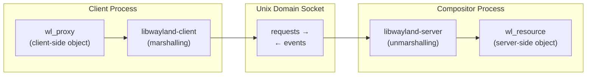
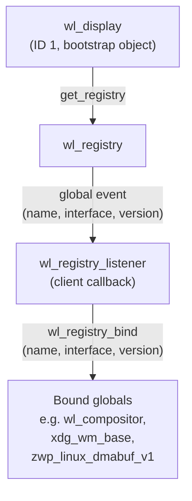
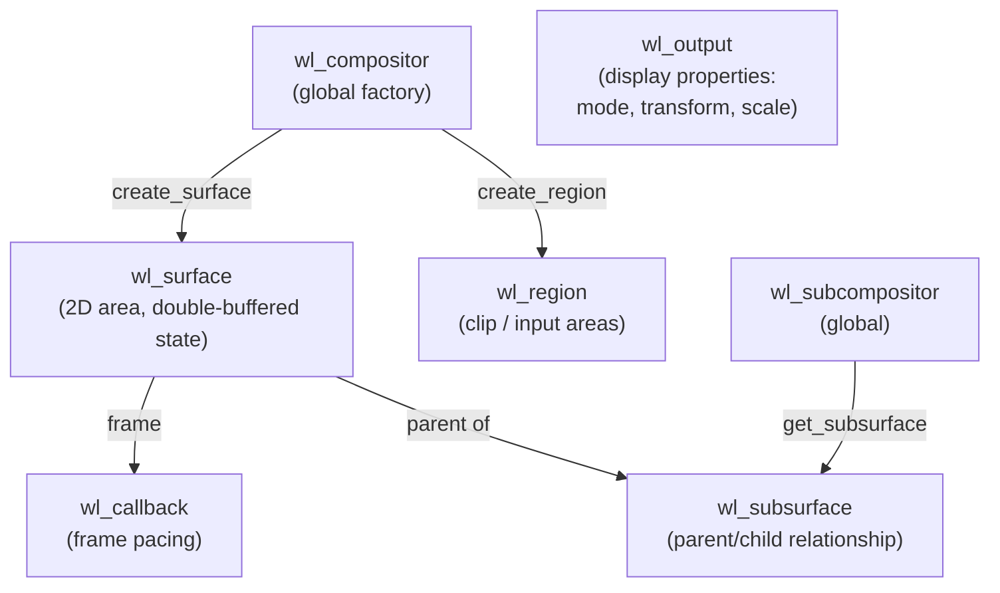
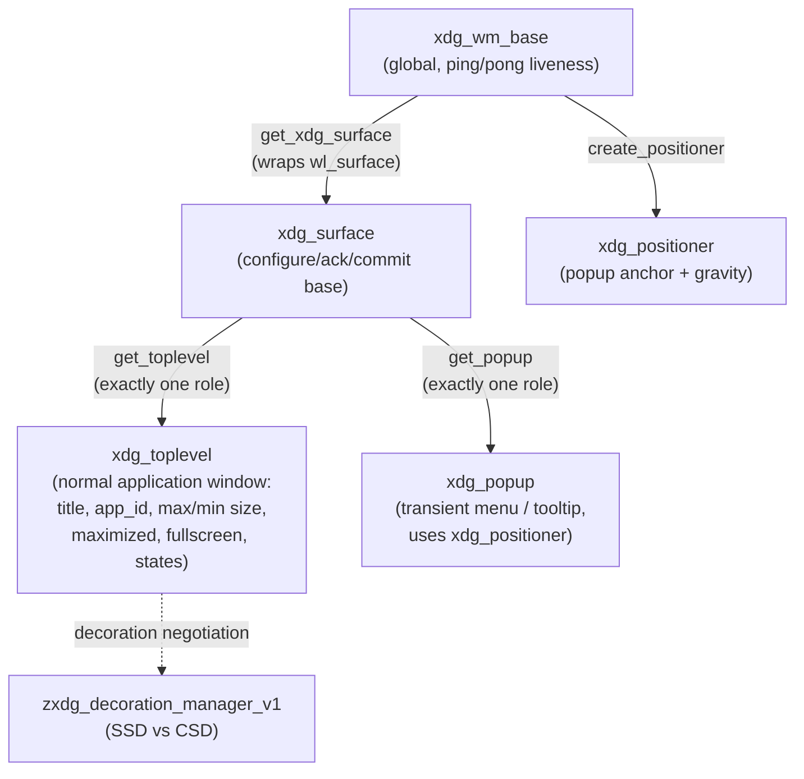
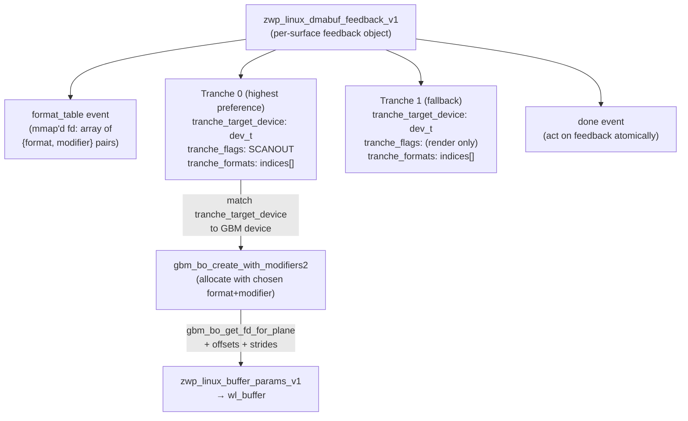
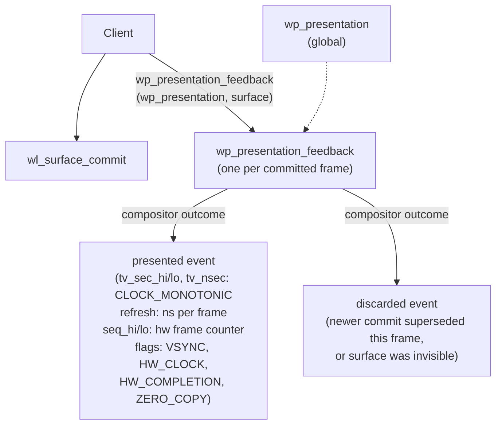
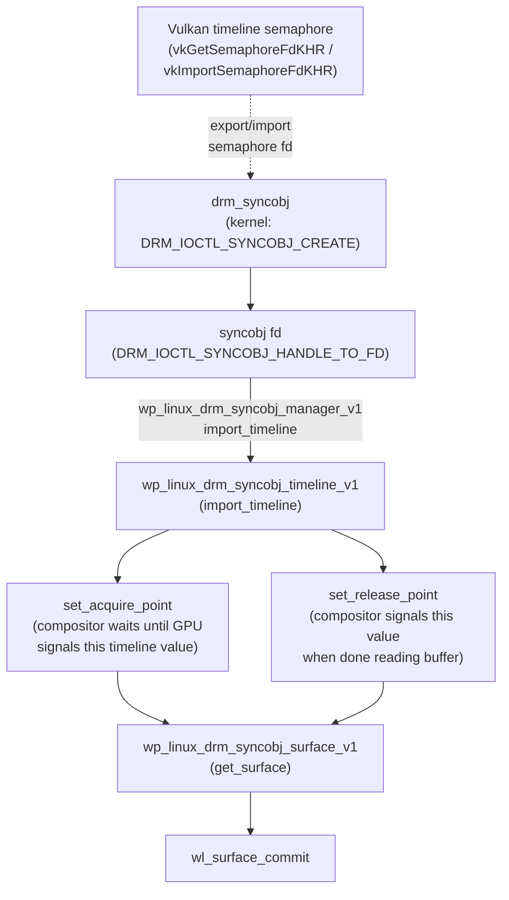
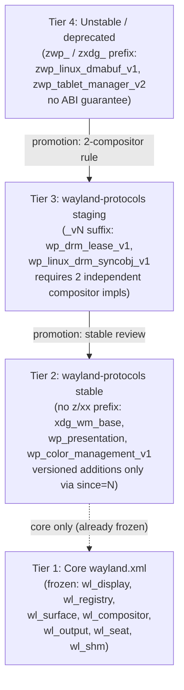

# Chapter 20: Wayland Protocol Fundamentals

**Part VI — The Display Stack**

**Audiences**: *Systems and driver developers* who need to understand the wire protocol, security internals, and GPU buffer-sharing primitives at the protocol layer; and *graphics application developers* who need the surface and buffer model to write correct Wayland-native code. Both audiences will encounter the extension protocols — xdg-shell, linux-dmabuf, wp_presentation, explicit sync, colour management — that make Wayland production-capable in 2025.

---

## Table of Contents

1. [Design Philosophy and Historical Context](#1-design-philosophy-and-historical-context)
2. [The Wayland Object Model](#2-the-wayland-object-model)
3. [The Wire Protocol](#3-the-wire-protocol)
4. [Core Interfaces: Surfaces, Compositor, and Output](#4-core-interfaces-surfaces-compositor-and-output)
5. [Window Management: xdg-shell](#5-window-management-xdg-shell)
6. [GPU Buffer Flow: linux-dmabuf](#6-gpu-buffer-flow-linux-dmabuf)
7. [Presentation Timing: wp_presentation and wp_fifo_v1](#7-presentation-timing-wp_presentation-and-wp_fifo_v1)
8. [Explicit Synchronisation](#8-explicit-synchronisation)
9. [Colour Management: wp_color_management_v1](#9-colour-management-wp_color_management_v1)
10. [The Wayland Security Model](#10-the-wayland-security-model)
11. [DRM Leasing: Delegating Connectors to Privileged Clients](#11-drm-leasing-delegating-connectors-to-privileged-clients)
12. [Protocol Versioning and the Stability Ladder](#12-protocol-versioning-and-the-stability-ladder)
13. [Known Limitations and Protocol Gaps](#13-known-limitations-and-protocol-gaps)
14. [Integrations](#integrations)
15. [References](#references)

---

## 1. Design Philosophy and Historical Context

**Wayland** is not an incremental improvement to **X11**. It is a complete redesign of the contract between a display server and its clients, motivated by the observation that almost every assumption baked into **X11** by the mid-1980s had become wrong by 2008. **X11** was designed around a model in which the server draws on behalf of clients: the application issues drawing commands (**XDrawLine**, **XFillRectangle**, **XPutImage**) and the server executes them. Compositing — the ability to take each client's window and blend it into a final scene — was grafted onto **X11** decades later via the **COMPOSITE** extension, which fundamentally works by redirecting each client's rendering into an offscreen pixmap and handing the result to a compositing manager. That compositing manager is itself an **X11** client, which means it races with the X server's own rendering engine, requires synchronisation via **DAMAGE** and **PRESENT** extension events, and still cannot control exactly when a frame hits the display hardware without a separate **DRI3/Present** dance.

Kristian Høgsberg's key insight in 2008 was to invert the model entirely. In **Wayland**, clients render into their own buffers — typically GPU memory allocated with **GBM** or **Vulkan** — and the compositor is a simple policy layer that decides which buffers to display, where, and at what time. The compositor is not a rendering engine. It does not draw on behalf of clients. Its job is to composite already-rendered buffers, drive the **KMS** atomic commit that puts pixels on screen, and deliver input events back to the appropriate client based on surface geometry. Because the compositor already performs its own scene-graph rendering to blend surfaces, there is no duplication of effort. There is no "compositing tax" that you pay in **Wayland** that you did not already pay in a modern **X11** desktop with a compositing manager running.

**Wayland**'s scope is deliberately narrow: it is a protocol between clients and a compositor running on the same machine. It does not specify how the compositor acquires the display — that is left to **DRM/KMS** (Chapter 2). It does not specify the toolkit or widget set. It does not specify network transparency, which **X11** provided in theory but which had become dysfunctional in practice because GPU-accelerated rendering over the network requires a completely different approach (remote desktop protocols, **PipeWire** screen capture, **RDP**). **Wayland**'s narrowness is a feature. The protocol can be frozen at its core because it has no responsibilities beyond client-compositor communication.

The **libwayland-client** and **libwayland-server** libraries implement the object model and wire protocol transport described in this chapter. They know nothing about rendering, GPU memory, or display hardware. They provide a type-safe marshalling layer around a **Unix domain socket**. The actual rendering is performed by **Mesa**/**Vulkan**, the display hardware is driven by the compositor via **DRM/KMS**, and the buffer sharing is performed via **DMA-BUF** file descriptors passed over the socket's ancillary data channel.

The chapter covers the full **Wayland** protocol stack from first principles to production-grade extensions. Section 2 explains the object model: how **wl_proxy** (client-side) and **wl_resource** (server-side) objects are identified by integer IDs, how the **wl_registry** global discovery mechanism works, and how **wl_registry_bind** negotiates protocol versions at runtime. Section 3 describes the binary wire protocol carried over the **Unix domain socket**, including the two-word message header, argument encoding, out-of-band **fd** passing via **SCM_RIGHTS**, and the **wayland-scanner** code-generation tool that transforms **XML** protocol definitions into typed C headers. Section 4 covers the core interfaces: **wl_surface** (the central double-buffered 2D area), **wl_compositor**, **wl_region**, **wl_subsurface** (via **wl_subcompositor**), frame pacing via **wl_callback**, and display property advertisement via **wl_output**. Section 5 covers window management via **xdg-shell**: the **xdg_wm_base** global, the configure/ack/commit three-step, **xdg_toplevel** for normal application windows, **xdg_popup** with **xdg_positioner** for menus and tooltips, decoration negotiation via **zxdg_decoration_manager_v1**, and the **xdg_activation_v1** focus-token mechanism.

Section 6 covers GPU buffer flow via **zwp_linux_dmabuf_v1** and its **zwp_linux_dmabuf_feedback_v1** per-surface tranche system, contrasting it with the CPU-copy path of **wl_shm**. It explains **DRM format modifiers**, **GBM** buffer allocation with **gbm_bo_create_with_modifiers2**, and how the same path backs the **VK_KHR_wayland_surface** **Vulkan** swapchain. Section 7 covers presentation timing: **wp_presentation** for exact **CLOCK_MONOTONIC** display timestamps and the **WP_PRESENTATION_FEEDBACK_KIND_ZERO_COPY** flag, and **wp_fifo_v1** (introduced in **wayland-protocols** 1.38) for protocol-level **FIFO** frame delivery replacing **eglSwapInterval(1)**. Section 8 covers explicit GPU synchronisation: the historical implicit sync problem with **dma_buf_fence** and **dma_resv**, the failure mode on **NVIDIA**'s proprietary driver, the deprecated **zwp_linux_explicit_synchronization_v1**, and the modern **wp_linux_drm_syncobj_v1** protocol using **DRM sync objects** (**drm_syncobj**) and timeline semaphores interoperable with **Vulkan**'s **vkGetSemaphoreFdKHR**/**vkImportSemaphoreFdKHR**. Section 9 covers colour management via **wp_color_management_v1** (stable in **wayland-protocols** 1.41): the **wp_color_manager_v1** capability factory, **wp_image_description_v1** for parametric colour space descriptions including **ST2084_PQ** and **HLG** transfer functions, and **HDR** surface workflows using **VK_FORMAT_R16G16B16A16_SFLOAT** scRGB extended range.

Section 10 analyses the **Wayland** security model: surface isolation, compositor-controlled input routing, screen capture via **zwlr_screencopy_manager_v1** and the **xdg-desktop-portal** infrastructure, the **wl_data_device_manager** clipboard model, **ext-data-control-v1**, and **wp_security_context_v1** for **Flatpak** and **snap** sandboxed applications. Section 11 covers **DRM** leasing via **wp_drm_lease_v1**: the kernel **DRM_IOCTL_MODE_CREATE_LEASE** mechanism, how **Monado** (the **OpenXR** runtime) uses leased **DRM** file descriptors for direct-mode VR rendering on **HMD** connectors at high refresh rates via **drmModeAtomicCommit**, and secondary kiosk and **VK_KHR_display** use cases. Section 12 describes the **wayland-protocols** stability ladder — core frozen interfaces, stable protocols, staging protocols (requiring two independent compositor implementations), and the deprecated **zwp_** / **zxdg_** unstable tier — together with the runtime version negotiation pattern using **wl_registry_bind** and **wl_proxy_get_version**. Section 13 catalogues known limitations and protocol gaps as of 2025–2026: global keyboard shortcuts (**XGrabKey** replacement via **GlobalShortcuts** portal), **IME** integration via **zwp_text_input_v3** (with **IBus** and **Fcitx5**), screen capture fragmentation across **ext-image-copy-capture-v1** and compositor-specific paths, system tray absence (**ext-tray-v1** unmerged), remote display via **PipeWire** and **RDP** versus **X11** network transparency, protocol graduation latency for widely-deployed staging protocols, and the absence of a unified capability discovery mechanism analogous to **XQueryExtension**.

The timeline of **Wayland**'s adoption in mainstream Linux distributions is instructive. Høgsberg's initial design documents appeared in 2008; **Weston**, the reference compositor, became functional around 2011. **GNOME Shell** switched to **Wayland** as the default for the first time in Fedora 25 in 2016 (using **GNOME Shell** 3.22 on top of **Mutter**). Ubuntu 17.10 attempted a **Wayland** default, reverted to **X11** for 18.04 LTS, then committed to **Wayland** as default in Ubuntu 21.04. **KDE Plasma 6** (February 2024) completed the transition for the **KDE** ecosystem, making **Wayland** the default session across all major desktop environments. As of 2025, **X11** is the legacy fallback path; **Wayland** is the production environment.

---

## 2. The Wayland Object Model

Every entity in the Wayland protocol is an **object** with a unique integer ID. From the client's perspective, objects are represented by `wl_proxy` structures; from the compositor's perspective by `wl_resource` structures. These are the two halves of the same logical entity, living on opposite sides of the Unix socket. When a client calls a request on a proxy, libwayland serialises it to the socket; when the compositor processes that serialised message, it looks up the corresponding `wl_resource` and dispatches the request handler.



The type system that governs this correspondence is `wl_interface`. Each `wl_interface` struct (defined in generated protocol headers) carries the interface name as a C string, a version integer, and arrays of `wl_message` descriptors for its requests and events. A `wl_message` carries the method name and a signature string that encodes the argument types using single-character codes: `i` for int, `u` for uint, `f` for fixed-point, `s` for string, `o` for object, `n` for new_id, `a` for array, `h` for file descriptor. The signature is used by the marshalling machinery both to encode outgoing messages and to validate and decode incoming ones.

Object IDs are 32-bit unsigned integers. The client allocates IDs in the range 1 through 0xFEFFFFFF; the compositor allocates server-side IDs in the range 0xFF000001 through 0xFFFFFFFF. ID 0 is the null object, used when an optional object argument is absent. ID 1 is always pre-allocated to the `wl_display` — it is the bootstrap object that exists before any protocol negotiation. This allocation split is important: it guarantees that no two parties can accidentally reuse an ID, even before any messages are exchanged.

The global registry is the mechanism by which a client discovers what capabilities the compositor offers. Immediately after connecting, a client sends `wl_display.get_registry` (passing a freshly allocated ID for the `wl_registry` object), then calls `wl_display_roundtrip`. The compositor responds by emitting a `wl_registry.global` event for each available global, carrying three pieces of information: the **name** (a compositor-local integer identifying this global instance), the **interface** string (e.g. `"wl_compositor"`, `"zwp_linux_dmabuf_v1"`), and the **version** integer (the maximum protocol version the compositor implements for this interface). The client registers a `wl_registry_listener` to receive these events:



```c
/* wayland/src/wayland-client.c — typical registry listener pattern */
static void registry_global(void *data, struct wl_registry *registry,
                             uint32_t name, const char *interface,
                             uint32_t version)
{
    struct client_state *state = data;
    if (strcmp(interface, wl_compositor_interface.name) == 0) {
        state->compositor = wl_registry_bind(registry, name,
            &wl_compositor_interface,
            MIN(version, WL_COMPOSITOR_MAX_VERSION));
    } else if (strcmp(interface, xdg_wm_base_interface.name) == 0) {
        state->xdg_wm_base = wl_registry_bind(registry, name,
            &xdg_wm_base_interface,
            MIN(version, XDG_WM_BASE_MAX_VERSION));
    }
    /* ... bind other globals ... */
}

static void registry_global_remove(void *data, struct wl_registry *registry,
                                   uint32_t name)
{
    /* handle hot-plug removal of outputs, input devices, etc. */
}

static const struct wl_registry_listener registry_listener = {
    .global = registry_global,
    .global_remove = registry_global_remove,
};
```

The `wl_registry_bind` call is the act of "binding" to a global. It sends a `wl_registry.bind` request to the compositor and returns a typed proxy. The version argument passed to `wl_registry_bind` is the negotiated version: the client caps it at its own maximum (`MY_MAX_VERSION`) so that it never asks for functionality the compositor does not support. After binding, `wl_proxy_get_version(proxy)` returns the negotiated version, which the client must use to gate calls to requests introduced in later versions.

The object lifecycle deserves careful attention. Objects are destroyed explicitly, not by garbage collection. The client calls `wl_proxy_destroy` to free its proxy representation. However, the compositor may have already queued events for that object before receiving the destroy request. To handle this correctly, some objects provide a `destroy` request that the client sends before calling `wl_proxy_destroy`; the compositor processes the request and stops sending events. For objects that the server creates (server-side allocation), the compositor sends a `delete_id` event on `wl_display` to inform the client that the server-side ID has been released and the client may free its proxy.

The double-destroy race condition arises when a client calls `wl_proxy_destroy` on an object while an event is in flight that references that object. The standard solution is to set the proxy's listener to NULL after destroy and check for that in the event handler, or to use `wl_event_queue` to serialise destruction. The `wl_display` event queue — the default queue — collects all events delivered over the socket. `wl_display_dispatch` blocks until at least one event arrives and then dispatches all queued events. `wl_display_dispatch_pending` dispatches without blocking, useful when combined with `poll`. `wl_display_flush` flushes outgoing requests from the client's send buffer to the socket.

For multi-threaded clients, extra event queues (`wl_display_create_queue`) allow events for specific objects to be dispatched on a dedicated thread without contending with the default queue. This pattern is used by EGL's Wayland platform code in Mesa (see `src/egl/drivers/dri2/platform_wayland.c`) to dispatch frame callbacks and dmabuf feedback on a background thread while the main thread renders.

---

## 3. The Wire Protocol

The Wayland wire protocol is a stream of 32-bit words exchanged over a Unix domain socket. The choice of Unix domain sockets over TCP is intentional and architecturally significant: Unix sockets support two capabilities that TCP cannot provide — passing process credentials via `SCM_CREDENTIALS` ancillary data (used for security context authentication) and passing file descriptors via `SCM_RIGHTS` ancillary data. The second capability is the foundation of Wayland's zero-copy buffer sharing: a DMA-BUF file descriptor for a GPU buffer can be passed from a client to the compositor in a single sendmsg call, without copying the buffer data.

Every message begins with a fixed two-word (8-byte) header. The first word is the **object ID** of the target (for requests sent to the compositor) or the source (for events sent to clients). The second word encodes two fields packed together: the upper 16 bits are the **message size in bytes** (including the header), and the lower 16 bits are the **opcode** for the specific request or event within that interface. After the header come the arguments, each encoded according to their type and padded to 32-bit alignment:

- **int / uint**: a single 32-bit word, signed or unsigned. All values use the host's native byte order (little-endian on x86).
- **fixed**: a 24.8 signed fixed-point number encoded as a 32-bit word. Divide by 256.0 to get the floating-point value.
- **object / new_id**: a 32-bit object ID. `new_id` additionally includes the interface name length, the interface name string (NUL-terminated, padded), and the version integer when used in generic bind calls (as in `wl_registry.bind`).
- **string**: a 32-bit length field (including the NUL terminator), followed by the UTF-8 bytes padded to 32-bit alignment.
- **array**: a 32-bit length field, followed by raw bytes padded to 32-bit alignment.
- **fd**: file descriptors are passed entirely out-of-band via the `cmsg` ancillary data channel. The fd does not appear in the in-band message body. Critically, the Wayland protocol guarantees that fd arguments arrive in the cmsg data in the same order as the messages that reference them; the receiving side reads one fd per `h`-type argument from the cmsg buffer as it processes each message.

Setting the environment variable `WAYLAND_DEBUG=1` before running a client causes libwayland-client to print every request sent and every event received to stderr. Each line shows a timestamp in fractional seconds, the object ID and interface name, the request or event name, and the argument values. A file descriptor argument is shown as the integer fd number and the string `(fd)`. This output is invaluable for debugging protocol errors and understanding the sequence of configure/ack/commit cycles. The output is not a formal spec; it is generated directly from the wayland-scanner-produced metadata, so argument names match the XML.

The **wayland-scanner** is the code generation tool that bridges the XML protocol definition language and C. Given a protocol XML file (e.g. `xdg-shell.xml` from the `wayland-protocols` repository), `wayland-scanner` produces a header (`xdg-shell-client-protocol.h` or `xdg-shell-server-protocol.h`) containing the `wl_interface` and `wl_message` tables, typed request-sending functions, typed event handler function pointers, and listener structs. It also produces a corresponding `.c` file with the interface tables. The XML schema defines `<interface>`, `<request>`, `<event>`, `<arg>`, and `<enum>` elements; the `since=` attribute on requests and events is how version-gated additions are marked and later enforced by `wl_proxy_get_version` checks.

A concrete example: the `xdg_surface.ack_configure` request in `xdg-shell.xml` is declared as:

```xml
<!-- wayland-protocols/stable/xdg-shell/xdg-shell.xml -->
<request name="ack_configure">
  <description summary="ack a configure event">
    When a configure event is received, if a client commits the surface in
    response to the configure event, then the client must make an
    ack_configure request sometime before the commit request, passing
    along the serial of the configure event.
  </description>
  <arg name="serial" type="uint" summary="the serial from the configure event"/>
</request>
```

The scanner generates a `xdg_surface_ack_configure(surface, serial)` inline function that calls `wl_proxy_marshal_flags`. The server-side header generates a `xdg_surface_send_configure(resource, serial)` function that calls `wl_resource_post_event`.

---

## 4. Core Interfaces: Surfaces, Compositor, and Output

The `wl_compositor` global is the root factory for two fundamental objects. `wl_compositor_create_surface` creates a `wl_surface`, the central object representing a rectangular area on screen. `wl_compositor_create_region` creates a `wl_region` for describing complex clip or input areas through union and subtract operations.



A `wl_surface` is a powerful but deliberately minimal object. It has no position on screen (that is determined by shell roles like `xdg_toplevel`), no title, and no window management semantics. It is just a 2D area that can hold a buffer, accept damage, and be committed. The state model is **double-buffered**: all modifications made via protocol requests accumulate in a *pending* state and have no effect until the client calls `wl_surface_commit`, at which point the pending state atomically becomes the current state and the compositor may schedule a repaint.

The sequence for updating a surface is:

1. Call `wl_surface_attach(surface, buffer, 0, 0)` to bind the new `wl_buffer` as pending.
2. Call `wl_surface_damage_buffer(surface, x, y, width, height)` to mark the rectangle that changed (in buffer coordinates). Using `wl_surface_damage_buffer` rather than the older `wl_surface_damage` is important: the former uses buffer coordinates, which are invariant under HiDPI scaling and transformation, while the latter uses surface coordinates and requires the client to account for the buffer scale. Providing accurate damage regions is important for performance: compositors that use partial-screen updates (tile damage, hardware overlays) can limit the repainted area.
3. Call `wl_surface_commit`. The compositor now owns the buffer until it sends `wl_buffer.release`, at which point the client is free to modify or deallocate the buffer.

The buffer ownership guarantee is a contract that both sides must honour. The client must not modify the buffer after `wl_surface_commit` until `wl_buffer.release` arrives. The compositor must send `wl_buffer.release` when it is done reading the buffer — typically after the next frame is presented, or after the surface is destroyed. This contract enables zero-copy rendering: the GPU writes to the buffer, the client commits it, and the compositor (or KMS) reads from it without any copy.

`wl_surface_set_buffer_scale(surface, scale)` informs the compositor that buffer pixels represent `scale` logical pixels each side. A HiDPI display with a 2x factor requires the application to render at double resolution into the buffer, then declare `scale=2`; the compositor maps the buffer onto the logical surface area. `wl_surface_set_buffer_transform(surface, transform)` declares a rotation or reflection applied to the buffer before display, allowing buffers in a rotated orientation (e.g. portrait capture from a camera) to be composited correctly without CPU rotation.

`wl_surface_frame` returns a `wl_callback` object. The compositor sends a `done` event on this callback shortly before the next frame is presented (typically at vblank minus a few milliseconds to account for rendering time). This is the correct mechanism for pacing animations: the client renders a frame, commits it, registers a frame callback, and waits for the callback before rendering the next frame. Using `wl_surface_frame` rather than `usleep` or `eglSwapInterval(1)` ensures that the client adapts to the compositor's actual display rate, including variable-refresh-rate displays and multi-monitor setups where displays may run at different rates.

**Subsurfaces**, created via `wl_subcompositor_get_subsurface`, establish a parent/child relationship between surfaces. A subsurface inherits its parent's coordinate space (its position is relative to the parent). In *synchronised* mode (the default), a subsurface's pending state is held until the parent commits, creating a fully atomic update of the parent and all synchronised children together. In *desynchronised* mode, the subsurface can commit independently. Synchronised subsurfaces are used by GTK and Qt to implement video-overlay planes without tearing.

`wl_output` advertises the properties of a connected display: physical dimensions in millimetres (from EDID), the current mode (pixel width, pixel height, refresh rate in mHz), subpixel layout for font rendering, and the display's orientation transform. Starting with wl_output version 4, the `name` event provides a human-readable connector name (e.g. `"HDMI-A-1"`, `"eDP-1"`), which is useful for persisting per-display settings. The `done` event marks the end of a batch of output property events, allowing compositors to send multiple related events atomically. Clients should wait for `done` before acting on output properties.

---

## 5. Window Management: xdg-shell

Core Wayland deliberately omits window management. A bare `wl_surface` has no title bar, no resize handles, no concept of a workspace, and cannot be minimised, maximised, or fullscreened. Window management policy is the responsibility of the compositor, and the mechanism by which clients participate in that policy is the `xdg-shell` protocol extension, which graduated to stable status in 2019.

`xdg_wm_base` is the global that provides the xdg-shell functionality. It serves as a factory for `xdg_surface` objects (via `xdg_wm_base_get_xdg_surface`) and `xdg_positioner` objects (for popup positioning). It also implements a simple liveness mechanism: the compositor periodically sends a `ping` event with a serial; if the client does not respond with a `pong` within a reasonable timeout, the compositor may mark the window as unresponsive and offer the user a "kill application" option.

An `xdg_surface` wraps a `wl_surface` and is the base class for window roles. It adds the configure/ack mechanism and the `set_window_geometry` request. An `xdg_surface` must be assigned exactly one role: `xdg_toplevel` (a normal application window) or `xdg_popup` (a transient menu or tooltip).



The configure/ack/commit three-step is the most commonly misunderstood aspect of xdg-shell and the source of most toolkit-level Wayland bugs. The compositor sends a `configure` event on the `xdg_surface` (and, if applicable, on the `xdg_toplevel` or `xdg_popup` first). Each configure event carries a **serial** — a monotonically increasing integer. The client must:

1. Receive and process the configure event(s).
2. Call `xdg_surface_ack_configure(xdg_surface, serial)` with the serial from the latest configure event received.
3. Only then call `wl_surface_commit`.

If the client commits without acking the latest configure, the compositor is permitted to ignore the commit entirely. This three-step ensures that the compositor and client agree on the surface geometry and state before the surface is made visible or resized. The most common bug is calling `ack_configure` with a stale serial (from a previous configure event that has since been superseded). The protocol specifies that if multiple configure events arrive before the client processes them, the client need only ack the last one — but it must be the last, not an earlier one.

```c
/* Correct configure/ack/commit loop for an xdg_toplevel */
static void xdg_surface_configure(void *data, struct xdg_surface *xdg_surface,
                                   uint32_t serial)
{
    struct window *win = data;
    win->pending_serial = serial;   /* store for ack at commit time */
    win->needs_ack = true;
}

static void render_and_commit(struct window *win)
{
    /* render into win->buffer ... */
    wl_surface_attach(win->surface, win->buffer, 0, 0);
    wl_surface_damage_buffer(win->surface, 0, 0, INT32_MAX, INT32_MAX);
    if (win->needs_ack) {
        xdg_surface_ack_configure(win->xdg_surface, win->pending_serial);
        win->needs_ack = false;
    }
    wl_surface_commit(win->surface);
}
```

`xdg_toplevel` represents a standard application window. Its key requests include `set_title` (for task bar display), `set_app_id` (the application identifier, used to look up the `.desktop` file and icon), `set_max_size`, `set_min_size`, `set_maximized`, `set_fullscreen`, `move`, and `resize`. The compositor sends `configure` events on the toplevel carrying a suggested `width` and `height` (zero means "choose your own size") and a list of active `states`. States are an enum bitmask: `maximized`, `fullscreen`, `resizing`, `activated` (keyboard focus), and the four tiled-edge states (`tiled_left`, `tiled_right`, `tiled_top`, `tiled_bottom`, added in version 2). Version 6 of xdg-shell added the `suspended` state, allowing the compositor to hint that a window is not currently visible (e.g. on a different workspace) so the client can stop rendering.

Server-side versus client-side window decorations are negotiated via `zxdg_decoration_manager_v1` (a staging protocol). The compositor advertises its preference; client-side decorations are the fallback when the compositor does not support server-side decorations or when running in environments like GNOME that historically preferred client-side. GTK4 and Qt 6 implement CSD; wlroots-based compositors generally support SSD.

`xdg_popup` represents a small transient window — a dropdown menu, autocomplete popup, or tooltip. Its positioning is described via `xdg_positioner`, which expresses the anchor point, gravity, and constraint adjustments (flip, slide, resize) relative to a parent surface. The `grab` request requests an exclusive input grab for the popup, meaning all keyboard and pointer events are delivered to the popup until it is dismissed. `xdg_activation_v1` provides a token-based mechanism for bringing a specific window to the foreground in response to a user gesture, replacing the focus-stealing-prevention workarounds that plagued X11 desktop interactions.

---

## 6. GPU Buffer Flow: linux-dmabuf

The `wl_shm` interface allows clients to share memory with the compositor via a `memfd` and a `wl_shm_pool`. It is adequate for small UI surfaces but imposes a CPU copy when the compositor textures the buffer. For GPU-rendered content — anything using OpenGL, Vulkan, or VA-API video decode — the correct path is `zwp_linux_dmabuf_v1`, the protocol for passing DMA-BUF file descriptors to the compositor.

A DMA-BUF is a kernel primitive (see Chapter 4) representing a buffer in device-accessible memory, described by a file descriptor. The key property is that multiple processes and devices can all access the same physical memory through their respective file descriptors, without any copy. When a client passes a DMA-BUF fd to the compositor via `zwp_linux_dmabuf_v1`, the compositor can either import it as an OpenGL texture (`EGL_EXT_image_dma_buf_import`), use it as a Vulkan external memory import, or — in the zero-copy case — submit it directly to KMS as a scanout plane framebuffer. The `zero_copy` flag in `wp_presentation.presented` events (Section 7) confirms that the latter path occurred.

DRM format modifiers are the critical variable. A GPU allocates memory in a **tiling layout** — a hardware-specific arrangement of pixels in memory that improves cache efficiency. The modifier is a 64-bit integer that encodes this layout. When the client creates a buffer with a modifier that the compositor's KMS hardware supports for scanout, zero-copy presentation becomes possible. When the modifier is `DRM_FORMAT_MOD_LINEAR` (0), the data is in row-major order and is universally importable but cannot always be scanned out directly.

Version 4 of `zwp_linux_dmabuf_v1` introduced the **feedback** mechanism — `zwp_linux_dmabuf_feedback_v1` — which replaces the earlier flat format/modifier advertisement with a structured, per-surface hint system. The feedback object delivers a **format table** and one or more **tranches**:

1. The compositor sends a `format_table` event carrying a file descriptor that the client should `mmap` in read-only private mode. The mapped memory contains a tightly packed array of (format, modifier) pairs, each 16 bytes wide: a 32-bit DRM format code, 4 bytes of padding, and a 64-bit modifier value, all in native byte order.

2. Each **tranche** consists of: `tranche_target_device` (a `dev_t` identifying the DRM device node the compositor will scan out on), `tranche_flags` (whether the tranche represents direct scanout capability vs. texture/render capability), `tranche_formats` (an array of 16-bit indices into the format table), and `tranche_done`. Tranches are sent in descending order of preference: the first tranche is the optimal allocation path for direct scanout on the preferred device.

3. The compositor sends `done` to signal the end of the entire feedback object, after which the client can act on the information atomically.



The client iterates the tranches, looking for a tranche where `tranche_target_device` matches the DRM device it has a GBM context for, and uses the format/modifier pairs from that tranche to call `gbm_bo_create_with_modifiers2`. Mesa's `platform_wayland.c` implements this precisely:

```c
/* Mesa src/egl/drivers/dri2/platform_wayland.c (simplified) */
static void
dmabuf_feedback_tranche_formats(void *data,
    struct zwp_linux_dmabuf_feedback_v1 *zwp_linux_dmabuf_feedback_v1,
    struct wl_array *indices)
{
    struct dri2_egl_surface *dri2_surf = data;
    struct dmabuf_feedback *feedback = &dri2_surf->pending_dmabuf_feedback;
    struct dmabuf_feedback_tranche *tranche =
        &feedback->pending_tranche;

    uint16_t *index;
    wl_array_for_each(index, indices) {
        if (*index >= feedback->format_table.size)
            continue;
        struct drm_format_modifier_pair *pair =
            &feedback->format_table.data[*index];
        add_format_modifier_to_tranche(tranche,
                                       pair->format, pair->modifier);
    }
}
```

The full buffer lifecycle for a Wayland application using GBM + EGL with feedback looks like this. First, the app requests a `zwp_linux_dmabuf_feedback_v1` for the surface from the compositor and waits for the tranches. It picks the highest-preference tranche that matches its GPU device and calls `gbm_bo_create_with_modifiers2(gbm_dev, width, height, format, modifiers, count, flags)`. It exports the DMA-BUF with `gbm_bo_get_fd_for_plane(bo, 0)` and, for multi-planar formats, additional planes with their respective offsets and strides. It then creates a `zwp_linux_buffer_params_v1`, calls `zwp_linux_buffer_params_v1_add` for each plane with `(fd, plane_idx, offset, stride, modifier_hi, modifier_lo)`, and calls `zwp_linux_buffer_params_v1_create_immed` to get a `wl_buffer` back synchronously. The buffer is then attached to the surface, committed, and the cycle repeats when `wl_buffer.release` arrives.

The same buffer allocation path is used internally by the Vulkan swapchain when using `VK_KHR_wayland_surface`. The application calls `vkCreateSwapchainKHR` with a `VkWaylandSurfaceCreateInfoKHR`, and the swapchain implementation in the Mesa Vulkan driver performs the feedback query, allocates DMA-BUFs, and manages the attach/commit/release cycle internally. From the application's perspective, it simply calls `vkQueuePresentKHR`.

---

## 7. Presentation Timing: wp_presentation and wp_fifo_v1

The `wl_surface.frame` callback tells a client when to start rendering the next frame, but it tells the client nothing about whether the previous frame was actually displayed on screen or when it appeared. For applications that need accurate frame-pacing metrics — game engines measuring frame latency, video players enforcing A/V sync, scientific visualisations — `wp_presentation` provides exact display timestamps.

The `wp_presentation` global, found in `wayland-protocols/stable/presentation-time/`, was designed stable-first and is the positive example of the Wayland protocol process. A client using `wp_presentation` attaches a feedback object to each committed frame by calling `wp_presentation_feedback(wp_presentation, surface)` before or at the same `wl_surface_commit`. The compositor creates a `wp_presentation_feedback` object and later sends one of two events:

- **`presented`**: The frame was displayed. The event carries `tv_sec_hi`, `tv_sec_lo`, `tv_nsec` (a split 64-bit seconds value plus nanoseconds, forming a `CLOCK_MONOTONIC` timestamp), `refresh` (the display's current refresh interval in nanoseconds), `seq_hi` and `seq_lo` (a 64-bit display-hardware frame counter), and a `flags` bitmask.
- **`discarded`**: The frame was never displayed. This happens when a newer commit was applied before the compositor got a chance to present the older frame, or when the surface was invisible.



The `flags` bitmask is informative for diagnosis. `WP_PRESENTATION_FEEDBACK_KIND_VSYNC` (bit 0) indicates the presentation was synchronised to a vertical blanking interval. `WP_PRESENTATION_FEEDBACK_KIND_HW_CLOCK` (bit 1) means the timestamp came from hardware (DRM vblank event) rather than a software estimate. `WP_PRESENTATION_FEEDBACK_KIND_HW_COMPLETION` (bit 2) means the compositor received a hardware flip-complete event. `WP_PRESENTATION_FEEDBACK_KIND_ZERO_COPY` (bit 3) confirms that the buffer was scanned out directly without being resampled into a compositor framebuffer.

Correct `presented`-callback latency measurement:

```c
/* Implementation of wp_presentation_feedback_listener.presented */
static void feedback_presented(void *data,
    struct wp_presentation_feedback *feedback,
    uint32_t tv_sec_hi, uint32_t tv_sec_lo, uint32_t tv_nsec,
    uint32_t refresh, uint32_t seq_hi, uint32_t seq_lo, uint32_t flags)
{
    struct frame_stats *stats = data;
    uint64_t present_ns = ((uint64_t)tv_sec_hi << 32 | tv_sec_lo)
                          * UINT64_C(1000000000) + tv_nsec;
    uint64_t submit_ns = stats->submit_time_ns;  /* from clock_gettime before commit */
    uint64_t latency_us = (present_ns - submit_ns) / 1000;
    record_frame_latency(stats, latency_us,
                         !!(flags & WP_PRESENTATION_FEEDBACK_KIND_ZERO_COPY));
    wp_presentation_feedback_destroy(feedback);
}

static void feedback_discarded(void *data,
    struct wp_presentation_feedback *feedback)
{
    wp_presentation_feedback_destroy(feedback);
    /* count discarded frames for pacing diagnostics */
}
```

Handling `discarded` correctly is essential for frame-pacing accuracy. A game engine that only counts `presented` callbacks but ignores `discarded` ones will undercount the number of frames rendered and overestimate display throughput.

**wp_fifo_v1** (introduced in wayland-protocols 1.38, landing in late 2024) is a complementary latency control protocol. Where `wp_presentation` is about measuring what happened, `wp_fifo_v1` is about enforcing FIFO (first-in, first-out) frame delivery. The protocol provides a `wp_fifo_v1` object per surface with two requests:

- `set_barrier`: Included in a commit, this marks the commit as establishing a "FIFO barrier." The compositor will not apply subsequent commits that have called `wait_barrier` until this barrier has been applied and the display has completed at least one refresh cycle with the barrier frame active.
- `wait_barrier`: Included in a subsequent commit, this declares that the commit should not be applied until the previous barrier has been displayed for at least one refresh cycle.

The effect is that `set_barrier` + `wait_barrier` replaces the traditional `wl_surface.frame` + `eglSwapInterval(1)` combination with a protocol-level mechanism that the compositor can implement precisely, without busy-waiting or heuristic throttling. SDL2 and the Mesa EGL Wayland platform both use `wp_fifo_v1` when available. Implementation status across compositors should be verified at the time of reading; as of early 2025, Mutter, KWin, and wlroots all have `wp_fifo_v1` implementations at various stages.

---

## 8. Explicit Synchronisation

Until around 2023, Wayland buffer synchronisation relied on **implicit sync**: the GPU driver attaches a fence to the DMA-BUF when it finishes writing, and any subsequent user of the buffer is expected to wait on that fence before reading. The Linux kernel implements implicit sync via `dma_buf_fence` attached to the buffer's `dma_resv` reservation object. EGL's `EGL_ANDROID_native_fence_sync` extension lets applications export these fences as sync file descriptors, and the Wayland compositor can import them.

The problem with implicit sync is that it requires every participant to agree on the implicit fence protocol. Mesa's open-source GPU drivers (AMD, Intel, Nouveau) support implicit sync because they use the DRM AMDGPU, i915, and Nouveau kernel drivers which implement `dma_resv` correctly. NVIDIA's proprietary driver, however, historically did not expose implicit sync fences on DMA-BUF objects it produced. This meant that the compositor, when importing an NVIDIA-produced DMA-BUF, had no way to know when the GPU had finished rendering into it. The "NVIDIA black screen" and "flickering windows" issues on Wayland were frequently the result of the compositor reading a partially-rendered buffer.

The older `zwp_linux_explicit_synchronization_v1` (in `wayland-protocols/unstable/linux-explicit-synchronization/`) attempted to solve this with per-surface acquire and release fences attached to `wl_surface` commits as sync file descriptors. It was never widely adopted by compositors, largely because of API complexity and the fact that it predated timeline semaphore thinking.

The modern solution is `wp_linux_drm_syncobj_v1`, which entered wayland-protocols staging in wayland-protocols 1.34 (2023) and received a KWin implementation merged into KDE Plasma 6. It uses **DRM sync objects** (`drm_syncobj`) as the kernel primitive. A DRM syncobj is a lightweight kernel object that can be signalled by the GPU through a command submission. Timeline sync objects extend this with a 64-bit counter: operations can signal or wait on specific point values in the timeline, matching the semantics of Vulkan timeline semaphores.



The protocol flow is as follows:

1. The client creates a DRM syncobj via `DRM_IOCTL_SYNCOBJ_CREATE` and exports it as a file descriptor via `DRM_IOCTL_SYNCOBJ_HANDLE_TO_FD` (with `DRM_SYNCOBJ_HANDLE_TO_FD_FLAGS_EXPORT_SYNC_FILE` for point-based export, or without the flag for the timeline fd itself).

2. The client imports the syncobj fd into the Wayland protocol via `wp_linux_drm_syncobj_manager_v1_import_timeline(manager, fd)`, getting a `wp_linux_drm_syncobj_timeline_v1` object.

3. The client creates a `wp_linux_drm_syncobj_surface_v1` for the surface via `wp_linux_drm_syncobj_manager_v1_get_surface`.

4. Before each `wl_surface_commit`, the client calls:
   - `wp_linux_drm_syncobj_surface_v1_set_acquire_point(surface_sync, timeline, timeline_point_hi, timeline_point_lo)` — the compositor must not read the buffer until the GPU has signalled this point on the timeline.
   - `wp_linux_drm_syncobj_surface_v1_set_release_point(surface_sync, timeline, release_point_hi, release_point_lo)` — the compositor signals this point when it is finished with the buffer.

5. On Vulkan, the acquire point corresponds to the timeline semaphore value that the GPU will signal when rendering is complete. The semaphore is exported as a DRM syncobj fd via `vkGetSemaphoreFdKHR` with `VK_EXTERNAL_SEMAPHORE_HANDLE_TYPE_OPAQUE_FD_BIT`. The release point, when signalled by the compositor, can be imported back into Vulkan via `vkImportSemaphoreFdKHR` to gate the next frame's render submission.

```c
/* Client-side DRM syncobj setup (pseudocode with real ioctl names) */
struct drm_syncobj_create create = { .flags = 0 };
ioctl(drm_fd, DRM_IOCTL_SYNCOBJ_CREATE, &create);
uint32_t syncobj_handle = create.handle;

struct drm_syncobj_handle export = {
    .handle = syncobj_handle,
    .flags = 0,   /* export the timeline object itself, not a snapshot */
};
ioctl(drm_fd, DRM_IOCTL_SYNCOBJ_HANDLE_TO_FD, &export);
int syncobj_fd = export.fd;

/* Import into Wayland protocol */
struct wp_linux_drm_syncobj_timeline_v1 *timeline =
    wp_linux_drm_syncobj_manager_v1_import_timeline(syncobj_manager, syncobj_fd);

/* Per-frame: set acquire and release points before commit */
uint64_t acquire_point = current_frame_render_signal_value;
uint64_t release_point = acquire_point + 1;  /* release after acquire, same timeline */
wp_linux_drm_syncobj_surface_v1_set_acquire_point(
    drm_syncobj_surface, timeline,
    (uint32_t)(acquire_point >> 32), (uint32_t)acquire_point);
wp_linux_drm_syncobj_surface_v1_set_release_point(
    drm_syncobj_surface, timeline,
    (uint32_t)(release_point >> 32), (uint32_t)release_point);
wl_surface_attach(surface, buffer, 0, 0);
wl_surface_damage_buffer(surface, 0, 0, INT32_MAX, INT32_MAX);
wl_surface_commit(surface);
```

This design completely bypasses implicit sync infrastructure. NVIDIA's proprietary driver supports DRM sync objects and timeline semaphores, so `wp_linux_drm_syncobj_v1` works correctly on NVIDIA even when implicit DMA-BUF fencing is unavailable. KWin landed the explicit sync compositor implementation in KDE Plasma 6 (early 2024); Mutter received DRM syncobj support merged for GNOME 46 (Spring 2024). XWayland uses the `xwayland_explicit_synchronization` protocol extension to participate in the explicit sync chain for X11 client surfaces.

---

## 9. Colour Management: wp_color_management_v1

Modern displays and content creation pipelines span multiple colour spaces — sRGB, DCI-P3, BT.2020 — and high dynamic range content requires transfer functions (PQ, HLG) that extend far beyond the 0–1 range of SDR sRGB. The Wayland protocol needs to communicate each surface's colour encoding to the compositor so it can tone-map and gamut-map to the display's capabilities. The `wp_color_management_v1` protocol, which reached stable status in wayland-protocols 1.41 (released February 2025) after several years of incompatible unstable drafts (`xx_color_management`), provides this capability.

The `wp_color_manager_v1` singleton global serves as a factory and capability advertisement hub. It sends `supported_intent`, `supported_feature`, and `supported_tf_named` and `supported_primaries_named` events to declare what the compositor supports. Clients must wait for `wl_display_roundtrip` to collect these capabilities before attempting to use colour management.

`wp_image_description_v1` is an immutable description of a colour space: a set of primaries (CIE xy chromaticities), a white point, a transfer function, and optional HDR metadata. The `wp_color_manager_v1` provides several creation paths:

- `create_parametric`: Specify primaries and white point as CIE xy values, and a named transfer function (`tf_name`). Supported transfer functions include `BT1886`, `GAMMA22`, `GAMMA28`, `EXT_LINEAR`, `SRGB`, `ST2084_PQ`, and `HLG`.
- `create_windows_scrgb`: A predefined description for the Windows scRGB extended-range encoding (sRGB primaries, extended linear transfer function, values outside 0–1 represent HDR headroom).
- `get_output_image_description`: Returns the image description that matches the output's current capabilities — including whether the display is in HDR mode.

A `wp_color_management_surface_v1` is created per surface and allows the client to call `set_image_description(desc, render_intent)`. The render intent enum covers: `perceptual`, `relative`, `saturation`, `absolute`, `relative_bpc` (with black-point compensation), and `absolute_ignore_adaptation`. The compositor uses this information to apply a colour transform from the surface's image description to the display's image description.

An HDR Vulkan application workflow looks like this:

1. Query the compositor's supported features via `wp_color_manager_v1` events.
2. Call `get_output_image_description` on the relevant `wl_output` to learn if the display is in HDR mode and what its peak luminance is.
3. Render in scRGB extended range (Vulkan surface format `VK_FORMAT_R16G16B16A16_SFLOAT` with values above 1.0 representing HDR headroom).
4. Create a `wp_image_description_v1` via `create_windows_scrgb` (or `create_parametric` with `EXT_LINEAR` and sRGB primaries).
5. Call `wp_color_management_surface_v1_set_image_description(cm_surface, desc, WP_COLOR_MANAGER_V1_RENDER_INTENT_PERCEPTUAL)`.
6. Commit the surface as normal.

The compositor's responsibility is to apply the colour-space conversion from the surface's image description to the display's native description. For KMS-capable hardware, this conversion can be implemented in the display pipeline itself using the CRTC `DEGAMMA_LUT`, `CTM`, and `GAMMA_LUT` properties (see Chapter 3). Gamescope, Valve's compositing engine, implements its HDR path using `wp_color_management_v1` with KMS LUT programming. GNOME's Mutter merged `wp_color_management_v1` support ahead of GNOME 48, and KWin has had HDR support via its own colour management path since Plasma 6.

---

## 10. The Wayland Security Model

Wayland's security model is not an add-on; it is a structural consequence of the design. In X11, all windows share the same screen coordinate space, and any application with access to the X socket can call `XQueryPointer` to read the cursor position, `XGetImage` to capture pixels from any window, `XGrabKey` to intercept keystrokes system-wide, and `XSendEvent` to inject synthetic input into any other window. These capabilities enabled an entire class of applications — screen capture tools, accessibility helpers, global hotkey daemons, clipboard managers — but they also made any application that could open the X socket a potential keylogger or screen recorder.

Wayland eliminates these capabilities by design:

**Surface isolation**: A client's surfaces are known only to the compositor. Clients cannot query each other's surface positions, sizes, or pixel contents. There is no equivalent to `XQueryTree` or `XGetWindowAttributes` that exposes other clients' windows. The compositor is the only entity that knows the full scene graph.

**Input routing**: Input events are delivered by the compositor to the surface under the pointer or to the keyboard-focus surface. There is no global grab that an unprivileged client can establish. The keyboard focus is entirely under compositor control. Games and VMs that need to capture all input use `zwp_keyboard_shortcuts_inhibit_manager_v1`, which requires explicit compositor cooperation and is typically gated behind a user confirmation dialog.

**Screen capture**: Capturing screen contents requires explicit compositor involvement via a dedicated protocol. On wlroots-based compositors, `zwlr_screencopy_manager_v1` provides per-output or per-surface capture. Across all compositors, the `xdg-desktop-portal` infrastructure (with `org.freedesktop.portal.Screenshot` and `org.freedesktop.portal.ScreenCast`) mediates capture via PipeWire, presenting a user confirmation dialog before allowing access.

**Clipboard**: The `wl_data_device_manager` implements a MIME-type offer model. A client advertising clipboard contents calls `wl_data_device_manager_create_data_source`, sets MIME types, calls `wl_seat_set_selection`. A client reading the clipboard receives the selection only when the user performs an explicit paste action (middle-click or Ctrl+V); there is no mechanism for background polling of clipboard contents. `ext-data-control-v1` (the stable replacement for `zwlr_data_control_manager_v1`) allows compositors to grant trusted clipboard manager applications access to the selection without paste gestures, but this requires explicit compositor policy.

**Sandboxed applications**: `wp_security_context_v1` allows a sandbox runtime (Flatpak, snap) to register a Wayland socket with metadata — specifically an `app_id`, an instance ID, and a `sandbox_engine` identifier — attached to all connections originating from within the sandbox. The compositor uses this metadata to apply per-sandbox policy, such as restricting access to staging protocols or requiring additional user confirmation for sensitive operations. Flatpak merged support for `wp_security_context_v1`, and compositors that implement it can enforce capability restrictions based on the Flatpak application's permission manifest.

The design does not eliminate all security considerations. A malicious compositor has complete access to all client pixels and all input events — the trust model assumes the compositor is trusted (it is, after all, a process the user chose to run). The kernel-level `DRM_MASTER` privilege required for KMS access provides a natural bound on compositor privilege escalation, but it does not protect against a compromised compositor. Within the Wayland session, the structural guarantees are robust; the boundaries of the session (compositor code execution, compositor privilege) are where security scrutiny is warranted.

---

## 11. DRM Leasing: Delegating Connectors to Privileged Clients

DRM master privilege is binary: a process either holds DRM master and has full authority over all connected displays, or it does not. The kernel's DRM lease mechanism (`DRM_IOCTL_MODE_CREATE_LEASE`, added in Linux 4.15) introduces a sub-authorisation model: the DRM master can create a lease granting a subset of DRM objects (specific connectors, CRTCs, and planes) to another process, which then holds master-equivalent authority scoped to those objects only.

The lease ioctls are defined in `include/uapi/drm/drm_mode.h`. `DRM_IOCTL_MODE_CREATE_LEASE` takes a `drm_mode_create_lease` struct specifying an array of `object_ids` (DRM connector, CRTC, and plane IDs), a `flags` field, and an `object_count`; it returns a `lessee_id` and a `fd` — a file descriptor with leased-master rights over the specified objects. `DRM_IOCTL_MODE_LIST_LESSEES` enumerates all active lessees of the current master. `DRM_IOCTL_MODE_GET_LEASE` queries which objects are covered by the current process's lease fd.

The `wp_drm_lease_v1` protocol (in `wayland-protocols/staging/drm-lease/`) exposes this kernel mechanism to Wayland clients without requiring them to have root access or DRM master themselves. The compositor, which already holds DRM master, acts as the lessor:

```
/* Protocol object lifecycle for wp_drm_lease_v1 */

/* Step 1: Compositor advertises a DRM device and its leasable connectors */
wp_drm_lease_device_v1 → drm_fd event (non-master fd for queries only)
wp_drm_lease_device_v1 → connector event (wp_drm_lease_connector_v1)
wp_drm_lease_connector_v1 → name, description, connector_id events
wp_drm_lease_device_v1 → done event

/* Step 2: Client assembles and submits a lease request */
wp_drm_lease_device_v1_create_lease_request → wp_drm_lease_request_v1
wp_drm_lease_request_v1_request_connector(connector1)
wp_drm_lease_request_v1_submit → wp_drm_lease_v1

/* Step 3: Compositor calls DRM_IOCTL_MODE_CREATE_LEASE and delivers the fd */
wp_drm_lease_v1 → lease_fd event (the leased DRM fd with master rights)

/* Step 4: Client drives KMS directly */
/* ... drmModeAtomicCommit on the leased fd ... */

/* Step 5: Client releases the lease */
wp_drm_lease_v1_finish
/* Compositor revokes lease; connector may be re-advertised */
```

The primary use case is VR: an OpenXR runtime such as Monado (see `src/xrt/compositor/main/comp_window_wayland.c` in the Monado repository) uses `wp_drm_lease_v1` to acquire the HMD's connector and drive it directly at high refresh rates (90 Hz, 120 Hz, 144 Hz) without passing through the compositor's scene graph. The compositor's latency budget — typically two to four frames for a desktop compositor — is unacceptable for VR; the OpenXR runtime needs to be the sole renderer on the HMD connector, operating with sub-frame latency. With a DRM lease, Monado calls `drmModeAtomicCommit` directly on the leased fd, achieving display-level synchronisation.

Secondary use cases include kiosk and digital signage deployments, where a dedicated display should be driven by an application rather than composited with the rest of the desktop, and direct-display Vulkan via `VK_KHR_display`, which can use the leased fd to enumerate display planes without compositor involvement.

The security implications are significant: a leased DRM fd gives the receiving process full KMS authority over the leased objects. The compositor is responsible for ensuring that the requesting client is trusted before granting a lease. In practice, most compositors require the client to be running in the same user session and not in a restricted sandbox. `wp_security_context_v1` metadata can inform this decision. The `wp_drm_lease_connector_v1.withdrawn` event allows the compositor to revoke a connector advertisement (e.g. when the compositor itself needs to use it for display), and the `wp_drm_lease_v1.finished` event allows the compositor to revoke an active lease at any time.

Compositor support as of 2025: KWin (KDE Plasma 5.25 and later) and Weston implement `wp_drm_lease_v1`. Mutter/GNOME Shell does not implement the protocol, which means direct-mode VR on GNOME Wayland sessions requires either a compositor switch or a helper process that acquires DRM master outside the Wayland session. This is a known friction point for the OpenXR ecosystem on GNOME.

---

## 12. Protocol Versioning and the Stability Ladder

The wayland-protocols ecosystem organises protocols into four stability tiers, and the correct use of these tiers is architecturally important for both compositor authors and application developers.



**Tier 1: Core wayland.xml**. The interfaces defined in the core Wayland protocol — `wl_display`, `wl_registry`, `wl_surface`, `wl_compositor`, `wl_output`, `wl_seat`, `wl_shm` — are frozen. No new requests or events will ever be added. Only errata-level clarifications to the specification text are permitted. Clients and compositors can depend on these interfaces being present in every conformant Wayland implementation.

**Tier 2: wayland-protocols stable**. Protocols that have been reviewed, tested across multiple compositor implementations, and formally tagged receive no `z` or `xx` prefix on their interface names (e.g. `xdg_wm_base`, `wp_presentation`, `wp_color_management_v1`). Once a stable tag is applied, existing opcodes are frozen — removing or reordering them would silently corrupt the wire format for existing clients. New functionality is added only by incrementing the interface version number and adding new requests and events with a `since=N` attribute. Clients can take a hard runtime dependency on stable protocols.

**Tier 3: wayland-protocols staging**. A protocol may enter staging only after at least two independent compositor implementations exist and have been demonstrated in shipped releases. Staging protocols use a `_vN` suffix (e.g. `wp_drm_lease_v1`, `wp_linux_drm_syncobj_v1`) to allow an incompatible successor (`_v2`) if the protocol turns out to need breaking changes before promotion to stable. Staging protocols are not guaranteed stable API; applications should use them as optional capability checks and degrade gracefully when absent. The two-compositor rule prevents single-vendor de-facto standards from entering the protocol ecosystem.

**Tier 4: Unstable / deprecated**. Protocols prefixed with `zwp_` (e.g. `zwp_linux_dmabuf_v1`, `zwp_tablet_manager_v2`) or `zxdg_` are historically "unstable" protocols that may be frozen in practice — because they have widespread adoption across compositors and toolkits — but carry no ABI guarantee. New code should prefer stable or staging equivalents where they exist. The `zwp_linux_dmabuf_v1` family in particular has no stable replacement yet as of 2025 (the feedback mechanism is still staging), so it remains the de-facto standard for DMA-BUF buffer sharing.

**Version negotiation at runtime**: Each global advertised via `wl_registry.global` carries the compositor's maximum supported version. The correct bind pattern is always:

```c
#define WL_OUTPUT_MAX_VERSION 4
/* ... in registry_global handler ... */
if (strcmp(interface, "wl_output") == 0) {
    state->output = wl_registry_bind(registry, name,
        &wl_output_interface,
        MIN(version, WL_OUTPUT_MAX_VERSION));
}
```

After binding, `wl_proxy_get_version(state->output)` returns the negotiated version. The client must gate all calls to requests and event handlers introduced in version N behind a `>= N` check. The `wl_output.name` request (added in v4) must only be used when the negotiated version is 4 or greater. Failure to version-gate correctly leads to protocol errors — the compositor will send a `wl_display.error` event and disconnect the client.

The promotion history illustrates the process. `xdg-shell` spent several years as the unstable `zxdg_shell_v6` before the current `xdg_wm_base`-based stable version landed in 2019. GTK, Qt, and SDL each carried both implementations for a multi-year transition period. `wp_presentation` was designed stable-first and shipped in stable form relatively quickly, the positive counter-example. `wp_linux_drm_syncobj_v1` entered staging in 2023 with KWin and Weston as the qualifying implementations; promotion to stable was pending as of 2025. `wp_color_management_v1` survived multiple incompatible unstable drafts (`xx_color_management`) before the stable protocol landed in 2024.

For Flatpak and sandboxed application developers, the stability tier interacts with the portal layer. Flatpak applications run with their Wayland socket proxied; compositors may filter which globals are forwarded to sandboxed clients. Staging protocols that require elevated privilege (e.g. `wp_drm_lease_v1`) are typically not forwarded. For screen capture, screenshot, and input capture, the `xdg-desktop-portal` system provides compositor-agnostic portal APIs that sandboxed applications should prefer over direct `zwlr_` or `zwp_` protocol access. The `wp_security_context_v1` protocol feeds the Flatpak app ID into the compositor's policy engine, allowing per-application capability decisions.

---

## 13. Known Limitations and Protocol Gaps

Wayland's security-first, compositor-centric design solves real problems — the absence of global input snooping, the elimination of the X server's synchronisation races, the clean model for zero-copy GPU buffer sharing. But that same design concentrates authority in the compositor, and the compositor ecosystem has not always delivered the protocols necessary to exercise that authority in a way that matches every X11 capability application developers depended on. This section catalogues the gaps that matter most as of 2025–2026, distinguishing between gaps that have a working solution, gaps that are covered by an in-progress protocol, and gaps that remain genuinely unresolved.

### Global Shortcuts and Keyboard Grab

X11's `XGrabKey` allowed any client to register a keyboard shortcut that fired regardless of focus, with no compositor involvement. Applications such as screenshot tools, media players, clipboard managers, and remote-desktop clients depended on this globally. Wayland's security model prohibits the equivalent — a client cannot observe key events outside its own surfaces — and there is no single unified replacement.

The closest protocol for suppressing compositor shortcuts on behalf of a game or immersive application is `zwp_keyboard_shortcuts_inhibit_manager_v1` (staging), which asks the compositor to stop processing its own shortcuts while the inhibiting surface is focused. This is not a hotkey registration mechanism; it is a suppression mechanism. For actually *registering* global shortcuts, `xdg-desktop-portal` provides a `GlobalShortcuts` portal (version 1.0, freedesktop portal spec 2023) that allows sandboxed and unsandboxed applications alike to register shortcuts through a D-Bus interface, with the compositor backend handling the actual key binding. As of 2025, GNOME (via its portal backend) and KDE Plasma (via `xdg-desktop-portal-kde`) support this portal, but support is compositor-specific and the portal backend must be present. Applications that need global hotkeys without a compositor or portal backend — headless environments, older desktops — have no fallback.

### Input Method Editors and `text-input-v3`

The `zwp_text_input_v3` protocol (staging) is the Wayland mechanism for IME integration: it allows an input method engine (IBus, Fcitx5) to intercept key events, compose candidate strings, and commit text to the focused surface. The protocol has been in staging since 2021 and is implemented by GTK4, Qt 6.2, wlroots, Mutter, and KWin. The practical state in 2025–2026 is better than it has ever been, but a number of gaps persist. Pre-edit text rendering (the in-progress composition string before the user commits a character) requires the application to handle `preedit_string` events and render the pre-edit region itself; applications that use text rendering libraries without pre-edit support (some game engines, legacy toolkits) display no composition preview. Cursor position reporting from client to compositor (`set_cursor_rectangle`) is optional, meaning IME candidate windows may pop up in the wrong screen position on applications that omit it. Clipboard paste from the IME candidate window during composition (the standard CJK workflow in several input methods) has historically been handled inconsistently. These are not Wayland design flaws so much as incomplete implementation coverage; the protocol is sound but the implementation tail is long.

### Screen Capture, Screenshot, and Accessibility

X11's `XGetImage` and the RECORD extension allowed any client to read the contents of any window or the root window. Wayland forbids this by design (Section 10). The replacements are protocol-specific. `ext-image-copy-capture-v1` (staging, proposed successor to `zwlr_screencopy_manager_v1`) provides compositor-side frame capture to DMA-BUF or shared memory. `zwlr_screencopy_manager_v1` (wlroots-specific, not in wayland-protocols) has been the de-facto standard for years but works only on wlroots-based compositors; Mutter implements its own `org.gnome.Shell.Screenshot` D-Bus API instead. The fragmentation means screen capture libraries such as libpipewire-capture and OBS must maintain separate code paths per compositor family. `ext-image-copy-capture-v1` is the first attempt at a compositor-agnostic capture protocol in wayland-protocols itself, and KWin, wlroots, and Mutter are all involved in its review, but it had not reached stable status as of early 2026.

Accessibility tooling faces the same isolation model from the opposite direction: AT-SPI2 (the Linux accessibility bus) relies on applications exposing their widget tree over D-Bus, and screen readers such as Orca consume that tree. AT-SPI2 does not require compositor cooperation for most tasks, so Wayland has not broken it structurally, but the absence of any Wayland-level protocol for injecting synthetic input (the replacement for `XTest`) means that accessibility tools that drive the keyboard or mouse programmatically — test harnesses, on-screen keyboards, switch-access tools — must either go through the compositor's `virtual-keyboard-unstable-v1` and `pointer-constraints-unstable-v1` protocols (which require compositor support and may require elevated privilege) or use `xdg-desktop-portal`'s remote-desktop portal. The remote-desktop portal works in practice but adds a D-Bus round-trip per synthetic event, which affects latency for real-time assistive devices.

### System Tray and Status Icons

X11's freedesktop.org system tray specification (XEMBED, `_NET_SYSTEM_TRAY_S0`) had flaws — it was X11-specific, applet isolation was poor, and icon rendering was opaque — but it provided a standard mechanism that every desktop and every application could rely on. Wayland has no equivalent standard. Each compositor family has its own approach: GNOME Shell absorbs status icons via its own extension mechanism and the `AppIndicator` D-Bus protocol (originating from Ubuntu's libappindicator); KDE Plasma implements the `org.kde.StatusNotifierItem` D-Bus interface (SNI, a proper cross-desktop standard proposed but not yet adopted universally); wlroots-based compositors such as Sway and Hyprland rely on dedicated tray clients (waybar, yambar) that consume the SNI interface via D-Bus. The `ext-tray-v1` protocol proposal has been discussed in wayland-protocols but had not been merged as of 2026. Applications that use cross-platform UI toolkits (Qt 6's `QSystemTrayIcon`, GTK's `GtkStatusIcon`) are routed through StatusNotifierItem on modern desktops, but applications that implement their own tray icon via X11 calls and expect XWayland to bridge them receive inconsistent results depending on whether the compositor's tray aggregator intercepts XWayland system tray requests.

### Remote Display and Network Transparency

X11 was designed with network transparency as a first-class requirement: the X protocol runs over TCP, every drawing command and event is serialisable, and running applications on a remote machine and displaying them locally is built-in. Wayland deliberately abandoned this model. The wire protocol uses Unix domain sockets and file-descriptor passing (`SCM_RIGHTS`) which are fundamentally local-only mechanisms. Remote access to a Wayland session requires compositing the session to a video stream first, then transmitting that stream — a fundamentally different architecture from X11's command-level forwarding.

In practice, remote Wayland access is achieved through `xdg-desktop-portal`'s remote-desktop and screen-cast portals, which expose a PipeWire video stream of the compositor output together with a synthetic input injection channel. RDP backends (`xrdp` with a PipeWire back-end, `gnome-remote-desktop`) implement this path. For latency-sensitive use cases, the result is noticeably worse than X11 forwarding for text-heavy applications: X11 forwarding transmits vector drawing commands (font outlines, window boundaries) which are re-rendered at the client; Wayland remote transmits a lossy-compressed raster video stream regardless of content. The gap is most visible for remote development workflows, where remote terminal sessions under X11 felt native but the equivalent under Wayland requires a VNC or RDP session with visible compression artefacts. Solutions such as Waypipe (which intercepts Wayland socket traffic and recompresses GPU buffers for remote transmission) exist but require specific client support and have not reached broad deployment.

### Protocol Graduation Latency

Several protocols that are widely deployed and depended upon by real applications have remained in `staging/` or the legacy `unstable/` tier for years, creating a stability guarantee mismatch between implementation reality and formal specification status. `zwp_linux_dmabuf_v1` — the protocol that every GPU-accelerated Wayland client uses for zero-copy buffer sharing — has been in the `unstable/` tier for the full decade since it was introduced, because the feedback mechanism (`zwp_linux_dmabuf_feedback_v1`) spent years in design iteration. The feedback mechanism entered staging as part of the `linux-dmabuf-unstable-v1` evolution but the stable version has been blocked on getting the right semantics for multi-GPU and per-surface format modifier tranches. `wp_linux_drm_syncobj_v1`, covering explicit synchronisation (Section 8), entered staging in 2023 and has two qualifying implementations, but stable promotion had not occurred as of early 2026. `wp_color_management_v1` went through multiple incompatible draft designs over four years (`wp_color_management`, `xx_color_management`, `wp_color_management_v1`) before the stable protocol landed in wayland-protocols 1.45 (October 2024) — but even then remains categorised as `staging/` pending broader compositor coverage. Applications that need these capabilities must implement runtime version negotiation and graceful fallback for every protocol they touch, even for functionality that has been de-facto standard since 2018.

### Compositor Capability Fragmentation

The `wl_registry` model means that the set of protocols a compositor advertises is opaque until runtime. An application that requires `wp_linux_drm_syncobj_v1` for correct NVIDIA rendering must either crash gracefully or fall back to implicit sync if the running compositor does not support it. An application that requires `wp_color_management_v1` for correct HDR output must silently emit wrong colours on a compositor that has not yet implemented the protocol. There is no Wayland equivalent of X11's `XQueryExtension` metadata that would allow a client to enumerate all compositor capabilities at session start and make a policy decision — for example, "this compositor is too old for our requirements; recommend upgrading" — without probing each protocol individually.

`wp_capabilities_v1` (informally proposed, not yet in wayland-protocols as of 2026) would address this by providing a single query for a structured capability bitmap. In its absence, the conventional approach — used by GTK, Qt, and SDL — is to probe for each required global in the `wl_registry.global` callback, set internal feature flags, and adapt the rendering path accordingly. This works but increases compositor-detection code complexity substantially for applications targeting a wide range of desktop environments. The `xdg-desktop-portal` introspection interface is a partial solution for sandboxed applications, but it requires the portal daemon to be running and does not expose Wayland protocol capabilities directly.

### Summary

The following table consolidates the status of each gap as of early 2026:

| Gap | X11 mechanism | Wayland replacement | Status |
|-----|--------------|---------------------|--------|
| Global shortcuts | `XGrabKey` | `GlobalShortcuts` portal | Working on GNOME/KDE; compositor-specific |
| Keyboard suppression | `XGrabKeyboard` | `zwp_keyboard_shortcuts_inhibit_v1` | Staging; widely implemented |
| IME / input method | X IM protocol | `zwp_text_input_v3` | Staging; mostly working, edge cases remain |
| Screen capture | `XGetImage`, RECORD | `ext-image-copy-capture-v1` | Staging; fragmented by compositor family |
| Synthetic input | `XTest` | `virtual-keyboard-v1`, remote-desktop portal | Compositor-specific; latency cost |
| System tray | XEMBED / `_NET_SYSTEM_TRAY` | StatusNotifierItem (D-Bus) | No Wayland-native standard; DE-specific |
| Remote display | X11 TCP network transparency | PipeWire screen-cast + RDP portal | Video-stream model; worse for text workloads |
| Protocol stability | X11 extensions (stable once shipped) | `staging/` graduation process | Multi-year lag for widely-deployed protocols |
| Capability discovery | `XQueryExtension` | Per-global `wl_registry` probing | No unified capability query |

These limitations are real, but it is worth stating their context explicitly: most are gaps in the ecosystem surrounding Wayland rather than flaws in the core protocol design. The Wayland protocol itself is sound. The gaps are in the pace at which compositor implementors, toolkit authors, and wayland-protocols contributors have converged on the protocols needed to cover every X11 use case. That convergence is actively happening — the table above looks substantially better than the equivalent table from 2020 — but it has been slower than early Wayland advocates predicted.

---

## Integrations

**Chapter 2 (KMS/DRM)**: The `wl_output` refresh rate and mode are derived directly from the KMS CRTC mode set by the compositor. `wp_presentation` timestamps originate from DRM CRTC vblank hardware events (`drm_event_vblank`). `DRM_IOCTL_MODE_CREATE_LEASE` is the kernel primitive underlying `wp_drm_lease_v1`; Section 11 describes the complete kernel-to-protocol path.

**Chapter 3 (Advanced Display)**: `wp_color_management_v1` is the Wayland-facing surface of the KMS colour pipeline; the compositor programs `DEGAMMA_LUT`, `CTM`, and `GAMMA_LUT` KMS properties in response to surface colour management metadata. `wp_linux_drm_syncobj_v1` exposes DRM sync objects to Wayland clients; the compositor imports these into KMS atomic commits via the DRM `IN_FENCE_FD` and `OUT_FENCE_FD` plane properties.

**Chapter 4 (GPU Memory / DMA-BUF)**: The linux-dmabuf protocol is the Wayland wire-level expression of DMA-BUF buffer sharing. DRM format modifiers negotiated in `zwp_linux_dmabuf_feedback_v1` are the same modifiers carried in `drm_format_modifier_blob` kernel structures. GBM is the primary allocation library used in conjunction with linux-dmabuf on DRM-based systems.

**Chapter 12 (Mesa Loader / EGL)**: EGL on Wayland uses `src/egl/drivers/dri2/platform_wayland.c` in Mesa, which implements the full linux-dmabuf feedback dance. The loader selects a Mesa driver compatible with the modifier set advertised by the compositor's feedback tranches.

**Chapter 18 (Vulkan Drivers)**: `VK_KHR_wayland_surface` and `VkWaylandSurfaceCreateInfoKHR` create a Vulkan swapchain backed by Wayland protocol; the swapchain manages linux-dmabuf buffer creation, explicit sync point setting via `wp_linux_drm_syncobj_v1`, and `wl_buffer.release` handling internally.

**Chapter 21 (wlroots)**: wlroots implements the compositor side of all protocols described here. Its scene graph produces damage regions that map to `wl_surface_damage_buffer`; its DRM backend drives KMS atomic commits in response to scene graph changes; its protocol implementations provide the reference for most staging protocols.

**Chapter 22 (Production Compositors)**: Mutter, KWin, and gamescope each implement specific subsets of these protocols. Gamescope's HDR support depends on `wp_color_management_v1`; KWin was first to ship `wp_linux_drm_syncobj_v1` in Plasma 6; both KWin and Weston implement `wp_drm_lease_v1` while Mutter does not as of 2025.

**Chapter 23 (Legacy / Sandboxed)**: XWayland acts as a Wayland client using all core protocols described here. Its explicit sync integration required `xwayland_explicit_synchronization`. `wp_security_context_v1` is used by Flatpak's portal infrastructure; the protocol stability ladder governs which capabilities sandboxed applications can access without portal mediation.

**Chapter 24 (Vulkan/EGL for Application Developers)**: Swapchain present mode selection and `wp_presentation` feedback are directly application-visible. Timeline semaphore export for explicit sync terminates in the DRM syncobj protocol; version-adaptive bind patterns apply to all Vulkan WSI Wayland extension negotiation.

**Chapter 26 (Hardware Video Acceleration)**: VA-API surfaces exported as DMA-BUF are imported into Wayland via linux-dmabuf for zero-copy video display. The `zero_copy` flag in `wp_presentation.presented` is directly relevant to video playback pipeline optimisation.

**Chapter 27 (VR/AR)**: Monado's use of `wp_drm_lease_v1` to acquire a DRM sub-lease on the HMD connector for direct-mode rendering is described in Section 11. The lease mechanism is the enabling kernel-to-protocol path for unprivileged direct-mode VR on a Wayland session.

---

## References

1. **The Wayland Book** (Drew DeVault, freedesktop.org): https://wayland-book.com/ — Canonical introduction to the protocol; wire format, proxies, and object model chapters are primary sources for Sections 2 and 3.

2. **Wayland Protocol Specification** (official HTML documentation): https://wayland.freedesktop.org/docs/html/ — Formal specification of core wayland.xml interfaces.

3. **wayland-protocols repository** (GitLab, freedesktop.org): https://gitlab.freedesktop.org/wayland/wayland-protocols — XML source for all stable, staging, and deprecated protocols referenced throughout this chapter.

4. **wayland source repository** (GitLab): https://gitlab.freedesktop.org/wayland/wayland — libwayland-client (`src/wayland-client.c`), libwayland-server (`src/wayland-server.c`), connection layer (`src/connection.c`).

5. **Linux DMA-BUF protocol on Wayland Explorer**: https://wayland.app/protocols/linux-dmabuf-v1 — Rendered protocol documentation with event and request listings for `zwp_linux_dmabuf_feedback_v1`.

6. **XDG Shell protocol on Wayland Explorer**: https://wayland.app/protocols/xdg-shell — `xdg_wm_base`, `xdg_surface`, `xdg_toplevel`, and `xdg_popup` interface documentation.

7. **DRM Synchronization Object protocol**: https://wayland.app/protocols/linux-drm-syncobj-v1 — `wp_linux_drm_syncobj_manager_v1`, `wp_linux_drm_syncobj_timeline_v1`, `wp_linux_drm_syncobj_surface_v1`.

8. **LWN: "Explicit synchronization in Wayland"** (2022): https://lwn.net/Articles/908499/ — Background on the implicit sync problem and the design of explicit sync protocols.

9. **KWin explicit sync merge request** (KDE Plasma 6, 2023–2024): https://invent.kde.org/plasma/kwin/-/merge_requests/4693 — First production compositor implementation of `wp_linux_drm_syncobj_v1`.

10. **Phoronix: "GNOME Mutter Lands DRM Sync Obj v1 Support"**: https://www.phoronix.com/news/GNOME-Linux-DRM-Sync-Obj-v1 — Mutter's implementation timeline (GNOME 46).

11. **Color Management protocol on Wayland Explorer**: https://wayland.app/protocols/color-management-v1 — `wp_color_manager_v1`, `wp_image_description_v1`, `wp_color_management_surface_v1` documentation.

12. **Phoronix: "GNOME 48 Mutter Merges wp_color_management_v1"**: https://www.phoronix.com/news/GNOME-wp_color_management_v1 — Colour management implementation timeline.

13. **Mesa `platform_wayland.c`** (linux-dmabuf EGL backend): https://gitlab.freedesktop.org/mesa/mesa/-/blob/main/src/egl/drivers/dri2/platform_wayland.c — Reference implementation of the dmabuf feedback tranche parsing described in Section 6.

14. **FIFO protocol on Wayland Explorer**: https://wayland.app/protocols/fifo-v1 — `wp_fifo_manager_v1` and `wp_fifo_v1` interface documentation.

15. **Wayland Protocols 1.38 release notes** (Phoronix): https://www.phoronix.com/news/Wayland-Protocols-1.38 — FIFO and commit-timing protocol additions.

16. **DRM Lease protocol on Wayland Explorer**: https://wayland.app/protocols/drm-lease-v1 — `wp_drm_lease_device_v1`, `wp_drm_lease_connector_v1`, `wp_drm_lease_request_v1`, `wp_drm_lease_v1`.

17. **Monado OpenXR runtime, Wayland compositor source**: https://gitlab.freedesktop.org/monado/monado/-/tree/main/src/xrt/compositor/main — Reference implementation of `wp_drm_lease_v1` on the client (OpenXR runtime) side.

18. **Linux kernel DRM lease ioctls** (`drm_mode.h`): https://elixir.bootlin.com/linux/latest/source/include/uapi/drm/drm_mode.h — `DRM_IOCTL_MODE_CREATE_LEASE`, `DRM_IOCTL_MODE_LIST_LESSEES`, `DRM_IOCTL_MODE_GET_LEASE` struct definitions.

19. **Security Context protocol** (staging): https://wayland.app/protocols/security-context-v1 — `wp_security_context_manager_v1` and Flatpak integration.

20. **wayland-protocols governance and promotion criteria**: https://gitlab.freedesktop.org/wayland/wayland-protocols/-/blob/main/CONTRIBUTING.md — Two-compositor rule; staging and stable tier definitions.

---

*Copyright © 2026 jreuben11. Licensed under [CC BY 4.0](https://creativecommons.org/licenses/by/4.0/).*
